# ARM Cortex-R/M 架构与底层机制：从复位向量到特权模式（工业级深度版）

> 本文面向汽车电子、工业控制等深度嵌入式领域的软件工程师，系统性地拆解 ARMv7-M / ARMv7-R 及 Armv8-M 架构中与功能安全、实时性、确定性密切相关的底层机制。文中所有型号与工具均为量产中真实存在的方案，代码片段以 Cortex-M 系列（如 STM32、NXP S32K、Infineon AURIX 配套 M 核）为例，原理同样适用于 Cortex-R5/R52 等实时核。
>
> 本文为公开技术知识库版本，在前序万字稿基础上，重点增补三大工业级章节：**A. 芯片模块设计（IP 内部架构）**、**B. 驱动代码实现**、**C. MCAL 配置说明（AUTOSAR 视角）**，并对寄存器组、异常模型、启动流程、面试题等既有章节做深化。

---

## 一、一个真实的产线故事

某次 BMS 主控板量产前的 EMC 摸底测试，逻辑分析仪抓到一组诡异的现象：偶发情况下，读取电芯电压的 ADC 采样值会"跳变"一次，随后又恢复正常，复位后能复现但概率极低。团队一开始怀疑是硬件电源噪声，换了几版滤波电容没解决问题。最终定位才让人冒汗——中断向量表被放在了普通 SRAM，而这块 SRAM 在强干扰下发生了单 bit 翻转，恰好命中了某个中断的入口地址，CPU 跳错了处理函数。

这个 bug 的根因，正是我们对 Cortex 内核的**异常模型、内存属性、特权模式**理解不够彻底。如果当时把向量表放进 TCM（紧耦合内存），或者配上 ECC + MPU 保护，这类"玄学故障"根本不会发生。

在汽车电子的语境下，这类问题不是"偶发的小瑕疵"，而是可能直接击穿 ASIL（Automotive Safety Integrity Level，汽车安全完整性等级）功能安全论证的硬伤。一条被干扰改写的向量表，可能让刹车控制中断跳到一个空函数或野指针，后果不堪设想。所以，笔者始终认为：**底层架构知识不是"了解即可"的选修课，而是功能安全的地基**。这篇文章，就把这些底层架构知识串起来，讲清楚从按下上电到 `main()` 之间，CPU 到底干了什么，以及我们在工程实践中踩过、也该避免的那些坑。

### 1.1 从一次故障看功能安全成本

很多人把这种"偶发跳变"当成小瑕疵，但在车规语境下代价惊人。按照 ISO 26262 的流程，量产前发现的问题只需改一版软件/硬件；一旦流入售后，就可能触发**召回（Recall）**——单车排查与返厂成本往往以千元计，批量召回可达千万级，更严重的是对品牌与安全信任的折损。更关键的是，这类"不可复现"故障在整车厂（OEM）的审核里会被标记为"根因未闭合"，直接卡住 PPAP 放行。所以底层机制不是炫技，而是交付门槛。

---

## 二、Cortex-M 与 Cortex-R：定位差异

在汽车电子里，你会同时遇到两类内核，它们的设计哲学截然不同。理解它们的差异，是选型、架构划分与任务分配的前提。

### 2.1 设计哲学的根本分歧

**Cortex-M 系列**（Microcontroller profile）面向 MCU，主打**低功耗、低成本与确定性**，指令集为 Thumb/Thumb-2 的纯 16/32 位混合编码，不支持 MMU，内存模型扁平。典型型号如 Cortex-M0（极简低功耗）、M0+（M0 的改进型）、M3（经典主流）、M4（带 DSP 扩展与可选 FPU）、M7（带 Cache + TCM + 双发射）、M23/M33（Armv8-M，带 TrustZone-M）、M55（带 Helium 向量扩展）。它常见于车身域、底盘节点、传感器聚合、域控从核等成本敏感、功耗敏感的节点。

**Cortex-R 系列**（Real-time profile）面向**实时高可靠**场景，指令集为 Armv7-R，强调低中断延迟、错误检测与快速上下文切换。典型型号如 Cortex-R4/R5/R7，以及 Armv8-R 的 Cortex-R52/R82。R 系列通常带有**锁步（Lockstep）双核**（一个核执行，另一个核同步执行并比对结果以检测瞬态故障）、低延迟中断控制器（含 FIQ 快速中断）、紧耦合 TCM、带 ECC 的内存子系统。它用在动力域——BMS、VCU（整车控制器）、电机控制 MCU、线控刹车/转向这类对功能安全要求极高的地方。

一句话概括两者的关键区别：**R 系列强调"错误检测 + 实时"，M 系列强调"能效 + 成本"**。在 BMS 主控里，你很可能看到 R 核跑安全关键任务，旁边挂一个 M 核做非安全的通信或诊断，这就是所谓"异构双核"的典型搭配。例如，某些动力域控制器采用 Cortex-R52 锁步核跑 ASIL D 控制回路，再用一颗 Cortex-M 系列芯片（如 NXP S32K 系列）做网关与诊断，两者之间通过 SPI / CAN-FD 或共享内存通信，并在系统层面通过 MPU 与接线隔离达成 Freedom From Interference。

### 2.2 架构特性对照表

| 维度 | Cortex-M（以 M4/M7/M33 为例） | Cortex-R（以 R5/R52 为例） |
| --- | --- | --- |
| 指令集架构 | Armv7-M / Armv8-M | Armv7-R / Armv8-R |
| 典型定位 | 深度嵌入控制、成本/功耗敏感 | 实时、安全关键（刹车/动力/线控） |
| MMU | 无（仅 MPU 可选） | 可选（R 系列可配 MMU 做虚拟内存） |
| Cache | M7 带 I/D Cache；M4 无 | 通常带 I/D Cache + 紧耦合 TCM |
| TCM | M7 支持 | 标配，且带 ECC |
| 错误检测 | 依赖 MPU/ECC（型号相关） | 锁步核、ECC、双核校验内置 |
| 中断控制 | NVIC（内嵌向量） | VIC / GIC + FIQ 快速中断 |
| TrustZone | M23/M33 支持 | Armv8-R 可选 |
| 典型芯片 | STM32（M0/M3/M4/M7）、S32K（M4） | TI TDA4（R5）、NXP S32S（R52）、瑞萨 RH850 系（类 R） |

需要特别说明：AURIX 系列的 TC3xx 是 Infineon 自研的 TriCore 架构，并非 ARM Cortex，但它在动力域的地位与 Cortex-R 相当，常作为 Cortex-R 方案的对照参考。笔者在此仅将其列为"同级竞品"，不对 TriCore 内部机制展开，避免误导。

### 2.3 架构代际差异：Armv6-M / Armv7-M / Armv8-M

为了在工程里选对型号、踩对坑，笔者把三代架构的关键差异列出来：

- **Armv6-M（Cortex-M0/M0+）**：最小内核，仅支持 1~4 个优先级（M0+ 可配到 4 级），**没有** BASEPRI、没有 Fault 子类型细分（只有 HardFault）、没有 MPU（M0+ 可选）、中断进入采用"两段式"压栈（先压 xPSR/PC/LR，再压 R0-R3/R12）。它适合极低成本节点（如车窗电机、简单传感器），但调试能力弱、隔离能力弱，一旦跑飞难以定位。
- **Armv7-M（Cortex-M3/M4/M7）**：完整异常模型、NVIC 8 位优先级、BASEPRI/FAULTMASK/PRIMASK 齐全、MPU 可选（8 区域）、Fault 三件套（MemManage/BusFault/UsageFault）+ HardFault。M4 增加 DSP 指令与可选单精度 FPU，M7 增加 Cache、TCM、双发射与可选双精度 FPU。这是当前车规 MCU 的绝对主力（如 NXP S32K1xx 用 M4，部分 STM32H7 用 M7）。
- **Armv8-M（Cortex-M23/M33/M55）**：在 Armv7-M 基础上引入 TrustZone-M、更细的安全扩展。M33 在保持 M4 级别性能的同时补上了安全隔离，是车载网关/T-Box 的新宠；M55 进一步加入 Helium 向量扩展，适合感知预处理。

一个常被问到的面试陷阱："M0 上能不能用 BASEPRI 做优先级天花板？" 答案是**不能**——M0 没有 BASEPRI，只能靠 PRIMASK 全屏蔽或依赖优先级硬件嵌套，做不出细粒度临界区，这也是为什么安全关键任务尽量避开 M0/M0+。

### 2.4 异构双核（M + R）协同的工程实践

在动力域控制器里，常见架构是：Cortex-R 锁步核跑 ASIL D 控制回路（如扭矩计算、高压上下电状态机），旁挂一颗 Cortex-M（如 S32K 的 M4 核）做非安全通信、诊断与标定。两者间通信通常采用三种方式之一：

1. **共享 SRAM + 硬件信号量（HSEM）**：双方约定一段带 ECC 的共享区，用硬件信号量防止同时写，配 MPU 把该区设为 non-cacheable 以规避一致性；
2. **中断通知**：R 核写完数据后通过 Mailbox 触发 M 核的 IRQ，反之亦然；
3. **消息队列 + 双核看门狗互检**：结合 SWT/STM 类看门狗做生命迹象互检，一方超时就认为对方失效、进入安全状态。

这种设计的核心仍是 FFI：即便 M 核被攻破或跑飞，也绝不允许它通过共享内存改写 R 核的控制变量——共享区的写权限、地址范围都需经 MPU/总线防火墙严格限定，并在系统安全手册里逐项论证。

### 2.5 功能安全视角下的内核选型清单

在工程立项阶段，笔者会用下面这份清单与系统/硬件团队对齐，避免后期返工：

- 目标 ASIL 等级是多少？ASIL C/D 通常要求锁步核（如 R52）或外部冗余，单 M 核难以独立达标；
- 是否需要 ECC 覆盖 SRAM/Flash/TCM？无 ECC 的 SRAM 在强 EMC 环境存在 bit 翻转风险（正是开篇故障的根因）；
- 是否需 TrustZone 做安全隔离（防固件篡改、密钥保护）？
- 中断最坏响应时间预算多少？据此决定是否需要 TCM、FIQ，或纯 M 核是否够用；
- 是否有多核/双核通信与 FFI 论证需求？

这份清单本质把"架构选择"提前到需求阶段，而不是等量产 EMC 摸底才亡羊补牢。

| 架构代际 | 代表内核 | 优先级模型 | MPU | Fault 细分 | 典型车规用途 |
| --- | --- | --- | --- | --- | --- |
| Armv6-M | M0 / M0+ | 1~4 级，无 BASEPRI | 可选（M0+） | 仅 HardFault | 车窗/座椅/简单传感器 |
| Armv7-M | M3 / M4 / M7 | NVIC 8 位，含 BASEPRI | 8 区域可选 | Mem/Bus/Usage + Hard | 车身/底盘/域控从核 |
| Armv8-M | M23 / M33 / M55 | 同 Armv7-M + 安全扩展 | 8~16 区域可选 | 同 Armv7-M | 网关/T-Box/安全节点 |

---

## 三、A 章 · 芯片模块设计（IP 内部架构）

这一章从"硅"的视角看 Cortex-M 内核：它不只是一个 CPU，而是一整套**可授权 IP（Intellectual Property）**，由 Arm 以 RTL 形式交付给芯片厂商（如 ST、NXP、Infineon），厂商再外挂总线矩阵、外设、存储控制器，集成出具体 MCU。理解 IP 内部架构，才能解释"为什么 NMI 不可屏蔽""为什么异常进入只要 12 周期""为什么 MPU 区域编号越大优先级越高"。

### 3.1 Cortex-M 内核 IP 总架构框图

下图给出典型 Cortex-M 内核（以 M4/M7 为参考）的 IP 内部模块互联。注意：**NVIC、SysTick、MPU、FPU、DAP 都是内核 IP 的逻辑组成**，与处理器流水线是紧耦合的，这也是 Cortex-M 中断响应快于外置中断控制器的根本原因。

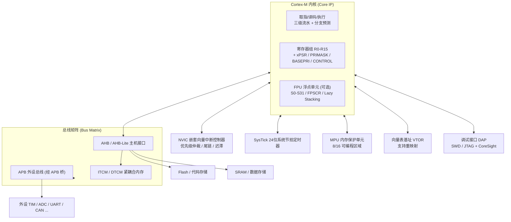

**关键结论**：NVIC 与内核同处一个时钟域、共享同一套流水线控制逻辑，因此异常进入时硬件可直接"冻结"当前指令、切换 PC 到向量表项、并完成自动压栈，整个过程无需总线往返——这是"12 周期中断延迟"的硬件基础。

### 3.2 取指 / 译码 / 执行三级流水

Cortex-M 采用经典三级流水（M7 进一步做双发射/六级流水，但对外语义一致）：

- **取指（Fetch）**：从 I-Cache 或 ITCM 或总线取 16/32 位 Thumb/Thumb-2 指令。取指地址由 PC 给出，PC 始终指向"当前执行指令 + 4"（因为三级流水，PC 读回值比正在执行的指令超前）。
- **译码（Decode）**：解析 opcode，识别是否 16/32 位、是否涉及特权寄存器（如 `MSR/MRS`、`CPS`）、是否 16 位 Thumb-2 扩展。
- **执行（Execute）**：ALU、乘法器、Load/Store 单元工作；Load/Store 经总线接口访问内存；涉及特殊寄存器时直接从内核寄存器堆读写，不经总线。

分支预测（M4/M7 支持）在跳转目标未命中时会产生流水线冒泡，故最关键的 ISR 应放 ITCM 并避免不可预测分支，以稳住 WCET。

### 3.3 NVIC 与异常优先级硬件

NVIC 是 Cortex-M 异常模型的心脏。它管理的异常包括：

- 固定异常：Reset(-3)、NMI(-2)、HardFault(-1)（优先级为负，不可配置、不可屏蔽）；
- 系统异常：MemManage(-12)、BusFault(-11)、UsageFault(-10)、SVC(-11 触发号)、DebugMon(-12)、PendSV(-2 可配置)、SysTick(-1 可配置)；
- 外部中断：IRQ0~IRQn，编号从 0 起，优先级可配。

NVIC 内部每个中断源有一个**优先级寄存器**（8 位字段，芯片实现取其中高位，常见 3~4 位有效），并有一个**使能/挂起/激活**位组。优先级仲裁由硬件组合逻辑在每周期完成：当多个异常挂起时，取编号最小（即软件优先级数值最小）者；同级时按异常号（vector number）自然序裁决。尾链与迟滞（见第五章）是 NVIC 控制器层面的状态优化。

### 3.4 SysTick：系统节拍定时器

SysTick 是一个**24 位倒计数定时器**，属于内核私有外设（地址在 `0xE000_E010` 附近，属 System Control Space）。其关键寄存器：

- `SYST_CSR`：使能、计数到 0 时是否产生异常、时钟源选择（内核时钟或外部参考）；
- `SYST_RVR`：重装载值（24 位）；
- `SYST_CVR`：当前计数值；
- `SYST_CALIB`：校准值（芯片厂商写入，给出 10ms 对应重装载，便于做精确节拍）。

SysTick 是 RTOS 时基与 AUTOSAR OS Counter 的天然来源（见 C 章）。注意：SysTick 异常默认优先级为最低可配置值，**必须显式提升或被 PendSV 机制兜住**，否则高优先级 ISR 会持续饿死调度。

### 3.5 MPU 硬件结构

MPU 内部由一组**区域比较器（Region Comparator）**组成：每次地址发射（取指或数据访问）都并行比对所有区域的基址/大小掩码。命中后的属性（AP/XN/TEX/C/B/S）送入权限检查单元，若违规则产生 MemManage（取指/数据）或 BusFault（随配置）。区域编号越大，硬件比较优先级越高——这正是"大区里挖小洞"的硬件依据（见第七章）。

### 3.6 FPU 与 Lazy Stacking

带 FPU 的 M4/M7，寄存器堆扩展出 `S0-S31` 与 `FPSCR`。异常进入时若立即保存全部浮点寄存器开销巨大，故引入 **Lazy Stacking**（`FPCCR.LSPACT` + `CONTROL.FPCA`）：进入异常时仅标记"浮点上下文待保存"，并不实际压栈；若异常处理链路中**真正用到浮点**，硬件才在那一刻补全保存。这样纯整数 ISR 几乎零浮点开销，显著降低抖动。

### 3.7 总线接口：AHB / APB 与总线矩阵

Cortex-M 内核通过**AHB-Lite 主机接口**挂到芯片的**总线矩阵（Bus Matrix / Interconnect）**。总线矩阵是多主多从的交叉开关，典型连接：

- 内核 ICode/DRAM 接口 → Flash / ITCM / DTCM；
- 内核系统接口 → SRAM、外设；
- DMA 主机、以太网 MAC 等外设主 → 内存；
- APB 桥 → 低速外设（UART/I2C/WDG）。

"总线矩阵"的意义在于让 CPU 与 DMA/其他主设备**并发**访问不同从设备，提升吞吐。但同时也引入**总线仲裁延迟**——普通 SRAM 访问可能因 DMA 占用而等待，这正是"实时任务代码要放 TCM 而非普通 SRAM"的根本原因：TCM 不经总线矩阵，1 周期确定性访问。

### 3.8 向量表基址 VTOR

`VTOR`（System Control Block 中的 `SCB->VTOR`，地址 `0xE000_ED08`）存放向量表首地址。复位后默认 `0x0000_0000`（Boot 引脚决定映射），软件可改写以实现 Bootloader 跳 App、双 Bank 升级。基址必须 **256 字节对齐**（若异常数 > 128，需更大对齐）。务必配合 `DSB; ISB` 后再跳转，否则可能按旧表取指。

### 3.9 调试接口 DAP 与 CoreSight

Cortex-M 内嵌 **DAP（Debug Access Port）**，对外是 SWD（2 线）或 JTAG（5 线）。DAP 经 **AP（Access Port）** 访问：
- **DP（Debug Port）**：与调试器物理通信；
- **APB-AP / AHB-AP**：读改写内核寄存器、内存、外设；
- **CEP（CoreSight）**：ETM/PTM 指令 Trace、DWT 数据观察、ITM 软件Trace。

Lauterbach TRACE32、J-Link、PyOCD 等工具都通过 DAP 工作。车规调试常用 **Debug Authentication** 防止量产后被非法 attach（配合 TrustZone 安全调试）。

### 3.10 关键寄存器映射与位域

下表给出内核私有外设空间（System Control Space，SCS，基址 `0xE000_E000`）中常用模块的首地址；随后用一张**位域图（mermaid）**展示 `SCB->CFSR` 与特殊寄存器位布局。

| 模块 | 基址（相对 SCS） | 主要寄存器 | 用途 |
| --- | --- | --- | --- |
| CPUID | `0xE000_ED00` | `CPUID` | 读取架构/版本/补丁 |
| ICSR | `0xE000_ED04` | `ICSR` | 挂起/清除 PendSV、NMI、查看异常活跃 |
| VTOR | `0xE000_ED08` | `VTOR` | 向量表重映射 |
| AIRCR | `0xE000_ED0C` | `AIRCR` | 优先级分组 PRIGROUP、系统复位 |
| SCR | `0xE000_ED10` | `SCR` | Sleep-On-Exit、深度睡眠 |
| CCR | `0xE000_ED14` | `CCR` | 非对齐陷阱、栈对齐 |
| SHPR1-3 | `0xE000_ED18` | `SHPRx` | 系统异常优先级 |
| SHCSR | `0xE000_ED24` | `SHCSR` | 使能 Mem/Bus/Usage Fault |
| CFSR | `0xE000_ED28` | `CFSR` | 可配置 Fault 状态 |
| HFSR | `0xE000_ED2C` | `HFSR` | HardFault 状态 |
| MMFAR/BFAR | `0xE000_ED34/38` | `MMFAR/BFAR` | 故障地址 |
| MPU | `0xE000_ED90` | `MPU->RBAR/RASR` | 区域配置 |
| NVIC | `0xE000_E100` | `NVIC->ISER/ICPR/IP` | 中断使能/挂起/优先级 |
| SysTick | `0xE000_E010` | `SYST_CSR/RVR/CVR` | 系统节拍 |

**寄存器位域图（mermaid）**——`SCB->CFSR`（32 位，分三段）与特殊寄存器：

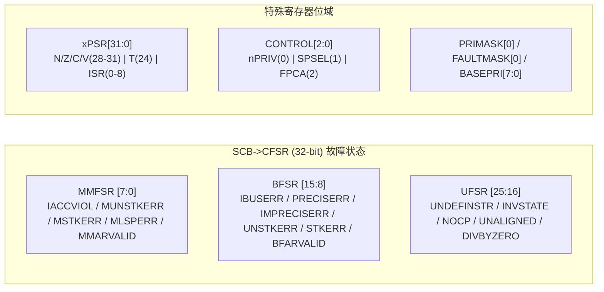

读图要点：
- `CFSR.MMARVALID`/`BFARVALID` 为 1 时，`MMFAR`/`BFAR` 中的地址才有效；
- `xPSR.T` 恒为 1（Thumb），若为 0 则 UsageFault（INVSTATE）；
- `CONTROL.nPRIV=1` 表示 Thread 非特权；`SPSEL=1` 表示用 PSP。

其余关键寄存器如 `CPUID` 位域：
- `[31:24]` Implementer、`[23:20]` Variant、`[19:16]` Architecture（`0xC`=Armv7-M）、`[15:4]` PartNo、`[3:0]` Revision。用途：运行时识别内核型号以选择初始化路径（例如 M0 跳过 MPU 配置）。

### 3.11 复位与时钟域

Cortex-M 的复位分为多级：

- **上电复位（POR）/ 复位脚（nRST）**：整个芯片回到初始态，PC 从 `0x0000_0000` 取 MSP，从 `0x0000_0004` 取 Reset 向量；
- **系统复位（SYSRESETREQ，写 `AIRCR`）**：内核与外设复位，但调试逻辑可保留；
- **核复位（VECTRESET）**：仅内核复位，不复位外设——调试时有用；
- **看门狗复位**：独立看门狗（IWDG）或窗口看门狗（WWDG）触发系统复位。

**时钟域**：内核、总线矩阵、外设通常分属不同时钟（`HCLK`、`PCLK1/2`）。Cortex-M 内核本身由 `HCLK`（经时钟树从 HSE/HSI/PLL 分出）驱动；SysTick 可选内核时钟或外部参考时钟。理解时钟树对"SysTick 精度""Flash 等待周期（LATENCY）"至关重要——若 CPU 频率超过 Flash 访问能力而不配等待周期，取指会出错，表现为**随机 HardFault**，极难查。

### 3.12 内核与总线矩阵 / 外设的协作时序

以"一次 UART 接收中断"为例，端到端协作：

1. UART 外设（挂在 APB）收到字节，置中断请求到 NVIC；
2. NVIC 仲裁：若该 IRQ 优先级高于当前 `PRIMASK/BASEPRI` 阈值且高于当前活跃异常，则触发；
3. 硬件从 `VTOR` 指向的向量表取该 IRQ 的入口（经总线矩阵读 Flash/ITCM）；
4. 自动压栈 `R0-R3,R12,LR,PC,xPSR` 到当前 SP（MSP 或 PSP）；
5. 取指进入 `UART_IRQHandler`，执行用户代码（可能读 DR 清标志）；
6. `BX LR`（EXC_RETURN）触发硬件自动出栈，恢复现场。

这一链条里，**每一次"读向量表""压栈""读外设寄存器"都会穿越总线矩阵**。若此时 DMA 正占用 SRAM 总线，压栈会被推迟——故安全关键中断的栈与向量表应置于 TCM/ITCM，绕开总线争用。

---

## 四、寄存器组：R0–R15、xPSR 与特权控制寄存器

要理解异常进入/退出、上下文切换与特权模型，必须先把寄存器组记牢。Cortex-M 采用 Load/Store 架构，共有 16 个 32 位通用寄存器 R0–R15，外加若干特殊寄存器。

### 4.1 通用寄存器

- **R0–R12**：通用寄存器。其中 R0–R3 在 AAPCS（ARM Architecture Procedure Call Standard）约定中作为函数调用的参数/返回值传递寄存器；R4–R11 通常被编译器用作被调用者保存（callee-saved）寄存器；R12 为内部暂存（IP）。
- **R13（SP，Stack Pointer）**：栈指针。Cortex-M 有两个栈指针——**MSP（主栈指针，Main Stack Pointer）** 与 **PSP（进程栈指针，Process Stack Pointer）**。Handler 模式下只能使用 MSP；Thread 模式下通过 `CONTROL.SPSEL` 选择使用 MSP 还是 PSP。双栈机制是实现 RTOS 多任务隔离的基础：内核/中断用 MSP，用户任务用各自独立的 PSP。
- **R14（LR，Link Register）**：链接寄存器，保存函数返回地址或异常返回信息（EXC_RETURN）。
- **R15（PC，Program Counter）**：程序计数器，当前取指地址。

### 4.2 特殊寄存器

- **xPSR（组合程序状态寄存器）**：由 APSR（应用 PSR，含 N/Z/C/V 条件标志）、IPSR（中断 PSR，记录当前异常号）、EPSR（执行 PSR，含 Thumb 状态位 T 与 IT 指令块状态）三者的位域拼接而成。Cortex 全系强制 Thumb 状态，EPSR 的 T 位恒为 1，试图切到 Arm 状态会触发 Fault。
- **PRIMASK**：置 1 时屏蔽所有可配置优先级的中断（仅 NMI 与 HardFault 不可屏蔽）。常用于临界区保护。
- **FAULTMASK**：置 1 时连 HardFault 也屏蔽，仅 NMI 可响应。极少见，只在必须"无视一切故障"的极端临界段使用。
- **BASEPRI**：设定一个优先级阈值，屏蔽所有**数值上小于等于该阈值（即优先级更低/更不紧急）**的中断，而更高优先级的中断仍可响应。它比 PRIMASK 更精细，是 RTOS 实现优先级天花板协议的关键。
- **CONTROL**：`CONTROL.nPRIV` 决定当前 Thread 模式是否非特权；`CONTROL.SPSEL` 决定 Thread 模式使用 MSP 还是 PSP；在带 FPU 的型号中还有 `CONTROL.FPCA` 指示当前上下文是否含浮点状态。

寄存器组的访问多数通过 `MSR`/`MRS` 指令完成。例如：

```c
/* 读取/修改 PRIMASK 与 BASEPRI，实现临界区 */
__attribute__((always_inline)) static inline void enter_critical(void) {
    __disable_irq();          /* 等价于 CPSID i，置 PRIMASK=1 */
}

__attribute__((always_inline)) static inline void exit_critical(void) {
    __enable_irq();           /* 等价于 CPSIE i，清 PRIMASK=0 */
}

/* 使用 BASEPRI 实现"只屏蔽低优先级"的更精细临界区（以 STM32/NVIC 为例） */
__attribute__((always_inline)) static inline void raise_basepri(uint8_t prio) {
    /* 注意：NVIC 优先级寄存器按 8 - PRIO_BITS 位左移存放 */
    __set_BASEPRI((prio << (8 - __NVIC_PRIO_BITS)) & 0xFF);
}
```

### 4.3 寄存器与异常上下文的关系

当异常发生、硬件自动压栈时，被压入栈的顺序固定为：`R0, R1, R2, R3, R12, LR(R14), PC(R15), xPSR`。这 8 个字构成"栈帧（Stack Frame）"。其中硬件额外压入的 `R11` 之类 callee-saved 寄存器由编译器在中断处理函数序言中按需保存——前提是该函数调用了会破坏 R4–R11 的子程序。

### 4.4 编译屏障与内存屏障：别让优化毁了时序

写底层寄存器时常犯一个隐蔽错误：认为"代码顺序=执行顺序"。但编译器会重排指令，CPU 也可能乱序执行或经写缓冲延迟。三类屏障是底层工程师的护身符：

- **`__DMB`（Data Memory Barrier）**：保证它之后的内存访问不会提前到它之前完成，常用于 DMA 启动前确保数据已写出；
- **`__DSB`（Data Synchronization Barrier）**：等所有显式内存访问完成才往下走，改 VTOR/MPU/SCB 关键寄存器后必须跟一句 `DSB`，否则后续取指可能用到旧配置；
- **`__ISB`（Instruction Synchronization Barrier）**：冲刷流水线，使后续指令用新上下文（如改了 CONTROL/向量表后）重新取指。

一个经典 bug：改完 `SCB->VTOR` 立刻 `__set_MSP` 并跳转，若缺 `DSB/ISB`，CPU 可能仍按旧向量表取指，导致跳错。正确顺序永远是"写关键寄存器 → DSB → ISB → 跳转"。这三类屏障在 Cache 维护、MPU 切换、双核同步里都缺一不可。

---

## 五、工作模式：Thread/Handler 与特权/非特权

Cortex-M 的运行状态由两个正交维度描述：**模式（Mode）** 与 **特权级别（Privilege）**。

### 5.1 模式与特权的交叉矩阵

- **Handler 模式**： CPU 正在执行异常处理程序（包括中断服务程序、SVC、PendSV、Fault 等）。**Handler 模式永远是特权模式**，无法被降级，这是硬件保证的。
- **Thread 模式**： CPU 正在执行普通线程/任务代码。Thread 模式可以是特权，也可以是非特权，由 `CONTROL.nPRIV` 决定。

| 模式 | 可否非特权 | 使用栈指针 | 典型运行内容 |
| --- | --- | --- | --- |
| Handler 模式 | 否（恒特权） | MSP | ISR、SVC/PendSV、Fault 处理 |
| Thread 模式（nPRIV=0） | 否 | MSP 或 PSP | 内核线程、启动早期代码 |
| Thread 模式（nPRIV=1） | 是 | PSP（通常） | 用户应用任务 |

### 5.2 特权切换的硬件机制

特权 → 非特权只能通过"进入 Thread 模式后软件写 `CONTROL.nPRIV=1`"实现，且**一旦降到非特权，就无法仅凭软件自行升回特权**——必须借助一次异常（如 SVC），由 Handler 模式下的内核代码来改写 CONTROL 寄存器完成"提权"。这正是 RTOS 实现系统调用（syscall）的基石：用户任务调用 `SVC` 指令陷入内核，内核校验请求合法性后代为执行特权操作（如切换任务、访问受保护外设）。

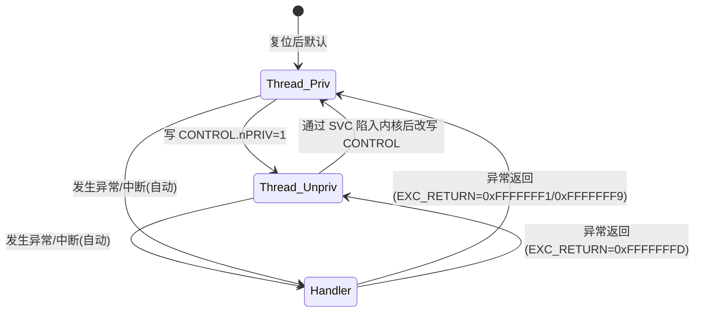

非特权代码若尝试执行受限指令（如 `MSR CONTROL, ...`、`CPSID`）或访问 MPU 禁止/外设保护区，会立即触发 MemManage Fault 或 BusFault。这是"最小权限原则"在嵌入式上的落地——即使应用层被污染（例如缓冲区溢出劫持了 PC），它也碰不到硬件关键资源，攻击面被严格收敛。

### 5.3 非特权任务的系统调用：SVC 实战

把用户任务放到非特权模式后，它就不能直接操作外设寄存器或改 CONTROL。当任务确需内核服务（如读一个受保护的安全传感器、触发一次安全关断），应通过 `SVC` 指令陷入内核。下面是一个最小可用的系统调用框架：

```c
/* 用户任务：请求内核读取受保护 ADC 值 */
#define SVC_READ_SAFE_ADC  0x10
__attribute__((always_inline)) static inline uint32_t syscall_read_adc(void) {
    register uint32_t r0 __asm("r0") = SVC_READ_SAFE_ADC;
    __asm volatile ("svc #0" : "=r"(r0) : "r"(r0));
    return r0;
}

/* SVC Handler：运行于特权 Handler 模式，根据调用号分发 */
void SVC_Handler(void) {
    /* 从栈帧取出调用的 r0（即调用号），校验合法性后以特权身份
       访问安全外设，把结果写回栈帧 r0 位置返回给用户任务 */
}
```

要点：内核必须**校验调用号与参数来源**，绝不允许非特权任务任意指定内核要执行的操作或地址，否则 SVC 本身就成了提权漏洞。这也是为什么 AUTOSAR 的 Trusted/Non-Trusted 分区对系统调用做白名单审计。

---

## 六、中断与 NVIC：优先级分组、尾链与迟滞

Cortex-M 用 **NVIC（嵌套向量中断控制器）** 统一管理异常。它内嵌于内核，与处理器紧耦合，因此中断响应极快（无传统 PIC 的总线往返）。

### 6.1 优先级模型：抢占优先级与子优先级

Cortex-M 的优先级是**数值越小优先级越高**（0 为最高）。NVIC 支持最多 8 位优先级（具体实现位数由芯片决定，常见 3~4 位，如 STM32 用 4 位），并通过 **PRIGROUP（优先级分组）** 把可用的优先级位切分为"抢占优先级（Group）"和"子优先级（Subpriority）"两段：

- **抢占优先级**决定能否打断正在执行的中断；
- **子优先级**仅在两个中断**同时挂起且抢占优先级相同**时决定谁先服务，但子优先级**不能**造成嵌套。

例如 4 位优先级、PRIGROUP=3 时：高 2 位为抢占优先级（4 级），低 2 位为子优先级（4 级）。配置不当是工程中"中断互相打断导致实时性崩坏"的常见根因。

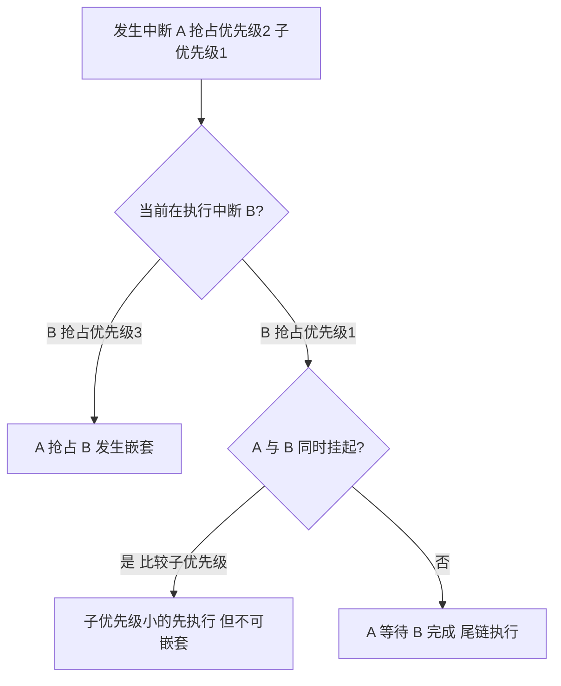

### 6.2 尾链（Tail-Chaining）与迟滞（Late-Arrival）

NVIC 有两个非常精妙的性能优化，理解它们对分析"最坏中断延迟"至关重要：

- **尾链（Tail-Chaining）**：当 CPU 正在退出一个中断、而另一个**已挂起且未被屏蔽**的中断就绪时，CPU 不再执行完整的出栈/入栈（pop 8 字 + push 8 字），而是直接复用当前栈帧跳到新中断，省去约 12 个周期的栈操作开销。结果是背靠背中断的延迟几乎等于一次纯函数调用。
- **迟滞（Late-Arrival）**：当 CPU 刚进入中断 A 的堆栈压入过程中，一个**更高优先级**的中断 B 恰好到来，NVIC 不会丢弃 A，而是让 A 的压栈继续完成，然后立即进入 B（B 复用 A 已压好的栈帧，无需再压）。这避免了"压栈到一半被强行打断"的复杂状态机，保证了硬件状态一致性。

这两个机制合起来，使得 Cortex-M 在高频中断场景下依然能保持极低且**确定**的延迟——对汽车电子的 WCET（最坏执行时间）分析是利好。

### 6.3 PendSV 与 SVC 的经典分工

- **SVC（Supervisor Call）**：由 `SVC` 指令**同步**触发，用于用户任务请求内核服务（系统调用）。因为同步，它的返回点是确定可预测的。
- **PendSV（可挂起的系统服务）**：通过写 `ICSR.PENDSVSET` 置位，但它**不会立即抢占**，而是在所有高优先级中断处理完毕、"没有更高优先级异常在跑"时才被响应。这一特性被所有主流 RTOS（FreeRTOS、RT-Thread、AUTOSAR OS）用来实现**上下文切换**：在 SysTick 或中断中仅置位 PendSV，真正的任务切换延迟到中断尾部统一执行，避免在中途打断中断处理。

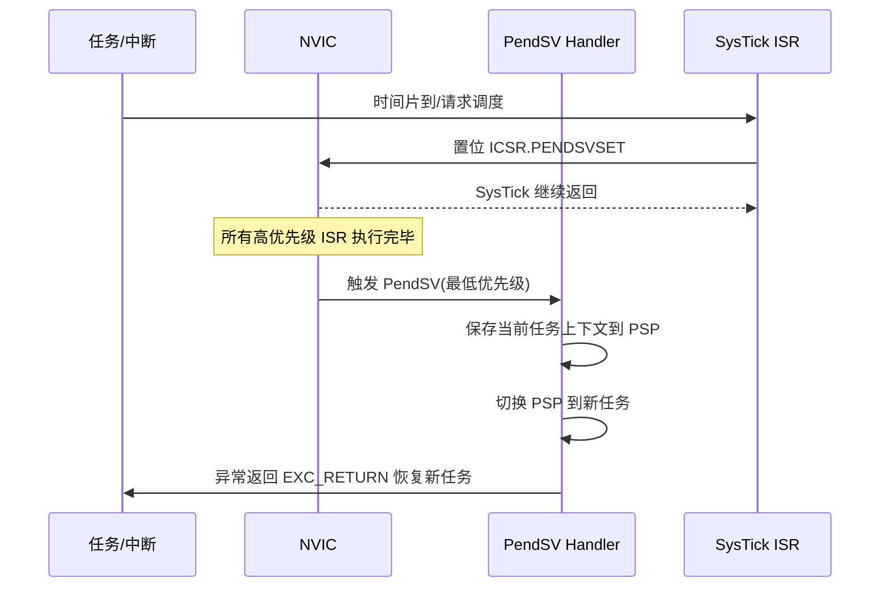

### 6.4 中断延迟与 WCET 实测考量

功能安全对中断响应时间有硬约束。Cortex-M 的**中断延迟**（从中断挂起到第一条 ISR 指令执行）典型为 12 周期（M3/M4），M7 在带 Cache 命中时略高但仍有上限。影响 WCET 的因素包括：

- **尾链/迟滞**使背靠背中断的边际成本极低，但首次进入仍需完整压栈；
- **Cache 未命中**会让取指变慢，故最关键的 ISR 应锁进 ITCM；
- **BASEPRI/PRIMASK** 屏蔽期间的中断会被挂起，必须保证临界区足够短，否则破坏实时性；
- **非特权任务**经 SVC 提权的额外开销也要计入。

在 AUTOSAR 的 Timing Protection 里，通常会用硬件计时器（如 GPT）对最差中断响应做监控，超出预算即触发保护。

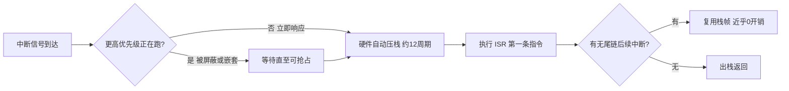

---

## 七、异常模型与 Fault 族：从 HardFault 反推根因

异常（Exception）是 CPU 对同步/异步事件的统称，包含 Reset、NMI、HardFault、MemManage、BusFault、UsageFault、SVC、PendSV、外部中断（IRQ）等。**中断只是异常的一种**，而且是异步、来自外设的那一类；而 SVC 这类是由指令触发的**同步**异常。

### 7.1 Fault 的层级结构

Cortex-M 的 Fault 分为四大类，呈"可配置子 Fault 可上访为 HardFault"的层级：

| Fault 类型 | 触发场景 | 是否可单独使能 | 关键定位寄存器 |
| --- | --- | --- | --- |
| MemManage Fault | MPU 越权、执行不可执行区 | 可（SCB_SHCSR.MEMFAULTENA） | MMFAR、CFSR.MMFSR |
| BusFault | 总线错误（对齐、非法地址、从设备错） | 可（SCB_SHCSR.BUSFAULTENA） | BFAR、CFSR.BFSR |
| UsageFault | 未定义指令、非对齐访问、除零、协处理器缺失 | 可（SCB_SHCSR.USGFAULTENA） | CFSR.UFSR |
| HardFault | 上述 Fault 未使能时上访 / 向量表错误 / 优先级错误 | 恒使能 | HFSR |

注意：**如果对应子 Fault 未使能（默认许多芯片只使能 HardFault），子 Fault 会"上访"为 HardFault**，导致你在 HardFault 里看到的 CFSR 可能为空，必须读 `HFSR.FORCED` 位判断是不是"被迫升级"来的。这是定位 HardFault 的第一把钥匙。

### 7.2 定位 HardFault 的实战流程

底层工程师绕不开 HardFault。当程序跑飞、MPU 越权、非对齐访问发生时，CPU 会进入 HardFault Handler。要反推根因，不能只打印"我进 HardFault 了"，而要抓取故障现场寄存器：

- `HFSR`（HardFault 状态）：区分是 MemManage、BusFault 还是 UsageFault 上访而来（`HFSR.FORCED`）；
- `CFSR`（可配置故障状态，分 MMFSR/BFSR/UFSR 三段）：详细记录是地址对齐错误、执行未定义指令、除零，还是 MPU 权限违规；
- `MMFAR` / `BFAR`：记录触发故障的精确地址（需配合 `CFSR` 中的 `MMARVALID`/`BFARVALID` 位判断有效）；
- `PC` / `LR`（故障发生时的指令地址，位于自动压栈的栈帧内）：配合 map 文件与反汇编可直接定位到函数与行号。

**实战口诀**：先读 `HFSR` 判断故障大类，再看 `CFSR` 细分，最后用 `MMFAR/BFAR` + `PC` 在反汇编里定位。曾有一个非对齐访问 HardFault（在某些架构非对齐读会直接 Fault），就是因为结构体里混排了 `uint8_t` 和 `uint32_t` 导致字段偏移未对齐——用 `__attribute__((aligned))` 或调整字段顺序即可根治。

### 7.3 更深一层的 Fault 细节

几个容易在定位时踩坑的细节：

- **精确（Precise）与非精确（Imprecise）BusFault**：当总线错误发生在指令提交的同时被探测到，BFAR 有效（精确）；但写缓冲（write buffer）导致的错误可能延迟若干周期才上报，此时 `CFSR.IMPRECISERR` 置位而 BFAR 无效，定位难度陡增。调试手段：临时禁写缓冲或加屏障指令（`DSB`）缩小范围。
- **堆栈错误（Stacking Error）**：异常进入压栈时若栈指针非法，会置 `CFSR.STKERR`；出栈错误置 `CFSR.UNSTKERR`。此时栈帧本身可能已损坏，需特别小心回读。
- **INVPC / INVSTATE**：返回地址非 Thumb、或试图在 EPSR.T=0 执行 Arm 指令，会触发 UsageFault，常见于函数指针被踩坏或 EXC_RETURN 被篡改。
- **Fault 升级（Escalation）**：当正在处理某 Fault 时又发生更高严重级别的 Fault，会升级到 HardFault；若 HardFault 中再 Fault，则进入 Lockup（系统锁死，需复位）。这正是"HardFault 里死循环"为何危险——它把可恢复故障变成不可恢复的 Lockup。

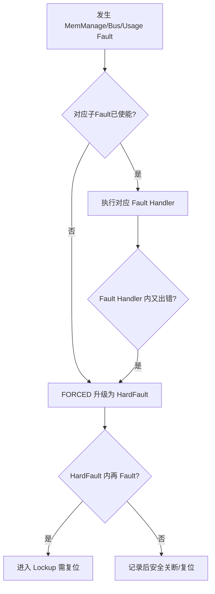

### 7.4 使能全部子 Fault 以便定位

```c
/* 使能全部子 Fault 以便精确定位（系统初始化时调用一次） */
void enable_faults(void) {
    SCB->SHCSR |= SCB_SHCSR_MEMFAULTENA_Msk
                | SCB_SHCSR_BUSFAULTENA_Msk
                | SCB_SHCSR_USGFAULTENA_Msk;
}
```

---

## 八、MPU 内存保护：区域、权限与免于干扰

在**单核无 MMU** 的车规 MCU 上，MPU 是实现"空间隔离"的核心手段。MPU（Memory Protection Unit）把内存划分为若干**区域（Region）**，每个区域可独立设置：

- **基址与大小**（大小必须是 2 的幂，且 ≥ 32 字节，基址需对齐到区域大小）；
- **访问权限 AP（Access Permission）**：如特权只读、全访问、无访问等；
- **执行权限 XN（Execute Never）**：禁止在该区取指，防代码注入；
- **内存属性 TEX/C/B/S**：决定 Cacheable、Bufferable、Shareable，进而决定是否与 DMA 一致；
- **子区域禁用（Subregion Disable）**：把 8 等分中的某些子块关掉，实现更灵活的边界。

### 8.1 MPU 与功能安全（FFI）

把 ASIL 安全任务内存与 QM（非安全）任务内存分开，是达成 **Freedom From Interference（FFI，免于干扰）** 的标准做法。典型配置原则：

- 代码段：`RX`（只读可执行）、Cacheable；
- 常量区（rodata）：`RO`、Cacheable；
- 数据/BSS/堆：`RW`、`non-shareable`、Cacheable；
- 与外设/DMA 共享的 buffer：`non-cacheable` 或 `write-through`，避免一致性问题；
- 外设寄存器区：`Device` 属性（强序、非缓存、不可执行）；
- 任务栈区：标记 `RW` 且最好 `XN`，并利用栈溢出检测（如给栈底划一块无访问区，越界即 Fault）。

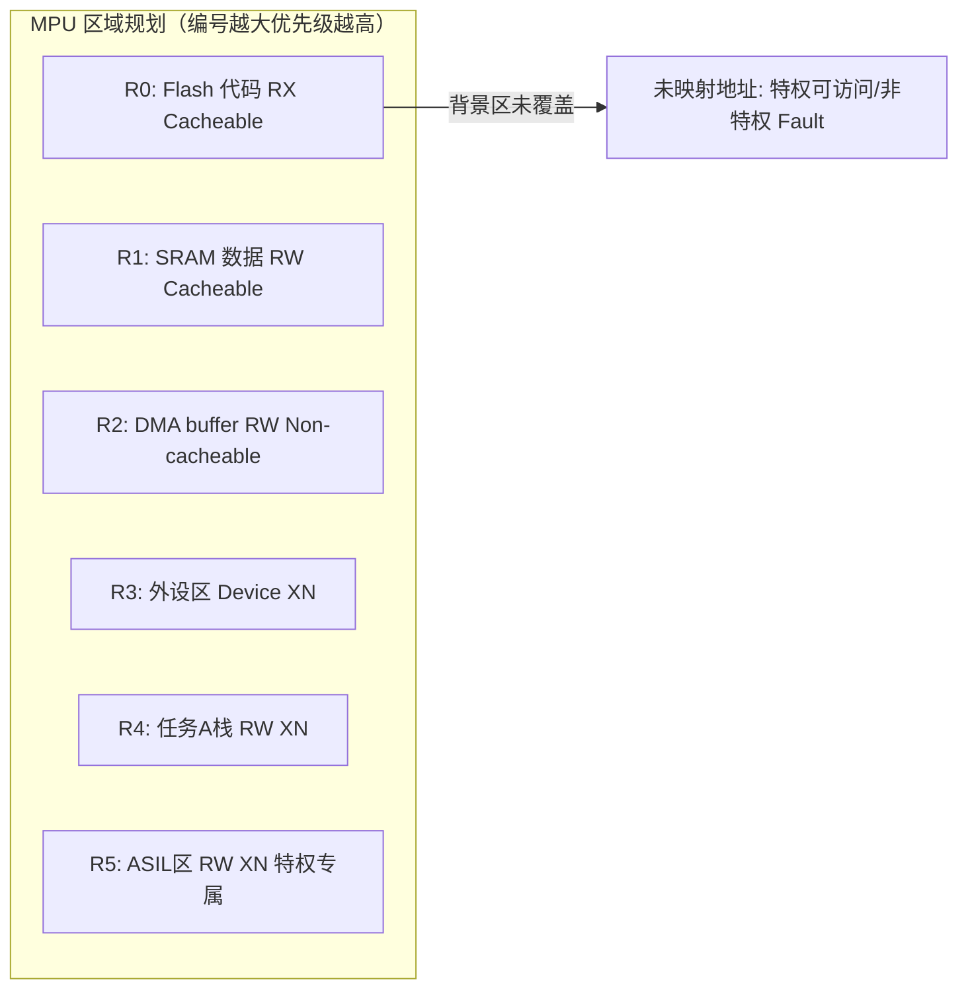

### 8.2 MPU 配置的坑

1. **区域大小与对齐**：大小必须是 2 的幂且 ≥32 字节，基址按大小对齐，否则写 RASR 时硬件可能忽略或行为未定义。
2. **默认背景区**：使能 MPU 后，未覆盖的地址默认**不可访问**（取决于 `MPU_CTRL.PRIVDEFENA`）。若忘了给栈/堆留背景区，开机即 HardFault。
3. **XN 误设**：把代码区误标 XN，或把本应可执行的 Flash 区设成不可执行，立即 Fault。
4. **与 Cache 属性冲突**：Device 区必须 `non-cacheable`，否则 Strongly-ordered 访问被缓存会破坏外设语义。

### 8.3 MPU 区域数量与重叠优先级

Cortex-M 的 MPU 通常支持 **8 个可编程区域**（部分实现 16 个），每个区域最小 32 字节。关键规则：

- **编号越大的区域优先级越高**：当地址落在多个区域重叠区间时，以编号最大的区域属性为准。利用这一点可"在大数据区里挖一个小洞"做差异化保护（如给某任务栈单独设 XN）。
- **背景区（Background Region）**：由 `MPU_CTRL.PRIVDEFENA` 控制；使能时，未匹配任何区域的地址在**特权模式**下按默认（通常普通内存、可访问）处理，非特权仍不可访问。若未使能背景区，任何未覆盖地址访问都 Fault——这是开机即崩的常见原因。
- **子区域（Subregion）**：每个区域按 8 等分，可用 SDR 位图关掉某些子块，从而把不规整大小的内存拼成受保护区，但子区域粒度=区域大小/8，灵活性有限。

在工程里，笔者习惯把 MPU 配置做成"白名单"：先整体设背景区为不可访问，再逐个放开代码/数据/外设/DMA 区，这样任何野指针访问都会立刻 Fault 而非悄悄破坏邻区，符合纵深防御原则。

---

## 九、Cache：写通/写回与一致性陷阱

只有带 Cache 的型号（Cortex-M7、Cortex-R 全系、Cortex-M55 等）才需要关注 Cache 一致性。Cache 缓解 CPU 与内存的速度差，但在 DMA、多主设备（如 GPU、其他核）共享内存时，会引入"CPU 看到旧值、外设看到旧值"的**一致性陷阱**。

### 9.1 写策略：Write-Through 与 Write-Back

- **Write-Through（写穿透）**：写操作同时更新 Cache 与下一级内存。实现简单、一致性天然较好，但每次写都走总线，带宽开销大、性能偏低。
- **Write-Back（写回）**：写仅更新 Cache，仅在 Cache 行被替换（evict）时才把脏行回写内存。性能高，但内存里的数据可能是"过期"的，必须由软件主动维护一致性。

### 9.2 Cache 与 DMA 的一致性操作

在汽车电子里，以太网/摄像头/CAN-FD 的接收 buffer 几乎都走 DMA。标准的维护操作是：

- **CPU 写、DMA 读**（如发包）：在启动 DMA 前，对 buffer 执行 **Clean/Flush**（把 Cache 中脏行写回内存）；
- **DMA 写、CPU 读**（如收包）：在 CPU 读取前，对 buffer 执行 **Invalidate**（丢弃 Cache 中的旧副本，强制从内存重新取）。

注意 **Invalidate 的"脏数据丢失"风险**：若 Invalidate 区间覆盖了一块 CPU 刚写但还在 Cache 里未回写的脏行，Invalidate 会直接丢弃它，造成数据丢失。正确做法是先 Clean 再 Invalidate，或者用按 Cache 行对齐的 buffer，避免"部分脏行被误 invalidate"。

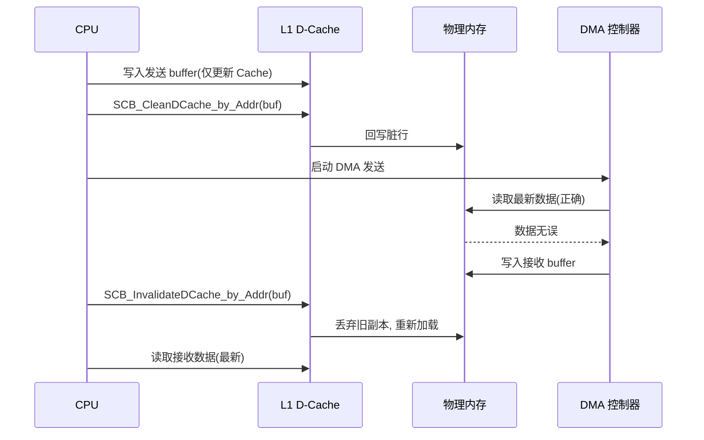

### 9.3 更彻底的解法

把"与外设/DMA 共享"的内存通过 MPU 标记为 `non-cacheable`，从根源上规避一致性维护。代价是该 buffer 失去 Cache 加速——所以工程上常把"协议栈大 buffer"设 non-cacheable，把"算法热点数据"设 cacheable，二者隔离、各取所需。

### 9.4 Cache 寄存器级操作与 Write-Allocate

Cortex-M7 的 Cache 通过 `SCB` 的一系列寄存器维护：`CCSIDR`（Cache 大小 ID）、`CSSELR`（选择指令/数据 Cache 与级别）、`DCIMVAC`（按地址失效）、`DCCMVAC`（按地址清）、`DCCIMVAC`（清并失效）、`ICIMVAU`（指令 Cache 失效到 PoU）。一个易错点是**操作必须按 Cache 行大小对齐**（M7 通常为 32 字节），否则 `DCIMVAC` 会连带失效相邻行，可能误伤脏数据。

**Write-Allocate（写分配）**是 Write-Back 的一个变体：写未命中时会先把整行读入 Cache 再写，提升后续局部写性能，但也意味着一次"写"可能触发一次"读"的总线事务——在对强序外设区这是灾难，所以外设区务必 non-cacheable。

```c
/* 按 Cache 行(32字节)对齐 Clean+Invalidate 一段 buffer (Cortex-M7) */
#define CACHE_LINE 32u
void cache_clean_inv(uint32_t addr, uint32_t size) {
    uint32_t end = addr + size;
    addr &= ~(CACHE_LINE - 1u);
    for (; addr < end; addr += CACHE_LINE) {
        __DSB();
        SCB->DCCIMVAC = addr;   /* Clean & Invalidate by MVA */
    }
    __DSB();
    __ISB();
}
```

### 9.5 DMA 与 Cache 实战排错清单

面对"偶发脏数据"，笔者按以下顺序排查：

1. 先用逻辑分析仪在总线上抓 DMA 真实写入值，与 CPU 读到值对比，不一致即一致性问题；
2. 临时把 DMA buffer 标 non-cacheable（改 MPU）验证，若现象消失则确认；
3. 检查 buffer 是否按 Cache 行对齐，未对齐的 `Invalidate` 可能误丢相邻脏行；
4. 确认 CPU 写后是否 Clean、DMA 写后是否 Invalidate，特别是分段（scatter-gather）DMA 每帧都要维护；
5. 若用 Write-Back + Write-Allocate，外设区务必 non-cacheable，避免强序访问被缓存。

这一清单在以太网 AVB、摄像头桥接、CAN-FD 大包接收中都反复验证有效。

---

## 十、TrustZone（Cortex-M23/M33）：安全/非安全世界隔离

Armv8-M 引入的 **TrustZone for Cortex-M** 在单核上划分出**安全世界（Secure）**与**非安全世界（Non-Secure）**两个执行环境，各自有独立的栈、向量表与内存视图。

- 内存与外设通过 **SAU（Security Attribution Unit）** 与 **IDAU（Implementation Defined Attribution Unit）** 被静态划分为 Secure / Non-Secure / Non-Secure Callable（NSC，用于安全入口）。
- 非安全代码只能通过 NSC 区的 **SG（Secure Gateway）指令** 进入安全世界，调用经安全审计的 API，不能直接访问安全资源。这天然实现了"即使应用层被攻破，密钥、安全启动校验逻辑仍受硬件保护"。
- 安全世界可配置 `AIRCR.SYSRESETREQ` 等行为，并可选择性地屏蔽非安全中断（通过 `NVIC_ITNS` 寄存器）。

TrustZone 与 MPU 是互补的：MPU 做"地址区间权限"，TrustZone 做"世界隔离 + 入口管控"。在需要 SESIP/PSA Certified 安全认证的车载网关、T-Box 中，TrustZone 是标配。

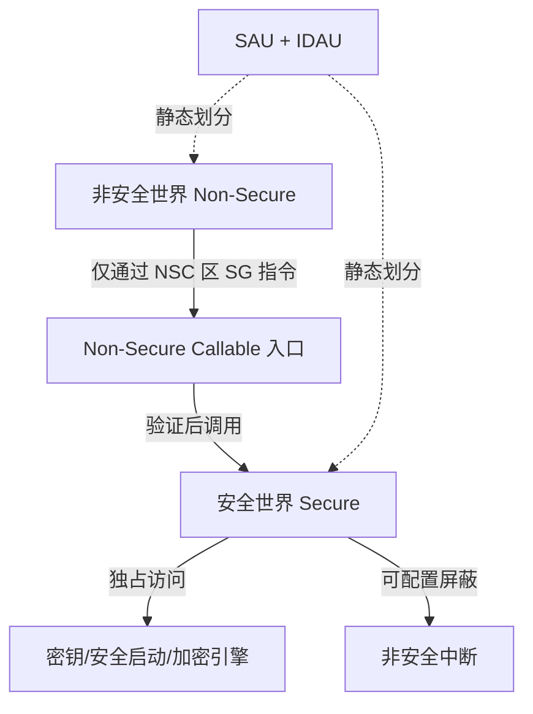

需要说明：Cortex-R52 在 Armv8-R 下也有类似的虚拟化/安全扩展（如通过 MPU+Exception 级别），但机制与 M 的 TrustZone 不同，这里不展开以免混淆。

### 10.1 安全启动与 TrustZone 的联动

在 STM32L5/U5 等带 TrustZone-M 的芯片上，还有 **GTZC（全局安全控制器）** 把安全属性延伸到外设与内存块（如把某块 SRAM、某个 GPIO 组划为安全专属）。安全启动（Secure Boot）在复位早期运行于安全世界，校验非安全固件签名后才放行，非安全世界即使被攻破也无法篡改安全校验逻辑或密钥——这是 PSA Certified Level 2/3 的核心要求。

### 10.2 Cortex-R 的中断与隔离机制对照

与 M 系列的 NVIC 不同，Cortex-R 系列使用 **VIC（Vector Interrupt Controller）** 或 **GIC（Generic Interrupt Controller，Armv8-R）**，并保留传统 ARM 的 **IRQ/FIQ 双线**模型。FIQ（Fast Interrupt）通过把向量表放在地址 `0x0000_001C`、屏蔽更少寄存器、且可配为"非向量化快速路径"，实现亚微秒级响应，适合电机换相这类极硬实时。R52 还支持 **MPU + 虚拟化异常级别（EL1/EL2）** 与可选的锁步，使单芯片既能跑 ASIL D 控制、又能跑 QM 信息娱乐，二者经 MPU 与总线防火墙隔离。

---

## 十一、启动流程：向量表、VTOR、复位向量与分散加载

芯片上电后，CPU 从地址 `0x0000_0000`（或由 VTOR 映射的地址）取指。向量表的第一项是 **MSP（主栈指针）初始值**，第二项是 **Reset_Handler** 的地址。整个启动流程如下：

1. 硬件从向量表第 0 项取 MSP 初始值，建立 C 运行环境的最基本栈；
2. 从向量表第 1 项取 Reset_Handler 地址并跳转；
3. 在 Reset_Handler 中拷贝 `.data`（已初始化的全局变量）从 Flash 到 RAM，清零 `.bss`（未初始化的全局变量）；
4. 调用 `SystemInit()` 配置时钟、PLL、看门狗、VTOR 等；
5. 进入 C 库 `__main`（或等效的 `entry`），完成 C++ 构造、堆初始化等，最终调用用户 `main()`。

### 11.1 向量表偏移寄存器 VTOR

**VTOR（Vector Table Offset Register）** 能把向量表重映射到 SRAM 或 Flash 的任意对齐地址，这是 Bootloader 跳 App、双 Bank 升级的基础。VTOR 要求向量表基址对齐到 `2^8`（256 字节，或更高，取决于异常数量）边界。在前面提到的产线故障里，如果我们把 App 的向量表通过 VTOR 重映射到带 ECC 的 TCM 区域，单 bit 翻转就会被自动纠正——这正是功能安全"防御纵深"的体现。

```c
/* 典型的启动片段：重映射向量表并跳转 App（Cortex-M） */
typedef void (*AppEntry_t)(void);
#define APP_VECTOR_ADDR  0x08010000u

__disable_irq();
__set_PRIMASK(1);

/* 1. 设置 VTOR 指向 App 向量表（基址须 256 字节对齐） */
SCB->VTOR = APP_VECTOR_ADDR;

/* 2. 取出 App 的 MSP 与 Reset 入口 */
uint32_t *app_vec = (uint32_t *)APP_VECTOR_ADDR;
uint32_t msp_val = app_vec[0];
uint32_t reset   = app_vec[1];

/* 3. 切换栈并跳转（需确保 App 已关闭自身中断或重新配置 NVIC） */
__set_MSP(msp_val);
AppEntry_t entry = (AppEntry_t)reset;
entry();                 /* 永不返回 */
```

### 11.2 分散加载（Scatter Loading）

在 Keil（Arm Compiler）中通过 **分散加载描述文件（.scf）**，在 GCC 中通过 **链接脚本（.ld）**，把代码/数据精确分配到 Flash、SRAM、TCM、外设等不同属性的内存区域。例如把中断向量表与最热 ISR 放进 ITCM，把高频数据放进 DTCM，把 DMA buffer 放进 non-cacheable SRAM。这既是性能优化，也是安全隔离的物理基础。

### 11.3 分散加载/链接脚本实例

以 GCC 链接脚本为例，把向量表、ITCM 热路径、DTCM 数据、DMA non-cacheable 区分别落位：

```ld
MEMORY {
  FLASH   (rx)      : ORIGIN = 0x08000000, LENGTH = 1M
  DTCM    (rwx)     : ORIGIN = 0x20000000, LENGTH = 64K
  SRAM_NC (rwx)     : ORIGIN = 0x24000000, LENGTH = 256K  /* 供 DMA, non-cacheable */
}
SECTIONS {
  .isr_vector : { . = ALIGN(256); KEEP(*(.isr_vector)) } > FLASH
  .text_itcm  : { *(.text_fast) } > DTCM AT > FLASH  /* 启动时需拷贝到 ITCM */
  .data       : { *(.data) } > DTCM AT > FLASH
  .dma_buf    (NOLOAD) : { *(.dma_buf) } > SRAM_NC
}
```

注意 `AT > FLASH` 表示加载地址在 Flash、运行地址在 TCM/SRAM，启动代码须把 `.text_itcm`/`.data` 从 Flash 拷贝到运行区——这正是 `Reset_Handler` 里拷贝 `.data` 逻辑的泛化。把向量表 `ALIGN(256)` 也对应了 VTOR 的对齐要求。

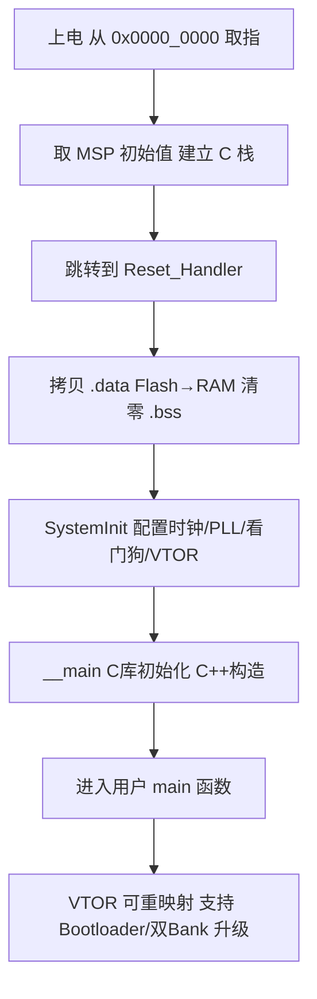

---

## 十二、上下文切换的硬件机制：自动压栈与手动压栈

任务切换（上下文切换）是 RTOS 的核心，也是考验对 Cortex 异常模型理解深度的地方。Cortex-M 的上下文切换恰好建立在异常机制之上。

### 12.1 硬件自动压栈/出栈

异常进入时，硬件**自动**把 `R0–R3, R12, LR, PC, xPSR` 这 8 个字压入**当前栈指针（MSP 或 PSP）**指向的栈；异常返回时硬件**自动**弹出并恢复。整个过程不消耗任何指令周期之外的软件干预，且对应用透明。

### 12.2 软件手动保存的部分

剩下的 `R4–R11`（以及有 FPU 时的 `S16–S31` 等浮点寄存器）由**编译器生成的函数序言/尾声**在 PendSV 处理函数里保存/恢复——因为切换的是"任务上下文"，而 PendSV 本身用 PSP 找到被切换任务的栈，把旧任务的 R4–R11 压到它的栈上，再从新任务的栈恢复其 R4–R11，最后修改 PSP 指向新任务栈，执行 `BX LR`（带 EXC_RETURN）触发硬件自动出栈，新任务便"无缝"继续。

### 12.3 浮点上下文的开销

在带 FPU 的 Cortex-M4/M7 上，若使能 Lazy Stacking（`FPCCR.LSPACT`），硬件会"懒"地延迟保存 S0–S15、FPSCR，直到真正用到浮点才压栈，避免每个中断都付出浮点保存代价。这对电机控制这类大量浮点运算的实时任务，是降低中断抖动的关键开关。

### 12.4 低功耗与中断的交互：Sleep-On-Exit

对于"事件驱动、平时休眠"的车载节点（如 TPMS 接收、车门低频轮询），Cortex-M 提供 `SCR.SLEEPONEXIT` 位：置位后，CPU 在**退出最后一个异常处理时**不返回 Thread 模式执行，而是直接进入 WFI（Wait For Interrupt）低功耗休眠，等下一次中断再来才唤醒。配合 `WFI`/`WFE` 指令，可在不跑任何应用代码的情况下把平均电流压到微安级。

但要注意：若唤醒中断触发了 PendSV 且 Sleep-On-Exit 同时置位，可能出现"刚睡下又被自己调度唤醒"的乒乓，需在进入低功耗前妥善清理挂起位。这也是为什么 RTOS 的 tickless idle 实现要对 SCR 与 NVIC 挂起位做精确仲裁。

---

## 十三、B 章 · 驱动代码实现（工业级可直接落地）

这一章把前面所有机制落成**真实可读、可在项目中复用的 C/汇编**。覆盖：启动文件、NVIC 优先级分组、MPU 区域配置、SVC/PendSV 上下文切换、HardFault 回溯解析。所有代码以 Cortex-M（CMSIS 寄存器命名）为基准，配合真实工具链（GCC/Keil/IAR 通用）。

### 13.1 启动文件片段（汇编 + C 拷贝）

下面是通用 Cortex-M 启动文件的核心骨架：栈顶符号、向量表、复位处理中完成 `.data` 拷贝与 `.bss` 清零。注意向量表第 0 项是 `Image$$ARM_LIB_STACK` 或 `_estack`（栈顶），第 1 项是 `Reset_Handler`。

```asm
    .section .isr_vector, "a"
    .word   _estack                 /* 向量表[0]: 主栈指针 MSP 初始值 */
    .word   Reset_Handler           /* 向量表[1]: 复位入口 */
    .word   NMI_Handler
    .word   HardFault_Handler
    .word   MemManage_Handler
    .word   BusFault_Handler
    .word   UsageFault_Handler
    .word   0                       /* 保留 */
    .word   0
    .word   0
    .word   0
    .word   SVC_Handler
    .word   DebugMon_Handler
    .word   0
    .word   PendSV_Handler
    .word   SysTick_Handler
    /* 其后是外部中断 IRQ0..IRQn */

    .text
    .global Reset_Handler
    .type   Reset_Handler, %function
Reset_Handler:
    /* 拷贝 .data: 从 Flash 加载区到 RAM 运行区 */
    ldr   r0, =_sidata             /* Flash 中 .data 起始 */
    ldr   r1, =_sdata              /* RAM 中 .data 起始 */
    ldr   r2, =_edata
1:  cmp   r1, r2
    bge   2f
    ldr   r3, [r0], #4
    str   r3, [r1], #4
    b     1b
2:  /* 清零 .bss */
    ldr   r0, =_sbss
    ldr   r1, =_ebss
    movs  r2, #0
3:  cmp   r0, r1
    bge   4f
    str   r2, [r0], #4
    b     3b
4:  /* 可选: 把向量表搬到 DTCM 并设 VTOR */
    bl    SystemInit
    bl    __libc_init_array       /* C++ 构造等 */
    bl    main
    b     .                        /* main 返回则停机 */
```

要点：`_estack/_sidata/_sdata/_edata/_sbss/_ebss` 由链接脚本提供；栈顶必须 8 字节对齐（AAPCS 要求），否则进入第一个函数即可能 HardFault（栈对齐违例）。

### 13.2 NVIC 优先级分组与中断配置

优先级分组在 `AIRCR.PRIGROUP` 设定，决定"抢占/子优先级"的切分点。下面以 4 位优先级（STM32/S32K 常见）为例，把 4 位全作抢占优先级（无子优先级，最清晰、最常见于车规实时系统），并配置一个外部中断。

```c
#include <stdint.h>

/* AIRCR 写需高半字密钥 0x05FA，否则写被忽略（防误写） */
#define AIRCR_VECTKEY_Pos  16u
#define AIRCR_PRIGROUP_Pos  8u

/* 设置优先级分组: group_bits=3 表示 4 位全部为抢占优先级 */
static void nvic_set_priority_grouping(uint32_t group_bits) {
    uint32_t aircr = SCB->AIRCR;
    aircr &= ~(((uint32_t)0x7) << AIRCR_PRIGROUP_Pos);   /* 清 PRIGROUP */
    aircr |=  (group_bits & 0x7u) << AIRCR_PRIGROUP_Pos;
    aircr &= ~((uint32_t)0xFFFFu);                       /* 仅保留控制位 */
    aircr |=  (0x05FAu << AIRCR_VECTKEY_Pos);            /* 写密钥 */
    SCB->AIRCR = aircr;
    __DSB();                                             /* 确保生效 */
    __ISB();
}

/* 配置某个外部中断: 抢占优先级 prio, 并使能 */
static void nvic_config_irq(IRQn_Type irq, uint32_t prio) {
    /* NVIC->IP[irq] 仅高 (8-PRIO_BITS) 位有效, 这里 4 位全用 */
    NVIC_SetPriority(irq, prio);        /* CMSIS 标准接口 */
    NVIC_EnableIRQ(irq);                /* 置 ISER 对应位 */
    __DSB();
}

/* 系统初始化时调用 */
void board_nvic_init(void) {
    nvic_set_priority_grouping(3u);     /* 4 位全抢占, 无子优先级 */
    nvic_config_irq(ADC1_2_IRQn, 1u);   /* 高优先级: 采样 */
    nvic_config_irq(CAN1_RX0_IRQn, 2u); /* 通信 */
    nvic_config_irq(SysTick_IRQn, 15u); /* 最低: 调度时基 */
}
```

注意：`AIRCR` 写必须带 `0x05FA` 密钥，且写后会立即改变分组，**必须在所有中断使能前、系统初始化早期设定一次**，否则运行中改分组会让既有优先级语义混乱。

### 13.3 MPU 区域配置（完整多区域示例）

下面给出以 CMSIS `MPU_Type` 寄存器直接编程的完整示例，划分代码/数据/外设/DMA/任务栈五个区域，采用"白名单"策略。

```c
#include <stdint.h>

/* MPU 区域编号 (编号越大硬件优先级越高) */
#define RGN_CODE   0u
#define RGN_DATA   1u
#define RGN_DMA    2u
#define RGN_PERIPH 3u
#define RGN_STACK  4u

/* 属性宏: TEX/C/B/S 组合 */
#define MPU_ATTR_FLASH   0x02u   /* Normal, Cacheable, Write-Through 示意 */
#define MPU_ATTR_SRAM    0x03u   /* Normal, Cacheable, Write-Back */
#define MPU_ATTR_NOCACHE 0x00u   /* Normal, non-cacheable */
#define MPU_ATTR_DEVICE  0x10u   /* Device, strongly-ordered */

static inline void mpu_set_region(uint8_t idx, uint32_t base, uint32_t size_log2,
                                  uint32_t ap, uint32_t attr, uint32_t xn) {
    MPU->RBAR = (base & MPU_RBAR_ADDR_Msk)
              | MPU_RBAR_VALID_Msk
              | (idx & MPU_RBAR_REGION_Msk);
    /* RASR: 区域大小 = 2^(SIZE+1) 字节; AP=访问权限; XN=禁执行 */
    MPU->RASR = ((ap & 0x7u)  << MPU_RASR_AP_Pos)
              | ((attr & 0x3Fu) << MPU_RASR_TEX_Pos)  /* 含 TEX/C/B/S */
              | (1u << MPU_RASR_C_Pos)                 /* Cacheable 位 */
              | (xn ? (1u << MPU_RASR_XN_Pos) : 0u)
              | (((size_log2 - 1u) & 0x1Fu) << MPU_RASR_SIZE_Pos)
              | MPU_RASR_ENABLE_Msk;
}

void board_mpu_init(void) {
    MPU->CTRL = 0;                              /* 先禁用 MPU 再配置 */
    __DSB(); __ISB();

    /* R0: Flash 代码区, 特权/用户均可执行, Cacheable */
    mpu_set_region(RGN_CODE,  0x08000000u, 20u /*1MB*/, 0x3u /*RW*/, MPU_ATTR_FLASH, 0);
    /* R1: SRAM 数据区, 可读写, 可执行关 */
    mpu_set_region(RGN_DATA,  0x20000000u, 16u /*64KB*/, 0x3u, MPU_ATTR_SRAM, 1);
    /* R2: DMA buffer (non-cacheable), 防一致性问题 */
    mpu_set_region(RGN_DMA,   0x24000000u, 18u /*256KB*/, 0x3u, MPU_ATTR_NOCACHE, 1);
    /* R3: 外设区, Device, 不可执行, 特权专属读写 */
    mpu_set_region(RGN_PERIPH,0x40000000u, 24u /*16MB*/, 0x1u /*特权RW*/, MPU_ATTR_DEVICE, 1);
    /* R4: 当前任务栈, 可读写, 禁执行 (编号最大, 覆盖数据区局部) */
    mpu_set_region(RGN_STACK, 0x20008000u, 12u /*4KB*/, 0x3u, MPU_ATTR_SRAM, 1);

    /* 使能 MPU, 并开启特权背景区 (未映射地址特权可访问) */
    MPU->CTRL = MPU_CTRL_ENABLE_Msk | MPU_CTRL_PRIVDEFENA_Msk;
    __DSB(); __ISB();
}
```

关键约束回顾：区域大小 = `2^(SIZE+1)` 且 ≥32 字节；基址按大小对齐；`PRIVDEFENA` 决定是否给未映射地址开特权背景访问；R4 编号最大，故对 `0x20008000` 这段栈的"禁执行 + 读写"覆盖 R1 的"可执行"属性，实现栈 anti-execution。

### 13.4 SVC / PendSV 汇编上下文切换骨架

这是 RTOS 调度的核心。PendSV 以最低优先级运行，在 SysTick/中断尾部统一切换任务；SVC 用于用户任务主动让权或请求服务。下面给出 PendSV 上下文切换的**完整可读骨架**（带 FPU 判断）。

```asm
    .thumb
    .global PendSV_Handler
    .type   PendSV_Handler, %function
PendSV_Handler:
    CPSID   I                       /* 关中断, 保护切换临界区 */
    MRS     R0, PSP                 /* 取当前任务栈指针(Thread 用 PSP) */
    CBZ     R0, first_switch        /* 首次切换时 PSP 可能为空 */

    /* 判断是否需要保存浮点上下文 (CONTROL.FPCA) */
    TST     LR, #0x10               /* EXC_RETURN 的 bit4=0 表示用了 FPU */
    IT      EQ
    VSTMDBEQ R0!, {S16-S31}         /* 懒加载: 保存高编号浮点 */

    STMDB   R0!, {R4-R11}           /* 手动保存整点 callee-saved */
    LDR     R1, =pxCurrentTCB
    LDR     R2, [R1]
    STR     R0, [R2]                /* 保存旧任务 SP 到 TCB.SpTop */

first_switch:
    LDR     R1, =pxCurrentTCB
    LDR     R2, =pxNextTCB
    LDR     R3, [R2]
    STR     R3, [R1]                /* 当前 TCB 指向新任务 */
    LDR     R0, [R3]                /* 取新任务 SP */

    LDMFD   R0!, {R4-R11}           /* 恢复整点 callee-saved */
    TST     LR, #0x10
    IT      EQ
    VLDMEQ  R0!, {S16-S31}          /* 恢复浮点(若曾保存) */

    MSR     PSP, R0                 /* 切换到新任务栈 */
    CPSIE   I
    BX      LR                      /* 异常返回: 硬件自动恢复 R0-R3/R12/LR/PC/xPSR */

/* SVC 用于主动让权/系统调用; 内核在 SVC_Handler 里解析调用号 */
    .global SVC_Handler
SVC_Handler:
    MRS     R0, PSP
    LDR     R1, [R0, #24]           /* 栈帧中的 PC(返回地址) */
    LDRB    R1, [R1, #-2]           /* 取 SVC 指令的立即数(调用号) */
    /* 此处根据 R1 调用内核服务分发 ... */
    BX      LR
```

要点：`EXC_RETURN` 的 bit4（`0x10`）指示是否使用了 FPU 上下文；保存顺序必须与后续恢复严格对称；切换临界区用 `CPSID I` 关闭可配置中断，但**不可关闭 NMI/HardFault**（不能写 FAULTMASK 于此）；TCB 结构由 RTOS 定义，至少含 `SpTop` 字段。

### 13.5 HardFault 回溯：读取 SCB->HFSR/CFSR/MMFAR/BFAR 定位错误类型

下面给出**生产可用**的 HardFault 诊断例程：从栈帧提取 PC/LR，读取并解析 CFSR 各子段，输出可读错误类别，并把"黑匣子"写入保留 RAM（配合链接脚本预留区）。

```c
#include <stdint.h>
#include <string.h>

typedef struct {
    uint32_t r0, r1, r2, r3, r12, lr, pc, xpsr;
} ExcFrame_t;

/* 保留 RAM 黑匣子 (链接脚本划出, 正常不占用) */
#define BLACKBOX_ADDR  0x2007F000u
typedef struct {
    uint32_t hfsr, cfsr, mmfar, bfar;
    uint32_t lr, pc, psr;
    char     reason[32];
} BlackBox_t;

/* 解析 CFSR 的 MMFSR/BFSR/UFSR, 返回可读原因串 */
static const char *decode_cfsr(uint32_t cfsr, char *buf) {
    uint8_t mmfsr = (cfsr & 0xFFu);
    uint8_t bfsr  = (cfsr >> 8) & 0xFFu;
    uint16_t ufsr = (cfsr >> 16) & 0xFFFFu;
    if (mmfsr & (1u << 0)) return "MemManage: 取指访问违例(IACCVIOL)";
    if (mmfsr & (1u << 3)) return "MemManage: 入栈错误(MSTKERR)";
    if (mmfsr & (1u << 4)) return "MemManage: 出栈错误(MUNSTKERR)";
    if (bfsr & (1u << 1))   return "BusFault: 精确数据访问错(PRECISERR)";
    if (bfsr & (1u << 2))   return "BusFault: 非精确错误(IMPRECISERR)";
    if (bfsr & (1u << 4))   return "BusFault: 入栈错误(STKERR)";
    if (ufsr & (1u << 0))   return "UsageFault: 未定义指令";
    if (ufsr & (1u << 1))   return "UsageFault: 非法状态(INVSTATE, 非Thumb)";
    if (ufsr & (1u << 3))   return "UsageFault: 协处理器缺失(NOCP)";
    if (ufsr & (1u << 8))   return "UsageFault: 非对齐访问(UNALIGNED)";
    if (ufsr & (1u << 9))   return "UsageFault: 除零(DIVBYZERO)";
    return "未知/上访 HardFault";
}

__attribute__((naked)) void HardFault_Handler(void) {
    __asm volatile (
        "tst lr, #4          \n"   /* EXC_RETURN bit2: 1=PSP, 0=MSP */
        "ite eq              \n"
        "mrseq r0, msp        \n"
        "mrsne r0, psp        \n"
        "b hardfault_entry    \n"
    );
}

void hardfault_entry(ExcFrame_t *frame) {
    BlackBox_t *bb = (BlackBox_t *)BLACKBOX_ADDR;
    uint32_t hfsr = SCB->HFSR;
    uint32_t cfsr = SCB->CFSR;
    uint32_t mmfar = SCB->MMFAR;
    uint32_t bfar  = SCB->BFAR;

    bb->hfsr  = hfsr;
    bb->cfsr  = cfsr;
    bb->mmfar = mmfar;
    bb->bfar  = bfar;
    bb->lr    = frame->lr;
    bb->pc    = frame->pc;
    bb->psr   = frame->xpsr;
    const char *r = decode_cfsr(cfsr, bb->reason);
    strncpy(bb->reason, r, sizeof(bb->reason) - 1);

    /* 若 FORCED 位说明是子 Fault 上访, 记录提示 */
    if (hfsr & (1u << 30)) { /* HFSR.FORCED */
        /* 可再细分: 真实根因在 CFSR */
    }

    /* 安全状态: 记录后由看门狗复位, 不宜原地死循环(防 Lockup) */
    __DSB();
    NVIC_SystemReset();          /* 或触发安全关断后再复位 */
    while (1);
}
```

要点：`HFSR.FORCED`（bit30）为 1 表示是某子 Fault 上访而来；`MMFARVALID`/`BFARVALID` 决定地址寄存器有效；`decode_cfsr` 把位域翻译成可读串，配合 `frame->pc` 与 map 文件可在 CI 中自动归类故障。黑匣子落保留 RAM，复位后由 Bootloader 经 CAN/UART 上送。

---

## 十四、C 章 · MCAL 配置说明（AUTOSAR 视角）

在汽车电子量产项目中，上述所有底层机制通常由 **MCAL（Microcontroller Abstraction Layer，微控制器抽象层）** 以 AUTOSAR 标准封装。工程师通过图形化工具（**EB tresos Studio** 用于 Infineon/NXP 等、Vector **DaVinci Configurator** 用于 ETAS/Vector 栈）配置，工具生成 C 代码，应用层只调用 `Mcu_Init()`/`Os_*` 等标准 API。这一章讲清"配置项 → 生成代码 → 调用路径"，并落到真实寄存器。

### 14.1 MCU 模块：时钟树 / 复位 / 模式

AUTOSAR `Mcu` 模块负责：
- **时钟树配置（McuClockSettingConfig）**：选择时钟源（HSE/HSI/PLL）、分频/倍频系数、各外设时钟门控。等价于手写 `SystemInit()` 里的 RCC 配置，但由工具生成并保证时序（如 PLL 锁定等待、Flash 等待周期）。
- **复位原因读取（Mcu_GetResetReason）**：区分 POR / 看门狗 / 软件复位，用于"黑匣子"判定是否上电首启。
- **低功耗模式（Mcu_SetMode）**：配置 Sleep/Stop/Standby 及唤醒源，对应于 `SCR` 与 WFI/WFE。

典型 EB tresos `Mcu` 配置项：

| 配置项（容器/参数） | 含义 | 映射寄存器/硬件 |
| --- | --- | --- |
| `McuClockSettingConfig` | PLL 倍频、AHB/APB 分频 | `RCC->PLLCFGR / CFGR` |
| `McuPllStatus` | 等待 PLL 锁定循环 | `RCC->CR PLLRDY` |
| `McuFlashWaitState` | Flash 等待周期(LATENCY) | `FLASH->ACR LATENCY` |
| `McuResetSetting` | 复位源使能/滤波 | `RCC->CSR` |
| `McuModeSetting` | 低功耗模式与唤醒源 | `PWR->CR / SCB->SCR` |
| `McuRamSectorSetting` | RAM 自检/ECC 使能 | `Mpu`/ECC 控制器 |

### 14.2 OS 模块：任务 / 计数器 / 警报 / 调度表 / SysTick 绑定

AUTOSAR `Os` 模块把调度建立在内核异常之上：
- **Counter**：最底层时基，通常绑定 **SysTick**（见第三章 3.4）。`OsCounter` 的 `TicksPerBase` 与 SysTick 重装载值对应——例如 1kHz 节拍，SysTick `RVR = HCLK/1000 - 1`。
- **Alarm**：绑定 Counter，到点在 Os 层触发，可激活任务或设事件。
- **Schedule Table（调度表）**：以 Counter 为时间轴，按 Expiry Point 激活多个任务，是车规确定调度的首选。
- **Task**：基本调度单位，分 `BASIC`/`EXTENDED`，有优先级（注意：OS 优先级与 NVIC 优先级是**两套独立体系**，OS 任务优先级只决定哪个任务跑，NVIC 优先级决定中断能否抢占）。

调用路径示例：

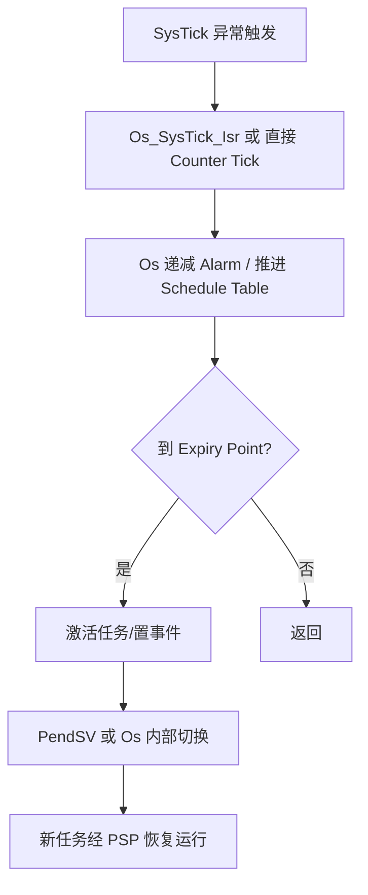

注意：AUTOSAR OS 的上下文切换底层同样依赖 PendSV/SVC 与自动压栈机制（同第十三章），只是对外暴露为 `Os_Schedule()`/`TerminateTask()`。

### 14.3 WdgM 与 MCU 看门狗集成

功能安全要求"程序跑飞能被检出并安全"。AUTOSAR 用三层：
- **Wdg（MCAL）**：直接操作硬件看门狗（IWDG/WWDG/SWT），提供 `Wdg_SetTriggerCondition` 喂狗。
- **WdgIf（接口层）**：抽象多个看门狗驱动。
- **WdgM（看门狗管理）**：应用层通过 `WdgM_CheckpointReached()` 上报存活检查点；若某任务超期未报到，WdgM 触发**Alive Supervision** 失败，调用 `WdgM_AlivenessFailed` 回调，最终不喂狗 → 硬件复位。

这恰好对应第二章"双核看门狗互检"与第十一章"黑匣子"：WdgM 是"软件健康监督"，硬件看门狗是"最终执行者"。

### 14.4 EB tresos / DaVinci 配置项清单

| 工具 | 模块 | 关键配置项 | 生成产物 | 应用调用 |
| --- | --- | --- | --- | --- |
| EB tresos | Mcu | ClockSetting / Reset / Mode / RamSector | `Mcu_Cfg.c/.h` | `Mcu_Init()`, `Mcu_SetMode()` |
| EB tresos | Port | Pin 方向/复用/电平 | `Port_Cfg.c` | `Port_Init()` |
| EB tresos | Wdg | Trigger 模式/超时窗口 | `Wdg_Cfg.c` | `Wdg_Init()`, `Wdg_SetTriggerCondition()` |
| Vector DaVinci | Os | Counter/Alarm/ScheduleTable/Task/ISR | `Os_Cfg.c` + `Os_Lcfg.c` | `StartOS()`, `TerminateTask()` |
| Vector DaVinci | WdgM | Checkpoint/Supervision 周期 | `WdgM_Cfg.c` | `WdgM_CheckpointReached()` |
| 通用 | EcuM | 启动阶段/关机 | `EcuM_Cfg.c` | `EcuM_StartupTwo()` |

### 14.5 配置 → 生成代码 → 调用路径（端到端）

以"配置一个 1kHz SysTick 节拍 + 一个报警激活任务"为例：

1. **配置**：在 DaVinci 中设 `OsCounter` 基准 1ms，绑定 `System Timer = SysTick`；设 `OsAlarm` 每 10 个 tick 激活 `Task_Comm`。
2. **生成**：工具生成 `Os_Cfg.c`，内含 SysTick 重装载值初始化（写 `SYST_RVR`）、Alarm 表、`StartOS()` 时调用 `Os_InitSysTick()`。
3. **调用**：`main()` 调 `StartOS()` → 启动 SysTick → 每 1ms 进一次 `SysTick_Handler`（RTOS Os 接管）→ 每 10ms 到点触发 Alarm → `ActivateTask(Task_Comm)`。
4. **底层**：`ActivateTask` 若需切换，走 PendSV（同 13.4），最终新任务经 PSP 恢复。

这条链说明：**AUTOSAR 并不消灭底层机制，而是把它标准化、可审计化**。理解第十三章的寄存器与汇编，才能在"生成代码行为异常"时定位是配置错还是硬件错。


---

## 十五、实战调试坑与定位手段

### 15.1 五大经典坑

1. **向量表未对齐 / 未重映射**：VTOR 要求基址对齐到 `2^8`（或更高）边界，且 App 的向量表必须与链接脚本匹配。调试：用 Lauterbach / J-Link 查看 `SCB->VTOR` 实际值，对比 map 文件中的向量表地址。
2. **Cache 一致性导致 DMA 脏数据**：偶发错帧、SPI 收错字节。调试：临时把 DMA buffer 标 `non-cacheable` 验证；或用逻辑分析仪抓总线真实值，与 CPU 读到的值对比，若不一致即为一致性问题。
3. **MPU 配置过严导致 HardFault**：RX 段配成不可执行、或栈区被划成只读、背景区未开。调试：进 HardFault 后查 `HFSR`、`MMFAR`、`CFSR` 定位，逐区放宽验证。
4. **TCM 容量不足**：塞太多代码进 ITCM 导致链接溢出。调试：用 map 文件看 TCM 段占用，只保留中断处理与最热路径。
5. **非特权任务误调特权指令**：如用户任务直接调 `__disable_irq()`，立即 UsageFault/MemManage。调试：改为经 SVC 陷入内核执行，或将该任务提升到特权（需评估安全影响）。

### 15.2 调试工具链

- **Lauterbach TRACE32**：支持指令级 trace、复杂断点、直接读写所有内核寄存器与 NVIC/MPU/SCB，是车规 MCU 调试的"金标准"，尤其适合死机后回溯与 ECC/锁步错误分析。
- **Keil MDK / Arm Compiler（armclang）**：自带 `__main`、分散加载、MicroLIB；其 Fault 异常报告与 Event Recorder 便于定位。
- **IAR Embedded Workbench**：同样支持精细 MPU/NVIC 配置与 C-SPY 调试。
- **GCC（arm-none-eabi-gcc）+ OpenOCD/J-Link**：开源组合，配合 `addr2line` 与 `objdump -d` 做 HardFault 栈回溯。

### 15.3 用指令 Trace 抓取中断抖动

对"偶发延迟超标"这类问题，靠打日志会显著改变时序，不可取。笔者的做法是借助 **指令 Trace（如 Lauterbach 的 ATRACE / CoreSight ETM/PTM）** 离线回放：记录每次中断进入/退出的 PC 时间戳，导出后统计最大中断关闭时长、最长 ISR、尾链命中率。CoreSight 的 DWT+ITM 还能在不停业务的前提下采样 PC，定位"哪段代码占了最多 CPU"。这类数据既是 WCET 论证的实证，也是优化热点（搬 TCM、改 non-cacheable）的依据。

### 15.4 死机后的"黑匣子"设计

在 ASIL 系统中，进 HardFault 往往意味着不可信状态，正确做法不是原地恢复，而是**先记录、再安全关断、最后复位**。具体落地：在 HardFault_Handler 里把 CFSR/HFSR/MMFAR/BFAR/PC/LR 与关键任务栈写入一片保留 RAM（用 MPU 或链接脚本划出、正常运行不占用），随后触发带 ECC 的 NVM 固化或由看门狗强制复位；复位后 Bootloader/App 检测到"上次异常标记"即把黑匣子通过 CAN/UART 上传。这样售后与台架复现无需复现那万分之一的概率，直接从日志反推根因。

---

## 十六、面试题精选（含要点）

以下题目既可用于技术面试，也可作为工程师自检清单。

1. **异常和中断的区别？** 答：异常是 CPU 对同步/异步事件的统称（含 Reset、NMI、Fault、SVC、PendSV、IRQ）；中断是其中异步、来自外设的一种，属异常的子集。
2. **为什么实时任务代码放 TCM 而不是普通 RAM？** 答：TCM 1-cycle 确定延迟、不经总线争用、不进 Cache，保证 WCET 可控，避免普通 SRAM 的总线仲裁与缓存未命中抖动。
3. **MPU 和 MMU 的区别？没 MMU 怎么隔离？** 答：MMU 带地址转换+多进程虚拟内存+权限；MPU 只做权限/属性分区无地址转换。单核靠 MPU 分区 + 编译期内存分配 + 特权分级实现空间隔离（FFI）。
4. **Cache 一致性怎么处理 DMA？** 答：CPU 写后 DMA 前 Clean，DMA 写后 CPU 读前 Invalidate；或把 buffer 标 non-cacheable。注意按行对齐与先 Clean 再 Invalidate。
5. **从启动到 main 之间做了什么？** 答：取 MSP、跳 Reset_Handler、拷贝 .data/清零 .bss、SystemInit（时钟/VTOR）、__main（C 库/C++ 构造）、进 main。
6. **尾链与迟滞的作用？** 答：尾链省去背靠背中断的出/入栈开销；迟滞让高优先级中断在压栈中途安全插队而不破坏栈帧，二者共同压低确定性中断延迟。
7. **HardFault 如何定位根因？** 答：读 HFSR 定大类→看 CFSR（MMFSR/BFSR/UFSR）细分→用 MMFAR/BFAR + 栈帧 PC/LR 配合 map/反汇编定位源码行。
8. **为什么子 Fault 会"上访"成 HardFault？** 答：对应子 Fault 未使能时，触发后强制升级为 HardFault，须查 HFSR.FORCED 判断。
9. **特权如何降级与提权？** 答：Thread 模式写 CONTROL.nPRIV=1 降级；非特权无法自提，必须经 SVC 陷入 Handler 由内核改写 CONTROL 提权。
10. **PRIMASK / FAULTMASK / BASEPRI 区别？** 答：PRIMASK 屏蔽所有可配置中断；FAULTMASK 额外屏蔽 HardFault（仅 NMI 可响应）；BASEPRI 仅屏蔽低于阈值的优先级，更精细。
11. **PendSV 为什么适合做上下文切换？** 答：它是"可挂起、最低优先级"的异常，能在所有高优先级 ISR 结束后统一切换，避免中断执行中途被打断。
12. **TrustZone 如何实现安全隔离？** 答：SAU/IDAU 划分 Secure/Non-Secure/NSC；非安全代码只能经 NSC 的 SG 指令进入安全 API，无法直接触达安全资源。
13. **浮点上下文 Lazy Stacking 是什么？** 答：FPCCR.LSPACT 使 FPU 寄存器延迟到真正使用浮点时才压栈，减少无浮点中断的保存开销，降低抖动。
14. **MSP 与 PSP 的用途？** 答：Handler 恒用 MSP；Thread 可按 SPSEL 选 MSP 或 PSP；RTOS 用 PSP 给每个任务独立栈，内核/中断用共享 MSP。
15. **VTOR 对齐要求与用途？** 答：基址对齐到 2^8 边界（异常多时需更大）；用于 Bootloader 跳 App、双 Bank 升级、把向量表搬到带 ECC/TCM 的安全区。
16. **非对齐访问一定会 Fault 吗？** 答：不一定——Cortex-M3/M4/M7 支持多数非对齐的 LDR/STR 但对某些指令（如 LDM/STM 多寄存器、半字/字加载特定场景）或使能了 UNALIGN_TRP 时会 Fault；R 系列视配置而定。
17. **Write-Through 与 Write-Back 怎么选？** 答：WT 简单一致但慢；WB 高性能但需维护一致性；共享 DMA buffer 倾向 non-cacheable 或 WT，算法热点用 WB。
18. **锁步（Lockstep）核如何提升功能安全？** 答：两核同步执行并比对结果，检测瞬态/永久故障，是 ASIL D 动力域控制常用的硬件冗余手段（如 Cortex-R52 锁步配置）。
19. **AIRCR 写为什么需要 0x05FA 密钥？** 答：防止软件误写破坏优先级分组/触发复位，写时必须高半字为 `0x05FA`，否则写被硬件忽略。
20. **AUTOSAR OS 任务优先级和 NVIC 优先级是一回事吗？** 答：不是。OS 任务优先级只决定任务间谁运行；NVIC 优先级决定中断能否抢占任务/彼此。二者经 PendSV 机制衔接。
21. **MPU 区域编号越大优先级越高有什么工程用途？** 答：可在大区中重叠一个编号更大的小区做差异化属性（如给数据区里的一段任务栈单独设 XN 禁执行），实现"白名单挖洞"。
22. **SysTick 为什么默认优先级最低，需提升？** 答：SysTick 是调度时基，若优先级过高会打断关键 ISR；但若最低且不处理，高优先级 ISR 会饿死调度。实际常配合 PendSV（最低）做延迟切换。

---

## 十七、结语

回到开篇那个 BMS 的"玄学故障"：根因是把向量表放进了无保护的普通 SRAM。在理解了 VTOR 重映射、TCM、ECC、MPU 与异常模型之后，正确的防御应该是——把向量表放进带 ECC 的 TCM 或紧耦合 SRAM，并用 MPU 把该区标为只读且特权专属，任何对向量表的写访问都立即 Fault。这一套"防御纵深"不是事后补丁，而是应该在架构设计阶段就写进安全手册的基线要求。

对汽车嵌入式工程师而言，Cortex-M 与 Cortex-R 的底层机制不是孤立的知识点，而是贯穿"启动—运行—故障—恢复"全链路的工程语言。笔者建议把本文的寄存器、流程图与面试清单作为团队的 on-boarding 材料，并在每一次涉及中断、内存布局、安全隔离的设计评审中，主动问一句：**"如果这里发生 bit 翻转/栈溢出/越权访问，系统会进安全状态，还是会静默失控？"** 这一个问题，足以区分"会写代码的工程师"和"能交付安全系统的工程师"。

### 17.1 交付前自检十问

在版本释放给台架/整车前，笔者团队会用下面十问做一轮底层机制 review，任一项答不上来都视为风险：

1. 向量表是否放在带 ECC/TCM 的安全区，且 VTOR 基址已正确对齐？
2. 启动拷贝 `.data`/清零 `.bss` 的地址与链接脚本是否完全一致？
3. 临界区用的是 PRIMASK 还是 BASEPRI？最长关闭时长是否在 WCET 预算内？
4. 最高优先级中断是否锁进 ITCM，最坏响应时间是否实测过？
5. MPU 是否对非安全任务做了空间隔离（FFI），背景区配置是否正确？
6. 所有 DMA buffer 的 Cache 维护（Clean/Invalidate）是否已全部覆盖？
7. 非特权任务是否只能经 SVC 白名单访问特权资源？
8. 若使能 TrustZone，安全入口是否仅经 NSC 的 SG，密钥区是否不可由非安全访问？
9. HardFault 是否有"黑匣子"记录并能安全关断而非死循环？
10. 锁步/ECC 等硬件冗余是否在安全手册里逐项论证闭环？

把这十问变成每次 release 的必过门禁，多数"玄学故障"会在设计阶段就被消灭。

---

### 附：本文新增工业级资产清单（便于检索）

- **A 章（芯片模块设计）**：Cortex-M IP 总架构框图、取指/译码/执行三级流水、NVIC 优先级硬件、SysTick 24 位定时器、MPU 比较器结构、FPU Lazy Stacking、AHB/APB 总线矩阵、VTOR、DAP/CoreSight、SCS 寄存器映射表、CFSR/xPSR/CONTROL 位域图、复位与时钟域、内核-总线协作时序。
- **B 章（驱动代码）**：启动文件汇编片段、NVIC 优先级分组配置、MPU 五区域完整配置、SVC/PendSV 汇编上下文切换骨架、HardFault 回溯（HFSR/CFSR/MMFAR/BFAR 解析 + 黑匣子）。
- **C 章（MCAL）**：Mcu 时钟树/复位/模式、Os Counter/Alarm/ScheduleTable 与 SysTick 绑定、WdgM/Wdg 三层看门狗、EB tresos/DaVinci 配置项表、配置→生成→调用端到端图。
