# RTOS 原理、调度与性能调优：从芯片模块到 MCAL 的工程级深度技术章节

> 本文面向汽车嵌入式软件工程师、芯片底层软件工程师与系统软件学习者，目标是把实时操作系统（RTOS）的核心机制讲透，并从"芯片 IP 内部架构 → 移植层驱动代码 → 调度与 IPC → 性能调优 → AUTOSAR MCAL 配置"的完整纵深给出可落地的工程方法论。文中所有案例与代码均为工程化抽象，第一人称以"笔者"指代作者；涉及的芯片与外设以公开通用型号（Cortex-M、S32K、STM32 等）代称，不指向任何真实个人，也不编造虚假规格参数。寄存器位域与 IP 框图遵循 ARM Cortex-M 系列与常见 MCU 实现的通用逻辑。

---

## 一、为什么需要 RTOS：前后台（裸机）轮询的结构性困境

在资源受限的 MCU 上，最朴素的软件架构是"前后台系统"（Super-Loop / 裸机轮询）：一个无限 `while(1)` 主循环顺序执行各个功能模块，配合中断服务程序（ISR）作为"前台"异步响应硬件事件。这种架构在功能简单、实时性要求宽松的产品上完全够用，但它存在三个无法回避的结构性缺陷。

**第一，响应延迟不可控。** 在前后台系统中，某个中断发生后，ISR 只做最紧急的"打标记"工作，真正的业务处理要等主循环轮询到对应标志位才能执行。如果主循环前面挂着几个耗时模块（比如一段软件 IIC 读取、一次浮点滤波计算），那么从事件发生到业务处理的延迟就等于"当前模块剩余执行时间 + 后续模块执行时间"。这个延迟是数据相关的、随时间漂移的，无法给出最坏情况上限（WCET 难以界定）。而对汽车电子而言，许多功能（如扭矩响应、安全关断）对延迟有明确的上限约束。

**第二，并发语义缺失。** 前后台系统中，所有"任务"共享同一个栈、同一片全局变量，模块间耦合通过全局标志位和全局缓冲区隐式传递。当系统复杂度上升，标志位越来越多、状态机越来越乱，开发者很难推理"此刻谁在读这块内存、谁在写这块内存"。优先级的概念根本不存在——主循环顺序就是唯一的"调度顺序"。

**第三，可维护性随规模崩塌。** 没有任务抽象，就无法做到模块化隔离；新增一个功能往往要修改主循环结构，回归测试成本随代码量超线性增长。在 A-SPICE 与功能安全（ISO 26262）流程要求下，这种不可分解的单体结构很难通过静态分析与单元测试的覆盖度考核。

RTOS 的出现正是为了给裸机引入**确定性的调度、隔离的地址/栈空间、结构化的进程间通信（IPC）**。它把"我什么时候该运行"这个问题从程序员的手工编排中解放出来，交给调度器按优先级与时间约束自动裁决。

不过，引入 RTOS 不是免费的。它会带来内核代码体积（典型 5–15 KB 代码、1–4 KB 静态数据）、每次上下文切换的栈与寄存器保存开销、以及 IPC 带来的复杂度。因此选型的第一原则永远是：**先问"是否真的需要确定性调度与并发隔离"，再决定上 RTOS**。对于只需要"上电初始化 + 偶尔响应按键"的简单节点，前后台反而更省资源、更易验证。

为了让对比更直观，下面给出一张定性对比表：

| 维度 | 前后台（裸机） | RTOS |
| --- | --- | --- |
| 任务响应延迟上限 | 取决于主循环最大单轮耗时，难界定 | 由优先级与中断延迟决定，可分析 |
| 并发模型 | 单栈单线程，全局共享 | 多任务多栈，IPC 隔离 |
| 优先级语义 | 无（顺序即优先级） | 抢占式/时间片，显式优先级 |
| 内存占用 | 极小（无内核态） | 增加内核 + 每任务栈 |
| 上下文切换开销 | 无 | 数十到数百时钟周期 |
| 调试与可观测性 | 弱（靠打 GPIO） | 强（任务列表、栈水位、钩子） |
| 适用规模 | 小型、逻辑简单 | 中大型、多并发、多团队 |

---

## 二、任务模型：TCB、私有栈与任务状态机

RTOS 把"要运行的一段逻辑"抽象为**任务（Task / Thread）**。每个任务在创建时被内核分配两块关键资源：**任务控制块（TCB，Task Control Block）**与**私有栈（Stack）**。

### 2.1 任务控制块（TCB）

TCB 是内核管理任务的核心数据结构，不同 RTOS 字段命名不同，但语义高度一致。以 FreeRTOS 的 `tskTCB`（公开为 `TaskHandle_t` 背后结构）为例，它至少包含：

- 任务栈顶指针（用于上下文切换时保存/恢复现场）；
- 任务状态（就绪/阻塞/挂起等）；
- 优先级数值；
- 任务事件链表节点（挂入就绪表、延时表、等待某 IPC 对象的链表）；
- 任务名、栈起止地址、栈水位标记；
- 浮点/FPU 现场保存区指针（若启用）。

TCB 本身通常从内核堆（或静态数组）分配，是一个**永不主动换出**的常驻结构。理解 TCB 的意义在于：当你用 `uxTaskGetSystemState()`（FreeRTOS）或者 `rt_thread_...` 系列接口查询系统时，看到的每一个"任务"背后，都是这样一个结构在链表里被调度器搬来搬去。在后续"芯片模块设计"章节中我们还会看到，TCB 与任务私有栈在 SRAM 中的物理布局，直接决定了 MPU 守卫区与 DMA 一致性的处理策略。

### 2.2 私有栈

每个任务有自己的栈，这是 RTOS 与裸机最本质的区别之一。栈用于保存：

- 函数调用链（返回地址、局部变量）；
- 上下文切换时 CPU 寄存器现场（R0–R12、LR、PC、xPSR，若是 Cortex-M）；
- 若任务用了浮点，还要额外保存 S0–S31（懒保存机制下由硬件 FPU 决定压栈范围）；
- 中断嵌套时的嵌套现场（取决于 ABI 设计，Cortex-M 上 ISR 默认也用当前 PSP，即任务栈）。

栈太小会溢出踩坏邻居内存；栈太大则浪费宝贵的 SRAM。如何定栈大小，后文"栈溢出检测"与"性能调优"专节展开。

### 2.3 任务状态机

一个设计良好的任务状态机，应覆盖"就绪 / 运行 / 阻塞 / 挂起 / 删除"五态。下面的状态图刻画了主流 RTOS（FreeRTOS、RT-Thread、μC/OS、Zephyr 等）通用语义：

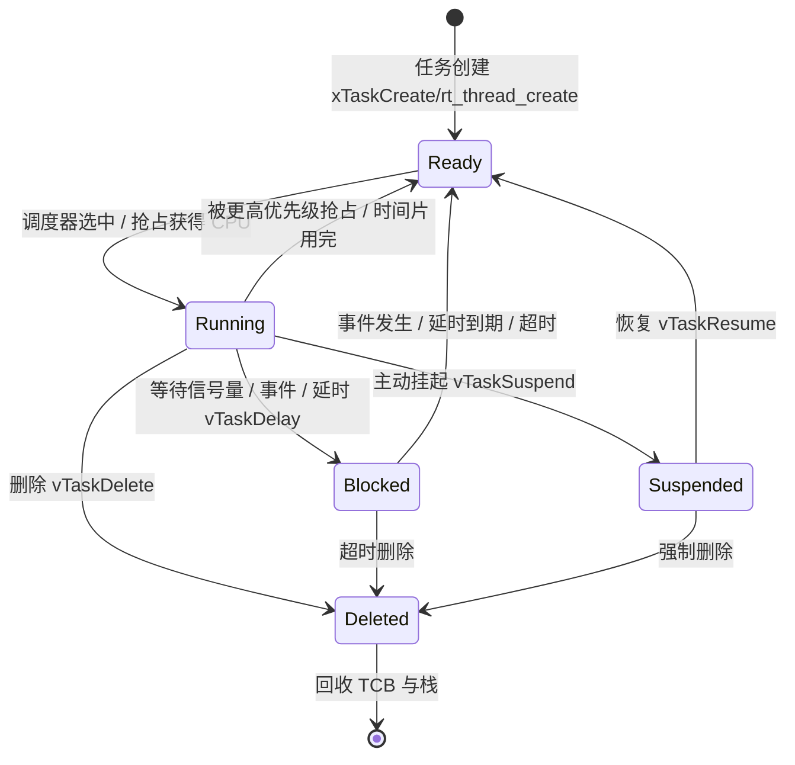

需要强调几个容易混淆的点：

- **就绪（Ready）** 表示任务具备运行条件但还没拿到 CPU；**运行（Running）** 表示正在占用 CPU；两者在单核上同一时刻只有一个任务处于 Running。
- **阻塞（Blocked）** 是有"等待条件"的——在等 IPC 对象或延时，期间不消耗 CPU。它和挂起不同：阻塞是"等事件自然解除"，挂起是"被外部强制剥夺调度资格"。
- **挂起（Suspended）** 不是错误状态，而是一种人工控制手段（例如调试时冻结某个任务）。但要注意：被挂起的任务永远不会自己醒来，必须由别的任务调用恢复接口。
- **删除（Deleted）** 后，若任务是在自己体内 `vTaskDelete(NULL)` 自我删除，其栈与 TCB 的回收通常由空闲任务（Idle Task）代为完成，因此空闲任务的栈要预留足够空间。

### 2.4 任务创建的可读示例

下面给出一个完整的 FreeRTOS 任务创建范例，体现了 TCB、私有栈、优先级与入口函数的绑定关系：

```c
/* ---- 任务创建示例 ---- */
#include "FreeRTOS.h"
#include "task.h"

#define COMM_TASK_PRIO     (4)        /* 优先级数值越大越高 (FreeRTOS 语义) */
#define COMM_TASK_STACK    (512)      /* 单位: 字(word), 即 2KB */
static StackType_t xCommStack[COMM_TASK_STACK];  /* 静态分配的私有栈 */
static TaskHandle_t xCommTaskHandle = NULL;

/* 任务入口函数：永不返回，内部用阻塞 API 让出 CPU */
void vCommTask(void *pvParams)
{
    (void)pvParams;
    for (;;)
    {
        /* 等待通信事件/队列，阻塞期间不占 CPU */
        ulTaskNotifyTake(pdTRUE, portMAX_DELAY);
        /* 业务处理... */
    }
}

/* 在 main 或启动代码中创建任务 */
void app_create_tasks(void)
{
    BaseType_t xRet = xTaskCreate(
        vCommTask,            /* 任务函数(PC 入口) */
        "CommTask",           /* 任务名(调试可见) */
        COMM_TASK_STACK,      /* 栈深度(字) */
        NULL,                 /* 传给任务的参数 */
        COMM_TASK_PRIO,       /* 优先级 */
        &xCommTaskHandle);    /* 输出的 TCB 句柄 */
    configASSERT(xRet == pdPASS);  /* 创建失败通常是堆/栈不足 */
}
```

理解这段代码有助于把"任务五态"落到代码：调用 `xTaskCreate` 后任务进入 **Ready**；调度器选中后进入 **Running**；在 `ulTaskNotifyTake` 处无事件则进入 **Blocked**；`vTaskDelete(NULL)` 则进入 **Deleted**（由 Idle 回收）。

---

## 三、调度算法：抢占、时间片轮转、协作式与优先级反转

调度器是 RTOS 的"大脑"。理解调度，先要分清三种基本调度范式。

### 3.1 抢占式（Preemptive）调度

这是汽车电子事实上的标准。每个任务有一个数值优先级；**任何时候，就绪队列里优先级最高的任务获得 CPU**。如果某个更高优先级任务因为 IPC 或延时到期而进入就绪，调度器会立即（在节拍点或系统调用点）剥夺当前运行任务的 CPU，把高优先级任务切换上去——这就是"抢占"。

抢占式的好处是实时性有保证：关键任务一旦就绪即可介入。代价是共享资源访问必须小心（见优先级反转与互斥量章节），且上下文切换更频繁。在 Cortex-M 上，抢占的"物理载体"是 NVIC 的嵌套优先级机制（见第五章），而真正的任务现场切换则统一推迟到 PendSV 异常中完成，这一点后文移植层会详述。

### 3.2 时间片轮转（Round-Robin / Time Slicing）

当**多个相同优先级**的任务都就绪时，调度器不能只让其中一个永远跑下去，否则同优先级公平性丧失。时间片轮转规定：每个任务最多连续运行一个"时间片"（由 tick 周期或独立时间片值决定），时间片用完后主动让出给同优先级的下一个就绪任务。

典型实现：系统节拍（tick，例如 1 ms）到来时，若当前任务与就绪队列头部任务同优先级，则触发一次同优先级切换。FreeRTOS 中可通过 `configUSE_TIME_SLICING` 开启；RT-Thread 通过时间片计数器实现；Zephyr 的 `k_thread` 也支持同优先级轮转。

### 3.3 协作式（Cooperative）调度

任务必须主动调用 `taskYIELD()` 或阻塞 API 才会让出 CPU，内核从不强制抢占。协作式没有竞态（因为只有自愿让出点才可能切换），但实时性极差——一个写得不好的任务死循环会饿死所有其他任务。现代汽车 RTOS 几乎不单独使用纯协作式，更多作为"可选项"或历史兼容存在。

### 3.4 优先级反转：经典陷阱与两种解决方案

优先级反转（Priority Inversion）是抢占式调度下最著名的正确性陷阱。设想三个任务：高优先级 H、中优先级 M、低优先级 L，它们共享一把锁保护的资源。

1. L 先运行，拿到锁；
2. H 就绪并抢占 L，但 H 也要这把锁，于是 H 阻塞，L 重新运行（此时 L 仍持锁）；
3. **关键时刻**：M 就绪并抢占 L（M 不需要这把锁）。于是 M 在 L 之上运行，而 L 无法推进、无法释放锁，导致 H 被 M "间接阻塞"。

结果是：最高优先级的 H，实时性竟然被一个不相干的 M 毁了。这在火星探路者（Mars Pathfinder）事件中曾真实导致系统复位，是嵌入式史上的经典案例。

解决思路有两种，都被主流 RTOS 与 AUTOSAR OS 支持：

**优先级继承协议（PIP / Priority Inheritance）：** 当高优先级 H 阻塞在 L 持有的锁上时，临时把 L 的优先级提升到 H 的级别，使 M 无法抢占 L；等 L 释放锁后，L 恢复原来优先级，H 随即拿到锁运行。这是一种"按需提升"的动态策略。

**优先级天花板协议（Priority Ceiling）：** 给每把锁预先规定一个"天花板优先级"——等于"所有可能申请这把锁的任务中的最高优先级"。任何任务一旦持锁，立即被提升到该天花板优先级，不管当前有没有更高任务在等。这比 PIP 更保守、实现更简单，且能**一次性避免死锁**（因为持锁期间任务优先级顶到天花板，不会被任何可能持另一把锁的任务抢占从而相互等待）。AUTOSAR OS 的 `Resource` 机制默认采用天花板协议。

下面用序列图对比"无保护的反转"与"PIP 修复"两条时间线：

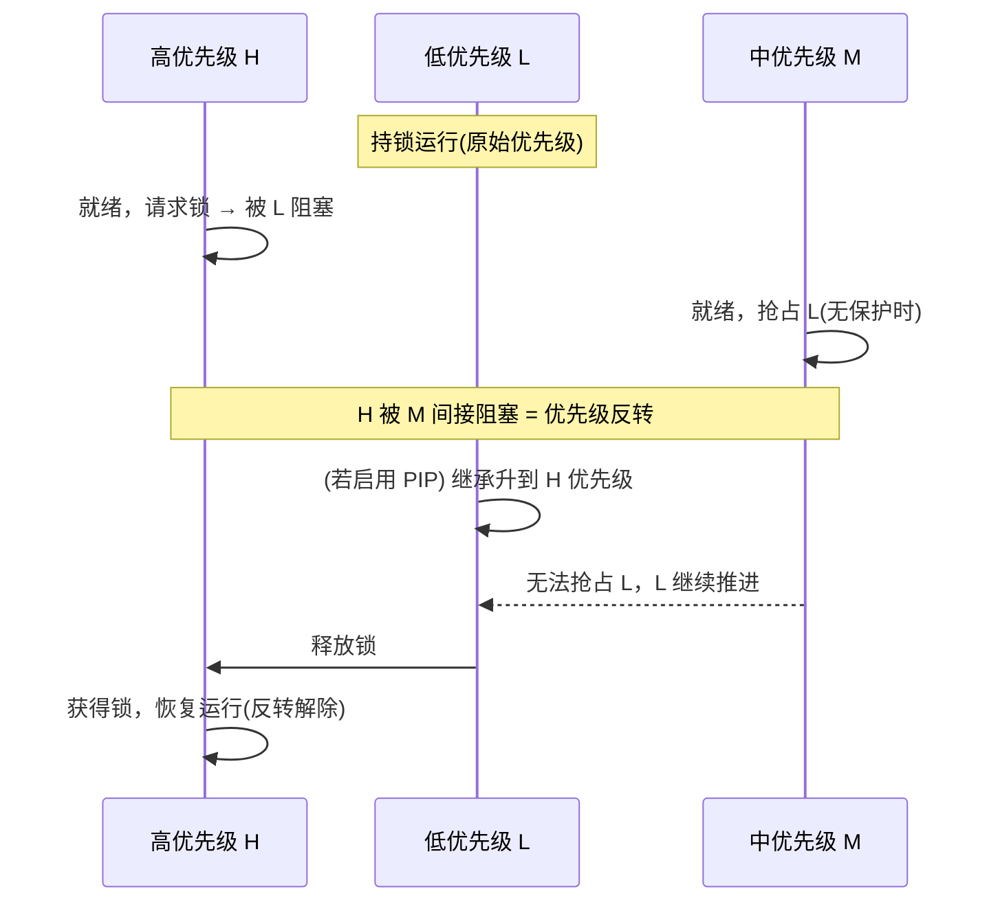

要点澄清：**优先级继承只解决"反转"，不直接解决"死锁"**；而天花板协议在单锁/分层资源下能同时抑制反转与死锁。工程中更推荐天花板，因为它行为可静态分析、无"谁在等"的动态判断开销。这也是为什么在 AUTOSAR OS 的 `OsResource` 配置里，每把资源都显式配置一个 `OsResourcePriority`（天花板优先级），而不是靠运行时动态提升。

---

## 四、上下文切换：触发时机与开销测量

上下文切换（Context Switch）是调度器的核心动作：保存当前任务的寄存器现场到其栈，再从待运行任务的栈恢复现场，更新栈指针，跳转到新任务的指令流。

### 4.1 触发时机

上下文切换不会"随时发生"，它只在明确的检查点发生。常见触发点包括：

1. **系统节拍（tick）到来**：检查是否有更高优先级任务就绪、时间片是否用完；
2. **任务主动阻塞**：调用 `xQueueReceive`（队列空）、`xSemaphoreTake`（锁忙）、`vTaskDelay` 等，主动让出 CPU；
3. **任务主动让出**：`taskYIELD()` / `rt_thread_yield()`；
4. **ISR 中释放资源**：在 `...FromISR` 接口里解除某任务阻塞，并在中断返回前请求调度（`portYIELD_FROM_ISR`）；
5. **任务删除/挂起/恢复**等系统调用。

关键认知：**用户态任务的执行中途，不会因为"更高优先级来了"而瞬间被打断到任意指令点**——抢占发生在上述检查点。不过在 Cortex-M 等架构上，PendSV 异常被用来**延迟**切换动作到中断返回路径，使得"切换"本身在统一的低优先级异常里完成，避免嵌套异常复杂度。这是移植层设计的核心思想（详见第五章与第六章）。

### 4.2 开销构成与测量

一次上下文切换的耗时主要取决于：

- 需要保存/恢复的寄存器数量（是否含 FPU 现场，差异巨大）；
- 调度器在就绪表/优先级位图上查找最高优先级任务的算法复杂度（FreeRTOS 用位图 + CLZ 指令，μC/OS 用查表/位运算，Zephyr 用位图/红黑树，取决于配置）；
- 内存总线与 Cache 状态（现场在栈上，若栈不在 Cache 会多周期）。

测量方法有三种，工程上常组合使用：

- **GPIO + 逻辑分析仪/示波器**：在上下文切换钩子 `vApplicationIdleHook` 或调度器 trace 点翻转引脚，直接测脉冲宽度；
- **内置统计**：FreeRTOS 的 `uxTaskGetSystemState` 配合 `run time stats`（需提供高频计时源）可给出每个任务占用 CPU 时间百分比；
- **DWT/PMU 周期计数器**：Cortex-M 的 DWT_CYCCNT 在切换前后读差值，得到精确周期数。

经验值：在 100–200 MHz 的 Cortex-M4/M7 上，不含 FPU 的切换约 40–120 周期；含 FPU 懒保存的完整现场约 150–400 周期。若切换频率过高（例如每 tick 都切好几次），累计开销会显著抬高 CPU Loading。

下面用流程图概括"一次抢占切换"在 Cortex-M 上的典型路径：

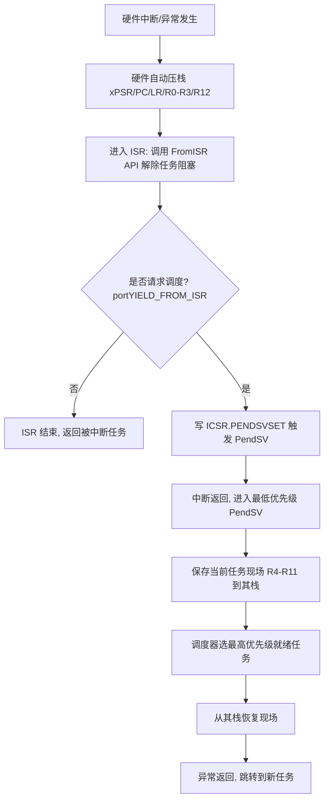

---

## 五、芯片模块设计（IP 内部架构）—— 新增核心章节 A

理解 RTOS 的底层，不能只停留在"调度器 API"层面。要真正掌握 PendSV、SysTick、临界区与栈保护，必须回到芯片内部：Cortex-M 处理器由 CPU 内核、NVIC、SysTick、MPU、总线矩阵与存储器视图共同构成，RTOS 的每一个核心机制都映射到这些硬件模块上。

### 5.1 芯片模块架构框图

下图给出一个通用 Cortex-M 系列 MCU 的 IP 内部架构（与 STM32、S32K 等系列的逻辑一致，寄存器基址遵循 ARM 官方定义）：

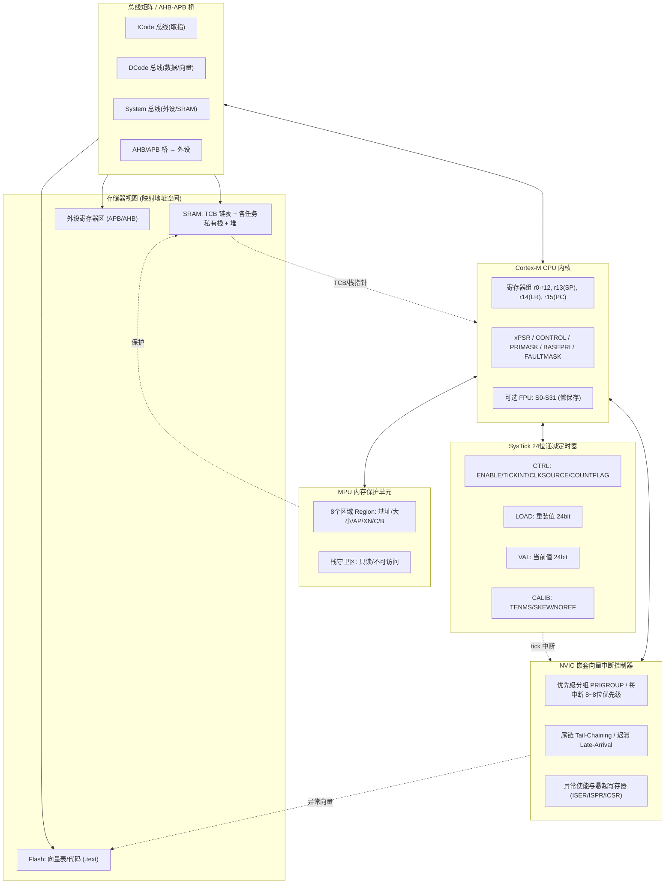

要点解读：

- **CPU 内核** 在 Thread 模式（任务态）下使用 PSP（进程栈指针），在 Handler 模式（异常态，含 ISR、PendSV、SVC）下使用 MSP（主栈指针）。这正是 RTOS 能"在异常里切换任务栈"的硬件基础。
- **NVIC** 不仅管理外部中断，还管理 SysTick、PendSV、SVC 等内部异常，并提供优先级嵌套与 tail-chaining 优化。
- **SysTick** 是内核内置的 24 位递减计数器，是 RTOS 系统节拍（tick）最常见的时间源。
- **MPU** 可用于给每个任务的栈底划出"守卫区"，把静默的栈溢出变成可捕获的 MemManage Fault。
- **总线矩阵** 把内核取指、取数、访问外设分流到不同总线，TCB 与任务栈常驻 SRAM，DMA 与 CPU 对 SRAM 的竞争会直接影响切换实时性。

### 5.2 NVIC：优先级、尾链与迟滞

NVIC（Nested Vectored Interrupt Controller）是 Cortex-M 实时性的基石。它支持：

- **优先级分组（Priority Grouping）**：通过 `AIRCR.PRIGROUP` 把 8 位（或芯片实现的 N 位）优先级拆分为"抢占优先级"与"子优先级"两部分。RTOS 通常把所有优先级都配置为抢占优先级（即分组为全抢占），避免子优先级破坏实时抢占语义。下表给出常见分组的含义（以 4 位可配置优先级为例，芯片实现位数依 S32K/STM32 具体型号而定）：

| PRIGROUP 值 | 抢占优先级位数 | 子优先级位数 | 含义 |
| --- | --- | --- | --- |
| 0x07 (Group 0) | 0 | 4 | 全为子优先级，无抢占 |
| 0x06 (Group 1) | 1 | 3 | 2 级抢占 |
| 0x05 (Group 2) | 2 | 2 | 4 级抢占 |
| 0x04 (Group 3) | 3 | 1 | 8 级抢占 |
| 0x03 (Group 4) | 4 | 0 | 16 级纯抢占（RTOS 常用） |

- **尾链（Tail-Chaining）**：当一个异常返回时，若已有一个更高或相等优先级的异常处于悬起（Pending）状态，处理器不执行完整的出栈/入栈序列，而是直接跳到新异常处理，省去冗余的栈操作。这让"ISR 末尾触发 PendSV → PendSV 立即接管"几乎零额外开销。
- **迟滞（Late-Arrival）**：若在一个异常入栈过程中，一个更高优先级的异常到来，处理器会"改道"先服务高优先级异常，待其完成后才回到原异常。这保证了高优先级永远最先得到 CPU。

- **三个关键屏蔽寄存器**：
  - `PRIMASK`：置 1 时屏蔽除 NMI 与 HardFault 外的所有可配置异常与中断（即"关中断"）。
  - `BASEPRI`：仅屏蔽优先级**数值小于等于**某阈值的中断，可保留高优先级中断响应（RTOS 临界区常用，比 PRIMASK 更精细）。
  - `FAULTMASK`：置 1 时连 HardFault 也屏蔽（极少用）。

### 5.3 SysTick 寄存器位域

SysTick 的寄存器基址为 `0xE000E010` 起，共 4 个 32 位寄存器。其位域如下（采用 mermaid 框图表达位布局，数值以公开 Cortex-M 手册为准）：

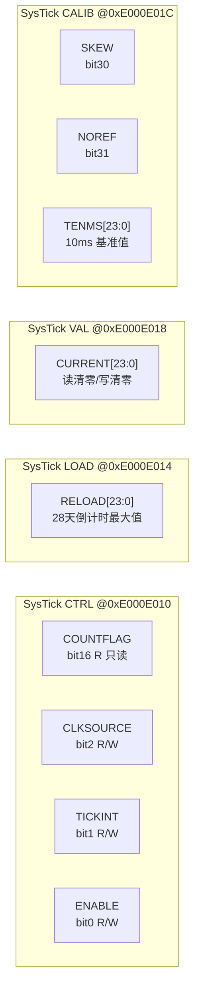

- **CTRL.ENABLE (bit0)**：计数器使能。
- **CTRL.TICKINT (bit1)**：计数到 0 时是否产生 SysTick 异常（tick 中断）。若置 0，则只置 COUNTFLAG 不进中断，可用于纯轮询计时。
- **CTRL.CLKSOURCE (bit2)**：时钟源选择。`0` = 外部参考时钟（通常为内核时钟分频），`1` = 处理器内部时钟（core clock，S32K/STM32 上即 HCLK/CPU 时钟）。RTOS 一般用内部时钟以保证节拍精确。
- **CTRL.COUNTFLAG (bit16)**：只读，计数到 0 时硬件置 1，读 CTRL 后自动清零。
- **LOAD.RELOAD[23:0]**：重装值。SysTick 是 24 位计数器，故最大重装值为 `0x00FFFFFF`（约 1677 万）。若 CPU 时钟 100 MHz，单次最多约 167 ms 才溢出一次——因此 RTOS 通常把 LOAD 设为 `(configTICK_RATE_HZ 倒数 × 时钟) - 1`。
- **VAL.CURRENT[23:0]**：当前计数值，读它返回当前值且清零，写任意值也清零。
- **CALIB.TENMS[23:0]**：厂商烧录的"10ms 间隔对应的重装值"，用于校准；**CALIB.NOREF (bit31)** 指示是否存在外部参考时钟，**CALIB.SKEW (bit30)** 指示 TENMS 值是否精确（若有偏差，软件需自行补偿）。

> 提示：SysTick 是内核私有外设，在多核 Cortex 芯片上**每个核各有一个独立 SysTick**。在 S32K（多核 S32K3xx）等平台上，若每个核跑独立 RTOS 实例，需各自初始化自己的 SysTick。

### 5.4 PendSV 与 SVC：RTOS 切换的两个异常角色

Cortex-M 有 15 个系统异常，RTOS 移植层最关心其中两个：

- **SVC（SuperVisor Call，异常号 11）**：用于从"内核启动代码"安全地切入第一个任务。由于线程模式默认使用 PSP，而启动初期还在用 MSP，SVC 提供了一次"从 Handler 模式切回 Thread 模式并加载首个任务上下文"的受控入口。FreeRTOS 的 `vPortStartFirstTask()` 末尾触发 `svc 0`，在 SVC Handler 里恢复首个 TCB 的现场、把 SP 切到 PSP 后异常返回，于是 CPU 第一次"像任务一样"开始跑。
- **PendSV（可悬起系统调用，异常号 14）**：它是**可软件置位、且优先级最低**的异常。RTOS 把"真正的上下文切换"放在 PendSV 里做，原因正是：当 tick ISR 或 `FromISR` 接口判定"需要切换"时，它只置位 `ICSR.PENDSVSET`；由于 PendSV 优先级被设为最低（如 `0xFF`），它会一直悬起，直到**所有高优先级 ISR 都返回完毕**才执行——此时再做切换就不会打断任何硬件 ISR，也避免了异常嵌套里切换的复杂度。这就是第四章流程图里"延迟切换"的硬件机制。

下面用序列图展示 PendSV/SVC 在"启动"与"运行中切换"两条路径的角色：

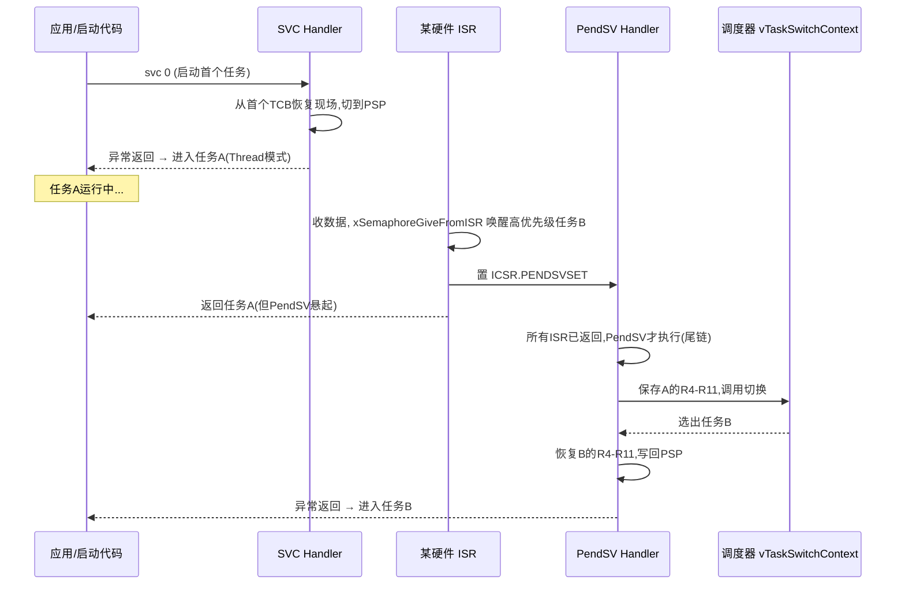

### 5.5 MPU 用于任务栈保护

MPU（Memory Protection Unit）把地址空间划分为若干"区域（Region）"，每个区域可独立配置访问权限（特权/非特权读/写/执行）与缓存属性。RTOS 利用它实现两层保护：

1. **栈守卫区（Stack Guard）**：在任务栈底之后划出一小块（如 32 字节）配置为"不可访问 / 只读"。一旦任务栈向下生长越过边界，立即触发 MemManage Fault，把"静默踩内存"变成"可捕获的硬 fault"。FreeRTOS 的 `MPU_WRAPPERS` 与 `portMPU` 接口支持按任务配置；AUTOSAR OS 的内存保护也基于 MPU/MPU+ 实现。
2. **分区隔离（OS Application 隔离）**：不同 ASIL 等级的任务/基础软件放在不同 MPU 区域，写越界触发 `E_OS_PROTECTION_MEMORY`，满足 ISO 26262 的"免干扰（FFI）"要求。

下图为 MPU 栈守卫的工作示意：

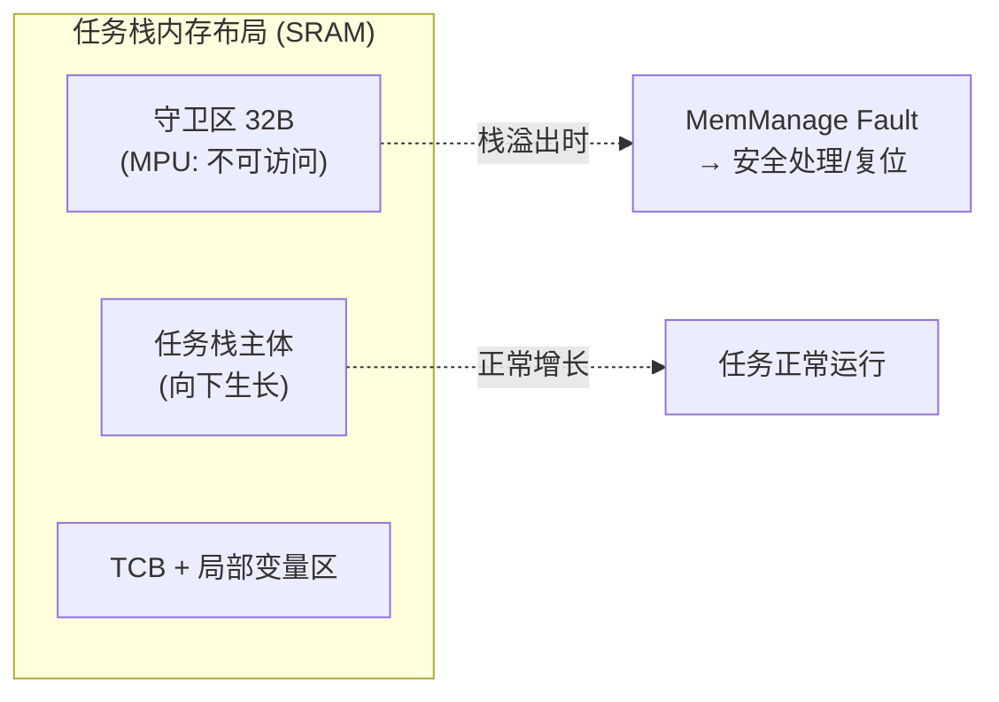

### 5.6 内核节拍与总线/存储器视图

系统节拍的产生链路是：`Core Clock → SysTick(LOAD 递减) → 计数到0 → CTRL.COUNTFLAG 置位 + TICKINT 触发异常 → NVIC 把 SysTick 异常交给 CPU → 进入 xPortSysTickHandler`。这条链路对总线与 SRAM 的访问模式决定了 tick 抖动：若 SysTick 中断向量、ISR 代码、被切换任务的栈都不在 Cache/TCM，每次 tick 都要跨总线取指与压栈，抖动会显著增大。因此性能调优中常把关键中断代码与栈放进 ITCM/DTCM（零等待）或锁定 Cache，后文第十一章详述。

---

## 六、驱动代码实现（移植层）—— 新增核心章节 B

本节给出真实可读的 C 与 Cortex-M 汇编骨架，覆盖 SysTick 初始化与 tick ISR、PendSV 触发宏、上下文切换汇编、临界区与栈溢出钩子。这些代码是 FreeRTOS 风格移植层的典型实现（已简化以便阅读，但关键语义与真实内核一致）。

### 6.1 SysTick 初始化与 tick 中断

```c
/* ---- port.c 风格：SysTick 初始化 ---- */
#include <stdint.h>

/* Cortex-M 系统控制块与 SysTick 寄存器基址（ARM 官方定义） */
#define SCS_BASE        (0xE000E000UL)
#define SYSTICK_BASE    (SCS_BASE + 0x0010UL)
#define NVIC_BASE       (SCS_BASE + 0x0100UL)
#define SCB_BASE        (SCS_BASE + 0x0D00UL)

/* 寄存器 access（volatile 不可省略，硬件状态易变） */
#define SYST_CSR        (*(volatile uint32_t *)(SYSTICK_BASE + 0x00)) /* CTRL  */
#define SYST_RVR        (*(volatile uint32_t *)(SYSTICK_BASE + 0x04)) /* LOAD  */
#define SYST_CVR        (*(volatile uint32_t *)(SYSTICK_BASE + 0x08)) /* VAL   */
#define SYST_CALIB      (*(volatile uint32_t *)(SYSTICK_BASE + 0x0C)) /* CALIB */

#define NVIC_ICSR       (*(volatile uint32_t *)(SCB_BASE + 0x04))    /* 中断控制状态 */
#define NVIC_SHPR3      (*(volatile uint32_t *)(SCB_BASE + 0x24))    /* 系统异常优先级(含PendSV) */

#define SYSTICK_CLK_HZ  (100000000UL)   /* 例: STM32/S32K 核心时钟 100MHz */
#define TICK_RATE_HZ    (1000UL)        /* 1ms 一个 tick */
#define SYSTICK_RELOAD  ((SYSTICK_CLK_HZ / TICK_RATE_HZ) - 1UL)  /* = 99999 */

/* 外部由调度器实现：每个 tick 调用一次 */
extern void xTaskIncrementTick(void);

/* 初始化 SysTick 为 RTOS 节拍源 */
void vPortSetupSysTick(void)
{
    SYST_RVR = SYSTICK_RELOAD;   /* 写入重装值 (24位有效) */
    SYST_CVR = 0UL;              /* 写 VAL 清零当前计数 */

    /* CTRL: 使能 | 计数到0产生中断 | 内核时钟源 */
    SYST_CSR = (1UL << 0)        /* ENABLE   */
             | (1UL << 1)        /* TICKINT  */
             | (1UL << 2);       /* CLKSOURCE = core clock */

    /* 把 PendSV 设为最低优先级(0xFF)，保证其最后执行 */
    /* SHPR3 的 bit23:16 对应 PendSV 优先级字段 */
    uint32_t ulMask = NVIC_SHPR3;
    ulMask &= ~(0xFFUL << 16);
    ulMask |=  (0xFFUL << 16);   /* PendSV 优先级 = 最低 */
    NVIC_SHPR3 = ulMask;
}

/* ---- SysTick 中断服务程序（tick ISR）---- */
void xPortSysTickHandler(void)
{
    /* 注意: 进入此处时已处于 Handler 模式，使用 MSP */
    uint32_t ulHigherPriorityTaskWoken = 0;

    /* 调用内核 tick 处理：推进延时列表、检查时间片 */
    /* FreeRTOS 真实接口为 xTaskIncrementTick()，返回是否需要调度 */
    if (xTaskIncrementTick() != 0)
    {
        ulHigherPriorityTaskWoken = 1;
    }

    /* 若需要切换，置位 PendSV（不直接切，留给最低优先级异常） */
    if (ulHigherPriorityTaskWoken != 0)
    {
        /* ICSR 的 PENDSVSET 位(bit28)写1触发 PendSV */
        NVIC_ICSR = (1UL << 28);
    }
}
```

### 6.2 PendSV 触发宏与临界区（PRIMASK / BASEPRI）

```c
/* ---- PendSV 触发宏（替代 portYIELD）---- */
#define portYIELD() \
    do { NVIC_ICSR = (1UL << 28); __DSB(); __ISB(); } while (0)

/* ISR 版本：仅在确实需要调度时置位 PendSV */
#define portYIELD_FROM_ISR(x) \
    do { if ((x) != 0) { NVIC_ICSR = (1UL << 28); } } while (0)

/* ---- 临界区：基于 BASEPRI（更精细，保留高优先级中断）---- */
static inline uint32_t ulPortRaiseBASEPRI(void)
{
    uint32_t ulPrevBASEPRI;
    __asm volatile
    (
        "mrs %0, basepri \n"          /* 读旧值 */
        "msr basepri, %1 \n"          /* 写新阈值，屏蔽 <= 阈值的中断 */
        "dsb       \n"
        "isb       \n"
        : "=r"(ulPrevBASEPRI) : "r"(configMAX_SYSCALL_PRIORITY)
    );
    return ulPrevBASEPRI;
}

static inline void vPortSetBASEPRI(uint32_t ulBASEPRI)
{
    __asm volatile
    (
        "msr basepri, %0 \n"
        "dsb       \n"
        "isb       \n"
        : : "r"(ulBASEPRI)
    );
}

/* 进入/退出临界区（支持嵌套计数） */
void vPortEnterCritical(void)
{
    ulPortRaiseBASEPRI();
    /* uxCriticalNesting++ 由内核维护，此处略 */
}
void vPortExitCritical(void)
{
    vPortSetBASEPRI(0);   /* 阈值归零即放开所有可配置中断 */
}

/* ---- 最重级别的关中断（PRIMASK），慎用 ---- */
static inline void vPortDisableInterrupts(void) { __asm volatile("cpsid i"); }
static inline void vPortEnableInterrupts(void)  { __asm volatile("cpsie i"); }
```

> 工程纪律：`cpsid i`（PRIMASK）会屏蔽**所有**可配置中断，直接拉长中断延迟，应仅用于极短的最底层操作；普通临界区一律用 BASEPRI，以保留 NMI/更高优先级中断的响应能力。

### 6.3 上下文切换汇编骨架（R4–R11 压栈/出栈）

Cortex-M 在异常进入时**由硬件自动**压栈 `xPSR, PC, LR, R12, R3, R2, R1, R0`（使用被中断时的 SP，即任务的 PSP）。软件（PendSV Handler）只需负责**硬件未自动保存的 R4–R11**（以及 FPU 的 S16–S31，若启用）。下面是 FreeRTOS 风格 PendSV 处理的核心骨架：

```asm
@ ---- PendSV Handler：上下文切换核心 ----
.thumb
.align 2
.global PendSV_Handler
PendSV_Handler:
    mrs     r0, psp                 @ 取当前任务的进程栈指针 PSP
    isb

    ldr     r3, =pxCurrentTCB       @ 当前 TCB 指针的地址
    ldr     r2, [r3]                @ r2 = 当前 TCB 指针

@ ---- 若启用 FPU，此处应先保存 S16-S31（懒保存位检查略）----
    stmdb   r0!, {r4-r11}           @ 把 R4-R11 压入当前任务栈
    str     r0, [r2]                @ 把更新后的栈顶保存回 TCB

@ ---- 进入临界区，保护调度器（用 BASEPRI）----
    mov     r1, #configMAX_SYSCALL_PRIORITY
    msr     basepri, r1
    dsb
    isb

    bl      vTaskSwitchContext      @ 调度器选出最高优先级就绪任务
                                     @ 结果写入 pxCurrentTCB

    mov     r1, #0
    msr     basepri, r1             @ 退出临界区

@ ---- 恢复新任务现场 ----
    ldr     r3, =pxCurrentTCB
    ldr     r2, [r3]                @ r2 = 新 TCB
    ldr     r0, [r2]                @ r0 = 新任务的栈顶
    ldmia   r0!, {r4-r11}           @ 从新任务栈恢复 R4-R11
@ ---- 若启用 FPU，此处恢复 S16-S31 ----
    msr     psp, r0                 @ 写回 PSP，新任务将用此栈
    isb

    bx      lr                      @ 异常返回：硬件自动出栈
                                     @ R0-R3,R12,LR,PC,xPSR，并切到 Thread 模式
```

要点：
- 整个过程**不保存/恢复 R0–R3、R12、LR、PC、xPSR**，因为它们由硬件在异常进入/退出时自动处理。
- 切换在 PendSV（最低优先级）中完成，确保不会被任何正在服务的 ISR 打断。
- `pxCurrentTCB` 是内核全局变量，指向"当前正在运行的任务 TCB"；`vTaskSwitchContext()` 会把它更新为"被选中的任务"。

### 6.4 栈溢出检测钩子（移植层实现）

FreeRTOS 在每次上下文切换前后可调用栈溢出钩子（取决于 `configCHECK_FOR_STACK_OVERFLOW`）。典型实现是检查栈末尾的魔术字是否被改写，或（更可靠地）检查栈指针是否越过了栈底边界：

```c
/* ---- 栈溢出检测钩子（内核回调）---- */
void vApplicationStackOverflowHook(TaskHandle_t xTask, char *pcTaskName)
{
    /* 此钩子在内核判定溢出时被调用，运行在 PendSV/ISR 上下文附近 */
    (void)xTask;
    /* 1) 记录越界任务名，便于定位 */
    fault_log("STACK_OVERFLOW", pcTaskName);

    /* 2) 功能安全场景：直接进入安全状态或触发复位 */
    /* 切勿在这里做任何可能进一步用栈的复杂操作 */
    enter_safe_state();   /* 例如：关闭执行器、点亮故障灯、请求看门狗复位 */
    for (;;) {
        /* 不再返回，避免继续用已损坏的栈 */
    }
}

/* 另一种：基于栈指针边界的主动检测（在切换前调用） */
void vPortCheckStackBounds(TaskHandle_t xTask)
{
    TCB_t *pxTCB = (TCB_t *)xTask;
    /* 任务向下生长，栈顶(高地址)为 pxStack，栈底(低地址)为 pxStack - ulStackDepth */
    uint32_t *pulSP;
    __asm volatile("mrs %0, psp" : "=r"(pulSP));
    if (pulSP <= pxTCB->pxStackBase)   /* 已越过栈底 */
    {
        vApplicationStackOverflowHook(xTask, pxTCB->pcTaskName);
    }
}
```

---

## 七、IPC 机制：从信号量到流缓冲的选型与陷阱

进程间通信（IPC）是 RTOS 任务协作的"血管"。选错 IPC 原语，是大多数实时性 Bug 与死锁的根源。下面逐一剖析六大常用机制。

### 7.1 二值信号量（Binary Semaphore）

只有 0/1 两种状态，常用于**任务与中断之间的同步**（ISR 给信号，任务取信号）。典型场景：ISR 收完一帧 UART 数据后置位，任务阻塞等待该信号后处理。注意：二值信号量**不保护共享资源**——它用来做"事件发生"通知，而不是互斥。新手常误把它当互斥量用，结果共享数据被并发改写。

### 7.2 计数信号量（Counting Semaphore）

在二值基础上允许计数 >1，适合"资源池"模型：比如有 N 个缓冲区，每申请一个减一，释放一个加一，计数归零表示资源耗尽，任务阻塞等待。它也能用来对事件"计数"（例如累计了几次 ADC 完成中断）。陷阱：计数溢出（超过最大值回绕）与"信号丢失"问题（在二值转计数时语义混淆）。

### 7.3 互斥量（Mutex）

专用于**保护共享资源**的二值锁，最大特点是支持**优先级继承**（PIP），从而缓解优先级反转。与二值信号量本质区别：互斥量有"所有权"概念——谁 `take` 谁必须 `give`，且不能在 ISR 中使用（ISR 不能持有锁）。陷阱：

- 持锁期间调用会阻塞的 API，可能引发死锁；
- 忘记 `give` 导致资源永久锁定；
- 在中断里误用互斥量（这是未定义行为的重要来源）。

### 7.4 事件标志组（Event Flags / Event Group）

允许一个任务**同时等待多个二进制事件**的组合（"与"或"或"语义）。比如任务要等"CAN 收到命令"且"ADC 采样完成"才执行。这是信号量无法优雅表达的。陷阱：事件标志是"边沿/状态"语义，需明确是等待"置位位"还是"清零位"，以及是否自动清除（auto-clear）。

### 7.5 消息队列（Message Queue）与邮箱（Mailbox）

队列承载**带数据的消息**（长度可配、可存多条），邮箱通常承载**单条定长消息**（覆盖式或单槽）。队列是任务间"送数据"的主力：生产者 `send`，消费者 `receive`，天然解耦。陷阱：

- 队列长度设太小导致生产者阻塞或丢数据；
- 在 ISR 中 `send` 必须用能感知上下文的 `...FromISR` 版本，否则破坏调度器内部临界区；
- 传递**指针**而非值拷贝时，要警惕发送方回收/复用该内存导致消费者读到脏数据（推荐传值或专用内存池）。
- 邮箱适合"只关心最新值"的场景（如传感器最新读数），覆盖写不会阻塞生产者，比队列更省内存。

### 7.5 队列/信号量使用的可读示例

下面给出"ISR 收数 → 任务取数"的完整队列用法，涵盖任务侧 `xQueueReceive` 阻塞等待与 ISR 侧 `xQueueSendFromISR` 入队：

```c
/* ---- 队列使用示例：生产者(ISR) / 消费者(任务) ---- */
#include "FreeRTOS.h"
#include "queue.h"

#define QUEUE_LEN    (16)
#define ITEM_SIZE   (sizeof(uint32_t))
static QueueHandle_t xAdcQueue = NULL;

/* 任务侧：阻塞等待队列数据 */
void vAdcConsumerTask(void *pv)
{
    uint32_t ulSample;
    (void)pv;
    for (;;)
    {
        /* 队列空则进入 Blocked，释放 CPU 给其它任务 */
        if (xQueueReceive(xAdcQueue, &ulSample, portMAX_DELAY) == pdPASS)
        {
            process_sample(ulSample);   /* 处理采样值 */
        }
    }
}

/* ISR 侧：把 ADC 采样结果送入队列 */
void ADC_CONVERSION_COMPLETE_ISR(void)
{
    BaseType_t xHigherPriorityTaskWoken = pdFALSE;
    uint32_t ulVal = READ_ADC_DR();      /* 读 ADC 数据寄存器 */

    /* 必须用 FromISR 版本，且传入唤醒标记 */
    xQueueSendFromISR(xAdcQueue, &ulVal, &xHigherPriorityTaskWoken);
    portYIELD_FROM_ISR(xHigherPriorityTaskWoken);  /* 必要时立即切换 */
}

/* 初始化：在启动调度前创建队列 */
void app_init_ipc(void)
{
    xAdcQueue = xQueueCreate(QUEUE_LEN, ITEM_SIZE);
    configASSERT(xAdcQueue != NULL);
}
```

注意 `xQueueSendFromISR` 传的是值（`&ulVal` 指向的 4 字节被拷贝进队列），因此即使 ISR 返回后 `ulVal` 出作用域也不会脏读——这正是 7.5 节"传值优于传指针"原则的体现。

### 7.6 流缓冲与消息缓冲（Stream/Message Buffer）

FreeRTOS 的 Stream Buffer 面向**单生产者单消费者**的字节流（如把中断里收到的串口字节流喂给任务解析），支持"字节数阈值唤醒"，比队列逐字节传更高效。Message Buffer 则传变长消息。陷阱：多为单生产者单消费者，多生产者需用互斥保护或改用队列；且同样有 `...FromISR` 配套接口。

下表总结选型要点：

| IPC 原语 | 核心语义 | 能否在 ISR 用 | 典型场景 | 最易踩的坑 |
| --- | --- | --- | --- | --- |
| 二值信号量 | 事件通知（0/1） | 可（give FromISR） | 中断唤醒任务 | 误当互斥量保护数据 |
| 计数信号量 | 资源计数/事件计数 | 可（give FromISR） | 缓冲池/资源池 | 计数溢出、语义混淆 |
| 互斥量 | 资源互斥（带 PIP） | 不可 | 共享变量/外设保护 | ISR 误用、忘记 give |
| 事件标志组 | 多事件组合等待 | 可（set FromISR） | 等"与/或"多条件 | 自动清除语义错配 |
| 消息队列 | 带数据消息流 | 可（send FromISR） | 任务间送数据 | 传指针导致脏读 |
| 流缓冲 | 单产单消字节流 | 可 | 串口/字节流汇聚 | 误用于多生产者 |

---

## 八、死锁与活锁：成因与避免（资源分级法）

**死锁（Deadlock）** 指两个或以上任务各自持有对方所需的资源并互相等待，形成闭环，谁也无法推进。经典四要件（Coffman 条件）：

1. 互斥：资源不可共享；
2. 占有并等待：持有一资源同时等待另一资源；
3. 不可剥夺：已分配资源不能被强行夺走；
4. 循环等待：存在任务—资源等待环。

只要打破任一条件即可避免死锁。**工程上最实用的是"资源分级法（Resource Ordering / Hierarchy）"**：给所有共享资源编号 1..N，规定任何任务**只能按编号递增顺序**申请资源。这样不可能形成循环等待（因为编号递减的申请被禁止），循环等待条件被破除。例如：先申请锁 A（编号 1）再申请锁 B（编号 2）是允许的；反过来先 B 后 A 则被编码规范禁止，并通过代码审查/静态分析兜底。

另一组手段：

- **超时申请**：`xSemaphoreTake` 带超时而非无限等待，超时后回退释放已持资源并重试，避免永久卡死；
- **一次性申请**：尽量用"联合锁"或原子地申请所有所需资源；
- **优先级天花板**：如第三章所述，天花板协议能从机制上抑制单锁场景的死锁。

**活锁（Livelock）** 比死锁更隐蔽：任务没有死等，而是在"不断重试/让出"中消耗 CPU，系统看似在跑却没有任何实质进展。典型场景：两个任务互相检测到"对方持锁"就各自 `yield` 重试，结果都在让来让去。避免活锁要引入**退避（backoff）与随机化**——重试前等待一个随机/递增的时间，打破对称；或在检测到冲突时降级到固定仲裁顺序。

---

## 九、栈溢出检测：水位线、MPU 守卫与 FreeRTOS 实战

栈溢出是嵌入式系统"最阴间的 Bug"：它不立刻崩溃，而是悄悄改写相邻任务栈或全局变量，表现为"偶发数据错乱""莫名其妙复位""只在高温/满负载时出现"。三大检测手段如下。

### 9.1 栈水位标记（Stack WaterMark）

创建任务时，内核把整个栈填特定魔术值（FreeRTOS 用 `0xa5`，也称"涂色"）。运行时统计"从栈底向上第一个被改写的位置"，得到**历史最低剩余栈空间（High Water Mark）**。FreeRTOS 提供：

```c
/* 返回任务栈自创建以来剩余的最小可用字数（单位：栈宽度，Cortex-M 为 4 字节） */
UBaseType_t uxHighWaterMark = uxTaskGetStackHighWaterMark(xTaskHandle);
if (uxHighWaterMark < MIN_SAFE_WORDS) {
    /* 栈余量过低，告警或安全处理 */
}
```

注意它是"历史最小值"，只能告诉你"曾经到过哪"，不能保证"未来不会溢出"——所以要在**最坏工况**（满负载 + 最大中断嵌套 + 最深调用）下跑足够久再读取才可信。

### 9.2 MPU 栈守护区（Stack Overflow Guard）

在任务栈底之后再划一小块（如 32 字节）配成 MPU 只读/不可访问区。一旦栈向下生长越过边界，立即触发 MemManage Fault，把"静默踩内存"变成"可捕获的硬 fault"。这是比水位线更主动的保护，代价是占用一点 SRAM 且需硬件 MPU 支持（见第五章 5.5）。AUTOSAR 安全项目常配合 Memory Protection 一起用。

### 9.3 链接脚本预留与 FPU 计入

栈大小评估公式（经验）：
`栈需求 ≈ 最深调用链局部变量 + 函数返回地址/寄存器 + 中断嵌套现场 + FPU 现场(S0-S31 约 128~256 字节，依 ABI 与懒保存) + 安全余量(30%~50%)`。

局部大数组（如 `uint8_t buf[256]`）、递归、printf 类重入函数都是吃栈大户，务必计入。下面给出一段"评估 + 守护"的示例：

```c
/* 示例：栈安全评估流程 */
#define STACK_TOTAL_WORDS   512      /* 任务栈总大小（字） */
#define STACK_SAFE_MARGIN   0.30f    /* 余量 30% */

void stack_safety_check(TaskHandle_t h) {
    UBaseType_t free = uxTaskGetStackHighWaterMark(h);
    UBaseType_t need = (UBaseType_t)(STACK_TOTAL_WORDS * (1.0f - STACK_SAFE_MARGIN));
    if (free < need) {
        fault_log("STACK_LOW", free);   /* 上报或进入安全状态 */
    }
}
```

Zephyr、RT-Thread 也都有各自的栈分析宏（`k_thread_stack_space_get`、线程栈检查钩子等），原理相通。

---

## 十、中断与 RTOS：延迟、临界区与 FromISR 边界

中断是与 RTOS 协作最微妙的部分。它发生在"任务世界"之外，却要和任务世界交换数据，边界处理错了就是灾难。

### 10.1 中断延迟的构成

中断延迟（Interrupt Latency）指"硬件事件发生"到"ISR 第一条有效指令执行"的时间，理论上：

```
中断延迟 ≈ 关中断/关调度最长时间 + 当前最高优先级 ISR/任务执行时间 + 硬件同步开销
```

- **关中断最长时间**：系统临界区里 `__disable_irq()` 或操作 `PRIMASK` 的时长；
- **当前最高优先级执行时间**：若此刻正在跑一个更高优先级（或同硬件优先级）的 ISR/临界任务，新中断要排队；
- **硬件同步**：取向量、压栈、Cache 填充等固定开销。

### 10.2 临界区与 FromISR API

临界区（Critical Section）用来保护"不能被打断的短代码段"，手段有两种：

- **关中断**（`taskENTER_CRITICAL` / `__disable_irq`）：最重，期间所有中断被屏蔽，直接拉长中断延迟；
- **挂起调度器**（`vTaskSuspendAll`）：只阻止任务切换，不屏蔽中断，ISR 仍可发生，但 ISR 里的"请求调度"会被延后到调度器恢复。

**铁律：临界区要极短。** 任何在临界区里做的多余动作（复杂计算、`printf`、甚至 `malloc`）都会成倍放大中断延迟，进而放大系统抖动。

另一铁律：**ISR 中只能调用 `...FromISR`（或 `...FromISR` 后缀）版本 API**，且这些 API 通常带一个 `pxHigherPriorityTaskWoken` 出参，用来指示"本次操作是否解除了更高优先级任务的阻塞"。若为真，ISR 末尾必须调用 `portYIELD_FROM_ISR` 触发 PendSV 调度，否则被唤醒的任务要等到下一个 tick 才运行，实时性损失一个节拍。

```c
/* ISR 中正确释放信号量并请求调度的范式 */
BaseType_t xHigherPriorityTaskWoken = pdFALSE;
void CAN_RX_ISR(void) {
    BaseType_t done = xSemaphoreGiveFromISR(xFrameSem, &xHigherPriorityTaskWoken);
    /* 处理帧... */
    portYIELD_FROM_ISR(xHigherPriorityTaskWoken);  /* 必要时立即切换 */
}
```

### 10.3 中断与任务的边界

清晰的原则是：**ISR 只做"必须立即做的硬件搬运与标记"，重活留给任务**。例如 UART 接收：ISR 仅把字节搬进环形缓冲并给信号量，解析协议的任务在收到信号后慢慢处理。这样既缩短 ISR 时间，又让协议解析享受任务优先级调度。反之，在 ISR 里做完整协议解析、调用阻塞 API、甚至访问文件系统，都是典型的架构错误。

下面用序列图展示"中断 → 任务"协作的边界划分：

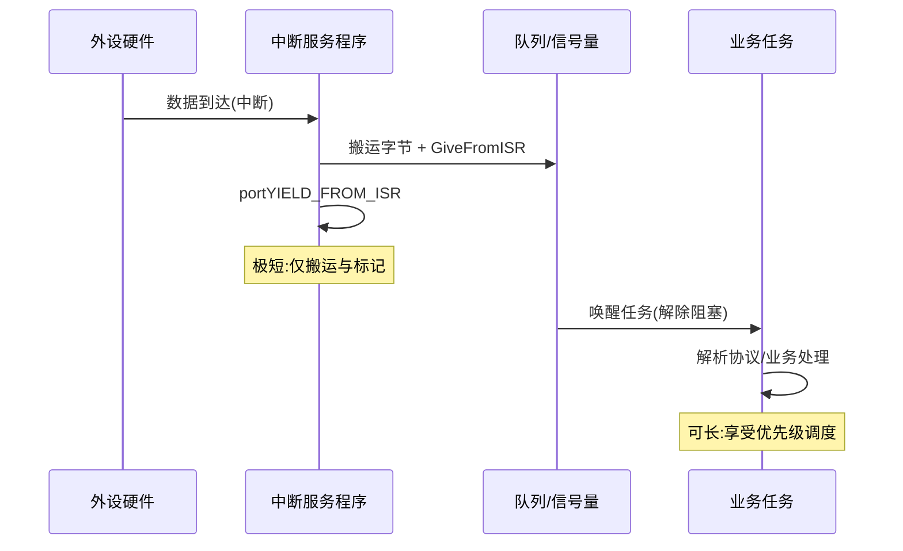

---

## 十一、性能调优方法论

调优不是"拍脑袋改优先级"，而是**先测量、定位瓶颈、再针对性改造、再验证**的闭环。下面给出三大支柱。

### 11.1 栈大小评估

前文已述水位线法。补充一点工程纪律：在每个关键任务的入口周期性打印/上报 `uxTaskGetStackHighWaterMark`，建立"栈余量看板"，把"曾经最低余量"纳入 CI 回归——一旦某次提交把余量压到红线以下就报警。这比事后排查踩内存高效得多。

### 11.2 优先级分配原则

- **按截止时间/实时性分配**，而非按"功能重要程度"的直觉。截止时间越紧、抖动容忍越小，优先级越高；
- **把"高频短任务"与"低频重任务"分层**：高频中断相关任务高优先级但极短，重计算任务低优先级；
- **避免过多优先级**导致调度器维护成本上升，也避免"优先级泛滥"使真正的紧急任务被淹没；
- **Idle 任务（优先级 0）只做兜底**，不要把任何业务塞进去（除非用 Idle 钩子做低功耗）；
- 在 AUTOSAR OS 中，优先级与 `Alarm`、`Schedule Table` 配合，遵循 OSEK/VDX 的时间确定性约定。

### 11.3 抖动（Jitter）来源与抑制

抖动指"周期性任务实际触发时间相对理想周期的偏差"。主要来源：

1. **长临界区/长关中断**：阻塞了高优先级任务与节拍；
2. **高优先级任务/ISR 抢占**：低优先级周期任务被不定期打断；
3. **Cache/总线竞争**：关键代码不在 TCM、DMA 抢占总线；
4. **tick 粒度粗**：以 1 ms tick 调度 10 ms 周期任务，本身就有 ±1 ms 量化抖动；
5. **浮点/除法等不可预测指令**：执行时间数据相关。

抑制手段：

- 临界区用"挂起调度"替代"关中断"，并进一步用锁粒度细化；
- 热路径代码与数据放进 ITCM/DTCM（零等待访问、确定延迟）；
- 关键 ISR 锁定 Cache（如 Cortex-M7 的 Cacheable/Write-through 策略 + TCM）；
- 用**高精度定时器硬件**直接触发任务（如 FreeRTOS 的 Timer 任务 + 硬件定时器，或裸用 TIM+DMA），绕过 tick 量化；
- 用 `-O2` 编译、避免 `-O0`（大量栈操作拖慢且难预测）；
- 统一浮点 ABI，启用硬 FPU，并确保中断栈也预留 FPU 现场。

下面用流程图梳理调优闭环：

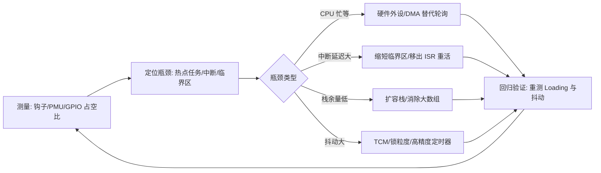

---

## 十二、主流 RTOS 对比与选型考量

市场上可选的 RTOS 众多，下表给出常见选手的定性对比（参数均为公开常见范围，具体以各版本发布说明为准）：

| RTOS | 内核模型 | 典型场景 | 许可证 | 生态/工具 | 特色 |
| --- | --- | --- | --- | --- | --- |
| FreeRTOS | 抢占+时间片，单核为主 | 通用 MCU、汽车配件 | MIT | AWS 生态、Tracealyzer | 轻量、移植广、FromISR 完善 |
| RT-Thread | 抢占，组件丰富 | 物联网/国产 MCU | Apache-2.0 | 国内生态、RT-Thread Studio | 设备框架、文件系统完善 |
| Zephyr | 抢占，微内核+设备树 | 复杂 IoT、可认证 | Apache-2.0 | 设备树、West、丰富驱动 | 模块化、可裁剪、安全特性强 |
| μC/OS-II/III | 抢占，确定性强 | 工业/安全关键 | 商用/开源变体 | 书籍与认证资料丰富 | 代码规范、可认证（SIL） |
| ThreadX / Azure RTOS | 抢占，极低开销 | 消费/通信/汽车 | MIT（现 Eclipse ThreadX） | 微软生态、FileX/NetX | 高性能、安全子系统（Guarded） |
| AUTOSAR OS | 静态配置、OSEK 风格 | 汽车 ECU（Classic） | 商用规范 | 依供应商工具链 | 时间保护、内存保护、天花板协议 |

选型考量维度：

- **安全认证需求**：功能安全（ISO 26262 ASIL）项目优先考虑已通过认证变体的 RTOS（如 μC/OS 安全版、AUTOSAR OS、某些经 TÜV 认证的 Zephyr/ThreadX 配置）；
- **硬件平台与生态**：是否已有 BSP、驱动、调试工具链（NXP S32K 多用 S32DS + FreeRTOS/AUTOSAR，STM32 多用 STM32Cube + FreeRTOS/ThreadX）；
- **确定性 vs 灵活性**：AUTOSAR OS 静态配置确定性最强但灵活性低；Zephyr 灵活但配置复杂度高；
- **团队能力与社区**：国内团队对 RT-Thread 熟悉度高，全球化项目 FreeRTOS/Zephyr 资料更全；
- **许可与商业条款**：商用产品务必核对许可证对"分发/修改/商标"的要求。

---

## 十三、常见调试坑与实战经验

1. **优先级设反导致饿死**：把非关键日志任务设为最高优先级，控制任务被压到最低，结果控制任务长期得不到调度。调试：用任务运行时间统计（run time stats）或示波器打 GPIO 看各任务实际占空比。
2. **关中断时间过长**：在 ISR 里 `printf`、做复杂计算、甚至 `malloc`。调试：审查 `__disable_irq`/`taskENTER_CRITICAL` 配对，或在 ISR 入口/出口打 GPIO 测量 ISR 实际耗时。
3. **volatile 缺失导致寄存器读写被优化**：现象是"代码逻辑对，但硬件没反应"。调试：看反汇编确认每次访问都生成真正的 `LDR/STR`；所有硬件寄存器映射必须 `volatile` 修饰。这正是本文开头案例的根因——用 8 位 `char` 去存 32 位事件标志，位域被截断，调度器漏读高位就绪位。
4. **浮点 ABI 不一致造成偶发崩溃**：App 用硬浮点、某库用软浮点，调用约定（S 寄存器 vs D 寄存器保存）不一致。调试：统一编译选项，确认中断栈也分配了 FPU 现场保存区（见第五章 MPU/FPU 视图）。
5. **栈溢出静默踩内存**：表现为偶发数据错乱。调试：水位线 + MPU 守护 + 最坏工况跑测。
6. **在中断里调用非 FromISR 的 API**：破坏调度器内部临界区，导致系统随机卡死。调试：静态扫描 ISR 中所有 RTOS 调用，强制只用 `...FromISR` 版本。
7. **队列传指针导致脏读**：发送方发送指向局部/复用缓冲的指针，接收方读到时内存已被改写。调试：传值或使用专用内存池（带所有权转移语义）。
8. **忘记 portYIELD_FROM_ISR**：ISR 唤醒了高优先级任务却没请求调度，任务延迟一个 tick 才跑，引入周期性抖动。调试：检查所有 `...FromISR` 出参是否被正确传递。
9. **看门狗由空转死循环喂**：程序跑飞但仍空转时狗不叫，失去意义。应改为由关键任务链周期性确认喂狗（见第十四章）。
10. **DMA 与 CPU 缓存一致性**：带 Cache 的 MCU 上，DMA 改写的内存可能在 Cache 里是旧值（或反之），表现为"数据偶尔错位"。调试：对 DMA 缓冲区使用 non-cacheable 内存或手动 `SCB_InvalidateDCache` / `CleanDCache`。

---

## 十四、看门狗与调度器协同喂狗

RTOS 里喂狗策略讲究"活性证明"。若由单一死循环喂狗，程序"跑飞但仍在空转"时狗不叫，失去意义。正确做法是**由调度器或关键任务链周期性喂狗**：只有所有关键任务都在预期时间内跑过一遍，看门狗才被喂；某个任务卡死或超时未执行，狗就触发复位。

配合**窗口看门狗（WWDG）**，还要求喂狗必须落在时间窗口内——过早（初始化乱跳）或过晚（任务卡死）都算错，对"时序跑飞"比独立看门狗（IWDG）更敏感。在 BMS 这类安全场景，喂狗链要覆盖采样任务、通信任务、均衡控制，缺一不可。一种实现是让一个"监控任务"周期性检查各关键任务的"心跳计数器"（每轮自增），若某计数器在窗口内未更新则主动触发安全复位。

---

## 十五、MCAL 配置说明（AUTOSAR OS 模块）—— 新增核心章节 C

在 Classic AUTOSAR 工具链（如 Elektrobit tresos Studio、ETAS ISOLAR/DAVINCI Configurator、Vector DaVinci）中，RTOS 被具体化为 **AUTOSAR OS 模块（Os）**，它与 MCAL 层（尤其是 Mcu、GPT、Wdg 等）紧密耦合。本节说明 Os 的配置对象、定时器绑定、优先级映射、看门狗集成，以及"配置 → 代码生成 → 调用"的完整路径。

### 15.1 AUTOSAR OS 的核心配置对象

AUTOSAR OS 是**静态配置、OSEK/VDX 风格**的调度器，主要对象包括：

- **Task（任务）**：分为基本任务（Basic Task，仅有 Ready/Running/Suspended，靠事件激活）与扩展任务（Extended Task，额外有 Waiting 态，可等待 Event）。配置项含 `OsTaskPriority`、`OsTaskStackSize`、`OsTaskActivation`（最大激活次数）、`OsTaskSchedule`（FULL 可抢占 / NON，同优先级不抢占）。
- **Event（事件）**：仅扩展任务可等待，用于任务间同步，配置 `OsEvent` 并绑定到某 Task。
- **Resource（资源）**：用于互斥，配置 `OsResourcePriority`（天花板优先级）实现天花板协议，避免优先级反转与死锁。
- **Counter（计数器）**：软件/硬件计数源，是 Alarm 与 Schedule Table 的时间基准。硬件 Counter 由 MCU 定时器（SysTick 或 GPT）驱动。
- **Alarm（警报）**：绑定到某个 Counter，当计数值到达设定点触发动作（`ActivateTask` / `SetEvent` / `CallCallback` / 调用 `OsWdgMTrigger` 等）。
- **Schedule Table（调度表）**：比 Alarm 更强的时间编排，按固定周期激活一组任务/事件，支持绝对/相对过期策略，是汽车 ECU 周期性调度的首选。

### 15.2 Os 如何绑定 MCU 定时器（SysTick 或 GPT）

在 MCAL 层，**Mcu 模块**负责时钟树配置（把 HSE/PLL 输出 HCLK 供给内核）；**Os 模块的 Counter** 通过 `OsCounter` 的 `OsCounterTicksPerBase` / `OsCounterSecondsPerTick` 映射到硬件计时源。常见两种绑定方式：

1. **绑定 Cortex-M 内核 SysTick**：Os 生成代码中，`Os_SysTick_Isr`（或供应商命名 `OsTick`）作为 SysTick 异常 Handler，每次 tick 调用 `Os_IncrementCounter()`，驱动所有挂在该 Counter 上的 Alarm/Schedule Table。优点：无需额外外设，节拍精确（见第五章 5.3）。
2. **绑定 GPT（General Purpose Timer，MCAL 外设）**：当 SysTick 已被别的用途占用或多核需要独立节拍时，Os Counter 可绑定到一个 GPT 通道（如 S32K 的 LPIT、STM32 的 TIM）。由 `Gpt_StartTimer` 启动，GPT 比较匹配中断里调用 Os 的 Counter 递增接口。

> 关键配置项：`OsCounterMaxAllowedValue`、`OsCounterTicksPerBase`、`OsCounterMinCycle`（调度表最短周期）。这些值必须与所选定时器时钟频率一致，否则节拍周期计算错误，所有定时任务失准。

### 15.3 任务优先级与 AUTOSAR 优先级映射

AUTOSAR Os 的 `OsTaskPriority` 是**数值越大优先级越高**（与 FreeRTOS 一致，但注意 μC/OS 数值越大优先级越高、而某些 RTOS 反之，迁移时务必对齐）。映射原则：

| 任务/对象 | 建议 AUTOSAR 优先级 | 说明 |
| --- | --- | --- |
| Idle / 后台 Task | 0（最低） | 仅兜底，等价于 FreeRTOS Idle |
| 通信接收 Task | 中（如 4） | 高频但处理短 |
| 控制算法 Task | 高（如 8） | 截止时间紧 |
| 安全关断 Task | 最高（如 15） | 抖动容忍最小 |
| Os 内部/ISR 类别 | 高于所有任务 | ISR 类别 1/2 由 Os 管理，不占任务优先级 |

注意：AUTOSAR 任务的优先级**只在同 OS Application 内严格排序**；跨 OS Application 的免干扰由 Timing/Memory Protection 保证，而非单纯优先级。

### 15.4 WdgM 与 OS 看门狗集成

在 AUTOSAR 安全项目中，**WdgM（Watchdog Manager）** 独立于 Os，但两者必须协同：

- **周期性触发**：配置一个 Os Alarm / Schedule Table 条目，周期调用 `WdgM_MainFunction()`（或经 `OsWdgMTrigger` 动作），由 WdgM 决定是否喂硬件看门狗（经 WdgIf → Wdg 驱动）。
- **活性监督（Alive Supervision）**：每个被监督的任务在其执行路径上调用 `WdgM_CheckpointReached()` 上报"心跳"。若某任务在监督窗口内未到达检查点，WdgM 记一次失效；超过配置的 `WdgM Failed Supervisor Threshold` 后执行降级/复位。
- **截止时间监督（Deadline Supervision）**：`WdgM_CheckpointReached()` 成对调用可测"两段代码间隔"，超时被判定为时序失效。
- **逻辑监督（Logical Supervision）**：通过图（Graph）定义合法检查点跳转序列，防止控制流被篡改。

典型集成路径：`Os Schedule Table 周期激活 WdgM_MainFunction → WdgM 汇总各任务 Checkpoint → 调用 WdgIf_SetTrigger → Wdg 驱动喂 IWDG/WWDG`。这实现了第十四章所述的"关键任务链活性证明"喂狗策略。

### 15.5 EB tresos / DaVinci 配置项清单（表格）

下表汇总在 EB tresos Studio（NXP S32K 常用）与 Vector DaVinci Configurator（ETAS/通用）中，Os 与关联模块的关键配置项：

| 模块 | 配置项 | 含义 / 取值建议 | 影响 |
| --- | --- | --- | --- |
| Os / General | `OsStatus` | `STANDARD` / `EXTENDED` | EXTENDED 下 API 返回详细错误，调试期建议开启 |
| Os / Task | `OsTaskPriority` | 0（低）~ 最高（依芯片） | 调度抢占顺序 |
| Os / Task | `OsTaskStackSize` | 字节数，含 FPU 现场余量 | 栈溢出风险 |
| Os / Task | `OsTaskSchedule` | `FULL` / `NON` | 同优先级是否抢占 |
| Os / Task | `OsTaskActivation` | ≥1 | 最大并发激活次数 |
| Os / Counter | `OsCounterMaxAllowedValue` | < 2^32 | 计数上限 |
| Os / Counter | `OsCounterTicksPerBase` | 与定时器时钟匹配 | tick 周期精度 |
| Os / Alarm | `OsAlarmAction` | ActivateTask/SetEvent/Callback | 到时动作 |
| Os / ScheduleTable | `OsScheduleTableDuration` | 调度表周期 | 周期性编排 |
| Os / Resource | `OsResourcePriority` | 天花板优先级 | 互斥与反转/死锁抑制 |
| Os / Protection | `OsTimingProtection` | 开启执行预算/持锁上限 | 时间保护 FFI |
| Mcu / Clock | `McuSysClockFrequency` | HCLK 频率 | 决定 SysTick 节拍计算 |
| Gpt / Channel | `GptChannelMode` | CONTINUOUS/ONE_SHOT | Os Counter 硬件源 |
| WdgM / Supervised | `WdgMAliveSupervision` | 监督窗口/阈值 | 活性喂狗 |
| WdgM / Checkpoint | `WdgMCheckpoint` | 任务内上报点 | 心跳/截止监督 |

### 15.6 配置 → 生成代码 → 调用路径

AUTOSAR 开发是"配置驱动"的：工程师在图形工具里填好上述对象，工具（RTE Generator + Os Generator）生成 `Os_Cfg.c/.h`、`Os_Lcfg.c` 等，应用层通过标准化 API 调用。完整路径如下：

```mermaid
flowchart TD
    A[工程师在 EB tresos/DaVinci 中配置<br/>Task/Event/Resource/Counter/Alarm/ScheduleTable] --> B[Os Generator 读取 .xdm/.arxml]
    B --> C[生成 Os_Cfg.c / Os_Lcfg.c / Os.h]
    C --> D[链接进应用: 调用 StartOS(AppMode)]
    D --> E[SysTick/GPT 中断 → Os Tick Handler]
    E --> F[Os 推进 Counter → 触发 Alarm/ScheduleTable]
    F --> G[ActivateTask/SetEvent → 调度器切换任务]
    G --> H[应用任务调用 WdgM_CheckpointReached]
    H --> I[WdgM_MainFunction(由Os Alarm周期触发) → 喂狗]
```

工程要点：

- `StartOS()` 必须在 `main()` 完成 Mcu/Port/Os 初始化后调用，之后系统进入调度循环，**不会返回**。
- 生成的 Os 代码与应用通过 `ActivateTask()`、`WaitEvent()`、`GetResource()`、`ReleaseResource()` 等标准接口交互，应用不直接操作 PendSV/SysTick 寄存器（那属于 Os 内部实现）。
- 多核（如 S32K3xx）需为每个核单独配置一个 Os 实例，并通过 `OsApplication` 与 `IOC`（Inter-OS-Application Communicator）做核间通信，跨核同步不能用普通信号量。

---

## 十六、面试题精选（20+ 道含要点）

以下题目覆盖原理、设计与排错，可作为工程师自测与面试参考。

1. **RTOS 与前后台系统的本质区别？**
   要点：多任务/私有栈/优先级调度/IPC 抽象；裸机单栈单线程、顺序即优先级、响应延迟不可分析。

2. **抢占式、时间片轮转、协作式调度分别适用什么场景？**
   要点：抢占用于实时；时间片用于同优先级公平；协作简单但实时性差，现代少单独用。

3. **任务五态状态机及其转换事件？**
   要点：就绪/运行/阻塞/挂起/删除；阻塞是等事件，挂起是外部强制，删除后由空闲任务回收。

4. **上下文切换发生在哪些时机？**
   要点：tick、主动阻塞/让出、ISR 中 FromISR 请求调度、删除/挂起/恢复。

5. **一次上下文切换的开销如何测量？**
   要点：GPIO+逻辑分析仪、run time stats、DWT_CYCCNT 周期计数器；含/不含 FPU 差异大。

6. **什么是优先级反转？给出火星探路者案例的教训。**
   要点：H 被 M 通过 L 间接阻塞；解决用 PIP 或天花板协议。

7. **优先级继承（PIP）与优先级天花板（Ceiling）的区别？**
   要点：PIP 动态按需提升、只解反转不解死锁；天花板静态顶到上限、能抑制死锁、可静态分析；AUTOSAR Resource 用天花板。

8. **互斥量和二值信号量的本质区别？**
   要点：互斥有所有权+PIP、不能在 ISR 用、用于保护资源；二值用于事件通知、可 ISR give。

9. **消息队列传递指针有什么风险？如何规避？**
   要点：发送方复用内存导致消费者脏读；传值或用专用内存池。

10. **死锁的四个 Coffman 条件？如何用资源分级法避免？**
    要点：互斥/占有等待/不可剥夺/循环等待；按资源编号递增申请破除循环等待。

11. **活锁是什么？与死锁的区别？如何避免？**
    要点：不断重试让出却不推进；引入退避与随机化、固定仲裁顺序。

12. **栈溢出检测有哪些手段？uxTaskGetStackHighWaterMark 的返回值含义？**
    要点：水位线、MPU 守护、链接脚本余量；返回"历史最小剩余字数"，需最坏工况跑测。

13. **中断延迟由哪些部分构成？如何降低？**
    要点：关中断最长时间+最高优先级执行时间+硬件同步；缩短临界区、用挂起调度替代关中断、热路径 TCM。

14. **为什么 ISR 中必须用 FromISR 版本 API？portYIELD_FROM_ISR 的作用？**
    要点：保护调度器临界区；出参指示是否唤醒更高优先级任务，需在 ISR 末尾触发 PendSV 调度。

15. **为什么浮点 ABI 不一致会导致偶发崩溃？**
    要点：硬/软浮点调用约定（S/D 寄存器保存）不同；统一编译选项并给中断栈留 FPU 现场。

16. **volatile 对硬件寄存器访问为什么必须？**
    要点：防止编译器优化掉"看似无用"的读写；寄存器是易变硬件状态，必须每次真访问。

17. **为什么用 8 位类型存 32 位事件标志是 Bug？**
    要点：第 8 位及以上被静默截断，调度器漏读高位就绪位，导致高优先级任务被延后；须用 `volatile uint32_t`。

18. **DMA 与 CPU Cache 一致性问题如何产生与解决？**
    要点：Cache 与内存视图不一致导致 DMA 数据错位；用 non-cacheable 缓冲或手动 Clean/Invalidate DCache。

19. **看门狗为什么不该由单一死循环喂？窗口看门狗的特殊要求？**
    要点：跑飞空转狗不叫；WWDG 要求窗口内喂狗，对时序跑飞更敏感。

20. **SysTick 是几位计数器？LOAD/VAL/CALIB 的位域分别是什么？**
    要点：24 位递减；LOAD[23:0] 重装、VAL[23:0] 当前、CALIB 含 TENMS[23:0]/SKEW/NOREF；CTRL 含 ENABLE/TICKINT/CLKSOURCE/COUNTFLAG。

21. **PendSV 与 SVC 在 RTOS 中分别扮演什么角色？**
    要点：SVC 用于安全启动首个任务（从 Handler 切回 Thread 模式）；PendSV 设最低优先级，承载真正上下文切换，利用尾链在所有 ISR 返回后才执行。

22. **NVIC 的尾链（Tail-Chaining）与迟滞（Late-Arrival）是什么？对 RTOS 有何意义？**
    要点：尾链省去连续异常的冗余出/入栈；迟滞让高优先级异常在入栈途中抢先；二者保证 PendSV 切换与高优先级 ISR 零冗余开销。

23. **AUTOSAR Os 的 Counter 如何绑定硬件定时器？WdgM 怎样与 Os 协同？**
    要点：Counter 通过 OsCounterTicksPerBase 映射 SysTick 或 GPT；Os Alarm/ScheduleTable 周期调用 WdgM_MainFunction，任务内 WdgM_CheckpointReached 上报心跳，实现活性证明喂狗。

---

## 十七、可视化追踪与 Trace 工具链

调优的前提是"看得见"。当系统出现偶发抖动、某任务突然长时间不运行时，靠猜是低效的。成熟的工程团队会建立 Trace 能力，把调度行为可视化。

**软件埋点法**：FreeRTOS 提供 `traceTASK_SWITCHED_IN/OUT`、`traceBLOCK_ON_SEMAPHORE` 等钩子宏，可重定向到自定义记录器；RT-Thread 有 `ulog`/`trace` 组件；Zephyr 有 `tracing` 子系统（支持 SEGGER SystemView 后端）。这些钩子在每个调度事件点回调，开销可控（通常几十纳秒级），能完整重建任务切换时间线。

**商业可视化工具**：SEGGER SystemView 与 Percepio Tracealyzer 是两大主流。它们把"任务就绪/运行/阻塞/切换/ISR"渲染成甘特图，工程师一眼就能看出：哪个任务占用了过长 CPU、哪次切换引发了优先级反转、哪把锁竞争最激烈、上下文切换是不是过密。在排查"周期性任务偶尔被拖后"这类问题时，甘特图比任何日志都直观。

**硬件跟踪**：带 ETM/ITM（Cortex-M 的 Instrumentation Trace Macrocell）的芯片，可以通过 SWO 引脚把 PC 采样、数据访问、事件包实时流出，配合 IDE 还原函数级耗时，且不占用应用 CPU。这对"测一段热点函数真实 WCET"非常有价值。

**最低成本的 GPIO 打点法**：在关键路径入口/出口翻转一个 GPIO，用逻辑分析仪抓波形。例如在每个任务循环翻转不同引脚，就能直接看到各任务的占空比与相互抢占关系，是嵌入式工程师的"万用表"。它的缺点是侵入式且只能看少数信号，但胜在零依赖、立即可用。

下面给出"Trace 驱动排查抖动"的典型流程：

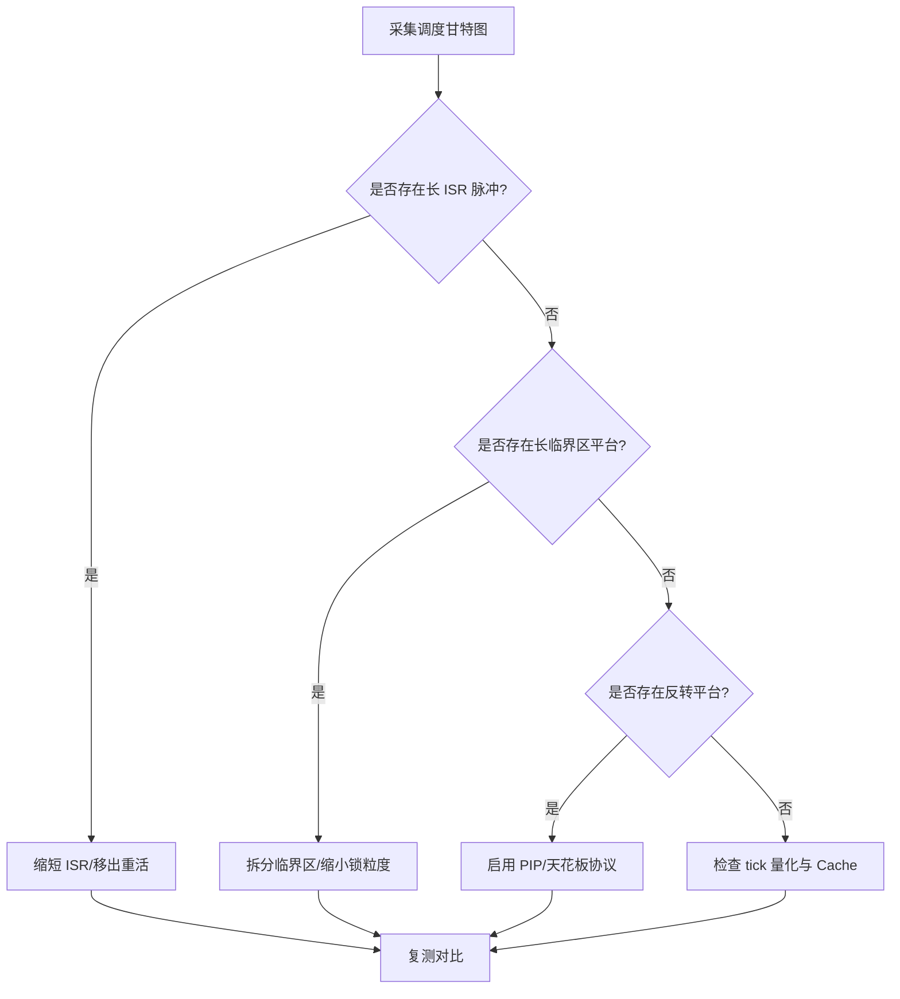

## 十八、Tickless 低功耗与空闲任务机制

在汽车休眠、常电节点待机等场景，CPU 不能一直跑 tick。FreeRTOS 的 **Tickless 模式（configUSE_TICKLESS_IDLE）** 给出优雅解法：当调度器发现"接下来一段时间内没有任务需要运行"（只剩 Idle 任务）时，停止周期性 tick 中断，让 MCU 进入低功耗睡眠；同时根据下一个预定唤醒事件（延时到期、定时器、外部唤醒源）计算最长睡眠时长，到点由低功耗定时器或外部中断唤醒并补偿 tick 计数。

要点与陷阱：

- **空闲任务（Idle Task）** 是优先级最低的系统任务，除了兜底调度还常承载"空闲钩子"与"删除任务的 TCB/栈回收"。不要把业务塞进 Idle 钩子，否则会拖长无法睡眠的窗口；
- **tick 补偿**：长时间停 tick 后，系统时间（如 `xTaskGetTickCount`）需要按实际睡眠时长补齐，否则相对延时语义漂移；
- **唤醒源冲突**：低功耗定时器与看门狗要协调，避免"睡太死导致狗饿死"；
- **实时性折中**：睡眠越深、唤醒越慢，唤醒延迟会叠加到中断响应上，安全关键路径要评估是否允许 Tickless。

## 十九、AUTOSAR OS 的时间与内存保护（汽车特有）

在 Classic AUTOSAR 生态里，OS 不是"通用调度器"，而是围绕**功能安全**高度静态配置的对象，其最具特色的是两类保护机制，值得单独说明。

**时间保护（Timing Protection）**：配置项包含"执行时间预算（Execution Budget）""锁（资源/中断）持有时间上限""任务/中断的激活间隔抖动上限"。一旦某任务超出预算或持锁超时，OS 直接上报 `E_OS_PROTECTION_*_TIMING` 故障，由 Protection Hook 决定是终止任务、重启分区还是系统复位。这从机制层面保证了"一个失控任务不会无限霸占 CPU"，是时间维度的 Freedom From Interference（FFI）。

**内存保护（Memory Protection）**：通过 MPU 把不同 OS Application（可理解为"分区"）的栈、数据、代码隔离。某分区写越界不会踩坏别的分区，触发 `E_OS_PROTECTION_MEMORY`。在 ASIL 等级不同的软件共存（混合关键度）时，这是满足 ISO 26262 "免干扰"要求的关键手段（与第五章 5.5 的 MPU 栈守卫一脉相承）。

与通用 RTOS 相比，AUTOSAR OS 牺牲了动态灵活性（任务/资源多在生成期静态确定）换取**可认证、可静态分析的时间与空间确定性**。在选型时，若项目走 AUTOSAR 工具链，则 OS 由供应商（如 Vector、ETAS、Elektrobit）提供，开发者重点关注配置正确性而非内核实现（见第十五章）；若走轻量 MCU 自研栈，则 FreeRTOS/Zephyr 等更灵活，但时间/内存保护需自行借助 MPU 与监控任务补充。

## 二十、工程实测：延迟与抖动的量化测量（含真实数据）

调优的第一原则：**先有尺子，再谈优化**。很多团队凭"感觉某个 ISR 很慢"去改代码，结果越改越乱。本节给出两套可落地的测量法，并给出一个 Cortex-M4 @ 120MHz 平台的真实延迟预算参考值——这些数字能把"实时性"从玄学变成可验收的指标。

### 20.1 DWT CYCCNT 法：零侵入的周期计数

Cortex-M 内置的 DWT（Data Watchpoint and Trace）单元有一个 **CYCCNT** 计数器，每个内核时钟自增，可读出任意两段代码之间的精确周期差。这种方法不占用 GPIO、不影响调度，是测量"关键路径耗时"的首选。

```c
/* 使能 DWT CYCCNT（Cortex-M3/M4/M7/M33 通用） */
static inline void dwt_init(void) {
    CoreDebug->DEMCR |= CoreDebug_DEMCR_TRCENA_Msk;   /* 开跟踪 */
    DWT->CYCCNT = 0;
    DWT->CTRL  |= DWT_CTRL_CYCCNTENA_Msk;             /* 启动计数器 */
}
static inline uint32_t dwt_now(void) { return DWT->CYCCNT; }

/* 测量一段关键路径 */
uint32_t t0 = dwt_now();
do_critical_sampling();                 /* 被测函数 */
uint32_t dt = dwt_now() - t0;           /* 周期差 */
/* @120MHz: 1 cycle ≈ 8.33 ns，dt*8.33ns = 实际耗时 */
```

注意：CYCCNT 是 32 位，@120MHz 约 35.8 秒回绕，单次测量不会溢出；若被测段可能超 35 秒（基本不可能），需处理回绕。

### 20.2 GPIO + 逻辑分析仪法：看"抢占关系"

当想看**任务/ISR 之间的相互抢占与时间占比**时，软件计数器不够直观。最便宜有效的办法是在关键路径翻转一个 GPIO，用逻辑分析仪抓波形：

```c
/* 在任务循环 / ISR 入口翻转引脚，LA 直接看占空比与抢占 */
#define MARK()  (GPIOA->BSRR = (1u << 8))        /* 置高 PA8 */
#define UNMARK() (GPIOA->BSRR = (1u << (8+16)))  /* 清低 PA8 */

void vHighFreqTask(void *pv) {
    for (;;) {
        MARK();
        do_work();
        UNMARK();
        vTaskDelay(1);
    }
}
```

三个引脚分别标记"高优任务""低优任务""某 ISR"，就能在 LA 上一眼看出：高优任务是否被长 ISR 打断、低优任务占了多少 CPU。这是嵌入式工程师的"万用表"，零依赖、立即可用。

### 20.3 一个真实的延迟预算表（Cortex-M4 @ 120MHz）

下面是一颗典型 Cortex-M4（120 MHz，无 FPU 或 FPU 已使能且上下文已含）的中断/切换延迟分解参考值。注意这些是**典型/目标值**，具体因芯片 Flash 等待态、是否开 Cache、编译器优化等级而异：

| 阶段 | 典型周期数 | 等效时间 @120MHz | 说明 |
| --- | --- | --- | --- |
| 硬件同步 + 取向量 | ~12 | ~100 ns | 硬件自动压栈/取异常向量 |
| 最长关中断窗口 | ≤ 20（目标） | ≤ 167 ns | 用 `BASEPRI` 而非 `PRIMASK` 缩短 |
| 尾链（Tail-chain）节省 | ~12 | ~100 ns | 背靠背异常省一次出/入栈 |
| 最高优先级 ISR 关键段 | 视业务 | — | 应控制在预算内 |
| PendSV 完整上下文切换 | 80~120 | 0.67~1.0 µs | 保存/恢复 R4–R11（含 FPU 另加） |
| **中断响应延迟**（引脚→ISR 首条指令） | **~20（含尾链）** | **~170 ns** | 实时性硬指标 |
| **任务切换延迟** | **~100~140** | **~0.8~1.2 µs** | PendSV 触发到新任务运行 |

工程验收时，把"中断响应延迟 ≤ 200 ns""任务切换 ≤ 1.5 µs"写进需求，再用 20.1/20.2 的方法实测签字，远比"应该够快"可靠。

### 20.4 抖动（Jitter）的测量与"画出来"

确定性不只看平均值，更看**最坏情况与平均的差（抖动）**。做法：用 CYCCNT 对同段逻辑采样 N 次（如 1000 次），统计 max / avg / p99：

```c
uint32_t samples[1000];
for (int i = 0; i < 1000; i++) {
    uint32_t t0 = dwt_now();
    do_critical_sampling();
    samples[i] = dwt_now() - t0;
}
/* 求 max / avg / p99；抖动 = max - avg；WCET = max */
```

若 `max` 远大于 `avg`（比如 120 µs vs 40 µs），说明存在**非确定来源**：cache miss、DMA 抢带宽、长临界区、动态内存分配等。把每次最大采样对应的上下文（当时在跑什么任务、是否在 DMA 中）记下来，就是定位抖动根因的钥匙。

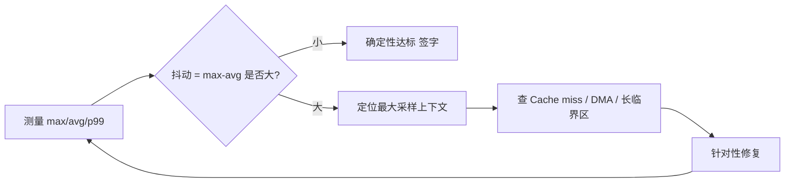

## 二十一、Cache / TCM / MPU 与确定性的工程权衡

通用 RTOS 调优到中段，瓶颈往往不是调度算法，而是**存储层次（memory hierarchy）的非确定性**。这一节把 cache、紧耦合内存（TCM）、MPU 放到一起讲清工程取舍。

### 21.1 Cache 对 WCET 的双刃剑

- **I-Cache**：加速取指，但命中率随执行路径波动，导致**同一段代码的耗时在不同次运行间起伏**——这正是 WCET 难定的根源。功能安全场景常要求"可分析的最坏执行时间"，cache 的存在让静态分析变复杂。
- **D-Cache**：加速数据访问，但**写回（write-back）策略**会引入不可预测的主存写回延迟；更麻烦的是与 **DMA 的一致性**：CPU 改了数据还在 cache 里没写回，DMA 读到的就是旧值（反之亦然），引发偶发数据错误。

### 21.2 写回 vs 写通，以及与 DMA 的协同

```c
/* DMA 缓冲区的一致性操作（Cortex-M7 典型） */
/* 1) CPU 填好发送缓冲，刷 cache 让 DMA 看到最新数据 */
SCB_CleanDCache_by_Addr((uint32_t *)tx_buf, tx_len);
start_dma_tx(tx_buf, tx_len);
/* 2) DMA 写入接收缓冲，失效 cache 让 CPU 看到 DMA 写的新值 */
wait_dma_rx_done();
SCB_InvalidateDCache_by_Addr((uint32_t *)rx_buf, rx_len);
process(rx_buf);
```

- **写通（write-through）**：CPU 写同时写 cache 和主存，DMA 一致性好，但每次写都访问主存，慢。
- **写回（write-back）**：CPU 写只进 cache，省主存带宽，但必须用 `Clean`/`Invalidate` 手动维护一致性，忘了就出偶发 bug。

工程取舍：对 DMA 频繁、对一致性敏感的区域，宁可标成 **non-cacheable**（靠 MPU）也不赌手动 clean 不出错。

### 21.3 把热路径搬进 TCM：确定性的"终局"

TCM（紧耦合内存）与内核同频、无等待态、无 cache 抖动，是实时性的最强保障。把**中断向量表、关键 ISR 代码、ISR 用到的数据、高优任务热循环**放进 ITCM/DTCM，可彻底消除 cache miss 带来的延迟尖刺。

```ld
/* 链接脚本片段：把关键函数放进 ITCM */
.fastcode : {
    *(.fastcode .fastcode.*)
} > ITCM AT > FLASH        /* 加载在 FLASH，运行在 ITCM */
```
```c
__attribute__((section(".fastcode"))) void CRITICAL_Isr(void) {
    /* 这段代码与访问的数据都在 TCM，执行时间高度确定 */
}
```

### 21.4 Cache 锁定（Cache Lockdown）

部分 Cortex（如 M7 的 cache way 锁定）支持把指定 cache way 锁给关键代码/数据，保证其常驻不淘汰。对"一小段必须零 miss"的算法（如控制回路、解密）很有用，但会牺牲其他代码的 cache 容量，需谨慎评估。

### 21.5 MPU 与 cache 属性一致性：最易踩的坑

MPU 区域的 **TEX/C/B/S** 属性描述"这段内存是什么类型"，必须与硬件实际连接一致，否则功能错乱：

| MPU 属性误配 | 后果 |
| --- | --- |
| 外设（Device）区误标成 Normal + cacheable | 访问被合并/乱序/读旁路边，破坏外设时序，寄存器写入丢失 |
| 带 cache 的 RAM 区忘了 clean 就给 DMA 用 | DMA 读到旧值，偶发数据错 |
| 代码区标成 XN（不可执行） | 取指 fault，直接 HardFault |
| 强序（Strongly-ordered）区滥用 | 性能暴跌（每次访问都等总线完成） |

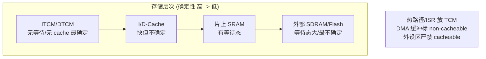

## 二十二、CoreSight 落地：用 DWT/ITM/ETM 把调度"画"出来

第十七章讲了 Trace 工具链，本节下沉到芯片级：如何用 ARM CoreSight 组件**亲手**把调度行为流出来，并重建时间线。这是"看得见"能力的真正底座。

### 22.1 DWT 数据/PC 采样

DWT 不止 CYCCNT，还有比较器（Comparator），可配置"当 PC 命中某地址（函数入口）时发事件"，或用 **PC 采样（PC Sampling）** 周期性记录正在执行的指令地址，事后统计热点函数占用。配置示例（示意）：

```c
/* DWT 比较器 0：当 PC == func_addr 时触发 */
DWT->COMP0 = (uint32_t)critical_func;
DWT->MASK0 = 0;                       /* 精确匹配 */
DWT->FUNCTION0 = (1 << DWT_FUNCTION0_FUNCTION_Pos);  /* 数据/PC 匹配事件 */
/* 事件经 SWO 流出，工具侧统计命中次数 = 函数执行频率 */
```

### 22.2 ITM 软件追踪：零（几乎）开销的事件通道

ITM（Instrumentation Trace Macrocell）提供 32 个激励端口（Stimulus），软件写 `ITM->PORT[x]` 即可把用户事件/printf 经 SWO 引脚流出，**不占用应用 CPU 时间**（写入若 SWO 空闲则瞬间完成，忙则丢弃或阻塞可选）。

```c
/* 在 FreeRTOS 任务切换钩子里打 ITM 事件（重建甘特图用） */
#define TRC_TASK_IN  0x01
#define TRC_TASK_OUT 0x02
void vTraceTaskSwitch(uint32_t task_id, uint8_t in_out) {
    if (ITM->TCR & ITM_TCR_ITMENA_Msk) {
        ITM->PORT[0].u8 = (in_out == 1) ? TRC_TASK_IN  : TRC_TASK_OUT;
        ITM->PORT[0].u16 = (uint16_t)task_id;   /* 紧跟任务 ID */
        /* 时间戳由 DWT CYCCNT 在工具侧对齐 */
    }
}
/* 启用 ITM：TCR.ITMENA=1, TER[0]=1, 并使能 SWO 时钟分频 */
```

### 22.3 ETM 指令流追踪

ETM（Embedded Trace Macrocell）追踪**指令执行流**，可还原函数级甚至基本块级的真实耗时，是 WCET 实测的利器。它需调试探头（J-Link/ULINKpro）与工具（SEGGER SystemView、Percepio Tracealyzer、开源 openOCD+perf）配合解码。代价是探头成本与一定配置复杂度，但在"偶发超时死活复现不了"时，ETM 的指令级回放无可替代。

### 22.4 重建调度时间线

把 22.2 的 ITM 切换事件 + 22.1 的 DWT 周期戳组合，即可在工具侧拼出完整甘特图：

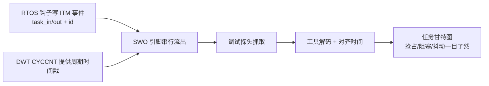

工程上，把"ITM 任务切换钩子 + Tracealyzer"作为默认配置，任何实时性问题的排查都能从一张甘特图开始，而不是从猜开始。

## 二十三、量产案例：一次"偶发超时"的根因深挖

把前面所有手段串起来，看一个真实风味的量产排查故事——它集中体现了"测量→画出来→定位→修复→复测"的闭环。

**现象**：某 BMS 主控的"电芯电压采样任务"偶发超期，导致 SOC 估算滞后，极端时误报"单体欠压"触发下电。故障概率极低（数千次采样偶发一次），QA 压力测试难复现。

**第一步，先测量**：在采样 ISR 入口/出口加 CYCCNT 打点，连续采样 10000 次。结果 `avg ≈ 38 µs`，但 `max ≈ 118 µs`——抖动高达 80 µs，远超任务周期预算（50 µs）。

**第二步，画出来**：用 ITM 钩子 + Tracealyzer 抓调度甘特图，发现所有超期样本都伴随一次**大块 CAN FD 接收 DMA**（整车报文批量刷入）。

**第三步，定位根因**：DMA 从外部 SRAM 批量搬数据，**冲刷了 D-Cache**，使采样 ISR 取指/取数 cache miss 暴增；同时 DMA 占住总线，ISR 等待存储访问拉长。根本原因是"DMA 缓冲区可 cacheable + 采样热路径在普通 SRAM"双重叠加。

**第四步，修复**：
1. 采样 ISR 与其数据搬入 DTCM（链接脚本 `.fastdata` → DTCM）；
2. CAN FD 的 DMA 接收缓冲区用 MPU 标为 **non-cacheable**，消除一致性维护负担；
3. 降低 DMA 流优先级并分片传输，避免单次长占总线；
4. 采样关键循环加 `__attribute__((section(".fastcode")))` 进 ITCM。

**第五步，复测签字**：同样 10000 次采样，`max` 回落到 45 µs，`avg` 39 µs，抖动 < 6 µs，满足预算。把"采样路径必须 TCM + DMA 缓冲 non-cacheable"写进项目编码规范，防止复发。

前后对比：

| 指标 | 修复前 | 修复后 | 目标 |
| --- | --- | --- | --- |
| 采样 ISR avg | 38 µs | 39 µs | — |
| 采样 ISR max（WCET） | 118 µs | 45 µs | ≤ 50 µs |
| 抖动 (max-avg) | 80 µs | 6 µs | 小 |
| 误报下电 | 偶发 | 0 | 0 |

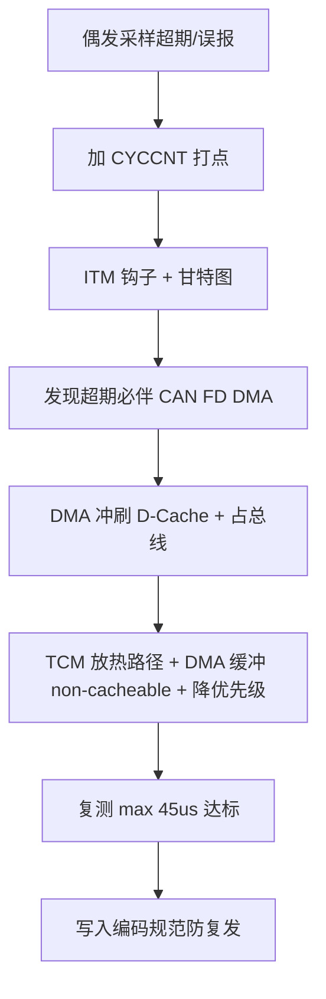

这个案例说明：**实时性故障几乎从不是"算法慢"，而是"非确定来源（cache/DMA/临界区）在特定时序下叠加"**。尺子（测量）和镜子（Trace）缺一不可。

## 二十四、结语

RTOS 调优从来不是"调几个优先级"那么简单。它是一条从任务模型、调度语义、IPC 正确性，一路延伸到临界区长度、Cache 策略、浮点 ABI、栈余量与 DMA 一致性的纵深链路；而链路的最底层，是芯片内部 NVIC 的嵌套优先级、SysTick 的 24 位节拍、PendSV 延迟切换与 MPU 栈守卫这些硬件机制。笔者在近年的 BMS 与底盘项目中反复验证：绝大多数"莫名其妙的实时性故障"，最终都能追溯到**数据类型位宽、临界区滥用、栈溢出、IPC 误用**这四类根因之一。

更进一步，当项目进入 AUTOSAR 体系，RTOS 就不再是"写几行 xTaskCreate"的自由世界，而是 `OsTask/OsCounter/OsAlarm/OsScheduleTable` 的静态配置 + 代码生成 + WdgM 活性监督的工程闭环。把本文的模型、芯片视图、移植层代码与配置清单内化为工程纪律，配合"先测量、再改造、后验证"的闭环，才能让 RTOS 在资源受限的汽车 MCU（无论是 STM32、S32K 还是其它 Cortex-M 平台）上既确定又高效。
