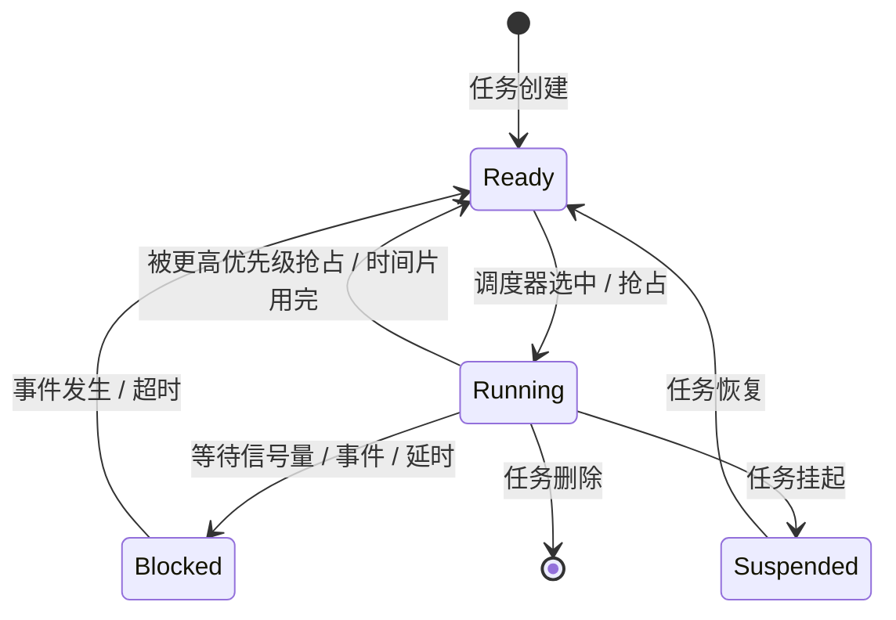
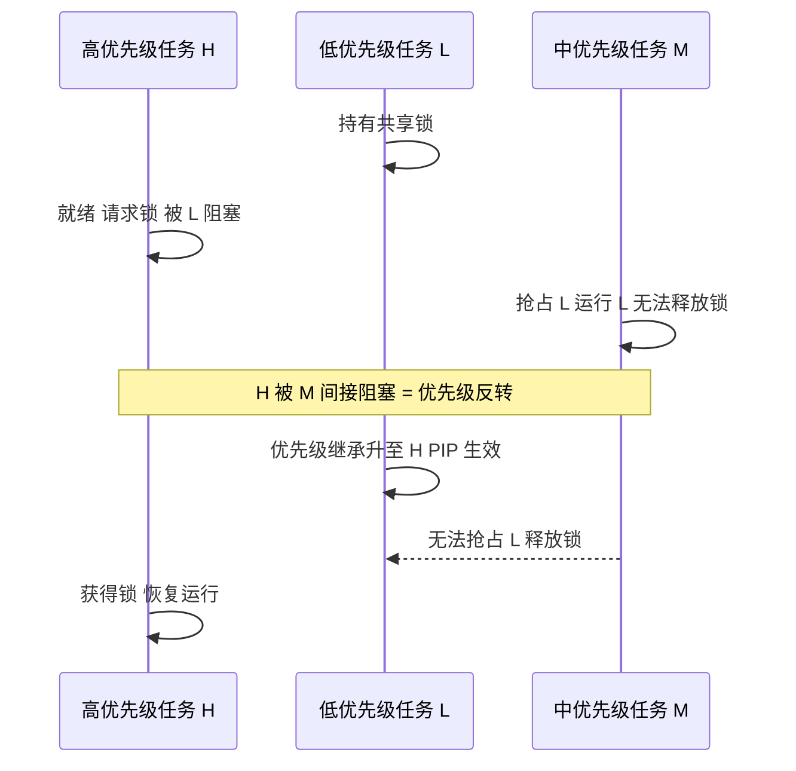

# RTOS 与系统调优：任务、调度与那些性能陷阱

## 一、凌晨的告警：抖动背后藏着 Bug

某日凌晨，整车 CAN 总线监控平台持续告警：BMS 周期性上报的电流报文出现**周期抖动**，名义 10ms 一帧，实测偶尔变成 13ms、15ms，同时 SPI 读取外部 ADC 的响应延迟明显变长。产线标定一度暂停。我们最初怀疑是中断被打断，但查调度日志发现 CPU Loading 当时已经逼近 80%，系统几乎被"喂不饱"。

更深的排查才揭开真相：RTOS 某个**中断标志位用了 8 位 char 类型去存 32 位事件标志**，在多事件并发时发生了位域截断——任务切换的判断逻辑读到错误的就绪位，导致高优先级报文发送被延后、SPI 传输被错误挂起。把类型改成 `volatile uint32_t` 后，抖动消失，CPU Loading 也随之回落。

这件事让我彻底明白：RTOS 调优不只是"调优先级"，更关乎**数据类型、临界区、Cache、DMA、浮点**等一系列底层细节。下面把这些点拆开讲。

## 二、调度模型：抢占、时间片与优先级反转

RTOS 的核心是调度器。主流是**抢占式优先级调度**：高优先级任务一旦就绪，立即抢占低优先级任务。同优先级任务之间则用**时间片轮转**按 tick 切片轮流执行。

优先级分配有个基本原则：按实时性/截止时间分配，关键任务拿高优先级。但这里有一个经典陷阱——**优先级反转（Priority Inversion）**：

> 高优先级任务 H 在等待低优先级任务 L 持有的锁；但此时中优先级任务 M 抢占 L 运行，导致 H 被 M "间接阻塞"，H 的实时性反而被 M 毁了。

**类比**：公司里老板（H）要等实习生（L）手里的文件才能签字，但此时一个经理（M）插队让实习生先帮自己干活，结果老板干等。解决方法是**优先级继承协议（PIP）**——L 一旦拿到锁，就临时把自己的优先级提升到 H 的级别，M 自然抢不过；或者用**优先级天花板（Ceiling）**——谁持锁谁直接升到"该锁天花板优先级"。AUTOSAR OS 的 Resource 机制底层就是这两种协议之一。

> 图：RTOS 任务典型状态机，状态切换由调度器与 IPC/延时事件驱动。



## 三、CPU Loading 怎么分析与压下来

定位 CPU Loading 高的手段有三类：RTOS 自带的 CPU 使用率钩子、逻辑分析仪/示波器打 GPIO 测任务占空比、性能计数器（PMU）采样。核心是**定位热点**——看哪个任务/中断占用时间最长，是轮询忙等、频繁中断，还是重计算。

我曾把某 BMS 项目 CPU Loading 从 **80%+ 降到约 60%**，靠的是一套"组合拳"：

1. **软件 IIC → 硬件 IIC**：免去 CPU 逐位操作轮询，把位时序交给外设硬件。
2. **全通道 DMA**：ADC/SPI/UART 的数据搬运交给 DMA，CPU 不再中断搬运。
3. **ITCM/DTCM 放热路径**：指令/数据走 TCM，减少访存延迟，保证 WCET 可控。
4. **开启硬浮点 FPU**：浮点运算不再用软模拟（libgcc 的 `__aeabi_*` 软浮点极慢）；但注意 ABI 一致性——中断上下文也要保存 FPU 现场，否则浮点寄存器会被破坏。
5. **调编译优化等级**：用 `-O2`（避免 `-O0` 大量栈操作拖慢；`-O3` 可能膨胀代码反而影响 Cache）。

```c
/* 一段典型的热点：软件 IIC 轮询（改造前） */
for (int i = 7; i >= 0; i--) {
    SDA_HIGH(); if (data & (1<<i)) SDA_LOW();
    SCL_HIGH(); delay_us(5); SCL_LOW();   /* CPU 全程被 delay 占用 */
}
/* 改造后：硬件 IIC + DMA，CPU 仅触发一次传输 */
I2C_StartTransfer(hi2c, &txdma, buf, len);  /* 中断/DMA 完成，CPU 去干别的 */
```

## 四、那个 8 位标志位的 Bug 全貌

回到开头的 Bug。RTOS 内部用一个"事件就绪位图"记录哪些任务就绪。假设设计上用 32 位编码（最多支持 32/64 个优先级组），但如果实现时图省事写成 `uint8_t flag`，那么：

- 第 8 位及更高的就绪标志被**静默截断**；
- 调度器在遍历就绪表时，漏掉被截断的高位任务；
- 表现为"某些报文周期变长、某些 SPI 传输被推迟"——因为对应任务的就绪状态没被正确识别。

**教训极其朴素但常被忽视：与外设寄存器、RTOS 内部标志位打交道，必须用匹配位宽，且加 `volatile`**。寄存器是易变的硬件状态，编译器若认为"这个值没被代码改过"就会优化掉读写；`volatile uint32_t` 才是正确姿态。这条规则适用于所有底层驱动，不仅是 RTOS 内核。

```c
/* 错误：位域被截断 + 编译器可能优化 */
uint8_t evt_flag;          /* 只能表示 0~7 位 */
/* 正确 */
volatile uint32_t evt_flag; /* 32 位，且禁止优化掉硬件访问 */
```

## 五、中断延迟与抖动来源

**中断延迟 = 关中断最长时间 + 最高优先级任务执行时间 + 硬件同步开销**。抖动来源主要有四方面：

1. **长临界区**：关了全局中断或拿了大锁，期间所有中断都被挡；
2. **高优先级任务抢占**：低优先级中断处理被高优先级任务打断；
3. **Cache miss**：关键 ISR 代码/数据不在 Cache，取指访存多周期；
4. **DMA 占用总线**：DMA  burst 抢走总线带宽，CPU 取指变慢。

优化方向：临界区尽量短、用锁而非关全局中断、热路径放 TCM、关键数据进 DTCM、固定 Cache 策略。在功能安全场景，还要保证 ASIL 任务有确定时间窗（时间维度的 FFI）。

> 图：优先级反转的发生与优先级继承协议（PIP）的修复过程，L 持锁时临时升到 H 的优先级。



## 六、常见坑与调试手段

1. **优先级设反导致饿死**：把非关键日志任务设成最高优先级，把控制任务压到最低，结果控制任务长期得不到调度。调试：打印各任务就绪/运行时间，或示波器打 GPIO 看各任务实际占空比。
2. **关中断时间过长**：在 ISR 里做 `printf`、复杂计算，甚至调 `malloc`。调试：用 `__disable_irq()` 配对 `__enable_irq()` 的调用栈审查，或在 ISR 入口/出口打 GPIO 测 ISR 实际耗时。
3. **volatile 缺失导致寄存器读写被优化**：现象是"代码逻辑对，但硬件没反应"。调试：看反汇编，确认每次访问都生成了真正的 `LDR/STR`；用 `volatile` 修饰所有硬件寄存器映射。
4. **浮点 ABI 不一致造成偶发崩溃**：App 用硬浮点、某库用软浮点，调用约定（S16 vs D8 保存）不一致。调试：统一编译选项，确认中断栈也分配了 FPU 现场保存区。

## 七、任务栈溢出：看不见的定时炸弹

RTOS 每个任务有独立栈，栈溢出是隐蔽故障之王：它不会立刻崩溃，而是悄悄踩坏相邻任务/全局变量的内存，表现为"偶发数据错乱""莫名其妙重启"。检测手段有三：

1. **栈水位标记（Stack WaterMark）**：RTOS 创建任务时把栈填特定魔术值（如 `0xCD`），运行时统计被改写的最低水位，若剩余低于阈值就告警；
2. **MPU 栈守护区**：在栈底之后划一块 MPU 保护区，一旦越界访问立即触发 MemManage Fault；
3. **链接脚本预留**：给关键任务栈放大余量，避免峰值调用（如中断嵌套 + 深函数调用）击穿。

**经验值**：栈大小不是拍脑袋，应在最坏调用深度 + 中断嵌套层数下实测水位，再留 30%~50% 余量。浮点 FPU 现场保存、局部大数组都会显著吃栈，务必计入。

## 八、看门狗与调度器协同喂狗

RTOS 里喂狗策略很讲究。若由单一死循环喂狗，程序"跑飞但仍在空转"时狗不叫，失去意义。正确做法是**由调度器或关键任务周期性喂狗**：只有所有关键任务都在预期时间内跑过一遍，看门狗才被喂；某个任务卡死或超时未执行，狗就会触发复位。配合窗口看门狗（WWDG），还要求喂狗必须落在时间窗口内——过早（程序还在初始化乱跳）或过晚（任务卡死）都算错，对"时序跑飞"比独立看门狗（IWDG）更敏感。在 BMS 这种安全场景，喂狗链要覆盖采样任务、通信任务、均衡控制，缺一不可。

## 九、面试高频要点

- **怎么定位 CPU Loading 高？** 钩子/PMU/打 GPIO 测占空比，定位热点任务或中断，区分轮询忙等、频繁中断、重计算。
- **开硬浮点有什么坑？** ABI 一致性、中断上下文 FPU 现场保护、调用约定（S16 vs D8 保存）。
- **优先级怎么定？反转怎么避免？** 按截止时间分配；用优先级继承/天花板协议解决反转。
- **为什么 volatile 对寄存器访问必须？** 防止编译器优化掉"看似无用"的读写，保证每次都真访问硬件。
- **中断延迟由什么构成？怎么降？** 延迟 = 关中断最长时间 + 最高优先级任务执行时间；缩短临界区、减关中断、TCM 热路径、避免长任务。
