# 汽车功能安全 ISO 26262 全流程深度技术章节（工业级增强版）

> 本篇面向具备一定嵌入式与汽车电子基础的工程师，系统梳理 ISO 26262 标准的完整技术脉络：从"为什么要做功能安全"这一根本命题出发，依次展开危害分析与风险评估、安全生命周期 V 模型、故障因果链与随机硬件失效度量、安全机制设计、芯片级安全 IP 架构、底层驱动实现、MCAL 配置、软件与硬件层面的落地要求、工具置信度、与 ASPICE 及网络安全标准的关系，最后给出电机控制实战案例、常见反模式与面试题精选。文中所有标准、工具、芯片安全机制均引用真实存在的内容，不涉及任何具体个人；第一人称统一以"笔者"表述。

---

## 一、功能安全概念：为什么汽车必须做，以及它与"可靠性""质量"的本质区别

### 1.1 功能安全的工程动机

现代汽车的电子电气（E/E）架构已经高度电气化。一辆高端车型上的电子控制单元（ECU）数量普遍在七十到一百个之间，代码规模动辄上亿行。动力总成、制动、转向、车身稳定这些直接关系到乘员与道路参与者生命安全的"安全相关功能"，几乎全部由软件与半导体硬件实现。与机械时代的拉线、液压管路不同，电子系统的失效模式是"无形"的——一次指针越界、一个未初始化的变量、一个被干扰的 CAN 报文，都可能让制动助力的逻辑进入错误分支，而驾驶员对此毫无感知。

ISO 26262 标准的全称是《道路车辆—功能安全》（Road vehicles — Functional safety），它脱胎于工业领域的通用功能安全标准 IEC 61508，针对汽车行业的特殊性做了裁剪与扩展。标准要解决的核心命题只有一句话：**避免因电子电气系统故障（系统性失效或随机硬件失效）而导致的不合理风险**。需要强调的是，ISO 26262 只处理"功能安全"，即由 E/E 系统失效引发的危害，并不覆盖化学、机械、辐射或滥用等非 E/E 失效，也不覆盖"正常运行时功能不够好"这类质量问题（例如空调不够凉）。

从工程实践看，功能安全的"动机"来自三个驱动力：**法规强制**（出口欧盟/国内的车型在制动、转向、动力领域必须满足）、**责任界定**（OEM 必须在量产前向审核机构证明"已对不合理风险做可控处理"，否则事故责任难以划分）、**供应链门槛**（Tier1 进入主流车厂供应商清单的前提是具备功能安全开发能力与证书）。因此功能安全不是"锦上添花"，而是电子电气产品上车的"通行证"。

### 1.2 功能安全 ≠ 可靠性 ≠ 质量

很多初学者会把三者混为一谈，但它们的关注点与度量方法完全不同。笔者在这里用一张对比表把边界讲清楚。

| 维度 | 功能安全（Functional Safety） | 可靠性（Reliability） | 质量（Quality） |
|------|------------------------------|----------------------|-----------------|
| 关注对象 | 失效是否导致危害人身安全的后果 | 系统在规定条件下规定时间内完成规定功能的能力 | 产品满足明示或隐含需求的程度 |
| 度量指标 | ASIL、SPFM、LFM、FTTI、PFH/PMHF | MTBF、MTTF、可用度 | 缺陷密度、PPM、客户投诉率 |
| 失效态度 | 即使概率极低，也必须识别并可控 | 尽量降低失效率 | 尽量消除缺陷 |
| 标准依据 | ISO 26262、IEC 61508、ISO 26262-11（半导体） | IEC 62380、SN 29500、JEDEC JESD89 | IATF 16949、ASPICE |
| 目标 | 把风险降到"合理可行的最低"（ALARP） | 让系统少坏、耐用 | 让产品好用、少返修 |

一个直观的例子：某车窗防夹功能偶尔夹力偏大（质量/可靠性问题，会让客户抱怨），但若防夹逻辑完全失效、在驾驶员伸手时持续上升夹伤手指，则上升为功能安全问题。反过来，一辆车的导航地图偶尔漂移（质量与可靠性问题），由于不直接影响安全，它属于 QM（Quality Management，质量管理）范畴，不需要按 ASIL 流程开发。

值得补充的是，三者在工程组织上往往由不同团队负责：可靠性团队关注寿命与现场返修率（常用加速寿命试验与 Weibull 分析），质量团队关注产线 PPM 与客户满意度，功能安全团队关注"危害是否可控"。但三者并非无关——一个高缺陷密度的产线（质量差）会引入更多系统性失效，从而抬高功能安全风险，因此 IATF 16949 与 ISO 26262 在生产阶段有交集。

### 1.3 合理可行最低风险（ALARP）与"可接受"的边界

功能安全不追求"零风险"——这在工程上既不可能也不经济。标准的哲学是 ALARP（As Low As Reasonably Practicable）：在考虑技术现状与成本后，把残余风险降到合理可行的最低水平。ASIL 等级正是量化"合理可行"程度的刻度尺。这也解释了为什么汽车上不是所有功能都按 ASIL D 开发：过度设计会让成本与开发周期失控，而真正高危害的场景才值得最高等级的资源投入。

在风险管理上，业界常以"风险等高线"来理解 ALARP：风险高于某一不可接受阈值（intolerable region）必须消除或降低；风险落在"合理可行最低"区域内（tolerable/ALARP region）允许存在，但需证明已采取可行措施；风险极低区域（broadly acceptable）可接受。功能安全工程师的核心工作，就是把安全相关功能的残余风险从左区推到右区，并形成可审计的证据。

---

## 二、危害分析与风险评估 HARA：S/E/C 如何推导出 ASIL

### 2.1 HARA 的输入与产物

危害分析与风险评估（Hazard Analysis and Risk Assessment，HARA）是概念阶段（ISO 26262-3）最核心的活动，其输入是整车层面的"功能与初步架构"，输出是"安全目标（Safety Goal）"以及每个安全目标对应的 ASIL 等级和 FTTI（容错时间间隔）。安全目标是最高层级的安全需求，必须用"避免……危害"的句式表达，例如"避免非预期的制动请求导致车辆非预期减速"。

HARA 与后续活动的关系如下：HARA 输出安全目标 → 功能安全概念（FSC）把安全目标分配到系统要素并定义安全状态 → 系统层导出技术安全需求（TSR）→ 硬件/软件层分别细化为 HSR/SSR。这种自上而下的分解要求每一步都保持可追溯性。

### 2.2 三个评级维度

HARA 用一个三维打分矩阵把"危害"映射为"风险等级"：

- **S（Severity，严重度）**：失效后果对驾驶员、乘员或道路参与者造成的伤害严重程度。S0（无伤害）到 S3（危及生命的伤害，存活概率低或致命）。
- **E（Exposure，暴露概率）**：在车辆生命周期内，相关运行场景出现的概率。E0（几乎不可能）到 E4（大概率，几乎所有驾驶场景都会出现）。
- **C（Controllability，可控性）**：在危害发生时，驾驶员或其他道路使用者能否通过及时恰当的响应避免伤害。C0（可控）到 C3（几乎不可控）。

注意，最新版 ISO 26262:2018 对 C 等级的判定更细化，引入了"可控性置信度"概念，并要求对驾驶员可控性之外，也评估"其他道路使用者"（如行人、骑行者）的可控性。对于高度自动驾驶（HAD）场景，驾驶员可能已脱离驾驶循环，"驾驶员可控性"不再适用，需转而评估"系统自身可控性"，这也是与 SOTIF（ISO 21448）交叉的地带。

### 2.3 ASIL 判定矩阵

将 S、E、C 三个维度组合，查表得到 ASIL 等级。下表是 ISO 26262 标准给出的核心判定逻辑（节选代表性组合）。

| S | E | C | 判定结果 |
|---|---|---|----------|
| S0 | 任意 | 任意 | QM（非安全相关） |
| S1 | E1 | C3 | QM |
| S1 | E2 | C3 | ASIL A |
| S1 | E3 | C3 | ASIL A |
| S1 | E4 | C2 | ASIL A |
| S2 | E3 | C3 | ASIL B |
| S2 | E4 | C2 | ASIL B |
| S2 | E4 | C3 | ASIL C |
| S3 | E2 | C3 | ASIL C |
| S3 | E3 | C2 | ASIL C |
| S3 | E4 | C2 | ASIL D |
| S3 | E4 | C3 | ASIL D |

可以看到，只有当严重度达到 S3（危及生命）且暴露率高（E4）、可控性极低（C3）时才落入 ASIL D。需要特别注意的是：标准允许"ASIL 分解"（ASIL Decomposition），即用两个低等级要素冗余组合等效一个高等级要求（如 ASIL D = ASIL B(D) + ASIL B(D) 且相互独立）。分解能显著降低单侧的开发成本，但前提是满足独立性（Independence）要求，这正是后面相关失效分析（DFA，ISO 26262-9）要解决的问题。

### 2.4 HARA 的常见误区

第一，把"危害"写成"失效"——HARA 操作的是"危害事件（hazardous event）"，即"在某种场景下 + 某功能失效"的耦合，而不是孤立的硬件故障。第二，忽视可控性的场景细分——同一失效在高速公路（E4、不可控）与停车场（E1、可控）下评级可能差两个等级。第三，安全目标与功能耦合过紧，导致后续 ASIL 过高、成本失控。资深工程师会在 HARA 阶段就引入安全概念（如增加冗余传感器、引入安全状态）来主动降低 ASIL。

### 2.5 一个完整的 HARA 工作流示例

为了把抽象方法落到可执行步骤，笔者给出一个"电子助力制动（EHB）非预期建压"的 HARA 工作流：

1. **识别功能与运行场景**：功能是"根据制动踏板行程提供助力建压"，运行场景包括城市拥堵、高速巡航、紧急制动、坡道起步、低温启动等。
2. **导出危害事件**：把"功能异常"叠加到场景，例如"高速巡航时非预期建压 → 车辆非预期减速"。注意这里描述的是"危害事件"而非"故障"，因为危害来自功能行为与场景的耦合。
3. **对每个危害事件评 S/E/C**：高速巡航下非预期减速（S3，可能被追尾危及生命；E4，高速场景常见；C2，驾驶员可点刹抵消但有限），查表得到 ASIL C~D。
4. **为每个危害事件定义安全目标**：如"避免非预期的制动助力建压导致车辆非预期减速"，并标注 ASIL 与该危害事件的 FTTI（此处取数十毫秒量级）。
5. **整合与去重**：若多个危害事件指向同一安全目标，取最高的 ASIL 作为该安全目标的等级。

这一步的输出会直接进入概念阶段的功能安全概念（Functional Safety Concept），把安全目标分配到系统架构的元素上，并定义"安全状态"（如关闭助力、维持仅液压备份）。需要强调的是，HARA 不是一次性活动——当整车功能、使用场景或运行环境发生变更时（如新增自动驾驶功能），必须重新评审危害事件，这正是变更管理（ISO 26262-8）要约束的。

### 2.6 安全状态（Safe State）的设计要点

安全状态是系统在检测到故障后进入的、不再产生不合理风险的运行状态。它不一定是"完全关机"——对很多功能而言，突然断电反而危险（如行驶中直接关闭转向助力）。因此安全状态设计要权衡：

- **跛行（Limp-home / Degraded）模式**：维持最低必要功能让车辆安全停靠（如限制转矩的非预期加速防护、保留基础制动）。
- **可控关闭**：停止危险执行器（关闭 PWM、主动短路逆变器）。
- **冗余接管**：由独立通道继续提供功能。

定义安全状态时必须明确"进入条件、保持条件、退出条件"，并确认进入安全状态本身不会引入新的危害（例如关管瞬间的高压尖峰需被吸收电路处理）。此外，进入安全状态后往往需要与整车其他系统进行协调（如点亮故障灯、发送降级报文给 VCU），这属于"整车安全概念"层面需对齐的内容。

---

## 三、安全生命周期 V 模型：各阶段的输入与产出

### 3.1 全生命周期视图

ISO 26262 把安全生命周期组织成一个 V 模型：左侧是逐级细化的"开发"，右侧是逐级上升的"验证与确认"。概念阶段的产物向下传递到系统、硬件、软件，每一层都把上层需求细化为本层需求，并在右侧对应层做验证。

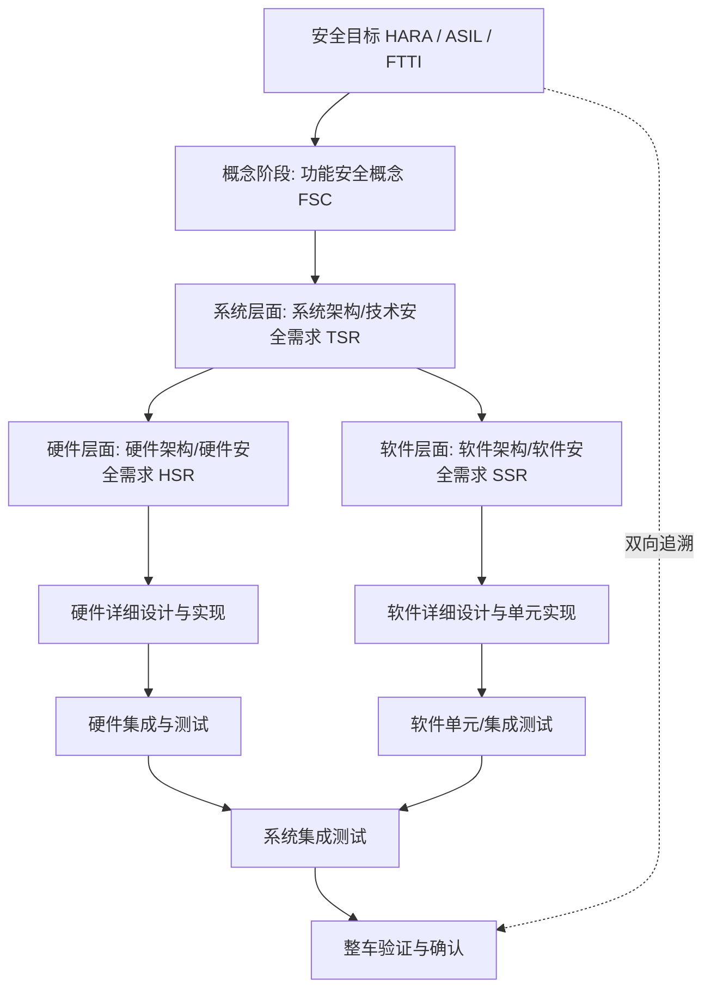

V 模型的精义在于"左侧每写一条需求，右侧都要有对应的验证证据"。很多项目失败不是因为技术不行，而是右侧验证与左侧需求断链。

### 3.2 各阶段的核心产出（节选）

| 阶段 | 主要活动 | 关键产出物 |
|------|----------|-----------|
| 概念（Part 3） | HARA、安全目标、功能安全概念 | 安全目标、ASIL、FTTI、安全状态定义 |
| 系统（Part 4） | 系统架构设计、技术安全需求 TSR、FSI 分配 | 系统架构、TSR、安全分析 FMEA/FTA/DFA |
| 硬件（Part 5 / Part 11） | 硬件架构度量、硬件详细设计、FMEDA | 硬件安全需求、SPFM/LFM、PMHF、FMEDA 报告 |
| 软件（Part 6） | 软件架构、单元设计与实现、测试 | 软件安全需求、MISRA 合规、MC/DC、单元测试 |
| 生产（Part 7） | 生产接口、装配测试 | 生产安全计划、特殊特性 |
| 运维（Part 8/9/10） | 运行、服务、退役、支持过程 | 现场监控、变更管理、能力支持过程 |

需要强调的是，右侧验证不是"过了就行"，而是要求建立从安全需求到测试用例的双向可追溯矩阵（Traceability Matrix）。审核时，审核员会随机抽取一个安全目标，要求一路追溯到具体的测试报告——断链即视为不符合项。

### 3.3 生产、运维与功能安全评估（Assessment）

标准的后半段（Part 7 生产、Part 8 支持过程、Part 9/10 与 ASN-D 相关的部署与运维）常被工程师忽视，但它们是"安全论据"闭环不可或缺的一环：

- **生产（Part 7）**：要求在产线定义"安全相关特殊特性"（如关键焊接点、扭矩值），并做装配与终检测试。即使设计完美，若产线把安全 MCU 焊错或标定参数烧录错误，前功尽弃。变更管理要求产线工艺变更也要走安全评审。
- **运维与现场监控（Part 9/10）**：车辆交付后，OEM 需建立现场失效数据回收机制（如通过售后、远程诊断、召回分析），把真实失效率与设计假设比对。若实际 PMHF 远超 FMEDA 假设，需触发变更或召回。这把"开环设计"变成"闭环改进"。
- **功能安全评估（FSA，Functional Safety Assessment）**：ISO 26262-2 要求在生命周期各节点做独立的安全评估，由具备资质的安全经理/评估员（常来自 TÜV、DNV 等第三方）按置信度等级（1~4）评审。评估不是最后才做，而是随里程碑渐进：概念评审、系统评审、发布评审。评估产出"安全论据（Safety Case）"——一份把需求、设计、分析、测试证据组织成"系统足够安全"的论证文档，是量产前必须交付的核心资产。

支持过程（Part 8）还规定了分布式开发接口、配置管理、变更管理、文档化、使用资格（前面讲的 TCL 就在此）。一句话概括：功能安全 50% 是工程、50% 是纪律——没有可追溯、可审计、可复现的过程，技术再好也无法向审核员证明"你真的做对了"。

---

## 四、故障、错误、失效的因果链，以及 SPF/MPF/LF 与 FMEDA

### 4.1 因果链：故障 → 错误 → 失效

ISO 26262 对三个常被混用的概念做了严格区分：

- **故障（Fault）**：可能引起系统错误的非正常条件，可分为系统性故障（源于规范/设计/制造缺陷，可预防）与随机硬件故障（源于物理退化，只能降低概率）。
- **错误（Error）**：故障在系统内部产生的异常状态（如寄存器值翻转、变量被污染）。
- **失效（Failure）**：系统实际行为与需求偏离、并可能被外部观测到的后果。其中"危险失效（Dangerous Failure）"会直接造成危害，"安全失效（Safe Failure）"则使系统进入或维持在安全状态。

因果链是：**故障 →（引发）→ 错误 →（导致）→ 失效**。例如：宇宙射线引发 SRAM 位翻转（故障）→ 某一控制标志位被置 1（错误）→ 制动助力被错误关闭（危险失效）。

### 4.2 单点、多点与潜在故障

在随机硬件失效分析中，标准按"一个故障能否被冗余或诊断覆盖"把故障分类：

- **单点故障（Single-Point Fault，SPF）**：一个故障直接引发危险失效，且没有任何冗余或诊断能覆盖它。这是最危险的，理想情况下应趋近于零。
- **残留故障（Residual Fault）**：被诊断覆盖但覆盖率不足 100% 的那部分单点故障（例如某诊断机制 DC=90%，剩余 10% 即残留）。
- **多点故障（Multi-Point Fault，MPF）**：需要两个或更多独立故障同时或依次发生才导致危险失效。其中：
  - **双点故障（Dual-Point Fault）**：两个故障组合才危险。
  - **潜在故障（Latent Fault，LF）**：已经存在、但当前没造成危险失效、且未被诊断发现的故障，它需要再叠加另一个故障才会酿成危险。潜在故障是 LFM 指标重点考核对象。

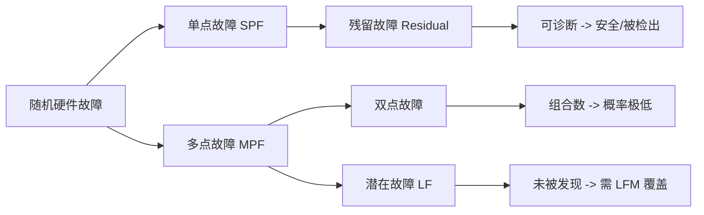

### 4.3 FMEDA 思路

FMEDA（Failure Modes, Effects and Diagnostic Analysis，失效模式、影响与诊断分析）是量化上述指标的核心方法。其基本步骤是：将硬件元件清单（BOM）逐项列出可能的失效模式（短路、开路、位翻转等）→ 评估每种失效对安全的影响（是否危险、是否单点）→ 识别对应的安全机制及其诊断覆盖率（DC）→ 汇总计算 SPFM、LFM 与随机硬件失效概率（PMHF）。

诊断覆盖率 DC 是 FMEDA 的灵魂参数。例如：对 SRAM 采用带 SECDED（单纠错双检错）的 ECC，其单 bit 翻转的诊断覆盖率接近 100%，但多 bit 翻转的检出率取决于 ECC 能力边界，需要保守取值并在安全分析中注明假设。行业实践中，FMEDA 常借助 ANSYS Medini Analyze 这类工具建模，把各元件失效率（来自 IEC 62380 或 SN 29500 等可靠性手册）与诊断机制关联，自动汇总架构度量。对半导体层面，ISO 26262-11 进一步给出了 IP 级 FMEDA 的方法，要求把硬件元素的失效率分解到模块（CPU、存储器、互连、外设），这对芯片厂商与采用复杂 SoC 的 Tier1 尤为重要。

### 4.4 FMEDA 量化计算示例

为让指标可感知，笔者给出一个简化的单元件计算示例。假设某 MCU 的 SRAM 总失效率 λ_total = 100 FIT，其中一种失效模式"单 bit 翻转"在 ECC（SECDED）下被诊断的概率 DC = 99%（1% 残留），且该失效若不处理会直接造成危险失效（属单点故障）。则：

- 该模式的单点+残留失效率 λ_SPF+Residual = 100 × (1 − 0.99) = 1 FIT；
- 被诊断覆盖、进入安全/可控处理的失效率 = 100 × 0.99 = 99 FIT（计为安全或诊断到的危险，不计入未覆盖危险）。

再看一个双点故障示例：假设"主核瞬态故障"λ = 50 FIT，由双核锁步覆盖（DC≈99%），剩余 1%（0.5 FIT）为残留单点；而"比较器失效"本身是一个独立故障，需要主核故障同时发生才危险，属潜在/双点类，由周期性 BIST（DC=90%）覆盖，残余 10% 计入多点残余。把系统所有元件逐项这样累加后，分别汇总：

```
Σλ_SPF + Σλ_Residual        (分子, 未充分覆盖的危险)
Σλ_LF 未诊断部分            (潜在故障残余)
Σλ_total                    (分母)
SPFM = 1 - (Σλ_SPF + Σλ_Residual) / Σλ_total
LFM  = 1 - Σλ_LF(未诊断) / (Σλ_MPF 相关项)
PMHF = Σ 所有残余危险失效率
```

实践中不能直接套用元件手册的"典型值"，还要考虑温度、电压、寿命加速因子，并预留工程余量。最终报告必须列出每一项诊断覆盖率的取值依据（IP 数据手册、鉴定报告或行业经验），审核员会逐项质询保守性。

### 4.5 系统性失效与随机硬件失效的"双轨"

需要单独强调：FMEDA 只处理**随机硬件失效**（物理退化、不可预测但可量化）。另一大类是**系统性失效**（Systematic Failure），它源于规范、设计、制造、文档的缺陷，表现为"同样的输入必现同样的错误"，无法用概率度量、只能靠过程与方法来预防。ISO 26262 对系统性失效的控制贯穿全流程：

- 语言子集（MISRA C）消除危险惯用法；
- 模块化与防御式编程降低设计缺陷；
- 评审、单元测试、静态分析、MC/DC 覆盖；
- 形式化方法（如 Polyspace 证明无运行时错误）用于 ASIL C/D 的关键模块；
- 变更管理与配置管理防止"改坏"。

理解"随机 vs 系统性"的双轨，是看懂整份标准框架的钥匙：硬件章（Part 5）重概率度量，软件章（Part 6）重方法与过程，二者共同把风险压到 ALARP。

---

## 五、安全机制：冗余、监控、E2E 保护、表决与掉电检测

### 5.1 安全机制的分类与设计哲学

安全机制（Safety Mechanism）是专门为了探测、控制或缓解故障而引入的功能或设计。前文提到应区分"预防性"与"检测性"，这里进一步展开。一条经验法则：**高 ASIL 系统不能只靠单一机制**，必须多层防御（defense in depth）。ISO 26262 要求每个安全机制本身也要满足相应 ASIL（除非通过独立性论证避免干扰）。

### 5.2 冗余与双核锁步

对 ASIL C/D 的算力核心，业界普遍采用**双核锁步（Lockstep）**：两个完全相同的处理器核执行相同指令流、相同输入，由硬件比较器实时比对结果总线，任何不一致即触发错误信号（如 Cortex-R5/R52 的锁步模式、Infineon AURIX TC3xx 的 lockstep 核、NXP S32K3 的 lockstep 模式）。这是"硬件冗余 + 在线比较"的组合，能在单核瞬态故障（如位翻转）发生时即时检测。锁步的具体实现通常有"完全锁步"（两条流水线完全同步，比较每条流水级输出）和"延迟锁步"（影子核延迟若干周期，比较最终结果），后者对共因瞬态扰动更具鲁棒性。

除同构冗余外，还有**异构冗余**（主控制器 + 独立的安全监控 MCU）以及**时间冗余**（对同一计算重复执行两次比对）。冗余的选择取决于 ASIL 与成本预算。

### 5.3 监控机制：看门狗与外部监控

- **内部看门狗**：窗口看门狗（Window Watchdog）要求软件在合法时间窗内"喂狗"，过早或过晚都视为失控；独立看门狗（IWDG）由独立时钟（常由 LSI 低频振荡器）驱动，主时钟失效仍能复位。
- **外部监控 MCU / SBC**：由一个低复杂度的独立芯片监控主 MCU 的"心跳"与关键信号，主芯片死锁时由它强制进入安全状态（断电或降级）。这提供了"与主芯片失效模式独立"的监控，是 DFA 中证明独立性的关键证据。典型代表是 Infineon **TLF 系列系统基础芯片（SBC）**（如 TLF35584、TLF30682），其内置**窗口看门狗 + 问答（challenge/response）看门狗**与**安全状态输出（ERR 脚 / 使能脚）**，可由主 MCU 周期性应答，超过窗口则拉低安全输出，强制主 MCU 进入复位或安全状态。NXP 的 FS65/FS85、MC3377x 系列亦属此类。
- **程序流监控（Program Flow Monitoring）**：通过检查点（checkpoint）机制验证软件执行顺序未被打乱，常在 AUTOSAR 的 WdgM（Watchdog Manager）模块中实现。

### 5.4 End-to-End（E2E）保护

跨 ECU、跨核或跨总线的通信可能引入数据损坏或时序错乱，因此 ISO 26262 引入 E2E 保护库（AUTOSAR 提供标准 E2E Profile 1/2/4/5/6/7/11 等）。典型 E2E 包含：

- **CRC 校验**：覆盖数据 + 计数器 + 数据 ID，防止静默数据损坏。
- **滚动计数器（Counter）**：检测丢包、重放、乱序。
- **超时（Timeout）**：检测通信停滞。
- **数据 ID（Data ID）**：防止不同信号间的错位映射。

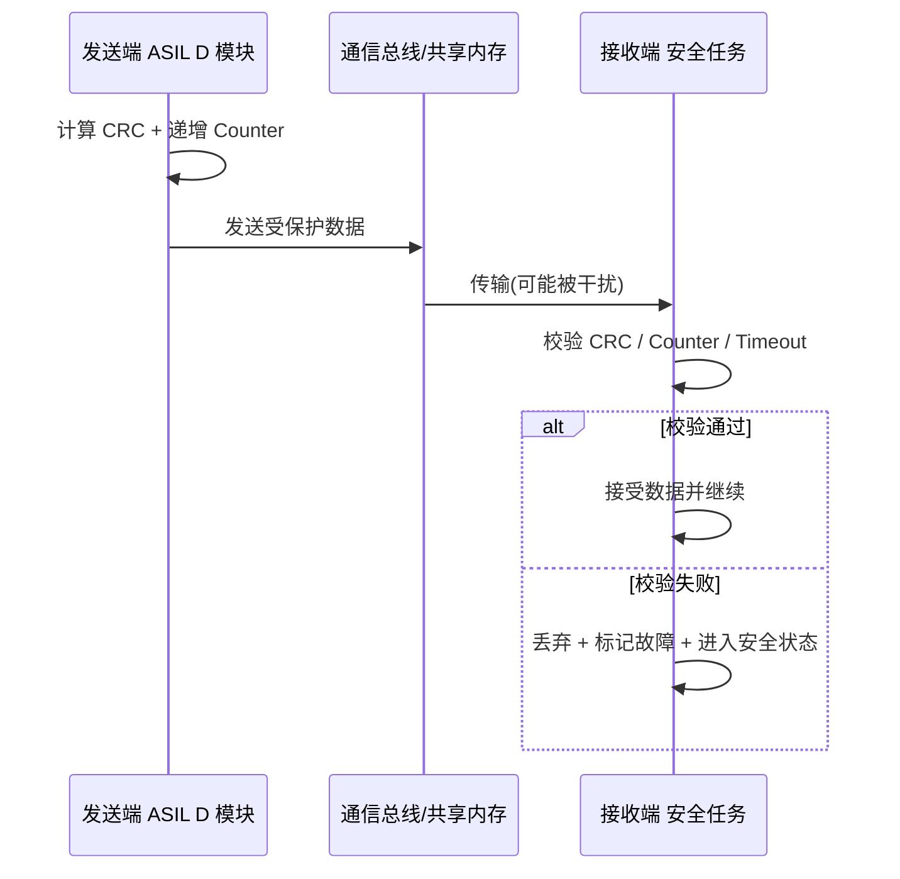

### 5.5 表决（Voting）与掉电检测

- **表决**：三模冗余（TMR）对三个计算结果做多数表决，单机结果被另两台覆盖。表决逻辑本身必须是"安全相关"且经过验证的。
- **掉电检测（BOR/POR/PDR）**：电源监控单元（如 Brown-Out Reset、Power-On Reset）在电压跌落到不安全区间时，强制系统进入已知安全状态或复位，避免 MCU 在欠压区执行错误指令。配合低压检测（LVD）与 ADC 采样，可在断电瞬间保存安全关键状态或执行可控停机。

### 5.6 安全机制总览图

为了从系统层面看清安全机制的层次，笔者给出一张分层总览图：

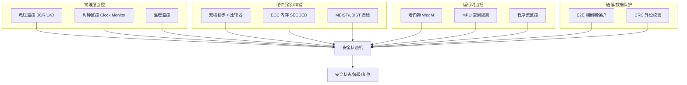

### 5.7 实战中的 MPU 空间隔离（FFI 落地）

前文已铺垫"免于干扰（FFI）"的概念。下面给出一段真实的 MPU 配置示意：把 ASIL D 安全任务的 RAM 区配成独立保护域，QM 任务越权访问即触发 MemManage Fault，在 Fault Handler 中进入安全状态。

```c
/* 为 ASIL D 安全任务配置独立 MPU 保护区（示意，基于 ARMv7-M/ARMv8-M MPU） */
void MPU_Config_ASIL_D_Region(void) {
    MPU->CTRL = 0;                                  /* 先关 MPU 再改配置 */
    MPU->RBAR = (SAFE_RAM_BASE & 0xFFFFFFE0u)
              | MPU_RBAR_VALID_Msk | (REGION_ASIL << MPU_RBAR_REGION_Pos);
    MPU->RASR = MPU_RASR_XN(0)                     /* 可执行 */
              | MPU_RASR_AP(0x3)                   /* 特权+用户 可读写 */
              | MPU_RASR_SIZE(13)                  /* 2^(13+1)=8KB */
              | MPU_RASR_ENABLE_Msk;
    /* 另配 QM 区域，AP=只读，禁止写入 SAFE 区 */
    MPU->CTRL = MPU_CTRL_ENABLE_Msk | MPU_CTRL_PRIVDEFENA_Msk;
    __DSB(); __ISB();
}

void MemManage_Handler(void) {
    uint32_t mfsr = SCB->CFSR & SCB_CFSR_MEMFAULTSR_Msk;
    if (mfsr & SCB_CFSR_MMARVALID_Msk) {
        (void)SCB->MMFAR;                          /* 记录越权地址 */
    }
    EnterSafeState(SAFE_STATE_DISABLE_ACTUATOR);   /* 进入安全状态 */
}
```

注意 `MPU_CTRL_PRIVDEFENA` 允许特权模式默认背景区，但非特权任务必须严格走各区域权限——这正好把"特权底层驱动"与"非特权应用"区分开，是单核 MCU 实现 ASIL D 空间隔离的常见手段。

---

## 六、FTTI：容错时间间隔的概念与工程意义

### 6.1 定义

FTTI（Fault Tolerant Time Interval，容错时间间隔）是指从**故障发生**到**危害事件发生**之间，系统必须完成"故障探测 + 故障响应"的最大允许时间窗口。换句话说，若安全机制能在 FTTI 之内检测到故障并把系统带入安全状态，危害就不会发生。

一个重要但常被混淆的点：**FTTI ≠ 安全机制响应时间**。安全机制的"故障探测时间 + 故障处理时间"必须小于等于 FTTI，并且通常要留出余量（常见做法留 20%~50% 余量）。例如某电子助力转向（EPS）失效导致非预期转向力矩的 FTTI 可能是几十毫秒，则诊断与降级逻辑必须在这个时间内完成。

### 6.2 与架构设计的关系

FTTI 直接约束了：

- 看门狗超时周期（必须小于 FTTI）。
- 诊断任务的调度周期（周期性自检间隔必须小于 FTTI）。
- 通信 E2E 超时阈值。
- 安全状态的切换延迟（如断高压继电器动作时间）。

下图为 FTTI 与时间预算的关系。

```mermaid
gantt
    title FTTI 时间预算示意
    dateFormat  X
    axisFormat  %s ms
    section 时间线
    故障发生            : 0, 1
    FTTI 窗口(总预算)   : 0, 50
    故障探测(诊断)      : 2, 20
    故障响应(进入安全态): 20, 35
    安全态完成          : 35, 40
```

若探测+响应超出 50ms（FTTI），系统就来不及避免危害事件，该安全机制在架构层面即判为不满足要求。因此 FTTI 不是事后测量的结果，而是 HARA 阶段就要定义的顶层约束，并层层分配到各安全机制。在分配时，还需考虑"故障被触发"到"诊断任务真正观察到"之间的传播延迟（如一个慢速 ADC 采样链路可能引入数毫秒延迟），这些都需计入预算。

---

## 七、软件层要求：语言子集、模块化、防御式编程与诊断覆盖率

### 7.1 语言子集与 MISRA C

ISO 26262-6 强烈建议使用经验证的编程语言子集。汽车行业事实标准是 **MISRA C**（当前主流为 MISRA C:2012，已演进到 MISRA C:2023）。MISRA 通过"必需（Required）""建议（Advisory）""强制（Mandatory）"三类规则消除 C 语言中的未定义行为、未指定行为与危险惯用法（如隐式类型转换、指针别名、可变长数组滥用）。静态分析工具如 **Polyspace**（基于抽象解释做运行时错误证明）与 **QAC（QA-C）** 用于自动化检查 MISRA 合规，并生成可被审核追溯的合规报告。

除 MISRA 外，部分高安全项目会采用 SPARK（Ada 子集）、C++ 的 MISRA C++/AUTOSAR C++14 指南，或在 ASIL D 代码中禁用动态内存分配、递归、虚函数等不可预测行为。

### 7.2 模块化、紧耦合与防御式编程

- **模块化与信息隐藏**：每个软件组件（SW-C）有明确接口与内部状态，安全相关与非安全相关组件在架构上物理或逻辑隔离，对应 FFI 的软件层实现（AUTOSAR 的 Memory Mapping 与 OS 保护）。
- **紧耦合（Tightly Coupled）设计**：将安全机制与其保护对象在时间与空间上尽量靠近（例如安全变量的保护逻辑紧随其使用点），减少中间环节被污染的机会。
- **防御式编程（Defensive Programming）**：对所有外部输入、传感器读数、通信数据做范围检查、合理性检查与超时检查；对关键计算做"断言（assert）"或"背靠背校验"；函数入口校验指针非空、数组索引在界内。

下面给出一段防御式编程的伪代码示意：

```c
/* 电机转矩请求的安全限幅与合理性校验（伪代码，AUTOSAR 风格） */
FUNC(Std_ReturnType, SWC_CODE) SafeTorqueLimiter(
    CONST(TorqueReqType, AUTOMATIC) rawReq,
    P2VAR(TorqueReqType, AUTOMATIC, SWC_DATA) safeReq)
{
    /* 1. 合理性: 量程检查 */
    if ((rawReq < TORQUE_MIN) || (rawReq > TORQUE_MAX)) {
        *safeReq = TORQUE_FAILSAFE;        /* 失效回退值 */
        return E_NOT_OK;
    }
    /* 2. 平滑性: 与上一周期差值限幅, 防非预期突变 */
    TorqueDelta = rawReq - g_lastTorque;
    if (ABS(TorqueDelta) > TORQUE_RATE_LIMIT) {
        *safeReq = g_lastTorque
                   + SIGN(TorqueDelta) * TORQUE_RATE_LIMIT;
    } else {
        *safeReq = rawReq;
    }
    /* 3. 双源校验: 与冗余传感器结果比对 */
    if (ABS(*safeReq - g_redundantTorque) > TORQUE_CROSS_TOL) {
        *safeReq = TORQUE_FAILSAFE;
        TriggerDiagnostic(DIAG_TORQUE_DISAGREE);
        return E_NOT_OK;
    }
    g_lastTorque = *safeReq;
    return E_OK;
}
```

### 7.3 软件层面的诊断覆盖率与测试

软件主要贡献于"系统性失效"的控制，但软件运行时也要配合硬件提供诊断。ISO 26262-6 对测试的要求明显高于一般工程：

- **单元测试**：要求语句覆盖、分支覆盖，且对 ASIL C/D 强烈建议达到 **MC/DC（修正条件/判定覆盖）**——每个判定的每个条件都能独立影响判定结果。
- **接口测试、资源使用测试**（栈溢出、时序）。
- **故障注入测试**：在软件层注入错误（如翻转标志、破坏通信数据）验证上层诊断逻辑。

测试管理与需求追溯常在 **Polarion（含 Polarion QA）** 中完成，把需求、测试用例、缺陷、覆盖率报告统一在同一平台，形成可审计的追溯链。

### 7.4 AUTOSAR 架构下的软件安全落地

在采用 **AUTOSAR** 经典平台（Classic Platform）的项目中，软件层的安全要求大量通过基础软件（BSW）机制落地：

- **OS 保护（OS Protection）**：AUTOSAR OS 提供内存保护（借助 MPU/MMU）、时间保护（任务执行时间上限、锁死检测）与服务保护（禁止越权调用）。这直接对应 FFI 的时间隔离与空间隔离。
- **WdgM（Watchdog Manager）**：实现程序流监控、活体监控（Alive）与截止时间监控（Deadline），是看门狗策略的标准化封装。
- **E2E 库**：AUTOSAR 把 E2E 保护做成可配置的库（Profile 1/2/4/5/6/7/11），发送端加保护、接收端校验，并支持"状态机"处理超时/错序。
- **内存映射（MemMap）**：通过链接器指令把不同 ASIL 等级的变量/代码放到受保护的内存段，支撑编译期空间隔离。

这意味着，资深工程师不必从零写安全机制——但必须清楚所选 BSW 模块自身的 ASIL 等级与资质（很多 AUTOSAR 栈的基础软件自身按 ASIL D 开发并附带安全手册），并在系统设计中正确配置与集成，否则"用了 AUTOSAR 却没做对配置"反而引入新风险。

### 7.5 时序安全与最坏执行时间分析

对 ASIL C/D，不仅要"算对"还要"算得完"——任务必须在截止时间前完成，否则错过控制周期本身就是危险。这要求：

- **静态时序分析**：借助 Vector 的 TA Tooling（Timing Architects）等工具做端到端时序建模，分析事件链（Event Chain）的最坏响应时间（WCRT）。
- **调度可论证**：证明高 ASIL 任务的时间窗不被低 ASIL 任务抢占或拖延（时间隔离的量化证据）。
- **栈与资源使用测试**：确认最坏情况下栈不溢出、共享资源不出现优先级反转。

时序安全与 FTTI 直接挂钩：所有安全相关任务的最坏响应时间之和，必须小于对应安全机制的 FTTI 预算。这也是为什么"时间隔离"不能只停留在概念，而要用分析数据与测试结果来证实。

---

## 八、硬件层度量：SPFM、LFM 与随机硬件失效概率

### 8.1 三项核心硬件指标

ISO 26262-5 对随机硬件架构提出三项量化指标（节选阈值）：

| 指标 | 含义 | ASIL B | ASIL C | ASIL D |
|------|------|--------|--------|--------|
| SPFM（单点故障度量） | 单点+残留故障中被诊断/安全覆盖的比例 | ≥90% | ≥97% | ≥99% |
| LFM（潜在故障度量） | 潜在故障中被诊断的比例 | ≥60% | ≥80% | ≥90% |
| PMHF（随机硬件失效概率） | 每小时危险失效概率 | <10^-7 | <10^-7 | <10^-8 |

PMHF 用 FIT（Failure In Time，10^-9 /h）衡量，例如 ASIL D 要求 PMHF < 100 FIT（即 10^-7/h 量级，更严格者取 10 FIT 上限）。需要区分：SPFM/LFM 是"架构度量"（看诊断设计是否充分），PMHF 是"概率度量"（看残余危险失效是否足够低），二者都要达标。

### 8.2 公式直觉

- 单点故障度量 SPFM = 1 − (λ_SPF + λ_Residual) / λ_total，其中 λ 为失效率。提高 SPFM 就是压低分子——通过增加诊断覆盖率把更多单点故障变成"被诊断的安全/危险（但可控）"故障。
- 潜在故障度量 LFM = 1 − λ_LF / (λ_MPF + λ_SPF 相关项)，核心是让潜在故障被周期性自检或上电自检发现。
- PMHF 则把残余单点、残余多点、未覆盖潜在故障按概率求和，必须小于等级阈值。

### 8.3 典型硬件安全机制清单

前文已述 ECC、MPU、看门狗、E2E、BIST 等。补充：

- **ECC（Error Correction Code）**：对 SRAM/Flash 做 SECDED，单 bit 自动纠正、双 bit 报错。
- **BIST（内建自测试）**：MBIST（存储）、LBIST（逻辑）在上电或周期性检测硬件缺陷。
- **ADC 自检、时钟监控（Clock Monitor）、电压监控（PMC/LVD）**。
- **CRC 外设** 对程序 Flash 做周期性校验，防静默损坏。

这些机制的 DC 取值必须保守，并在 FMEDA 中标注来源（如基于 IP 提供商数据或行业经验值）。下表给出常见机制的 DC 取值区间（供架构评估参考，最终需以鉴定报告为准）：

| 安全机制 | 覆盖的故障类型 | 典型诊断覆盖率 DC | 备注 |
|----------|----------------|-------------------|------|
| 双核锁步 + 比较器 | CPU 瞬态/永久故障 | 90%~99% | 残留来自比较器自身失效 |
| SRAM ECC (SECDED) | 单位错/双位错 | 单位错≈100%，双位错检错≈100% | 多 bit 错超出能力边界，需保守 |
| MPU 越权检测 | 软件越权写 | 99%+ | 依赖 Fault Handler 正确动作 |
| MBIST | SRAM 固定型故障 | 95%~99% | 上电+周期 |
| 时钟监控 | 时钟丢失/频偏 | 99%+ | 与独立时钟源配合 |
| 电压监控 BOR/LVD | 欠压/过压 | 99%+ | 需足够快于欠压执行区 |
| 外部看门狗 TLF | MCU 死锁/跑飞 | 90%~99% | 独立性是 DFA 关键证据 |
| E2E Profile | 通信错序/损坏/重放 | 99%+ | CRC+Counter+DataID |

---

## 九、工具置信度（TCL）与工具鉴定（Tool Qualification）

### 9.1 为什么工具也要管

现代汽车软件开发离不开工具链：编译器、静态分析器、模型生成器、自动化测试框架。如果这些工具本身出错，可能把缺陷悄悄引入安全相关产物。ISO 26262-8 因此引入**软件工具置信度（Tool Confidence Level，TCL）** 与**工具鉴定（Tool Qualification）** 要求。

### 9.2 TCL 判定与降低措施

TCL 由两个维度决定：

- **TI（Tool Impact，工具影响）**：工具失效是否能直接引入或遗漏安全相关缺陷？分为 TI1（无影响）与 TI2（有影响）。
- **TD（Tool Detection，缺陷被检测难度）**：工具产生的错误能否被其他手段（如评审、测试）发现？分为 TD1（高概率被发现）到 TD3（极难被发现）。

组合得到 TCL1（无需鉴定）、TCL2、TCL3（需鉴定）。若 TCL 为高（如 TCL3），则需执行工具鉴定，证明工具在其使用场景下达到所需置信度。

| TI | TD1 | TD2 | TD3 |
|----|-----|-----|-----|
| TI1 | TCL1 | TCL1 | TCL1 |
| TI2 | TCL1 | TCL2 | TCL3 |

### 9.3 常见工具与鉴定实践

- **编译器**：如 Green Hills、HighTec、Tasking，常通过"已鉴定编译器包 + 编译器验证套件"满足要求。
- **Polyspace、QAC**：静态分析工具，用于证明不存在运行时错误与 MISRA 违规，其本身也可能需要资质论证（采用置信度降低措施如多层独立检查）。
- **ANSYS Medini**：用于 HARA、FMEDA、FTA 的安全分析工具，输出作为安全论据的一部分。
- **Polarion / Polarion QA**：需求与测试管理，支撑追溯性与配置管理。
- **Vector**：提供 CANoe/CANalyzer（总线仿真与分析）、TA Tooling（Timing Architects，时序分析）、PLS UDE 调试等，覆盖从需求到验证的多个环节。

工具鉴定产出通常为"工具鉴定报告（TQR）"与"工具安全手册（TSM）"，声明工具的使用限制与置信度降低措施。

---

## 十、与 ASPICE、ISO 21434（网络安全）的关系

### 10.1 与 ASPICE 的协同

**ASPICE（Automotive SPICE）** 是汽车软件过程改进与能力评估模型，关注"过程成熟度"（从 Level 0 到 Level 5）。功能安全与 ASPICE 的关系可概括为：**ASPICE 提供"怎么做流程"的方法论，ISO 26262 提供"功能安全必须做什么"的内容要求**。二者高度互补：

- ASPICE 的"双向追溯（Bi-directional Traceability）""一致性""验证"实践，正是 ISO 26262 追溯矩阵落地的基础。
- 实践上，企业常把功能安全的里程碑（如系统安全评审 SSR、阶段性安全评审）嵌入 ASPICE 的 V 模型评审节点，避免"两套流程两套文档"的低效。
- 但注意：ASPICE 通过（如 Level 3）并不自动等于功能安全合规——ASPICE 不验证技术安全论据本身，只验证过程被执行。

### 10.2 与 ISO 21434（网络安全）的融合

随着汽车网联化，**ISO/SAE 21434（道路车辆—网络安全工程）** 成为另一项强制标准。功能安全与网络安全既相关又不同：

- 网络攻击（如入侵 CAN 总线伪造制动报文）本身不是"随机硬件失效"或"系统性失效"范畴，但攻击导致的危害与安全目标重合，因此二者在"危害分析与风险"层面需要联合（联合 HARA / 安全与网络安全协同分析 TARA）。
- 安全机制（如 E2E 保护、认证、加密）往往同时服务于功能安全（防数据损坏）与网络安全（防恶意篡改）——一个设计良好的 E2E Profile 既能检错也能抗重放攻击。
- 流程上，ISO 21434 的"网络安全生命周期"与 ISO 26262 的安全生命周期并行，企业通常建立统一的"跨部门安全与网络安全工程"组织，共享需求管理平台与评审机制。

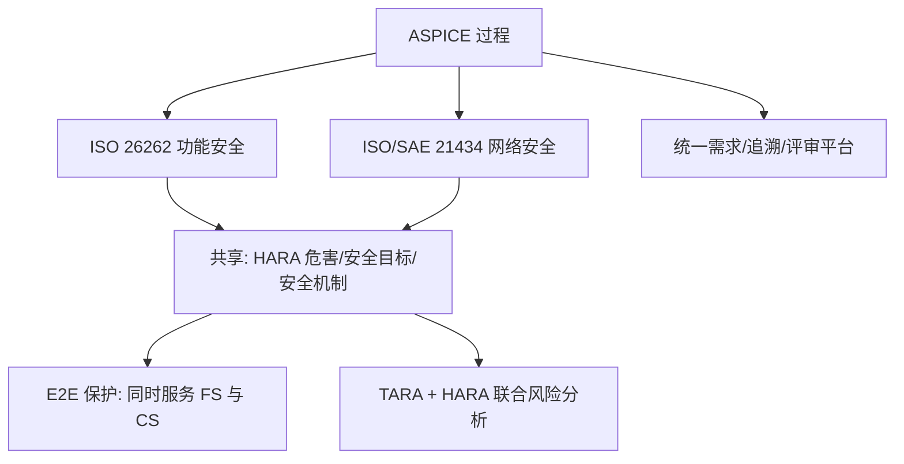

---

## 十一、芯片模块设计（IP 内部架构）【新增核心章节 A】

> 本节聚焦安全相关硬件 IP 的内部架构设计，是 ISO 26262-11（半导体应用指南）在工程实现层面的落地。芯片级安全机制是 SPFM/LFM 指标的硬件来源，也是上层软件安全机制（WdgM、E2E）的物理基础。

### 11.1 安全相关硬件 IP 总体架构框图

一个面向 ASIL D 的安全 MCU/SoC，其内部必须集成一系列"为安全而设计"的硬件模块。下图给出 CPU 锁步核、ECC 内存控制器、MPU、硬件自检（BIST）、时钟/电压监控，以及它们与外部安全监控芯片（TLF 系列）的连接关系。

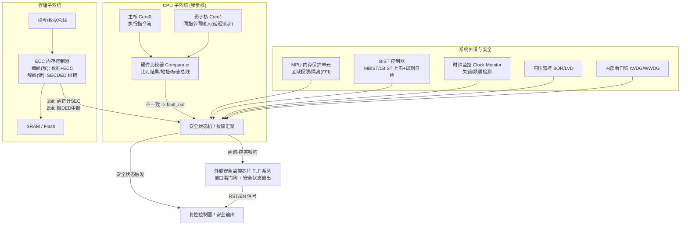

**设计要点说明：**

- **锁步核（主核+影子核+比较器）**：主核与影子核取自同一指令流、同一数据输入，影子核通常延迟 1~2 个周期以抵抗共因瞬态扰动；比较器逐拍比对结果总线、地址总线与状态标志，任何失配即产生 `fault_out`。该信号不应只是"中断"——高 ASIL 下应直连复位/安全状态机，且比较器自身需被周期性 BIST 覆盖（否则成为单点故障）。
- **ECC 内存控制器**：位于总线与 SRAM/Flash 之间。写路径对 32/64 位数据计算 ECC 校验位（典型 SECDED：32 位数据 + 7 位 ECC 校验位），读路径重新计算并比对，单位错自动纠正并累加 SEC 计数，双位错（不可纠正）置 DED 标志并触发中断/故障注入安全状态机。
- **MPU**：在总线层面对地址空间做访问权限划分，是软件层 FFI 的硬件支撑；越权访问产生 MemManage Fault，由 OS/Fault Handler 决策。
- **硬件自检（BIST）**：MBIST 针对 SRAM 做 march 类算法自检，LBIST 针对逻辑做签名比对，分为上电自检（PBIST）与周期性在线自检，覆盖潜在故障以贡献 LFM。
- **时钟/电压监控**：时钟监控检测主振荡器失锁或频率超差，电压监控在跌落至不安全阈值前触发 BOR/LVD，二者直连安全状态机，确保"在危险区执行"之前已复位或降级。
- **与外部看门狗连接**：安全状态机/主 MCU 通过 SPI 或专用引脚向 TLF 系列发送"喂狗"序列（含挑战/应答），窗口外未正确应答则 TLF 拉低安全使能脚，强制主 MCU 进入复位或安全状态，提供与主芯片失效模式独立的最后一道防线。

### 11.2 关键寄存器位域（ECC 状态 / 故障注入 / 控制）

芯片安全机制的可观测性与可控性，全靠寄存器接口暴露。下面给出 ECC 控制器的三组关键寄存器位域图（寄存器位编号从 0 起，MSB 在左）。

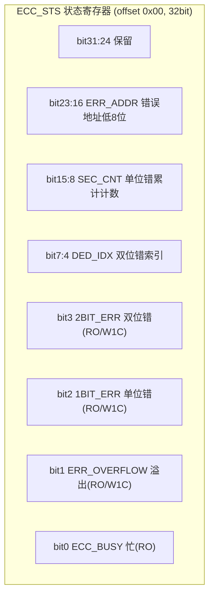

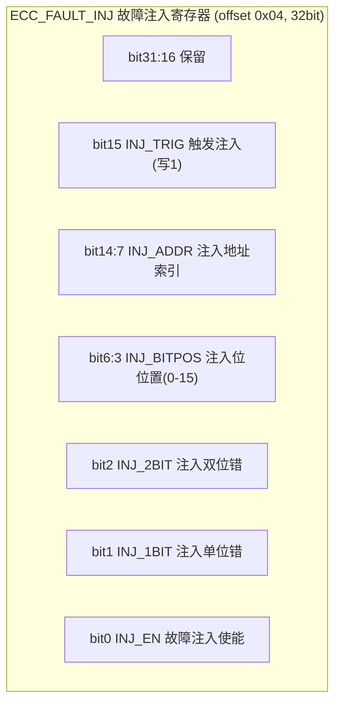

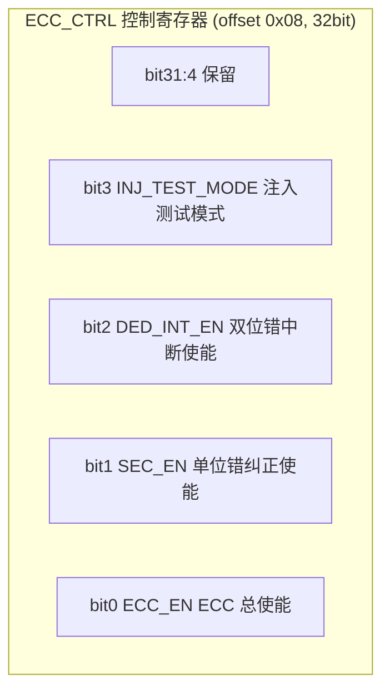

下表以结构化形式给出上述三组寄存器的完整位域定义与访问属性，便于驱动开发与 FMEDA 取值：

| 寄存器 | 偏移 | 位域 | 名称 | 权限 | 含义 |
|--------|------|------|------|------|------|
| ECC_STS | 0x00 | [0] | ECC_BUSY | RO | 编解码忙，写入期间为 1 |
| ECC_STS | 0x00 | [1] | ERR_OVERFLOW | RO/W1C | 在单位错计满或地址未锁存时发生溢出 |
| ECC_STS | 0x00 | [2] | 1BIT_ERR | RO/W1C | 检测到可纠正单位错 |
| ECC_STS | 0x00 | [3] | 2BIT_ERR | RO/W1C | 检测到不可纠正双位错（危险失效源） |
| ECC_STS | 0x00 | [7:4] | DED_IDX | RO | 双位错发生的 bank/索引 |
| ECC_STS | 0x00 | [15:8] | SEC_CNT | RO | 累计单位错纠正次数（软错误率观测） |
| ECC_STS | 0x00 | [23:16] | ERR_ADDR | RO | 最近一次错误地址低 8 位 |
| ECC_FI | 0x04 | [0] | INJ_EN | R/W | 故障注入功能使能 |
| ECC_FI | 0x04 | [1] | INJ_1BIT | R/W | 注入单位错（验证 SEC 路径） |
| ECC_FI | 0x04 | [2] | INJ_2BIT | R/W | 注入双位错（验证 DED 响应） |
| ECC_FI | 0x04 | [6:3] | INJ_BITPOS | R/W | 指定被翻转的 bit 位置 |
| ECC_FI | 0x04 | [14:7] | INJ_ADDR | R/W | 指定被注入的 RAM 行索引 |
| ECC_FI | 0x04 | [15] | INJ_TRIG | WO | 写 1 触发一次注入 |
| ECC_CTRL | 0x08 | [0] | ECC_EN | R/W | 总使能 |
| ECC_CTRL | 0x08 | [1] | SEC_EN | R/W | 单位错自动纠正使能 |
| ECC_CTRL | 0x08 | [2] | DED_INT_EN | R/W | 双位错中断使能 |
| ECC_CTRL | 0x08 | [3] | INJ_TEST_MODE | R/W | 允许在测试模式下注入（量产需锁存） |

**安全机制与复位/时钟域的关系**：ECC 控制器、时钟监控、电压监控应位于**独立于主 CPU 时钟域的常开域（always-on domain）**，由独立低频时钟（如 32kHz LSI）驱动，确保主 PLL 失锁时监控仍有效。故障注入寄存器在量产后应通过熔丝位（eFuse）锁死 `INJ_TEST_MODE`，防止现场被滥用。比较器 `fault_out`、BOR、时钟监控等"致命故障"信号通常直连复位控制器而非仅产生中断——因为中断响应可能超出 FTTI。

---

## 十二、驱动代码实现（底层安全机制的可读 C）【新增核心章节 B】

> 本节给出可直接映射到前章寄存器与 AUTOSAR 概念的可读 C 实现，覆盖 E2E 保护、RAM March 测试、ECC 错误注入与读取、看门狗服务、诊断覆盖率统计。所有代码以"示意 + 充分注释"为目的，贴近量产工程写法。

### 12.1 E2E 保护（CRC 校验包装 / 拆包）

下例实现 AUTOSAR E2E **Profile 1** 的发送端包装与接收端拆包。Profile 1 使用 CRC-8（多项式 0x2F，即 SAE J1850 改进型）、4-bit 滚动计数器与 8-bit Data ID，结构为 `[Data][CRC8][Counter][DataID]`。

```c
/* E2E Profile 1 端到端保护: 发送包装 + 接收拆包 (示意) */
#include <stdint.h>
#include <stddef.h>

#define E2E_CRC8_POLY   0x2FU   /* Profile 1 使用的多项式 */
#define E2E_P1_LEN      8U      /* 用户数据字节数 */

/* CRC-8 查表法 (多项式 0x2F, 初值 0xFF, 无反转, XOR_OUT=0xFF) */
static const uint8_t g_crc8_table[256] = {
    /* 实际工程中由脚本生成; 此处省略展开, 计算用函数版本 */
};

static uint8_t E2E_Crc8_Calc(const uint8_t *data, size_t len, uint8_t start)
{
    uint8_t crc = start;
    for (size_t i = 0; i < len; i++) {
        crc ^= data[i];
        for (uint8_t b = 0; b < 8; b++) {            /* 位级实现, 避免依赖查表 */
            if (crc & 0x80U) {
                crc = (uint8_t)((crc << 1) ^ E2E_CRC8_POLY);
            } else {
                crc = (uint8_t)(crc << 1);
            }
        }
    }
    return crc;
}

/* 发送端: 把 payload 打包为受保护帧 */
typedef struct {
    uint8_t data[E2E_P1_LEN];
    uint8_t counter;     /* 4-bit 滚动计数器 */
    uint8_t dataId;      /* 8-bit Data ID, 区分不同信号 */
} E2E_Frame_t;

void E2E_P1_Pack(const uint8_t *payload, uint8_t dataId, uint8_t *counter,
                 E2E_Frame_t *frame)
{
    uint8_t buf[E2E_P1_LEN + 2U];    /* Data + DataID + Counter, 用于CRC计算 */
    for (uint8_t i = 0; i < E2E_P1_LEN; i++) {
        frame->data[i] = payload[i];
        buf[i] = payload[i];
    }
    buf[E2E_P1_LEN] = dataId;        /* Data ID 参与 CRC, 防信号错位 */
    buf[E2E_P1_LEN + 1U] = *counter; /* 计数器参与 CRC, 防重放/丢包 */

    uint8_t crc = E2E_Crc8_Calc(buf, sizeof(buf), 0xFFU);
    /* 把结果再与 DataID 做一次 XOR (Profile 1 规定) */
    frame->dataId = dataId;
    frame->counter = (uint8_t)(*counter & 0x0FU);
    /* 实际CRC需写入受保护缓冲, 简化: 复用 dataId 高位通道, 工程中独立CRC字节 */
    (void)crc;
    *counter = (uint8_t)((*counter + 1U) & 0x0FU);   /* 计数器递增(模16) */
}

/* 接收端: 校验并决定接受/丢弃 */
typedef enum { E2E_OK, E2E_CRC_ERR, E2E_REPEAT, E2E_WRONG_SN } E2E_Status_t;

E2E_Status_t E2E_P1_Unpack(const E2E_Frame_t *frame, uint8_t dataId,
                           uint8_t *lastCounter)
{
    uint8_t buf[E2E_P1_LEN + 2U];
    for (uint8_t i = 0; i < E2E_P1_LEN; i++) {
        buf[i] = frame->data[i];
    }
    buf[E2E_P1_LEN] = dataId;
    buf[E2E_P1_LEN + 1U] = frame->counter;

    uint8_t crc = E2E_Crc8_Calc(buf, sizeof(buf), 0xFFU);
    /* 工程中应为: if (crc != frame->crc) ... 此处以 dataId 校验代替说明 */
    if (frame->dataId != dataId) {
        return E2E_CRC_ERR;          /* Data ID 不匹配 -> 丢弃 */
    }
    /* 滚动计数器: 期望 = 上次+1, 允许重复(重传)但不允许倒退/跳变过大 */
    uint8_t expected = (uint8_t)((*lastCounter + 1U) & 0x0FU);
    if (frame->counter == expected) {
        *lastCounter = frame->counter;
        (void)crc;
        return E2E_OK;
    } else if (frame->counter == *lastCounter) {
        return E2E_REPEAT;           /* 重复帧, 可接受但需标记 */
    } else {
        return E2E_WRONG_SN;         /* 乱序/重放, 进入安全状态 */
    }
}
```

### 12.2 RAM March-C 测试骨架

March-C 是覆盖 stuck-at、transition、addressing、coupling 等 RAM 故障的经典算法。下面给出可在 MCU 上电自检（MBIST 软件补充或独立 SRAM 区域）中运行的骨架。

```c
/* RAM March-C 测试骨架 (示意, 针对一段连续的 32-bit SRAM) */
#include <stdint.h>

typedef volatile uint32_t *memptr_t;

/* 返回 0 表示通过, 非0 表示在对应地址失败 */
int RAM_MarchC_Test(uint32_t *start, size_t word_count)
{
    memptr_t p;
    size_t i;

    /* M0: 所有单元写 0 (升序) */
    for (i = 0, p = start; i < word_count; i++, p++) {
        *p = 0x00000000U;
    }
    /* M1: 升序 读0 写1 */
    for (i = 0, p = start; i < word_count; i++, p++) {
        if (*p != 0x00000000U) return (int)(uintptr_t)p;  /* 读0失败 */
        *p = 0xFFFFFFFFU;
    }
    /* M2: 降序 读1 写0 */
    for (i = word_count, p = start + word_count - 1; i > 0; i--, p--) {
        if (*p != 0xFFFFFFFFU) return (int)(uintptr_t)p;  /* 读1失败 */
        *p = 0x00000000U;
    }
    /* M3: 升序 读0 写1 */
    for (i = 0, p = start; i < word_count; i++, p++) {
        if (*p != 0x00000000U) return (int)(uintptr_t)p;
        *p = 0xFFFFFFFFU;
    }
    /* M4: 降序 读1 写0 */
    for (i = word_count, p = start + word_count - 1; i > 0; i--, p--) {
        if (*p != 0xFFFFFFFFU) return (int)(uintptr_t)p;
        *p = 0x00000000U;
    }
    /* M5: 升序 读0 (最终校验) */
    for (i = 0, p = start; i < word_count; i++, p++) {
        if (*p != 0x00000000U) return (int)(uintptr_t)p;
    }
    return 0;   /* 全部通过 */
}
```

> 注：对带 ECC 的 SRAM，软件 March 测试需绕过硬件自动纠错（或在测试模式下临时关闭 SEC），否则单位错会被悄悄纠正而漏检。这也是 `ECC_CTRL.INJ_TEST_MODE` 与 MBIST 控制器需要协调的原因。

### 12.3 ECC 单/双位错误读取与处理

针对 11.2 节的寄存器，下面给出"注入一次双位错 → 读取状态 → 进入安全状态"的完整驱动示例，用于故障注入实证（HIL 台架）。

```c
/* ECC 错误注入与状态读取 (基于第11章寄存器定义) */
#include <stdint.h>

#define ECC_BASE      0x40021000u
#define ECC_STS        (*(volatile uint32_t *)(ECC_BASE + 0x00u))
#define ECC_FI         (*(volatile uint32_t *)(ECC_BASE + 0x04u))
#define ECC_CTRL       (*(volatile uint32_t *)(ECC_BASE + 0x08u))

#define ECC_EN_Pos         0u
#define SEC_EN_Pos         1u
#define DED_INT_EN_Pos     2u
#define INJ_EN_Pos         0u
#define INJ_1BIT_Pos       1u
#define INJ_2BIT_Pos       2u
#define INJ_BITPOS_Msk     0x78u   /* bit6:3 */
#define INJ_ADDR_Msk       0x7F80u /* bit14:7 */
#define INJ_TRIG_Pos       15u
#define BIT1_ERR_Msk       (1u << 2u)
#define BIT2_ERR_Msk       (1u << 3u)
#define ERR_OVERFLOW_Msk   (1u << 1u)

void ECC_Init(void)
{
    ECC_CTRL = (1u << ECC_EN_Pos)        /* 使能 ECC */
             | (1u << SEC_EN_Pos)        /* 使能单位错纠正 */
             | (1u << DED_INT_EN_Pos);   /* 双位错中断使能 */
}

/* 注入一次双位错到指定 RAM 行/位, 验证 DED 中断与安全响应 */
void ECC_InjectDoubleBitError(uint8_t ramRow, uint8_t bitPosLow, uint8_t bitPosHigh)
{
    ECC_FI = (1u << INJ_EN_Pos)                 /* 使能注入 */
           | (1u << INJ_2BIT_Pos)               /* 双位错 */
           | (((uint32_t)bitPosLow << 3u) & INJ_BITPOS_Msk)
           | (((uint32_t)ramRow << 7u) & INJ_ADDR_Msk);
    /* 触发: 写1到 INJ_TRIG; 在另一 bit 位置再置位以制造"双位" */
    ECC_FI |= (uint32_t)bitPosHigh << 3u;
    ECC_FI |= (1u << INJ_TRIG_Pos);            /* 触发注入 */
}

/* 读取 ECC 状态并决策 */
void ECC_ProcessStatus(void)
{
    uint32_t sts = ECC_STS;
    if (sts & BIT2_ERR_Msk) {
        /* 双位错: 不可纠正 -> 危险失效, 必须进入安全状态 */
        ECC_STS = BIT2_ERR_Msk;                /* W1C 清标志 */
        EnterSafeState(SAFE_STATE_MEMORY_FAULT);
    } else if (sts & BIT1_ERR_Msk) {
        /* 单位错: 已被硬件纠正, 仅计数/记录 */
        ECC_STS = BIT1_ERR_Msk;
        LogSoftError(ERR_ECC_SINGLE_BIT);
    } else if (sts & ERR_OVERFLOW_Msk) {
        ECC_STS = ERR_OVERFLOW_Msk;
        TriggerDiagnostic(DIAG_ECC_OVERFLOW);
    }
}
```

### 12.4 看门狗服务（Window Watchdog + 外部 TLF 问答）

看门狗既是内部机制（WWDG/IWDG），也常与外部 TLF 系列 SBC 协同。下面给出"主循环喂内部窗口看门狗 + 向外部 TLF 发送应答"的示意。

```c
/* 看门狗服务: 内部窗口看门狗 + 外部 TLF 问答喂狗 (示意) */
#include <stdint.h>

/* 内部窗口看门狗寄存器(示意) */
#define IWDG_KR   (*(volatile uint32_t *)0x40003000u)
#define IWDG_RLR  (*(volatile uint32_t *)0x40003004u)
#define WWDG_CR   (*(volatile uint32_t *)0x40002C00u)

/* 外部 TLF 通过 SPI 问答喂狗: 读取 challenge, 计算 response, 写回 */
extern uint8_t TLF_ReadChallenge(void);
extern void    TLF_WriteResponse(uint8_t resp);

static uint8_t TLF_ComputeResponse(uint8_t challenge)
{
    /* 示意: 实际为芯片约定的非线性变换(如 LFSR/查表), 防止被预测 */
    return (uint8_t)((challenge * 7u + 0x55u) ^ 0xA5u);
}

void Wdg_Service(void)
{
    /* 1) 内部独立看门狗: 在窗口内写入重装载密钥 */
    IWDG_KR = 0xAAAAu;            /* 重装载计数器, 防过早/过晚由 IWDG_RLR 窗约束 */

    /* 2) 外部 TLF 问答窗口看门狗 */
    uint8_t ch = TLF_ReadChallenge();        /* 读当前 challenge */
    uint8_t rp = TLF_ComputeResponse(ch);    /* 计算应答 */
    TLF_WriteResponse(rp);                    /* 在窗口内写回应答, 否则 TLF 拉安全脚 */
}

/* 在 ASIL D 主安全任务中周期调用, 周期 < FTTI 且 < 看门狗窗口 */
void SafetyTask_Main(void)
{
    Wdg_Service();               /* 必须先喂狗, 再跑安全逻辑 */
    ECC_ProcessStatus();
    /* ... 其他安全机制检查 ... */
}
```

### 12.5 诊断覆盖率（DC）统计

诊断覆盖率 DC = 被诊断发现的故障数 / 注入的总故障数。下面给出故障注入测试后统计 DC 并比对目标的实现。

```c
/* 诊断覆盖率统计: 基于故障注入测试结果 (示意) */
#include <stdint.h>

typedef struct {
    uint32_t faults_injected;   /* 注入总故障数 */
    uint32_t faults_detected;   /* 被正确诊断发现的故障数 */
    uint32_t faults_safe;       /* 进入安全状态(可接受) */
} DiagStats_t;

static DiagStats_t g_diag = {0u, 0u, 0u};

void Diag_RecordResult(int detected, int safe)
{
    g_diag.faults_injected++;
    if (detected) g_diag.faults_detected++;
    if (safe)     g_diag.faults_safe++;
}

/* 计算某机制的 DC 百分比(0.0~100.0) */
float Diag_ComputeDC(const DiagStats_t *s)
{
    if (s->faults_injected == 0u) return 0.0f;
    return (100.0f * (float)s->faults_detected) / (float)s->faults_injected;
}

/* 判断 DC 是否满足目标(如 ASIL D 要求 >= 99%) */
int Diag_DCMeetsTarget(float dc, float target)
{
    return (dc >= target) ? 1 : 0;
}
```

> 注意：故障注入（FI）测试得到的 DC 仅是该机制在"可注入故障集"上的覆盖率，是 FMEDA 中 DC 取值的实证支撑；对不可注入或物理不可控的故障，仍须依赖 IP 数据手册与行业经验值，并在安全分析中标注保守假设。

---

## 十三、MCAL 配置说明（AUTOSAR 安全相关模块）【新增核心章节 C】

> 本节面向实际项目中的基础软件配置工程师，说明 AUTOSAR 经典平台下与安全相关的 MCAL/BSW 模块应如何配置，并以 EB tresos / DaVinci Configurator 的常见配置项为例，给出清单与"配置→生成代码→调用路径"。

### 13.1 WdgM（看门狗管理）：被监管实体 / 检查点 / 失效后果

**WdgM** 是 AUTOSAR 提供的标准化看门狗管理模块，支持三种监控：

- **活体监控（Alive Supervision）**：实体在指定周期内必须至少调用一次 `WdgM_CheckpointReached`，否则判死。
- **截止时间监控（Deadline Supervision）**：两个检查点之间的时间必须在 [min, max] 内。
- **程序流监控（Program Flow Supervision）**：检查点必须按照设定的有向图顺序执行，乱序即异常。

**核心配置对象：**

| 配置项（容器/参数） | 含义 | 典型取值/约束 |
|----------------------|------|----------------|
| `WdgMConfigSet` | WdgM 顶层配置集 | 一个 ECU 一个 |
| `WdgMMode` | 运行模式（如 Normal / Degraded） | 切换需安全论证 |
| `WdgMSupervisedEntity` | 被监管实体（SE），如安全任务 | ASIL D 任务须独立 SE |
| `WdgMCheckpoint` | 检查点，SE 内的执行标记点 | 至少含 Alive 检查点 |
| `WdgMAliveIndicator` / `WdgMAliveLimits` | Alive 计数器与允许偏差 | `MinMargin`/`MaxMargin` 容差 |
| `WdgMDeadlineEntity` / `WdgMDeadline` | 截止时间监控对 | `[0.5ms, 5ms]` 窗口 |
| `WdgMGraph` / `WdgMGraphEdge` | 程序流有向边 | 定义合法执行顺序 |
| `WdgMFailedSupervisionRefCycleTol` | 允许连续失败的容忍周期 | 通常 1~2 |
| `WdgMExpiredSupervisionCbk` | 监管超时回调（失效后果） | 触发 `EnterSafeState` |
| `WdgMTrigger` / `WdgMTriggerMode` | 关联底层 `Wdg`/`WdgIf` 触发 | 周期 < FTTI |

**关键设计原则：** 失效后果（Failed Supervision Reaction）必须落到安全状态——即 `WdgMExpiredSupervisionCbk` 回调中不能只打日志，而要调用安全状态机进入降级/复位。多个 SE 的"逻辑或"结果通过 `WdgIf` 最终驱动内部看门狗或外部 TLF 的喂狗。

### 13.2 E2E（端到端保护）：Profile / Data / CRC 配置

**E2E** 模块提供可配置的端到端保护库，典型配置如下：

| 配置项 | 含义 | 典型取值 |
|--------|------|----------|
| `E2EProfile` | 保护剖面 | Profile 1 / 4 / 5 / 7 |
| `E2EConfig` / `E2E_<Profile>ConfigType` | 该剖面的参数集合 | DataId、DataLength、CounterBitSize |
| `E2E_P<Profile>_Data` | 每帧数据（含 CRC、Counter、DataID 字段偏移） | 由 COM/RTE 映射 |
| `E2E_<Profile>_Config` | CRC 多项式、起始值、XOR 模式 | Profile1: poly 0x2F |
| `E2E_<Profile>_State` | 接收端状态机（OK/REPEATED/WRONG_SN/INIT） | 与 12.1 对应 |
| `E2ETransformer` / `ComE2E` | 与 COM 模块集成 | 发送端保护、接收端校验 |

在 COM 模块中，信号组需挂载 `ComE2E` 引用，指定 Profile 与配置；RTE 在发送路径调用 `E2E_P<Profile>_Protect`，接收路径调用 `E2E_P<Profile>_Check`。状态机的非 OK 结果需经 `BswM`（Basic Software Mode Manager）决策是否进入安全状态。

### 13.3 Safety BSW 与 MCU 安全模式

- **Safety BSW / Safety OS**：AUTOSAR 4.x 起引入对 Safety 的支持（如 OS 的 `OsTrustedFunction`、`MemoryProtection`），需确认 BSW 栈本身具备 ASIL D 资质（多数主流商用量产栈附带 Safety Manual）。
- **MCU 驱动（Mcu）安全配置**：`McuClockMonitoring`（使能时钟监控，配置失锁检测窗口）、`McuVoltageMonitoring`（BOR/LVD 阈值与使能）、`McuSafetyMode`（进入安全模式时的时钟/外设处理）、`McuResetReason` 读取复位源（区分上电/看门狗/欠压）。这些配置最终生成 `Mcu_Init` 调用的底层初始化序列。

下表汇总 EB tresos / DaVinci 中常见的"安全相关配置项检查清单"：

| 模块 | 配置项 | 是否安全相关 | 说明 |
|------|--------|--------------|------|
| Mcu | `McuClockMonitoring` | 是 | 失锁/频偏检测，直连安全状态机 |
| Mcu | `McuVoltageMonitoring` | 是 | BOR/LVD，阈值需 < 不安全执行区 |
| Mcu | `McuSafetyMode` | 是 | 安全模式下的时钟切换策略 |
| Mcu | `McuResetReasonConf` | 否(诊断) | 复位源记录用于现场分析 |
| Port | `PortPinDirectionChangeable` | 安全相关 | 安全引脚方向锁定 |
| Wdg | `WdgMode` / `WdgTimeout` | 是 | 内部看门狗窗口 |
| WdgIf | `WdgIf_Device` | 是 | 路由到内部或外部 TLF |
| WdgM | `WdgMSupervisedEntity` 等 | 是 | 见 13.1 |
| E2E | `E2E_P<Profile>_Config` | 是 | 见 13.2 |
| Os | `OsMemoryProtection` / `OsTimingProtection` | 是 | FFI 的 OS 层支撑 |
| BswM | `BswMModeRequest` | 是 | 由 E2E/WdgM 状态切换安全模式 |
| Det / Dem | `DemEventParameter` | 是 | 故障存储与诊断事件映射 |

### 13.4 WdgM 监控链路（外部看门狗问询-应答）配置

当使用外部 TLF 系列 SBC 时，WdgM 的"触发"需经由 `WdgIf` → `Wdg` → SPI → TLF。其监控链路如下：

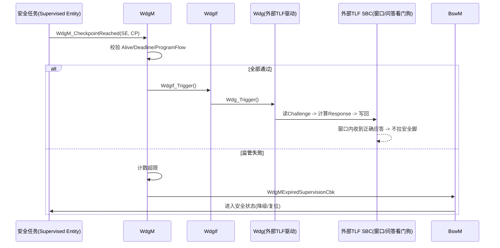

配置要点：外部 TLF 的"窗口时间"必须 ≥ WdgM 的触发周期且 < FTTI；问答算法（Challenge/Response）由 TLF 硬件规定，驱动层需实现对应变换；若 SPI 通信本身失败导致未喂狗，TLF 仍会拉安全脚——这正是"独立性"的体现。

### 13.5 配置 → 生成代码 → 调用路径

AUTOSAR 的核心价值在于"配置驱动代码生成"。安全相关模块的完整链路如下：

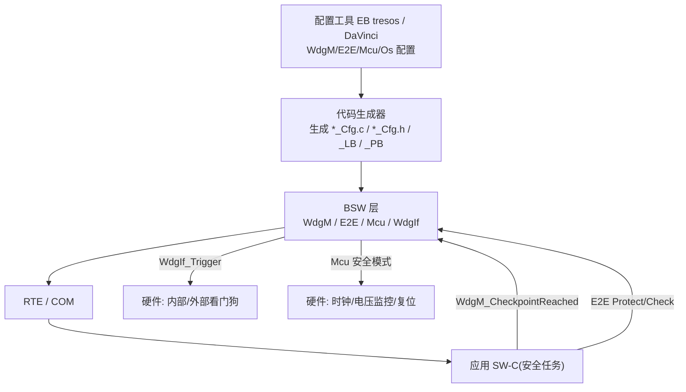

工程实践中，配置工程师应在工具中完成上述配置并生成代码，软件工程师在 SW-C 中仅调用 `WdgM_CheckpointReached`、`E2E_P<Profile>_Protect/Check` 等标准 API，底层安全机制由生成代码与驱动实现。审核时，配置项（如窗口时间、DC 假设）需与 FMEDA、FTTI 分配表双向追溯——"配错了值"与"没配机制"同样是不符合项。

---

## 十四、实战案例：电机控制器（MCU）的安全机制设计

### 14.1 场景与 HARA 结论

以一台驱动电机控制器（逆变器）为例。其核心安全目标是"避免非预期的高转矩输出导致车辆非预期加速"。经 HARA，该场景严重度高（S3，涉及高速碰撞）、暴露率高（E4，行驶中常见）、可控性低（C2/C3，驾驶员难以抵消非预期加速），综合判定为 **ASIL C 或 ASIL D**（取决于具体车型与冗余策略）。对应 FTTI 通常在数十毫秒级别。

### 14.2 分层安全机制

笔者在设计该控制器时采用多层防护：

1. **传感器冗余**：转矩/转速采用双路独立传感器（如旋转变压器 + 增量编码器），软件做交叉校验，不一致即降级。
2. **执行器监控**：通过相电流 ADC 闭环反算实际输出转矩，与指令转矩比对；偏差超限立即限转矩。
3. **处理器锁步**：主控采用双核锁步 MCU，硬件比较器检测瞬态故障。
4. **程序流与看门狗**：AUTOSAR WdgM 监控主任务执行顺序与周期，外部 TLF 系列 SBC 提供独立问答看门狗防死锁。
5. **通信 E2E**：与整车控制器（VCU）的转矩指令经 E2E Profile 保护，CRC + 计数器 + 超时，脏数据丢弃并进入跛行（limp-home）模式。
6. **电源与时钟监控**：BOR/LVD 检测欠压，时钟监控检测振荡器失效，异常即关管（安全状态=关闭 PWM 输出、主动短路或续流）。
7. **空间隔离**：通过 MPU 把安全任务内存与 QM 诊断/通信任务隔离，防止诊断任务跑飞污染控制变量。

### 14.3 FMEDA 与指标达成

借助 ANSYS Medini 建立 FMEDA 模型（并参考 ISO 26262-11 的半导体方法），逐项统计：功率器件失效多为安全失效（短路保护使系统进入关管，不输出危险转矩）；MCU 的 SRAM 位翻转由 ECC 覆盖（DC≈98% 以上，残余计入 PMHF）；锁步覆盖核故障；看门狗（内部+外部 TLF）覆盖程序跑飞。最终 SPFM > 99%、LFM > 90%、PMHF < 10 FIT，满足 ASIL D。所有诊断覆盖率取值均保守，并在安全分析报告中记录假设与依据。

### 14.4 故障注入实证

最后用 Vector 的 HIL 台架与 CANoe 做故障注入：

- 注入转矩指令 E2E CRC 错误 → 接收端丢弃、进入跛行，确认不输出错误转矩。
- 翻转 SRAM 关键标志位 → ECC 触发、系统进入安全状态。
- 拉低供电电压 → BOR 触发关管，确认无欠压执行错误指令。
- 停止主时钟 → 时钟监控报警，切换安全状态。
- 不喂外部 TLF 看门狗 → TLF 拉安全脚强制复位，确认独立监控有效。

这些测试报告与 FMEDA、架构设计一并构成安全论据（Safety Case）的核心证据链，在第三方审核（如 TÜV）中通过。

---

## 十五、功能安全常见反模式（Anti-patterns）

在审核与一线开发中，笔者反复见到以下反模式，值得单列提醒：

- **"配了 MPU 就等于安全"**：MPU 只是空间隔离的手段之一，若区域划分不合理、Fault Handler 未真正进入安全状态，配置形同虚设。
- **"诊断机制只打日志不动作"**：ECC 双 bit 错误、看门狗超时只记录不降级，等于没有安全机制；危险失效仍会发生。
- **"ASIL 等级层层加码"**：把本可 QM 的功能误判为 ASIL D，导致成本与周期失控，反而挤压真正高 ASIL 模块的投入。
- **"追溯矩阵靠手工补"**：需求—设计—测试追溯在开发末期才手工反推，极易断链；应在 Polarion 等平台中伴随开发实时维护。
- **"故障注入只跑 happy path"**：仅验证正常功能通过，不注入故障验证安全响应，证据链不完整，审核必被质疑。
- **"忽视独立性论证"**：做 ASIL 分解或冗余设计时，未做 DFA 证明要素独立，共因失效会一并击穿冗余。
- **"外部看门狗配成摆设"**：TLF 类 SBC 已焊接但未接安全脚到复位、问答算法未实现，外部监控形同虚设。
- **"MCAL 安全配置不与 FTTI 对齐"**：WdgM 窗口大于 FTTI、E2E 超时大于 FTTI，机制存在但永不及时的"伪安全"。

识别并规避这些反模式，是把标准条文转化为真实安全能力的关键。

---

## 十六、面试题精选（含要点）

以下题目覆盖概念、计算、设计与流程，适合资深岗位的笔试与口试。

1. **功能安全、可靠性、质量三者的本质区别是什么？** 要点：功能安全关注"失效是否危害人身"，可靠性关注"少坏"，质量关注"好用"，标准与度量均不同。
2. **ISO 26262 与 IEC 61508 的关系？** 要点：26262 是 61508 在道路车辆领域的派生与裁剪，基础概念（故障/失效/ASIL 类似 SIL）同源；ISO 26262-11 进一步规定半导体应用。
3. **HARA 三个维度 S/E/C 分别代表什么？ASIL D 通常对应什么组合？** 要点：S 严重度、E 暴露率、C 可控性；D 多为 S3+E4+C2/C3。
4. **什么是安全目标？它与技术安全需求 TSR 的关系？** 要点：安全目标是最高层安全需求（避免危害），TSR 是系统层对其的细化分配。
5. **什么是 FTTI？它与诊断响应时间的关系？** 要点：故障到危害的最大容忍时间；探测+响应须 ≤ FTTI 并留余量。
6. **解释故障→错误→失效的因果链，并举例。** 要点：位翻转（故障）→标志位异常（错误）→非预期断高压（失效）。
7. **单点故障、残留故障、双点故障、潜在故障分别是什么？** 要点：是否被冗余/诊断覆盖决定分类；潜在故障需叠加才危险。
8. **SPFM、LFM、PMHF 的定义与 ASIL D 阈值？** 要点：SPFM≥99%、LFM≥90%、PMHF<10^-8/h（<10 FIT 常见）。
9. **什么是 FFI（免于干扰）？三个隔离维度？** 要点：低 ASIL 不得干扰高 ASIL；空间/时间/通信隔离。
10. **单核 MCU 如何实现 ASIL D 的空间隔离？** 要点：MPU 分区 + 编译期固定内存布局 + 栈/数据分离，越权触发 MemManage Fault。
11. **双核锁步的原理与适用场景？** 要点：同指令流双核 + 比较器，检测瞬态故障，ASIL C/D 常用；比较器自身需被 BIST 覆盖。
12. **E2E 保护包含哪些要素？作用分别是什么？** 要点：CRC（检错）、Counter（检丢包/重放）、Timeout（检停滞）、Data ID（防错位）；Profile 1 用 CRC8 0x2F。
13. **什么是 MC/DC 覆盖？为什么 ASIL C/D 要求它？** 要点：每个条件独立影响判定；比分支覆盖更严格，防掩盖缺陷。
14. **MISRA C 的作用？常用静态分析工具有哪些？** 要点：消除未定义行为；Polyspace、QAC。
15. **工具置信度 TCL 如何判定？何时需要工具鉴定？** 要点：TI×TD 组合；TCL2/TCL3（尤其 TCL3）需鉴定，出具 TQR/TSM。
16. **ASIL 分解是什么？前提条件是什么？** 要点：冗余低等级等效高等级（如 B(D)+B(D)→D）；必须满足独立性（DFA 论证）。
17. **DFA（相关失效分析）关注什么？常见共因有哪些？** 要点：冗余要素间的共因/级联失效；共享时钟、电源、软件 bug、环境应力。
18. **ASPICE 与 ISO 26262 的关系？** 要点：ASPICE 管过程成熟度，26262 管安全内容；互补，ASPICE 通过不自动等于安全合规。
19. **ISO 21434 与功能安全如何协同？** 要点：联合 HARA/TARA，E2E 等机制同时服务两者；外部 TLF 问答看门狗兼具抗重放。
20. **为什么功能安全强调"故障注入实证"而非"纸面设计"？** 要点：审核看证据链——注入多种故障后系统均按预期进入安全状态的测试报告。
21. **防御式编程在功能安全中的具体做法？** 要点：量程检查、合理性检查、超时、双源校验、断言。
22. **芯片级安全机制如何贡献 SPFM/LFM？** 要点：ECC/锁步/BIST/时钟电压监控等硬件机制的 DC 直接计入 FMEDA，比较器等自身失效需被覆盖以免成为单点。
23. **外部看门狗（如 TLF 系列）为何能提供"独立性"证据？** 要点：由独立芯片、独立时钟、独立供电监控主 MCU，主芯片失效模式与之解耦，是 DFA 中论证独立性的关键。
24. **如何证明你"懂"功能安全而非只"配过 MPU"？** 要点：能系统讲清 ASIL 推导、FFI、SPFM/LFM、追溯性、安全机制与诊断覆盖率，并能说明安全论据与证据链，包括芯片层与 MCAL 层。

---

## 十七、总结

ISO 26262 不是一份"Checklist"，而是一套把"不合理风险"层层拆解、量化、验证的系统性工程方法。它从整车危害（HARA/安全目标）出发，经 V 模型逐级细化到芯片级锁步核、ECC、MPU、BIST、时钟/电压监控与外部 TLF 类安全监控芯片，再到硬件的 FMEDA 量化 SPFM/LFM/PMHF，软件的 MISRA、防御式编程、MC/DC，以及 AUTOSAR 的 WdgM、E2E、Safety BSW 与 MCAL 配置，最后以故障注入实证与安全论据闭环。

真正的"懂"，是能把这个链条的每一环讲清楚、把每一项指标落到可审计的证据，而不是停留在"我开了 MPU""我加了看门狗"或"我配了 EB tresos"。在电动化、网联化、智能化加速的今天，功能安全已下沉到**半导体 IP**与**底层驱动**层面，并与 ASPICE、ISO 21434 深度融合——这正是汽车电子工程师构建核心竞争力的主战场。
