# AUTOSAR MCAL 驱动开发与配置：从 IP 寄存器到应用层的完整数据通路

> 本文面向车规嵌入式底层软件工程师、芯片驱动工程师与对 AUTOSAR 底层机理有深入诉求的技术人员。它不仅讲"怎么配 MCAL"，更把镜头推到硅片内部——芯片外设 IP 的寄存器与时钟、手写寄存器级驱动、以及 AUTOSAR 标准化配置三者之间的映射关系讲透。理解这三者，是区分"会用工具勾选"与"真正掌握底层"的分水岭。

## 一、引子：一块采样不准的电池板

某 BMS 从控板（BCU）在台架标定中发现：电芯单体电压采样值系统性偏低约几十 mV，且相邻通道之间存在"串扰"——切换通道后，新读到的电压里还残留上一通道的影子。更棘手的是，这种偏差随采样速率变化：采样周期调短时偏差变大，调长时又好转。

这不是芯片坏了，而是 MCAL 层 ADC 驱动没把硬件机理吃透。很多工程师常说的"配置一个 ADC 模块"远不止填几个 GUI 参数——它涉及采样建立时间（Settling Time）、参考电压稳定性、通道扫描顺序、MUX 开关延迟、DMA 触发源选择、采样电容充放电模型等。任何一环理解不到位，数据从硬件搬到应用的那一刻就已经"失真"。本篇就从 MCAL 的视角，把底层驱动的数据通路、芯片 IP 机理、配置方法论、工具链与工程陷阱讲透。

需要强调的是，MCAL 并不是"把寄存器封装成函数"这么简单。它是 AUTOSAR 整套软件架构里最接近硅片的一层，是芯片差异与上层平台无关性之间唯一的"隔离带"。理解 MCAL，是理解整个 AUTOSAR 工程可移植性、可维护性与调试复杂度的核心钥匙。笔者在多个量产项目的经验是：能把问题定位到外设寄存器某个比特的工程师，其调试效率是只能盲调配置者的十倍以上。

---

## 二、AUTOSAR 分层回顾与 MCAL 的位置

AUTOSAR Classic Platform 的分层架构自上而下大致是：

- **应用层（Application Layer / SWC）**：由软件组件（Software Component，SW-C）构成，只关心业务逻辑，不关心运行在哪种 MCU 上；
- **运行时环境（RTE，Runtime Environment）**：SW-C 之间、SW-C 与基础软件之间的"虚拟总线"，是代码生成器根据系统描述自动产出的胶水层；
- **基础软件层（BSW，Basic Software）**：进一步细分为服务层（Services，如 COM、DEM、DCM、NVM）、ECU 抽象层（ECU Abstraction，如 IoHwAb、ComM）、复杂驱动（CDD）以及最底层的 **MCAL**；
- **微控制器（Microcontroller）**：真实的硅片、寄存器与外设 IP。

其中 MCAL（Microcontroller Abstraction Layer，微控制器抽象层）处于 BSW 的最底层，是直接操作寄存器、直接访问外设的唯一一层。它向上提供统一的、AUTOSAR 标准化的驱动接口，向下屏蔽不同芯片厂商（NXP S32K、Infineon AURIX、Renesas RH850 等）在寄存器布局、时钟树、外设 IP 上的巨大差异。

对于 MCAL 标准未覆盖、或无法用标准接口优雅表达的专用硬件（例如某些电芯监控 AFE、专用电源管理 IC、高频 PWM 触发链），AUTOSAR 允许通过 **CDD（Complex Driver，复杂驱动）** 旁路掉 ECU 抽象与部分服务，直接访问 MCAL 甚至寄存器。CDD 在功能安全、时序苛刻、或硬件极度非标时非常常见。

下图为 AUTOSAR 分层中 MCAL 的位置及其与 CDD 的关系：

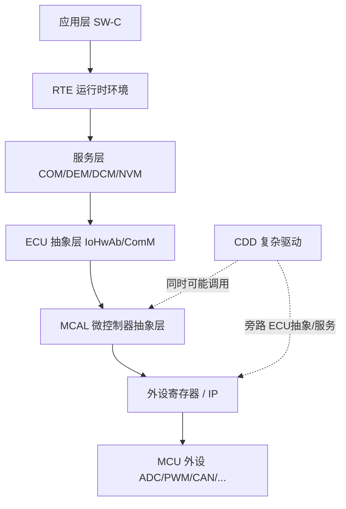

MCAL 之所以重要，是因为它承担了"硬件无关性契约"的落地。换句话说：**上层软件（RTE 以上的 SW-C、甚至大部分 BSW）可以假设"所有的 ADC 都是 Adc_ReadGroup 读出来的，所有的 CAN 都是 Can_Write 发出去的"，至于底层到底是 S32K 的一个 12 位 SAR ADC、AURIX 的一个 12 位逐次逼近 ADC，还是 RH850 的 ADC 单元，完全由 MCAL 内部消化**。这一契约是 AUTOSAR 可移植性的根本。

笔者的经验法则：**MCAL 配置随芯片不同而必须重写，但上层 OS / 通信 / 诊断 / 存储的 BSW 配置在合理抽象下是相对平台无关的**。所以跨芯片移植的核心策略是"MCAL 重写 + 上层配置复用"，配合一张详尽的芯片差异对照表，以及分平台管理的链接脚本（linker script / 内存映射描述）。这直接决定了移植工作量是从"几人月"降到"几人周"还是膨胀到"无法收敛"。

---

## 三、MCAL 模块清单与职责

AUTOSAR 规范将 MCAL 划分为若干标准化驱动模块，每个模块对应一类硬件资源。下面把常见模块的职责逐一拆解。注意：不同 AUTOSAR 版本（4.0/4.1/4.2/4.3/4.4）模块命名略有差异，但核心职责稳定。

| 模块 | 英文全称 | 核心职责 | 典型硬件映射 |
|------|----------|----------|--------------|
| MCU | Microcontroller Unit Driver | 时钟树、复位、低功耗模式、RAM 测试 | 时钟控制器、PMC、RSTC |
| PORT | Port Driver | 引脚方向、复用功能、上下拉、驱动强度 | GPIO 复用控制器 |
| DIO | Digital I/O Driver | 读写单个/组引脚电平 | GPIO 数据寄存器 |
| ADC | Analog-to-Digital Driver | 模拟量采样、扫描组、硬件触发 | SAR/Σ-Δ ADC |
| SPI | Serial Peripheral Interface Driver | 同步串行主从通信 | SPI/QSPI 控制器 |
| CAN | CAN Driver | 报文收发、波特率、控制器状态机 | CAN/CAN-FD 控制器 |
| ICU | Input Capture Unit | 边沿时间戳、占空比/周期测量 | 定时器输入捕获 |
| PWM | Pulse Width Modulation | 输出波形、占空比/频率、死区 | 定时器比较输出 |
| GPT | General Purpose Timer | 定时、计数、时基 | 通用定时器 |
| WDG | Watchdog Driver | 内部/外部看门狗喂狗 | WDT、SBC 看门狗 |
| FLS/EEP | Flash / EEPROM Driver | 片上存储擦写 | 内部 Flash、EEPROM 仿真 |
| LIN / UART / ETH | 各类通信驱动 | 对应总线收发 | 对应控制器 |

需要特别厘清一组易混概念：**PORT 与 DIO 的关系**。PORT 负责"配置"引脚（方向是输入还是输出、复用为哪个外设功能、上拉下拉、开漏、驱动能力），属于初始化期一次性配置；DIO 负责"运行期"对已经配置为 GPIO 的引脚进行电平读写。一个引脚如果复用为 SPI 的 SCK，则运行期由 SPI 模块驱动，DIO 不应再操作它；只有复用为纯 GPIO 时，DIO 才有意义。很多初学者把 PORT 和 DIO 当成同一个东西，这是配置错误的高发源头。

进一步理解 MCAL 模块之间的依赖关系，对排查"配置好了却不工作"至关重要。**MCU 模块是所有其他模块的时钟与复位总前提**——ADC、SPI、CAN、GPT、PWM、ICU 都依赖 MCU 给它们分配且使能了正确的外设时钟；如果 MCU 配置里漏开了某个模块的时钟门控，该模块读寄存器会返回总线错误或全部为 0，但工具界面上看不出任何"配置错误"。**GPT/定时器是被最多模块复用的时基**——ADC 的硬件触发源可能来自 GPT，PWM 的时基来自定时器，ICU 的计数基准也来自定时器，因此 GPT 的频率与分频配置会"牵一发而动全身"。**WDG 则反向依赖上层 WdgM 的调度**——若 OS 或某关键任务卡死导致 WdgM 没能按时调用 `WdgIf_SetTriggerCondition`，看门狗会复位整个 ECU，表现为"板子周期性重启"而非"某个功能失效"。把这种依赖关系画成一张"模块依赖图"，在移植和调试时能帮助快速锁定根因所在的那一层。

下面给出各重点模块的依赖与职责说明：

### 3.1 MCU 模块：一切时钟与复位的源头

MCU 驱动是 MCAL 里"最底层中的最底层"。它负责：
- **时钟树配置**：选择时钟源（外部晶振、内部 PLL、内部 RC），配置 PLL 倍频分频，把系统时钟、外设时钟（如 ADC 时钟、CAN 时钟、定时器时钟）分配到各个模块；
- **复位原因识别**：上电复位、看门狗复位、低电压复位、外部引脚复位等；
- **低功耗模式**：休眠（Sleep）、停止（Stop）、待机（Standby）的进入与唤醒配置；
- **RAM 初始化/测试**：功能安全场景下对 RAM 进行 ECC/MBIST 相关处理。

如果 MCU 模块配错时钟，例如把 ADC 的时钟配得过高导致超出数据手册规定的最大 ADC 时钟，或者把 CAN 模块的时钟源选错导致波特率算不出来，那么上层所有依赖时序的模块都会异常。因此 MCU 通常是配置顺序的起点。

### 3.2 GPT 与定时器：底层的时间命脉

GPT（通用定时器）几乎每个底层模块都离不开：给 ADC 提供周期触发源、给 ICU 提供计数基准、给 PWM 提供时基、给 WDG 提供窗口喂狗窗口、给 OS 提供 tick。它是一切时间相关动作的源头。调不好定时器，ADC 触发不稳、PWM 频率飘、ICU 测不准会连锁发生。

### 3.3 WDG：功能安全的最后一道保险

WDG 驱动管理内部看门狗（芯片内置 WDT）和外部看门狗（如电源管理芯片 SBC 内置的看门狗）。在 ASIL 等级要求下，看门狗往往与"看门狗管理的调度表""逻辑监督（Alive Supervision）""截止时间监督（Deadline Supervision）"等机制联合工作，由 WdgM（Watchdog Manager，服务层）统一编排。MCAL 的 WDG 只负责"按指定模式/窗口喂狗"这一物理动作。

---

## 四、芯片模块设计（IP 内部架构）

> 这一章是本文的核心新增章节之一。要真正吃透 MCAL，必须先理解 MCAL 操作的"对象"——芯片外设 IP 内部到底是什么。下面以 SPI、CAN、ADC 三个最典型外设为例，剖析其 IP 内部架构、寄存器组、时钟/复位来源，以及它们与 DMA 控制器、中断控制器的协作关系。所有寄存器/位域描述采用"通用 IP 逻辑"，贴近 NXP S32K、Infineon AURIX、Renesas RH850 等主流车规 MCU 的常见实现，但不绑定某一颗具体芯片的特定比特编号。

### 4.1 外设 IP 的通用组成

无论哪种外设，车规 MCU 上的外设 IP 通常具备以下共性结构：

1. **总线接口（Bus Interface）**：通过 APB 或 AHB 总线挂载在片上互连上，CPU 或 DMA 通过读写映射地址访问寄存器；
2. **寄存器组（Register Block）**：控制寄存器（CR/CTRL）、状态寄存器（SR/STAT）、数据寄存器（DR/DATA）、以及配置类寄存器（时钟分频、序列、滤波等）；
3. **功能核心（Functional Core）**：实现该外设本质功能的部分（移位寄存器、协议引擎、SAR 比较核心等）；
4. **缓冲/ FIFO**：收发缓冲，解耦总线访问速率与线速率；
5. **时钟与复位（Clock/Reset）**：来自 MCU 模块的时钟门控与复位信号；
6. **DMA 请求（DMA Request）**：在 FIFO 空/满或转换完成时向 DMA 控制器发出请求；
7. **中断逻辑（Interrupt Logic）**：把内部事件（完成、错误、溢出）汇聚成 IRQ 线送中断控制器；
8. **引脚复用（Pin Mux）**：把内部信号路由到具体物理引脚。

理解了这套"通用骨架"，再看任意一颗芯片的参考手册都会很快上手——差异只在寄存器位定义和时钟树细节，骨架是稳定的。

### 4.2 SPI 外设 IP 架构框图

SPI 是最常用的同步串行接口，连接 EEPROM、Flash、传感器、CAN 收发器（如 TJA1145 类）、电源管理 IC 等。下图给出 SPI IP 的典型内部架构及其与总线、DMA、中断、引脚的连接：

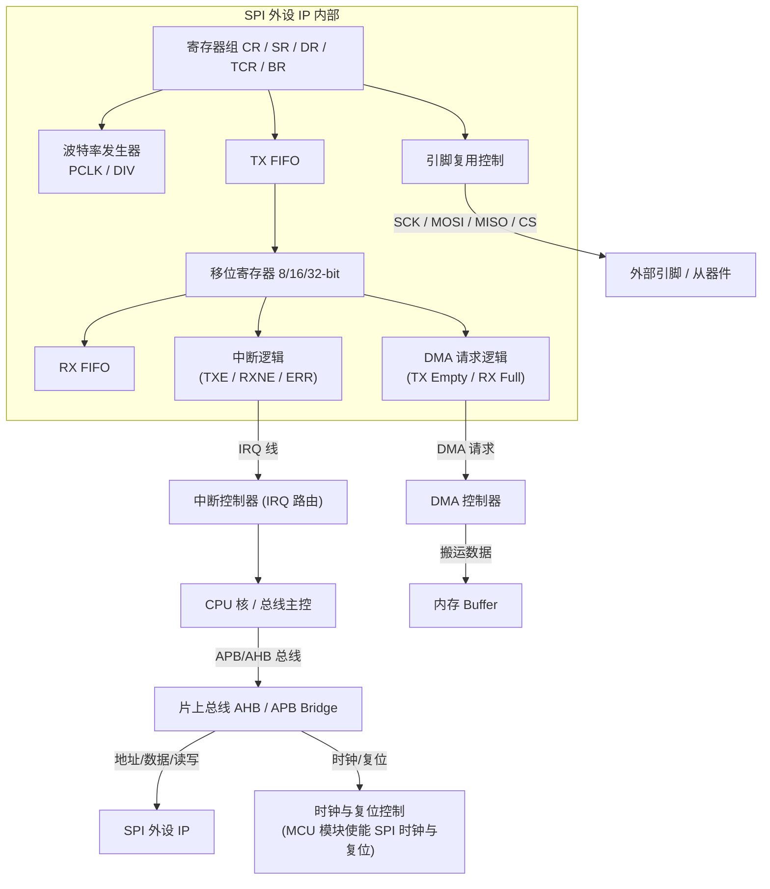

要点解读：
- **波特率发生器**把外设时钟 PCLK 按寄存器 `BR[4:0]` 分频得到 SCK；软件必须保证 SCK ≤ 从器件数据手册上限。
- **TX/RX FIFO** 解耦 CPU 写入速率与移位速率；FIFO 空/满状态反映在 SR 中，并可触发 DMA 请求或中断。
- **移位寄存器**是全双工核心：写入 DR 的数据在 SCK 驱动下逐位移出 MOSI，同时从 MISO 移入的数据落入 RX FIFO——这就是"写一帧同时读回一帧"的硬件基础。
- **DMA 请求**在大数据量（如读 SPI Flash）时搬运 FIFO，CPU 零干预；**中断逻辑**则在传输完成/错误时通知 CPU。

### 4.3 CAN 控制器 IP 架构框图

CAN 是车规通信主干。其控制器 IP 远比 SPI 复杂，包含完整的链路层协议引擎与错误管理状态机。下图以常见 CAN/CAN-FD 控制器（贴近 NXP S32K FlexCAN、Infineon AURIX MultiCAN+ 的通用结构）为例：

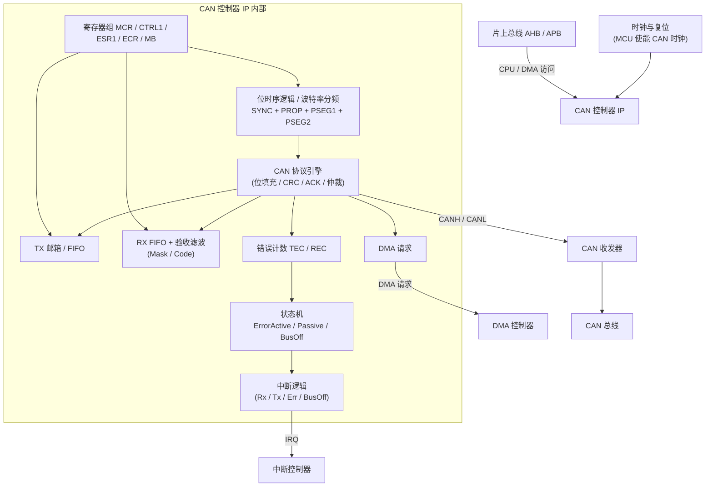

要点解读：
- **位时序逻辑**由 `PRESDIV + PROPSEG + PSEG1 + PSEG2 + SJW` 决定每位时间（Time Quantum, tq）与采样点，是波特率配置的物理落点。
- **协议引擎**在硬件里完成位填充、CRC 校验、ACK 应答与仲裁——这是 CAN 高可靠性的根源，软件无需介入逐位处理。
- **验收滤波（Mask/Code）**在硬件上决定哪些 ID 被接收，未通过滤波的帧直接丢弃，极大减轻 CPU 负担。
- **错误计数与状态机**把 TEC/REC 计数映射到 Error Active / Passive / BusOff 三态，驱动自动恢复逻辑。

### 4.4 ADC 外设 IP 架构框图

ADC 把模拟量变为数字量，是感知层的入口。以常见 SAR（逐次逼近）ADC 为例：

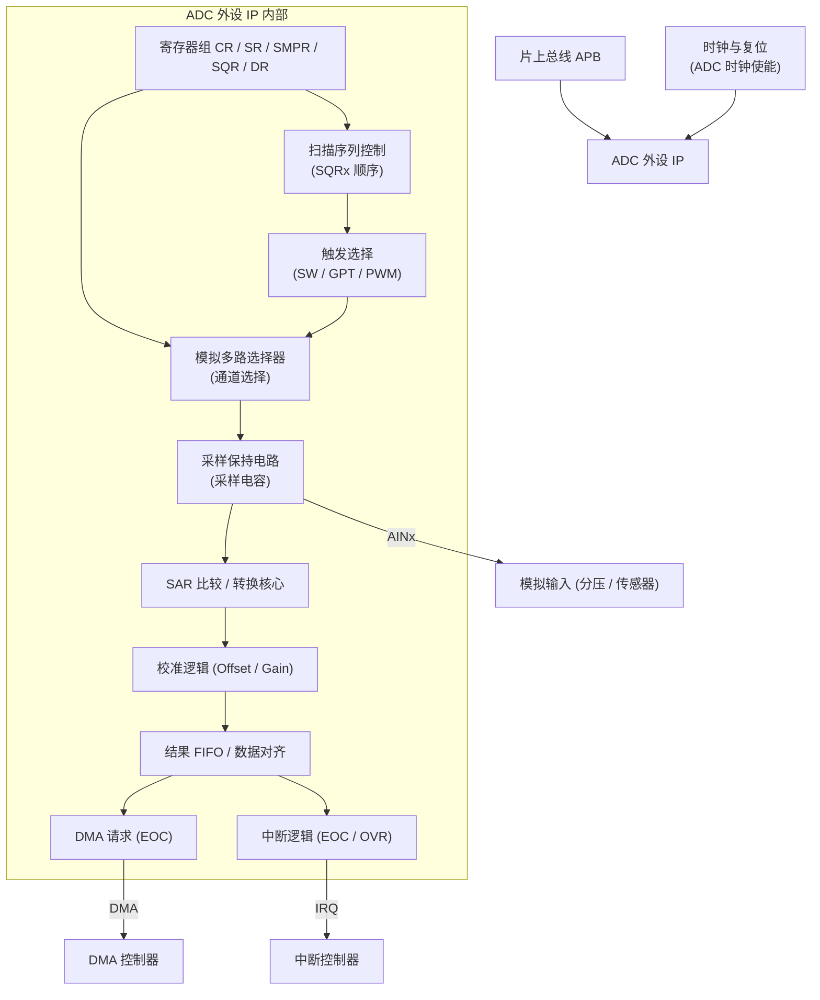

要点解读：
- **采样保持电路（S/H）** 是精度命门：外部信号给内部采样电容充电，必须 ≥ 建立时间才准确（这正是引子故障的根因）。
- **扫描序列控制** 根据 SQRx 寄存器定义的顺序自动切换通道，配合触发选择由软件、定时器或 PWM 启动。
- **校准逻辑** 用 offset / gain 校准消除系统误差，是量产一致性的关键。
- **DMA 请求** 在每个通道 EOC 时触发，把结果直接搬进内存 buffer，CPU 零干预。

### 4.5 时钟与复位来源：一切的前提

外设 IP 的时钟与复位全部来自 MCU 模块。下图给出通用时钟树与外设时钟门控的映射关系：

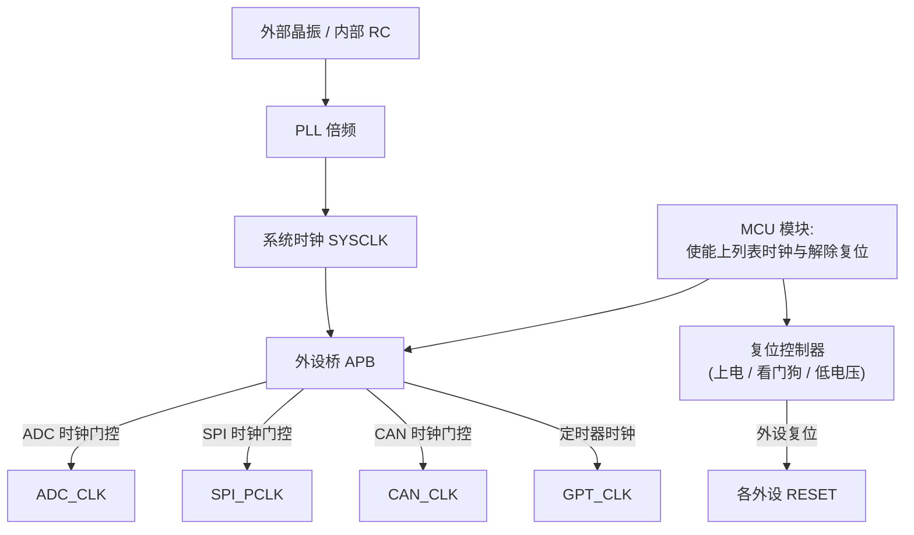

下表汇总常见外设的时钟/复位来源与使能位（通用描述，具体寄存器名依芯片而异）：

| 外设 | 典型时钟来源 | 使能位置（通用） | 复位来源 | 备注 |
|------|--------------|------------------|----------|------|
| ADC | 外设桥时钟 / 独立 ADC 时钟 | MCU 时钟门控寄存器 ADCx_CLK_EN | 上电/低电压复位 | 受最大 ADC 时钟限制 |
| SPI | 外设桥时钟 PCLK | MCU 时钟门控 SPIx_CLK_EN | 外设软复位位 | SCK 再经 BR 分频 |
| CAN | 外设桥时钟 / 独立 CAN 时钟 | MCU 时钟门控 CANx_CLK_EN | 外设软复位位 | 波特率基于此时钟 |
| GPT | 外设桥时钟 / 定时器时钟 | MCU 时钟门控 GPTx_CLK_EN | 外设软复位位 | 常作其它模块触发源 |
| PWM/ICU | 定时器时钟 | MCU 时钟门控 TMRx_CLK_EN | 外设软复位位 | 与 GPT 同源 |
| WDG | 独立低速时钟（LPO） | MCU 看门狗时钟使能 | 看门狗复位 | 独立于主时钟更可靠 |
| DIO/PORT | 通常无需独立时钟 | 引脚配置寄存器 | 上电复位 | GPIO 数据寄存器直读 |

**工程铁律**：任何"配置好了却不工作、寄存器读全 0"的排查，第一步永远是确认 MCU 模块里该外设的时钟门控已打开、复位已释放。这一步没做，后面所有配置都等于在空气中操���。

### 4.6 寄存器映射与关键位域

寄存器是 MCAL 与 IP 之间的唯一接口。下面给出 SPI 与 CAN 的寄存器组位域图（通用逻辑，贴近主流实现）。

**SPI 控制寄存器 / 状态寄存器 / 数据寄存器位域：**

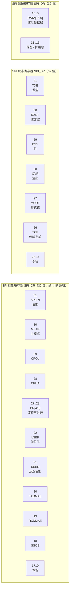

**CAN 模块配置寄存器 / 错误状态寄存器位域（FlexCAN 风格）：**

```mermaid
graph LR
    subgraph CAN_MCR["CAN 模块配置寄存器 MCR（32 位）"]
        direction LR
        M31["31<br/>MDIS<br/>禁能"]
        M30["30<br/>FRZ<br/>冻结"]
        M29["29<br/>RFEN<br/>RX FIFO"]
        M28["28<br/>HALT"]
        M27["27<br/>NOT_RDY"]
        M26["26<br/>WAK_MSK"]
        M25["25<br/>SOFTRST"]
        M24["24<br/>FRZ_ACK"]
        M21["21<br/>WRN_EN"]
        M16["16<br/>IRMQ"]
        M15["15<br/>DMA"]
        M11["11<br/>FDEN<br/>FD 使能"]
        M6_0["6..0<br/>MAXMB<br/>邮箱数"]
    end
    subgraph CAN_ESR1["CAN 错误状态寄存器 ESR1（32 位）"]
        direction LR
        E17["17<br/>TWRNINT"]
        E16["16<br/>RWRNINT"]
        E15["15<br/>TXWRN"]
        E14["14<br/>BIT1ERR"]
        E13["13<br/>BIT0ERR"]
        E12["12<br/>ACKERR"]
        E11["11<br/>CRCERR"]
        E10["10<br/>FRMERR"]
        E9["9<br/>STFERR"]
        E8["8<br/>RXWRN"]
        E5_4["5..4<br/>FLTCONF<br/>错误状态"]
        E2["2<br/>BOFFINT"]
        E1["1<br/>ERRINT"]
        E0["0<br/>WAKINT"]
    end
```

位域解读要点：
- **SPI_CR**: `SPIEN` 是总开关，未置位时其余配置无效；`MSTR/CPOL/CPHA` 决定主从与采样边沿，必须与从器件一致；`BR[4:0]` 决定 SCK 分频；`TXDMAE/RXDMAE` 开启后，FIFO 空/满会向 DMA 控制器发请求。
- **SPI_SR**: `TXE` 指示可写、`RXNE` 指示可读、`BSY` 指示总线忙、`OVR` 指示溢出（CPU 没及时读导致丢帧）、`MODF` 指示模式错误（如多主冲突）。
- **CAN_MCR**: `MDIS` 关闭模块省电；`FRZ/HALT` 进入冻结模式以便安全配置；`SOFTRST` 软件复位；`MAXMB` 声明可用邮箱数量；`FDEN` 开启 CAN-FD。
- **CAN_ESR1**: `FLTCONF[1:0]` 编码错误状态（00=Error Active, 01=Error Passive, 1x=Bus Off）；`TWRNINT/RWRNINT` 是收发错误计数越限中断；`BITxERR/ACKERR/CRCERR` 是具体错误类型，调试时据此定位物理层问题。

### 4.7 与 DMA 控制器 / 中断控制器的协作

外设 IP 不是孤立工作的，它要和片上两大系统协作：**DMA 控制器**负责数据搬运，**中断控制器（如 NVIC / INTC）**负责事件通知。

- **DMA 协作**：SPI 的 TX Empty / RX Full、ADC 的 EOC、CAN 的 RX FIFO 满等事件发出 DMA 请求，DMA 控制器自动在"外设数据寄存器 ↔ 内存 buffer"之间搬运。优势是 CPU 零干预、无中断抖动，适合高速/周期采样（如电池电压扫描）。代价是 buffer 必须 `non-cacheable` 或按 cache line 对齐，否则多核/带 Cache 内核会读到陈旧数据。
- **中断协作**：外设中断线经中断控制器路由到指定 CPU 核（多核 MCU 上尤为关键）。MCAL 在初始化时配置中断优先级（CAT1/CAT2）、使能对应 IRQ，并把向量表条目指向生成的中断服务程序（ISR）；ISR 内部清标志、调用 Notification 回调（如 `CanIf_TxConfirmation`）。
- **协作权衡**：小数据量用中断，大数据量/周期流用 DMA + 中断通知完成。错误类事件（溢出、Bus Off、模式错）必须用中断及时上报，否则错误会静默累积。

### 4.8 寄存器访问的原子性与端序注意

在 C 代码（无论手写还是 MCAL 生成）访问外设寄存器时，有两个常被忽视却致命的细节：

- **读-改-写（RMW）的原子性**：配置某个控制寄存器时常用 `REG |= BIT` 这类读-改-写。在单核上若在读与写之间被中断打断，且中断里也改了同一寄存器，就会丢失改动。多核下更危险——两个核同时 RMW 同一外设寄存器会直接数据竞争。解决方式：关键配置放在关中断临界区，或利用外设提供的"置位/清零"分离寄存器（如某些芯片的 SET/CLR 寄存器，写 1 只置位、写 1 只清零，无需读回）。AUTOSAR MCAL 在生成代码时通常由工具保证关键配置段被 `Os_SaveDisableInterrupts` 保护。
- **端序（Endianness）与数据宽度**：多数车规 MCU 是 little-endian（如 Cortex-M / TriCore），但外设数据寄存器、CAN 邮箱的字节排列、以及通信报文的字节序（Intel/Motorola 格式）可能不一致。例如把一个 `uint32` 写入 32 位 DR 与分四次写 8 位寄存器，在总线上的字节顺序可能不同；CAN 报文里多字节信号按 Motorola 格式跨字节排列时，从 `Can_PduType.sdu` 提取信号必须按 DBC 的字节序与位序规则解包。笔者的经验是：任何"数据搬到应用后数值对不上但每一位都对"的怪象，十有八九是端序或位序没处理好，应在 IoHwAb 的 pack/unpack 层用脚本严格按 DBC 生成，杜绝手工移位。

---

## 五、驱动代码实现：手写寄存器 vs MCAL 生成

> 本章用真实可读的 C 代码，展示"手写寄存器级驱动"与"MCAL 生成 API 调用"两种实现方式的对照。强调：两者功能等价，差异在可移植性、可维护性、功能安全证据与工程成本。

### 5.1 手写 SPI 主模式初始化 + 全双工收发

下面代码基于通用 SPI IP（逻辑贴近 S32K LPSPI / 常见 SPI 控制器），演示主模式初始化与全双工收发：

```c
/* 手写 SPI 主模式寄存器级驱动（通用 IP，逻辑贴近 S32K LPSPI / 常见 SPI） */
#include <stdint.h>
#include "spi_regs.h"   /* 由芯片头文件提供寄存器映射 */

#define SPI_BASE    0x4002A000u
#define SPI_CR      (*(volatile uint32_t *)(SPI_BASE + 0x00u))  /* 控制寄存器 */
#define SPI_SR      (*(volatile uint32_t *)(SPI_BASE + 0x04u))  /* 状态寄存器 */
#define SPI_DR      (*(volatile uint32_t *)(SPI_BASE + 0x08u))  /* 数据寄存器 */
#define SPI_CCR     (*(volatile uint32_t *)(SPI_BASE + 0x0Cu))  /* 时钟控制 */

/* 关键位定义 */
#define CR_SPIEN    (1u << 31)   /* SPI 使能 */
#define CR_MSTR     (1u << 30)   /* 主模式 */
#define CR_CPOL     (1u << 29)   /* 时钟极性 */
#define CR_CPHA     (1u << 28)   /* 时钟相位 */
#define SR_TXE      (1u << 31)   /* 发送缓冲空 */
#define SR_RXNE     (1u << 30)   /* 接收缓冲非空 */
#define SR_BSY      (1u << 29)   /* 总线忙 */

static void SPI_MasterInit(uint32_t baud_div, uint8_t cpol, uint8_t cpha)
{
    /* 1. 关闭 SPI 以便安全配置 */
    SPI_CR &= ~CR_SPIEN;

    /* 2. 配置波特率分频：SCK = PCLK / baud_div，需 ≤ 从器件手册上限 */
    uint32_t cr = SPI_CR;
    cr &= ~(0x1Fu << 23);             /* 清空 BR 域 */
    cr |= ((baud_div & 0x1Fu) << 23);

    /* 3. 配置主模式、时钟极性/相位（必须严格匹配从器件 CPOL/CPHA） */
    cr |= CR_MSTR;
    if (cpol) cr |= CR_CPOL; else cr &= ~CR_CPOL;
    if (cpha) cr |= CR_CPHA; else cr &= ~CR_CPHA;

    /* 4. 写回并使能，等待空闲 */
    SPI_CR = cr;
    SPI_CR |= CR_SPIEN;
    while (SPI_SR & SR_BSY) { /* 等待总线空闲 */ }
}

/* 全双工收发：写一帧同时读回一帧 */
static uint32_t SPI_TransferFrame(uint32_t tx_data)
{
    while (!(SPI_SR & SR_TXE)) { }   /* 等待发送缓冲空 */
    SPI_DR = tx_data;                /* 写入即启动一次移位 */

    while (!(SPI_SR & SR_RXNE)) { }  /* 等待接收缓冲非空 */
    return SPI_DR;                   /* 全双工：读回同帧收到的数据 */
}

/* 典型用法：读 SPI Flash 状态寄存器 */
void SPI_FlashReadStatus(uint8_t *status)
{
    (void)SPI_TransferFrame(0x05u);            /* 发送读状态命令 */
    *status = (uint8_t)SPI_TransferFrame(0x00u); /* 读回状态（命令后哑元帧） */
}
```

### 5.2 手写 CAN 波特率配置 + 邮箱发送

下面代码贴近 NXP S32K FlexCAN 寄存器逻辑，演示波特率（位时序）配置与邮箱发送：

```c
/* 手写 CAN 控制器寄存器级驱动（贴近 NXP S32K FlexCAN 寄存器逻辑） */
#include <stdint.h>
#include "can_regs.h"

#define CAN_BASE    0x40024000u
#define CAN_MCR     (*(volatile uint32_t *)(CAN_BASE + 0x00u))  /* 模块配置 */
#define CAN_CTRL1   (*(volatile uint32_t *)(CAN_BASE + 0x04u))  /* 控制 1 */
#define CAN_ESR1    (*(volatile uint32_t *)(CAN_BASE + 0x08u))  /* 错误状态 */
#define CAN_MB0     ((volatile uint32_t *)(CAN_BASE + 0x80u))   /* 邮箱 0 基址 */

#define MCR_MDIS    (1u << 31)   /* 模块禁能 */
#define MCR_FRZ     (1u << 30)   /* 冻结 */
#define MCR_HALT    (1u << 28)   /* 暂停 */
#define MCR_SOFTRST (1u << 25)   /* 软件复位 */
#define MCR_FRZ_ACK (1u << 24)   /* 冻结确认 */

/* 配置 500kbps（示例值，需按实际总线时钟核对 tq 数） */
static void CAN_Init(uint32_t bus_clk_hz, uint32_t bitrate)
{
    /* 1. 进入冻结模式再配置 */
    CAN_MCR |= MCR_FRZ | MCR_HALT;
    while (!(CAN_MCR & MCR_FRZ_ACK)) { }

    /* 2. 软件复位模块 */
    CAN_MCR |= MCR_SOFTRST;
    while (CAN_MCR & MCR_SOFTRST) { }

    /* 3. 退出禁能 */
    CAN_MCR &= ~MCR_MDIS;

    /* 4. 计算位时间：tq = 总线时钟 / (PRESDIV+1)
     *    位时间 = (1 + PROPSEG + PSEG1 + PSEG2) * tq
     *    采样点 = (1 + PROPSEG + PSEG1) / 位时间 tq 数 */
    uint32_t tq_total = 8u;                       /* 取 8 个 tq 为示例 */
    uint32_t presdiv  = (bus_clk_hz / bitrate / tq_total) - 1u;
    uint32_t prop = 2u, pseg1 = 3u, pseg2 = 2u;   /* 8 tq，采样点 75% */
    uint32_t sjw = 1u;

    CAN_CTRL1 = (presdiv & 0xFFu)
              | (prop  << 6)
              | (pseg1 << 11)
              | (pseg2 << 16)
              | (sjw   << 23);

    /* 5. 退出冻结，进入正常模式 */
    CAN_MCR &= ~(MCR_HALT | MCR_FRZ);
    while (CAN_MCR & MCR_FRZ_ACK) { }
}

/* 通过邮箱 0 发送一帧标准 ID 数据（简化轮询） */
static int CAN_SendStd(uint32_t id, const uint8_t *data, uint8_t len)
{
    volatile uint32_t *mb = CAN_MB0;
    mb[0] = (1u << 31) | (id << 18);   /* CS: 发送 + 标准 ID */
    mb[1] = (uint32_t)len;             /* 长度 */
    uint32_t word = 0u;
    for (uint8_t i = 0; i < len && i < 4; i++)
        word |= ((uint32_t)data[i] << (i * 8));
    mb[2] = word;                      /* 数据低 4 字节 */
    mb[0] |= (1u << 31);               /* 置位 CODE=TX，启动发送 */
    return 0;
}
```

### 5.3 手写 ADC 通道扫描

下面代码基于通用 SAR ADC 逻辑，演示三通道扫描（软件触发，阻塞读取）：

```c
/* 手写 ADC 通道扫描寄存器级驱动（通用 SAR ADC 逻辑） */
#include <stdint.h>
#include "adc_regs.h"

#define ADC_BASE  0x4003C000u
#define ADC_CR2   (*(volatile uint32_t *)(ADC_BASE + 0x04u))
#define ADC_SMPR  (*(volatile uint32_t *)(ADC_BASE + 0x08u))  /* 采样时间 */
#define ADC_SQR1  (*(volatile uint32_t *)(ADC_BASE + 0x0Cu))  /* 序列寄存器 */
#define ADC_SR    (*(volatile uint32_t *)(ADC_BASE + 0x10u))  /* 状态 */
#define ADC_DR    (*(volatile uint32_t *)(ADC_BASE + 0x14u))  /* 数据 */

#define CR2_ADON    (1u << 0)    /* 开启 */
#define CR2_SWSTART (1u << 30)   /* 软件启动转换 */
#define SR_EOC      (1u << 1)    /* 转换结束 */

/* 配置扫描序列：CH0 -> CH1 -> CH2，每通道采样时间足够长（关键！） */
void ADC_ScanInit(void)
{
    ADC_CR2 &= ~CR2_ADON;                 /* 先关闭 */
    /* 三通道均设最大采样周期，确保采样电容充满（避免串扰） */
    ADC_SMPR = (0x7u << 0) | (0x7u << 3) | (0x7u << 6);
    ADC_SQR1 = (0x2u << 20)              /* L[3:0]=2 表示 3 个转换 */
             | (0x0u << 0)              /* CH0 第 1 */
             | (0x1u << 5)              /* CH1 第 2 */
             | (0x2u << 10);            /* CH2 第 3 */
    ADC_CR2 |= CR2_ADON;                /* 使能 ADC */
}

/* 软件触发一次扫描，阻塞读取结果（简化，无 DMA） */
void ADC_ScanOnce(uint16_t *out3)
{
    ADC_CR2 |= CR2_SWSTART;             /* 启动扫描 */
    for (uint8_t ch = 0; ch < 3; ch++) {
        while (!(ADC_SR & SR_EOC)) { }  /* 等待每通道 EOC */
        out3[ch] = (uint16_t)(ADC_DR & 0x0FFFu);
        ADC_SR &= ~SR_EOC;
    }
}
```

### 5.4 MCAL 生成 API 调用对照

同样的功能，用 AUTOSAR MCAL 生成接口实现，代码变成"描述意图而非操作寄存器"：

```c
/* MCAL 生成代码调用：与手写 SPI 驱动功能等价，但无需碰寄存器 */
#include "Spi.h"

/* 配置工具已生成 SpiChannel / SpiJob / SpiSequence，并链接到外部 EEPROM */
void Mcu_SpiReadEEPROM(uint16_t addr, uint8_t *buf, uint8_t len)
{
    uint8_t tx[3];
    tx[0] = 0x03u;                          /* 读命令 */
    tx[1] = (uint8_t)(addr >> 8);
    tx[2] = (uint8_t)(addr & 0xFFu);
    /* 1. 把命令写入内部缓冲（IB = Internal Buffer 模式） */
    Spi_WriteIB(SpiConf_SpiChannel_EEPROM_CMD, tx);

    /* 2. 触发异步传输（EEPROM_Seq 已把命令 Job + 数据 Job 串好） */
    Std_ReturnType r = Spi_AsyncTransmit(SpiConf_SpiSequence_EEPROM_READ);
    if (E_OK != r) {
        return;  /* 总线忙或序列冲突，由上层决定重试策略 */
    }

    /* 3. 完成由 Notification（SpiIf_TxEndNotification 等）异步通知；
     *    MCAL 内部自动按 Job 切换 CS 与 CPOL/CPHA，无需手动操作寄存器 */
    Spi_ReadIB(SpiConf_SpiChannel_EEPROM_DATA, buf);   /* 取回数据 */
}
```

```c
/* MCAL CAN 发送调用：接口由工具生成，上层经 CanIf 间接或直接调用 */
#include "Can.h"

void Mcu_CanSend(void)
{
    Can_PduType pdu;
    pdu.id          = 0x100u;       /* 报文 CAN ID */
    pdu.length      = 8u;           /* 数据长度 */
    pdu.sdu         = txData;       /* 指向数据缓冲 */
    pdu.swPduHandle = 0u;           /* 软件句柄，用于回确认认 */
    Std_ReturnType r = Can_Write(CanConf_CanHardwareObject_HTH_0, &pdu);
    if (E_OK != r) {
        /* 邮箱满 / 控制器 BusOff：需上层（CanIf/Tx 确认）处理或重试 */
    }
    /* 发送完成由 Notification（CanIf_TxConfirmation）异步回调通知 */
}
```

```c
/* MCAL ADC 调用：与手写扫描等价，但由工具管理组/触发/DMA/通知 */
#include "Adc.h"

void Mcu_AdcStartGroup(void)
{
    /* 启动一组扫描（组已配好通道顺序、采样时间、硬件/软件触发） */
    Adc_StartGroupConversion(AdcConf_AdcGroup_BatteryCells);
    /* 完成由 AdcNotification（若使能）通知；或轮询 Adc_GetGroupStatus */
}

/* IoHwAb 中读取转换结果并换算为物理量（标定换算与 MCAL 无关） */
uint16_t IoHwAb_GetCellVoltageMv(uint8_t cell_idx)
{
    const Adc_ValueGroupType *raw = Adc_GetStreamPtr(AdcConf_AdcGroup_BatteryCells);
    /* V_mV = raw * VREF_MV / 4095 * 分压比（假设 11 倍分压） */
    uint32_t mv = ((uint32_t)raw[cell_idx] * 3300u) / 4095u * 11u;
    return (uint16_t)mv;
}
```

### 5.5 手写 vs 生成：差异与取舍

- **手写驱动**：要自己算 BR 分频、算 PROPSEG/PSEG 采样点、管 FIFO 空满、清中断标志、配 DMA 与中断路由。灵活、无授权费、首版可能快，但**换芯片几乎重写**，且功能安全认证证据需自建。
- **MCAL 生成**：只描述"要什么"（波特率、CPOL/CPHA、通道序列），工具生成寄存器操作与状态机，并把差异收敛在 `Can_Write / Spi_AsyncTransmit / Adc_StartGroupConversion` 等标准接口内部。上层（含其它芯片平台）一行不改。

笔者的结论：**"用 MCAL"与"懂寄存器"不矛盾而互补**。MCAL 生成的代码本质是寄存器操作的封装，异常（时钟门控未开、中断标志未清、外设未使能）仍需寄存器级定位。一个成熟工程师应当既能读懂生成的 `Spi.c`，也能在逻辑分析仪前对着 SR 的 `RXNE` 比特找问题。

---

## 六、MCAL 配置说明：工具链工作流与关键配置项

> 本章把"配置驱动开发"讲实：以 EB tresos / Vector DaVinci / ETAS ISOLAR 三类工具为对象，给出 SPI/CAN/ADC/DIO/PORT 的关键配置项清单、ARXML 片段、代码生成与上层调用路径、Notification 机制，以及多核/锁步注意点。

### 6.1 工具链工作流强化

主流工具链有三家，核心思想一致——"配置驱动开发"：

- **EB tresos Studio**（Elektrobit）：在 NXP S32K、S32G 等平台几乎事实标准，提供 MCAL 配置与 BSW 集成，生成符合 AUTOSAR 的 C 代码与工程文件；
- **Vector DaVinci Configurator Pro / DaVinci Developer**：覆盖 SW-C 设计（Developer）、系统/BSW 配置（Configurator Pro）到 RTE/BSW 代码生成完整链路，是德系 OEM 与 Tier1 主流；
- **ETAS ISOLAR-A / ISOLAR-B**：ETAS（博世系）工具，常用于 AURIX 等平台，配置与代码生成一体化。

三者共同工作流如下：

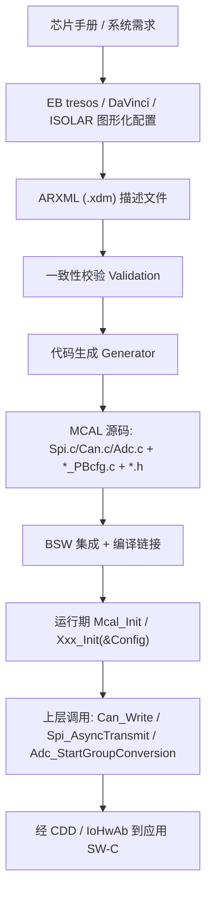

关键认知：**MCAL 配置（代码）与 MCAL 库（lib/obj）往往分离**。芯片厂商（NXP、Infineon、Renesas）提供编译好的 MCAL 静态库或带源码包，工具生成的是"把你的配置实例化为结构体的那部分代码"（如 `Adc_PBcfg.c`、`Spi_PBcfg.c`）。工程师真正的"手写量"主要在配置，而非驱动实现本身。

配置项分三类作用域：
- **Pre-Compile（预编译）**：用宏在编译期确定，如是否使能某功能、最大通道数；
- **Link-Time（链接期）**：链接阶段确定的内存布局相关参数；
- **Post-Build（后构建）**：运行期可加载/切换的配置结构（如多套 CAN 波特率），以 `PbCfg` 形式存在，灵活性最高。

### 6.2 SPI 配置项清单

| 配置项 | 含义 | 典型取值 | 备注 |
|--------|------|----------|------|
| SpiChannel 数据宽度 | 每帧位数 | 8 / 16 / 32 | 须匹配从器件 |
| CPOL / CPHA | 时钟极性/相位 | (0,0)/(0,1)/(1,0)/(1,1) | 必须与从器件手册一致 |
| 波特率分频 | SCK = PCLK / 分频 | 2~256 | ≤ 从器件最大 SCK |
| 片选极性 | CS 低/高有效 | LOW/HIGH | 错则全不通 |
| SpiCsLeadDelay | CS 建立时间 | 依手册(如 ≥1µs) | 填 0 易"连发错" |
| SpiCsTrailDelay | CS 保持时间 | 依手册 | 同上 |
| SpiCsIdleDelay | CS 空闲时间 | 依手册 | 切换从器件间去抖 |
| 传输模式 | 同步/异步 | SYNC/ASYNC | 异步需 Notification |
| DMA 支持 | 大数据量搬运 | ON/OFF | SPI Flash 建议开 |
| SpiHwUnit | 绑定硬件 SPI 模块 | SpiHwUnit_0/1 | 多 SPI 时分配 |

SPI 用三级模型组织传输（理解配置的关键）：**Channel** 描述一次片选有效期间的一帧；**Job** 绑定一个具体 CS 与一套时序（CPOL/CPHA/波特率），可含多个 Channel；**Sequence** 串联多个 Job，一次 `Spi_AsyncTransmit` 触发。其价值在于挂多个时序各异的从器件时，MCAL 自动在 Job 切换时重载时序，避免手动改寄存器出错。

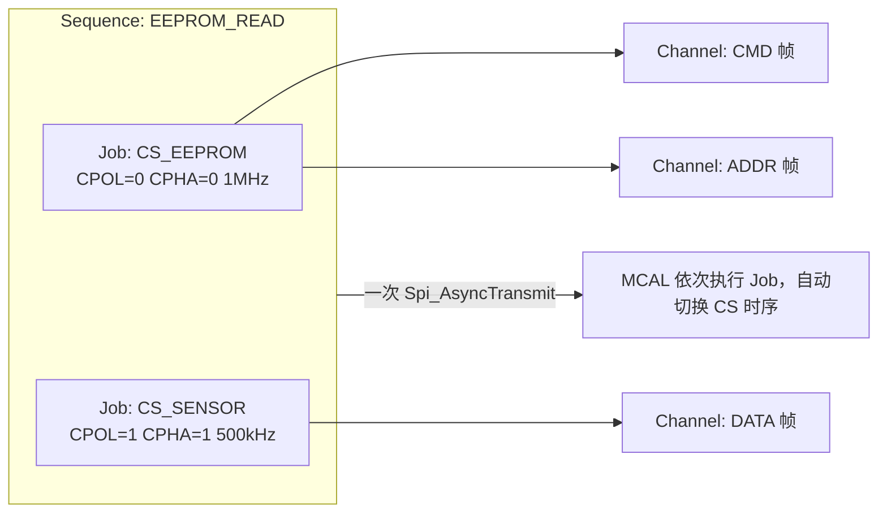

### 6.3 CAN 配置项清单

| 配置项 | 含义 | 典型取值 | 备注 |
|--------|------|----------|------|
| 波特率 | 总线速率 | 500k / 1M kbps | 全网一致 |
| PROPSEG | 传播段 tq 数 | 1~8 | 按总线延迟 |
| PSEG1 / PSEG2 | 相位段 | 1~8 | 决定采样点 |
| SJW | 同步跳转宽度 | 1~4 | 抗时钟偏差 |
| 采样点 | (1+PROP+PSEG1)/总 tq | 75%~87.5% | 工具辅助算 |
| 验收滤波 Mask/Code | 接收 ID 过滤 | 依 DBC | 硬件级过滤 |
| 邮箱/Buffer 数 | Tx/Rx 资源 | 依芯片 | MAXMB |
| BusOff 自动恢复 | 总线关闭恢复 | ON/OFF | ASIL 需开 |
| CAN-FD | 数据段波特率 | 2M/5M | 收发器须支持 |
| Notification | 收发/错误回调 | 使能/禁用 | 须显式开 |

采样点计算示例：位时间 = 1 + PROP + PSEG1 + PSEG2 = 16 tq，若 PROP+PSEG1 = 13 tq，采样点 = 14/16 = 87.5%。通常工具辅助计算或对照 CAN 矩阵（如 500 kbps、采样点 80%）。

### 6.4 ADC 配置项清单

| 配置项 | 含义 | 典型取值 | 备注 |
|--------|------|----------|------|
| 分辨率 | 量化位数 | 8/10/12 bit | 越高越慢 |
| 参考电压 | VREF 来源 | 内部/外部 VREFH | 影响精度 |
| 采样时间（每通道） | S/H 充电时间 | ≥ 建立时间 | 防串扰关键 |
| 转换组 Group | 通道扫描序列 | 顺序/分组 | 单次/连续 |
| 触发源 | 启动方式 | SW/GPT/PWM | 硬件触发零抖动 |
| DMA 模式 | 结果搬运 | ON/OFF | 周期采样建议开 |
| 校准 | Offset/Gain | 使能/禁用 | 量产一致性 |
| 缓冲模式 | Streaming/覆盖 | 依需求 | 滚动缓冲常用 |
| Notification | 转换完成回调 | 使能/禁用 | 须显式开 |

回顾引子故障：采样周期必须 ≥ 建立时间，否则采样电容未充满，量化值偏低且随前通道漂移（"串扰"假象）。多路 MUX 切换时开关本身有建立时间，通道间插入空闲采样周期或等稳定标志是工程必需。

### 6.5 DIO / PORT 配置项清单

| 配置项 | 含义 | 典型取值 | 备注 |
|--------|------|----------|------|
| PortPinDirection | 输入/输出/复用 | IN/OUT/ALTx | ALT 号选错外设不工作 |
| PortPinMode | 复用功能选择 | CAN0_TX/SPI_SCK... | 查数据手册引脚表 |
| PortPinInitialValue | 上电初始电平 | HIGH/LOW | 安全相关引脚重点 |
| Pull-up/down | 上下拉 | UP/DOWN/OFF | 输入必配 |
| Open Drain | 开漏 | ON/OFF | I2C 必备 |
| Drive Strength | 驱动强度 | LOW/HIGH | 高速信号需高 |
| Slew Rate | 斜率控制 | FAST/SLOW | 抑制 EMI |
| Input Filter | 输入滤波 | ON/OFF | 滤毛刺 |
| DioChannel/Port/Group | DIO 粒度 | 单脚/端口/段 | 复用引脚 DIO 禁操 |

功能安全视角：控制外部功率器件的使能引脚，若复位后、PORT 初始化完成前处于高电平，可能造成上电瞬间误触发。硬件上常设计为"低有效 + 外部下拉"，软件上 `PortPinInitialValue` 配安全态，并在 MCAL 初始化后显式写一次确认。

### 6.6 ARXML 片段示例

下面是 PORT 与 ADC 配置的 ARXML 示意片段（真实工具导出的标签更冗长，含容器/参数/引用）：

```xml
<!-- PORT 配置：将 PTA2 配为 CAN0 TX，PTA3 配为 CAN0 RX（上拉） -->
<ECUC-PORT-CONTAINER>
  <PortConfigSet>
    <PortPin>
      <PortPinId>2</PortPinId>
      <PortPinName>PTA2_CAN0_TX</PortPinName>
      <PortPinDirection>PORT_PIN_OUT</PortPinDirection>
      <PortPinMode>PORT_PIN_MODE_CAN0_TX</PortPinMode>
      <PortPinInitialValue>PORT_PIN_LEVEL_LOW</PortPinInitialValue>
    </PortPin>
    <PortPin>
      <PortPinId>3</PortPinId>
      <PortPinName>PTA3_CAN0_RX</PortPinName>
      <PortPinDirection>PORT_PIN_IN</PortPinDirection>
      <PortPinMode>PORT_PIN_MODE_CAN0_RX</PortPinMode>
      <PortPinPull>PORT_PIN_PULL_UP</PortPinPull>
    </PortPin>
  </PortConfigSet>
</ECUC-PORT-CONTAINER>

<!-- ADC 配置：Group 含 CH0/CH1/CH2，软件触发 + DMA -->
<ECUC-ADC-CONTAINER>
  <AdcConfigSet>
    <AdcGroup>
      <AdcGroupId>AdcGroup_BatteryCells</AdcGroupId>
      <AdcChannelRef>CH_VCELL1 CH_VCELL2 CH_TEMP</AdcChannelRef>
      <AdcTriggerSource>ADC_TRIG_SW</AdcTriggerSource>
      <AdcGroupConversionMode>ADC_CONV_MODE_ONESHOT</AdcGroupConversionMode>
      <AdcUseDma>TRUE</AdcUseDma>
      <AdcNotification>Adc_BatteryCellsNotification</AdcNotification>
    </AdcGroup>
  </AdcConfigSet>
</ECUC-ADC-CONTAINER>
```

### 6.7 配置 → 代码生成 → 上层调用路径

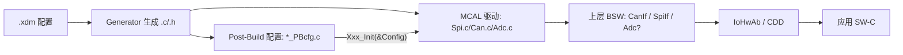

路径要点：`Xxx_Init(&Config)` 在启动阶段把 Post-Build 配置结构注入驱动；应用层经 IoHwAb/CDD 调用标准 API；MCAL 内部完成寄存器操作。上层完全不感知引脚、通道号、寄存器。

### 6.8 Notification 使能与回调

AUTOSAR MCAL 的异步通知（如 `AdcNotification`、`CanIf_TxConfirmation`、`SpiIf_TxEndNotification`）必须**在配置里显式使能，且应用注册回调**，否则"永远收不到数据"。常见遗漏：勾选了 Notification 使能，却忘了在 BSW 里把回调指针指到应用函数，或忘了在 OS 里使能对应中断。排查"收不到数据"第一步就是确认 Notification 链是否完整。

### 6.9 多核 / 锁步注意点（配置层面）

- **外设所有权**：AURIX 有外设访问控制，需配置哪个 CPU 能访问哪个外设，否则跨核访问被总线拒绝；
- **中断路由**：外设 IRQ 必须绑到正确的核，否则中断不进或进错核；
- **锁步核（S32K3）**：两个核跑相同代码比较结果，MCAL 的"读-改-写"若涉时间戳/随机源需注意确定性；
- **共享资源互斥**：多核访问同一 MCAL 模块需 OS 自旋锁或 MCAL 自带核间保护；
- **MPU / Cache 一致性**：某核 DMA 把数据搬进共享内存，另一核 Cache 缓存旧值会读陈旧数据——需把共享缓冲标 `non-cacheable` 或读前 `Invalidate`。

---

## 七、配置工具链：从 ARXML 到代码生成（深化）

这一节把第六章的工具链背景再展开。AUTOSAR 的核心是"配置驱动开发"——工程师先在工具里描述"如何配置芯片"，工具再生成 C 代码与头文件。流程：**ARXML（AUTOSAR XML）→ 图形化/脚本化配置 → 代码生成 → 编译链接**。


ARXML 的"三层描述"：
1. **ECU Extract**：从整车系统描述切出本 ECU 相关部分；
2. **BSW 配置**：针对每个模块描述容器（Container）、参数（Parameter）、引用（Reference）；
3. **生成产物**：代码生成器读配置，产出 `Adc_PBcfg.c`、`Spi_PBcfg.c`、`Can_PBcfg.c` 等 Post-Build 结构及接口头。

工程经验：**生成代码（.c/.h）与 MCAL 库分离**。工具生成的是"配置实例化"部分，芯片厂商提供驱动库本体。理解这三类作用域（Pre-Compile / Link-Time / Post-Build），决定了哪些参数可"改配置不改代码重编译"（Post-Build），哪些必须重编译。

---

## 八、DIO 与 PORT 驱动：引脚配置的细节深渊

引脚是 MCAL 里最容易"看着简单、实则坑多"的部分。一个引脚行为由 PORT 在初始化阶段一次性决定，运行期由 DIO（若是 GPIO）或对应外设（若是复用）驱动。

### 8.1 PORT 配置的关键维度

一个引脚在 PORT 里要配置的内容远不止"输入/输出"：方向、电平初始值、上下拉、开漏、驱动强度、斜率控制、输入滤波。错误配置会导致信号完整性问题、EMI 超标或功能失效。

### 8.2 DIO 的"通道 / 端口 / 通道组"概念

- **DIO Channel**：单个引脚，`Dio_WriteChannel(DioChannelId, Level)`；
- **DIO Port**：一个硬件端口（如 PORTA 0~31 位），`Dio_WritePort(DioPortId, Level)`；
- **DIO Channel Group**：端口中一段连续位（如 bit3~bit7），`Dio_WriteChannelGroup(...)`，常驱动 8 位数据总线或 LED 段码。

DIO 不应越权操作复用引脚——若某引脚已配为 SPI MOSI，DIO 再写它结果未定义且冲突。

### 8.3 上下拉与电平的硬件耦合

常见误解"软件配了上拉就一定有上拉"。实际：外部已上拉/下拉时软件再配只是叠加；输入模式未配上下拉时为纯高阻易干扰；开漏输出必须外部上拉才能输出高电平（I2C 无上拉电阻则不通）。MCAL 配置只是"把硬件意图写进寄存器"，原理图评审阶段就应确认。

从功能安全视角，引脚"上电默认态"是安全设计起点。控制外部功率器件的使能引脚，若 MCU 复位后、PORT 初始化完成前处于高电平，可能上电瞬间误触发。硬件上常设计为"低有效 + 外部下拉"，软件上 PORT 初始值配安全态，并在 MCAL 初始化后立即显式写一次确认（若支持回读）。这种"默认安全 + 主动确认"双保险，是最易被忽视却最关乎系统安全的环节。

---

## 九、SPI / ADC / CAN 三大 MCAL 关键工程要点

这三类驱动工程量最大、最容易出问题。第六章已给配置项清单，这里补充工程机理与典型坑。

### 9.1 SPI：时序匹配是生命线

SPI 连接外部器件：EEPROM、Flash、传感器、CAN 收发器、电源管理 IC、屏幕等。最典型坑是"Clock Phase 与从器件不匹配导致读回全 0xFF 或 0x00"。必须用逻辑分析仪抓四根线（SCK/MOSI/MISO/CS），逐位对照手册时序图。

片选的极性（低/高有效）与释放时序易被忽视：许多从器件要求两次传输间 CS 保持足够无效时间（deselect time），否则内部状态机没复位，下次通信错位。这对应 `SpiCsLeadDelay / SpiCsTrailDelay / SpiCsIdleDelay` 三个参数，需对照从器件手册"CS 建立/保持/空闲"填写。填 0 而手册要求 ≥1µs，现象常是"第一帧能通、连发就错"。

### 9.2 ADC：零抖动采样的工程要点

回顾引子故障，ADC 核心机制：**分压电阻网络 + RC 滤波 → 多路 MUX → ADC → DMA → 内存 buffer**。三机制缺一不可：硬件触发（免软件抖动）、DMA 自动搬运（CPU 零干预）、精度保障（采样周期 ≥ 建立时间）。

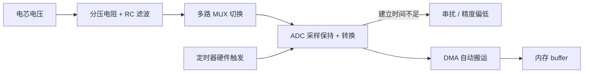

ADC 一次转换时间构成：`[采样保持 S/H] → [转换 Conversion] → [结果锁存]`。S/H 阶段外部信号给采样电容充电，必须 ≥ 建立时间。若不足，电容未充满 → 量化值偏低且随前序电压漂移（"串扰"假象真凶：上一通道电压残留，新通道没留够建立时间）。**类比**：采样电容像小水杯，建立时间即"接水到满"的时间。刚接了杯盐水（上一通道）没倒干净就接新水（新通道），自然带咸味。留够建立时间等于每次换水前倒干净。

ADC 模块以 **ADC Group（转换组）** 组织通道：组内顺序扫描多通道，支持单次/连续、硬件/软件触发、中断/DMA 通知。关键配置还有分辨率、参考电压、校准（offset/gain）、Streaming/覆盖缓冲。MUX 切换通道时开关本身有建立时间，通道间插入空闲采样周期或等稳定标志是工程必需。

### 9.3 CAN：波特率、缓冲区与状态机

CAN 配置要点：波特率与采样点（SYNC_SEG(1)+PROP+PSEG1+PSEG2，采样点 75%~87.5%，SJW 抗时钟偏差）；邮箱/FIFO 管理 + 验收滤波；错误管理三态（Error Active/Passive/Bus Off）与自动恢复；CAN-FD 双波特率；Notification 使能。

移植新芯片时 CAN 控制器寄存器差异大（有按"邮箱"组织，有按"FIFO+过滤器组"），但上层接口不变——这正是 MCAL 抽象价值。笔者的经验：**把芯片差异收敛在 `Can_Write / Can_Read / Can_SetControllerMode` 等标准接口内部，上层 BSW 与 App 一行不改**。配合 Python 脚本解析 DBC 自动生成 pack/unpack 代码，报文配置从一天缩到半小时，且避免人为错配。

典型发送调用：`Can_Write` 只是把数据装入发送邮箱并触发发送，真正"发出完成"由中断里的 `CanIf_TxConfirmation` 回调告知。新手发送后立刻读邮箱以为"已发出"，其实可能还在仲裁或没送上总线。

---

## 十、上层调用路径：MCAL → CDD → IoHwAb → 应用

数据从硬件到应用并非"MCAL 直接喂给 SW-C"。典型路径分层、可测试：

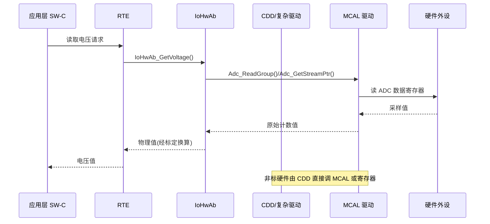

各层职责：MCAL 提供原始"计数值/字节流/电平"，不含任何物理单位换算；IoHwAb 把原始值换算为物理量，并组合多次 MCAL 调用为语义操作；CDD 对 MCAL 覆盖不到或需极致时序/算法的硬件，直接调 MCAL 甚至寄存器；应用层只认物理量与业务语义。这条路径让"电压读出来不对"能逐层定位——是 MCAL 计数错（硬件/配置）、IoHwAb 标定系数错、还是应用算法错。

---

## 十一、手写寄存器驱动 vs MCAL：可移植性与维护成本

很多团队立项时争论："能不能自己写寄存器驱动，省掉 AUTOSAR MCAL 授权与学习成本？"这需要权衡，不能简单说 MCAL 一定好。

| 维度 | 手写寄存器驱动 | AUTOSAR MCAL |
|------|----------------|--------------|
| 可移植性 | 差，芯片绑定，换芯片几乎重写 | 好，上层接口标准统一 |
| 学习/授权成本 | 低（无工具授权费） | 高（工具 license、培训） |
| 功能安全支持 | 需自建，难拿认证证据 | 主流厂商提供 ASIL 认证包 |
| 一致性/可审计 | 靠个人水平，易风格不一 | 配置可版本管理、可静态校验 |
| 调试与文档 | 依赖作者，人员离职即黑盒 | 标准化，工具可生成文档 |
| 开发速度(首版) | 可能更快（少工具配置） | 前期配置重，后期收益大 |
| 多核/锁步支持 | 需自建复杂机制 | 厂商已考虑，提供多核分区 |

核心结论：**短期、单芯片、小团队、低 ASIL 项目，手写可能更经济；但量产、跨平台、高 ASIL、长生命周期项目，MCAL 的标准化与认证证据几乎不可替代**。尤其需在 S32K、AURIX、RH850 间做硬件降本时，MCAL"上层一行不改"能救回数月工作量。

需补充：**即使使用 MCAL，工程师仍必须懂寄存器**。MCAL 生成代码本质是寄存器操作封装，异常（时钟没开读全 0、中断标志没清反复进中断）如果不懂底层机理只能盲调。所以"用 MCAL"与"懂寄存器"互补而非对立。

---

## 十二、多核与锁步场景下的 MCAL 注意点

现代车规 MCU 普遍多核。以 Infineon AURIX（TriCore 多核，如 TC3xx 的 CPU0~CPU5）和 NXP S32K3（Cortex-M7 双核锁步/分核）为例，MCAL 多核配置与运行有额外注意点。下图为典型多核启动与 MCAL 初始化责任划分：

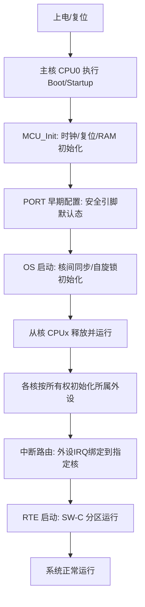

多核下具体注意点：
1. **外设所有权**：一个外设明确归属某核，AURIX 有外设访问控制，跨核访问会被总线拒绝；
2. **中断路由**：外设中断路由到哪核的 IRQ 控制器，配错则不进或进错核；
3. **锁步核**：S32K3 锁步模式两核跑相同代码比较结果，MCAL"读-改-写"涉时间戳/随机源需注意确定性；
4. **共享资源互斥**：多核访问同一 MCAL 模块需 OS 自旋锁或 MCAL 自带核间保护，否则数据竞争；
5. **启动核**：固定主核做 MCU 初始化（时钟/RAM/PORT 早期配置），其他核 RTE 启动后释放；
6. **内存分区（MPU）**：每核 MPU 正确配置，避免越界访问；
7. **Cache 与 DMA 一致性**：带 Cache 多核 MCU 上，某核 DMA 把 ADC/SPI 数据搬进共享内存，另一核 Cache 缓存旧值会"数据已更新但读旧值"。解决：共享缓冲标 `non-cacheable`、读前 `Invalidate`、写后 `Clean`，在 MCAL 缓冲配置与 OS 内存属性协同设定。

多核 MCAL 配置是工具链强项——tresos / DaVinci 提供"核分配"视图，把每个模块/中断绑定具体核。工程师必须主动审视：某外设是否被两核同时使能、某中断绑错核、某共享缓冲未保护。

---

## 十三、常见调试坑与排查手段

汇总 MCAL 开发最典型故障模式与对策：

1. **采样周期 < 建立时间 → 精度系统性偏低**：电压整体偏低、随前通道漂移。排查：调大采样周期，换稳参考电压复测；示波器看 S/H 阶段信号是否稳定。
2. **MUX 切换未留建立时间 → 通道串扰**：插入足够延迟或等 MUX 稳定标志，对比相邻通道是否仍耦合。
3. **DMA buffer 未对齐 / 被 Cache 污染**：带 Cache 内核（Cortex-M7、AURIX）上 ADC 结果错位或陈旧。把 buffer 标 `non-cacheable` 或按 cache line 对齐。
4. **SPI 时序不匹配（CPOL/CPHA、CS 建立保持）**：外部芯片读写错。逻辑分析仪抓四线波形，逐位对手册；核对片选极性与维持时间。
5. **Notification 未使能 → 回调永不触发**：异步通知必须显式使能且应用注册回调。很多"收不到数据"是忘了开 Notification。
6. **外设时钟未使能 → 寄存器读全 0**：MCU 漏开时钟门控，访问无效。核对 MCU 时钟配置。
7. **中断优先级/向量未配 → 中断不进**：依赖 OS 中断配置（CAT1/CAT2、优先级），漏配则 ISR 不执行。
8. **PORT 复用选错 ALT → 外设不工作**：对照数据手册引脚复用表。
9. **看门狗未喂 → 周期性复位**：WDG 配后若 WdgM/主循环未按时喂，ECU 反复重启。
10. **Post-Build 配置未加载 → 默认/空配置**：启动需 `Xxx_Init(&XxxConfig)` 传正确配置指针，传 NULL 行为未定义。

排查铁律：**一切以波形和寄存器值为准，不要只信配置界面勾选**。逻辑分析仪/示波器抓波形；调试器直接读外设寄存器（peripheral view）确认时钟门控、使能位、中断标志；断言与 DEM 事件把底层异常上报诊断层。

真实案例说明"分层定位"如何把数天盲调压缩到半天：某项目 CAN 偶发丢帧，上层 COM 报"发送超时"。逐层定位：第一步看 MCAL 层 `Can_Write` 返回 `E_OK` 但 `CanIf_TxConfirmation` 很久才来——说明邮箱发出但 ACK 异常；第二步读 CAN 状态寄存器，`TEC` 缓慢攀升进"错误被动"边缘；第三步示波器抓 CANH/CANL，位宽偏窄、采样点偏离——根因是 MCU 给 CAN 控制器时钟源选成内部 RC 而非外部晶振，波特率偏约 3%，温度漂移下超对端容限。修复只需改 MCAL 时钟配置 CAN 时钟源回外部晶振重算分频。教训：**MCAL 时钟配置是通信故障隐藏根因集散地**，凡"偶发、随温度/电压变化、对端兼容性差"的通信问题，先怀疑时钟与采样点。

---

## 十四、通信类 MCAL 进阶：CAN-FD 与 SPI 外设管理

**CAN-FD 双波特率**：仲裁段（ID+控制）用慢波特率（如 500 kbps）保兼容，数据段用快波特率（2M/5M）提吞吐。需分别配仲裁段与数据段 tq 参数，且收发器须支持 FD。

**SPI 片选风暴**：多从器件共用总线时，CS 释放/建立时间、不同从器件 CPOL/CPHA 差异要求 MCAL 每次传输间正确切换 CS 并可能切换时序。两从器件时序不兼容（一个 CPHA=0 一个 CPHA=1）需在 Job/Sequence 级动态切换 SPI 配置，否则错乱。AUTOSAR SPI 的 Job/Sequence/Channel 三级模型正是为此设计。

除 CAN 与 SPI，LIN、UART/SCI、FlexRay、以太网（ETH）也有对应 MCAL 驱动，配置思想一脉相承：**把比特率/帧格式/缓冲/中断/通知收敛进标准接口，屏蔽控制器差异**。LIN 的 Lin 驱动负责调度表硬件执行、帧 break/同步场生成、校验和模式；UART 配波特率、数据/停止/奇偶、FIFO 阈值与 DMA；以太网 Eth 涉及 MAC 地址、速率、环形描述符（Descriptor Ring）及缓存一致性（DMA 描述符通常需 `non-cacheable`），配置复杂度远高于串口，是 MCAL 里对 Cache/MMU 协同要求最高的模块之一。

所有通信类 MCAL 共用铁律：**控制器状态机必须妥善管理**。CAN 有 BusOff 恢复，LIN 有休眠/唤醒，ETH 有链路协商（Auto-Negotiation）完成等待，UART 有波特率误差累积。任何"发出去没反应"，第一步读对应控制器"状态/错误"寄存器，而非应用层反复重发。把"看状态寄存器"养成肌肉记忆，是区分熟手与新手的分水岭。

---

## 十五、MCAL 与功能安全（ISO 26262）及配置验证

ASIL-B 及以上量产项目，MCAL 不止"把外设跑起来"，还需为功能安全提供可认证证据链。芯片厂商（NXP、Infineon、Renesas）随 MCAL 包交付 **Safety Manual（安全手册）** 与 **Safety Analysis Report（如 FMEDA 输入）**，明确哪些 MCAL 机制可覆盖硬件随机失效。工程师须遵照安全手册勾选对应安全特性。

MCAL 层典型安全机制：
- **存储与寄存器保护**：关键外设寄存器开写保护（锁定时钟配置寄存器防意外改写）；RAM/Flash 启 ECC/奇偶校验，初始化时触发校验；
- **硬件自测试**：上电/周期对 ADC 增益/偏置、定时器、PLL 时钟监控（如 AURIX PLL 监控与时钟丢失检测）执行内建测试，异常经 DEM 上报；
- **看门狗链路**：内部 WDG 与外部 SBC 看门狗配合，由 WdgM 编排"活体/截止时间监督"，MCAL 仅执行喂狗物理动作；
- **安全状态引脚**：不可恢复故障时通过 PORT 把相关输出置安全电平（关驱动使能、断继电器），要求 PORT"初始电平"与"故障默认态"显式定义；
- **端到端保护接口**：虽 E2E 主要在 COM 层，但底层带校验传输（如 SPI 回读校验）可作补充。

配置验证（Configuration Validation）是工程支柱。AUTOSAR 工具生成前做静态一致性校验（引用时钟源必须存在、中断向量不冲突），但远远不够。成熟团队把 MCAL 配置纳入 **CI**：
1. 脚本对 ARXML 做 schema 校验与自定义规则检查（如"所有 ADC 通道采样时间 ≥ 最小建立时间"）；
2. 对生成代码跑 **MISRA C** 静态分析；
3. 关键参数差异比对（diff），防移植误改；
4. 板级冒烟测试用脚本批量验证外设（GPIO 翻转、SPI 回环、CAN 自发自收），把"配置正确"从人工经验变可重复证据。

这条证据链正是手写寄存器驱动最难补齐的部分——不是某段代码好坏，而是"能否向审核员证明整个底层在生命周期内行为可控、可复现、可追溯"。

---

## 十六、面试高频考点精选（20 题）

1. **AUTOSAR 分层中 MCAL 在什么位置？解决什么问题？**
   BSW 最底层，直接操作寄存器，屏蔽芯片差异，提供标准驱动接口；是硬件无关性与上层可移植性的隔离带。
2. **PORT 和 DIO 的区别？**
   PORT 初始化期配置（方向、复用、上下拉、初始电平）；DIO 运行期对 GPIO 引脚电平读写；复用引脚 DIO 禁操。
3. **ADC 采样精度如何保障？**
   满足建立时间、参考电压稳、内部校准、通道顺序避串扰、硬件 RC 滤波、输入阻抗匹配。
4. **采样周期太短会怎样？**
   采样电容未充满 → 量化值偏低，随前序通道漂移，产生"串扰"假象。
5. **建立时间是什么？和采样周期什么关系？**
   外部信号给采样电容充电到稳定的时间；采样周期必须 ≥ 建立时间 + 转换时间才有精度。
6. **多路 MUX 切换为何注意开关建立时间？**
   MUX 切换后信号需稳定才能采样，否则串入前路电压造成通道串扰。
7. **DMA 在 ADC 中的作用？带 Cache 内核注意什么？**
   零 CPU 干预搬结果进 buffer，避免中断抖动；buffer 需 `non-cacheable` 或按 cache line 对齐，防 Cache 污染读陈旧数据。
8. **PWM 和 ICU 分别用于什么场景？**
   PWM 输出控制（均衡、风扇、死区互补防直通）；ICU 输入测量（频率/占空比/脉宽），硬件锁存边沿精度高于中断计数。
9. **CAN 波特率与采样点如何确定？**
   位时间 = 1(SYNC)+PROP+PSEG1+PSEG2 个 tq；采样点 = (1+PROP+PSEG1)/总 tq，一般 75%~87.5%；SJW 抗时钟偏差。
10. **CAN 节点三种错误状态？**
    Error Active / Error Passive / Bus Off；TEC/REC 计数驱动切换，Bus Off 后需自动恢复。
11. **SPI 的 CPOL/CPHA 是什么？配错会怎样？**
    时钟极性/相位，决定采样边沿；配错数据错位（全 0xFF/0x00），须对照从器件手册。
12. **MCAL Notification 是什么？常见遗漏？**
    异步完成回调（收发/转换完成）；常见遗漏是配置未显式使能且未注册回调，导致"永远收不到数据"。
13. **Pre-Compile / Link-Time / Post-Build 区别？**
    Pre-Compile 编译期宏决定（重编译）；Link-Time 链接期；Post-Build 运行期可加载/切换（如多套波特率），灵活性最高。
14. **跨多款芯片移植 MCAL 如何不踩坑？**
    MCAL 重写 + 上层配置复用；统一 Driver 抽象；建立芯片差异对照表；链接脚本分平台；脚本批量生成（DBC→pack/unpack）。
15. **手写寄存器驱动和 MCAL 优劣？**
    手写成本低、首版快但可移植差、难认证；MCAL 标准化、可认证、跨平台，但授权与学习成本高；高 ASIL 长生命周期优选 MCAL。
16. **多核 MCAL 配置关注什么？**
    外设所有权、中断路由到具体核、锁步核确定性、共享资源自旋锁、启动核、MPU 分区。
17. **CDD 什么场景必须用到？**
    硬件非标（专用 AFE/PMIC）、极致时序/算法、功能安全特殊需求时，旁路 ECU 抽象直接访问 MCAL/寄存器。
18. **为什么用 MCAL 还必须懂寄存器？**
    MCAL 本质是寄存器封装；异常（时钟门控、中断标志未清、外设未使能）需寄存器级定位，否则盲调低效。
19. **EB tresos / DaVinci / ISOLAR 共同工作流？**
    ARXML 导入 → 图形化配置 MCAL → 一致性校验 → 代码生成 → 编译烧录 → 板级调试，循环迭代。
20. **IoHwAb 在调用路径中的作用？**
    位于 MCAL 之上、RTE 之下，把原始计数换算物理量，组合多次 MCAL 调用为语义操作，是硬件相关但标准的抽象层。

---

## 十七、小结

MCAL 是 AUTOSAR 工程里"离硅片最近、离业务最远"的一层，却是决定系统可移植性、功能安全合规性与调试效率的关键。它既要求工程师精通芯片手册里的寄存器与时序、理解外设 IP 内部架构（SPI 的移位寄存器与 FIFO、CAN 的协议引擎与错误状态机、ADC 的采样保持与扫描序列），又要求掌握 AUTOSAR 的配置方法论与工具链（EB tresos / Vector DaVinci / ETAS ISOLAR）。

把 PORT/DIO 的引脚细节、ADC 的建立时间与 DMA、CAN 的波特率与状态机、SPI 的时序匹配这些"底层机理"吃透，再配合分层架构、标准化配置与生成代码，才能真正做到"数据从硬件到应用全程不失真"。笔者建议从三个方向持续积累：一是熟读所用芯片参考手册外设章节；二是动手在 tresos / DaVinci 里配一套完整工程并单步跟踪生成代码；三是建立自己的"故障-根因"清单，把每次板级调试教训沉淀为可复用工程经验。

最后强调：MCAL 学习曲线陡峭，但回报丰厚。它表面是一堆配置勾选与生成代码，底层却串联起芯片手册、AUTOSAR 标准、功能安全方法论与量产工程纪律。一个能独立从零配通一套 MCAL、并在板级把问题定位到寄存器比特的工程师，在车规嵌入式领域是稀缺且高价值的能力。希望本章提供的 IP 架构视野、手写/生成双重视角、配置清单、工具链认知与调试案例，能成为读者从"会用工具"走向"懂底层机理"的扎实台阶。
