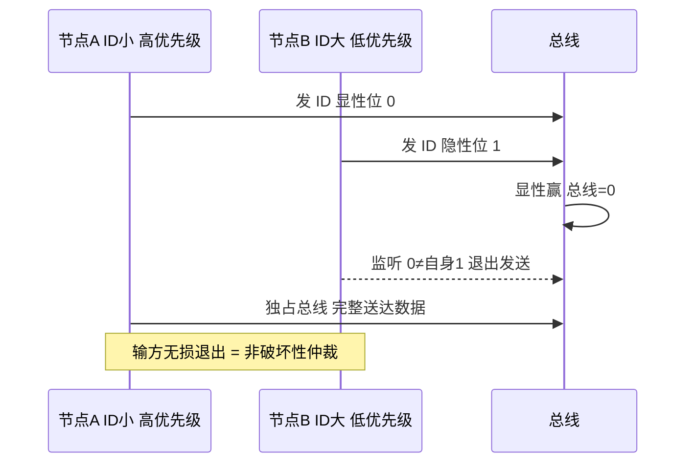
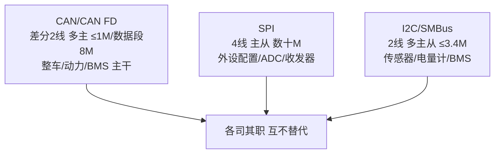

# 车载通信协议精要：CAN/SPI/I2C 各司其职

## 一、一次"总线瘫痪"的排查

某车型路试中，整车 CAN 总线偶发大面积丢帧，仪表盘报警、BMS 掉线。现场工程师第一反应是"是不是某个节点程序跑飞狂发错误帧"。但用示波器往 CANH/CANL 上一看，波形明显过冲、振铃严重——最后定位是某节点 CAN 收发器的**终端电阻虚焊**，总线两端只有一端有 120Ω，另一端开路，信号在总线上反复反射，导致位采样点错误、错误帧暴涨。

车载通信的可靠性，一半在协议理解、一半在物理层。CAN、SPI、I2C 三种协议在车里各司其职：CAN 是整车主干、SPI 是板级高速外设通道、I2C 是低速传感器总线。本篇把它们最核心的机制、类比、坑一次性讲透。

## 二、CAN：多主竞争与非破坏性仲裁

CAN 是车载主干总线，双绞线差分（CANH/CANL），显性（逻辑0）约 2V 压差、隐性（逻辑1）约 0V。典型速率 500k/250k，最高 1Mbps。两端各接 **120Ω 终端电阻**消除反射。

CAN 最精妙的是**非破坏性仲裁**。总线多主竞争时，所有节点同时发，但仲裁段逐位比较 ID：

> **类比**：一群人抢同一支麦克风发言，规则是"谁先说出更紧急的编号谁就获得发言权"。每个人都边说边听，一旦发现自己发出的"显性位（0）"被总线拉成了"隐性位（1）"，就知道有人优先级更高，立刻闭嘴退出发送——但已经发出的数据不会损坏，高优先级节点毫无延迟地独占总线。这就是"非破坏性"：输的人自动退出，赢的人完整送达。

为什么 ID 越小优先级越高？因为仲裁从 ID 最高位（MSB）逐位比，显性（0）赢。ID 数值越小，高位越多 0，更早赢得总线。注意 CAN 的 ID 是**内容标识 + 优先级**，不是目标地址——节点用验收滤波器（mask + code）决定收不收，而非"发给某地址"。

标准帧（11 位 ID）位结构：

```
SOF(1) | ID(11) | RTR(1) | IDE(1) | r0(1) | DLC(4) | DATA(0~8B) | CRC(15+1) | ACK(1+1) | EOF(7)
```

机制要点：位填充（连续 5 个相同位后插 1 个反相位，保证同步边沿）、强错误检测（位监控、格式检查、CRC、ACK 缺失）、错误帧自动重发。ACK 槽由发送方发隐性，任意正确接收节点覆写为显性表示"已收到"；ACK 缺失说明总线上没有节点正确接收（断线、波特率不匹配、无滤波器匹配）。

> 图：CAN 非破坏性仲裁过程，ID 小的节点赢得总线，输方无损退出发送、赢方完整送达。



## 三、CAN FD：为什么数据段能提速

传统 CAN 8 字节数据、1Mbps 上限，在标定/刷写大数据量场景成瓶颈。CAN FD 把数据段扩到 **64 字节**，数据段速率最高 **8Mbps**（仲裁段仍 ≤1Mbps）。

关键在 **BRS（Bit Rate Switch）位**：仲裁段结束后，比特率切到高速；数据段结束前切回仲裁速率。为什么敢提速？因为仲裁阶段已经让所有节点完成了硬同步，进入数据段后双方时钟已对齐，没必要再守着低速。这就像两个人先在大厅对好表（仲裁段低速同步），再进小房间用私人高速频道快速交谈（数据段高速）。

FD 帧复用经典帧的保留位实现兼容升级：`r0 → FDF`（FD 格式标志）、其后新增 `rsv/BRS/ESI`。旧控制器遇到 `FDF=1` 会当错误帧处理，而不误判——保证了向后兼容。

**动态兼容方案**（我实际落地的工程实践）：用**标定变量**作报文类型判断位，写硬件控制器时动态设 FD 标志，一套代码覆盖 CAN/CAN FD 双协议，消除双版本维护、避免分支漂移。运行时由标定变量切换，无需重新编译。

DLC 编码在 FD 里是**非线性**的：9~11、13~15 等某些值不允许出现，12/16/20/24/32/48/64 映射为特定码（如 0xC/0xD/0xE/0x1/0x2/0x3/0x4）。驱动层 pack/unpack 必须正确处理。

## 四、SPI：板级高速全双工

SPI 四线：SCK（时钟）、MOSI（主出从入）、MISO（主入从出）、CS/SS（片选，低有效）。主从结构，主节点产生时钟，一主多靠独立 CS 选通。

SPI 靠 **CPOL（时钟极性）+ CPHA（采样相位）** 构成 4 种模式，主从必须一致，否则采样边沿错位、整帧数据错乱。它是**全双工**：移位寄存器主从共移，发第 N 字节的同时收第 N 字节（"写即读"），所以很多 SPI 读操作要先 dummy 写以产生时钟。

**类比**：SPI 像两个人面对面传纸条，主设备左手递出（MOSI）的同时右手接住（MISO），时钟 SCK 是两人约定的拍子，CS 是"现在轮到你了"的点名牌。拍子（CPOL/CPHA）对不上，收到的字就是乱码。

SPI 没有地址，靠 CS 选设备；时钟太快会超出从设备上限导致建立/保持违例。调试铁律：逻辑分析仪抓 SCK/MOSI/MISO/CS 四线，对比手册时序图，核对 CPOL/CPHA、CS 极性、字节序（MSB/LSB first）。

BMS 里 SPI 极关键：MCU 经 SPI 配置 CAN 收发器（如 TJA1145 类）、读写外部 ADC / 高压采样前端 / RTC / Flash。国产替代坑如前所述：SPI 波形差异、片选维持时间不同、寄存器默认值不同。

## 五、I2C / SMBus：板级低速多设备

I2C 两线：SCL（时钟）、SDA（数据），**开漏 + 上拉电阻**（总线与逻辑，谁拉低谁赢）。速率标准 100k / 快速 400k。靠 7 位（或 10 位）地址寻址，支持多主多从。

典型写事务：`START | ADDR+W | ACK | REG | ACK | DATA | ACK | STOP`；读需"先写寄存器地址再重复起始"：`START | ADDR+W | ACK | REG | ACK | RepeatedSTART | ADDR+R | ACK | DATA | NACK | STOP`。

**为什么上拉？** 开漏结构只能拉低、不能主动拉高，靠上拉电阻把线拉高，从而实现"线与"仲裁（多主同时发，低电平覆盖高电平，谁发 0 谁赢，类似 CAN 的非破坏性思路）。

**总线死锁**是经典坑：从设备中途异常拉低 SDA/SCL 不释放，主设备发若干时钟脉冲或复位才能恢复。调试：主设备手动给 SCL 发 9 个脉冲释放 SDA，或复位从设备。

**SMBus**（BMS 强相关）是基于 I2C 的系统管理总线，定义更严格的超时（35ms/25ms）、命令协议、PEC（包差错校验 CRC-8）。智能电池包、电量计（fuel gauge）常用 SMBus 上报电压/电流/SOC、接收充放电指令。

## 六、协议选型对照

| 协议 | 线数 | 速率 | 拓扑 | 典型场景 |
|------|------|------|------|----------|
| CAN/CAN FD | 2 差分 | ≤1M / 数据段 8M | 多主总线 | 整车/动力/BMS 通信 |
| SPI | 4 | 数十 M | 主从（多 CS） | 外设配置/ADC/收发器 |
| I2C/SMBus | 2 | ≤3.4M | 多主从（地址） | 传感器/电源/BMS 电量计 |

BMS 里三者协作：电芯监控 IC 经隔离菊花链（DSI3/isoSPI）上报上百节单体电压给主控；主控经 CAN 与整车通信、上报电压/温度/SOC、接收充放电指令；主控经 SPI 配收发器、读外部 ADC；经 SMBus 与智能电量计交互。它们各管一段，互不替代。

> 图：CAN/SPI/I2C 三类车载协议的能力与定位对比，板级与整车各司其职、互不替代。



## 七、常见坑与调试手段

1. **CAN 终端电阻缺失/不符 → 反射过冲丢包**：调试：双通道示波器量总线两端波形，确认两端各 120Ω；用矢量网络思想，支线（stub）尽量短。
2. **波特率/采样点全网不一致 → 偶发错误帧**：CAN 的波特率、SJW、采样点（通常 75%~87.5%）需全网一致。调试：查各节点 CAN 控制器位时序配置，示波器看单 bit 内部采样点位置。
3. **SPI CPOL/CPHA 不匹配 → 整帧错乱**：调试：逻辑分析仪抓四线，逐边沿对比手册时序图；确认主从模式一致、字节序一致、CS 建立/保持足够。
4. **I2C 上拉不当 / 总线死锁**：上拉阻值不当导致上升沿过缓（速率上不去）或功耗过大；死锁靠 9 个 SCL 脉冲恢复。调试：示波器看 SDA/SCL 边沿斜率，确认上拉阻值匹配总线电容。

## 八、位时序与采样点：工程上怎么算

CAN 通信稳不稳，很大程度取决于位时序。一位被拆成：`同步段 SYNC_SEG（固定 1 个 Tq）+ 传播段 PROP_SEG + 相位缓冲段1 PSEG1 + 相位缓冲段2 PSEG2`。其中 `Tq`（时间量子）= 1 / 波特率 / 总 Tq 数，由 CAN 时钟分频得到。

**采样点**通常设在 75%~87.5% 处（即 `(SYNC_SEG+PROP_SEG+PSEG1) / 总位数`）。它越靠后，对传播延迟容忍越大，但太靠后会在 EOF 等边界出问题。工程中：

1. 先按目标波特率（如 500k）算出每 bit 的 Tq 数；
2. 分配各段，使采样点落在上述区间；
3. 设 `SJW`（一般取 1~2 个 Tq）吸收节点间时钟偏差；
4. **全网所有节点必须波特率 + SJW + 采样点三者一致**，否则轻则偶发错误帧，重则总线反复进入错误被动。

```c
/* 500kbps 位时序配置示意（某 MCU，CAN 时钟 40MHz） */
/* 目标：每 bit = 80 Tq，采样点 87.5% */
/* Tq = 1/40M * 分频系数；设分频=1 → Tq=25ns，80*25ns=2us=500k ✓ */
can_cfg.SJW    = 1;     /* 同步跳转宽度 1 Tq */
can_cfg.SEG1   = 69;    /* SYNC(1)+PROP+PSEG1 合计，采样点=70/80=87.5% */
can_cfg.SEG2   = 10;    /* 余下 */
```

这个计算与开头的终端电阻坑是"黄金搭档"：物理层反射（终端电阻）和链路层时序（采样点）任一失配，都会在路试中暴露成那类"玄学丢帧"。两者都做对，CAN 才真正可靠。

## 九、面试高频要点

- **CAN 为什么用差分？** 抗共模干扰、长距离可靠。
- **仲裁为什么非破坏性？** 输方自动退出发送，高优先级报文无延迟送达。
- **CAN FD 为什么数据段能提速？** 仲裁完成后双方已同步，数据段可换高速率。
- **一套代码不重新编译怎么切 CAN/CAN FD？** 运行时由标定变量动态设 FD 标志。
- **I2C 总线死锁如何恢复？** 主设备手动给 SCL 发 9 个脉冲释放 SDA，或复位从设备；SMBus 与 BMS 关系：智能电池/电量计常用 SMBus 上报电压电流 SOC。
