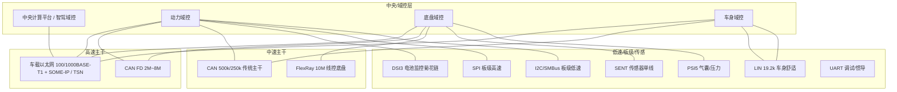
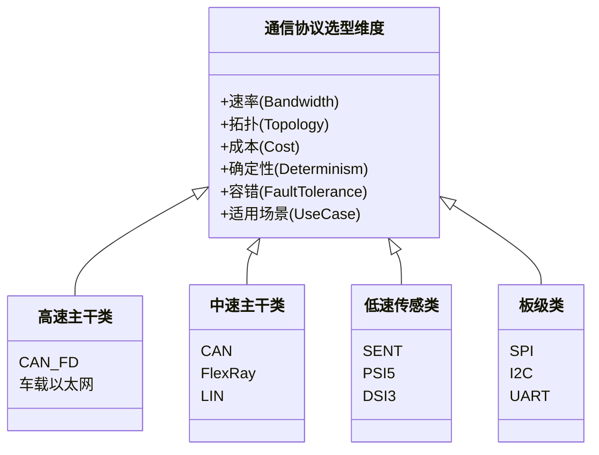
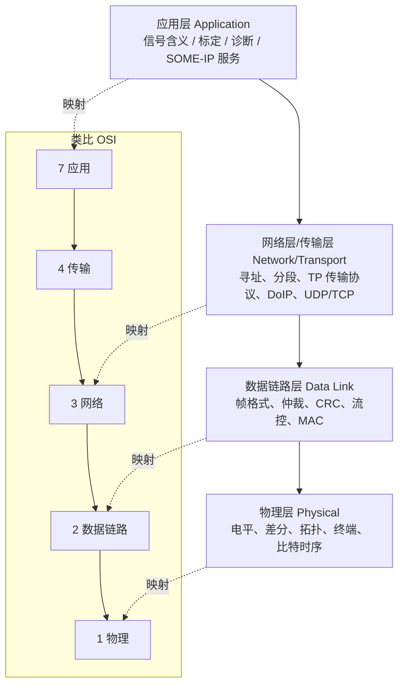
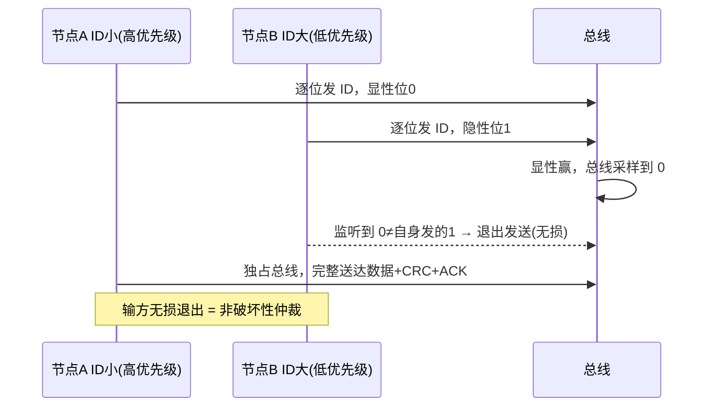
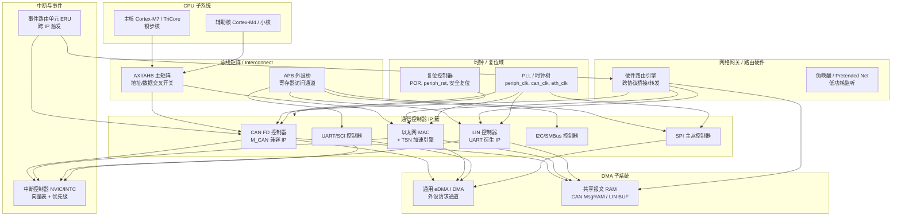
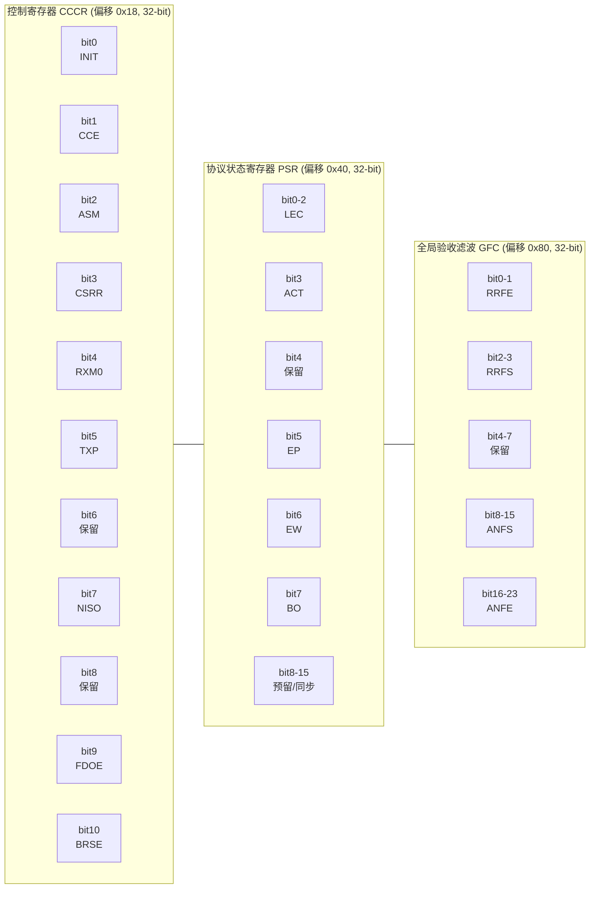
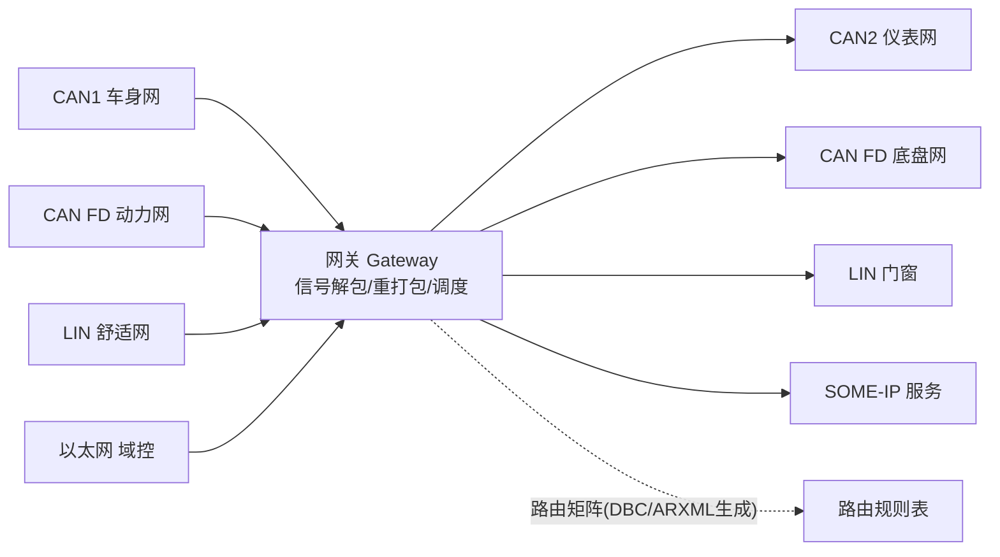
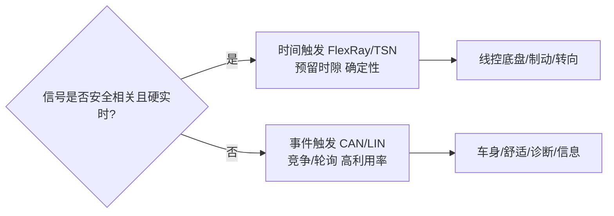
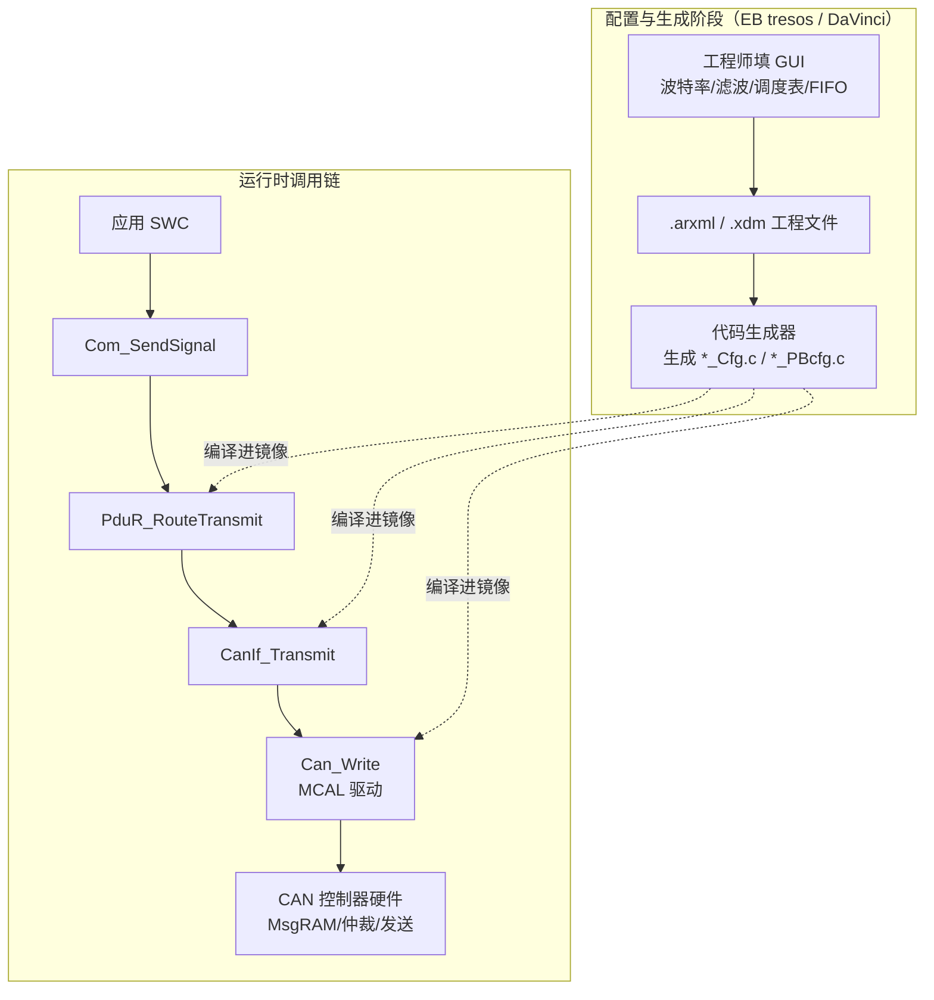
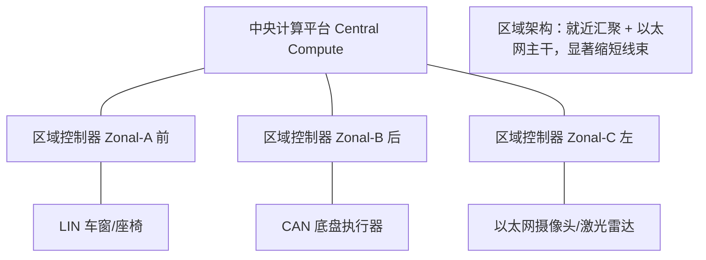

# 车载与嵌入式通信协议全景：从字节到 SoC——选型、架构、芯片模块与底层驱动实战

> 笔者按：车载通信是汽车电子的"神经系统"。一辆现代智能电动车里，往往同时跑着 CAN、CAN FD、LIN、FlexRay、车载以太网/SOME-IP、SENT、PSI5、DSI3、UART、I2C、SPI 等十几种总线。它们不是谁替代谁的关系，而是在速率、成本、确定性、容错、布线等维度上各司其职、分层协作。本章试图把这套"协议全景图"讲透——既讲机制原理，也讲工程选型、调试实战，更会从芯片底层（SoC 通信子系统 IP 架构、寄存器位域、驱动代码）到 AUTOSAR 软件栈（MCAL 配置与调用链）打通整条技术链路。这是一篇面向公开技术知识库的工业级深度章节，读者应已具备基本单片机与 C 语言基础。

---

## 一、一次"总线瘫痪"的排查：可靠性一半在协议、一半在物理层

某车型在路试阶段，整车 CAN 总线偶发大面积丢帧，仪表盘报警、BMS（电池管理系统）掉线。现场工程师第一反应是"是不是某个节点程序跑飞、狂发错误帧把总线占满了"。但把示波器探针往 CANH/CANL 上一搭，波形明显过冲、振铃严重——最后定位是某节点 CAN 收发器的**终端电阻虚焊**：总线两端本应各接 120Ω，实际只有一端有、另一端开路，信号在总线上反复反射，导致位采样点处电平判断错误、错误帧数量暴涨。

这件事给了笔者一个深刻教训：**车载通信的可靠性，一半在协议理解，一半在物理层工程**。协议栈设计得再漂亮，如果差分对的终端、支线（stub）长度、采样点配置没有做对，路试中就会暴露成那种"玄学丢帧"。反过来说，把物理层布好，也只是必要条件——若不懂 CAN 的非破坏性仲裁、位时序与采样点、错误状态机，遇到偶发错误帧依然无从下手。

更深层地说，现代车载通信的复杂度，本质上来自三个矛盾的叠加：

1. **成本与速率的矛盾**：低速传感器（车窗、雨刮、座椅）用 LIN 一根线几块钱就能搞定；而智驾域控要传几十路摄像头、激光雷达点云，必须上百兆甚至千兆以太网。
2. **确定性与灵活性的矛盾**：动力域的电机控制、制动，要求通信在微秒级确定时延内送达（否则车会失控）；而信息娱乐、OTA 刷写，更看重带宽和灵活寻址。
3. **分布式与集中式的矛盾**：传统车有七八十个分散 ECU，各自带 MCU、各自通信；而当今"域集中/中央计算"架构，又把功能往少数大算力域控收拢，网络拓扑随之重构，通信控制器 IP 也从"分散小 MCU"走向"集中大 SoC 内多协议 IP 簇"。

下文将沿"全景 → 单协议定位 → 选型维度 → 分层模型 → 芯片模块设计 → 驱动实现 → 网关路由 → 触发架构 → MCAL 配置 → 趋势 → 实战 → 面试题"的路线，把这十几种协议一次性讲清楚，并落到寄存器与代码层面。

---

## 二、车载通信全景：从车身到动力域的协议分布

一辆典型的智能电动车，从电子电气架构（E/E Architecture）视角可以划分为若干**功能域（Domain）**：动力域（含三电：电池、电机、电控）、底盘域（制动、转向、悬架）、车身域（灯、门、窗、空调）、智能座舱域、智能驾驶域。不同域对通信的要求天差地别，于是形成了"分层、分区、多协议并存"的总线版图。

下面这张图给出了一个工程上常见的协议—功能域映射（注意：不同车企拓扑差异很大，这只是一个典型参考，并非唯一正确答案）。把这张图记住，后面所有协议都能找到自己的"座位"。



要点解读：

- **车载以太网**现在主要承担域控之间的"骨干网"与高带宽业务（OTA、视频回传、传感器融合原始数据）。它用**单对双绞线（100/1000BASE-T1，即 BroadR-Reach/802.3bw/802.3bp 物理层）**，靠 SOME-IP（Scalable service-Oriented MiddlewarE over IP）做服务化通信，靠 TSN（时间敏感网络）保证确定性。
- **CAN/CAN FD**仍是绝大多数 ECU 的"标准接口"。传统 CAN 跑车身、舒适性、诊断；CAN FD 在动力、底盘、网关处承担更大的标定与刷写数据量。
- **FlexRay**曾是被寄予厚望的线控（X-by-Wire）总线，速率 10M、带时间触发，但成本高、生态被以太网挤压，如今多用于高端车型的线控底盘（如主动悬架、线控转向冗余通道），新项目逐渐转向以太网 TSN。
- **LIN**是 CAN 的"廉价副手"，单线、主从、最高约 20kbps，专治车窗、雨刮、座椅电机这类"慢且便宜"的节点，由 LIN 主节点（通常挂在某个 CAN 节点上）轮询。
- **SENT、PSI5、DSI3**是"传感器/执行器专线"：SENT 用于单线传高精度传感器（如油门踏板位置、压力）；PSI5 用于安全相关（气囊碰撞传感器、胎压/压力）；DSI3（含 isoSPI 变体）用于电池包内几十到上百节电芯的监控菊花链。
- **SPI、I2C、UART**基本是**板级（intra-board）**总线：MCU 与片外 ADC、收发器、EEPROM、RTC、IMU、液晶驱动等之间的"短距离高速/低速互连"，不跨节点。

---

## 三、各协议一句话定位

为了建立直觉，先给每种协议一个"一句话人设"，后面再逐一展开：

| 协议 | 一句话定位 | 典型速率 | 拓扑 | 主要角色 |
|------|-----------|---------|------|---------|
| CAN | 车载"老黄牛"主干，多主非破坏性仲裁，事件触发 | ≤1Mbps（经典） | 多主总线，双绞线差分 | 整车/动力/车身/诊断 |
| CAN FD | CAN 的"提速版"，仲裁段不变、数据段升速扩容 | 仲裁≤1M，数据段≤8M | 同 CAN | 标定、刷写、动力域 |
| LIN | CAN 的"廉价跟班"，单线主从轮询，极低成本 | ≤19.2/20kbps | 单主多从 | 车身舒适（窗/门/椅） |
| FlexRay | 线控"贵族"，时间触发+双通道冗余，确定性极高 | 10Mbps（双通道20M） | 总线/星型，双通道 | 线控底盘、主动悬架 |
| 车载以太网 | 域控"骨干网"，高带宽、服务化、TSN 保确定性 | 100M/1G（T1 单对线） | 交换式星型/树型 | 域间骨干、视频、OTA |
| SOME-IP | 跑在以太网上的"服务中间件"（不是物理层） | 依赖以太网 | 基于 IP | 面向服务的通信 |
| SENT | 传感器"专用单线"，单向高精度、tick 编码 | 单线，~3~32μs/tick | 点到点 | 油门踏板、压力传感 |
| PSI5 | 安全相关传感器"双线电流环"，抗干扰 | 125/189kbps | 双线，多从 | 气囊、胎压、压力 |
| DSI3 | 电池包"菊花链"，电容/变压器隔离传电芯数据 | 可达数 M（差分） | 菊花链 | BMS 电芯监控 |
| UART | 最朴素的"异步串口"，调试与简单外设 | 常见 115200~几 M | 点对点 | 调试、GPS/IMU |
| I2C | 板级"两线多设备"，开漏仲裁，低速通用 | 100k/400k/1M/3.4M | 多主多从 | 传感器、EEPROM、电量计 |
| SPI | 板级"四线全双工"，无地址靠片选，速度最快 | 数 M~数十 M | 主从多 CS | ADC、Flash、收发器配置 |

---

## 四、选型维度：速率、拓扑、成本、确定性、容错、适用场景

选协议，本质是**在约束空间里做权衡（trade-off）**。笔者把它们归纳为六个核心维度，并用一张对比表把十几种协议放在一起看。



**维度逐项说明：**

1. **速率（带宽）**：从 LIN 的 ~20k，到 CAN 的 1M、CAN FD 数据段 8M、FlexRay 10M（双通道 20M），再到以太网 100M/1G。带宽需求来自"要传什么"——控制命令字节少，视频/点云字节海量。
2. **拓扑**：CAN/LIN/FlexRay 是**共享总线**（所有节点挂一根线）；以太网是**交换式**（星型/树型，靠交换机）；SPI 是主从+多 CS；I2C 是多主多从但仍是共享两线；DSI3 是**菊花链**（daisy chain，一级串一级）。拓扑决定了布线与节点增减难度。
3. **成本**：LIN 几乎最便宜（单线、从节点 MCU 可极简）；CAN 收发器几块钱；以太网 PHY+T1 线+交换机贵一截；FlexRay 节点成本与授权费都高。成本里还藏着"线束成本"——少一根线、少一个接插件，整车几十万产量的成本就很可观。
4. **确定性（Determinism）**：指"最差情况下报文多久一定送达"。CAN 是事件触发 + 优先级仲裁，低优先级报文可能被高优先级无限抢占（所谓"优先级反转/饥饿"），确定性弱；FlexRay 与 TSN 是时间触发/时间感知，确定性极强，适合线控。
5. **容错（Fault Tolerance）**：CAN 有错误帧、错误计数器、离线状态机、总线off恢复；FlexRay 有双通道冗余（一路坏另一路兜底）；以太网靠链路冗余与 TSN 流保护；LIN 本身容错弱，靠 CAN 侧网关兜底。
6. **适用场景**：最终落到"传什么、多快、多关键、多便宜"。

**对比选型矩阵（核心 KPI 表）：**

| 协议 | 峰值速率 | 拓扑 | 节点成本 | 确定性 | 典型容错机制 | 最典型场景 |
|------|---------|------|---------|--------|-------------|-----------|
| CAN | 1 Mbps | 共享总线 | 低 | 弱（事件触发） | 错误帧/计数器/离线 | 车身、动力、诊断 |
| CAN FD | 8 Mbps（数据段） | 共享总线 | 中 | 弱 | 同 CAN | 标定、刷写、动力域 |
| LIN | 20 kbps | 单线主从 | 极低 | 弱（轮询） | 主节点超时重查 | 车窗、座椅、雨刮 |
| FlexRay | 10 Mbps（双通道 20M） | 总线/星型双通道 | 高 | 强（时间触发） | 双通道冗余 | 线控底盘、主动悬架 |
| 车载以太网 | 100M/1G | 交换式星型 | 中高 | 中~强（TSN） | 链路冗余/流保护 | 域间骨干、视频、OTA |
| SOME-IP | 依赖以太网 | 基于 IP | — | 依赖下层 | 依赖下层 | SOA 服务调用 |
| SENT | 单线 ~100k 有效 | 点到点 | 低 | 单向定周期 | 校验/冗余 tick | 油门踏板、压力 |
| PSI5 | 189 kbps | 双线电流环 | 中 | 定周期 | 电流环抗扰 | 气囊、胎压 |
| DSI3 | 数 M | 菊花链 | 中 | 定周期 | 隔离/重传 | 电芯电压监控 |
| SPI | 数十 M | 主从多 CS | 低（板级） | 强（主控节拍） | 通常无 | ADC、Flash、收发器 |
| I2C | 3.4M（快模） | 多主多从 | 低 | 弱 | 时钟拉伸/恢复 | 传感器、EEPROM |
| UART | 数 M | 点对点 | 极低 | 弱 | 通常无 | 调试、GPS/IMU |

---

## 五、分层模型类比：物理层/数据链路/网络/应用 与 OSI 映射

理解车载网络，最好的抓手是**分层**。车载协议栈虽不像 IT 网络那样严格套用 OSI 七层，但概念上完全可以映射。笔者常用下面这张图给新人建立框架：



逐层类比说明：

- **物理层（OSI 第 1 层）**：解决"怎么把 0/1 变成电信号"。CAN 是双绞线差分（CANH/CANL，显性约 2V 压差、隐性约 0V）；LIN 是单线对地；以太网 T1 是单对双绞线全双工（用回声消除实现全双工）；SENT 是单线 0~5V 脉冲。物理层还管终端电阻（CAN 两端各 120Ω）、拓扑、比特率。
- **数据链路层（OSI 第 2 层）**：解决"帧怎么组织、谁先发、错没错"。CAN 的**非破坏性仲裁、位填充、15 位 CRC、ACK 槽、错误帧、位时序/采样点**都在这层；以太网这层是 MAC + 802.1Q VLAN/优先级 + TSN 调度；LIN 这层是主从调度表。
- **网络/传输层（OSI 第 3/4 层）**：解决"跨子网寻址与长报文分段"。车载里典型是**传输协议 TP（Transport Protocol，ISO-TP，ISO 15765-2）**——把超过 8 字节（经典 CAN）或 64 字节（FD）的报文拆成多帧传输，用于 UDS 诊断（0x14 服务等）和刷写；以太网侧则是 IP/UDP/TCP，诊断用 DoIP（Diagnostic over IP，ISO 13400）。
- **应用层（OSI 第 7 层）**：解决"数据代表什么含义、怎么服务化"。传统 CAN 应用层是**DBC 里定义的信号布局**（比如 byte0.bit3 表示车速，分辨率 0.1km/h）；诊断用 UDS（ISO 14229）；以太网用 **SOME-IP** 把方法/事件/字段封装成服务，配合 SOME/IP-SD 做服务发现。

把这套分层装进脑子，后面讲网关路由、讲 TSN，都不会乱——因为**网关本质上就是在不同协议的"某一层"上做映射和转发**。

---

## 六、CAN 与 CAN FD 的机制深挖（重点协议）

### 6.1 非破坏性仲裁：输方无损退出

CAN 最精妙的是**非破坏性仲裁**。总线多主竞争时，所有节点同时发，但仲裁段逐位比较 ID：

> **类比**：一群人抢同一支麦克风发言，规则是"谁先说出更紧急的编号（更小的 ID）谁就获得发言权"。每个人都边说边听，一旦发现自己发出的"显性位（0）"被总线拉成了"隐性位（1）"，就知道有人优先级更高，立刻闭嘴退出发送——但已经发出的数据不会损坏，高优先级节点毫无延迟地独占总线。这就是"非破坏性"：输的人自动退出，赢的人完整送达。

为什么 ID 越小优先级越高？因为仲裁从 ID 最高位（MSB）逐位比，显性（0）赢。ID 数值越小，高位越多 0，更早赢得总线。注意 CAN 的 ID 是**内容标识 + 优先级**，不是目标地址——节点用验收滤波器（mask + code）决定收不收，而非"发给某地址"。这套"按内容而非地址"的思想，正是发布/订阅（publish-subscribe）模型的雏形。

标准帧（11 位 ID）位结构如下（经典 CAN）：

```
SOF(1) | ID(11) | RTR(1) | IDE(1) | r0(1) | DLC(4) | DATA(0~8B) | CRC(15) | CRCdel(1) | ACK(1) | ACKdel(1) | EOF(7)
```

机制要点：
- **位填充**：连续 5 个相同位后插 1 个反相位，保证同步边沿（也让接收方能持续同步时钟）。
- **强错误检测**：位监控、格式检查、15 位 CRC、ACK 缺失检测。
- **错误帧与错误计数器**：每个节点有 TEC（发送错误计数）/REC（接收错误计数），跨阈值进入"错误被动"甚至"总线关闭（Bus Off）"，这是容错的核心。Bus Off 后需按特定恢复流程（如"快恢复/慢恢复"定时器）重新接入，避免"坏节点持续捣乱"。
- **ACK 槽**：发送方发隐性，任意正确接收节点覆写为显性表示"已收到"；ACK 缺失说明总线上没有节点正确接收（断线、波特率不匹配、无滤波器匹配）。

下面用序列图展示仲裁过程：



### 6.2 CAN FD：为什么数据段能提速

传统 CAN 8 字节数据、1Mbps 上限，在标定/刷写大数据量场景成瓶颈。CAN FD 把数据段扩到 **64 字节**，数据段速率最高 **8Mbps**（仲裁段仍 ≤1Mbps）。

关键在 **BRS（Bit Rate Switch）位**：仲裁段结束后，比特率切到高速；数据段结束前切回仲裁速率。为什么敢提速？因为仲裁阶段已经让所有节点完成了硬同步，进入数据段后双方时钟已对齐，没必要再守着低速。这就像两个人先在大厅对好表（仲裁段低速同步），再进小房间用私人高速频道快速交谈（数据段高速）。

FD 帧复用经典帧的保留位实现兼容升级：`r0 → FDF`（FD 格式标志）、其后新增 `rsv/BRS/ESI`（错误状态指示）。旧控制器遇到 `FDF=1` 会当错误帧处理而不误判——保证了向后兼容（同一条总线上 CAN 与 CAN FD 节点可共存，只要 FD 节点不强行提速干扰经典节点）。

**动态兼容方案**（笔者实际落地的工程实践）：用**标定变量**作报文类型判断位，写硬件控制器时动态设 FD 标志，一套代码覆盖 CAN/CAN FD 双协议，消除双版本维护、避免分支漂移。运行时由标定变量切换，无需重新编译。

DLC 编码在 FD 里是**非线性**的：0~8 保持原义，9~11、13~15 等某些值不允许出现，12/16/20/24/32/48/64 映射为特定码（如 0x9/0xC/0xD/0xE/0x1/0x2/0x3）。驱动层 pack/unpack 必须正确处理，否则会出现"DLC 解码成非法长度"的诡异问题。

### 6.3 位时序与采样点：工程上怎么算

CAN 稳不稳，很大程度取决于位时序。一位被拆成：`SYNC_SEG（固定 1 个 Tq）+ PROP_SEG + PSEG1 + PSEG2`。其中 `Tq`（时间量子）= 1 / 波特率 / 总 Tq 数，由 CAN 时钟分频得到。

**采样点**通常设在 75%~87.5% 处（即 `(SYNC_SEG+PROP_SEG+PSEG1) / 总位数`）。它越靠后，对传播延迟容忍越大，但太靠后会在 EOF 边界出问题。工程中：

1. 先按目标波特率（如 500k）算出每 bit 的 Tq 数；
2. 分配各段，使采样点落在区间内；
3. 设 `SJW`（一般 1~2 个 Tq）吸收节点间时钟偏差；
4. **全网所有节点必须波特率 + SJW + 采样点三者一致**，否则轻则偶发错误帧，重则总线反复进入错误被动。

```c
/* 500kbps 位时序配置示意（某 MCU，CAN 时钟 40MHz） */
/* 目标：每 bit = 80 Tq，采样点 87.5% */
/* Tq = 1/40M * 分频系数；设分频=1 → Tq=25ns，80*25ns=2us=500k ✓ */
can_cfg.SJW    = 1;     /* 同步跳转宽度 1 Tq */
can_cfg.SEG1   = 69;    /* SYNC(1)+PROP+PSEG1 合计，采样点=(1+69)/80=87.5% */
can_cfg.SEG2   = 10;    /* 余下 10 Tq */
/* 校验：1 + 69 + 10 = 80 Tq，采样点 70/80 = 87.5% */
```

这个计算与开篇的终端电阻坑是"黄金搭档"：物理层反射（终端电阻）和链路层时序（采样点）任一失配，都会在路试中暴露成"玄学丢帧"。两者都做对，CAN 才真正可靠。

---

## 七、芯片模块设计：通信子系统 IP 内部架构（核心新增 A）

前面讲的是"协议在空中怎么跑"，但落到芯片里，这些协议都是由 SoC/MCU 内部的**通信控制器 IP（Peripheral IP）**实现的。作为底层工程师，必须能看懂并设计这套子系统。本节以一颗典型的车规 MCU/域控 SoC（类 NXP S32K、Infineon AURIX TC3xx、STM32 系列的思路均可对应）为例，剖析通信子系统的 IP 级架构。

### 7.1 通信子系统总体拓扑

现代车规芯片的通信能力不再是一个孤立外设，而是挂在**总线矩阵（Bus Matrix / Interconnect）**上的一组 IP 簇，并通过 DMA、中断控制器、共享 RAM、硬件网关协同工作。其拓扑如下：



**关键连接解读（这是芯片模块设计的核心）：**

1. **总线矩阵与 APB/AHB 分工**：CPU 通过 **AXI/AHB 主矩阵**访问大带宽外设（如以太网 MAC、CAN 报文 RAM），通过 **APB 外设桥**访问慢速控制寄存器（LIN/I2C/UART/SPI 的配置寄存器）。寄存器访问与数据通路分离，是典型 SoC 设计惯例——配置走 APB（省面积），数据搬运走 AHB/AXI（保带宽）。
2. **DMA 是吞吐量的命根子**：以太网与 CAN FD 数据量大，若每帧都靠 CPU 进中断搬数据，CPU 负载会爆炸。因此它们挂 **eDMA 通道**，由外设触发 DMA 请求（DMA request），自动把报文 RAM 与用户缓冲区互搬；UART 也常用 DMA 做环形缓冲搬运。SPI 通常用 DMA 实现"内存到外设"的连续收发。
3. **共享报文 RAM（Message RAM）**：CAN FD 的发送/接收邮箱（mailbox/FIFO）并非寄存器，而是一块**专用 SRAM**（如 M_CAN 的 MsgRAM，分 Tx FIFO、Rx FIFO、Rx Buffer、Tx Event FIFO）。这样邮箱数量可配置（几十到上百），不占用寄存器地址空间。LIN 的帧缓冲、以太网的描述符环（descriptor ring）也类似地放在共享 RAM。
4. **中断控制器与 ERU**：每个 IP 产生若干中断源（接收完成、发送完成、错误、唤醒），经 NVIC/INTC 路由到 CPU 向量。事件路由单元（ERU，AURIX 叫法，通用即 cross-bar trigger）允许一个 IP 的事件**直接硬件触发**另一个 IP 的动作（例如 CAN 收到某帧后硬件触发一路 PWM），免去软件往返延迟——这是实时性的硬件基石。
5. **硬件网关/路由引擎（最容易被忽视但极重要）**：高端车规芯片（如 S32G 的 LLCE、AURIX 的 MCMCAN Gateway、部分 S32K 的 Gateway 外设）提供**纯硬件的跨协议路由**：CAN 帧可在不经过 CPU 的情况下被硬件自动重打包转发到另一路 CAN/LIN/以太网。这把网关的路由延迟从"ms 级软件处理"压到"μs 级硬件直通"，同时让 CPU 在睡眠时仍能"伪唤醒（Pretended Networking）"监听特定帧。软件网关（PduR 路由）与硬件网关是互补的两层。

### 7.2 时钟域与复位域

通信 IP 必须明确时钟/复位归属，否则会出现"配置写了不生效"或"低功耗唤醒后总线异常"：

- **时钟域**：CAN 通常需要独立可配的 `can_clk`（来自 PLL 分频，如 40/80MHz）以满足位时序精度；以太网需要 `eth_clk`（25/50/125MHz，可能来自外部晶振或内部 PLL）；LIN/UART 需要**整数波特率分频源**（常见从系统时钟分频得到，因 LIN 19.2k/9600 等并非标准 CAN 时钟整数比）；SPI/I2C 可共用 `periph_clk`。
- **复位域**：通信 IP 一般归属 `periph_rst`（外设复位，不影响 CPU）。但在功能安全场景，某些 IP 另有**安全复位（Safety Reset）**，一旦检测到不可恢复错误（如 CAN 协议引擎死锁）即硬件复位该 IP 而不影响整片。低功耗设计里还要区分"深睡保留"与"掉电"——LIN/UART 常需保留在"伪唤醒"域以便监听唤醒帧。

### 7.3 关键外设寄存器组映射与位域（以 CAN FD 为例）

作为底层工程师，配置芯片就是"填寄存器"。下表给出通信控制器 IP 的**典型寄存器地址映射**（地址为示意，具体以芯片手册 TRM 为准；此处以业界通用的 M_CAN 兼容布局为蓝本，该 IP 广泛用于 STM32H7、S32K、AURIX TC3xx 的 MCMCAN 模块）：

| 寄存器 | 偏移（十六进制） | 位宽 | 作用 | 关键位域 |
|--------|----------------|------|------|---------|
| `CREL` | 0x00 | 32 | Core Release，版本识别 | 包含步进/版本号 |
| `ENDN` | 0x04 | 32 | Endianness，只读，应读出 0x87654321 | 校验字节序 |
| `DBTP` | 0x0C | 32 | Data Bit Timing（FD 数据段） | DBRP(0-3)/DTSEG1(8-12)/DTSEG2(16-19)/DSJW(20-23)/TDC(23) |
| `CCCR` | 0x18 | 32 | **控制寄存器** | INIT/CCE/ASM/FDOE/BRSE/NISO/TXP |
| `NBTP` | 0x1C | 32 | Nominal Bit Timing（仲裁段） | NBRP(0-7)/NTSEG1(8-15)/NTSEG2(16-22)/NSJW(24-28) |
| `ECR` | 0x38 | 32 | Error Counter | TEC(0-7)/REC(8-15) |
| `PSR` | 0x40 | 32 | Protocol Status | LEC(0-2)/ACT(3)/EP(5)/EW(6)/BO(7) |
| `IR` | 0x50 | 32 | Interrupt Register（写1清） | RF0N/TCE/BO/EW/PEA 等多位 |
| `IE` | 0x54 | 32 | Interrupt Enable | 对应 IR 各源使能 |
| `GFC` | 0x80 | 32 | Global Filter Config | RRFE/RRFS/ANFS/ANFE |
| `SIDFC` | 0x84 | 32 | Standard ID Filter 配置 | FLSSA(0-15)/LSS(16-22) |
| `XIDFC` | 0x88 | 32 | Extended ID Filter 配置 | FLESA(0-15)/LSE(16-22) |
| `TXBC` | 0x90 | 32 | Tx Buffer Config | TBSA(0-15)/NTB(16-22)/TFQS |
| `RXBC` | 0x94 | 32 | Rx Buffer Config | RBSA(0-15) |
| `RXF0C` | 0x98 | 32 | Rx FIFO0 Config | F0SA(0-15)/F0S(16-22)/F0WM |

下面用一张**寄存器/位域图**直观展示三个最关键寄存器的位划分（这是芯片模块设计的"图纸"）：



**位域语义速记：**
- `CCCR.INIT=1` 使 CAN 进入初始化模式（停止参与总线），只有 `CCCR.INIT=1` 且 `CCCR.CCE=1` 时才允许写时序/滤波寄存器——这是新手最常踩的坑：忘了置 CCE 就写 `NBTP`，结果被硬件忽略。
- `CCCR.FDOE/BRSE` 分别使能 FD 格式与比特率切换；旧芯片无此位。
- `PSR.LEC`（Last Error Code，3 位）记录最近一次错误类型（000 无错、101 位错误、110 ACK 错误、111 总线关闭等），是调试错误帧的"第一现场"。`PSR.BO=1` 表示总线关闭。
- `GFC.ANFS/ANFE` 配置"标准/扩展帧无匹配滤波器时"的动作（0=存入 Rx FIFO，1=拒绝）；`GFC.RRFE/RRFS` 配置远端帧（Remote Frame）的全局策略。

### 7.4 跨协议路由（网关）的硬件支持

回到 7.1 的 `ROUTE` 引擎。硬件网关的典型工作方式是：在共享 RAM 中维护"路由规则表"，每条规则指明"从哪路接口、哪个 ID 来的帧，重打包后发到哪路接口、哪个 ID"。当某路 CAN 收到匹配帧，DMA 将其搬入共享 RAM，路由引擎**硬件解析**源帧、查表、改写 ID/DLC、必要时做信号层面的字节重排，再由目标接口 DMA 发出。整个过程 CPU 可完全睡眠，延迟仅取决于 RAM 访问与接口速率。对动力域那种"一条 CAN 帧要同时镜像到另一条 CAN 与以太网"的场景，硬件路由几乎是必选项。

---

## 八、驱动代码实现：从寄存器到可运行（核心新增 B）

上一章讲了"寄存器长什么样"，本章把它变成**真实可读、可移植思路清晰**的 C 代码。下面四个代码块是本章硬性要求的底层实现：CAN 控制器初始化+发送（寄存器级）、LIN 主节点调度驱动、SPI 主模式全双工收发、UART 中断+DMA 环形缓冲。注释详尽，体现寄存器操作本质。

### 8.1 CAN 控制器初始化与发送（寄存器级）

以下代码以 M_CAN 兼容布局为蓝本，给出"初始化（含波特率配置、验收滤波）"与"发送一帧"的完整可读实现。注意：真实工程里这些值通常由 MCAL 配置工具生成，此处手写是为了展示底层机制。

```c
/* ============ CAN FD 控制器底层驱动（M_CAN 兼容布局，寄存器级） ============ */
#include <stdint.h>
#include <stdbool.h>

/* 寄存器映射（地址为示意基址，实际以芯片 TRM 为准） */
typedef struct {
    volatile uint32_t CREL;   /* 0x00 Core Release            */
    volatile uint32_t ENDN;   /* 0x04 Endian                  */
    volatile uint32_t DBTP;   /* 0x0C Data Bit Timing         */
    volatile uint32_t CCCR;   /* 0x18 Control                 */
    volatile uint32_t NBTP;   /* 0x1C Nominal Bit Timing      */
    volatile uint32_t ECR;    /* 0x38 Error Counter           */
    volatile uint32_t PSR;    /* 0x40 Protocol Status         */
    volatile uint32_t IR;     /* 0x50 Interrupt (写1清)       */
    volatile uint32_t IE;     /* 0x54 Interrupt Enable        */
    volatile uint32_t GFC;    /* 0x80 Global Filter           */
    volatile uint32_t SIDFC;  /* 0x84 Std ID Filter Config    */
    volatile uint32_t TXBC;   /* 0x90 Tx Buffer Config        */
    volatile uint32_t TXBAR;  /* 0x94 Tx Buffer Add Request   */
} CAN_Type;

#define CAN0_BASE  ((CAN_Type *)0x40000000)
#define CCCR_INIT  (1u << 0)   /* 初始化模式位 */
#define CCCR_CCE   (1u << 1)   /* 配置使能位   */
#define CCCR_FDOE  (1u << 9)   /* FD 格式使能  */
#define CCCR_BRSE  (1u << 10)  /* 比特率切换   */

/* 标准帧发送元素（放在 MsgRAM 中的 Tx Buffer，简化版 4 字节头） */
typedef struct {
    uint32_t id;     /* bit31=EXT, bit30=RTR, bit29-0=ID */
    uint32_t dlc;    /* 低4位 DLC，FD 时含 FDF/BRS 标志 */
    uint8_t  data[64];
} CanTxMsg;

/* CAN 初始化：进入 init 模式 → 配波特率/滤波 → 退出 init */
void CAN_Init(uint32_t can_clk_hz, uint32_t nominal_bps, uint32_t data_bps)
{
    CAN_Type *can = CAN0_BASE;

    /* 1) 置 INIT=1 且 CCE=1，才能改时序寄存器 */
    can->CCCR |= CCCR_INIT;
    while (!(can->CCCR & CCCR_INIT)) {}      /* 等待硬件确认进入初始化 */
    can->CCCR |= CCCR_CCE;

    /* 2) 仲裁段（Nominal）位时序：can_clk 分频到 nominal_bps
     *    NBTP = NBRP(0-7) | NTSEG1(8-15) | NTSEG2(16-22) | NSJW(24-28)
     *    每 bit Tq 数 = NTSEG1 + NTSEG2 + 1，波特率 = can_clk / (NBRP+1) / Tq数 */
    uint32_t tq_total = can_clk_hz / nominal_bps;   /* 例如 40M/500k = 80 Tq */
    uint32_t nbrp = 0;                              /* 分频 1 */
    uint32_t ntseg1 = (tq_total * 7 / 8) - 1;       /* 采样点 ~87.5% */
    uint32_t ntseg2 = tq_total - ntseg1 - 1 - 1;    /* 余下 */
    can->NBTP = (nbrp << 0) | (ntseg1 << 8) | (ntseg2 << 16) | (1u << 24);

    /* 3) 数据段（Data，仅 FD）位时序，按 data_bps 同理计算 */
    uint32_t dtq = can_clk_hz / data_bps;
    uint32_t dtseg1 = (dtq * 7 / 8) - 1;
    uint32_t dtseg2 = dtq - dtseg1 - 1 - 1;
    can->DBTP = (nbrp << 0) | (dtseg1 << 8) | (dtseg2 << 16) | (1u << 20);

    /* 4) 全局验收滤波：无匹配的标准帧存入 Rx FIFO0，拒绝远端帧 */
    can->GFC = (0x1 << 0)   /* RRFE: 远端帧进 FIFO0  */
             | (0x1 << 2)   /* RRFS: 标准远端帧策略 */
             | (0x0 << 8)   /* ANFS: 无匹配标准帧→FIFO0 */
             | (0x0 << 16); /* ANFE: 无匹配扩展帧→FIFO0 */

    /* 5) 使能 FD 与比特率切换（若芯片支持且硬件允许） */
    can->CCCR |= (CCCR_FDOE | CCCR_BRSE);

    /* 6) 清除 INIT 退出初始化，开始参与总线 */
    can->CCCR &= ~CCCR_INIT;
    while (can->CCCR & CCCR_INIT) {}
}

/* 发送一帧：写入 Tx Buffer 并置 Add Request 位（简化：使用 buffer 0） */
bool CAN_Send(uint32_t id, const uint8_t *data, uint8_t len, bool is_fd)
{
    CAN_Type *can = CAN0_BASE;
    volatile CanTxMsg *tx = (volatile CanTxMsg *)0x40008000; /* MsgRAM Tx Buffer 基址 */

    tx->id  = id & 0x1FFFFFFF;          /* 标准/扩展 ID（此处示例用标准帧） */
    tx->dlc = (len > 8) ? 0x9 : len;    /* FD DLC 编码简化：>8 用 0x9 表征 12B，实际应映射 */
    for (int i = 0; i < len; i++) tx->data[i] = data[i];

    /* 置 Tx Buffer Add Request，触发硬件发送（DBTP/BRS 由 CCCR 已使能） */
    can->TXBAR = (1u << 0);             /* 请求发送 buffer 0 */
    return true;                        /* 实际应轮询 TXBK 完成标志或等中断 */
}
```

要点：所有写时序寄存器（`NBTP`/`DBTP`）都必须在 `INIT && CCE` 状态下进行，否则被硬件忽略——这是 7.3 节寄存器语义在代码中的直接体现。

### 8.2 LIN 主节点调度驱动

LIN 通信完全由主节点调度表驱动。下面给出主节点"发帧头（Header）+ 等从机响应（Response）"的最小实现，体现主从轮询本质。

```c
/* ============ LIN 主节点调度驱动（基于 UART 帧格式，简化） ============ */
#include <stdint.h>

#define LIN_BAUDRATE_DIV   (PERIPH_CLK / 19200)   /* 19.2k 主机分频值 */
#define LIN_SYNC           (0x55)                 /* 同步场固定值 */
#define LIN_BREAK_LEN      (13)                   /* 同步间隔 >=13 位 */

/* 从机响应缓存（主节点收） */
static uint8_t lin_resp[8];

/* 发一个字节（底层 UART 发送，阻塞） */
extern void uart_putc(uint8_t c);

/* 计算 LIN 校验和（经典/增强）：对 PID+数据做带进位累加取反 */
static uint8_t lin_checksum(uint8_t pid, const uint8_t *data, uint8_t len, bool enhanced)
{
    uint16_t sum = 0;
    if (!enhanced) sum = 0;          /* 经典校验和从数据开始 */
    else           sum = pid;         /* 增强校验和包含 PID */
    for (uint8_t i = 0; i < len; i++) {
        sum += data[i];
        if (sum >= 0x100) sum = (sum & 0xFF) + 1;  /* 进位回卷 */
    }
    return (uint8_t)(~sum & 0xFF);
}

/* 主节点发送一帧 LIN 报文：Break + Synch + PID + 等待从机响应 + 校验 */
int LIN_MasterTx(uint8_t pid, const uint8_t *txdata, uint8_t txlen,
                 uint8_t *rxdata, uint8_t *rxlen, bool enhanced)
{
    uint8_t cs;

    /* 1) 同步间隔场（Break）：拉低 >=13 位时间 */
    uart_send_break();                 /* 硬件 Break，或由多字节 0x00 模拟 */
    /* 2) 同步场 */
    uart_putc(LIN_SYNC);               /* 0x55，从机据此校准波特率 */
    /* 3) 标识符场（受保护 ID = ID + 奇偶校验） */
    uart_putc(pid);

    /* 4) 主->从（发命令帧）：主节点发数据，期望从机无响应或回 ACK */
    for (uint8_t i = 0; i < txlen; i++) uart_putc(txdata[i]);
    cs = lin_checksum(pid, txdata, txlen, enhanced);
    uart_putc(cs);                     /* 主发校验和 */

    /* 5) 从->主（响应帧）：主节点请求数据，等从机回数据+校验和 */
    for (uint8_t i = 0; i < *rxlen; i++) {
        if (uart_getc_timeout(&lin_resp[i], 50) != 0)
            return -1;                 /* 超时：从机未响应 */
    }
    cs = lin_checksum(pid, lin_resp, *rxlen, enhanced);
    uint8_t cs_rx;
    uart_getc_timeout(&cs_rx, 50);
    if (cs_rx != cs) return -2;        /* 校验和错误 */

    for (uint8_t i = 0; i < *rxlen; i++) rxdata[i] = lin_resp[i];
    return 0;                          /* 成功 */
}
```

调度表（Schedule Table）在更高层就是"按固定周期循环调用 `LIN_MasterTx` 并带上不同 PID"。主节点每发一个帧头，对应从机才应答——这就是 LIN "主节点点名、从节点答到"的本质。

### 8.3 SPI 主模式全双工收发

SPI 四线全双工、无地址靠片选。下面给出主模式"一主多从、全双工收发"的实现。

```c
/* ============ SPI 主模式全双工收发（寄存器级，通用 IP） ============ */
#include <stdint.h>

typedef struct {
    volatile uint32_t CR1;    /* 控制1：CPOL/CPHA/MSTR/SPE/BAUD */
    volatile uint32_t CR2;    /* 控制2：DMA/SSM/FRXTH */
    volatile uint32_t SR;     /* 状态：TXE/RXNE/BUSY */
    volatile uint32_t DR;     /* 数据（读写触发收发） */
} SPI_Type;

#define SPI1_BASE ((SPI_Type *)0x40013000)
#define SPI_CR1_SPE   (1u << 6)   /* SPI 使能 */
#define SPI_CR1_MSTR  (1u << 2)   /* 主模式 */
#define SPI_CR1_CPOL  (1u << 1)   /* 时钟极性 */
#define SPI_CR1_CPHA  (1u << 0)   /* 时钟相位 */
#define SPI_SR_TXE    (1u << 1)   /* 发送缓冲空 */
#define SPI_SR_RXNE   (1u << 0)   /* 接收缓冲非空 */
#define SPI_SR_BSY    (1u << 7)   /* 忙 */

/* 选择从设备（拉低对应 CS 引脚） */
extern void spi_cs_select(uint8_t dev);
extern void spi_cs_deselect(uint8_t dev);

/* 全双工发收一个字节：写 DR 同时读 DR（SPI 移位寄存器对称收发） */
static uint8_t spi_xfer_byte(SPI_Type *spi, uint8_t tx)
{
    while (!(spi->SR & SPI_SR_TXE)) {}   /* 等发送缓冲空 */
    spi->DR = tx;                        /* 写入即启动一次移位 */
    while (!(spi->SR & SPI_SR_RXNE)) {}  /* 等接收缓冲非空 */
    return (uint8_t)spi->DR;             /* 读回同时收到的字节 */
}

/* 全双工收发一个缓冲区（长度 len），txbuf 发送、rxbuf 接收 */
void SPI_MasterTransfer(uint8_t dev, const uint8_t *txbuf, uint8_t *rxbuf, uint16_t len)
{
    SPI_Type *spi = SPI1_BASE;
    spi_cs_select(dev);                  /* 拉低 CS 选中从机 */
    for (uint16_t i = 0; i < len; i++) {
        uint8_t t = (txbuf) ? txbuf[i] : 0x00;   /* 纯读时发哑元 0x00 */
        uint8_t r = spi_xfer_byte(spi, t);
        if (rxbuf) rxbuf[i] = r;
    }
    while (spi->SR & SPI_SR_BSY) {}      /* 等最后一字节移完 */
    spi_cs_deselect(dev);                /* 拉高 CS 释放从机 */
}

/* 初始化：主模式、CPOL=0/CPHA=0、8 位、波特率 = pclk/8 */
void SPI_Init(void)
{
    SPI_Type *spi = SPI1_BASE;
    spi->CR1 = SPI_CR1_MSTR | SPI_CR1_SPE | (0x2 << 3); /* BR[2:0]=010 → /8 */
    /* 若需模式3： CR1 |= SPI_CR1_CPOL | SPI_CR1_CPHA; */
}
```

调试铁律：CPOL/CPHA 必须与从机**逐位对齐**，且 CS 的建立/保持时间要满足从机手册；错一个就整帧乱码。逻辑分析仪抓 SCK/MOSI/MISO/CS 四线逐一比对时序是最快定位法。

### 8.4 UART 中断 + DMA 环形缓冲

UART 最常用的稳健写法是"中断或 DMA 填充环形缓冲（Ring Buffer）"，解耦"收到数据"与"应用取数据"，避免丢字节。下面给出带 DMA 的环形缓冲实现（接收用 DMA 双缓冲/循环模式，应用线程安全取数）。

```c
/* ============ UART 接收：DMA 循环搬运 + 软件环形缓冲 ============ */
#include <stdint.h>
#include <string.h>

#define UART_RX_DMA_BUF  128          /* DMA 循环缓冲大小 */
#define RING_CAP         256          /* 应用可见环形缓冲容量（2 的幂） */

static uint8_t  dma_buf[UART_RX_DMA_BUF];   /* DMA 循环写入此处（外设→内存） */
static uint8_t  ring[RING_CAP];             /* 应用读取的环形缓冲 */
static volatile uint16_t ring_w = 0;         /* 写指针（DMA/ISR 推进） */
static volatile uint16_t ring_r = 0;         /* 读指针（应用推进） */

/* DMA 每次填满一段后产生"半传输/传输完成"中断，把 dma_buf 拷进 ring */
static void uart_dma_to_ring(void)
{
    /* 简化：拷贝整个 dma_buf 到 ring（实际应区分 half/full 区间避免覆盖） */
    for (uint16_t i = 0; i < UART_RX_DMA_BUF; i++) {
        uint16_t next = (ring_w + 1) & (RING_CAP - 1);
        if (next == ring_r) break;     /* 满则丢弃，防覆盖 */
        ring[ring_w] = dma_buf[i];
        ring_w = next;
    }
}

/* DMA 传输完成 / 半完成中断回调（由 DMA 控制器触发） */
void DMA_UART_Rx_IRQHandler(void)
{
    uart_dma_to_ring();                /* 把 DMA 缓冲搬入环形缓冲 */
    /* 实际工程中应区分 HTIF/TCIF 处理前后半段，这里合并示意 */
}

/* 应用调用：从环形缓冲取一个字节，返回 0 表示空 */
int uart_ring_get(uint8_t *c)
{
    if (ring_r == ring_w) return 0;    /* 空 */
    *c = ring[ring_r];
    ring_r = (ring_r + 1) & (RING_CAP - 1);
    return 1;
}

/* 启动 DMA 循环接收（初始化时调用一次） */
void UART_RxDMA_Start(void)
{
    /* 配置 DMA 通道：外设=UART DR，内存=dma_buf，循环模式，长度 UART_RX_DMA_BUF */
    dma_config_uart_rx(dma_buf, UART_RX_DMA_BUF, DMA_CIRCULAR);
    dma_enable_uart_rx_irq();          /* 使能半/全传输中断 */
}
```

环形缓冲把"中断频率"与"数据处理节奏"解耦：即使应用很久才读一次，只要缓冲不溢出，数据不丢。代价是需正确处理读写指针的**内存屏障/临界区**（多核/中断下可能需要关中断或原子操作），这是底层工程师必须注意的细节。

---

## 九、网关与路由：跨协议转发、信号到 PDU 的映射、路由延时

现代车有几十个 ECU、跑着好几种协议，它们不是"各自为政"，而是通过**网关（Gateway）**互联互通。网关通常是一个（或多个）带多路通信接口的控制器，比如同时有 CAN、CAN FD、LIN、以太网接口。它在软件层（PduR 路由）或硬件层（7.1 的 ROUTE 引擎）干三件事：

1. **协议转换**：把 A 总线的报文翻译成 B 总线的报文。例如车身 CAN 上"车门状态"信号，要透传给仪表 CAN（可能不同速率/不同 ID），网关负责重打包。
2. **信号到 PDU 的映射（Signal→PDU Mapping）**：不同总线上的"同一含义信号"可能布局在不同字节/位。网关需要从源 PDU 里**提取信号**（unpack），再**装进目标 PDU**（pack）。这通常由网关路由表（路由矩阵，往往由工具自动从 DBC/FIBEX/LDF/ARXML 生成）定义。
3. **路由延时管理**：转发不是零延迟。网关要先收完一帧（或收够触发条件），做映射，再发出去。对动力/底盘这类硬实时信号，路由延时必须在安全预算内；对舒适性信号则无所谓。

下面用一张路由矩阵表说明"信号到 PDU 映射"的抽象：

| 源信号（来自） | 源 PDU/ID | 源布局 | 目标 PDU/ID | 目标布局 | 路由方式 | 最大允许延时 |
|---------------|-----------|--------|-------------|----------|---------|-------------|
| 车速 VehicleSpeed | CAN1 0x1A0 | Byte2-3, 0.1km/h | CAN2 0x2B1 | Byte0-1 | 信号路由 | 20 ms |
| 车门状态 DoorState | CAN1 0x150 | Bit0-3 | LIN 主帧 0x20 | 从机响应位 | 信号路由 | 100 ms |
| 电机扭矩 MotorTrq | CAN FD 0x300 | Byte0-1 偏移 | Eth SOME-IP 0x... | 方法参数 | 服务映射 | 10 ms |

路由方式有几种典型策略（伪代码说明）：

```c
/* 网关路由核心逻辑（信号路由，伪代码） */
typedef struct {
    uint32_t src_can_id;
    uint8_t  src_byte;
    uint8_t  src_bit;
    uint8_t  src_len;     /* 信号在源 PDU 中的位宽 */
    uint32_t dst_can_id;
    uint8_t  dst_byte;
    uint8_t  dst_bit;
    uint8_t  dst_len;
    route_mode_t mode;    /* EVENT / CYCLIC / EVENT_CYCLIC */
} route_rule_t;

void gateway_on_rx_can(uint32_t id, uint8_t *data, int len) {
    for (each rule in route_table) {
        if (rule.src_can_id != id) continue;
        /* 1. 从源 PDU 解出信号值 */
        uint64_t sig = extract_signal(data, rule.src_byte, rule.src_bit, rule.src_len);
        /* 2. 根据路由模式决定是否转发 */
        if (rule.mode == EVENT && !signal_changed(sig, rule)) continue;
        /* 3. 装进目标 PDU 并发送 */
        uint8_t out[8] = {0};
        pack_signal(out, rule.dst_byte, rule.dst_bit, rule.dst_len, sig);
        can_send(rule.dst_can_id, out, 8);
    }
}
```

注意工程细节：
- **事件路由（Event）**：信号变化才转发，省带宽但可能丢"最后一次"；
- **周期路由（Cyclic）**：固定周期转发，确定但占带宽；
- **事件+周期（Event-Cyclic）**：变化即发，同时兜底周期发，兼顾两者。

网关路由的**最大敌人是路由拥塞与优先级反转**：如果网关接收队列被低优先级报文塞满，高优先级报文可能来不及转发。因此网关内部通常用**带优先级的队列 + 调度表**，并对接入的各路总线做"闸口"限流。



---

## 十、时间触发 vs 事件触发：架构对比与取舍

这是车载通信最本质的一对矛盾，理解它，才能理解为什么 FlexRay 和 TSN 会被发明出来。

### 10.1 事件触发（Event-Triggered）：CAN/LIN/SOME-IP 的底层哲学

事件触发架构下，**有消息要发时才占用总线**，靠竞争（CAN 仲裁）或轮询（LIN）决定谁发。优点：

- **带宽利用率高**：闲时不发，链路空出来给别人用；
- **扩展灵活**：新节点随意加入（只要 ID/滤波器不冲突）；
- **天然适配"偶发事件"**：比如碰撞信号、按键事件，平时不发、发生才发。

缺点也很致命：

- **确定性差**：低优先级报文可能被高优先级持续抢占，最坏延时无上界（所谓"优先级倒置/饥饿"）；
- **负载越高越不可预测**：总线负载一旦超过 ~70%，碰撞与重发急剧增多，抖动飙升。

### 10.2 时间触发（Time-Triggered）：FlexRay / TSN 的哲学

时间触发架构下，**每个节点在"时隙（time slot）"表里被预先分配好发送时刻**，全网靠一个全局时间基准（通过同步帧对齐）运行。优点：

- **确定性极强**：某报文一定在时隙 X 发送、最坏延时可精确计算，适合线控（转向、制动）这类"晚 1ms 车就偏出车道"的场景；
- **可调度性可证明**：系统设计阶段就能用静态调度表证明所有报文都能按时送达。

缺点：

- **带宽浪费**：为确定性预留的时隙，闲时也只能空着；
- **扩展性差**：加节点要重排全局调度表，牵一发动全身；
- **故障传播**：一个节点时间错乱，可能影响全局时基（所以要靠冗余通道与时钟同步容错）。

### 10.3 FlexRay 机制详解：静态段、动态段与双通道

理解 FlexRay 的时间触发，关键在它的**通信周期（Communication Cycle）**结构。每个周期被划分为若干时隙，整体分为两个大段：

- **静态段（Static Segment）**：按 TDMA 方式，把固定长度的时隙（slot）静态分配给各节点。某节点只在属于自己的时隙发送，绝不发生竞争，因此这部分通信的延时与抖动为零——所有安全关键、周期固定的控制指令都放这里。静态段就像"高铁按时刻表发车"，准点且互不干扰。
- **动态段（Dynamic Segment）**：采用 mini-slot 与优先级仲裁（FTDMA 变体），用于事件型、长度可变、突发的数据（如诊断、标定）。它提供灵活性，但确定性弱于静态段。动态段像"公交，有空位就上，但可能等"。
- **符号窗口（Symbol Window）与网络空闲时间（NIT）**：前者用于收发特殊符号（如唤醒、媒体测试），后者留给节点做本地处理与时钟同步校准。

FlexRay 还支持**双通道（Channel A / Channel B）**：同一帧可在两通道各发一份（通道冗余），或两通道发不同数据（带宽翻倍到 20M）。任一通道故障，另一通道仍可维持通信，这是它适合线控的容错根基。代价是：**每个节点需要两套收发器、总线要布两路、且全网必须严格同步到全局时基（通过同步帧与启动节点协商）**，工程复杂度与成本都显著高于 CAN。

### 10.4 LIN 调度表：主节点如何"点名"

LIN 是典型主从，通信完全由**主节点调度表（Schedule Table）**驱动（详见第八章 8.2）。主节点按表周期性地发"帧头（Header，含同步间隔、同步场、标识符 PID）"，从节点收到自己 PID 对应的帧头后才回"响应（Response，含数据字节与校验和）"。这种"主节点点名、从节点答到"的机制，决定了 LIN 天然是**确定性但低效率**的：从节点永远不能主动说话，只能被问才答，因此适合"慢且被动"的执行器（电机转到位、灯亮灭）。

调度表还可编排"无条件帧、事件触发帧、偶发帧"——主节点可轮询多个从节点，把变化上报给上层 CAN，这也是 LIN 常作为"CAN 的末端子网"的原因：一个 LIN 主节点挂在 CAN 上，把若干廉价从节点汇聚后，以单条 CAN 报文上报给整车。

### 10.5 取舍：混合是关键

真实车载网络几乎都是**混合架构**：用事件触发的 CAN 跑绝大多数"软实时"信号，用时间触发的 FlexRay/TSN 跑少数"硬实时、安全相关"信号。下面这张表帮助决策：

| 维度 | 事件触发（CAN/LIN） | 时间触发（FlexRay/TSN） |
|------|--------------------|------------------------|
| 最坏延时上界 | 无严格上界 | 可精确计算 |
| 带宽利用率 | 高（闲时不发） | 较低（时隙预留） |
| 扩展性 | 好 | 差（需重排调度表） |
| 适合场景 | 车身、舒适、信息、诊断 | 线控底盘、主动安全 |
| 成本/复杂度 | 低 | 高 |



---

## 十一、MCAL 配置说明：AUTOSAR 通信栈与底层模块的对接（核心新增 C）

前几章把"芯片寄存器"和"裸机驱动"讲透了。但在量产车里，这些驱动几乎不会手写，而是通过 **AUTOSAR MCAL（Microcontroller Abstraction Layer，微控制器抽象层）** 由工具自动生成。理解 MCAL 的配置项与生成链，是连接"芯片底层"和"应用通信栈"的关键一环。

### 11.1 通信栈与 MCAL 模块的对应关系

AUTOSAR 经典平台（Classic Platform）的通信软件分层自顶向下是：**应用 SWC → RTE → Com（信号层）→ PduR（PDU 路由）→ *If（接口层，如 CanIf/LinIf/EthIf）→ 驱动层（MCAL：Can/Lin/Eth/Spi/I2c）→ 硬件**。

其中，**MCAL 模块**正是和第八章那些寄存器/驱动一一对应的"标准化封装"：

- **Can（CAN 驱动）**：对应 7.3 节的 CAN 控制器寄存器。配置项涵盖波特率/位时序、控制器实例、硬件邮箱（HTH/HRH）、Rx FIFO、验收过滤器（Filter Mask/Code）。CAN FD 还需配数据段波特率、FIFO/缓冲区模式。
- **Lin（LIN 驱动）**：对应 8.2 的调度逻辑。配置项涵盖通道（Channel）、帧（Frame）、调度表（Schedule Table）、校验和类型（经典/增强）、波特率。
- **Eth（以太网驱动）**：对应 7.1 的 MAC IP。配置项涵盖 MAC 地址、速率（10/100/1000M）、双工、缓冲区/描述符环、TSN 相关参数、校验和卸载。
- **Spi（SPI 驱动）**：对应 8.3 的收发逻辑。配置项涵盖通道（Channel）、作业（Job）、序列（Sequence）、外设设备（External Device：CPOL/CPHA、CS 极性、波特率、片选时序）。
- **I2c（I2C 驱动）**：涵盖主/从模式、速率（标准/快速/高速）、地址、时序寄存器。
- **Uart**：注意——**标准 AUTOSAR 经典平台没有独立的 Uart 模块**（UART 通常归入 Lin 驱动复用，或作为 CDD（Complex Driver，复杂驱动）实现）。因此 Uart 在 MCAL 配置里往往出现于"CDD 配置"或"Lin 通道的 UART 模式"中，不走标准 Com 栈，而是由应用直接调用或经 DIO/Port 等配合。这是一个极易被初学者忽略的点。

### 11.2 EB tresos / DaVinci 配置项清单（重点 Can/Lin/Spi）

业界主流配置工具是 **EB tresos Studio**（NXP、Renesas 等常用）和 **Vector DaVinci Configurator Pro**（配合 MICROSAR）。下表列出关键模块的核心配置项，是量产项目里工程师天天打交道的内容：

| 模块 | 配置容器 / 项 | 含义 | 典型取值/说明 |
|------|-------------|------|--------------|
| **Can** | `CanControllerBaudRate` | 仲裁段波特率 | 500 / 250 / 1000 kbps |
| Can | `CanControllerPropSeg` / `Seg1` / `Seg2` / `SJW` | 位时序段 | 采样点 75~87.5% |
| Can | `CanControllerFdBaudRate` | FD 数据段波特率 | 2M / 4M / 8M |
| Can | `CanHardwareObject`（HOH） | 硬件对象：Tx(HTH)/Rx(HRH) | 指定 FIFO 或 mailbox |
| Can | `CanHwFilterMask` / `CanHwFilterCode` | 验收滤波掩码/匹配值 | 决定收哪些 ID |
| Can | `CanRxFifo` / `CanTxFifo` | FIFO 深度与触发 | 防溢出、降中断负载 |
| Can | `CanFdPadding` / `CanTxDelayComp` | FD 填充字节/发送延迟补偿 | TDC 配置 |
| **Lin** | `LinChannel` | 主/从通道 | LIN_MASTER / LIN_SLAVE |
| Lin | `LinFrame` | 帧定义（PID、长度、校验和） | 对应 LDF 帧 |
| Lin | `LinScheduleTable` | 调度表（帧序列+时隙） | 周期性轮询 |
| Lin | `LinChecksumType` | 校验和类型 | CLASSIC / ENHANCED |
| Lin | `LinBaudrate` | 波特率 | 19200 / 9600（标准 19.2k） |
| **Spi** | `SpiChannel` | 通道（数据宽度、起止位置） | 8/16 bit |
| Spi | `SpiJob` | 作业（CS、优先级、时序） | 绑定外设设备 |
| Spi | `SpiSequence` | 序列（多个 Job 串联） | 一次事务 |
| Spi | `SpiExternalDevice` | CPOL/CPHA、CS 极性、波特率 | 必须与从机一致 |
| Spi | `SpiCsPolarity` / `SpiCsLead/Lag` | 片选极性、建立/保持 | 防毛刺 |
| **Eth** | `EthCtrl` | MAC 配置 | 速率/双工/自协商 |
| Eth | `EthBuf` | 收发缓冲区/描述符环 | 需匹配报文量 |
| Eth | `EthTSN` | TSN 参数（802.1Qbv 等） | 时间感知整形 |
| **I2c** | `I2cChannel` | 主/从 | MASTER / SLAVE |
| I2c | `I2cBaudrate` | 速率 | 100k/400k/1M |
| **Uart(CDD)** | `UartBaudrate` / `DataBits` / `Parity` | 串口参数 | 115200/8/N/1 |

### 11.3 配置 → 生成 → 调用路径

工具链（EB tresos / DaVinci）读取工程师在 GUI 里填的配置（落到 `.xdm`/`.arxml` 等工程文件），**代码生成器**输出 `Can_Cfg.c/.h`、`Can_PBcfg.c`、`Lin_Cfg.c`、`Spi_Cfg.c`、`Com_Cfg.c`、`PduR_Cfg.c`、`CanIf_Cfg.c`、`EthIf_Cfg.c` 等，与应用代码一起编译进 ECU。

运行时，一条"应用发信号"的调用链如下（这正是第六章到第八章所有底层机制的"上层入口"）：

```
应用 SWC
  → Com_SendSignal()            /* 信号层：填信号到 I-PDU */
  → PduR_RouteTransmit()        /* 路由层：根据路由表选出口 */
  → CanIf_Transmit()            /* 接口层：标准化接口 */
  → Can_Write()                 /* MCAL Can 驱动：填 Tx Buffer/MsgRAM */
  → [硬件] CAN 控制器自动仲裁发送（见 6.1/8.1）
```

接收方向相反：`CAN 中断 → Can_Isr → CanIf_RxIndication → PduR_RxIndication → Com_RxIndication → RTE 事件触发 SWC`。

下面用一张流程图把"配置到调用的全链路"画清楚——这也是本章要求的原主题图（呼应"分层模型"与"网关路由"）：



要点：MCAL 把"芯片差异"屏蔽在 `Can_Write` 之下的寄存器操作里（即第八章那些代码），使上层 `Com/PduR/CanIf` **与具体芯片无关**——换一颗 MCU，只需重配 MCAL 重新生成，应用几乎不动。这正是 AUTOSAR 分层的核心价值，也是为什么量产车用 MCAL 而非手写驱动。

---

## 十二、趋势：车载以太网与 TSN、SOA 服务化、域集中架构

### 12.1 车载以太网与 TSN：把"确定性"搬上 IP 网络

传统以太网是"尽力而为（best-effort）"，本身没有确定性。但**TSN（Time-Sensitive Networking，IEEE 802.1 系列）**给以太网补上了时间同步（802.1AS）、时间感知整形（802.1Qbv）、帧抢占（802.1Qbu）、流量整形（802.1Qav）等机制，使以太网也能提供确定的低延时转发。配合 100/1000BASE-T1 单对双绞线物理层，以太网终于能替代部分 FlexRay 去跑线控与高带宽业务。

笔者的判断：**新车型里以太网的角色从"信息娱乐骨干"升级为"整车通信骨干"**，CAN/CAN FD 退居为"末端传感器/执行器接入"，FlexRay 新项目越来越少。

### 12.2 SOA 服务化：从"信号"到"服务"

传统车载通信是**面向信号（Signal-Oriented）**的：一个 CAN 帧里塞几个信号，订阅者自己解释。SOA（Service-Oriented Architecture）则把功能封装成**服务（Service）**，通过 SOME-IP 暴露"方法（Method）调用、事件（Event）订阅、字段（Field）读写"，并靠 SOME/IP-SD 做服务发现。好处是：

- 软硬件解耦，功能可在不同域控间迁移（适配域集中/中央计算）；
- 支持事件驱动与远程调用，天然契合智能座舱、云-车协同；
- 配合以太网，便于 OTA 与跨域复用。

### 12.3 域集中与中央计算：拓扑重构

电子电气架构正从"分布式（几十个 ECU）"走向"域集中（几个域控）"再走向"中央计算+区域控制器（Zonal）"。通信也随之变化：

- **域集中**：每个域控内部用板级高速总线（SPI/I2C/PCIe）连传感器，域间用以太网；
- **区域架构（Zonal）**：车身按物理位置划"区域控制器"，就近把 LIN/CAN 传感器汇进来，再用以太网主干把区域接到中央计算平台，极大减少线束长度（据说可减重数公斤、省成本可观）。



### 12.4 TSN 关键机制详解：确定性是怎么"造"出来的

上文提到 TSN 给以太网补上了确定性，这里展开几个最核心的 802.1 子标准，理解它们才能明白"为什么以太网现在能跑线控"。

- **802.1AS（gPTP，广义精确时间协议）**：全网节点通过主时钟同步到一个全局时间基准，精度可达亚微秒级。时间触发调度、帧抢占、整形全都依赖这个统一时钟。注意它与 IT 网络的 PTP（802.1AS 是其车载裁剪版）同源，但车载要求更严、拓扑更受限。
- **802.1Qbv（时间感知整形器 TAS，Time-Aware Shaper）**：把时间切成若干"门控周期（cyclic time）"，每个队列对应一个"门"。在预设的时刻，只有被允许的队列门打开，其他队列被"关着"等待。于是对时间敏感的关键流量（如制动指令）被安排在专属时隙放行，普通流量被挡在外面，关键帧绝不会被大文件传输堵住。
- **802.1Qbu + 802.3br（帧抢占，Frame Preemption）**：允许一个高优先级帧"打断"正在发送的低优先级大帧，先发高优先级帧，剩余部分再续传。相当于把长帧切成可中断的片段，降低高优先级帧的排队等待。
- **802.1Qav（基于信用的整形器 CBS）**：给某类流量分配"信用值"，有信用才能发，发完扣信用、空闲时回充，从而平滑该类流量的发送节奏、限制突发。

这四种机制组合后，TSN 网络就能在计算阶段用**静态调度表**证明"所有关键流的最坏延时上界"——这正是它取代 FlexRay 的底气。代价是配置复杂、对时钟同步依赖极强，且需要支持 TSN 的交换机与 PHY。

### 12.5 SOME-IP 序列化：服务是怎么"装进"以太网的

SOA 落地到以太网，靠的是 SOME-IP（属于 AUTOSAR 通信栈）。它定义了报文头（Service ID、Method ID、Request ID、Protocol Version、Interface Version、Message Type、Return Code）以及三种通信原语：**Method（远程调用，有请求有响应）、Event（服务器主动推送，订阅后周期性/事件性发出）、Field（可读写可通知的状态变量）**。服务发现靠 **SOME/IP-SD**，节点上线后广播"我提供哪些服务/我需要哪些服务"，双方据此建立通信。

序列化（把结构体变成字节流）是 SOME-IP 的工程难点：要处理**字节序（默认大端 Big-Endian，称 SOME/IP 字节序）、对齐（8/16/32 位边界）、长度字段**。下面是一段简化的序列化伪代码，帮助理解"服务方法参数"如何落地为网络字节：

```c
/* SOME-IP 方法请求序列化（简化，大端对齐） */
typedef struct {
    uint16_t service_id;
    uint16_t method_id;
    uint32_t length;      /* 从 Request ID 之后开始算 */
    uint16_t client_id;
    uint16_t session_id;
    uint8_t  proto_ver;   /* 通常为 0x01 */
    uint8_t  iface_ver;
    uint8_t  msg_type;    /* 0x00 REQUEST, 0x02 REQUEST_NO_RET */
    uint8_t  ret_code;    /* 0x00 OK */
} someip_hdr_t;

void someip_serialize_request(uint8_t *buf, uint16_t svc, uint16_t mtd,
                              const uint8_t *payload, uint32_t plen) {
    someip_hdr_t *h = (someip_hdr_t *)buf;
    h->service_id = htons(svc);          /* 大端写入 */
    h->method_id  = htons(mtd);
    h->length     = htons(8 + plen);     /* RequestID(4)+payload */
    h->client_id  = htons(0x0001);
    h->session_id = htons(g_session++);
    h->proto_ver  = 0x01;
    h->iface_ver  = 0x01;
    h->msg_type   = 0x00;                /* REQUEST */
    h->ret_code   = 0x00;
    memcpy(buf + sizeof(someip_hdr_t), payload, plen);
    /* 后续由 UDP/TCP 发送至目标端口（通常 30490 等） */
}
```

实际工程中，SOME-IP 的序列化由 **AUTOSAR RTE/ComStack 或第三方中间件**自动生成，开发者只写 IDL（接口描述语言，如 Franca/.fidl）并配置 ARXML，工具链据此生成代码——这再次印证"数据库文件（ARXML/DBC）是单一事实源"。

---

## 十三、诊断与刷写中的通信：ISO-TP、UDS、DoIP

车载通信还有一个绕不开的场景：**诊断（Diagnostic）与刷写（Flashing）**。无论 CAN 还是以太网，诊断都建立在统一的协议栈之上，这是汽车软件工程师必须掌握的交叉知识。

- **UDS（统一诊断服务，ISO 14229）**：应用层服务定义，如 0x10 会话控制、0x22 读数据、0x2E 写数据、0x14/0x19 清/读 DTC、0x34/0x36/0x37 请求下载/传输数据/退出传输（刷写三连）、0x3E 链路保持。它是"诊断语义"，与底层总线无关。
- **ISO-TP（ISO 15765-2，传输协议）**：解决"UDS 报文常超过一帧 CAN 负载"的问题。经典 CAN 一帧仅 8 字节，UDS 请求/响应往往几十到上千字节，必须分段。ISO-TP 定义四种帧：
  - **SF（Single Frame，单帧）**：数据 ≤7 字节，一帧搞定；
  - **FF（First Frame，首帧）**：声明"我要发多帧，总长多少"；
  - **FC（Flow Control，流控帧）**：接收方反馈"你可以连续发几帧（Block Size）、每帧间隔（STmin）"，防止把慢速 ECU 冲垮；
  - **CF（Consecutive Frame，连续帧）**：承载后续数据，带递增序号。

下面用一段接收侧状态机伪代码展示 ISO-TP 的拆包逻辑，这是刷写/诊断栈里最常被考到的实现点：

```c
/* ISO-TP 接收状态机（经典 CAN，8 字节负载，简化） */
#define N_PCI_SF 0x00
#define N_PCI_FF 0x10
#define N_PCI_CF 0x20
#define N_PCI_FC 0x30

void isotp_on_can_rx(uint8_t *frame, int len) {
    uint8_t pci = frame[0] & 0xF0;
    static uint8_t  buf[4096];
    static uint32_t total, got, sn;

    if (pci == N_PCI_SF) {
        uint8_t  dlen = frame[0] & 0x0F;
        uds_dispatch(frame + 1, dlen);          /* 直接交给 UDS 层 */
    } else if (pci == N_PCI_FF) {
        total = ((frame[0] & 0x0F) << 8) | frame[1];
        got   = len - 2;
        memcpy(buf, frame + 2, got);
        sn = 1;
        send_fc(BS_8, STmin_0ms);              /* 流控：允许连发8帧 */
    } else if (pci == N_PCI_CF) {
        uint8_t  idx = frame[0] & 0x0F;
        if (idx != sn) { abort(); return; }     /* 序号错，中止 */
        memcpy(buf + got, frame + 1, len - 1);
        got += len - 1;  sn = (sn + 1) & 0x0F;
        if (got >= total) uds_dispatch(buf, total);
    }
    /* FC 帧由接收方在 FF 后发出，此处略 */
}
```

- **DoIP（Diagnostic over IP，ISO 13400）**：当诊断走以太网时，UDS 报文不再套 ISO-TP，而是套在 DoIP 里——DoIP 负责"车辆发现、路由到具体 ECU、TCP/UDP 传输"。诊断仪先通过 UDP 广播发现车辆（Vehicle Discovery），再建立 TCP 连接，把 UDS 请求经 DoIP 头路由到目标 ECU。DoIP 头含协议版本、载荷类型、目标/源逻辑地址、载荷长度，从而支持一台诊断仪同时管理车上几十个 ECU。

刷写时，典型路径是：**诊断仪 → DoIP/TCP → 网关 → 经 CAN/CAN FD 下行到目标 ECU**，或整车以太网直连目标。这里网关又扮演"协议桥"角色：把 DoIP 承载的 UDS 转成 ISO-TP 承载的 UDS 再发到 CAN 侧 ECU。理解这条链路，才能真正定位"刷写中途掉线"是网络层、传输层还是应用层的问题。

---

## 十四、实战：如何为一个新 ECU 选通信方案

笔者把选型流程归纳成一个"决策树 + 检查清单"，可照搬到任何新 ECU 的通信方案设计。

### 14.1 决策步骤

1. **算带宽**：要传的数据总量 × 周期 = 所需带宽。字节少（控制命令）优先 CAN/CAN FD；海量（视频、点云、原始传感）上以太网。
2. **判实时等级**：是否安全相关、是否有硬实时最坏延时要求？是 → 考虑时间触发（FlexRay/TSN/预留时隙）；否 → 事件触发 CAN/LIN 即可。
3. **数节点数与拓扑**：节点分散在整车 → 总线型（CAN/LIN）；集中在板级 → SPI/I2C；需跨域大带宽 → 以太网交换。
4. **压成本**：是否海量廉价节点（车窗电机级）？是 → LIN；否则 CAN 起步。
5. **看既有架构**：车企往往有"通信矩阵规范"，新 ECU 必须接入既有网关与 DBC/ARXML，别自创协议。
6. **留余量**：总线负载建议控制在 70% 以下，为诊断和偶发事件留空间。

### 14.2 一个具体例子：为新 BMS 从控板选通信

假设要给电池包内一个"从控采集板"选通信：

- 它要上报 12 节电芯电压 + 温度到主控 → 数据量中等、定周期、要求可靠；
- 物理上位于电池包内、与主控距离数十厘米、有高压隔离需求；
- 成本敏感（每包多个从控）。

**选型结论**：板内采集用 SPI/I2C 接前端 ADC；从控↔主控的长链通信用 **DSI3 或 isoSPI 菊花链**（电容/变压器隔离、定周期、抗高压共模）；主控↔整车用 CAN/CAN FD。这里**不会**用 LIN（速率与可靠性不够）、不会用普通以太网（隔离与成本不划算）。

### 14.3 常见坑与调试手段速查

| 现象 | 最可能原因 | 调试手段 |
|------|-----------|---------|
| CAN 大面积丢帧、振铃 | 终端电阻缺失/虚焊、支线过长 | 双通道示波器量两端波形，确认各 120Ω；缩短 stub |
| 偶发错误帧 | 波特率/采样点/SJW 全网不一致 | 查各节点位时序配置；示波器看采样点位置 |
| SPI 整帧错乱 | CPOL/CPHA 不匹配、CS 建立保持不足 | 逻辑分析仪抓四线，逐边沿对比手册时序 |
| I2C 死锁（SDA 拉低不放） | 从机异常、时钟拉伸失控 | 主机手动给 SCL 发 9 个脉冲释放 SDA，或复位从机 |
| LIN 无响应 | 主节点调度表周期错、波特率不符 | 示波器量 LIN 帧头与从机响应，核对波特率 |
| 以太网连不上 | T1 线序/极性、PHY 配置、MDI 模式 | 查 PHY 寄存器、链路状态灯、线缆测试仪 |

---

## 十五、功能安全视角下的通信（ISO 26262）

通信本身也是功能安全（Functional Safety，ISO 26262）的分析对象。安全相关功能（如制动、转向、碰撞断电）对通信提出 **ASIL（汽车安全完整性等级）** 要求，协议必须提供相应的安全机制：

- **完整性（Integrity）**：靠 CRC/校验和检测数据 corruption。CAN 的 15 位 CRC、SOME-IP 的可选校验、LIN 的校验和都属此类。需注意 CAN 传统 15 位 CRC 在某些极高错误率下存在未检出概率，故 CAN FD 引入 17/21 位 CRC，并增加**stuff count 与固定填充位**以抗"相同位流"类错误。
- **时效性（Timeliness）**：靠超时监控（如端到端 E2E 保护、AliveCounter、超时检测）确认报文"准时到达且是最新的"，而非陈旧数据（stale data）。
- **冗余（Redundancy）**：FlexRay 双通道、以太网链路聚合/冗余路径、关键信号双路 CAN，用来容忍单点通信失效。
- **E2E（End-to-End）保护**：AUTOSAR 定义的 E2E Profile，在应用数据上附加 Counter、CRC、Data ID 等，使接收方即使在底层总线已"成功送达"的情况下，仍能检测" sender 故障、重放、错序、丢包"等端到端异常。它弥补了"链路层 OK 但应用层出错"的盲区。

选型时若功能安全等级要求高（如 ASIL D 的线控制动），就不能仅凭 CAN 的事件触发与单点链路，而要靠"时间触发 + 双通道冗余 + E2E"的组合来满足。这也是安全相关节点往往坚持 FlexRay/TSN 与冗余架构的根本原因。在芯片层面，这意味着 7.1 的"安全复位域"与硬件 E2E 加速器（部分 SoC 提供 E2E 硬件校验单元）成为必选项。

---

## 十六、面试高频要点精选（20+ 道，含要点）

以下题目既可用于求职准备，也可作为团队内训的"知识点自检"。每题附要点提示。

**【基础机制】**

1. **CAN 为什么用差分信号？**
   要点：抗共模干扰、抑制地电位差、长距离可靠、EMC 好。CANH/CANL 压差表示位，对外部噪声是共模、被接收器抑制。

2. **CAN 仲裁为什么是非破坏性的？**
   要点：逐位比 ID，显性（0）赢；输方监听到自身位被覆盖即无损退出发送，赢方无延迟完整送达；无销毁重传开销。

3. **为什么 CAN 的 ID 越小优先级越高？**
   要点：仲裁从 MSB 逐位比，显性（0）胜；ID 数值小则高位 0 多，更早赢得总线。

4. **CAN 的 ID 是地址吗？**
   要点：不是目标地址，而是"内容标识+优先级"；接收方用验收滤波器（mask/code）决定收不收，是发布/订阅模型。

5. **CAN FD 为什么数据段能提速？**
   要点：仲裁段已完成全网硬同步，进入数据段时钟已对齐，故可经 BRS 位切换更高比特率；仲裁段仍低速以兼容。

6. **CAN FD 的 DLC 编码为什么是非线性的？**
   要点：0~8 原义，12/16/20/24/32/48/64 映射为特定码，9~11/13~15 非法；驱动必须正确处理 pack/unpack。

7. **一套代码不重新编译怎么切 CAN/CAN FD？**
   要点：运行时由标定变量动态设 FDF/BRS 标志位，驱动据此切换帧格式；消除双版本、避免分支漂移。

**【时序、物理层与芯片底层】**

8. **CAN 采样点一般设在哪里？为什么？**
   要点：75%~87.5%；越靠后越容忍传播延迟，但太靠后易在帧边界出错；全网必须一致。

9. **终端电阻的作用是什么？缺失会怎样？**
   要点：匹配特性阻抗、消除信号反射；缺失/虚焊导致过冲振铃、采样错误、错误帧暴涨（即开篇案例）。

10. **位填充（Bit Stuffing）的作用？**
    要点：连续 5 同位后插反相位，保证足够跳变沿供接收方同步时钟；也顺带增强错误检测。

11. **CAN 写时序/滤波寄存器为什么必须先 INIT+CCE？**
    要点：CCCR.INIT=1 进入初始化，CCCR.CCE=1 才开放配置写；否则硬件忽略写入。这是 7.3/8.1 强调的寄存器语义。

12. **M_CAN 的报文存在寄存器还是 RAM？为什么？**
    要点：存在专用 MsgRAM（共享报文 RAM），因为邮箱数量可配（几十到上百），不占寄存器空间；寄存器只存配置/状态。

13. **车规 SoC 的通信 IP 为何普遍挂 DMA？**
    要点：以太网/CAN FD 数据量大，靠 CPU 进中断搬会爆负载；DMA 自动在报文 RAM 与缓冲间搬运，降 CPU 占用、保实时。

14. **什么是硬件网关/伪唤醒（Pretended Networking）？**
    要点：硬件路由引擎不经 CPU 即可跨协议转发特定帧；低功耗下 CPU 睡眠仍能监听唤醒帧，路由延迟从 ms 压到 μs。

**【其他协议与对比】**

15. **LIN 为什么便宜？用在哪？**
    要点：单线、主从轮询、从节点 MCU 极简、最高约 20kbps；用于车窗、座椅、雨刮等车身舒适节点。

16. **FlexRay 相对 CAN 的核心优势与劣势？**
    要点：时间触发确定性极强、双通道冗余；但成本高、扩展性差、新项目被以太网 TSN 挤压。

17. **SENT/PSI5/DSI3 各自的典型用途？**
    要点：SENT 单线高精度传感器（油门踏板/压力）；PSI5 双线电流环安全相关（气囊/胎压）；DSI3 菊花链电池电芯监控。

18. **车载以太网为什么需要 TSN？**
    要点：传统以太网尽力而为无确定性；TSN 提供时间同步、时间感知整形、帧抢占，使以太网可跑线控等硬实时。

19. **SOA/SOME-IP 相比传统面向信号通信的好处？**
    要点：功能封装为服务、软硬解耦、支持方法/事件/字段与发现、利于域集中与 OTA。

20. **时间触发与事件触发如何取舍？**
    要点：安全相关硬实时→时间触发（确定但费带宽、扩展差）；绝大多数软实时→事件触发（高效灵活但不确定）。

21. **网关路由有哪几种模式？各有什么利弊？**
    要点：事件（省带宽可能丢末次）、周期（确定占带宽）、事件+周期（兼顾）；核心是信号解包→重打包→按优先级队列调度。

22. **AUTOSAR 里 UART 为什么常是 CDD 而非标准模块？**
    要点：经典平台标准 Com 栈未定义独立 Uart 模块，UART 通常复用 Lin 驱动或作 Complex Driver，由应用直接调用。

23. **MCAL 的 Can_Write 上一层调用链是怎样的？**
    要点：Com_SendSignal → PduR_RouteTransmit → CanIf_Transmit → Can_Write → 硬件发送（见十一章 11.3）。

24. **I2C 总线死锁如何恢复？SMBus 与 BMS 什么关系？**
    要点：主机给 SCL 发 9 个脉冲释放 SDA 或复位从机；SMBus 是基于 I2C 的系统管理总线（严格超时、PEC），智能电池/电量计常用其上报电压电流 SOC。

25. **SPI 为什么没有地址？调试铁律是什么？**
    要点：靠 CS 片选而非地址；调试靠逻辑分析仪抓 SCK/MOSI/MISO/CS 四线，核对 CPOL/CPHA、CS 极性、字节序、建立保持。

26. **CAN 的 Bus Off 是什么？如何处理？**
    要点：发送错误计数超阈值节点被强制离线以免持续捣乱；需按快/慢恢复定时器重新接入，避免刚恢复又因同一故障反复 off。

---

## 十七、小结

车载通信不是"一种协议通吃"，而是**分层、分区、多协议协作**的体系：以太网/TSN 做域间骨干，CAN/CAN FD 做主干与末端接入，LIN 做廉价舒适节点，FlexRay 守住线控确定性，SENT/PSI5/DSI3 做传感专线，SPI/I2C/UART 做板级互连。选型的本质是**在速率、成本、确定性、容错、拓扑之间做工程权衡**，而网关则在不同协议的层与层之间做信号到 PDU 的映射与转发。

但如果只停留在"空中协议"，还不足以成为一个能交付量产 ECU 的底层工程师。笔者想强调三层递进的"全栈"认知：

1. **协议层**：理解仲裁、时序、CRC、调度——这是第一章到第六章、第九章到第十章的内容；
2. **芯片层**：看懂通信子系统 IP 架构（总线矩阵/APB/AHB、DMA、中断、共享 RAM、硬件网关、时钟/复位域）、会配寄存器位域、能写裸机驱动——这是第七章（芯片模块设计）与第八章（驱动实现）的内容；
3. **软件栈层**：用 AUTOSAR MCAL（Can/Lin/Eth/Spi/I2c，Uart 走 CDD）把芯片差异屏蔽，经 Com/PduR/*If 标准化调用——这是第十一章（MCAL 配置）的内容。

这三层合起来，才是"从字节到 SoC"的完整图景。最后仍要回到那句话：**协议书上学得再熟，也要回到物理层与示波器**。开篇那次"总线瘫痪"，根因既不在协议也不在代码，而在一个虚焊的终端电阻——这提醒我们，可靠的车载通信，永远是"协议理解 + 芯片底层 + 物理层工程 + 分层思维"四者的合体。

> 工具提示：协议开发与验证阶段，业界常用 **Vector CANoe / CANalyzer** 配合 **VN 系列接口卡**做总线仿真、报文回放、残余总线仿真（Restbus Simulation）与一致性测试；网关路由矩阵、DBC/FIBEX/ARXML/LDF 等数据库文件是各工具协同的"单一事实源（single source of truth）"。掌握工具链，与掌握协议本身同样重要。在 MCAL 一侧，**EB tresos Studio** 与 **Vector DaVinci Configurator Pro** 则是把通信需求落到芯片配置的标准入口，其生成的 `Can_Cfg.c`/`Lin_Cfg.c`/`Spi_Cfg.c` 正是连接"芯片寄存器"与"应用通信栈"的桥梁。
