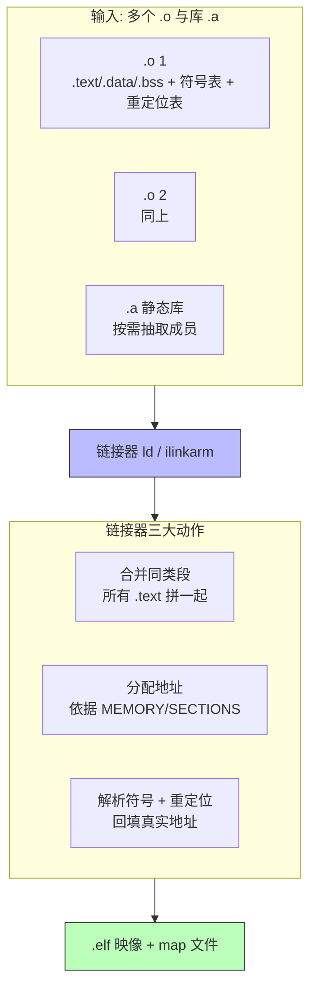
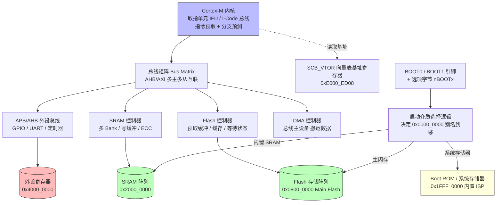
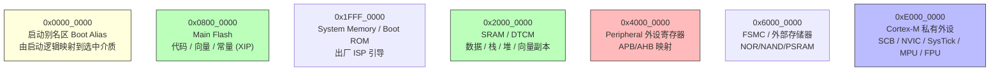
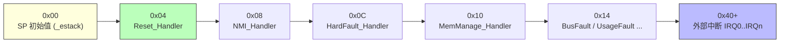
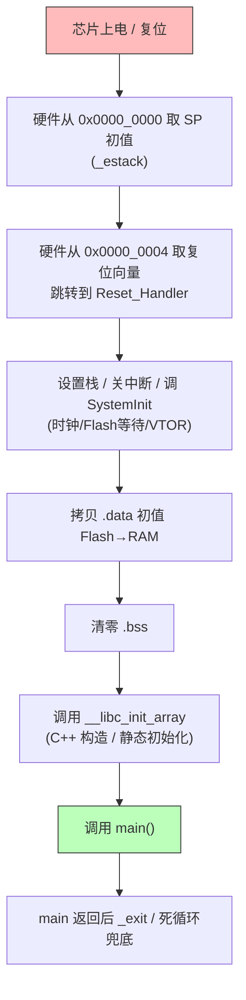
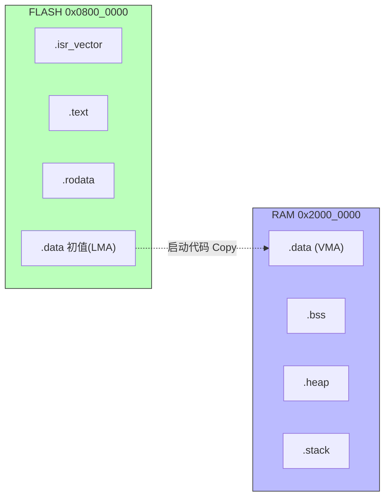
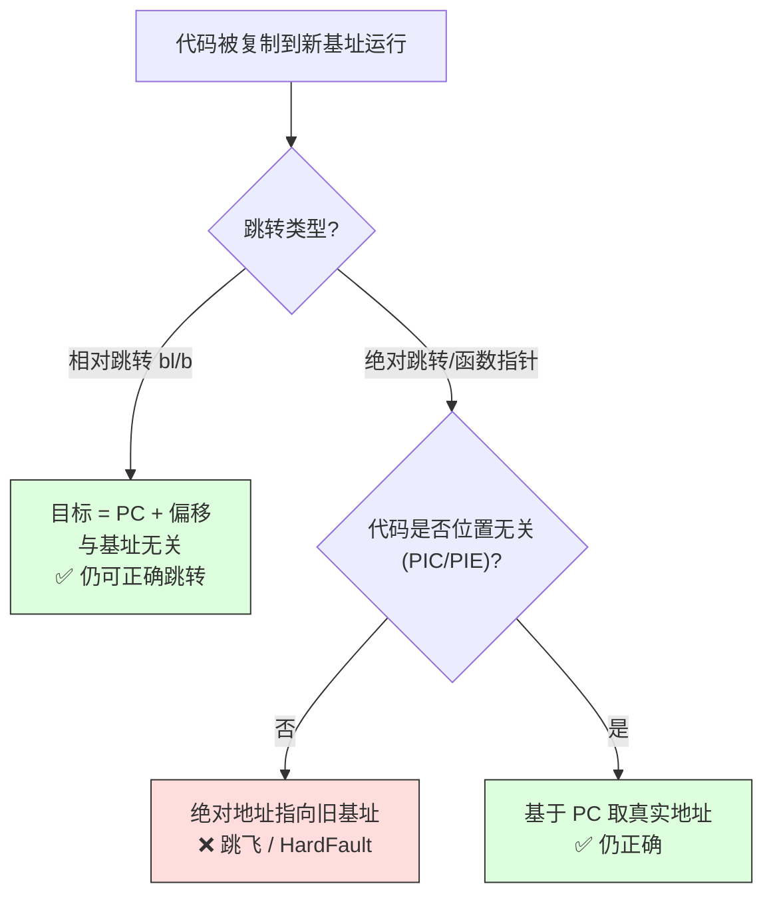
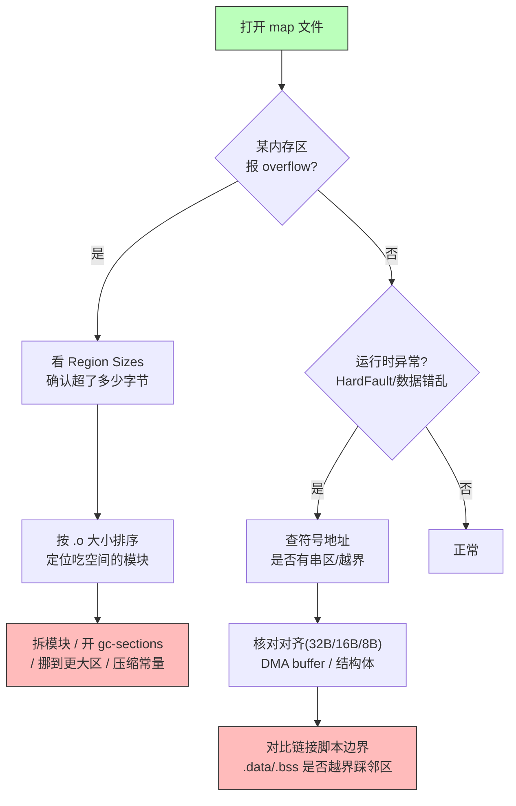
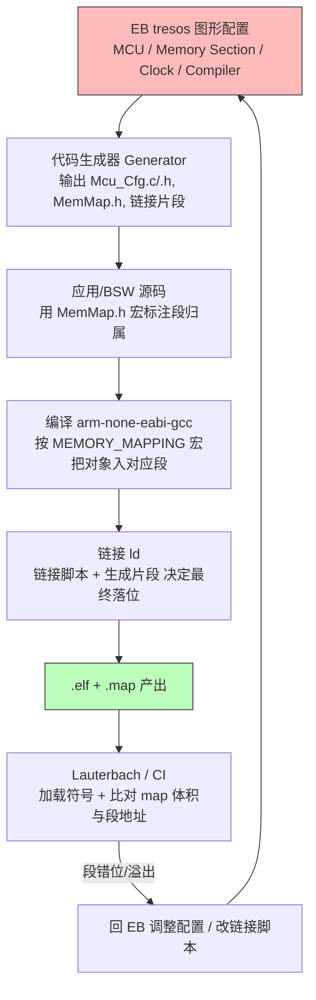

# 嵌入式编译、链接与启动全过程：从芯片存储 IP 到可运行固件的工业级底层剖析

## 引言

在嵌入式底层开发中，"编译"和"链接"这两个词几乎每天都会被提及，但真正把整套链路吃透的工程师并不多。很多人把工具链当成一个黑盒：写好 `.c`，点一下"Build"，出来一个 `.hex` 或者 `.bin` 烧进芯片就能跑——至于中间到底发生了什么，出了问题如何定位，往往一知半解。这种"黑盒心态"在项目顺利时是效率，在项目出事时就是灾难。

笔者在车规与工业控制领域做过多年底层与启动相关工作，见过太多由"编译器/链接器不了解"引发的诡异问题：上电随机 HardFault、低功耗唤醒后向量表错位、优化一开串口就丢字节、链接脚本改了一行导致某个标定模块把相邻内存区踩穿。这些问题的共同点，是它们都藏在预处理、编译、汇编、链接、启动这几道关卡里，而定位它们的钥匙，正是理解工具链每一步的产物、芯片存储与启动子系统的硬件行为，以及链接脚本、map 文件这份"内存布局契约"。

本文的目标，是把"从源码到可运行固件"的完整链路讲透：不仅讲清楚每个阶段在干什么、产物是什么，还要讲清楚优化等级背后的陷阱、芯片内部存储与启动 IP 如何协作、启动文件里那几行汇编到底做了什么、链接脚本如何决定内存布局、重定位如何把符号变成真实地址、map 文件该怎么读、MCAL/BSW 配置如何落到链接段，最后用一组面试题检验理解深度。文中的工具链示例覆盖 GNU 工具链（`arm-none-eabi-gcc`、`ld`）、IAR（`iccarm`/`ilinkarm`）、Keil（`ARMCC`/`ARMCLANG`）、CMake 与 Make，调试侧引用 Lauterbach TRACE32，力求贴近真实工程环境。

---

## 一、从源码到可执行：预处理、编译、汇编、链接四阶段详解

### 1.1 总览：一次构建到底产出了什么

一个典型的裸机（bare-metal）嵌入式构建，最终目标并不是 `.c` 直接变成芯片能跑的东西，而是经历四个阶段，最终产出可烧录的二进制映像。可以用一张图把宏观流程串起来：


需要强调：`.elf`（Executable and Linkable Format）才是链接器的真正产物，它同时包含调试信息、符号表、段布局等丰富内容；而我们烧进 Flash 的 `.bin` 或 `.hex` 只是把 `.elf` 里那些"真正要落进内存"的段抽取并线性化后的结果。丢了 `.elf`，你就失去了反汇编、map 对照、运行时调试的全部依据——所以量产构建一定要把带调试信息的 `.elf` 归档保存。在 Lauterbach TRACE32 中，正是通过 `Data.LOAD.Elf myimage.elf` 同时加载代码、符号与调试信息，才能做到"源码级单步 + 内存视图"的联合调试。

### 1.2 第一阶段：预处理（Preprocessing）

预处理由编译器驱动程序（如 `arm-none-eabi-gcc -E`）调用 C 预处理器 `cpp` 完成。它做的事情纯粹是"文本级别"的，不涉及任何编译优化：

- **头文件展开**（`#include`）：把被包含的头文件内容原地替换进来。一个 `.c` 经过预处理后通常会膨胀几十倍，因为它把标准库头、芯片厂商头（如 CMSIS 的 `core_cm4.h`）全部内联展开。
- **宏替换**（`#define`）：对象宏直接文本替换，函数宏带参数替换。带参宏在嵌入式里大量用于寄存器位域操作，但也最容易因为缺少括号而引入运算符优先级 bug——经典写法是每个宏参数与整体都包一层括号：`#define REG_SET(r,v) ((r) = (r) | (v))`。
- **条件编译**（`#if` / `#ifdef` / `#ifndef`）：根据宏定义裁剪代码。典型用途是 `#if defined(USE_HAL_DRIVER)` 或 `#ifdef DEBUG`。需注意，未被选用的分支在预处理阶段就被丢弃，**不会进入后续编译**，所以代码体积和符号表都不含它们。
- **特殊指令**：`#pragma`、`#error`、`#warning`、`__FILE__` / `__LINE__` 等；以及编译器扩展的 `#pragma once`。

与头文件相关的两个工程细节值得强调。其一是**头文件守卫（include guard）**与 `#pragma once`：当一个头文件被多条包含链间接包含时，若没有守卫，宏展开会把同一份声明重复贴入，轻则编译报"重定义"、重则预处理后文件极度膨胀拖慢编译。传统做法是在头文件首尾包一层 `#ifndef FOO_H / #define FOO_H / #endif`，现代编译器则支持 `#pragma once`（语义等价且更快，但属于编译器扩展，跨工具链移植时需确认对方支持）。其二是**头文件里只写声明、不写定义**的铁律：头文件应只放函数原型、`extern` 变量声明、类型定义（`typedef`/结构体/`enum`）与 `static inline` 小函数；任何"会分配存储"的定义（如 `int g_x = 0;`）一旦进头文件被多份 `.c` 包含，链接期必然 `multiple definition`。这是几乎所有链接错误的源头之一，必须在编码规范里写死。

工程上的一个实用技巧：当你怀疑某个宏展开出了意料之外的代码，或者想确认某个头文件到底被包含进来了没有，可以直接让工具链停在预处理阶段。以 GNU 工具链为例：

```bash
# 仅做预处理，输出到 .i 文件，便于人工检视宏展开结果
arm-none-eabi-gcc -E -O0 src/main.c -o main.i
# 配合 -dM 可单独 dump 所有生效的宏定义，排查宏冲突非常有用
arm-none-eabi-gcc -dM -E src/main.c
```

在 IAR（`iccarm`）下可以用 `--preprocess` 选项，Keil（`ARMCC`）下则是 `--preprocess`。这些选项的语义一致：把宏展开后的"纯净源"吐出来，方便人工核对。

### 1.3 第二阶段：编译（Compilation）

编译阶段把预处理后的 `.i`（纯 C/汇编）翻译成**特定架构的汇编代码** `.s`。这一步才是真正"理解语义"的地方：词法分析、语法分析、语义检查、中间表示（IR）生成、目标无关优化、目标相关优化、指令选择、寄存器分配，最后吐出汇编。

从构建视角看，编译的最小单位是**翻译单元（Translation Unit）**——即一个 `.c` 加上它所有被展开的头文件所构成的整体。每个翻译单元被独立编译成目标文件 `.o`，彼此之间在编译期完全不通信。这也解释了为什么"跨文件"的优化（比如把一个函数内联到另一个文件里）默认做不到，除非开启**链接期优化（LTO, Link Time Optimization）**，这一点后面会专门展开。

编译阶段会做大量与优化等级相关的变换，例如：

- 常量折叠（constant folding）：`#define LED_PIN 5` 后 `1 << LED_PIN` 在编译期直接算出 `32`。
- 循环展开（loop unrolling）、函数内联（inlining）。
- 死代码消除（DCE, Dead Code Elimination）：不可达或确定无副作用的代码被删除。
- 公共子表达式消除、指令调度等。

需要警惕的是，编译阶段对"未定义行为（UB）"是零容忍地激进优化。例如 `int x; ... x + 1 > x` 在有符号溢出未定义的前提下，可能被优化器直接判定为永远为真而删除后续分支——这在桌面程序里是性能提升，在控制逻辑里却可能酿成安全缺陷。

### 1.4 第三阶段：汇编（Assembly）

汇编器（GNU 下是 `as`，属于 `binutils`）把 `.s` 翻译成机器码，并打包成**可重定位目标文件** `.o`（ELF 格式）。此时的 `.o` 有几个关键特征：

- **段（Section）已经划分好**：代码在 `.text`，只读常量在 `.rodata`，已初始化全局变量在 `.data`，未初始化全局变量在 `.bss`（`.bss` 在 `.o` 里只占"大小"，不占实际字节，因为内容全 0），局部变量不会进这些段（它们进栈）。
- **符号表（Symbol Table）已生成**：本文件定义的函数/全局变量是"已定义符号"，引用了别的文件但本文件没定义的是"未定义符号"（即未决符号）。
- **重定位表（Relocation Table）已生成**：凡是"暂时不知道真实地址、得等链接时再填"的地方（比如调用一个外部函数、访问一个外部全局变量），汇编器会在重定位表里留一条记录，注明"在 `.o` 的某偏移处，需要把某符号的最终地址填进来，采用何种重定位方式"。

换言之，`.o` 是一块"地址还没落定"的半成品：它知道自己有哪些代码和数据、引用了谁、哪里要等链接器来补地址。这种"半成品"的可重定位特性，正是后面链接器能自由拼装的前提。

### 1.5 第四阶段：链接（Linking）

链接是本文的核心舞台。链接器（GNU 下是 `ld`，IAR 下是 `ilinkarm`，Keil 下由 `ARMCC`/`ARMCLANG` 驱动自带的链接器）把一堆 `.o` 和库（`.a`）合并成一个完整的映像。它干三件不可省略的大事：

1. **合并同类段（Section Merging）**：把所有 `.o` 里的 `.text` 拼到一起形成最终映像的 `.text`，所有 `.rodata` 拼成 `.rodata`，`.data`、`.bss` 以此类推。链接脚本（或 scatter 文件）决定它们各自落在哪个内存区、以什么顺序、如何对齐。
2. **分配地址（Address Assignment）**：根据链接脚本描述的"内存地图"（Flash 多大、起始地址多少；RAM 多大、起始多少；有没有 ITCM/DTCM 等），给每个段、每个符号分配**最终的物理地址**。这一步的结果直接决定了固件下载后芯片从哪里取指、变量放在哪个 RAM 地址。
3. **解析符号与重定位（Symbol Resolution & Relocation）**：把每个 `.o` 里的"未决符号"对应到某个真实的"已定义符号"，并依据重定位表，把真实地址填回那些留空的位置。

链接完成之后，链接器通常还负责：

- 生成 **map 文件**（内存布局、各段大小、各符号地址、各目标文件贡献度）。
- 调用 `objcopy` 风格的后续步骤抽取 `.bin`/`.hex`（有些工具链这一步是显式的，有些集成在 IDE 里）。

下图把链接器的三类关键动作与产物对齐，便于建立心智模型：



链接有两种常见形式：**静态链接**（把库代码直接拷进映像，嵌入式几乎全是这种）与**动态链接**（运行时再加载，嵌入式裸机基本不用，只有带 OS 的嵌入式 Linux 才用）。此外还有前面提到的 **LTO（链接期优化）**：它让链接器在合并完所有 `.o` 后，还能基于"全程序视图"再跑一轮优化（跨文件内联、跨文件死代码消除）。开启 LTO 时，编译阶段产出的不是普通机器码，而是某种中间表示（GCC 用 `flto` 时把 GIMPLE 序列化进目标文件），链接时再统一编译优化。LTO 能显著减小体积、提升性能，但代价是链接时间大幅拉长、调试信息更难对应源码，且对链接脚本的段布局有时会产生"意外"的合并行为，需要谨慎使用。

---

## 二、编译器优化等级与陷阱

优化等级是嵌入式工程师和编译器之间最微妙的一场博弈：优化不够，体积超标、性能不达标；优化过头，又可能把"看似无用实则关键"的代码删掉，或者把对硬件寄存器的访问重排，导致系统行为偏离预期。下面把常见等级与坑逐一拆开。

### 2.1 优化等级概览

主流工具链（GCC 系、IAR、ARMCC 大同小异）都提供一组 `-O` 开头的等级。下表归纳它们的典型语义与在嵌入式场景下的取舍：

| 等级 | 典型含义 | 代码体积 | 调试友好度 | 嵌入式适用场景 |
|------|----------|----------|------------|----------------|
| `-O0` | 几乎不优化，严格按源码顺序生成 | 最大 | 最好（变量可读、可单步） | 调试阶段、问题复现 |
| `-O1` | 轻量优化，不做激进变换 | 较大 | 较好 | 折中 |
| `-O2` | 全部不牺牲空间的优化，平衡性能与体积 | 较小 | 一般 | **量产默认推荐** |
| `-O3` | 更激进，含大量展开、向量化 | 可能膨胀 | 差 | 算力敏感算法（慎用） |
| `-Os` | 以"最小化代码体积"为目标 | 最小 | 一般 | Flash 紧张的小芯片 |
| `-Oz`（Clang/ARMCLANG） | 比 `-Os` 更激进地瘦身 | 极小 | 差 | 极致体积约束 |
| `-Og` | 为调试优化（GCC），保留可观察性 | 较大 | 好 | 需要优化又想调试 |

需要特别说明：`-O0` 看似"最安全"，但它会带来大量冗余的栈读写和寄存器搬运，反而可能掩盖某些栈溢出、未初始化变量的问题，而且绝对不能用来评估真实运行时的性能与最坏执行时间（WCET）。车规与功能安全项目通常**锁定 `-O2`**（或供应商认证过的具体等级），并在该等级下做 WCET 分析与内存占用评估——一旦锁定，中途不能随意切换，否则前面所有分析失效。

### 2.2 陷阱一：易失性访问与 `volatile` 的丢失

`volatile` 关键字告诉编译器："这个对象可能被程序之外的因素（硬件寄存器、中断、DMA、另一个核）修改，你每次访问都必须真的去内存里读/写，不许把它缓存到寄存器里，也不许重排或合并访问。"在嵌入式里，所有内存映射的硬件寄存器（如 `GPIOx->ODR`、`USARTx->DR`）都必须用 `volatile` 限定，否则优化器可能把"连续两次读状态寄存器"合并成一次，或者把"写控制寄存器"优化掉，因为从编译器的纯语言视角看"读同一个变量两次、中间没改它"是冗余的。

但 `volatile` 有三个常被忽视的坑：

1. **`volatile` 不保证原子性**：它只禁止编译器重排/缓存，不禁止 CPU 在指令层面把一次 32 位访问拆成多条总线事务（某些架构对非对齐或特殊宽度访问会如此），也不保证多核/中断并发下的竞态。并发保护仍需关中断、自旋锁或原子指令。
2. **`volatile` 不阻止 CPU 乱序执行**：编译器层面的顺序被保留了，但 CPU 内部的乱序执行（out-of-order）和写缓冲（write buffer）仍可能让"对两个不同寄存器的写"在总线上的可见顺序与程序顺序不同。需要真实的内存屏障（`__DSB()`/`__DMB()` 等）来约束。
3. **`volatile` 的"邻居"仍可能被优化**：如果一段代码里同时访问 `volatile` 变量和普通变量，优化器对普通变量照常优化，可能导致开发者误以为"整段都受保护"。

更隐蔽的问题是"丢失 `volatile` 限定"：当通过没有 `volatile` 限定的指针去访问硬件寄存器时，例如 `*(uint32_t*)0x40021000 = 1;` 而 `uint32_t*` 没有 `volatile` 限定，编译器完全有理由把它优化掉或缓存。正确写法是 `(volatile uint32_t*)0x40021000`。在 CMSIS 里，外设寄存器一律被声明为 ` volatile ` 结构体指针，这是底层寄存器访问不会出错的根本保障。

### 2.3 陷阱二：严格别名规则（Strict Aliasing）与类型双关

C 语言的**严格别名规则**规定：不同类型的对象不能通过指针互相访问（除了 `char*` 可以别名任意类型）。例如，把一个 `float` 的位模式通过 `int*` 读出来取整数表示，在标准 C 里是未定义行为。优化器会假定"不同类型的指针指向不同对象"，从而大胆地重排、缓存，导致你通过 `int*` 写进去的值，从 `float` 视角读出来是旧的——经典 bug。

嵌入式里常见的"类型双关"需求（比如把协议缓冲区按不同结构体解读、把浮点序列化为 4 字节）应当用**联合体（union）**或 `memcpy` 完成，而不是通过强制类型转换的指针去"偷看"：

```c
/* 错误且危险的双关：违反严格别名规则，开启 -O2 后可能出错 */
float f = 3.14f;
int   i = *(int*)&f;          /* UB！优化器可能给出错误结果 */

/* 正确做法一：用 union（C99 起允许的"类型双关"用法） */
union { float f; uint32_t u; } u;
u.f = 3.14f;
uint32_t bits = u.u;

/* 正确做法二：用 memcpy，编译器会识别并优化成高效指令 */
uint32_t bits2;
memcpy(&bits2, &f, sizeof(f));
```

在 GCC/Clang 下还可以用 `-fno-strict-aliasing` 关闭该优化来规避（Linux 内核就是这么干的），但代价是放弃一部分优化收益，且属"掩盖问题"而非"修复问题"。更干净的做法是遵守规则。

### 2.4 陷阱三：死代码消除与"看似无用"的代码

`-O2` 起的死代码消除（DCE）与"未使用函数/变量删除"（如 GCC 的 `-ffunction-sections` + 链接期 `--gc-sections`）会移除所有"从入口不可达"或"确定无副作用"的代码。这本来是好事（显著瘦身），但它会删掉你**以为在用、其实没被引用**的代码——典型场景：

- 一个被 `#if 0` 包裹、或条件编译没开启的初始化函数，连同它里面对关键寄存器的配置一起被删，导致外设没被初始化。
- 一个只被调试打印引用的变量，在关掉打印后变量被删，而该变量原本有"读一次以清除中断标志"的副作用，结果中断标志永远清不掉。
- 链接期垃圾回收（`--gc-sections`）删除"没有被任何保留入口引用"的段，若你的启动向量表里对某个处理函数的引用写错了名字，该函数段会被整段删掉，运行时跳过去就是野指针。

应对之道：对"必须有副作用、即使无显式读取也不可删"的对象，用 `volatile` 限定；对"必须保留的函数/段"（如中断处理函数、启动代码），要么确保被向量表真实引用，要么用链接脚本的 `KEEP()` 指令或 scatter 的保留语法显式保护。

### 2.5 陷阱四：有符号溢出、`-ffast-math` 与内联汇编 clobber

还有几类隐蔽陷阱值得单列：

- **有符号溢出 UB**：`for (int i = 0; i <= n; i += step)` 当 `i` 溢出回绕时是 UB，优化器可能直接把循环判定当成"永真"做无限展开。计数变量尽量用 `size_t`/`uint32_t`。
- **`-ffast-math`**：它允许编译器假设浮点符合代数律、没有 NaN/Inf，从而重排 `a+b+c`。但在控制算法里这可能改变数值结果甚至触发异常，**车规/安全代码严禁开启**。
- **内联汇编缺 clobber**：手写汇编若读写内存却不声明 `"memory"` clobber、不列出被破坏的寄存器，编译器可能在其周围做错误优化（如把相邻变量缓存进寄存器而忽略你的写入）。正确写法是写全 input/output/clobber 列表。

### 2.6 链接期优化（LTO）的额外注意

LTO 把"跨文件"的优化变为可能，但它也放大了前述陷阱：跨文件内联后，某些函数本体被内联消去，符号表里就查不到它了；跨文件 DCE 可能因为你"看起来没用"的模块没有全局可见的引用入口，就把整个模块删掉。因此开启 LTO 后，启动、向量表、特殊段都要格外注意 `KEEP`，且 map 文件的解读方式也要相应调整（有些函数不再以独立符号存在）。

---

## 三、芯片模块设计（IP 内部架构）：存储与启动子系统【新增核心 A】

要真正读懂"启动文件为什么这样写、链接脚本为什么这样排"，必须先理解芯片内部的**存储与启动子系统（Memory & Boot Subsystem）**。这一节从 IP 视角把硬件框图、地址空间、关键寄存器、启动模式与时钟复位影响讲清楚。下列框图与寄存器均基于业界通用 Cortex-M 体系与常见 MCU 实现逻辑，可作为理解任意具体型号的方法论骨架。

### 3.1 芯片存储与启动子系统模块框图

下图展示了一个典型 MCU 的"内核取指—总线矩阵—存储映射—向量表基址—启动选择"协同视图。注意：Cortex-M 上电后硬件从地址 `0x0000_0000` 取指，而这个地址是**别名（alias）**，实际被映射到你通过 BOOT 引脚/选项字节选定的启动介质。



几个关键协作点：

- **取指单元（IFU）**通过 I-Code/AHB 总线向总线矩阵发起取指；总线矩阵把请求路由到 Flash、SRAM 或 ITCM，取决于地址与映射。现代 MCU 在 Flash 前通常有**预取缓冲（prefetch buffer）**与 **指令缓存（ICache）**，用以弥补 Flash 等待周期，但这也意味着"代码被搬到 RAM 执行"往往比 XIP 更快、抖动更小（见后文 TCM 讨论）。
- **总线矩阵**是地址路由的中枢：它把"地址"翻译成"访问哪个从设备"。芯片存储 IP 的本质，就是把一段 4GB 地址空间按规则切分给 Flash、SRAM、外设、外部存储器与内核私有外设。
- **VTOR（Vector Table Offset Register）**位于内核 SCB，告诉 CPU 异常/中断向量表的实际基址（默认 `0x0000_0000`，可改到 SRAM 或任意对齐地址）。这是"向量表重定位"的硬件支点，后文会给出代码。

### 3.2 存储器地址空间分区（内存映射图）

Cortex-M 采用统一的 4GB（32 位地址）线性地址空间，典型分区如下。这张"内存映射段分布"图是理解链接脚本 `ORIGIN` 取值的根本依据：



常见的地址区间与用途归纳如下表（以典型 Cortex-M MCU 为蓝本，具体型号区间略异）：

| 地址区间（典型） | 区域名 | 存储介质 | 主要用途 | 链接脚本落位 |
|------------------|--------|----------|----------|--------------|
| `0x0000_0000` 起 | Boot Alias | 别名 | 上电取指（映射启动介质） | 不直接配，由硬件 |
| `0x0800_0000` 起 | Main Flash | 非易失 | `.text`/`.rodata`/`.data` 初值 | `FLASH` 区 |
| `0x1FFF_0000` 起 | System Memory | ROM | 内置 Bootloader（ISP） | 不链接 |
| `0x2000_0000` 起 | SRAM | 易失 | `.data`/`.bss`/堆/栈 | `RAM` 区 |
| `0x4000_0000` 起 | Peripheral | 寄存器 | 外设控制 | 不链接（MMIO） |
| `0xE000_0000` 起 | Private Peripheral | 内核 | NVIC/SCB/MPU | 不链接（内核） |

### 3.3 中断向量表布局与 VTOR 寄存器位域

向量表是"异常/中断入口地址的数组"，每个表项 4 字节（一个函数指针）。布局从偏移 `0x00` 开始，依次是全芯片共用的异常向量，之后是各外设 IRQ。下图给出布局概览：



向量表基址由**内核 SCB 的 VTOR 寄存器（地址 `0xE000_ED08`）**指定。其位域逻辑如下（ARMv7-M 通用）：

| 位域 | 名称 | 说明 |
|------|------|------|
| `31:7` | TBLOFF | 向量表基址的 bits[31:7]。即表基址 = 该字段左移 7 位，因此表必须 128 字节对齐（更严格者按异常数向上取整） |
| `6:0` | — | 保留，必须写 0 |

> 注：在部分老架构中还存在 `TBLBASE` 位用于指示表在 Code 还是 RAM，但 Cortex-M3/M4/M7 的 VTOR 仅保留 TBLOFF，表可置于任意对齐的可执行区（Flash 或 SRAM）。

由此可以推出一个重要工程约束：如果你的应用需要把向量表搬到 SRAM（例如 Bootloader 跳应用、或支持中断向量重定向到应用区），必须保证目标地址 **128 字节对齐**，并把该地址写入 VTOR，同时设置 `SCB->VTOR = APP_BASE | 0x000;` 之类。后文驱动代码章节会给出完整实现。

### 3.4 Flash 控制器、选项字节与时钟复位对启动的影响

**Flash 控制器（Flash Interface）**是存储 IP 中"写 Flash"的唯一通道。它的核心寄存器（通用逻辑，具体型号命名略异）及位域如下：

| 寄存器 | 地址（典型） | 关键位域 | 作用 |
|--------|--------------|----------|------|
| `FLASH_ACR` | 0x4002_2000 | `LATENCY[2:0]`、`PRFTEN`、`ICEN` | 配置等待周期、预取、指令缓存 |
| `FLASH_CR` | +0x04 | `PG`(bit0) 编程、`PER`(bit1) 页擦、`MER`(bit2) 全擦、`STRT`(bit16) 启动、`LOCK`(bit31) 加锁 | 控制擦写动作，写前需先解锁 |
| `FLASH_SR` | +0x08 | `BSY`(bit0) 忙、`EOP`(bit5) 操作完成、`OPERR` 操作错误 | 状态轮询，忙时不可新操作 |
| `FLASH_KEYR` | +0x0C | 解锁密钥序列 | 写 `KEY1`/`KEY2` 解锁 `CR` |

Flash 上电默认处于**加锁（LOCK=1）**状态，且 `LATENCY` 默认可能为 0 等待。启动代码里 `SystemInit()` 配置主频时，**必须同步按目标时钟把 `FLASH_ACR.LATENCY` 调到正确等待周期数**——否则高频下取指会读到无效数据，直接导致预取错误/硬 Fault。这是"时钟一超频就崩"的经典根因之一。

**选项字节（Option Bytes / Configuration Words）**是存放在 Flash 特定扇区的一组配置字，掉电不丢失，决定芯片级行为：

| 选项字节域 | 典型位 | 作用 |
|------------|--------|------|
| `RDP`（读保护） | `RDP[7:0]` | 0=无保护，非0=读保护（防止通过调试器 dump Flash） |
| `USER`（用户选项） | `nBOOT0`、`nBOOT1`、`nSWBOOT0` | 与 BOOT 引脚共同决定启动介质 |
| `WRP`（写保护） | 若干位 | 保护指定 Flash 扇区不被意外改写 |

选项字节在量产时通过编程器/调试器（如 Lauterbach、`STM32CubeProgrammer`、J-Flash）烧写；一旦设置 RDP 级别，调试接口读取 Flash 内容将被禁止，这对车规/工业固件防盗版至关重要。

**启动模式选择（BOOT 引脚 + 选项字节）**决定 `0x0000_0000` 别名到何处。典型组合（常见双引脚方案）：

| BOOT1 | BOOT0 | 启动介质 | 别名 `0x0000_0000` → |
|-------|-------|----------|----------------------|
| X | 0 | 主闪存 Main Flash | `0x0800_0000` |
| 0 | 1 | 系统存储器 System Memory | `0x1FFF_0000`（内置 ISP） |
| 1 | 1 | 内置 SRAM | `0x2000_0000` |

> 注意：部分型号用选项字节 `nBOOT0`/`nBOOT1` 可**覆盖**物理引脚，实现"引脚固定但出厂后改启动源"，这是量产与现场升级的常用手段。

**时钟与复位对启动的影响**是另一条隐藏主线：

- 复位释放后，芯片默认使用**内部高速 RC（HSI）**作为系统时钟，此时主频较低（如 8/16 MHz），Flash 等待周期可设为最小。启动代码 `SystemInit()` 必须**先切到 HSI 稳定状态**，再配置 PLL 倍频到目标频率，并在切换前把 Flash 等待周期调高，避免"时钟升太快、Flash 跟不上"。
- 复位来源（上电复位 POR、外部 NRST、看门狗、低功耗唤醒）会影响启动路径：低功耗 `Standby` 唤醒后，部分寄存器/外设状态会丢失，启动代码需重新初始化；而 `Sleep`/`Stop` 唤醒通常保留 RAM 内容，因此 `.bss` 不清零、`.data` 不重拷（RAM 仍是之前的值）。理解这点对"低功耗唤醒后随机 HardFault"类问题定位极关键。
- 内核与存储接口的协作总结：**复位→硬件从别名 `0x0000_0000` 取 SP 与 Reset 向量→取指经总线矩阵到选定介质→启动代码配置时钟/Flash 等待/VTOR→Copy .data/Zero .bss→进 main**。任何一环地址或时序错，都会体现在"取不到正确指令"这一最底层故障上。

---

## 四、启动文件 startup.s：从复位到 main 的最后一公里

很多工程师以为"程序从 `main()` 开始跑"，这是错误的心智模型。在 `main()` 之前，有一段**启动代码（startup code）**早早接管了芯片——它通常由芯片厂商提供的 `startup_<device>.s` 汇编文件实现，在 C 运行环境（C Runtime, CRT）就绪之前，把硬件和内存摆到能运行 C 代码的状态。理解这段汇编，是定位"上电就崩""进了 main 但全局变量是垃圾"等问题的前提。

### 4.1 复位向量表与启动流程

Cortex-M 上电后，硬件固定从地址 `0x0000_0000` 取**栈顶指针（SP）初值**，然后从 `0x0000_0004` 取**复位向量（Reset_Handler 地址）**并跳转。这一前一后的两个 32 位字，构成了向量表的头两项；后面依次是 NMI、HardFault、各类外设中断等处理函数地址。向量表本身通常放在 Flash 起始（`__Vectors` 段），因为上电复位时芯片默认从 Flash 取指。



### 4.2 栈顶指针初始化与关键符号

`startup.s` 开头会定义向量表，并在向量表第一项填入栈顶地址（通常叫 `__initial_sp` 或 `_estack`），这个地址来自链接脚本给出的 RAM 末端。后面会声明 `Reset_Handler`、`NMI_Handler`、`HardFault_Handler` 等弱符号（weak），允许用户在其他文件里用强符号覆盖它们。完整可读的启动文件见下一章【驱动代码实现】。`_estack` 等符号由**链接脚本**提供（通过 `PROVIDE` 或 `EXPORT`），启动文件和链接脚本通过这组符号"握手"：链接脚本告诉启动文件 RAM 顶在哪，启动文件据此设栈。这也是为什么改了 RAM 大小必须同步改链接脚本、否则栈顶错位会立刻崩。

### 4.3 Copy / Zero 段：`.data` 与 `.bss`

这是启动文件里最容易被忽视、却最致命的一段。回顾链接阶段的事实：`.data`（已初始化全局变量）的**初值**必须存在掉电不丢失的 Flash 里，但变量**运行时**必须位于可写的 RAM 里；`.bss`（未初始化全局变量）默认全 0，运行时也必须在 RAM 里，但没必要在 Flash 里占空间（只需记录大小）。

于是启动代码必须做两件事：**把 `.data` 的初值从 Flash 拷贝到 RAM 对应位置**，**把 `.bss` 占的 RAM 区域全部清零**。这组符号 `_sidata`（Flash 中初值起点）、`_sdata`/`_edata`（RAM 中 `.data` 起止）、`_sbss`/`_ebss`（RAM 中 `.bss` 起止）同样来自链接脚本。这些符号的精准是"内存布局契约"的落点；若 `.bss` 区间算大了一字节，清零就会越界踩掉紧邻它的内存（比如另一块 SRAM、或者中断向量备份区），后果就是"随机 HardFault、低功耗唤醒后崩"的噩梦。所以改完链接脚本，**第一件事就是 diff map 文件，确认 `.data`/`.bss` 边界和落位完全符合预期**。

### 4.4 `__main`、库初始化与 C 运行环境

在 ARMCC/ARMCLANG（Keil）体系里，真正进入用户 `main()` 之前，链接器插入的 `__main` 会负责：搭建分散加载（scatter）描述的内存拷贝、调用 `__scatterload`，随后做 C 库初始化（如 errno、堆等），再跳 `main`。在 GNU 体系里，对应的职责由 `__libc_init_array`（处理 `.preinit_array`、`.init_array` 里的构造函数）和上述手写的 Copy/Zero 代码承担。无论哪种工具链，这一环的共性结论是：**`main()` 之前已经发生了大量内存搬运与初始化**，任何"全局变量初值不对""静态对象构造没执行"的问题，都应先怀疑这一环而非 `main` 本身。

### 4.5 ABI 与栈对齐（AAPCS）的隐藏约束

启动代码设栈时还必须遵守**调用规范（AAPCS，ARM 架构过程调用标准）**：在调用任何 C 函数之前，栈指针必须 8 字节对齐。这条规则之所以重要，是因为 ARM 的某些指令（如 `LDRD`/`STRD` 双字加载存储、以及 NEON/VFP 的 64 位操作）要求操作数地址 8 字节对齐，而编译器在生成这些指令时**默认假设进入函数时 SP 已是 8 字节对齐的**。如果启动代码把栈顶设在了一个非 8 对齐的地址（例如 RAM 末端是奇数个 4 字节字），那么一旦运行到含双字访问的函数，就会触发对齐异常或 HardFault。更隐蔽的是：函数调用本身会在栈上压入返回地址（4 字节），所以"AAPCS 要求的是函数入口处 SP 模 8 等于 0"，这意味着**栈顶初值本身应模 8 等于 0** 才能在当前调用边界成立后维持不变量。因此链接脚本里 `_estack` 的选取、以及启动文件里 `. = ALIGN(8)` 的写法，不只是"好看"，而是 ABI 正确性的硬要求。许多"只在特定函数里崩溃"的疑难问题，根子就在这一个对齐位上。

---

## 五、驱动代码实现：从 IP 到可运行固件【新增核心 B】

这一章把第三章的存储/启动 IP "操作"出来——给出真实可在工程里落地的代码：完整启动文件、链接脚本、系统时钟与 PLL 初始化、向量表重定位。所有代码均带注释，且符号与第三、四章的硬件口径一致。

### 5.1 启动文件 startup.s（栈顶 / 向量表 / Copy+Zero）

下面是一份 GNU 风格、可直接编译进 Cortex-M 工程的 `startup.s`。它包含向量表、弱符号默认处理函数、以及 `Reset_Handler` 中的 Copy `.data` / Zero `.bss` 逻辑（与 `SystemInit`、C 库初始化、跳 `main`）。

```asm
/* startup_<device>.s —— GNU 风格启动文件（带 Copy/Zero 段） */
    .syntax unified
    .cpu    cortex-m4
    .thumb

    /* 关键符号由链接脚本提供：_estack / _sidata / _sdata / _edata / _sbss / _ebss */
    .word   _estack                  /* 0x0000_0000: 主栈顶初值 */
    .word   Reset_Handler            /* 0x0000_0004: 复位向量 */

    .section .isr_vector,"a",%progbits
    .type   g_pfnVectors, %object
    .size   g_pfnVectors, .-g_pfnVectors
g_pfnVectors:
    .word   _estack                  /* 第 0 项：SP 初值 */
    .word   Reset_Handler            /* 第 1 项：复位 */
    .word   NMI_Handler
    .word   HardFault_Handler
    .word   MemManage_Handler
    .word   BusFault_Handler
    .word   UsageFault_Handler
    .word   0                        /* 保留 */
    .word   0
    .word   0
    .word   0
    .word   SVC_Handler
    .word   DebugMon_Handler
    .word   0
    .word   PendSV_Handler
    .word   SysTick_Handler
    /* ... 后续各外设中断 IRQ 省略，按芯片手册续接 ... */

    /* 默认弱符号处理函数：用户可在别处用强符号覆盖 */
    .weak   NMI_Handler
    .type   NMI_Handler, %function
NMI_Handler:
    b       .
    .size   NMI_Handler, .-NMI_Handler

    .weak   HardFault_Handler
    .type   HardFault_Handler, %function
HardFault_Handler:
    b       .                        /* 死循环便于调试器捕获 */
    .size   HardFault_Handler, .-HardFault_Handler

    /* 其余异常/中断弱符号同理 ... */

    .section .text.Reset_Handler,"ax",%progbits
    .type   Reset_Handler, %function
Reset_Handler:
    /* 1) 显式装载栈顶（部分型号硬件已做，这里再保险一次） */
    ldr   sp, =_estack

    /* 2) 拷贝 .data：Flash(_sidata) -> RAM(_sdata .. _edata) */
    ldr   r0, =_sidata
    ldr   r1, =_sdata
    ldr   r2, =_edata
1:  cmp   r1, r2
    bge   2f
    ldr   r3, [r0], #4
    str   r3, [r1], #4
    b     1b
2:

    /* 3) 清零 .bss：RAM(_sbss .. _ebss) */
    ldr   r0, =_sbss
    ldr   r1, =_ebss
    movs  r2, #0
3:  cmp   r0, r1
    bge   4f
    str   r2, [r0], #4
    b     3b
4:

    /* 4) 系统时钟/Flash等待/VTOR 等硬件初始化 */
    bl    SystemInit

    /* 5) C++ 全局构造 / 静态初始化（无 C++ 可省略） */
    bl    __libc_init_array

    /* 6) 进入用户 main */
    bl    main
    /* main 返回后的兜底：不应到达 */
    b     .
    .size Reset_Handler, .-Reset_Handler
```

### 5.2 链接脚本 ld：MEMORY / SECTIONS

启动文件引用的 `_estack`、`_sidata`、`_sdata`、`_edata`、`_sbss`、`_ebss` 必须由链接脚本定义。下面是一份带有 TCM、对齐、DMA buffer、堆/栈边界的完整 GNU ld 脚本，与第三章地址分区口径一致（`FLASH @ 0x0800_0000`，`RAM @ 0x2000_0000`）。

```ld
/* link.ld —— GNU ld 链接脚本（Cortex-M 通用） */
ENTRY(Reset_Handler)

/* 内存区域定义：与芯片地址空间分区对齐 */
MEMORY {
  FLASH (rx)  : ORIGIN = 0x08000000, LENGTH = 1024K   /* 0x0800_0000 主闪存 */
  RAM   (rwx) : ORIGIN = 0x20000000, LENGTH = 256K    /* 0x2000_0000 SRAM */
  ITCM  (rwx) : ORIGIN = 0x00000000, LENGTH = 64K     /* 紧耦合代码(1 cycle) */
  DTCM  (rwx) : ORIGIN = 0x20000000, LENGTH = 64K     /* 紧耦合数据(1 cycle) */
}

/* 把启动文件需要的符号 PROVIDE 出去 */
_estack = ORIGIN(RAM) + LENGTH(RAM);   /* 栈顶 = RAM 末端 */

SECTIONS {
  /* 向量表：必须放 Flash 起始并被 KEEP，防止被 gc 删除 */
  .isr_vector : {
    . = ALIGN(4);
    KEEP(*(.isr_vector))             /* 向量表：不可删除 */
    . = ALIGN(4);
  } > FLASH

  /* 代码与只读常量：XIP 执行，不搬运 */
  .text : {
    *(.text*)                        /* 所有代码段 */
    *(.rodata*)                      /* 只读常量随代码 */
    . = ALIGN(4);
  } > FLASH

  /* .data：运行在 RAM，初值保存在 Flash（AT 指定 LMA） */
  .data : {
    . = ALIGN(4);
    _sdata = .;                      /* RAM 中 .data 起始(VMA) */
    *(.data*)
    . = ALIGN(4);
    _edata = .;                      /* RAM 中 .data 结束 */
  } > RAM AT > FLASH
  _sidata = LOADADDR(.data);         /* Flash 中初值起始(LMA)，供 Copy */

  /* .bss：运行时在 RAM，启动时清零，不占 Flash */
  .bss (NOLOAD) : {
    . = ALIGN(4);
    _sbss = .;
    *(.bss*)
    *(COMMON)
    . = ALIGN(4);
    _ebss = .;
  } > RAM

  /* 堆与栈边界符号：供启动代码与断言/溢出检测使用 */
  . = ALIGN(8);
  .heap : {
    . = ALIGN(8); _sheap = .;
    . = . + 0x400; _eheap = .;
  } > RAM
  .stack : {
    . = ALIGN(8); _sstack = .;
    . = . + 0x800;                   /* 2KB 栈 */
    _estack = .;
  } > RAM

  /* 丢弃无用的调试/注释段，减小产物 */
  /DISCARD/ : { *(.note*) *(.comment) }
}
```

### 5.3 系统时钟与 PLL 配置（SystemInit / PLL）

启动代码第 4 步调用 `SystemInit()`，它负责把时钟从默认 HSI 切到目标 PLL 频率，并**在升频前先把 Flash 等待周期调高**。下面是一段通用逻辑的可读实现（寄存器名与第三章 Flash 控制器位域一致）：

```c
/* system_<device>.c —— 系统时钟与 Flash 等待初始化 */
#include <stdint.h>
#include "core_cm4.h"   /* CMSIS 内核头 */

#define RCC_BASE        0x40023800u
#define RCC_CR          (*(volatile uint32_t *)(RCC_BASE + 0x00))
#define RCC_PLLCFGR     (*(volatile uint32_t *)(RCC_BASE + 0x04))
#define RCC_CFGR        (*(volatile uint32_t *)(RCC_BASE + 0x08))

#define FLASH_BASE      0x40023C00u
#define FLASH_ACR       (*(volatile uint32_t *)(FLASH_BASE + 0x00))

#define RCC_CR_HSIRDY   (1u << 1)
#define RCC_CR_PLLON    (1u << 24)
#define RCC_CR_PLLRDY   (1u << 25)

/* 外部晶振 8MHz，目标 SYSCLK 168MHz：PLL_M=8, PLL_N=336, PLL_P=2 */
void SystemInit(void) {
    /* 1) 确保 HSI 就绪（复位后默认 HSI 为系统时钟） */
    RCC_CR |= (1u << 0);                 /* HSION */
    while (!(RCC_CR & RCC_CR_HSIRDY)) {}

    /* 2) 升频前先调高 Flash 等待周期（168MHz 需 5WS，按手册表取值） */
    FLASH_ACR = (FLASH_ACR & ~(7u << 0)) | (5u << 0); /* LATENCY=5 */
    FLASH_ACR |= (1u << 8);              /* 使能指令缓存 ICEN */
    FLASH_ACR |= (1u << 9);              /* 使能预取 PRFTEN */

    /* 3) 配置 PLL：M 分频 / N 倍频 / P 分频 */
    RCC_PLLCFGR = (8u << 0) |            /* PLLM = 8 */
                  (336u << 6) |          /* PLLN = 336 */
                  (0u << 16) |           /* PLLP = 2 (00) */
                  (0u << 22);            /* PLLSRC = HSI */

    /* 4) 启动 PLL 并等待锁定 */
    RCC_CR |= RCC_CR_PLLON;
    while (!(RCC_CR & RCC_CR_PLLRDY)) {}

    /* 5) 切换系统时钟到 PLL，并等待切换完成 */
    RCC_CFGR = (RCC_CFGR & ~(3u << 0)) | (2u << 0); /* SW = PLL */
    while (((RCC_CFGR >> 2) & 3u) != 2u) {}

    /* 6) 此时内核可运行于 168MHz，后续可配置 HCLK/PCLK 分频 */
    SystemCoreClockUpdate();             /* 更新全局时钟变量 */
}
```

要点：第 2 步的 Flash 等待周期**必须早于**第 4/5 步的升频，否则高频取指会出错。这正是第三章"时钟与复位对启动的影响"在代码层面的落地。

### 5.4 向量表重定位代码

当 Bootloader 跳转到 Application，或应用需要在 SRAM 中放置自己的向量表（例如支持中断向量重定向），需要把向量表基址写入内核 `SCB->VTOR`。下面给出把向量表从 Flash 复制到 SRAM 并切换 VTOR 的可读实现：

```c
/* vector_remap.c —— 把向量表重定位到 SRAM 并切换 VTOR */
#include <stdint.h>
#include "core_cm4.h"

extern uint32_t _svector_flash;   /* 链接脚本给出的 Flash 向量表基址 */
extern uint32_t _svector_ram;     /* SRAM 中向量表目标基址 */
extern uint32_t _evector_ram;

void VectorTable_RemapToRAM(void) {
    uint32_t *src = &_svector_flash;
    uint32_t *dst = &_svector_ram;

    /* 1) 逐项拷贝向量表（每项 4 字节） */
    while (dst < &_evector_ram) {
        *dst++ = *src++;
    }

    /* 2) 关键：目标地址必须 128 字节对齐 */
    /* 链接脚本需保证 _svector_ram 满足 ALIGN(128) */
    SCB->VTOR = (uint32_t)&_svector_ram;  /* 写入向量表偏移寄存器 */

    /* 3) 数据/指令同步屏障，确保后续取指使用新表 */
    __DSB();
    __ISB();
}
```

注意 `SCB->VTOR` 的写入只是"告诉 CPU 新表在哪"，地址对齐（128 字节）是硬件硬约束；若对齐不足，部分异常/中断会跳到错误地址。Lauterbach 调试时可 `Register.Set VTOR <addr>` 实时改写并验证。

---

## 六、链接脚本（GNU ld）与分散加载（ARM Scatter）

链接脚本是"内存布局契约"的正式载体。在 GNU 工具链里它是 `.ld`（语法称为 **linker script**），在 ARM 系（Keil/IAR）里是 **scatter file**（`.sct`）或 IAR 的 `.icf`。它们本质相同：描述"有哪些内存区、各段落到哪、怎么对齐、多大"。下图把"段如何落到内存区"直观呈现：



### 6.1 GNU ld 链接脚本：MEMORY 与 SECTIONS

`MEMORY` 命令声明物理内存地图，`SECTIONS` 命令描述段如何映射到这些内存区。核心概念：

- `ORIGIN` / `LENGTH`：内存区的起始地址与长度。
- `(rx)` / `(rwx)`：访问权限（读/写/执行），仅作提示与检查。
- `> REGION`：段落在哪个内存区。
- `AT > LOADADDR`：`AT` 指定"加载地址（LMA，Load Memory Address）"与"运行地址（VMA，Virtual Memory Address）"分离——这正是 `.data` 能"初值在 Flash、运行在 RAM"的实现机制。
- `ALIGN(n)`：对齐到 n 字节边界。
- `PROVIDE` / `EXPORT`：向启动代码"导出"符号（如 `_estack`）。
- `KEEP(...)`：告诉链接器即便看似无用也**必须保留**该段（用于向量表、启动代码）。

完整的 GNU ld 脚本示例见第五章 5.2（已含 TCM、对齐、DMA buffer 思路）。工程上还可为 DMA buffer 单独划区并 `ALIGN(32)`（cache line）以满足硬件对齐，例如：

```ld
/* 专门的 DMA 缓冲区段：32 字节对齐，满足 cache line / 外设要求 */
.dma_buf (NOLOAD) : {
  . = ALIGN(32);
  _sdma = .;
  *(.dma_buf*)
  . = ALIGN(32);
  _edma = .;
} > RAM
```

### 6.2 各段的语义与布局原则

下面这张表是嵌入式工程师必须刻在骨头里的"段属性总表"：

| 段（Section） | 内容 | 典型落位 | 加载地址 | 启动时处理 | 权限 |
|---------------|------|----------|----------|------------|------|
| `.isr_vector` | 中断/异常向量表 | Flash 起始 | 同 VMA | 复制（如重映射时需搬 ITCM/SRAM） | rx |
| `.text` | 程序指令 | Flash（或 ITCM） | 同 VMA | 不需搬（XIP 执行） | rx |
| `.rodata` | 常量、字符串、查表 | Flash | 同 VMA | 不需搬 | r |
| `.data` | 已初始化的全局/静态变量 | RAM | Flash（AT） | 拷贝初值 Flash→RAM | rw |
| `.bss` | 未初始化全局/静态变量 | RAM | 无 | 清零 | rw |
| `.heap` | 动态分配（malloc 区） | RAM | 无 | 由堆管理器管理 | rw |
| `.stack` | 函数调用栈/局部变量 | RAM | 无 | 由启动设栈顶 | rw |
| `.noinit` | 不初始化的保留 RAM（掉电不保但复位不清） | RAM | 无 | 跳过清零 | rw |

布局的核心原则有三条：

1. **代码与常量尽量留 Flash（XIP）**：Flash 一般比 RAM 大得多，且现代 MCU 支持从 Flash 直接取指执行（eXecute In Place），不必搬运。除非某段代码对实时性有硬要求（见 TCM）。
2. **`.data` 与 `.bss` 必须进 RAM**：因为它们要被写。初值随映像存在 Flash，运行时通过启动代码搬/清。
3. **对齐要满足硬件约束**：栈通常 8 字节对齐（AAPCS 调用规范强制），DMA buffer 常要求 32 字节（cache line）对齐，某些结构体或 SIMD 数据要求 16 字节对齐。对齐不对，要么性能下降，要么直接 HardFault。

### 6.3 ARM Scatter File（分散加载）

Keil 的 scatter 文件用一套更"声明式"的语法描述同样的布局。它把内存分成若干 `LOAD_REGION`（加载域，对应掉电后映像存放地，如 Flash）和其中的 `EXEC_REGION`（执行域，对应运行时地址，如 RAM）。下面是一段与上面 ld 脚本等价的 scatter 示例：

```text
; scatter 文件示例（Keil/ARMCLANG）
LR_IROM1 0x08000000 0x00100000 {     ; 加载域：Flash
  ER_IROM1 0x08000000 0x00100000 {   ; 执行域：代码与向量
    *.o (.isr_vector, +First)
    *(+RO)                            ; 所有只读（.text/.rodata）
  }
  RW_IRAM1 0x20000000 0x00040000 {   ; 执行域：RAM
    *(+RW)                            ; .data
    *(+ZI)                            ; .bss
    . = ALIGN(8);
    __heap_base = .;
    . = . + 0x400;
    __heap_limit = .;
    . = ALIGN(8);
    __stack_base = .;
    . = . + 0x800;
    __stack_limit = .;
  }
}
```

scatter 的 `LR`（Load Region）与 `ER`（Execution Region）分离，天然表达了"加载地址≠运行地址"的语义，比 ld 的 `AT` 更直观。IAR 的 `.icf` 则用 `define region` / `place in` / `place at` 等指令，思路一致：先定义内存块，再规定各段落入哪块。

### 6.4 TCM、多核与功能安全联动

真实项目里，链接脚本还要回答更深的架构问题：

- **实时代码放哪？** Cortex-R/M 的 ITCM/DTCM 是紧耦合内存，访问固定 1 cycle、不经总线、不进 Cache，确定性极佳。对 WCET 有硬要求的实时任务（如 OS tick、CAN 接收 ISR）指令应链入 ITCM、高频数据链入 DTCM，而不是堆在普通 SRAM（普通 SRAM 经总线多周期、且受 DMA 等主设备争用，确定性不可控）。
- **多核怎么分？** 多核 MCU 上，链接脚本必须为每个核分配**独立 RAM 区**，避免地址重叠互相踩；核间共享 buffer 要显式标注 `SHARED` 并通常配成 non-cacheable 以防 Cache 一致性问题。map 文件里要逐一核对每个核的地址区间不交叠。
- **如何支撑功能安全？** ISO 26262 要求低 ASIL 元素不得干扰高 ASIL 元素（Freedom From Interference）。在单核无 MMU 情形，空间隔离靠"MPU 分区 + 编译期固定内存布局"实现：链接脚本把 ASIL D 任务的代码/栈/数据固定在特定地址区间，MPU 把该区间设为仅安全任务可访问；QM 任务越权访问即触发 MemManage Fault。所以链接脚本不只是"排布"，更是安全隔离的**第一道物理边界**。

理解这一点对工程意义重大：一个"ASIL D 空间隔离"的需求，最终会落到你写的这段 `MEMORY`/`SECTIONS` 上。需求—设计—代码—验证的链路里，链接脚本是绕不开的一环。

### 6.5 三大工具链链接描述对比（GNU ld / Keil scatter / IAR .icf）

虽然语法各异，但 GNU ld 脚本、Keil 分散加载、IAR 链接器配置文件的**表达能力是等价的**：都是在描述"有哪些内存块、各段落入哪块、如何对齐、保留哪些"。下表横向对比，帮助在跨工具链移植时快速建立映射：

| 维度 | GNU ld（`.ld`） | Keil ARMCLANG（`.sct` scatter） | IAR（`*.icf`） |
|------|----------------|--------------------------------|----------------|
| 内存块声明 | `MEMORY { FLASH: ORIGIN,LENGTH }` | `LR/ER` 后的长度参数 | `define region ROM = mem:[from..to];` |
| 段到内存映射 | `SECTIONS { .text > FLASH }` | `ER_IROM1 { *(+RO) }` | `place in ROM { readonly };` |
| 加载≠运行地址 | `> RAM AT > FLASH` + `LOADADDR` | 用 `LR` 与 `ER` 分离天然表达 | `initialize by copy { section }` 等 |
| 保留（防 gc） | `KEEP(*(.isr_vector))` | `*(.isr_vector, +First)` | `keep { section }` |
| 对齐 | `. = ALIGN(n)` | `ALIGN n` 表达式 | `align n` |
| 导出符号给启动 | `PROVIDE(_estack = .)` | `__stack_limit` 等约定名 | `export symbol` |
| 语法风格 | 类 C 命令式 | 声明式域嵌套 | 命令式 + 区域表达式 |

移植经验：从 Keil 迁到 GCC 时，最大坑是 scatter 的"多执行域"在 ld 里要拆成多个 `SECTIONS` 项逐一对应；从 GCC 迁 IAR 时，要注意 IAR 的 `__section_begin`/`__section_end` 与 ld 的 `PROVIDE` 符号命名约定不同，启动文件里引用的符号名必须随之改写。无论哪条路，迁移完成后**第一道校验永远是重新读一遍新工具链产出的 map 文件**，确认每个段的落位、大小、对齐与旧工具链一致——任何偏差都可能在运行时以最诡异的方式爆发。

---

## 七、重定位与符号表：绝对跳转与相对跳转

链接完成的核心标志之一，是"未决符号"全部被解析、所有留空的地址被填上。这一节把"符号如何变成真实地址"讲清楚，并区分两类跳转的本质差异——它直接关系到"为什么有些代码能重定位、有些不能"。

### 7.1 符号表与未决符号

每个 `.o` 都携带一张符号表，记录：

- **已定义符号**：本文件定义的函数/全局变量（带段内偏移与所属段）。
- **未定义符号（UND）**：本文件引用、但别处才定义的对象。
- **局部/全局、弱/强**属性：全局符号可被跨文件引用，局部（static）只在翻译单元内；弱符号（weak）允许被强符号覆盖，典型如启动文件里的默认 `Default_Handler`。

链接器的工作就是：对每一个 UND 符号，在所有输入 `.o` 和库里找到一个"已定义且全局"的匹配符号。若找不到 → `undefined reference`；若找到多个强定义 → `multiple definition`。库（`.a`）是按需抽取的：链接器只把"当前尚未解析的符号所需"的库成员拉进来，所以**库的链接顺序在某些工具链下是有讲究的**（尤其老式 Unix `ld` 是单遍从左到右，后面的库无法回溯解决前面的未决符号；GNU `ld` 默认也遵循从左到右、但可用 `--start-group`/`--end-group` 处理循环依赖）。

### 7.2 重定位过程

重定位表记录了"在 `.o` 的偏移 X 处，需要把符号 S 的最终地址按方式 R 填进来"。链接器分配完地址后，遍历每个重定位项，计算目标地址并写回。常见重定位类型（以 ARM/ELF 为例）：

- `R_ARM_ABS32`：**绝对地址**重定位，直接把 32 位绝对地址填入（用于访问全局变量、函数指针赋值）。
- `R_ARM_CALL` / `R_ARM_JUMP24`：**相对**调用/跳转重定位，填入的是"目标地址 − 当前指令地址"的偏移（用于 `bl`/`b` 指令）。
- `R_ARM_REL32`：基于 PC 的相对引用。

下图把"编译期留空 → 链接期回填"的链路画出：


### 7.3 绝对跳转 vs 相对跳转

这两类重定位对应两类跳转，理解它关乎"位置无关代码（PIC/PIE）"与"固件搬运/重映射"：

- **相对跳转**（`bl`/`b`）：目标 = 当前 PC + 偏移。它**与代码被加载到哪个地址无关**，因此代码可以被搬到任意地址仍能正确跳转。绝大多数函数调用都是相对的，这也是为什么你把整个 `.text` 从 Flash 搬到 RAM 执行（某些需要高速运行的场景）后，内部函数调用依然正常。
- **绝对跳转/访问**（`ldr pc, =func` 或通过函数指针、全局变量地址）：目标是一个固定的绝对地址。如果代码被搬到了与链接时不同的基址，这些绝对引用就会指向错误的位置，除非做**整体重定位**或代码本身就是位置无关的（用 `R_ARM_REL32` 基于 PC 取址）。

工程启示：若你想把一段代码"复制到其他地址运行"（比如 Bootloader 把应用搬 RAM、或 OTA 暂存区执行），优先保证它是**位置无关（`-fPIC`/`-fPIE` 或手写相对跳转）**的，否则其中的绝对引用会崩。反之，固定地址的向量表、绝对函数指针表，绝不能随便搬。

下面用图区分两类跳转在"代码被搬运到新基址"时的命运：



---

## 八、map 文件解读：内存占用、目标文件大小、符号地址与溢出定位

map 文件是链接器产出的最诚实报告，也是排错的第一手资料。不同工具链格式不同（GNU `ld` 用 `-Map=xxx.map`，IAR 用 `.map`，Keil 在 Options→Listing 里勾选生成），但信息结构高度相似。在 Lauterbach TRACE32 中，`Data.LOAD.Elf` 加载后可用 `sYmbol.List` 与 `Memory.Dump` 配合 map 做交叉核对。

### 8.1 内存占用总览（Memory Map / Region Sizes）

map 文件开头通常给出各内存区的"已用/剩余"，以及各段（`.text`/`.data`/`.bss`/…）的总大小，常分列 `ro`/`rw`/`zi`：

- **RO（Read-Only）**：代码 + 常量，即进 Flash 的部分（`.text`+`.rodata`+向量表）。
- **RW（Read-Write）**：已初始化全局变量，即 `.data`（它运行时在 RAM，但初值占 Flash）。
- **ZI（Zero-Initialized）**：`.bss`（以及堆/栈预留，视工具链）。

一个典型的"总量核对"判断：`Flash 用量 ≈ RO + RW`，`RAM 用量 ≈ RW + ZI + 堆 + 栈`。当 `RW+ZI+堆+栈` 超过 RAM 的 LENGTH，链接器会报 `region RAM overflowed by N bytes`，这就是溢出定位的第一信号。

### 8.2 各目标文件贡献度（Image Symbol/Object Size）

map 中会列出**每个 `.o` 贡献了多少字节**，这是定位"谁把内存吃爆"的关键。常见场景：某个算法模块因打开了大量 `printf` 浮点格式化，`.text` 暴增几十 KB；或某个新加的标定表把 `.bss` 顶爆。按大小排序目标文件，能立刻锁定元凶。下面是一个示意性的"按模块统计"表（真实 map 会以地址+长度列出，这里归纳为可读形式）：

| 模块（.o） | .text | .rodata | .data | .bss | 备注 |
|-----------|-------|---------|-------|------|------|
| startup_<dev>.o | 0.5K | 0.4K | 0 | 0 | 启动与向量 |
| system_<dev>.o | 1.2K | 0.1K | 0 | 0 | 时钟配置 |
| main.o | 3.0K | 0.8K | 0.1K | 1.0K | 主逻辑 |
| can_driver.o | 4.5K | 1.0K | 0.2K | 2.0K | 通信栈 |
| algo_kalman.o | 8.0K | 0.2K | 0 | 0.5K | 浮点算法（大户） |
| **合计** | **17.2K** | **2.5K** | **0.3K** | **3.5K** | |

如果 RAM 吃紧，上表里 `.bss` 最高或 `.data` 异常的就是优先优化对象（拆模块、挪 Flash、开 `--gc-sections`、压缩常量表等）。

### 8.3 符号地址与"串区"检查

map 的符号段（Symbol Table / Local/Global Symbols）按地址列出每个函数、变量的落点。诊断时重点查：

- 关键变量地址是否在预期 RAM 区（而非意外落进 ITCM/DTCM 或越界）。
- 中断处理函数地址是否真的在向量表指向处。
- DMA buffer 地址是否满足对齐（末几位为 0）。

除 map 文件外，命令行工具能补齐"符号级别"的核对：`arm-none-eabi-nm build.elf` 可按地址列出全部符号（配合 `| sort` 看地址顺序、`| grep` 查特定函数）；`arm-none-eabi-objdump -h build.elf` 能直接打印每个段的 VMA/LMA/大小，与链接脚本逐项对账；`arm-none-eabi-size build.elf` 则一行给出 `text/data/bss` 总量，适合做 CI 里的体积门禁（超过阈值就拦截提交）。把这些命令串进构建脚本，就能把"人工偶尔看 map"升级为"每次构建自动比对体积趋势"，在内存悄悄增长越界之前就告警。

### 8.4 自动化 map 解析脚本

下面给出一个 Python 脚本，自动从 GNU ld 的 map 文件抽取各段大小、检测 RAM/Flash 溢出，并打印体积最大的若干目标文件——可直接接进 CI 做体积门禁：

```python
#!/usr/bin/env python3
# parse_map.py —— 解析 GNU ld map 文件，输出段大小与溢出告警
import sys
import re

def parse_map(path):
    mem_regions = {}      # 内存区: {name: (origin, length, used)}
    sections = []         # (name, size, vma, lma)
    in_mem = False
    in_sec = False

    with open(path, "r", errors="ignore") as f:
        for line in f:
            # Memory Configuration 段
            if line.startswith("Memory Configuration"):
                in_mem = True; continue
            if in_mem:
                m = re.match(r"\s*(\w+)\s+0x([0-9a-fA-F]+)\s+0x([0-9a-fA-F]+)", line)
                if m:
                    mem_regions[m.group(1)] = (int(m.group(2),16), int(m.group(3),16), 0)
                elif line.strip() == "":
                    in_mem = False
            # 段信息：".text  0x0800xxxx  0x1234" 形式（在 Linker script / Section to segment 区）
            m = re.match(r"\s*(\.\w[\w\.]*)\s+0x([0-9a-fA-F]+)\s+0x([0-9a-fA-F]+)", line)
            if m and "LOAD" not in line:
                sections.append((m.group(1), int(m.group(3),16), int(m.group(2),16)))

    # 估算每个内存区已用：仅做示意，真实需解析 "*.o" 的落位
    return mem_regions, sections

def report(path, flash_limit=1024*1024, ram_limit=256*1024):
    mem, secs = parse_map(path)
    total_text = sum(s for n,s,v in secs if n in (".text",".rodata",".isr_vector"))
    total_data = sum(s for n,s,v in secs if n == ".data")
    total_bss  = sum(s for n,s,v in secs if n == ".bss")
    print(f"RO  (Flash code+const) : {total_text/1024:.1f} KB")
    print(f"RW  (Flash .data init) : {total_data/1024:.1f} KB")
    print(f"ZI  (RAM .bss)         : {total_bss/1024:.1f} KB")
    print(f"Flash used ~ {(total_text+total_data)/1024:.1f} KB / {flash_limit/1024} KB")
    ram_est = total_data + total_bss  # 不含堆/栈，仅静态
    print(f"RAM  static ~ {ram_est/1024:.1f} KB / {ram_limit/1024} KB")
    if total_text + total_data > flash_limit:
        print("!! FLASH OVERFLOW")
    if ram_est > ram_limit:
        print("!! RAM (static) OVERFLOW")

if __name__ == "__main__":
    if len(sys.argv) < 2:
        print("usage: parse_map.py build.map"); sys.exit(1)
    report(sys.argv[1])
```

> 该脚本聚焦"段级"统计；工程上若要精确到"每个内存区真实占用"，需进一步解析 map 中 `Linker script and memory map` 段里各 `.o` 的落位行。其价值在于把"人工看 map"变成"CI 自动门禁"。

### 8.5 溢出与重叠定位

当链接器报溢出或段重叠，map 能告诉你**哪个段超了多少、落在哪个区边界之外**。结合链接脚本的 `LENGTH`，直接算出"还差多少空间、要挪哪个模块"。下图总结"看 map 排查内存问题"的决策流：



---

## 九、MCAL 配置说明：编译/链接与 MCAL/BSW 的关系【新增核心 C】

在 AUTOSAR 架构的车规/工业项目中，应用与基础软件（BSW）并不直接写裸机启动与段布局，而是由 **MCAL（Microcontroller Abstraction Layer）** 与配置工具（典型如 EB tresos / ETAS ISOLAR / Vector DaVinci）生成。但这绝不意味着"链接脚本与段布局无关"——恰恰相反，**MCAL 配置最终要落到链接器的段归属上**。这一章讲清"配置→生成→链接"全链路，以及编译器选项与 AUTOSAR Memory Mapping 的关系。

### 9.1 编译/链接与 MCAL/BSW 的总体关系

在 AUTOSAR 分层里：

- **应用层（SWC）**通过 RTE 调用服务，不直接碰硬件。
- **BSW（基础软件）**包含系统服务、通信、存储、MCAL 等。
- **MCAL（MCU / GPIO / SPI / CAN / ADC ...）**是 BSW 最底层，直接操作芯片寄存器。它包含两部分：一是**手写/供应商提供的实现代码**（如 `Mcu.c`、`Port.c`），二是**工具生成的配置代码**（`Mcu_Cfg.c`、`Mcu_PBcfg.c` 等）。

关键洞察：**MCAL 生成的配置数据结构（如 `Mcu_ConfigType` 全局变量）必须被放置到正确的内存段**，才能满足"掉电保持 / 快速访问 / 标定可改 / 安全隔离"等需求。例如：

- 代码段（`.text`/`code`）：MCAL 驱动函数，进 Flash。
- 已初始化数据段（`.data`）：有初值的配置表，运行时在 RAM、初值在 Flash。
- 未初始化数据段（`.bss`/`noinit`）：运行期状态变量，进 RAM。
- **标定区（Calibration / CALIB）**：需要在线标定/通过 XCP 改写、甚至映射到外部标定设备 RAM 的变量，要单独划段（如 `.calib_ram`），且常带 `volatile`/non-cacheable。

这些"段归属"在 AUTOSAR 里不是靠手写 `__attribute__`，而是靠 **AUTOSAR Memory Mapping 机制**（MemMap.h 宏）统一表达。

### 9.2 AUTOSAR Memory Mapping（MEMORY_MAPPING 宏）

AUTOSAR 规定用一对"开始/结束"宏把变量/函数标注到特定段，链接器脚本据此把它们放进对应内存区。典型宏形如：

```c
/* 在源文件头部开启特定段映射 */
#define MCAL_START_SEC_VAR_FAST_UNSPECIFIED
#include "MemMap.h"

/* 之后定义的变量会被放进 FAST_UNSPECIFIED 内存段（通常是高速 RAM） */
static Mcu_ConfigType Mcu_GlobalConfig;

#define MCAL_STOP_SEC_VAR_FAST_UNSPECIFIED
#include "MemMap.h"
```

`MemMap.h` 的实现（由工具或平台提供）本质上展开为编译器属性/段指令：

```c
/* MemMap.h 内部（示意，真实由工具生成） */
#ifdef MCAL_START_SEC_VAR_FAST_UNSPECIFIED
  #undef MCAL_START_SEC_VAR_FAST_UNSPECIFIED
  /* GNU: 放入名为 .mcal_fast_unsp 的段 */
  #pragma section ".mcal_fast_unsp" aw
  /* 或者: __attribute__((section(".mcal_fast_unsp"))) 在声明处附加 */
#endif
```

常见的 AUTOSAR 段类别与映射目标如下表：

| MemMap 宏类别 | 语义 | 典型链接段名 | 落位 |
|---------------|------|--------------|------|
| `SEC_VAR_FAST_UNSPECIFIED` | 快速、无特定类型变量 | `.mcal_fast` | 高速 RAM / DTCM |
| `SEC_VAR_NOINIT_UNSPECIFIED` | 不初始化变量（复位不清零） | `.mcal_noinit` | RAM（跳过清零） |
| `SEC_VAR_CALIB_UNSPECIFIED` | 标定变量 | `.calib_ram` | 标定 RAM / 外部 |
| `SEC_CONST_UNSPECIFIED` | 常量配置表 | `.mcal_const` | Flash |
| `SEC_CODE` | 驱动代码 | `.mcal_code` | Flash / ITCM |
| `SEC_VAR_CLEARED_UNSPECIFIED` | 需清零变量 | `.mcal_bss` | RAM（启动清零） |

链接脚本里需要为这些段预留/定义落位，例如 GNU ld 中增加：

```ld
/* MCAL 专用段 */
.mcal_fast : { *(.mcal_fast*) } > RAM
.mcal_const : { *(.mcal_const*) } > FLASH
.calib_ram : { . = ALIGN(32); *(.calib_ram*) } > RAM
```

> 这就是"MCAL 配置 → 生成代码（带 MemMap 宏）→ 编译入段 → 链接脚本落位"的闭环。若链接脚本漏掉某个 MCAL 段，链接器会因"找不到段归属"或"变量无家可归"而报错或将其塞进默认段引发串区。

### 9.3 编译器选项（优化/对齐/MISRA）

MCAL/BSW 的编译选项由工具链配置与 AUTOSAR 要求共同决定，常见要点：

| 选项类别 | 典型配置 | 说明 |
|----------|----------|------|
| 优化等级 | `-O2`（车规常锁定） | 与 WCET 分析绑定，禁止随意切换 |
| 调试信息 | `-g -gdwarf-2` | 保留符号供 Lauterbach 源码级调试 |
| 对齐 | `-mno-unaligned-access` | 禁止非对齐访问，避免总线异常 |
| 标准/语言 | `-std=c99` / `-fshort-enums` | 统一枚举/类型宽度，跨工具链一致 |
| MISRA | `--misra=...`（IAR）/ `-Xdiag`（ARMCLANG） | 满足功能安全静态检查 |
| 警告即错 | `-Werror` | 把警告当错误，CI 拦截隐患 |
| 位置无关 | 一般**不**开 `-fPIC`（裸机固定地址） | 除非需搬运执行 |

注意：MISRA C 规则（如禁止隐式类型转换、禁止 `goto` 跨层、限制指针运算）会**反向影响链接布局**——例如 MISRA 要求明确宽度类型（`uint8_t`/`uint32_t`），使变量大小可预测，进而 `.data`/`.bss` 体积稳定、map 可审计。这是"编码规范 → 内存布局可验证性"的又一层联系。

### 9.4 EB tresos 中 Memory Section / 链接相关配置项清单

在 EB tresos（以及同类工具）中，与"内存段 / 链接 / 时钟"相关的配置节点大致如下表。不同供应商/版本节点命名会有差异，但结构一致：

| 配置路径（典型） | 配置项 | 含义 | 对链接/运行的影响 |
|------------------|--------|------|------------------|
| `Mcu` → `McuGeneralConfiguration` | `McuResetSetting` | 复位行为配置 | 影响启动路径是否重初始化 |
| `Mcu` → `McuRamSectorSettingConf` → `McuRamSector` | `McuRamSectionBaseAddress` / `McuRamSectionSize` | RAM 扇区基址与大小 | 供 MCU 驱动操作，链接脚本需匹配 |
| `Mcu` → `McuRomSectorSettingConf` → `McuRomSector` | `McuRomSectionBaseAddress` / `McuRomSectionSize` / `McuRomSectionWriteSize` / `EraseSize` | Flash 扇区参数 | 决定擦写粒度，影响标定区/配置区划分 |
| `Mcu` → `McuClockSettingConfig` → `McuPllSettingConfig` | `McuPllInputClockSelection` / `McuPllMulFactor` / `McuPllDivisorFactor` | PLL 倍频/分频 | 决定 `SystemInit` 生成的时钟值与 Flash 等待 |
| `Mcu` → `McuDemClock` 等 | 时钟参考点 | 提供 `McuClockReferencePoint` | 供其他模块（PWM/ADC）对齐时基 |
| `Linker` / `Memory` 节点（平台相关） | `MemoryRegionFlash` / `MemoryRegionRam` / `SectionPlacement` | 内存区与各段落位 | 直接生成或修改链接脚本片段 |
| `Compiler` 节点 | `CompilerOptimizationLevel` / `DebugInformation` / `LanguageStandard` / `MISRACompliance` | 编译器选项 | 决定优化/对齐/静态检查行为 |
| `Os` → `MemoryProtection` / `MemoryRegion` | MPU 区域划分 | 内存保护 | 与链接脚本固定布局协同实现 FFI 隔离 |

说明：AUTOSAR 标准本身并未强制"链接器配置"节点，实际工程中这部分常由 **ECU 提取（ECU Extract）或平台特定的 Linker 配置模块**承载，EB tresos 通过"生成链接脚本片段 + 用户提供的 `link.ld`"结合完成。关键是：**EB 生成的 `Mcu_Cfg.c` 里那些 `McuRamSection*`/`McuRomSection*` 数值，必须和链接脚本的 `MEMORY` 区间数值一致**，否则 MCU 驱动的擦写/校验会与真实硬件布局脱节，轻则功能错、重则写坏邻区。

### 9.5 配置 → 生成 → 链接全流程

把上述串成一张端到端流程图，便于在团队里向应用/系统工程师解释"为什么改个 EB 配置还要重新看 map"：



闭环要点：**任何 EB 配置变更（尤其 RAM/Flash 扇区大小、时钟频率、新增标定区）都可能改变生成代码的段大小或新增段**，因此"重新生成 → 重新链接 → 重新读 map"是强制步骤，不能跳过。车规项目的 QC 流程中，map 文件通常作为**配置基线 artifact** 归档，任何 map 变化都需要变更评审。

---

## 十、常见链接错误与排查

链接阶段（以及启动/运行期由链接布局引发的问题）有一组高频错误。下表归纳最常见者、典型现象与根因：

| 错误类型 | 典型报错/现象 | 根因 | 排查手段 |
|----------|---------------|------|----------|
| `undefined reference` | `undefined reference to 'xxx'` | 声明了未定义；或库没链、顺序错；或 C/C++ 名字修饰（name mangling）不匹配 | 查声明/定义、补源文件、调整 `-l` 顺序、用 `extern "C"` |
| `multiple definition` | `multiple definition of 'xxx'` | 同名全局变量多处定义未 `static`；或头文件定义变量被多 `.c` 包含 | 加 `static`/命名前缀；头文件用 `extern` 声明、单处定义 |
| 段溢出（overflow） | `region RAM overflowed by N bytes` | `.data`/`.bss`/栈堆总和超 RAM；或 Flash RO+RW 超 | map 按模块排序、减量、挪区、开 gc |
| 段重叠（overlap） | `section .xxx overlaps .yyy` | 链接脚本/分散加载中两区地址交叠 | 核对 MEMORY/scatter 的 ORIGIN/LENGTH |
| 栈溢出（stack overflow） | 诡异复位、返回地址被改写、HardFault | 递归/大局部数组/中断嵌套超出栈预留 | 调大 `.stack`、查最大调用深度、用栈 watermark |
| 对齐违规 | DMA 数据错乱、非对齐访问 HardFault | buffer/结构体未按硬件对齐要求 | `__attribute__((aligned(n)))`、map 核地址 |
| 弱符号被覆盖 | 库的默认实现"不生效" | 用户强符号盖掉库 weak 默认 | map 查符号解析到哪、确认是否预期 |
| 向量表错位 | 上电立即跑飞、中断不进 | 栈顶/复位向量地址错（链接脚本 `_estack` 错） | 核对向量表首两项、核对 `_estack` |

### 10.1 详细拆解几个典型坑

**坑 1：库链接顺序引发的 `undefined reference`**
老式/部分配置下的 `ld` 是单遍、从左到右解析。若 `liba.a` 依赖 `libb.a` 的符号，但 `libb.a` 排在 `liba.a` 左边，链接器先看到 `libb` 时还不知道需要它，等轮到 `liba` 才发现缺符号却无法回溯。解法：把被依赖的库放右边，或用 `--start-group a b --end-group` 让其循环解析。IAR/Keil 通常内部处理得更好，但理解原理仍能救命。

**坑 2：`extern "C"` 导致的 C/C++ 混链失败**
当 C++ 代码调用 C 写的驱动，C++ 会对函数名做名字修饰（mangling），而 C 目标文件里的符号是未修饰的，于是链接器报 `undefined reference`。标准解法是在 C 头文件里用 `extern "C" { #include "drv.h" }` 包裹，或头文件内用 `#ifdef __cplusplus extern "C" { #endif` 守卫。

**坑 3：头文件里定义变量引发的 `multiple definition`**
在头文件里写 `int g_counter = 0;`，被 10 个 `.c` 包含，就会产生 10 个强定义，链接直接报重定义。正确做法：头文件里写 `extern int g_counter;`（声明），在**唯一**一个 `.c` 里写 `int g_counter = 0;`（定义）。若确实想让每个包含者各持一份，应加 `static`。

**坑 4：栈溢出难以察觉**
栈没有"越界保护"的硬件强制（除非开了栈溢出检测/MPU 守卫）。常见诱因：函数里定义了超大局部数组（`uint8_t buf[4096];`）、深递归、中断嵌套叠加。表现往往是"跑着跑着返回地址被踩、跳到非法地址 HardFault"，且时好时坏（取决于调用路径深度）。排查：调大 `.stack`；用栈 watermark（启动时把栈区填 `0xCD`，运行后看被改写的最低水位）估算峰值；对关键任务用独立栈或静态分配。

---

## 十一、实际排错案例

### 案例一：低功耗唤醒后随机 HardFault（引言中的噩梦）

**现象**：某车规 Cortex-R MCU 整箱老化，部分板子上电即崩、部分跑半天挂，低功耗唤醒后尤甚。

**排查**：先怀疑编译器，clean rebuild、换优化等级无效。打开 map 文件，发现新加的标定模块把 `.bss` 推到了某块 SRAM 的末端之外，而该末端紧邻"中断向量备份区"。链接脚本里那块 RAM 区域被悄悄改小，导致启动代码清零 `.bss` 时**越界踩掉了向量备份区**。CPU 低功耗唤醒后重映射向量表，取到的是被踩坏的垃圾地址，直接 HardFault。

**根因**：链接脚本 RAM `LENGTH` 与实际布局不匹配，`.bss` 边界算错。

**修复**：把该 RAM 区 `LENGTH` 改回正确值，并在链接脚本里用 `KEEP`/显式边界保护关键区；改完第一件事就是 diff map，确认 `.bss` 末地址未越过 RAM 边界、未与邻区重叠。整个定位从"怀疑人生"到"改一行脚本"只花半天，但前面瞎折腾浪费两天——这就是"懂工具链 vs 黑盒"的代价差。

### 案例二：优化一开，串口就丢字节

**现象**：`-O0` 下串口收发正常，`-O2` 下发数丢字节、偶发乱码。

**排查**：怀疑 DMA/中断。用反汇编（`arm-none-eabi-objdump -d`）对比两版本的发送函数，发现 `-O2` 下对发送状态寄存器的轮询被优化掉了——根源是访问寄存器的指针**没有 `volatile` 限定**，优化器判定"读状态寄存器的结果没被使用"而删除了轮询等待，导致数据未就绪就被下一次写覆盖。

**根因**：硬件寄存器访问漏写 `volatile`，在强优化下被 DCE/重排消除。

**修复**：给所有寄存器映射加 `volatile`（标准做法是 CMSIS 的 `volatile` 外设结构体），重新验证。该案说明：**`volatile` 不是"可有可无的风格"，而是硬件交互的正确性前提**。

### 案例三：`undefined reference` 绕了三天

**现象**：引入一个第三方算法静态库后，链接报 `undefined reference to 'sqrtf'` 之类。

**排查**：库是 C 写的，主工程是 C++，符号修饰不匹配；此外该库还依赖 `libm`，但链接命令行里 `libm` 排在算法库之前，单遍解析时尚未触发需求。

**修复**：用 `extern "C"` 统一接口；把 `-lm` 放到算法库之后（或用 `--start-group`）。提醒：**链接顺序是真实的工程约束，不是玄学**。

### 案例四（新增）：MCAL 新增标定区后启动即崩

**现象**：在 EB tresos 中给某传感器新增一块 `CALIB` 标定区后，生成的固件上电直接进入 HardFault。

**排查**：读新生成的 map，发现 `.calib_ram` 段被链接器放到了一块**未上电/未初始化**的外部 SRAM 区域（该区域需要先在 `SystemInit` 之后由 MCU 驱动使能外部存储器控制器才能访问）。而 MCAL 的"Copy/Init"逻辑在启动早期就尝试访问该区，导致总线错误。

**根因**：EB 配置新增的标定区落位到"依赖运行时使能的外部 RAM"，但启动序列尚未使能该控制器。

**修复**：把标定区改回片内 RAM（或修改启动流程，在访问标定区前先完成外部存储器初始化）；同时在链接脚本中为该段显式约束到已可用的内存区，并重新评审 map。这说明 **MCAL 配置→链接落位→启动时序** 三者必须一致，否则新增区也会"踩空"。

---

## 十二、面试题精选（含要点）

以下题目覆盖从基础到深入，适合嵌入式底层岗位面试，每条附要点提示。

1. **编译和链接分别做什么？**
   要点：编译把 `.c` 翻成带未决符号的 `.o`（含段、符号表、重定位表）；链接合并同类段、分配物理地址、解析符号并回填重定位，产出 `.elf` 与 map。

2. **预处理阶段会做哪些事？**
   要点：头文件展开、宏替换、条件编译、特殊指令；只做文本变换，不生成机器码；`-E` 可单独停留。

3. **为什么每个 `.c` 是独立编译单元？跨文件优化默认为什么做不到？**
   要点：翻译单元独立编译、互不知晓；跨文件内联/消除需开 LTO。

4. **`.o` 文件里有哪些关键信息？**
   要点：段（`.text`/`.data`/`.bss`/`.rodata`）、符号表（已定义/未定义、强弱）、重定位表。

5. **`.data` 和 `.bss` 的区别？为什么都要进 RAM？**
   要点：`.data` 有初值（存 Flash，运行时搬 RAM），`.bss` 无初值（运行时清零）；二者都要可写，故进 RAM。

6. **启动代码在 `main()` 之前做了什么？**
   要点：设栈顶、关中断、调 `SystemInit`、拷贝 `.data`（Flash→RAM）、清零 `.bss`、调构造函数、进 `main`。

7. **为什么改完链接脚本第一件事是看 map？**
   要点：map 是内存布局契约，第一时间暴露段溢出、地址越界、对齐违规、串区。

8. **`-O0`/`-O2`/`-Os` 各自适合什么场景？**
   要点：`-O0` 调试友好；`-O2` 量产平衡、车规常锁定；`-Os` Flash 紧张；`-O3` 慎用（膨胀、WCET 难分析）。

9. **`volatile` 解决了什么、又没解决什么？**
   要点：禁止编译器缓存/重排/删除对易失对象的访问；不保证原子性、不阻止 CPU 乱序、不替代内存屏障。

10. **什么是严格别名规则？类型双关怎么做才安全？**
    要点：不同类型不能互访（UB）；用 union 或 `memcpy`，或 `-fno-strict-aliasing`（掩盖而非修复）。

11. **链接期垃圾回收（`--gc-sections`）可能删掉什么不该删的？如何应对？**
    要点：删"看似无用"的段（中断处理、启动代码、有副作用的变量）；用 `KEEP()`/保留语法、确保向量表真实引用、给有副作用者加 `volatile`。

12. **`undefined reference` 与 `multiple definition` 的常见原因？**
    要点：前者=未定义/库没链/顺序错/名字修饰；后者=同名全局未 `static`/头文件定义变量/强覆盖。

13. **什么是 LMA 与 VMA？为什么 `.data` 需要 AT？**
    要点：VMA=运行时地址（RAM），LMA=加载地址（Flash 初值）；`AT` 让 `.data` 初值存 Flash、运行在 RAM，启动代码拷贝。

14. **绝对跳转和相对跳转有何区别？为什么搬代码运行要位置无关？**
    要点：相对=PC+偏移，与基址无关；绝对=固定地址，搬址后失效；位置无关（PIC/PIE）才能安全搬运执行。

15. **map 文件里 RO/RW/ZI 分别代表什么？如何核对 Flash/RAM 用量？**
    要点：RO=代码+常量（Flash），RW=`.data`（Flash 存初值、RAM 运行），ZI=`.bss`；Flash≈RO+RW，RAM≈RW+ZI+堆+栈。

16. **栈溢出有哪些表现和排查方法？**
    要点：返回地址被踩、随机 HardFault、时好时坏；调大 `.stack`、栈 watermark、独立栈、静态分配。

17. **多核/功能安全场景下链接脚本承担什么角色？**
    要点：独立 RAM 区防踩、共享区 `SHARED`/non-cacheable；链接期固定布局 + MPU 实现 FFI 空间隔离。

18. **为什么车规项目优化等级一旦锁定不能随意切换？**
    要点：优化影响内联/栈帧/体积/WCET，切换会使已做的 WCET 分析与内存评估失效，需重做。

19. **芯片上电后硬件如何从存储子系统取指？BOOT 引脚与 VTOR 各管什么？**
    要点：硬件从别名 `0x0000_0000` 取 SP 与 Reset 向量，别名由 BOOT 引脚/选项字节选介质；VTOR 是内核寄存器，决定运行期向量表基址，用于重定位。

20. **MCAL 配置如何最终影响链接布局？**
    要点：EB 配置生成带 MemMap.h 宏的代码 → 编译入特定段（如 `.mcal_fast`/`.calib_ram`）→ 链接脚本分配落位；配置变更需重新生成/链接/读 map。

21. **如何用工具链单独检视宏展开或反汇编定位问题？**
    要点：`gcc -E`/`arm-none-eabi-objdump -d`/`nm` 看符号；IAR `--preprocess`、Keil `--debug`；Lauterbach `Data.LOAD.Elf` + `sYmbol.List` 联合调试。

22. **向量表错位会导致什么？如何核对？**
    要点：上电即跑飞、中断不进；核对向量表首两项（SP、Reset_Handler）、`_estack` 与链接脚本一致；VTOR 对齐 128 字节。

---

## 结语

从一行 `.c` 到芯片里真正跑起来的固件，中间横亘着预处理、编译、汇编、链接四道关卡，复位后那段不起眼的启动汇编，以及芯片内部存储与启动子系统的硬件行为。把它们串起来的，是链接脚本这份"内存布局契约"、map 文件这份"诚实报告"，以及 MCU 存储 IP 的取指/映射/启动选择逻辑。编译器与链接器从来不是黑盒——它们只是严谨、迅速、且对错误毫不留情的执行者。

对底层工程师而言，理解"启动文件如何操作存储 IP、链接脚本如何描述地址空间、AUTOSAR Memory Mapping 如何把配置落到段、map 文件如何暴露一切"，不是锦上添花，而是把系统可靠性握在自己手里的底气。当你真正看清每一字节从哪里来、到哪里去、由谁搬、被谁改，那些曾经"玄学"的 HardFault、溢出、符号冲突，都会变成可以在 map 文件与调试器里逐字节定位的确定性问题。
