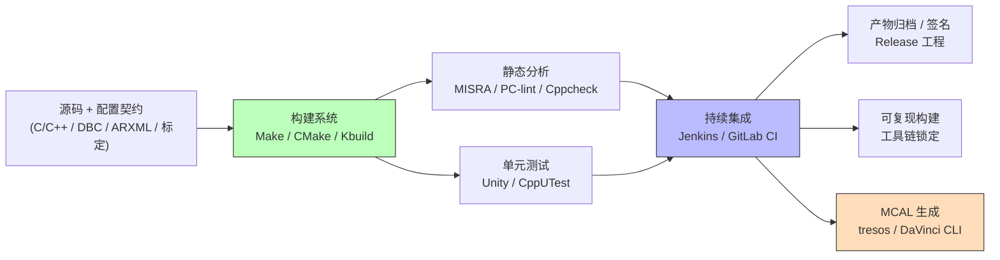
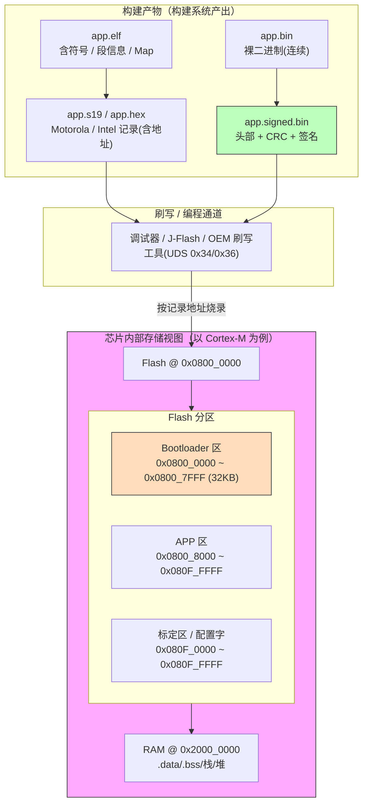
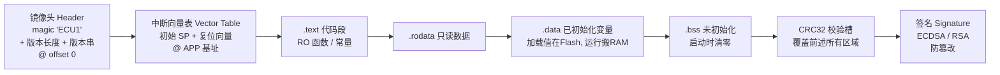
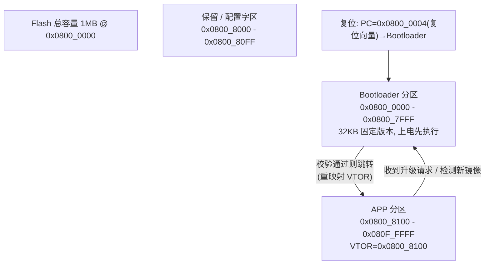
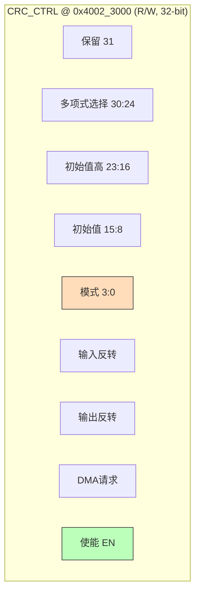
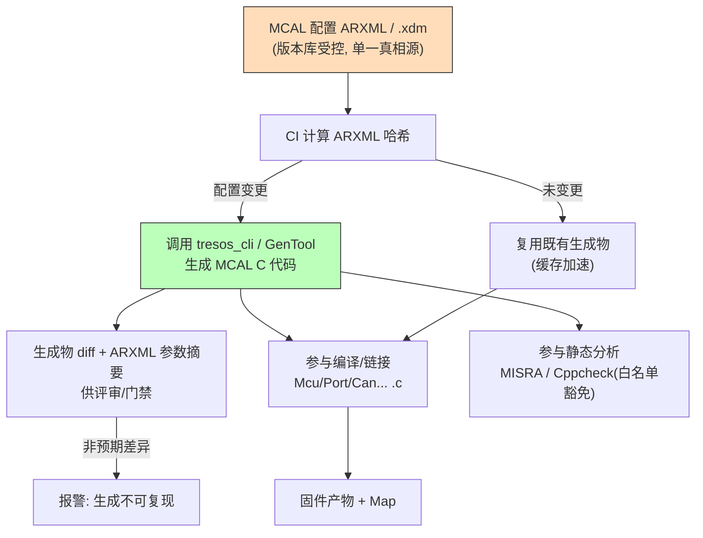
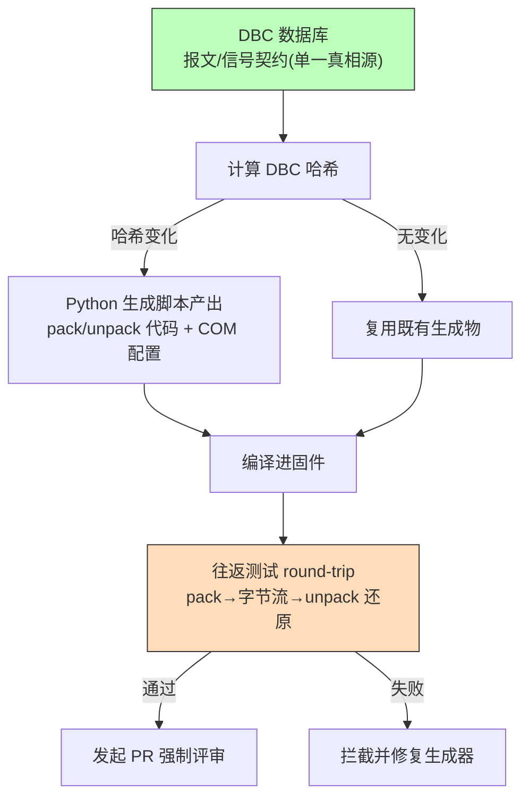
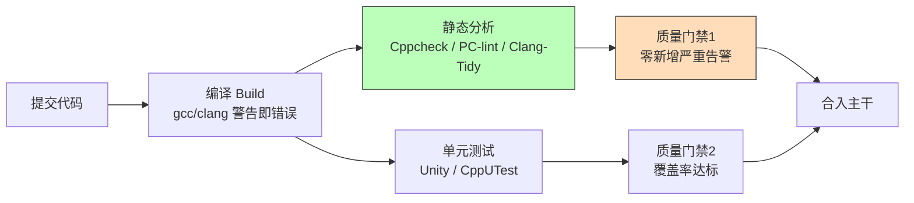
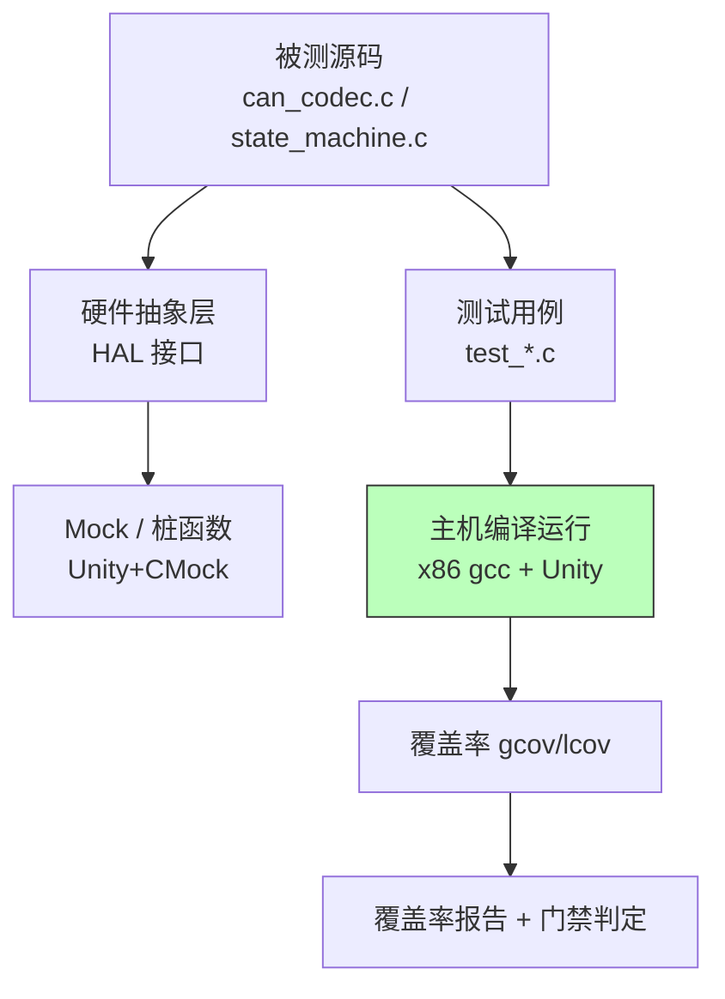
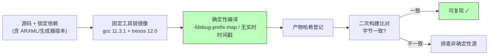

# 嵌入式工具链与构建自动化：从"人肉搬砖"到工业化交付

> 本章面向有一定嵌入式 C/C++ 开发经验的工程师，系统讲解一套可落地的嵌入式工具链与构建自动化方法论。文中的代码示例以汽车电子里最常见的 CAN/CAN FD 通信 DBC 驱动代码生成为贯穿案例，并深入芯片模块设计、驱动镜像操作与 MCAL 配置自动化三个工业级维度；但所有论述都适用于广义的嵌入式固件研发。

## 一、为什么嵌入式研发必须做工具链自动化

在很多小型项目里，工程师习惯"手动编译、手动打包、手动烧录、手动记版本号"。这种做法在产品形态简单、团队只有一两个人时尚可维持；一旦项目进入车规、工业控制、医疗设备这类对**可追溯性、可复现性、可审计性**有硬性要求的领域，手动流程就会迅速崩溃。

笔者在多个量产项目里反复验证过：嵌入式研发效率的瓶颈，往往不在"写代码"本身，而在"围绕代码的一整套周边动作"——配置生成、编译、静态检查、测试、打包、签名、归档、发布。这些动作如果依赖某个工程师的本地环境、记忆和手感，就会埋下三类系统性风险：

1. **环境漂移（Environment Drift）**：A 同事的机器上能编译通过，B 同事的机器上报一堆错；CI 服务器又是一套表现。根因通常是编译器版本、头文件路径、第三方库版本、环境变量不一致。
2. **产物不可复现（Non-reproducible Build）**：同一份源码，今天打出的固件和三个月前打出的固件二进制不一致，无法判定"线上那个 bug 到底对应哪份代码"。
3. **质量门禁形同虚设**：静态分析、单元测试只在"有空时跑"，或者只在个人机器上跑，合入主干时早已偏离质量基线。

工具链自动化的本质，是把上述"人肉动作"变成**确定性、可重复、可审计**的机器流程。它解决的不只是"省时间"，更是"让交付可信"。本章后续所有内容，都是围绕这条主线展开。

从投入产出比看，工具链自动化的回报呈典型的"前期重、后期轻"曲线：搭建 CI、写生成器、配静态分析规则，前期要投入数周甚至数月；但一旦跑通，每次提交都在自动为你工作，边际成本趋近于零。很多团队半途而废，是因为只看到前期投入、等不到后期红利。笔者的建议是：**先打通最短可用闭环（构建+单测+归档），再逐步叠加静态分析、形式化、HIL**，让团队尽早尝到"提交即被验证"的甜头，自动化才有生命力。

还有一个常被忽视的维度：**自动化是团队知识的固化**。资深工程师脑子里的"编译前要先清缓存""这个宏不能乱开""字节序要这么算""链接脚本里 Bootloader 和 APP 的分区偏移不能错"，一旦写成脚本和流水线，就变成了不依赖某个人的组织资产。人员流动时，工程能力不会随之流失——这对量产项目的长期健康，价值不亚于省下的工时。

更进一步的认知是：工具链自动化在汽车电子里已经不是"工程优化"，而是**合规刚需**。ASPICE、ISO 26262（功能安全）、ISO/SAE 21434（网络安全）都要求"构建过程受控、工具链版本固定、产物可追溯、生成物可审计"。换句话说，有没有一套可信的工具链，直接决定一份固件能不能合法地装进整车。后文芯片模块设计、MCAL 自动化、可复现构建三章，本质上都是在落地这些合规要求。

下图给出一个典型的嵌入式研发工具链全景，它也是本章论述的骨架。



---

## 二、构建系统：嵌入式工程的地基

### 2.1 为什么需要构建系统

所谓"构建系统（Build System）"，是把若干源文件、头文件、第三方库、链接脚本、汇编启动代码，按照依赖关系编译、汇编、链接成最终可执行文件（ELF/HEX/BIN/S19）的一套规则引擎。嵌入式构建比桌面软件复杂得多，原因有三：

- **交叉编译**：你在一台 x86 的 PC 上，生成的是跑在 ARM Cortex-M/R、PowerPC、RISC-V、TriCore 等目标架构上的二进制，必须引入交叉工具链（如 `arm-none-eabi-gcc`、`powerpc-elf-gcc`、`riscv32-elf-gcc`）。
- **强约束资源**：Flash、RAM 大小固定，链接脚本（`.ld` / scatter file）要精确描述内存布局；段（section）的摆放、栈堆地址、向量表位置都需人为约束，否则直接跑飞。
- **多配置矩阵**：同一份源码要面向 Debug/Release、不同芯片型号、不同硬件版本、不同客户定制产出不同固件，构建系统必须支持清晰的目标（target）与变量（variable）管理。

如果不用构建系统，仅靠 IDE 点"Build"按钮，会出现两个致命问题：一是工程配置锁死在某个 IDE 工程文件里，无法在服务器上无头（headless）构建；二是依赖关系靠 IDE 隐式推断，一旦工程膨胀到上千文件，增量编译的正确性就难以保证。

### 2.2 Make：最经典、最可控的构建引擎

GNU Make 是绝大多数嵌入式工具链的底层基石，即便是现代 IDE 的"构建"按钮，背后往往也是调用 Make。Make 的核心概念只有三个：**目标（target）、依赖（prerequisites）、规则（recipe）**。它根据文件的修改时间戳判断是否需要重建，从而实现增量编译。

一个最小可用的嵌入式 Makefile 片段如下：

```makefile
# 交叉工具链前缀（换芯片/换编译器只改这一处）
CROSS    := arm-none-eabi-
CC       := $(CROSS)gcc
OBJCOPY  := $(CROSS)objcopy
LD       := $(CROSS)ld

# 编译与链接标志：Cortex-M4 + FPU 硬浮点
CPU      := -mcpu=cortex-m4 -mthumb -mfpu=fpv4-sp-d16 -mfloat-abi=hard
CFLAGS   := $(CPU) -O2 -g -Wall -Wextra -std=c99 -ffunction-sections -fdata-sections
LDFLAGS  := -T link.ld -Wl,-Map=build/app.map -Wl,--gc-sections

# 源文件与产物（自动变量减少重复）
SRCS     := $(wildcard src/*.c)
OBJS     := $(SRCS:src/%.c=build/%.o)
TARGET   := build/app.elf

# 链接：所有 .o -> elf（自动变量 $@ 目标, $^ 依赖）
$(TARGET): $(OBJS)
	$(CC) $(LDFLAGS) -o $@ $^

# 编译：src/%.c -> build/%.o，并顺带生成 .d 依赖文件
build/%.o: src/%.c | build
	$(CC) $(CFLAGS) -MMD -MP -MF $(@:.o=.d) -c $< -o $@

build:
	mkdir -p build

# 后处理：生成可烧录的 hex 与 bin（objcopy 格式转换）
build/app.hex: $(TARGET)
	$(OBJCOPY) -O ihex $< $@

build/app.bin: $(TARGET)
	$(OBJCOPY) -O binary $< $@

# 把编译器给出的依赖纳入决策，增量编译才真正可靠
-include $(OBJS:.o=.d)

.PHONY: clean
clean:
	rm -rf build
```

这段 Makefile 展示了几个关键工程实践：

- 通过 `CROSS` 变量统一切换工具链，换芯片只需改一处。
- 使用自动变量 `$@`（目标）、`$^`（所有依赖）、`$<`（首个依赖）减少重复。
- `build/` 作为 order-only 依赖（`| build`），确保输出目录存在但不会因为目录时间戳触发全量重建。
- `-ffunction-sections -fdata-sections` 配合链接器 `--gc-sections`，可剔除未引用的函数/数据，显著压缩固件体积。
- 显式分离 `.elf`、`.hex`、`.bin` 各阶段产物，便于后续打包与归档。

Make 的缺点是：当条件分支、跨平台、复杂目录结构变多时，Makefile 会变得难读难维护；它对"跨平台探测工具链能力"支持弱。因此中大型项目通常会用 CMake 作为上层生成器，由 CMake 产出 Makefile（或 Ninja）。

需要特别强调的是 Make 的**依赖正确性**才是它最难用好的地方。很多工程师以为"改了 `.c` 文件 Make 就会重编"，却忽略了头文件（`.h`）也属于依赖。如果 Makefile 只把 `.c` 列为 `.o` 的先决条件，那么修改某个被多个模块包含的公共头文件时，Make 不会去重编那些依赖它的 `.o`，于是链接出的固件混用了新旧目标文件，出现难以排查的诡异行为。正确做法是让编译器在编译每个 `.c` 时顺带生成一份依赖文件（`.d`），典型编译参数为 `gcc -MMD -MP -MF build/foo.d`，其中 `-MMD` 生成用户头文件依赖、`-MP` 为每个头文件生成一个空的伪目标防止头文件被删除后报错。Makefile 再用 `include $(OBJS:.o=.d)` 把这些依赖纳入决策，增量编译的正确性才真正可靠。这也是"坑 2（缓存污染）"的根治手段——与其依赖人工 `make clean`，不如把依赖关系交给编译器自动维护。

另一个高频踩坑点是**变量展开时机**。Make 中 `=` 是递归展开（使用时才展开，可能出现意外递归），`:=` 是立即展开（定义时即定值为常量），`?=` 是条件赋值（仅当变量未定义才赋值，常用于允许命令行覆盖默认值如 `make CROSS=arm-none-eabi-`）。理解这三者的差异，是写出可维护 Makefile 的基本功。

### 2.3 CMake：跨平台、可移植的元构建系统

CMake 本身不编译代码，它读取 `CMakeLists.txt`，生成特定平台的构建脚本（Makefile、Ninja、Visual Studio 工程、Xcode 工程等）。它的优势在于：

1. **一套描述，多端产出**：同一份 `CMakeLists.txt` 可在 Linux 服务器（出 Ninja）、Windows 开发机（出 VS）、CI 容器里产出一致构建。
2. **工具链文件（toolchain file）**：通过 `-DCMAKE_TOOLCHAIN_FILE=arm-gcc.cmake` 把交叉编译的细节隔离出去，源码工程与工具链解耦。
3. **良好的依赖与测试集成**：原生支持 `add_test` 与 CTest，天然对接自动化测试。

一个交叉编译的 CMakeLists 片段：

```cmake
cmake_minimum_required(VERSION 3.16)
project(ecu_firmware C CXX ASM)

# 设定目标芯片与语言标准
set(CMAKE_C_STANDARD 99)
add_compile_options(-mcpu=cortex-m4 -mthumb -O2 -g -Wall -Wextra)

# 收集源文件（真实项目建议显式列出而非 GLOB，避免漏编/误编）
file(GLOB_RECURSE APP_SOURCES "src/*.c")
add_executable(${PROJECT_NAME} ${APP_SOURCES} startup.s)

# 基于目标（target-based）的精确依赖，而非全局变量
target_include_directories(${PROJECT_NAME} PRIVATE
    src inc generated)
target_compile_definitions(${PROJECT_NAME} PRIVATE
    $<$<CONFIG:Debug>:DEBUG_ENABLE>)

# 链接脚本与 Map 输出
set(LINKER_SCRIPT ${CMAKE_SOURCE_DIR}/link.ld)
target_link_options(${PROJECT_NAME} PRIVATE
    -T${LINKER_SCRIPT} -Wl,-Map=firmware.map -Wl,--gc-sections)

# 后处理：生成 hex / bin（POST_BUILD 自定义命令）
add_custom_command(TARGET ${PROJECT_NAME} POST_BUILD
    COMMAND ${CMAKE_OBJCOPY} -O ihex $<TARGET_FILE:${PROJECT_NAME}> firmware.hex
    COMMAND ${CMAKE_OBJCOPY} -O binary $<TARGET_FILE:${PROJECT_NAME}> firmware.bin
    COMMENT "Generating firmware.hex / firmware.bin")
```

CMake 把"编译选项、源文件集合、链接脚本、后处理"全部声明式表达，配合 `cmake -B build -S .` 的 out-of-source 构建，能彻底避免污染源码树。

CMake 现代写法的精髓是**基于目标（target-based）而非全局变量**。早期 CMake 常见 `include_directories()`、`add_definitions()` 这类全局指令，会污染所有目标；正确做法是用 `target_include_directories()`、`target_compile_definitions()` 把依赖精确绑定到具体目标，并通过 `PUBLIC/PRIVATE/INTERFACE` 控制传播范围——一个库把头文件路径标记为 `PUBLIC`，依赖它的可执行文件自动获得，而标记为 `PRIVATE` 的内部路径则不会泄漏。这种"接口即契约"的设计，让大型工程的依赖关系清晰且不易出错。

另一个工程利器是**生成器表达式（generator expressions）**，它允许在构建期（而非配置期）根据配置、目标属性做条件选择。例如 `target_compile_options(myapp PRIVATE $<$<CONFIG:Debug>:-O0 -g>$<$<CONFIG:Release>:-O2>)` 就能在不写冗长 `if` 分支的情况下，为 Debug/Release 自动套用不同优化等级。配合 `target_compile_features()` 声明所需 C/C++ 标准特性，CMake 还能在配置阶段就校验工具链是否满足要求，把"工具链太旧导致编译诡异失败"的问题前置到配置环节暴露。

最后，CMake 的 `find_program()` / `find_package()` 与 toolchain file 结合，能把"交叉编译器的精确路径、sysroot、专用 flags"全部封装在 `arm-gcc.cmake` 里，源码工程对这些一无所知。当项目要从 ARM 迁移到 RISC-V，只需换一个 toolchain file 并重新配置，工程描述几乎零改动——这正是构建系统可移植性的理想状态。

### 2.4 Kbuild：内核式配置驱动构建

Linux 内核与 U-Boot 使用的 Kbuild，给嵌入式工程一个值得借鉴的思路：**用配置（`.config`）驱动构建**。Kbuild 通过 `Kconfig` 描述可选项，用 `make menuconfig` 生成 `.config`，再由 Makefile 依据配置决定哪些模块编入、哪些剔除。

对资源受限的 MCU 固件，Kbuild 思路的启示是：把"功能开关、芯片型号、外设使能"做成**编译期配置**，而不是散落在 `#ifdef` 里的人肉开关。配合 CMake 的 `option()` 或构建时 `-D` 宏，可以达到同样效果。其精髓在于：构建系统应当反映"产品线的可变性"，而不是让可变性淹没在代码里。

---

## 三、芯片模块设计：从工具链视角看芯片

这是工业级嵌入式与"玩具项目"的分水岭。对资深研发效能/构建系统工程师而言，**芯片不是一块黑盒，而是构建产物的"目标存储视图"**。工具链产出的 elf/bin/s19/hex，最终都要精确落进芯片的 Flash 扇区、Bootloader 区、APP 区、标定区与配置字，并按 OEM 要求的镜像格式刷写。下面从工具链视角逐层拆解。

### 3.1 构建产物如何对应芯片存储空间

一个完整的车规固件交付，通常包含如下产物层级，它们与芯片物理存储是一一映射的：

| 构建产物 | 形态 | 对应芯片存储 | 工具链角色 |
|----------|------|--------------|-----------|
| `app.elf` | 带符号/段的 ELF | 调试与链接中间物，不直接落 Flash | 链接器输出，含所有段与符号表 |
| `app.bin` | 裸二进制 | 从链接基址开始的连续字节流 | `objcopy -O binary` 抽取 |
| `app.hex` | Intel HEX 记录 | 按地址分布的记录，含空隙 | `objcopy -O ihex` |
| `app.s19` | Motorola S-record | 跨地址段的记录，含校验和 | `objcopy -O srec` |
| `app.signed.bin` | 头部+负载+CRC+签名 | OEM 刷写目标最终镜像 | 后处理脚本拼装 |

关键认知：**`.bin` 是"从基址开始的连续字节"，它丢掉了地址信息；而 `.hex`/`.s19` 保留了地址，因此能表达"代码在 0x0800_8100、标定在 0x080F_F000"这种离散布局**。OEM 刷写工具（如 ETAS、Vector 的刷新协议栈，或 J-Flash）通常以 S19/HEX 为输入，按记录里的地址把数据烧进对应 Flash 扇区。因此，构建系统必须保证"链接脚本里的地址"与"芯片实际存储映射"严格一致，否则烧进去的代码跑不起来。

下图是"构建产物 → 刷写 → 芯片内部存储视图"的映射框图，也是本章要求的核心芯片模块架构图：



### 3.2 二进制镜像分区布局（头部 / 向量 / 段 / 校验 / 签名）

当固件被打成一个"镜像包"用于刷写时，它的内部布局必须被工具链与 Bootloader 共同约定。一个典型的可刷写镜像（image）按线性地址排布如下，这也正是工具链后处理脚本要"收尾"的字节结构：



镜像各分区常见的偏移与用途（以某 1MB Flash、APP 基址 0x0800_8000 为例）：

| 分区 | 起始偏移（相对 APP 基址） | 长度 | 内容 | 谁来写 |
|------|--------------------------|------|------|--------|
| 镜像头 | 0x0000 | 64 B | magic + 版本号 + 构建号 | 后处理脚本 |
| 向量表 | 0x0040 | 0x100~0x400 | 初始 SP / 复位 / 异常向量 | 启动汇编 + 链接脚本 |
| `.text` | 0x0400 | 可变 | 代码与只读常量 | 编译器 |
| `.rodata` | 跟随 `.text` | 可变 | 字符串 / 常量表 | 编译器 |
| `.data` | 跟随 | 可变 | 已初始化全局变量（LMA 在 Flash） | 编译器 + 启动代码搬运 |
| `.bss` | 跟随 | 可变 | 零初始化变量（运行时清零） | 启动代码 |
| CRC32 | 0x3FE0 | 4 B | 全镜像 CRC（除本槽） | 后处理脚本 |
| 签名 | 0x3FE4 | 64~256 B | 对全镜像哈希的签名 | 签名工具 / HSM |

### 3.3 Bootloader 与 APP 双分区布局

车规 MCU 普遍采用 **Bootloader + APP 双分区** 架构，以支持在线升级（OTA / 通过 UDS 刷写）。其核心约束是：

- **上电先跑 Bootloader**（固定在 0x0800_0000），它负责：校验 APP 签名/CRC、判决是跳转 APP 还是进入刷写模式。
- **APP 必须在非零偏移处**，且 APP 自己的向量表基址要通过 **VTOR（Vector Table Offset Register，`SCB->VTOR`）** 重映射到 APP 基址，否则中断会跳到 Bootloader 的向量表。
- 两个分区的**链接脚本基址必须不同**：Bootloader 的 `FLASH ORIGIN = 0x08000000`，APP 的 `FLASH ORIGIN = 0x08008000`（示例）。



实现要点（启动代码视角）：APP 的复位处理函数第一步应写 `SCB->VTOR = APP_BASE | VECT_TAB_OFFSET;`，并把 `__initial_sp` 与 `Reset_Handler` 放在 APP 向量表开头。工具链这边，链接脚本必须保证 APP 的 `.isr_vector` 段从 `0x0800_8100` 开始，否则上电后中断全错。

### 3.4 OEM 刷写对镜像格式的要求

主机厂（OEM）的刷写规范（常基于 UDS `0x34 RequestDownload` / `0x36 TransferData` / `0x37 RequestTransferExit`）对镜像格式有硬性约定，工具链必须据此后处理：

- **必须带校验**：刷写前 ECU 会计算接收数据的 CRC（常见 CRC32 或厂商自定义多项式），与镜像内嵌的 CRC 比对，不一致拒绝刷写。
- **必须带签名**：安全刷写（Secure Flashing）要求镜像经 OEM 私钥签名，ECU 用预置公钥验签，防止刷入被篡改的恶意固件。
- **地址必须合法**：传输的每段数据都带"内存地址 + 长度"，地址必须落在允许的分区（不能越界到 Bootloader 区或配置字），否则刷写工具会拒绝。
- **格式偏好 S19/HEX**：绝大多数 OEM 刷新工具以 S19 或 HEX 为输入（因为带地址），而不是裸 bin。

这就意味着：**工具链后处理不是"锦上添花"，而是"能否刷进去"的生死线**。后文第四章会给出真实可运行的 Python 后处理脚本。

### 3.5 工具链如何"理解"芯片存储映射（linker 段 → 物理地址）

链接脚本（`.ld`）是工具链"理解"芯片的唯一契约。它把编译出的**段（section）**映射到芯片的**物理存储区（memory region）**。以 GNU ld 为例：

```ld
/* link_app.ld —— APP 分区链接脚本（基址 0x0800_8100） */
MEMORY
{
  FLASH (rx)  : ORIGIN = 0x08008100, LENGTH = 0x000F7F00  /* APP 区 ~ 980KB */
  RAM   (rwx) : ORIGIN = 0x20000000, LENGTH = 0x00040000  /* 256KB RAM   */
}

SECTIONS
{
  .isr_vector :
  {
    . = ALIGN(4);
    KEEP(*(.isr_vector))      /* 向量表必须保留, 不可被 gc-sections 剔除 */
    . = ALIGN(4);
  } > FLASH

  .text :
  {
    *(.text*)                 /* 所有代码段 */
    *(.rodata*)               /* 只读数据 */
    . = ALIGN(4);
  } > FLASH

  .data :
  {
    _sdata = .;               /* 运行时(VM)地址在 RAM */
    *(.data*)
    _edata = .;
  } > RAM AT > FLASH          /* LMA(加载地址)在 Flash, VMA(运行地址)在 RAM */

  .bss :
  {
    _sbss = .;
    *(.bss*) *(COMMON)
    _ebss = .;
  } > RAM

  /* 预留 64B 元数据(版本号) 与 4B CRC 槽, 供后处理脚本写入 */
  .meta 0x0800_BF00 : { KEEP(*(.meta)) } > FLASH
  .crc  0x0800_BFE0 : { KEEP(*(.crc)) }  > FLASH

  _estack = ORIGIN(RAM) + LENGTH(RAM);  /* 栈顶 */
}
```

这份脚本清晰表达了"段 → 物理地址"的映射：`.isr_vector` 落在 APP 基址开头，`.text/.rodata` 紧随其后，`.data` 的**加载地址（LMA）在 Flash、运行地址（VMA）在 RAM**（由启动代码在 `main` 前搬运），`.bss` 在 RAM 并清零，`.meta`/`.crc` 预留给后处理。工具链正是据此把"高级语言里的全局变量"精确安置到芯片存储。

### 3.6 寄存器 / 位域视角：工具链操作的"芯片窗口"

最后，工具链后处理最常操作的芯片窗口，是**寄存器与位域**。以某 MCU 的 CRC 外设控制寄存器为例，工具链生成的镜像在烧录后，运行时会配置它来计算校验和；而刷写/签名流程本身也依赖对 Flash 配置字（Option Bytes）位域的正确理解。下面是一颗典型 CRC 模块的 32 位控制寄存器位域图：



该寄存器的关键位域语义（工具链配置 / Bootloader 计算 CRC 时必须一致）：

| 位域 | 名称 | 取值与含义 | 工具链/Bootloader 关注点 |
|------|------|-----------|--------------------------|
| 0 | EN | 1=使能 CRC 模块 | 计算前置 1 |
| 3:0 | MODE | 0=CRC32, 1=CRC16-CCITT, 2=CRC8 ... | 必须与镜像内嵌 CRC 算法一致 |
| 3 | REV_IN | 1=输入位反转 | 与 OEM 约定一致 |
| 24:30 | POLYSEL | 多项式选择 | 自定义多项式时配置 |
| 8:23 | INIT | 初始值 | 影响最终 CRC 值 |

如果工具链后处理脚本算 CRC 用的多项式/初始值，与芯片 CRC 硬件模块的位域配置不一致，那么"Bootloader 校验"就会永远失败——这正是"工具链必须理解芯片寄存器语义"的鲜活例证。

---

## 四、驱动代码实现：让工具链真正操作镜像与芯片布局

第三章建立了"工具链视角下的芯片"理论框架，本章落到**真实可读的代码**：链接脚本生成器、S19 解析与版本/CRC 注入、带签名镜像打包、以及自动化调用 MCAL 代码生成器。这些脚本是工具链操作镜像与芯片布局的"手"。

### 4.1 链接脚本生成器片段

不同芯片型号 / 不同 APP 偏移，链接脚本差异很大。与其手工维护多份 `.ld`，不如用 Python 按"分区表"生成，保证地址与芯片映射永远一致：

```python
#!/usr/bin/env python3
# gen_linker.py：根据芯片分区表生成 GNU ld 链接脚本（避免手工改地址出错）
def gen_linker(mcu: dict) -> str:
    flash_base = mcu['flash_base']   # APP 区起始, 如 0x08008100
    flash_len  = mcu['flash_len']    # APP 区长度
    ram_base   = mcu['ram_base']
    ram_len    = mcu['ram_len']
    meta_off   = mcu['meta_off']     # 预留元数据(版本号)地址
    crc_off    = mcu['crc_off']      # 预留 CRC 槽地址
    return f"""/* 由 gen_linker.py 自动生成, 请勿手工修改 */
MEMORY {{
  FLASH (rx)  : ORIGIN = 0x{flash_base:08X}, LENGTH = 0x{flash_len:08X}
  RAM   (rwx) : ORIGIN = 0x{ram_base:08X},  LENGTH = 0x{ram_len:08X}
}}
SECTIONS {{
  .isr_vector : {{ . = ALIGN(4); KEEP(*(.isr_vector)); . = ALIGN(4); }} > FLASH
  .text       : {{ *(.text*) *(.rodata*)   . = ALIGN(4); }} > FLASH
  .data       : {{ _sdata = .; *(.data*); _edata = .; }} > RAM AT > FLASH
  .bss        : {{ _sbss = .; *(.bss*) *(COMMON); _ebss = .; }} > RAM
  .meta {meta_off:#010x} : {{ KEEP(*(.meta)) }} > FLASH
  .crc  {crc_off:#010x}  : {{ KEEP(*(.crc))  }} > FLASH
  _estack = ORIGIN(RAM) + LENGTH(RAM);
}}"""

if __name__ == "__main__":
    tc3xx = dict(flash_base=0x08008100, flash_len=0x000F7F00,
                 ram_base=0x20000000, ram_len=0x00040000,
                 meta_off=0x0800BF00, crc_off=0x0800BFE0)
    open("link_app.ld", "w").write(gen_linker(tc3xx))
    print("link_app.ld 已生成")
```

### 4.2 Python 解析 S19 并注入版本号与 CRC

S19（Motorola S-record）是 OEM 刷写最常用格式。一条 S3 记录结构为：`S3` + 字节数(1B) + 地址(4B, 大端) + 数据(NB) + 校验和(1B)。校验和 = `0xFF - ((字节数 + 地址 + 数据 各字节之和) & 0xFF)`。下面脚本解析 S19 → 连续镜像 → 注入版本号与 CRC → 回写 S19，是 CI 后处理的标准样板：

```python
#!/usr/bin/env python3
# s19_postprocess.py：解析 S19, 注入版本号 + CRC, 输出可刷写 S19
# 用法: python s19_postprocess.py app.s19 app_out.s19 1.2.3
import sys, struct, hashlib

def parse_s19(path):
    """解析 S19 -> (min_addr, bytearray 镜像, 空洞以 0xFF 填充)。"""
    segments, min_a, max_a = {}, None, 0
    for raw in open(path):
        line = raw.strip()
        if not line.startswith('S'):
            continue
        rt = line[1]
        if rt in '123':                      # S1/S2/S3 数据记录(地址 2/3/4 字节)
            nbytes = {'1': 2, '2': 3, '3': 4}[rt]
            count = int(line[2:4], 16)
            addr  = int(line[4:4 + nbytes * 2], 16)
            dlen  = (count - nbytes - 1) * 2
            data  = bytes.fromhex(line[4 + nbytes * 2: 4 + nbytes * 2 + dlen])
            segments[addr] = data
            min_a = addr if min_a is None else min(min_a, addr)
            max_a = max(max_a, addr + len(data))
    size = max_a - min_a
    image = bytearray(b'\xFF' * size)        # Flash 擦除态全 1
    for addr, data in segments.items():
        off = addr - min_a
        image[off:off + len(data)] = data
    return min_a, image

def to_srecord(addr, data, rt='3'):
    """把 (addr, data) 编码为一条 S-record。"""
    addr_bytes = addr.to_bytes({'1': 2, '2': 3, '3': 4}[rt], 'big')
    payload = addr_bytes + data
    checksum = 0xFF - ((len(payload) + 1 + sum(payload)) & 0xFF)
    body = bytes([len(payload) + 1]) + payload + bytes([checksum])
    return 'S' + rt + body.hex().upper()

def main():
    src, out = sys.argv[1], sys.argv[2]
    version  = sys.argv[3] if len(sys.argv) > 3 else "0.0.0"
    base, image = parse_s19(src)

    # 1) 注入版本号: 写入预留元数据区 (链接脚本已保留 32B @ base+0x3F00)
    meta_off = 0x3F00
    ver = version.encode()[:31]
    image[meta_off:meta_off + 32] = ver + b'\x00' * (32 - len(ver))

    # 2) 计算 CRC32 (覆盖除 CRC 槽外的全部镜像), 写入预留 CRC 槽
    crc_off = 0x3FE0
    body = bytes(image[:crc_off]) + bytes(image[crc_off + 4:])
    crc  = hashlib.crc32(body) & 0xFFFFFFFF
    image[crc_off:crc_off + 4] = struct.pack('<I', crc)

    # 3) 回写 S19: 每 32 字节一条 S3 记录
    with open(out, 'w') as f:
        f.write("S008000000\n")              # S0 头(示意)
        off = 0
        while off < len(image):
            chunk = bytes(image[off:off + 32])
            f.write(to_srecord(base + off, chunk, '3') + "\n")
            off += 32
        f.write('S705' + base.to_bytes(4, 'big').hex().upper() + '00\n')  # S7 结束
    print(f"已生成 {out}: base=0x{base:08X} size={len(image)} crc=0x{crc:08X}")

if __name__ == "__main__":
    main()
```

### 4.3 生成带签名镜像（打包 / 签名）

OEM 刷写要求签名。下面脚本把 `app.bin` 封装成"头部 + 负载 + CRC + 签名"的固件包，签名调用 `openssl` 或 HSM 配套工具，最终产物供刷写工具与 ECU Secure Boot 验签：

```python
#!/usr/bin/env python3
# build_image.py：拼装带头部/CRC/签名的固件包（release 后处理）
# 用法: python build_image.py app.bin release.pem 1.2.3
import sys, struct, hashlib, subprocess

def build_image(app_bin: bytes, key_path: str, version: str) -> bytes:
    # 1) 头部: 魔数 + 版本长度 + 版本串
    header = b"ECU1" + struct.pack("<H", len(version)) + version.encode()
    payload = app_bin
    # 2) CRC32 覆盖 头部+负载
    crc = struct.pack("<I", hashlib.crc32(header + payload) & 0xFFFFFFFF)
    # 3) 签名: 对 (头部+负载+CRC) 的 SHA256 做私钥签名
    to_sign = header + payload + crc
    sig = subprocess.check_output(
        ["openssl", "dgst", "-sha256", "-sign", key_path, "-binary"],
        input=to_sign)
    return header + payload + crc + sig

if __name__ == "__main__":
    app = open(sys.argv[1], "rb").read()
    out = build_image(app, sys.argv[2], sys.argv[3])
    open("firmware.signed.bin", "wb").write(out)
    print(f"firmware.signed.bin 生成, 总大小 {len(out)} 字节, 签名 {len(out)-len(app)-8} 字节")
```

### 4.4 二进制校验脚本

刷写前或回归测试时，需要校验镜像自洽。下面脚本读取"已注入 CRC 的 bin"，重算 CRC 并与槽内值比对：

```python
#!/usr/bin/env python3
# verify_image.py：校验镜像 CRC 是否自洽（CI 质量门禁用）
import sys, struct, hashlib

def verify(bin_path, crc_off=0x3FE0):
    img = open(bin_path, "rb").read()
    stored = struct.unpack("<I", img[crc_off:crc_off + 4])[0]
    body   = img[:crc_off] + img[crc_off + 4:]
    calc   = hashlib.crc32(body) & 0xFFFFFFFF
    ok = (stored == calc)
    print(f"CRC 槽={stored:#010x} 计算={calc:#010x} -> {'PASS' if ok else 'FAIL'}")
    return ok

if __name__ == "__main__":
    sys.exit(0 if verify(sys.argv[1]) else 1)
```

### 4.5 自动化调用 MCAL 代码生成器（tresos CLI）

MCAL（微控制器抽象层）代码由 EB tresos / Vector DaVinci 这类工具基于 ARXML 配置生成。在 CI 中，必须**用命令行而非人工点击**触发生成，否则配置变更无法进入自动化验证。EB tresos 提供命令行工具 `tresos_cli`，典型调用形如（不同版本参数略有差异，请以所用 EB tresos 版本文档为准）：

```bash
#!/usr/bin/env bash
# gen_mcal.sh：CI 中调用 EB tresos CLI 生成 MCAL 代码（示例）
set -euo pipefail
TRESOS_CLI="${TRESOS_HOME}/eclipse/tresos_cli"
PROJ_DIR="mcal/my_ecu"      # 含 .xdm / ARXML 配置的工程目录
OUT_DIR="generated/mcal"

# -c : clean & generate (清理并重新生成)
# -d : 工程目录
# -o : 代码输出目录
"$TRESOS_CLI" -c -d "$PROJ_DIR" -o "$OUT_DIR"

# 若使用 Vector DaVinci Generator, 典型调用形如(参数随版本而异):
#   GenTool -p MyEcu.dpa -o generated/mcal
# 具体参数请参照所用工具版本命令行文档
echo "MCAL 代码已生成至 $OUT_DIR"
```

这些脚本让工具链"真正操作"了芯片相关的软件栈：MCAL 生成代码里包含 `Mcu`、`Port`、`Can` 等模块的寄存器配置与驱动骨架，它们最终链接进固件，并在运行时配置 3.6 节那样的寄存器位域。没有自动化调用，MCAL 配置变更就只能靠工程师手工点按钮，既不可审计也无法进 CI。

---

## 五、MCAL 配置说明：MCAL 与自动化工具链的集成

MCAL（Microcontroller Abstraction Layer，微控制器抽象层）是 AUTOSAR 架构的底层，它把芯片外设（MCU、Port、DIO、ADC、SPI、CAN、PWM、GPT 等）封装成统一接口。MCAL 代码**不是手写的**，而是由 EB tresos / Vector DaVinci Configurator 基于 **ARXML（AUTOSAR XML）** 配置生成。如何让 MCAL 的生成与验证纳入自动化工具链，是车规构建系统的硬骨头。

### 5.1 EB tresos / DaVinci 命令行代码生成接入 CI

MCAL 配置的源头是 ARXML（或工具私有工程文件），终点是 C 代码（`.c/.h`）。人工在 GUI 里点"Generate"有两个致命问题：一是配置变更无法被 CI 自动捕获；二是生成结果可能因人而异。正确做法是在 CI 中**用命令行触发生成**，并固定工具版本：

- **EB tresos**：使用 `tresos_cli`（见 4.5 节脚本），在 `build` 或独立 `mcal_gen` stage 调用，生成结果落到 `generated/mcal/`。
- **Vector DaVinci Generator**：通过 `GenTool` / `davinci` 命令行接口，以工程文件（`.dpa`）为输入产出代码。
- **版本固定**：`TRESOS_HOME` 指向构建镜像内固定版本的 EB tresos，杜绝"本地新版、CI 旧版"导致生成物漂移。

集成后在 CI 中的典型位置是"构建之前"——先生成 MCAL 代码，再把它当作普通源文件编进固件。

### 5.2 MCAL 配置版本管理与 ARXML 差异比对

ARXML 是 MCAL 配置的"单一真相源"，必须进版本库（Git）受控。但 ARXML 是冗长 XML，人工 review 极难发现"把 CAN 波特率从 500k 改成 250k"这类关键变更。笔者的实践是：

- **配置即代码**：ARXML / `.xdm` 一律入库，变更走 MR/PR。
- **ARXML 差异比对**：在 CI 中跑一个 diff 脚本，把本次变更的配置项提取成"可读的键值摘要"再做比对，让 reviewer 一眼看到"哪些 MCAL 参数变了"，而非对着几千行 XML diff。

```python
#!/usr/bin/env python3
# arxml_diff.py：提取 ARXML 关键 MCAL 参数, 输出可读 diff（CI review 辅助）
import sys, re

def extract_params(arxml_path):
    """极简示例: 抽取 <PARAMETER> 的 NAME/VALUE 键值对。"""
    text = open(arxml_path, encoding="utf-8").read()
    # 真实场景用 lxml/ElementTree 按 AUTOSAR schema 解析 ECUC 参数
    pairs = {}
    for m in re.finditer(r'NAME="([^"]+)"[^>]*>.*?<VALUE>([^<]+)</VALUE>', text, re.S):
        pairs[m.group(1)] = m.group(2).strip()
    return pairs

def diff(base, new):
    pb, pn = extract_params(base), extract_params(new)
    for k in sorted(set(pb) | set(pn)):
        if pb.get(k) != pn.get(k):
            print(f"[DIFF] {k}: {pb.get(k)} -> {pn.get(k)}")

if __name__ == "__main__":
    diff(sys.argv[1], sys.argv[2])
```

- **生成物比对**：每次生成后，把 `generated/mcal/` 与上次提交比对，若有非预期差异（如工具自动插入时间戳），CI 报警，防止"不可复现的生成"。

### 5.3 MCAL 生成代码参与编译 / 链接 / 静态分析的环节

MCAL 生成的 `.c` 不是"生成完就完事"，它要完整走完工具链的所有质量环节：

1. **编译**：生成代码与手写应用代码一起进 CMake/Make 编译，共用同一套编译 flags（含 `-Wall -Werror`）。
2. **链接**：MCAL 提供外设驱动实现，与应用通过 AUTOSAR 接口链接；其段布局也受同一链接脚本约束（如 `Mcu` 的段落在 Flash）。
3. **静态分析**：MCAL 生成代码往往有"为了对齐硬件而做的类型转换/位操作"，是 MISRA 豁免高发区。必须把生成代码纳入静态分析，但对其已知合理的豁免做**白名单管理**（见 4.2.a 偏离管理），不可整体跳过——否则等于放弃了这部分代码的质量门禁。
4. **单元测试**：MCAL 内部逻辑通常与硬件强耦合，单测需借助 fake 寄存器映射；而 MCAL 之上的应用（如 CanIf 调用）则可在 PC 上测。

### 5.4 构建系统中 MCAL 模块配置项与产物（表格）

下表给出常见 MCAL 模块、其关键配置项、生成产物，以及在构建系统里的落点——这是"构建系统如何组织 MCAL"的实操清单：

| MCAL 模块 | 关键配置项（ARXML） | 生成产物 | 构建系统落点 | 典型静态分析关注 |
|-----------|--------------------|----------|--------------|------------------|
| **Mcu** | 时钟树、PLL、复位原因、低功耗模式 | `Mcu.c/.h`、寄存器初始化序列 | 启动早期调用 | 魔法数、类型转换 |
| **Port** | 引脚复用、方向、上下拉 | `Port_Cfg.c` | 初始化阶段 | 数组越界 |
| **Dio** | 通道映射 | `Dio.c` | 运行时 | 无特别 |
| **Adc** | 采样组、触发源、分辨率 | `Adc_Cfg.c` | 应用调用 | 缓冲区溢出 |
| **Spi** | 波特率、片选、DMA | `Spi_Cfg.c` | 通信驱动 | 空指针 |
| **Can / CanIf** | 波特率、邮箱、FD 使能 | `Can_Cfg.c`, `CanIf_Cfg.c` | 通信栈底层 | MISRA 类型转换豁免 |
| **Pwm / Gpt** | 周期、通道 | `Pwm_Cfg.c` | 定时相关 | 无特别 |
| **Os（部分）** | 任务、告警、栈 | `Os_Cfg.c` | 调度核心 | 栈溢出风险 |

### 5.5 可复现构建与工具链版本固定（MCAL 维度）

MCAL 让"可复现构建"更难，因为生成代码依赖**生成器版本**。同一份 ARXML，用 EB tresos 11.3 与 12.0 可能产出不同 `.c`（注释、宏名、代码顺序差异），进而二进制漂移。因此：

- **生成器版本锁定**：把 `TRESOS_HOME` 固化到构建镜像（如 `registry.internal/embedded-toolchain:11.3-with-tresos12.0`），CI 与本地强制同版。
- **生成物纳入比对**：把 `generated/mcal/` 当成"准源码"，与 Git 中登记的基线比对，差异即报警。
- **二次生成验证**：关键发布时，对 ARXML 做两次独立生成，比对生成代码逐字节一致，确保"生成器本身可复现"。

下图是 MCAL 生成与 CI 集成的端到端流程：



---

## 六、自动化脚本：生成 / 版本注入 / 打包（深化）

构建系统解决了"怎么编译"，但嵌入式研发还有大量"编译之外的重复动作"——代码生成、版本号注入、固件打包签名、产物归档。这些动作若手工完成，既慢又易错，必须交给脚本。

### 6.1 代码生成：以 DBC 驱动 CAN 通信代码为例

笔者认为，代码生成是嵌入式自动化里投资回报最高的一环。下面以汽车电子中最典型的场景为例。

整车几十个节点、上百条 CAN/CAN FD 报文，每条报文十几个信号，每个信号有起始位、长度、因子、偏移、字节序。传统做法是在 DaVinci Configurator 这类商用工具里鼠标点选：建报文、填 ID、拖信号、选字节序、设周期……一条复杂报文配下来半小时，全量配完耗掉一整个工作日。更糟的是，只要 DBC（CAN 数据库，整车通信契约）一变更，所有改动要手动重做，点错一个起始位，联调时就变成"信号对不上"的玄学 Bug。

DBC 本质是描述整车 CAN 通信的"单一真相源（Single Source of Truth）"，它定义了两层：

- **报文层**：`ID`（11 位标准帧 / 29 位扩展帧）、`DLC`（数据长度）、发送周期、发送节点。
- **信号层**：每个物理量（如电池总压）有起始位、长度、因子、偏移（`物理值 = 原始值 × factor + offset`）、单位、字节序（Motorola 大端 / Intel 小端）。

既然 DBC 是契约，那通信代码就该由 DBC 驱动生成，而不是手工点选。笔者用 Python 写了个解析 DBC、自动产出 pack/unpack 编解码代码的脚本，把一整天压缩到半小时。其核心难点在于**字节序**：DBC 里的 "Motorola 格式"实际是大端（跨字节高位在前）位布局，"Intel 格式"是小端（低字节在前），两种布局下同一信号落在字节流的 bit 排列完全不同，生成算法必须区分。

Python 解析与编解码示意：

```python
class Signal:
    def __init__(self, name, start_bit, length, byte_order,
                 factor, offset, is_signed):
        self.name = name
        self.start_bit = start_bit          # DBC 中的起始位
        self.length = length                # 位宽
        self.byte_order = byte_order        # 0=Motorola(大端), 1=Intel(小端)
        self.factor = factor
        self.offset = offset
        self.is_signed = is_signed

def pack_signal(value, sig):
    """物理值 -> 原始无符号整数（已线性变换）"""
    raw = int(round((value - sig.offset) / sig.factor))
    if sig.is_signed:
        raw &= (1 << sig.length) - 1       # 按位宽截断为补码
    return raw

def unpack_signal(raw, sig):
    """原始整数 -> 物理值，含符号扩展"""
    if sig.is_signed and raw & (1 << (sig.length - 1)):
        raw -= (1 << sig.length)
    return raw * sig.factor + sig.offset
```

真正"写入字节流指定 bit 区间"的算法要针对 Motorola/Intel 分别处理跨字节位序，生成代码通常展开成位操作宏。例如 `start_bit=7, length=12` 的 12 位电池总压信号：Intel 从 bit 7 起向高位连续 12 位跨 2~3 字节、低字节在前；Motorola 最高位落在 start_bit 所在字节高位、向低字节延伸，位序与 Intel 镜像。两套算法写反就会全车信号错位。

收益是结构性的：省时、少错、可维护（DBC 与代码强绑定，review 直接 diff DBC）、双协议复用（CAN 与 CAN FD 共用一套生成管线，把"是否 FD 帧"做成标定变量，写控制器时动态设 `FDF`/`BRS` 标志，一套代码一次编译覆盖双协议）。



> **关键工程纪律**：生成器本身也要有单元测试和 CI。因为"生成物错误"比"手写错误"更隐蔽——它会批量污染所有信号。必须通过往返测试（给定物理值 pack 成字节流再 unpack 还原，必须与原值一致）和官方 DBC+已知报文 hex 对照来兜底。

需要强调的是，代码生成器不是"写完就一劳永逸"的组件。它会随需求演进：新增信号类型、支持 CAN XL、变更字节序约定、对接新的 AUTOSAR 版本。每一次生成器改动，都可能让"昨天还正确的生成物"今天出错。因此生成器的测试套件必须**锁定一组黄金向量（golden vectors）**——即官方提供的、权威的 DBC 与对应 hex 报文样本，生成器重构前后产出的字节流必须逐 bit 一致。这相当于给生成器自己上了一道"可复现"保险，否则生成器本身的回归会反过来成为新的风险源。

此外，生成物（generated code）**不应**手工再编辑，而应标注清晰的"本文件由脚本自动生成，请勿手工修改"头注释，并在版本库中将其标记为生成物（或用 `.gitattributes` 标注 `linguist-generated`），避免 reviewer 在生成物上做无谓的人工评审，也防止有人悄悄手改生成物导致"源契约与代码再次脱节"。

### 6.2 版本号注入：让每个固件可溯源

量产固件必须能通过版本号、构建时间戳、Git 提交哈希定位"这份二进制对应哪份源码"。手写版本号极易漏改，正确做法是**构建时自动注入**：

```bash
#!/usr/bin/env bash
# gen_version.sh：从 Git 与构建环境生成 version.h
set -euo pipefail

GIT_SHA=$(git rev-parse --short HEAD)
GIT_TAG=$(git describe --tags --always 2>/dev/null || echo "untagged")
# 注意: 为支持可复现构建, 构建时间用"源码最后一次提交时间"而非实时时间
BUILD_TIME=$(git log -1 --format=%cI 2>/dev/null || date -u +"%Y-%m-%dT%H:%M:%SZ")
BUILD_NUM=${CI_PIPELINE_ID:-local}

cat > src/version.h <<EOF
#ifndef VERSION_H
#define VERSION_H
#define FW_GIT_SHA   "${GIT_SHA}"
#define FW_GIT_TAG   "${GIT_TAG}"
#define FW_BUILD_TIME "${BUILD_TIME}"
#define FW_BUILD_NUM  "${BUILD_NUM}"
#endif
EOF
echo "version.h 已生成: ${GIT_TAG} @ ${GIT_SHA}"
```

把这个脚本挂到构建系统的 pre-build 阶段，固件运行时即可通过诊断服务（如 UDS `0x22` ReadDataByIdentifier）把版本号上报给诊断仪，实现"线上问题秒级定位源码"。

### 6.3 二进制打包、签名与产物归档

车规固件交付往往不是裸 `.bin`，而是带头部元数据、校验和、签名、分区信息的**固件包（firmware image / update package）**。Python 非常适合做这类二进制拼装与签名（完整实现见第四章 4.3 节 `build_image.py`）。签名确保固件来源可信、防止刷写被篡改（配合 MCU 的 Secure Boot / HSM 验签）。产物归档则要把固件、Map 文件、elf、hex、版本信息、静态分析报告一并存入制品库（Artifactory / Nexus / GitLab Package），并以版本号作为不可变索引，满足功能安全对"交付物可追溯"的审计要求。

---

## 七、静态分析与 MISRA：把缺陷挡在编译之前

嵌入式软件（尤其功能安全领域）对缺陷零容忍。静态分析（Static Analysis，SAST）能在不运行代码的情况下，扫描出空指针解引用、数组越界、未初始化变量、危险类型转换、违反编码规范等问题。它是 CI 里**最早、最便宜**的质量门禁。

### 7.1 主流静态分析工具对比

下表横向对比常见工具的能力定位。需注意：没有任何单一工具能覆盖全部，工程上通常**组合使用**（轻量开源做日常、商业工具做认证级合规）。

| 工具 | 类型 / 许可 | 核心能力 | MISRA 支持 | 适用阶段 | 典型特点 |
|------|------------|----------|-----------|----------|----------|
| **PC-lint / PC-lint Plus** | 商业（Gimpel） | 深度规则检查、跨模块分析 | 完整 MISRA C/C++ | 本地 + CI | 规则极细，误报需精心配置 |
| **Cppcheck** | 开源（GPL） | 空指针、越界、泄漏、未初始化 | 部分 MISRA C 2012 | 本地 + CI 日常 | 零 cost 接入，速度快 |
| **Clang-Tidy** | 开源（LLVM） | 现代 C++ 规范、可定制检查、自动修复 | 非 MISRA 专攻 | 本地 + CI | 与 clang 生态无缝，修复建议友好 |
| **Helix QAC (原 PRQA)** | 商业 | 认证级 MISRA/ISO 26262 合规 | 完整 MISRA C/C++ 2012/2023 | 认证项目 | 可出合规证据报告 |
| **Polyspace (Bug Finder / Code Prover)** | 商业（MathWorks） | 抽象解释/形式化验证、运行时错误证明 | 支持 + 安全相关 | 高安全等级 | Code Prover 能"证明"无某类运行时错误 |
| **SonarQube** | 商业/开源版 | 技术债务、重复率、覆盖率、质量门 | 通用为主 | 代码质量平台 | 看板化、趋势跟踪、门禁卡点 |

### 7.2 工具选型与用法要点

**PC-lint / PC-lint Plus**：老牌 C/C++ 静态分析器，规则库极其庞大，对 MISRA C:2004 / C:2012 / C++:2008 有完整覆盖。但它对工程配置（包含路径、宏定义、编译器模拟）要求高，需要写 `.lnt` 配置文件。实践中常见误区是"开全规则导致几千条告警"，正确做法是**先选子集、逐步收紧**，并以 `//lint !eXXX` 抑制需在代码评审中留痕的豁免。

**Cppcheck**：开源、零许可成本，适合作为团队"日常第一道关"。它擅长找空指针、越界、内存泄漏、未初始化变量。虽然 MISRA 覆盖不如商业工具完整，但配合 `--enable=all --addon=misra` 已能覆盖大量规则，是性价比最高的入门选择。

**Clang-Tidy**：基于 Clang AST，不仅检查还能自动修复（`-fix`）。它对现代 C++（智能指针、移动语义、gsl 约束）支持最好，是 C++ 项目的首选。但它不是 MISRA 专用，车规 MISRA 合规需另配商业工具。

**Polyspace**：独特之处在于**形式化方法（抽象解释）**。Polyspace Code Prover 不是"报可能的问题"，而是能**在数学上证明**某段代码"永远不会发生除零 / 数组越界 / 溢出"等运行时错误，或精确指出哪些路径会。这对 ASIL-D 这类高安全等级项目价值巨大，因为它提供了接近"证明级"的证据，而非统计式告警。Polyspace Bug Finder 则偏向传统的缺陷与漏洞（CWE）扫描。

**QAC（Helix QAC）**：面向认证场景，能输出符合 ISO 26262 / IEC 61508 要求的合规报告，是车企与 Tier-1 做 MISRA 认证时最常被审计方认可的工具之一。

**SonarQube**：更像一个"质量看板"，跟踪技术债务、重复代码、测试覆盖率趋势，并通过 Quality Gate 做门禁。它一般不单独承担 MISRA，而是作为团队质量文化的中枢。

### 7.2.a MISRA 规则体系与落地实践

MISRA（Motor Industry Software Reliability Association）C/C++ 是一套针对安全关键嵌入式软件的编码规范，当前主流版本是 MISRA C:2012（及 2023 修订）与 MISRA C++:2008。它的价值在于：C 语言充满"未定义行为（Undefined Behavior）"和"实现定义行为（Implementation-defined Behavior）"的灰色地带，而 MISRA 通过成百上千条规则把这些危险用法（如数组越界访问、有符号无符号混用、函数指针滥用、禁止 `goto` 跨层跳转等）逐一禁止或限制，从源头降低缺陷。每条规则有三类分类：

- **Required（强制）**：默认必须遵循，偏离需书面偏离申请（deviation）并经评审。
- **Advisory（建议）**：推荐遵循，可酌情偏离。
- **Mandatory（强制且不可偏离）**：连偏离申请都不接受，如禁止使用 `setjmp`/`longjmp` 的某些形式。

工程落地的关键不是"开着 MISRA 跑一遍"，而是**建立偏离管理流程**。由于 MISRA 某些规则在真实项目中难以 100% 满足（例如为对接硬件寄存器必须做特定类型转换），团队需维护一份"偏离记录（Deviation Record）"，说明每条偏离的理由、风险分析与审批人。审计方在功能安全认证时，正是依据这份偏离记录判断项目是否合规。工具（如 QAC、PC-lint Plus）支持把豁免用注释（如 `/* MISRA DEVIATION: Rule 11.3 */`）标注，使偏离可追溯而非偷偷摸摸地关掉检查。MCAL 生成代码（见第五章）的豁免尤其要纳入白名单管理。

**PC-lint 配置要点**：PC-lint 通过 `.lnt` 文件指定包含路径（`-i`）、宏定义（`-D`）、编译器模拟（`-co-gcc` 等）与规则开关（`+eXXX` 开启、`-eXXX` 关闭）。刚接入时建议先用 `-w1` 低警告级别跑通，再逐步提到 `-w4` 并开启 MISRA 附加包（`-misra(...)`），否则一次性几千条告警会让团队失去信心。Cppcheck 则简单得多，`--enable=warning,style,performance,portability --addon=misra` 即可，配合 `--suppress` 或代码内 `// cppcheck-suppress` 注释管理豁免。

### 7.3 静态分析在流水线中的位置

静态分析应当放在**编译通过之后、单元测试之前**（或并行），因为它能在最早阶段拦截一批"编译能过但逻辑危险"的问题，且不依赖目标硬件。下图给出它在端到端流水线中的嵌入位置。



> 工程经验：把编译器警告（`-Wall -Wextra`）也当作错误（`-Werror`）处理，是成本最低、收益最高的"准静态分析"。很多空指针、未使用、类型截断问题在编译期就能发现。但需注意：第三方代码（如 MCAL 生成代码、开源库）的告警可能阻断构建，应通过编译白名单（`-isystem` 目录、`#pragma` 抑制）隔离，而非整片关闭检查。

---

## 八、单元测试自动化：在 PC 上验证嵌入式逻辑

嵌入式单元测试的经典难题是：**被测代码跑在 MCU 上，但测试框架跑在 PC 上**。解法是用"硬件抽象层（HAL）+ Mock/桩函数"把底层依赖（寄存器、外设、RTOS API）隔离，使纯逻辑（状态机、协议编解码、算法）能在主机上用 x86 编译运行测试。

### 8.1 Unity / CppUTest 框架定位

- **Unity**：轻量级 C 测试框架，单头单源文件即可集成，适合资源紧张、只做断言的小项目。配合 **CMock** 可自动生成 Mock 桩。
- **CppUTest**：C/C++ 测试框架，内置 Mock 支持、内存泄漏检测，对 C++ 项目更友好，社区在嵌入式圈活跃。

以 Unity 测试前文 DBC pack/unpack 为例：

```c
#include "unity.h"
#include "can_codec.h"

static Signal_t volt = { .name="Vbat", .start_bit=7, .length=12,
                         .byte_order=BO_MOTOROLA, .factor=0.1,
                         .offset=0, .is_signed=0 };

void test_pack_unpack_roundtrip(void) {
    uint8_t buf[8] = {0};
    int16_t raw = pack_signal(120.0f, &volt, buf);   // 120V
    float back = unpack_signal(buf, &volt);
    TEST_ASSERT_FLOAT_WITHIN(0.05f, 120.0f, back);
}

void test_known_vector(void) {
    /* 与官方 DBC + 已知报文 hex 对照 */
    uint8_t expect[8] = {0x00,0x78,0x00,0x00,0x00,0x00,0x00,0x00};
    uint8_t out[8] = {0};
    pack_signal(120.0f, &volt, out);
    TEST_ASSERT_EQUAL_HEX8_ARRAY(expect, out, 8);
}
```

这类**往返测试（round-trip）**与**已知向量对照测试**，是通信编解码代码的生命线——它能在合入前抓住"字节序写反""符号位漏判"等隐性错误。

### 8.2 测试替身（Test Doubles）与覆盖率

在 PC 上测 MCU 代码，关键是把"不可控的依赖"替换成"可控的替身"。常见的测试替身有四类：**桩（stub）**只提供固定返回值；**伪实现（fake）**是有简单逻辑但非生产级的轻量实现（如内存版的寄存器映射）；**模拟（mock）**能验证"调用是否发生、参数是否正确"（Unity+CMock 即此类）；**间谍（spy）**记录被调用的历史供断言。对 CAN 通信这类逻辑，通常用 fake 实现一个内存中的"虚拟 CAN 控制器"，让代码以为自己在发真实报文，实则写入内存缓冲区，测试再断言缓冲区内容。

覆盖率指标要区分层次理解：**行覆盖（line coverage）**只说明"这行被执行过"，不代表逻辑被测全；**分支覆盖（branch coverage）**进一步看 if/else 两路是否都走到；**MC/DC（修正条件判定覆盖）**是航空/高安全领域的强硬要求，要求每个条件独立影响判定结果。对 ASIL-D 这类等级，MC/DC 往往必须达到 100%。但覆盖率本身不是目的——**"为了覆盖率而补无意义测试"**是常见反模式，门禁应关注"关键逻辑的覆盖"，而非盲目追求数字。

### 8.3 测试左移与构建系统集成

把测试尽可能"左移"到开发期：本地提交前先跑单测（用 git pre-commit hook 或 IDE 集成），CI 再跑完整套。这样大部分问题在工程师自己的机器上就被发现，CI 只兜底集成层面的冲突。测试脚本与构建系统同源（都写在 `CMakeLists`/`Makefile` 里），新人 clone 后一条 `make test` 即可复现全部验证，这也是可复现理念在测试维度的延伸。



---

## 九、持续集成：把质量门禁变成流程铁律

持续集成（CI）的核心主张是：**频繁地把代码合入共享主干，并自动地、彻底地验证每一次变更**。对嵌入式而言，CI 还要解决"无头交叉编译""无硬件也能测逻辑""产物可追溯"三件事。

### 9.1 Jenkins：自建可控的 CI 引擎

Jenkins 是老牌、插件极其丰富的自建 CI。它的优势是**完全可控**——可装在隔离内网、对接私有制品库、定制构建节点（含带硬件的"烧录节点"）。常用 `Jenkinsfile`（Declarative Pipeline）声明流水线：

```groovy
pipeline {
    agent { label 'embedded-builder' }
    stages {
        stage('Checkout')   { steps { checkout scm } }
        stage('MCALGen')    { steps { sh './tools/gen_mcal.sh' } }   // 先生成 MCAL
        stage('Build')      { steps { sh 'make all' } }
        stage('StaticAnalysis') {
            steps { sh 'cppcheck --enable=all --addon=misra src' }
        }
        stage('UnitTest')   { steps { sh 'make test && gcovr -r . --threshold 80' } }
        stage('Archive')    {
            steps { archiveArtifacts artifacts: 'build/*.hex,build/*.bin,firmware.map' }
        }
    }
    post { failure { slackSend channel:'#ecu-ci', message:'构建失败!' } }
}
```

### 9.2 GitLab CI：与代码仓库一体的流水线

GitLab CI 把流水线定义写在仓库内的 `.gitlab-ci.yml`，与代码同源、同源版本管理，是当下很多团队的首选。一个嵌入式 CI 配置示例：

```yaml
stages:
  - mcal_gen
  - build
  - analyze
  - test
  - release

variables:
  CROSS: "arm-none-eabi-"
  TRESOS_HOME: "/opt/eb/tresos12"

mcal_generate:
  stage: mcal_gen
  image: registry.internal/embedded-toolchain:11.3-with-tresos12
  script:
    - ./tools/gen_mcal.sh
  artifacts:
    paths: [generated/mcal/]
    expire_in: 7 days

build_firmware:
  stage: build
  image: registry.internal/embedded-toolchain:11.3-with-tresos12
  needs: [mcal_generate]
  script:
    - cmake -B build -S . -DCMAKE_TOOLCHAIN_FILE=arm-gcc.cmake
    - cmake --build build --target all
    - python tools/s19_postprocess.py build/app.s19 build/app.s19 version  # 注入版本/CRC
  artifacts:
    paths: [build/firmware.hex, build/firmware.bin, firmware.map]
    expire_in: 30 days

static_analysis:
  stage: analyze
  script:
    - cppcheck --enable=all --addon=misra --xml src 2> cppcheck.xml
    - clang-tidy src/*.c -p build
  allow_failure: false

unit_test:
  stage: test
  script:
    - make test
    - gcovr -r . --fail-under-line 80
  coverage: '/TOTAL.*\s+(\d+\%)/'

release_tag:
  stage: release
  rules:
    - if: '$CI_COMMIT_TAG =~ /^v\d+\.\d+\.\d+$/'
  script:
    - python tools/build_image.py build/firmware.bin keys/release.pem $CI_COMMIT_TAG
    - curl --upload-file release/firmware.signed.bin "$PACKAGE_REGISTRY_URL/"
```

### 9.3 CI 阶段设计与触发条件

下表给出一套成熟嵌入式 CI 的阶段划分与门禁设置参考：

| 阶段 | 主要动作 | 触发条件 | 质量门禁（卡点） | 典型耗时 |
|------|----------|----------|------------------|----------|
| **MCAL Gen** | 命令行生成 MCAL 代码 + 生成物 diff | 每次 push / MR | 生成物与基线可比、无意外差异 | 1–5 min |
| **Build** | 交叉编译、出 elf/hex/bin/map | 每次 push / MR | 编译零错误零警告（`-Werror`） | 1–10 min |
| **Static Analysis** | Cppcheck / PC-lint / Clang-Tidy / MISRA | 每次 push / MR | 零新增严重/阻塞级告警 | 2–15 min |
| **Unit Test** | 主机编译跑 Unity/CppUTest | 每次 push / MR | 行覆盖 ≥80%、全部用例通过 | 1–5 min |
| **Integration** | 软件在环 / 仿真（如 SiL、CANoe） | MR 合并前 / 定时 | 关键场景用例通过 | 10–60 min |
| **Release** | 打包、签名、归档、出 SBOM | 仅打 tag（`vX.Y.Z`） | 签名校验通过、SBOM 完整 | 2–10 min |

**触发条件**设计要点：

- **Push / MR 触发**轻量检查（build + 静态分析 + 单测），保证"合并前健康"。
- **主干（main）合并后**触发较重检查（集成测试、形式化分析 Polyspace），避免拖累日常开发节奏。
- **打 Tag 触发** Release 流程，且 Release 必须走"受保护分支 + 双人审批"，防止误操作发布。
- **定时（nightly）触发**全量深度分析（如完整 MISRA + Polyspace Prover），把耗时动作放到夜间。

### 9.3.a 构建节点与硬件在环编排

CI 不是只有"编译服务器"。成熟的嵌入式 CI 通常包含三类节点：**构建节点（builder）**负责无头交叉编译；**测试节点（tester）**在主机上跑单元测试与仿真；**硬件节点（HIL，Hardware-In-the-Loop）**则挂着真实 ECU 或仿真板，用于烧录固件、跑总线仿真（CANoe/CANalyzer）、做故障注入。HIL 节点数量有限且昂贵，因此 CI 编排上要让轻量检查（build/静态/单测）先快速失败，只有这些全过才占用 HIL 资源，避免把宝贵硬件卡在"连编译都过不了"的任务上。

此外，**流水线应支持手动与自动双通道**：日常 push 走全自动快速通道；而 Release 这类高风险动作必须加入人工审批卡点（GitLab 的 `when: manual` 或 Jenkins 的 `input` 步骤），确保"谁批准了这次发布"可审计。把"自动验证"与"人工决策"分层，既保速度又保安全。

### 9.4 质量门禁（Gate）为什么必须"卡"

门禁的价值不在于"多了个检查"，而在于它把"质量决策"从"人的自觉"变成"流程的强制"。一个常见反模式是：静态分析报了几百条历史告警，团队视而不见，新告警也混在里面。正确做法是**基线冻结 + 增量卡点**——历史告警登记为基线，门禁只拦截"本次变更新增的严重告警"，并随着时间逐步消减基线。这样门禁才不会"狼来了"。

---

## 十、可复现构建：让"线上那份固件"永远能追到源码

可复现构建（Reproducible Build）指：给定相同的源码、相同的构建环境、相同的构建指令，**任何人、在任何机器上都能得到字节级一致的二进制**。对嵌入式量产，这是安全与合规的底线。

### 10.1 工具链版本固定

最隐蔽的不一致来自编译器本身。GCC 10 与 GCC 11 对同一份代码可能产出不同汇编（尤其涉及浮点、内联、优化时）。工程上必须：

- **锁定工具链版本**：用 Docker 镜像或 SDK 包固定 `gcc` 精确版本（如 `arm-none-eabi-gcc 11.3.1`），CI 与本地强制使用同一镜像。
- **固定第三方库与头文件**： vendoring（把依赖源码纳入仓库）或用锁文件固定版本，避免"某天上游更新导致行为变化"。
- **文档化构建环境**：README / `BUILD.md` 写明工具链、依赖、命令，新人一条命令拉起环境。
- **固定 MCAL 生成器版本**：如第五章所述，EB tresos / DaVinci 版本也必须锁定，否则生成代码差异导致二进制漂移。

工具链版本固定可汇总为一张"受控清单"表：

| 组件 | 固定方式 | 示例 | 漂移后果 |
|------|----------|------|----------|
| 交叉编译器 | 构建镜像固化 | `arm-none-eabi-gcc 11.3.1` | 汇编差异、行为变化 |
| 链接器 / objcopy | 随编译器同版 | `ld 2.38` | 段布局/记录格式差异 |
| MCAL 生成器 | 镜像固化 + 版本变量 | `EB tresos 12.0` | 生成代码差异 |
| 第三方库 | vendoring / 锁文件 | `lwip 2.1.3` | API/行为变化 |
| 构建脚本 | 进版本库 | `Makefile/CMakeLists` | 流程变化 |

### 10.2 确定性输出

即使工具链固定，以下因素仍会导致二进制漂移：

- **时间戳 / 嵌入的构建时间**：前述版本注入若写"当前时间"，每次构建都不同。应改为：以源码最后一次 Git 提交时间作为构建时间，或干脆不嵌入时间，用 Git SHA 定位（见 6.2 节脚本）。
- **路径泄露**：调试信息里可能含绝对路径。用 `-fdebug-prefix-map=旧路径=归一化路径` 抹平。
- **并行/无序**：某些链接器按输入文件顺序影响段布局。需固定输入顺序或使用确定性链接选项。
- **S19/HEX 记录顺序**：后处理脚本生成记录的切片顺序必须固定（如 4.2 节按地址升序 32 字节/条），否则同一 bin 会产出不同的 S19。



### 10.2.a 如何验证可复现性

可复现不是"宣称"，而要"证明"。团队应建立**二次构建比对（reproducible verification）**机制：在 CI 中，对关键发布版本做两次独立构建（最好由不同机器、甚至不同人触发），对产出的 `.bin` 计算哈希并比对。若不一致，说明存在非确定性来源，必须排查到底——常见元凶依次是：嵌入了实时时间戳、调试信息里的绝对路径、链接器对输入顺序敏感、并行编译写入了带随机名的临时段。只有两次构建字节级一致，这份固件才真正"可复现"，也才能在出现线上问题时，确信手里的源码就是那份二进制的唯一真相。

需要澄清一个常见误解：**可复现构建不等于开源**。很多商业嵌入式项目并不公开源码，但内部仍需可复现——它服务于"自己能在任何时候重建出与发布一致的固件"，是审计、回滚、缺陷复现的基础，与是否对外开源无关。

### 10.3 供应链安全

嵌入式固件越来越多地引入开源组件（协议栈、加密库、RTOS），供应链攻击面随之扩大。可复现构建是供应链安全的基础能力之一：

- **SBOM（软件物料清单）**：随固件产出组件清单（名称/版本/许可证/来源），满足审计与漏洞追踪（如 Log4Shell 类事件能快速定位受影响固件）。
- **签名与验签**：发布固件用私钥签名，MCU Secure Boot 用公钥验签，防止刷写被篡改的恶意固件。
- **依赖最小化与审计**：定期用工具（如 `trivy`、`oss-review-toolkit`）扫描依赖的已知 CVE。

---

## 十一、量产交付物与 Release 工程

"能跑的代码"不等于"能交付的产品"。Release 工程关注：当一份固件要发给产线、发给售后、发给不同客户时，如何做到**清晰、可追溯、可回滚**。

典型量产交付物清单：

1. **固件包（signed image）**：含头部元数据（版本、硬件兼容列表）、负载、CRC、签名（见第三章/第四章）。
2. **调试符号与 Map 文件**：用于线上崩溃的地址→源码定位（coredump / 硬 fault 回溯）。
3. **版本说明书（Release Notes）**：变更点、已知问题、升级注意事项、回滚方案。
4. **SBOM 与合规声明**：开源许可证合规、第三方组件清单。
5. **静态分析与测试报告**：MISRA 合规证据、覆盖率报告、Polyspace 证明结果——功能安全项目（ISO 26262）必备。
6. **刷写与标定工具配套**：标定参数、诊断数据库（CDD/ODX）。
7. **MCAL 配置快照（ARXML）**：与发布固件对应的 MCAL 配置基线，便于后续复现与审计。

Release 工程的纪律：

- 分支策略上，推荐 **Git Flow / Trunk-Based 的变体**：`main` 始终是可发布状态，`develop` 或特性分支做日常集成，发布时从 `main` 打 `vX.Y.Z` Tag 并由此触发 Release 流水线。绝不允许"直接在发布分支上改两行就发"，所有发布产物必须源于被标记且经过完整 CI 的提交。
- OTA（空中升级）场景下，还要额外考虑**差分升级包（delta update）**与**回滚分区（A/B slot）**：固件包不但要签名，还要能在升级失败时自动回退到上一健康版本，Release 工程需一并产出"升级包 + 回滚包 + 升级脚本"，而非只给一个裸 bin。

- **语义化版本（SemVer）**：`主.次.补丁`，-breaking 变更升主版本。
- **不可变制品**：一旦发布，`v1.2.3` 的固件二进制永不再改；要修只能发 `v1.2.4`。
- **双轨留存**：保留"最新稳定版"与"上一版"用于灰度与回滚。
- **审计链完整**：从 Git Tag → CI 构建号 → 制品哈希 → 签名 → 发布记录，全链条可查。

---

## 十二、常见坑与对策

**坑 1：环境漂移，本地能编 CI 编不过。**
现象：A 机器 `make` 正常，CI 报找不到头文件或链接错。
根因：本地装了不同版本工具链或未提交某个头文件。
手段：用 Docker 固定工具链镜像，CI 与本地同一镜像；`.gitignore` 之外所有被包含文件必须入库。

**坑 2：缓存污染，增量编译用了旧目标文件。**
现象：改了头文件，编译却没重新编依赖它的 `.o`，行为诡异。
根因：Make 依赖声明不全，未把头文件列为 prerequisites。
手段：用编译器自动生成依赖（`gcc -MMD -MP`），或在 CMake 中开启 `set(CMAKE_DEPENDS_IN_PROJECT_ONLY ON)`；怀疑时 `make clean` 全量重建核对。

**坑 3：字节序理解反，全车信号错位。**
现象：联调时某信号数值"被乘了 256 倍"或完全乱码。
根因：把 Motorola/Intel 的 bit 排列搞反，跨字节信号位序颠倒。
手段：单元测试覆盖跨 0/1/2/3 字节边界，用总线仪回灌已知帧验证 unpack。

**坑 4：符号位/因子偏移算错，物理量偏差巨大。**
现象：温度显示 −273℃、电压跳到几千 V。
根因：`is_signed` 没设对，或 factor/offset 单位弄混（mV 当 V）。
手段：生成器加"物理量合理性断言"（电压 0~1000V、温度 −40~150℃），越界即报警。

**坑 5：DBC / ARXML 版本漂移，代码与契约脱节。**
现象：改了 DBC 却忘了重跑脚本，固件仍是旧逻辑；或 MCAL 配置改了但没重生成。
手段：构建钩子每次 build 自动算 DBC/ARXML 哈希，变了就重新生成并强制 code review；契约文件纳入版本管理走 PR。

**坑 6：静态分析告警淹没，门禁形同虚设。**
现象：几千条历史告警，新 bug 混在其中。
手段：基线冻结 + 增量卡点，只拦新增严重告警，逐步消减基线；MCAL 生成代码的豁免走白名单而非整片关闭。

**坑 7：可复现构建被破坏，线上固件追不到源码。**
现象：同一份源码两次构建二进制不同。
根因：嵌入了构建时间戳或绝对路径，或 MCAL 生成器版本不一致。
手段：用 Git 提交时间代替实时时间，`-fdebug-prefix-map` 归一化路径，固定工具链镜像**与生成器版本**。

**坑 8：商用工具锁定与成本。**
现象：DaVinci / EB tresos 等授权贵，不同芯片适配包另购。
手段：自研生成器天然跨工具链，配合 GHS/Tasking 直接产出可编译 `.c/.h`；但生成器本身也要有单测和 CI。CLI 接入见第四章/第五章。

**坑 9：浮点与优化交互引发的非确定性。**
现象：开启 `-O2` 后某浮点运算结果在板和仿真不一致，或同一份代码不同优化等级结果微差。
根因：嵌入式 FPU/软浮点精度、编译器对浮点重排、未遵循严格浮点语义。
手段：对通信/控制关键量优先用定点（Q 格式）替代浮点；确需浮点时统一 `-ffp-contract=off` 关闭融合乘加，并在单测里加数值容差断言。

**坑 10：CI 缓存误用导致"假绿"。**
现象：CI 复用上次的构建缓存，跳过了本应重编的模块，报告绿色却漏了真实错误。
手段：对缓存做内容哈希（如 `ccache` 按预处理后内容哈希），而非按时间戳；关键发布构建禁用缓存走全量，确保"所见即所得"。

**坑 11：调试信息泄露导致可复现失败且暴露内部路径。**
现象：二进制里带绝对路径、用户名，既破坏可复现，又给逆向者可乘之机。
手段：构建用专用构建用户、统一路径前缀，配合 `-fdebug-prefix-map` 与发布时 `strip` 剥离符号。

**坑 12：Bootloader/APP 向量表偏移算错，上电即 HardFault。**
现象：APP 烧进去后上电跑飞，调试发现 PC 跳到错误地址。
根因：链接脚本里 APP 的 `FLASH ORIGIN` 与 Bootloader 跳转地址、VTOR 重映射值三者不一致。
手段：把 Bootloader 大小、APP 基址、VTOR 值做成单一配置源（如第四章 `gen_linker` 的分区表），三处共用同一份数值，杜绝手工三处不一致。

**坑 13：OEM 刷写被拒，CRC / 签名算法与 ECU 不一致。**
现象：刷写工具报"校验失败"或"签名无效"。
根因：后处理脚本的 CRC 多项式/初始值、或签名所用的密钥/哈希算法，与 ECU 端（Bootloader 硬件 CRC 模块位域、Secure Boot 公钥）不匹配。
手段：把 CRC 参数与签名算法写进"契约文档"并单测覆盖；工具链计算的 CRC 必须与芯片 CRC 外设位域配置（见 3.6 节）严格对齐。

---

## 十三、面试题精选（含要点）

以下题目适合考察嵌入式工具链与自动化功底，括号内为要点提示。

1. **为什么需要构建系统，而不是直接用 IDE 编译？**（无头构建、依赖正确性、跨平台一致性、可审计）
2. **Make 增量编译的原理是什么？时间戳比较有什么缺陷？**（mtime 比较；时钟回拨/拷贝会误判，需依赖文件显式声明 + `-MMD -MP`）
3. **CMake 与 Make 的关系？CMake 的 toolchain file 解决什么问题？**（CMake 是元构建，产出 Makefile/Ninja；toolchain 隔离交叉编译细节）
4. **交叉编译与本地编译的核心区别？**（目标架构、工具链前缀、链接脚本、无本地 libc）
5. **Kbuild 的"配置驱动构建"思想能给 MCU 工程什么启发？**（功能开关编译期化，避免 `#ifdef` 散落）
6. **什么是单一真相源（SSOT）？DBC / ARXML 在代码生成里如何体现？**（DBC/ARXML 为契约，代码由它生成而非手工）
7. **Motorola 与 Intel 字节序在 DBC 里分别怎么布局？跨字节信号为什么最容易错？**（大端跨字节高位在前 vs 小端低字节在前，镜像关系）
8. **为什么通信编解码代码必须有往返测试（round-trip）？**（抓"字节序反/符号漏判"等隐性错）
9. **构建产物 elf/bin/hex/s19 各自对应芯片存储的什么形态？**（bin 连续流丢地址，hex/s19 带地址可表达离散分区）
10. **芯片镜像分区里，头部/向量表/代码段/数据段/CRC/签名各起什么作用？**（见第三章镜像布局图）
11. **Bootloader 与 APP 双分区如何配合？VTOR 重映射为什么必须？**（上电先 Bootloader；APP 需重映射向量表基址，否则中断错乱）
12. **链接脚本如何把"段"映射到"物理地址"？`.data` 的 LMA 与 VMA 为何不同？**（MEMORY+SECTIONS；.data 加载在 Flash、运行在 RAM，由启动代码搬运）
13. **芯片 CRC 控制寄存器的位域（EN/MODE/REV_IN/INIT）如何影响工具链计算的 CRC？**（多项式/初始值/反转必须一致，否则校验失败）
14. **如何在构建时自动注入版本号，且不影响可复现构建？**（从 Git 取 SHA/Tag，用提交时间而非实时时间）
15. **S19 记录格式是什么？校验和怎么算？**（S3+字节数+地址+数据+校验和；0xFF - 各字节和）
16. **固件为什么要签名？Secure Boot 验签的流程是什么？**（来源可信、防篡改；公钥验签后执行）
17. **MCAL 是什么？为什么要用 EB tresos / DaVinci CLI 接入 CI？**（AUTOSAR 底层；命令行生成才能纳入自动化与审计）
18. **ARXML 配置变更如何做差异比对与评审？**（提取关键参数做可读 diff，而非对着原始 XML）
19. **MCAL 生成代码要不要进静态分析与可复现验证？**（要，但豁免走白名单；生成器版本须锁定）
20. **Cppcheck、Clang-Tidy、PC-lint、QAC、Polyspace 各自的定位差异？**（开源日常 vs 商业 MISRA vs 形式化证明）
21. **Polyspace Code Prover 的"证明"和传统静态分析的"告警"有何本质区别？**（抽象解释数学证明无某类运行时错误 vs 可能性报告）
22. **MISRA 是什么？为什么车规项目强制要求？偏离管理为什么必须书面化？**（编码规范，降低 C 语言未定义行为风险；偏离需理由+风险+审批供审计）
23. **Unity 与 CppUTest 怎么在 PC 上测试 MCU 代码？**（HAL + Mock/桩隔离硬件依赖）
24. **嵌入式单元测试为什么需要 Mock？怎样用 CMock 自动生成桩？**（隔离寄存器/RTOS/外设，Unity+CMock 据头文件生成）
25. **Jenkins 与 GitLab CI 怎么选？各自流水线定义写在哪？**（`Jenkinsfile` vs `.gitlab-ci.yml`，自建可控 vs 仓库一体）
26. **CI 质量门禁为什么必须是"卡"而不是"报"？如何避免告警淹没？**（强制拦截；基线冻结+增量卡点）
27. **什么是可复现构建？哪些因素会破坏它？**（时间戳/路径/工具链版本/生成器版本/记录顺序）
28. **SBOM 是什么？对嵌入式供应链安全有什么用？**（物料清单，快速定位受影响组件与 CVE）
29. **语义化版本怎么定？为什么发布的固件要"不可变"？**（SemVer；回滚与审计，改只能发新版本）
30. **缓存污染导致增量编译用错旧目标文件，怎么排查与根治？**（`-MMD -MP` 自动依赖，怀疑时全量重建核对）
31. **为什么要把编译器警告当错误（`-Werror`）？可能带来什么副作用？**（低成本抓隐患；第三方代码告警会阻断，需白名单抑制）
32. **行覆盖、分支覆盖、MC/DC 覆盖各解决什么？高安全等级为何要 MC/DC？**（层次递进；MC/DC 证明每条件独立影响判定，满足 ASIL-D 类认证）
33. **测试替身中 stub / fake / mock / spy 的区别？**（固定返回 / 轻量实现 / 验证交互 / 记录调用历史）
34. **为什么生成物不能手工再编辑？**（防止源契约与代码再次脱节；应标注自动生成并纳入生成器回归）
35. **CI 中为什么 HIL 资源要留给"已通过轻量检查"的任务？**（HIL 昂贵有限，避免被低级错误占用）
36. **固件 Map 文件在线上故障定位中怎么用？**（硬 fault/崩溃地址经 Map 反查到函数与行号，配合符号快速定界）
37. **OEM 刷写对镜像格式有哪些硬性要求？工具链后处理为何是"生死线"？**（必须带 CRC/签名、地址合法、S19/HEX 输入）

---

## 十四、结语

嵌入式工具链与构建自动化，本质上是把"个人的手艺"升级为"团队的工业能力"。从 Make/CMake 把编译变成确定性流程，到 Python/Bash 脚本接管生成/打包/签名这些重复劳动，再到静态分析、单元测试、CI 门禁层层拦截缺陷，最后用可复现构建与 Release 工程把交付物变成可信、可追溯、可回滚的产品——这条链路的每一环，都是在回答同一个问题：**我们能否在任何时间、任何机器上，可靠地重现并验证这份固件？**

而本章新增的三个工业级维度，把这条链路从"软件流程"进一步扎进"芯片与软件栈本身"：第三章让我们看清**构建产物如何精确落进芯片的 Flash 扇区、Bootloader/APP 分区、标定区与配置字**，工具链必须"懂"芯片的存储映射与寄存器位域；第四章给出**真实可读的驱动代码**——S19 解析与版本/CRC 注入、带签名镜像打包、链接脚本生成器、MCAL 代码生成器的自动化调用，让工具链真正"动手"操作镜像与芯片布局；第五章把 **MCAL 配置（ARXML）纳入 CI、做差异比对、参与编译/链接/静态分析、锁定生成器版本**，使 AUTOSAR 底层也步入可复现、可审计的轨道。

笔者的经验是：自动化不是一次性的"写个脚本"，而是一种持续投入的工程纪律。它最难的从来不是技术选型，而是把"机器该做的"和"人该做的"划清边界，并让流程真正地"卡"住质量。当一家团队能做到"改 DBC/ARXML → 跑脚本生成 → 代码与配置一并就绪 → CI 自动验证（含 MCAL 生成物比对）→ 注入版本与 CRC → 签名归档发布"全链路无人值守时，工程师才真正从搬砖中解放出来，去解决那些机器还扛不起的难题。
