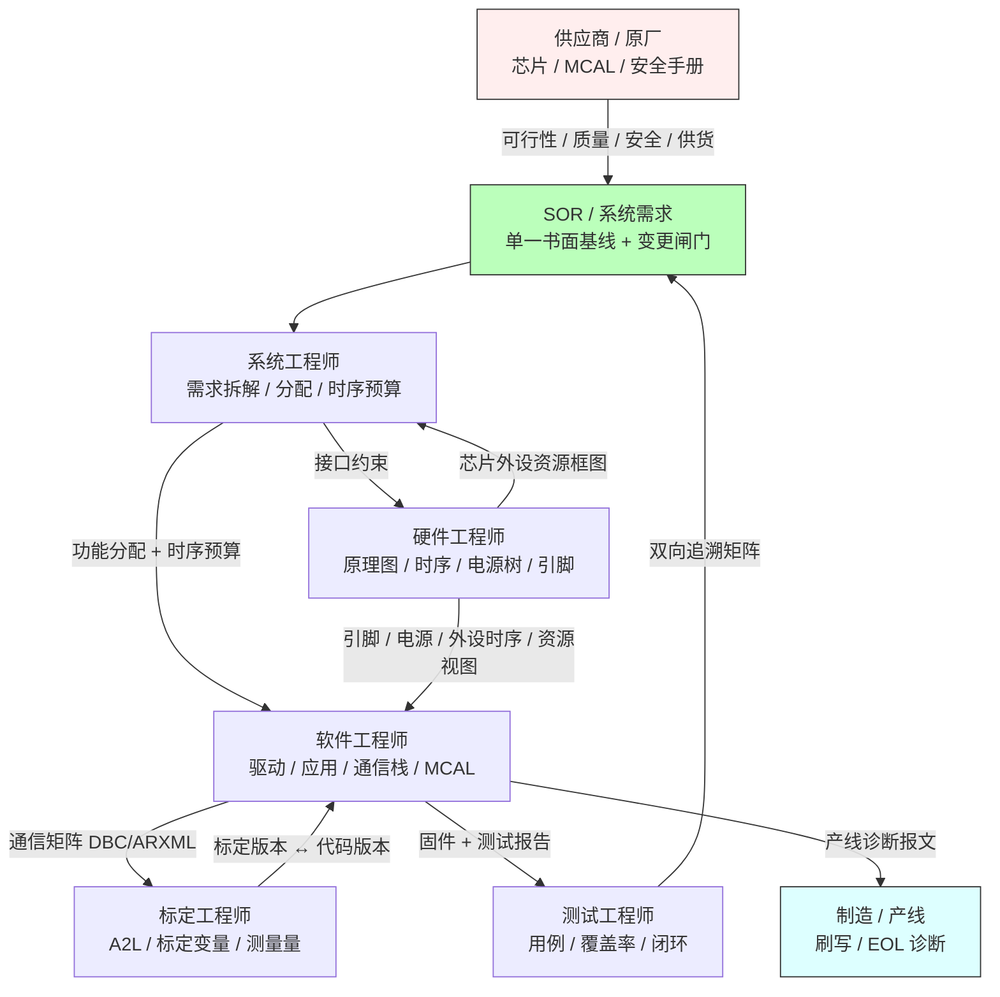
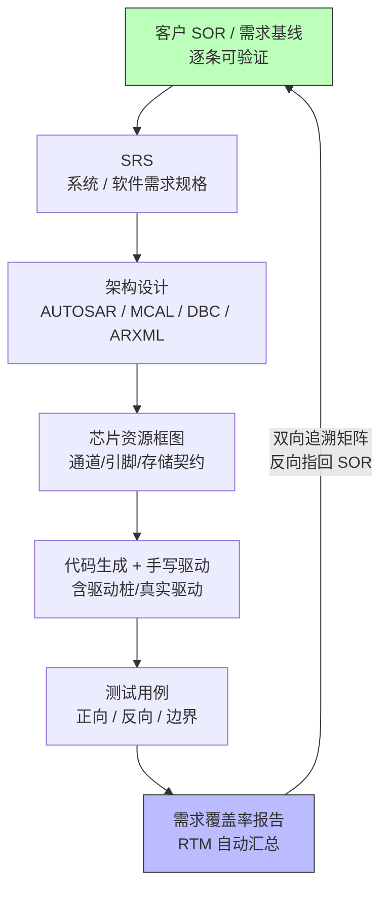
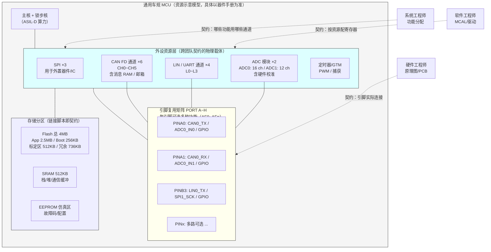
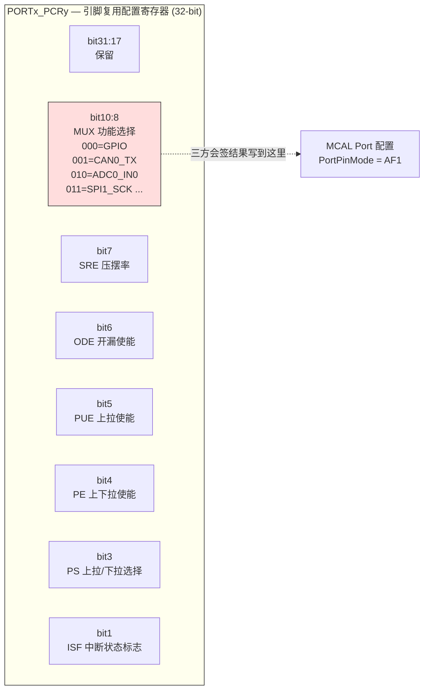
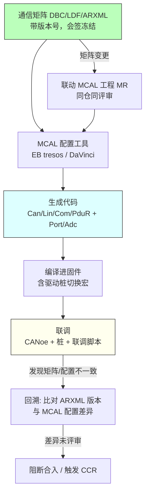
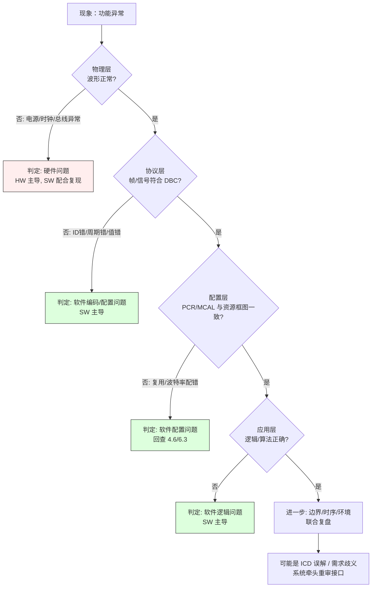
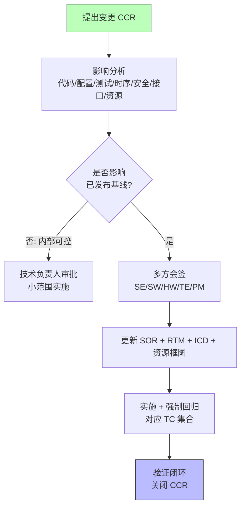
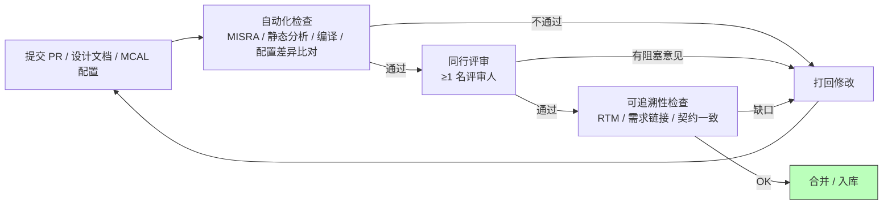
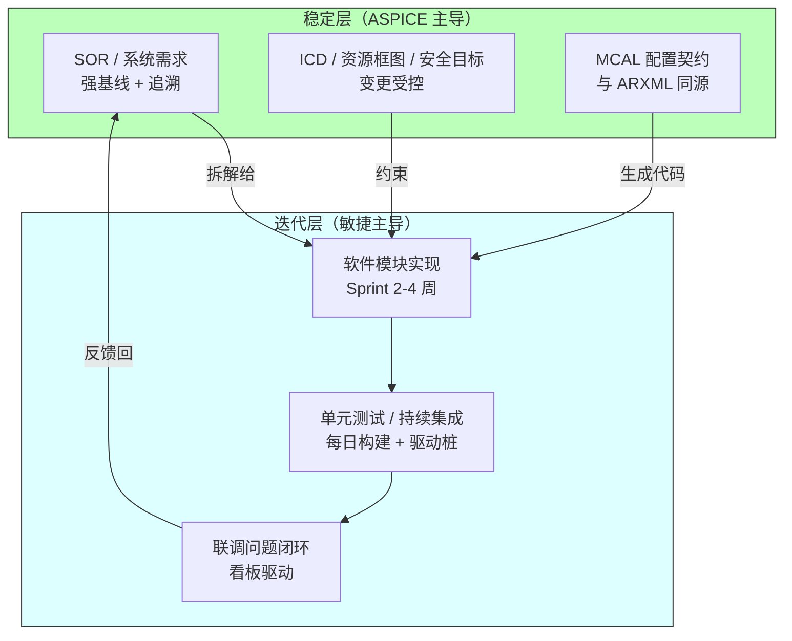

# 汽车嵌入式软件的跨团队协作与工程流程：从 SOR 到芯片、MCAL 与代码落地的全链路协同

> 本章面向已经具备一定嵌入式开发经验、希望从"写好一个模块"进阶到"让一个复杂电控系统按期、按质交付"的工程师。视角兼顾一线开发与技术负责人（Tech Lead / 系统工程接口人 / 平台软件 owner）。篇幅较长，建议结合所在项目的实际需求与工具链对照阅读。
>
> 特别说明：本章后半部分（芯片模块设计、驱动实现、MCAL 配置）从"跨团队契约如何落到芯片与底层软件"的角度展开。其中涉及的 MCU 外设资源视图、寄存器位域、存储分区等，均为**通用车规 MCU 的示意模型**——具体数值以所选器件的 Data Sheet / Reference Manual 为准，本章的重点不是某个型号的精确规格，而是"资源即契约"这一跨团队协作范式本身。

---

## 0. 开篇：为什么"能写代码"不等于"能交付"

在汽车电子领域，单枪匹马写完一个驱动、调通一个外设，只是故事的开始。真正决定项目成败的，往往不是某行算法写得多精妙，而是**多个团队在错误的方向上达成一致、又在正确的方向上互相脱节**所累积的代价。

笔者在多个车规项目中反复观察到同一个现象：技术债很少来自"不会写"，而是来自"没对齐"。硬件以为软件会做电源时序兜底，软件以为硬件会留足采样建立时间，系统以为需求已经进了基线，测试以为用例覆盖到了那条隐性需求——结果都在整车联调时被一次性引爆。一次典型的跨团队失配，可能让一个本该两天闭环的问题拖延两周，并连带拖累硬件返版、测试重排、节点延期。

因此，本章不堆砌工具名词，而是沿着一条真实交付链路，把"协作"拆成可操作的工程纪律：**需求如何成为契约、接口如何成为合同、芯片资源如何成为硬件契约、驱动如何成为可联调的实现、MCAL 配置如何被接口定义驱动、变更如何被约束、问题如何被正确归因、评审如何成为门禁、知识如何被沉淀**。最终目标只有一个——把"人治"的口头默契，变成"流程治"的可追溯系统。

为方便阅读，本章把"软性协作"和"硬性落地"分成两条线：前半部分讲协作链路、需求、接口契约（ICD）；中间三章（第四、五、六章）是本书新增的核心深化内容，专门回答"跨团队的契约最终怎么落到芯片引脚、寄存器、驱动桩与 MCAL 配置上"；后半部分回到联调、变更、评审、文档、软技能与节奏，让三大块自然融入既有工程流程。

---

## 一、嵌入式协作链路：谁在链条上，谁对什么负责

汽车嵌入式系统（无论动力域、底盘域、车身域还是智能座舱）的交付，从来不是软件团队一家的事。一个 ECU 从需求到量产，至少要拉通七类角色。下面这张表是笔者在项目中常用的"责任地图"基线，建议在项目启动会上就白纸黑字地贴出来。

### 1.1 协作角色与责任矩阵

| 角色 | 核心交付物 | 对软件的关键输入 | 关键接口对象 | 典型痛点 |
| --- | --- | --- | --- | --- |
| 系统工程师（SE） | SOR / 系统需求 / 架构 allocate | 功能分配、时序预算、安全目标 | 软硬件、测试、供应商 | 需求过于口头化、缺乏可验证数字 |
| 软件工程师（SW） | 源码、配置、单元/集成测试 | 驱动、应用逻辑、通信栈 | 系统、硬件、测试、标定 | 拿到的是"描述"而非"契约" |
| 硬件工程师（HW） | 原理图、PCB、BOM、HW 测试报告 | 外设时序、电源树、引脚分配 | 软件、系统、制造 | 软件晚提需求导致返版 |
| 测试工程师（TE） | 测试计划、用例、覆盖率报告 | 可测性需求、激励/观测点 | 软件、系统 | 需求不可测、覆盖盲区 |
| 标定工程师（CAL） | 标定数据、测量量（MEA）、A2L | 标定变量、测量接口 | 软件、系统 | 标定量与代码变量版本错配 |
| 制造/产线（MFG） | 刷写流程、EOL 诊断、产线脚本 | 产线诊断报文、刷写时序 | 软件、硬件、测试 | 刷写协议联调滞后于样件 |
| 供应商 / 原厂（SUP） | 芯片数据手册、MCAL、安全手册 | 可行性、workaround、PPAP | 系统、硬件、软件 | 承诺与实测不符 |

> 注意：上表是"责任基线"而非"责任边界"。实际项目中大量问题发生在边界处——例如"采样精度"既是 HW 的模拟前端的活，也是 SW 的 ADC 校准的活，还是 CAL 的标定的活。边界处的责任必须用**接口约定（ICD）**和**联合测试用例**来显式缝合，而不是靠"应该有人管"。更进一步，这些边界很多都落在**芯片外设资源**（通道数、引脚、存储）这件"硬件契约"上，这正是第四章要展开的主题。

### 1.2 一张图看清协作网络



这张图的关键不在箭头多，而在**所有实线最终都回指 SOR 这个单一基线**。任何一个团队的工作，如果无法指回某条需求条目，就要警惕：它是"客户要的"还是"我们自作主张加的"？后者在 ASPICE 评估里是典型扣分项，在量产里是典型返工源。另外注意 HW 与 SW 之间新增的"芯片外设资源框图"连线：硬件资源一旦确定，软件对 CAN/LIN/ADC 通道和存储的使用就被"框死"了，这正是跨团队契约的物理载体。

### 1.3 协作失败的典型根因模式

仅仅画出责任矩阵不等于协作就顺了。笔者把跨团队项目中反复出现的失配归纳为四类根因模式，每类都给出可操作的缓解手段。

| 根因模式 | 典型表现 | 缓解手段 |
| --- | --- | --- |
| 需求黑盒 | 软件拿到的只是"描述"，无数字、无验收标准 | SOR 逐条可验证化，评审会逐条钉数字 |
| 接口漂移 | 各团队手里的 DBC/A2L/ARXML 版本不一致 | 通信矩阵版本化 + 会签 + 工具链同步 |
| 责任真空 | 边界处"都以为对方管"，结果没人管 | ICD 显式缝合 + 联合测试用例 |
| 信息孤岛 | 问题只在某团队内部流通，别人后知后觉 | 共享看板 + 作战室站会 + 复盘公开 |
| 资源错配 | 引脚/通道/存储预算各方理解不一致 | 芯片资源框图作为硬件契约 + 联合评审 |

**需求黑盒**是最隐蔽的一种。它不像"没写需求"那样容易被发现，而是写了一些看似清楚、实则无法验证的话，例如"采样要足够准""通信要稳定"。这类表述在评审时最容易蒙混过关，因为没人愿意当面追问"多准算足够"。笔者的做法是：评审会上对每条需求强制补三个字段——**可测量的指标、测量方法、验收边界**。补不出来的，退回系统工程师重写。

**接口漂移**在长周期项目里几乎必然发生。A 团队基于 v3.1 的矩阵开发了三个月，B 团队中途改了 v3.2 却忘了通知，等到联调才发现信号错位。根治办法不是"大家更细心"，而是**让矩阵成为工具链的输入而非文档**：代码生成、测试用例、标定 A2L 都从同一份带版本号的源文件生成，任何版本切换在 CI 里就会被检测出来。

**责任真空**偏爱那些"技术上跨域"的点：采样精度横跨 HW 模拟前端、SW ADC 校准、CAL 标定；唤醒时延横跨 HW 电源树、SW 低功耗管理、系统时序预算。笔者的经验是，这类点必须有人"认领为 owner"，且 owner 不一定是执行者，而是"确保三方对齐"的协调人，并在 ICD 里写清楚每段责任边界。

**信息孤岛**在分布式团队（多地、多供应商）中最致命。一个硬件发现电源纹波超标，只记在了本地笔记里；软件因此反复遇到 ADC 读数跳变却始终找不到原因。缓解的唯一办法是**强制信息以结构化形式上浮**：缺陷单、看板、复盘报告都对所有相关方可见，而不是留在个人聊天记录里。

**资源错配**是本章新增强调的一类。它表现为：硬件在原理图里把一个引脚留给 CAN0_TX，软件却按 LIN 功能去配寄存器；或者硬件评估时认为 2MB Flash 足够，软件算下来标定量 + 应用 + 冗余至少需要 2.5MB。这类问题的本质是"芯片外设资源没有作为契约被共同拥有"。第四章专门解决它。

### 1.4 协同的"握手"节奏

协作不是随时随意的，而是有固定"握手点"的。笔者推荐在每个里程碑设置如下握手：

- **需求握手**：SOR 基线锁定，RTM 建立骨架。
- **接口握手**：ICD 首版发布，通信矩阵版本冻结，芯片外设资源框图会签。
- **配置握手**：MCAL 配置与 ARXML/DBC 对齐，生成代码基线建立。
- **集成握手**：首个可联调固件（含驱动桩/真实驱动），联合测试用例跑通。
- **准入握手**：量产准入评审，所有追溯闭环。

每个握手点都应有明确的"退出准则（Exit Criteria）"，达不到就不进入下一阶段。这是把"柔性协作"变成"硬性节奏"的关键。

---

## 二、需求管理与双向追踪：把"要什么"钉成契约

### 2.1 SOR：需求的书面基线

在汽车电子里，客户需求通常以 **SOR（Statement of Requirements，需求声明书）** 的形式输入，有时也称作 RS（Requirement Specification）或客户规范。它不是一句"要支持 CAN FD"，而是逐条、可验证、可追溯的条目。以 BMS 或电机控制器相关需求为例，SOR 通常会明确以下内容：

- **通信需求**：支持 CAN 2.0B（11/29 位）、CAN FD（数据段速率上限）、报文清单与发送周期、信号精度与分辨率、诊断协议（UDS on CAN / DoIP）。
- **功能安全需求**：某功能定级 ASIL D，要求空间隔离 + 端到端保护，诊断覆盖率 SPFM / LFM 达到目标值，并给出安全机制清单。
- **实时性需求**：某控制任务周期 10ms，WCET（最差执行时间）< 8ms，抖动 < 1ms。
- **功耗需求**：整车下电后静态电流 ≤ 某 μA 级指标，唤醒源与唤醒延迟要求。
- **诊断与刷写需求**：支持 Bootloader、安全访问等级、产线 EOL 流程。
- **资源预算需求**：明确对外通信接口数量（如"至少 3 路 CAN FD + 2 路 LIN"）、对 MCU 算力/存储的初步约束。这条往往被忽视，却是把"资源错配"扼杀在摇篮里的关键。

SOR 的关键不在"写了什么"，而在**它成为所有团队的共同契约与变更闸门（Change Gate）**。任何修改都必须走变更流程、更新 SOR、并同步影响分析。没有进基线的需求，在工程意义上"不存在"——它无法被验证，也无法被考核。

### 2.2 需求追溯矩阵（RTM）：双向可追

更进一步的工程实践，是把 SOR 与**需求追溯矩阵（Requirement Traceability Matrix，RTM）**绑定。一条成熟的追溯链应当包含如下层次：

```
客户需求 SOR-x
  → 系统需求 SysRS-y（功能分配、时序预算）
    → 软件需求 SRS-z（可测的功能/性能点）
      → 设计要素 Design-w（模块、接口、算法）
        → 代码单元 / 配置（文件:函数 / ARXML 节点）
          → 测试用例 TC-v（正向 + 反向 + 边界）
            → 验证结果（Pass/Fail + 覆盖率）
```

正向追溯回答"这条客户需求被谁、用什么覆盖了"；反向追溯回答"这段代码 / 这个测试，到底在证明哪条需求"。两头都要通，才是 ASPICE 与 ISO 26262 审核认可的双向追溯。

值得注意的是，RTM 的叶子节点不只是"代码"，还应包括**MCAL 配置项与芯片资源分配**。例如 SOR 里"支持 3 路 CAN FD"应当一路追到 MCAL 的 `CanController` 配置实例数量、再到硬件框图里 3 个 CAN FD 通道的物理存在。这样需求才不会在"底层落地"这一环断裂。

### 2.3 需求落地的闭环链路



以"支持 CAN FD"为例：SOR 写"数据段 ≤8Mbps" → 系统定"仲裁段 500k、数据段 2M" → 硬件框图锁定 3 个 CAN FD 通道 → DBC 与通信栈按 FD 配置 → 代码用标定变量动态设 FDF/BRS 标志 → 测试用例验证 FD 帧收发与回退。整条链每一环都能指回 SOR 的那一行。

### 2.4 工具落地：从口头到 ALM

需求如果停留在共享文档的表格里，迟早会和代码脱节。规模项目应当引入 **ALM（Application Lifecycle Management）** 工具，例如 **Polarion**、**Jama Connect**、或基于 **Jira** 的需求插件。这类工具的价值不是"多一个系统"，而是：

1. 需求条目有唯一 ID，可以被代码提交、测试用例、缺陷单直接引用（如 `Req-142`）。
2. 追溯矩阵可由链接关系自动生成，而不是手工维护一份随时过期的 Excel。
3. 变更历史、审批流、影响分析留痕，审计时可一键导出。
4. 与 CI 集成后，未关闭需求覆盖缺口的构建可以告警。

笔者的经验是：当需求条目数量超过几百条、参与团队超过三个时，靠邮件和会议纪要是管不住追溯的，必须从"人治"切换到"流程治"。

---

## 三、接口定义（ICD）：跨团队的真正"合同"

如果说 SOR 是"要什么"的契约，那么 **ICD（Interface Control Document，接口控制文档）** 就是"怎么接"的合同。在汽车嵌入式里，最典型的接口载体是**通信矩阵**——系统、软件、测试、标定甚至产线，都按同一份矩阵编解码报文。谁手里的矩阵版本不对，谁就会制造"你说的是哪版通信矩阵"这类扯皮。

### 3.1 通信矩阵的多种形态

| 总线 / 场景 | 接口描述格式 | 典型工具 | 描述对象 |
| --- | --- | --- | --- |
| CAN / CAN FD | DBC | Vector CANdb++ / CAPL | 报文 ID、信号、周期、缩放 |
| LIN | LDF（LIN Description File） | LIN 配置工具 | 帧、调度表、从节点 |
| 车载以太网 | ARXML（AUTOSAR XML） | AUTOSAR 工具链 | PDU、Eth 帧、SOME/IP |
| FlexRay | FIBEX | 网络设计工具 | 静态/动态段、帧 |
| 标定 / 测量 | A2L（ASAP2） | INCA / CANape | 标定变量、测量量、算法 |

这些文件本质上都是**机器可读的接口契约**：它们既给人看（评审信号定义），也给工具吃（代码生成、测试激励、标定连接）。把接口定义"结构化、版本化、机器可读"，是消弭跨团队歧义的根本手段。

### 3.2 DBC 信号定义示例

下面是一段风格化的 DBC 片段，描述电池单体电压如何在 CAN 上编码。注意 `SG_` 行里的缩放（`*` 与 `+`）、字节序（`@1` 小端 / `@0` 大端）、单位与取值范围——这些细节正是软硬件最容易对不齐的地方。

```dbc
VERSION "BMS_CommMatrix_v3.2"

BO_ 256 BMS_CellVoltage_01: 8 BMS
 SG_ CellVolt_1 : 0|12@1+ (0.001,0) [0|4.095] "V" Vector__XXX
 SG_ CellVolt_2 : 12|12@1+ (0.001,0) [0|4.095] "V" Vector__XXX
 SG_ CellVolt_3 : 24|12@1+ (0.001,0) [0|4.095] "V" Vector__XXX
 SG_ CellVolt_4 : 36|12@1+ (0.001,0) [0|4.095] "V" Vector__XXX
 SG_ ModuleTemp : 48|8@1- (1,-40) [-40|215] "degC" Vector__XXX

BA_ "GenMsgCycleTime" BO_ 256 10  ; 周期 10ms
```

这段 DBC 同时约束了三方：硬件侧的采样精度必须让电压落在 `[0,4.095]V` 且分辨率 1mV；软件侧的解码公式必须与 `(0.001,0)` 一致；测试侧的注入与比对也必须套用同一套缩放。一旦版本不一致（例如某团队用的是 v3.1，信号起始位差了 4 bit），联调时就会出现"数值全乱但 ID 对得上"的经典假象。

### 3.3 ICD 接口定义要素表

一份严谨的 ICD 不应只写"信号名 + 长度"，而应把下列要素结构化：

| 要素 | 说明 | 为何关键 |
| --- | --- | --- |
| 信号标识 | 名称、ID、起始位、长度 | 编解码的底层依据，错一位全盘错 |
| 字节序 / 符号 | 大端/小端、有符号/无符号 | 跨芯片平台最常见的解码 bug 来源 |
| 缩放与偏移 | factor、offset、单位 | 物理值与原始值的换算唯一来源 |
| 取值范围 | 最小/最大、无效值（N/A） | 边界测试、故障注入的依据 |
| 发送周期 / 事件 | 周期值、超时、事件触发条件 | 实时性与总线负载的约束 |
| 失效行为 | 默认值、静默、 last-value | 安全机制的输入 |
| 版本与变更号 | ICD 版本、对应 SOR 条目 | 追溯与兼容性的锚点 |
| 通道绑定 | 走哪个 CAN/LIN 通道、哪路 MCU 外设 | 与芯片资源框图、MCAL 配置对齐 |

最后一行"通道绑定"是本章刻意补强的：ICD 里每个信号都要写明它跑在哪条物理通道上，而这条通道必须在第四章的芯片资源框图里有出处、在第六章的 MCAL 配置里有对应实例。三者闭环，接口才算真正落地。

### 3.4 ICD 接口定义片段（C 侧契约）

在软件侧，DBC 通常会被工具生成结构体，但手写驱动部分也必须和 ICD 严格对齐。下面是一段接口约定风格的定义，强调"与 DBC 同步"这一纪律：

```c
/* ICD: BMS_CommMatrix_v3.2, 对应 SOR-142 采样精度要求
 * 通道绑定: 本报文走 CAN FD_0（仲裁 500k / 数据 2M），见芯片资源框图 CH-CAN0 */
typedef struct {
    /* 单位 V，分辨率 1mV，范围 [0, 4.095] —— 必须与 DBC CellVolt_x 一致 */
    uint16_t cell_volt[6];   /* 原始值 = 物理值 / 0.001 */
    int8_t   module_temp;    /* 单位 degC，offset -40 */
    uint8_t  valid_mask;     /* bit 置位表示该通道有效 */
} Bms_CellVoltageMsg_t;

/* 解码函数：输入 CAN 原始字节，输出物理结构，供应用层消费 */
Std_ReturnType Bms_DecodeCellVoltage(const uint8* can_data,
                                      Bms_CellVoltageMsg_t* out);

/* 反向：应用层标定/测量值编码回 CAN 帧，供标定工具与产线读取 */
Std_ReturnType Bms_EncodeCellVoltage(const Bms_CellVoltageMsg_t* in,
                                     uint8* can_data);
```

这里 `valid_mask` 对应 ICD 里的"失效行为"——当某通道采样异常时，软件不应发出一个错误的电压，而应把对应 bit 清掉，让接收方走安全机制。这种细节，只有把 ICD 当合同、逐要素评审，才能落到代码里。同时 `cell_volt` 数组下标与 DBC 信号一一对应，任何数量差异（比如硬件只采了 4 节而 ICD 写 6 节）在联调时会被驱动桩立即发现。

### 3.5 接口版本管理：矩阵也有"发布号"


接口的版本管理最容易被轻视。笔者的建议是：通信矩阵必须像软件一样有**版本号 + 变更说明 + 会签记录**。当某信号定义要改，先问三个问题——哪些 ECU 受影响？能否向前兼容（旧节点读新帧不崩）？测试用例与标定 A2L 是否同步？只有这三个问题都有答案，才允许发布新版本。否则就会出现"网关已经按新矩阵路由，节点还在发旧帧"的半兼容灾难。

### 3.6 标定与测量接口：A2L 与 XCP

通信矩阵解决的是"ECU 之间怎么说"，而标定与测量解决的是"人如何观察和调教 ECU 内部"。这部分接口通常以 **A2L（ASAP2 描述文件）** 为载体，配合 **XCP（Universal Measurement and Calibration Protocol，通用测量与标定协议）** 使用。它同样是跨团队契约，且版本错配的后果不亚于 DBC 错配。

A2L 描述两类量：

- **标定变量（CAL）**：可被在线修改的参数，例如 PID 增益、滤波系数、阈值。标定工程师在 INCA / CANape 里拖动滑块，XCP 把新值写进 ECU 的 RAM/EEPROM。软件侧必须保证这些变量在链接脚本里有确定地址、且名称与 A2L 完全一致。
- **测量量（MEA）**：只读观测点，例如当前转速、估算温度、内部状态机。XCP 周期性把它们从 ECU 抓出来画成曲线。

一个经典坑是**"代码改了变量类型，A2L 没更"**：软件把一个 `uint16` 的电压标定改成 `uint32`，但 A2L 还是按 2 字节解析，标定工具读出来的就是一堆乱码，且不会报错——因为它相信 A2L。所以 A2L 必须与代码**同源生成或同源评审**，并在 ICD 里登记版本。笔者的实践是：把 A2L 生成纳入构建流水线，每次代码变量变更都重新生成 A2L 并做差异比对，差异未经评审不允许进入联调。

```c
/* A2L 同源约束示例：标定变量必须经宏标注，便于工具抽取生成 A2L */
CAL_VAR(uint16, KP_CurrentGain, 0x1000)  /* 电流环比例增益，单位 0.001 */
CAL_VAR(uint16, KI_CurrentGain, 0x1002)  /* 电流环积分增益，单位 0.001 */
MEA_VAR(uint16, ActCurrent, 0x2000)      /* 实测相电流，单位 0.01A */
```

这里的 `CAL_VAR` / `MEA_VAR` 是伪宏，真实项目里可能是 AUTOSAR 的 `CALIBRATION_VARIABLE` 段属性或供应商标定框架的注解。重点是：**标定接口不是标定工程师自己编的，而是从软件变量定义里长出来的**，两者必须同源、同版本。

---

## 四、芯片模块设计（IP 内部架构）：把外设资源当成跨团队契约

本章开始是本书相对原文章的深化核心。前面讲了需求契约（SOR）和接口契约（ICD/DBC），但有一个常常被"软硬分家"忽视的契约层：**芯片外设资源契约**。它处在硬件与软件之间，是系统、硬件、软件三方共同拥有的一份"硬件接口合同"。

### 4.1 为什么芯片资源也是一种契约

很多项目里，硬件工程师画完原理图、定好 MCU 型号，就把"外设资源"当成既成事实丢给软件；软件工程师则默认"有多少通道我都能用"。等到 SPI 不够分、引脚冲突、Flash 超标，才发现根本没有人把"资源分配"当作需要会签的契约。

笔者的观点是：**芯片的每一个 CAN 通道、每一个 LIN 通道、每一路 ADC、每一个可复用引脚、每一块存储分区，都是一份微型契约**。系统工程师据此做功能分配，硬件工程师据此画原理图与 PCB，软件工程师据此配 MCAL 与写驱动，测试工程师据此搭总线仿真。任何一方对资源的理解偏差，都会沿着链路放大成联调事故。

### 4.2 芯片模块架构框图（外设资源视图）

下面给出一份**通用车规 MCU 的外设资源示意框图**。需要再次强调：具体通道数、ADC 分辨率等以真实器件手册为准，这里用一组有代表性（且内部自洽）的数值，目的是展示"资源即契约"的结构，而不是标定某颗具体芯片。



这张图要传递的核心信息是三件事：

1. **外设资源层是系统/硬件/软件三方契约的交汇点**。系统决定"功能用到哪个通道"，硬件决定"引脚 physical 接到哪"，软件决定"寄存器怎么配"——三者必须基于同一张图对齐。
2. **引脚复用矩阵是冲突爆发地**。一个引脚可能同时是 `CAN0_TX`、`ADC0_IN0`、`GPIO`，最终只能选一种功能；这个选择必须三方会签，写进 ICD 与原理图。
3. **存储分区是链接脚本级的契约**。标定量、应用代码、Bootloader、冗余备份各占多少，必须在项目早期按预算钉死，否则后期"Flash 装不下"是改不动的硬伤。

### 4.3 资源分配表：把框图变成可会签的清单

框图是"视图"，分配表才是"合同文本"。下面是一份 CAN/LIN/ADC 通道分配的示意清单，应在接口握手时由系统牵头、硬件与软件共同会签：

| 资源 | 通道 | 分配用途 | 绑定网段/外设 | 归属团队确认 |
| --- | --- | --- | --- | --- |
| CAN FD | CH0 | 动力总成主干网（500k/2M） | 与 VCU/MCU 通信 | SE+HW+SW |
| CAN FD | CH1 | 诊断/标定网（CANoe 接入） | UDS on CAN | SE+SW+CAL |
| CAN FD | CH2 | 电池包内部 CAN（BMS 内部） | 从板采集 | SE+HW+SW |
| CAN FD | CH3~CH5 | 预留/网关扩展 | 待定 | SE |
| LIN | L0 | 压缩机/水泵 LIN 从节点 | 热管理 | SE+HW+SW |
| LIN | L1 | 车内传感器 LIN 簇 | 车身 | SE+HW |
| ADC | ADC0 (16ch) | 电池电压/温度采样 | 模拟前端 | HW+SW+CAL |
| ADC | ADC1 (12ch) | 电流/温度/诊断 | 模拟前端 | HW+SW |
| SPI | SPI1 | 外置 EEPROM / 安全芯片 | 非易失/安全 | HW+SW |

这份表的"归属团队确认"列是关键：每个通道至少要有两个团队签字确认其用途，避免"硬件接了线、软件没配、系统以为另有用处"的三方失配。当新增需求（如"再加一路充电通信 CAN"）时，先查这张表——若 CH3~CH5 已预留则直接落位，若无预留则触发变更流程（见第八章），而不是让硬件偷偷改原理图。

### 4.4 引脚复用冲突：最典型的"资源错配"现场

引脚复用矩阵的存在，意味着**同一物理引脚在芯片内部只能路由到一个外设**。当系统要把某引脚同时用作 `CAN0_TX` 和 `ADC0_IN0` 时（尽管逻辑上不合理，但原理图评审疏漏时会发生），芯片只能"二选一"。这种冲突在以下场景高发：

- **原理图绘制时**：硬件把某引脚接到 CAN 收发器，却忘了它同时也是 ADC 关键采样通道。
- **需求变更时**：新增一个 LIN 节点，硬件复用了一根本已分配给 SPI 的引脚。
- **MCU 选型变更时**：换了一颗引脚更少的器件，原分配方案整体不可行却没重评。

跨团队协调方法（笔者的实践）：

1. **建立引脚分配表（Pin List）**，每行一个引脚，列出：引脚号、原理图网络名、候选功能（AF 列表）、最终选定功能、选定理由、冲突检查结果。
2. **做冲突自动检查**：用脚本把"原理图网络 → 功能"与"MCAL 引脚配置 → 功能"做交叉比对，任何引脚被配置成两个互斥功能即报错（该脚本思路见第六章 6.6 与第五章 5.4）。
3. **会签冻结**：Pin List 与 MCAL 配置在接口握手后冻结，任何改动走变更闸门。

### 4.5 通道与存储预算的跨团队协调

除了引脚，还有两类预算必须早期对齐：

- **通道预算**：CPU 的 CAN FD 通道数、LIN 通道数、ADC 通道数是物理上限。系统做功能分配时不能超出；一旦超出，要么换料号，要么砍功能，要么复用（如用软件位bang 实现额外 LIN，但需评估实时性）。
- **存储预算**：链接脚本的分区是硬约束。常见踩坑是标定量越标越多，超出了预留的 EEPROM 仿真区 / 标定 Flash 区。笔者的做法是：在项目早期用"标定变量清单 × 类型宽度 × 安全余量"估算标定区下限，并在 A2L 生成时做容量断言（超过预算构建失败）。Flash 的 App 区同理——应用代码增长要有红线告警。

这两类预算的协调，本质上都是"把硬件资源当契约来管理"，而不是等到链接失败或通道不够时才救火。

### 4.6 寄存器/位域图：引脚复用配置寄存器（PCR）

芯片资源的契约，最终要落到寄存器配置上。下面给出一个**通用风格的引脚复用配置寄存器（Pin Control Register, PCR）位域示意**。这类寄存器在主流车规 MCU（如基于 ARM Cortex-M/R 的系列）中普遍存在，结构类似——注意这是"通用实现逻辑示意"，具体位宽与字段名以目标器件 Reference Manual 为准。



该位域图传达的契约含义：

- **MUX[10:8]** 是引脚功能选择的"总开关"，它正是 4.4 节引脚分配表在寄存器层面的落点。系统/硬件/软件三方会签的"最终选定功能"，最终就编码成这一字段的值（例如 `001` 表示 CAN0_TX）。
- **PE/PS/PUE** 决定上下拉，必须与原理图（外部有无上下拉电阻）一致——硬件定原理图，软件配寄存器，二者必须相等，否则会出现"原理图有上拉、寄存器却关掉"的隐性故障。
- **SRE/ODE** 影响信号边沿与开漏，对 CAN/LIN 这类总线尤为重要，需参考收发器与总线规范。
- **ISF** 是中断状态，软件读清，属于运行时契约的一部分。

把这张位域图和 4.3 的分配表放在一起，跨团队就能说清："PINA0 在原理图上连到 CAN0 收发器 TX，所以软件必须把它的 MUX 配成 `001`，且 PE/PS 必须与原理图上下拉一致。"——这正是"硬契约"的最小闭环单元。

### 4.7 从资源框图到 ICD：硬件契约驱动软件配置

资源框图与寄存器位域不是硬件工程师的私人物品，而是 ICD 的硬件附录。笔者的实践是在 ICD 中增加"硬件资源绑定"章节，明确：

- 每个通信信号 → 走哪个 CAN/LIN 通道（对应 4.3 表）。
- 每个模拟量 → 接哪个 ADC 模块/通道（对应 4.3 表）。
- 关键引脚 → 复用功能与上下拉（对应 4.6 位域）。
- 存储敏感区（标定/配置）→ 链接脚本分区（对应 4.2 存储分区）。

这样一来，第四章的"芯片模块设计"就不再是孤立的硬件话题，而是 ICD 的物理底座，并向下直接驱动第五章的驱动实现与第六章的 MCAL 配置。

---

## 五、驱动代码实现：把契约写成可读、可联调的代码

接口契约（ICD/DBC）和资源契约（芯片框图/寄存器）都备齐后，下一步是把它们变成**真实可读、且在无硬件时也能联调**的代码。本章给出若干可直接落地的代码骨架，强调"契约驱动编码"。

### 5.1 ICD 接口定义（信号结构体与编解码）

DBC 描述"信号在总线上怎么摆"，软件需要把它翻译成"内存里怎么用"。下面是基于 3.4 节的完整、可读的接口定义，包含编解码与范围校验（这是跨团队联调时最常见的 bug 来源）：

```c
/* =========================================================================
 * icd_bms.h — BMS CAN 接口契约（对应 BMS_CommMatrix_v3.2）
 * 约束来源: DBC 信号定义 + 芯片资源框图 CH-CAN0 + SOR-142
 * 任何字段修改必须同步 DBC 并触发 CCR，禁止私自改缩放/字节序
 * ========================================================================= */
#ifndef ICD_BMS_H
#define ICD_BMS_H

#include "Std_Types.h"

/* 报文周期与超时（来自 DBC BA_ GenMsgCycleTime + ICD 超时字段） */
#define BMS_CELLVOLTAGE_CYCLE_MS   10u
#define BMS_CELLVOLTAGE_TIMEOUT_MS 50u   /* 收不到即判定通信丢失 */

/* 物理值范围（必须与 DBC [min|max] 一致） */
#define CELL_VOLT_MIN_RAW   0u      /* 0.000 V */
#define CELL_VOLT_MAX_RAW   4095u   /* 4.095 V */
#define CELL_VOLT_FACTOR    0.001f  /* 分辨率 1mV，来自 DBC (0.001,0) */
#define MODULE_TEMP_OFFSET  (-40)   /* 来自 DBC (1,-40) */

/* 信号结构体：应用层只认物理值，不碰原始字节 */
typedef struct {
    uint16_t cell_volt[6];   /* 单位 V*1000（整数避免浮点），范围 0~4095 */
    int16_t  module_temp;    /* 单位 degC，已加 offset */
    uint8_t  valid_mask;     /* bit[i]=1 表示 cell_volt[i] 有效 */
} Bms_CellVoltageMsg_t;

/* 解码：CAN 原始字节 -> 物理结构。返回 E_OK 表示帧完整且范围合法 */
Std_ReturnType Bms_DecodeCellVoltage(const uint8* can_data,
                                     Bms_CellVoltageMsg_t* out);

/* 编码：物理结构 -> CAN 原始字节，供标定/产线读取 */
Std_ReturnType Bms_EncodeCellVoltage(const Bms_CellVoltageMsg_t* in,
                                     uint8* can_data);

#endif /* ICD_BMS_H */
```

注意 `cell_volt` 用"V*1000 的整数"而非浮点，这是车规代码的常见选择——避免浮点运算、确定性强、与 DBC 的 1mV 分辨率天然对齐，也方便标定工具与单元测试做精确比对。

### 5.2 DBC 解析生成的信号读写（含字节序与缩放）

手写驱动时，最易错的是字节序（Intel `@1` 小端 / Motorola `@0` 大端）和缩放。下面给出小端 12 位信号的读取实现，逻辑与 DBC `0|12@1+` 对应：

```c
/* =========================================================================
 * bms_decode.c — 小端 12bit 信号解码（对应 DBC CellVolt_x : 0|12@1+）
 * 字节序说明: @1 = Intel 小端，bit 编号从 LSB 起，跨字节时低字节在前
 * ========================================================================= */
#include "icd_bms.h"

/* 从 CAN 数据帧按 (start_bit, length) 抽取小端无符号原始值 */
static uint32_t ExtractLittleEndian(const uint8* d, uint8 start_bit, uint8 len)
{
    uint32_t raw = 0u;
    uint8 bit_pos = start_bit;
    for (uint8 i = 0u; i < len; i++) {
        uint8 byte_idx = bit_pos >> 3u;          /* bit_pos / 8 */
        uint8 bit_idx  = bit_pos & 0x07u;        /* bit_pos % 8 */
        uint8 bit_val  = (d[byte_idx] >> bit_idx) & 0x01u;
        raw |= ((uint32_t)bit_val) << i;         /* 第 i 个信号位 */
        bit_pos++;
    }
    return raw;
}

Std_ReturnType Bms_DecodeCellVoltage(const uint8* can_data,
                                     Bms_CellVoltageMsg_t* out)
{
    if ((can_data == NULL) || (out == NULL)) {
        return E_NOT_OK;   /* 防御: 外部输入必须校验 */
    }

    /* CellVolt_1..4 起始位 0/12/24/36，长度 12，小端，factor 0.001 */
    for (uint8 i = 0u; i < 4u; i++) {
        uint32_t raw = ExtractLittleEndian(can_data, (uint8)(i * 12u), 12u);
        /* 范围校验: 超限即判无效（对应 ICD 失效行为） */
        if (raw > CELL_VOLT_MAX_RAW) {
            out->valid_mask &= (uint8)(~(1u << i));
            out->cell_volt[i] = 0u;
        } else {
            out->valid_mask |= (uint8)(1u << i);
            out->cell_volt[i] = (uint16_t)(raw * 1000u); /* V*1000 */
        }
    }

    /* ModuleTemp: 起始位 48，长度 8，有符号，offset -40 */
    int8_t t_raw = (int8_t)can_data[6];   /* 简化: 第 6 字节 */
    out->module_temp = (int16_t)t_raw + MODULE_TEMP_OFFSET;

    return E_OK;
}
```

这段代码把 DBC 的 `start_bit`、`length`、`@1`、`factor`、`offset` 全部显式翻译进 C，并与 5.1 的结构体一一对应。跨团队联调时，如果硬件发来的帧"值总是差一点"，第一怀疑对象就是这里的字节序或因子——而因为代码与 DBC 同源评审，定位极快。

### 5.3 接口驱动桩：无硬件也能联调

真实硬件样件往往晚到数周。为了不让软件团队干等，笔者强烈建议**为每一个外部接口写驱动桩（stub / mock driver）**，让应用层能在 PC 或评估板上跑通逻辑。

```c
/* =========================================================================
 * can_stub.c — CAN 驱动桩（无硬件联调用）
 * 行为: 不碰真实寄存器，改为与"虚拟总线"交互
 *       可被 Python 联调脚本(见 5.5)通过共享内存/文件注入报文
 * 编译开关: 用 USE_CAN_STUB 控制，量产构建关闭
 * ========================================================================= */
#include "icd_bms.h"
#include <string.h>

#ifdef USE_CAN_STUB

#define STUB_FIFO_DEPTH 16u
static uint8 g_stub_rx_fifo[STUB_FIFO_DEPTH][8];
static uint8 g_stub_rx_head = 0u;
static uint8 g_stub_rx_tail = 0u;

/* 桩提供的"发送"：仅打日志/写文件，不真正发总线 */
Std_ReturnType Can_StubSend(uint32 msg_id, const uint8* data, uint8 dlc)
{
    /* 此处可把 msg_id+data 通过 DLT/文件吐给联调脚本消费 */
    (void)msg_id; (void)data; (void)dlc;
    return E_OK;
}

/* 联调脚本调用: 向桩注入一帧，模拟总线上收到报文 */
void Can_StubInject(uint32 msg_id, const uint8* data, uint8 dlc)
{
    (void)msg_id;
    if (((g_stub_rx_head + 1u) % STUB_FIFO_DEPTH) != g_stub_rx_tail) {
        (void)memcpy(g_stub_rx_fifo[g_stub_rx_head], data,
                     (dlc > 8u) ? 8u : dlc);
        g_stub_rx_head = (g_stub_rx_head + 1u) % STUB_FIFO_DEPTH;
    }
}

/* 应用层调用的接收接口，与真实驱动同签名 */
Std_ReturnType Can_Receive(uint32* msg_id, uint8* data, uint8* dlc)
{
    (void)msg_id;
    if (g_stub_rx_head == g_stub_rx_tail) {
        return E_NOT_OK;  /* 无帧 */
    }
    (void)memcpy(data, g_stub_rx_fifo[g_stub_rx_tail], 8u);
    *dlc = 8u;
    g_stub_rx_tail = (g_stub_rx_tail + 1u) % STUB_FIFO_DEPTH;
    return E_OK;
}

#endif /* USE_CAN_STUB */
```

桩的价值在于：软件团队不必等硬件，就能把"接收 DBC 帧 → 解码 → 应用逻辑 → 编码回发"全链路在 PC 上跑起来。等到真实样件到了，只把 `USE_CAN_STUB` 关掉、换成真实 MCAL 驱动，应用层一行都不用改——因为桩和真实驱动提供**相同的接口签名**。

### 5.4 跨团队 mock 驱动与版本兼容性检查

联调时还要防"接口漂移"：A 团队用的是 DBC v3.1，B 团队已是 v3.2。下面给出一个**版本兼容性检查代码**，在系统初始化时比对本地 ICD 版本号与总线握手信息，避免"默默用错版本"：

```c
/* =========================================================================
 * icd_version_check.c — ICD 版本与兼容性自检
 * 目的: 防止软件用旧 ICD 编解码，却接到新矩阵的总线帧
 * ========================================================================= */
#include "icd_bms.h"
#include <string.h>

/* 本软件编译时锁定的 ICD 版本（由构建系统从 DBC 自动注入宏） */
#ifndef ICD_VERSION_MAJOR
#define ICD_VERSION_MAJOR 3u
#define ICD_VERSION_MINOR 2u
#endif

/* 远端握手帧携带的版本（由诊断/网络管理下发，示意） */
typedef struct {
    uint8 major;
    uint8 minor;
} IcdVersion_t;

/* 兼容性策略:
 *  - 主版本不同 => 不兼容，禁止联调，上报 SOR 偏差
 *  - 主版本同、次版本新 => 向后兼容（旧节点能读新帧，忽略新增信号）
 *  - 主版本同、次版本旧 => 向前兼容（新节点读旧帧，用默认值补缺失信号）
 */
Std_ReturnType Icd_CheckCompatibility(const IcdVersion_t* remote)
{
    if (remote == NULL) {
        return E_NOT_OK;
    }
    if (remote->major != ICD_VERSION_MAJOR) {
        /* 主版本分裂，必须走 CCR 对齐，不允许静默运行 */
        return E_NOT_OK;
    }
    /* 次版本差异仅记日志，不阻断（假设信号向后兼容设计） */
    if (remote->minor != ICD_VERSION_MINOR) {
        /* 记录: 本地 v%d.%d 远端 v%d.%d, 走兼容模式 */
    }
    return E_OK;
}
```

这个检查把第六章"接口版本管理"的流程，固化成运行时的一道门禁：即便有人忘了同步矩阵，系统启动也能立刻发现主版本分裂并拒绝危险联调。

### 5.5 跨团队联调脚本（Python mock 总线）

桩在 ECU 侧，联调脚本在 PC 侧。下面是一段 Python 脚本，模拟"总线上的其他节点"，向桩注入 DBC 帧、并校验 ECU 回发帧是否符合 ICD——它是软件/系统/测试三方共同消费的工具：

```python
#!/usr/bin/env python3
# =========================================================================
# joint_debug_bus.py — 跨团队联调: 模拟总线节点，验证 ECU 编解码是否符合 ICD
# 用法: 与 ECU 桩通过共享文件/ socket 交互；脚本侧按 DBC 生成帧并比对回帧
# 依赖: 仅标准库（演示逻辑，真实项目接 CANoe / 真实 CAN 适配器）
# =========================================================================
import struct
import json

# 来自 DBC 的契约常量（应与 DBC 同源生成，避免手抄出错）
CELL_FACTOR = 0.001
MODULE_TEMP_OFFSET = -40
EXPECTED_CYCLE_MS = 10

def encode_cell_voltage(cell_v_list, module_temp_c):
    """按 DBC CellVolt_x : 0|12@1+ (0.001,0) 构造 8 字节帧"""
    raw = bytearray(8)
    for i, v in enumerate(cell_v_list[:4]):
        val = int(round(v / CELL_FACTOR))   # 物理值 -> 原始值
        val = max(0, min(4095, val))
        # 小端 12bit 写入
        start = i * 12
        byte_idx = start // 8
        bit_off = start % 8
        for b in range(12):
            if (val >> b) & 1:
                raw[byte_idx + (bit_off + b) // 8] |= (1 << ((bit_off + b) % 8))
    raw[6] = (module_temp_c - MODULE_TEMP_OFFSET) & 0xFF  # 有符号 8bit
    return bytes(raw)

def decode_and_check(rx_frame, expect_cells):
    """校验 ECU 回发帧是否与期望物理值一致（跨团队一致性断言）"""
    got = []
    for i in range(4):
        start = i * 12
        byte_idx = start // 8
        bit_off = start % 8
        val = 0
        for b in range(12):
            if (rx_frame[byte_idx + (bit_off + b) // 8] >> ((bit_off + b) % 8)) & 1:
                val |= (1 << b)
        got.append(round(val * CELL_FACTOR, 3))
    ok = all(abs(g - e) < 0.002 for g, e in zip(got, expect_cells))
    print(f"[CHECK] decoded={got} expect={expect_cells} -> {'PASS' if ok else 'FAIL'}")
    return ok

if __name__ == "__main__":
    # 系统/测试定义的一组黄金用例（来自 ICD 测试矩阵）
    cases = [
        ([3.600, 3.605, 3.590, 3.601], 25),
        ([0.000, 4.095, 2.500, 1.234], -40),
    ]
    for cells, temp in cases:
        frame = encode_cell_voltage(cells, temp)
        # 这里应把 frame 注入 ECU 桩，并读取 ECU 回发帧 rx
        rx = frame  # 演示: 假设回显一致
        decode_and_check(rx, cells)
```

这段脚本的意义在于"契约可执行化"：DBC 里的缩放、字节序、范围，不只在文档里，还被同一套常量驱动的脚本反复验证。当系统、软件、测试三方都拿这份脚本对线时，"你说的是哪版矩阵"的扯皮就失去了土壤。

---

## 六、MCAL 配置说明：接口定义如何驱动底层配置

前面章节交付了 ICD（通信矩阵）、芯片资源框图（外设契约）、驱动代码（含桩）。这些要真正在 ECU 上跑起来，还必须落到 **MCAL（Microcontroller Abstraction Layer，微控制器抽象层）** 配置上。MCAL 是 AUTOSAR 架构里最贴近芯片的一层，通常由芯片原厂（如 NXP、Infineon、Renesas）以 **EB tresos**（针对 NXP/部分厂商）或 **Vector DaVinci Configurator**（针对 Infineon/部分厂商）等工具交付和配置。

### 6.1 DBC/LDF/ARXML 如何驱动 MCAL 配置

核心链路是：**通信矩阵 → 接口需求 → MCAL 配置实例 → 生成代码 → 联调**。

- DBC 定义了有哪些报文/信号，进而决定 CAN 控制器数量、每个控制器的波特率、接收滤波、消息缓冲（Mailbox / Message RAM）需求。
- LDF 定义了 LIN 簇的调度表、从节点、帧时序，决定 LIN 通道数与调度配置。
- ARXML（AUTOSAR XML）作为统一描述格式，可在系统级工具里同时承载 CAN/LIN/Eth 的信号与 PDU 映射，并直接导入 MCAL/BSW 配置工具，驱动 `Can`、`Lin`、`Com`、`PduR` 等模块的生成。

关键点：**MCAL 配置不是工程师凭空拍的，而是被接口矩阵"喂"出来的**。一个 CAN 通道在 MCU 资源框图里有物理存在（第四章）、在 ICD 里有绑定信号（第三章）、在 MCAL 里就必须有对应 `CanController` 实例。三者数量与参数必须一致，否则就是"契约断裂"。

### 6.2 Can/Lin/Spi 通道与 Com 信号映射表

下面给出接口信号到 MCAL 配置项的对齐示意表（项目早期应由系统+软件会签）：

| 通信信号 / 用途 | 总线类型 | 物理通道 | MCAL 模块实例 | Com 信号 / PDU | 来源矩阵 |
| --- | --- | --- | --- | --- | --- |
| 电池单体电压帧 | CAN FD | CH0 (CAN0) | CanController_0 | I-PDU BMS_CellVolt | DBC v3.2 BO_256 |
| 诊断请求/响应 | CAN 2.0B | CH1 (CAN1) | CanController_1 | Dcm 关联 PDU | DBC Diag |
| 热管理 LIN 帧 | LIN | L0 (LIN0) | LinChannel_0 | I-PDU Therm_LIN | LDF v2.1 |
| 外置安全芯片通信 | SPI | SPI1 | SpiChannel_1 | （非 COM，直接驱动） | 硬件框图 |
| 充电通信（预留） | CAN FD | CH3 (CAN3) | CanController_3 | 待定义 | 变更后补充 |

这张表的价值：它把"业务信号"和"MCAL 实例"用一行绑定，任何一条都能双向追溯——从 MCAL 配置反查到 DBC 信号，从 DBC 信号反查到物理通道与资源框图。这也是 ASPICE 审核时非常看重的"配置可追溯性"。

### 6.3 EB tresos / DaVinci 配置项与接口矩阵对齐

不同原厂工具的差异主要在 UI 与工程文件格式，但配置对象的语义一致。下面以通用的 AUTOSAR MCAL 视角，列出关键配置项及其与接口矩阵的对应关系：

| MCAL 配置项（通用语义） | 取值示例 | 驱动来源 | 跨团队负责人 |
| --- | --- | --- | --- |
| `CanGeneral.CanControllerBaudrate`（仲裁/数据） | 500k / 2M | DBC 波特率字段 | SW + 系统 |
| `CanControllerId` | 0~5 | 芯片资源框图 CHx | HW + SW |
| `CanHardwareObject`（HOH，RX/TX） | 每通道若干 FIFO | DBC 报文数/周期 | SW |
| `CanFilterMask`（验收滤波） | 按 ID 段配置 | DBC 接收 ID 集合 | SW + 系统 |
| `LinChannel` / `LinFrame` / `LinSchedule` | 帧+调度表 | LDF | SW + 系统 |
| `SpiChannel` / `SpiJob` / `SpiSequence` | 外置器件时序 | 硬件框图 | HW + SW |
| `PortPin` / `PortPinMode`（复用） | AF1=CAN0_TX 等 | 引脚分配表(4.4) | HW + SW |
| `AdcGroup` / `AdcChannel` | ADC0_IN0..15 | 模拟量绑定(4.3) | HW + SW + CAL |
| `McuClockSetting`（外设时钟） | CAN/LIN 时钟源 | 资源框图时钟树 | HW + SW |

> 注：上表使用 AUTOSAR 通用的配置参数命名风格（如 `CanController`、`LinChannel`），具体工具中可能为 `CanConfigSet` 下的 `CanController` 容器、`LinGeneral` 等。EB tresos 与 DaVinci 都遵循这套语义，只是工程文件（`.xdm` / `.arxml` / 各厂商格式）不同。配置项的"驱动来源"列，正是把第四章硬件契约、第三章 ICD 直接映射到 MCAL 的桥梁。

### 6.4 配置版本与接口变更的协同管理

MCAL 工程文件（无论是 tresos 的 `.xdm` 还是 DaVinci 的 `.arxml`/`.dpa`）应当像源码一样纳入版本管理（Git），并与 DBC/LDF/ARXML 的版本**联动**：

1. DBC 发新版本（v3.3）→ 触发 MCAL Can 配置评审。
2. 若仅新增信号且向后兼容，仅增 `CanHardwareObject` 与 Com 映射，旧帧不受影响。
3. 若改了通道/波特率（破坏性），必须同步更新芯片资源框图与引脚分配表，走完整 CCR。
4. 配置变更后重新生成代码，CI 里比对生成产物差异，未评审的差异阻止合入。

笔者的经验：把 MCAL 工程文件与 DBC 放在同一仓库、同一 MR 里评审，能极大降低"矩阵改了、配置没更"的漂移概率。

### 6.5 ARXML 在跨团队交付中的角色

ARXML 是 AUTOSAR 的通用 XML 描述格式，在跨团队交付里承担"统一契约语言"的角色：

- **系统/网络设计团队**输出 `SystemExtract`（含所有 ECU 的通信矩阵、PDU、信号），作为各方共同输入。
- **软件团队**把它导入 MCAL/BSW 配置工具，生成 `Ecuc` 配置与 `Com`/`PduR`/`CanIf` 代码。
- **标定/测试团队**可基于同一 ARXML 派生测试激励与测量配置，保证"大家吃的是同一份契约"。

相比各自维护 DBC/LDF/A2L 再手工同步，ARXML 的端到端贯通能显著降低接口漂移。在 EE 架构向中央计算演进的项目里，ARXML 几乎成了跨团队交付的"普通话"。

### 6.6 配置 → 生成 → 联调路径



这条路径的关键纪律有两条：**(1) 矩阵是配置的单一输入源**，不是工程师手工照着矩阵"再抄一遍"；(2) **生成代码不手工改**，任何修改回写到配置工具/ARXML，再重新生成，保证"源真则产物真"。一旦联调发现信号错位，第一时间比的永远是"ARXML 版本 ↔ MCAL 配置版本 ↔ 生成产物"三者是否同源，而不是去改生成出来的 `.c` 文件。

### 6.7 MCAL 配置节选（示意）

下面给出一段风格的 MCAL `CanController` 配置片段（AUTOSAR 通用语义，示意性质），展示它与 4.3 资源表、3.2 DBC 的对齐：

```xml
<!-- 示意: CanController_0 配置，对应资源框图 CH0 与 DBC BO_256 -->
<CAN_CONFIGURATION>
  <CanConfigSet>
    <CanController>
      <CanControllerId>0</CanControllerId>            <!-- 资源框图 CH0 -->
      <CanControllerBaudrateConfig>
        <CanBaudrate>500</CanBaudrate>                <!-- 仲裁段 500k -->
        <CanFDBaudrate>2000</CanFDBaudrate>           <!-- 数据段 2M, DBC FD -->
        <CanControllerFDBaudrate>TRUE</CanControllerFDBaudrate>
      </CanControllerBaudrateConfig>
      <CanHwUnit>
        <CanHwObject>
          <CanHwObjectId>0</CanHwObjectId>
          <CanHwObjectType>RECEIVE</CanHwObjectType>  <!-- 接收 BMS_CellVolt -->
          <CanIdValue>256</CanIdValue>                <!-- DBC BO_ 256 -->
        </CanHwObject>
      </CanHwUnit>
      <CanFilterMask>0x7FF</CanFilterMask>            <!-- 按 ID 验收滤波 -->
    </CanController>
  </CanConfigSet>
</CAN_CONFIGURATION>
```

可以看到：`CanControllerId=0` 对应第四章资源表的 CH0；`CanFDBaudrate=2000` 对应 DBC 的 2M 数据段；`CanIdValue=256` 对应 DBC 的 `BO_ 256`。任何一个数字都能指回上游契约——这就是"配置可追溯"的落地形态。

---

## 七、联调与问题定位分工：硬件问题还是软件问题

整车或台架联调是跨团队协作压力最大的时刻，也是前面所有契约（SOR / ICD / 资源框图 / MCAL）是否真正对齐的试金石。一个典型场景：上电后某路 ADC 读数跳变、CAN 报文偶发丢帧、标定工具连不上 ECU。此时最常听到的两句话是"这肯定是你硬件的问题"和"你软件没读对"。如何**客观判定边界**，决定了问题几小时闭环还是几周扯皮。

### 7.1 判定原则：用证据替代归因

笔者的第一原则是：**先证伪自己，再质疑对方**。在甩锅之前，先拿出能区分责任的客观证据。常见分层证据包括：

1. **物理层证据**：示波器/逻辑分析仪抓波形（电源纹波、CAN 差分波形、SPI 时钟沿）。硬件问题往往能在物理层直接看到（引脚浮空、时序违例、电源跌落）。
2. **协议层证据**：总线分析仪（CANalyzer / CANoe）抓报文，确认 ID、周期、信号值是否符合 DBC。软件编码错误表现为"帧在但值错"。
3. **寄存器/配置层证据**：读出 MCAL 实际配置（如 PCR 的 MUX 位、CAN 波特率寄存器），确认软件配置与资源框图/引脚分配表一致——这正是第四章契约的运行时校验。
4. **日志证据**：软件内部 trace / 诊断变量（通过 XCP 或 DLT 读出），确认驱动是否真的读到了外设、是否触发了错误标志。
5. **交叉验证**：换一块板、换一份固件、换一个节点，做最小变量对照实验。

### 7.2 "是硬件还是软件"的判定流程



这张决策图的核心价值在于：**每一步判定都依赖可观测证据，而不是谁嗓门大**。注意新增的"配置层"判定节点——当物理层与协议层都正常，但问题仍在，就要查软件到底有没有把第四章的引脚复用、第六章的 MCAL 波特率真正配对。例如"CAN 报文偶发丢帧"：先抓波形，如果 CANH/CANL 差分幅值不足或终端电阻不对，那是硬件；如果波形完美但 DBC 里周期写的是 10ms 而软件实际发了 20ms，那是软件配置；如果帧都对但接收方滤波 ID 配错，那又是另一个层面的软件/ICD 错配。

### 7.3 联合调试的"作战室"纪律

大规模联调时，笔者建议设立临时"作战室（War Room）"机制：

- 固定时间站会（如每天早上 15 分钟），只同步"昨夜结论 + 今日阻塞"。
- 每个 open issue 必须带：现象、已采集证据、当前假设、责任归属（初步）、下一步动作、owner。
- 问题分级：P0（阻塞整车功能）当场拉人，P1（单功能异常）当天闭环，P2（改善项）进 backlog。
- 所有结论落到共享看板（Jira / 看板工具），避免"口头结论隔夜蒸发"。

这套纪律的本质，是把"模糊的协作"变成"带证据的问题管理"。

### 7.4 一个真实风格的联调案例（含芯片契约视角）

为了把上面的方法论落到具体场景，笔者复盘一个风格化的联调问题：整车测试发现"上电后电池包总压偶发跳变到 0，约每千次上电出现一次"。这个问题横跨软硬件，且"偶发"二字让归因格外困难。按第七章流程走一遍：

1. **物理层**：用示波器抓电池包采样前端供电，发现该路供电由某 LDO 提供，上电瞬间存在约 20ms 跌落至 2.1V（低于规格书要求的最低 2.7V）。**证据指向硬件电源时序**。
2. **但**软件侧同样有嫌疑：MCU 在 LDO 未稳时就启动了 ADC 采样任务（对应 4.3 表中 ADC0 的采样使能过早）。于是做交叉验证——把 ADC 采样任务人为延后 50ms 启动，问题消失；再换一块供电更稳的板（LDO 换成带使能时序的型号），问题也消失。两个变量分别消除都能解决，说明**软硬件各承担一半责任**。
3. **配置层复核**：进一步发现软件对 ADC0 参考电压稳定的等待（对应 4.6 节的"采样建立"约束、7.2 注释里的 `tSTAB`）被误配短了，属于 MCAL/驱动配置与硬件契约不一致。
4. **归因结论**：不是"谁背锅"，而是"双方都该改"。硬件侧要修正 LDO 使能与 MCU 上电时序（或换料）；软件侧要在 ADC 采样前加电源稳定等待与首次采样丢弃（invalid 标志），并在 MCAL 里把 `tSTAB` 等待配足。
5. **闭环**：更新 ICD 增加"采样前端供电稳定判据"与引脚/电源时序绑定；软件增加上电稳定延时；硬件改版前用软件兜底；双方联合用例覆盖"上电瞬时采样"边界。

这类案例的价值在于：它展示了**好的协作不是分清谁错，而是共同把系统做对**。当证据显示双方都有改进空间时，正确的团队反应是并行修复 + 接口补强，而不是抢着证明"不是我的锅"。

---

## 八、变更管理：CCR、影响分析与回归范围

### 8.1 变更成本指数曲线

回到开篇那句铁律：**变更成本随项目阶段指数上升**。需求阶段改一行字，成本近乎为零；到样件阶段改，要重做驱动、重测、重新过准入；到量产前改，可能触发 PPAP 重新提交、产线脚本更新、甚至召回级风险评估。因此变更管理的目标，不是"堵住变更"（那不可能），而是**让变更可见、可控、可追溯**。

值得注意的是，变更在底层（芯片资源/MCAL）尤其昂贵：一旦引脚分配冻结、PCB 投板，再改一个引脚复用就是硬件返版 + 软件重配 MCAL + 全量回归，代价远大于改一行应用逻辑。所以第四章的资源契约越早睡前冻结，越能省下后期巨量变更成本。

### 8.2 变更请求（CCR）与影响分析

任何偏离基线的修改，都应走 **CCR（Change Request / Change Control Request）** 流程。一个合格的 CCR 至少包含：

1. 变更描述：改什么、为什么改、对应哪条 SOR / 需求。
2. 影响分析：代码、配置、测试、时序（WCET）、功能安全、接口（ICD 版本）、产线，逐维度评估。
3. 回归范围：必须重跑的测试用例集合、必须重新评审的文档。
4. 风险评估：引入的新风险、缓解措施、责任人、闭环日期。
5. 审批：系统、软件、测试、项目管理多方会签。



注意影响分析里新增了"资源"维度——当变更涉及引脚、通道、存储预算时，必须回查第四章的资源框图与分配表，确认物理上可行。

### 8.3 影响分析维度表

| 维度 | 要回答的问题 | 常见遗漏 |
| --- | --- | --- |
| 代码 | 哪些模块/函数受影响？ | 只改了发送周期，忘了改缓冲 |
| 配置 | DBC/ARXML/A2L/MCAL 是否同步？ | 标定变量版本错配、MCAL 未重生 |
| 测试 | 哪些用例必须重跑？ | 漏掉边界/故障注入用例 |
| 时序 | WCET、任务周期、抖动变化？ | 看门狗窗口未重算 |
| 功能安全 | 安全机制/覆盖率是否受影响？ | 新增路径未做 FMEA |
| 接口 | ICD 版本、兼容性策略？ | 其他 ECU 未同步 |
| 资源 | 引脚/通道/存储是否超限？ | 改功能却没查资源框图 |
| 产线 | 刷写/EOL 脚本是否受影响？ | 产线诊断报文变更滞后 |

笔者见过最贵的教训：某人改了一个报文发送周期，连带缓冲区大小、WCET、看门狗窗口全要重算，却只改了一处。影响分析清单，正是为了防止这种"改一点、炸一片"。在底层资源维度，类似的教训是"加一路 LIN 从节点，没查引脚分配表，结果复用了 SPI 时钟引脚，PCB 投板后才发现"——这种错误在样件阶段就是一次硬件返版。

### 8.4 变更的分类与紧急通道

并非所有变更都该走同样重的流程。笔者按"影响面"与"紧急度"把变更分成三类，分别配不同的流程重量：

| 变更类别 | 触发场景 | 流程重量 | 审批层级 |
| --- | --- | --- | --- |
| 计划内变更 | 需求演进、客户新规 | 重：完整 CCR + 会签 | SE/SW/HW/TE/PM |
| 缺陷修复 | 量产 bug、测试发现 | 中：CCR + 回归证据 | Tech Lead + 测试 |
| 紧急补丁 | 产线停线、安全风险 | 轻：事后补单 + 双人确认 | 值班负责人授权 |

**紧急通道**最容易失控。产线停线一小时损失以万计，不可能等一周评审。笔者的做法是预设"紧急变更预案"：授权值班技术负责人在双人确认下先实施，但**必须在 24 小时内补交 CCR 并补齐影响分析与回归**，且所有紧急变更进入周复盘逐条审计。这样既保住产线，又不让流程形同虚设。关键原则是：**紧急不等于免审，而是"先斩后奏"但必奏**。

---

## 九、设计评审与代码评审：清单、门禁、心态

### 9.1 评审是门禁，不是形式

在车规项目中，评审（Review）是质量门禁（Gate），不是走流程的过场。常见评审层级包括：

- **系统设计评审（SDR / SYS）**：架构分配、时序预算、安全目标、**芯片资源分配与引脚契约**。
- **软件设计评审（SwDR）**：模块划分、接口、关键算法、错误处理。
- **MCAL/配置评审**：Can/Lin/Port/Adc 配置与 ICD、资源框图的一致性（第六章 6.3 表就是评审依据）。
- **代码评审（Code Review）**：可读性、MISRA C 合规、资源使用、边界处理。
- **专项评审**：功能安全评审、网络安全评审、供应商准入评审。

### 9.2 代码评审检查单（评审者可用）

下面是一份笔者常用的 C 语言车规代码评审检查单，可直接作为评审 PR 的模板，并融合了本书新增的契约维度：

```text
【资源与中断】
[ ] 中断服务程序是否最短化？是否有不该在 ISR 里做的事（如浮点运算）？
[ ] 共享变量是否用 volatile 修饰？是否用临界区/原子操作保护？
[ ] 是否存在栈溢出风险（递归/大局部数组）？

【数值与安全】
[ ] 所有外部输入（CAN/ADC/标定）是否做范围校验与无效值处理？
[ ] 除零、溢出、强制类型转换是否显式防御？
[ ] 是否遵循 MISRA C 规则（工具扫描结果附上）？

【接口与 ICD】
[ ] 信号缩放/字节序是否与 DBC/A2L 一致？（对照 3.4 / 5.2）
[ ] 失效行为（默认值/静默/last-value）是否符合 ICD？
[ ] 通道绑定是否与资源框图一致？（对照 4.3）

【芯片契约与 MCAL】
[ ] 引脚复用（PCR MUX）是否与引脚分配表一致？（对照 4.6）
[ ] MCAL 配置（Can/Lin/Port/Adc）是否与 ICD/ARXML 同源生成？
[ ] 编译时是否开启版本兼容自检（5.4）？

【可追溯性】
[ ] 关键逻辑是否可指回某条 SRS / 设计要素 ID？
[ ] 新增/修改是否同步更新 RTM 与测试用例？

【可测试性】
[ ] 是否预留了测试观测点或桩函数（含 5.3 驱动桩）？
[ ] 是否可被单元测试框架（如 VectorCAST / GoogleTest）覆盖？
```

### 9.3 评审门禁流程



把"配置差异比对"加进自动化检查，是本书对原流程的关键补强：MCAL 工程文件或生成代码若与 ARXML/DBC 不一致，CI 直接阻断，从源头消灭接口漂移。

### 9.4 评审心态：对事不对人

评审最容易变质成"挑刺比赛"或"人情互刷"。笔者的几条心态建议：

- **评审的对象是代码，不是人**。评论聚焦"这段逻辑在 X 场景下会怎样"，而非"你总是写这种代码"。
- **阻塞意见（Blocker）与非阻塞意见（Nit）分开标注**。前者必须改，后者可后续优化，避免一个空格引发无休止拉锯。
- **评审人也要对"漏评"负责**。放行了明显缺陷，评审者同样担责，这能抑制"快速互刷"。
- **新手评审是学习机会**。让 junior 评 senior 的代码（哪怕只评风格），比单向传授更高效。

---

## 十、文档与知识沉淀：wiki、注释规范、复盘

### 10.1 文档不是负担，是延迟的沟通

很多工程师抵触写文档，理由是"代码即文档"。但代码只记录"做了什么"，不记录"为什么这么做"和"当时和谁对齐过"。跨团队场景下，**文档是把一次性的沟通固化成可检索知识**的关键。

建议的文档分层：

1. **设计文档（Design Note）**：记录关键决策与权衡（为什么选这个算法、为什么这样分配时序）。
2. **接口文档（ICD）**：机器可读（DBC/ARXML/A2L）+ 人类可读（本文描述）双形态，并附**硬件资源绑定**章节（第四章）。
3. **芯片资源契约文档**：资源框图、引脚分配表、存储预算——硬件与软件共同维护。
4. **复盘报告（Post-mortem）**：问题根因、影响、改进项、owner、闭环日期。
5. **Wiki（如 Confluence）**：团队知识库，按主题而非按人组织。

### 10.2 注释规范：写给半年后的自己

车规代码注释的要点不是"多"，而是"解释非显而易见的意图"，尤其要绑定契约 ID。例如：

```c
/* 注意：此处必须先使能 ADC 参考电压稳定延时（≥tSTAB，来自硬件框图 ADC0 约束），
 * 否则首帧采样会偏低。该约束来自 HW 规格书 Rev.C 第 12 页，
 * 参见 ICD 章节 4.3 采样建立时间、资源框图 ADC0 绑定。
 * SOR-142 精度要求依赖此顺序；MCAL AdcGroup 已配对应等待。 */
Adc_EnableRefAndDelay();
Adc_StartConversion();
```

这类注释把"代码行为"和"需求/硬件契约/MCAL 配置"绑在一起，是代码级的可追溯性，也是新人理解"为什么不能删这行延时"的最佳入口。

### 10.3 复盘：把踩过的坑变成流程

每次重大联调问题或量产问题，都应做一次无责复盘（Blameless Post-mortem）：

- 时间线：从首次异常到闭环，客观还原。
- 根因：用 5-Why 追问到系统性原因，而非停留在"某人手滑"。
- 改进项：哪些要进流程（如新增一条评审检查项、把"资源超限"加进 CCR）、哪些要进工具（如加一条 CI 断言、引脚冲突自动检查脚本）。
- 闭环：owner 与日期，下次复盘前确认已落地。

笔者的体会是：**一个组织真正的成熟度，不体现在它少犯错，而体现在它把每个错误转化成一条防复发机制的速度**。本书第四章的引脚冲突检查脚本、第五章的版本兼容自检、第六章的配置差异比对，本质上都应是复盘沉淀下来的"防复发机制"。

---

## 十一、软技能：沟通、向上管理、跨团队推动与冲突处理

技术能力决定你能走多快，软技能决定你能带多远。跨团队推动尤其吃软技能。

### 11.1 沟通：用对方的语言说话

和系统工程师沟通，讲需求 ID 与可验证性；和硬件沟通，讲时序波形、引脚与电源、资源框图；和 MCAL/底层软件沟通，讲配置项与生成路径；和管理层沟通，讲风险、节点与资源。**同一件事，对不同听众要用不同抽象层级**。避免用满屏寄存器细节去和项目经理争论优先级——那只会让对方更想砍你的需求。

### 11.2 向上管理：把风险讲成可决策项

向上管理不是"汇报辛苦"，而是**让上级在信息充分时做决策**。一个有效的风险上报模板：

- 风险是什么（一句话）。
- 影响有多大（节点 / 成本 / 安全）。
- 我有哪几个选项（各自代价）。
- 我建议哪个、需要什么支持。

这样上级做的是"选择题"而非"问答题"，决策效率高，你也从"报问题的"变成"给方案的"。当风险涉及芯片资源（如"CAN 通道不够，需换料号或砍一路通信"）时，带上第四章的资源框图与替代方案的代价对比，比空喊"资源紧张"有力得多。

### 11.3 跨团队推动：用流程而非职位压人

当你需要另一个团队配合，而你没有直接管辖权时，最有效的方式是**把请求嵌进既有流程**。例如：把接口约定写进 ICD 基线、把引脚/资源分配写进资源框图会签、把 MCAL 配置对齐挂进 CI 门禁、把联调阻塞项挂进 Jira 看板。当一件事成为"流程要求"而非"个人请求"，推动阻力大幅下降。

### 11.4 冲突处理：回到证据与契约

跨团队冲突九成源于"责任边界模糊"或"事实不清"。处理顺序建议：

1. **先对齐事实**（拿证据，见第七章），避免观点之争。
2. **再对齐契约**（查 SOR / ICD / 资源框图 / CCR / MCAL 配置），看责任本该归谁。
3. **最后谈资源与排期**，在事实与契约清楚后再协商谁先动。

切忌在事实未清时先谈"谁负责"，那只会激发防御心理。

### 11.5 分布式与多供应商协作的额外纪律

当协作跨越时区与组织边界（如国内软件团队 + 海外系统团队 + 原厂 FAE + MCAL 工具商），前述纪律要再加一层"异步健壮性"：

- **书面优先**：所有关键结论必须落到文档/看板，不能依赖某次语音会议的记忆。
- **时区重叠窗口**：主动规划每天 1–2 小时的共同在线时段，用于需要实时对齐的棘手问题（如 MCAL 配置联调）。
- **单一信息源**：缺陷、需求、接口、资源分配只在一个系统里维护（避免 A 在 Jira、B 在邮件、C 在聊天群里各说各的），所有人都从同一源头拉数据。
- **文化对齐**：不同组织的"完成"定义可能不同（有的认为"代码提交"即完成，有的要求"测试通过 + MCAL 配置评审通过"才算）。项目启动时就要对齐 DoD（Definition of Done），避免期末才发现认知落差。

笔者的观察是：分布式协作的失败，很少因为技术差距，大多因为"我以为你知道"。而"以为"正是所有协同事故的共同前缀——消除"以为"的唯一办法，是把隐性假设显性化、把显性结论书面化、把书面契约落到代码与配置里。

---

## 十二、节奏：敏捷与 ASPICE 文档驱动的平衡

### 12.1 两种哲学的张力

汽车电子长期被 **ASPICE（Automotive SPICE）** 这类文档驱动的过程评估主导——它要求需求、设计、测试层层可追溯，文档厚重。而互联网与部分软件团队推崇 **敏捷（Agile / Scrum）**——小步快跑、迭代交付、轻文档。两者看似对立，实则可以在一个项目里分层共存。

### 12.2 分层节奏模型



笔者的实践建议是：

- **需求与接口层保持"重"**：SOR、ICD、资源框图、安全目标必须强基线、强追溯，这是车规不可妥协的底座。
- **配置层也要"重"但自动化**：MCAL 配置不是手写自由发挥，而是从 ARXML 生成、随矩阵版本联动——用工具把"重"变成低负担。
- **实现与验证层可以"轻"**：软件内部的模块拆分、算法细化、单元测试，用 Sprint 和看板驱动，不必每个内部函数都写长篇设计文档。
- **关键门禁不可省**：里程碑（如样件评审、MCAL 配置评审、量产准入）仍要正式评审与文档，但日常迭代用轻量同步。

一句话总结：**在"为什么做、做什么、用什么资源做"上重流程，在"怎么做、怎么测"上给团队弹性**。这样既过得了 ASPICE 审核，又保得住交付速度。

---

## 十三、面试题精选（20+ 道含要点）

以下题目适用于嵌入式软件工程师、系统工程师、技术负责人方向的面试准备。每题给出"考察点"与"要点提示"。

1. **SOR 是什么，为什么重要？**
   考察点：需求基线意识。要点：Statement of Requirements，书面需求基线；源头钉死需求，避免后期变更指数级返工；是追溯与审核的锚点。

2. **怎么保证需求不丢、可追溯？**
   考察点：RTM 理解。要点：需求追溯矩阵，需求→设计→代码→测试逐层映射；可正向/反向追溯；是 ISO 26262 / ASPICE 基础；用 ALM 工具（Polarion/Jira）落地。

3. **DBC 里 factor 和 offset 的作用？字节序 @1 / @0 区别？**
   考察点：接口契约细节。要点：物理值 = 原始值 × factor + offset；@1 小端（Intel）、@0 大端（Motorola）；跨平台解码 bug 高发区。

4. **CAN FD 相比经典 CAN 的关键差异？软件上要注意什么？**
   考察点：通信栈。要点：仲裁段与数据段速率分离、数据场最长 64 字节；需配置 FDF/BRS 位、收发双方速率协商；要考虑总线负载与老节点兼容。

5. **怎么判断一个联调问题是硬件还是软件？**
   考察点：问题归因。要点：先抓物理层波形、再看协议层帧/信号、再看配置层（PCR/MCAL）、再看应用逻辑；交叉验证；用证据替代嗓门。

6. **变更请求（CCR）里影响分析要覆盖哪些维度？**
   考察点：变更管理。要点：代码、配置（含 MCAL/ARXML）、测试、时序 WCET、功能安全、接口 ICD、资源（引脚/通道/存储）、产线；防止"改一点炸一片"。

7. **为什么变更越晚成本越高？**
   考察点：工程经济学。要点：变更成本随阶段指数上升；需求期改字 vs 量产前改驱动/重测/重准入/硬件返版，代价天差地别。

8. **供应商说"不支持某特性"你怎么处理？**
   考察点：供应商协同。要点：评估替代方案 / workaround / 换料号 / 推需求进原厂路线图；绝不盲上；要实测证据而非口头承诺。

9. **芯片平台准入评审看哪几个维度？**
   考察点：供应商管理。要点：技术可行性、质量体系（IATF 16949 / PPAP）、功能安全支持（安全手册、故障数据）、供货风险（产能、生命周期、替代料）、MCAL 成熟度。

10. **AUTOSAR 里 RTE / BSW / MCAL 分别解决什么问题？**
    考察点：架构。要点：RTE 解耦 SWC 与底层、提供接口；BSW 提供标准服务（通信、存储、诊断）；MCAL 是芯片相关的驱动抽象层，是供应商可交付部分。

11. **MISRA C 是什么，为什么车规强制？**
    考察点：代码质量。要点：C 语言安全子集规范；消除未定义行为、提高可移植性与可预测性；常配合静态分析工具（如 Polyspace / QAC）扫描。

12. **你怎么设计一个可测试的嵌入式模块？**
    考察点：可测试性。要点：依赖注入/桩函数（如第五章驱动桩）、关键逻辑与硬件隔离、预留观测点、能被单元测试框架覆盖、对外部输入做范围校验。

13. **功能安全里 SPFM / LFM 是什么？**
    考察点：ISO 26262。要点：单点故障度量 / 潜在故障度量；衡量诊断覆盖率；与 ASIL 等级绑定；需要安全机制支撑。

14. **敏捷和 ASPICE 冲突吗？你怎么平衡？**
    考察点：过程理解。要点：不冲突，分层——需求/接口/资源/配置层重流程保追溯，实现/验证层用迭代保速度；关键门禁不可省。

15. **一次重大联调问题，你怎么组织复盘？**
    考察点：知识沉淀。要点：无责复盘、5-Why 根因、改进项进流程/工具（如引脚冲突检查、配置差异比对）、owner 与闭环日期。

16. **跨团队推动没有管辖权的团队配合，你怎么做？**
    考察点：软技能。要点：把请求嵌进既有流程（ICD 基线、资源框图会签、Jira 看板、CI 门禁），让"个人请求"变成"流程要求"。

17. **向上汇报风险你用什么结构？**
    考察点：向上管理。要点：风险一句话、影响、可选方案与代价、建议项与所需支持；让上级做选择题而非问答题；带资源框图更可信。

18. **代码注释你写什么、不写什么？**
    考察点：文档意识。要点：写"为什么"和非显而易见的约束（需求/硬件/MCAL 依赖）；不写逐行翻译代码；注释带可追溯 ID（SOR/ICD）是加分项。

19. **引脚复用的冲突你怎么预防和解决？**
    考察点：芯片资源契约。要点：建立引脚分配表并三方会签；用脚本交叉比对原理图网络与 MCAL 引脚配置；冲突自动检查报错；任何改动走变更闸门。

20. **DBC/ARXML 如何驱动 MCAL 配置，为什么要同源生成？**
    考察点：配置可追溯。要点：矩阵是配置的单一输入源；配置项（CanControllerId/波特率/滤波/引脚复用）必须对应 DBC/资源框图；生成代码不手工改，源改则重生，防止接口漂移。

21. **没有硬件样件时你怎么让软件团队先动起来？**
    考察点：并行工程。要点：写驱动桩（stub）提供与真实驱动相同接口签名；用 Python 联调脚本模拟总线节点；关闭桩宏即切真实 MCAL；应用层零改动。

22. **你怎么保证不同团队手里的通信矩阵版本一致？**
    考察点：接口漂移治理。要点：矩阵版本化 + 会签 + 工具链同步；代码生成/测试/A2L 从同一源文件生成；运行时版本兼容自检（主版本分裂即阻断）；CI 比对差异。

---

## 十四、结语：协同的本质是把不确定性变成可管理的确定性

回看整章，从 SOR 到 RTM、从 ICD 到资源框图、从驱动桩到 MCAL 配置、从 CCR 到评审门禁、再到无责复盘，所有纪律指向同一件事：**在复杂度爆炸的汽车电子系统里，把"人的默契"升级为"系统的确定性"**。

本书相对原文章最大的深化，是把"跨团队协作"真正扎进了芯片与底层软件：需求契约（SOR）决定了"做什么"，接口契约（ICD/DBC/ARXML）决定了"怎么接"，**硬件资源契约（芯片框图/寄存器/引脚分配）决定了"用什么物理资源接"**，驱动实现与 MCAL 配置则把这三层契约翻译成可运行、可联调、可追溯的代码。少了任何一层，协作都会在某一处断裂——而断裂的代价，往往在整车联调时才以最昂贵的方式显现。

笔者始终相信，优秀的嵌入式工程师不只是把代码写对的人，更是能让代码在正确的需求、正确的接口、正确的芯片资源、正确的流程里落地的人。当你能把一个模糊的"到时候再说"，变成一条可追踪、可验证、可追责的链路时，你已经在从工程师向技术负责人蜕变。

协同没有银弹，但有纪律。愿你在下一个项目的联调深夜，少一点扯皮，多一点证据；少一点返工，多一点从容。

---

*（本章完。建议结合所在项目的 SOR、DBC/ARXML、芯片资源框图、MCAL 工程文件与 ASPICE 评估结果对照实践。文中 MCU 外设资源视图、寄存器位域、存储分区为通用示意模型，具体数值以所选器件手册为准。）*
