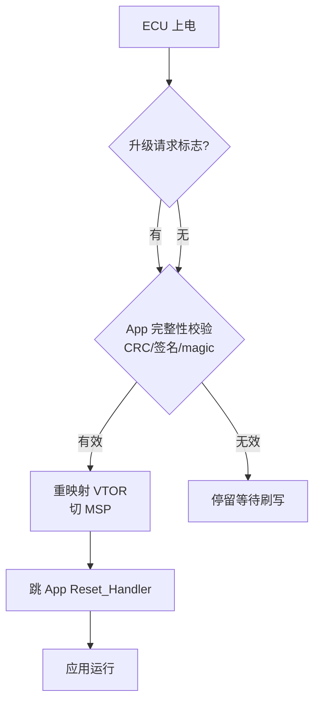
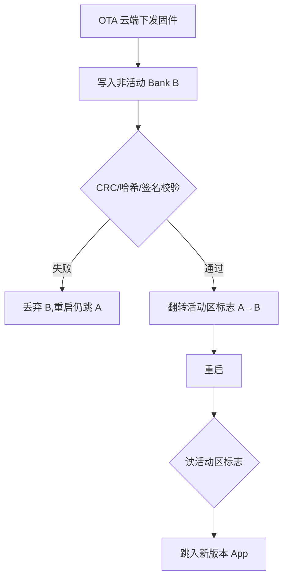

# 诊断与刷写：UDS、Bootloader 与 OTA 全链路

## 一、凌晨三点的"变砖"警报

某次整车 OTA 推送后，一台试制车在软件重启后彻底"失联"——CAN 总线再无应答，诊断仪连不上，充电枪插上也无反应。研发群凌晨炸锅。最后定位到：工程师把刷写流程里的"校验通过再切换活动区"这一句漏写了，升级中途掉电，旧 App 已被部分擦除、新 App 还没写完，Bootloader 两端都不认，ECU 直接变砖。

这正是底层软件工程师最怕也最该懂的场景：**诊断（UDS）、Bootloader 与 OTA 不是三个孤立话题，而是一条从云端到 Flash 的生死链路**。链路任意一环失守，轻则召回刷写，重则整车失控。本文把这条链路的机制、代码、坑与面试要点一次讲透。

---

## 二、核心原理：从诊断服务到固件落地

### 2.1 UDS 是"车上的问诊台"

UDS（Unified Diagnostic Services，ISO 14229）不是传输协议，而是一套**应用层诊断服务**。它跑在 CAN / CAN FD / DoIP 之上，定义了 ECU 该怎样响应"读数据、写参数、清故障、刷固件"等请求。常用服务：

| SID | 服务 | 作用 |
|-----|------|------|
| 0x10 | Diagnostic Session Control | 切换会话（默认/扩展/编程） |
| 0x22 | Read Data By Identifier | 读标定/版本/状态 |
| 0x2E | Write Data By Identifier | 写参数 |
| 0x14 / 0x19 | Clear / Read DTC | 清除 / 读取故障码 |
| 0x27 | Security Access | 种子-密钥安全访问 |
| 0x34 / 0x36 / 0x37 | Request Download / Transfer Data / Request Transfer Exit | 刷写三段式 |
| 0x31 | Routine Control | 执行指定例程（如校验） |

类比：UDS 像医院的挂号分诊台——你（诊断仪）说"我要验血"（0x22 读某个 DID），护士（ECU）按规则回数据；但你不能说"我要动手术"就直接进手术室，得先过"授权闸机"（0x27 安全访问）。

### 2.2 安全访问：种子-密钥挑战

为防止未授权刷写或篡改参数，进入编程会话、执行刷写前必须过 0x27。流程：

```
诊断仪请求 0x27 0x01  → ECU 回种子 seed(随机数)
诊断仪用私有算法算 key = f(seed) → 发送 0x27 0x02 key
ECU 本地算 f(seed)，与 key 比对，一致才解锁
```

密钥算法在产线/研发侧保密，逆向者拿不到 seed-key 映射就无法刷写。**注意：seed 每次必须不同，否则重放攻击可绕过。**

### 2.3 Bootloader：上电先决定"我是谁"

ECU 上电永远先跑 Bootloader（驻留在 Flash 前几 sector），它做三件事：

1. 检查"升级请求标志"（来自 UDS 会话、引脚、或 OTA 标记）；
2. 校验 App 的完整性（CRC / 签名 /  magic word）；
3. 有效则跳 App，否则停留等待刷写。

跳转核心是 **VTOR（向量表偏移寄存器）重映射**。App 的向量表首项是 MSP 初始值，第二项是 App 的 Reset_Handler。跳转伪代码：

```c
typedef void (*pFunc)(void);
void JumpToApp(uint32_t appAddr) {
    uint32_t msp = *(volatile uint32_t*)appAddr;          // 向量表[0] = MSP
    uint32_t reset = *(volatile uint32_t*)(appAddr + 4);  // 向量表[1] = Reset_Handler
    if ((msp & 0xFFFF0000) != 0x20000000) return;        // 栈顶合法性粗检
    __set_MSP(msp);                                       // 切换主栈指针
    SCB->VTOR = appAddr;                                  // 重映射向量表
    ((pFunc)reset)();                                     // 跳 App 复位向量
}
```



> 图：Bootloader 上电后的跳转决策流程，校验通过才重映射向量表并跳入 App。

### 2.4 A/B Bank：让升级"原子化"

Flash 擦写寿命有限且不能边执行边擦同区。双 Bank 方案把 Flash 分为 A、B 两个独立区：

- 当前运行在 A（活动区）；
- OTA 把新固件写入 **B（非活动区）**；
- 写完后做 CRC / 哈希 / 签名校验；
- **只有校验通过才翻转"活动区标志"**；
- 重启后 Bootloader 读标志，跳入新版本。

中途掉电？B 没写完，标志没翻，重启仍跳 A——旧版本完好。这就是"失败了能回滚"的本质。



> 图：A/B 双 Bank OTA 流程，只有校验通过才翻转活动区标志，实现失败回滚。

### 2.5 OTA：从云端到 Flash 的搬运

OTA（Over-The-Air）把链路拉长到车云：

```
云端打包(差量/全量) → 经 T-Box/网关下发 → ECU 接收(可能分块、断点续传)
→ Bootloader 写非活动 Bank → 签名验签 → 标志翻转 → 重启生效
```

安全三件套：**签名验签**（防恶意固件）、**加密传输**（防窃听/篡改）、**回滚机制**（防半成品）。

---

## 三、关键代码与刷写时序

### 3.1 标准刷写时序（编程会话内）

```
诊断仪                          ECU(Bootloader)
  │                                  │
  ├─ 0x10 0x02 (扩展会话) ───────► │
  │◄──── 0x50 0x02 ────────────────┤
  ├─ 0x27 0x01 (请求seed) ───────► │
  │◄──── seed ──────────────────────┤
  ├─ 0x27 0x02 key ──────────────► │  (比对通过才解锁)
  │◄──── 0x67 0x02 (解锁OK) ───────┤
  ├─ 0x31 例程: 预检查 ──────────► │
  ├─ 0x34 请求下载(地址/长度) ────► │
  │◄──── 0x74 (可接受) ────────────┤
  ├─ 0x36 传输数据(块1) ─────────► │  (循环多块)
  ├─ 0x36 传输数据(块N) ─────────► │
  ├─ 0x37 退出传输 ──────────────► │
  ├─ 0x31 例程: 校验CRC/哈希 ────► │
  │◄──── 校验通过 ──────────────────┤
  ├─ 0x11 0x01 (复位) ───────────► │ → 重启跳新App
```

### 3.2 Flash 驱动注意点

- 擦除按 sector（整块清 1），编程按 word / page；
- **Flash 擦写时不可执行该区代码**——Bootloader 自身若在被擦区，必须搬进 RAM 运行，或运行时处在另一 Bank；
- 写前必须擦除，且写操作期间要关中断或保证看门狗不被饿死（长擦除需喂狗策略）。

```c
/* 伪代码：Flash 写一页（关键区需先拷到 RAM 执行） */
flash_unlock();
flash_erase_sector(target_sector);
for (i = 0; i < PAGE_WORDS; i++) {
    flash_program_word(dst + i*4, src[i]);
    if (flash_get_status() != OK) goto fail; /* 立即检错 */
}
flash_lock();
if (crc32(dst, len) != expected) goto fail;  /* 写后回读校验 */
```

---

## 四、常见坑与调试手段

1. **掉电变砖**：未做 A/B 或"先擦后写无回滚"。调试：Bootloader 必须有"有效 App 校验"兜底，且活动标志**最后才写**。用 J-Link 救砖时先 dump Flash 看标志位状态。

2. **跳转后 HardFault**：最常见是 VTOR 没改或 MSP 没切，App 用了 Bootloader 的栈；或 App 的 `__initial_sp` 越界（栈顶不在 SRAM 区间）。调试：跳转前打印 `appAddr`、`msp`、`reset` 三值，确认 MSP 落在 0x2000_xxxx 合法区间。

3. **安全访问死循环**：seed 不变导致重放，或 key 算法两端不一致（研发/产线用的算法版本不同）。调试：log 每次 seed，确认随机；用同一套算法库编译两端。

4. **CAN FD 刷写帧被当错误帧**：FD 标志（FDF/BRS）未正确设置，旧控制器收到 FDF=1 会判错误帧。调试：逻辑分析仪抓帧，确认 FDF 位与仲裁/数据段速率切换，参考动态 FD 标志方案——用标定变量运行时决定帧类型，一套代码覆盖双协议。

5. **擦写期间看门狗复位**：大块擦除超时喂狗。调试：擦除前延长 WDT 窗口或进临界区时临时暂停 WDT，擦完立即恢复。

---

## 五、面试高频要点

- **0x27 安全访问干什么？** 种子-密钥挑战，防未授权诊断/刷写；seed 必须随机防重放。
- **Bootloader 怎么跳 App？** 校验 App 有效 → VTOR 重映射向量表 → 切 MSP → 跳 Reset_Handler。
- **升级中途掉电怎么办？** A/B 双 Bank，写非活动区，校验通过才翻转活动标志；失败重启回旧版本。
- **OTA 安全怎么保证？** 签名验签 + 加密传输 + 回滚机制，三者缺一不可。
- **Flash 为什么不能边跑边擦同区？** 取指与擦除冲突会跑飞；需 RAM 执行或跑在另一 Bank。

---

*（全文约 2300 字，基于 ISO 14229 / 资料模块十一整理，型号参数采用笼统指代。）*
