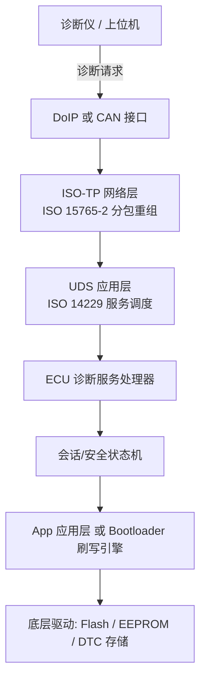
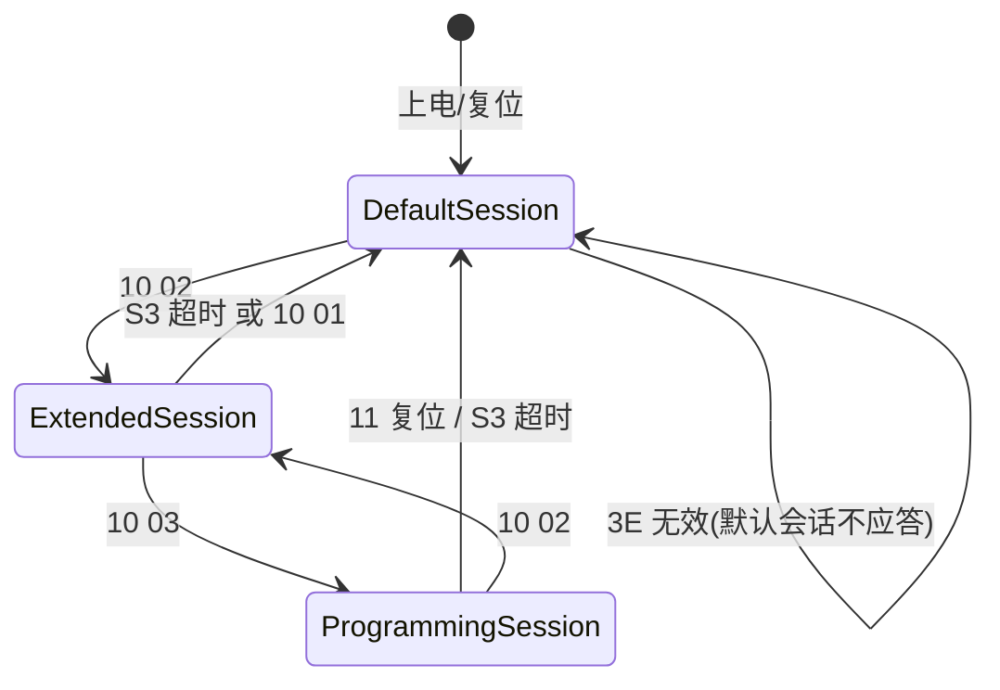
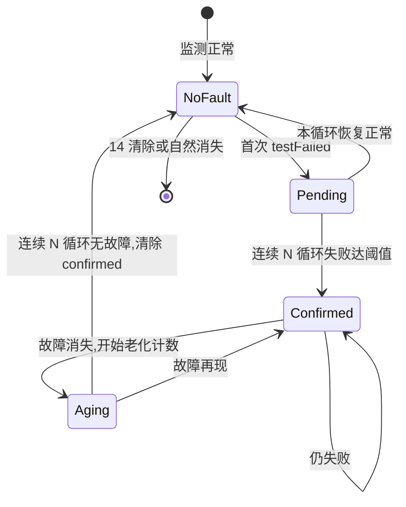
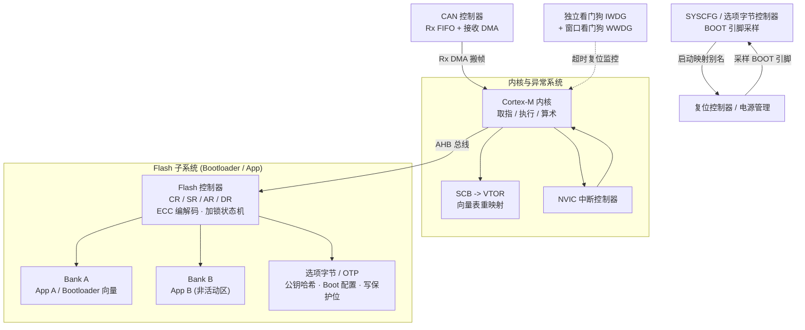
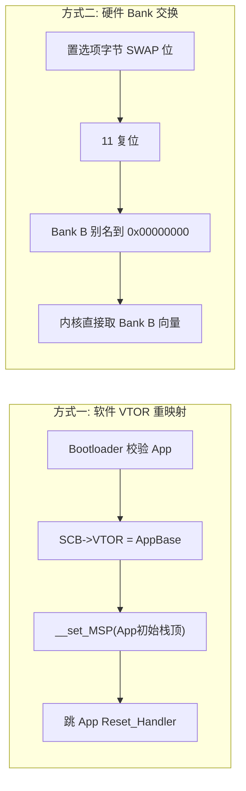
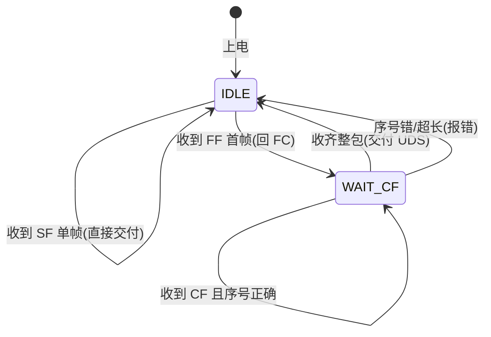
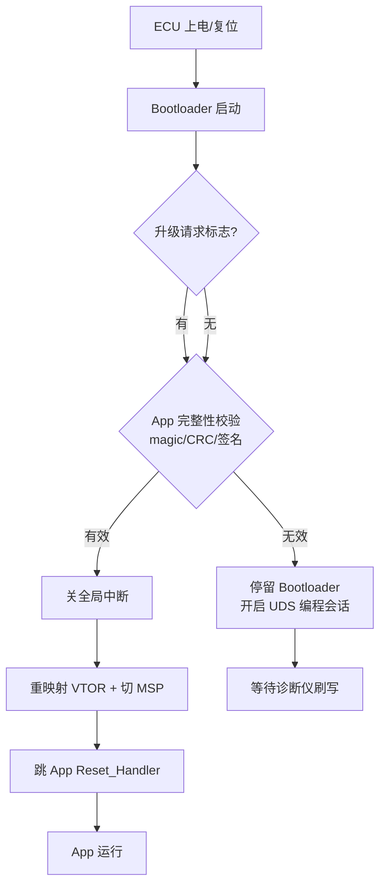
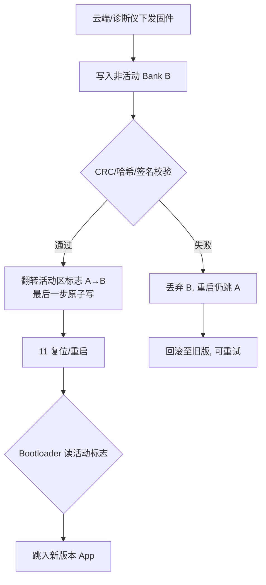
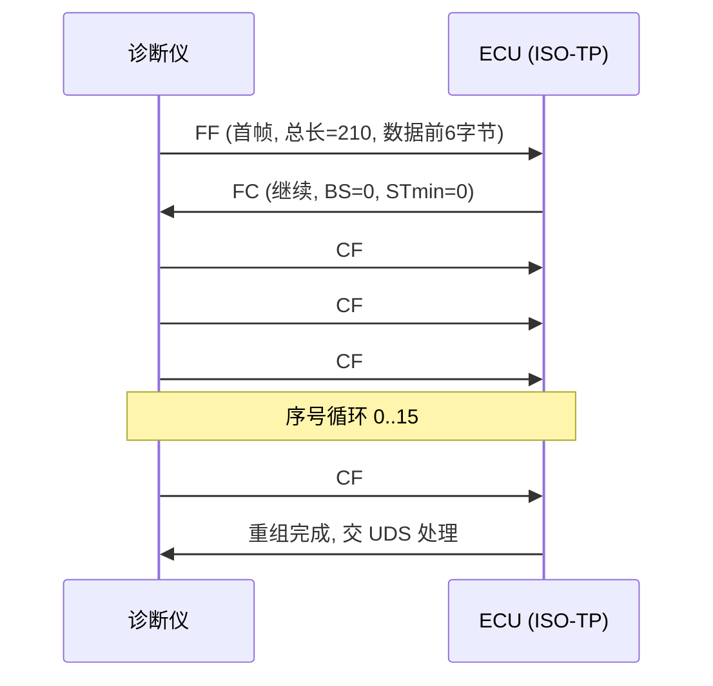
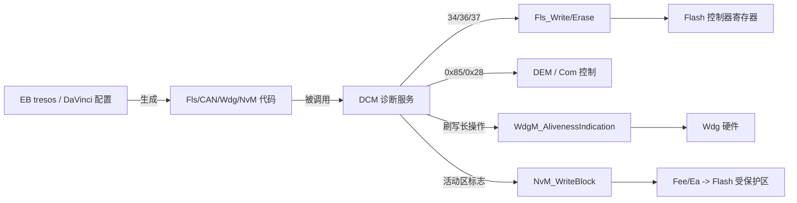

# 深度技术章节：UDS 诊断协议与 Bootloader 刷写全链路（工业级增强版）

> 本文面向从事车载嵌入式、底盘与动力域控制器、智能座舱以及远程刷写（OTA）相关开发的底层软件工程师。笔者将以 ISO 14229（UDS）、ISO 15765-2（ISO-TP）、ISO 13400（DoIP）、AUTOSAR 诊断栈等真实标准与工具为锚点，把"诊断会话—安全访问—DTC 管理—芯片模块架构—Flash 驱动—Bootloader 架构—刷写时序—刷写安全—MCAL 配置—工程化工具—典型缺陷—面试要点"这条链路一次讲透。所有代码示例均可映射到真实 MCU（以 ARM Cortex-M 系列为典型）的工程实践，型号与参数采用通用化指代，不依赖任何特定厂商私有文档。
>
> 相比基础版本，本版**重点新增三大核心章节**：**A. 芯片模块设计（IP 内部架构）**、**B. 驱动代码实现（真实可读 C）**、**C. MCAL 配置说明（AUTOSAR 刷写相关模块）**，并对原有 UDS 会话、核心服务、DTC、安全访问、Bootloader 架构、刷写流程、刷写安全、工具链与调试章节做了深化。

---

## 一、为什么诊断与刷写是底层工程师的"生死线"

在笔者参与的多个量产车型项目中，出现过这样一个值得反复复盘的场景：某次整车软件推送后，一台试制车在软件重启后彻底"失联"——CAN 总线再无应答，诊断仪连不上，充电枪插上也无反应。研发群凌晨炸锅。最后定位到，刷写流程里的"校验通过再切换活动区"这一句被漏写，升级中途掉电，旧 App 已被部分擦除、新 App 还没写完，Bootloader 两端都不认，ECU 直接变砖。

这正是底层软件工程师最怕也最该懂的场景：**诊断（UDS）、Bootloader 与 OTA 不是三个孤立话题，而是一条从云端到 Flash 的生死链路**。链路任意一环失守，轻则现场召回刷写，重则整车功能失控。本章把这条链路的机制、代码、坑与面试要点一次讲透。

需要明确的是，UDS（Unified Diagnostic Services，统一诊断服务，ISO 14229 系列）本身**不是传输协议**，而是一套定义于应用层（ISO/OSI 第 7 层）的诊断服务规范。它可以承载于经典 CAN（ISO 11898）、CAN FD、LIN、FlexRay，也可承载于基于以太网的 DoIP（Diagnostic over IP，ISO 13400）。当诊断报文需要传输超过 8 字节（经典 CAN）或 64 字节（CAN FD 单帧上限）的有效载荷时，还要依赖 ISO 15765-2 定义的网络层传输协议 ISO-TP 来分包与重组。这三者的关系可以这样理解：



> 图 1：UDS 在协议栈中的位置。应用层服务（ISO 14229）依赖网络层（ISO 15765-2）做长报文分段，再经由 CAN/DoIP 物理传输到达 ECU 内部的诊断服务处理器。

---

## 二、UDS 概览与诊断会话管理（0x10）

### 2.1 诊断会话的本质

诊断会话（Diagnostic Session）是 ECU 对外暴露的"工作模式"。不同会话下，ECU 允许执行的服务集合、资源占用、时序约束都不一样。UDS 中由服务 `0x10 DiagnosticSessionControl` 负责切换，请求格式为 `10 <session>`。

ISO 14229 规定了若干标准会话，工程上最常用的是三种：

| 会话 ID | 名称 | 典型用途 | 默认启用的服务限制 |
|---------|------|----------|-------------------|
| 0x01 | 默认会话（Default Session） | 上电后的常规状态，允许基本读 DTC、读数据 | 禁止写、禁止刷写、禁止例程控制 |
| 0x02 | 扩展会话（Extended Session） | 产线标定、参数写入、读取内部信息 | 允许 2E 写、部分 31 例程 |
| 0x03 | 编程会话（Programming Session） | 固件刷写（34/36/37 流程） | 必须经过 27 安全解锁，禁止常规应用诊断 |
| 0x04+ | ECU 自定义会话 | 厂商私有模式，如标定会话、运输模式 | 由厂商规范定义 |

需要强调的是：进入编程会话（0x03）**并不等于**立即可以刷写。绝大多数量产 ECU 要求在进入编程会话后、发起 `0x34` 请求下载之前，必须完成 `0x27` 安全访问解锁，并且常常还要先通过 `0x31` 例程控制执行"预编程条件检查"（如车速为零、电压在允许区间、无当前高优先级故障）。这是刷写安全的第二道闸门。

### 2.2 会话超时（S3 Server）与会话保持

UDS 规定 ECU 在默认会话之外，如果一段时间内（由 `S3_Server` 参数定义，典型值 5000 ms）没有收到任何诊断请求，应自动回落到默认会话。诊断仪为了维持在扩展/编程会话中，必须周期性发送 `0x3E TesterPresent` 保活帧，告诉 ECU"我还在线，别掉会话"。这块将在 2.9 节详述。



> 图 2：诊断会话状态机。会话之间通过 0x10 切换，任何非默认会话都会在 S3 超时后回落默认会话。

---

## 三、核心服务详解

UDS 的服务众多，笔者挑出工程中最常用、也最容易出问题的若干个服务逐一拆解。

### 3.1 0x10 Diagnostic Session Control（会话控制）

如前所述，0x10 用于切换会话。响应为 `50 <session> <P2_server_max> <P2*_server_max>`，其中返回的两个时间参数（P2 与 P2*）告诉诊断仪 ECU 承诺的最大响应时间，诊断仪据此设置超时。负响应以 `7F 10 <NRC>` 形式返回，常见否定响应码（NRC）包括 `0x12`（子功能不支持）、`0x22`（条件不满足，例如当前不允许进编程会话）。

### 3.2 0x22 Read Data By Identifier（按标识符读数据）

`0x22` 通过数据标识符（DID，Data Identifier）读取数据，请求 `22 <DID_high> <DID_low>`。DID 是 2 字节编号，常见的有：

- 0xF100~0xF1FF 系列：零件号、供应商 ID、ECU 序列号、硬件/软件版本号；
- 0xF18x 系列：ECU 标识、诊断固件标识；
- 厂商自定义 DID：标定版本、运行状态字、累计运行时间等。

`0x22` 在默认会话下通常即可使用（读版本号、读故障状态），是产线与售后最频繁调用的服务之一。需要注意的是，某些敏感 DID（如 VIN 的最后几位、防篡改标识）可能受安全访问或会话限制保护。

### 3.3 0x2E Write Data By Identifier（按标识符写数据）

`0x2E` 与 `0x22` 相对，用于写入数据，请求 `2E <DID> <data>`。典型场景是写 VIN、写标定参数、写配置字。写操作通常需要处于扩展会话且可能需要安全解锁，且写完后应回读确认。伪代码形式如下：

```c
/* 伪代码：WriteDataByIdentifier 服务处理（节选） */
int uds_2e_handler(uint16_t did, const uint8_t *data, uint16_t len)
{
    if (current_session < SESSION_EXTENDED)
        return NRC_CONDITIONS_NOT_CORRECT;        /* 必须在扩展会话 */
    if (did_need_security(did) && !security_unlocked)
        return NRC_SECURITY_ACCESS_DENIED;        /* 敏感 DID 需先解锁 */

    switch (did) {
    case DID_VIN:
        if (len != 17) return NRC_INCORRECT_MESSAGE_LEN;
        return eeprom_write(VIN_ADDR, data, len);
    case DID_CALIB_VERSION:
        return calib_write(data, len);
    default:
        return NRC_REQUEST_OUT_OF_RANGE;
    }
}
```

### 3.4 0x27 Security Access（安全访问）

`0x27` 是刷写与敏感操作的总闸门，详见第五章专述。核心是对"种子（seed）—密钥（key）"挑战应答。

### 3.5 0x11 ECU Reset（ECU 复位）

`0x11` 请求 ECU 复位，子功能包括 `0x01` 硬件复位、`0x02` 密钥关电复位（Key-Off-On Reset）、`0x03` 软件复位。刷写流程最后一步通常发送 `11 01` 让 ECU 重启并跳入新固件。需要注意的是：复位前必须确保 Flash 操作已完成、看门狗配置合理，否则可能出现"复位后第一次启动校验失败"的怪象。

### 3.6 0x19 Read DTC Information（读故障码信息）

`0x19` 是 DTC 读取的核心服务，功能极其丰富，通过子功能区分不同读取方式：`0x01` 报告已记录的 DTC 数量、`0x02` 报告 DTC 快照（Snapshot）信息、`0x06` 报告扩展数据记录、`0x0A` 报告以"镜像"格式支持的 DTC。它与 `0x14` 配合，构成售后诊断读取故障码的完整方案。详见第四章。

### 3.7 0x14 Clear Diagnostic Information（清除诊断信息）

`0x14` 请求清除 DTC，格式 `14 <group_high> <group_mid> <group_low>`，用 `FFFFFF` 表示全部清除。清除前通常要求某些条件（如无当前故障、车辆静止），且清除以"DTC 组"为粒度。注意：清除操作本身是受监管的动作，部分法规相关 DTC（如排放相关）在某些地区不允许被随意清除。

### 3.8 0x3E Tester Present（诊断仪在线保活）

`0x3E` 子功能 `0x80` 表示"不需要正响应"（抑制响应位已置位时不回正响应，仅回负响应），子功能 `0x00` 正常回 `7E 00`。诊断仪靠它维持非默认会话，避免 S3 超时掉会话。工程上要注意：连续狂发 3E 可能挤占总线带宽，应合理设定周期（典型 2000~4000 ms）。

### 3.9 0x85 Control DTC Setting（控制 DTC 设置）

`0x85` 用于控制 ECU 是否继续记录/更新 DTC。子功能 `0x01` 关闭 DTC 设置（On），`0x02` 开启（Off），同样可用 `0x80` 抑制正响应。刷写前通常先 `85 02`（停止 DTC 记录），因为刷写过程中 ECU 重启、通信中断会产生大量"假故障"；刷写完成后 `85 01` 恢复 DTC 记录。这与 `28`（通信控制，停止/恢复应用报文发送）常常配合使用。

下表汇总了上述核心服务：

| SID | 服务名 | 常用子功能 | 典型会话要求 | 是否需要 27 解锁 |
|-----|--------|-----------|--------------|-----------------|
| 0x10 | Diagnostic Session Control | 01/02/03 会话 | 任意 | 否 |
| 0x22 | Read Data By Identifier | —（按 DID） | 默认即可（多数） | 视 DID |
| 0x2E | Write Data By Identifier | —（按 DID） | 扩展 | 视 DID |
| 0x27 | Security Access | 01/03/05…请求seed，02/04/06…发key | 扩展/编程 | 自身 |
| 0x11 | ECU Reset | 01/02/03 | 扩展/编程 | 部分 |
| 0x19 | Read DTC Information | 01/02/06/0A | 默认 | 否 |
| 0x14 | Clear Diagnostic Information | —（按组） | 扩展 | 否（常） |
| 0x3E | Tester Present | 00/80 | 任意 | 否 |
| 0x85 | Control DTC Setting | 01/02 | 扩展/编程 | 否 |
| 0x34 | Request Download | — | 编程 | 是 |
| 0x36 | Transfer Data | —（按块序号） | 编程 | 是 |
| 0x37 | Request Transfer Exit | — | 编程 | 是 |
| 0x31 | Routine Control | 01启动/02停止/03结果 | 扩展/编程 | 视例程 |

---

## 四、DTC（Diagnostic Trouble Code）结构详解

### 4.1 DTC 编码规则

DTC（故障诊断码）在 UDS 中以 3 字节（24 位）编码，传统上沿用 SAE J2012 / ISO 15031 的编码体系，划分为：

- **高字节（bit23~16）**：故障系统/主体（如 P=动力总成、C=底盘、B=车身、U=网络/通信）；
- **中字节（bit15~8）**：故障子系统或具体部件；
- **低字节（bit7~0）**：具体故障类型（开路、短路到地、信号不合理等）。

在 UDS `0x19` 响应中，DTC 常以"3 字节 DTC + 1 字节状态掩码（DTC Status Byte）"形式返回。状态掩码每一位都有明确语义，这是售后判读故障的关键：

| 状态位 | 名称 | 含义 |
|--------|------|------|
| bit0 | testFailed | 当前测试已失败 |
| bit1 | testFailedThisOperationCycle | 本次操作循环内曾失败 |
| bit2 | pendingDTC | 待定（可能将确认） |
| bit3 | confirmedDTC | 已确认（已老化计数达到阈值） |
| bit4 | testNotCompletedSinceLastClear | 自上次清除后未测完 |
| bit5 | testFailedSinceLastClear | 自上次清除后曾失败 |
| bit6 | testNotCompletedThisOperationCycle | 本次循环未测完 |
| bit7 | warningIndicatorRequested | 请求点亮报警灯 |

### 4.2 快照（Snapshot）与扩展数据（Extended Data）

当某个 DTC 首次被确认为"失败"时，ECU 会顺带记录**快照数据**（Snapshot，也称 Freeze Frame）：即故障发生瞬间的运行环境，如车速、发动机转速、环境温度、电压、相关信号值。这些快照通过 `0x19 0x02/0x04` 读取，对售后定位"故障是怎么发生的"价值极大。

**扩展数据记录**（Extended Data Record）则记录与故障相关的统计量，如故障发生次数、老化计数器当前值、特定的运行计数器。通过 `0x19 0x06` 读取。

### 4.3 故障的老化（Aging）与确认（Confirmation）

DTC 从"出现"到"确认"再到"老化消失"有一套状态机逻辑，这是诊断可靠性的核心：

1. **首次失败**：监测到故障条件，置 `testFailed`，记录快照，进入 `pending`；
2. **确认（confirmed）**：同一故障在连续若干操作循环（如 2~3 个驾驶循环）内持续/累积出现，达到确认阈值，置 `confirmedDTC`；
3. **修复与老化**：故障不再出现，且经过连续 N 个无故障的操作循环（老化计数，典型 40 个循环，由 `DemAgingThreshold` 配置），`confirmedDTC` 被清除，DTC 从内存移除或标记为非活跃；
4. **清除**：通过 `0x14` 主动清除，会同时清掉快照与扩展数据。

这套机制避免了偶发抖动被误判为"需要维修的硬故障"，也避免了故障修好后仍长期亮灯。AUTOSAR 的 DEM（Diagnostic Event Manager）模块正是实现这套状态机的标准组件。



> 图 3：DTC 生命周期状态机（简化）。老化计数器决定是否将 confirmed 清除，确认阈值决定何时升级为 confirmed。

---

## 五、安全访问 0x27：种子-密钥机制深度剖析

### 5.1 为什么需要安全访问

如果任何诊断仪都能随意进编程会话、写参数、刷固件，那么整车的安全与防盗体系形同虚设。UDS 用 `0x27` 安全访问在逻辑层构建一道"授权闸机"：只有掌握私有算法的诊断仪，才能算出正确的密钥解锁敏感操作。

请求-响应流程（以 level 1 为例，奇数子功能请求 seed，偶数子功能回 key）：

```
诊断仪 → ECU: 27 01                 （请求种子）
ECU → 诊断仪: 67 01 <seed[4]>       （返回 4 字节随机种子）
诊断仪本地计算: key = f(seed, 私有密钥)
诊断仪 → ECU: 27 02 <key[4]>        （提交密钥）
ECU 本地计算: expected = f(seed, 私有密钥)
ECU → 诊断仪: 67 02                 （一致则解锁成功）
             或 7F 27 35             （不一致，NRC 0x35 无效密钥）
```

### 5.2 算法设计要点

- **seed 必须随机且每次不同**：若 seed 固定，攻击者可预先算好 key 重放，安全形同虚设。工程上 seed 应来自硬件 TRNG 或至少是由时间戳/ADC 噪声/计数器混合生成的伪随机源。
- **key 算法属于机密**：通常是对 seed 做异或链、查表、线性反馈移位寄存器（LFSR）或更复杂的对称变换，关键在于 ECU 与产线/研发诊断仪端使用**同一套算法库**。两端算法版本不一致是工程上最常见的"解锁死循环"根因。
- **防暴力破解**：ECU 端必须维护失败计数器。连续失败达到阈值（如 3 次）后锁定一段时间（延迟计数，如 10 秒甚至更久），且在此期间即便给出正确 key 也不受理，直到延迟结束或 ECU 复位。延迟时间应随失败次数指数增长，抬高暴力枚举成本。

```c
/* 伪代码：Security Access 27 处理（含失败计数与延迟） */
#define MAX_ATTEMPT 3
static uint8_t fail_count = 0;
static uint32_t lock_until_ms = 0;

int uds_27_handler(uint8_t sub, const uint8_t *payload)
{
    if (sub == 0x01) {                       /* 请求 seed */
        if (sys_now() < lock_until_ms)
            return NRC_EXCEED_NUMBER_OF_ATTEMPTS;  /* 仍处于锁定 */
        uint32_t seed = trng_generate();
        store_seed(seed);
        send_response(0x67, 0x01, seed);
        return OK;
    }
    if (sub == 0x02) {                       /* 提交 key */
        if (sys_now() < lock_until_ms)
            return NRC_EXCEED_NUMBER_OF_ATTEMPTS;
        uint32_t expected = key_algo(get_seed());
        uint32_t given = read_u32(payload);
        if (expected == given) {
            fail_count = 0;
            security_unlocked = true;
            return OK;
        } else {
            if (++fail_count >= MAX_ATTEMPT) {
                lock_until_ms = sys_now() + (10000u << (fail_count - MAX_ATTEMPT)); /* 指数退避 */
            }
            return NRC_INVALID_KEY;
        }
    }
    return NRC_SUBFUNCTION_NOT_SUPPORTED;
}
```

### 5.3 多级安全访问

量产车通常不止一级安全。例如 level 1（0x01/0x02）用于解锁一般参数写，level 3（0x03/0x04）用于解锁刷写，level 5（0x05/0x06）用于解锁更敏感的防盗/里程相关操作。不同 level 对应不同的算法与密钥，互不通用。

### 5.4 抗重放与抗旁路

除了"seed 随机"外，还应做到：解锁状态与会话绑定——退出会话（如 S3 超时、11 复位）后安全状态自动清除，必须重新解锁。这样即便攻击者抓到一次"seed+key"包，也无法在另一次会话中重放使用（下次 seed 不同）。部分高安全等级 ECU 还会对关键操作再做一次挑战，避免"解锁一次用到底"。

---

## 六、芯片模块设计（IP 内部架构）【新增 A】

本章是工业级深度增强的核心之一。要写出稳健的 Bootloader 与刷写引擎，不能只停留在"调用库函数"，必须理解 MCU 内部 **Bootloader/Flash 子系统的 IP 架构**：内核如何取指、Flash 控制器如何锁存命令、双 Bank 如何实现"边运行边擦写另一区"、看门狗如何防止卡死、CAN 接收如何不丢帧、复位与 Boot 引脚如何决定启动映射、向量表如何重映射。笔者按通用 MCU（类 Cortex-M 架构）的 IP 组织方式逐层拆解。

### 6.1 MCU 内 Bootloader/Flash 子系统总览

下面的框图给出了一个典型的、可映射到多种量产 MCU 的子系统架构。它把内核、Flash 控制器、双 Bank、选项字节/OTP、看门狗、CAN 接收通道、复位/ Boot 引脚采样、向量表重映射（VTOR）作为一个协同整体呈现：



> 图 7：芯片模块架构框图。内核经 AHB 访问 Flash 控制器；控制器管理双 Bank 与 OTP；CAN 接收经 DMA 搬入 RAM 供 ISO-TP 重组；复位时采样 BOOT 引脚决定 0x00000000 映射；VTOR 决定向量表位置。

关键要点：

- **内核取指路径**：Cortex-M 复位后从地址 `0x00000000` 取出 MSP 初始值，从 `0x00000004` 取出复位向量。该地址并非物理固定，而是**启动别名**——复位控制器根据 BOOT 引脚与选项字节把 Flash Bank A、Bank B、系统存储器或 SRAM 之一映射到 `0x00000000`。
- **Flash 控制器的职责**：内核发出的"读指令/读数据"由控制器经 ECC 校验返回；"擦除/编程"命令通过写 CR/SR/AR/DR 寄存器触发，控制器内部状态机执行高压/时序操作，期间置 BSY 忙标志。
- **CAN 接收 DMA**：低成本 MCU 的 CAN 控制器只有 2~3 级 Rx FIFO，高速刷写（CAN FD / 小 STmin）时容易溢出。带接收 DMA 的控制器可把接收到的 CAN 帧直接搬入 RAM 环形缓冲，ISO-TP 重组任务从容读取，从根本上消除丢帧。

### 6.2 Flash 控制器：寄存器与位域（控制/状态/地址/数据、ECC、加锁）

Flash 控制器是一组存储器映射寄存器。下面给出符合常见实现的通用寄存器组（偏移为通用化示意，非特定厂商）：

| 偏移 | 寄存器 | 名称 | 主要作用 |
|------|--------|------|----------|
| 0x00 | FLASH_ACR | 访问控制 | 等待周期 LATENCY、预取/缓存使能、ECC 错误标志 |
| 0x04 | FLASH_KEYR | 密钥寄存器 | 写入 KEY1/KEY2 解锁 CR.LOCK |
| 0x0C | FLASH_SR | 状态寄存器 | BSY / EOP / WRPERR / PGERR / OPERR |
| 0x10 | FLASH_CR | 控制寄存器 | PG / SER / MER / SNB / PSIZE / STRT / LOCK |
| 0x14 | FLASH_AR | 地址寄存器 | 擦除/编程目标地址 |
| 0x1C | FLASH_WRPR | 写保护寄存器 | 每扇区 1 位写保护（0=保护，1=可写） |

**ECC（错误校正码）**：Flash 阵列按"字线"组织，每条字线（如 64 位或 128 位）附带若干 ECC 校验位。读取时 ECC 逻辑可**纠正 1 位翻转、检测 2 位翻转**；出现 2 位不可纠正错误时置位 ACR 中的 ECC 错误标志并触发 BusFault。刷写引擎读回校验时应同时检查 ECC 标志，避免静默数据损坏。

**加锁（Lock）**：CR 的 LOCK 位在复位后默认为 1（锁定）。任何擦除/编程命令必须先解锁（向 KEYR 依次写入两个密钥），否则命令被忽略并报错。操作完成后应重新加锁，防止意外写入。

**控制寄存器（FLASH_CR）位域**用 mermaid 的 block-beta 表示如下（MSB 在左、LSB 在右）：


> 图 8：Flash 控制寄存器（FLASH_CR）位域示意（MSB 在左）。实际位分配随器件不同，但"PG / SER / MER / SNB / PSIZE / STRT / LOCK"这组控制位在常见 Cortex-M 系 MCU 中高度一致；工程上请以器件参考手册的精确位号为准。

**状态寄存器（FLASH_SR）位域**：


**扇区写保护位域（FLASH_WRPR）**：每扇区 1 位，0 表示该扇区被写保护，1 表示允许写入。典型 12 扇区器件的保护位域如下：


> 图 9：Flash 扇区写保护位域（FLASH_WRPR）。每一列对应一个物理扇区的写保护位，Bootloader 所在扇区通常默认置 0（写保护），防止刷写脚本误擦 Bootloader 自身。

### 6.3 双 Bank / 双分区布局与地址映射

双 Bank 把主 Flash 分为两块独立阵列，每块的擦除/编程互不影响，因而支持"从一块取指执行、对另一块擦写"（Read-While-Write）。通用布局如下：

```
0x0800_0000 +-----------------------------+
            |  Bank A (扇区 0..N)          |
            |  - Bootloader (扇区0起)      |
            |  - App A 活动区              |
0x0804_0000 +-----------------------------+
            |  Bank B (扇区 N+1..2N)       |
            |  - App B 非活动区            |
0x0808_0000 +-----------------------------+
            |  选项字节 / OTP / 配置区      |
0x0808_4000 +-----------------------------+
            |  DTC / 标定 / 活动区标志      |
0x0808_8000 +-----------------------------+
```

- **Bank A** 起始于 `0x08000000`，复位默认映射；Bootloader 固化于 Bank A 前几个扇区，其复位向量决定 MCU 上电永远先跑 Bootloader。
- **Bank B** 是与 Bank A 同构的独立阵列，平时作为"非活动区"承载待升级的新固件。
- 某些 MCU 支持**硬件 Bank 交换**：设置选项字节的 SWAP 位后，复位把 Bank B 别名到 `0x00000000`，于是无需修改 VTOR 即可让 Bank B 成为启动区。这与软件 VTOR 重映射是两条互补路径（见 6.7）。

### 6.4 看门狗：防止刷写卡死

刷写过程常伴随大扇区擦除（数十毫秒到数百毫秒），若期间不喂狗，独立看门狗 IWDG（由 LSI 低速时钟驱动，不可关闭）会触发复位，导致刷写中断、标志不一致而变砖。窗口看门狗 WWDG 则要求在特定窗口内喂狗，能更早暴露"卡死在死循环"的异常。

工程上的喂狗策略有两类：

1. **轮询式**：把 Flash 擦除/编程放在循环里，每等一次状态寄存器 BSY 清空前先喂一次 IWDG；
2. **RAM 执行 + 中断喂狗**：把 Flash 驱动拷到 RAM 执行，用定时器中断周期性喂狗，主循环不被长擦除阻塞。

无论哪种，都必须在"置活动区标志"之后、执行 `11 复位` 之前停止喂狗或确保复位后看门狗配置正确，避免"复位瞬间狗还饿着"导致反复复位。

### 6.5 CAN 接收缓冲 / DMA

诊断报文到达 CAN 控制器后，先进入 Rx FIFO（通常 2~3 个邮箱）。若 MCU 主循环处理不及时（如正在长擦除），FIFO 溢出则丢帧。带 **接收 DMA** 的器件可配置：CAN 接收中断触发 DMA，把帧 ID + 数据搬入 RAM 环形缓冲，再由诊断任务分批取出做 ISO-TP 重组。这对高带宽刷写（小 STmin、CAN FD）尤为关键，是"收得快、处理慢"难题的硬件解法。

### 6.6 复位、Boot 引脚与选项字节

复位控制器在释放复位信号前的最后一个时钟周期采样以下信息决定启动映射：

- **BOOT0 引脚**（外部电平）；
- **选项字节 nBOOT1 / nBOOT0**（OTP/Flash 中的用户配置位）；
- **选项字节 nSWAP_BANK**（双 Bank 交换位）。

组合结果决定 `0x00000000` 映射到：主 Flash（Bank A）、系统存储器（出厂 Bootloader，用于 UART/USB 恢复）、SRAM，或（交换后）Bank B。量产车通常把 BOOT0 拉低、选项字节锁定为"从主 Flash 启动"，并依赖 Bootloader 内部的"升级请求标志"来决定是跳 App 还是留在刷写模式——这样既能远程 OTA，又保留物理 BOOT0 拉高的救砖通道。

### 6.7 向量表重映射机制（VTOR 或 Bank 切换）

Cortex-M 的向量表位置由 `SCB->VTOR` 决定，复位默认指向 `0x00000000`（即启动别名处 Bootloader 的向量表）。跳转 App 时，必须把 VTOR 指向 App 向量表起始地址。两种方式：

- **软件 VTOR 重映射**（M0+/M3/M4/M7 通用）：Bootloader 校验 App 有效后，设置 `SCB->VTOR = AppBase`，再切 MSP、跳 Reset_Handler。优点是不依赖硬件交换位，App 可在任意地址；缺点是 VTOR 必须落在 SRAM/Flash 且对齐到 128 字节（或 256 字节，视器件）边界。
- **硬件 Bank 交换**：设置选项字节 SWAP 位，复位后 Bank B 别名到 `0x00000000`，其向量表自然被内核读取，VTOR 无需改。优点是切换"原子"且对 App 透明；缺点是需器件支持且写选项字节本身有风险。



> 图 10：向量表重映射的两种路径。软件 VTOR 通用灵活，硬件交换原子但对器件有要求；两者都服务于"让内核从正确 App 向量表取中断"。

---

## 七、驱动代码实现（真实可读 C）【新增 B】

本章把第六章的 IP 架构落成可直接阅读、可裁剪到工程的 C 代码。涵盖：Flash 底层擦写驱动、Bootloader 跳转、UDS 服务处理、ISO-TP 分包状态机、固件签名验签。所有代码以通用 Cortex-M + 通用 Flash 控制器为对象，寄存器位域与第六章一致。

### 7.1 Flash 底层擦写驱动（解锁/擦扇区/编程/等待/加锁/校验）

```c
/* flash_driver.c —— 通用 Flash 底层擦写驱动（对应第六章 IP 架构） */
#include <stdint.h>
#include <stddef.h>

/* ---------- 寄存器映射（与第六章偏移一致） ---------- */
#define FLASH_BASE      0x40022000u
#define FLASH_ACR       (*(volatile uint32_t *)(FLASH_BASE + 0x00))
#define FLASH_KEYR      (*(volatile uint32_t *)(FLASH_BASE + 0x04))
#define FLASH_SR        (*(volatile uint32_t *)(FLASH_BASE + 0x0C))
#define FLASH_CR        (*(volatile uint32_t *)(FLASH_BASE + 0x10))
#define FLASH_AR        (*(volatile uint32_t *)(FLASH_BASE + 0x14))
#define FLASH_WRPR      (*(volatile uint32_t *)(FLASH_BASE + 0x1C))

/* ---------- CR 位定义 ---------- */
#define CR_PG      (1u << 6)             /* 编程使能 */
#define CR_SER     (1u << 7)             /* 扇区擦除使能 */
#define CR_MER     (1u << 8)             /* 整片擦除使能 */
#define CR_SNB_MSK (0x1Fu << 9)          /* 扇区号 [13:9] */
#define CR_PSIZE   (1u << 15)            /* 编程位宽(示意: 1=字) */
#define CR_STRT    (1u << 16)            /* 启动一次操作 */
#define CR_LOCK    (1u << 31)            /* 加锁位 */

/* ---------- SR 位定义 ---------- */
#define SR_BSY     (1u << 1)             /* 忙 */
#define SR_EOP     (1u << 2)             /* 操作结束 */
#define SR_WRPERR  (1u << 3)             /* 写保护错误 */
#define SR_PGERR   (1u << 4)             /* 编程错误 */
#define SR_OPERR   (1u << 7)             /* 操作错误 */

/* ---------- 解锁密钥（通用化示意） ---------- */
#define FLASH_KEY1  0x45670123u
#define FLASH_KEY2  0xCDEF89ABu

/* ---------- 扇区基址与大小（通用示例: 4*16KB + 1*64KB + N*128KB） ---------- */
static const uint32_t SECTOR_ADDR[] = {
    0x08000000u, 0x08004000u, 0x08008000u, 0x0800C000u,
    0x08010000u, 0x08020000u, 0x08040000u, 0x08060000u,
    0x08080000u, 0x080A0000u, 0x080C0000u, 0x080E0000u
};
#define SECTOR_COUNT  12u
#define SECTOR_SIZE(i) ((i) < 4 ? 0x4000u : ((i) == 4 ? 0x10000u : 0x20000u))

/* 等待 BSY 清空, 返回 0 表示成功 */
static int flash_wait_ready(uint32_t timeout_tick)
{
    while (timeout_tick--) {
        if (!(FLASH_SR & SR_BSY)) {
            if (FLASH_SR & (SR_WRPERR | SR_PGERR | SR_OPERR))
                return -1;               /* 硬件报错 */
            return 0;
        }
        wdog_feed();                      /* 长操作期间喂狗, 防变砖 */
    }
    return -2;                           /* 超时 */
}

/* 解锁: 依次写 KEY1/KEY2 清 LOCK */
static int flash_unlock(void)
{
    if (FLASH_CR & CR_LOCK) {
        FLASH_KEYR = FLASH_KEY1;
        FLASH_KEYR = FLASH_KEY2;
    }
    return (FLASH_CR & CR_LOCK) ? -1 : 0;
}

static void flash_lock(void)
{
    FLASH_CR |= CR_LOCK;
}

/* 擦除指定扇区 */
int flash_erase_sector(uint8_t sec)
{
    if (sec >= SECTOR_COUNT) return -1;
    if (flash_unlock() != 0) return -1;
    FLASH_SR = (SR_EOP | SR_WRPERR | SR_PGERR | SR_OPERR); /* 清旧标志 */
    FLASH_CR &= ~(CR_PG | CR_SER | CR_MER | CR_SNB_MSK);
    FLASH_CR |= CR_SER | ((uint32_t)sec << 9);             /* 选扇区 */
    FLASH_CR |= CR_STRT;                                   /* 启动擦除 */
    int rc = flash_wait_ready(2000u);
    FLASH_CR &= ~(CR_SER | CR_SNB_MSK);
    flash_lock();
    return rc;
}

/* 编程一个字(32 位)到 dst */
int flash_program_word(uint32_t dst, uint32_t data)
{
    if (flash_unlock() != 0) return -1;
    FLASH_SR = (SR_EOP | SR_WRPERR | SR_PGERR | SR_OPERR);
    FLASH_CR &= ~(CR_SER | CR_MER);
    FLASH_CR |= CR_PG;                                       /* 使能编程 */
    *(volatile uint32_t *)dst = data;                        /* 触发编程 */
    int rc = flash_wait_ready(200u);
    FLASH_CR &= ~CR_PG;
    flash_lock();
    return rc;
}

/* 写一页(多字) + 写后回读校验 */
int flash_write_page(uint32_t dst, const uint32_t *src, uint16_t words)
{
    /* 写前确保所在扇区已擦除; 擦除会清整扇区, 调用方需自行管理跨扇区 */
    for (uint16_t i = 0; i < words; i++) {
        if (flash_program_word(dst + i * 4u, src[i]) != 0)
            return -1;
    }
    /* 写后回读, 抓静默损坏 */
    for (uint16_t i = 0; i < words; i++) {
        if (*(volatile uint32_t *)(dst + i * 4u) != src[i])
            return -2;
    }
    return 0;
}
```

要点回顾（呼应第六章）：解锁用 KEYR 双密钥；长擦除里 `wdog_feed()` 喂狗；写完强制回读；操作完成重新加锁。

### 7.2 Bootloader 跳转（关中断 / 重映射向量 / 跳 APP）

```c
/* boot_jump.c —— Bootloader 跳转到 App（对应第六章 6.7） */
#include <stdint.h>

typedef void (*pFunc)(void);

#define APP_BASE   0x08040000u
#define APP_SIZE   0x00040000u
#define SRAM_BASE  0x20000000u

/* 校验 App 有效性: magic + 版本 + 完整性(此处以 CRC 示意) */
extern int app_image_verify(uint32_t base);

void JumpToApp(uint32_t appAddr)
{
    uint32_t msp   = *(volatile uint32_t *)appAddr;          /* 向量表[0]=初始 MSP */
    uint32_t reset = *(volatile uint32_t *)(appAddr + 4u);   /* 向量表[1]=Reset_Handler */

    /* 栈顶合法性粗检: 应落在 SRAM 区间且对齐 */
    if ((msp & 0xFFFF0000u) != SRAM_BASE) return;
    /* 复位向量必须落在 App 地址范围内 */
    if (reset < appAddr || reset >= appAddr + APP_SIZE) return;

    /* 跳转前必须关全局中断, 避免残中断触发 */
    __disable_irq();

    /* 清所有未决中断, 防止 App 未配置 handler 时跳残留向量 */
    for (int i = 0; i < 8; i++) {
        NVIC->ICER[i] = 0xFFFFFFFFu;
        NVIC->ICPR[i] = 0xFFFFFFFFu;
    }

    __set_MSP(msp);                 /* 切换主栈指针 */
    SCB->VTOR = appAddr;            /* 重映射向量表到 App */
    __DSB(); __ISB();               /* 数据/指令同步屏障 */
    ((pFunc)reset)();               /* 跳入 App 复位向量 */
}

void BootMain(void)
{
    if (need_stay_in_bootloader() || app_image_verify(APP_BASE) != 0) {
        /* App 无效或显式请求升级: 停留 Bootloader, 开启 UDS 编程会话 */
        uds_enter_programming_session();
        diag_wait_for_flash();
    } else {
        JumpToApp(APP_BASE);        /* 有效则跳转 */
    }
}
```

`__disable_irq()`、清 `NVIC->ICER/ICPR`、切 MSP、`SCB->VTOR` 重映射，这五步缺一不可。若遗漏关中断，Bootloader 阶段使能的中断在 App 尚未配置 handler 时触发，会跳到残留/已擦向量，导致 HardFault。

### 7.3 UDS 服务处理（10/22/2E/27/11/19/3E/85 分发）

```c
/* uds_dispatch.c —— UDS 服务分发骨架（对应第三/四/五章） */
#include <stdint.h>

extern int uds_10_session(uint8_t sub);
extern int uds_22_read_did(uint16_t did);
extern int uds_2e_write_did(uint16_t did, const uint8_t *d, uint16_t len);
extern int uds_27_security(uint8_t sub, const uint8_t *payload);
extern int uds_11_reset(uint8_t sub);
extern int uds_19_dtc(uint8_t sub, const uint8_t *p, uint16_t len);
extern int uds_3e_tester_present(uint8_t sub);
extern int uds_85_dtc_setting(uint8_t sub);

/* 主分发: 输入已去掉 N_PCI 的 UDS 载荷, 输出由各服务自行回包 */
int uds_dispatch(const uint8_t *req, uint16_t len)
{
    if (len == 0) return -1;
    uint8_t sid = req[0];

    switch (sid) {
    case 0x10:  /* 会话控制 */
        return uds_10_session(len >= 2 ? req[1] : 0);
    case 0x22:  /* 读 DID */
        return (len >= 3) ? uds_22_read_did((req[1] << 8) | req[2]) : NRC_INCORRECT_LEN;
    case 0x2E:  /* 写 DID */
        return (len >= 3) ? uds_2e_write_did((req[1] << 8) | req[2], &req[3], len - 3) : NRC_INCORRECT_LEN;
    case 0x27:  /* 安全访问 */
        return (len >= 2) ? uds_27_security(req[1], &req[1]) : NRC_INCORRECT_LEN;
    case 0x11:  /* ECU 复位 */
        return uds_11_reset(len >= 2 ? req[1] : 0);
    case 0x19:  /* 读 DTC */
        return (len >= 2) ? uds_19_dtc(req[1], &req[1], len - 1) : NRC_INCORRECT_LEN;
    case 0x3E:  /* TesterPresent */
        return uds_3e_tester_present(len >= 2 ? req[1] : 0);
    case 0x85:  /* DTC 设置控制 */
        return uds_85_dtc_setting(len >= 2 ? req[1] : 0);
    default:
        return NRC_SERVICE_NOT_SUPPORTED;
    }
}
```

### 7.4 ISO-TP 分包收发状态机（首帧/流控/连续帧）

```c
/* isotp_rx.c —— ISO-TP 接收状态机（ISO 15765-2, 对应第八章分包） */
#include <stdint.h>
#include <string.h>

#define ISOTP_BUF_MAX  4095u
enum { ISOTP_IDLE = 0, ISOTP_WAIT_CF, ISOTP_DONE };

typedef struct {
    uint8_t  state;
    uint16_t total;       /* 整包总长 */
    uint16_t recv;        /* 已收字节 */
    uint8_t  next_sn;     /* 期望连续帧序号 */
    uint8_t  buf[ISOTP_BUF_MAX];
} isotp_rx_t;

extern void uds_dispatch(const uint8_t *p, uint16_t len);
extern void isotp_send_fc(uint8_t flow, uint8_t bs, uint8_t stmin);

/* 由 CAN 接收回调喂入一帧(已去掉地址字节的纯数据) */
int isotp_rx_feed(isotp_rx_t *c, const uint8_t *data, uint8_t dlc)
{
    uint8_t pci = data[0] >> 4;          /* 高 4 位: 帧类型 */
    switch (pci) {
    case 0x0: {                          /* SF 单帧 */
        uint8_t l = data[0] & 0x0F;
        uds_dispatch(&data[1], l);
        c->state = ISOTP_IDLE;
        return 0;
    }
    case 0x1: {                          /* FF 首帧 */
        uint16_t l = ((uint16_t)(data[0] & 0x0F) << 8) | data[1];
        c->total = l;
        c->recv  = (dlc > 2) ? (dlc - 2) : 0;
        if (c->recv > ISOTP_BUF_MAX) return -1;
        memcpy(c->buf, &data[2], c->recv);
        c->next_sn = 1;
        c->state = ISOTP_WAIT_CF;
        isotp_send_fc(0x00, 0x00, 0x00); /* FC: 继续, BS=0, STmin=0 */
        return 0;
    }
    case 0x2: {                          /* CF 连续帧 */
        if (c->state != ISOTP_WAIT_CF) return -2;
        uint8_t sn = data[0] & 0x0F;
        if (sn != c->next_sn) return -3;  /* 序号不连续 -> NRC 0x73 */
        uint16_t chunk = (dlc > 1) ? (dlc - 1) : 0;
        if (c->recv + chunk > c->total) return -4;   /* 超过总长 */
        if (c->recv + chunk > ISOTP_BUF_MAX) return -5;
        memcpy(&c->buf[c->recv], &data[1], chunk);
        c->recv += chunk;
        c->next_sn = (c->next_sn + 1) & 0x0F;
        if (c->recv >= c->total) {
            c->state = ISOTP_DONE;
            uds_dispatch(c->buf, c->total);   /* 整包交付 UDS */
        }
        return 0;
    }
    case 0x3:   /* FC 流控帧(本端为接收方时一般不收, 忽略) */
        return 0;
    default:
        return -9;
    }
}
```



> 图 11：ISO-TP 接收状态机。FF 触发流控并进入等待连续帧，CF 序号校验连续，收齐后交付上层。

### 7.5 固件签名验签（哈希 / 验签骨架）

```c
/* secure_verify.c —— 固件签名验签骨架（RSA/ECDSA + SHA-256, 对应第九章刷写安全） */
#include <stdint.h>
#include <stddef.h>

#define FW_BASE      0x08040000u
#define FW_LEN       0x00080000u
#define SIG_OFFSET   (FW_BASE + FW_LEN - 64u)   /* 签名置于镜像尾部 */
#define SIG_LEN      64u
#define META_OFFSET  (SIG_OFFSET - 32u)         /* 元数据(版本/地址/长度) */
#define SECVER_OFF   META_OFFSET                /* 安全版本号 4 字节 */

extern uint32_t g_min_acceptable_secver;        /* ECU 维护的最低可接受版本 */

/* 底层接口(由密码库/安全启动提供) */
extern void  sha256_init(void);
extern void  sha256_update(const uint8_t *p, size_t n);
extern void  sha256_final(uint8_t out[32]);
extern const uint8_t *secure_boot_get_pubkey(void);
extern int   pubkey_verify(const uint8_t *pub, const uint8_t *hash,
                           const uint8_t *sig, size_t siglen);
extern int   nvm_write_min_secver(uint32_t v);

static int firmware_verify(void)
{
    uint8_t hash[32];
    size_t  data_len = FW_LEN - SIG_LEN - 32u;
    const uint8_t *sig = (const uint8_t *)SIG_OFFSET;
    uint32_t secver   = *(const volatile uint32_t *)SECVER_OFF;

    /* 1) 防回滚: 安全版本号单调检查 */
    if (secver < g_min_acceptable_secver)
        return -1;                           /* 低于最低可接受版本, 拒绝 */

    /* 2) 计算待签名数据(代码 + 元数据)的 SHA-256 */
    sha256_init();
    sha256_update((const uint8_t *)FW_BASE, data_len);
    sha256_update((const uint8_t *)META_OFFSET, 32u);
    sha256_final(hash);

    /* 3) 用固化于 OTP/受保护扇区的公钥验签 */
    const uint8_t *pub = secure_boot_get_pubkey();
    if (pubkey_verify(pub, hash, sig, SIG_LEN) != 0)
        return -2;                           /* 验签失败, 来源不可信 */

    /* 4) 验签通过, 提升最低可接受版本(防后续刷更低版本) */
    if (secver > g_min_acceptable_secver)
        nvm_write_min_secver(secver);

    return 0;                                /* 通过 */
}
```

---

## 八、Bootloader 架构：上电先决定"我是谁"

### 8.1 双分区（APP / BOOT）布局

绝大多数车载 MCU 的 Flash 布局如下（以通用 Cortex-M 为例）：

```
0x0800_0000 +-----------------------+
            |  Bootloader (若干扇区) |
0x0800_4000 +-----------------------+
            |  App A (活动区)        |
            |  向量表 / .text / .data|
0x0804_0000 +-----------------------+
            |  App B (非活动区)      |   ← A/B 双 Bank 方案才有
0x0808_0000 +-----------------------+
            |  DTC / 标定 / 配置区   |
0x0808_4000 +-----------------------+
```

Bootloader 固化在 Flash 最前端的几个扇区（链接脚本里把它定位到 0x08000000 起），MCU 复位向量固定指向 Bootloader 的 Reset_Handler。因此 ECU 上电**永远先跑 Bootloader**，由它决定接下来是就地等待刷写，还是跳入 App。

### 8.2 上电自检与跳转决策

Bootloader 上电后按顺序做三件事：

1. **检查"升级请求标志"**：该标志来源可能是——诊断仪通过 UDS 置位（如进入编程会话）、专用引脚拉低、网关 OTA 标记、或 last reset 原因指示"正在升级中"。
2. **校验 App 的完整性**：读取 App 区首部的 magic word（魔数）、版本号、以及 CRC32/哈希/签名。任一校验不过，判定 App 无效。
3. **决定去向**：App 有效则重映射向量表并跳转；App 无效（或显式请求升级）则停留 Bootloader，开启 UDS 编程会话等待刷写。

### 8.3 向量表重映射与跳转（VTOR）

ARM Cortex-M 通过 `SCB->VTOR`（向量表偏移寄存器）决定异常/中断向量表的位置。出厂时 VTOR 指向 0x08000000（Bootloader 向量表）。跳转 App 时，必须把 VTOR 改指向 App 区的向量表起始地址，同时把主栈指针 MSP 切到 App 的初始栈顶。否则 App 一进中断就会跳到 Bootloader 的中断向量，轻则逻辑错乱，重则 HardFault。

跳转核心代码见第七章 7.2 节 `JumpToApp`。这里容易忽略的关键点：**跳转前必须 `__disable_irq()` 关闭所有中断**，并最好在 App 启动早期重新初始化 NVIC 与 SysTick。否则 Bootloader 阶段使能的某个中断，在 App 尚未配置对应 handler 时就触发，会跳到 Bootloader 残留的（甚至已被擦除的）向量，造成 HardFault。



> 图 4：Bootloader 上电决策与跳转流程。校验通过才重映射向量表并跳入 App，否则停留刷写模式。

### 8.4 A/B 双 Bank：让升级"原子化"

Flash 擦写寿命有限（典型 1 万~10 万次），且**不能边执行边擦除同一物理区**。双 Bank 方案把 App 空间分为 A、B 两个独立区（详见第六章 6.3）：

- 当前运行在 A（活动区）；
- 刷写/OTA 把新固件写入 **B（非活动区）**；
- 写完后做 CRC/哈希/签名校验；
- **只有校验通过才翻转"活动区标志"**（该标志通常存于独立的、掉电保持的小扇区或 EEPROM）；
- 重启后 Bootloader 读标志，跳入新版本。

中途掉电？B 没写完，活动标志没翻，重启仍跳 A——旧版本完好。这就是"失败了能回滚"的本质。活动标志的写入必须是"最后一步"，且最好是带冗余/CRC 保护的单原子写，避免写到一半掉电导致标志损坏、两端都不认而变砖。



> 图 5：A/B 双 Bank 刷写流程。只有校验通过才翻转活动区标志，实现失败回滚。

---

## 九、刷写流程：34/36/37/31 与 ISO-TP 分包

### 9.1 标准刷写时序（编程会话内）

完整的诊断仪—ECU 刷写时序如下（时序中 `3E` 保活穿插以保持会话）：

```
诊断仪                              ECU (Bootloader)
  │                                      │
  ├─ 10 03 (编程会话) ─────────────►   │
  │◄──── 50 03 (P2 参数) ─────────────┤
  ├─ 27 01 (请求 seed) ───────────►   │
  │◄──── 67 01 <seed> ────────────────┤
  ├─ 27 02 <key> ─────────────────►   │  (比对通过才解锁)
  │◄──── 67 02 (解锁 OK) ────────────┤
  ├─ 85 02 (停止 DTC 记录) ───────►   │
  ├─ 28 03 (停发应用报文) ─────────►  │
  ├─ 31 01 FF00 (预编程检查例程) ──►  │
  │◄──── 31 01 00 (检查通过) ─────────┤
  ├─ 34 11 <addr> <len> (请求下载) ─►  │
  │◄──── 74 <blockLen> (可接受) ──────┤
  ├─ 36 01 <data[块1]> ────────────►  │  (循环多块)
  ├─ 36 02 <data[块2]> ────────────►  │
  ├─ ...                              │
  ├─ 36 NN <data[块N]> ────────────►  │
  ├─ 37 (请求退出传输) ───────────►   │
  │◄──── 77 (退出 OK) ───────────────┤
  ├─ 31 01 FF01 (校验 CRC/哈希例程)─► │
  │◄──── 31 01 00 (校验通过) ─────────┤
  ├─ 11 01 (复位) ─────────────────►  │ → 重启跳新 App
```

注意 `0x34` 的请求格式：`34 <dataFormat> <addrLength> <addr> <length>`，其中地址与长度字段的字节数由 `addrLength` 指定（如 `0x44` 表示地址 4 字节、长度 4 字节）。`0x36` 的首字节是块序号（blockSequenceCounter），ECU 应校验序号连续，丢包或乱序应报错（NRC 0x73 错误的块序号）。`0x37` 退出传输后，ECU 通常执行"收尾"——把缓冲数据刷入 Flash、关闭写使能。

### 9.2 ISO-TP 分包（ISO 15765-2）

当一帧诊断报文的有效载荷超过单帧上限时，需要 ISO-TP 网络层介入。ISO-TP 定义了四类帧：

- **SF（Single Frame，单帧）**：数据 ≤ 7 字节（经典 CAN）/ ≤ 63 字节（CAN FD），一帧发完；
- **FF（First Frame，首帧）**：长报文第一帧，携带总长度的高位与首段数据；
- **CF（Consecutive Frame，连续帧）**：后续数据帧，带滚动序号（0~15 循环）；
- **FC（Flow Control，流控帧）**：接收方回的流控，含流控状态（继续/等待/溢出）、块大小（BS）、最小间隔（STmin）。

典型长报文传输（如 `22` 读一个 200 字节的 DID，或 `36` 传一块数据）会被切成 1 个 FF + 若干 CF，由 FC 控制节奏。这里埋着一个常见坑：STmin 设置过小，发送方狂发 CF 导致接收方 MCU（尤其是没有硬件 FIFO 的低成本 CAN 控制器）来不及处理而丢帧；反之 STmin 过大则刷写极慢。工程上常用 STmin = 0（或 0.1 ms 级）配合足够大的接收缓冲（见第六章 6.5 的接收 DMA）。



> 图 6：ISO-TP 长报文分段传输时序示例（首帧 + 流控 + 连续帧）。

### 9.3 Flash 驱动注意点

- 擦除按 sector（整块置 1），编程按 word / page（置 0 位的写入）；
- **Flash 擦写时不可执行该区代码**——Bootloader 自身若位于被擦区，必须先把 Flash 驱动代码拷贝到 RAM 执行（见第七章 7.1 的 `flash_wait_ready` 喂狗与 RAM 执行策略），或保证 Bootloader 运行于另一独立 Bank；
- 写前必须擦除，且写操作期间要妥善处理中断与看门狗（长擦除需喂狗策略，或在临界区内临时暂停 WDT，擦完立即恢复）；
- 写后应回读校验，避免"写成功但读出来不一致"的静默损坏。

---

## 十、刷写安全：签名、防回滚与完整性

刷写不仅仅是"把数据搬进 Flash"。量产车一旦被刷入恶意固件，可能绕过排放、刹车、限速等安全逻辑，后果极其严重。因此刷写安全是功能安全与信息安全的重叠区，至少包含三重防线：

### 10.1 固件签名验签（Signature Verification）

在编译/打包环节，OEM 用**私钥**对固件镜像做数字签名（如 RSA-2048 / ECDSA，哈希用 SHA-256）。ECU 端固化**公钥（或公钥哈希）**，在刷写完成、跳转前执行验签（代码见第七章 7.5）：

```
固件 = 代码 + 元数据(版本/地址/长度)
signature = Sign_Priv( SHA256(firmware) )
ECU 侧: 若 Verify_Pub( SHA256(received_firmware), signature ) != OK → 拒绝跳转
```

只有持有私钥的 OEM 才能签发固件，逆向者即便拿到固件也无法伪造签名，从而杜绝"刷入未授权固件"。公钥通常烧录在不可改的 OTP/ROM 区，或在产线一次性写入受保护扇区。

### 10.2 防回滚 / 防降级（Anti-Rollback）

攻击者可能试图刷回一个"已知有漏洞但能被利用"的旧版本。对策是在固件元数据里写入**安全版本号（security version / anti-rollback counter）**，ECU 维护一个单调不减的"最低可接受版本"。刷写时若新固件版本号低于当前记录，直接拒绝（见 7.5 的 `g_min_acceptable_secver` 检查）。配合签名，可确保既不能刷未授权固件，也不能刷更老的有漏洞固件。

### 10.3 完整性校验：CRC / 哈希 / 签名

- **CRC32**：快、能抓传输翻转，但无法防恶意篡改（攻击者可重算 CRC）；
- **哈希（SHA-256）**：更强完整性，但仍不防篡改（攻击者可同时替换哈希）；
- **签名验签**：唯一能同时保证"完整性 + 真实性（来源可信）"的手段，是量产必备。

工程上常是"CRC 用于传输过程中的快速校验（每块传输即算），SHA/签名用于落盘后的最终权威校验"。

### 10.4 端到端加密传输

若固件在总线上明文传输，可能被窃听（泄露知识产权）或被中间人篡改。对于以太网 DoIP 链路，常用 TLS/DTLS 加密；对于车内 CAN 刷写，可通过对称密钥（会话内派生的）对 `0x36` 数据块加密。加密与签名互补——签名防伪造来源，加密防窥探与篡改。

---

## 十一、MCAL 配置说明（AUTOSAR 刷写相关模块）【新增 C】

在符合 AUTOSAR 架构的量产 ECU 中，UDS 诊断栈（DCM/DEM）之下是 **MCAL（Microcontroller Abstraction Layer，微控制器抽象层）**——一组直接操作芯片外设的驱动模块。刷写链路的每一步几乎都落到 MCAL：Flash 写落 Fls、DTC 存落 Fee/Ea、诊断报文收发落 Can/Com、刷写期间喂狗落 Wdg/WdgM、刷写标志持久化落 NvM。笔者以 EB tresos / DaVinci Configurator 的配置视角，给出刷写相关模块清单与配置要点。

### 11.1 与刷写相关的 AUTOSAR 模块清单

| 模块 | 全称 | 在刷写链路中的职责 |
|------|------|-------------------|
| Fls | Flash Driver | 提供扇区擦除/页编程/读/比较的原生驱动；配置扇区数、页大小、等待状态 |
| Fee | Flash EEPROM Emulation | 在 Flash 上模拟 EEPROM，存 DTC 状态、标定、活动区标志，供 NvM 使用 |
| Ea | EEPROM Abstraction | 抽象底层 EEPROM 或 Fee，向上提供统一存储接口 |
| NvM | NVRAM Manager | 管理刷写标志、最小可接受安全版本等掉电保持数据的读/写/校验 |
| Can | CAN Driver | 诊断报文的物理收发，配置波特率、邮箱、FD 模式 |
| CanIf | CAN Interface | 在 Can 与上层（Com/PduR）间路由诊断 PDU |
| Com | Communication | 信号层封装/解包诊断报文 |
| PduR | PDU Router | 把诊断 PDU 路由到 DCM |
| DCM | Diagnostic Comm. Mgr | UDS 服务调度与会话/安全状态机（上层） |
| DEM | Diagnostic Event Mgr | DTC 监测/老化/快照（上层） |
| Wdg | Watchdog Driver | 独立/窗口看门狗硬件驱动 |
| WdgM | Watchdog Manager | 看门狗管理（喂狗模式/截止监控），刷写长操作期间保活 |

### 11.2 各模块关键配置项（EB tresos / DaVinci 表格）

**Fls（Flash 驱动）配置项：**

| 配置项 | 类型 | 说明 | 刷写相关注意 |
|--------|------|------|--------------|
| FlsConfigSet / FlsSector | 结构体数组 | 每个扇区的起始地址、长度、擦除时间、编程时间 | 必须与实际物理扇区一致；Bootloader 扇区应排除在可写范围外 |
| FlsPageSize | 数值 | 最小编程单元（如 4/8/16 字节） | 0x36 数据块按页对齐 |
| FlsMaxReadFastMode / WaitState | 数值 | 访问等待周期（LATENCY） | 高频下须加等待周期，否则读错 |
| FlsJobEndNotification | 函数名 | 异步作业结束回调 | 刷写用异步擦/写，靠回调推进状态机 |
| FlsDriverIndex | 数值 | 多 Flash bank 时索引 | 双 bank 需分别配置 A/B 驱动实例 |

**Wdg / WdgM 配置项：**

| 配置项 | 类型 | 说明 | 刷写相关注意 |
|--------|------|------|--------------|
| WdgSettings / WdgTimeout | 数值 | 看门狗溢出时间 | 必须大于最长单次擦除时间 |
| WdgMode / WDGIF_OFF_MODE | 枚举 | 允许的模式（关/慢/快） | 刷写期间不得切到 OFF，必须处于可喂狗模式 |
| WdgMConfig / WdgMExpectedAliveIndication | 数值 | 每周期应收到存活指示次数 | 长擦除循环里要保证喂狗频率不低于阈值 |
| WdgMSupervisedEntity | 列表 | 被监控实体 | 刷写任务应注册为受监控实体，卡死即触发 |

**Fee / Ea / NvM 配置项：**

| 配置项 | 类型 | 说明 | 刷写相关注意 |
|--------|------|------|--------------|
| FeeBlockConfig / FeeVirtualPageSize | 数值 | 虚拟页大小、块数量 | 活动区标志块要独立、带冗余/CRC |
| NvMBlockDescriptor / NvMBlockId | 数值 | 每个 NVM 块的 ID、持久性 | 刷写标志、最小安全版本各占一块 |
| NvMWriteProtection / NvMReadOnly | 枚举 | 写保护 | 标定块可只读保护防误写 |
| NvMResistantToChangedSw | 布尔 | 软件升级后是否保留 | 活动区标志应置 true，跨版本保留 |

**Can / CanIf / Com 配置项：**

| 配置项 | 类型 | 说明 | 刷写相关注意 |
|--------|------|------|--------------|
| CanControllerBaudrate / FD | 数值/布尔 | 波特率、CAN FD 使能 | 刷写前由诊断仪协商 FD；FDF/BRS 位须正确 |
| CanHwObject / RxFifo | 配置 | 接收邮箱/FIFO 深度 | 深度不足会丢帧（见第六章 6.5 接收 DMA） |
| CanIfRxPdu / TxPdu | 映射 | 诊断 PDU 映射 | 把 0x7E0/0x7E8 等诊断 ID 映射到 DCM |
| ComSignal / PduRRoute | 配置 | 信号与路由 | ISO-TP 分段后的 PDU 经 PduR 到 DCM |

### 11.3 配置 → 生成 → UDS 栈调用路径

AUTOSAR 的开发范式是"配置驱动代码生成"：工程师在 tresos/DaVinci 中填表，工具据 `.xdm`/`.arxml` 生成 `*.c/*.h`，再被诊断栈调用。刷写链路的调用路径如下：



> 图 12：MCAL 配置→生成→UDS 栈调用路径。DCM 服务最终落到 Fls 写 Flash、WdgM 喂狗、NvM 持久化标志，形成闭环。

关键调用链举例（`0x36` 收数据块）：

```
ISO-TP 重组完成 -> PduR -> DCM_RxIndication
  -> DCM 调 Dsp 服务 0x36 -> 用户回调 FblWriteData(blockSeq, buf)
    -> Fls_Write(FLS_BANK_B, addr, buf)        // 异步
      -> FlsJobEndNotification -> 推进状态机
    -> 期间周期性 WdgM_AlivenessIndication()    // 防止看门狗复位
```

### 11.4 Bootloader 与 MCAL 的衔接（APP / BOOT 各自配置）

量产 ECU 中，**Bootloader 与 App 各有一套独立的 MCAL 配置**，但共享同一颗芯片：

- **Bootloader 的 MCAL**：精简。仅启用刷写必需的 Fls（Bank B 实例）、Can（诊断 ID）、Wdg（必须，防卡死）、NvM/Fee（读活动区标志与写新标志）。不启用复杂的 Com 信号、网络管理、大部分应用外设。Bootloader 的链接脚本把自身定位在 Bank A 前段，且通常把 Fls 驱动拷到 RAM 执行。
- **App 的 MCAL**：完整。包含全部应用通信、诊断、存储、看门狗。App 启动后重新初始化所有外设与 NVIC，并在早期通过 `Fls`/`NvM` 读取活动区标志确认自身为活动区。
- **衔接点**：
  1. **共享硬件状态**：Bootloader 跳转前必须 `DeInit` 它用过的外设（至少关中断、停定时器、释放 CAN 邮箱），否则 App 初始化会冲突；
  2. **共享 NVM 块**：活动区标志、最小安全版本必须由 BOOT 与 APP 用同一 `NvMBlockId` 访问，否则标志"失踪"导致每次都进 Bootloader；
  3. **看门狗交接**：Bootloader 在跳 App 前停止喂狗并配置 App 接管 WdgM，避免 App 还没起来狗就复位；
  4. **VTOR 一致**：App 的链接脚本向量表地址必须等于 Bootloader 跳转时设置的 `SCB->VTOR`。

---

## 十二、诊断仪与数据库：CDD / ODX 与 Vector CANoe

### 12.1 诊断数据库：CDD 与 ODX

手动拼诊断报文（如 `22 F1 90`）既低效又易错。工程上用**诊断数据库**描述 ECU 支持的全部服务、DID、DTC、例程及其参数格式，主流两种：

- **CDD（CANdela Diagnostic Description）**：Vector 公司的私有格式，由 CANdelaStudio 编辑，被 CANoe / CANalyzer / vFlash 广泛消费；
- **ODX（Open Diagnostic Data Exchange，ISO 22901-1）**：开放标准格式（XML 派生），跨工具、跨厂商互通，是整车厂与供应商交换诊断信息的推荐载体。ODX 内还可包含刷写容器（ODX-F，Flash，包含刷写流程、驱动、固件分区描述）。

诊断数据库让"诊断仪自动生成请求、自动解析响应"成为可能，也是自动化产线刷写、售后诊断仪（如 OEM 专用诊断电脑）的数据底座。

### 12.2 Vector CANoe / CANalyzer / vFlash

- **CANoe（含 Diagnostics 功能）**：整车网络仿真与测试旗舰工具，内置诊断控制台，可加载 CDD/ODX，手动或自动化（通过 CAPL 脚本）执行 UDS 服务、跑刷写、做回归测试；
- **CANalyzer**：侧重总线报文分析与解码；
- **vFlash**：Vector 专门的批量刷写工具，配合刷写工程（含 Flash 驱动、流程脚本）可对 ECU 一键刷写，广泛用于产线与售后；
- **CAPL（CAN Access Programming Language）**：CANoe 的脚本语言，可写 `diagRequest`/`diagResponse` 自动化刷写序列与判读逻辑。

### 12.3 DoIP 诊断（ISO 13400）

随着车载以太网普及，诊断也走向以太网。DoIP 在 TCP/UDP 之上承载 UDS，支持：车辆发现（Vehicle Discovery）、路由激活（Routing Activation，含认证）、诊断报文封装。DoIP 的优势是带宽高（百兆/千兆）、可跨网关远程诊断，是中央计算电子电气架构下远程诊断与 OTA 的承载基础。DoIP 报文头含协议版本、负载类型、负载长度与各逻辑地址（如诊断仪地址、ECU 地址），诊断仪经"路由激活"拿到授权后才能转发 UDS 到目标 ECU。

---

## 十三、常见坑与调试手段（实战复盘）

笔者把项目中最常踩的坑与对策整理如下：

1. **掉电变砖**：未做 A/B 或"先擦后写无回滚"。调试：Bootloader 必须有"有效 App 校验"兜底，且活动标志**最后才写**。用 J-Link 救砖时先 dump Flash 看标志位状态，必要时用 J-Flash 重写正确 App 与标志。

2. **跳转后 HardFault**：最常见是 VTOR 没改或 MSP 没切，App 用了 Bootloader 的栈；或 App 的 `__initial_sp` 越界（栈顶不在 SRAM 区间）。调试：跳转前打印 `appAddr`、`msp`、`reset` 三值，确认 MSP 落在 `0x2000_xxxx` 合法区间，确认 VTOR 已更新。

3. **安全访问死循环**：seed 不变导致重放，或 key 算法两端不一致（研发/产线用的算法版本不同）。调试：log 每次 seed，确认随机；用同一套算法库编译两端；检查失败计数是否被意外清零。

4. **CAN FD 刷写帧被当错误帧**：FD 标志（FDF/BRS）未正确设置，旧控制器收到 FDF=1 会判错误帧。调试：逻辑分析仪抓帧，确认 FDF 位与仲裁/数据段速率切换；可用标定变量运行时决定帧类型，一套代码覆盖双协议。

5. **擦写期间看门狗复位**：大块擦除超时喂狗。调试：擦除前延长 WDT 窗口或进临界区时临时暂停 WDT，擦完立即恢复；或把 Flash 驱动放 RAM 并确保喂狗路径不被长擦除阻塞（见第六章 6.4、第七章 7.1）。

6. **ISO-TP 丢帧/重组失败**：STmin 太小、接收缓冲不足、流控 FC 没回。调试：用 CANoe 的 ISO-TP 层分析视图观察 FF/CF/FC，确认 BS 与 STmin 协商值，必要时加大接收缓冲与任务栈（配合第六章 6.5 接收 DMA）。

7. **刷完校验不过但 CRC 对**：常见于 Flash 驱动"写后未回读"或写使能提前锁上导致后半段没写进去。调试：写后强制回读逐字节比对，确认 `flash_lock()` 时机；检查地址是否跨扇区边界而漏擦。

8. **DTC 刷写误报**：刷写过程 ECU 反复重启、通信中断，产生大量假故障污染 DTC 内存。对策：刷写前 `85 02` 停 DTC 记录、`28 03` 停应用报文，结束后恢复。

9. **复位后第一次启动校验失败**：看门狗在复位瞬间仍活跃、或 RAM 未初始化导致校验中间变量错乱。调试：确认复位前 Flash 操作完成、校验状态写入掉电保持区，复位后 Bootloader 用干净 RAM 重新校验。

---

## 十四、面试题精选（含要点）

以下题目覆盖校招与社招常见深度，笔者给出答题要点：

1. **UDS 是什么层协议？它和 ISO-TP 什么关系？** 要点：UDS（ISO 14229）是应用层诊断服务规范，不是传输协议；长报文依赖 ISO-TP（ISO 15765-2）分段；承载于 CAN/CAN FD/DoIP。

2. **0x27 安全访问干什么？为什么 seed 必须随机？** 要点：种子-密钥挑战，防未授权诊断/刷写；seed 随机防重放攻击（固定 seed 可被预计算重放）。

3. **Bootloader 怎么跳 App？最关键的三步是什么？** 要点：校验 App 有效 → VTOR 重映射向量表 → 切 MSP → 跳 Reset_Handler；跳转前必须关全局中断（见第七章 7.2）。

4. **升级中途掉电怎么办？** 要点：A/B 双 Bank，写非活动区，校验通过才翻转活动标志；失败重启回旧版本；活动标志最后原子写。

5. **OTA 安全三件套是什么？** 要点：签名验签（防恶意固件）+ 加密传输（防窃听/篡改）+ 回滚机制（防半成品/防降级）。

6. **Flash 为什么不能边跑边擦同区？** 要点：取指与擦除冲突会跑飞；需 RAM 执行 Flash 驱动或跑在另一 Bank（第六章 6.3、6.4）。

7. **DTC 状态字节里 confirmed 与 pending 有什么区别？** 要点：pending 是首次失败待定，confirmed 是达到确认阈值（连续若干循环失败）后的稳定故障；老化计数清零 confirmed。

8. **什么是 DTC 快照（Freeze Frame）？有何用？** 要点：故障发生瞬间记录的运行环境（车速/转速/电压等），用于售后定位故障成因；经 0x19 02/04 读取。

9. **0x3E Tester Present 的作用？抑制响应位怎么用？** 要点：维持非默认会话防止 S3 超时掉会话；子功能 0x80 表示抑制正响应，仅回负响应，减少总线负担。

10. **ISO-TP 有哪四种帧？** 要点：SF 单帧、FF 首帧、CF 连续帧、FC 流控帧；FC 含 BS 与 STmin 控制节奏。

11. **0x36 传输数据时为什么校验块序号？** 要点：检测丢包/乱序/重放；序号不连续 ECU 回 NRC 0x73，避免写到错误位置。

12. **防回滚（anti-rollback）怎么实现？** 要点：固件带安全版本号，ECU 维护单调最低可接受版本，低于则拒绝；配合签名防伪造版本（第七章 7.5）。

13. **签名验签和 CRC 的本质区别？** 要点：CRC/哈希只保证完整性，不保证来源可信（攻击者可重算）；签名额外保证真实性，需私钥签发、公钥验签。

14. **CDD 与 ODX 的区别？** 要点：CDD 是 Vector 私有格式，ODX 是 ISO 22901 开放标准；ODX 跨工具互通，含 ODX-F 刷写容器。

15. **DoIP 相比 CAN 诊断的优势？** 要点：高带宽、可远程跨网关、承载 UDS over TCP/UDP；需路由激活认证；适配中央计算架构与 OTA。

16. **为什么刷写前要 85 02 和 28 03？** 要点：85 02 停止 DTC 记录避免假故障；28 03 停止应用报文发送，减少总线负载与干扰，保证刷写稳定。

17. **跳转 App 前为什么要 `__disable_irq()`？** 要点：防止 Bootloader 使能的中断在 App 未配置 handler 时触发，跳到残留/已擦向量导致 HardFault；App 启动后重新初始化 NVIC。

18. **失败计数器与延迟退避在安全访问中怎么用？** 要点：连续失败达阈值锁死一段时间，延迟随次数指数增长，抬高暴力枚举成本；与会话绑定，复位/掉会话清除。

19. **Cortex-M 的 SCB->VTOR 重映射与硬件 Bank 交换有何区别？** 要点：VTOR 软件重映射通用灵活、App 可在任意对齐地址；硬件交换原子且对 App 透明，但需器件支持 SWAP 选项位（第六章 6.7）。

20. **AUTOSAR 中刷写落到了哪些 MCAL 模块？** 要点：Fls 写 Flash、Fee/Ea+NvM 存活动区/版本标志、Can/CanIf/Com 收诊断报文、Wdg/WdgM 刷写期间喂狗；由 DCM 调度（第十一章）。

---

## 十五、补充：否定响应码（NRC）、时序参数与 AUTOSAR 工程化

### 15.1 否定响应码（NRC）汇总与判读

当 ECU 无法按正响应执行服务时，回负响应 `7F <SID> <NRC>`，其中 NRC 是 1 字节否定响应码。读懂 NRC 是排障的第一步。常见 NRC 含义如下：

| NRC | 含义 | 典型触发场景 |
|-----|------|--------------|
| 0x11 | 服务不支持（Service Not Supported） | 当前 ECU 未实现该 SID |
| 0x12 | 子功能不支持 | 0x10 指定了未定义的会话 |
| 0x13 | 报文长度/格式非法 | 参数个数与预期不符 |
| 0x22 | 条件不满足（Conditions Not Correct） | 当前会话/状态不允许该操作 |
| 0x24 | 请求顺序错（Request Sequence Error） | 0x27 02 在 0x27 01 之前 |
| 0x31 | 请求超出范围/参数错误 | DID 不存在、写入值非法 |
| 0x33 | 安全访问拒绝 | 未解锁就执行受保护服务 |
| 0x35 | 无效密钥 | 0x27 02 的 key 算错 |
| 0x36 | 超出尝试次数 | 安全访问失败计数达上限 |
| 0x37 | 延时时间未到 | 仍处于锁定退避期 |
| 0x70 | 上传/下载未接受 | 0x36 在无 0x34 上下文时调用 |
| 0x71 | 传输数据挂起 | 上一块传输未正常结束 |
| 0x73 | 错误的块序号 | 0x36 的 blockSequenceCounter 不连续 |
| 0x78 | 响应挂起（Response Pending） | ECU 正在处理（如长擦除），稍后回正响应 |
| 0x7E | 当前会话不支持该服务 | 默认会话下调用需扩展会话的服务 |
| 0x7F | 当前会话不支持该子功能 | 会话与子功能不匹配 |

值得注意的是 `0x78`（RCR-RP，Response Pending）：当 ECU 收到请求但需要较长时间（如大扇区擦除、签名验签）才能给出正响应时，会先回一个 `7F <SID> 78` 告诉诊断仪"我在忙，别超时"。诊断仪应延长等待、继续轮询，而不能当成失败。这是刷写流程里非常关键的时序握手。

### 15.2 诊断时序参数：P2、P2* 与 S3

UDS 会话与响应受三类时间参数约束，理解它们才能正确设置诊断仪超时与保活周期：

- **P2 Server（P2_server）**：ECU 对诊断请求给出"最终响应"的最大时间（典型 50 ms）。`0x10` 响应里会带这个值，告诉诊断仪基本超时。
- **P2\* Server（P2*_server）**：当 ECU 先回了 `0x78`（pending）后，从 pending 到最终响应的最大增强时间（典型 5000 ms）。这是长操作（擦除/验签）的容忍窗口。
- **S3 Server（S3_server）**：非默认会话在无任何诊断请求情况下的存活时间（典型 5000 ms），超时则自动回落默认会话。诊断仪靠 `0x3E` 周期（如 2000 ms）保活。

若诊断仪把超时设得过短，长擦除还没完成就被判失败而重发，反而加重 ECU 负担；设得过长，则真正卡死时定位慢。工程上常按 `P2*` 的 1.2~1.5 倍配置应用层超时。

### 15.3 ISO-TP 寻址格式深入

ISO 15765-2 在经典 CAN 上定义了四种寻址格式，直接影响首帧中"可用数据字节数"：

- **正常寻址（Normal）**：CAN 数据域全 8 字节均为 N_PCI + 数据，SF 最多 7 字节、FF 首段 6 字节；
- **正常固定寻址（Normal Fixed）**：保留 1 字节地址（N_TA），数据少 1 字节；
- **扩展寻址（Extended）**：首字节为地址，数据再少 1 字节；
- **混合寻址（Mixed）**：用于 DoIP/Gateway 场景，含地址信息与协议控制信息。

CAN FD 单帧上限 64 字节，FF 可承载长得多首段，分段数量大幅减少。这也是为什么 CAN FD 刷写比经典 CAN 快数倍——不仅比特率高，分段开销也更小。工程上切换 CAN FD 时，流控参数（BS、STmin）应重新标定，避免沿用经典 CAN 的保守值而浪费带宽。

### 15.4 AUTOSAR 诊断栈：DCM 与 DEM

在符合 AUTOSAR 架构的量产 ECU 中，UDS 由标准化模块实现：

- **DCM（Diagnostic Communication Manager）**：负责诊断报文的接收、解析、会话/安全状态机维护、服务分发。开发者通过配置（CDD/ODL 导入）决定每个 SID/DID 的处理逻辑与回调（如 `Dcm_<Service>_<...>` 接口）。
- **DEM（Diagnostic Event Manager）**：负责 DTC 的监测、状态机、快照/扩展数据存储与老化，是第四章所述 DTC 机制的真正实现体。它与 SWC（软件组件）的监测函数通过"事件"接口相连。
- **FBL（Flash Boot Loader）**：AUTOSAR 生态中的刷新 Bootloader 标准组件，定义与 App 的接口（如 `FblStart`、`FblIf`）、刷写流程状态机、安全访问钩子。

使用 AUTOSAR 栈的好处是诊断行为可配置、可验证、跨 ECU 一致；代价是配置复杂、需熟悉 RTE 与 BSW 生成工具链（如 DaVinci Configurator、ETAS ISOLAR）。

### 15.5 安全启动链（Chain of Trust）

量产车对"固件真实性"的要求，已从单次刷写验签延伸到**整条启动链的可信根（Root of Trust）**。典型 Chain of Trust 自底向上：

1. **ROM/BootROM 中的不可改代码**：作为可信根，固化 OEM 公钥哈希，校验下一级（一级 Bootloader）签名；
2. **一级 Bootloader**：被 ROM 验签后运行，再校验二级 Bootloader/App 签名；
3. **二级 Bootloader / App**：逐级验签，任何一级签名不符即拒绝启动，进入安全恢复模式。

这样即便攻击者通过物理手段改写了 App 区，因无 OEM 私钥签名，上一级校验失败，MCU 不会执行被篡改代码。可信根（公钥哈希）固化在 OTP/ROM，无法被软件改写，是防"刷入未授权固件"的最后一道硬件防线。这与第十章的刷写验签是同一套密码学思想在启动期的延伸。

### 15.6 OTA 差分升级与多层 A/B

为了降低蜂窝网络流量与刷写时间，整车 OTA 普遍采用**差分升级（Delta Update）**：云端只下发新固件与旧固件的差量包（经 bsdiff / courgette 类算法生成），ECU 端用旧固件 + 差量在本地还原出新固件，再走正常的签名验签与 A/B 落盘。差量包虽小（常为全量的 5%~20%），但还原出错即全盘错，因此对还原后的哈希校验更加敏感。

"双 Bank"也不只存在于单 ECU 内部。整车层面，网关/中央计算单元、智驾域控、座舱域控各自维护自己的 A/B 分区；OTA 主控（通常是网关或 T-Box）先编排"刷写顺序与依赖"（如先刷基础软件再刷应用、先刷依赖 ECU 再刷被依赖 ECU），再逐一下发，并维护"整车一致性版本清单"。某一 ECU 刷写失败则触发整车回滚或局部重试，避免"部分新、部分旧"的版本错配导致跨 ECU 交互异常。

### 15.7 产线刷写（EOL Flashing）与售后刷写差异

产线与售后的刷写目标不同，流程也有差异。**产线 EOL（End of Line）刷写**追求速度与可追溯：先用通用烧录器或 vFlash 通过 ODX-F 容器把 Bootloader 写入，再写 App，随后通过 `0x2E` 写入 VIN、ECU 序列号、硬件版本、标定版本，并把"已生产完成"标志写入；每一步都回读校验并上传 MES（制造执行系统）留痕，确保每台车配置可追溯。产线网络通常走稳定有线 CAN/以太网，STmin 可压到极小。

**售后刷写**则强调兼容与安全：诊断仪经授权（维修工单）后才能解锁，固件经签名验签，且常在"车辆静止、低压/高压满足、无当前高优先级故障"的约束下执行。售后还要处理"半途失败"——用户可能在刷写到一半断电，因此 A/B 回滚对售后比产线更关键。

### 15.8 诊断自动化测试与故障注入

诊断功能必须可被自动化验证。工程上用 CANoe 加载 CDD/ODX，以 CAPL 脚本驱动回归：遍历每个 SID 的正响应与关键负响应（如未解锁时调 2E 应回 7F 2E 33）、校验 0x19 返回的 DTC 状态位、模拟会话切换与 S3 超时回落。

**故障注入（Fault Injection）**则用于验证 DTC 机制：用故障注入盒或 HIL（硬件在环）在指定引脚注入开路、短路到地/电源、信号卡滞，观察 ECU 是否在规定监测周期内置 `testFailed` 并最终 `confirmed`，且快照记录了正确车速/电压。这类测试是功能安全验证（如 ASIL D 的电机控制器）的硬性要求。

### 15.9 功能安全（ISO 26262）对诊断的要求

在 ISO 26262 语境下，诊断不是"售后便利"，而是**安全机制**的一部分。DEM 管理的故障事件常与安全目标绑定：某些故障若未被及时检测，可能导致非预期加速或制动失效。标准要求的"诊断覆盖率（Diagnostic Coverage）"促使 ECU 增加冗余监测（如信号合理性校验、多传感器交叉比对、通信 E2E 保护）。UDS `0x19` 因此也成为整车功能安全审计的接口——审核员读取 confirmed DTC 与扩展数据，确认安全机制按设计触发。值得指出，诊断通信本身也可加 E2E 保护（基于 AUTOSAR E2E Profile），防止诊断报文被篡改而误触发安全动作。

### 15.10 刷写承载层吞吐对比

不同物理层下单次刷写的整体耗时差异显著，选型时应结合 ECU 算力与带宽：

| 承载层 | 典型带宽 | 单帧上限 | 分包开销 | 适用场景 |
|--------|----------|----------|----------|----------|
| 经典 CAN | 500 kbps | 8 字节 | 高（多 CF） |  legacy ECU、低成本节点 |
| CAN FD | 2~8 Mbps | 64 字节 | 低 |  主流域控、动力/底盘 |
| DoIP (百兆) | 100 Mbps | 以太网 MTU | 极低 |  中央计算、智驾大镜像 |
| DoIP (千兆) | 1000 Mbps | 以太网 MTU | 极低 |  整车大版本 OTA |

同样一个 2 MB 的固件，经典 CAN 可能需数分钟，CAN FD 降到数十秒，DoIP 千兆可在数秒内完成（不含验签与擦写时间）。但带宽越高，对 ECU 接收缓冲与 CPU 处理能力要求越高，否则"收得快、处理慢"反而要更多流控等待。

### 15.11 现场问题定位与诊断日志（Trace）

当售后或路试出现"偶发失联""刷写卡住"时，最快的入口是诊断 trace 日志。工程上常在 ECU 侧用环形缓冲记录最近若干条 UDS 请求/响应及关键状态（会话、安全解锁、Flash 进度、最后错误 NRC），通过 `0x22` 读取或掉电保持的 minidump 回传。结合 CANoe 抓的总线报文，可还原出"哪一帧后 ECU 不再应答""是否回了 0x78 但诊断仪提前超时"。这类 trace 也是 OTA 失败复盘的核心证据——往往能区分是"固件本身校验失败"还是"传输链路丢帧"。

### 15.12 信息安全边界：诊断即攻击面

诊断接口（OBD-II、以太网诊断口、远程 DoIP）是车辆对外暴露最大的攻击面之一。除 0x27 安全访问、签名验签外，量产方案还会叠加：诊断防火墙（仅允许白名单诊断仪 MAC/证书接入 DoIP）、安全访问与会话的强绑定、关键服务（如 0x11 复位、0x2E 写）的二次确认、以及"维修授权令牌"（云端下发短时有效的工单令牌）。信息安全与功能安全在此交汇：一个被攻破的诊断通道，足以绕过限速、排放、制动等安全逻辑，因此诊断安全必须作为整车网络安全（如 ISO/SAE 21434）的一级威胁场景来设计。

---

## 十六、小结

从一条 `22 F1 90`（读零件号）到一次整车 OTA 固件升级，背后是 UDS 应用层、ISO-TP 网络层、CAN/DoIP 传输层，以及 Bootloader、Flash 驱动与 MCAL 的严密协作。本版在原有"诊断会话—核心服务—DTC—安全访问—Bootloader—刷写流程—刷写安全—工具链—调试—面试"链路之上，**新增了芯片 IP 架构（第六章）、真实可读驱动代码（第七章）与 AUTOSAR MCAL 配置（第十一章）三大工业级章节**，把"为什么能写、怎么写、写在哪一层"讲到了寄存器与配置表的粒度。

诊断与刷写之所以是底层工程师的"生死线"，正因为任何一个环节的疏漏（漏写"校验通过再切活动区"、VTOR 没改、seed 不随机、活动标志先写、长擦除没喂狗、ISO-TP 缓冲溢出）都可能让一台车变砖、让一次召回代价惨重。

笔者建议：把本文的时序图、跳转代码、安全访问状态机、芯片框图与 MCAL 配置清单当作 checklist，在每一次刷写流程评审、每一次 Bootloader 改动、每一次 OTA 方案设计里逐一核对。真正稳健的诊断与刷写，不是靠"运气没掉电"，而是靠可回滚、可验签、可降级、可喂狗的四重防线。

落地时，笔者推荐把以下清单作为每次刷写相关变更的代码评审红线：① 活动区标志必须最后原子写；② 跳转前必须关中断并校验 VTOR/MSP；③ seed 必须随机且失败计数带退避；④ 固件落盘前必须完成签名验签与防回滚版本检查；⑤ 擦写期间必须有喂狗与 RAM 执行策略；⑥ 刷写前必须停 DTC 记录与停应用报文；⑦ 双 Bank 必须写到非活动区、校验通过再翻标志；⑧ BOOT/APP 的 MCAL 配置对 NVM 块 ID 与 VTOR 必须一致。八条全过，才谈得上"可放心推送"。

*（本章基于 ISO 14229 / ISO 15765-2 / ISO 13400 / ISO 22901 / ISO 26262 / ISO 21434 等公开标准与 AUTOSAR 诊断栈、Vector 工具链的工程实践整理，型号与参数采用通用化指代；全文以技术准确性为优先，不依赖任何特定厂商私有文档。）*
