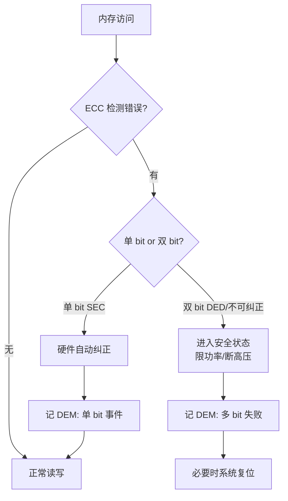

# 看门狗、ECC 与故障诊断：系统不会悄悄死掉

## 一、凌晨的"假死"与无声复位

某动力域控制器在台架上跑了三天，突然整车报文全无，但示波器看复位脚根本没有波形——它没复位，是"死循环里悄悄卡死"了。另一个项目更隐蔽：某批车在夏天高温下偶发功能丢失，经查是 SRAM 里一个 bit 被宇宙射线翻转，算法读到一个错误阈值，默默触发了限功率，没有任何故障码。

这两类问题有一个共同点：**系统"悄悄地"错了，没有任何声张**。底层软件的第一职责，就是让系统"要么正确运行，要么明确地倒下并报警"。看门狗（WDT）、ECC、CRC 与故障诊断正是这套"不悄悄死掉"机制的三道闸门。

---

## 二、核心原理

### 2.1 看门狗：给系统装一个"心跳监督员"

类比：看门狗像一个监工，你（软件）必须每隔一段时间去"报到"（喂狗）。如果你卡死、跑飞、没按时报到，监工就拉闸断电重启。

- **独立看门狗 IWDG**：用独立低速时钟（如 LSI）驱动，即使主时钟挂了它仍计数。超时即**强复位**。优点是"最底层的兜底"，缺点是只证明"还活着"，不证明"活得对"。
- **窗口看门狗 WWDG**：必须在规定的时间窗口内喂狗——**过早（early）或过晚（late）都算错**，触发复位/中断。它能抓住"程序跑飞导致时序错乱"：比如本该 10ms 喂一次，结果 1ms 就喂了（死循环空转）或 100ms 才喂（卡死），IWDG 看不出，WWDG 一抓一个准。

喂狗策略的坑：千万别在单一死循环里喂狗。正确做法是**由调度器或关键任务周期性喂**——只有"关键任务都按预期跑完一轮"才喂，这样单任务卡死、死循环空转都能被暴露。

### 2.2 ECC：给内存上"纠错橡皮擦"

SRAM / Flash 在辐射、老化、电压波动下会出现 bit 翻转。ECC（Error Correction Code）按一定算法为每小块数据生成校验位：

- **单 bit 翻转**：硬件自动纠正（SEC，Single-Error Correction），软件无感；
- **双 bit 翻转**（或超出纠错能力）：检测出来（DED，Double-Error Detection），触发中断/异常，进入**安全状态**而非带着错误数据继续跑。

ECC 是 ISO 26262 里提升**诊断覆盖率（DC）**的关键手段。没有 ECC，一个静默的 bit 翻转可能让 BMS 算错电芯电压阈值，后果是直接安全相关。

### 2.3 CRC 与 E2E：端到端的数据保镖

- **CRC32**：固件/数据块校验，防传输与存储损坏。Bootloader 校验 App、存储参数回读都用它。
- **E2E Profile（端到端保护）**：在通信数据里加 CRC + 计数器（防重放）+ 超时（防丢帧）。保证一个 ECU 发给另一个 ECU 的关键信号"没被篡改、没被重放、没被漏掉"。这是 FFI（免于干扰）里"通信隔离"的具体落地。

### 2.4 故障诊断与 DEM：把"病"登记在册

诊断不只是 UDS 读 DTC。底层要能**检测故障 → 记故障 → 管故障**：

- 检测到过压、通信超时、ECC 双 bit 错，写入 DEM（Diagnostic Event Manager）；
- DEM 按严重程度决定"报备 / 降级 / 进入安全状态"；
- UDS 0x19 才能读出来，维修时才看得到。

---

## 三、关键机制与寄存器/伪代码

### 3.1 WWDG 窗口时序（概念）

```
时间轴： 0 ────── [窗口下界 W_l] ────── [窗口上界 W_h = 超时] ──► 复位
            │           │                        │
        禁止喂狗      允许喂狗区              仍未喂 → 超时复位
        (early错)    (正确窗口)              (late错)
```

WWDG 计数器递减，喂狗写值必须落在 `[W_l, W_h)` 区间。以某主流车规 MCU 为例，窗口值由 `WWDG_CFR` 的窗口位域、递减计数器由 `WWDG_CR` 的 T[6:0] 控制；early 唤醒（提前喂）可在 `EARLYW` 标志触发中断做诊断，而非直接复位。

```mermaid
flowchart LR
    A[计数器递减开始] --> B{到达窗口下界 W_l?}
    B -- 未到就喂 --> C[early 错误<br/>触发复位/中断]
    B -- 已到下界 --> D{在窗口 [W_l, W_h) 内?}
    D -- 是,窗口内喂 --> E[喂狗成功<br/>计数器重载]
    D -- 否,超过 W_h --> F[late 超时<br/>触发复位]
```

> 图：窗口看门狗（WWDG）喂狗时序，过早（early）或过晚（late）都触发复位，只有窗口内喂狗才有效。

### 3.2 ECC 处理伪代码

```c
/* 内存 ECC 错误回调（硬件异常/中断进入） */
void ECC_Fault_Handler(uint32_t addr, uint32_t syndrome) {
    if (is_single_bit(syndrome)) {
        /* 单 bit：硬件已自动纠正，仅记录 */
        DEM_ReportEvent(ECC_SINGLE_BIT, FAILURE_INFO, addr);
    } else {
        /* 双 bit 或不可纠正：进入安全状态 */
        EnterSafeState();                 // 如切断高压、限功率
        DEM_ReportEvent(ECC_MULTI_BIT, FAILED, addr);
        /* 必要时触发复位（若系统已不可信） */
        Trigger_SystemReset();
    }
}
```



> 图：ECC 纠错流程，单 bit 自动纠正并登记，双 bit 进入安全状态绝不带错运行。

### 3.3 喂狗应由调度器驱动

```c
void Scheduler_MainLoop(void) {
    while (1) {
        Run_Critical_Tasks();            // 关键任务跑完一轮
        if (All_Tasks_Alive()) {
            IWDG_Feed();                 // 只有"都活着"才喂
            WWDG_Feed_InWindow();        // 且必须在窗口内
        }
        OS_Schedule();
    }
}
```

---

## 四、常见坑与调试手段

1. **喂狗在中断里兜底导致"假活"**：在定时器中断无脑喂 IWDG，主循环早已死循环，看门狗永远不触发。调试：把喂狗移到主任务/调度器，中断只做"我还被调度"的辅助判断。

2. **WWDG 窗口配错导致频繁复位**：窗口下界设太宽、任务抖动偶尔超界即复位。调试：用示波器/GPIO 打任务执行时间分布，确认喂狗时刻稳定落在窗口中部，留足抖动裕量。

3. **ECC 双 bit 静默进入错误安全态但无日志**：现场只看到"功能丢失"却无 DTC。调试：确保 ECC 异常**先写 DEM 再进安全态**；HIL 台架用故障注入（拉低电压、注入 RAM 错误）验证 ECC 是否真触发、DEM 是否真记录。

4. **诊断覆盖率不达标**：功能安全审计要求"证明看门狗/ECC 有效"。调试：做**故障注入测试**——故意卡死程序确认如期复位、故意翻转 bit 确认 ECC 响应，这就是"诊断覆盖率达标"的实证。

5. **看门狗与低功耗冲突**：Stop/Standby 下 IWDG 可能停计数或要求 LSI 持续供钟。调试：进低功耗前规划好 WDT 策略（部分 SBC 内部看门狗可在休眠期接管），避免休眠被误复位。

---

## 五、面试高频要点

- **窗口看门狗比独立看门狗强在哪？** WWDG 强制喂狗时序窗口，能发现"过早/过晚"的跑飞，IWDG 只防彻底卡死。
- **ECC 单/双 bit 怎么处理？** 单 bit 自动纠正并记日志；双 bit 报错，进入安全状态或复位，绝不带错运行。
- **怎么证明看门狗有效？** 故意卡死程序，确认是否如期复位——靠故障注入做实证。
- **E2E 保护防什么？** 防通信数据被篡改、重放、漏帧（CRC + 计数器 + 超时）。
- **DEM 与 DET 区别？** DEM 管运行时故障码（DTC）；DET 管开发期模块参数/状态错误。

---

*（全文约 2400 字，基于资料模块十二、三、十五整理，型号参数采用笼统指代。）*
