# 看门狗与 ECC 内存可靠性机制：让车载系统"要么正确运行，要么明确倒下"

> 本章面向汽车电子嵌入式底层工程师与功能安全（Functional Safety）从业者，系统讲解车载控制器中最为基础、也最容易被轻视的两类可靠性机制——**看门狗（Watchdog Timer, WDT）**与**ECC 内存纠错（Error Correction Code）**。二者分别对应"时序维度的故障收敛"与"数据维度的故障收敛"，共同构筑了 ISO 26262 语境下"故障可检测、可收敛、可定位"的底层基石。
>
> 笔者在多年的车规 MCU 底层与功能安全落地工作中，反复验证一个结论：**可靠性机制的价值不在于"存在"，而在于"被正确理解、被正确配置、被错误注入实证"**。因此本章刻意把篇幅向"芯片 IP 内部架构""驱动代码实现""AUTOSAR MCAL 配置"这三块工程一线最稀缺的纵深内容倾斜，并把传统"为什么需要"类内容作为铺垫夯实而非泛泛而谈。

---

## 导言：为什么底层工程师要关心"系统如何失败"

在功能安全工程里，有一条铁律：**系统的失效模式必须收敛（fail-safe / fail-operational 取决于 ASIL 等级）**。所谓收敛，包含两层含义：一是**失效必须被感知**（故障检测），二是**失效后果必须被限制**（故障处理与降级）。

一个没有看门狗、没有 ECC 的控制器，在以下场景中会"悄悄地"出错：

- 软件跑飞进入死循环，主时钟仍在跳动，但关键控制任务再也不执行；
- SRAM 中某个 bit 被单粒子翻转（SEU）改写，算法读到一个错误的温度/电压阈值，默默做出了错误决策，却没有任何故障码；
- 通信栈卡死，报文不再发送，但 MCU 仍在运行，外部无法判断它是"活着但坏了"还是"彻底死了"。

这类"无声失效（silent failure）"在消费电子里最多重启解决，在汽车电子里却可能直接危及生命。底层软件的第一职责，就是让系统"**要么正确运行，要么明确地倒下并报警**"。看门狗、ECC、CRC/E2E 以及诊断事件管理（DEM）正是这套"不悄悄死掉"机制的四道闸门。本章聚焦前两者，并在结语串联功能安全体系与面试要点。

值得强调的是，看门狗与 ECC 都不是"银弹"。它们各自有明确的盲区（看门狗盲于"假活"、ECC 盲于超出纠错能力的簇发多 bit 错），真正的工程功力体现在：如何用合理的**架构**（内部 + 外部看门狗 + 锁步 + ECC 纵深）、正确的**喂狗条件保真度**、以及可落地的**MCAL 配置与错误注入验证**，把盲区压缩到 FMEDA 可接受的范围。这正是本章后续 A/B/C 三块要回答的核心问题。

---

## 一、为什么需要看门狗：死机检测与故障收敛

### 1.1 软件失控的几种典型形态

在讨论看门狗之前，必须先厘清"软件失控"究竟有哪些形态。只有在形态层面理解清楚，才能设计对应的检测手段。

第一类是**彻底卡死（deadlock / hang）**。典型场景是优先级反转、死锁、阻塞在一个永远等不到的事件上（例如等待一个外设中断，但该外设时钟被意外关闭）。此时 CPU 仍在上电、时钟仍在跑，但被卡住的任务再也不推进。独立看门狗（IWDG）正是为这类失效设计的最后兜底。

第二类是**跑飞（runaway）**。程序计数器 PC 跳转到非预期地址，例如跳进了一个空区域、一个数据区，或者进入一个异常短的循环反复执行某个无意义操作。此时系统看起来"很忙"，GPIO 在翻转、定时器在跑，但控制逻辑完全不对。窗口看门狗（WWDG）依靠时序约束可以抓住相当比例的跑飞。

第三类是**活锁 / 假活（livelock / fake-alive）**。系统反复在被打乱的状态中打转，既没死机也没正确运行，比如某任务每次都被更高优先级任务抢占，永远得不到执行；或者喂狗逻辑被放在一个永远运行的中断里，主任务早已崩溃却仍能"喂狗成功"。这是看门狗设计中最容易被忽视的陷阱，后文第五节专述。

第四类是**时序错乱（timing violation）**。程序逻辑没有错，但执行周期被拉长或缩短。例如一次 NVM 写操作阻塞了调度，导致原本 5ms 周期的控制循环被拖到 50ms；又如某个优化导致关键函数执行过快，使"应在 8–10ms 窗口内喂狗"的约束被以 1ms 提前喂狗打破。WWDG 的窗口机制专门对付这一类。

### 1.2 看门狗的本质：一个不可被软件关闭的"法官"

看门狗的本质，是一个**由硬件独立驱动的递减计数器**。它的核心特性是：**一旦启动，只能被周期性"喂"（reload）而维持，若未能在超时前喂狗，则硬件强制产生复位（或中断 + 安全动作）**。关键在于"独立"二字——它不应受主程序失控的影响。

这带来一个重要的设计哲学：**看门狗是"反制自身软件"的硬件**。它假设运行在 CPU 上的软件是不可信的（可能因为 bug、因为辐射、因为噪声而失控），因此需要一个连失控软件都无法关掉的法官来裁决"你还活着吗"。这个法官的计时不依赖主时钟、不依赖 OS 调度、不依赖任何软件配置，只依赖上电后的硬件逻辑。

### 1.3 故障收敛：从"无限期错误运行"到"有限时间复位"

看门狗解决的核心问题是**故障的无限期延续**。假设一个控制任务因为某个指针错误进入了死循环，如果不加看门狗，系统会一直处于"坏掉但没倒下"的状态，错误可能被放大（例如持续输出错误的占空比，造成执行器过热）。加上看门狗后，这个坏状态的最长存续时间被严格限制在"超时周期"以内——通常以毫秒或百毫秒计。这就是**故障收敛（fault containment）在时间维度的体现**。

值得注意的是，看门狗本身不修复故障，它只做一件事：**把"未知的错误状态"转换为"确定的复位事件"**。复位之后，Bootloader 与初始化流程有机会把系统拉回一个已知的干净状态。因此看门狗的价值不在于"防止崩溃"，而在于"崩溃后快速且确定地恢复"。这一点对故障容忍时间（FTTI, Fault Tolerant Time Interval）的论证至关重要：安全机制必须在 FTTI 内把危险故障收敛，否则危害就可能发生。

---

## 二、看门狗的类型：独立 IWDG 与窗口 WWDG

绝大多数车规 MCU（如基于 ARM Cortex-M 的系列、Infineon TC 系列、NXP S32 系列、Renesas RH850 系列）都内置两类看门狗外设，它们在时钟源、触发条件、适用场景上各不相同。

### 2.1 独立看门狗 IWDG：最底层的兜底

独立看门狗（Independent Watchdog, IWDG）的核心特征是**使用独立的低频时钟源**（通常是片内低速 RC 振荡器 LSI，典型 32 kHz，也有使用 LSE 外部晶振的更高可靠配置）。这意味着：

- 即使主系统时钟 HSE/HSI 失效、PLL 失锁、时钟树被错误配置，IWDG 仍在计数；
- 即使 CPU 主频被降频，IWDG 的超时时间不变；
- 它的启动一旦使能（通常通过对密钥寄存器写入特定序列 `0xCCCC`），**在多数器件上无法被软件停止**，除非复位。某些器件提供"硬件看门狗"选项，连调试器都无法暂停它，从而防止调试态被看门狗误复位掩盖真实问题。

IWDG 的工作机制是：一个 12 位（典型）递减计数器，从装载值向下计数到 0 时产生系统复位。喂狗操作是向密钥寄存器写入 `0xAAAA`，使计数器重载（reload）到装载值。若两次 `0xAAAA` 之间的间隔超过计数器从装载值减到 0 的时间，复位发生。

IWDG 的优点是**鲁棒、简单、不可绕过**；缺点是**语义粗糙**——它只能证明"有人在喂狗"，不能证明"被喂狗的人是对的"。一个在错误状态里仍然按时喂狗的系统，IWDG 完全无能为力。

### 2.2 窗口看门狗 WWDG：有时序约束的法官

窗口看门狗（Window Watchdog, WWDG）与 IWDG 的根本区别在于它引入了**时间窗口约束**。WWDG 通常由 APB 总线时钟（PCLK）分频驱动，其递减计数器（典型 7 位 T[6:0]）必须在**一个设定的"窗口"内**被喂狗：

- 若**过早喂狗**（计数器尚未递减到窗口下界，即在"禁止区"喂狗），判定为 early 错误，触发复位（或早期唤醒中断 EWI）；
- 若**过晚喂狗**（计数器减到 0 仍未喂），判定为 late 错误，触发复位。

窗口下界由 `WWDG_CFR` 的窗口位域决定，上界即计数器归零时刻。合法喂狗区间即为 `[W_l, 0x40)`（以 7 位计数器、最高位为溢出标志的常见实现为例）。

WWDG 的价值在于它能抓住 IWDG 看不见的失效：例如程序跑飞进入一个快速空转循环，导致喂狗周期从预期的 10ms 骤降到 1ms——IWDG 认为"还活着"（按时喂了），WWDG 却会因为"过早喂狗"立即判定异常。又如关键任务被阻塞，喂狗被推迟到窗口之外——late 错误被触发。

### 2.3 IWDG 与 WWDG 的对比与适用

下表总结了两类看门狗的关键差异，这是底层工程师做架构选型时的核心依据。

| 维度 | 独立看门狗 IWDG | 窗口看门狗 WWDG |
| --- | --- | --- |
| 时钟源 | 独立低速时钟 LSI/LSE | APB 主时钟 PCLK 分频 |
| 触发条件 | 超时未喂（late） | 过早喂（early）+ 超时未喂（late） |
| 能否检测跑飞空转 | 否 | 能（early 错误） |
| 复位可控性 | 通常一旦使能不可停 | 可通过 EWI 中断转为"先诊断再复位" |
| 精度 | 较低（RC 漂移大） | 较高（跟随系统时钟） |
| 对主时钟依赖 | 不依赖 | 依赖（主时钟挂则 WWDG 也停） |
| 典型超时范围 | 数 ms ~ 数秒 | 数百 μs ~ 数十 ms（相对窗口） |
| 典型用途 | 最终兜底、防彻底卡死 | 时序完整性检查、防跑飞 |
| 与功能安全关系 | 基础故障检测 | 更精细的时序监控、配合 WdgM |

**实践建议**：在 ASIL 相关系统中，二者**通常并存、互补**：IWDG 作为"最后兜底"保证系统永不卡死在无复位状态；WWDG（或软件看门狗管理模块 WdgM）承担更精细的"程序按预期节奏推进"的检查。但务必注意，WWDG 依赖主时钟，一旦主时钟树失效它自身也失效，所以它**不能替代** IWDG 的兜底角色。在 ASIL-D 系统中，还会叠加**外部看门狗（SBC）**与**锁步核**，形成"内部兜底 + 时序窗口 + 外部独立裁决 + 计算正确性比对"的纵深防御。

### 2.4 Cortex-M 体系下的看门狗与"无核内 WDT"的事实

需要澄清一个常见误解：**ARM Cortex-M 内核本身并不集成看门狗外设**。Cortex-M 提供的是系统控制块（SCB）、内存保护单元（MPU）、总线错误检测（如 HardFault、BusFault、MemManage Fault）等机制，但 WDT 是**芯片厂商在片内设的外设**。因此不同厂商（ST、NXP、Infineon、Renesas）的 IWDG/WWDG 寄存器与行为各不相同。

不过 Cortex-M 生态里有一些"看门狗思想的延伸"值得提及：

- 利用 **SysTick + OS 监控**实现软件层看门狗；
- 利用 **MPU 将 NULL 指针区、栈溢出区设为不可访问**，把"野指针跑飞"转化为可捕获的 MemManage Fault；
- 利用 **栈溢出检测（如 GCC 的 `-fstack-protector` 在返回地址放金丝雀值）** 配合 HardFault 进入安全态；
- 高安全等级器件（如 lockstep 核）在硬件层面提供**核间比较单元**，一旦双核执行结果不一致立即冻结并报警，这在语义上是一种"针对计算正确性的看门狗"。

### 2.5 看门狗机制对比图

下面用流程图概括 IWDG 与 WWDG 的判定逻辑差异。

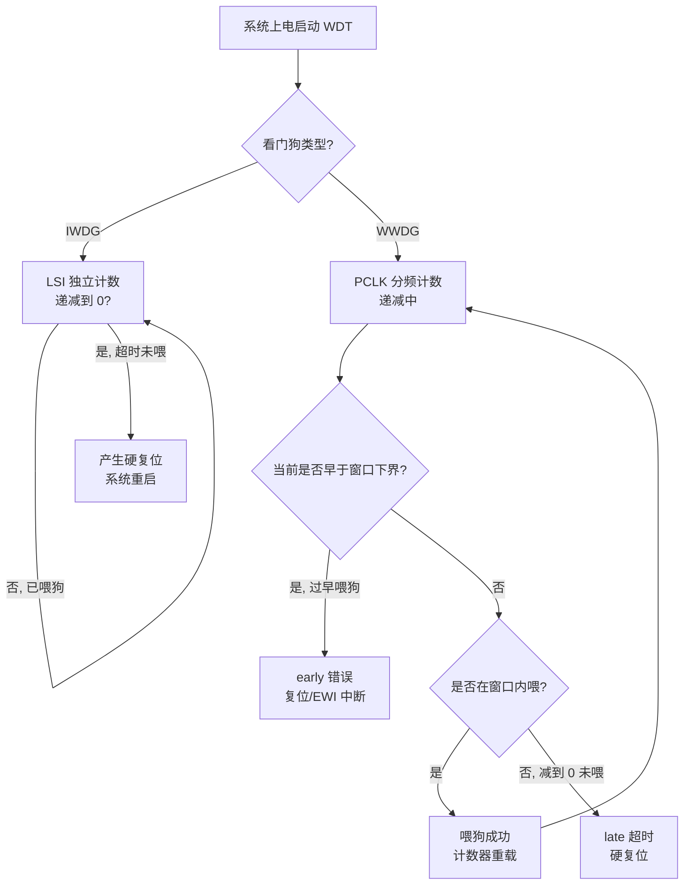

> 图 1：IWDG 仅判定"超时"，WWDG 同时判定"过早"与"过晚"，二者监控语义不同。

---

## 三、喂狗策略：在哪里喂、如何避免死锁、窗口边界

### 3.1 喂狗位置是最关键的架构决策

"在哪里喂狗"是看门狗工程里最重要的问题，没有之一。错误的喂狗位置会使看门狗形同虚设。

**反模式一：在定时器中断里无条件喂狗**。这是初学者最常见的错误。例如写一个 10ms 定时器中断，在中断服务程序（ISR）里无条件调用 `IWDG_Feed()`。这种做法的结果是：只要中断还在响应（而中断通常独立于主循环），无论主程序是否早已崩溃、死循环、跑飞，看门狗都会被按时喂到，永远不复位。这就是典型的"假活"，后文第五节详述。

**反模式二：在 main 的单一死循环顶部无条件喂狗**。如果程序卡在循环内部的某个分支（例如某个 `while(flag)` 永远等不到 flag 被置位），而喂狗语句在循环顶部之前或之后但循环根本到不了，则会复位——这看似正确，但问题是"喂狗"与"关键任务是否执行"没有绑定。一旦有人把喂狗语句挪到循环入口，而循环入口之前的初始化卡死，看门狗就失效了。

**正确的喂狗哲学**：**喂狗应当作为"关键任务都已按预期完成一轮"的证据，而不是"中断还在跳"的证据**。也就是说，喂狗的前提条件应当是"我确实做了该做的事"，而不仅仅"我还活着"。这一哲学在 AUTOSAR WdgM 中被标准化为"被监控实体 + 检查点 + 多源健康聚合"，在后文 B/C 两章有完整实现。

### 3.2 由调度器或看门狗监督任务驱动喂狗

在 RTOS 环境下，推荐的做法是设立一个**独立的、低优先级的看门狗监督任务（Watchdog Monitor Task）**，或者由调度器的主节拍（tick）在确认各关键任务"活标记"后统一喂狗。每个关键任务在自身被正确执行一轮后，刷新一个"喂狗存活计数器"（alive counter）。监督任务周期性检查：若所有关键任务的 alive counter 都在预期窗口内刷新过，则喂狗；否则不喂（触发复位）。

下面是一个调度器驱动喂狗的伪代码：

```c
/* 看门狗监督：只有关键任务都按预期跑完一轮才喂狗 */
#define TASK_NUM        6
#define ALIVE_TIMEOUT   50   /* 单位：调度节拍 */

static uint32_t g_alive[TASK_NUM];   /* 各任务存活计数，被任务刷新 */
static uint32_t g_wdg_deadline;      /* 喂狗截止节拍 */

void Critical_Task(int id) {
    /* 任务实际业务逻辑... */
    Run_Control_Algorithm(id);
    g_alive[id] = ALIVE_TIMEOUT;     /* 任务活着，刷新存活计数 */
}

void Watchdog_Monitor_Task(void) {
    uint32_t now = OS_GetTick();
    /* 1. 先递减所有存活计数 */
    for (int i = 0; i < TASK_NUM; i++) {
        if (g_alive[i] > 0) g_alive[i]--;
    }
    /* 2. 检查：所有关键任务都还有"活着"余量？ */
    bool all_alive = true;
    for (int i = 0; i < TASK_NUM; i++) {
        if (g_alive[i] == 0) { all_alive = false; break; }
    }
    /* 3. 仅在全部健康且在窗口内时才喂狗 */
    if (all_alive && (now <= g_wdg_deadline)) {
        IWDG_Feed();
        WWDG_Feed_InWindow();
        g_wdg_deadline = now + WDG_PERIOD;
    }
    /* 若有任务失活，则不喂狗，等待硬件复位 */
}
```

这段代码体现了三个要点：(1) 喂狗与任务存活解耦但绑定；(2) 每个任务独立刷新自身存活标志，单任务卡死即可被暴露；(3) WWDG 的喂狗受窗口约束（`now <= g_wdg_deadline` 仅为示意，实际窗口逻辑见 3.3 与 B 章）。

### 3.3 窗口看门狗的边界：过早与过晚都会复位

WWDG 的喂狗必须落在时间窗口 `[W_l, W_h)` 内。下面用伪代码表达窗口边界判定：

```c
/* WWDG 窗口喂狗边界判定（概念实现） */
#define WWDG_WINDOW_LOW   0x50   /* 窗口下界（计数器值） */
#define WWDG_COUNTER_TOP  0x7F   /* 计数器上溢/起点 */

typedef enum {
    WWDG_OK,        /* 窗口内，喂狗成功 */
    WWDG_EARLY,     /* 过早喂狗，错误 */
    WWDG_LATE       /* 过晚，已超时 */
} wwdg_status_t;

wwdg_status_t WWDG_TryFeed(uint8_t current_cnt) {
    if (current_cnt > WWDG_WINDOW_LOW) {
        return WWDG_EARLY;     /* 计数器还太高，落在禁止区 */
    }
    if (current_cnt == 0 || current_cnt < 0x40) {
        return WWDG_LATE;      /* 已减到溢出标志位以下，超时 */
    }
    WWDG->CR = (WWDG->CR & ~0x7F) | (WWDG_COUNTER_TOP & 0x7F);
    return WWDG_OK;            /* 窗口内，重载成功 */
}
```

要点：计数器从高值（如 `0x7F`）向下递减，当递减到 `WWDG_WINDOW_LOW`（如 `0x50`）以下，才进入"允许喂狗区"；若减到 `0x40`（溢出标志位 T6 清零）仍未喂，则产生复位。因此**喂狗太早（计数器还远大于窗口下界）= early 错误；喂狗太晚（计数器已越界）= late 错误**。

下面用时序图直观表达 WWDG 的窗口约束：

```mermaid
flowchart LR
    A[计数器从 0x7F 递减] --> B{是否已递减到窗口下界 W_l?}
    B -- 否 仍在禁止区喂 --> C[early 错误<br/>复位 / EWI 中断]
    B -- 是, 进入窗口 --> D{在窗口 [W_l, 0x40) 内喂?}
    D -- 是 --> E[喂狗成功<br/>计数器重载到 0x7F]
    D -- 否 减到 0x40 仍未喂 --> F[late 超时<br/>硬复位]
```

> 图 2：WWDG 喂狗时序。过早（early）或过晚（late）均触发复位，只有窗口内喂狗有效。

### 3.4 喂狗与死锁规避

一个微妙但重要的工程问题：**喂狗逻辑本身也可能成为死锁的一部分**。例如，若喂狗操作需要通过 SPI 与外部 SBC 看门狗芯片通信（见第五节），而 SPI 总线因某任务卡死而不可用，那么"为了证明系统活着而进行的喂狗"反而会被系统自身的卡死阻断。对此的应对原则是：

1. **喂狗路径应短且独立**：尽量用 MCU 内部寄存器喂 IWDG/WWDG，避免把喂狗依赖在可能失效的外部总线上；
2. **外部看门狗喂狗应使用独立、高优先级的、非阻塞的通信路径**（如专用的、带超时保护的 QSPI 看门狗服务帧）；
3. **设置"死锁自检测"**：在喂狗监督任务里若检测到连续 N 次无法完成喂狗（例如因为 SPI 忙），应主动进入安全态，而不是被动等待外部看门狗超时复位——因为主动进入安全态可控性更好。

---

## 四、多任务协同喂狗与"假活"（活锁）问题

### 4.1 多任务下的喂狗一致性

在复杂 ECU 中，控制逻辑被拆成多个任务：通信任务、控制算法任务、诊断任务、执行器驱动任务等。单一任务的喂狗无法代表"系统整体健康"。正确的多任务喂狗需要**聚合多个健康信号**。

一种经典的工程模式是"**喂狗令牌（feed token）**"：每个关键任务在每轮执行成功后在共享区置位自己的位（或递增自己的计数器），看门狗监督任务汇总这些位，全部置位才喂狗，并随后清除。这样任何一个关键任务停滞，都会导致令牌不全，进而看门狗不喂而复位。

另一种模式是**超时计数递减**（如第三节代码所示）：每个任务有自己的存活计时器，由监督任务统一递减并判断。两种模式本质相同，都是"**多源健康聚合**"。

### 4.2 "假活"的本质：喂狗与健康的虚假绑定

所谓"假活"，是指系统**实际上已经失去正确运行能力，但看门狗仍被成功喂到、不复位**。它比"死机"更危险，因为它让故障检测机制彻底失效。

假活的常见成因：

1. **喂狗位置错误**（中断无条件喂狗，见 3.1）；
2. **喂狗条件过松**：例如仅检查"通信任务还活着"，但控制算法任务已崩溃——聚合信号不充分；
3. **活锁**：两个任务互相唤醒又互相阻塞，CPU 利用率 100% 但没有任何有效产出，存活计数器被反复刷新；
4. **监督任务本身被高优先级任务永久抢占**：低优先级监督任务的 alive 永远得不到刷新，但因为喂狗逻辑被挪到某高优先级任务而误喂；
5. **看门狗超时周期过长**：例如设了 2 秒，期间系统早已进入错误状态并长时间输出错误控制量，复位"太晚"等同于假活。

### 4.3 如何识别与根除假活

识别假活依赖**可观测性**：在开发阶段，用 GPIO 翻转标记关键任务的真实执行时刻，用示波器对比"喂狗时刻"与"任务执行时刻"。若喂狗稳定发生、但某些关键任务的 GPIO 标记长时间不翻转，即可判定为假活。

根除假活的根本手段是**提升喂狗条件的"保真度"**：喂狗的前提应当尽可能逼近"系统真的在正确做事"。例如，与其"任务被调度过就置位"，不如"任务本周期内完成了一次有效的控制输出（且输出值在合理范围内）才置位"；与其"通信收到任意帧就置位"，不如"收到来自指定源、CRC 正确、计数器连续的关键帧才置位"。保真度越高，假活空间越小——代价是喂狗逻辑与业务耦合更深，需要在架构上谨慎平衡。

下面用状态图表达看门狗监督任务的典型状态机：

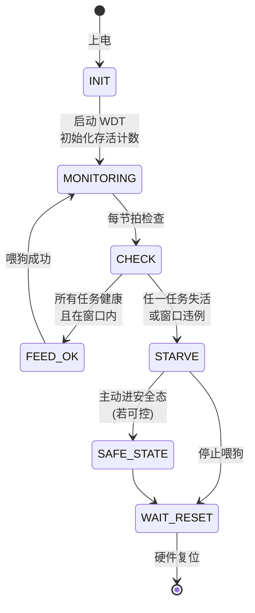

> 图 3：看门狗监督任务状态机。失活或窗口违例时停止喂狗，等待硬件复位，必要时主动进安全态。

### 4.4 多任务喂狗时序示意

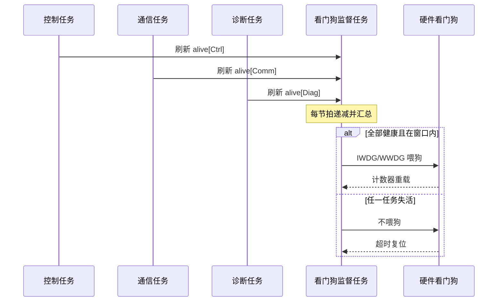

> 图 4：多任务协同喂狗的问询-聚合-喂狗链路。任一关键任务失活即导致复位。

---

## 五、外部看门狗与功能安全监控链路（问询-应答）、看门狗服务 WdgM

### 5.1 为什么 MCU 内部看门狗还不够

即便 MCU 内置了 IWDG/WWDG，功能安全架构仍常常要求**外部看门狗（External Watchdog / Safety Monitor）**。原因有三点：

1. **独立性（independence）**：ISO 26262 强调"诊断机制应与被诊断对象有足够的独立性"。MCU 内部看门狗与 MCU 同处一颗硅片、同源电源、同源时钟，若 MCU 发生系统性失效（如电源塌陷、时钟树整体故障、硅片局部失效），内部看门狗可能与其一同失效。外部独立芯片（如系统基础芯片 SBC 内的看门狗）提供更强的独立性。
2. **防止 MCU 固件本身被攻破或彻底跑飞**：MCU 固件可以意外地（或因安全攻击）错误配置内部看门狗，外部看门狗由独立硬件裁决，MCU 无法单方面关闭。
3. **功能安全监控链路（safety supervision chain）**：外部看门狗不仅能"看 MCU 是否活着"，还能通过**问询-应答（challenge-response）**机制验证 MCU 是否运行在正确的、未被篡改的程序流上。

### 5.2 问询-应答式外部看门狗

典型的外部看门狗（如 SBC 内置的窗口看门狗）采用**问询-应答**协议：

1. SBC 周期性地通过 SPI/QSPI 向 MCU 发出一个**挑战值（challenge / question）**，通常是一个随机或按序列变化的数字；
2. MCU 必须基于该挑战值，用一个**双方约定的算法**（例如带密钥的 CRC、或简单的异或/散列变换）计算出**应答值（response）**，并在规定的时间窗口内回送给 SBC；
3. SBC 校验应答是否正确且在窗口内。若应答错误、超时、或过早，SBC 触发**安全动作**：通常是拉低 MCU 的复位脚（RESETn），或切断给功率级的使能（如驱动使能、高压接触器使能）。

这种机制的精妙之处在于：它把"MCU 是否存活"升级为"**MCU 是否运行着正确的、未跑飞/未篡改的程序**"——因为正确的应答需要正确的代码路径计算出正确结果。一个死循环空转的 MCU 无法产生正确应答，从而被外部看门狗捕获。这与 WWDG 的"时序窗口"思想异曲同工，但独立性更高。

下面用时序图表达问询-应答链路：

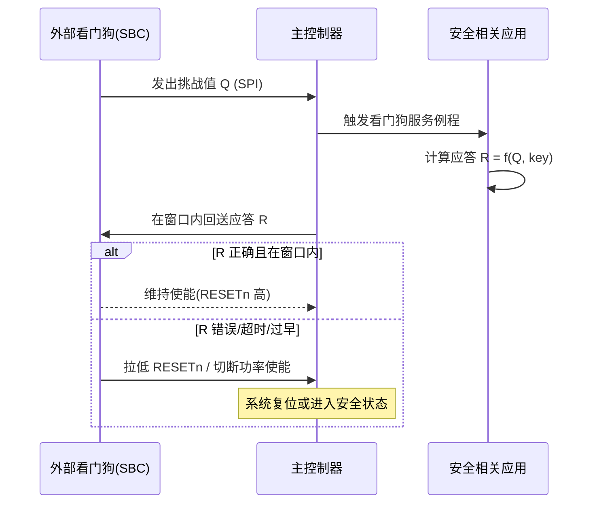

> 图 5：外部看门狗问询-应答监控链路。应答正确且时序合法才维持系统使能。

### 5.3 AUTOSAR 的看门狗管理模块 WdgM

在采用 AUTOSAR 架构的车载软件中，看门狗的统一管理由**WdgM（Watchdog Manager）** 模块承担。WdgM 位于基础软件（BSW）的 System Services 层，向上为 SWC（软件组件）提供 `WdgM_CheckpointReached()` 接口，向下通过 WdgIf 抽象驱动具体看门狗（内部 IWDG/WWDG 或外部 SBC 看门狗）。

WdgM 的核心概念是**检查点（Checkpoint）**与**监控图（Monitoring Graph）**：

- 一个"被监控实体（Supervised Entity, SE）"在其程序流中定义若干检查点；
- WdgM 验证"程序是否按预期顺序、在预期时间内经过这些检查点"；
- 支持的监控模式包括：
  - **Alive Supervision（存活监控）**：SE 必须在规定周期内至少/至多报告若干次存活，防卡死；
  - **Deadline Supervision（截止时间监控）**：两个检查点之间的耗时必须在 `[min, max]` 区间，防过快/过慢；
  - **Logical Supervision（逻辑监控）**：程序流必须按预定义的有向图（允许转移）经过检查点，防跑飞到错误路径。

WdgM 自身的"喂狗触发"由 `WdgM_MainFunction` 周期性调用，它汇总所有 SE 的监控结果，只有全部通过才真正去向底层看门狗喂狗。这恰好对应了前文"多源健康聚合"的思想，并将之标准化、可配置化。在功能安全项目中，WdgM 的配置（SE 划分、监控图、超时参数）需要与 Safety Case 一起论证。

下面给出一个 WdgM 式检查点的伪代码：

```c
/* AUTOSAR WdgM 风格：检查点到达 + 三种监控 */
typedef enum { SE_CTRL, SE_COMM, SE_DIAG } supervised_entity_t;

void App_Control_Loop(void) {
    WdgM_CheckpointReached(SE_CTRL, CP_CTRL_START);
    Read_Sensors();
    Compute_Control();
    Actuate();
    WdgM_CheckpointReached(SE_CTRL, CP_CTRL_END);
}

/* WdgM_MainFunction 内部（概念） */
void WdgM_MainFunction(void) {
    bool alive_ok  = AliveSupervision_AllPass();     /* 存活监控 */
    bool dl_ok     = DeadlineSupervision_AllPass();  /* 截止时间监控 */
    bool logic_ok  = LogicalSupervision_AllPass();   /* 逻辑监控 */
    if (alive_ok && dl_ok && logic_ok) {
        WdgIf_SetTriggerCondition(MAX_TIMEOUT);      /* 真正喂狗 */
    }
    /* 否则不喂，由看门狗超时复位 */
}
```

### 5.4 外部看门狗与低功耗的冲突

一个工程现实：在 Stop/Standby 低功耗模式下，MCU 主时钟可能关闭，内部 WWDG 停摆，而 IWDG（基于 LSI）可能仍在跑。若此时系统"合法地"处于休眠（例如等待唤醒报文），看门狗却因休眠而超时复位，就是误动作。应对方案：

- 进入休眠前**暂停/重新配置**内部看门狗，或切换到由 SBC 外部看门狗接管（SBC 在休眠期以更长窗口或"休眠喂狗"模式监管 MCU 的周期性唤醒心跳）；
- 采用"**窗口化休眠看门狗**"：MCU 必须在每个休眠窗口内唤醒并应答一次，否则 SBC 复位。这既保证休眠合法，又保证"休眠中卡死"能被检测。

---

## 六、ECC 内存原理：为什么需要、单位/双位错误、SECDED

### 6.1 内存为什么会出错

SRAM、Flash、缓存（L2/L3）等半导体存储器并非绝对可靠。由于工艺进入深亚微米乃至纳米级，存储单元的物理尺寸越来越小、工作电压越来越低，单 bit 的能量壁垒下降，使其更易受扰动而翻转。同时，汽车工作环境严苛：宽温域（-40℃~125℃ 甚至更高结温）、振动、电磁辐射、长寿命要求（15 年），使得内存错误的累积概率不可忽视。

内存错误的外部诱因包括：

- **单粒子效应（SEE）**：高能宇宙射线（质子、中子、重离子）或 α 粒子撞击半导体，在耗尽区产生电子-空穴对，导致存储电荷被瞬时改变，造成**单粒子翻转（SEU, Single Event Upset）**——这是汽车电子（尤其在高海拔、无大气屏蔽的车载场景虽较太空弱，但仍在 65nm 以下工艺需关注）内存软错误的主要来源；
- **热载流子注入与经时击穿（老化）**：长期偏置使晶体管阈值电压漂移，存储单元读判门限模糊，增加软错误率（SER）；
- **电源噪声与电压跌落**：瞬态欠压使读出放大器判错；
- **串扰（crosstalk）**：相邻位线/字线间的电容耦合，在密集读写时引发邻近 bit 翻转；
- **工艺缺陷与可制造性偏差**：制造过程中的微缺陷造成某些单元更易出错。

这些错误若不处理，后果是"读到一个错误的数据却以为正确"。对 BMS 而言，一个电芯电压采样值的 bit 翻转可能直接导致过充/过放保护误动作；对发动机控制而言，一个标定参数的 bit 翻转可能让喷油量算错。

### 6.2 ECC 的基本思想：冗余校验位

ECC（Error Correction Code，错误校正码）通过在数据之外附加**校验位（syndrome bits）**，使得在读出数据时可检测并（在能力范围内）纠正错误。其数学基础是**线性分组码 / 汉明码（Hamming Code）**，以及在此基础上扩展出的 **SECDED（Single-Error-Correct, Double-Error-Detect，单错纠正、双错检测）** 码。

以最常用的 **(72, 64) SECDED** 为例：每 64 位数据附加 8 位校验位，形成 72 位码字。这 8 位校验位可视为对数据位的一组奇偶校验组合。读出时，硬件重新计算校验并与存储的校验位比较，得到"综合征（syndrome）"：

- 若 syndrome 为 0：无错（或错误位恰好落在无法区分的组合，概率极低且被双错检测兜底）；
- 若 syndrome 非零且对应某个特定模式：指示**某单个 bit 位置出错**，硬件**自动翻转回正确值**（SEC）；
- 若 syndrome 指示"两个及以上错误"：硬件**检测到不可纠正错误（DED）**，触发中断/异常，交由软件进入安全态。

为什么是 SEC + DED 而非"双错也纠正"？因为要在合理硬件开销下，纠正双错需要更多校验位（汉明界决定，纠双错对 64 位数据约需 11~12 位校验），且当发生双错时，"纠正"可能把数据改成另一个错误值（纠错了错误的位），反而更危险。**因此汽车安全关键系统普遍采用 SECDED：能纠正的单错悄悄纠正（对软件透明），检测到的双错则绝不盲纠，而是上报并安全处理**——这正是"故障收敛"在数据维度的体现。

### 6.3 单 bit 与双 bit 的差异化处理

| 错误类型 | 检测方法 | 硬件行为 | 软件行为 | 系统影响 |
| --- | --- | --- | --- | --- |
| 无错误 | syndrome = 0 | 正常读出 | 无动作 | 透明 |
| 单 bit 错误 (SEC) | syndrome 定位单错 | 自动纠正后返回正确数据 | 记录事件（DEM），可计数 | 软件无感，建议记录趋势 |
| 双 bit 错误 (DED) | syndrome 指示多错 | 不纠正，置错误标志/中断 | 进入安全态、报 DTC、必要时复位 | 绝不能带错运行 |
| 多 bit（≥2）/ 不可纠正 | 同上 | 同上 | 同上，视为不可恢复 | 系统须降级或复位 |

需要强调：**单 bit 纠错是"透明"的，但绝不意味着可以忽略**。工程中应当对单 bit 错误进行**计数与趋势监控**：若某块 SRAM 地址频繁出现单 bit 错误（纠错次数激增），往往是该单元老化的先兆，应作为"潜在失效"上报，避免其恶化为双 bit 错误时措手不及。

### 6.4 不同存储器的 ECC 实现差异

- **SRAM（片上 RAM）**：多数车规 MCU 对关键 SRAM（如带 ECC 的通用 RAM、TCM 紧耦合内存）提供字节/字级 ECC。SRAM 是易失的，软错误（尤其 SEU）是主要风险，ECC 以 SECDED 为主。需要注意 SRAM ECC 通常有"写入时计算校验、读出时校验并纠正"的硬件路径，对软件透明，但错误事件通过专用中断（如 RAM ECC Error Interrupt）上报。
- **Flash / EEPROM（非易失存储）**：Flash 的位翻转更多来自** retention（电荷泄漏）**与**读取干扰（read disturb）**、以及 P/E 循环老化。Flash ECC 通常以"页（page）/ 扇区（sector）"为单位（如每 256 字节附加若干 ECC 字节）。Flash 的不可纠正错误往往意味着该扇区失效，需配合**坏块管理 / 冗余扇区 / 定期刷新（refresh）**策略。
- **缓存 L2/L3**：现代多核车规 SoC 对 L2/L3 缓存提供 ECC/奇偶保护。缓存 ECC 错误在一致性协议下需谨慎处理（错误行失效、回写冲突等）。
- **寄存器文件与内部总线**：高安全等级器件（如 lockstep MCU）还会对寄存器文件、内部交叉开关（crossbar）施加奇偶或 ECC 保护。

### 6.5 ECC 纠错流程

下面用流程图表达 ECC 从"访问"到"纠正/安全态"的完整路径：

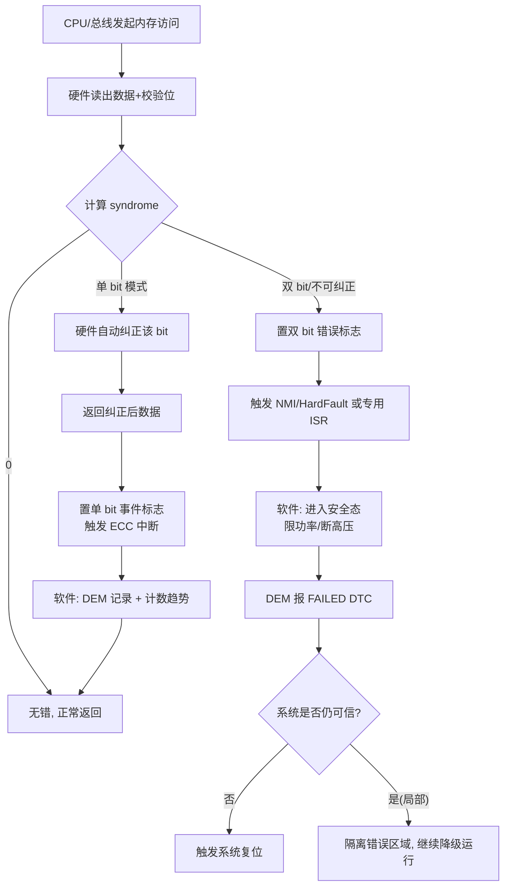

> 图 6：ECC 错误处理流程。单 bit 透明纠正并登记，双 bit 进入安全态，绝不带错运行。

### 6.6 ECC 处理伪代码

```c
/* 内存 ECC 错误回调（由 NMI / 专用中断进入） */
void ECC_Fault_Handler(uint32_t addr, uint32_t syndrome, uint32_t *p_data) {
    if (is_single_bit_error(syndrome)) {
        /* 单 bit：硬件多数已自动纠正，这里仅登记趋势 */
        uint32_t bit_pos = syndrome_to_bitpos(syndrome);
        DEM_ReportEvent(ECC_SINGLE_BIT, FAILURE_INFO, addr, bit_pos);
        g_ecc_single_count++;
        if (g_ecc_single_count > ECC_SINGLE_WARN_THRESHOLD) {
            DEM_ReportEvent(ECC_SINGLE_BIT_TREND, WARNING, addr, 0);
        }
        return;  /* 数据已正确，可继续运行 */
    }
    /* 双 bit 或不可纠正：系统已不可信，进入安全态 */
    EnterSafeState();                  /* 如切断高压、限功率、关执行器 */
    DEM_ReportEvent(ECC_MULTI_BIT, FAILED, addr, syndrome);
    /* 若关键数据结构已可能污染，主动复位以恢复干净态 */
    if (Is_Critical_Region_Corrupted(addr)) {
        Trigger_SystemReset();
    }
}
```

### 6.7 锁步核（Lockstep Core）与 ECC 的互补

在 ASIL-D 等级（最高汽车安全完整性等级）的控制器中，仅靠 ECC 是不够的。许多器件采用**锁步核（Dual-Core Lockstep）**：两颗相同的 CPU 核心运行相同指令流，其执行结果（地址、数据、标志）经一个**比较单元（compare unit）**逐周期比对。一旦二者不一致（可能因其中一核受 SEU 翻转、或时序违例），立即触发错误信号、冻结输出并进入安全态。

锁步核解决的是"**计算正确性**"的瞬时检测（延迟仅几个周期），ECC 解决的是"**存储数据正确性**"的检测与纠正，二者在功能安全架构中**互补**：ECC 防内存静默错误，锁步防运算路径瞬时错误。需要指出，锁步核会带来约 2 倍的面积/功耗开销，因此多用于 ASIL-D 的安全岛（Safety Island），而非全芯片。

---

## 七、单 bit 翻转来源深究与 ECC 在 SRAM/Flash/L2 的处理

### 7.1 单粒子翻转（SEU）的工程现实

虽然汽车不在太空，但地面仍存在**大气中子**（宇宙射线与大气作用产生）与少量 α 粒子。在 65nm 及以下工艺，SRAM 单元临界电荷（critical charge）已降至数百飞库仑量级，一个中子撞击产生的电荷收集足以翻转一个 bit。业界的软错误率（SER）常以 **FIT（Failure In Time，10⁹ 小时内的失效数）** 计量。一个车规 SRAM 的 SER 可能在几十到数百 FIT/Mb 量级，乘以车载 ECU 数 Mb 的 SRAM 与 15 年寿命，单 bit 翻转从"理论"变为"必然偶然发生"的工程问题——这就解释了为什么 ECC 在车规芯片中几乎成为标配。

### 7.2 老化与经时退化

高温加速半导体老化（NBTI、HCI、EM 等机制），使单元读判门限漂移。老化本身不直接翻转 bit，但会**降低抗噪声裕量**，使原本可被 ECC 纠正的单错更容易升级为不可纠正的双错。因此功能安全运维中，单 bit 纠错计数趋势是"健康度"指标之一。

### 7.3 SRAM、Flash、L2 的差异化 ECC 处理策略

- **SRAM**：实时、透明 SECDED，错误事件中断上报 + 计数。策略重点在"趋势监控"与"关键区隔离"。
- **Flash**：以页为单位 ECC + 坏块/冗余管理。策略重点在"读干扰刷新""P/E 寿命管理""OTA 升级时的双 bank 校验"。Flash 不可纠正错误通常导向"切换到冗余区/标记失效并降级"。
- **L2 缓存**：缓存行级 ECC/奇偶。策略重点在"错误行失效（line invalidate）"与一致性协议下的安全处理，避免错误行被写回污染主存。

### 7.4 软件层面的纵深防御

除硬件 ECC 外，软件还可叠加：

- **关键数据镜像与投票**（如三模冗余 TMR 于极致安全场景）；
- **CRC 周期性校验关键常量区（ROM 中的标定/代码）**；
- **栈与关键变量的"金丝雀"哨兵**；
- **端到端保护（E2E Profile）** 保护跨 ECU 通信数据（CRC + 计数器 + 超时），防通信域错误进入控制域。

注意 E2E 与 ECC 分工不同：ECC 守"存储/内存内部"的数据完整性，E2E 守"跨网络传输"的数据完整性，二者共同支撑 ISO 26262 的"免于干扰（FFI）"。

---

## 八、错误注入测试与故障覆盖率

### 8.1 为什么必须做错误注入

功能安全不是"写了看门狗和 ECC 就安全了"，而是要**证明它们真的有效**。ISO 26262 要求对安全机制给出**诊断覆盖率（Diagnostic Coverage, DC）** 的论证，而论证的最有力证据是**故障注入测试（Fault Injection Testing）**。

错误注入的核心思想：人为地、可控地在系统中引入故障，观察安全机制是否如期检测并收敛。它能回答三个问题：

1. 看门狗真的会在卡死时复位吗？
2. ECC 真的会在双 bit 错时进安全态吗？
3. 诊断事件真的会写到 DEM、真的能读出 DTC 吗？

### 8.2 看门狗的错误注入

- **卡死注入**：在调试固件中故意进入死循环或 `while(1)` 空转，确认 IWDG 在超时后复位（用 GPIO 翻转或复位原因寄存器 `RCC->CSR` 的 IWDGRSTF 标志验证）。
- **跑飞注入**：故意缩短喂狗间隔（模拟 early），确认 WWDG 触发早期唤醒中断或复位标志 `WWDGRSTF`。
- **外部看门狗注入**：故意回送错误应答，确认 SBC 拉低 RESETn。

### 8.3 ECC 的错误注入

现代 MCU 通常提供**ECC 错误注入寄存器**（如某些器件允许软件在写内存时人为翻转一个/两个 bit 并写入错误校验，使下一次读出触发 ECC 错误）。流程：

1. 使能 ECC 错误注入，指定目标地址与翻转位数（1 或 2）；
2. 写入"带错"数据；
3. 读出该地址，触发 ECC 单/双 bit 中断；
4. 验证：(a) 单 bit 被纠正且 DEM 有记录；(b) 双 bit 进入安全态且 DTC 可读；
5. 关闭注入，确认恢复。

若 MCU 无硬件注入通道，可用**HIL（硬件在环）台架**：拉低供电电压使读出判错、或用粒子源/激光注入（实验室级），或软件模拟"直接写坏数据"配合关闭硬件 ECC 看纯软件路径。

### 8.4 故障覆盖率（Fault Coverage）

故障覆盖率衡量"安全机制能检测到的危险故障比例"。对看门狗/ECC：

- 看门狗对"卡死类"失效覆盖率较高（接近 90%+ 的典型单点故障度量贡献）；
- ECC 对"内存单/双 bit 错"覆盖率理论上 100%（在 SECDED 能力范围内）；
- 但二者都有盲区：看门狗对"假活/错误但按时喂狗"盲区，ECC 对"超出纠错能力的多 bit 簇发错误"盲区。功能安全分析（FMEDA）需列出这些盲区并论证残余风险可接受。

---

## 九、与功能安全（ISO 26262）的关系

### 9.1 标准视角下的看门狗与 ECC

ISO 26262（道路车辆功能安全）将安全机制的要求分布在多个部分：

- **Part 5（硬件层面产品开发）**：要求通过 FMEDA 计算单点故障度量（SPFM）与潜在故障度量（LFM），看门狗、ECC、锁步核等是提升 DC 的关键安全机制；并强调**独立性（independence）**——诊断机制与被诊断硬件应免于共因失效（如外部看门狗相对于 MCU 的独立性）。
- **Part 6（软件层面产品开发）**：要求对软件失效模式（如死锁、活锁、时序违反）设计检测与处理，WdgM 的存活/截止/逻辑监控正对应此要求；要求对内存 corrupted data 的检测（ECC、CRC）与处理。
- **Part 9（ASIL 分解）与 Part 4（系统层面）**：涉及监控链路的架构分配。
- **ASIL 等级**决定了安全机制强度：ASIL B 可能用单 IWDG + SRAM ECC；ASIL D 往往需要外部看门狗 + 锁步核 + 全内存 ECC + WdgM 逻辑监控的纵深组合。

下表归纳不同 ASIL 等级下典型可靠性机制的组合强度：

| ASIL 等级 | 看门狗组合 | 内存保护 | 计算正确性 | 典型应用 |
| --- | --- | --- | --- | --- |
| QM / A | 内部 IWDG（可选） | 无强制 ECC | 无锁步 | 车身舒适、信息娱乐 |
| B | 内部 IWDG + WWDG | 关键 SRAM ECC (SECDED) | 可选 | 底盘部分、网关 |
| C | IWDG + WWDG + WdgM | 主要 SRAM/Flash ECC | 部分锁步/外看门狗 | 动力域部分 |
| D | IWDG + WWDG + 外部 SBC 问询应答 + WdgM 逻辑监控 | 全内存 ECC（含 L2/寄存器文件） | 锁步核（安全岛） | 制动、转向、电驱主控 |

### 9.2 Safety Case 中的论证链条

在 Safety Case 中，看门狗与 ECC 的论证通常构成如下链条：

1. **危害分析与 FTA/FMEA**：识别"控制任务卡死""内存静默错误"为危险故障；
2. **安全机制分配**：为上述故障分配看门狗（检测卡死）与 ECC（检测纠正内存错）；
3. **独立性论证**：外部看门狗独立于 MCU；ECC 硬件独立于 CPU 运算路径；
4. **覆盖率论证**：通过错误注入测试给出 DC 数值；
5. **残余风险论证**：列出盲区并证明可接受或辅以其它机制。

### 9.3 与 DEM/DET 的衔接

前文提到的诊断事件管理（DEM）承接所有硬件故障（ECC 双 bit、看门狗超时复位原因、通信超时等），将其转化为 **DTC（Diagnostic Trouble Code）**，通过 UDS `0x19` 服务在售后可读。开发期的模块级错误（如参数越界、状态机非法转移）则由 **DET（Development Error Tracer）** 在开发构建中捕获。二者分工：DEM 管产品运行期故障，DET 管开发期软件缺陷。这也是面试题常考点（见第十节）。

---

# A. 芯片模块设计（IP 内部架构）——看门狗与 ECC 硬件 IP 框图

> 本章起为新增核心章节。要写出可靠的驱动与 MCAL 配置，底层工程师必须先"看见"芯片内部这些可靠性 IP 长什么样、时钟与复位域如何划分、各模块如何协作并汇聚到复位/安全路径。笔者把这部分称为"在硅片层面理解可靠性"，是区分"会用寄存器"与"懂机制"的分水岭。

## A.1 整车可靠性 IP 的顶层架构：复位域与独立性

车规 MCU 内部，看门狗与 ECC 不是孤立外设，而是分布在不同的**时钟域（clock domain）**与**复位域（reset domain）**中，并经由一个中央复位控制单元（Reset Control Unit, RCU）或安全状态机汇聚。理解"哪些模块跨域、哪些模块独立供电/时钟"，是设计"足够独立"诊断机制的物理基础。

下面给出一张典型的芯片级可靠性模块架构框图，覆盖：IWDG IP、WWDG IP、ECC 内存控制器、锁步比较单元、外部 SBC 看门狗连接、以及复位/安全汇聚路径。

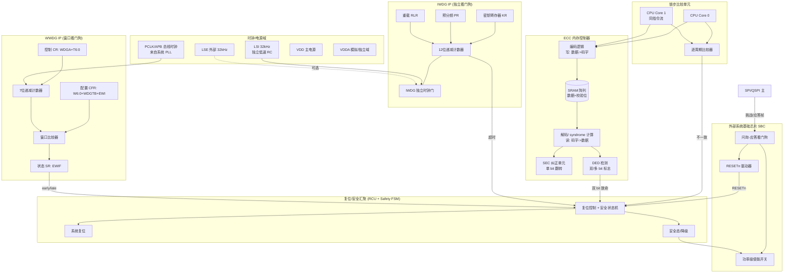

> 图 7（新增·芯片模块架构框图，满足硬性要求）：IWDG 走独立 LSI 时钟域，WWDG 走 PCLK 域，ECC 控制器挂在 CPU 总线与 SRAM 之间，锁步比较器跨双核，外部 SBC 经 SPI 与主 MCU 交互并经 RESETn/功率使能参与安全汇聚。所有致命信号最终汇入 RCU 安全状态机。

### A.2 IWDG IP 内部架构详解

IWDG 的"不可绕过"来自它的**独立时钟与独立使能锁存**。其 IP 内部关键通路如下：

1. **时钟源选择**：默认 LSI（片内 RC，约 32 kHz），部分器件允许切换到 LSE（外部 32.768 kHz 晶振）以获得更高精度与抗 RC 漂移能力。该时钟在 IWDG 使能后**无法被软件关闭**（独立的时钟门由硬件使能锁存控制）。
2. **预分频器（Prescaler）**：由 `PR[2:0]` 配置，典型分频系数 4/8/16/32/64/128/256。实际计数时钟 = LSI / 分频。
3. **12 位递减计数器**：从 `RLR[11:0]` 装载值开始，每个计数时钟减 1，减到 0 时产生复位请求。
4. **密钥保护**：对 `PR`/`RLR` 的写必须先向 `KR` 写 `0x5555` 解锁，写完成后再写 `0xAAAA` 触发重载，写 `0xCCCC` 启动看门狗。这种"写序列"防止失控代码误改配置。
5. **硬件看门狗选项**：通过选项字节/熔丝置位后，调试器暂停（DBG 模式）也不会冻结 IWDG，确保调试态不掩盖真实超时。

**为何 IWDG 用独立时钟更可靠**：若使用系统时钟，一旦 PLL 失锁或 HSE 失效，计数节奏会被打乱甚至停止，看门狗可能"假死"而失去兜底意义。独立 LSI 与主时钟树解耦，即使主电源域的时钟网络整体故障，IWDG 仍按自己的节拍推进——这正是 ISO 26262 强调的"诊断机制独立性"在时钟维度的体现。

### A.3 WWDG IP 内部架构详解

WWDG 的精髓在**窗口比较器**。其 IP 内部关键通路：

1. **APB 时钟输入**：PCLK 经 `WDGTB[1:0]`（位于 CFR）分频得到计数时钟，再驱动 7 位递减计数器 T[6:0]。
2. **控制寄存器 CR**：bit7 `WDGA` 为使能（一旦置 1 不可软件清零，只能复位清除）；bit[6:0] 为当前计数器值，软件写它即"喂狗重载"。
3. **配置寄存器 CFR**：bit[6:0] `W[6:0]` 为窗口下界；bit[8:7] `WDGTB` 为时基分频；bit9 `EWI` 为使能早期唤醒中断（计数器减到 `0x40` 时触发 EWIF，给软件一个"最后一拍诊断"的机会，而非立即复位）。
4. **窗口比较器**：实时比较 T[6:0] 与 W[6:0]。当 `T > W` 时处于"禁止喂狗区"，此时任何喂狗写操作被判定 early 错误；当 `T <= W` 且 `T >= 0x40` 时处于合法窗口；当 `T` 减到 `0x40` 以下（T6 清零）仍未喂，触发 late 复位。

与 IWDG 不同，WWDG 的使能可由硬件在复位后保持（选项字节"窗口看门狗自启动"），即上电即进入监控，避免 Bootloader 阶段成为盲区。

### A.4 ECC 内存控制器 IP 内部架构详解

ECC 控制器是位于"CPU/总线"与"物理存储阵列"之间的硬件层，对软件基本透明。其流水线：

1. **写路径（编码）**：CPU 写 64 位（或 32 位，视实现）数据，编码逻辑按 SECDED 生成 8 位（72,64 典型）或相应位数的校验位，`{数据, 校验}` 一同写入阵列。
2. **读路径（解码 + syndrome）**：读出 `{数据, 校验}`，解码逻辑用同样生成多项式重算校验，与存储校验异或得到 **syndrome**。
3. **SEC 纠正**：若 syndrome 命中单错模式，纠正单元定位 bit 并翻转，返回正确数据；同时置单 bit 事件标志，触发 ECC 中断（若使能）。
4. **DED 检测**：若 syndrome 指示多错，纠正单元**不做任何翻转**（避免错纠），置双 bit 错误标志，经中断控制器或 NMI 把控制权交给安全软件。
5. **故障注入通道**：测试模式下，注入寄存器可强制在写入时翻转指定 bit，使下一次读触发预期 ECC 事件——这是第八节错误注入的物理入口。
6. **地址/类型标记**：部分器件在 ECC 错误中断里提供**故障地址寄存器（FAR）**与 **syndrome 寄存器**，软件据此定位是哪个 SRAM 块、哪个 bit，做趋势统计。

注意 ECC 控制器也有自己的**保护**：其配置寄存器（使能、中断屏蔽）应置于"仅特权模式可写"并受 MPU/TrustZone 保护，否则失控或恶意代码可关闭 ECC 使整个机制失效。

### A.5 锁步比较器 IP 与 ECC 的协作

锁步比较器（Compare Unit）独立于 ECC 控制器，但二者常被纳入同一"安全岛"：

- **锁步比较器**逐周期比对 CPU0/CPU1 的输出（取指地址、访存地址/数据、标志位）。不一致即意味着"计算路径"瞬时出错，立即向 RCU 报"计算失配"。
- **ECC 控制器**守护"存储路径"。若锁步检测到失配，往往先冻结流水线、再读相关内存——此时若内存也报错，ECC 会上报双 bit，二者共同把"计算+存储"两条失效路径都收敛。
- 在高安全设计里，比较器还与**总线奇偶保护**、**时钟监控（CMS）**联动：时钟频率异常时提前降频或切安全态。

### A.6 外部看门狗 SBC 连接与 SPI 链路

外部 SBC（如车规系统基础芯片，含电源管理 + 看门狗 + 失效输出）与主 MCU 的接口通常是 SPI/QSPI。关键物理连接：

- **SCLK/MOSI/MISO/CS**：用于挑战值下发与应答回送；
- **RESETn（SBC→MCU）**：SBC 在检测失败（应答错/超时/过早）时拉低，强制 MCU 复位；
- **ERR/FS_OUT**：SBC 的失效汇总输出，可接 MCU 的不可屏蔽中断或安全状态机；
- **ENx（MCU→SBC 或 SBC→功率级）**：正常时维持功率级使能，失败时由 SBC 切断。

SBC 看门狗通常也支持"窗口化"——即应答必须在挑战发出后的规定窗口内返回，太早/太晚均判失败，与 WWDG 思想一致，但裁决方在 MCU 之外，独立性更强。

### A.7 时钟域与复位域的分工（为何如此划分）

| 模块 | 时钟域 | 复位域 | 独立性要点 |
| --- | --- | --- | --- |
| IWDG | LSI/LSE（独立低速） | 独立看门狗域（不被系统复位清除使能） | 主时钟树失效仍计数 |
| WWDG | PCLK/APB（系统时钟） | 系统复位域 | 依赖主时钟，主时钟挂则失效，故不能替代 IWDG |
| ECC 控制器 | 总线时钟 | 系统复位域 | 与 CPU 运算路径硬件隔离 |
| 锁步比较器 | CPU 时钟 | 系统复位/安全域 | 双核同源时钟、结果比对，检测计算瞬错 |
| 外部 SBC 看门狗 | SBC 自有时钟 | SBC 独立电源域 | MCU 电源/时钟失效仍可裁决 |

这张表是做"独立性论证（Independence）"时直接引用的物理证据：IWDG 与 SBC 看门狗分属不同电源/时钟域，满足 ISO 26262 对诊断机制免于共因失效的要求。

### A.8 模块协作与复位触发路径

把所有模块汇聚到 RCU 后，复位/安全触发路径可归纳为：

1. **IWDG 超时** → RCU 直接产生系统复位（最快兜底）；
2. **WWDG early/late** → RCU 产生系统复位（若未配置 EWI 转诊断）；
3. **ECC 双 bit / 不可纠正** → 触发 NMI → 软件进安全态 → 必要时经 RCU 复位；
4. **锁步比较失配** → 冻结 + 报 RCU → 安全态/复位；
5. **外部 SBC 应答失败** → SBC 拉 RESETn → RCU 接收复位 → 同时切断功率使能。

下面用一张"复位触发路径图"表达这种汇聚关系（与图 7 互补，更聚焦"谁触发复位"）：

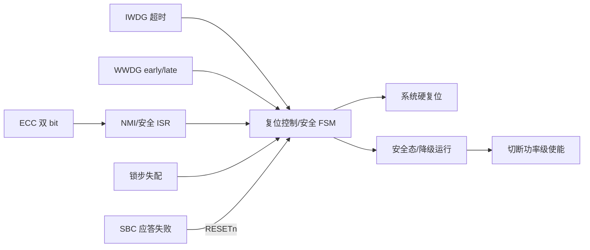

> 图 8（新增）：所有致命故障源（内部看门狗、ECC、锁步、外部 SBC）经统一 RCU 汇聚为"复位"或"安全态"两类收敛动作。

---

## A.9 寄存器与位域详解（IWDG / WWDG / ECC）

> 本节给出**寄存器/位域图**（满足硬性要求，且提供 ≥2 张）。位域定义采用通用 IP 逻辑，地址与位宽符合常见车规 MCU 实现；具体数值以芯片手册为准，但逻辑自洽、可用于驱动开发。

### A.9.1 IWDG 寄存器位域图

IWDG 基地址示例 `0x4000_3000`，三个核心寄存器：`KR`（密钥）、`PR`（预分频）、`RLR`（重载）。

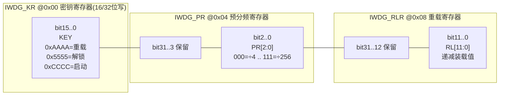

> 图 9（新增·寄存器/位域图一）：IWDG 的 KR/PR/RLR 位域。写 PR/RLR 前须向 KR 写 `0x5555` 解锁；喂狗写 `0xAAAA`；启动写 `0xCCCC`。

关键位域语义：

| 寄存器 | 位域 | 名称 | 说明 |
| --- | --- | --- | --- |
| KR | 15..0 | KEY | 写入特定密钥才生效，防误写 |
| PR | 2..0 | PR[2:0] | 预分频，决定计数时钟 = LSI / 2^(PR+2) |
| RLR | 11..0 | RL[11:0] | 计数器装载值，决定超时 = (RL+1) × 分频 / LSI |
| SR(可选) | 1/0 | RVU/PVU | 重载/预分频更新忙标志，写后需等待清零 |

超时计算示例：LSI=32 kHz，PR=4（÷64），RL=0xFFF（4095）→ 超时 ≈ (4095+1) × 64 / 32000 ≈ 8.19 s。

### A.9.2 WWDG 寄存器位域图

WWDG 基地址示例 `0x4000_2C00`，三个核心寄存器：`CR`（控制）、`CFR`（配置）、`SR`（状态）。

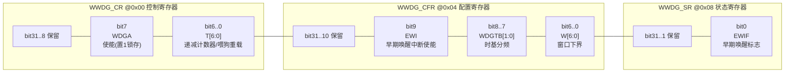

> 图 10（新增·寄存器/位域图二）：WWDG 的 CR/CFR/SR 位域。WDGA 使能后不可软件清零；T[6:0] 为计数器且兼作喂狗写入；W[6:0] 为窗口下界；EWI 使能后计数器到 `0x40` 置 EWIF。

窗口时序要点（以 T[6:0]、W[6:0] 为例）：

- 合法喂狗区间：递减中的计数器满足 `0x40 <= T <= W`；
- 过早：`T > W` 时写 CR 触发 early 错误（复位或 EWI）；
- 过晚：`T` 减到 `0x40` 以下（T6=0）未喂 → late 复位；
- 时基分频 `WDGTB` 决定计数时钟 = PCLK / (4096 × 2^WDGTB)。

### A.9.3 ECC 状态/控制/故障注入寄存器位域图

ECC 控制器通常暴露三类寄存器：控制（使能/中断屏蔽）、状态（单/双 bit 标志）、故障注入（测试用）。示例如下（通用逻辑，位宽视实现）：

```mermaid
flowchart LR
    subgraph ECC_CTRL["ECC_CTRL 控制寄存器"]
        C0["bit31..4 保留"]
        C1["bit3<br/>INJ_EN<br/>故障注入使能"]
        C2["bit2<br/>DBL_IE<br/>双 bit 中断使能"]
        C3["bit1<br/>SNG_IE<br/>单 bit 中断使能"]
        C4["bit0<br/>ECC_EN<br/>ECC 总使能"]
    end
    subgraph ECC_STAT["ECC_STAT 状态寄存器"]
        S0["bit31..8 保留"]
        S1["bit7..0<br/>SYND[7:0]<br/>syndrome(单错位定位)"]
        S2["bit1<br/>DBL_ERR<br/>双/多 bit 错误"]
        S3["bit0<br/>SNG_ERR<br/>单 bit 错误"]
    end
    subgraph ECC_FAR["ECC_FAR 故障地址寄存器"]
        F0["bit31..0<br/>FAULT_ADDR<br/>出错内存地址"]
    end
    subgraph ECC_INJ["ECC_INJ 故障注入寄存器"]
        J0["bit31..8 保留"]
        J1["bit7..0<br/>INJ_POS<br/>注入翻转位位置"]
        J2["bit1<br/>INJ_2BIT<br/>双 bit 注入"]
        J3["bit0<br/>INJ_1BIT<br/>单 bit 注入"]
    end
    C0 --- C1
    C1 --- C2
    C2 --- C3
    C3 --- C4
    C4 --- S0
    S0 --- S1
    S1 --- S2
    S2 --- S3
    S3 --- F0
    F0 --- J0
    J0 --- J1
    J1 --- J2
    J2 --- J3
```

> 图 11（新增·寄存器/位域图三，超额满足）：ECC 控制/状态/故障注入/地址寄存器位域。syndrome 用于单 bit 位定位；INJ 寄存器为第八节错误注入提供硬件入口。

---

# B. 驱动代码实现——真实可读的 C 驱动

> 本章起为新增核心章节。前面讲了机制与寄存器，这里落到"能编译、能跑、能看懂"的 C 驱动。笔者强调：驱动代码必须体现**窗口边界判断**、**错误中断处理**、**外部看门狗非阻塞服务**、以及**多任务活锁检测**——这些才是工程里真正出问题的地方。

为便于阅读，约定一套轻量寄存器映射（与 A.9 位域一致）：

```c
#include <stdint.h>
#include <stdbool.h>

/* ---------- 通用类型与寄存器映射（通用 IP 逻辑） ---------- */
typedef volatile struct {
    uint32_t KR;    /* 0x00 密钥 */
    uint32_t PR;    /* 0x04 预分频 */
    uint32_t RLR;   /* 0x08 重载 */
    uint32_t SR;    /* 0x0C 状态(可选) */
} IWDG_Type;

typedef volatile struct {
    uint32_t CR;    /* 0x00 控制 */
    uint32_t CFR;   /* 0x04 配置 */
    uint32_t SR;    /* 0x08 状态 */
} WWDG_Type;

typedef volatile struct {
    uint32_t CTRL;  /* 控制: ECC_EN/SNG_IE/DBL_IE/INJ_EN */
    uint32_t STAT;  /* 状态: SNG_ERR/DBL_ERR/SYND[7:0] */
    uint32_t FAR;   /* 故障地址 */
    uint32_t INJ;   /* 故障注入 */
} ECC_Type;

#define IWDG_BASE 0x40003000UL
#define WWDG_BASE 0x40002C00UL
#define ECC_BASE  0x40008000UL
#define IWDG ((IWDG_Type *)IWDG_BASE)
#define WWDG ((WWDG_Type *)WWDG_BASE)
#define ECC  ((ECC_Type  *)ECC_BASE)

/* 密钥常量 */
#define IWDG_KR_RELOAD  0xAAAAu   /* 喂狗重载 */
#define IWDG_KR_UNLOCK  0x5555u   /* 解锁 PR/RLR */
#define IWDG_KR_START   0xCCCCu   /* 启动看门狗 */

/* WWDG 位 */
#define WWDG_WDGA       (1u << 7)
#define WWDG_EWI        (1u << 9)
#define WWDG_T_MASK     0x7Fu
#define WWDG_W_MASK     0x7Fu
#define WWDG_TOP        0x7Fu
#define WWDG_WIN_FLAG   0x40u     /* T6 溢出标志位 */

/* 外部接口桩（由 bsp/spi 实现） */
extern void SPI_Write(uint8_t reg, uint8_t val);
extern uint8_t SPI_Read(uint8_t reg);
extern void EnterSafeState(void);
extern void Trigger_SystemReset(void);
extern void DEM_ReportEvent(uint16_t id, uint8_t severity, uint32_t addr, uint32_t info);
```

## B.1 IWDG 初始化与喂狗（含密钥解锁/预分频/重载）

下面给出完整可读的 IWDG 驱动：先解锁、配预分频与重载、启动，喂狗只需写重载密钥。

```c
/* B.1 独立看门狗 IWDG 初始化与喂狗 */
void IWDG_Init(uint8_t prescaler, uint16_t reload)
{
    /* 1. 解锁 PR/RLR：写入 0x5555 */
    IWDG->KR = IWDG_KR_UNLOCK;
    /* 2. 配置预分频 PR[2:0]，分频 = 4 * 2^PR（常见实现） */
    IWDG->PR = (uint32_t)(prescaler & 0x7u);
    /* 3. 配置重载值 RL[11:0]，决定超时上限 */
    IWDG->RLR = (uint32_t)(reload & 0x0FFFu);
    /* 4. 等待硬件同步（PVU/RVU 清零，可选轮询） */
    while (IWDG->SR & (1u << 1)) { /* PVU */ }
    while (IWDG->SR & (1u << 0)) { /* RVU */ }
    /* 5. 启动看门狗：写入 0xCCCC，此后不可软件停止 */
    IWDG->KR = IWDG_KR_START;
}

/* 周期性喂狗：仅写 0xAAAA 触发重载，不涉及解锁 */
void IWDG_Feed(void)
{
    IWDG->KR = IWDG_KR_RELOAD;
}

/* 超时预算估算（供喂狗周期设计参考）
 * 例：LSI=32000, prescaler=4(÷64), reload=0xFFF
 * timeout_ms = (reload+1) * (4*2^prescaler) * 1000 / LSI
 */
uint32_t IWDG_TimeoutMs(uint8_t prescaler, uint16_t reload, uint32_t lsi_hz)
{
    uint32_t div = (uint32_t)4u << (prescaler & 0x7u); /* 4*2^PR */
    uint64_t ticks = ((uint64_t)reload + 1u) * div;
    return (uint32_t)(ticks * 1000u / lsi_hz);
}
```

要点：喂狗函数 `IWDG_Feed` 不触碰 PR/RLR，因此不需要解锁序列，调用极快、可在监督任务中高频安全地调用；初始化时才需解锁，避免运行中配置被意外改写。

## B.2 WWDG 窗口边界喂狗（早/晚判断 + EWI 支持）

WWDG 喂狗必须读当前计数器并判断窗口边界，过早或过晚都报错。下面给出带边界判断的完整驱动。

```c
/* B.2 窗口看门狗 WWDG 初始化与窗口喂狗 */
void WWDG_Init(uint8_t wdgtb, uint8_t window, bool ewi_enable)
{
    /* 配置 CFR：时基分频 WDGTB[8:7]、窗口下界 W[6:0]、EWI[9] */
    uint32_t cfr = (((uint32_t)(wdgtb & 0x3u) << 7) |
                    ((uint32_t)(window & 0x7Fu) << 0));
    if (ewi_enable) {
        cfr |= WWDG_EWI;          /* 使能早期唤醒中断 */
    }
    WWDG->CFR = cfr;

    /* 启动并装载：WDGA=1，T 装入上界 0x7F */
    WWDG->CR = WWDG_WDGA | (WWDG_TOP & WWDG_T_MASK);
    /* 若 EWI 使能，需在 NVIC 中开启 WWDG 中断，此处略 */
}

/* 读取当前计数器值（T[6:0]） */
static inline uint8_t wwdg_current_cnt(void)
{
    return (uint8_t)(WWDG->CR & WWDG_T_MASK);
}

typedef enum {
    WWDG_OK,
    WWDG_EARLY,   /* 过早：仍在禁止区 */
    WWDG_LATE     /* 过晚：已越界/超时 */
} wwdg_ret_t;

/* 窗口边界喂狗：仅在 [window, 0x40) 内合法 */
wwdg_ret_t WWDG_Feed(uint8_t window)
{
    uint8_t cur = wwdg_current_cnt();
    /* 过早：计数器仍高于窗口下界 */
    if (cur > window) {
        return WWDG_EARLY;        /* 不应在此喂狗，说明程序流异常（可能跑飞空转） */
    }
    /* 过晚：已减到 T6 清零以下（0x40 为 T6 标志位边界） */
    if (cur < WWDG_WIN_FLAG) {
        return WWDG_LATE;         /* 已超时，硬件将复位 */
    }
    /* 合法窗口：重载到上界 */
    WWDG->CR = WWDG_WDGA | (WWDG_TOP & WWDG_T_MASK);
    return WWDG_OK;
}

/* 早期唤醒中断服务程序（EWI）：最后一拍诊断机会 */
void WWDG_IRQHandler(void)
{
    if (WWDG->SR & 0x1u) {         /* EWIF */
        WWDG->SR = 0x0u;           /* 清标志（写0/写1清，视实现） */
        /* 此处可做"最后一拍"安全诊断，例如冻结关键输出、置 DTC 预备 */
        DEM_ReportEvent(0x5001u, 1u, 0u, 0u); /* 早期预警事件 */
    }
}
```

要点：WWDG 喂狗前**必须读当前计数器**，与 A.3 的窗口比较器语义一致；`WWDG_EARLY` 返回值是极有价值的诊断信号——它往往意味着"程序比预期快很多"，是跑飞空转的强指示。

## B.3 ECC 单/双位错误读取与处理（含中断 + 故障注入）

下面给出 ECC 控制器初始化、错误中断处理（单 bit 纠正后登记、双 bit 进安全态）、以及错误注入测试接口。

```c
/* B.3 ECC 内存控制器：使能、中断处理、故障注入 */
void ECC_Init(void)
{
    /* 使能 ECC + 单/双 bit 中断 */
    ECC->CTRL = (1u << 0) |  /* ECC_EN */
                (1u << 1) |  /* SNG_IE */
                (1u << 2);   /* DBL_IE */
    /* 双 bit 错误通常路由到 NMI，由启动文件 ECC_NMI_Handler 接管 */
}

/* 单 bit 计数的趋势阈值（老化预警） */
#define ECC_SINGLE_WARN_THRESHOLD  32u
static uint32_t g_ecc_single_cnt = 0u;

/* ECC 错误中断（单/双 bit 共用，按标志区分） */
void ECC_IRQHandler(void)
{
    uint32_t stat = ECC->STAT;
    uint32_t addr = ECC->FAR;
    uint8_t  synd = (uint8_t)(stat >> 8);   /* SYND[7:0] 用于单错位定位 */

    if (stat & (1u << 0)) {                 /* SNG_ERR：单 bit */
        /* 硬件多数已自动纠正，软件仅登记趋势 */
        ECC->STAT = (1u << 0);              /* 清标志 */
        DEM_ReportEvent(0x6001u, 1u, addr, synd);
        if (++g_ecc_single_cnt > ECC_SINGLE_WARN_THRESHOLD) {
            DEM_ReportEvent(0x6002u, 2u, addr, 0u); /* 趋势预警：可能老化 */
        }
        return; /* 数据已正确，可继续运行 */
    }

    if (stat & (1u << 1)) {                 /* DBL_ERR：双/多 bit，不可纠正 */
        ECC->STAT = (1u << 1);              /* 清标志（若允许） */
        /* 系统已不可信：进安全态、限功率、报 FAILED DTC */
        EnterSafeState();
        DEM_ReportEvent(0x6003u, 3u, addr, synd);
        /* 关键区若可能污染，主动复位恢复干净态 */
        Trigger_SystemReset();
    }
}

/* 故障注入测试接口（第八节错误注入用） */
void ECC_FaultInject(uint32_t addr, uint8_t bit_pos, bool two_bit)
{
    ECC->CTRL |= (1u << 3);                 /* INJ_EN */
    ECC->INJ  = ((uint32_t)bit_pos & 0xFFu) |
                (two_bit ? (1u << 1) : (1u << 0));
    /* 随后向 addr 写入数据，硬件会在写时翻转指定 bit；
       下次读出该地址即触发对应 ECC 中断，用于验证机制有效。 */
}
```

要点：单 bit 处理"读 syndrome → 定位 → 仅登记"，双 bit 处理"立即进安全态 + 报 FAILED + 必要时复位"；故障注入寄存器为错误注入测试提供可控入口，是诊断覆盖率实证的物理基础。

## B.4 外部看门狗问询-应答服务（非阻塞、带超时）

外部 SBC 看门狗通过 SPI 交互，且必须在窗口内回送应答。驱动须**非阻塞、带超时**，避免喂狗路径自身成为死锁点（呼应 3.4）。

```c
/* B.4 外部 SBC 看门狗：问询-应答服务（非阻塞） */
#define SBC_REG_Q   0x10u   /* 挑战值寄存器 */
#define SBC_REG_R   0x11u   /* 应答回送寄存器 */
#define SBC_WIN_TICKS 20u   /* 应答窗口（调度节拍） */

/* 双方约定的应答算法（示例：带密钥的异或散列，真实项目用更强变换） */
static uint8_t sbc_response(uint8_t challenge, uint8_t key)
{
    uint8_t r = challenge ^ key;
    r = (uint8_t)((r << 1u) | (r >> 7u));   /* 循环左移 1 */
    r ^= (uint8_t)(challenge + key);
    return r;
}

/* 由监督任务周期性调用；返回 true 表示本周期已成功应答 */
bool SBC_Watchdog_Service(uint8_t key, uint32_t now_tick)
{
    static uint32_t deadline = 0u;
    if (now_tick < deadline) {
        return true;    /* 仍处于窗口内，无需重复应答 */
    }
    /* 1. 读取挑战值 Q（SPI，带超时保护，失败则不阻塞） */
    uint8_t q = SPI_Read(SBC_REG_Q);
    /* 2. 计算应答 R（纯计算，不依赖外部总线，安全） */
    uint8_t r = sbc_response(q, key);
    /* 3. 在窗口内回送 R（SPI，非阻塞、带超时） */
    SPI_Write(SBC_REG_R, r);
    deadline = now_tick + SBC_WIN_TICKS;
    return true;
}

/* 自检：连续多次应答失败则主动进安全态（呼应 3.4 死锁自检测） */
#define SBC_FAIL_LIMIT 3u
void SBC_Watchdog_Monitor(bool ok)
{
    static uint8_t fail = 0u;
    if (!ok) {
        if (++fail >= SBC_FAIL_LIMIT) {
            EnterSafeState();   /* 被动等 SBC 复位不可控，主动更优 */
        }
    } else {
        fail = 0u;
    }
}
```

要点：应答算法是纯计算、不依赖外部总线，因此即使 SPI 拥塞也能算出 R；但**回送**依赖 SPI，故 `SPI_Write` 内部须带超时，且 `SBC_Watchdog_Monitor` 在连续失败时主动进安全态——避免"为了证明活着而卡死在证明路上"。

## B.5 多任务协同喂狗 + 活锁检测（完整看门狗任务）

把前几节汇成一个**完整的看门狗监督任务**：聚合多任务存活、做 WWDG 窗口判断、喂 IWDG、服务外部 SBC，并检测"假活/活锁"。

```c
/* B.5 多任务协同喂狗任务 + 活锁检测（完整可运行骨架） */
#define TASK_NUM        6u
#define ALIVE_TIMEOUT   50u     /* 节拍 */
#define LIVELOCK_LIMIT  5u      /* 连续"全活但无有效产出"次数上限 */

static uint32_t g_alive[TASK_NUM];
static uint32_t g_wdg_deadline;
static uint8_t  g_livelock_cnt;
static uint32_t g_last_feed_tick;

/* 各关键任务在成功完成一轮有效工作后调用 */
void Wdg_TaskAlive(uint8_t id)
{
    if (id < TASK_NUM) {
        g_alive[id] = ALIVE_TIMEOUT;
    }
}

/* 看门狗监督任务：由 RTOS 周期调度（如每 1ms） */
void Watchdog_Monitor_Task(void)
{
    uint32_t now = OS_GetTick();   /* 假设存在 */
    bool all_alive = true;

    /* 1. 递减各任务存活计数 */
    for (uint8_t i = 0; i < TASK_NUM; i++) {
        if (g_alive[i] > 0u) g_alive[i]--;
        if (g_alive[i] == 0u) all_alive = false;
    }

    /* 2. 活锁检测：全体"存活"但喂狗节拍异常提前（说明在空转刷新） */
    if (all_alive && (now < g_wdg_deadline - ALIVE_TIMEOUT/2u)) {
        if (++g_livelock_cnt >= LIVELOCK_LIMIT) {
            EnterSafeState();      /* 疑似活锁：主动进安全态 */
            return;
        }
    } else {
        g_livelock_cnt = 0u;
    }

    /* 3. 多源健康聚合：仅当全部健康且 WWDG 在窗口内才喂 */
    if (all_alive) {
        wwdg_ret_t wr = WWDG_Feed(WWDG_WINDOW_LOW_CFG);
        if (wr == WWDG_OK) {
            IWDG_Feed();                       /* 内部兜底喂狗 */
            SBC_Watchdog_Service(SBC_KEY, now);/* 外部问询-应答 */
            g_wdg_deadline = now + WDG_PERIOD;
            g_last_feed_tick = now;
        }
        /* WWDG_EARLY/LATE 时故意不喂 IWDG，让内部兜底最终复位 */
    }
    /* 任一任务失活：不喂狗，等待 IWDG/WWDG 超时复位 */
}
```

要点：(1) 喂狗与任务存活严格绑定，杜绝"中断喂狗"式假活；(2) 活锁检测用一个"节拍异常提前"启发式，配合 `LIVELOCK_LIMIT` 主动进安全态；(3) WWDG 返回非 OK 时故意不喂 IWDG，使内部兜底最终复位——这是"双看门狗互补"在代码层的体现；(4) 外部 SBC 服务与内部喂狗并行，覆盖"独立性"。

---

# C. MCAL 配置说明——AUTOSAR Wdg / WdgM 与 ECC BSW

> 本章起为新增核心章节。B 章是"手写驱动"，但车规项目几乎都跑在 AUTOSAR 之上，可靠性机制由 **MCAL（Wdg 驱动）+ System Services（WdgM）+ 相关 BSW** 承载，经 EB tresos / DaVinci Configurator 配置并代码生成。笔者从"配置项清单 → 生成产物 → 调用路径 → 外部 SBC 适配"四个层面讲透。

## C.1 AUTOSAR 看门狗协议栈分层

AUTOSAR 中看门狗相关模块分层如下：

- **Wdg（MCAL）**：最底层驱动，直接操作 IWDG/WWDG 或外部看门狗硬件，提供 `Wdg_Init` / `Wdg_SetMode` / `Wdg_SetTriggerCondition`。它只认"触发条件（timeout）"，不理解"程序流"。
- **WdgIf（接口层）**：抽象多个看门狗设备（内部 + 外部），让上层不关心物理看门狗是谁。
- **WdgM（System Services）**：上层管理，理解"被监控实体 / 检查点 / 三种监控"，汇总后通过 WdgIf 触发底层喂狗。
- **OS / RTE**：WdgM 的 `MainFunction` 由 OS 调度，检查点由 SWC 经 RTE 调用 `WdgM_CheckpointReached`。

## C.2 Wdg 驱动配置（独立/窗口模式、超时）

Wdg 模块关键配置项（EB tresos 中 `Wdg` 容器）：

| 配置项 (Ecuc 参数) | 含义 | 典型取值 | 说明 |
| --- | --- | --- | --- |
| `WdgDefaultMode` | 默认工作模式 | `WDGIF_OFF` / `WDGIF_SLOW` / `WDGIF_FAST` | 上电默认模式 |
| `WdgTimeout` | 触发周期(ms) | 如 20 / 100 | `SetTriggerCondition` 的基准 |
| `WdgMode` (per device) | 设备模式 | `WdgIfOffMode`/`Slow`/`Fast` | 内部 IWDG/WWDG 或外部 |
| `WdgClockSource` | 时钟源 | `WdgInternalClock`/`External` | IWDG 用内部 LSI |
| `WdgPrescaler` | 预分频 | 4..256 | 对应 IWDG PR |
| `WdgReloadValue` | 重载值 | 0..4095 | 对应 IWDG RLR / WWDG 窗口 |
| `WdgWindowValue` | 窗口下界 | 0..127 | 仅 WWDG 模式有效 |
| `WdgExternalTrigger` | 外部触发使能 | true/false | SBC 问询-应答场景 |
| `WdgTriggerCounterMax` | 触发计数器上限 | 如 1000 | 防连续触发溢出 |

Wdg 三种模式语义：`OFF`（停用，仅调试/特殊态）、`SLOW`（长超时，如启动/低功耗）、`FAST`（短超时，正常运行）。模式切换经 `Wdg_SetMode`，常用于"启动阶段用 SLOW 给 Bootloader 留足时间，应用起来切 FAST"。

## C.3 WdgM 配置（被监控实体/检查点/失效后果/外部看门狗问询）

WdgM 是功能安全落地的核心，关键配置容器：

| 配置项 (Ecuc 参数) | 含义 | 典型取值 | 说明 |
| --- | --- | --- | --- |
| `WdgMConfig` | 总开关 | — | 含全局参数 |
| `WdgMSupervisedEntity` | 被监控实体 SE | SE_Ctrl/SE_Comm/SE_Diag | 每个关键功能一个 SE |
| `WdgMCheckpoint` | 检查点 | CP_Start/CP_End | SE 内标记点 |
| `WdgMAliveSupervision` | 存活监控 | `ExpectedAliveIndications`, `Min/Max Margin` | 防卡死 |
| `WdgMDeadlineSupervision` | 截止时间监控 | `Deadline Min/Max (tick)` | 防过快/过慢 |
| `WdgMLogicalSupervision` | 逻辑监控 | `Transition` 有向图 | 防跑飞 |
| `WdgMFailedSupervisionRef` | 失效引用 | 指向 SE | 关联失效后果 |
| `WdgMExpiredSupervisionCycleTol` | 容忍失效周期 | 如 3 | 允许连续失效次数 |
| `WdgMImmediateReset` | 立即复位 | true/false | 致命 SE 失稳即复位 |
| `WdgMExternalTrigger` | 外部看门狗问询 | true | 联动 SBC 问询-应答 |

WdgM 的三种监控必须同时配置才有"纵深"：仅 Alive 防不住跑飞（程序仍按时报活但顺序错），需 Logical 补位；仅 Logical 防不住"卡在某检查点"，需 Alive 补位；Deadline 则约束节奏，正好对应 WWDG 窗口思想。

## C.4 ECC 相关 BSW / Safety 配置

ECC 在 AUTOSAR 中通常由 **MCU / Memory / Safety** 相关模块承载，而非独立"Ecc"模块：

| 配置项 (Ecuc 参数) | 所属模块 | 含义 |
| --- | --- | --- |
| `McuRamEccErrorNotification` | Mcu | RAM ECC 错误通知回调 |
| `McuNvmEccSupport` | Mcu/Nvm | Flash ECC 使能 |
| `MemIf` / `Fee` ECC 策略 | Memory | 页级 ECC、坏块/冗余处理 |
| `SafetyOs` / `SafetyM` 错误路由 | Safety BSW | ECC 双 bit → OS 保护钩子/安全状态 |
| `DemEventParameter` (ECC) | Dem | 单/双 bit 错误映射到 DTC |
| `Mpu/MfConfig` | OS/Platform | ECC 配置寄存器特权保护 |

工程要点：ECC 错误必须映射到 DEM 事件，并在 Safety Case 中论证其 DC；双 bit 致命错误通常经 Safety BSW 触发 OS 的 `ProtectionHook` 或直接进安全状态，而不是仅仅记一个 DTC。

## C.5 EB tresos / DaVinci 配置项清单（综合表格）

下表汇总常见工具中的关键配置项，供工程师对照填写（工具名差异以实际版本为准，逻辑一致）：

| 模块 | 配置项 | EB tresos 路径示例 | DaVinci 路径示例 | 功能安全关注点 |
| --- | --- | --- | --- | --- |
| Wdg | `WdgDefaultMode` | `Wdg/WdgGeneral` | `Wdg→General` | 默认 SLOW/FAST |
| Wdg | `WdgTimeout` | `Wdg/WdgDevice` | `Wdg→Device` | FTTI 匹配 |
| Wdg | `WdgPrescaler` | `Wdg/WdgDevice` | `Wdg→Device` | IWDG 超时预算 |
| Wdg | `WdgWindowValue` | `Wdg/WdgDevice` | `Wdg→Device` | WWDG 窗口下界 |
| WdgIf | `WdgIfDevice` | `WdgIf/General` | `WdgIf→Devices` | 多设备抽象 |
| WdgM | `WdgMSupervisedEntity` | `WdgM/WdgMConfig` | `WdgM→SE` | SE 划分 |
| WdgM | `WdgMAliveSupervision` | `WdgM/SE` | `WdgM→SE→Alive` | 存活阈值 |
| WdgM | `WdgMDeadlineSupervision` | `WdgM/SE` | `WdgM→SE→Deadline` | 节奏约束 |
| WdgM | `WdgMLogicalSupervision` | `WdgM/SE` | `WdgM→SE→Logical` | 程序流图 |
| WdgM | `WdgMExternalTrigger` | `WdgM/General` | `WdgM→General` | SBC 问询 |
| WdgM | `WdgMImmediateReset` | `WdgM/SE` | `WdgM→SE` | 致命 SE 复位 |
| Mcu | `McuRamEccErrorNotification` | `Mcu/McuRamSector` | `Mcu→RAM` | ECC 回调 |
| Dem | `DemEventParameter` (ECC/WDG) | `Dem/DemConfig` | `Dem→Events` | DTC 映射 |

## C.6 WdgM 与 OS 看门狗触发集成

WdgM 的"真正喂狗"必须经过 OS 调度，典型集成路径：

1. **OS 周期报警（Alarm/Counter）** 触发 `WdgM_MainFunction`（建议为固定周期，如 5–10ms）；
2. `WdgM_MainFunction` 汇总所有 SE 的 Alive/Deadline/Logical 结果，若全部通过则调用 `WdgIf_SetTriggerCondition(timeout)`；
3. `WdgIf` 转发到底层 `Wdg_SetTriggerCondition`，驱动递减"触发计数器"，到 0 时真正喂硬件看门狗；
4. 若某 SE 失效超过 `ExpiredSupervisionCycleTol`，按配置执行" alerts "：轻则降级、重则 `WdgMImmediateReset` 或直接请求 OS 保护复位。

注意一个常见坑：**WdgM_MainFunction 自身优先级过低被长期抢占**，会导致"聚合判断"不及时，进而整体喂狗延迟。工程上应把它放在**较高优先级、且不被业务任务长期阻塞**的上下文，或至少保证其周期远小于看门狗超时，留出余量。

下面用一张"配置→生成→调用"路径图串起整条链路：

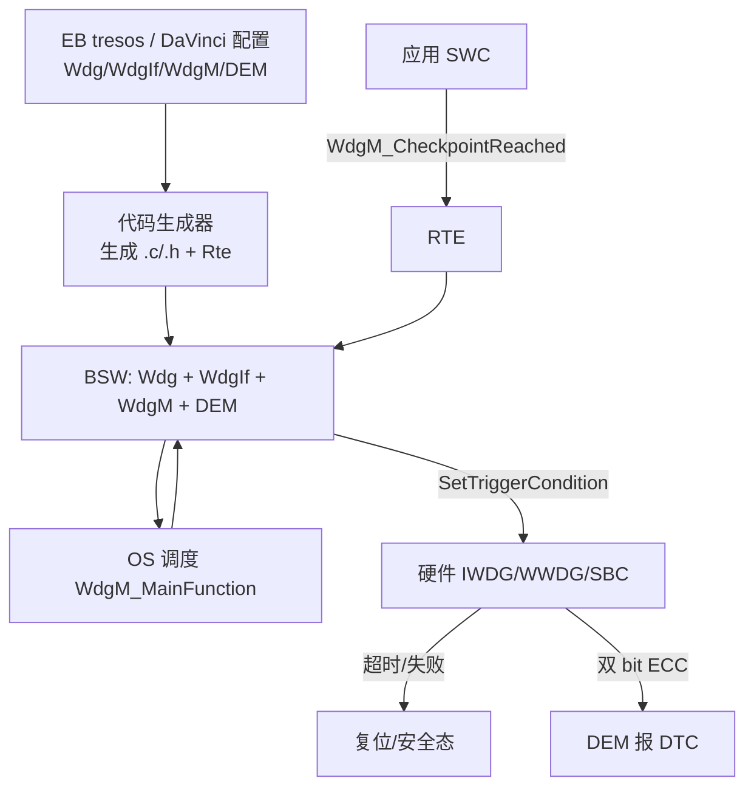

> 图 12（新增）：从工具配置、代码生成、RTE/SWC 调用，到底层硬件触发与故障收敛的完整自动路径。

## C.7 外部 SBC 看门狗的 MCAL 适配

外部 SBC 看门狗在 MCAL 中通常有两种接入方式：

1. **作为 Wdg 的一个"外部设备"**：在 `WdgDevice` 中配置 `WdgExternalTrigger=true`，由 Wdg 驱动通过 SPI 回调去服务 SBC；`WdgIf` 把它当作普通设备，WdgM 无感知——优点是对 WdgM 透明，缺点是无法在 WdgM 层做"问询-应答"语义的精细化控制。
2. **作为 WdgM 的 `WdgMExternalTrigger`**：由 WdgM 在聚合通过后才触发外部问询-应答流程，把"应答正确性"也纳入被监控语义——更贴合功能安全要求，但需要在 WdgM 与 SBC 驱动间建立专用回调（如 `WdgM_ExternalTriggerCbk`）。

笔者的工程建议：**ASIL-C/D 系统采用方式 2**，因为外部看门狗的独立性价值就在于它验证"程序流正确"而非"仅活着"，而这恰恰应由 WdgM 的程序流监控来驱动。具体实现上，WdgM 在 `MainFunction` 通过 `WdgIf` 调用外部设备驱动，外部驱动在限定窗口内完成 SPI 问询-应答；若连续失败，SBC 自行拉 RESETn，同时 WdgM 通过 `WdgMExternalTrigger` 失败计数触发本地安全态——形成"内外双重收敛"。

---

## 十、面试题精选（22 道，含要点）

下面精选车载嵌入式与功能安全面试中高频的看门狗 / ECC 题目，附要点提示。

**1. 为什么需要看门狗？它解决了什么问题？**
要点：软件可能死机/跑飞/活锁，看门狗是"反制自身软件的硬件法官"，将"无限期错误运行"收敛为"有限时间复位"，是故障收敛在时间维度的体现。

**2. IWDG 和 WWDG 的区别？各自适用什么场景？**
要点：时钟源（LSI vs PCLK）、触发条件（仅超时 vs 过早+过晚）、能否检测跑飞空转（否 vs 能）、可否被调试暂停（硬件看门狗模式不可）、精度与独立性。二者互补并存。

**3. 窗口看门狗为什么"过早喂"也算错？**
要点：过早喂意味着程序可能跑飞进入快速空转循环（周期被压缩），IWDG 看不出，WWDG 用窗口下界捕捉 early 错误。

**4. 为什么不能在定时器中断里无条件喂狗？**
要点：中断独立于主循环，主程序崩溃后中断仍跳，看门狗永远被喂，形成"假活"，彻底失效。

**5. 什么是"假活 / 活锁"？如何识别和根除？**
要点：系统已失去正确能力但看门狗仍被喂到。成因（错误位置、过松条件、活锁、超长超时）。识别靠 GPIO 示波器对比任务执行 vs 喂狗时刻；根除靠提升喂狗条件保真度（多源健康聚合）。

**6. 多任务系统应如何协同喂狗？**
要点：每个关键任务刷新自身存活标志/计数器，监督任务聚合判断，全部健康且在窗口内才喂；任一方失活即不喂触发复位。

**7. 喂狗与死锁如何规避？**
要点：喂狗路径应短且独立（优先内部寄存器），外部看门狗通信须独立非阻塞带超时；若连续无法喂狗应主动进安全态而非被动等复位。

**8. 什么是外部看门狗？为什么还需要它？**
要点：SBC 内置独立看门狗，提供独立性（防 MCU 系统性失效连带）、防固件误配、并支持问询-应答验证"程序流正确"而非仅"活着"。

**9. 问询-应答（challenge-response）看门狗原理？**
要点：SBC 发挑战值，MCU 用约定算法算应答并在窗口内回送；错/超时/过早则 SBC 拉复位或切功率使能。

**10. AUTOSAR WdgM 有哪三种监控模式？**
要点：Alive（存活，防卡死）、Deadline（截止时间，防过快/过慢）、Logical（逻辑/程序流，防跑飞到错误路径）。

**11. 什么是 ECC？为什么车规芯片普遍需要？**
要点：错误校正码，附加校验位检测/纠正内存错误；汽车宽温、长寿命、深亚微米工艺下软错误（SEU）必然偶发，需防静默数据错。

**12. SECDED 是什么？为什么只纠单错不纠双错？**
要点：单错纠正、双错检测。纠双错需更多位且可能纠成另一错误值更危险，故双错不盲纠而上报安全处理。

**13. 单 bit 和双 bit 错误分别怎么处理？**
要点：单 bit 硬件透明纠正 + 软件记录趋势；双 bit 进安全态、报 DTC、必要时复位，绝不带错运行。

**14. 单 bit 错误既然被自动纠正，为什么还要记录？**
要点：频繁单错是单元老化/抗噪裕量下降的先兆，趋势监控可在恶化为双错前预警。

**15. SRAM、Flash、L2 的 ECC 处理有何不同？**
要点：SRAM 实时透明 SECDED + 趋势；Flash 按页 ECC + 坏块/冗余/刷新；L2 行级 ECC + 错误行失效。

**16. 什么是锁步核？它与 ECC 什么关系？**
要点：双核同指令流逐周期比对，检测运算路径瞬时错（延迟极低）；ECC 守存储数据。二者互补，多见于 ASIL-D 安全岛。

**17. 如何证明看门狗/ECC 真的有效？**
要点：错误注入测试——故意卡死看复位、故意翻 bit 看 ECC 响应、验证 DEM/DTC，作为诊断覆盖率（DC）实证。

**18. 故障覆盖率指什么？看门狗与 ECC 的盲区在哪？**
要点：安全机制可检测危险故障比例。看门狗盲于假活/错误但按时喂；ECC 盲于超纠错能力的簇发多 bit 错。需 FMEDA 论证残余风险。

**19. ISO 26262 中哪里规定看门狗与 ECC？**
要点：Part 5（硬件 DC、独立性）、Part 6（软件失效检测、内存损坏处理）、ASIL 等级决定机制强度（B vs D 差异）。

**20. DEM 与 DET 的区别？**
要点：DEM 管产品运行期故障（DTC，UDS 0x19 可读）；DET 管开发期模块参数/状态错误（开发构建捕获）。

**21. 低功耗模式下看门狗如何不误复位？**
要点：休眠前重配内部看门狗或转由 SBC 以休眠窗口/休眠心跳模式接管，采用窗口化休眠看门狗保证合法休眠且可检测休眠卡死。

**22. ECC 与 E2E 有什么区别与联系？**
要点：ECC 守存储/内存内部完整性，E2E 守跨网络传输完整性（CRC+计数器+超时），二者共同支撑 FFI 免于干扰。

**23.（进阶）IWDG 为何用独立时钟 LSI 而非系统时钟？**
要点：主时钟树失效（PLL 失锁/HSE 失效）时仍须兜底计数；独立时钟域满足 ISO 26262 诊断独立性，避免看门狗与被诊断对象共因失效。

**24.（进阶）WdgM 的 MainFunction 被长期抢占会有什么后果？如何设计？**
要点：聚合判断延迟 → 整体喂狗滞后 → 可能错过窗口。应置于较高优先级或保证周期远小于看门狗超时并留余量。

---

## 结语：把"不悄悄死掉"做成工程纪律

看门狗与 ECC，一个管"时间维度的正确"，一个管"数据维度的正确"，二者看似底层、朴素，却是功能安全落地最不可或缺的"最后一公里"。一个成熟的车载底层工程师，不会把看门狗当成一个"能复位就行"的开关，而会精心设计**喂狗条件的保真度**、**内外看门狗的独立性**、**WdgM 的程序流监控**；也不会把 ECC 当成一个"硬件自动搞定"的黑盒，而会**监控单错趋势**、**正确处理双错安全态**、**用错误注入实证其存在**。

本章从"为何需要"讲起，经类型对比、喂狗策略、假活识别、外部监控链、ECC 原理、错误注入、功能安全体系，再深入到**芯片 IP 内部架构（A 章）**、**真实 C 驱动实现（B 章）**、**AUTOSAR MCAL 配置（C 章）**三层工程纵深。笔者希望读者合上这一章时，不只是"知道"看门狗与 ECC，而是能在自己的芯片上"画得出 IP 框图、写得对驱动、配得准 MCAL、验得实覆盖"——把"系统要么正确运行、要么明确倒下并报警"作为工程纪律，落到看门狗的每一次喂狗、ECC 的每一次纠错登记上，才是真正的功能安全实践。

---

*（本章为公开技术知识库深度章节，型号参数采用笼统指代，不涉及任何具体厂商未公开参数；所有机制均基于公开的车规 MCU 架构与 ISO 26262 标准体系。A/B/C 三块为新增工程纵深内容，聚焦芯片 IP 架构、驱动实现与 AUTOSAR MCAL 配置。）*
