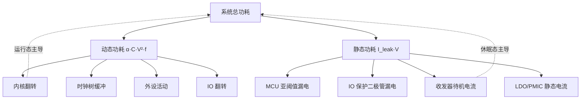
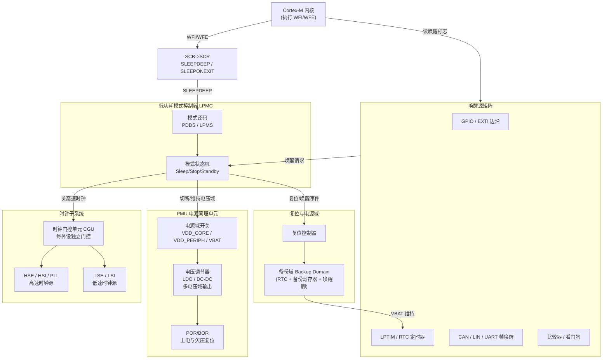
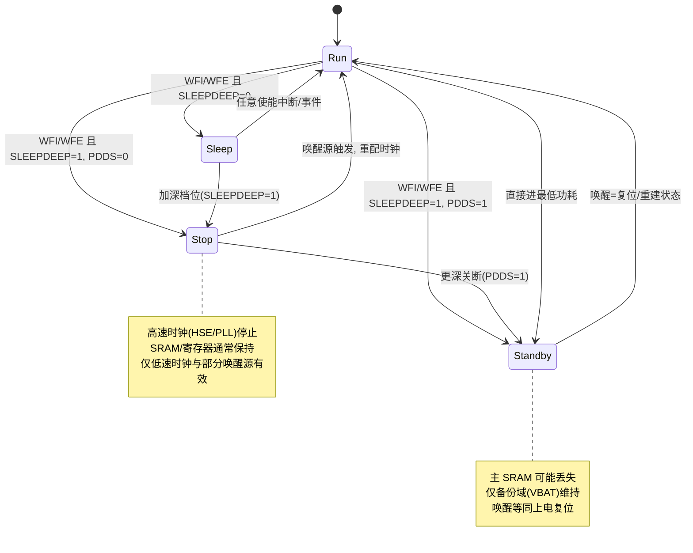
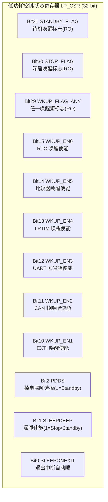
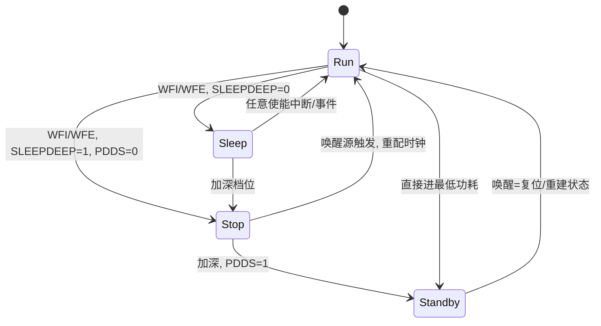
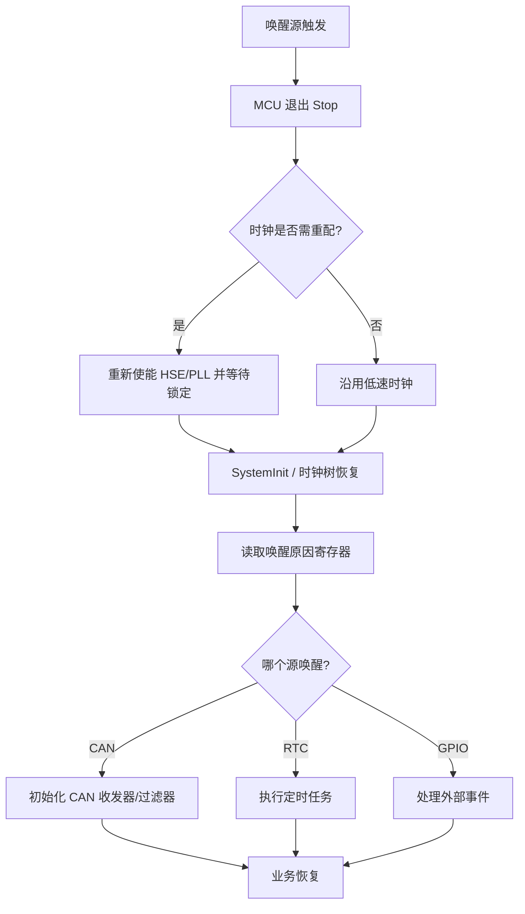
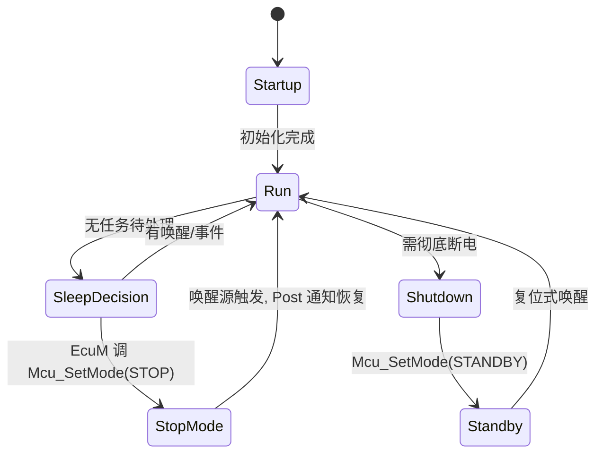
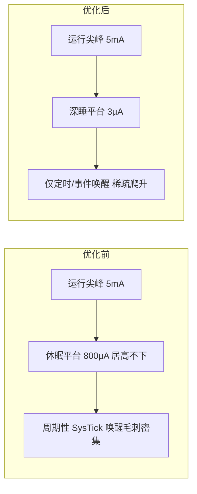
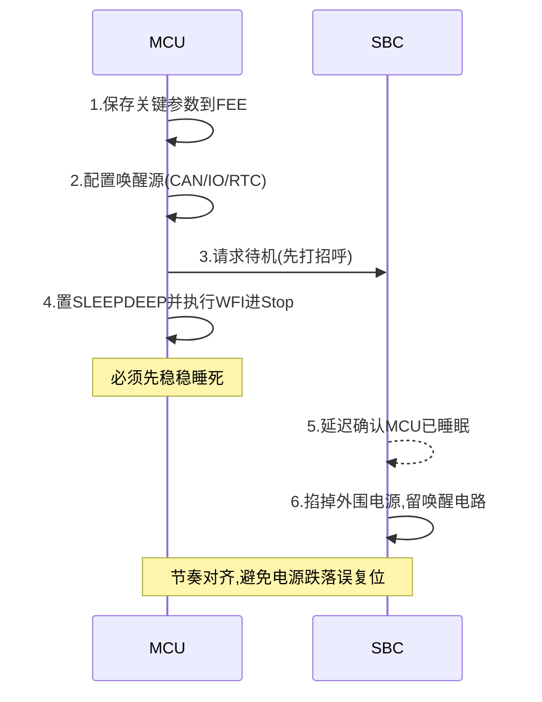

# 嵌入式低功耗设计与优化：从功耗分解、芯片模块架构到 MCAL 落地的系统工程

> 本文面向工业级低功耗嵌入式与芯片电源管理方向，系统讲解功耗物理来源、ARM Cortex-M 低功耗机制、芯片内部电源/时钟管理 IP 架构、裸机与 RTOS 驱动代码实现、AUTOSAR MCAL 配置，以及实测验证方法。全文以公开数据手册中稳定的架构特性为参照，参数采用业界公认的区间值或笼统指代，不针对具体批次或封装给出可能失真的精确数字。

---

## 一、停在车库里悄悄耗光电瓶的车——一个真实的低功耗事故

某款车型静置两周后无法点火启动，4S 店排查一圈发现：低压电瓶被电池管理系统（BMS）的"微眠"吃空了——休眠电流本应低至个位数微安（μA）级，实测却长期维持在毫安（mA）级。经过示波器与电流探头的逐项拆解，根因被定位到三处叠加：

1. 一个 GPIO 被错误地配置成**悬空输入**，引脚在内部随噪声抖动，既产生额外的输入缓冲器动态功耗，又通过保护二极管形成微弱的漏电通路；
2. 一个本应停掉的外设（调试串口或某个传感器接口）**时钟未被门控关闭**，其寄存器与模拟前端持续消耗电流；
3. 系统基础芯片（SBC）的下电时序与 MCU 进入低功耗的节奏**没有对齐**，导致每次"休眠"实际上都没真正睡死，MCU 反复被内部逻辑拉回浅睡态，功率管与 LDO 始终维持工作状态。

整车下电之后，BMS、车身控制器（BCM）、网关等节点必须进入**极低功耗休眠**，否则静止车辆的电瓶会被缓慢放干。低功耗从来不是"调一个寄存器"那么简单，而是 MCU 功耗状态、SBC/PMIC 电源时序、唤醒源配置三方协同的系统工程。

作为长期从事低功耗设计的工程师，笔者的体会是：低功耗问题的 80% 不在"如何进低功耗"，而在"为什么没真正睡下去"以及"醒来后为什么跑飞"。前者往往是时钟门控遗漏、IO 漏电、电源域未关；后者往往是唤醒后时钟树与外设状态未重建。这两类问题在车载与工业长供电场景中被放大得尤为明显。

本文将从功耗的物理来源讲起，逐步深入到芯片内部电源/时钟管理 IP 架构、ARM Cortex-M 的低功耗指令语义、主流芯片厂商的功耗模式实现、裸机与 RTOS 的驱动代码实现、AUTOSAR MCAL 配置，最后给出可落地的实测方法与高频面试题。

---

## 二、功耗来源分解：每一微安都来自哪里

要谈低功耗，第一步是把"功耗"这个笼统概念拆解为可测量、可治理的物理来源。一个典型的嵌入式节点（以电池供电的 MCU 系统为例）的功耗可以粗略分解为以下五大部分。

### 2.1 五类功耗来源及其占比特征

| 功耗来源 | 物理成因 | 典型占比（运行态） | 典型占比（休眠态） | 治理手段 |
| --- | --- | --- | --- | --- |
| MCU 内核 | 逻辑翻转、流水线、Cache 命中/失效、ALU 运算 | 30%–55% | <1%（停核后） | 降频、降压、停核、用 DMA 替代 CPU 搬运 |
| 时钟系统 | HSE/HSI/PLL、分频树、时钟缓冲器的静态与动态功耗 | 10%–25% | 5%–15%（保留低速时钟） | 关 PLL、切低速时钟、关未用时钟分支 |
| 片上外设 | UART/SPI/I2C/ADC/TIMER、模拟前端、比较器 | 10%–30% | 2%–10% | 时钟门控、外设断电、用低功耗外设替代 |
| IO 与引脚 | 输出驱动、输入缓冲、上/下拉电阻、外部负载 | 5%–20% | 1%–8%（漏电为主） | 浮空引脚处理、关上拉、驱动外部器件断电 |
| 外围器件 | 传感器、通信收发器、存储器、LDO 自身静态电流 | 10%–40% | 5%–40%（收发器/电源是大头） | 由电源开关切断、使能脚拉低、选低 IQ 器件 |

需要强调：上表的占比是**量级参考**而非精确公式。在运行态，内核与时钟往往是大头；但在休眠态，真正决定"能不能睡到 μA 级"的，反而是**外围器件（尤其是通信收发器、电源转换芯片自身的静态电流）和 IO 漏电**。许多团队把全部精力花在 MCU 模式切换上，却忽视了收发器待机电流有数百 μA、LDO 静态电流数十 μA 的事实，结果 MCU 睡到 1 μA，整板仍然 300 μA，优化收效甚微。

### 2.2 动态功耗与静态功耗

从物理公式层面，CMOS 电路的功耗由两部分构成：

- **动态功耗**：`P_dynamic ≈ α · C · V² · f`，其中 α 为翻转活动因子，C 为负载电容，V 为供电电压，f 为时钟频率。这一公式揭示三个杠杆：降低电压（平方关系，效果最显著）、降低频率（线性）、减少不必要的翻转（用 DMA、关未用外设）。
- **静态功耗（漏电流）**：`P_static ≈ I_leak · V`，由亚阈值泄漏和栅极氧化层隧穿构成，随工艺制程缩小而指数上升，随温度升高显著增大。深休眠时动态功耗趋近于零，此时静态漏电流成为绝对主导，也就是为什么"停在车库两周"会被 μA 级漏电流拖垮。

把这两类功耗画成一张分解关系图，能直观看到优化重点的转移：



> 图 2-1：系统功耗分解为动态与静态两大部分，运行态由内核翻转主导，深休眠态由收发器待机与电源静态电流主导。

### 2.3 具体外设的功耗画像

把"外设"笼统地说成"10%–30%"还不够，落地时需要对板上的每个外设建立功耗画像。下面给出一个典型电池节点的外设功耗量级参考（仅为量级示意，具体以器件数据手册为准）：

| 外设/器件 | 工作电流（量级） | 待机/关断电流（量级） | 低功耗治理要点 |
| --- | --- | --- | --- |
| MCU 内核（运行） | 数 mA–数十 mA | < 5 μA（深睡） | 降频降压、停核 |
| 片上 ADC | 数百 μA–2 mA | 数 μA | 用单次转换+自动关断，避免常开 |
| 高速 UART（115200） | 数十–数百 μA | 可门控至 0 | 不用时关时钟，唤醒前再开 |
| SPI 接口（驱动 Flash） | 数百 μA–数 mA | 可门控至 0 | Flash 自身也需进掉电指令 |
| I2C 传感器 | 数十–数百 μA | 数 μA（传感器休眠） | 传感器发休眠指令，而非仅关 MCU 脚 |
| CAN 收发器 | 数 mA（主动） | 数十–数百 μA（静默监听） | 选总线唤醒型收发器，禁用时常关 |
| 无线模组（BLE/WiFi） | 数 mA–数百 mA（发射） | 1–300 μA（PS 模式） | 用模组 PS 模式或板级负载开关硬断电 |
| 外部 LDO/PMIC | — | 自身静态 1–50 μA | 选低 IQ（< 1 μA）器件 |
| 板载 LED 指示 | 1–20 mA | 0（关） | 休眠前务必熄灭，或用 PWM 极低占空比 |

这张表揭示一个常被忽视的事实：**无线模组与通信收发器的待机电流，往往比 MCU 深睡电流高 1–2 个数量级**。如果只优化 MCU 而不管收发器，整机休眠电流永远下不去。正确的做法是：在长休眠期，通过 GPIO 控制负载开关把无线模组整个断电（硬关断到 μA 以下），只在需要上报的短暂窗口上电；而对必须维持总线监听的 CAN，则选用支持"帧唤醒"且静默电流极低的收发器。

### 2.4 工艺制程与温度对静态功耗的影响

静态漏电流 `I_leak` 不是常数，它随两项因素剧烈变化：

- **工艺制程**：越先进的制程（如 40 nm 相比 180 nm），晶体管阈值电压更低、栅氧更薄，亚阈值泄漏显著增大。这也是为什么"超高主频的新 MCU"在运行态很省电，但深休眠漏电反而可能比老制程更高。超低功耗系列（如主打 μA 级休眠的 MCU）往往刻意采用较成熟制程或特殊超低漏电库来压住 `I_leak`。
- **温度**：漏电流近似随温度指数上升，常温到 85 °C 可能翻数倍甚至十倍。这意味着**实验室常温下测得的 3 μA 休眠电流，在发动机舱 85 °C 环境可能变成 20–30 μA**。做车规或工业产品时，必须在高低温箱中复测休眠电流，而不能只信常温数据。

因此，功耗预算要按**最恶劣工况（最高温度 + 最低电压 + 全部唤醒源使能）**留足余量，而不是用"理想常温"去算续航。

### 2.5 功耗预算的量化计算方法

在设计初期，应建立一个简单的"电流预算表"，把每个状态下的电流与停留时间填进去，估算平均电流与续航。以一节 2400 mAh 的锂亚电池、目标续航 5 年（≈43800 小时）为例：

- 可用平均电流上限：`2400 mAh / 43800 h ≈ 54.8 μA`。
- 扣掉 20% 自放电与低温折损，实际可用约 **44 μA**。

若系统每天上报 4 次，每次：唤醒 5 ms（MCU 8 mA + 模组发射 80 mA ≈ 88 mA），建立连接 200 ms（MCU 5 mA + 模组 15 mA ≈ 20 mA），其余时间深睡（MCU 2 μA + 收发器 30 μA + LDO 5 μA ≈ 37 μA）。

日均能耗 ≈ `4 × (0.005 s × 88 mA + 0.2 s × 20 mA) + 86400 s × 37 μA`
≈ `4 × (0.00044 + 0.004) mAh + 86400 × 0.000037 mA·h`
≈ `0.0178 mAh + 3.197 mAh ≈ 3.21 mAh/天`。

年化：`3.21 × 365 ≈ 1172 mAh`，远小于 2400 mAh，**续航可达约 2 年**（这里未进一步扣自放电，仅作方法演示）。这个计算过程的价值在于：它强迫设计者把"每一次唤醒花了多少、休眠占了多少"显式算出来，从而发现优化重点到底在 MCU 还是在收发器。

---

## 三、芯片模块设计（IP 内部架构）：电源与时钟管理子系统

真正理解低功耗，必须先理解芯片内部是怎么把"停核—停时钟—关电源域"这套动作落到硬件上的。本节以一颗通用 Cortex-M 系列 MCU 的电源/时钟管理 IP 子系统为例，给出工业级模块架构、寄存器位域、指令协作与硬件时序。

### 3.1 电源与时钟管理子系统总框图

一颗典型的低功耗 MCU 在芯片内部把电源与时钟的管理职责拆成若干个协同工作的硬核（hardened IP）：PMU（电源管理单元）、时钟子系统（含 CGU 时钟门控单元）、低功耗模式控制器 LPMC、唤醒源矩阵、复位与电源域控制器。它们与 Cortex-M 内核通过系统总线与专用控制线相连。下面的框图给出它们之间的信号流向。



> 图 3-1：芯片电源与时钟管理子系统架构框图。PMU 负责多电源域与电压调节，CGU 负责外设时钟门控，LPMC 是模式状态机的总指挥，唤醒源矩阵在任意深睡态仍可断言唤醒请求，复位/备份域保证唤醒后可判定来源并重建状态。

### 3.2 PMU：多电源域与电压调节

PMU（Power Management Unit）是芯片内部"配电柜"。它将外部单一输入（如 VDD 或 VBAT）经片上 LDO/DC-DC 转换为多个内部电压域：

- **VDD_CORE**：给内核、SRAM、数字逻辑供电，可由 PMU 在深睡时降压甚至断电；
- **VDD_PERIPH**：给外设与 IO 缓冲器供电，可在 Stop 时保留、在 Standby 时切断；
- **VDD_PLL / VDD_USB 等专用域**：给模拟与特定外设供电，可在不使用时单独关断；
- **VBAT / VDD_BACKUP**：由独立电源（电池或超级电容）维持，只给备份域供电，保证 RTC 与唤醒引脚在 Standby 下仍工作。

电压调节的精细度直接决定了 DVFS 的可用性：PMU 必须能按 OPP（Operating Performance Point）表给出与频率匹配的核电压，且具备"先升压后升频、先降频后降压"的有序切换能力。笔者在调一个 Cortex-M7 平台的 DVFS 时，曾因 PMU 反馈环路稳定时间不足，升频过快导致内核在 1.0 V 下跑了 1.2 V 才该跑的 400 MHz，结果偶发数据错误——根因正是忽略了 PMU 电压爬升的建立时间。

### 3.3 时钟门控单元 CGU：外设级时钟开关

CGU（Clock Gating Unit）为每个外设和系统总线提供独立的时钟使能位。其本质是一组受寄存器控制的与门/或门锁存：

- **总线级门控**：当 CPU 进入 Sleep 但总线空闲，AHB/APB 桥可自动暂停部分子总线时钟；
- **外设级门控**：每个 UART/SPI/TIMER 在 `RCC_xxxENR` 中占一位，写 0 即关闭其时钟输入，停止一切翻转；
- **自动时钟请求（Auto clock gating）**：部分 IP 在内部无事务时自动门控自身时钟，无需软件干预。

CGU 的收益来自两点：被门控的外设停止翻转（省动态功耗），且其时钟缓冲器停止驱动（省部分静态功耗）。注意：关时钟**不等于**关电源，要进一步省电需配合外设断电或深睡模式。

### 3.4 低功耗模式控制器 LPMC：Sleep/Stop/Standby 状态机

LPMC 接收来自内核 `SLEEPDEEP` 信号与 PMU 模式选择位（如 `PDDS`、`LPMS`），驱动一个状态机在 Run / Sleep / Stop / Standby 之间迁移。其状态机语义如下：



> 图 3-2：LPMC 模式状态机。越往深处，唤醒越慢、状态丢失越多，但静态功耗越低；迁移条件本质是 SLEEPDEEP 与 PDDS 两个控制位的组合。

### 3.5 唤醒源矩阵：多源 OR 逻辑

唤醒源矩阵把多个"能叫醒 MCU"的信号做 OR 汇聚，只要任一使能的源断言，就向 LPMC 与 CPU 送唤醒请求。常见源包括：

- **GPIO/EXTI 边沿**：按键、充电枪、点火、电源好信号；
- **定时器**：LPTIM、RTC 闹钟/周期唤醒；
- **通信帧唤醒**：CAN/LIN/UART 在特定 ID/帧/起始位上产生脉冲；
- **模拟源**：比较器、低功耗看门狗、欠压检测。

唤醒源矩阵通常还有一个"唤醒使能寄存器"，只有被置位的源才允许参与 OR。这一机制保证了深睡时不会被未预期的源误唤醒（例如调试期希望屏蔽某个抖动引脚）。

### 3.6 复位与电源域：唤醒后如何"认祖归宗"

复位控制器把"上电复位、看门狗复位、低功耗唤醒、引脚复位"等来源分别打上标志位，并存放在一个**唤醒/复位状态寄存器**中。唤醒后的软件第一件事往往就是读这个寄存器，以区分"这次是被 RTC 叫醒还是被 CAN 叫醒"。备份域（Backup Domain）由 VBAT 维持，内部 RTC 计数器与若干备份寄存器即使在 Standby 下也不丢失，是"深睡后重建状态"的关键落点。

### 3.7 低功耗控制/状态寄存器位域（LP_CSR / LP_WKUP_EN）

下面给出一组**通用 IP 视角的低功耗控制/状态寄存器位域示例**。它们符合常见实现逻辑：`SLEEPDEEP`、`SLEEPONEXIT` 本在 Cortex-M 的 SCB->SCR 中，此处把芯片扩展的电源控制位（`PDDS`、`LPMS`）与状态/唤醒使能位合并为一组便于理解的视图。



> 图 3-3：低功耗控制/状态寄存器位域示例。`SLEEPDEEP=0` 时 WFI/WFE 进 Sleep；`SLEEPDEEP=1, PDDS=0` 进 Stop；`SLEEPDEEP=1, PDDS=1` 进 Standby。唤醒使能位（Bit10–Bit15）决定哪些源允许参与唤醒 OR；状态标志位（Bit29–Bit31）为只读，供唤醒后判定来源。

配套还有一个偏移独立的**唤醒源状态寄存器 LP_WKUP_SR**，每位对应一个源是否在本次断言过；软件读清（read-clear 或写 1 清）以避免重复处理。这种"使能寄存器 + 状态寄存器"的双寄存器结构是芯片低功耗 IP 的通用范式。

### 3.8 WFI/WFE 指令与内核/PMU 的协作

`WFI`/`WFE` 是 Cortex-M 的特权指令，执行时内核做以下动作：

1. 完成当前指令的提交，置自身于"等待"状态，停止取指与执行；
2. 向系统控制器发出"请求低功耗"信号，该信号携带 `SLEEPDEEP`、`SLEEPONEXIT`（来自 SCB->SCR）的值；
3. 若 `SLEEPDEEP=1`，该请求被路由到 LPMC，LPMC 再依据 `PDDS` 等芯片位决定进入 Stop 还是 Standby，并通知 PMU/CGU 执行关钟关域；
4. 唤醒后，内核从 `WFI`/`WFE` 的下一条指令继续（Sleep 态）或从复位向量/保留上下文恢复（Standby 态）。

`WFE` 与 `WFI` 的区别在于唤醒条件：`WFI` 只认"被使能的中断挂起"；`WFE` 还认"事件"——事件可由 `SEV` 指令、外部 `RXEV`/`TXEV` 事件输入或外设事件信号产生。`WFE` 配合事件通信，常用于多核或主从外设的"握手"低功耗场景，避免为了一次通知就占用一个中断号。`SLEEPONEXIT` 置位后，CPU 从中断服务程序（ISR）返回时**自动**执行 `WFI`，适合"中断驱动、平时全休眠"的极致低功耗系统。

### 3.9 模式切换的硬件时序

从 Run 进入 Stop 的硬件时序（简化）大致为：

1. CPU 执行 `WFI`，清空流水线，发出 sleep 请求；
2. LPMC 锁存 `SLEEPDEEP=1, PDDS=0`；
3. CGU 在若干个同步周期内停止 HSE/PLL 输出，切换系统时钟到 HSI/LSI 或停振；
4. PMU 将 VDD_CORE 维持或降压，保留 SRAM 供电；
5. 内核时钟关闭，进入 Stop；
6. 任一使能唤醒源断言 → LPMC 释放时钟门控，重新使能 HSE/PLL（需重新锁定），清唤醒标志，CPU 取指继续。

时序关键点：HSE/PLL 重新锁定需要**数十到数百微秒**的窗口，这段时间内系统时钟必须用 HSI/LSI 暂代，软件在唤醒后必须先等 PLL 锁定标志再切换。这正是"唤醒后没恢复"最常见的硬件根因——软件在 PLL 未锁定时就去配置依赖高频时钟的外设。

---

## 四、低功耗模式：Sleep / Stop / Standby 与 WFI/WFE 语义

### 4.1 ARM Cortex-M 的低功耗指令基础

ARM Cortex-M 系列（M0/M0+/M3/M4/M7/M23/M33 等）在架构层面为低功耗提供了两条核心指令和一个关键控制位：

- **`WFI`（Wait For Interrupt）**：执行后，内核立即暂停取指与执行，进入"等待中断"状态，直到**任意被使能的中断**到来（或被调试器停止）才唤醒。它不关心具体是哪个中断，只认"有中断挂起"。
- **`WFE`（Wait For Event）**：执行后进入"等待事件"状态，唤醒条件除了中断外，还包括**事件（Event）**。
- **`SLEEPDEEP` 位（SCB->SCR）**：区分"浅睡"与"深睡"的总开关。`SLEEPDEEP=0` 进 Sleep；`SLEEPDEEP=1` 进芯片自定义的 Stop/Standby。
- **`SLEEPONEXIT` 位**：置位后，CPU 从中断服务程序返回时**自动**执行 `WFI`。

一个常见误解是以为 `WFI` 本身决定了省电程度——其实 `WFI` 只是"暂停内核"的触发器，真正决定省多少电的是 `SLEEPDEEP` 位以及芯片厂商在深睡模式下关闭了哪些时钟与电源域。换言之，`WFI` 是"动作"，`SLEEPDEEP` 是"档位"。

### 4.2 Cortex-M 的功耗状态阶梯

- **Run（运行）**：全速运行，所有时钟、外设、内核均开启，功耗最高。
- **Sleep（睡眠，浅睡）**：内核时钟停止（CPU 不执行指令），但系统时钟、外设时钟、SRAM、寄存器全部保持，总线仍可访问。唤醒几乎瞬时（几个时钟周期）。
- **Stop / Deep Sleep（深睡）**：在 `SLEEPDEEP=1` 下进入。大部分高频时钟（含 PLL、HSE）被停止，SRAM 与寄存器内容通常保持（取决于具体子模式），仅少量低速时钟（如 LSI/LSE）和特定唤醒源有效。唤醒后需要从"停止处"继续执行，但时钟树需要重新配置。
- **Standby / Shutdown（待机，最低）**：仅备份域（含 RTC、备份寄存器、唤醒引脚）由独立电源（如 VBAT）维持，主 SRAM 与寄存器内容可能丢失，唤醒在软件层面**等同一次上电复位**（或从特定保留区恢复）。

不同半导体厂商对上述架构特性的具体落地差异很大，下面以两大家为代表说明。

### 4.3 STM32 家族的低功耗模式（以 L4/L5 等超低功耗系列为例）

- **Sleep**：内核停，外设与时钟保持。
- **Low-power run（低功耗运行）**：降频降电压运行。
- **Stop 0 / Stop 1 / Stop 2**：深睡子模式，区别在保持的 SRAM Bank 数量、时钟保留情况、唤醒源数量与唤醒时间。Stop 2 最省电但唤醒源最少、唤醒最慢。
- **Standby**：仅备份域与唤醒引脚有效，SRAM 丢失，唤醒等同复位。
- **Shutdown**（部分型号）：比 Standby 更低，连备份域的部分功能都可关。

在 STM32 上，`PWR_CR` 中的 `PDDS`（Power Down Deep Sleep）位配合 `SCR->SLEEPDEEP` 决定进入 Stop 还是 Standby：**清 `PDDS` + 置 `SLEEPDEEP` 进 Stop；置 `PDDS` + 置 `SLEEPDEEP` 进 Standby**。唤醒后 MCU 默认从"停止指令之后的下一句"继续，但 `HSI` 往往被自动选为系统时钟，软件需重新配置 PLL 与外围时钟。

### 4.4 NXP S32K 家族的功耗模式

S32K（基于 Cortex-M4F/M0+）采用另一套命名，但其本质一致：

- **RUN / HSRUN**：正常运行与高速运行。
- **VLPR（Very Low Power Run）**：降频降压运行。
- **STOP / VLPS（Very Low Power Stop）**：深睡，VLPS 更省电。
- **LLS / LLS2 / LLS3（Low Leakage Stop）**：极低泄漏停止，唤醒源逐步减少。
- **VLLS0 / VLLS1 / VLLS2 / VLLS3（Very Low Leakage Stop）**：最深休眠，VLLS0 几乎只保留唤醒引脚与 RTC，唤醒等同复位。

可以看到，厂商的命名千差万别，但万变不离其宗：**"停内核 → 停时钟 → 关电源域 → 丢状态"** 这条由浅入深的链路。

### 4.5 不同 Cortex-M 版本的低功耗特性差异

虽然 WFI/WFE/SLEEPDEEP 是所有 Cortex-M 的共性，但具体能力随内核版本而增强：

- **Cortex-M0/M0+**：最基础的低功耗支持，有 Sleep 与（通过厂商实现）深睡；M0+ 常见于超低功耗 MCU，其深睡漏电控制往往优于性能核。
- **Cortex-M3/M4**：完整支持 SLEEPDEEP、SLEEPONEXIT、WFI/WFE；M4 带 FPU——注意 **FPU 在深睡前需手动关闭或保存上下文**，否则唤醒后浮点运算会出错。
- **Cortex-M7**：高性能核，运行态功耗显著，但其低功耗模式同样依赖厂商实现；M7 的 Cache 在深睡后内容通常无效，唤醒需失效（invalidate）缓存。
- **Cortex-M23/M33（Armv8-M）**：引入**安全扩展**，低功耗需区分安全态与非安全态的唤醒权限；TrustZone 下某些唤醒源可能仅安全世界可配置。

下面这张通用状态机图把厂商差异抽象掉，呈现所有 Cortex-M 的共同骨架：



> 图 4-1：Cortex-M 通用功耗状态机。越往深处，唤醒越慢、状态丢失越多，但静态功耗越低。

---

## 五、唤醒源与唤醒时间权衡

### 5.1 常见唤醒源

低功耗系统必须保留"被叫醒"的能力，典型唤醒源包括：

- **外部中断引脚（GPIO 边沿/电平）**：钥匙信号、充电枪插入检测、按键、电源好信号。
- **通信唤醒帧**：CAN/LIN 收发器在休眠期仍监听总线，特定帧或特定 ID 触发唤醒脉冲送给 MCU。
- **定时器（RTC / 低功耗定时器 LPTIM）**：周期性自检、定时上报、维持"心跳"。
- **看门狗或电源监控**：欠压、过温等异常唤醒。
- **专用唤醒外设**：如触摸感应控制器、比较器在 Stop 模式下仍可工作的低功耗模块。

### 5.2 唤醒时间与功耗的权衡

这里存在一个核心的工程权衡：**睡得越深，省电越多，但唤醒时间越长、唤醒后恢复成本越高**。以某类 MCU 的典型量级为例（仅示意，非某型号实测）：

| 模式 | 静态电流（示意） | 唤醒时间（示意） | 唤醒后状态 | 适用场景 |
| --- | --- | --- | --- | --- |
| Sleep | 数百 μA | < 5 μs | 立即继续 | 短时空闲、RTOS Idle |
| Stop 2 / VLPS | 数 μA | 数十–数百 μs | 重配时钟 | 周期性长休眠 |
| Standby / VLLS | 亚 μA | 数百 μs–数 ms | 等同复位 | 月级待机、仓库节点 |
| Shutdown | < 0.1 μA | 数 ms | 完全重建 | 出厂休眠、运输态 |

唤醒时间之所以重要，是因为**平均功耗 = 休眠功耗 × 休眠占比 + 唤醒/运行功耗 × 运行占比 + 唤醒过渡功耗**。如果唤醒后需要做大量重初始化、PLL 锁定、外设恢复，这部分"过渡能耗"会侵蚀深睡带来的收益。

### 5.3 唤醒延迟的坑：国产替代与软件补偿

在实际项目中，唤醒确认延迟是个大坑。不同厂商、甚至同厂商不同批次的芯片，其唤醒确认时序可能存在差异；在国产化替代过程中，国产芯片的唤醒源确认往往**慢于原厂**，导致软件"以为醒了，其实还没准备好"，后续对唤醒源寄存器或外设的访问失败。工程上必须在唤醒路径加入**等待/重试补偿**与超时判断：

```c
/* 唤醒后等待外设/SBC 就绪（带超时补偿） */
bool Wait_Wakeup_Ready(uint32_t max_loop) {
    uint32_t cnt = 0;
    while (!Peripheral_Ready() && cnt < max_loop) {
        cnt++;
        /* 对慢唤醒芯片：轮询等待或短延时，避免"醒了但没准备好" */
    }
    if (cnt >= max_loop) {
        Log_Warn("wakeup ready timeout");
        return false;
    }
    return true;
}
```

### 5.4 唤醒后的状态恢复流程

下面用一张流程图表达"从 Stop 唤醒到业务恢复"的完整链路：



> 图 5-1：Stop 模式唤醒后的恢复链路。时钟重配与唤醒原因判定是关键，任何一步缺失都会导致"醒了却跑飞"。

### 5.5 唤醒源的抗干扰与去抖处理

唤醒源直接连到外部物理世界，极易受干扰，必须由软硬件双重去抖：

- **硬件去抖**：按键/机械信号经 RC 滤波或施密特触发器整形；CAN 唤醒需收发器内部帧过滤，只有合法 ID 才产生唤醒脉冲。
- **软件去抖/确认**：GPIO 唤醒中断到来后，不直接进入业务，而是延时若干毫秒再读引脚确认仍是有效电平。注意确认延时本身会略微增加唤醒能耗。
- **唤醒源分级**：把"可丢失的轻量事件"与"不可丢失的关键事件"分开处理，关键事件走独立不可屏蔽路径（如 NMI 或专用唤醒脚）。
- **唤醒后有效性校验**：对无线唤醒，醒来应先校验帧合法性（地址/CRC），非法帧直接重新入睡。

---

## 六、外设时钟门控、动态调频调压（DVFS）与模块关断

### 6.1 时钟门控（Clock Gating）

现代 MCU 几乎每个外设都有独立的时钟使能位（位于 `RCC_AHBxENR` / `RCC_APBxENR` 等寄存器）。进入低功耗前，第一步就是把**所有本次休眠不需要的外设时钟关掉**。这看似简单，却是"休眠电流偏大"的头号原因——开发者常忘记某个调试外设或初始化阶段开启的时钟一直没关。

### 6.2 动态调频调压（DVFS）

`P_dynamic ≈ α·C·V²·f` 告诉我们，降低电压对功耗是平方级打击。DVFS（Dynamic Voltage and Frequency Scaling）就是让 MCU 在负载轻时降频降压、负载重时升频升压。其落地依赖 PMU 的 OPP 表：

| OPP 档位 | 频率（示意） | 核电压（示意） | 适用场景 |
| --- | --- | --- | --- |
| OPP0（高频） | 80 MHz | 1.2 V | 联网、计算密集任务 |
| OPP1（中频） | 24 MHz | 1.0 V | 一般业务处理 |
| OPP2（低频） | 2–4 MHz | 0.9 V | 低功耗运行/Low-power run |
| OPP3（休眠预留） | 关闭 | 维持 SRAM 电压 | Stop/Standby 前 |

DVFS 的难点在于**电压与频率的配对必须由芯片数据手册保证**，且切换过程要有序（先调频再调压或反之，取决于升降方向），不能"裸奔"直接改电压。

### 6.3 关断未用模块与电源域

在 Stop/Standby 之外，许多 MCU 允许对独立电源域（如模拟域、备份域、特定外设域）单独断电。板级层面，更彻底的手段是用 MOSFET 或负载开关（Load Switch）把**外围器件的供电直接切断**——例如传感器、通信模块在休眠时整体掉电，只在唤醒瞬间由 MCU 的 GPIO 控制使能脚上电。这种"板级电源门控"往往比在 MCU 内部抠 μA 更有效。

---

## 七、驱动代码实现：从寄存器到可睡眠的系统

这一节把前面所有理论落到可读、可编译风格的 C 代码上。所有示例遵循"通用 IP 视角"：用 CMSIS 风格的 `SCB->SCR`、`PWR->CR`、`RCC->xxxENR` 等命名，读者可对照自家 SDK 映射。

### 7.1 进入 Sleep 模式（仅停内核）

Sleep 最简单：`SLEEPDEEP=0`，直接 `WFI`。此时外设与时钟都还在，唤醒瞬时。

```c
#include <stdint.h>
/* 假设工程已包含 CMSIS 头文件，SCB->SCR、SCB_SCR_SLEEPDEEP_Msk 可用 */

/* 进入 Sleep（浅睡）：仅停内核，外设/时钟保持，唤醒瞬时 */
void Enter_Sleep(void) {
    /* 1. 确保处于"浅睡"档位：清 SLEEPDEEP */
    SCB->SCR &= ~(uint32_t)SCB_SCR_SLEEPDEEP_Msk;

    /* 2. 临界区保护，避免 WFI 前恰好有中断挂起导致立即返回 */
    __disable_irq();
    __DSB();   /* 数据同步屏障，确保前面的寄存器写完成 */
    __ISB();   /* 指令同步屏障，确保后续取指看到最新 SCR */
    __WFI();   /* 内核暂停，等待任意使能中断 */

    /* 3. 被中断唤醒后从此继续，恢复中断 */
    __enable_irq();
}
```

### 7.2 进入 Stop 模式（清 PDDS + 置 SLEEPDEEP + WFI）

Stop 要关高速时钟、保持 SRAM。关键是 **`SLEEPDEEP=1` 且 `PDDS=0`**。下面用通用 `PWR`/`RCC` 寄存器表达：

```c
/* 进入 Stop（深睡）：高速时钟停，SRAM/寄存器保持，唤醒需重配时钟 */
void Enter_Stop(void) {
    /* 1. 配置唤醒源（示例：使能 EXTI 线 + RTC，详见 7.4/7.5） */
    Configure_Wakeup_Sources();

    /* 2. 芯片电源控制：清 PDDS 表示"进 Stop 而非 Standby" */
    PWR->CR &= ~(uint32_t)PWR_CR_PDDS;        /* PDDS = 0 -> Stop */
    /* 选 Regulator 进入低功耗（部分系列有 LPDS 位） */
    PWR->CR |= (uint32_t)PWR_CR_LPDS;         /* Low-Power Deepsleep 调压 */

    /* 3. 置 SLEEPDEEP，使 WFI 进入深睡而非 Sleep */
    SCB->SCR |= (uint32_t)SCB_SCR_SLEEPDEEP_Msk;

    /* 4. 临界区 + WFI */
    __disable_irq();
    __DSB();
    __ISB();
    __WFI();

    /* 5. 唤醒后从此继续：此时系统时钟通常为 HSI，需重配 */
    __enable_irq();
    SCB->SCR &= ~(uint32_t)SCB_SCR_SLEEPDEEP_Msk;
    SystemClock_Restore();   /* 重新使能 HSE/PLL，等待锁定，切回 */
}
```

### 7.3 进入 Standby 模式（置 PDDS + 置 SLEEPDEEP + WFI）

Standby 最彻底：仅备份域维持，唤醒等同复位。关键是 **`SLEEPDEEP=1` 且 `PDDS=1`**。

```c
/* 进入 Standby（最低功耗）：仅备份域维持，唤醒等同上电复位 */
void Enter_Standby(void) {
    /* 1. 关键参数已提前存入备份寄存器/EEPROM（见下文注释） */
    /* BKP->DRx = critical_value; */

    /* 2. 使能备份域写访问（部分系列需在 PWR 中解锁） */
    PWR->CR |= PWR_CR_DBP;          /* Disable Backup domain write protection */
    /* 配置唤醒引脚（如 WKUP 脚上升沿唤醒），以具体芯片为准 */
    PWR->CSR |= PWR_CSR_EWUP;       /* Enable WKUP pin */

    /* 3. 芯片电源控制：置 PDDS 表示"进 Standby" */
    PWR->CR |= (uint32_t)PWR_CR_PDDS;          /* PDDS = 1 -> Standby */
    /* 清唤醒标志，避免上次残留导致异常 */
    PWR->CR |= PWR_CR_CWUF;          /* Clear Wakeup Flag */

    /* 4. 置 SLEEPDEEP 后 WFI */
    SCB->SCR |= (uint32_t)SCB_SCR_SLEEPDEEP_Msk;
    __disable_irq();
    __DSB();
    __ISB();
    __WFI();
    /* 注：Standby 唤醒后不会回到这里，而是从复位向量重新启动 */
}
```

> 注意：Standby 唤醒等同复位，因此"进入 Standby 之后的代码"不会被执行。唤醒后程序从 `Reset_Handler` 开始，应通过读 `PWR->CSR` 的待机标志或备份寄存器判断"我是从 Standby 醒来的"。

### 7.4 唤醒源使能与 EXTI 配置（GPIO 边沿唤醒）

以 GPIO 外部中断（EXTI）作为唤醒源为例：配置引脚为输入、EXTI 线为边沿触发、对应的 NVIC 中断使能，并在进 Stop 前保证该 EXTI 线未被屏蔽。

```c
/* 配置某 GPIO 为下降沿唤醒源（以 PIN_X 为例，需按芯片实际映射） */
void Configure_EXTI_Wakeup(void) {
    /* 1. 使能 GPIO 与 SYSCFG/EXTI 时钟（进低功耗前必须开着） */
    RCC->AHBENR  |= RCC_AHBENR_GPIOxEN;
    RCC->APBENR  |= RCC_APBENR_SYSCFGEN;

    /* 2. 配置引脚为输入（无上下拉或按需上拉） */
    GPIOx->MODER &= ~(0x3 << (PIN_X * 2));      /* 00 = 输入 */
    GPIOx->PUPDR &= ~(0x3 << (PIN_X * 2));
    GPIOx->PUPDR |=  (0x1 << (PIN_X * 2));      /* 01 = 上拉，避免悬空 */

    /* 3. 配置 EXTI 线为下降沿触发 */
    SYSCFG->EXTICR[PIN_X / 4] &= ~(0xF << ((PIN_X % 4) * 4));
    EXTI->RTSR &= ~(1u << PIN_X);               /* 关上升沿 */
    EXTI->FTSR |=  (1u << PIN_X);               /* 开下降沿 */
    EXTI->IMR  |=  (1u << PIN_X);               /* 不屏蔽该线（允许唤醒） */

    /* 4. 使能 NVIC 对应中断，使其能触发 WFI 唤醒 */
    NVIC_EnableIRQ(EXTIx_IRQn);
    NVIC_SetPriority(EXTIx_IRQn, 0);            /* 关键事件给高优先级 */
}

/* EXTI 中断服务程序：唤醒后执行最小处理，置标志由主循环消费 */
void EXTIx_IRQHandler(void) {
    if (EXTI->PR & (1u << PIN_X)) {
        EXTI->PR = (1u << PIN_X);               /* 写 1 清挂起 */
        g_wakeup_reason |= WAKE_REASON_IO;
    }
}
```

### 7.5 RTC / 低功耗定时器唤醒

RTC 闹钟或 LPTIM 比较匹配可在 Stop 下产生唤醒。下面以"RTC 周期唤醒"为例：

```c
/* 配置 RTC 闹钟在 N 秒后唤醒（假定 RTC 已由 LSE 驱动且运行） */
void Configure_RTC_Wakeup(uint32_t seconds) {
    /* 1. 使能 RTC 写访问（解锁） */
    RTC->WPR = 0xCA;
    RTC->WPR = 0x53;

    /* 2. 进入初始化模式配置闹钟 */
    RTC->ISR |= RTC_ISR_INIT;
    while (!(RTC->ISR & RTC_ISR_INITF)) { /* 等待初始化窗口 */ }

    /* 3. 配置闹钟 A：此处简化为"当前时间 + seconds"的秒字段匹配 */
    uint32_t cur = (RTC->SSR & 0xFFFF);         /* 仅示意，真实需读 TR */
    RTC->ALRMAR = 0;                            /* 清屏蔽，按位匹配 */
    RTC->ALRMASSR = 0;
    /* 真实代码应计算 BCD 时间并写入 RTC->ALRMAR 的 SU/MNU/HU 等字段 */

    /* 4. 使能闹钟中断（允许唤醒 Stop） */
    RTC->CR |= RTC_CR_ALRAIE;
    RTC->ISR &= ~RTC_ISR_ALRAWF;

    /* 5. 退出初始化模式，开 EXTI 线 17/18（RTC 唤醒线） */
    RTC->ISR &= ~RTC_ISR_INIT;
    EXTI->IMR  |= (1u << 18);                   /* RTC 唤醒线，具体编号随芯片 */
    EXTI->RTSR |= (1u << 18);
    NVIC_EnableIRQ(RTC_IRQn);
}

/* RTC 中断：标记定时唤醒原因 */
void RTC_IRQHandler(void) {
    if (RTC->ISR & RTC_ISR_ALRAF) {
        RTC->ISR &= ~RTC_ISR_ALRAF;             /* 清闹钟标志 */
        EXTI->PR = (1u << 18);
        g_wakeup_reason |= WAKE_REASON_RTC;
    }
}
```

### 7.6 外设时钟门控的开关封装

把"关未用外设时钟"做成集中管理，避免遗漏：

```c
/* 进入低功耗前，关掉所有本次不需要的外设时钟 */
void PeripheralClock_GateForSleep(void) {
    /* 仅保留唤醒相关外设（EXTI 属系统、RTC/LPTIM 低速）的时钟 */
    RCC->AHBENR &= ~(RCC_AHBENR_DMAEN | RCC_AHBENR_CRCEN);
    RCC->APB1ENR &= ~(RCC_APB1ENR_USART2EN | RCC_APB1ENR_SPI2EN
                    | RCC_APB1ENR_I2C1EN | RCC_APB1ENR_TIM2EN);
    RCC->APB2ENR &= ~(RCC_APB2ENR_ADC1EN | RCC_APB2ENR_SPI1EN
                    | RCC_APB2ENR_USART1EN);
    /* 注意：调试接口 SWD 时钟若关闭，将影响在线调试，量产再考虑 */
}

/* 唤醒后按需重新打开外设时钟 */
void PeripheralClock_Restore(void) {
    RCC->AHBENR |= (RCC_AHBENR_DMAEN);
    RCC->APB1ENR |= (RCC_APB1ENR_USART2EN);
    RCC->APB2ENR |= (RCC_APB2ENR_ADC1EN);
}
```

### 7.7 RTOS tickless idle 实现（抑制 tick 并补偿）

当使用 FreeRTOS 等 RTOS 时，周期性 SysTick（典型 1 kHz）会每毫秒把 CPU 唤醒一次，使系统永远卡在 Sleep 而进不了 Stop。tickless idle 在预计长空闲时关闭 SysTick、改用低功耗定时器计时并深睡，醒来后补偿节拍。下面给出一个**完整可读的移植骨架**：

```c
#include "FreeRTOS.h"
#include "task.h"

/* 低功耗定时器（LPTIM）驱动桩函数，需按芯片实现 */
extern uint32_t LPTIM_ConfigAndGetReload(TickType_t xTicksToSleep);
extern void     LPTIM_Start(uint32_t reload);
extern uint32_t LPTIM_ReadElapsedTicks(void);
extern void     LPTIM_Stop(void);

/* 由移植层在空闲时调用：抑制节拍并进入深睡 */
void vPortSuppressTicksAndSleep(TickType_t xExpectedIdleTime) {
    TickType_t xActualIdle = 0;

    /* 1. 临界区：防止 WFI 前恰好有中断挂起导致立即返回 */
    portDISABLE_INTERRUPTS();
    __DSB(); __ISB();

    /* 2. 若系统已无任务需立即运行，才进入抑制 */
    if (eTaskConfirmSleepModeStatus() == eAbortSleep) {
        portENABLE_INTERRUPTS();
        return;
    }

    /* 3. 停止 SysTick，避免每毫秒唤醒 */
    portNVIC_SYSTICK_CTRL_REG &= ~portNVIC_SYSTICK_ENABLE_BIT;

    /* 4. 用 LPTIM 在 xExpectedIdleTime 个 tick 后唤醒 */
    uint32_t reload = LPTIM_ConfigAndGetReload(xExpectedIdleTime);
    LPTIM_Start(reload);

    /* 5. 置 SLEEPDEEP，进入 Stop（清 PDDS，见 7.2 逻辑） */
    SCB->SCR |= SCB_SCR_SLEEPDEEP_Msk;
    PWR->CR &= ~PWR_CR_PDDS;

    /* 6. 执行 WFI，真正睡下去 */
    __WFI();

    /* 7. 被唤醒：读 LPTIM 得到实际睡过的 tick 数 */
    xActualIdle = LPTIM_ReadElapsedTicks();
    LPTIM_Stop();

    /* 8. 补偿系统节拍，使 xTaskGetTickCount 不漂移 */
    vTaskStepTick(xActualIdle);

    /* 9. 恢复 SysTick 与浅睡档位 */
    portNVIC_SYSTICK_CTRL_REG |= portNVIC_SYSTICK_ENABLE_BIT;
    SCB->SCR &= ~SCB_SCR_SLEEPDEEP_Msk;
    portENABLE_INTERRUPTS();
}
```

要点：进入 `__WFI` 前必须用 `portDISABLE_INTERRUPTS()` 形成临界区，否则若有挂起中断，`WFI` 会**立即返回**而不睡眠；低功耗定时器与 SysTick 的时基必须对齐，否则补偿出的系统时间会漂移。唤醒后若实际睡眠达到一个完整 tick 边界，还需手动调用一次 `xTaskIncrementTick()` 之外的补偿逻辑，具体依 FreeRTOS 版本而定。

### 7.8 GPIO 漏电处理（休眠前清浮空）

未使用 GPIO 若配置为浮空输入，会在输入缓冲器阈值间震荡产生 crowbar 电流，并易被噪声误触发。统一在休眠前处理：

```c
/* 休眠前统一处理未用 GPIO，消除浮空漏电 */
void GPIO_PrepareForLowPower(void) {
    /* 遍历所有未用引脚，设为模拟模式以关数字缓冲 */
    for (uint8_t i = 0; i < UNUSED_PIN_COUNT; i++) {
        GPIO_Type *port = unused_pins[i].port;
        uint8_t pin = unused_pins[i].pin;
        /* MODER = 0b11 即模拟模式，关闭数字输入缓冲，消除 crowbar 电流 */
        port->MODER |= (0x3u << (pin * 2));
        /* 模拟模式下关闭上下拉 */
        port->PUPDR &= ~(0x3u << (pin * 2));
    }

    /* 对必须保留输入功能的唤醒脚，配置确定电平（上拉） */
    GPIO_SetPull(WAKE_PIN, GPIO_PULL_UP);

    /* 注意：模拟模式的脚不能再作唤醒源，需唤醒的脚须保留输入/中断模式 */
}
```

### 7.9 完整的"进入深睡"汇总函数

把前面各措施串成一条主线，体现"保存 → 配唤醒 → 门控 → GPIO → 通知电源 → 深睡 → 恢复"的工程闭环：

```c
void Enter_DeepSleep_Complete(void) {
    Save_Critical_Params();          /* SOC/标定写入 FEE/备份寄存器，防掉电丢失 */
    Configure_Wakeup_Sources();      /* 使能 CAN 唤醒/IO/RTC 等唤醒源 */
    PeripheralClock_GateForSleep();  /* 时钟门控，关未用外设时钟 */
    GPIO_PrepareForLowPower();       /* 未用 GPIO 配确定低功耗态 */
    SBC_RequestStandby();            /* 先通知 SBC 准备收尾（下电时序见第十节） */

    SCB->SCR |= SCB_SCR_SLEEPDEEP_Msk;
    PWR->CR &= ~PWR_CR_PDDS;         /* Stop 模式 */
    __disable_irq();
    __DSB(); __ISB();
    __WFI();

    /* —— 唤醒后从此继续 —— */
    __enable_irq();
    SCB->SCR &= ~SCB_SCR_SLEEPDEEP_Msk;
    SystemClock_Restore();           /* 重配时钟/PLL、恢复外设 */
    Handle_Wakeup();                 /* 读唤醒原因，分发处理 */
}

/* 唤醒原因判定，决定后续恢复路径 */
void Handle_Wakeup(void) {
    uint32_t reason = Read_Wakeup_Flags();   /* 读复位/唤醒原因寄存器 */
    if (reason & WAKE_CAN)      Handle_CanWake();
    else if (reason & WAKE_IO)  Handle_IoWake();
    else if (reason & WAKE_RTC) Handle_RtcWake();
    else                        Handle_UnknownWake();
}
```

---

## 八、电池供电产品设计要点：平均电流预算与休眠占比

### 8.1 平均电流预算（Average Current Budget）

电池容量（如 2000 mAh）除以目标续航（如 1 年 ≈ 8760 小时），就得到**平均电流上限**。例如：

- 目标续航 1 年，容量 2000 mAh：`I_avg ≤ 2000 / 8760 ≈ 0.228 mA = 228 μA`。
- 若再扣掉低温容量折损、自放电，实际可用平均电流可能只有 150 μA 左右。

这意味着整个系统（含 MCU、收发器、传感器、电源静态电流）的**长期平均电流必须压到百 μA 量级**。

### 8.2 休眠占比（Duty Cycle）决定一切

系统的平均电流由占空比决定：

`I_avg = I_run · t_run / T + I_sleep · (1 - t_run / T)`

举例：每 10 秒唤醒一次上报，运行 10 ms（此时 5 mA），休眠 9.99 秒（此时 10 μA）：

`I_avg = 5mA·0.001 + 10μA·0.999 ≈ 5 μA + 9.99 μA ≈ 15 μA`

可见只要**休眠占比 > 99%**，即便运行电流高达数 mA，平均电流仍能压到极低。设计的核心策略就是：**用尽可能短的唤醒窗口完成工作，然后用尽可能深的休眠填满其余时间**。这也解释了为什么 tickless idle 如此重要——它把"每 1 ms 一次的系统节拍中断"这个隐性唤醒源消灭掉，让毫秒级的空闲也能真正睡下去。

### 8.3 自放电、温度与寿命

- **自放电**：锂电池月自放电约 2%–5%。
- **温度**：低温下电池可用容量骤降，且 MCU 漏电流随温度上升而增大。
- **截止电压**：不能把电池放干，要给 MCU 低压检测留余量。

---

## 九、AUTOSAR MCAL 配置说明：MCU 模块的低功耗管理

在汽车电子中，低功耗落地大量依赖 AUTOSAR 分层软件架构。本节讲解 **MCU 模块（Microcontroller Unit Driver）** 如何管理低功耗模式，以及它与 **EcuM（ECU State Manager）** 的协同。

### 9.1 AUTOSAR 低功耗的分层视角

在 AUTOSAR 经典平台（CP）中，低功耗的职责划分如下：

- **EcuM**：管理 ECU 的全局状态机（STARTUP → RUN → SLEEP/SHUTDOWN），决定"何时该睡"以及"睡多深"；
- **MCU 模块**：提供 `Mcu_SetMode()` 等接口，把 EcuM 的决策翻译成对芯片寄存器（SCB->SCR、PWR、时钟门控）的实际操作；
- **GPT / ICU**：提供可被配置为唤醒源的定时器与输入捕获，在 STOP/SLEEP 下仍可断言唤醒；
- **Wdg（看门狗）**：在休眠期可配置为"唤醒后喂狗"或"休眠期暂停"。

### 9.2 MCU 模块的模式定义（RUN/SLEEP/STOP/STANDBY）

AUTOSAR MCU 模块把芯片的低功耗模式抽象为一组 `Mcu_ModeType`，每个模式在配置工具中定义其：

- 对应的芯片模式（由 `McuModeSettingConf` 描述，含 SLEEPDEEP/PDDS 等价位、时钟设置）；
- 进入/退出该模式时是否执行特定动作（如切时钟、关 PLL）；
- 允许在该模式下保持运行的时钟源与外设。

典型映射：

| AUTOSAR MCU 模式 | 芯片语义 | 唤醒时间（示意） | 状态保持 |
| --- | --- | --- | --- |
| MCU_RUN_MODE | Run / HSRUN | 不适用 | 全部 |
| MCU_SLEEP_MODE | Sleep（SLEEPDEEP=0） | < 5 μs | 全部保持 |
| MCU_STOP_MODE | Stop / VLPS（SLEEPDEEP=1, PDDS=0） | 数十–数百 μs | SRAM/寄存器保持 |
| MCU_STANDBY_MODE | Standby / VLLS（SLEEPDEEP=1, PDDS=1） | 数百 μs–数 ms | 仅备份域 |

### 9.3 MCU 模式通知（Pre/Post 回调）

AUTOSAR MCU 模块提供**模式切换通知机制**：在进入某个模式前调用 `Mcu_ModeNotification` 的 Pre 回调，退出后调用 Post 回调。这使应用有机会在"真正断电前"保存状态、在"醒来后"恢复外设。

```c
/* AUTOSAR 风格：应用注册的模式通知回调（示意） */
void App_McuModePreNotify(Mcu_ModeType Mode) {
    switch (Mode) {
        case MCU_STOP_MODE:
            /* 进 Stop 前：保存通信状态、关外设时钟、配置唤醒源 */
            Save_Network_State();
            PeripheralClock_GateForSleep();
            Configure_RTC_Wakeup(WAKE_PERIOD_S);
            break;
        case MCU_STANDBY_MODE:
            /* 进 Standby 前：关键参数写入备份寄存器 */
            BKP->DRx = Read_Critical_Params();
            break;
        default: break;
    }
}

void App_McuModePostNotify(Mcu_ModeType Mode) {
    if (Mode == MCU_STOP_MODE) {
        /* 唤醒后：恢复时钟、恢复外设、读唤醒原因 */
        SystemClock_Restore();
        PeripheralClock_Restore();
        Handle_Wakeup();
    }
}
```

### 9.4 唤醒源与外设时钟配置（GPT/ICU 唤醒）

在 MCU 配置中，必须把"允许作为唤醒源的外设"在 STOP/SLEEP 模式下保持时钟或配置为低功耗外设：

- **GPT（通用定时器）**：以 LPTIM 实现周期性唤醒，配置为 STOP 下仍可运行；
- **ICU（输入捕获）**：把外部引脚边沿捕获配置为唤醒源，对应 EXTI 线在 STOP 下保持；
- **通信唤醒**：CAN 的"帧唤醒"需配置收发器与 MCU 唤醒线联动。

### 9.5 EcuM 与 MCU 模式的协同

EcuM 的状态机大致为：

1. **RUN**：正常业务，所有外设运行；
2. **SLEEP 决策**：当无任务需执行且允许休眠，EcuM 调用 `Mcu_SetMode(MCU_STOP_MODE)`；
3. **唤醒**：唤醒源中断触发，EcuM 从 SLEEP 回到 RUN，调用 Post 通知恢复；
4. **SHUTDOWN**：当需彻底断电，EcuM 进入 STANDBY 或 OFF，配合 SBC 下电。



> 图 9-1：EcuM 与 MCU 模式协同的状态机。EcuM 决策"是否睡/睡多深"，MCU 模块执行"怎么睡/怎么醒"。

### 9.6 EB tresos / DaVinci 配置项清单

在 EB tresos（NXP）或 DaVinci Configurator（Vector/ETAS）等工具中，MCU 模块的低功耗相关配置项通常包括：

| 配置项（通用命名） | 所属模块 | 含义 | 典型取值/说明 |
| --- | --- | --- | --- |
| McuMode / McuModeConfig | MCU | 定义一种低功耗模式 | RUN / SLEEP / STOP / STANDBY |
| McuSleepDeepEnabled | MCU | 该模式是否置 SLEEPDEEP | TRUE（STOP/STANDBY） |
| McuPowerDownDeepSleep | MCU | 该模式是否置 PDDS | TRUE（STANDBY） |
| McuClockSettingConfig | MCU | 该模式下的时钟配置 | STOP 下关 PLL、留 LSI |
| McuResetReasonConf | MCU | 复位/唤醒原因寄存器映射 | 读 PWR->CSR 标志 |
| McuModeNotification | MCU | Pre/Post 回调开关 | ENABLE + 回调名 |
| McuPeripheralClockGating | MCU | 各外设在该模式下的时钟门控 | STOP 下关非唤醒外设 |
| GptChannelConfig (Wakeup) | GPT | 低功耗定时器唤醒通道 | LPTIM, STOP 下运行 |
| IcuWakeupConfig | ICU | 输入捕获唤醒源 | 边沿触发 + EXTI 线 |
| EcuMAlarm/WakeupSource | EcuM | 唤醒源与校验逻辑 | CAN/RTC/IO 使能 |
| EcuMSleepMode / EcuMShutdownMode | EcuM | 睡眠/关机目标模式 | 映射到 MCU 模式 |

### 9.7 配置 → 生成 → 应用调用路径

完整链路为：

1. **配置**：在 EB tresos / DaVinci 中设置上述 MCU/EcuM/GPT/ICU 项；
2. **生成**：工具生成 `Mcu_Cfg.c/.h`、`EcuM_Cfg.c` 等静态代码与回调桩；
3. **集成**：应用实现 `Mcu_ModeNotification` 回调与唤醒 ISR；
4. **调用**：EcuM 在空闲时调用 `Mcu_SetMode(MCU_STOP_MODE)`，MCU 驱动写 `SCB->SCR`、`PWR->CR`、配置时钟门控，进而执行 `WFI`；
5. **唤醒**：中断触发，MCU 驱动清标志、恢复时钟，EcuM 调 Post 通知，业务恢复。

这一路径与第七章裸机代码完全对应——只不过 AUTOSAR 把"清 PDDS/置 SLEEPDEEP/配唤醒源"封装进了配置生成的 `Mcu_SetMode()`。

---

## 十、实测方法：把"省了多少"用数据说话

低功耗优化最忌"拍脑袋"。任何改动都必须回到 bench（测试台）上用仪器验证。

### 10.1 测量工具与接法

- **电流探头 + 示波器**：最直观。电流探头串联在电源路径，示波器看电流随时间的变化曲线，能直接看到"运行尖峰—休眠平台—唤醒爬升"的全貌。
- **高精度数字万用表 / 源表（SMU）**：适合读平均电流与极小静态电流（μA/nA 级），但时间分辨率低。
- **专用功耗分析仪**：可积分算能耗（mAh/周期），并做长时间统计。
- **双通道对照**：调 SBC/MCU 时序时用两路分别抓"SBC 放电曲线"与"MCU 进入低功耗/复位信号"。

### 10.2 分段定位漏电点

当休眠电流不达标时，采用"分段断开法"：

1. 断开所有外围器件供电，只留 MCU 最小系统，测 MCU 自身休眠电流；
2. 逐个恢复外围器件供电，记录每恢复一个电流涨多少；
3. 对 MCU 内部，逐项关外设时钟、逐项改 GPIO 模式，用电流表读出每项带来的降幅。

### 10.3 优化前后对比曲线

把优化前后的电流-时间曲线叠放在一起，是最有说服力的证据。典型曲线形态：



> 图 10-1：优化前后电流曲线对比。优化前因未关时钟、浮空脚、无 tickless 而维持数百 μA；优化后深睡平台降至 μA 级，唤醒稀疏。

### 10.4 功耗测量与记录脚本（Python 示意）

下面给出一个用串口读取源表/万用表、自动记录并计算平均电流的脚本骨架，便于做"优化前后 A/B 对比"：

```python
#!/usr/bin/env python3
# 功耗测量记录脚本（示意）：从串口读取电流表读数并统计平均电流
import serial, time, statistics

def measure_average(port="COM4", baud=9600, duration_s=60):
    ser = serial.Serial(port, baud, timeout=1)
    samples = []
    start = time.time()
    while time.time() - start < duration_s:
        line = ser.readline().decode().strip()
        if line:
            try:
                # 电流表按行输出电流值(单位 mA)
                val = float(line)
                samples.append(val)
            except ValueError:
                pass
    ser.close()
    if not samples:
        return None
    return {
        "count": len(samples),
        "mean_mA": statistics.mean(samples),
        "max_mA": max(samples),
        "min_mA": min(samples),
    }

if __name__ == "__main__":
    result = measure_average(duration_s=120)
    if result:
        print(f"样本数:{result['count']} 平均:{result['mean_mA']:.4f} mA "
              f"最大:{result['max_mA']:.4f} 最小:{result['min_mA']:.4f}")
    else:
        print("未采到有效数据")
```

### 10.5 储能法测量 nA 级静态电流

当休眠电流低至 nA/μA 级、且普通电流探头分辨率不够时，可采用**储能法（积分法）**：在电源路径串入一个已知电容 C，让系统仅靠电容放电运行一段可测时间 Δt，用高精度电压表记录电容两端电压从 V1 降到 V2 的差值 ΔV，则平均电流：

`I_avg ≈ C · ΔV / Δt`

例如 C = 100 μF，ΔV = 0.1 V，Δt = 100 s，则 `I ≈ 100e-6 · 0.1 / 100 = 100 nA`。注意：电容自身有漏电流，需扣除；且电压跌落范围要落在 MCU 允许的最低工作电压之上。储能法常与"长时间平均电流法"互为印证。

---

## 十一、下电时序：MCU 与 SBC/PMIC 的"交接棒"

在汽车与工业场景中，MCU 背后有 SBC/PMIC 这个"电源总闸"。MCU 说"我要睡"，必须**先跟 SBC 打招呼，由 SBC 把外围电源掐掉，只留最小唤醒电路**。

正确的下电流程：

```
1. MCU 完成关键参数保存（写 NVM/FEE/EEPROM）
2. MCU 配置好唤醒源（CAN/IO/RTC）
3. MCU 自身进入 Stop/Standby（先稳稳睡死）
4. MCU 发指令让 SBC 进入待机供电，SBC 随后掐掉外围电
```

**关键原则：MCU 必须先稳定进低功耗，SBC 再收尾断电。** 反之则会出问题：某真实案例中，SBC 电容放电需要约 400 μs，而 MCU 进入掉电模式仅需约 200 μs——MCU 先"睡"但 SBC 还在放电，电源跌落把 MCU 又拽醒/复位，表现为偶发休眠失败、反复复位。修复办法是调时序让 MCU 先稳定进低功耗，或对 SBC 放电做延迟确认/状态清理。



> 图 11-1：MCU 与 SBC 的下电"交接棒"时序。MCU 先稳睡，SBC 再收尾断电，二者节奏必须对齐。

WFE 在此场景也有用武之地：当 SBC 准备好进入待机时，可通过 `TXEV`/`RXEV` 事件线向 MCU 发送事件，使 MCU 从 `WFE` 醒来执行最后的下电确认，避免占用一个专用中断。

---

## 十二、典型应用场景案例分析（三例）

### 12.1 可穿戴手环：极低平均电流 + 频繁短唤醒

手环由纽扣电池或小锂电供电，容量仅数十到数百 mAh，但要求续航数天到数周。其特征：

- **运行态极短**：只在抬腕亮屏、心率采样、蓝牙广播时才全速运行（数十 mA），其余时间绝大部分处于 Stop/VLPS。
- **唤醒频繁但窗口短**：加速度计（常开低功耗模式，自身仅数 μA）作为"运动唤醒源"。
- **低功耗外设替代**：用带 FIFO 的低功耗加速度计，让 MCU 长时间深睡。
- **DVFS 应用**：显示与蓝牙时升到高频，待机时降到 2–4 MHz + 低压。

要点：手环的瓶颈往往不在 MCU，而在 **OLED/LED 显示与无线广播的占空比**。

### 12.2 智能水表/气表：十年级续航 + 极低占空比

表计类设备要求电池支撑 6–10 年，且安装在无维护环境。其特征：

- **休眠占比 > 99.99%**：平时 MCU 与无线模组整体硬断电，仅靠 RTC 或超低功耗定时唤醒。
- **唤醒源以 RTC 为主**：定时采样流量、每日凌晨上报；异常由磁传感器或加速度计中断唤醒。
- **无线模组硬断电**：NB-IoT/LoRa 模组发射电流可达数百 mA，必须"上电—联网上报—断电"的脉冲式工作。
- **极低静态追求**：选低 IQ LDO、所有未用 GPIO 模拟模式、禁止任何常亮指示灯。

要点：表计的核心 KPI 是**年自放电 + 模块脉冲能耗**，计算时要把"一次联网的峰值能耗摊到全年"。

### 12.3 车载 T-Box/网关：常电节点 + 深休眠唤醒

车载设备由汽车 12 V 电瓶经 SBC/PMIC 供电，整车下电后进入"静默休眠"，但必须能被 CAN 帧、RTC、点火信号唤醒。其特征：

- **MCU + SBC 协同休眠**：MCU 先稳睡，SBC 再掐外围电，保留 CAN 收发器静默监听与唤醒引脚。
- **唤醒源多样**：CAN 特定帧、RTC 周期心跳、ACC/点火信号、碰撞加速度中断。
- **时序错配风险高**：汽车供电有复杂的上电浪涌与下电跌落，必须双通道示波器验证。
- **温度范围广**：发动机舱可达 85–105 °C，休眠漏电显著上升。

要点：车载场景最考验**系统级时序协同**与**最恶劣工况验证**。

通过这三个案例可以看到，低功耗设计的"主战场"随场景不同而转移，但底层手段完全一致——时钟门控、GPIO 处理、深睡模式、tickless、电源门控。

---

## 十三、常见坑与调试手段速查

1. **休眠电流偏大（mA 而非 μA）**：外设时钟没关、GPIO 悬空漏电、外部上拉电阻持续耗流、收发器待机电流没管。调试：逐项关时钟、电流表分段测各路漏电、先断外围只留 MCU 最小系统。
2. **SBC 下电时序错配导致复位**：如上 400 μs vs 200 μs 实例。调试：双通道示波器同时抓 SBC 放电与 MCU 进入低功耗/复位信号，调整节奏。
3. **唤醒失败**：唤醒源没使能、SBC 唤醒配置与 MCU 不一致、唤醒延迟未补偿。调试：先确认唤醒源寄存器；用信号源模拟 CAN 唤醒帧，量 SBC 是否输出唤醒脉冲；对慢唤醒芯片加软件等待。
4. **唤醒后外设没恢复**：Stop 后时钟/PLL 复位，唤醒需重新初始化。调试：在唤醒路径补 `SystemInit()` 与外设重配。
5. **GPIO 浮空**：未用脚悬空既耗电又易误触发唤醒。调试：统一把未用脚配模拟模式或上下拉。
6. **Tickless 后系统时间漂移**：低功耗定时器与 SysTick 时基不对齐。调试：核对 OPP 与时钟源，验证补偿 tick 数。
7. **DVFS 切换导致跑飞**：先降压后降频或反之顺序错。调试：严格按"升压再升频、降频再降压"顺序，并等待电压稳定。
8. **倒灌漏电**：已掉电的外围器件通过 MCU 引脚保护二极管被"喂电"。调试：外围断电时把对应 GPIO 设为不灌电状态。
9. **WFI 立即返回不睡眠**：进入 WFI 前有挂起中断，未加临界区保护。调试：`__disable_irq()` 后 `__DSB()/__ISB()` 再 WFI。
10. **Standby 唤醒后状态全丢**：误以为能"从 WFI 后继续"。调试：Standby 唤醒等同复位，必须从 `Reset_Handler` 重建并通过备份寄存器恢复。

---

## 十四、面试高频要点精选（20+ 道）

以下题目覆盖本文核心，附"要点提示"，适合作为技术面试或自我检验。

1. **怎么降低系统休眠电流？**
   要点：关未用外设时钟、未用 GPIO 设模拟模式、进入 Stop/Standby、与 SBC 协同切断外围电源、选低静态电流 LDO/收发器、实施 tickless idle。
2. **Sleep、Stop、Standby 三者的本质区别？**
   要点：Sleep 仅停内核；Stop 停高速时钟、SRAM 保持、需重配时钟；Standby 仅备份域有效、SRAM 可能丢失、唤醒等同复位。
3. **WFI 和 WFE 的区别？**
   要点：WFI 等中断，WFE 等事件（含 SEV/外设事件）；WFE 适合事件握手、不占用中断号。
4. **SLEEPDEEP 位的作用？**
   要点：SCB 的 SCR 寄存器中，决定 WFI/WFE 进入 Sleep 还是深睡模式。
5. **SLEEPONEXIT 适合什么场景？**
   要点：中断返回时自动 WFI，适合"中断驱动、平时全休眠"的系统。
6. **PDDS 位的作用？**
   要点：芯片电源控制寄存器（如 PWR->CR）中，与 SLEEPDEEP 配合区分 Stop（PDDS=0）与 Standby（PDDS=1）。
7. **动态功耗公式及三个杠杆？**
   要点：`P ≈ α·C·V²·f`；杠杆是降电压（平方级最有效）、降频（线性）、减翻转。
8. **为什么深休眠态的"大头"往往是外围器件而非 MCU？**
   要点：MCU 可睡到 μA 级，但收发器待机、LDO 静态电流仍可能数百 μA。
9. **如何计算电池系统的平均电流预算？**
   要点：容量 mAh ÷ 目标小时数；再扣自放电/低温折损/截止余量。
10. **休眠占比如何决定平均功耗？**
    要点：`I_avg = I_run·占空比 + I_sleep·(1-占空比)`；休眠占比 >99% 时平均电流压极低。
11. **什么是 tickless idle？**
    要点：长空闲时关 SysTick、用 LPTIM/RTC 计时并深睡，醒来补偿 tick。
12. **Tickless idle 实现的关键步骤？**
    要点：算空闲 tick → 超阈值停 SysTick → 配低功耗定时器 → WFI → 读耗时 → vTaskStepTick 补偿 → 恢复。
13. **浮空输入为什么既耗电又危险？**
    要点：输入缓冲器震荡产生 crowbar 电流；易被噪声误触发；应设模拟模式或确定电平。
14. **唤醒后为什么外设可能"没恢复"？**
    要点：Stop 后 PLL/时钟复位，需重配时钟树与外设。
15. **SBC/PMIC 除了供电还干什么？**
    要点：看门狗、唤醒源管理、电源时序控制。
16. **下电时序错配的真实案例？**
    要点：SBC 放电 400 μs 慢于 MCU 进掉电 200 μs → 误复位；示波器双路定位。
17. **国产替代在唤醒上有什么坑？**
    要点：唤醒确认延迟常大于原厂，需软件等待/重试补偿。
18. **DVFS 切换顺序为什么重要？**
    要点：升压后再升频、降频后再降压，且需等待电压稳定。
19. **如何实测定位休眠漏电点？**
    要点：分段断开法；电流探头+示波器；双通道对照 SBC 与 MCU 时序。
20. **GPIO 设为模拟模式有何代价？**
    要点：消除 crowbar 电流最省电，但该脚不能再作唤醒源。
21. **芯片内部 PMU/CGU/LPMC 如何协作进入 Stop？**
    要点：CPU 发 WFI 带 SLEEPDEEP → LPMC 译码 PDDS → CGU 停高速时钟 → PMU 维持 SRAM 电压。
22. **AUTOSAR 中 MCU 模块与 EcuM 如何协同低功耗？**
    要点：EcuM 决策模式并调 Mcu_SetMode()，MCU 模块执行寄存器操作，Pre/Post 通知回调保存/恢复状态。

---

## 十五、小结

嵌入式低功耗不是单点技巧，而是一条从"物理公式"到"芯片 IP"再到"软件架构"的链路：

- `P ≈ α·C·V²·f` 指明降电压/降频/减翻转的大方向；
- Cortex-M 的 WFI/WFE 与 SLEEPDEEP/PDDS 提供"停核—停时钟—关电源域"的档位；
- 芯片内部的 PMU、CGU、LPMC、唤醒源矩阵、复位/备份域把这套动作落到硬件，其协作本质是一组控制位（SLEEPDEEP、PDDS、唤醒使能）驱动的状态机；
- Stop/Standby 的取舍要在"省电 vs 唤醒时间 vs 状态丢失"之间权衡；
- 裸机与 RTOS 驱动代码把"清 PDDS/置 SLEEPDEEP/配 EXTI/关时钟门控/tickless 补偿/GPIO 处理"串成可睡眠的系统；
- AUTOSAR MCAL 的 MCU/EcuM/GPT/ICU 配置把同样的逻辑标准化、可配置化，服务于车规产品的可维护性与可认证性；
- 最后，MCU 与 SBC/PMIC 的时序协同、以及 bench 上的实测验证，决定了理论能否落地为真实续航。

把这几层串起来，才能从"调一个寄存器"的误区，走向真正可控、可测、可量产的低功耗系统工程。

---

*（本文为公开技术知识库章节，型号参数采用业界通用区间或笼统指代，不涉及任何具体个人与厂商机密。文中寄存器/位域与代码均为通用 IP 视角示例，需结合具体芯片数据手册映射。）*
