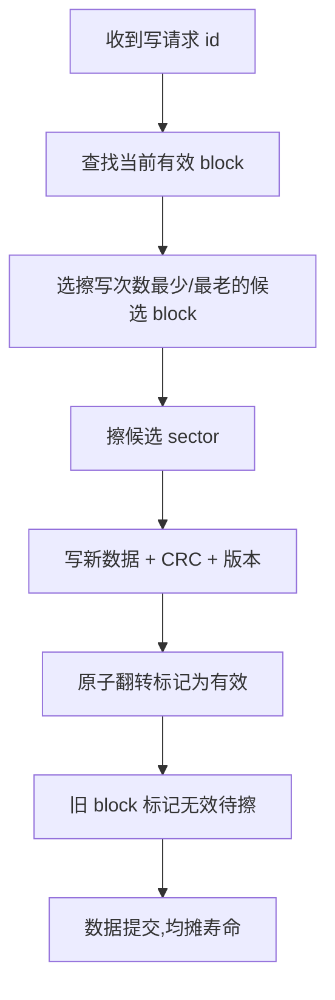
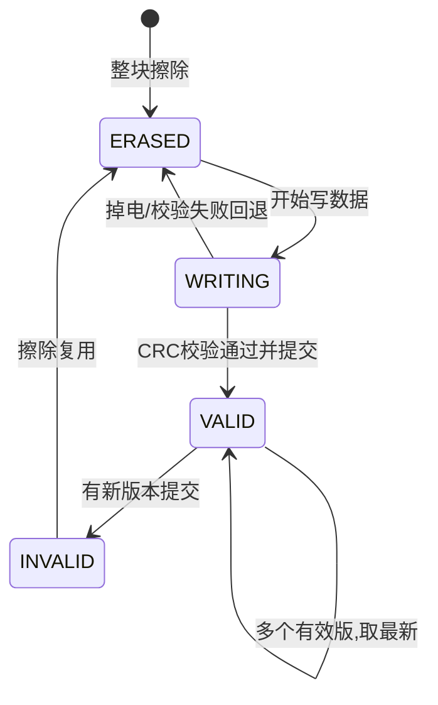

# 存储管理：Flash/EEPROM/FEE 与磨损均衡

## 一、掉电那一刻，SOC 消失了

某台车在充电枪拔出的瞬间断电，重新上电后 BMS 显示的 SOC（电量）直接跳回一个旧值——用户以为电池"凭空少了 5%"。根因是标定与 SOC 参数写 Flash 时掉电，写操作只完成一半，校验位和标志位都没落定，上电恢复读到一块"半新不旧"的脏数据。

车载 ECU 离不开非易失存储：标定参数、SOC/SOH、故障记录、VIN、学习值……这些不能每次上电都从零来。但 Flash 不是 EEPROM，它有"先擦后写、按块擦、寿命有限"的硬约束。底层软件必须用 **FEE（Flash EEPROM Emulation）** 把这堆硬约束包装成对上层"随便写"的可靠接口。

---

## 二、核心原理

### 2.1 Flash 的物理特性（硬约束）

类比：Flash 像一块只能整页擦掉、且擦写次数有限的白板——你不能在写过的格子里直接改字，得先把整页擦成全 1，再写。

- **按 sector 擦除**（整块清 1），**按 word / page 编程**（只能把 1 写成 0，不能反过来）；
- **擦写寿命有限**（万次级），反复擦同一块会磨坏；
- **写入前必须擦除**，且**不能边执行边擦同区**（取指冲突，需跑 RAM 或另一 Bank，呼应 Bootloader 篇）。

### 2.2 为什么需要 FEE（Flash EEPROM Emulation）

EEPROM 能单字节改写、寿命高，但车规 MCU 内置 Flash 多、EEPROM 少或没有。于是用 Flash **模拟** EEPROM：

- 把 Flash 划分成多个 **block**；
- 数据写入采用**状态机**管理（有效/无效/已擦）；
- 配合**冗余备份**（至少双 block）保证掉电不丢。

### 2.3 磨损均衡（Wear Leveling）

如果每次都写同一个 block，它先磨穿。磨损均衡让写入**轮转**到不同 block，把有限的擦写次数均摊到整片 Flash，成倍延长寿命。

比喻：电梯里的地砖，大家都踩门口那块会先坏；磨损均衡就是"强制轮流让大家踩不同位置"。



> 图：磨损均衡写入流程，通过轮转选择擦写最少的 block 把寿命均摊到整片 Flash。

### 2.4 掉电保护：写-校验-拷贝-标志

FEE 写关键参数的典型状态机：

```
1. 在"备用 block"写新数据 + CRC
2. 写后回读校验，确认无误
3. 翻转"有效标志"指向新 block（原子操作，标志位单独落定）
4. 旧 block 标记为无效，后续擦除复用
```

**掉电发生在任一步**：重启后读标志，发现新 block 未生效 / CRC 不对，就回退读"上一个有效 block"——数据不丢、不脏。

---

## 三、关键代码与结构

### 3.1 FEE Block 状态字设计

```
每个 block 头部：
[ STATE(1word) | VERSION(1word) | CRC32(1word) | DATA... ]
STATE 取值:
  0xFFFFFFFF = 已擦(空)
  0x11111111 = 正在写(中间态,未完成)
  0x22222222 = 有效(已提交)
  0x33333333 = 已废弃(待擦)
```



> 图：FEE 虚拟页（block）状态机，依靠状态字与 CRC 实现掉电不丢的可靠存储。

### 3.2 磨损均衡写入（伪代码）

```c
typedef enum { ERASED=0xFFFFFFFF, WRITING=0x11111111,
               VALID=0x22222222, INVALID=0x33333333 } blk_state;

uint32_t FEE_Write(uint16_t id, uint8_t *data, uint32_t len) {
    block_t *old = find_valid_block(id);
    block_t *cand = find_agedest_block();   // 磨损均衡:选擦写次数最少的
    flash_erase(cand->sector);
    flash_write(&cand->state, WRITING);
    flash_write(cand->data, data, len);
    flash_write(&cand->crc, crc32(data, len));
    flash_write(&cand->version, old ? old->version+1 : 1);
    /* 最后一步:提交有效(原子翻转) */
    flash_write(&cand->state, VALID);
    if (old) flash_write(&old->state, INVALID);
    return OK;
}

/* 上电恢复:读最新有效版本 */
block_t* FEE_Read(uint16_t id) {
    block_t *best = NULL;
    for (each block b with id) {
        if (b.state==VALID && crc32_ok(b) &&
            (!best || b.version > best->version))
            best = &b;
    }
    return best;   // 无有效块则返回 NULL,用默认值
}
```

### 3.3 与 NVM 的对接

在 AUTOSAR 里，FEE 是 NVM（NVRAM Manager）的底层驱动——应用/服务层通过 NVM 接口读写，NVM 调 FEE 落到 Flash，FEE 负责磨损均衡与掉电保护。这样上层完全不感知"Flash 要先擦后写"。

---

## 四、常见坑与调试手段

1. **Flash 边跑边擦同区 → HardFault**：Bootloader/参数区代码在被执行时擦自己。调试：把擦写例程拷到 RAM 执行（加 `__attribute__((section(".ramfunc")))`），或保证被擦区当前无代码在跑。

2. **掉电写一半、标志位没翻 → 脏数据**：未做"写校验 + 拷贝 + 最后翻标志"。调试：上电恢复逻辑必须优先读 CRC 校验通过的"最新版本"，宁可回退旧值也不能用半截新值。

3. **磨损不均衡 → 某 block 早死**：固定写同一 block。调试：实现轮转选择"擦除次数最少 / 最老有效"的 block；用计数器记录每块擦除次数辅助决策。

4. **参数区与代码区未物理隔离**：参数频繁擦写影响代码可靠性。调试：链接脚本把参数 FEE 区与 .text 区**物理分开**，避免互相干扰。

5. **回读校验缺失 → 静默坏块**：写后不校验，坏块被当有效。调试：强制"写后回读 + CRC"；可借助 ECC（呼应看门狗/ECC 篇）进一步防 bit 翻转。

---

## 五、面试高频要点

- **为什么需要磨损均衡？** Flash 擦写次数有限（万级），轮转写入均摊寿命，延长整片可靠工作期。
- **FEE 怎么保证掉电不丢？** 双 block + 状态机 + CRC 校验 + 最后翻转有效标志，重启读最新有效版本。
- **Flash 能不能边跑边擦？** 不能擦当前执行区，需跑 RAM 或另一 Bank，否则取指冲突跑飞。
- **参数区为什么要和代码区物理隔离？** 防止频繁擦写参数影响代码可靠性，链接脚本分层。
- **NVM 与 FEE 关系？** NVM 是 AUTOSAR 服务层抽象，FEE 是其底层 Flash 模拟驱动。

---

*（全文约 2300 字，基于资料模块十四、十五整理，型号参数采用笼统指代。）*
