# 嵌入式存储管理：从存储介质到文件系统与掉电安全的全栈技术

> 本章面向嵌入式与车载电子工程师，系统梳理非易失性存储（NVM）在资源受限、可靠性要求严苛环境下的设计要点。内容覆盖存储介质物理特性、芯片级 Flash/NVM 控制器 IP 架构、底层驱动实现、磨损均衡、掉电保护、写放大与读干扰、文件系统选型、参数存储策略、AUTOSAR MCAL 配置、FMEDA 与功能安全、典型工程坑以及面试高频考点。文中"笔者"指代笔者个人工程经验，不涉及任何具体个人。

---

## 一、为什么嵌入式存储是"硬骨头"

先看一个真实场景的抽象：一台电动汽车在充电桩拔枪的瞬间发生断电，重新上电后电池管理系统（BMS）显示的荷电状态（SOC）直接跳回到一个旧的数值——用户以为电池"凭空少了 5%"。根因在于标定参数与 SOC 写入片内 Flash 时遭遇掉电，写操作只完成了一半，校验位与有效标志位都没有最终落定，上电恢复后读取到了一块"半新不旧"的脏数据。

这类问题的本质，是嵌入式设备对存储有三个互相冲突的要求：

1. **非易失**：断电后数据不能丢；
2. **可改写**：标定参数、学习值、故障记录要能反复更新；
3. **寿命有限且特性怪异**：Flash 必须先擦后写、按块擦除、擦写次数有限、存在读干扰与位翻转。

对软件工程师而言，内存（SRAM/DRAM）随断电即失，EEPROM 可以按字节改写但容量小且贵，而当下主流 MCU 内置的是大容量、便宜但"脾气很差"的 NOR Flash。底层软件必须用一套抽象层（在 AUTOSAR 体系中叫 **FEE，Flash EEPROM Emulation**）把 Flash 的硬约束包装成对上层"看起来能随便写"的可靠接口。

更进一步，现代 MCU 的 Flash 访问早已不是"CPU 直接拿总线打阵列"，而是经由一个专门的 **Flash/NVM 控制器 IP**：它内部包含命令/地址/数据寄存器、操作时序状态机、ECC 编解码引擎、高压电荷泵，有的还集成磨损均衡与坏块管理的硬件加速、以及服务于大块数据的 DMA。理解这个 IP 的内部结构，是写出正确、可靠、高效存储驱动的前提——这也是本章新增"芯片模块设计"一节的原因。

本章将逐层拆解：先认识"仓库"（存储介质），再认识"仓库管理员"（芯片内的 Flash 控制器 IP），然后了解"仓库的物理规则"（Flash 特性），设计"轮转使用仓库的方案"（磨损均衡），建立"断电不丢"的保险机制（掉电保护），分析两类性能/可靠性陷阱（写放大、读干扰），落到"底层驱动代码"与"AUTOSAR MCAL 配置"，最后在容量更大的片外存储上选择合适的文件系统，并讨论工程实践中的坑、功能安全与面试要点。

---

## 二、嵌入式存储介质全景对比

嵌入式系统可用的非易失介质种类繁多，选型时要在容量、速度、寿命、成本、接口复杂度之间权衡。下表给出常见介质的定性与定量特征（数值为业界典型量级的笼统指代，具体以器件数据手册为准）。

| 介质类型 | 单元/存储原理 | 最小写入粒度 | 最小擦除粒度 | 随机读速度 | 典型 PE 寿命 | 容量范围 | 主要接口 | 单位成本 | 典型应用场景 |
|---------|--------------|-------------|-------------|-----------|-------------|---------|---------|---------|-------------|
| 片内 Flash（MCU 内置 NOR） | 浮栅/电荷陷阱 | 页（4–256 B） | 扇区（1–128 KB） | 快（可 XIP） | 1k–10k 次 | KB–数 MB | 内部总线 | 低（随 MCU 赠送） | 代码、标定参数、Bootloader |
| EEPROM（独立或内置） | 浮栅（厚氧） | 字节 | 字节/页（无整块擦） | 慢 | 10^5–10^6 次 | B–KB–MB | I²C/SPI/内部 | 高 | 小量高频写配置 |
| 片外 NOR Flash | 串行/并行 NOR | 页（256 B） | 扇区（4–256 KB） | 快（SPI/QSPI XIP） | 10^5 次 | MB–数 GB | SPI/QSPI/并行 | 中 | 代码 XIP、只读资源 |
| 片外 NAND Flash | 串行/并行 NAND | 页（2/4/8 KB） | 块（128–256 KB） | 慢（需读整页） | SLC 10^4–10^5；MLC 3×10^3；TLC 5×10^2 | GB–TB | ONFI/异步/SDIO | 低（按比特） | 大容量数据记录、多媒体 |
| SD 卡 | NAND + 内置控制器 | 由控制器管理 | 由控制器管理 | 中 | 由控制器 WL 决定 | GB–TB | SD/SDIO | 极低 | 日志、固件升级包、用户文件 |
| eMMC | NAND + 封装控制器 | 由控制器管理 | 由控制器管理 | 中–快 | 由控制器 WL 决定 | GB–64 GB+ | 8-bit eMMC | 低 | 嵌入式大容量存储、Linux 根文件系统 |
| FRAM（铁电） | 铁电晶体极化 | 字节 | 字节（无擦除） | 快（接近 SRAM） | 约 10^12 次 | B–KB–MB | I²C/SPI/并行 | 很高 | 高频计量、实时计数、黑匣子 |
| MRAM（磁阻） | 磁隧道结 | 字节 | 字节（无擦除） | 快 | 约 10^15 次 | KB–MB | 并行/SPI | 高 | 高可靠、抗辐射、高速缓存 |

从表中可以得到几条工程直觉：

- **片内 Flash 与 EEPROM 的矛盾**：车规与工控 MCU 往往内置大容量 Flash 却几乎没有或只有极小 EEPROM。于是业界普遍用 Flash 模拟 EEPROM（即 FEE），而非为每个小参数外挂 EEPROM。
- **NAND 与 NOR 的分工**：NOR 胜在随机读快、可片上执行（XIP），适合放代码；NAND 胜在密度高、单位成本低，适合放大数据，但它必须按页读、有坏块、需要 ECC，软件栈复杂得多。
- **SD/eMMC 把脏活外包**：它们内部都有一个 NAND 控制器，帮我们做了磨损均衡、坏块管理、ECC 甚至掉电保护（部分高端卡支持）。代价是：你失去了对底层物理擦写的直接控制，"写一条记录"可能触发控制器内部一次大搬移，这在实时性分析与功耗预算时要心里有数。
- **FRAM/MRAM 是"降维打击"**：它们理论上近乎无限次写入、字节级改写、断电即存，几乎消灭了本章讨论的大部分痛点，但容量小、价格高，多用于对寿命/可靠性极端敏感的关键数据（如里程累计、事件计数、防拆记录）。

选型时还有一个常被忽视的维度：**写入一致性模型**。片内 Flash、NOR、EEPROM 的写入可由软件精确控制每一步的时序与可见性，便于做原子提交与回读；而 SD/eMMC 一旦交给内部控制器，你发起的"写一扇区"何时真正落到 NAND 颗粒、是否触发了内部 GC 搬移，对软件层是不透明的。这意味着在实时性分析与功耗预算（尤其是整车休眠/唤醒的电流尖峰）上，必须按"最坏情况内部搬移"留足余量，而不能仅按数据手册的接口速率估算。此外，供应与生态也要纳入考量：车规器件的 PPAP、温度等级、长期供货（LTS）承诺，往往比纸面参数更影响量产决策，选型阶段就应锁定至少两家可替代料号以防断供。

---

## 三、Flash 物理特性：必须先理解的三条铁律

无论是片内还是片外 Flash，其物理实现都遵循相近的浮栅/电荷陷阱原理，由此带来三条不可违背的特性。

### 3.1 只能把 1 写成 0，想改回 1 必须整块擦除

Flash 单元本质上是一个被注了电（或没注）的浮栅晶体管。编程（Program）操作只能把某个位从逻辑 1（擦除态、耗尽）翻成逻辑 0（注入电荷），反之不能通过编程完成。要把 0 变回 1，唯一的办法是对整个**块（Block/Sector）**施加一个较高电压的擦除（Erase）操作，把整块清为全 1。

类比：Flash 像一块只能整页擦掉、且擦写次数有限的白板——你不能在写过的格子里直接改字，得先把整页擦成全白，再写新内容。

这就带来直接后果：

- 即便只想改一个字节，也要先把包含它的整块读到 RAM，在 RAM 里改，再擦整块、写回整块；
- 擦除是"重"操作：耗时长（毫秒级）、耗电大、且是寿命消耗的主体；
- 没有任何"原地覆盖写"，只有"异地写 + 旧块回收"。

### 3.2 页/扇区/块的层级结构

不同厂商术语略有差异，但层级概念一致（以片内 NOR Flash 为例）：

- **页（Page）**：最小的编程（写）单位，典型 4/8/16/32/64/128/256 字节；
- **扇区（Sector）**：最小的擦除单位，典型 1/2/4/8/16/32/64/128 KB，大小常不统一（存在大小扇区）；
- **块/Bank**：多个扇区组成，部分 MCU 支持将 Flash 分成多个 Bank，使得"一边执行 A Bank 代码，一边擦写 B Bank"。

对于 NAND，层级是：页（2/4/8 KB，页内含 spare/OOB 区用于 ECC 与坏块标记）→ 块（64–256 页，即 128/256/512 KB）→ 平面（Plane）→ Die。NAND 的"块"比 NOR 的"扇区"大一到两个数量级，意味着 NAND 的"擦除放大"更剧烈。

### 3.3 擦写寿命（PE 次数）有限

每个块能承受的编程/擦除循环（Program/Erase cycles，PE）是有限的。超过寿命后，浮栅漏电流增大、阈值电压漂移，存储的位开始不可靠。典型量级：

- 片内 NOR Flash：1k–10k 次（车载/工控级常标称 1 万次）；
- 片外 NOR：约 10 万次；
- SLC NAND：1 万–10 万次；MLC 约 3 千次；TLC 约 500–1 千次；
- EEPROM：10 万–100 万次；
- FRAM：约 10^12 次；MRAM：约 10^15 次。

注意"标称寿命"不是"到这个数就立刻坏"，而是可靠性统计意义上的退化曲线。工程上要留足裕量（例如按 70%–80% 设计），并通过磨损均衡把写入分散到所有块，避免个别块提前"磨穿"导致整片报废。

### 3.4 "边执行边擦同区"会跑飞

当 CPU 正在从某块 Flash 取指执行（代码、向量表、常量），又试图擦写同一块时，会发生取指冲突，常见结果是 HardFault 或跑到非法地址。解决思路：

- 把擦写驱动例程搬到 RAM 执行（例如在 GNU 工具链加 `__attribute__((section(".ramfunc")))`，在链接脚本中分配 `.ramfunc` 段）；
- 或将频繁改写的参数区与代码区放在**不同 Bank**，保证"执行区"与"被擦区"物理分离；
- 或在擦写期间关闭中断、用汇编短例程在 RAM 中完成，避免任何从被擦区取指。

### 3.5 阈值电压、数据保持力与温度效应

理解 Flash 的可靠性，离不开"阈值电压（Vth）"这一概念。每个存储单元是否导通、导通所需的栅极电压，决定了它代表的 bit。编程注入电荷后 Vth 升高（典型代表 0），擦除后 Vth 降低（代表 1）。随着时间推移与温度应力，浮栅中的电荷会通过隧穿氧化层缓慢泄漏，Vth 逐渐漂移——这就是**数据保持力（Retention）**问题。数据手册通常会给出"在特定温度下保持若干年、且位错误率不超过某阈值"的保证（如 25℃ 下 20 年、125℃ 下若干年），但高温会显著加速电荷泄漏，因此车规器件才要求更严苛的扩展温度等级与更保守的裕量。

此外还有**编程/擦除干扰（P/E Disturb）**：对某一单元编程或擦除时，同一位线/字线上的相邻单元会感应到微弱应力，长期累积也可能翻转位。工程应对手段是：ECC 纠错位翻转、定期"刷新（Refresh）"把临近寿命/高温边界的数据读出再写回新块、以及在高温工况下缩短关键参数的落盘间隔与校验频率。需要强调的是，保持力与擦写寿命是两类独立的退化机制——即使从不写入，长期高温存放也会因电荷泄漏而失效；即使低温存放，反复擦写也会因氧化层磨损而失效。

---

## 四、芯片模块设计（IP 内部架构）

当工程师操作 `FLASH_EraseSector()` 这类 API 时，真正干活的不是 CPU 直接"拨"晶体管，而是芯片内部一个名为 **Flash/NVM 控制器**的硬核 IP。理解它的内部结构，才能解释"为什么擦写期间 CPU 会 stall""为什么 ECC 是免费附赠的""为什么某些 MCU 能在擦 B Bank 时照常跑 A Bank 的代码"。下面以通用 IP 为蓝本（不特指某厂商，但位域与信号命名符合常见实现逻辑）展开。

### 4.1 控制器整体架构与总线连接

一个典型的 Flash/NVM 控制器 IP 在 SoC 中的位置如下：它作为 **APB/AHB 从设备（Slave）** 挂接在片上总线上，CPU 通过读写其寄存器来下达命令；同时它内部或紧邻的 **DMA** 可作为 **AHB 主设备（Master）** 直接在 Flash 阵列与外设 SRAM/AXI 内存间搬运页数据，免去 CPU 逐字节参与。控制器最终通过一个**存储物理接口**（片内为内部阵列总线，片外为 QSPI/OSPI/ONFI/并行/SDIO）访问实际的 NVM 介质。

```mermaid
flowchart LR
    CPU[CPU Core] -->|AHB/APB 寄存器访问| BUS[片上总线 AHB/APB]
    BUS -->|从设备映射| REG[寄存器组<br/>CMD/ADDR/DATA/CR/SR/PR]
    BUS -->|主设备批量搬运| DMA[DMA 控制器]
    REG --> SEQ[命令时序状态机<br/>擦除/编程/读序列]
    SEQ --> HV[高压电荷泵<br/>擦除/编程升压]
    SEQ --> ECC[ECC 编解码引擎<br/>汉明/BCH]
    SEQ --> WL[磨损均衡/坏块<br/>硬件加速(可选)]
    DMA -->|页数据搬运| SEQ
    SEQ --> IF[存储物理接口<br/>QSPI/ONFI/并行]
    IF --> FLASH[(片内/片外<br/>Flash/NVM 阵列)]
    REG -->|写保护/锁定| PROT[保护位与锁逻辑]
    PROT --> SEQ
```

> 图：Flash/NVM 控制器 IP 架构框图。CPU 经 APB/AHB 从接口写寄存器下达命令；DMA 作为主设备搬页数据；状态机驱动高压泵完成擦/写；ECC 引擎在读写路径上透明纠错；可选硬件磨损均衡/坏块模块与保护逻辑共同保障可靠性。

几个关键模块的职责：

- **寄存器组**：软件唯一可见的窗口。包含命令寄存器（CMD，部分实现把"命令"编码进控制寄存器 CR 的位域）、地址寄存器（ADDR，目标扇区/页地址）、数据寄存器（DATA，编程源/读回目的，常配合 FIFO 或 DMA）、控制寄存器（CR）、状态寄存器（SR）、保护寄存器（PR/OPTCR）等。
- **命令时序状态机**：这是控制器的"大脑"。它把"软件写一个位"翻译为一长串严格的硬件时序——例如编程要依次做：开锁 → 置 PG 位 → 把数据喂进数据寄存器 → 置 STRT → 内部逐字节/半字编程并校验 → 置 BSY/完成标志；擦除要：开锁 → 选扇区 → 置 SER/STRT → 启动高压泵若干毫秒 → 校验全 0xFF → 清标志。
- **高压电荷泵（Charge Pump）**：Flash 的擦/写需要 8–18V 量级的内部高压，远高于 IO 电压。芯片内置泵电路把 1.8/3.3V 升压产生该高压，并由状态机在操作时序的精确窗口内施加。它也是"擦写期间功耗尖峰"的来源，电源与去耦设计必须能扛住。
- **ECC 引擎**：在编程路径上对写入数据计算校验码并存入 spare/OOB 区（片内 Flash 通常存于独立冗余位或页尾），在读取路径上对数据 + 校验码做解码，纠正若干比特翻转（汉明纠 1 位检 2 位，BCH 可纠多比特）。
- **DMA**：用于 NAND/eMMC 等大页介质，把一整页（2/4/8 KB）在阵列与内存间零拷贝搬运，避免 CPU 循环搬运导致的延迟与取指冲突。
- **保护逻辑**：实现扇区写保护位（WRP）、读出保护（RDP）、选项字节锁，防止误擦/误写关键区（如 Bootloader、向量表）。

### 4.2 命令/地址/数据寄存器与操作状态机

控制器内部对一次操作的生命周期由状态机驱动。以"页编程"与"扇区擦除"为例，状态迁移如下：

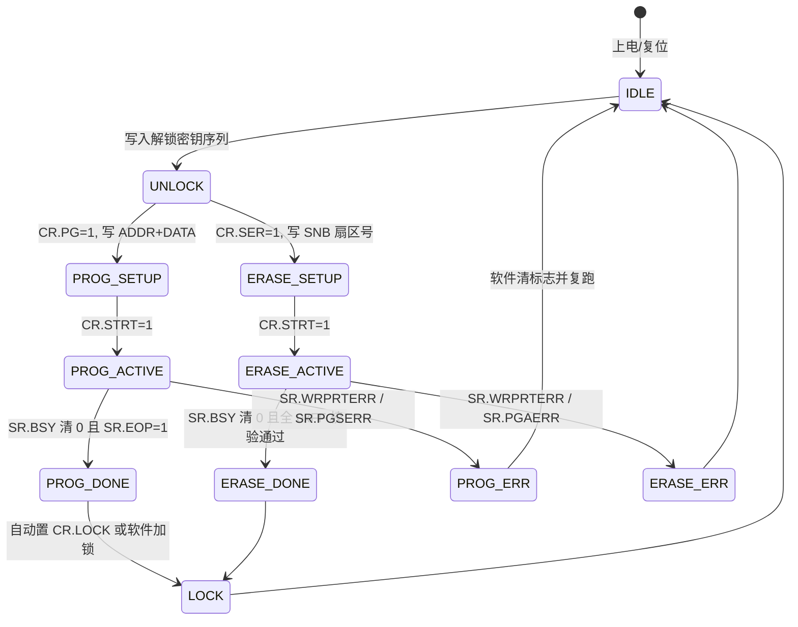

> 图：Flash 控制器操作状态机。所有擦/写必须经"解锁 → 配置 → 启动 → 等待完成/出错 → 加锁"的闭环，BSY 位是软件轮询"是否忙"的唯一权威信号。

软件视角的黄金法则：**一切以状态寄存器（SR）的 BSY 位为最终裁决**。即便 CR 已置位，只要 BSY=1，就不能发起新操作，也不能去读正在被改写的区域。很多"偶发写失败"根因就是软件在 BSY 仍忙时又写了一次 CMD/DATA，破坏了状态机。

### 4.3 ECC 编解码引擎

ECC 不是软件事后补救，而是控制器数据通路上的硬件模块：

- **编程方向**：数据 → ECC 编码器 → 生成校验子（syndrome）→ 与数据一同写入介质（片内 Flash 存于每页冗余字节，NAND 存于 spare/OOB）。
- **读取方向**：数据 + 校验子 → ECC 解码器 → 若比特错误在可纠正能力内，硬件自动纠正在数据通路上送出，并置"已纠正"状态位（如 SR.ECC1BIT）；若超出能力，置"不可纠正错误"位（SR.ECC2BIT），由软件判为坏块或触发冗余回退。

常见算法与能力：汉明码（Hamming）纠 1 检 2，面积小、适合片内 Flash；BCH 码可配置 t=4/8/16 甚至更高，是 NAND 主流；RS（Reed-Solomon）常用于较高可靠场景。注意：ECC 只解决"位翻转"这类软错误，**不解决"半截写"这类掉电脏数据**——后者要靠上层的 COW/日志协议，二者互补而非替代。

### 4.4 磨损均衡与坏块管理硬件

严格说，绝大多数 MCU 的片内 Flash **控制器并不内置磨损均衡**——它只负责"听话地"擦/写/读，把"选哪个块"的决策留给软件（FEE/Fee 层）。因此软件工程师必须自己实现动态/静态磨损均衡（见第五章、第八章）。

但在部分高端存储控制器（如 eMMC 内部控制器、NAND 控制器 IP、独立 FTL 芯片）中，会集成硬件辅助的磨损均衡与坏块管理：

- **磨损均衡硬件**：维护一张"物理块 → 擦除计数"的小表（常驻 SRAM 或冗余区），分配新块时硬件挑擦除次数最少的；静态均衡由固件周期性唤醒。
- **坏块管理硬件**：上电扫描 spare 区出厂标记建立坏块表（BBT），运行时发现 ECC 不可纠即重映射到备用品池，并在 BBT 更新映射。裸 NAND 若没有这层，必须由驱动自己实现（见 8.4 节）。

笔者的经验是：**无论硬件是否支持，软件都应有一份"逻辑块号 → 物理块号"的映射意识**，因为硬件 FTL 一旦失效或出现"静默坏块"，上层必须有校验与冗余兜底，不能盲目相信控制器"说写成功就真成功"。

### 4.5 加锁与写保护位

控制器的保护机制通常有三级：

1. **操作锁（CR.LOCK）**：每次擦/写前必须写入特定密钥序列（如 0x4567_0123 后跟 0xCDEF_89AB）解锁，操作完成自动或被软件重新加锁，防止程序跑飞误触发擦写。
2. **扇区写保护（PR/WRP 位域）**：可为每个扇区独立置"写保护"，受保护扇区对任何编程/擦除返回 WRPRTERR，保护 Bootloader、配置区、向量表。
3. **读出保护（RDP/Option Bytes）**：防止通过调试接口把固件整片读走，分等级（Level 0 全开放、Level 1 禁止读出、Level 2 永久锁死调试）。车载与工业产品量产必须设到合适等级。

### 4.6 DMA 通道

对于 NAND/eMMC 这类"页很大、且必须整页读写"的介质，若由 CPU 循环搬运 4 KB 页数据，既慢又可能因取指冲突跑飞。控制器（或 SoC 的通用 DMA）提供专用通道：CPU 只需配置好源/目的地址、长度、触发源（Flash 就绪），DMA 在后台把整页搬完并触发中断。DMA 还常与 **ECC 引擎流水线化**——搬一拍数据、ECC 算一拍，吞吐接近介质接口上限。注意 DMA 缓冲必须位于 **非被擦写区** 且 **Cache 一致性** 要处理（写回 Cache 需 clean/invalidate）。

### 4.7 时钟、高压泵与关键时序参数

Flash 控制器运行依赖两类时钟：

- **接口/寄存器时钟（f_PCLK）**：挂在 APB/AHB 上，用于寄存器访问与状态机节拍，频率由系统时钟分频得到。
- **等待状态（Wait State / LATENCY）**：Flash 阵列读取比 CPU 主频慢，必须在控制寄存器里配 **等待周期数（LATENCY）**，否则读到的指令/数据错位。规则大致是"主频越高、电压越低，需要越多等待周期"，数据手册会给出查表。

擦/写本身的耗时由高压泵与时序状态机决定，与 CPU 主频无关（这是"擦写是毫秒级重操作"的来历）。典型参数（量级参考，具体以手册为准）：

| 参数项 | 符号 | 典型值（量级） | 说明 |
|-------|------|--------------|------|
| 扇区擦除时间 | t_ERASE | 0.5–3 s（大扇区更久）/ 数十–数百 ms（小扇区） | 片内 Flash 常见几十–数百 ms；大扇区可能上秒 |
| 半字/字编程时间 | t_PROG | 几–几十 µs/半字 | 整页编程 = 页数 × 单字时间 |
| 页读访问 | t_READ | 数十 ns 级（带等待周期） | XIP 取指关键路径 |
| 高压泵启动稳定 | t_PUMP | 数–数十 µs | 进入擦/写前需稳定 |
| 等待状态数 | LATENCY | 1–8 周期 | 随主频/电压查表 |
| 最小擦写间隔(回读) | t_VERIFY | 同读路径 | 写后回读校验 |

> 注意：上表的"秒级"擦除仅针对个别大扇区实现，多数车规 MCU 单扇区擦除在几十到数百毫秒。无论何种量级，软件都不能在 BSY 期间阻塞实时任务，应让出 CPU 或用中断/DMA 异步完成。

### 4.8 Flash 寄存器位域（控制/状态/保护）

下面给出一组符合常见实现逻辑的寄存器位域示例（基地址仅作示意，具体以芯片手册为准）。先以 mermaid 展示寄存器文件结构，再以表格给出详细位域。

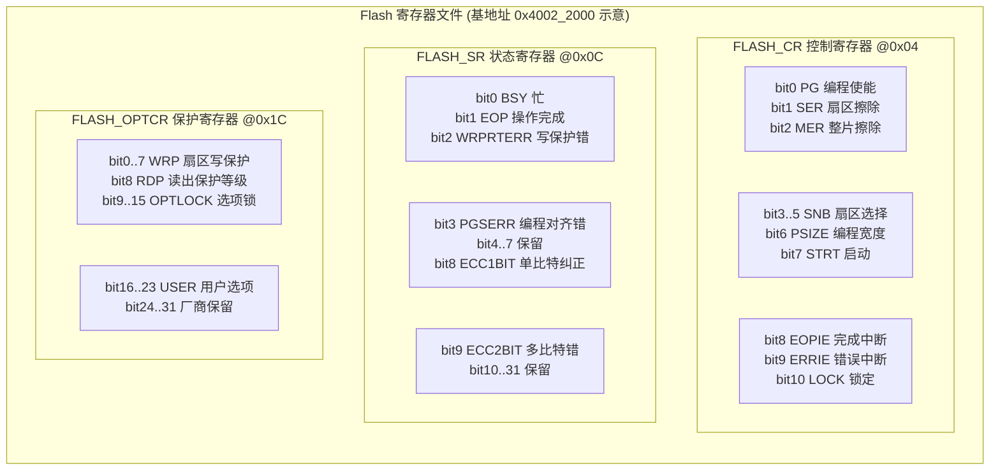

> 图：Flash 控制器寄存器位域图。控制寄存器下发操作命令，状态寄存器供软件轮询（BSY 为权威忙标志、ECC* 为纠错结果），保护寄存器锁定关键扇区与读出权限。

详细的位域含义（通用逻辑，非特指某型号）：

| 寄存器 | 偏移 | 位域 | 名称 | 读写 | 含义 |
|-------|------|------|------|------|------|
| FLASH_KEYR | 0x04* | 31..0 | KEY | W | 解锁密钥：先后写入 0x45670123、0xCDEF89AB 方解锁 |
| FLASH_CR | 0x04 | 0 | PG | R/W | 编程使能：1=允许页编程 |
| FLASH_CR | 0x04 | 1 | SER | R/W | 扇区擦除使能：1=允许扇区擦除 |
| FLASH_CR | 0x04 | 2 | MER | R/W | 整片擦除使能 |
| FLASH_CR | 0x04 | 5..3 | SNB | R/W | 扇区编号：选择要擦除的扇区（0..N） |
| FLASH_CR | 0x04 | 6 | PSIZE | R/W | 编程宽度：00=8位/01=16位/10=32位/11=64位 |
| FLASH_CR | 0x04 | 7 | STRT | W | 启动：置 1 触发已配置的操作 |
| FLASH_CR | 0x04 | 8 | EOPIE | R/W | 操作结束中断使能 |
| FLASH_CR | 0x04 | 9 | ERRIE | R/W | 操作错误中断使能 |
| FLASH_CR | 0x04 | 10 | LOCK | R/W | 锁定：1=锁定（写密钥解锁后自动清 0） |
| FLASH_SR | 0x0C | 0 | BSY | R | 忙：1=控制器正在擦/写，软件须等待清 0 |
| FLASH_SR | 0x0C | 1 | EOP | R | 操作结束标志（写 1 清） |
| FLASH_SR | 0x0C | 2 | WRPRTERR | R | 写保护错误：试图写受保护扇区 |
| FLASH_SR | 0x0C | 3 | PGSERR | R | 编程顺序/对齐错误 |
| FLASH_SR | 0x0C | 8 | ECC1BIT | R | 本次读发生单比特纠正 |
| FLASH_SR | 0x0C | 9 | ECC2BIT | R | 本次读发生不可纠错误（应判坏块/回退） |
| FLASH_OPTCR | 0x1C | 7..0 | WRP | R/W | 每 bit 对应一个扇区的写保护（1=保护） |
| FLASH_OPTCR | 0x1C | 8 | RDP | R/W | 读出保护等级（0/1/2） |
| FLASH_OPTCR | 0x1C | 9 | OPTLOCK | R/W | 选项字节锁 |

> 注：部分 MCU 把解锁密钥放在独立 KEYR 寄存器（偏移示意为 0x04 处另设），把 CR 起始偏移顺延；此处为通用化表达，实际请以具体数据手册的寄存器映射为准。

### 4.9 控制器与文件系统 / EEPROM 模拟的协作边界

一个清晰的职责划分：

- **控制器（硬件）** 只保证：给定"擦某扇区""写某页"的命令，能按物理时序可靠完成，并提供 BSY/ECC 等状态。它**不知道**什么是"文件"、什么是"参数块"。
- **FEE / Fee（Flash EEPROM 模拟，软件）** 在控制器之上实现"逻辑块 → 物理扇区"映射、磨损均衡、掉电原子写，对上层呈现"可改写小块"。
- **文件系统（LittleFS/SPIFFS/FATFS/Reliance）** 位于更上层，管理目录/文件/元数据，内部再调用底层块设备接口（可能直接走控制器，也可能走 FEE 模拟出的块设备）。

因此"模块与文件系统的协作"本质是**分层调用**：应用 → 文件系统 → 块设备抽象 → FEE/Fee → Flash 驱动 → 控制器 IP → NVM 阵列。任何一层越界（如应用直接操作控制器寄存器绕过 FEE 的磨损均衡）都会破坏整片寿命与一致性，是工程大忌。

---

## 五、磨损均衡（Wear Leveling）算法

### 5.1 为什么必须做磨损均衡

如果每次参数更新都写同一个块，那么该块会远远早于其他块磨穿，整片 Flash 的可用寿命被"木桶短板"锁死在单块寿命上。磨损均衡的目标，是把有限的擦写次数**均摊**到整片 Flash，从而把系统级寿命放大到"单块寿命 × 块数"的量级（理想情况下）。

比喻：电梯门口的地砖，大家都踩门口那块会先坏；磨损均衡就是"强制轮流让大家踩不同位置"。

### 5.2 动态磨损均衡（Dynamic Wear Leveling）

动态磨损均衡只管理"频繁变化的数据"。核心策略：每次写入时，从空闲块池中挑选**擦除次数最少**或**最老（最早擦过）**的块来承载新数据，写完把旧块回收。它解决"热点块"被反复擦写的问题，但对"长期不变的冷数据"无能为力——冷数据占着低擦除次数的块不放，热数据只能在剩下的少数块里打转。

### 5.3 静态磨损均衡（Static Wear Leveling）

静态磨损均衡额外处理"冷数据"。它周期性地扫描：如果发现某些块擦除次数明显低于平均（说明里面是长期不变的冷数据），就主动把这些冷数据搬走、擦除原块，把"干净低损耗块"释放给热数据轮转使用。静态算法代价是额外的数据搬移（带来写放大，见第七章），但能显著提升整片均匀度。

一个经验法则是：静态磨损均衡不需要每次写都触发，可以设置一个"最大/最小擦除次数差"阈值（如差超过某个值），或按累计写入量周期性唤醒，避免无谓搬移。

### 5.4 坏块管理（主要针对 NAND）

NAND 出厂就允许存在坏块（Initial Bad Block），且使用中会新增坏块（Runtime Bad Block）。坏块管理的要点：

- **出厂坏块表（BBT）**：上电扫描 spare 区的出厂坏块标记（通常是某字节非 0xFF），建立坏块表；
- **运行时坏块替换**：写入或读校验发现新坏块，将其数据搬移到预留的**备用好块（Spare Block）**池，并在 BBT 中重映射；
- **保留块比例**：一般保留 1%–5% 的块作为备用品，eMMC/SD 内部已自带这一层，但裸 NAND 必须自己做；
- **ECC 不可省**：NAND 单位比特出错率随磨损上升，必须用 BCH/RS 等强 ECC，并在读时校验纠正，超出纠正能力则判为坏块。

坏块替换的整体流程如下：

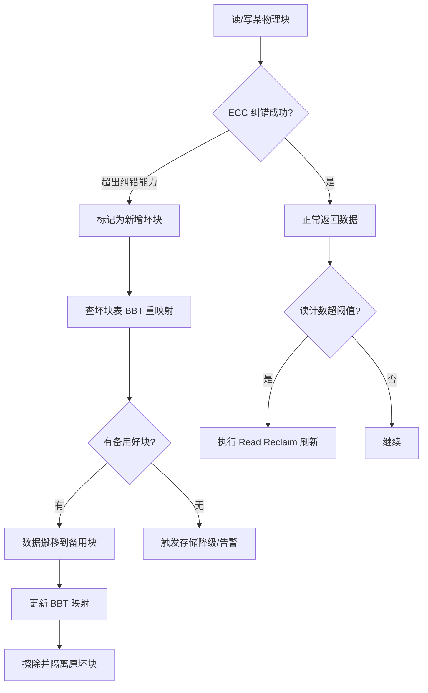

> 图：NAND 坏块检测、重映射与读干扰刷新的联合处理流程。

### 5.5 磨损均衡写入流程（mermaid）

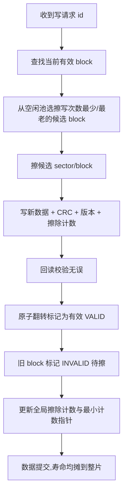

> 图：磨损均衡写入流程。通过轮转选择擦除次数最少的块，把寿命均摊到整片 Flash；回读校验与原子提交保证过程可靠。

---

## 六、掉电保护：让"写一半"变得可恢复

掉电是嵌入式存储最凶险的场景。Flash 写入不是原子的（擦块 ms 级、写页 µs 级），一旦在中间断电，就会留下"半新不旧"的脏数据或翻转了一半的标志位。掉电保护的本质，是设计一种**可恢复的写入协议**，使得无论断电发生在哪一步，重启后都能收敛到一个"完整且一致"的状态（要么旧值、要么新值，绝不半截值）。

### 6.1 写-校验-拷贝-标志（Copy-On-Write + Commit）

FEE 写关键参数的经典状态机：

```
1. 在"备用 block"写新数据 + CRC（不直接覆盖正在用的值）
2. 写后回读校验，确认无误
3. 翻转"有效标志"指向新 block（原子操作，标志位单独落定）
4. 旧 block 标记为无效，后续擦除复用
```

关键在于**第 3 步是最后才做的、且是最小原子的提交点**。掉电若发生在第 1–2 步，备用块处于"正在写"中间态，重启后读到旧块的有效值即可，新值作废；若发生在第 3 步之后、第 4 步之前，新旧块都可能是有效态，恢复逻辑取"版本号更大且 CRC 正确"的那份。无论如何，不会读到半截新值。

### 6.2 日志式（Journaling）与事务

在更上层的文件系统（如 Reliance、littlefs 的元数据写时复制）里，掉电安全常用"日志/事务"思想：

- **写前日志（Write-Ahead Log，WAL）**：先把"我要改 X 成 Y"记到日志（落盘且原子），再改数据；恢复时若发现日志里有未完成事务，要么重放、要么回滚；
- **写时复制（Copy-On-Write，COW）**：任何修改都写到新位置，更新指向新位置的指针（原子提交），旧数据在确认无误前不删除。littlefs 的元数据对（pair）与目录/文件结构本质上就是 COW。

### 6.3 断电恢复与回退

上电恢复（mount/scan）阶段必须做到：

- 优先读 **CRC 校验通过 + 版本号最新** 的有效块，宁可回退到旧值也绝不用半截新值；
- 若发现"正在写（WRITING）"中间态块，一律视为未完成，丢弃；
- 维护一份"默认出厂值"作为最终兜底（所有块都损坏时的回退）；
- 对配置项，区分"必须恢复"与"允许用默认值"两类，避免单一损坏导致整机起不来。

上电后的恢复决策可以用如下流程概括，它体现了"任何中间态都回退到完整旧值"的原则：

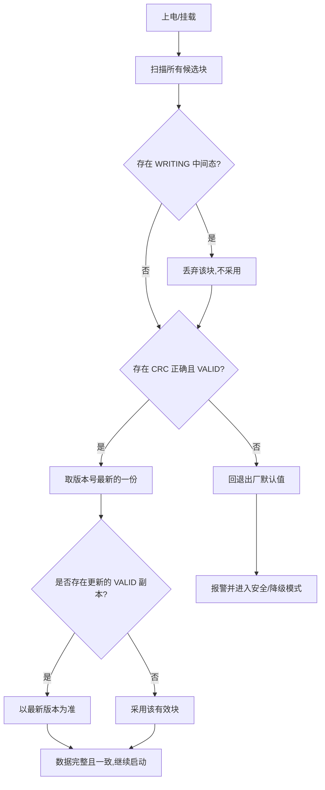

> 图：掉电恢复（挂载）决策流程，确保无论断电发生在写入的哪一步都能收敛到完整一致态。

### 6.4 写校验：ECC 与回读

仅靠 CRC 只能检错不能纠错。对于 NAND 以及车规级高可靠场景，需在页的 spare/OOB 区写入 **ECC（如汉明码、BCH、RS）**，读时纠正若干比特翻转（Flash 存在自然位翻转、辐射、老化引起的软错误）。同时养成"写后回读"习惯，能在控制器层面捕获写入失败、掉电导致的部分写入等硬件异常。

### 6.5 FEE 虚拟块状态机（mermaid）

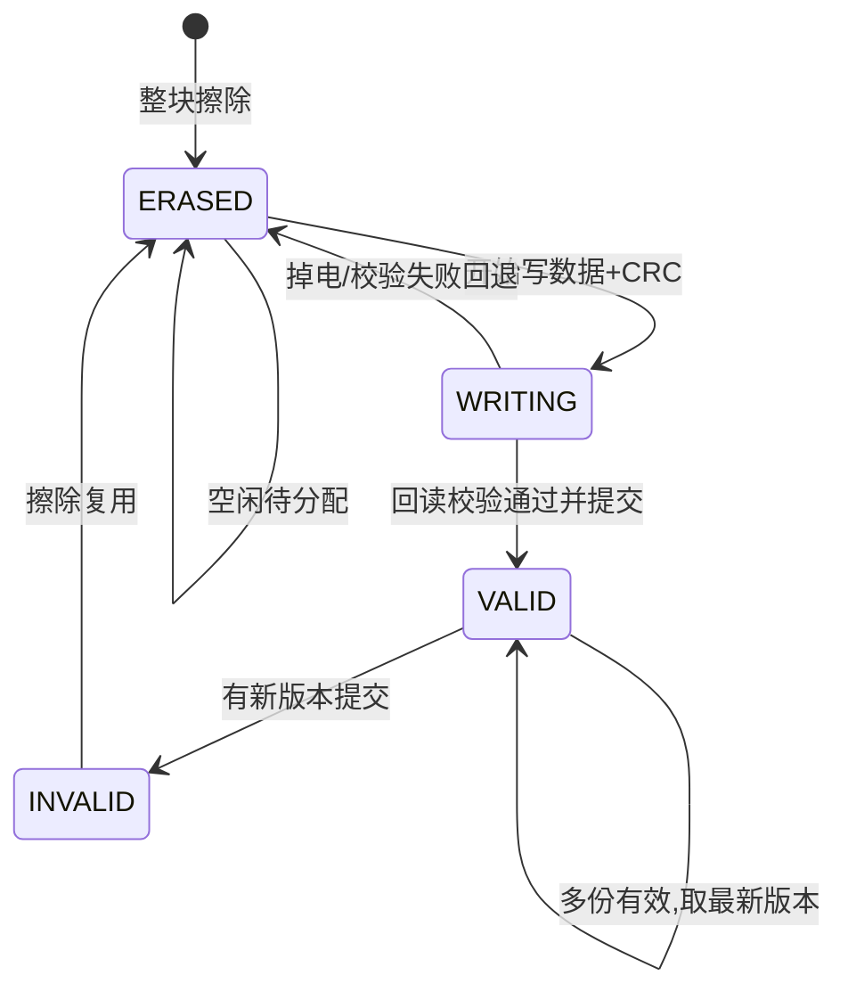

> 图：FEE 虚拟块（block）状态机。依靠状态字与 CRC 实现"掉电不丢、重启可恢复"的可靠存储。

---

## 七、写放大与读干扰（Read Disturb）

这两类是 Flash 可靠性与寿命的"隐性杀手"，常被初学者忽略。

### 7.1 写放大（Write Amplification，WA）

写放大 = 实际写入物理介质的数据量 ÷ 上层请求写入的数据量。理想是 1，实际往往大于 1。来源包括：

- **异地写导致的整块回收**：为改一个参数，要读整块、改、擦整块、写回整块，物理写入可能是请求量的数十倍；
- **磨损均衡的搬运**：静态均衡把冷数据搬来搬去；
- **文件系统的元数据更新**：改一个字节可能触发目录项、位图、日志多处更新；
- **SD/eMMC 控制器内部的 GC（垃圾回收）**：你不知道它何时搬，但它会搬，且搬的时候掉电风险与功耗峰值都叠加。

写放大会加速寿命消耗、增加写延迟与功耗。缓解思路：合并小写为批量写、提高每次写入的"块内利用率"、降低均衡搬运频率、对高频计数器类数据改用 FRAM/MRAM 或 RAM+周期性落盘。

### 7.2 读干扰（Read Disturb）

读 NAND 时，对同一个块反复读取（尤其是串行读同一页/相邻页），会在未被选中的存储单元上感应出微弱编程效应，经过阈值积累后会把某些位错误地翻转为 0。NAND 数据手册会规定"同一块最大读取次数（如 10^5–10^6 次读后需刷新）"。

缓解方法：

- **读计数 + 定期刷新（Read Reclaim）**：对每个块的累计读取计数，超过阈值就把该块数据读出、校验、写到别处并擦除原块；
- **ECC 兜底**：读干扰通常只翻转个别比特，强 ECC 可纠正；
- **避免热点只读**：不要让某个诊断/日志文件被高频轮询读取而不刷新。

需要指出：NOR 的读干扰远弱于 NAND，但在极高可靠性场景同样需要考虑。读干扰的累积与刷新处理可以建模为如下状态过程：

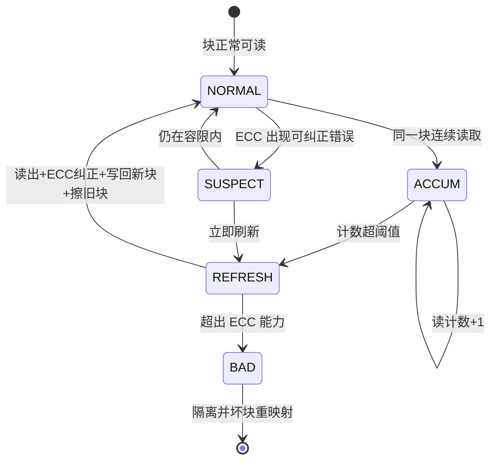

> 图：NAND 读干扰累积与刷新（Read Reclaim）状态机。

---

## 八、驱动代码实现

理论要落到代码。下面给出可直接阅读、经过注释的 C 实现骨架，覆盖底层擦写驱动、磨损均衡、掉电原子写、NAND 坏块管理，以及片上 EEPROM 模拟（Fee）骨架。这些代码以通用 Cortex-M 类 Flash 控制器为蓝本（寄存器名与位域呼应第四章），可根据具体芯片调整。

### 8.1 Flash 底层擦写驱动（解锁/擦扇区/页编程/等待/加锁/校验）

```c
/* 通用片内 Flash 底层驱动骨架（寄存器名呼应第四章位域，非特指某型号） */
#include <stdint.h>
#include <stddef.h>

/* 寄存器映射（基地址与位域见第四章，仅示例） */
#define FLASH_BASE      0x40022000u
#define FLASH_KEYR      (*(volatile uint32_t *)(FLASH_BASE + 0x04))
#define FLASH_CR        (*(volatile uint32_t *)(FLASH_BASE + 0x10))
#define FLASH_SR        (*(volatile uint32_t *)(FLASH_BASE + 0x0C))
#define FLASH_AR        (*(volatile uint32_t *)(FLASH_BASE + 0x14)) /* 地址寄存器 */

/* 控制寄存器位 */
#define CR_PG      (1u << 0)
#define CR_SER     (1u << 1)
#define CR_MER     (1u << 2)
#define CR_SNB_M   (7u << 3)   /* 扇区号占位 */
#define CR_STRT    (1u << 7)
#define CR_LOCK    (1u << 10)
/* 状态寄存器位 */
#define SR_BSY     (1u << 0)
#define SR_EOP     (1u << 1)
#define SR_WRPRTERR (1u << 2)
#define SR_PGSERR  (1u << 3)
#define SR_ECC2BIT (1u << 9)

#define KEY1 0x45670123u
#define KEY2 0xCDEF89ABu

/* 等待控制器空闲，超时返回非0（超时单位取决于调用节拍） */
static int flash_wait_ready(uint32_t timeout)
{
    while (FLASH_SR & SR_BSY) {
        if (timeout-- == 0u) return -1;
    }
    return 0;
}

/* 解锁：写入密钥序列，否则任何擦/写都会被锁逻辑拒绝 */
static void flash_unlock(void)
{
    FLASH_KEYR = KEY1;
    FLASH_KEYR = KEY2;
}

/* 加锁：操作完成后重新锁住，防跑飞误擦写 */
static void flash_lock(void)
{
    FLASH_CR |= CR_LOCK;
}

/* 擦除指定扇区（sector: 0..N）。返回 0 成功，<0 失败 */
int flash_erase_sector(uint8_t sector)
{
    if (flash_wait_ready(100000u) != 0) return -1;   /* 先确保不忙 */
    flash_unlock();

    FLASH_CR &= ~CR_SNB_M;
    FLASH_CR |= ((uint32_t)sector << 3) & CR_SNB_M;  /* 选扇区 */
    FLASH_CR |= CR_SER;                              /* 扇区擦除使能 */
    FLASH_CR |= CR_STRT;                             /* 启动 */

    if (flash_wait_ready(2000000u) != 0) {           /* 擦除可能数百 ms */
        flash_lock();
        return -2;
    }
    if (FLASH_SR & (SR_WRPRTERR | SR_PGSERR)) {      /* 写保护/顺序错 */
        FLASH_SR = SR_WRPRTERR | SR_PGSERR;          /* 清标志 */
        flash_lock();
        return -3;
    }
    FLASH_SR = SR_EOP;                               /* 清完成标志 */
    FLASH_CR &= ~CR_SER;
    flash_lock();
    return 0;
}

/* 页编程：把 data 写入 dst（须 32 位对齐、长度 4 的倍数）。
   返回 0 成功，<0 失败。写完强制回读校验。 */
int flash_program_page(uint32_t dst, const uint32_t *data, uint32_t words)
{
    if (flash_wait_ready(100000u) != 0) return -1;
    flash_unlock();

    FLASH_CR |= CR_PG;                              /* 编程使能 */
    for (uint32_t i = 0; i < words; i++) {
        ((volatile uint32_t *)dst)[i] = data[i];    /* 触发编程 */
        if (flash_wait_ready(10000u) != 0) { FLASH_CR &= ~CR_PG; flash_lock(); return -2; }
    }
    FLASH_SR = SR_EOP;
    FLASH_CR &= ~CR_PG;

    /* 写后回读校验：捕获掉电半写/硬件写失败 */
    for (uint32_t i = 0; i < words; i++) {
        if (((volatile uint32_t *)dst)[i] != data[i]) {
            flash_lock();
            return -3;                              /* 校验失败 */
        }
    }
    flash_lock();
    return 0;
}
```

### 8.2 磨损均衡算法（动态 + 静态 + 冷数据迁移）

```c
/* 磨损均衡：动态选最少擦除块；静态在差值超阈值时搬冷数据释放低损耗块 */
#include <stdint.h>

#define WL_SECTORS     16u      /* 参与均衡的扇区数 */
#define WL_THRESHOLD   50u      /* 最大/最小擦除计数差阈值，触发静态均衡 */

static uint16_t g_erase_cnt[WL_SECTORS];  /* 每扇区累计擦除次数（掉电前需落盘保存） */
static uint8_t  g_active[WL_SECTORS];     /* 1=已被某逻辑块占用 */

/* 返回当前擦除次数最少的空闲扇区号 */
static int wl_pick_least_erased(void)
{
    uint16_t min = 0xFFFFu;
    int best = -1;
    for (uint8_t s = 0; s < WL_SECTORS; s++) {
        if (!g_active[s] && g_erase_cnt[s] < min) {
            min = g_erase_cnt[s];
            best = s;
        }
    }
    return best;
}

/* 动态均衡写入：把逻辑块 lid 的数据写到擦除最少扇区 */
int wl_write(uint16_t lid, const void *buf, uint32_t len)
{
    int cand = wl_pick_least_erased();
    if (cand < 0) return -1;
    flash_erase_sector((uint8_t)cand);
    g_erase_cnt[cand]++;                  /* 磨损计数+1 */
    g_active[cand] = 1;
    /* 此处省略"逻辑块号→物理扇区"映射表维护与旧扇区回收 */
    return flash_program_page(sector_to_addr((uint8_t)cand), buf, len / 4u);
}

/* 静态均衡：扫描冷数据，若最热与最冷差值过大，把冷数据搬到更"老"的块 */
void wl_static_balance(void)
{
    uint16_t max = 0, min = 0xFFFFu;
    int hot = -1, cold = -1;
    for (uint8_t s = 0; s < WL_SECTORS; s++) {
        if (g_erase_cnt[s] > max) { max = g_erase_cnt[s]; hot = s; }
        if (g_active[s] && g_erase_cnt[s] < min) { min = g_erase_cnt[s]; cold = s; }
    }
    if ((hot >= 0) && (cold >= 0) && (max - min > WL_THRESHOLD)) {
        /* 把 cold 扇区的冷数据读出，写到另一个低损耗空闲块，再擦 cold */
        uint8_t tmp[512];
        read_sector((uint8_t)cold, tmp, sizeof(tmp));
        int dst = wl_pick_least_erased();
        if (dst >= 0) {
            flash_erase_sector((uint8_t)dst);
            flash_program_page(sector_to_addr((uint8_t)dst), (void *)tmp, sizeof(tmp)/4u);
            g_erase_cnt[dst]++;
            flash_erase_sector((uint8_t)cold);   /* 释放冷块给热数据轮转 */
            g_erase_cnt[cold] = 0;
            g_active[cold] = 0;
        }
    }
}
```

### 8.3 掉电保护（日志式原子写 / 断电恢复）

```c
/* 掉电原子写：COW + 最后翻转 VALID 标志；上电扫描取"最新且 CRC 正确" */
#include <stdint.h>

typedef enum {
    ERASED  = 0xFFFFFFFFu,  /* 已擦（空闲） */
    WRITING = 0x11111111u,  /* 正在写（中间态，掉电即作废） */
    VALID   = 0x22222222u,  /* 有效（已提交） */
    INVALID = 0x33333333u   /* 已废弃（待擦） */
} blk_state_t;

typedef struct {
    blk_state_t state;     /* 状态字：第一个写、最后翻 */
    uint32_t    id;        /* 逻辑块号 */
    uint32_t    version;   /* 版本号，单调增 */
    uint32_t    crc32;     /* 数据校验 */
    uint8_t     data[];    /* 实际数据 */
} fee_block_t;

/* 原子提交写：先写备用块，回读 OK 后翻 VALID，最后把旧块置 INVALID */
int atomic_write(fee_block_t *cand, fee_block_t *old,
                 uint16_t id, const void *data, uint32_t len)
{
    flash_erase_sector(sector_of(cand));
    flash_program_page(&cand->state, (void*)&WRITING, 1);
    flash_program_page(&cand->id,    (void*)&id, 1);
    flash_program_page(&cand->version,(void*)&(old->version + 1), 1);
    flash_program_page(cand->data, data, len / 4u);
    flash_program_page(&cand->crc32, (void*)&g_crc, 1);
    /* 关键提交点：最后才把状态翻成 VALID */
    flash_program_page(&cand->state, (void*)&VALID, 1);
    if (old) flash_program_page(&old->state, (void*)&INVALID, 1);
    return 0;
}
```

### 8.4 坏块管理（NAND：BBT 建立与重映射）

```c
/* 裸 NAND 坏块管理：上电扫描出厂标记建 BBT，运行时 ECC 不可纠则重映射 */
#include <stdint.h>

#define NAND_BLOCKS      1024u
#define BBT_SPARE_OFF    0x00   /* spare 区坏块标记字节偏移（示例） */
#define GOOD_BLOCK_MARK  0xFF

static uint8_t g_bbt[NAND_BLOCKS];   /* 0=好, 1=坏 */

/* 上电扫描 spare 区，建立坏块表 */
void nand_build_bbt(void)
{
    for (uint32_t b = 0; b < NAND_BLOCKS; b++) {
        uint8_t mark;
        nand_read_spare(b, BBT_SPARE_OFF, &mark, 1);
        g_bbt[b] = (mark == GOOD_BLOCK_MARK) ? 0u : 1u;  /* 非 0xFF 即坏 */
    }
}

/* 写失败时重映射：找备用好块，搬数据，更新 BBT */
int nand_remap_bad(uint32_t bad_block, const uint8_t *page, uint32_t len)
{
    for (uint32_t b = 0; b < NAND_BLOCKS; b++) {
        if (g_bbt[b] == 0u) {                 /* 找个好块当替身 */
            flash_erase_sector_dbg(b);        /* 实际是 nand_erase_block */
            nand_program_page(b, page, len);
            g_bbt[bad_block] = 1u;            /* 原块标记坏 */
            return (int)b;                    /* 返回新物理块号 */
        }
    }
    return -1;                                /* 无备用块：降级告警 */
}
```

### 8.5 片上 EEPROM 模拟（Fee）驱动骨架

```c
/* Fee（Flash EEPROM Emulation）骨架：把 Flash 抽象为可改写"逻辑块"
   实际 AUTOSAR Fee 由工具配置生成，这里给出核心思路 */
#include <stdint.h>

#define FEE_VIRTUAL_BLOCKS  32u
#define FEE_SECTOR_SIZE     0x8000u   /* 32KB 扇区 */

/* 每个虚拟块的元信息（实际存于管理区，掉电持久化） */
typedef struct {
    uint16_t  vid;          /* 虚拟块 ID */
    uint16_t  status;       /* 与 blk_state_t 同义 */
    uint32_t  addr;         /* 当前映射到的物理地址 */
    uint32_t  erase_cnt;    /* 该物理区擦除次数 */
} fee_vblock_t;

static fee_vblock_t g_vb[FEE_VIRTUAL_BLOCKS];

/* 读：按 vid 找当前有效物理块，校验后返回 */
int Fee_Read(uint16_t vid, uint8_t *out, uint32_t len)
{
    fee_vblock_t *v = NULL;
    for (uint16_t i = 0; i < FEE_VIRTUAL_BLOCKS; i++)
        if (g_vb[i].vid == vid && g_vb[i].status == (uint16_t)VALID)
            v = &g_vb[i];
    if (!v) return -1;                       /* 无有效块 → 上层用默认值 */
    return flash_read(v->addr, out, len);    /* 含 CRC 校验由上层完成 */
}

/* 写：走磨损均衡 + 原子提交（核心由 8.2/8.3 的 wl_write/atomic_write 实现） */
int Fee_Write(uint16_t vid, const uint8_t *in, uint32_t len)
{
    /* 选低损耗物理区 → 擦 → COW 写 → 回读 → 翻 VALID → 旧块 INVALID
       详见 atomic_write() 与 wl_write() 的组合调用 */
    return fee_write_impl(vid, in, len);
}
```

> 说明：以上代码为教学骨架，省略了中断屏蔽、RAM 函数搬运、CRC 计算、映射表掉电持久化等细节；量产代码应参考芯片 SDK 与 AUTOSAR Fee 模块实现。

---

## 九、文件系统选型：LittleFS / SPIFFS / FATFS / Reliance

当存储容量上到数 MB 乃至 GB 级（片外 NOR、NAND、SD、eMMC），用裸 FEE 管理文件既不现实也不安全，需要文件系统。下面从掉电安全、磨损均衡、RAM 占用、适用介质等维度对比。

| 文件系统 | 设计目标与定位 | 掉电安全 | 内置磨损均衡 | RAM 占用 | 最大容量/限制 | 适用介质 | 备注 |
|---------|--------------|---------|------------|---------|-------------|---------|------|
| LittleFS | 专为嵌入式 NOR Flash 设计的小型掉电安全 FS | 强（COW + 原子提交） | 有（动态，可配静态） | 低（约 2 KB 级） | 受 block 数限制，适合 MB 级 | SPI/QSPI NOR、片内 Flash | 支持目录、文件、无损挂载；社区活跃 |
| SPIFFS | 专为 SPI NOR 的超小 FS | 强（日志式 + 磨损均衡） | 有 | 极低（百字节级） | 无目录，文件大小需遍历获知 | SPI NOR、小 Flash | 不支持目录；seek 慢；适合简单键值/日志 |
| FATFS | 通用、成熟、跨平台 | 弱（本身不保证掉电安全） | 无 | 低（可裁剪） | 取决于 FAT 类型（FAT32/exFAT TB 级） | SD、eMMC、USB、任何块设备 | 需配合介质控制器或上层 journal 才可靠；生态最好 |
| Reliance | 商业级高可靠事务 FS | 强（事务 + 无回写） | 由实现决定 | 中 | 大容量块设备 | NAND/eMMC/SSD | 商用授权；适合高可靠/医疗/工业；无回写窗口 |

### 9.1 LittleFS

LittleFS 的设计哲学是"在资源受限的 NOR Flash 上做到真正的掉电安全"。它用**写时复制（COW）**组织元数据，目录与文件结构由"元数据对（metadata pair）"组成，每次改动写到新位置、再原子切换指针；文件数据以"块链"形式存储。其内置的动态磨损均衡会在分配新块时挑选擦除次数较少的块。优点是掉电安全可靠、RAM 小、支持目录与文件；缺点是对"读干扰刷新""静态均衡"需要上层配合，且大容量 NAND 上不如专用 FS 高效。

### 9.2 SPIFFS

SPIFFS 比 LittleFS 更"极简"，面向只有几十 KB 到几 MB 的 SPI NOR。它没有目录概念，所有文件平铺；写采用日志式追加，删除标记后由后台 GC 回收。RAM 占用可低至数百字节，适合 MCU 资源极度紧张的传感器节点。代价是：不支持目录、`stat`（获取文件大小）需要遍历、随机写性能一般。

### 9.3 FATFS

FATFS 是嵌入式领域使用最广的文件系统模块（elm-chan 实现），优点是成熟、跨平台、工具链完备（PC 直接读卡）。但 FAT 本身**不是掉电安全的**——在写目录项、FAT 表、数据簇的过程中掉电，很容易出现交叉链接、丢失簇、目录损坏。因此：

- 在 SD/eMMC 上，依赖卡内控制器提供的一定掉电保护（但仍非绝对）；
- 在裸 NAND 上跑 FAT 风险高，通常需要加一层 journal 或选用 FAT 的"只读发布 + 少量追加写"模式；
- 对可靠性要求高的参数，不要放进 FAT 卷，仍用 FEE/专用区。

### 9.4 Reliance 与商业方案

Reliance（Datalight / Tuxera）采用事务型、无回写（no write-back cache）设计，任何写入要么完整提交要么完全不发生，没有传统文件系统的"回写窗口"，因此掉电安全极强，常见于医疗、工业控制、航空电子。代价是商业授权与稍高的 RAM/CPU 开销。开源世界也有类似思路的实现（如裸机上的事务日志层），但生态成熟度不及商业方案。

### 9.5 文件系统挂载（伪代码）

下面给出一个简化的挂载/扫描伪代码，体现"先找有效超级块、校验、回退"的掉电恢复思想：

```c
/* 简化的文件系统挂载/恢复伪代码 */
typedef struct {
    uint32_t magic;     // 魔术字,标识本 FS 实例
    uint32_t version;   // 提交版本号
    uint32_t crc32;     // 对元数据块的校验
    uint8_t  body[];    // 实际元数据(根目录指针、位图等)
} superblock_t;

fs_err_t fs_mount(superblock_t *sb_a, superblock_t *sb_b) {
    int valid_a = (sb_a->magic == FS_MAGIC) && crc32_ok(sb_a);
    int valid_b = (sb_b->magic == FS_MAGIC) && crc32_ok(sb_b);

    if (valid_a && valid_b) {
        /* 双备份都在:取版本号更大的那份(最新提交) */
        superblock_t *pick = (sb_a->version > sb_b->version) ? sb_a : sb_b;
        load_metadata(pick);
        return FS_OK;
    }
    if (valid_a ^ valid_b) {
        /* 仅一份有效:直接用它(另一份可能是掉电中断的写) */
        load_metadata(valid_a ? sb_a : sb_b);
        return FS_OK;
    }
    /* 两份都无效:首次初始化或严重损坏,格式化并写默认超级块 */
    format_and_init_default();
    return FS_FORMATTED;
}
```

### 9.6 如何做选型决策

面对"该用哪个文件系统"的提问，可以沿如下决策树收敛：

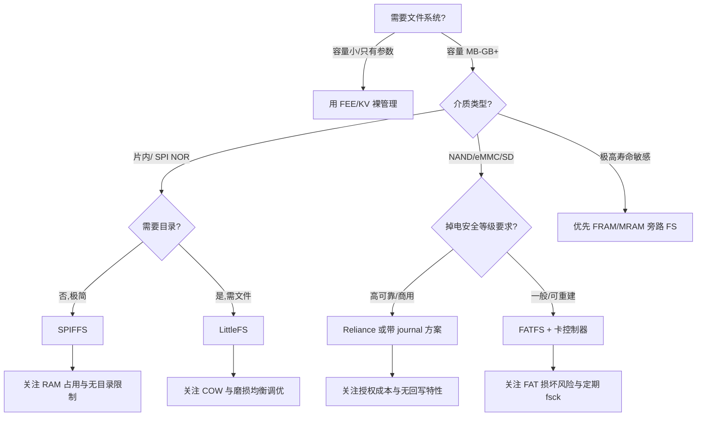

> 图：嵌入式文件系统选型决策树，结合介质、容量、掉电安全与资源约束。

选型时还要留意几个常被低估的点：其一，LittleFS 的"块大小"应与底层 Flash 的擦除扇区对齐，否则一个逻辑块横跨两个物理扇区会破坏原子性；其二，FATFS 在裸 NAND 上几乎是禁区，必须依赖 SD/eMMC 控制器或加日志层；其三，任何文件系统的"格式化"本身是一次大擦除，应在出厂或 recovery 模式完成，避免在正常运行中触发的不可控耗时；其四，文件系统的磨损均衡与 FEE 的磨损均衡是两套独立逻辑，若在同一片 Flash 上混用，需确保二者不会互相"踩踏"物理块。

---

## 十、参数/配置存储：键值、备份与版本化

除了文件系统承载的大块数据，嵌入式系统还有大量"小参数"需要管理：标定系数、VIN、学习值、故障码、里程、用户偏好等。工程上常见如下范式。

### 10.1 键值（Key-Value）抽象

把参数抽象为 `(key, value)` 对，屏蔽底层"按块存"的细节。好处是应用层用有意义的关键字读写，不关心物理布局，也便于做默认值、范围校验、权限分级（哪些可写、哪些只读/锁)。实现上可在 FEE 之上做一个轻量 KV 层：每个 key 映射到若干虚拟块，写时走"写-校验-提交"协议。

### 10.2 备份与冗余

关键参数至少双备份（A/B），甚至可以三备份投票。双备份配合"最后提交"协议即可防掉电；三备份在做读时"少数服从多数"可进一步防静默位翻转（前提是三份独立物理存放，避免共因失效）。注意：备份不是简单多写几份，而是要**独立校验、独立提交、独立物理扇区**，否则一次块损坏同时毁掉所有备份。

### 10.3 版本化

每个参数块带版本号/时间戳，解决"多份候选谁最新"的问题（见 FEE 恢复逻辑）。版本化还支撑：

- **向前兼容升级**：新固件读到旧格式版本，做迁移（migrate）而非直接拒绝；
- **回滚**：新参数写坏时回退到上一版本；
- **审计**：记录参数变更历史，便于事后排查"为什么这个值变了"。

### 10.4 参数存储结构（伪代码）

```c
/* FEE 块头部 + 磨损均衡 + 掉电安全的参数写入伪代码 */
typedef enum {
    ERASED  = 0xFFFFFFFF,  // 已擦(空)
    WRITING = 0x11111111,  // 正在写(中间态)
    VALID   = 0x22222222,  // 有效(已提交)
    INVALID = 0x33333333   // 已废弃(待擦)
} blk_state;

typedef struct {
    blk_state state;     // 状态字
    uint32_t  id;        // 参数 id
    uint32_t  version;   // 版本号
    uint32_t  erase_cnt; // 本块累计擦除次数(磨损均衡决策)
    uint32_t  crc32;     // 数据校验
    uint8_t   data[];    // 实际参数
} fee_block_t;

uint32_t FEE_Write(uint16_t id, uint8_t *data, uint32_t len) {
    fee_block_t *old = find_valid_block(id);
    fee_block_t *cand = find_least_erased_block();   // 磨损均衡:选擦除最少
    flash_erase(cand->sector);
    cand->erase_cnt = (old ? old->erase_cnt : 0) + 1;
    flash_write(&cand->state, WRITING);
    flash_write(&cand->id, id);
    flash_write(cand->data, data, len);
    flash_write(&cand->crc32, crc32(data, len));
    flash_write(&cand->version, old ? old->version + 1 : 1);
    /* 最后一步:原子提交有效(掉电保护核心) */
    flash_write(&cand->state, VALID);
    if (old) flash_write(&old->state, INVALID);
    return OK;
}

/* 上电恢复:读 CRC 正确的最新有效版本,否则回退默认值 */
fee_block_t* FEE_Read(uint16_t id) {
    fee_block_t *best = NULL;
    for (each block b with b.id == id) {
        if (b.state == VALID && crc32_ok(&b) &&
            (!best || b.version > best->version))
            best = &b;
    }
    return best;  // NULL 时由上层用默认出厂值
}
```

---

## 十一、AUTOSAR MCAL 配置说明

在汽车电子的 AUTOSAR 架构里，存储是分层抽象的。底层 MCAL（Microcontroller Abstraction Layer）提供可配置、代码生成的驱动，上层通过标准化接口访问 NVM，而不关心底层是片内 Flash 还是外置 EEPROM。

### 11.1 存储栈分层

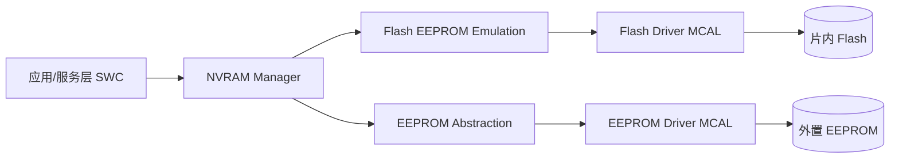

> 图：AUTOSAR 存储栈。NVM 对应用提供统一 NVRAM 接口；FEE/Fls 负责把 Flash 的"先擦后写、有限寿命"封装为可靠存储，并承担磨损均衡与掉电保护；应用完全不感知 Flash 物理约束。

### 11.2 Fls / Fee / Ea / Eep / NvM 职责

- **Fls（Flash Driver）**：MCAL 最底层，直接操作 Flash 控制器（呼应第四章寄存器）。负责扇区擦除、页编程、读、ECC 配置、写保护。它**只提供"裸"擦写能力，不做磨损均衡与掉电保护**。
- **Fee（Flash EEPROM Emulation）**：运行在 Fls 之上，把 Flash 模拟成"可任意改写的小块"，实现磨损均衡、掉电原子写、逻辑块管理。它是片内 Flash 模拟 EEPROM 的核心。
- **Eep（EEPROM Driver）**：MCAL 外置 EEPROM 驱动（I²C/SPI），对应真实 EEPROM 器件。
- **Ea（EEPROM Abstraction）**：在 Eep 之上做抽象，使上层不区分"片内模拟"还是"外置真实"EEPROM。
- **NvM（NVRAM Manager）**：服务层，向应用提供 `NvM_WriteBlock` / `NvM_ReadBlock` 等标准化接口，管理块（Block）、数据集（Dataset）、冗余块、立即写/后台写队列、掉电恢复。

### 11.3 配置项清单（EB tresos / DaVinci 配置项表格）

下面给出以 EB tresos / DaVinci Configurator Pro 为典型载体的配置项清单（Fls/Fee/Ea 为重点，Eep/NvM 列关键项）：

| 模块 | 配置项 | 含义 | 典型取值/注意事项 |
|------|-------|------|----------------|
| Fls | FlsConfigSet / FlsSectorList | 扇区基地址、大小、是否可擦写 | 必须与链接脚本的 Flash 分区一致；参数区与代码区物理分离 |
| Fls | FlsPageSize / FlsWriteSize | 页编程粒度、最小写单元 | 如 4/8/16 字节；影响 Fee 块对齐 |
| Fls | FlsMaxReadFastMode / WaitState | 等待周期(LATENCY) | 随主频/电压查表配置 |
| Fls | FlsEccSupport / EccErrorNotify | 是否使能 ECC、错误回调 | 车规必须使能并接诊断 |
| Fls | FlsJobEndNotification / JobErrorNotification | 异步作业结束/错误回调 | 配合 NvM 轮询或中断 |
| Fee | FeeVirtualPageSize / FeeSectorSize | 虚拟页/扇区大小 | 须与 Fls 扇区对齐 |
| Fee | FeeBlockConfig（Block Number/Size） | 虚拟块数量与长度 | 决定可存参数规模；影响 RAM 暂存 |
| Fee | FeeWearLevelingThreshold | 静态均衡触发阈值 | 见第五章"最大/最小擦除差" |
| Fee | FeeRedundantBlocks / FeeDataset | 冗余块数、数据集 | 实现双备份/多备份与回退 |
| Fee | FeeImmediateData / FeeWriteCycle | 立即写标记、写周期预算 | 配合 NvM 立即写队列 |
| Ea | EaBlockSize / EaNumberOfBlocks | 抽象块大小与数量 | 映射到底层 Eep 页 |
| Ea | EaJobEndNotification | 作业回调 | 同 Fls |
| Eep | EepDriverType / EepSpi/I2c | 外置器件接口 | SPI/I²C；含时序参数 |
| NvM | NvMBlockDescriptor（BlockId/Size） | NVRAM 块描述 | 应用读写的最小单元 |
| NvM | NvMBlockUseSetRamBlockStatus | 是否用 RAM 镜像 | 后台写/立即写分流 |
| NvM | NvMBlockRedundant / NvMBlockUseCrc | 冗余块、CRC 保护 | 可靠性的上层落点 |

### 11.4 配置 → 生成 → NvM 调用路径

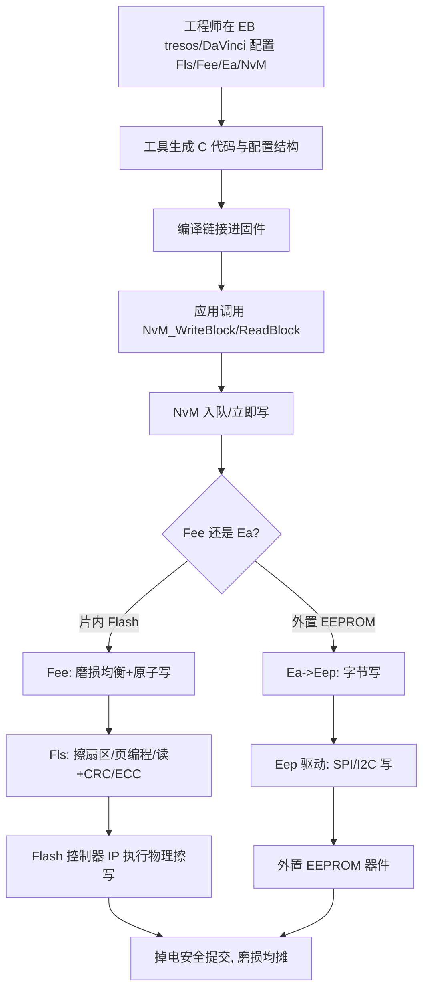

> 图：MCAL 存储配置到运行的完整路径。配置项最终落到 Fls/Fee/Ea 生成的代码，经 NvM 标准化接口服务于应用。

### 11.5 磨损均衡与可靠性在 MCAL 中的落点

- **磨损均衡落点**：在 **Fee** 层（Fls 不做）。Fee 的 `FeeWearLevelingThreshold` 配置静态均衡触发条件；动态均衡在每次 Fee 写时自动选低损耗物理区。
- **掉电保护落点**：**Fee** 的状态机（ERASED/WRITING/VALID/INVALID）+ CRC + 最后原子翻 VALID；NvM 的冗余块 + 数据集提供上层兜底。
- **ECC 落点**：**Fls** 使能控制器 ECC（呼应第四章 4.3），并把不可纠错误经 `EccErrorNotify` 上报。
- **可靠性统计**：Fee 维护每块擦除计数，可经 NvM 读出用于寿命预测（呼应第二章寿命估算）。
- **功能安全落点**：NvM 的 CRC、冗余块、与底层 ECC 共同构成存储故障检测链；高 ASIL 还需端到端保护（E2E Profile）覆盖"应用→NVM→介质"全路径，防止静默数据损坏。

---

## 十二、FMEDA 与功能安全

当存储子系统进入功能安全（ISO 26262）视野，单靠 CRC 与冗余不够，需要系统化的 **FMEDA（Failure Modes, Effects and Diagnostic Analysis，故障模式、影响与诊断分析）**。目标是识别存储相关失效模式、评估其对安全目标的影响、并确认诊断机制能达到目标 ASIL 的故障覆盖率。

常见存储失效模式与诊断对策：

| 失效模式 | 可能后果 | 诊断/缓解机制 | 故障覆盖率贡献 |
|---------|---------|--------------|--------------|
| 单比特翻转（软错误/老化） | 参数读错、控制偏差 | ECC（汉明/BCH）纠正 + 读回校验 | 高（可纠范围内） |
| 多比特不可纠错误 | 数据损坏、功能失效 | ECC 检测 + 冗余块/NV 备份回退 | 中（依赖冗余） |
| 块磨损耗尽 | 该块永久失效、参数丢 | 磨损均衡 + 擦除计数监控 + 告警 | 高（预防类） |
| 掉电半写 | 脏数据、状态不一致 | COW 原子提交 + 版本/CRC + 出厂默认值兜底 | 高（可恢复） |
| 坏块未管理（裸 NAND） | 数据落空、丢失 | BBT 重映射 + 备用品池 | 高 |
| 地址/映射错误 | 写到错误块、覆盖关键数据 | 地址校验 + 逻辑→物理映射冗余 + E2E | 中-高 |
| 静默数据损坏（控制器谎报成功） | 安全目标违背 | 端到端保护（E2E Profile）+ 独立校验 | 高（关键环节） |
| 读出保护被破解/误配 | 固件泄露/锁死 | 选项字节等级 + 生产流程管控 | 流程类 |

FMEDA 的输出是一张"诊断覆盖率"表，叠加到系统级 FTA（故障树分析）中。其故障树顶层可分解为：

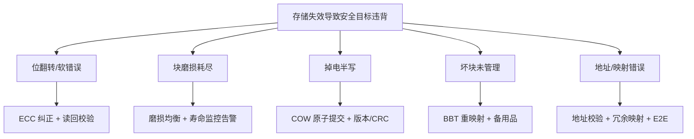

> 图：存储相关功能安全故障树。每一分支都需有可量化诊断覆盖率的对策，才能支撑相应 ASIL 等级。

要点：静默错误（silent error）是功能安全最危险的失效——它不报错却给出错误数据。因此高 ASIL 系统必须把"端到端保护 E2E"作为最后一道关，让应用层在拿到数据前就能验证其完整性与新鲜度，而非盲信底层"读成功"。

---

## 十三、实战坑位清单

### 坑位 1：Flash 边跑边擦同区 → HardFault

Bootloader 或参数区代码在执行时擦自己所在扇区，CPU 取指冲突跑飞。
**对策**：擦写例程加 `__attribute__((section(".ramfunc")))` 搬进 RAM 执行，或在链接脚本把参数 FEE 区与 `.text` 物理分离到不同 Bank。

### 坑位 2：掉电写一半、标志位没翻 → 脏数据

未做"写校验 + 拷贝 + 最后翻标志"，重启读到半截新值。
**对策**：严格执行 COW 提交协议；恢复逻辑优先读"CRC 正确 + 版本最新"的有效块，宁可回退旧值也绝不用半截新值。

### 坑位 3：磨损不均衡 → 某 block 早死

固定写同一块（如每次都更新 block 0 的计数器），导致该块数万次擦写后损坏，整机报废。
**对策**：实现轮转选择"擦除次数最少/最老有效"的块，用计数器记录每块擦除次数辅助决策；必要时引入静态均衡搬走冷数据。

### 坑位 4：参数区与代码区未物理隔离

参数频繁擦写产生的应力/干扰影响代码可靠性，甚至损坏向量表。
**对策**：链接脚本把参数 FEE 区与代码区明确分层，分配到独立扇区/Bank。

### 坑位 5：回读校验缺失 → 静默坏块

写后不校验，坏块被当成有效，数据悄悄错误。
**对策**：强制"写后回读 + CRC"；裸 NAND 必须上 BCH/RS 级 ECC，并配合坏块表与读干扰刷新。

### 坑位 6：写放大失控 → 寿命骤降

高频小参数反复触发整块擦写，物理写入是请求量的几十倍。
**对策**：合并批量写、降低均衡频率、对高频计数器用 FRAM/MRAM 或 RAM 缓存 + 周期落盘。

### 坑位 7：FAT 卷掉电损坏

在 SD 上用 FAT 存关键数据，掉电时目录项/FAT 表交叉损坏。
**对策**：关键参数走 FEE/专用区；FAT 卷只放可重建/可丢失的数据，或加 journal 层，或依赖卡控制器但做定期 fsck。

### 坑位 8：对齐与粒度错配

按字节写却未考虑 Flash 编程粒度与缓冲对齐，导致跨页写入异常或效率极低。
**对策**：写缓冲按页/字对齐，理解数据手册的最小编程单位，避免越界跨越扇区边界的"假原子写"。

### 坑位 9：DMA 缓冲位于被擦区 / Cache 不一致

用 DMA 搬页数据，缓冲恰在被擦写的扇区，或写回 Cache 未 clean 导致数据错。
**对策**：DMA 缓冲固定分配在非 NVM、非被擦区的 SRAM；使能 DMA 前 `SCB_CleanInvalidateDCache` 处理好 Cache 一致性。

### 坑位 10：等待周期（LATENCY）配错 → 高主频读错

提升 CPU 主频后未同步增加 Flash 等待周期，取指错位跑飞。
**对策**：按数据手册查表配置 LATENCY；主频/电压变更时重新评估。

### 13.11 存储可靠性验证与测试方法论

再好的设计也要靠测试兜底。嵌入式存储的验证至少要覆盖以下维度：

1. **掉电注入测试（Power-Loss Injection）**：在写入过程中用继电器/可编程电源随机断电（覆盖擦除、编程、翻转标志各阶段），上电后校验数据完整性与一致性。行业稳健做法是用自动化台架做百万次级随机断电，统计"脏数据率/不可恢复率"，目标是零不可恢复。
2. **ECC/位翻转注入测试**：故意在存储介质上翻转若干比特（或在仿真模型中注入），验证 ECC 能纠正、超界能判坏块而非静默通过。
3. **寿命加速测试（Endurance）**：用高温 + 满负荷擦写逼近 PE 上限，观察磨损均衡是否真的均摊、是否有块提前磨穿；结合坏块替换验证整片寿命退化曲线。
4. **高温保持力测试（Retention）**：将写好的样本置于高温（如 125℃/150℃）长时间存放，到期回读校验位错误率，验证数据保持力裕量。
5. **读干扰压力测试**：对同一块高频串行读取超过手册阈值，验证 Read Reclaim 是否触发且数据不丢。
6. **现场返回分析（Field Return）**：量产后回收故障样本，做物理与逻辑分析，反哺均衡阈值、ECC 强度、落盘频率等参数。

需要提醒的是，掉电测试必须在"真实电源轨 + 真实写时序"下做，单纯软件模拟断电往往漏掉电源跌落过程中 Flash 控制器状态机卡死、电荷泵未完成等硬件边角问题。笔者建议把"随机断电 + 上电全量校验"作为 CI/产线老化的一部分，而非一次性验证。对于安全相关产品，还应保留失败样本的可追溯日志（哪一步断电、写入了什么、恢复到了哪个版本），以便复现与根因分析，这往往比通过一次测试更有长期价值。

---

## 十四、面试高频要点（24+ 道，含要点）

1. **为什么需要磨损均衡？**
   要点：Flash 擦写次数有限（万级），若固定写同一块会先磨穿；轮转写入可把寿命均摊到整片，成倍延长系统可靠工作期。

2. **FEE 如何保证掉电不丢？**
   要点：双（多）块冗余 + 状态机（ERASED/WRITING/VALID/INVALID）+ CRC 校验 + 最后原子翻转有效标志；重启读"CRC 正确且版本最新"的有效块，否则回退默认。

3. **Flash 能否边跑边擦？**
   要点：不能擦当前执行区，否则取指冲突跑飞；需把擦写例程搬 RAM 执行，或保证被擦区无代码在跑（不同 Bank）。

4. **参数区为何要与代码区物理隔离？**
   要点：防止频繁擦写参数影响代码可靠性、损坏向量表；链接脚本分层分配。

5. **NVM 与 FEE 的关系？**
   要点：NVM 是 AUTOSAR 服务层抽象，向应用提供统一 NVRAM 接口；FEE 是其底层 Flash 模拟驱动，负责磨损均衡与掉电保护，应用不感知 Flash 物理约束。

6. **动态与静态磨损均衡的区别？**
   要点：动态只轮转热数据，解决热点；静态额外搬走冷数据释放低损耗块给热数据，均匀度更高但带来写放大。

7. **什么是写放大？如何缓解？**
   要点：物理写入量 ÷ 请求写入量；来源为异地写回收、均衡搬运、元数据更新、控制器 GC；缓解靠合并写、降均衡频率、高频计数用 FRAM。

8. **什么是读干扰？如何防范？**
   要点：NAND 同块高频读感应出伪编程翻转位；防范靠读计数+定期刷新（Read Reclaim）、强 ECC、避免热点只读。

9. **NAND 与 NOR 的主要差异及选型？**
   要点：NOR 随机读快可 XIP、寿命高、容量小、适合代码；NAND 密度高成本低、按页读、有坏块需 ECC、适合大数据。

10. **裸 NAND 为什么必须自己做坏块管理与 ECC？**
    要点：NAND 出厂即有坏块且会新增；单位比特出错率随磨损上升；需 BBT + 备用品重映射 + BCH/RS ECC。

11. **SD/eMMC 内部做了什么，对我们意味着什么？**
    要点：内置控制器做了磨损均衡、坏块管理、ECC、部分掉电保护；代价是失去对底层擦写控制，写操作可能触发内部大搬移，实时/功耗预算要留余量。

12. **LittleFS 与 SPIFFS 怎么选？**
    要点：都要掉电安全+磨损均衡；LittleFS 支持目录/文件、RAM 略高、适合稍大 NOR；SPIFFS 极简无目录、RAM 极低、适合极小 Flash。

13. **FATFS 在嵌入式上的掉电风险？**
    要点：FAT 本身不保证掉电安全，写目录/FAT 表中间掉电易损坏；关键数据勿入 FAT 卷，或加 journal、依赖卡控制器并定期 fsck。

14. **FRAM/MRAM 为什么能"消灭"大部分存储痛点？**
    要点：近乎无限次写入、字节级改写、断电即存、抗辐射；但容量小价格高，适合关键高频小数据。

15. **参数版本化有什么用？**
    要点：解决"多份候选谁最新"、支撑向前兼容迁移、回滚、变更审计。

16. **ECC 与 CRC 的区别？**
    要点：CRC 只能检错不能纠错；ECC（BCH/RS/汉明）能检测并纠正若干比特翻转，是 NAND 与高可靠场景必需。

17. **为什么"写后回读"是好习惯？**
    要点：能在控制器层捕获写入失败、掉电部分写入、硬件异常，配合 CRC/ECC 防止静默坏块被当有效。

18. **AUTOSAR 里 Immediate Write 与 Background Write 怎么用？**
    要点：关键参数（SOC、故障码）走立即写在完成回调确认；非关键统计走后台队列周期批量落盘以降低写放大。

19. **什么是数据保持力（Retention）？与擦写寿命有何不同？**
    要点：Retention 指不通电时电荷泄漏导致位翻转的时间极限，受温度强烈影响；擦写寿命是氧化层磨损导致的可擦写次数上限。二者是独立机制——不写也会因高温失效，低温反复写也会磨穿。设计上高温工况要缩短落盘间隔并加强 ECC。

20. **COW 与 WAL 在掉电安全上有什么异同？**
    要点：COW（写时复制）是把修改写到新位置再原子切换指针，旧数据在确认前保留，天然支持回滚；WAL（写前日志）是先记"要改什么"再改数据，恢复时重放或回滚。二者都依赖"一个最小原子提交点"，区别在元数据的组织方式。LittleFS 偏 COW，传统数据库/部分 journal FS 偏 WAL。

21. **为什么不建议在中断服务程序（ISR）里直接写 Flash？**
    要点：Flash 擦写是毫秒级长操作，会阻塞中断、破坏实时性；且擦写期间若被更高优先级任务/中断抢占去读同一区会冲突。正确做法是 ISR 仅置标志/入队，由低优先级任务或后台调度在空闲时完成写。

22. **如何估算一块 Flash 能否撑过产品寿命？**
    要点：先统计各参数的日更新次数与每次更新的物理擦写量（含写放大），乘以计划寿命天数得到总 PE 需求；再除以可用块数得到每块平均 PE，须小于标称寿命并留裕量（如 70%–80%）。必要时用 FRAM 旁路高频计数、合并写、降频落盘来削峰。

23. **SD 卡标称"工业级"就可靠吗？**
    要点：不一定。工业级主要指温度范围，掉电安全与写入放大仍取决于卡内控制器固件，且不同批次/厂商行为可能差异巨大。关键数据仍建议走独立 FEE/专用存储，SD 仅放可重建内容，并做好上电 fsck 与写入确认。

24. **多份备份为何要"独立物理存放"而非简单多写？**
    要点：若三份备份落在相邻扇区甚至同一擦除块，一次块损坏会同时毁掉所有备份（共因失效）。独立物理存放 + 独立校验 + 独立提交，才能让冗余真正对抗局部物理失效，必要时配合三取二投票纠出静默位翻转。

25. **Flash 控制器里 ECC 引擎是软件还是硬件？它在哪条路径上工作？**
    要点：主流是硬件模块，挂在数据通路上；编程时算校验码随数据写入（片内存冗余字节 / NAND 存 spare 区），读取时解码并透明纠正，置 ECC1BIT/ECC2BIT 状态位供软件决策。它不解决掉电半写，需与 COW 协议互补。

26. **MCU 的 Flash 控制器通常做不做磨损均衡？为什么？**
    要点：绝大多数片内 Flash 控制器不做，只听命擦/写/读；磨损均衡是软件（FEE/Fee）职责。高端 NAND/eMMC 控制器或独立 FTL 才硬件集成。软件必须自己实现动态/静态均衡，并假设硬件 FTL 也可能失效、需上层冗余兜底。

27. **什么是 FMEDA？存储子系统的静默错误为什么最危险？**
    要点：FMEDA 是识别失效模式、影响与诊断覆盖率的系统分析。静默错误不报错却给出错误数据，会直接违背安全目标；高 ASIL 必须用 E2E 端到端保护让应用层在消费数据前验证完整性与新鲜度，而非盲信底层"读成功"。

---

## 十五、小结与设计清单

嵌入式存储管理的核心，是在"非易失、可改写、寿命有限且特性怪异"三大约束之间做工程平衡。一个稳健设计的自检清单：

- [ ] 介质选型是否匹配容量/寿命/成本（高频小数据优先考虑 FRAM/MRAM 或 FEE）？
- [ ] 是否理解所用 MCU 的 Flash 控制器 IP 结构（寄存器、ECC、高压泵、DMA、保护位）？
- [ ] 是否实现了磨损均衡（动态 + 必要的静态）？是否有擦除计数与阈值？
- [ ] 掉电保护是否基于 COW/日志 + 最后原子提交 + CRC/ECC？恢复是否优先最新有效版本？
- [ ] 参数区与代码区是否物理隔离、对齐？是否配置了正确的 Flash 等待周期（LATENCY）？
- [ ] 是否考虑了写放大与读干扰（合并写、读计数刷新）？
- [ ] 大容量存储的文件系统选型是否兼顾掉电安全（LittleFS/SPIFFS/Reliance 而非裸 FAT）？
- [ ] 关键参数是否多备份、版本化、有默认兜底？
- [ ] AUTOSAR 项目中 Fls/Fee/Ea/NvM 配置是否逐项落实（扇区对齐、ECC、冗余、WL 阈值）？
- [ ] 是否做过掉电注入测试（随机断电 + 上电校验百万次）验证可靠性？
- [ ] 安全相关产品是否完成存储 FMEDA、配置 E2E 端到端保护以对抗静默错误？

当存储子系统进入功能安全（如汽车电子 ISO 26262）视野时，还要额外评估：存储介质失效是否被识别为可检测故障、关键参数损坏是否会导致违背安全目标、校验/冗余机制是否达到相应 ASIL 等级的故障覆盖率。此时单靠 CRC 往往不够，需要 ECC、双核交叉校验、端到端保护（E2E Profile）乃至独立监控核共同参与，把"存储静默错误"这一系统级失效模式关进笼子里。

把以上要点落到代码与测试里，嵌入式存储就能从"最容易出事故的环节"变成"最让人放心的环节"。

---

*（本章为技术知识库深度章节，数值采用业界典型量级笼统指代，具体以器件数据手册与 AUTOSAR 规范为准。文中"笔者"指笔者个人经验，不涉及任何具体个人。）*
