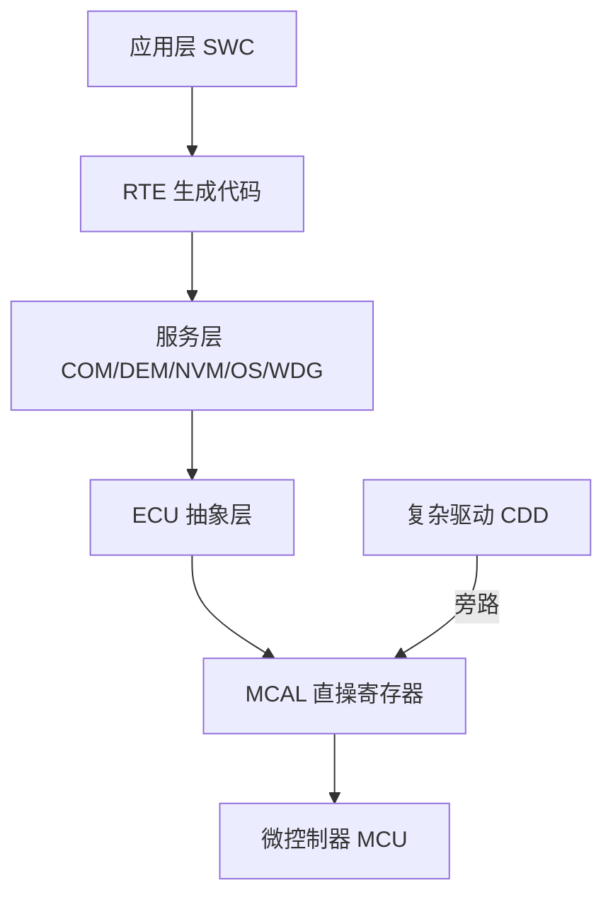
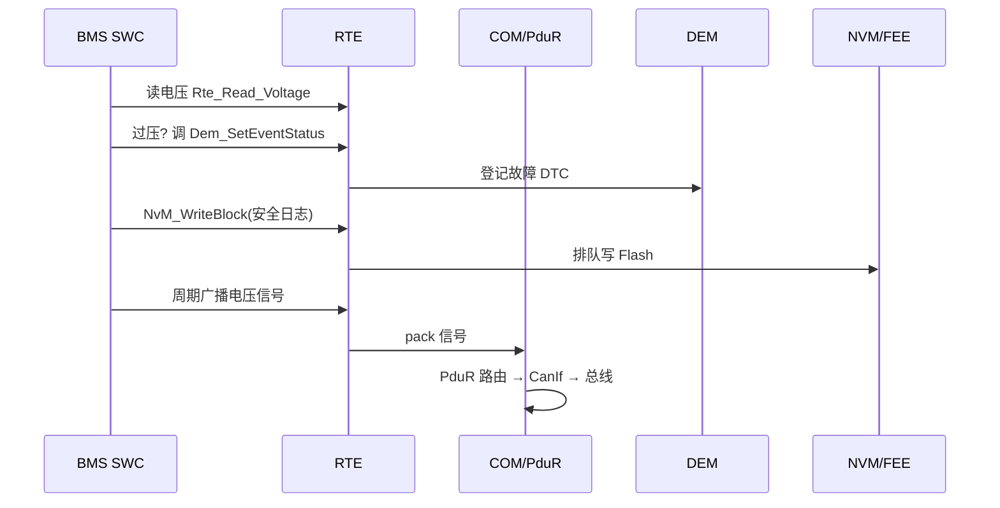

# AUTOSAR 架构深度：RTE/COM/DEM/NVM 协作之谜

## 一、六款芯片，一套代码：移植噩梦与救命稻草

某工程师半年内要支持瑞萨、英飞凌、芯驰、国芯、紫光、恩智浦六款芯片。如果每款都从零写驱动、裸调寄存器，光 Bootloader 和通信就要重写六遍，且各版本行为极易"漂移"出差异。

AUTOSAR（汽车开放系统架构）的存在，就是为了解决这件事：**让应用层代码在不同芯片、不同 ECU 间可复用**。它用一套分层 + 标准化接口，把"硬件差异"压到最底下的一层。但很多只配过 MCAL 的工程师卡在一个问题——RTE、COM、DEM、NVM 之间到底怎么串起来？本文把这条协作链彻底拆开。

---

## 二、核心原理：分层与"隔离硬件"

### 2.1 五层塔（自上而下）

```
应用层 SWC (Software Component)
        │  RTE (Runtime Environment，生成代码)
服务层 Services (COM/DEM/NVM/OS/WDG…)
        │  ECU 抽象层 (ECU Abstraction)
MCAL (Microcontroller Abstraction Layer，直操寄存器)
        │
微控制器 (MCU)
```

- **SWC**：应用组件，只调 RTE 接口，不知硬件在哪；
- **RTE**：**生成代码**连接 SWC 与 BSW，是 AUTOSAR "可移植性"的核心；
- **服务层**：COM（通信）、DEM（故障）、NVM（存储）、OS、WDG 等；
- **ECU 抽象层**：把具体 MCU 外设抽象成"板级"接口；
- **MCAL**：直接读写寄存器，屏蔽芯片差异；
- **CDD（复杂驱动）**：旁路上层，直接访问 MCAL，用于特殊硬件（如 BMS 电芯监控链路）。



> 图：AUTOSAR 五层架构，硬件差异被压到最底层的 MCAL，上层应用可跨芯片复用。

### 2.2 RTE：SWC 之间的"邮局 + 翻译官"

RTE 不用人写，由工具按配置**生成 C 代码**。它干两件事：

1. **ECU 内通信**：SWC-A 调 `Rte_Write_PortX(data)`，RTE 生成的代码把它送进 SWC-B 的 `Rte_Read_PortY()`。
2. **跨 ECU 通信抽象**：SWC 只说"我要发 Signal_xxx"，RTE 把信号交给 COM 打包成报文，走 CAN/CAN FD 发出去；接收端反过来解包。

类比：SWC 是部门同事，RTE 是公司内部邮局。同事 A 只管把信塞进 RTE 邮箱（端口），至于信怎么打包、走什么快递（CAN/LIN/以太网）、对方怎么拆，A 完全不管。

### 2.3 COM + PDU Router：信号的"打包流水线"

- **COM** 负责信号级：把 SWC 的信号按 DBC 定义的起始位/长度/字节序（Motorola/Intel）**pack 成字节流**，或接收时 **unpack** 还原。
- **PDU Router（PduR）** 负责路由：把打包好的 I-PDU 分发给对应总线接口（CanIf → CAN 驱动），或反向汇聚。
- 双协议（CAN/CAN FD）可共用同一 COM/PduR 配置，仅底层驱动按"FD 标志"动态切换——呼应诊断篇的"一套代码覆盖双协议"。

### 2.4 DEM：故障的"登记中心"

当底层检测到故障（如 ECC 双 bit 错、过压、通信超时），调用 `Dem_SetEventStatus(EventId, FAILED)`。DEM 负责：

- 记录/清除 DTC（故障码）；
- 按预配置策略决定"上报严重度 / 触发降级 / 进安全态"；
- UDS 0x19 读 DTC 时，DCM（Diagnostic Communication Manager）向 DEM 查。

DEM 与 DET 不同：**DET（Default Error Tracer）管开发期模块参数/状态错误**（如传了 NULL 指针给 BSW API），DEM 管运行时真实故障。

### 2.5 NVM：非易失的"保管员"

SWC 通过 RTE 调 `NvM_WriteBlock()`，NVM 把请求排队，最终经 **FEE（Flash EEPROM Emulation）或 EEPROM 驱动**落盘。NVM 负责：

- 把"即时写请求"和"掉电需要保存"的块区分（立即写 vs 后台写）；
- 多块并发时的队列与仲裁；
- 配合 FEE 的磨损均衡与掉电保护（呼应存储管理篇）。

---

## 三、一条完整协作链（以"电压超阈值报故障并存档"为例）

```c
/* 1. BMS 采样 SWC 周期性读出电压 */
Rte_Read_Voltage(&volt);

/* 2. 应用逻辑判断过压 */
if (volt > THRESH) {
    /* 3. 报故障给 DEM（生成代码封了一层 RTE API） */
    Rte_Call_Dem_SetEventStatus(OverVoltEvent, DEM_EVENT_STATUS_FAILED);
    /* 4. 把事件性参数经 NVM 存档 */
    Rte_Call_NvM_WriteBlock(SafetyLogBlock, &log);
}
/* 同时 5. 把电压信号经 COM 周期性广播 */
Rte_Write_VoltageSignal(volt);   // → COM pack → PduR → CanIf → 发出
```

底层链路全貌：

```
SWC --RTE--> COM --PduR--> CanIf --CAN驱动(MCAL)--> 总线
                │
SWC --RTE--> DEM (故障登记)      ─┐
SWC --RTE--> NVM --FEE--> Flash  ─┤ 服务层各自独立
底层异常 --> ECC/WDG 异常 --> DEM / 安全态 ─┘
```

---



> 图：过压报故障并存档的协作时序，SWC 经 RTE 同时驱动 DEM 登记与 NVM/COM 存储广播。

## 四、常见坑与调试手段

1. **RTE 生成代码与配置不一致**：改了 SWC 端口却没重生成 RTE，链接报未定义符号。调试：每次改 SWC/BSW 配置后**重跑 RTE 生成**，查 map 文件确认接口存在。

2. **跨芯片移植只改 MCAL 不够**：看似上层复用，实则 OS/BSW 的某些配置仍依赖芯片时钟/中断号。调试：建立"芯片差异对照表"，MCAL 重写 + 上层配置复用，编译/链接脚本分平台管理。

3. **NVM 写阻塞实时任务**：把"即时写"误用成同步阻塞。调试：区分 `NvM_WriteBlock`（后台队列）与关键参数即时存；实时路径避免同步刷写，必要时绕道 FEE 直接存。

4. **COM 字节序信号错乱**：Motorola/Intel 信号 pack 算法搞反，跨字节信号位序错。调试：用 DBC 生成代码的工具（如资料所述 Python 自动生成）统一处理字节序，杜绝手写出错；CAN 分析仪比对实际字节。

5. **DEM 故障"不报"**：事件 ID 配错或阈值策略未使能。调试：HIL 台架故障注入，确认 `Dem_SetEventStatus` 被调用且 0x19 能读出对应 DTC。

---

## 五、面试高频要点

- **RTE 是干什么的？** 工具生成的代码，连接 SWC 与 BSW，实现通信抽象与跨平台可移植性。
- **AUTOSAR 为什么能跨芯片？** 分层 + MCAL 隔离硬件，上层配置/应用可复用，仅 MCAL 重写。
- **DEM 与 DET 分别管什么？** DEM 管运行时故障码（DTC）；DET 管开发期模块参数/状态错误。
- **COM / PduR 分工？** COM 做信号 pack/unpack；PduR 做 I-PDU 路由到对应总线接口。
- **NVM 与 FEE 关系？** NVM 是服务层抽象，FEE 是其底层 Flash 模拟驱动，负责磨损均衡与掉电保护。

---

*（全文约 2400 字，基于资料模块一、十五及外设协议详解整理，型号参数采用笼统指代。）*
