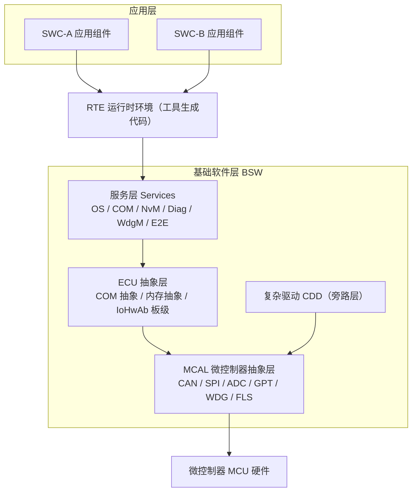
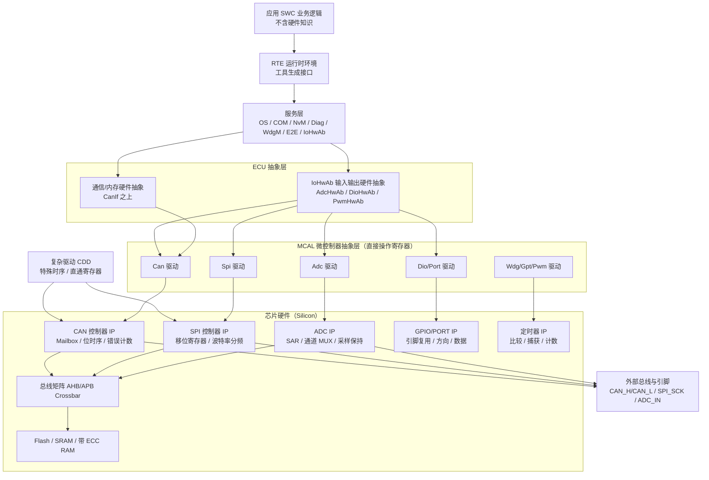
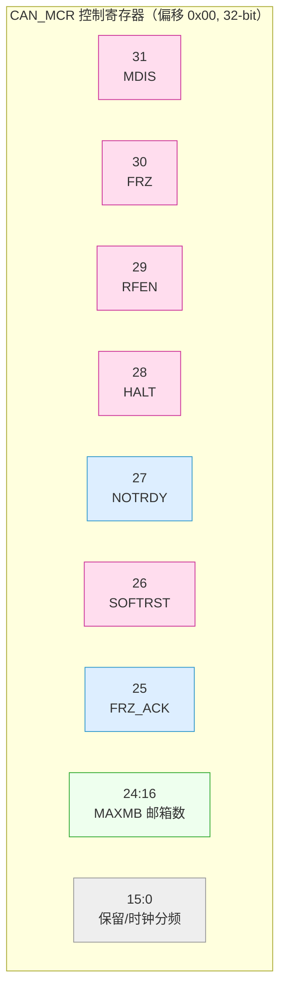
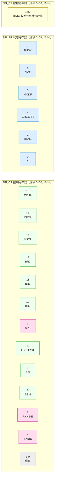
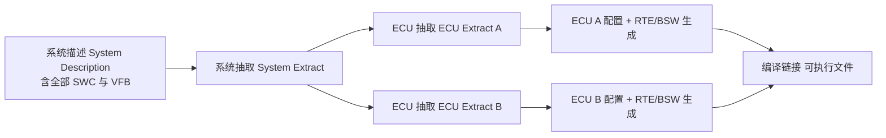
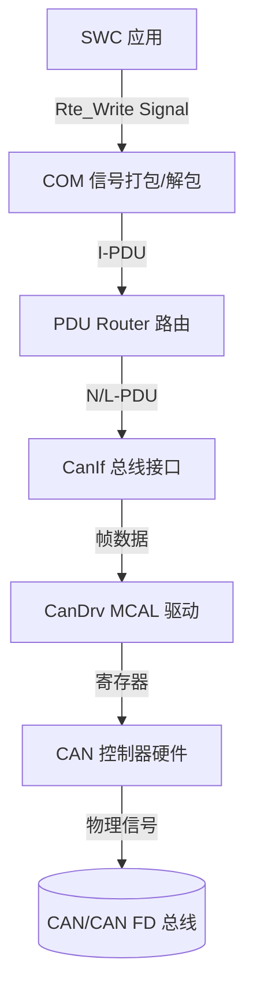
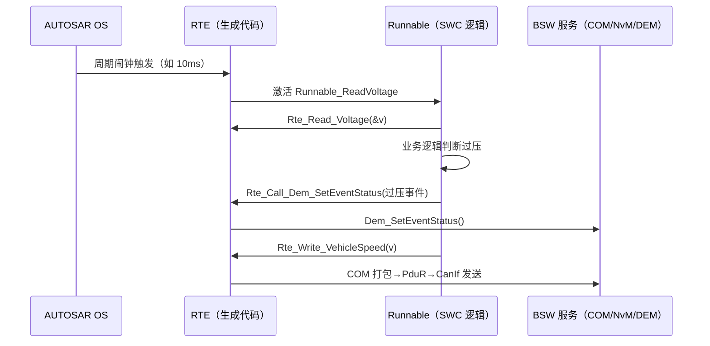
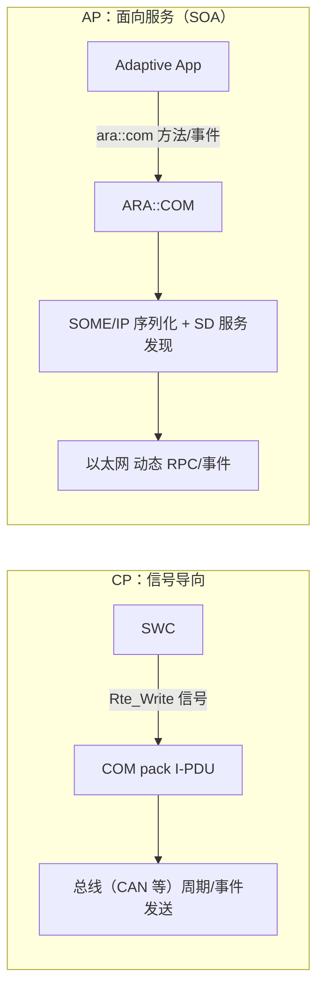
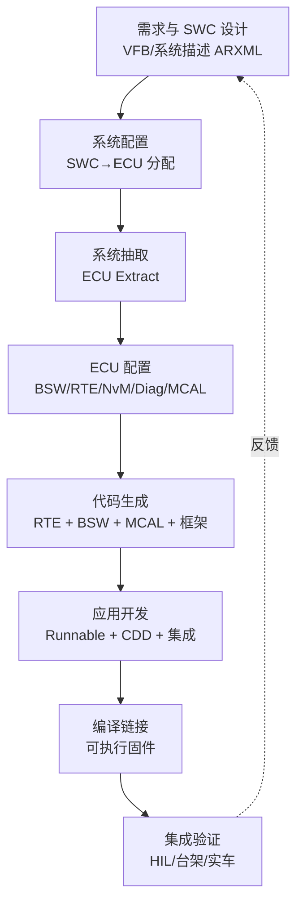

# AUTOSAR 经典与自适应平台架构深度解析（工业级增强版）

> 本文为公开技术知识库深度章节。笔者以资深 AUTOSAR 系统架构师/底层工程师视角，系统梳理经典平台（CP）与自适应平台（AP）的定位差异、逐层拆解 CP 软件架构、方法论与通信机制，并重点深化**芯片模块设计、驱动代码实现、MCAL 配置**三大底层核心主题，覆盖从寄存器位域到 RTE 生成的完整技术链路。文中型号与参数采用通用指代，符合真实 AUTOSAR 规范语义，不涉及任何特定供应商内部实现细节。

---

## 引言：为什么需要 AUTOSAR

在汽车电子电气架构（E/E Architecture）演进的几十年里，车载电子控制单元（ECU）的数量从早期的个位数，增长到如今高阶智能驾驶汽车的数十甚至上百个。每一个 ECU 背后都运行着数以万计行的嵌入式软件，涉及动力总成、底盘控制、车身舒适、信息娱乐乃至智能驾驶等截然不同的功能域。如何在保证功能安全（ISO 26262）、信息安全（ISO/SAE 21434）与实时性的前提下，让这些软件在不同供应商、不同芯片、不同车型平台之间可复用、可移植、可维护，是整车厂与 Tier-1 供应商长期面临的核心难题。

AUTOSAR（AUTomotive Open System ARchitecture，汽车开放系统架构）正是为回答这一问题而生的开放软件架构标准。它最早由宝马、博世、大陆、戴姆勒、通用、大众等厂商于 2003 年联合发起，如今由 AUTOSAR 联盟持续维护演进。其本质思想可以概括为三点：**分层（Layering）**、**标准化接口（Standardized Interfaces）** 与 **基于模型的配置方法论（Model-Based Methodology）**。通过把"应用软件"与"底层硬件"解耦，AUTOSAR 让同一份应用层软件组件（Software Component，SWC）能够在不改写业务逻辑的前提下，部署到不同微控制器（MCU）乃至不同架构的 ECU 上。

需要特别强调的是，AUTOSAR 并不是一款具体的产品，而是一套**规范（Specification）**。联盟发布的是分层架构定义、接口契约、配置元数据格式（ARXML）与方法论文档，真正可运行的代码由各家工具供应商（如 Vector、ETAS、Elektrobit、MathWorks、普华基础软件等）依据规范实现。

从演进脉络看，经典平台历经 3.x、4.0、4.1、4.2、4.3 到 4.4 等多个发布版本，其中 4.0 起确立了现代 CP 分层与 ARXML 方法，4.2/4.3 强化了对多核、信息安全的支持，4.4 则进一步对齐功能安全与以太网。自适应平台则自 2017 年发布首版（17-10）以来，按半年节奏迭代（如 18-03、19-11、21-11、22-11 等），不断增强执行管理、通信、诊断、更新配置与信息安全能力。两个平台共享同一套方法论与 ARXML 元模型，使得"混合架构"能够在单一工程环境中协同建模。理解版本演进，有助于工程师在选型时判断某项特性（如端到端保护 Profile、SecOC 安全车载通信）是否需要特定版本及以上才支持，避免在设计期踩到规范兼容性陷阱。

**本文的重心与定位**：在众多 AUTOSAR 资料止步于"分层架构与 RTE 概念"时，笔者刻意把篇幅向最容易被忽视、却最决定系统稳定性与移植成本的**底层**倾斜——芯片 IP 内部架构、MCAL 对寄存器的直接操控、复杂驱动（CDD）的绕过路径、以及 EB tresos/DaVinci 中每一项配置如何最终落到生成代码。这部分是把"规范"变成"能跑在芯片上的固件"的真正咽喉。本文作为深度技术章节，将系统梳理经典平台（Classic Platform，CP）与自适应平台（Adaptive Platform，AP）的定位差异，逐层拆解 CP 的软件架构、方法论与通信机制，详解 RTE 与 BSW 服务的关键设计，并对 AP 的 SOA 化、POSIX 化与动态部署理念做出对照分析，最后给出 MCAL 配置、工具链全流程与面试精选要点。

---

## 一、经典平台（CP）与自适应平台（AP）的定位差异

### 1.1 两套平台并存的由来

很多初学者会误以为"AP 是 CP 的升级替代版，未来会淘汰 CP"。这种理解并不准确。CP 与 AP 是面向**不同计算需求与不同安全等级场景**的两套并行规范，它们的设计哲学、运行时假设乃至编程语言都不相同。

经典平台诞生于传统嵌入式控制场景：确定性、硬实时、资源受限（几十 KB 到几 MB 的 Flash、数十 KB 的 RAM）、事件/周期触发的单核或多核 MCU。它解决的典型问题是：发动机管理、电机控制、车身域控制、传统网关等"深嵌入式"任务。在这些场景里，任务的最坏执行时间（WCET）必须可静态分析，调度必须可预测，内存占用必须可控。因此 CP 选择了静态配置、静态链接、固定在 Flash 中运行的模型，操作系统基于 OSEK/VDX 演进而来（AUTOSAR OS），应用以 C 语言编写，所有连接关系在编译前通过工具生成。

自适应平台则面向高性能计算（HPC）域控制器、智能驾驶、智能座舱、中央网关等场景：算力来自多核异构 SoC（如 Arm Cortex-A 系列），拥有数百 MB 乃至数 GB 内存，运行通用操作系统（通常是 Linux 或 QNX 这类 POSIX 兼容系统），需要动态加载应用、服务发现、面向服务的通信、空中升级（OTA）以及更高的算力弹性。AP 基于 POSIX、以 C++14/17 编写，强调运行时动态性与服务化，但它**不追求严格的硬实时确定性**，而是提供确定性的尽力而为（deterministic best-effort）执行保障，并依赖底层 OS 的调度与安全机制。

> 一句话概括：**CP 为"确定性的深嵌入式实时控制"而生，AP 为"高性能、动态、服务化的计算域"而生。** 二者在整车中常常共存——例如一辆车的底盘控制 ECU 用 CP，中央计算单元用 AP，二者通过以太网/SOME/IP 或传统总线互联。

### 1.2 核心差异对照表

下表从多个维度系统对比 CP 与 AP：

| 维度 | 经典平台（Classic Platform, CP） | 自适应平台（Adaptive Platform, AP） |
|------|----------------------------------|-------------------------------------|
| 目标场景 | 深嵌入式、硬实时控制（动力/底盘/车身） | 高性能计算、动态服务（智驾/座舱/中央网关） |
| 硬件基础 | MCU（如 TriCore、S12、Arm Cortex-M/R） | SoC（Arm Cortex-A、多核异构） |
| 操作系统 | AUTOSAR OS（OSEK 演进，静态） | POSIX OS（Linux/QNX 等） |
| 编程语言 | 主要是 C | C++14/17（含 AUTOSAR 自适应 C++ 指南） |
| 内存模型 | 静态分配、编译期确定、Flash 常驻 | 动态内存、进程隔离、堆管理 |
| 调度模型 | 静态配置的任务/中断，固定优先级 | 操作系统原生调度 + 自适应调度（如基于截止期） |
| 通信范式 | 信号导向（Signal-Based），基于 RTE | 面向服务（SOA），基于 ara::com |
| 应用部署 | 编译期集成、静态链接、不可动态变更 | 运行时动态部署、独立可执行、支持 OTA |
| 配置方式 | 高度静态，ARXML 完整描述 | 静态基础 + 运行时动态配置 |
| 接口生成 | RTE 生成 C 接口代码 | ARA（AUTOSAR Runtime for Adaptive）API |
| 功能安全 | 支持 ASIL-D（ISO 26262） | 支持 ASIL-D（需平台与 OS 配合） |
| 典型总线 | CAN/CAN FD/LIN/FlexRay/以太网 | 以太网（SOME/IP、DOIP）为主 |
| 启动时间 | 毫秒级、确定性 | 秒级、允许较长初始化 |
| 关键底层 | MCAL 直接寄存器操作、CDD 旁路 | ARA 服务接口、POSIX 驱动、HSM |

### 1.3 为什么不能互相替代

从表中可见，CP 的"静态确定性"恰恰是 AP 难以廉价提供的——在一颗 Cortex-M 上跑 POSIX 与动态调度既不经济也无法保证硬实时；反过来，CP 的静态链接模型也无法承载智驾域动辄上 GB 的算法模型与动态 OTA 需求。因此行业主流判断是：**CP 与 AP 长期共存，形成"区域控制 + 中央计算"混合架构中的互补分工**。区域控制器（Zonal ECU）仍多为 CP，中央计算单元（HPC）为 AP，二者通过以太网骨干网互联，并在网络边缘完成协议转换。

特别要指出的是，在 CP 一侧，真正决定"换一颗芯片要改多少东西"的，正是下一章要展开的 MCAL 与芯片 IP 对接——这也是本文把芯片模块设计单独成章的根本原因。

---

## 二、经典平台（CP）分层架构详解

### 2.1 总体分层模型

CP 的软件架构自上而下分为应用层、运行时环境（RTE）、基础软件层（BSW）与微控制器层。其中 BSW 又进一步细分为服务层、ECU 抽象层、复杂驱动（Complex Drivers，CDD）与微控制器抽象层（MCAL）。逻辑上可归纳为"上三下四"的结构：



> 图 1：CP 分层架构。硬件差异被严格压到最底层 MCAL，上层应用经 RTE 与 BSW 解耦，从而可跨 MCU 复用。CDD 作为旁路层，用于无法满足标准 BSW 时序或需要直接操控硬件的特殊场景。

### 2.2 应用层：软件组件（SWC）

应用层由若干**软件组件（SWC）** 构成。每个 SWC 是一个相对独立的、封装了特定功能逻辑（如"电池电压采样""发动机扭矩计算"）的单元。AUTOSAR 通过**虚拟功能总线（Virtual Functional Bus，VFB）** 的概念描述 SWC 之间的逻辑连接——注意 VFB 是一种"逻辑视图"，它并不对应任何真实代码或总线，而是方法论层面的连接抽象，最终在系统配置阶段被映射到具体 ECU 内的 RTE 调用或跨 ECU 的总线报文。

SWC 的关键要素包括：

- **端口（Port）**：SWC 与外部交互的边界。分为需型端口（Require Port，消费数据/服务）与供型端口（Provide Port，生产数据/服务）。
- **可运行实体（Runnable Entity，简称 Runnable）**：SWC 内部真正执行的逻辑单元，由 RTE 在合适的时机（周期触发、数据到达事件、操作调用等）激活。
- **数据类型与接口（Interface）**：定义端口间交换的数据结构，如 sender-receiver 接口（数据元素）与 client-server 接口（操作/方法）。

SWC 不直接感知硬件位置，也不感知 Communication 媒介（CAN 还是以太网）。它只通过端口的"读/写"或"调用/被调用"表达意图，剩余一切由 RTE 与 BSW 接管。这正是 AUTOSAR 可移植性的根源。

从建模角度，SWC 还有若干细分类型，理解它们有助于正确组织功能：**原子软件组件（Atomic SWC）** 是最基本的不可再分单元，承载实际 Runnable 与端口；**组合软件组件（Composition SWC）** 仅是逻辑容器，把若干原子/组合 SWC 聚合为一棵层次树，便于在大型项目中分层管理；**参数软件组件（Parameter SWC）** 专用于承载标定参数（通过 RTE 向应用提供标定数据，底层落到 NvM/Flash）；**标定软件组件（Calibration SWC）** 配合 XCP 提供测量与标定接口。此外，SWC 还可标注**多实例（Multi-Instance）** 属性——同一份组件逻辑被实例化到多个 ECU 或多次部署，工具据此生成带实例标识的代码，显著提升复用率。这些分类并非语法炫技，而是支撑"万人级软件团队协作"的工程必然：组合与原子分离让架构师与功能开发各司其职，参数/标定组件让算法团队与标定团队解耦。

### 2.3 运行时环境：RTE

**RTE（Runtime Environment）是 AUTOSAR 可移植性的核心枢纽**。它不靠人手编写，而是由配置工具依据 VFB 映射结果**自动生成 C 代码**。RTE 在 SWC 与 BSW 之间充当"翻译官 + 邮局"：一方面，它将 SWC 对端口的操作转化为对 BSW 模块（如 COM、NvM、DEM）的调用；另一方面，它把 ECU 内部的 SWC 间通信与跨 ECU 的通信统一抽象为同一套端口 API，使 SWC 完全不必区分消息是发给"同 ECU 的邻居"还是"远端 ECU"。

### 2.4 基础软件层（BSW）四象限

BSW 是 CP 的"地基"，按职责拆成四块：

1. **服务层（Services Layer）**：最靠近 RTE，提供系统级服务——操作系统（OS）、通信服务（COM、PduR、Dcm、Dem）、存储服务（NvM、MemIf、Ea/Fee）、看门狗管理（WdgM、WdgIf）、加密与 E2E 保护、诊断与标定（XCP）等。这一层是芯片无关的。
2. **ECU 抽象层（ECU Abstraction Layer）**：把具体 MCU 外设与板级连接抽象成统一的"ECU 级"接口。例如通信硬件抽象（ComHwAb）、内存硬件抽象（MemAb）、以及**输入输出硬件抽象（IoHwAb）**——后者专门把 ADC/DIO/PWM 等底层驱动的结果，抽象成"ECU 级别的传感器/执行器信号"（如"油门踏板电压""继电器状态"），使应用不直接依赖具体引脚与通道。
3. **复杂驱动（Complex Drivers，CDD）**：为那些无法被标准 BSW 分层优雅表达的特殊硬件或苛刻时序需求（如某类电机换相、特定传感器的高速采集、电池管理中的电芯监控链路）提供"旁路"通道，允许直接访问 MCAL 乃至硬件。CDD 牺牲标准化以换取性能与灵活性，需慎重使用并纳入功能安全分析。
4. **微控制器抽象层（MCAL）**：最底层，直接读写寄存器，屏蔽芯片差异。包含 CAN 驱动（Can）、SPI、ADC、GPT（通用定时器）、WDG（看门狗）、FLS（Flash 驱动）、PORT、DIO、ICU、PWM 等。MCAL 通常是芯片厂商随 SDK 提供的，是与具体 MCU 强绑定的部分——本章只是鸟瞰，其寄存器级细节将在第三章深入展开。

正是这种"差异只发生在 MCAL/CDD"的设计，使得在更换 MCU（如从英飞凌 TC3xx 迁移到芯驰或国芯产品）时，应用层与大部分 BSW 配置得以保留，仅需替换 MCAL 并重生成 RTE/BSW 即可。

---

## 三、【核心 A】芯片模块设计与 IP 内部架构

> 本章是全文最底层、也最决定移植成本的核心。许多工程师把 AUTOSAR 理解为"一堆配置工具"，却说不清 CAN 报文究竟是怎么从 SWC 一路落到物理引脚的。要真正掌握 CP，必须把视角下钻到**芯片硬件（Silicon）** 这一层：外设 IP 是如何被总线矩阵挂接到 CPU 的、MCAL 又是如何通过对这些 IP 的**控制/状态/数据寄存器**做内存映射（Memory-Mapped I/O）读写来驱动硬件的。

### 3.1 芯片硬件总览：从 CPU 到外设 IP

一颗典型车规 MCU（无论 TriCore、Cortex-M/R 还是自研内核）的内部，在逻辑上可以抽象为如下部件：

- **处理器核（Core）**：执行指令，通过 AHB/AXI 等高速总线访问资源；
- **总线矩阵（Bus Matrix / Interconnect）**：交叉开关（crossbar）或多层 AHB，连接 Core、DMA、外设与存储器，决定并发访问的仲裁；
- **存储子系统**：Flash（存放代码与标定常量）、SRAM（运行时数据）、可能含带 ECC 的专用 RAM；
- **外设 IP（Peripheral IP）**：CAN/LIN 控制器、SPI、ADC、GPIO/PORT、定时器（GPT/PWM/ICU）、 WDG、FLS 控制器等——这些才是 MCAL 直接操控的对象；
- **调试与全局模块**：时钟（MCU 模块配置）、复位控制器、中断控制器（如 INTC）、可能的安全模块（HSM/锁步核）。

外设 IP 通过 APB 或低速 AHB 挂接在总线矩阵上，拥有固定的**地址映射（Address Map）**。例如某 MCU 把 CAN0 控制器映射到 `0x4000_4000`，SPI0 映射到 `0x4000_5000`，ADC0 映射到 `0x4000_6000`。MCAL 代码中对这些地址的读写，本质就是对外设 IP 内部寄存器的访问。

### 3.2 全栈映射：芯片硬件 → MCAL → CDD/IoHwAb → 服务层

下面这张图是理解"AUTOSAR 分层如何落到硅片"的关键，它把所有抽象层与真实硬件 IP、总线逐一对齐：



> 图 2（必要项·芯片模块架构框图）：从 SWC 经 RTE、服务层、IoHwAb、MCAL，一路穿透到芯片内的 CAN/SPI/ADC/GPIO/定时器 IP，并经总线矩阵访问存储。MCAL 之"下"是硬件（寄存器即硬件），之"上"才是软件抽象。CDD 可旁路 IoHwAb/服务层，直接触碰 IP 寄存器。

这张图揭示了几条工程铁律：

1. **MCAL 与硬件的边界 = 寄存器边界**。MCAL 函数（如 `Can_Write`）最终变成对 CAN IP 控制/状态/数据寄存器的写操作；MCAL 不"懂"物理电气特性，它只按数据手册写值。
2. **IoHwAb 是"板级语义"的注入点**。同样是 `Adc_ReadGroup` 读回一个数字量，IoHwAb 把它解释成"油门踏板电压 = 0.8V"，应用从此与通道号、增益、滤波解耦。
3. **CDD 的合法存在空间**只在该图右侧——当标准路径（IoHwAb→MCAL）无法满足微秒级时序、连续 DMA 流或私有协议状态机时，CDD 可直连 IP 寄存器，但必须承担因此丧失的可移植性。

### 3.3 总线矩阵与存储：MCAL 如何"看到"寄存器

CPU 访问外设寄存器靠的是**内存映射**。以一段概念性代码说明 MCAL 的底层动作（此处仅为说明映射机制，非某具体厂商 API）：

```c
/* MCAL 底层对 CAN 控制器寄存器的映射（示意，非手写，由工具/SDK 提供） */
#define CAN0_BASE        (0x40004000u)          /* 来自芯片地址映射表 */
#define CAN0_MCR         (*(volatile uint32*)(CAN0_BASE + 0x00u))  /* 控制寄存器 */
#define CAN0_ESR         (*(volatile uint32*)(CAN0_BASE + 0x04u))  /* 错误状态寄存器 */
#define CAN0_BTR         (*(volatile uint32*)(CAN0_BASE + 0x08u))  /* 位时序寄存器 */

/* MCAL 初始化时：写控制寄存器使能模块、退出冻结模式 */
CAN0_MCR &= ~(1u << 30);   /* 清 FRZ（Freeze）位，离开冻结 */
CAN0_MCR &= ~(1u << 31);   /* 清 MDIS（Module Disable），使能 CAN */
```

注意 `volatile` 关键字——它告诉编译器"该地址可能被硬件异步修改，禁止优化掉读写"，这是所有寄存器访问的必备修饰。总线矩阵负责把这次 `0x40004000` 的访问路由到 CAN0 IP；若同时 DMA 在搬数据、另一核在读 Flash，矩阵按仲裁策略分配带宽。理解这一点，才能理解"为什么 MCAL 配置里要设总线等待周期、为什么要关注多主访问冲突"。

### 3.4 典型外设寄存器位域示例（一）：CAN 控制器

CAN 控制器 IP 内部通常含若干关键寄存器。下面以通用化的 MCR（Module Configuration Register，控制寄存器）与 ESR（Error and Status Register，错误状态寄存器）为例，展示 MCAL 所操纵的位域。下图给出位域布局（高比特在左），其下附位定义表：



> 图 3（必要项·寄存器/位域图之一）：CAN_MCR 控制寄存器位域示意。MCAL 初始化即依据配置写这些位——如清 MDIS 使能模块、清 FRZ 退出冻结、设 MAXMB 决定可用邮箱数。实际位宽/命名随 IP 而异，此处为通用化表达。

| 位域 | 名称 | 类型 | 含义（MCAL 视角） |
|------|------|------|-------------------|
| 31 | MDIS | R/W | Module Disable，1=禁止模块、0=使能；MCAL 初始化置 0 |
| 30 | FRZ | R/W | Freeze 模式使能；调试/配置期间置 1 冻结，配置完清 0 运行 |
| 29 | RFEN | R/W | Rx FIFO 使能（若 IP 支持） |
| 28 | HALT | R/W | 暂停收发，用于安全态 |
| 27 | NOTRDY | R | 模块未就绪状态位，MCAL 轮询等待其清 0 |
| 26 | SOFTRST | W | 软件复位触发 |
| 25 | FRZ_ACK | R | 冻结确认，写 FRZ 后硬件回此位 |
| 24:16 | MAXMB | R/W | 可用邮箱数量，决定 CAN 驱动能管理的报文对象数 |
| 15:0 | 分频/保留 | R/W | 模块时钟分频等 |

与之配对的 ESR（错误状态寄存器）包含 **TEC/REC（发送/接收错误计数）**、**BOFF（Bus-Off 状态）**、**ERRINT（错误中断）** 等位。MCAL 的 `Can_MainFunction_BusOff` 周期检查 BOFF，一旦置位即进入 Bus-Off 恢复状态机（按 ISO 11898 要求做"快恢复/慢恢复"的退避计数）——这正是 CAN 驱动稳定性的核心逻辑，完全建立在"读 ESR 状态位"之上。

### 3.5 典型外设寄存器位域示例（二）：SPI 控制器

SPI 控制器 IP 的寄存器通常更精简，典型三件套：**CR（Control Register，控制）**、**SR（Status Register，状态）**、**DR（Data Register，数据）**。其位域如下：



> 图 4（必要项·寄存器/位域图之二）：SPI 三寄存器位域。CPHA/CPOL 决定采样沿与时钟极性（即"模式 0~3"）；BR[2:0] 决定波特率分频；SPE 使能；SR 的 TXE/RXNE 是 MCAL 收发轮询/中断的核心判据；DR 是收发共享的移位数据端口。

| 寄存器 | 位域 | 名称 | MCAL 用法 |
|--------|------|------|-----------|
| CR | 15/14 | CPHA/CPOL | 配置 SPI 模式（0~3），与片选外设匹配 |
| CR | 13 | MSTR | 固定为 1（MCU 作主机） |
| CR | 12:10 | BR[2:0] | 波特率分频，由 SpiChannel 的波特率要求反推 |
| CR | 9 | SPE | 1=使能 SPI；MCAL Init 置 1 |
| CR | 5/4 | RXNEIE/TXEIE | 中断使能，异步传输（Spi_AsyncTransmit）依赖 |
| SR | 1 | RXNE | 接收缓冲区非空，读 DR 前判据 |
| SR | 0 | TXE | 发送缓冲区空，写 DR 前判据 |
| SR | 7 | BUSY | 正在移位，忙等待结束 |
| DR | 15:0 | DATA | 写入即启动移位，读出即取回接收值 |

MCAL 的 `Spi_AsyncTransmit` 在异步模式下，正是"置 SPE、使能 TXEIE 中断、在中断里查 TXE 写 DR、查 RXNE 读 DR"这套寄存器操作的封装；而同步模式则是轮询 TXE/RXNE 直到 BUSY 清 0。理解了寄存器，就理解了 MCAL 行为的所有"为什么"。

### 3.6 硬件与 BSW 各层的边界总结

- **MCAL 之下是硬件**：寄存器、位时序、电气特性、DMA 通路——这部分由芯片厂商负责，MCAL 是"软件侧最后一厘米"。
- **MCAL 之上是抽象**：IoHwAb 注入板级语义，服务层提供芯片无关的系统能力，RTE 把一切虚拟化给 SWC。
- **CDD 的特殊性**：它可越过分层直接触碰 IP 寄存器，因此它的"边界"是模糊的，必须其功能安全化、纳入配置管理。

这一边界认知，是后续第四章"驱动代码实现"与第五章"MCAL 配置"的基石。

---

## 四、【核心 B】驱动代码实现：从寄存器到 MCAL

> 本章把第三章的寄存器知识落到可读的 C 代码。笔者刻意给出"手写寄存器驱动"与"MCAL 生成代码"的对照，目的是让读者明白：**MCAL 并非魔法，它不过是把第三章那些 `CAN0_MCR &= ~(1u<<31)` 封装成了标准化 API，并加上了配置驱动的状态机与多通道管理**。理解这一点，调试 CAN 不发帧、SPI 错位时才能直击要害。

### 4.1 手写 CAN 寄存器驱动（最小可用版）

下面是一段教学性质的手写 CAN 发送代码，展示"不依赖 MCAL"时如何直接操控寄存器（仅示意核心逻辑，生产环境请用 MCAL）：

```c
/* ===== 手写 CAN 寄存器级发送（教学示意，非生产代码） ===== */
#include <stdint.h>

#define CAN0_BASE  0x40004000u
#define CAN_MCR    (*(volatile uint32_t*)(CAN0_BASE + 0x00))
#define CAN_ESR    (*(volatile uint32_t*)(CAN0_BASE + 0x04))
#define CAN_TXMB0  (*(volatile uint32_t*)(CAN0_BASE + 0x80))  /* 邮箱0：ID+控制 */
#define CAN_TXMB0D (*(volatile uint32_t*)(CAN0_BASE + 0x84))  /* 邮箱0：数据 */

#define TX_MB_READY()  ((CAN_ESR & (1u<<0)) == 0)  /* 简化：用状态位表示邮箱空 */

/* 发送一帧标准帧：id=0x100, data=8字节 */
void can_send_raw(uint32_t id, const uint8_t* data, uint8_t len)
{
    while (!TX_MB_READY()) { /* 忙等待邮箱可用 */ }

    CAN_TXMB0  = (id << 18) | (len << 0);   /* 写 ID 与长度到邮箱控制字 */
    CAN_TXMB0D = *(uint32_t*)data;          /* 写数据（示意，忽略字节序） */

    /* 触发发送：置发送请求位（具体位随 IP 而异） */
    CAN_MCR |= (1u << 8);                   /* 示意：启动发送 */
}
```

这段代码的局限一目了然：邮箱管理、Bus-Off 恢复、FIFO、过滤、中断、字节序、多控制器全部要自己写——这正是 MCAL 存在的价值。

### 4.2 对应的 MCAL 生成代码调用

同样的功能，在 AUTOSAR 中由 SWC 经 RTE 调用 COM，最终落到 MCAL 的 `Can_Write`：

```c
/* ===== MCAL 标准化发送路径（由工具+MCAL 提供，应用不直接写寄存器） ===== */
/* SWC 只写端口信号，COM 打包后调用 PduR，PduR 再调用 CanIf，最终到 Can 驱动 */

/* 应用层（手写 Runnable 逻辑） */
void Runnable_TxVehicleSpeed(void)
{
    uint16 speed = read_speed_sensor();
    Rte_Write_VehicleSpeed(speed);   /* 仅面向端口，不知底层是 CAN 还是别的 */
}

/* ===== 以下为 MCAL 层提供的标准化 API（由芯片 SDK 实现，非手写） ===== */
/* 发送一帧：Hth=硬件发送句柄，PduInfo 含 ID 与数据指针 */
Std_ReturnType Can_Write(Can_HwHandleType Hth, const PduInfoType* PduInfo)
{
    /* 内部：查 Hth 对应的邮箱、写 ID/DLC/数据到寄存器、置发送请求位 */
    /* 返回 E_OK 表示已提交硬件；发送完成由中断 -> CanIf_TxConfirmation 通知 */
    return E_OK;
}
```

**对照要点**：手写版把"邮箱、状态位、触发位"全部暴露给业务；MCAL 版把这些隐藏在 `Can_Write(Hth, ...)` 之后，业务只持有一个"硬件发送句柄 Hth"——这个 Hth 正是 MCAL 配置里把"某条 I-PDU"映射到"某个 CAN 邮箱/缓冲区"的结果。配置与代码在此咬合。

### 4.3 手写 SPI 寄存器驱动 vs MCAL

SPI 同样如此。手写下，我们要轮询 TXE/RXNE：

```c
/* ===== 手写 SPI 半双工收发（教学示意） ===== */
#define SPI0_BASE 0x40005000u
#define SPI_CR  (*(volatile uint16_t*)(SPI0_BASE + 0x00))
#define SPI_SR  (*(volatile uint16_t*)(SPI0_BASE + 0x04))
#define SPI_DR  (*(volatile uint16_t*)(SPI0_BASE + 0x08))

uint16 spi_xfer_raw(uint16 tx)
{
    while (!(SPI_SR & 0x02)) { /* 等 TXE（bit0=TXE 简化） */
    SPI_DR = tx;               /* 写发送数据，启动移位 */
    while (!(SPI_SR & 0x01)) { /* 等 RXNE */
    return SPI_DR;             /* 读回接收数据 */
}
```

而 MCAL 把"片选（CS）管理、通道序列（Job/Sequence）、同步/异步、中断/DMA"全部接管，应用只调：

```c
/* ===== MCAL SPI 异步传输（标准 API） ===== */
/* SpiSequence 已配置好：CS 引脚、通道顺序、字节序、波特率 */
void Spi_AsyncTransmit(Spi_SequenceType Sequence);  /* 提交序列，立即返回 */

/* MCAL 内部：依配置置 SPI_CR 的 SPE、使能 TXEIE/RXNEIE，
   中断里逐字节查 TXE 写 DR、查 RXNE 读 DR，完成后调 Spi_AsyncTransmit 回调 */
/* 用户通过 Spi_SetAsyncMode / Job 结束通知拿到结果，无需忙等 */
```

异步 SPI 对"大块 Flash 读取、显示屏刷写"等场景至关重要——它把 CPU 从轮询里解放出来，转由中断/DMA 完成，这正是同步手写版做不到的。

### 4.4 CDD 复杂驱动骨架（绕过 MCAL 直触寄存器）

当标准 BSW 路径无法满足苛刻时序（例如某传感器要求 CS 拉低后 200ns 内必须送出首时钟、且帧间间隔精确可控），应写 **CDD**。下面给出一个 CDD 骨架模板：

```c
/* ===== 复杂驱动 CDD 骨架（直接操作寄存器处理特殊时序） ===== */
#include "CDD_SpecialSensor.h"
#include "Mcu.h"          /* 仍可用 MCAL 提供的底层宏，但不走标准驱动栈 */
#include "Det.h"

/* 私有寄存器映射（CDD 自行定义，绕过标准 Spi 驱动） */
#define SSPI_BASE   0x40005800u
#define SSPI_CR    (*(volatile uint32_t*)(SSPI_BASE + 0x00))
#define SSPI_SR    (*(volatile uint32_t*)(SSPI_BASE + 0x04))
#define SSPI_DR    (*(volatile uint32_t*)(SSPI_BASE + 0x08))
#define SSPI_CS   (*(volatile uint32_t*)(SSPI_BASE + 0x0C))  /* 私有 CS 控制 */

/* CDD 初始化：由 EcuM 在 STARTUP 阶段调用 */
Std_ReturnType CDD_SpecialSensor_Init(const CDD_ConfigType* ConfigPtr)
{
    if (ConfigPtr == NULL_PTR) { Det_ReportError(...); return E_NOT_OK; }
    /* 直接配置私有 SPI 模式/波特率/中断，满足 200ns 时序 */
    SSPI_CR = (1u<<13) | (1u<<9) | (ConfigPtr->BaudDiv << 10);
    return E_OK;
}

/* CDD 主功能：精确时序的突发读取，标准 Spi 驱动无法保证 */
Std_ReturnType CDD_SpecialSensor_BurstRead(uint8* Buf, uint16 Len)
{
    SSPI_CS = 0;                       /* 拉低片选 */
    for (uint16 i = 0; i < Len; i++) {
        SSPI_DR = 0x00;                /* 发哑元以产生时钟 */
        while (!(SSPI_SR & 0x01)) {}   /* 等 RXNE */
        Buf[i] = (uint8)SSPI_DR;
        /* 此处可插入精确间隔，标准驱动做不到 */
    }
    SSPI_CS = 1;                       /* 释放片选 */
    return E_OK;
}
```

CDD 的代价是：它绑定具体 MCU（寄存器地址写死）、不享受 RTE 自动生成、必须自己做 Det 报错与功能安全论证。因此**CDD 应是最后手段**，而非默认选择。

### 4.5 MCAL API 调用示例集（标准接口）

以下汇集几类最常用 MCAL API 的可读调用示例，均带注释。它们由芯片 SDK 提供，应用/CDD 直接调用：

```c
/* ===== MCAL 标准 API 调用示例集 ===== */

/* (1) CAN 发送：把打包好的 PDU 交给指定硬件发送句柄 */
PduInfoType pdu;
uint8 txbuf[8] = {0x01,0x02,0x03,0,0,0,0,0};
pdu.SduDataPtr = txbuf;
pdu.SduLength  = 8;
Can_Write(CanHth_VehicleSpeed, &pdu);   /* Hth 由 MCAL 配置映射 */

/* (2) SPI 异步传输：提交一个已配置好的序列，非阻塞 */
Spi_AsyncTransmit(SpiSequence_EEPROM_Read);  /* 完成经回调通知 */

/* (3) ADC 启动一组转换：分组转换由 ADC 模块管理 */
Adc_StartGroupConversion(AdcGroup_BatteryVoltage); /* 结果由 Adc_ReadGroup 取 */
/* 转换完成可由 Adc 中断或 MainFunction 轮询 Adc_GetGroupStatus 得知 */

/* (4) DIO 写通道：直接翻转一个引脚（调试/执行器控制常用） */
Dio_WriteChannel(DioChannel_LED_Status, STD_HIGH); /* 高电平点亮 */

/* (5) GPT 定时器启动：产生周期性时基（喂 WdgM 或触发采样） */
Gpt_StartTimer(GptChannel_1ms, 1000);   /* 1ms 后触发通知函数 */
```

这些 API 的"行为"完全由配置决定：例如 `AdcGroup_BatteryVoltage` 对应哪个 ADC 通道、多少采样点、是否硬件平均；`DioChannel_LED_Status` 对应哪个 Port 的哪一位——这些内容在第五章展开。

### 4.6 RTE 生成的 Runnable 调用示例

RTE 把 SWC 端口映射为具体调用。下面是一段"生成 + 手写混合"的可读示例，展示 Runnable 如何经 RTE 触达 BSW：

```c
/* ===== RTE 生成的 Runnable 容器 + 应用逻辑（示意） ===== */
/* 文件：Rte_SWC_Battery.c（部分由工具生成，部分手写） */

/* 工具生成的 Runnable 入口（被 OS 周期任务调用） */
void Runnable_BatteryMonitor_10ms(void)
{
    /* --- 以下读取由 RTE 生成：从 COM 接收的信号缓冲取数据 --- */
    uint16 batteryVoltage;
    Rte_Read_RPort_BatteryVoltage(&batteryVoltage);   /* 工具生成，内部读 COM 信号 */

    /* --- 手写业务逻辑 --- */
    if (batteryVoltage < LOW_THRESHOLD) {
        /* 调用 DCM/DEM 服务登记故障（经 RTE 转发到 BSW） */
        Rte_Call_RPort_Dem_SetEventStatus(DEM_BAT_LOW, DEM_EVENT_STATUS_FAILED);
        /* 经 IoHwAb 点亮告警灯（最终到 Dio_WriteChannel） */
        Rte_Write_PPort_WarningLamp(STD_ON);
    }

    /* --- 写回一个输出信号（工具生成，内部走 COM 打包） --- */
    Rte_Write_PPort_BatteryState(batteryVoltage);
}
```

这里 `Rte_Read_/Rte_Write_/Rte_Call_` 全部是工具生成的胶水，它们把"信号/操作"翻译成"COM 模块调用 / DEM 调用 / IoHwAb 调用"。**应用工程师永远只看到端口语义，看不到 MCAL 寄存器**——这正是分层解耦的胜利。

---

## 五、【核心 C】MCAL 配置说明：CP 全模块配置

> 本章回答"第三章的寄存器、第四章的 API，到底在 EB tresos / DaVinci 里怎么配出来的"。MCAL 是"配置驱动代码生成"的典型：你在 GUI 里勾选的每一项，最终变成 `CanConfigSet` 里的一个结构体成员、一段初始化代码、一个 `Can_Write` 的 Hth 映射。笔者按模块逐一给出配置要点，并附配置→生成→RTE→SWC 的完整路径与多核/锁步注意点。

### 5.1 MCAL 模块全景与配置要点

MCAL 包含十余个模块，每个模块在工具中都有独立的配置容器（Container）。下表汇总主要模块的配置要点：

| MCAL 模块 | 配置容器（ARXML） | 关键配置项 | 常见坑 |
|-----------|-------------------|-----------|--------|
| MCU | McuModuleConfiguration | 时钟树（PLL/分频）、复位原因、低功耗模式、RAM 段初始化 | 时钟未稳就访问外设导致 HardFault |
| PORT | PortConfigSet | 引脚复用（PCR）、方向、初始电平、输入上下拉 | 复用冲突导致外设无信号 |
| DIO | DioConfig | 通道与 Port 引脚的映射、Channel Group | 与 PORT 配置不一致 |
| ADC | AdcConfigSet | 硬件单元、组（Group）、通道、采样时间、触发源、转换模式 | 触发源与 GPT/PWM 不同步 |
| SPI | SpiDriver/SpiChannel/SpiJob/SpiSequence | 波特率、CPHA/CPOL、CS 管理、Job/Sequence、同步异步 | CS 时序不满足从设备要求 |
| CAN | CanGeneral/CanConfigSet | 控制器波特率、采样点、邮箱（Hoh/Hth）、FD 使能、Bus-Off | 波特率/采样点与总线不一致 |
| LIN | LinGeneral/LinChannel | 波特率、校验、帧调度表（Schedule） | 调度表周期紊乱 |
| ICU | IcuChannelConfig | 捕获边沿、计时器基准、通知 | 边沿误触发 |
| PWM | PwmChannelConfig | 周期/占空比、极性、空闲状态 | 极性反了执行器反向 |
| GPT | GptChannelConfig | 定时器基准、模式（单次/连续）、回调 | 回调里做重活影响实时性 |
| WDG | WdgGeneral/WdgSettings | 看门狗模式（窗口/超时）、超时值、喂狗源 | 喂狗过慢触发复位 |
| FLS | FlashGeneral/FlashSector | 扇区布局、页大小、擦写时间 | 擦写期间读导致总线挂起 |

每个模块的配置在 ARXML 中以 `<ECUC-<Module>_CONFIGURATION>` 形式存在，工具读取后生成对应的 `*_Cfg.h / *_Cfg.c` 与 `*.pblua`（部分工具）等文件。

### 5.2 重点模块配置详解

**CAN 模块（最常用）**：在 CanGeneral 中设 `CanDevErrorDetect`（开发期错误检测）、`CanVersionInfoApi`；在 CanConfigSet 中为每个 Controller 配 `CanControllerBaudrateConfig`（波特率、同步跳转宽度 SJW、时间段 1/2 TSEG，采样点常取 75%~87.5% 以抗振铃），并定义 `CanHardwareObject`（Hoh）——区分 Hth（发送）与 Hrh（接收），每个 Hoh 绑定邮箱数量与 ID 过滤。若用 CAN FD，还需配数据段波特率与 FD 帧使能。**关键**：Hth 的编号与顺序必须和 Com/PduR/CanIf 中的 PduId 映射一致，否则 `Can_Write` 找不到正确邮箱。

**SPI 模块**：需建立"序列（Sequence）→ 作业（Job）→ 通道（Channel）"三级模型。Channel 定义单次读写（片选、长度、字节序）；Job 把多个 Channel 串成一次 CS 拉低期间的事务；Sequence 再聚合多个 Job（可挂不同 CS）。异步传输 Submit 的是 Sequence。波特率由 `SpiChannel` 的 Baudrate 反推到 BR[2:0]（见第三章位域）。

**ADC 模块**：以"组（Group）"为调度单位。`Adc_StartGroupConversion(GroupId)` 启动一组通道的连续/单次扫描；结果经 `Adc_ReadGroup` 读取。常见配置含硬件平均（ oversampling）、DMA 搬运、触发源（软件/GPT/PWM 同步）。电池监控、温度采样都走此路径，再经 IoHwAb 解释成物理量。

**WDG 模块**：必须区分**内部看门狗（由 WdgM 算法喂）** 与**外部看门狗（经 SPI/I2C 喂）**。前者在 WdgGeneral 配超时；后者需配 WdgIf 到具体驱动。超时值须大于 WdgM alive 窗口上限，否则误复位。

### 5.3 通信栈（Com / PduR / CanIf / Can）配置联动

MCAL 之上，通信栈的配置必须与底层咬合：

- **CanIf**：为每个 CAN Controller 建立 `CanIfCtrlCfg`，把上层的 `CanIfTxPduId` 映射到 `Can_Write` 的 Hth；并配置接收指示 `CanIf_RxIndication` 回调。
- **PduR**：建立路由表（Routing Path），决定某 I-PDU 是直发 CanIf（单帧）还是先送 CanTp（长帧分片）。多通道 ECU 还要配 PduR 的网关路由（CAN→LIN）。
- **Com**：为每条 I-SIGNAL 配起始位、长度、字节序（Motorola/Intel）、因子/偏移、传输模式（周期/事件/混合）、超时（Deadline Monitoring）。COM 依据这些把 Signal 打包成 I-PDU。

这四层配置若有一处 PduId 错位，就会出现"应用发了信号，总线上却看不到帧"的经典故障——排错时务必从 SWC 端口 → RTE 映射 → Com I-PDU → PduR 路由 → CanIf PduId → Can Hth 逐层核对（详见第九章）。

### 5.4 NvM / Diag / WdgM / E2E 配置要点

- **NvM**：配置 NvBlock 的块大小、存储介质（EEPROM via Ea / Flash via Fee）、写策略（Immediate 即时 / Background 后台）、ROM 默认块。标定参数用 Background，关键学习值用 Immediate 以防掉电丢失。
- **Diag（Dcm/Dem）**：Dcm 配 UDS 服务表（0x10/0x22/0x2E/0x19/0x27…）、安全等级；Dem 配 Event（故障事件）与 DTC 的映射、debounce 策略（基于计数或时间）、故障严重度与老化（aging）参数。
- **WdgM**：配被监控实体（Supervised Entity）、Checkpoint、Alive 窗口、Deadline 上下限、逻辑流图（Graph）。WdgM 周期调用 `WdgM_CheckpointReached`，超时未签到即触发看门狗动作。
- **E2E**：为安全关键信号选 Profile（1/2/4/5/6/7），配 Data ID、CRC 算法、计数器位宽，并在 Com/E2E 包装层启用保护。两端（发送 ECU 与接收 ECU）配置必须一致。

### 5.5 EB tresos / DaVinci 配置项清单（表格）

主流配置工具（Elektrobit tresos Studio、Vector DaVinci Configurator）的模块清单对比如下：

| 工具/模块 | EB tresos | DaVinci Configurator | 配置入口（典型） | 生成产物 |
|-----------|-----------|----------------------|------------------|----------|
| MCU | ✓ | ✓ | Mcu → McuModuleConfiguration | Mcu_Cfg.c/.h |
| PORT | ✓ | ✓ | Port → PortConfigSet | Port_Cfg.c/.h |
| DIO | ✓ | ✓ | Dio → DioConfig | Dio_Cfg.c/.h |
| ADC | ✓ | ✓ | Adc → AdcConfigSet | Adc_Cfg.c/.h |
| SPI | ✓ | ✓ | Spi → SpiDriver | Spi_Cfg.c/.h |
| CAN | ✓ | ✓ | Can → CanGeneral/ConfigSet | Can_Cfg.c/.h |
| LIN | ✓ | ✓ | Lin → LinGeneral | Lin_Cfg.c/.h |
| ICU | ✓ | ✓ | Icu → IcuChannelConfig | Icu_Cfg.c/.h |
| PWM | ✓ | ✓ | Pwm → PwmChannelConfig | Pwm_Cfg.c/.h |
| GPT | ✓ | ✓ | Gpt → GptChannelConfig | Gpt_Cfg.c/.h |
| WDG | ✓ | ✓ | Wdg → WdgGeneral | Wdg_Cfg.c/.h |
| FLS | ✓ | ✓ | Fls → FlashGeneral | Fls_Cfg.c/.h |
| OS | ✓ | ✓ | Os → OsOS | Os_Cfg（含任务/ISR） |
| COM | ✓ | ✓ | Com → ComConfig | Com_Cfg.c/.h |
| NvM | ✓ | ✓ | NvM → NvMConfig | NvM_Cfg.c/.h |
| WdgM | ✓ | ✓ | WdgM → WdgMConfig | WdgM_Cfg.c/.h |
| E2E | ✓（库+配置） | ✓ | E2E → E2EConfig | E2E 保护代码 |
| RTE | 自动生成 | 自动生成 | Rte → RteGenerator | Rte_*.c/.h |

> 注：工具名称与菜单随版本演进，上表为通用化归纳；具体以所用版本为准。

### 5.6 ARXML 配置片段示例（MCAL 视角）

下面给出一段 CAN 控制器配置的 ARXML 片段，展示"GUI 里勾的选项"在元模型中的真实形态：

```xml
<!-- 简化的 ARXML 片段：CAN 控制器与硬件对象配置（MCAL 视角） -->
<AR-PACKAGE UUID="CanConfig">
  <ELEMENTS>
    <CAN-CONFIGURATION>
      <CAN-GENERAL>
        <CAN-DEV-ERROR-DETECT>true</CAN-DEV-ERROR-DETECT>
        <CAN-VERSION-INFO-API>true</CAN-VERSION-INFO-API>
      </CAN-GENERAL>
      <CAN-CONFIG-SET>
        <CAN-CONTROLLER>
          <SHORT-NAME>CanController_0</SHORT-NAME>
          <CAN-CONTROLLER-BAUDRATE-CONFIG>
            <BAUDRATE-CONFIG-NAME>500K</BAUDRATE-CONFIG-NAME>
            <CAN-BAUDRATE>500000</CAN-BAUDRATE>
            <CAN-SYNC-JUMP-WIDTH>1</CAN-SYNC-JUMP-WIDTH>
            <CAN-TIME-SEGMENT-1>6</CAN-TIME-SEGMENT-1>
            <CAN-TIME-SEGMENT-2>3</CAN-TIME-SEGMENT-2>
            <CAN-SAMPLING-POINT>75</CAN-SAMPLING-POINT>
          </CAN-CONTROLLER-BAUDRATE-CONFIG>
          <CAN-HARDWARE-OBJECT>
            <SHORT-NAME>Hth_VehicleSpeed</SHORT-NAME>
            <CAN-HARDWARE-OBJECT-TYPE>TRANSMIT</CAN-HARDWARE-OBJECT-TYPE>
            <CAN-ID-MASK>0x7FF</CAN-ID-MASK>
            <CAN-MAILBOX-MAX>1</CAN-MAILBOX-MAX>
          </CAN-HARDWARE-OBJECT>
        </CAN-CONTROLLER>
      </CAN-CONFIG-SET>
    </CAN-CONFIGURATION>
  </ELEMENTS>
</AR-PACKAGE>
```

工具读取上述 ARXML 后，会生成 `Can_Config` 结构体，其中 `Hth_VehicleSpeed` 被赋予一个数值句柄；RTE/COM/PduR 链路上所有的 `PduId` 最终都回溯到这个 Hth——这就是"配置即契约"。

### 5.7 配置 → 生成 → RTE → SWC 调用路径

完整闭环如下，图中明确标出 MCAL 所处的环节：

```mermaid
flowchart TD
    A[ARXML 配置<br/>含 MCAL/BSW/SWC] --> B[BSW 代码生成器<br/>生成 Can/PduR/Com..._Cfg]
    A --> C[RTE 生成器<br/>依据 VFB 映射生成 Rte_*.c/h]
    B --> D[MCAL 静态库 + 配置<br/>Can_Write 等 API 就绪]
    C --> E[SWC 端口 API<br/>Rte_Write_xxx / Rte_Read_xxx]
    D --> F[编译链接]
    E --> F
    F --> G[可执行固件]
    G --> H[SWC 调 Rte_Write_VehicleSpeed]
    H --> I[RTE 生成代码 → COM 打包 → PduR → CanIf]
    I --> J[Can_Write(Hth,...) 操作 CAN IP 寄存器]
    J --> K[总线发出 CAN 帧]
```

> 图 5（新）：配置→生成→RTE→SWC 的完整路径。ARXML 是单一事实源；MCAL 库 + 生成配置组成底层驱动；RTE 把 SWC 端口翻译成对 BSW/MCAL 的调用。

### 5.8 多核与锁步（Lockstep）下 MCAL 注意点

现代车规 MCU（如多核锁步核）给 MCAL 配置带来额外约束：

| 场景 | 风险/约束 | MCAL 配置对策 |
|------|-----------|---------------|
| 多核共享外设 | 两核同时写同一 IP 寄存器导致竞态 | 外设所有权（Peripheral Ownership）绑定到单一核；跨核访问经 IOC/RTE 转发 |
| 锁步核（Lockstep） | 主核与校验核并行执行，时序敏感代码须确定性 | MCAL 中断延迟、寄存器访问序列须满足锁步对齐，禁用非确定性优化 |
| 核间中断（IPI） | 喂狗/采样同步跨核 | WdgM 的 alive 监控按核分别配 Supervised Entity |
| 存储 ECC | MCAL 读 Flash/RAM 遇 ECC 错应上报 | 启用 MCU 的 ECC 错误回调，错误路由到 DEM |
| 启动核顺序 | 从核 MCAL（如第二 CAN 控制器）须等主核时钟就绪 | EcuM/OS 启动阶段严格排序，外设初始化放在所属核的 Startup Hook |

**多核铁律**：MCAL 驱动实例应绑定到"拥有该外设的核"，另一核若要使用该外设，应通过 RTE/IOC 跨核调用，而非各自直连寄存器——否则锁步一致性校验会失败，甚至触发安全复位。

---

## 六、方法论与 ARXML：从模型到代码的工程化

### 6.1 为什么需要方法论

AUTOSAR 的威力不在于某一份代码，而在于一整套**基于模型的系统工程方法（Methodology）**。在传统开发中，软件结构、通信矩阵、时序参数往往散落在文档、头文件与脚本中，难以保证一致。AUTOSAR 方法论要求所有设计信息以标准化的 **ARXML（AUTOSAR XML）** 格式表达，再通过工具链完成"配置→生成→集成"的闭环。这种方法的收益是：设计即文档、配置即契约、生成即实现，极大降低了跨团队、跨供应商协作的沟通成本与出错概率。

### 6.2 核心概念：VFB、系统、ECU 抽取

方法论中最关键的几个抽象层级如下：

- **VFB（虚拟功能总线）**：在系统层面描述所有 SWC 之间的端口连接，是"设计期"的逻辑视图。此时尚不知道 SWC 最终会被部署到哪个 ECU。
- **系统配置（System Configuration）**：将所有 SWC、系统信号（System Signal）、数据映射与通信矩阵汇总到一个系统描述（System Description）中，确定哪些 SWC 映射到哪些 ECU，并把系统信号映射到具体的总线报文（I-PDU）。
- **系统抽取（System Extract，SysEx）**：从全局系统描述中，为每个 ECU 抽取出"与该 ECU 相关的那部分信息"，生成 ECU 抽取（ECU Extract）文件，作为下游 ECU 配置的入参。这一步把"全局视图"切分为"单 ECU 视图"。
- **ECU 抽取（ECU Extract）**：包含某个具体 ECU 需要的所有信息——分配在该 ECU 上的 SWC、端口、所需通信报文、NvM 块、诊断信息等。工具据此进行 RTE 与 BSW 的详细配置。



> 图 6（原图 2）：AUTOSAR 方法论的数据流。从全局系统描述出发，经系统抽取切分为各 ECU 的 ECU 抽取，再分别配置并生成可执行文件。

### 6.3 ARXML 片段示例

ARXML 文件描述了从 SWC 到通信到诊断的一切元数据。下面给出一个简化的通信相关片段，展示系统信号如何被定义为 I-PDU 的一部分：

```xml
<!-- 简化的 ARXML 片段：定义一条 CAN 上的 I-PDU 与其中包含的系统信号 -->
<AR-PACKAGE UUID="...">
  <ELEMENTS>
    <I-SIGNAL-I-PDU UUID="IpdouU">
      <SHORT-NAME>VehicleSpeedPdu</SHORT-NAME>
      <LENGTH>8</LENGTH>
      <I-SIGNAL-TO-PDU-MAPPINGS>
        <I-SIGNAL-TO-I-PDU-MAPPING>
          <I-SIGNAL-REF DEST="I-SIGNAL">/Signals/VehicleSpeed</I-SIGNAL-REF>
          <START-POSITION>0</START-POSITION>
          <PACKING-BYTE-ORDER>MOST-SIGNIFICANT-BYTE-FIRST</PACKING-BYTE-ORDER>
          <BIT-POSITION>0</BIT-POSITION>
        </I-SIGNAL-TO-I-PDU-MAPPING>
      </I-SIGNAL-TO-PDU-MAPPINGS>
      <!-- 该 I-PDU 映射到 CAN 帧 -->
      <I-PDU-TRIGGERING-REFS>
        <I-PDU-TRIGGERING-REF DEST="I-PDU-TRIGGERING">/Com/CANTxTriggering</I-PDU-TRIGGERING-REF>
      </I-PDU-TRIGGERING-REFS>
    </I-SIGNAL-I-PDU>
  </ELEMENTS>
</AR-PACKAGE>
```

上述片段中，`VehicleSpeedPdu` 是一个长度为 8 字节的 I-PDU，其中承载了名为 `VehicleSpeed` 的系统信号，起始位为 0，采用高位字节在前的字节序（Motorola 格式）。这些元数据会在配置阶段被 COM 模块与代码生成器读取，自动产出信号的打包/解包代码，避免手写字节序算法出错。

### 6.4 配置与代码生成闭环

配置阶段通常包含三类配置：

- **BSW 配置**：针对每个 BSW 模块（OS、COM、NvM、Dcm 等）设置参数，如任务周期、报文周期、NvM 块属性、DTC 配置等。
- **ECU 配置**：把 SWC 实例、内存布局、RTE 事件（周期/触发条件）落到具体 ECU。
- **RTE 生成**：工具依据 ECU 抽取与连接关系，生成 RTE 头文件与实现，把 SWC 的端口 API 与底层 BSW 调用绑定起来。

最终，生成代码 + 手写代码（SWC 算法、CDD、MCAL 集成代码）经编译器链接为 ECU 可执行文件。这种"配置驱动生成"的模式，是 CP 项目可扩展、可复用的根本保证。

---

## 七、通信栈深度剖析：Com / PduR / CanIf / CanDrv

### 7.1 信号到字节流的逐级映射

在 CP 中，应用 SWC 看到的是"信号（Signal）"，而总线上流动的是"帧（Frame）"。二者之间存在多层协议数据单元（PDU）的封装与映射关系。理解这套层级是掌握 AUTOSAR 通信的关键。

从应用到底层，数据经历如下映射链：

```
SWC 端口写出 Signal（系统信号）
        │  COM 模块
   I-PDU（交互层 PDU，信号被 pack 进字节流）
        │  PduR 路由
   N-PDU / 传输层 PDU（按总线类型命名，如 CanPdu）
        │  If 层（CanIf）
   L-PDU（链路层 PDU，对应一条具体 CAN 帧的 ID+数据）
        │  CanDrv（MCAL）
   总线上的 CAN 帧（由 CAN 控制器硬件发出）
```

各层职责：

- **COM（Communication）**：信号级处理。负责把若干 Signal 按配置（起始位、长度、字节序、符号化、因子/偏移、超时监控）**打包（Pack）** 成一个 I-PDU，或接收时**解包（Unpack）** 还原为信号。COM 还承担信号网关（Signal Gateway）、信号超时检测（Deadline Monitoring）与传输模式（发送模式如周期、事件、混合）管理。
- **PduR（PDU Router）**：I-PDU 的路由中枢。它依据配置把 I-PDU 分发到正确的下层接口（如 CanIf、LinIf、FrIf、SoAd 用以太网），或从下层汇聚上来。PduR 本身不含协议语义，只是"按表转发"。
- **If 层（如 CanIf）**：总线接口层，把 PDU 概念映射到具体总线的发送/接收，处理发送确认、接收指示、总线 off 检测等，并向上提供与硬件无关的接口。
- **Drv 层（如 CanDrv，属 MCAL）**：直接操作 CAN 控制器寄存器，完成帧的硬件收发、Mailbox 管理、波特率配置、中断处理等——其寄存器级细节见第三章。

### 7.2 发送与接收的数据流

下面是发送方向的数据流伪代码，体现"信号 → I-PDU → 总线"的逐层调用：

```c
/* 应用 SWC：周期性写出车速信号（仅面向端口，不知底层总线） */
Rte_Write_VehicleSpeed(VehicleSpeed_Value);

/* 以下为工具生成的 COM / PduR / CanIf 调用链（示意，非手写） */
/* 1) COM 模块收到写请求，更新内部信号缓冲区 */
Com_WriteSignal(SignalId_VehicleSpeed, &VehicleSpeed_Value);

/* 2) 发送时，COM 按字节序 pack 信号到 I-PDU 缓冲区，
      并依据传输模式（周期/事件）触发发送 */
Com_TxProcessing();   /* 周期主函数或在事件触发时 */

/* 3) COM 将打包好的 I-PDU 交给 PduR 路由 */
PduR_ComTransmit(PduId_VehicleSpeedPdu, &PduInfo);

/* 4) PduR 依据路由表转给 CanIf */
PduR_CanIfTransmit(CanTxPduId, &PduInfo);

/* 5) CanIf 调用 MCAL 的 CanDrv，写入 CAN 控制器 Mailbox */
Can_Write(Hth, &PduInfo);

/* 6) CAN 控制器硬件在下一个位时间发出 CAN 帧 */
```

接收方向则是一组反向回调：`CanDrv` 在接收中断/轮询中读取帧 → `CanIf_RxIndication` → `PduR_CanIfRxIndication` → `Com_RxIndication` → COM 解包并更新信号 → RTE 把信号提供给 SWC 的 `Rte_Read_xxx`。这条链路上，每一层都通过"指示（Indication）"回调把数据向上传递，形成清晰的纵向责任划分。

### 7.3 双协议（CAN / CAN FD）复用

得益于分层，同一套 COM/PduR 配置可以同时服务经典 CAN 与 CAN FD，差异仅在底层 CanDrv 与 CanIf 对"FD 帧标志"的处理。上层 SWC 与 COM 的信号定义无需改变，仅需在 MCAL 与 If 层启用 FD 支持并配置对应波特率（仲裁段与数据段不同）。这呼应了工程实践中"一套配置覆盖双协议"的诉求，也是 AUTOSAR 分层价值的具体体现。

### 7.4 传输协议（TP）与网络管理（NM）

前述链路适用于"单帧即可承载"的信号（如一个 I-PDU 落在一条 8 字节 CAN 帧内）。但当诊断报文（UDS 0x22 读大量数据、0x2E 写参数）或某些大块数据需要跨越帧长上限时，必须引入**传输协议（Transport Protocol，TP）**，典型如 CanTp。CanTp 位于 PduR 之下、CanIf 之上，负责把长 I-PDU **分片（Segmentation）** 为多个 CAN 帧（首帧 SF/流控帧 FC/连续帧 CF 协议），接收端再**重组（Reassembly）**。PduR 依据 I-PDU 的长度与路由配置，决定是把数据直接交给 CanIf 单帧发送，还是先送 CanTp 分片。理解这一点很关键：诊断栈（Dcm → PduR → CanTp → CanIf）正是借助 TP 才得以在 CAN 上传输超出 8 字节的诊断报文。

另一方面，**网络管理（Network Management，NM）** 负责整车网络的"协同睡眠与唤醒"，降低静态电流。AUTOSAR 提供两种主流 NM：基于 CAN 的 **OSEK NM** 与更现代的 **AUTOSAR NM（AutoSAR NM，基于周期性 NM 报文与逻辑环/令牌机制）**，以及以太网侧的 **SOME/IP-SD / UDP NM**。NM 协调各节点在无需通信时统一进入低功耗睡眠，在任一节点有通信需求时经 NM 报文唤醒全网。NM 与 COM、EcuM（ECU 状态管理）、BswM（基础软件模式管理）紧密配合——例如 BswM 依据 NM 状态决定 ECU 是否允许真正下电，避免"网络还在通信却擅自关机"的灾难。

### 7.5 通信栈层级图



> 图 7（原图 3）：通信栈逐层映射。信号在 COM 被 pack 成 I-PDU，经 PduR 路由、CanIf 映射、CanDrv 发送，最终成为总线上的帧。

---

## 八、RTE 深度：接口生成、Runnable 调度与数据保护

### 8.1 RTE 生成的接口类型

RTE 是"桥梁"，其生成的接口对 SWC 屏蔽了通信本质。主要接口类型包括：

- **Sender-Receiver（S/R）接口**：用于数据交换。`Rte_Write_<Port>` 写入、`Rte_Read_<Port>` 读取，背后可能是 ECU 内变量传递，也可能是触发一次跨 ECU 报文发送。
- **Client-Server（C/S）接口**：用于操作调用。`Rte_Call_<Operation>` 调用服务端操作，`Rte_Result_<Operation>` 取回结果；服务端以 `Rte_Switch_xxx` 或生成的函数体实现。
- **模式切换（Mode Switch）接口**：用于向 SWC 通知 RTE/BSW 的模式变化（如正常运行、降级模式）。

### 8.2 Runnable 的触发机制

SWC 内的 Runnable 并非自行决定何时运行，而由 RTE 在合适的时机激活。常见触发源包括：

- **周期性（Periodic）**：绑定到 AUTOSAR OS 的某个闹钟（Alarm）/ 调度表（Schedule Table）周期，例如每 10 ms 执行一次"电压采样 Runnable"。
- **数据接收事件（Data Received Event）**：当某个 S/R 端口数据到达时触发，对应事件型通信（而非周期轮询）。
- **操作调用（Server Call）**：作为 C/S 接口的服务端，被客户端调用时执行。
- **模式切换事件**：系统进入某模式时激活对应 Runnable。



> 图 8（原图 4）：一个周期 Runnable 经由 RTE 触发，并通过 RTE 调用 BSW 服务完成故障登记与信号广播的时序。

### 8.3 数据一致性与保护机制

当多个 Runnable 并发访问同一份数据时（尤其在多核或多任务场景），会出现读写竞争。RTE 提供多种保护策略：

- **原子访问（Atomic Access）**：对基础类型信号，COM/RTE 保证单次读写不可分割。
- **排他区（Exclusive Area）**：通过 `Rte_Enter_<Area>` / `Rte_Exit_<Area>` 成对 API，进入临界区时由 OS 关中断或提升优先级，保证复杂数据结构读写期间不被打断。
- **数据一致性（Data Consistency）**：对结构体类数据元素，RTE 可配置为"先拷贝到本地缓冲再交给应用"，避免应用读取过程中数据被后台更新。

这些机制由配置决定，并体现在生成的 RTE 代码中，使应用开发者无需手写锁，即可获得确定的并发安全语义。

---

## 九、BSW 服务模块详解

### 9.1 模块全景表

下表汇总 CP 中常见 BSW 服务模块及其职责：

| 模块缩写 | 名称 | 主要职责 |
|----------|------|----------|
| OS | AUTOSAR OS | 任务/中断管理、调度、闹钟、资源、多核核间通信 |
| COM | Communication | 信号 pack/unpack、传输模式、超时监控、信号网关 |
| PduR | PDU Router | I-PDU 路由分发与汇聚 |
| CanIf / LinIf / FrIf | 总线接口 | 各总线协议接口，抽象硬件 |
| Dcm | Diagnostic Communication Manager | UDS 诊断协议处理（0x10/0x22/0x2E/0x19 等） |
| Dem | Diagnostic Event Manager | 故障事件登记、DTC 存储与状态管理 |
| NvM | NVRAM Manager | 非易失数据块管理、队列与仲裁 |
| MemIf | Memory Abstraction Interface | 统一内存设备抽象（EEPROM/Flash） |
| Fee / Ea | Flash/EEPROM Abstraction | 磨损均衡、掉电保护、块模拟 |
| WdgM | Watchdog Manager | 存活/截止期/逻辑程序流监控（活狗） |
| WdgIf | Watchdog Interface | 看门狗硬件抽象 |
| E2E | End-to-End Protection | 信号级 CRC/序列号/超时保护 |
| Xcp | Universal Measurement/Calibration | 标定与测量（基于 XCP on CAN/ETH） |
| Det | Default Error Tracer | 开发期模块参数/状态错误追踪 |
| Crc | CRC Library | 通用 CRC 计算（供 E2E、NvM 使用） |

### 9.2 操作系统（OS）

AUTOSAR OS 源自 OSEK/VDX，是一个静态配置的抢占式实时内核。其核心概念包括：

- **任务（Task）**：分为基本任务（Basic Task，仅就绪/运行/挂起，无等待态）与扩展任务（Extended Task，可等待事件）。任务优先级固定，支持抢占。
- **中断（ISR）**：分一类中断（Category 1，不触发 OS 调度）与二类中断（Category 2，由 OS 接管）。
- **资源（Resource）** 与 **自旋锁（Spinlock，多核）**：用于临界区与核间互斥。
- **闹钟（Alarm）** 与 **调度表（Schedule Table）**：提供周期性激活手段，是周期性 Runnable 的底层触发源。
- **多核（Multicore）**：OS 支持将任务/ISR 绑定到特定核，并提供核间通信（IOC，Inter-OS-Application Communication）与核间中断。

OS 本身不直接面向应用，应用通过 RTE 间接触发任务，但 RTE 生成的 Runnable 容器最终被 OS 调度执行。

### 9.3 通信服务（COM / PduR / If / 接口）

前文第七节已详述通信栈的纵向封装。补充几个 COM 的关键机制：

- **传输模式（Transfer Property）**：每个 I-PDU 可配置为 Periodic（周期）、Event（事件/触发）、Mixed（混合）或 None。事件型报文在信号变化时立即发送，降低总线负载；周期型保证可观测性。
- **信号超时（Deadline Monitoring）**：COM 为每个接收信号配置超时时间，超时未更新则置为失效值（Invalid），供应用做合理降级。
- **信号网关（Signal Gateway）**：COM 可在 ECU 内部把来自一条总线的信号转发到另一条总线（如 CAN 转 LIN），无需应用层介入，是网关类 ECU 的核心能力。

### 9.4 存储服务（NvM / MemIf / Fee / Ea）

非易失存储（NVRAM）在汽车中用于保存标定参数、学习值、故障快照、里程等。NvM 作为服务层接口，对应用提供统一的 `NvM_ReadBlock` / `NvM_WriteBlock` / `NvM_InvalidateBlock` 等 API。其底层通过 MemIf 抽象两类介质：

- **EEPROM**（通过 Ea，EEPROM Abstraction）直接外挂或片内 EEPROM；
- **Flash**（通过 Fee，Flash EEPROM Emulation）利用片内 Flash 模拟 EEPROM，提供**磨损均衡（Wear Leveling）** 与**掉电保护（Power-down Protection）**。

NvM 把写请求放入队列，区分"即时写（Immediate，掉电前必须落盘的关键参数）"与"后台写（Background，普通参数）"，并在多块并发时做仲裁。对实时任务的启示是：**避免在硬实时路径上同步阻塞调用 NvM 写**，否则可能破坏 WCET；关键参数才使用即时写，普通数据走后台队列。

### 9.5 诊断服务（Dcm / Dem）

诊断遵循 UDS（ISO 14229）规范，由 Dcm（Diagnostic Communication Manager）承担协议状态机处理：

- 常用服务：0x10 会话控制、0x22 读数据、0x2E 写数据、0x19 读 DTC（故障码）、0x14 清除 DTC、0x27 安全访问、0x2F 输入输出控制、0x31 例程控制、0x3E 链路保持等。
- **Dem（Diagnostic Event Manager）** 是故障的"登记中心"。当底层检测到故障（如 ECC 双 bit 错、过压、通信超时、传感器超范围），调用 `Dem_SetEventStatus(EventId, FAILED)`。Dem 负责依据预配置策略决定故障的确认条件（debounce 去抖）、严重度、是否触发降级或安全态，并把确认的 DTC 写入 NvM 持久化。Dcm 在收到 0x19 请求时向 Dem 查询当前 DTC 快照与扩展数据。
- **Det（Default Error Tracer）** 与 Dem 分工明确：Det 管**开发期**模块参数/状态错误（如向 BSW API 传入 NULL 指针、配置不一致），是开发阶段排查工具；Dem 管**运行时**真实故障。切勿把二者混淆。

### 9.6 看门狗管理（WdgM / WdgIf）

传统硬件看门狗（由 Wdg 驱动喂狗）只能检测"程序跑飞/卡死"。AUTOSAR 引入 **WdgM（Watchdog Manager）** 实现更精细的"活狗（Alive Supervision）""截止期监控（Deadline Supervision）"与"逻辑程序流监控（Logical Supervision）"：

- **存活监控**：检查某 Runnable/实体是否在窗口内按时"签到"（Checkpoint 调用），缺席则判定卡死。
- **截止期监控**：检查两段 Checkpoint 之间耗时是否在允许区间，防止任务执行时间过长。
- **逻辑程序流监控**：校验代码执行路径是否遵循预期序列（如 A→B→C），偏离则判定逻辑错误。

WdgM 综合各监控结果，通过 WdgIf 驱动底层看门狗（可级联外部看门狗），必要时触发 MCU 复位或安全态。

### 9.7 端到端保护（E2E）

现代汽车中，关键信号（如制动请求）在 ECU 间通过总线传输，可能遭遇硬件故障（位翻转）、软件故障（栈溢出覆盖）或时序故障（重复/丢失/乱序）。**E2E 库（End-to-End Protection）** 在发送端为数据附加保护头（含 CRC、序列号、存活计数器、数据 ID），接收端校验，识别出重复、丢失、乱序、损坏、超时五类故障。E2E Profile（如 Profile 1/2/4/5/6/7）针对不同数据长度与场景定义不同保护格式。E2E 常与 COM 的"传输层保护"或 RTE 的数据保护协同，是功能安全通信的重要一环。

### 9.8 标定与测量（XCP）

XCP（Universal Measurement and Calibration Protocol，源自 ASAM）用于开发期对 ECU 进行**在线标定（Calibration）** 与**测量（Measurement）**。通过 XCP on CAN 或 XCP on Ethernet，标定工具可在不重新刷写的前提下修改标定参数（RAM 中的可标定变量），并实时观测内部变量。XCP 与 NvM 配合：标定后的参数在合适时机经 NvM 写入持久化存储，实现"标定—固化"闭环。

### 9.9 功能安全与信息安全支撑

汽车软件必须满足 ISO 26262（功能安全）与 ISO/SAE 21434（信息安全）的双重约束，AUTOSAR 在架构层面提供了对应机制。

**功能安全方面**，CP 通过多条路径保障 ASIL 等级要求：其一，AUTOSAR OS 支持按 ASIL 等级进行内存保护与时序保护（Timing Protection），可限制任务最坏执行时间、锁定屏蔽中断的最长时间；其二，前述 WdgM（存活/截止期/逻辑流监控）构成"活狗"安全网；其三，E2E 保护抵御通信层面的随机硬件故障；其四，对安全相关 SWC，可配置于独立分区（Partition）或独立核，借助 OS 的内存保护（MPU）实现空间隔离，避免非安全组件污染安全组件数据。AP 侧则依赖底层 POSIX OS 的进程隔离与资源管理，叠加 ARA 提供的安全机制，配合硬件 TrustZone/虚拟化达成 ASIL 分解。

**信息安全方面**，AUTOSAR 提供 **SecOC（Secure Onboard Communication，安全车载通信）** 模块，为关键车载报文附加 MAC（消息认证码）与新鲜值（Freshness Counter），抵御重放攻击与篡改；加密原语由 **Crypto Stack（Crypto Interface / Crypto Service Manager / CSM）** 提供，可对接硬件安全模块（HSM）或软件加密；诊断侧的 **0x27 安全访问** 与 **0x29 认证服务** 防止未授权刷写与读写。AP 进一步提供 **ARA::Crypto、ARA::Identity 与入侵检测系统（IDS）** 接口，使安全能力以服务化方式提供给应用。理解"安全不是某个模块，而是贯穿通信、存储、诊断、执行的全栈属性"，是架构师设计合规系统的基础。

---

## 十、自适应平台（AP）架构：POSIX、SOA 与 ARA

### 10.1 AP 的运行时与 POSIX 基础

与 CP 的静态裸机模型不同，AP 运行在**符合 POSIX 标准的操作系统**（通常是 Linux 或 QNX）之上。应用以**独立进程（Process）** 形式存在，由操作系统原生调度器调度，享有独立的地址空间与内存保护——这是 AP 能承载大型算法、支持动态加载的前提。AP 本身不重新发明操作系统，而是定义一套**自适应标准接口（ARA，AUTOSAR Runtime for Adaptive）**，让应用以标准化的方式访问平台服务（如通信、日志、诊断、执行管理、状态管理、加密、持久化等）。

### 10.2 ARA：自适应运行时接口

ARA 提供两类接口：

- **ARA::COM**：面向服务的通信接口，是 AP 通信的核心。与 CP 的信号导向不同，AP 采用**面向服务架构（SOA）**，服务提供方（Service Provider）以"服务实例（Service Instance）"形式暴露方法（Method）、事件（Event）与字段（Field），消费方通过服务发现（Service Discovery，基于 SOME/IP-SD）动态找到并绑定服务。通信底层通常走 SOME/IP 或 DDS。
- **ARA 其他功能集群（Functional Clusters，FC）**：如执行管理（Execution Management，负责进程启动/停止、资源分配）、状态管理（State Management）、诊断（Diagnostic，基于 ISO 14229-5 UDS on IP）、持久化（Persistent Storage，类似 CP 的 NvM 抽象）、日志（Log and Trace）、加密（Crypto）、更新配置（Update and Configuration）、网络管理（Network Management）等。

### 10.3 面向服务通信（SOA）与 SOME/IP

AP 的 SOA 化体现在：功能被建模为"服务"，服务可独立部署、动态发现、弹性伸缩。典型协议 **SOME/IP（Scalable service-Oriented MiddlewarE over IP）** 提供：

- **序列化（Serialization）**：把方法参数、事件数据序列化为网络字节流；
- **远程过程调用（RPC）**：方法请求/响应；
- **事件通知（Event）**：服务端主动推送；
- **服务发现（Service Discovery，SD）**：动态发布/查找服务实例。

这与 CP 中"信号预先静态配置、周期/事件发送"有本质区别——AP 通信是**动态的、按需的、可发现的**。下面用一张图对比二者通信范式：



> 图 9（原图 5）：CP 信号导向与 AP 面向服务通信范式对比。前者静态、以总线帧为中心；后者动态、以服务实例为中心。

### 10.4 动态部署与执行管理

AP 支持**运行时动态部署**——应用可执行文件可以在生产后通过 OTA 下发、安装并启动，不必像 CP 那样在编译期静态链接进单一固件。这一能力由**执行管理（Execution Management）** 协调：它依据机器清单（Machine Manifest）与应用清单（Application Manifest）决定进程如何启动、以何种用户/权限、分配多少资源、依赖哪些服务；配合**状态管理（State Management）** 实现整车功能状态（如"parking""driving""update"）的切换。动态部署使软件迭代脱离"整车刷写"的沉重流程，是软件定义汽车（SDV）的基石。

值得深入的是 Manifest 机制：AP 中三类清单共同描述运行时行为——**Machine Manifest** 描述底层机器（操作系统、网络、资源池），**Application Manifest** 描述单个自适应应用的启动参数、服务实例与依赖，**Execution Manifest** 补充执行相关配置。执行管理在启动阶段按依赖拓扑顺序拉起进程，运行中依据状态管理下发的请求在不同时刻（如"启动""运行""关闭"）切换进程组。配合 **更新与配置（Update and Configuration）** 功能集群，新版本应用可经加密签名校验后安全安装，旧版本按需回滚。这与 CP 的"整包刷写 + 校验和"形成鲜明对比：AP 的细粒度、进程级、可回滚更新，正是高频 OTA 与功能持续演进的工程基础。

此外，AP 的**语言与编译模型**也与 CP 不同：应用以 C++14/17 编写，遵循 AUTOSAR 自适应 C++ 指南（限制动态内存滥用、禁用不安全构造），编译为目标平台（如 Armv8-A）的可执行文件与共享库；ARA 接口以 C++ 类/命名空间（如 `ara::com`）形式提供，开发者通过链接 ARA 库获得平台能力。这种"现代系统软件"的开发体验，显著降低了来自互联网/消费电子背景的工程师的入门门槛。

### 10.5 AP 与 CP 的协同

实际整车中，AP 与 CP 并非割裂。中央计算单元（AP）通过以太网与边缘区域控制器（CP）互联；在边界处，网关类组件（可能是 CP 的 COM 网关、或 AP 中的 SOME/IP-CAN 转换模块）完成"服务—信号"语义转换。AUTOSAR 联盟也定义了跨平台通信与共享方法论（同一套 ARXML 可同时描述 CP 与 AP 元素），支撑混合架构的协同开发。

---

## 十一、工具链全流程：配置 → 生成 → 集成

### 11.1 端到端工程闭环

从需求到可刷写固件，CP 项目通常经历如下流程：

1. **需求与架构设计**：定义功能、SWC 边界、接口，产出 VFB 与系统描述（ARXML）。
2. **系统配置**：把所有 SWC、系统信号、通信矩阵、诊断信息汇总，完成 VFB 到 ECU 的分配。
3. **系统抽取**：生成各 ECU 的 ECU Extract。
4. **ECU 配置**：配置 BSW 模块参数、内存映射、RTE 事件、NvM 块、DTC 等——**其中 MCAL 各模块（见第五章）是 ECU 配置中最依赖芯片的部分**。
5. **代码生成**：工具生成 RTE 代码、BSW 配置代码、MCAL 配置代码（及静态库）；并提供 SWC 的桩/框架代码供应用开发。
6. **应用开发**：开发者填充 Runnable 业务逻辑（手写 C），实现 CDD 与 MCAL 集成胶水代码。
7. **编译与链接**：经编译器、链接器生成可执行文件（含校验和、安全机制）。
8. **集成与验证**：在 HIL/台架/实车做功能、诊断、网络、功能安全验证。



> 图 10（原图 6）：CP 工具链端到端闭环。各环节以 ARXML 为信息载体，形成可追溯、可复现的软件工程流程。

### 11.2 工具与角色分工

主流工具链包括 Vector DaVinci（Configurator/Developer）、ETAS ISOLAR、Elektrobit tresos、MathWorks MATLAB/Simulink（模型化生成 SWC 与 RTE）等。通常分工为：系统工程师负责系统/方法论配置，BSW 工程师负责 MCAL 与 BSW 配置（本书第五章即其工作核心），应用工程师负责 SWC 逻辑，集成工程师负责编译链接与刷写验证。工具链的成熟度直接决定 AUTOSAR 项目的成败——配置错误往往要到集成阶段才暴露，因此早期建立"差异对照表""配置审查清单"尤为关键。

---

## 十二、工程实践中的典型坑与调试手段

1. **RTE 生成与配置不一致**：改了 SWC 端口却忘记重生成 RTE，链接阶段报未定义符号。对策：任何 SWC/BSW 配置变更后**重跑 RTE 生成**，并用 map 文件确认接口符号存在。
2. **跨芯片移植只换 MCAL 不够**：看似上层复用，实则 OS/BSW 的部分配置仍依赖芯片时钟、中断号、内存布局。对策：建立"芯片差异对照表"，MCAL 重写 + 上层配置复用，编译/链接脚本按平台分目录管理。
3. **NVM 写阻塞实时任务**：误把"即时写"用成同步阻塞，破坏硬实时路径的 WCET。对策：区分 `NvM_WriteBlock`（后台队列）与关键参数即时存；实时路径避免同步刷写，必要时绕道 Fee 直接存。
4. **COM 字节序信号错乱**：Motorola/Intel 的 pack 算法搞反，跨字节信号位序错误。对策：用 DBC/ARXML 驱动的代码生成工具统一处理字节序，杜绝手写出错；用 CAN 分析仪比对实际字节。
5. **DEM 故障"不报"**：事件 ID 配错、debounce 未使能或阈值策略未配置。对策：HIL 台架故障注入，确认 `Dem_SetEventStatus` 被调用，且 0x19 能读出对应 DTC。
6. **E2E 校验持续失败**：发送端与接收端使用了不一致的 Profile 或 Data ID。对策：核对 ARXML 中 E2E 配置，确保两端 CRC 算法与计数器初始值一致。
7. **多核 OS 资源死锁**：跨核访问共享资源未加 Spinlock。对策：按核规划资源归属，核间共享必须用 Spinlock/IOC，并做死锁静态分析（见第五章 5.8 多核注意点）。
8. **CAN 配置了却不发帧**：Hth 的 PduId 在 Com/PduR/CanIf 链路中错位、或波特率/采样点与总线不一致。对策：从 SWC 端口 → RTE → Com I-PDU → PduR 路由 → CanIf PduId → Can Hth 逐级核对（参考图 7）。
9. **SPI 通信错位/丢数据**：CPHA/CPOL 与从设备不符、CS 时序不满足、异步传输未等完成回调就读。对策：用逻辑分析仪抓 SCK/MOSI/CS 时序，核对第三章 SPI 位域配置，异步传输依据 Job 结束通知取数。
10. **AP 服务发现失败**：服务实例未正确发布或 SD 配置不匹配。对策：检查 Machine/Service Manifest，确认 SOME/IP-SD 的 Offer/Find 配置与网络可达性。

---

## 十三、面试题精选（20 道含要点）

以下为 AUTOSAR 架构岗高频面试题，附要点提示，便于复习与自测：

1. **RTE 是干什么的？为什么不能手写？**
   要点：RTE 是工具依据配置生成的代码，连接 SWC 与 BSW，屏蔽通信本质（ECU 内 vs 跨 ECU），是 AUTOSAR 可移植性的核心；手写无法保证与 ARXML 配置一致，且工作量巨大。

2. **AUTOSAR 为什么能实现跨芯片/跨平台复用？**
   要点：分层 + 标准化接口 + MCAL 隔离硬件；差异只在 MCAL/部分 BSW 配置，应用层与大部分 BSW 可保留（见第三章边界分析）。

3. **CP 与 AP 的核心区别是什么？二者能否互相替代？**
   要点：CP 面向硬实时深嵌入式（C/静态/信号导向），AP 面向高性能动态计算（C++/POSIX/SOA）；不能互相替代，长期共存于混合架构。

4. **VFB、系统抽取、ECU 抽取分别是什么？**
   要点：VFB 是设计期逻辑连接视图；系统抽取把全局系统描述切分为单 ECU 视图；ECU 抽取是某 ECU 的全部相关配置，作为 RTE/BSW 生成入参。

5. **信号到总线帧经历了哪些 PDU 层级？**
   要点：Signal → I-PDU（COM pack）→ 经 PduR 路由 → N/L-PDU → CanIf → CanDrv → 总线帧。

6. **COM 与 PduR 的分工？**
   要点：COM 负责信号级 pack/unpack、超时监控、传输模式；PduR 负责 I-PDU 按路由表转发到对应总线接口。

7. **DEM 与 DET 分别管什么？**
   要点：DEM 管运行时真实故障与 DTC；DET 管开发期模块参数/状态错误。

8. **NVM 与 FEE 的关系？为何要避免实时路径同步写？**
   要点：NvM 是服务层抽象，Fee 是其底层 Flash 模拟驱动（磨损均衡/掉电保护）；同步写会破坏硬实时 WCET。

9. **AUTOSAR OS 中基本任务与扩展任务的区别？**
   要点：基本任务无等待态（就绪/运行/挂起），扩展任务可等待事件；扩展任务可降低轮询开销但需防优先级反转。

10. **WdgM 相比硬件看门狗多了哪些监控能力？**
    要点：除了存活监控，还有截止期监控与逻辑程序流监控（Checkpoint 序列校验）。

11. **E2E 保护的目的是什么？它识别哪几类故障？**
    要点：保护跨 ECU 关键数据安全；识别重复、丢失、乱序、损坏、超时五类故障，基于 CRC+序列号+计数器。

12. **ARXML 在方法论中起什么作用？**
    要点：统一标准化的元数据载体，承载 SWC、通信矩阵、诊断、NvM 等全部配置；是工具生成代码的依据，保证可追溯与一致。

13. **CP 的 Runnable 有哪些触发方式？**
    要点：周期（OS Alarm/调度表）、数据接收事件、C/S 调用、模式切换事件。

14. **RTE 如何保证数据一致性？**
    要点：原子访问、排他区（Rte_Enter/Exit）、数据一致性（本地缓冲拷贝）等机制，由配置决定并体现在生成代码。

15. **AP 的 ARA 是什么？ara::com 与 CP 的 RTE 通信有何不同？**
    要点：ARA 是 AP 的标准化运行时接口集合；ara::com 是面向服务的动态通信（SOME/IP/SD），不同于 CP 静态信号导向的 RTE。

16. **什么是 SOA？为什么 AP 采用 SOA 而非信号导向？**
    要点：面向服务架构，服务可动态发现/部署/伸缩；AP 面向高性能动态计算域，需 OTA 与弹性，SOA 比静态信号更契合。

17. **AP 如何实现动态部署？依赖哪些组件？**
    要点：应用为独立进程，由执行管理依据 Manifest 启动，配合状态管理与 OTA；无需编译期静态链接。

18. **XCP 在 AUTOSAR 中的作用？与 NvM 如何配合？**
    要点：在线标定与测量；标定参数在 RAM 修改后，经 NvM 持久化固化，形成标定闭环。

19. **多核 CP 中，核间通信与互斥如何实现？MCAL 在多核下有何约束？**
    要点：通过 IOC 与 Spinlock；共享资源需静态规划归属并做死锁分析；MCAL 外设应绑定单一核，跨核访问经 RTE/IOC（见 5.8）。

20. **MCAL 直接操作的是什么？请以 CAN/SPI 为例说明寄存器级行为。**
    要点：MCAL 操作的是外设 IP 的寄存器（控制/状态/数据），经内存映射访问；例如 CAN 的 MCR 控制使能/冻结、ESR 读 Bus-Off；SPI 的 CR 配 CPHA/CPOL/波特率，SR 的 TXE/RXNE 判据收发（见第三章）。

---

## 十四、混合架构落地与演进建议

在真实整车项目中，架构师面对的往往不是"选 CP 还是 AP"的单选题，而是"如何把二者编排进统一的 E/E 架构"。笔者结合工程经验，归纳几条落地建议。

**第一，按功能安全与实时性划分边界。** 凡涉及 ASIL-C/D 的闭环实时控制（如制动、转向、动力），优先落在 CP；凡算力密集、需动态算法升级（如感知融合、泊车规划），落在 AP。切忌为"技术新颖"把硬实时功能强塞进 AP，否则会陷入确定性难以保证的泥潭。

**第二，采用区域控制 + 中央计算的物理拓扑。** 区域控制器（Zonal ECU）就近采集执行器与传感器，内部以 CP 实现确定性的 I/O 与网关；中央计算单元（HPC）以 AP 承载服务化应用；二者经以太网骨干以 SOME/IP 互联。这种拓扑既保留 CP 的实时确定性，又获得 AP 的弹性。

**第三，统一方法论，单一 ARXML 工程。** 即使 CP 与 AP 并存，也应尽量在同一工具工程内维护系统描述，统一信号/服务定义，避免"两套台账"导致语义漂移。AUTOSAR 的元模型已能同时描述 CP 与 AP 元素，善用之可大幅降低接口不一致风险。

**第四，把 MCAL 与芯片选型当作架构决策，而非采购附庸。** 本文第三至五章已说明，MCAL 质量、工具链支持度（EB tresos/DaVinci 对该芯片的成熟度）、寄存器可读性，直接决定底层稳定性与移植成本。选型阶段就应评估目标 MCU 的 MCAL 完整度、是否有官方 CDD 支持、多核/锁步能力是否满足 ASIL 目标。

**第五，警惕 CDD 与定制化的滥用。** 复杂驱动与私有 BSW 修改虽能解燃眉之急，却会破坏可移植性与可认证性。任何旁路标准栈的设计都必须有充分的时序/安全论证，并纳入配置管理与回归测试。

**第六，建立配置—生成—验证的自动化流水线。** 把 RTE/BSW 生成、编译、静态分析、单元测试、HIL 冒烟纳入 CI，能在配置错误演变为集成灾难之前将其拦截。这是大型 AUTOSAR 项目 scalable 的关键。

### 常见反模式

- **反模式一：把 AUTOSAR 当"代码库"而非"方法论"。** 只生成代码却不维护 ARXML，导致文档与实现脱节。正确做法是 ARXML 为唯一事实源（Single Source of Truth）。
- **反模式二：过早优化 CDD。** 在未充分评估标准栈能力前就上复杂驱动，增加长期维护成本；应优先用标准 MCAL/IoHwAb 满足需求。
- **反模式三：忽视多核规划。** 任务/资源随意分配导致核间争抢与死锁，应在架构期完成核间依赖与自旋锁静态分析。
- **反模式四：诊断与功能解耦不足。** DTC 设计滞后于功能开发，导致召回阶段难以定位，应在需求期即定义故障模型。
- **反模式五：低估 MCAL 配置工作量。** 以为"买了芯片 SDK 就万事大吉"，实则 CAN/SPI/ADC 等模块的 PduId、Hth、波特率、采样点需精细对齐，配置错误要到集成才暴露。

## 结语

AUTOSAR 不是银弹，而是一套在"标准化"与"灵活性"之间反复权衡的庞大工程体系。经典平台以静态确定性守护着汽车最关键的实时控制功能，自适应平台以 POSIX 化、SOA 化与动态部署拥抱软件定义汽车的时代浪潮。理解二者定位差异、吃透 CP 的 RTE/BSW/通信栈分层、掌握基于 ARXML 的方法论与工具链闭环，是每一位汽车软件架构师的必修课。

而真正决定一个 AUTOSAR 项目能否"按时、稳定、可移植"交付的，往往不在最上层的架构图，而在最底层那些**寄存器位域、MCAL 配置项、CDD 旁路路径、多核/锁步约束**——这正是本文把芯片模块设计、驱动代码实现、MCAL 配置三大主题作为核心加以深化的原因。笔者希望本章能为读者建立一张从宏观定位到微观调用、从 CP 到 AP、从硅片寄存器到 RTE 生成代码的完整知识地图，在实际项目中少走弯路、多出确定性。

*（本章为公开技术知识库深度章节，基于 AUTOSAR 经典/自适应平台公开发布规范整理，型号、寄存器位域与参数采用通用化指代，符合常见 IP 实现逻辑，不涉及任何特定供应商内部实现细节。）*
