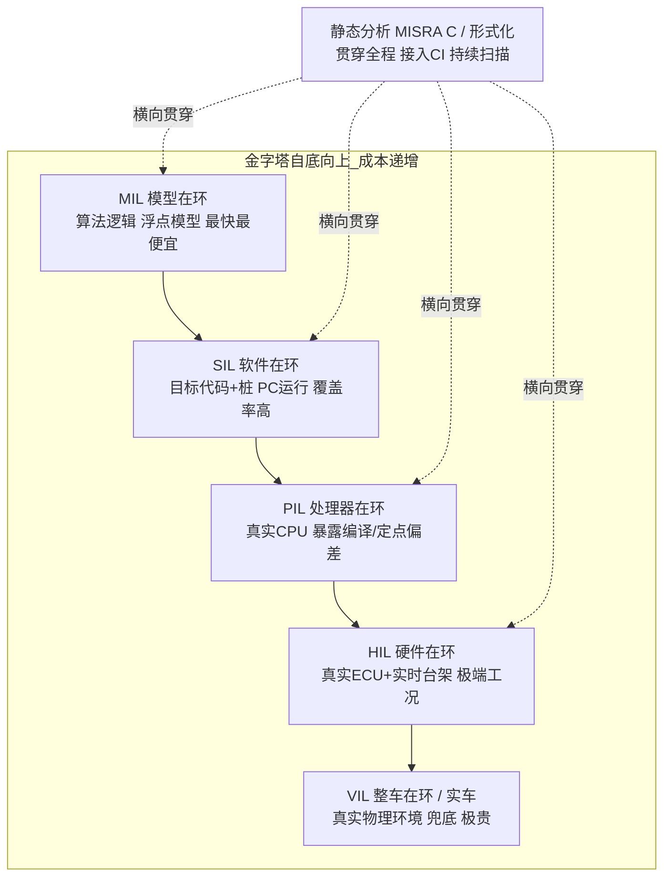
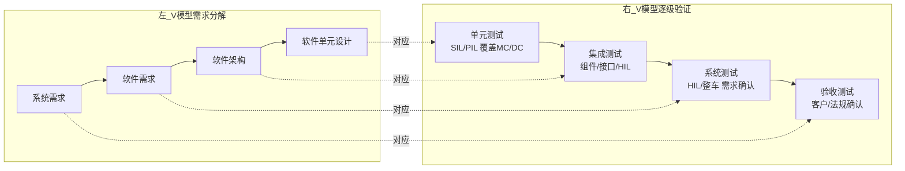
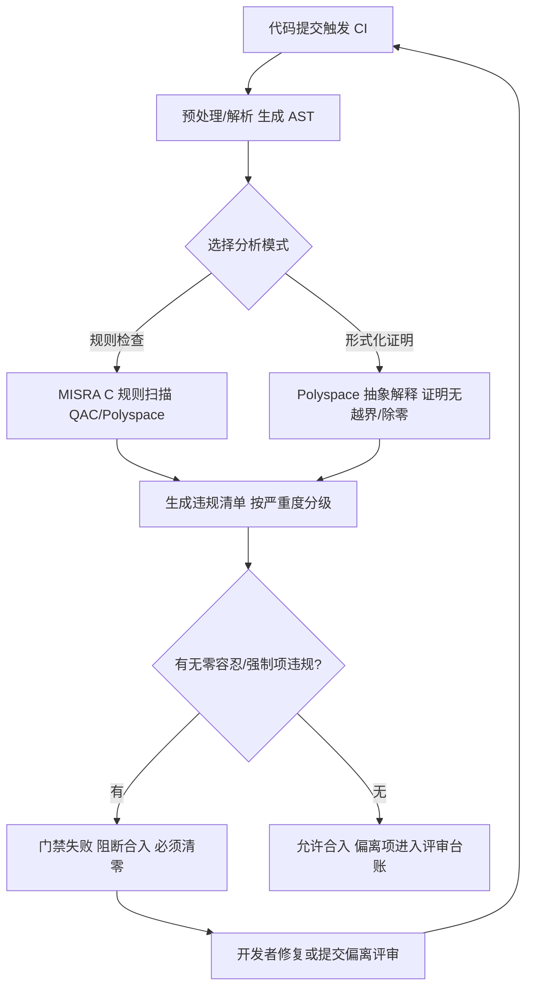
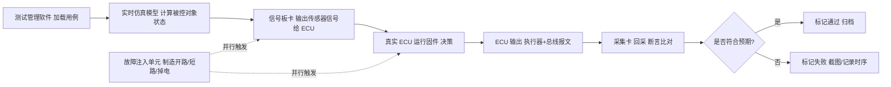
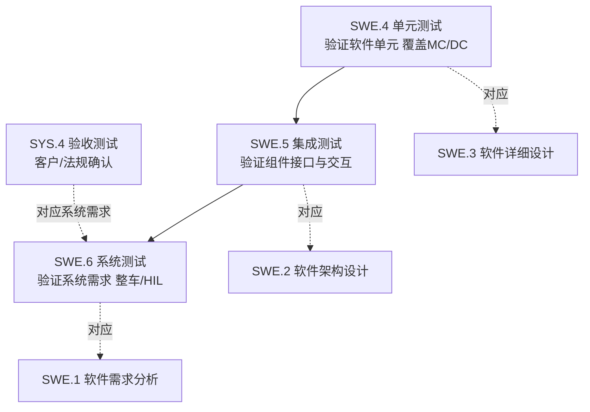
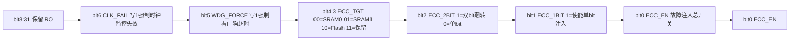
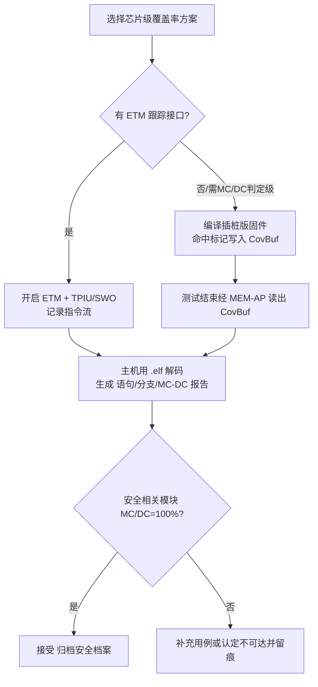
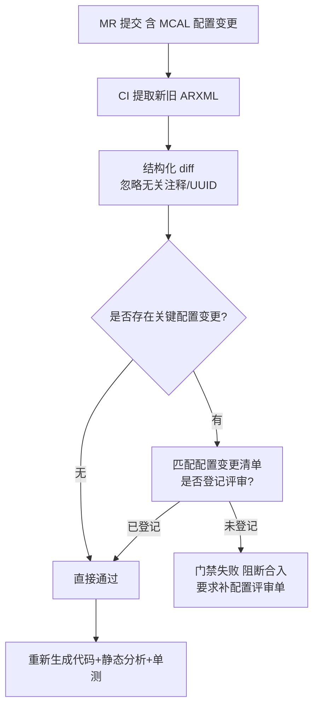
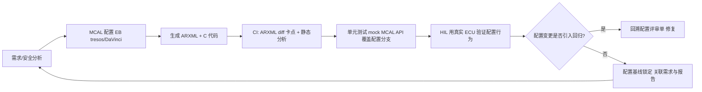

# 第十六章 嵌入式测试策略与持续集成：从单元测试到 HIL、从 MCAL 到芯片的全链路质量保障

> 本章面向汽车电子、工业控制与对安全性要求严苛的嵌入式软件领域，系统阐述一套可落地的测试验证与持续集成（CI）方法论。笔者将以"测试金字塔"为骨架，逐层拆解 MIL、SIL、PIL、HIL、VIL 各层级的技术定位与成本权衡；深入单元测试、测试替身、覆盖率（含 MC/DC）、静态分析（MISRA C 与形式化证明）、硬件在环与故障注入、CI 流水线门禁设计，以及 ASPICE 对测试过程的工程化要求。在此基础上，笔者进一步把视角下沉到芯片与 MCAL 层——新增三大核心章节：**芯片模块设计（IP 内部架构）的测试可观测性、驱动代码的单元测试与故障注入实战、MCAL 配置的测试验证闭环**，真正回答"测试如何落到芯片与 MCAL"这一工业级命题。章末给出 18 道以上高频面试题与要点解析。

---

## 一、背景与一个真实场景：凌晨三点的"偶发丢帧"

在笔者参与过的某电池管理系统（BMS）量产前夕，整车厂的测试台架上出现了一个令人头疼的现象：电池包在低温仓里静置约 40 分钟后，偶尔（大约每千次循环出现 1 次）漏报一帧单体电压报文，整车人机界面（HMI）上的荷电状态（SOC）会跳变一格后又恢复正常。现场工程师反复复现了上百次都没能稳定抓住问题，日志里仅有孤零零的一句 `"Coulomb Counter overflow"`（库仑计溢出）。

当时的处境非常典型：如果只依赖"烧进板子、接上整车、人工点检"的传统验证方式，这类缺陷几乎必然带着隐患过线——它不是必然复现的逻辑错误，而是依赖特定时序、特定温度、特定总线竞争状态的"偶发竞态"。人工测试既无法构造这种精确的时间组合，也无法在量产前的有限窗口内重复上千次。

事后，团队把该场景搬到了 HIL（Hardware-in-the-Loop，硬件在环）台架：用故障注入手段把低温下某个 NTC 温度采样通道人为拉偏，同时制造一次 CAN 总线仲裁冲突，再配合静态分析工具对中断服务程序（ISR）做 MISRA C 扫描。最终定位到一段位于临界区中、读取共享计数器的代码——它绕过了关中断保护，在极低概率下被更高优先级的任务打断，导致计数器读取值被破坏。

这个案例揭示了一个核心命题：**测试验证体系存在的根本意义，是把"偶发的、依赖环境的、人工不可复现"的缺陷，转化为"可构造、可重复、可量化"的回归用例。** 对于汽车电子而言，这绝不是工程洁癖，而是 ISO 26262 对"诊断覆盖率（Diagnostic Coverage, DC）"和"需求可追溯性（Traceability）"的硬性法律级要求。一个未被充分验证的安全相关判定，在法规审核面前就是不可接受的放行。

更进一步地说，这类缺陷往往根植于芯片与外设交互的最底层：临界区保护依赖正确的中断优先级配置（来自 MCAL/OS 配置），计数器被破坏的本质是"测试从未落到芯片的寄存器访问时序层面"。这也正是本章后面三章要专门解决的问题——**只有把测试能力一路下沉到芯片调试接口、寄存器位域与 MCAL 配置，才能在真正源头堵住这类缺陷**。

---

## 二、测试金字塔与 V 模型：分层验证的认知框架

汽车电子与航空电子普遍遵循"V 模型"软件生命周期：左侧是需求逐级分解（系统需求 → 软件需求 → 软件架构 → 软件单元），右侧是逐级验证与确认（单元测试 → 集成测试 → 系统测试 → 验收测试）。在 V 模型的右半侧，从底层软件工程师的视角看，测试层级自下而上大致构成一座"测试金字塔"。

与传统的纯软件测试金字塔（单元/集成/端到端）不同，嵌入式系统的金字塔因为"软件必须最终运行在真实芯片与真实物理环境"这一约束，演化出一组以"在环（In-the-Loop）"命名的层级。下表给出各层级的工程定位与成本特征。

### 2.1 测试金字塔层级表

| 层级 | 英文/缩写 | 运行环境 | 主要被测对象 | 典型工具 | 单次执行成本 | 缺陷检出性价比 |
|------|-----------|----------|--------------|----------|--------------|----------------|
| 模型在环 | MIL (Model-in-the-Loop) | PC（算法模型，如 Simulink/Stateflow） | 控制算法逻辑本身 | MATLAB/Simulink, TargetLink | 极低 | 验证逻辑正确性，性价比最高 |
| 软件在环 | SIL (Software-in-the-Loop) | PC（编译后的目标代码，脱离真实硬件） | 生成的/手写的 C 代码语义 | Simulink SIL, 自定义桩框架 | 低 | 验证"代码=模型"，性价比高 |
| 处理器在环 | PIL (Processor-in-the-Loop) | 目标处理器（通过指令集仿真或真实芯片） | 代码在真实 CPU 上的数值行为 | Embedded Coder PIL, 芯片 IDE | 中 | 发现编译器/定点化偏差 |
| 硬件在环 | HIL (Hardware-in-the-Loop) | 真实 ECU + 实时仿真台架 | ECU 集成行为与故障响应 | dSPACE, National Instruments, Vector | 高 | 覆盖极端/危险工况，性价比中 |
| 整车在环 | VIL (Vehicle-in-the-Loop) | 真实整车 + 仿真交通/环境 | 跨域协同与整车级表现 | 整车台架 + 场景仿真 | 很高 | 兜底验证，性价比低 |
| 实车/道路测试 | Field/Road Test | 真实世界 | 物理环境集成表现 | 路试车队、数采设备 | 极高 | 仅兜底，不可重复、不可控 |

从成本曲线看，越往金字塔底部，用例越多、执行越快、定位越容易、修复越便宜；越往顶部，用例越少、执行越慢、环境越难构造、缺陷定位越困难、修复代价越高。这正是"测试应尽可能左移（Shift-Left）"的工程经济学依据：**缺陷发现得越晚，修复成本呈数量级上升**。据业界普遍引用的经验数据（IBM System Sciences Institute 等研究），一个在单元测试阶段发现的缺陷修复成本，大约是系统测试阶段的十分之一到百分之一；若拖到实车阶段，差距可达数十倍到上百倍。

### 2.2 各层级技术定位详解

- **MIL（模型在环）**：控制算法在 PC 上以浮点/双精度模型形式运行，验证控制逻辑与标定的正确性。底层手写的固件工程师通常不直接写 MIL 模型，但需要理解模型与代码之间的映射关系。MIL 的价值在于快速迭代控制策略，且不需要任何硬件。

- **SIL（软件在环）**：把模型自动生成的 C 代码，或工程师手写的核心算法固件，在 PC 上脱离真实硬件运行，用桩函数（stub）模拟寄存器与外设。SIL 的核心目的是验证"代码语义与模型行为一致"，并可在 PC 上高速跑大量回归用例，对覆盖率统计极为友好。对底层软件而言，SIL 是单元测试与集成测试的主战场——本章第九、十章的驱动代码单元测试，本质上就是运行在 SIL 层面的活动。

- **PIL（处理器在环）**：将编译后的目标代码下载到真实目标处理器（或通过指令集仿真器）执行，输入来自 PC 端仿真。PIL 能暴露 SIL 发现不了的问题：编译器优化引入的偏差、定点化/定标（scaling）误差、目标芯片 FPU/整数运算差异。对于功能安全等级高的项目，PIL 是闭环数值验证的重要一环。

- **HIL（硬件在环）**：真实 ECU 接入实时仿真台架，台架用实时处理器（如 dSPACE SCALEXIO、NI PXIe）模拟传感器信号、负载、执行器与整车网络（CAN/LIN/FlexRay/Ethernet）。HIL 的最大价值在于**可重复、可批量地覆盖极端与危险工况**（如 −40℃ 冷启动、高压短路、CAN 总线短路、传感器开路），这些工况在实车上既危险又无法批量重复。

- **VIL（整车在环）**：把真实整车置于仿真交通与环境中（如驾驶模拟器 + 整车台架），验证跨域协同（如动力域与智驾域的交互）。成本极高，通常只在旗舰项目或法规强制场景下使用。

- **实车/道路测试**：在真实物理世界验证集成表现，但成本高、不可控、不可重复，只能作为最后兜底。

### 2.3 测试金字塔与 V 模型可视化





---

## 三、单元测试：框架、测试替身与可测性设计

单元测试是测试金字塔最底层的基石，目标是针对函数、模块或组件，验证其在隔离环境下的行为正确性。在嵌入式场景下，单元测试面临一个核心矛盾：**被测代码天然依赖硬件寄存器、中断、外设与实时调度，而这些在普通 PC 上并不存在**。因此，单元测试工程的一半工作量不在于"写断言"，而在于"构造可测的环境"。本章第十章会进一步把这一矛盾下沉到寄存器级的测试替身。

### 3.1 主流单元测试框架

嵌入式 C 语言生态中，三个被广泛采用的框架是 **Unity**、**CppUTest** 与 **GoogleTest**，它们分别适配不同的工程形态：

- **Unity**：由 ThrowTheSwitch 组织维护，是一个纯 C 的、极简的单元测试框架，单头文件 `unity.h` + 源文件 `unity.c` 即可集成，对资源受限的嵌入式目标极其友好。它提供 `TEST_ASSERT_TRUE`、`TEST_ASSERT_EQUAL_INT`、`TEST_ASSERT_FLOAT_WITHIN` 等丰富的断言宏，并支持用 `ruby` 生成的 `runner` 自动组织测试用例。Unity 与 Ceedling 构建系统天然配合。

- **CppUTest**：同样源自 ThrowTheSwitch，面向 C/C++，强调内存泄漏检测与"测试驱动开发（TDD）"体验，内置 `MemoryLeakDetector`，非常适合在没有操作系统的裸机（bare-metal）环境中做模块级测试。

- **GoogleTest**：由 Google 维护，断言体系完善（`EXPECT_EQ`、`ASSERT_TRUE`、`EXPECT_NEAR` 等），配合 GoogleMock 可做复杂的测试替身，适合运行在 Linux 上的嵌入式应用层组件、中间件或模拟环境下的算法模块。对 C 代码可通过 `extern "C"` 包裹头文件纳入 GoogleTest 测试工程。

下面是一个用 Unity 风格编写的函数级单元测试示例，被测函数根据单体压差与最高温度决定是否开启被动均衡：

```c
/* 被测函数：根据压差与温度决定是否开启被动均衡 */
bool Balancing_ShouldStart(uint16_t cellDelta_mV, int16_t maxTemp_degC)
{
    if (cellDelta_mV < BALANCE_THRESHOLD_MV)   /* 压差不足不开 */
        return false;
    if (maxTemp_degC > BALANCE_MAX_TEMP_DEG)   /* 过温保护不开 */
        return false;
    return true;
}

/* 单元测试片段（Unity 风格，运行于 SIL/PC） */
void test_Balancing_ShouldStart_boundary(void)
{
    /* 边界1：压差等于0，应关闭 */
    TEST_ASSERT_FALSE(Balancing_ShouldStart(0, 25));
    /* 边界2：过温，应关闭 */
    TEST_ASSERT_FALSE(Balancing_ShouldStart(30, 60));
    /* 边界3：刚过阈值且温度正常，应开启 */
    TEST_ASSERT_TRUE (Balancing_ShouldStart(BALANCE_THRESHOLD_MV + 1U, 25));
    /* 边界4：压差很大但温度刚好越限，应关闭（验证第二个判定独立作用） */
    TEST_ASSERT_FALSE(Balancing_ShouldStart(100, BALANCE_MAX_TEMP_DEG + 1));
}
```

### 3.2 测试替身：mock / stub / fake / spy 的辨析

为了让被测模块脱离真实硬件运行，必须使用"测试替身（Test Double）"。业界常混淆这几个术语，笔者给出在嵌入式语境下清晰的区别：

- **桩函数（Stub）**：提供预设的、固定的返回值，目的是让被测函数能跑通。例如把 `ADC_Read(channel)` 桩成永远返回 `0x7FF`，用于测试正常路径。
- **模拟对象（Mock）**：不仅提供返回值，还**验证交互行为**——断言某函数是否被以特定参数调用了特定次数。例如验证 `CAN_Send(frame)` 是否在被测逻辑触发后恰好被调用一次。GoogleMock 是典型的 mock 框架。
- **伪实现（Fake）**：一个功能上"可用但简化"的实现，例如用一个内存数组伪实现一个环形缓冲区驱动，比真实硬件驱动简单但行为正确。
- **间谍（Spy）**：记录被测代码对外部的依赖调用（调用了谁、传了什么值），用于事后断言，但不强制规定交互形态。

下面给出一个用 C 语言模拟"mock/spy"行为的简化示例（在没有 GoogleMock 的纯 C 环境下，手动实现调用记录）：

```c
/* 全局间谍：记录 CAN 发送调用情况 */
static int   g_canSend_callCount = 0;
static uint8_t g_canSend_lastId  = 0;

/* 被测模块依赖的发送接口 —— 在测试中被替换为间谍实现 */
void CAN_Send_Real(uint8_t id, const uint8_t* data, uint8_t len);

/* 测试替身（spy 版） */
void CAN_Send_Spy(uint8_t id, const uint8_t* data, uint8_t len)
{
    g_canSend_callCount++;
    g_canSend_lastId = id;
    (void)data; (void)len;
}

/* 测试：当均衡开启时应发出诊断报文 */
void test_Balancing_emitsDiag(void)
{
    g_canSend_callCount = 0;
    /* 把 CAN_Send 重定向到间谍（通过函数指针或链接时替换） */
    diag_onBalanceStart();
    TEST_ASSERT_EQUAL_INT(1, g_canSend_callCount);
    TEST_ASSERT_EQUAL_INT(DIAG_ID_BALANCE, g_canSend_lastId);
}
```

### 3.3 打桩技术与编译/链接策略

在 C 工程中，把"真实硬件依赖"替换为"测试替身"，常见三种技术路线：

1. **预处理宏替换**：用 `#ifdef UNIT_TEST` 包裹真实硬件调用，测试时切换为桩实现。简单但会污染生产代码，不推荐大规模使用。
2. **链接时替换（Link-Time Substitution）**：在单元测试构建中，不链接真实的 `adc.c`/`can.c`，而是链接 `adc_stub.c`/`can_stub.c`。这是最干净、最常用的方式，要求生产代码的模块依赖通过清晰的函数接口暴露。
3. **函数指针注入（Dependency Injection via Function Pointer）**：在模块初始化时传入依赖的接口指针，测试时注入替身。这是更接近"依赖注入"思想、可测性最好的设计，但对生产代码侵入性也最强。

### 3.4 可测性设计（Design for Testability, DfT）

可测性不是测试阶段才考虑的事，而必须在架构与编码阶段就内建。笔者总结几条嵌入式可测性设计准则：

- **依赖外置**：把对硬件寄存器、RTOS API、全局状态的依赖抽象成可替换的接口，而非在被测函数内部直接调用。
- **单一职责**：函数尽量只做一件事、有清晰的输入/输出，避免"读硬件 + 运算 + 写硬件"耦合在一起，否则无法在 SIL 隔离测试。
- **避免隐藏的全局状态**：全局标志位、静态变量会让测试之间产生隐式耦合，导致用例顺序敏感。测试前后必须显式 `reset`。
- **关键逻辑与 IO 分离**：把"决策算法"（纯函数、可测）与"硬件读写"（不可测、需桩）分离，让 MC/DC 覆盖率集中在可测的算法上。
- **可观测性**：为关键中间状态提供只读访问接口或测试钩子，方便断言内部行为而非只能看最终输出。

### 3.5 测试用例设计方法：等价类、边界值与决策表

写出"能跑的断言"只是测试的第一步，写出"有效的用例"才是质量保障的关键。笔者在项目中长期坚持四套黑盒/白盒结合的用例设计技术：

- **等价类划分（Equivalence Partitioning）**：把输入域划分为若干"等价"区间，每个区间只需取一个代表值。例如 ADC 采样值 `0–4095`（12 位），可划分"正常量程（0–4095）"与"超量程（>4095）"。对正常量程只需取一个中点值，对超量程必须有负面用例。
- **边界值分析（Boundary Value Analysis）**：错误最易发生在边界。对每个区间取"刚好在界内、刚好在界外、边界点"三值。例如阈值 `BALANCE_THRESHOLD_MV=30`，应测 `29/30/31` 三点，而非随意取一个中间值。
- **决策表（Decision Table）**：当判定由多个条件组合驱动时，用决策表穷举条件组合并推导预期动作，保证组合完整性。例如"是否过温 + 是否通信正常 + 电压是否在窗口 → 允许/禁止充电 + 是否报 DTC"。
- **状态转换测试（State Transition）**：针对状态机（如充电状态机：初始化→预充→恒流→恒压→截止），验证每个事件在每状态下触发正确的迁移与动作，并覆盖非法事件（如截止态收到"启动"应被忽略或拒绝）。

下面是用决策表思想组织的一个充电允许逻辑测试片段：

```c
/* 决策表：允许充电 = 未过温 AND 通信正常 AND 电压在窗口内 */
typedef struct { bool overTemp; bool commOk; bool voltInWin; bool expect; } Case_t;
static const Case_t cases[] = {
    {false, true,  true,  true },  /* 正常：允许 */
    {true,  true,  true,  false},  /* 过温：禁止 */
    {false, false, true,  false},  /* 通信丢失：禁止 */
    {false, true,  false, false},  /* 电压越窗：禁止 */
    {true,  false, false, false},  /* 全异常：禁止 */
};
void test_ChargeAllow_decisionTable(void)
{
    for (int i = 0; i < (int)(sizeof(cases)/sizeof(cases[0])); i++)
        TEST_ASSERT_EQUAL(cases[i].expect,
            Charge_Allow(cases[i].overTemp, cases[i].commOk, cases[i].voltInWin));
}
```

### 3.6 测试执行环境与构建系统（以 Ceedling 为例）

在裸机 C 工程中，手写测试构建脚本容易出错且难以维护。业界常用 **Ceedling**（基于 Ruby 的构建系统，天生集成 Unity 与 CppUTest、CMock）来自动化测试生命周期。它约定 `src/`（生产代码）、`test/`（测试代码）、`test/support/`（测试替身与桩），通过 `rake test:all` 一键完成"编译→链接替身→执行→生成覆盖率报告"。

Ceedling 的价值在于：第一，自动为每个被测模块生成测试 runner，开发者只需写 `test_xxx.c`；第二，配合 CMock 可基于头文件**自动生成 mock 函数**，极大降低测试替身的人工成本；第三，原生支持 gcov 覆盖率输出。在 CI 中，通常以 `ceedling gcov:all` 产出覆盖率数据再交由门禁校验。对于没有 Ruby 环境的团队，也可用 CMake + CTest 组织类似结构，核心是"测试构建与生产构建严格分离、替身可链接替换"这一设计原则不变。

---

## 四、覆盖率：语句、分支与 MC/DC

覆盖率是量化"测试充分性"的核心指标。但必须清醒：**覆盖率高不等于没有 bug**，它只说明"哪些代码被跑过"，不说明"跑出来的结果对不对"。然而在功能安全语境下，覆盖率是合规的硬性门槛——审核员要看的是"每个安全相关判定都被充分验证过"。

### 4.1 覆盖率类型对比表

| 覆盖率类型 | 英文 | 衡量维度 | 要求用例规模 | 适用标准/场景 | 局限性 |
|------------|------|----------|--------------|---------------|--------|
| 语句覆盖 | Statement Coverage | 每一行可执行语句是否被执行 | 最少 | 通用软件最低要求 | 不保证分支都走到，易掩盖逻辑错误 |
| 分支/判定覆盖 | Branch/Decision Coverage | 每个判定的真假两分支是否都执行 | 中等 | 一般高可靠软件 | 未验证"每个条件"独立作用 |
| 条件覆盖 | Condition Coverage | 每个子条件的真假都出现 | 中等 | 补充分支覆盖 | 不保证条件组合有意义 |
| 修正条件/判定覆盖 | MC/DC | 每个条件能独立影响判定结果 | 较多（近最小集） | DO-178C Level A、ISO 26262 ASIL C/D | 用例设计复杂，需结构化推导 |
| 函数覆盖 | Function Coverage | 每个函数是否被调用 | 最少 | 冒烟级 | 最弱，仅确认未死代码 |
| 调用覆盖 | Call Coverage | 函数间调用关系是否执行 | 少 | 集成测试 | 不深入函数内部逻辑 |

### 4.2 MC/DC 深度解析

**MC/DC（Modified Condition/Decision Coverage，修正条件判定覆盖）** 是航空电子 DO-178C（Level A 软件）与汽车电子 ISO 26262（ASIL C/D）强制要求的覆盖率准则。其核心定义是：对于一个复合判定（由多个布尔条件通过 `&&`、`||` 组合而成），要满足 MC/DC，必须做到：

1. 每个条件的取值（真/假）都出现过；
2. 每个判定本身的取值（真/假）都出现过；
3. **对于每一个条件，都能找到一组用例，使得"仅改变该条件的值，就能改变整个判定的结果"**——即该条件"独立"地影响了判定输出。

这正是 MC/DC 比普通分支覆盖更难、也更有价值的地方：它用接近最小的用例集，证明了"每一个安全相关条件都确实在起作用"，而不是仅仅把 `if` 的两个分支都跑了一遍（那样可能掩盖某个条件其实从未真正参与决策）。

举例：判定 `D = A && B && C`。对条件 `A` 做 MC/DC 独立影响验证，需要两组用例：`(A=1,B=1,C=1) → D=1` 与 `(A=0,B=1,C=1) → D=0`。这里 B、C 保持不变为真，仅 A 翻转就翻转了 D，证明 A 独立有效。对 B、C 同理。MC/DC 的结构化用例设计往往借助真值表或专门工具（如需求管理工具配合覆盖率分析器）自动推导最小用例集。

需要强调的是，MC/DC 不仅适用于 PC 上的 SIL 代码，也适用于芯片层的执行路径。当安全逻辑被编译进真实 MCU、并通过 ETM 跟踪或软件插桩在目标上收集决策覆盖时，同样需要满足 MC/DC 独立性要求——这一点在第九章"芯片层面覆盖率"中详述。

### 4.3 覆盖率在工具链中的落地

在实践中，覆盖率统计通常由编译器插桩（如 GCC 的 `-fprofile-arcs -ftest-coverage` 生成 `.gcda`/`.gcno`，再经 `gcov`/`lcov` 分析）或专用工具（如 VectorCAST、Cantata、BullseyeCoverage）完成。BullseyeCoverage 的一大优势是原生支持 C/C++ 的 MC/DC（决策覆盖）统计，无需依赖特定编译器。下面是一个基于 GCC + lcov 的覆盖率配置示例（CMake 片段）：

```cmake
# 单元测试构建开启覆盖率插桩（仅测试构建，不污染生产二进制）
option(ENABLE_COVERAGE "Enable gcov coverage for unit tests" OFF)
if(ENABLE_COVERAGE)
    target_compile_options(my_unit_tests PRIVATE
        --coverage            # 等价于 -fprofile-arcs -ftest-coverage
        -O0                   # 关优化，保证插桩准确
        -g                    # 保留调试符号
    )
    target_link_options(my_unit_tests PRIVATE --coverage)
endif()

# CI 中典型执行流程：
# ./build/my_unit_tests            # 运行，生成 .gcda
# lcov --capture --directory . --output-file coverage.info
# lcov --remove coverage.info '/usr/*' --output-file coverage.filtered
# genhtml coverage.filtered --output-directory coverage_report
```

配合门禁，可以强制要求 MC/DC 覆盖率达到例如 ASIL D 要求的 100%（对所有安全相关单元），或至少语句/分支覆盖率达到团队约定阈值（如语句 ≥95%、分支 ≥90%，安全相关模块 100%）。

### 4.4 覆盖率的常见误区

覆盖率是手段而非目的，团队常陷入以下误区：

1. **高覆盖率等于高质量**：覆盖只证明"代码被执行"，不证明"结果正确"。一个把返回值写反的 `if`，照样能拿到 100% 分支覆盖。覆盖必须与基于需求的断言结合才有意义。
2. **只追语句覆盖**：语句覆盖最容易刷高，但完全可能漏掉关键分支。ASIL 项目若只做语句覆盖，在审核时会直接被质疑充分性。
3. **为覆盖而覆盖（构造无意义用例）**：为了让某行被执行而传入永不出现的非法输入，既增加维护成本又掩盖了真实场景缺口。用例必须来自真实需求与等价类，而非"为了让数字好看"。
4. **忽略不可达代码的认定**：编译器优化可能删除"逻辑上可达但经分析实际不可达"的分支，导致覆盖率工具报"未覆盖"。这类应经静态分析/形式化证明认定为不可达，并在报告中备案，而非强行构造不可能触发的用例。
5. **插桩本身影响行为**：开启 gcov 插桩会改变代码时序与体积，对极致实时性的中断路径，插桩覆盖率与无插桩实际运行可能存在差异，必要时应辅以不插桩的 HIL 行为验证或芯片级跟踪。

### 4.5 达成高 MC/DC 的实战策略

在 ASIL C/D 项目中，把安全相关单元的 MC/DC 推到 100% 是硬任务，笔者经验如下：

- **拆分复杂判定**：把 `if ((a && b) || (c && d))` 这类深层嵌套改写为多个带中间变量的简单判定，既提升可读性，也降低 MC/DC 用例推导难度，并便于单独验证每个子条件。
- **借助工具推导最小用例集**：用需求/测试管理工具或覆盖率分析器（如 VectorCAST、Cantata、BullseyeCoverage）从判定结构自动生成满足 MC/DC 的基准用例，再人工补充边界与负面用例。
- **先做需求覆盖、再做结构覆盖**：先保证每条需求都有对应测试用例（需求覆盖率 100%），再做 MC/DC 结构覆盖，二者互补——需求覆盖防"漏测功能"，结构覆盖防"漏测分支"。
- **对偏离与不可达项留痕**：确实无法达成 MC/DC 的分支（如防御性编程的 `default` 分支），须由静态分析或同行评审认定为不可达/防御性，并在安全档案（Safety Case）中记录，接受审核追溯。

---

## 五、静态分析：MISRA C、形式化证明与工具集成

动态测试（跑用例）只能验证"被执行到的路径"，而静态分析（Static Analysis）能在**不执行代码**的情况下，扫描全部代码路径，发现未定义行为、危险构造与安全隐患。在嵌入式 C 领域，静态分析是功能安全合规的"第一道闸门"。

### 5.1 MISRA C 规则集

**MISRA C** 是由英国汽车工业软件可靠性协会（MISRA）发布的 C 语言编程规范，旨在消除 C 语言中大量"未定义行为（Undefined Behavior）"与"实现定义行为（Implementation-Defined Behavior）"。主流版本包括 MISRA C:2004、MISRA C:2012（含 Amendment 1/2/3，覆盖 C99/C11）以及面向 C++ 的 MISRA C++。MISRA C:2023 进一步与 C11/C18 对齐。MISRA 规则分为：

- **强制（Required）**：默认必须遵守，违规必须给出经评审的偏离（Deviation）理由。
- **必要（Mandatory）**：绝对不可违反，无偏离余地。
- **建议（Advisory）**：推荐遵守，可酌情偏离。

MISRA C 抓的典型问题包括：

- **未初始化变量**：声明后未赋值即使用，值是不可预测的垃圾。
- **数组越界与指针算术越界**：缓冲区溢出是嵌入式最常见的安全缺陷之一。
- **危险类型转换**：如把 `int` 强制转换为指针、有符号/无符号混用导致的回绕。
- **位域与位宽截断**：用 `char`/`short` 存 32 位标志位，跨位访问被截断——这正是笔者早年修复过一个 RTOS 报文抖动缺陷的根因。
- **与硬件寄存器交互必须用 `volatile` 限定**：否则编译器优化可能"吃掉"看似无副作用的读写，导致寄存器访问丢失。

```c
/* 反例：8 位变量存 32 位中断标志，跨位访问被截断，且未加 volatile 易被优化 */
uint8_t g_intFlags;        /* 危险！ */

/* 正例：匹配位宽 + volatile，禁止编译器优化掉寄存器访问 */
volatile uint32_t g_intFlags;
#define FLAG_CAN_RX   (1u << 0)
#define FLAG_SPI_DONE (1u << 1)

/* 读取时必须用临时变量快照，避免多次读产生竞态 */
uint32_t flags = g_intFlags;   /* 快照 */
if (flags & FLAG_CAN_RX) { /* ... */ }
```

### 5.2 形式化证明：Polyspace

普通的静态分析工具（如规则检查器）只能报告"可能存在的"缺陷，存在大量误报（false positive）。而 **Polyspace**（MathWorks 出品）采用**抽象解释（Abstract Interpretation）**这一形式化方法，能够在数学意义上**证明**某些缺陷"不存在"——例如证明某个数组索引永远在边界内、某个除法永远不会出现除零、某段指针永远不为空。Polyspace 把每条代码路径标注为：绿色（已证明无缺陷）、红色（已证明有缺陷）、橙色（无法证明、需人工复核）、灰色（不可达代码）。这种"证明"能力在 DO-178C / ISO 26262 的高安全等级项目中极具说服力。Polyspace 有 Bug Finder（查找缺陷）与 Code Prover（证明无运行时错误）两个互补产品，后者即前述"证明不存在"的核心。

### 5.3 其他静态分析工具：QAC 等

- **QAC（QA-C）**：由 Perforce（原 Programming Research）出品，是汽车与航空领域另一主流 MISRA C/C++ 合规检查器，规则库齐全、与 CI 集成成熟，支持 MISRA C:2012/C:2023 与 CERT C。
- **Cppcheck**：开源静态分析器，适合作为轻量级第一道扫描。
- **Clang-Tidy / SonarQube**：通用 C/C++ 静态分析与技术债务管理平台。
- **Coverity / Klocwork**：商业级深度静态分析，适合大型代码库。

### 5.4 静态分析接入 CI 的流程

静态分析绝不能"跑一次就完"，而必须接入 CI，做到**每次提交都扫描、违规按严重度分级、零容忍项必须清零**。对 MISRA 偏离（Deviation）的处理必须严格：任何偏离都要在代码中以标准格式记录，并经过第二人评审，严禁无理由地用 `/* MISRA bypass */` 之类的注释掩盖风险。



### 5.5 MISRA 典型规则示例与代码对照

理解 MISRA 不能只停留在"要守规矩"，而要落到具体规则号与代码。以下列出几条在汽车嵌入式中最常被触发、也最容易被忽视的规则（以 MISRA C:2012 为例）：

- **Rule 11.3**：不应在指针类型之间进行可能导致错误对齐或违反类型规则的转换（如把 `int*` 强转为 `float*`）。这类转换在严格对齐的 MCU 上会触发硬件异常。
- **Rule 10.1 / 10.4**：不应在不同符号性或宽度的基础类型之间做隐式危险转换。例如把有符号 `int` 赋给无符号 `uint16_t` 时若源为负，会产生回绕（wrap-around），引发电量计算错乱。
- **Rule 8.9**：如果对象仅在单一函数内使用，不应声明为文件作用域（全局）变量。这直接对应可测性设计中"避免隐藏全局状态"的原则。
- **Rule 17.4**：数组索引表达式只能是常量、变量或 `sizeof` 表达式，禁止使用指针算术随意偏移，从源头抑制越界。
- **Rule 21.1 / 21.2**：不得 `#undef` 或 `#define` 标准库/语言关键字宏（如重定义 `NULL`），避免破坏语言语义。

```c
/* 反例：危险隐式转换 + 全局状态（违反 Rule 10.1 / 8.9） */
int16_t g_rawTemp;                 /* 全局，仅被一处使用 */
uint16_t scaleTemp(int16_t x) {
    return x * 10;                 /* 若 x 为负，返回转成无符号会回绕 */
}
/* 正例：局部化 + 显式限定 + 明确范围检查 */
static int16_t s_clamp(int16_t x, int16_t lo, int16_t hi) {
    return (x < lo) ? lo : (x > hi) ? hi : x;
}
uint16_t scaleTempSafe(int16_t raw) {
    int16_t v = s_clamp(raw, -400, 850);   /* 限定物理范围 -40.0~85.0℃ */
    return (uint16_t)(v + 400) * 10u;      /* 平移到非负域再定点化 */
}
```

### 5.6 误报与偏离（Deviation）管理

静态分析工具尤其是规则检查类，难免产生**误报（false positive）**——例如某些对 volatile 寄存器的位操作会被误判为"未使用返回值"。对此必须建立严格的偏离流程，而非简单注释屏蔽：

1. **记录偏离申请**：在代码中以标准格式注释（如 `/* PRQA S 1234 */` 或 MISRA 偏离块），说明规则号、偏离原因、影响范围、申请人。
2. **同行评审**：偏离必须由第二人（通常是技术负责人或功能安全经理）评审并签字，确保不是"为了清零而绕过"。
3. **纳入安全档案**：所有偏离汇总进偏离报告（Deviation Report），作为安全档案的一部分供审核员追溯。
4. **定期复审**：每次基线升级或编译器变更时，重新评估历史偏离是否仍然必要，防止技术债累积。

形式化工具（Polyspace）的优势在此凸显：它把"可能缺陷"细分为绿/红/橙/灰，红色是已证明的缺陷必须修，橙色是未证明的需人工复核，这比纯规则检查器的"疑似清单"更容易做出客观的偏离决策。

---

## 六、HIL 硬件在环：自动化测试、故障注入与在环标定

当单元测试与集成测试在 SIL/PIL 层面验证了代码逻辑后，**HIL 是把真实 ECU 放进"虚拟整车"里做端到端验证的关键一环**。HIL 台架由实时处理器、信号调理板卡、故障注入单元、总线接口（CAN/LIN/FlexRay/Automotive Ethernet）与上位机测试管理软件组成。

### 6.1 HIL 自动化测试

HIL 的核心优势是**可重复、可批量、可覆盖危险工况**。典型�� HIL 自动化测试流程（以 dSPACE ControlDesk / AutomationDesk 或 Vector CANoe 为例）：

1. 上位机加载被测 ECU 对应的"车辆/被控对象模型"（如电池包热模型、电机模型）；
2. 自动化脚本按测试用例序列，向 ECU 注入传感器电压/电流/温度信号，并读取 ECU 输出的执行器指令与总线报文；
3. 每个用例断言 ECU 行为是否符合预期（如过温时是否正确进入限功率、短路时是否正确报故障码 DTC）；
4. 结果自动归档，生成覆盖率与通过率报告。

### 6.2 常见故障注入类型表

| 故障类别 | 注入方式 | 典型用例 | 期望观测（安全机制） |
|----------|----------|----------|----------------------|
| 供电故障 | 拉低/中断 ECU 供电、电压跌落 | brown-out 检测 | 进入复位或安全态 |
| 信号故障 | 开路/短电源/短地/漂移 | NTC 开路、旋变短地 | 报 DTC、禁用相关功能 |
| 总线故障 | 错误帧/仲裁冲突/断线 | CAN 注入错误帧 | 总线关闭恢复、DTC |
| 内存故障 | RAM 单/双 bit 翻转 | ECC 双 bit 注入 | 进入安全态，禁止静默失效 |
| 时钟/外设 | 时钟监控失效、ADC 溢出 | CMU 失败 | 切换备用时钟或安全态 |
| 看门狗 | 强制超时 | WDG 不喂狗 | 触发复位并记录标志 |

故障注入是功能安全实证的核心手段。ISO 26262 要求证明"诊断机制确实有效"，而证明的方式就是**主动制造故障，观察系统是否按设计进入安全状态**。例如验证 ECC（错误校正码）机制：向 RAM 注入双 bit 错误，确认系统确实进入安全状态（如关闭功率输出、点亮故障灯）而非静默失效（silent failure）——这才能向审核员证明"诊断覆盖率达标"。



### 6.3 在环标定（Calibration-in-the-Loop）

HIL 也是标定（Calibration）验证的高效平台。通过 XCP/CCP 协议，标定工具（如 ETAS INCA、Vector CANape）可在 HIL 环境中实时修改 ECU 内的标定参数（标定量、查表、曲线），观察控制效果，从而把大量标定验证从实车转移到台架，显著降低成本与周期。

### 6.4 HIL 台架的架构组成

一个完整的 HIL 台架并非"一台电脑连着 ECU"，而是一套分层实时系统：

- **实时处理器（Real-Time Target）**：台架的"心脏"，以固定步长（如 100 µs 或 1 ms）运行被控对象模型（电池包模型、电机模型、整车动力学模型）。主流方案有 dSPACE SCALEXIO、NI VeriStand/PXIe、ETAS LABCAR。其确定性时序是 HIL 可信的前提。
- **IO 与信号调理板卡**：把实时处理器的数字量转换为 ECU 能识别的电压/电流/电阻信号（如模拟 NTC 热敏电阻的分压、模拟旋变/编码器的激励信号），并把 ECU 输出的 PWM/高低边驱动采集回来。
- **故障注入单元（FIU, Fault Injection Unit）**：硬件继电器/电子开关矩阵，可在上位机指令下把某路信号切换为开路、短电源、短地或注入特定故障，是实现 6.2 所述故障注入的物理执行层。
- **总线接口**：CAN/LIN/FlexRay/Automotive Ethernet 接口卡，模拟整车网络节点，注入错误帧、模拟节点丢失。
- **被控对象模型（Plant Model）**：通常来自 MIL 阶段的控制模型，经定点化与实时化移植到台架，是 HIL 仿真精度的关键。模型精度不足会直接削弱测试用例的有效性。

### 6.5 HIL 测试脚本与用例组织

HIL 自动化离不开脚本化的用例管理。以 dSPACE AutomationDesk 或 Vector CANoe 的 CAPL/Test Module 为例，成熟的用例组织方式包括：

- **分层组织**：冒烟用例（每次提交快跑，数十秒级）、功能用例（按需求逐条覆盖）、回归用例（夜间全量）、压力/耐久用例（长时间老化）。
- **时序断言**：不仅断言"最终输出对不对"，还要断言"在多少毫秒内响应"。例如过温保护必须在 `t ≤ 200 ms` 内进入限功率，否则即使结果正确也判失败。
- **数据驱动**：把用例的输入激励与预期输出抽离成数据表（CSV/Excel），脚本按行回放，便于非软件背景的测试工程师维护用例。
- **失败自取证**：失败用例自动保存台架波形（电压/电流/总线时序）与 ECU 内部变量快照，供事后根因分析，避免"只报红不报因"。

---

## 七、CI 流水线设计：触发、阶段门禁与质量卡点

持续集成（Continuous Integration）在嵌入式安全关键软件中，远不止"自动编译"那么简单，而是把**静态分析、单元测试、覆盖率、集成构建、HIL 回归**全部自动化进每一次提交，构筑一道道"质量门禁（Quality Gate）"。

### 7.1 CI 流水线的触发与阶段

一个典型的嵌入式 CI 流水线结构如下：


更细化地，用 GitLab CI 风格的 YAML 表达（示意）：

```yaml
# .gitlab-ci.yml 片段：嵌入式 CI 质量门禁
stages:
  - build
  - static_analysis
  - unit_test
  - integration
  - hil_regression

variables:
  CROSS_COMPILER: "arm-none-eabi-gcc"
  OPT_LEVEL: "-O2"

build_gate:
  stage: build
  script:
    - $CROSS_COMPILER -Wall -Wextra -Werror -O2 -c src/*.c -o build/
  rules:
    - if: '$CI_PIPELINE_SOURCE == "merge_request_event"'

misra_scan:
  stage: static_analysis
  script:
    - qacli scan --project bms.qac --rule misra2012
    - polyspace-bug-finder -lang c -sources src/
    # 零容忍项不清零则退出非零，门禁失败
    - test $(qacli report --critical-count) -eq 0
  allow_failure: false

unit_test_coverage:
  stage: unit_test
  script:
    - cmake -DENABLE_COVERAGE=ON -B build_test
    - cmake --build build_test
    - ./build_test/my_unit_tests
    - lcov --capture --directory build_test --output-file cov.info
    - lcov --summary cov.info   # 断言语句/分支/MC-DC 阈值
  coverage: '/lines:\s+\d+.\d+%/'

hil_regression:
  stage: hil_regression
  script:
    - automationdesk run --profile nightly_hil --report hil_result.xml
  artifacts:
    paths: [hil_result.xml, coverage_report/]
    expire_in: 30 days
```

### 7.2 阶段门禁与质量卡点设计

- **编译门禁**：使用与目标量产**完全一致**的编译器版本、优化等级（`-O2` 等）、警告开关，并开启 `-Werror`（警告即错误）。这是解决"本地能过、CI 不过"环境漂移的根本手段。
- **静态分析门禁**：MISRA 强制/零容忍项违规数必须为零；偏离项进入评审台账；Polyspace 红色（已证明缺陷）必须清零，橙色（无法证明）需人工复核闭环。
- **覆盖率门禁**：非安全相关模块设定下限（如语句 ≥95%），安全相关模块 MC/DC 必须 100% 或经评审说明不可达项。
- **HIL 回归门禁**：夜间回归（nightly）全量用例必须全绿；允许少量已知缺陷用例挂起（waived）但需登记。
- **产物归档**：每次通过的构建产物（二进制、地图文件、覆盖率报告、HIL 报告）必须带版本标签归档，保证 ISO 26262 要求的"可追溯"与"可重建"。

### 7.3 常见 CI 坑与对策

1. **环境漂移**：本地 `-O0`、CI `-O2`，优化把未定义行为暴露成死循环。→ 本地与 CI 用完全相同工具链与开关；`-Werror` 强制。
2. **mock 过度乐观**：桩返回理想值，边界/错误分支从不触发。→ 桩必须能模拟 `0xFFFF`（总线错误）、中断丢失、ADC 溢出等异常。
3. **HIL 模型时序失真**：台架 CAN 帧抖动掩盖中断延迟 bug。→ 关键实时用例用真实示波器/逻辑分析仪交叉验证。
4. **静态分析只看数量不修根因**：为清零加 `/* bypass */` 注释。→ 偏离必须写理由并经第二人评审。
5. **缓存/并行导致假绿**：构建缓存污染、并行用例共享全局状态。→ 测试前后显式 reset，隔离用例状态。

### 7.4 分支策略与门禁矩阵

CI 不是"所有提交都跑同一套重门禁"，而应根据分支与事件类型设计差异化的门禁矩阵，平衡质量与效率：

- **特性分支（feature/*）提交**：跑"快门禁"——编译 + 静态分析零容忍项 + 单元测试（不要求全量覆盖率），秒级到分钟级反馈，避免开发者被重门禁拖慢。
- **合并请求（MR/PR）**：跑"全门禁"——编译（-Werror）+ 完整 MISRA/Polyspace + 单元覆盖率阈值 + 集成构建，全部通过才允许合入主干。这是质量的主防线。
- **主干（main/master）每日夜间**：跑"重门禁"——全量 HIL 回归 + 性能基准 + 长时耐久，结果次日晨会复查。
- **发布标签（release/*，基线）**：跑"认证门禁"——全量测试 + 完整报告归档 + 可追溯性校验，产物锁定为交付基线。

这种分层让"快速反馈"与"严格把关"在不同阶段各司其职，避免在特性分支上无谓消耗 HIL 资源。

### 7.5 制品管理与基线（Artifact & Baseline）

CI 的产出不能只是"流水线绿了"，而必须沉淀为可审计的制品：

- **二进制与符号**：每次通过的构建产出带版本戳的 `.elf`/`.hex`/地图文件，与源码提交号绑定，保证可重建（reproducible build）。
- **报告归档**：静态分析报告、覆盖率报告（含 MC/DC 明细）、HIL 报告统一归档到制品库（如 Nexus、Artifactory 或内部 MinIO），保留期符合项目寿命要求（汽车通常要求 15 年可追溯）。
- **基线锁定**：发布时把"源码版本 + 工具链版本 + 配置 + 全部报告"冻结为一个基线（baseline），任何后续变更都基于新基线，确保 ISO 26262 要求的"配置管理与变更控制"。
- **可追溯链接**：制品元数据记录它对应哪条需求、哪次测试、哪个覆盖率数字，使审核员能从一个故障追溯到对应的验证证据链。

---

## 八、ASPICE 对测试过程的工程化要求

**ASPICE（Automotive SPICE）** 是汽车行业的过程评估模型，基于 ISO/IEC 330xx 与 ISO 15504，定义了从需求到验证的全套过程能力等级（CL1–CL3）。在测试维度，ASPICE 把测试拆解为四个逐级递进的过程，与 V 模型右半侧严格对应：



- **SWE.4 单元测试**：基于软件详细设计，对单元（函数/组件）设计测试用例，覆盖边界、接口与 MC/DC；评估是否达成覆盖率目标；缺陷跟踪与回归。要求测试充分性（如覆盖率）被客观度量。
- **SWE.5 集成测试**：验证软件组件之间、软件与硬件之间的接口与交互，基于软件架构设计，关注集成后的行为正确性。
- **SWE.6 系统测试**：在系统层面验证软件满足系统需求（功能、性能、鲁棒性、安全），通常借助 HIL 与实车。
- **SYS.4 验收测试**：由客户或法规视角确认系统满足约定需求，是交付前的最终确认。

ASPICE 强调**双向可追溯性（Traceability）**：每一条需求都要能追溯到对应的设计、测试用例与测试结果；每一个测试用例也要能追溯到它验证的需求。这正是 CI 产物归档与需求管理工具（如 DOORS、Polarion、Jama）联动的价值所在。达到 ASPICE CL2（已管理）以上，要求测试计划、测试规格、测试结果都受到版本控制与评审，并被审计。

### 8.2 过程能力等级（Capability Level）简述

ASPICE 用能力等级刻画一个过程的成熟度，对测试组织有如下指导意义：

- **CL1（Performed，已执行）**：测试过程被实施，有产出物，但缺乏制度化约束，结果依赖个人能力。
- **CL2（Managed，已管理）**：测试过程在受管理的项目中按计划执行，有测试计划、资源、职责与监控，产出受配置管理。
- **CL3（Established，已建立）**：测试过程基于组织级标准流程（已定义、已裁剪、已培训），用经验数据持续改进。
- 更高等级（CL4/CL5）纳入量化管理与持续优化。多数量产供应商以 CL2–CL3 为目标，意味着"测试不是一次性活动，而是可重复、可度量、可审计的工程过程"——与 CI 门禁的设计哲学完全一致。

### 8.3 双向可追溯的工程实现

可追溯性听起来抽象，落地却很具体。笔者的实践是在需求管理工具与 CI 之间建立"双向链接"：

- **正向（需求→测试）**：每条软件需求在工具中拆出验证方法（单元/集成/HIL），关联到具体测试用例 ID，CI 报告按用例 ID 回填"通过/失败"，使需求覆盖状态自动可见。
- **反向（缺陷→需求→代码）**：每个失败后登记的缺陷，必须绑定到触发它的测试用例、该用例验证的需求、以及对应的代码提交，形成闭环。
- **覆盖率与需求联动**：报告不仅给出"MC/DC 覆盖率 100%"，还要给出"已验证需求数 / 总需求数"，让审核员看到的是"功能被验证"而非仅"代码被执行"。
- **审计视图**：在里程碑节点导出"需求—设计—用例—结果"矩阵，作为功能安全评估（如 TÜV 审核）的核心证据。

---

## 九、芯片模块设计（IP 内部架构）：测试与验证视角

前面各章集中在"软件"层面的验证。但正如第一章那次偶发丢帧所揭示的，许多缺陷根植于软硬件交界——中断优先级、临界区、寄存器访问时序、ECC 与看门狗行为，都无法仅靠应用层单元测试覆盖。本节从"测试如何访问与控制芯片"的视角，给出一套工业级芯片可测性架构。笔者刻意采用**通用 IP 框图与常见实现逻辑的寄存器/位域**，不绑定任何特定厂商型号，以体现通用方法论。

### 9.1 芯片测试访问的总体架构

一颗面向功能安全的 MCU，其内部必然包含一套围绕"可观测、可控制、可注入故障"的测试基础设施。下图给出测试视角下的芯片模块架构框图，它回答了三个关键问题：**测试工具如何连进芯片（调试接口 DAP/SWD/JTAG）、覆盖率和跟踪数据从哪里来（CoreSight）、故障从哪里注入（FIJ）**。

```mermaid
flowchart TB
    subgraph 外部测试访问
        Probe[调试探针 Lauterbach TRACE32 / SEGGER J-Link / PE micro<br/>通过 DAP 访问内核与外设]
        HIL[真实 ECU 接入 HIL 台架<br/>IO仿真板 + 故障注入单元 FIU]
    end

    subgraph 芯片内部_测试视角
        DAP[DAP 调试访问端口<br/>SW-DP/SWD 物理链路 + JTAG-DP]
        CoreSight[CoreSight 跟踪子系统<br/>DWT 数据观测/FPB 断点/ITM 仪器化/ETM 指令跟踪/TPIU 跟踪出口]
        Core[CPU 内核 Cortex-M/R<br/>寄存器/断点/单步/PC采样]
        Bus[系统总线 AHB/APB 互联矩阵]
        MEMAP[MEM-AP 存储访问端口<br/>读外设/内存 注入测试探针]
        DFT[可测试性设计 DFT<br/>MBIST 存储自测 / LBIST 逻辑自测 / 边界扫描 JTAG]
        FIJ[故障注入点 FIJ<br/>ECC / 看门狗 / 时钟监控 / 外设错误]
        Peri[外设 IP ADC/CAN/SPI/WDG/Flash/NVM]
        CovBuf[覆盖率探针与插桩缓冲区<br/>ETM 决策覆盖解码 + 软件插桩 dump]
    end

    Probe -->|SWD: SWCLK+SWDIO 或 JTAG: TCK/TMS/TDI/TDO| DAP
    DAP --> Core
    DAP --> MEMAP
    MEMAP --> Bus
    Bus --> Peri
    Bus --> CoreSight
    Core -->|执行读写| Bus
    CoreSight -->|跟踪流| Probe
    DFT -.扫描链/内建自测.-> Peri
    DFT -.扫描链/内建自测.-> Core
    FIJ ==注入故障==> Peri
    FIJ ==注入故障==> Core
    CovBuf <==覆盖率数据回采== Probe
    HIL -->|真实引脚信号 + 故障| Peri
```

**关键点解析：**

1. **DAP（Debug Access Port）**：ARM CoreSight 架构的入口。DAP 内部包含一个 DP（Debug Port，物理链路侧）和若干 AP（Access Port，总线侧）。DP 可以是 **SW-DP**（Serial Wire Debug，用 `SWCLK` + `SWDIO` 两根线，协议为 SWD）或 **JTAG-DP**（标准 JTAG，用 `TCK/TMS/TDI/TDO`）。DAP 通过 AP（最常用 **MEM-AP**）把调试主机对"地址"的访问翻译为对内部总线（AHB/APB）的读写，因此探针可以无需芯片运行任何代码，直接读写任意外设寄存器、SRAM、Flash——这本身就是一种"硬件级测试桩"。

2. **CoreSight 跟踪子系统**：包含 DWT（Data Watchpoint and Trace，数据观测点与 PC 采样）、FPB（Flash Patch and Breakpoint，断点/补丁）、ITM（Instrumentation Trace Macrocell，软件 `printf` 式跟踪）、ETM（Embedded Trace Macrocell，指令级跟踪）、TPIU（Trace Port Interface Unit，把跟踪流导出到外部）。ETM 是芯片层 MC/DC/覆盖率收集的关键：它能在不停止 CPU 的情况下，记录指令执行流，事后由工具解码出"哪些分支被命中"。

3. **DFT（Design for Testability）**：芯片出厂前与现场开机自检（POST）依靠 **MBIST**（Memory BIST，SRAM/Flash 内建自测）、**LBIST**（Logic BIST，逻辑电路自测）以及 **IEEE 1149.1 边界扫描（Boundary Scan）**——后者通过 JTAG 链条把每个 IO 引脚串入移位寄存器，可在不依赖应用逻辑的情况下验证板级互连是否开路/短路。对测试工程师而言，边界扫描是 HIL 与板级测试之间的重要补充。

4. **FIJ（Fault Injection 点）**：芯片内部通常有专用寄存器（见 9.3）用于在测试/标定模式下主动制造故障：ECC 双 bit 翻转、看门狗超时强制、时钟监控（CMU）失效、外设错误标志置位等。这是 ISO 26262 诊断覆盖率实证在芯片层的物理落点。

5. **CovBuf（覆盖率缓冲区）**：当无法用 ETM 跟踪时，可在目标代码中插入软件覆盖率探针，把"命中标记"写入一片保留 RAM，测试结束后由探针通过 MEM-AP 读出——这把 SIL 上的 gcov 思路搬到了真实芯片。

### 9.2 测试探针如何访问内核/外设/总线

从测试主机（如 Lauterbach TRACE32 脚本、SEGGER J-Link Commander、或 Python `pylink`/`pyocd`）视角，访问芯片不外乎三类操作：

- **内核访问**：通过 DP + CoreSight，读写通用寄存器（R0–R15、xPSR、LR/PC）、设置硬件断点（FPB）、单步执行。可用于停 CPU 后检查中断上下文、验证临界区是否被破坏。
- **外设/内存访问**：通过 MEM-AP 对地址映射的寄存器做读写。例如直接写 `WDG->KR = 0x5555` 解锁序列、读 `ADC->DR` 采样值、改 `CAN->TSR` 发送状态。这相当于在目标上"旁路驱动代码"直接操作硬件，常用于白盒验证驱动与寄存器位域定义是否一致。
- **总线跟踪**：通过 ETM/TPIU 把指令流导出（常走并行 Trace Port 或串行 SWO），由主机端解码。这是芯片级 MC/DC 的主要数据来源。

实践中，这套能力让"单元测试"可以有两种形态并存：在 PC 上用桩的 SIL 单元测；以及在目标上用 MEM-AP 直接读写寄存器、用 ETM 收集覆盖率的 PIL/目标单元测。后者成本高但最真实，适合安全相关核心模块。

### 9.3 调试/测试接口寄存器与故障注入寄存器位域

为了让测试与调试行为可被程序化控制，芯片通常暴露一组调试与故障注入控制寄存器。下面给出一个符合常见实现逻辑的**故障注入控制寄存器（FIJ_CTRL，32 位，偏移 0x40）**的位域示例——它不是某型号的精确副本，但位域组织方式与常见 MCU 的测试/调试寄存器一致：



对应的 C 位域定义（用位域结构 + 掩码宏，二者在嵌入式里都常见，这里给出掩码宏更稳妥，因为位域的位序是编译器实现定义的）：

```c
/* 故障注入控制寄存器 FIJ_CTRL @ 0x40，写1触发，部分位自动清 */
#define FIJ_ECC_EN        (1u << 0)   /* 故障注入总使能 */
#define FIJ_ECC_1BIT      (1u << 1)   /* 单 bit ECC 翻转 */
#define FIJ_ECC_2BIT      (1u << 2)   /* 双 bit ECC 翻转 */
#define FIJ_ECC_TGT_MSK   (3u << 3)   /* 目标 RAM/Flash 选择 */
#define FIJ_ECC_TGT_SRAM0 (0u << 3)
#define FIJ_ECC_TGT_SRAM1 (1u << 3)
#define FIJ_ECC_TGT_FLASH (2u << 3)
#define FIJ_WDG_FORCE     (1u << 5)   /* 强制看门狗超时 */
#define FIJ_CLK_FAIL      (1u << 6)   /* 强制时钟监控失效 */

/* 调试/跟踪控制寄存器 DBG_CTRL @ 0x00 */
#define DBG_EN            (1u << 0)   /* 调试总使能 */
#define DBG_SWD_EN        (1u << 1)   /* 允许 SWD 访问 */
#define DBG_JTAG_EN       (1u << 2)   /* 允许 JTAG 访问 */
#define DBG_ETM_EN        (1u << 3)   /* 允许 ETM 指令跟踪 */
#define DBG_ITM_EN        (1u << 4)   /* 允许 ITM 软件跟踪 */
#define DBG_DWT_EN        (1u << 5)   /* 允许 DWT 数据观测 */
#define DBG_LOCK_MSK      (3u << 6)   /* 调试锁等级 0=开 3=锁死 */

/* 写寄存器（通过 MEM-AP 映射到该地址，volatile 防优化） */
volatile uint32_t *FIJ_CTRL = (volatile uint32_t *)0x40018040;
volatile uint32_t *DBG_CTRL = (volatile uint32_t *)0x40018000;
```

这些寄存器通常仅在 `DBG_EN=1` 且处于测试/标定模式（如通过特定调试认证序列解锁）时才可写，量产固件正常运行时会被硬件锁定（见 `DBG_LOCK`），避免被恶意或意外触发故障注入——这是功能安全对"测试接口不得影响量产行为"的基本要求。

### 9.4 覆盖率与 MC/DC 在芯片层面的实现

芯片级的覆盖率收集有两种主流路径，可互补：

**路径一：ETM 指令跟踪解码（无插桩）。** 在目标上开启 ETM，把指令执行流导出到跟踪端口，由 Lauterbach/Vector 等工具按编译时生成的 `.axf`/`.elf` 符号与行号信息解码，得到语句/分支覆盖，配合工具对判定的解析可进一步给出 MC/DC 独立性报告。优点是不改变代码、不影响实时性；缺点是需要硬件跟踪接口与较大带宽（深流水/高速内核可能需要压缩跟踪）。

**路径二：软件插桩 + 覆盖率缓冲区 dump。** 用编译器插桩（如 GCC `--coverage` 或 BullseyeCoverage 的 MC/DC 模式）编译一版"测试专用"固件，运行时把命中标记写入保留 RAM（CovBuf），测试结束后通过 MEM-AP 把缓冲区读回主机，生成报告。优点是不依赖跟踪硬件、对 MC/DC 判定独立性分析成熟；缺点是插桩会改变代码体积与时序，仅适用于非极致实时路径或在降频/受控条件下运行。



笔者的工程经验是：**对 ASIL C/D 的安全相关核心算法，优先用插桩版 + 覆盖率门禁拿到确定的 MC/DC 数字；对实时中断路径，用 ETM 无插桩跟踪做补充验证**，两者结合既保证合规数字可信，又避免插桩掩盖时序问题。

---

## 十、驱动代码实现：从寄存器到故障注入的实战

本节把第九章的芯片可测性架构落到"可编译、可运行、可断言"的驱动代码与 HIL 脚本。笔者给出一套围绕"看门狗（WDG）+ ECC 故障注入"的完整示例，覆盖：寄存器映射与测试替身（fake 寄存器后端）、Unity 单元测试用例、故障注入测试、以及 HIL 自动化控制脚本（Python 驱动 CANoe 与 CAPL 片段）。

### 10.1 寄存器映射与测试替身（fake 寄存器后端）

嵌入式驱动测试的难点是"被测代码直接读写的 `volatile` 寄存器在 PC 上不存在"。标准做法是：**生产代码通过一个统一的寄存器访问层（或干脆用地址映射结构体）访问外设，而单元测试时把这块结构体指向一片 RAM（fake backend）**。这样既不需要改驱动逻辑，又能断言它写了什么、读到的是什么。

```c
/* ===== wdg_regmap.h : 看门狗寄存器映射（真实/测试共用） ===== */
#ifndef MC_WDG_REGMAP_H
#define MC_WDG_REGMAP_H
#include <stdint.h>

typedef struct {
    volatile uint32_t KR;     /* 0x00 密钥寄存器：解锁/重载序列 */
    volatile uint32_t PR;     /* 0x04 预分频 */
    volatile uint32_t RLR;    /* 0x08 重载值 */
    volatile uint32_t SR;     /* 0x0C 状态：bit3=看门狗复位标志, bit1=早期唤醒 */
    volatile uint32_t WINR;   /* 0x10 窗口值 */
} Wdg_Reg_t;

/* 默认指向芯片真实基地址；测试时可重定向到 fake 后端 */
#ifndef UNIT_TEST
#define WDG_BASE  ((Wdg_Reg_t *)0x40002C00u)
#else
extern Wdg_Reg_t *WDG_BASE;   /* 在测试桩中指向 fake 内存 */
#endif
#endif
```

```c
/* ===== wdg_fake.c : 测试替身——用 RAM 当假寄存器 ===== */
#include "wdg_regmap.h"
#include <string.h>

static uint8_t g_fakeWdgMem[sizeof(Wdg_Reg_t)];   /* fake 寄存器后端 */
Wdg_Reg_t *WDG_BASE = (Wdg_Reg_t *)g_fakeWdgMem;  /* 重定向映射 */

void Wdg_FakeReset(void) { memset(g_fakeWdgMem, 0, sizeof(g_fakeWdgMem)); }
```

### 10.2 驱动实现与 Unity 单元测试

驱动本身应尽量"薄"——把解锁序列、重载写入等硬件动作封装清楚，便于断言。下面是驱动与对应测试用例：

```c
/* ===== mc_wdg.c : 看门狗驱动（简化） ===== */
#include "wdg_regmap.h"

#define WDG_UNLOCK  0x5555u   /* 解锁写保护 */
#define WDG_RELOAD  0xAAAAu   /* 触发重载 */

void Wdg_Init(uint32_t prescaler, uint32_t reload)
{
    WDG_BASE->KR  = WDG_UNLOCK;   /* 先解锁 */
    WDG_BASE->PR  = prescaler;    /* 设预分频 */
    WDG_BASE->RLR = reload;       /* 设重载值 */
    WDG_BASE->KR  = WDG_RELOAD;   /* 启动重载 */
}

/* 喂狗：解锁 + 重载；返回是否成功（序列完整返回 E_OK） */
int Wdg_Service(void)
{
    WDG_BASE->KR = WDG_UNLOCK;
    WDG_BASE->KR = WDG_RELOAD;
    return 0; /* E_OK */
}

/* 查询是否为看门狗触发的复位（上电后判断） */
int Wdg_IsResetByWatchdog(void)
{
    return (WDG_BASE->SR & (1u << 3)) ? 1 : 0;
}
```

```c
/* ===== test_wdg.c : Unity 单元测试 ===== */
#include "unity.h"
#include "wdg_regmap.h"
#include "mc_wdg.h"

void setUp(void)   { Wdg_FakeReset(); }   /* 每个用例前重置假寄存器 */
void tearDown(void){ }

void test_Wdg_Init_writesPrescalerAndReload(void)
{
    Wdg_Init(4u, 0xFFFu);
    TEST_ASSERT_EQUAL_UINT32(4u,    WDG_BASE->PR);
    TEST_ASSERT_EQUAL_UINT32(0xFFFu, WDG_BASE->RLR);
    /* 验证最后写的是重载序列（启动） */
    TEST_ASSERT_EQUAL_UINT32(0xAAAAu, WDG_BASE->KR);
}

void test_Wdg_Service_emitsUnlockThenReload(void)
{
    int r = Wdg_Service();
    TEST_ASSERT_EQUAL(0, r);
    /* spy 思路：直接对假寄存器断言两次写操作 */
    TEST_ASSERT_EQUAL_UINT32(0x5555u, WDG_BASE->KR);  /* 解锁 */
    TEST_ASSERT_EQUAL_UINT32(0xAAAAu, WDG_BASE->KR);  /* 重载 */
}

void test_Wdg_ResetFlag_reflectsSRbit(void)
{
    WDG_BASE->SR = (1u << 3);          /* 置位看门狗复位标志 */
    TEST_ASSERT_TRUE(Wdg_IsResetByWatchdog());
    Wdg_FakeReset();
    TEST_ASSERT_FALSE(Wdg_IsResetByWatchdog());
}
```

这里用"读假寄存器"代替了 spy 对象，是纯 C 环境下最干净的做法——既验证了交互（写了什么序列），又无需函数指针或链接替换。

### 10.3 故障注入测试（ECC / 看门狗超时）

故障注入测试把第九章的 FIJ 寄存器落地。下面的用例模拟"向 SRAM0 注入双 bit ECC 错误后读取该块，系统应进入安全态并存储 DTC"：

```c
/* ===== test_fault_injection.c : 故障注入测试（Unity） ===== */
#include "unity.h"
#include "fi_unit.h"     /* 故障注入单元驱动，封装 FIJ_CTRL 写操作 */
#include "safety.h"      /* 安全状态管理 */
#include "dtc.h"         /* 故障码管理 */

/* 用例：SRAM0 双 bit ECC 错误 → 进入安全态 + 存 DTC */
void test_ECC_doubleBit_triggersSafeState(void)
{
    /* 1) 通过 FIJ 寄存器使能并触发双 bit 注入到 SRAM0 */
    FIJ_EnableEcc(FIJ_ECC_TGT_SRAM0, FIJ_ECC_2BIT);
    FIJ_Trigger();

    /* 2) 触发一次对该 SRAM 块的读取（被测安全机制在此检测 ECC） */
    uint8_t buf[64];
    SafeMem_ReadBlock(SRAM0_HANDLE, buf, sizeof(buf));

    /* 3) 断言系统进入安全态：禁止功率输出 + 置位 DTC（非静默失效） */
    TEST_ASSERT_TRUE(Safety_IsInSafeState());
    TEST_ASSERT_TRUE(Dtc_IsStored(DTC_ECC_DOUBLE_BIT));
}

/* 用例：强制看门狗超时 → 应触发复位并记录复位标志 */
void test_Wdg_forcedTimeout_causesResetFlag(void)
{
    FIJ_ForceWatchdogTimeout();        /* 写 FIJ_WDG_FORCE */
    /* 模拟后续上电/复位后读取标志（经 MEM-AP 或寄存器） */
    TEST_ASSERT_TRUE(Wdg_IsResetByWatchdog());
}
```

这类用例在 SIL 上用 fake 后端模拟 FIJ 寄存器即可跑通逻辑；在目标上则可经 MEM-AP 真实写 FIJ 寄存器，完成芯片级实证。

### 10.4 HIL 自动化控制脚本（Python 驱动 CANoe）

HIL 回归常用 Vector CANoe 作为总线与用例执行环境。通过 CANoe 的 COM 接口（Windows 下 `win32com`），可用 Python 把故障注入、信号激励与断言串联起来，纳入 CI 的 nightly HIL 阶段：

```python
# hil_bms_test.py : 用 CANoe COM 接口驱动 HIL 回归（示意）
import time
import win32com.client

CANOE_APP = "CANoe.Application"

def run_bms_hil_case(case_id, expect_soc):
    app = win32com.client.Dispatch(CANOE_APP)
    meas = app.Measurement
    if not meas.Running:
        meas.Start()
    try:
        # 通过环境变量（SysVar）注入故障与激励
        env = app.Environment
        env.Add("HIL::Fault_NTC_Open").Value = 1      # FIU 制造 NTC 开路
        env.Add("HIL::CAN_ArbitrationConflict").Value = 1  # 制造总线仲裁冲突
        time.sleep(2.0)                               # 等待 ECU 安全机制响应

        # 读取 ECU 反馈信号并断言
        sig = app.GetBus("CAN").GetSignal(1, "BMS_Status")
        soc = sig.Value
        assert soc == expect_soc, f"case {case_id} failed: SOC={soc}"
    finally:
        meas.Stop()

if __name__ == "__main__":
    run_bms_hil_case("TC_LOW_TEMP_LOST_FRAME", EXPECTED_SAFE_VALUE)
```

以及 CANoe 自带的 CAPL 测试模块片段，适合把时序断言留在台架侧执行：

```c
/* test_module.can : CANoe CAPL 测试模块片段 */
variables {
  message 0x1A0 BMS_Status;
}

testcase TC_Balance_Stops_At_LowTemp(void) {
  // 通过 FIU 注入低温，观察均衡是否停止
  @sysvar::HIL::NTC_Temp_Ch3 = -40;     // 故障注入单元拉偏温度
  testWaitForTimeout(500);
  if (@thisNode::BMS_Status::BalancingActive == 0) {
    testStepPass("低温下均衡已停止");
  } else {
    testStepFail("低温下均衡未停止");
  }
}
```

### 10.5 覆盖率收集配置（含 MC/DC 门禁）

针对驱动与安全相关模块，下面给出一份覆盖率收集与门禁配置（以 BullseyeCoverage 思路组织，兼容 gcov 流程），明确 MC/DC 为安全相关模块的硬门槛：

```yaml
# coverage.yml : MC/DC 覆盖率收集与门禁（BullseyeCoverage / gcov 思路）
coverage:
  tool: bullseye            # 原生支持 C/C++ MC/DC（决策覆盖）
  instrument:
    - src/safety/*.c        # 安全相关：MC/DC 必须 100%
    - src/drivers/wdg/*.c   # 驱动层：高覆盖要求
    - src/mcal_wrapper/*.c  # MCAL 封装层（见第十一章）
  exclude:
    - third_party/*
    - generated/asw/*       # 应用层生成代码可按项目策略放宽
  gates:
    statement: 95           # 语句覆盖率下限 %
    branch: 90              # 分支覆盖率下限 %
    mcdc: 100               # 安全相关模块 MC/DC 必须 100%
  report: coverage_report/index.html
  on_violation: block_merge # 未达标阻断合入
```

---

## 十一、MCAL 配置说明：配置即被测对象

**MCAL（Microcontroller Abstraction Layer，微控制器抽象层）** 是 AUTOSAR 架构的最底层，它把芯片外设（MCU 时钟、PORT 引脚、ADC、CAN、SPI、WDG、GPT、FLS/FEE 等）封装成与芯片无关的标准 API（如 `Dio_WriteChannel`、`Adc_GetStreamPtr`、`Can_Write`、`Wdg_Service`）。MCAL 代码通常由配置工具（**EB tresos Studio**、**Vector DaVinci Configurator**）根据图形化配置**自动生成 C 代码 + ARXML 描述文件**。

这正是测试工程师容易忽视的盲区：**MCAL 配置本身是一种"源代码"**——一个错误的时钟分频、一个错配的引脚复用、一个偏小的 CAN 邮箱，都会在生产代码中变成难以在应用层发现的缺陷。因此，"测试落到 MCAL"意味着把配置纳入验证闭环。

### 11.1 静态分析如何检查 MCAL 生成代码

MCAL 生成代码通常由工具厂商提供、量大且含大量硬件相关宏与 `volatile` 访问，仍必须满足项目级 MISRA C 与 Polyspace 要求。实践要点：

- **纳入同一套静态分析门禁**：把 `Generated/Mcal/*` 一并交给 QAC / Polyspace 扫描，零容忍项同样清零。工具生成代码常触发"指针转换""位操作"类规则，需由功能安全团队统一评估偏离，而非逐文件屏蔽。
- **Polyspace 证明生成代码的运行时安全**：对 `Can_Write`、`Adc_GetStreamPtr` 等生成函数跑 Code Prover，证明无数组越界、无除零、无空指针解引用。
- **禁止手工改生成文件**：任何对 MCAL 的修改必须回到 EB tresos / DaVinci 配置中改，再重新生成，否则静态分析与 CI 基于"生成文件"的假设被打破，且下次生成会覆盖手工改动。

### 11.2 MC/DC 覆盖率对 MCAL 配置的覆盖要求

MCAL 配置会直接决定生成代码中的条件分支。例如 `Wdg` 模块的"窗口看门狗"开关、CAN 的"FD 使能"、ADC 的"硬件触发 vs 软件触发"，在生成代码里对应不同的 `if/ switch` 分支。若某配置项从未在测试中走通对应分支，则说明该配置路径未被验证。因此：

- **MC/DC 目标应覆盖"配置维度"**：对安全相关 MCAL 模块，要求生成代码的可达分支被 MC/DC 覆盖——尤其是配置驱动的条件（如"若使能窗口看门狗则进入窗口判断分支"）。
- **配置组合即用例**：把 MCAL 配置项的取值组合视为"配置用例"，与功能用例联动，确保每条配置路径都有对应测试。

### 11.3 CI 中对 MCAL 配置差异（ARXML diff）的卡点

MCAL 的核心交付物是 **ARXML（AUTOSAR XML）** 配置文件。配置漂移（无意中改了时钟、引脚、波特率）是量产项目的常见事故源。笔者的做法是在 CI 中引入 **ARXML diff 卡点**：



典型实现：用 `xml` 解析 + 规范化排序后 `diff`，对 `Mcu`、`Port`、`Adc`、`Can` 等模块的"关键参数"（时钟频率、引脚复用、波特率、邮箱数）做白名单比对；任何变更若未在配置评审单中登记，则 nightly 之外的 MR 直接阻断，强制评审。

### 11.4 单元测试中对 MCAL API 的 mock 策略

应用层与驱动层单元测试时，不应依赖真实 MCAL（它依赖硬件）。应对 MCAL API 做测试替身，把"芯片行为"注入测试。下面是常见 MCAL API 的 mock/fake 策略表：

| MCAL API | 真实依赖 | 测试替身策略 | 断言点 |
|----------|----------|--------------|--------|
| `Dio_WriteChannel` | 写 SIUL/PORT 寄存器 | fake 寄存器后端，记录写入位 | 断言引脚电平/位值正确 |
| `Adc_GetStreamPtr` | 返回采样缓冲区指针 | 预置 buffer（含超量程值） | 断言换算结果与量程处理 |
| `Can_Write` | 写入发送邮箱 | spy：记录调用次数/ID/数据 | 断言报文 ID 与 payload |
| `CanIf_TxConfirmation` | 发送确认回调 | stub 触发回调 | 断言重试/状态机迁移 |
| `Wdg_Service` | 写 KR 解锁序列 | spy 记录序列顺序 | 断言解锁+重载顺序 |
| `Spi_SyncTransmit` | 移位寄存器收发 | fake 回环返回预期值 | 断言命令/数据正确 |
| `Gpt_StartTimer` | 启动硬件定时器 | fake 计时器，可快进 | 断言超时/周期行为 |

这些替身与第十章的 fake 寄存器后端思路一致：用 RAM 模拟硬件，使 MCAL 之上的全部逻辑能在 PC 上高速回归，同时保留对"硬件交互行为"的可断言性。

### 11.5 EB tresos / DaVinci 配置项验证清单

下面是一份面向功能安全的 MCAL 配置验证清单（表格），每一项都对应明确的验证方式与门禁：

| 配置项（MCAL 模块） | 来源工具 | 验证方式 | 静态检查 | 单测/Mock 策略 | 门禁规则 |
|----------------------|----------|----------|----------|----------------|----------|
| McuClock（PLL/分频） | EB tresos Mcu | 频率计算 + 示波器实测 | MISRA/Polyspace | 时钟频率查表 mock | 偏差 > 1% 阻断 |
| Port（引脚复用/方向） | EB tresos Port | 上电读 SIUL 寄存器 | MISRA | Dio fake 后端 | ARXML diff 阻断 |
| Adc（通道/触发源） | EB tresos Adc | 注入已知电压 | MISRA | Adc_GetStreamPtr mock | 超量程用例必过 |
| Can（波特率/邮箱/FD） | DaVinci Can | CANoe 回环 | MISRA/Polyspace | Can_Write spy | 波特率 diff 阻断 |
| Spi（速率/片选） | EB tresos Spi | 逻辑分析仪 | MISRA | Spi_SyncTransmit fake | 片选断言 |
| Wdg（模式/窗口） | EB tresos Wdg | 不喂狗看复位 | MISRA | Wdg_Service spy | 安全态必现 |
| Gpt（定时器基） | EB tresos Gpt | 周期性中断计数 | MISRA | 计时器快进 | 周期偏差门禁 |
| Fee/Nvm（EEPROM 模拟） | EB tresos Fee | 掉电保持验证 | Polyspace | 存储后端 fake | 磨损均衡断言 |

### 11.6 测试→配置回归路径

最后，把"测试"与"配置"串成闭环，即 **测试→配置回归路径**：



这条路径保证了：每一条配置变更都可被评审、被静态分析、被单元/MIL/HIL 测试覆盖，并最终锁进基线，与需求、覆盖率报告一起构成 ISO 26262 要求的完整证据链。

---

## 十二、面试高频要点精选（18 道）

以下题目覆盖嵌入式测试与 CI 的核心知识，附要点解析，供求职者与面试官参考。

**Q1. 什么是测试金字塔？为什么测试要"左移"？**
要点：单元/SIL 成本低、速度快、定位易，越往上成本越高；缺陷发现越晚修复成本数量级上升；左移即尽早测试。

**Q2. MIL、SIL、PIL、HIL、VIL 分别指什么？区别在哪？**
要点：运行环境不同（模型/PC代码/真实CPU/真实ECU+台架/整车）；被测对象与成本递增；SIL 验证代码=模型，HIL 验证真实 ECU 故障响应。

**Q3. 单元测试为什么在嵌入式里特别难？怎么解决？**
要点：代码依赖硬件/中断/RTOS；用桩/stub、mock、链接替换、函数指针注入解耦；可测性设计（依赖外置、逻辑与 IO 分离）。

**Q4. Unity、CppUTest、GoogleTest 各适用什么场景？**
要点：Unity/CppUTest 轻量纯 C 裸机友好；GoogleTest+GoogleMock 适合 Linux 应用层/C++，断言与 mock 体系完善。

**Q5. 什么是 mock、stub、fake、spy？**
要点：stub 给固定返回值；mock 验证交互行为；fake 是可用的简化实现；spy 记录调用供事后断言。

**Q6. 语句覆盖、分支覆盖、MC/DC 覆盖的区别？**
要点：语句只管执行到；分支覆盖真假两路；MC/DC 要求每个条件能独立影响判定结果，是 ASIL C/D 强制。

**Q7. 为什么 MC/DC 比分支覆盖更难也更有价值？**
要点：证明每个安全相关条件确实起作用，而非仅跑过 if 两分支；用近最小用例集达成，是功能安全合规硬门槛。

**Q8. DO-178C 与 ISO 26262 对覆盖率分别有什么要求？**
要点：DO-178C Level A 强制 MC/DC；ISO 26262 ASIL C/D 对安全相关代码要求 MC/DC，ASIL A/B 可放宽。

**Q9. MISRA C 解决什么问题？规则分哪几类？**
要点：消除未定义/实现定义行为（未初始化、越界、危险强转）；强制/必要/建议三级；偏离需评审。

**Q10. 什么是 Polyspace？它和普通静态分析有何不同？**
要点：基于抽象解释的形式化证明，能证明某些缺陷"不存在"（绿/红/橙/灰）；普通工具只报"可能存在"，误报多。

**Q11. 静态分析为什么要接入 CI？怎么处理偏离？**
要点：每次提交扫描、违规分级、零容忍清零；偏离须标准格式记录+第二人评审，禁无理由绕过。

**Q12. HIL 与实车测试的核心区别？**
要点：HIL 在仿真台自动化、可重复、可覆盖极端/危险工况；实车验证真实环境但成本高、不可控、不可重复，仅兜底。

**Q13. 故障注入的意义是什么？举两个例子。**
要点：实证诊断机制有效，证明诊断覆盖率达标；例：ECC 注入双 bit 错误看是否进安全态；CAN 注入错误帧看 DTC。

**Q14. CI 流水线一般包含哪些阶段与门禁？**
要点：编译(-Werror/同工具链)→静态分析(零容忍清零)→单元测试+覆盖率(MC/DC阈值)→集成构建→HIL回归→产物归档；门禁失败阻断合入。

**Q15. 如何解决"本地能过、CI 不过"的环境漂移？**
要点：本地与 CI 同编译器版本/优化等级/警告开关；开 -Werror；用容器或固定工具链镜像保证一致。

**Q16. ASPICE 对测试过程如何分级？什么是可追溯性？**
要点：SWE.4 单元/SWE.5 集成/SWE.6 系统/SYS.4 验收逐级对应 V 模型；双向可追溯：需求↔设计↔用例↔结果相互可追。

**Q17. 怎么测中断服务程序（ISR）与临界区？**
要点：用桩/仿真触发中断，断言处理结果与时序；临界区、共享标志位位宽重点覆盖；用逻辑分析仪/ETM 交叉验证时序。

**Q18. 测试如何"落到芯片和 MCAL"？**
要点：芯片层用 DAP/SWD/JTAG + MEM-AP 直接读写寄存器、用 CoreSight/ETM 收集覆盖率、用 FIJ 寄存器注入 ECC/看门狗故障；MCAL 层把 ARXML 配置纳入 diff 卡点与静态分析、对 MCAL API 做 mock、验证配置分支 MC/DC，形成测试→配置回归闭环。

---

## 十三、小结

嵌入式测试与持续集成，本质上是一套"用工程纪律对抗复杂性"的方法论。测试金字塔告诉我们**把验证尽可能左移到底层**；单元测试与测试替身让硬件依赖可隔离；覆盖率（尤其 MC/DC）量化了功能安全所需的充分性；静态分析与形式化证明在最左端堵住未定义行为；HIL 与故障注入在最接近真实环境的层面实证安全机制；CI 流水线把这一切编织成不可绕过的质量门禁；而 ASPICE 则把过程本身纳入可审计、可追溯的工程体系。

但当缺陷根植于软硬件交界时，仅靠应用层测试是不够的。本章新增的三章指出：**测试必须一路下沉到芯片与 MCAL**——在芯片层，借助 DAP/SWD/JTAG 调试接口、CoreSight 跟踪、FIJ 故障注入寄存器与可测性设计（BIST/边界扫描），把覆盖率与故障注入落到真实硬件；在驱动层，用 fake 寄存器后端、Unity 用例与故障注入测试，让寄存器级行为可被断言；在 MCAL 层，把 ARXML 配置纳入 diff 卡点、对生成代码跑静态分析与 MC/DC、对 MCAL API 做 mock，形成"测试→配置"的完整回归闭环。掌握这套从金字塔到芯片、从 MCAL 到 HIL 的全链路方法，是每一位资深嵌入式测试与质量工程师的核心能力。
