# 嵌入式实时性与时序分析：从硬实时定义到芯片模块、驱动实现、MCAL 配置与 WCET 全栈闭环

> 本章面向汽车电子、工业控制等安全关键（safety-critical）领域的嵌入式软件工程师与底层/芯片驱动工程师，系统梳理实时系统的时间确定性原理，并把视角从"操作系统与调度理论"向下穿透到"芯片 IP 内部架构、寄存器与驱动代码"，再向上连接到"AUTOSAR MCAL 配置与量产交付"。我们会在前半部分澄清硬/软实时、确定性、抖动、中断延迟、调度延迟、WCET、可调度性（RMS/EDF）、优先级反转、临界区等经典主题；在中段用三个全新核心章节（A 芯片模块设计、B 驱动代码实现、C MCAL 配置说明）把这些理论落到寄存器、C 代码与配置工具上；最后给出测量方法、综合案例与面试题。
>
> 所有讨论都以 Cortex-M / Cortex-R 等真实微控制器架构、ARM CoreSight 跟踪子系统以及 AUTOSAR / 主流 RTOS 的真实概念为依据，涉及具体寄存器地址（如 `0xE000E010`）、位域与 IP 行为均符合公开技术参考手册的常见实现逻辑，不编造虚假参数。

---

## 〇、为什么"实时"被严重误解

在很多初学者甚至部分有经验的工程师口中，"实时"几乎被等同于"响应很快"。这是一个危险的误解。笔者在多个量产项目中反复验证过一个结论：**实时系统的核心不是平均速度高，而是时间行为的可预测性（predictability）**——即"在最坏情况下，也能在截止时间（deadline）之前完成"。

举一个笔者的真实经历。在一款电池管理系统（BMS）的主动均衡控制中，MCU 需要在收到电芯监控 IC（经菊花链通信）上报的压差之后，于一个固定节拍内输出 PWM 去驱动均衡电路。某版软件在台架高温老化时偶发"均衡开启延迟超标"：本该 1ms 内响应的控制，偶尔拖到 3ms，导致某几节电芯短时过充、温升异常。根因不是算法慢，而是一段**长临界区**——当时为了省事，在均衡调度里关了全局中断去保护一个共享缓冲区，结果把 CAN 接收中断和高优先级喂狗任务都挡在了外面；高温下 Cache 命中率变化又让这段临界区的实际执行时间抖动被放大。

这件事让笔者深刻理解了：实时性的敌人不是"平均慢"，而是"最坏情况的尾巴"。本章所有内容，本质上都是在回答一个问题——**如何把最坏情况钉死，并证明其一定满足截止时间**。而要钉死最坏情况，工程师必须同时理解三件事：上层的调度与可调度性理论（第一至八章）、底层硬件 IP 到底提供了哪些确定性保证（第九章）、以及驱动与 MCAL 配置如何把这种保证落实成可测量、可验证的工程现实（第十、十一章）。

---

## 一、硬实时与软实时：定义、边界与典型场景

### 1.1 形式化定义

实时系统（Real-Time System）的权威定义来自但不仅限于学术界共识：系统的正确性不仅取决于逻辑结果的正确性，还取决于结果产生的时间。按照时间违约（missing a deadline）所造成后果的严重程度，实时系统分为两类：

- **硬实时（Hard Real-Time）**：一旦错过截止时间，系统会产生 catastrophic（灾难性）后果，可能是人员伤亡、设备损坏或功能完全失效。截止时间**绝对不可违反**。
- **软实时（Soft Real-Time）**：偶尔错过截止时间，系统性能下降但不会导致灾难性后果，通常只带来可接受的体验退化或吞吐量损失。截止时间**统计意义上满足即可**。

需要强调的是，这种分类不是由"响应有多快"决定的，而是由"违约的代价"决定的。一个 100ms 才响应的系统，如果违约只是让界面卡顿一下，那它是软实时；一个 1ms 必须响应的系统，如果违约会让安全气囊误动作，那它就是硬实时。

### 1.2 介于两者之间的"firm real-time（准硬实时 / 固实时）"

工程中还存在第三类，常被称为 **firm real-time（固实时）**：偶尔错过截止时间会被丢弃（结果作废），但不造成灾难性后果；然而错过频率超过某个阈值后，系统整体效用会急剧下降。多媒体播放、某些数据采集系统属于此类——丢一帧画面可以，但持续丢帧就不可用。

### 1.3 典型场景对照

下面用一张对照表厘清不同领域的实时性要求归属：

| 场景 | 实时类别 | 典型周期 / 截止时间 | 违约后果 | 备注 |
| --- | --- | --- | --- | --- |
| 发动机曲轴转角同步喷油 | 硬实时 | 数微秒～数百微秒 | 排放超标、熄火、机损 | 必须与曲轴相位严格对齐 |
| 安全气囊触发 | 硬实时 | 毫秒级（碰撞后数 ms） | 人员伤亡 | 错过即失效 |
| 线控刹车 / 转向（brake-by-wire） | 硬实时 | 毫秒级 | 失控、伤亡 | ISO 26262 ASIL-D |
| BMS 单体电压采样与均衡 | 硬实时（部分） | 1ms 级控制窗口 | 过充、热失控 | 见本章开头案例 |
| 电机 FOC 电流环 | 硬实时 | 50～100μs | 转矩抖动、失步 | 高频中断 |
| CAN/LIN 报文收发 | 软～固实时 | 毫秒～数十毫秒 | 通信降级 | 有重试与超时机制 |
| 车载信息娱乐系统 UI | 软实时 | 数十～数百毫秒 | 体验下降 | 人眼可感知卡顿即可 |
| 数据日志后台写入 | 软实时 | 秒级 | 几乎无影响 | 可缓冲 |
| 流媒体音视频解码 | 固实时 | 帧周期（~33ms） | 卡顿、丢帧 | 偶发可接受 |

> 注意：同一个 ECU 内部往往混合存在硬、软、固三类任务，这正是"混合关键级系统（Mixed-Criticality System, MCS）"研究的出发点，也是 AUTOSAR 用不同 OS 类别（如 SC1～SC4）和时序保护（Timing Protection）机制来分层的现实基础。在 MCAL 层（第十一章），这种分层最终表现为不同 ASIL 等级的任务映射到不同的 Os 优先级与不同的时间保护预算。

### 1.4 一个常见误区

"我用的是 RTOS，所以我的系统是实时的"——这是错误的。RTOS 提供的是**抢占式调度、确定性内核服务**等工具，让你"有可能"构建实时系统，但它**不自动保证**你的最坏情况满足截止时间。如果你的中断关闭了 10ms，或者某个任务 WCET 超过了周期，再好的 RTOS 也救不了你。实时性是一个**端到端、全栈**的属性，必须从应用设计、MCAL 配置、驱动实现、芯片架构通盘考虑。这也是为什么本章专门用三章（A/B/C）把视角下沉到硬件与配置的原因。

---

## 二、确定性与抖动（Jitter）：实时系统的"方差"

### 2.1 确定性（Determinism）的本质

确定性是指：在给定相同输入和系统状态下，系统的响应时间（或行为）是可重复、可预测的。注意，确定性**不等于快**。一个系统每次都恰好 5ms 响应，比一个平均 1ms 但偶尔 50ms 响应的系统更适合硬实时。

确定性在嵌入式里通常面对几个敌对因素：

- **缓存（Cache）与预取**：命中与否导致指令/数据访问时间相差数倍。
- **总线争用（Bus Contention）**：CPU 与 DMA、GPU、其他主设备抢 AHB/AXI 总线。
- **动态电压频率调节（DVFS）**：频率变化直接改变每条指令耗时。
- **中断嵌套与重入**：高优先级中断打断了正在执行的低优先级活。
- **动态内存分配**：堆管理器的碎片与查找时间不确定。
- **编译器优化差异**：同一段 C 代码在不同优化等级下执行时间不同。

### 2.2 抖动（Jitter）的定义与来源

抖动是指：**同一类事件的实际响应时间相对其理想（或平均）值的散布（spread）**。在时序图中，抖动表现为响应时间分布的标准差或峰峰值。

抖动的数学直觉：若某事件理论应在时刻 `T` 发生，实际在 `T + Δ` 发生，则 `Δ` 就是该次实例的抖动。长期观察会得到一个分布，其最大偏移 `max(|Δ|)` 称为峰峰抖动（peak-to-peak jitter）。

抖动的主要来源归纳如下：

1. **任务级抖动**：被更高优先级任务抢占，导致本任务启动时间不确定。
2. **中断级抖动**：中断被关中断窗口或更高优先级中断延迟。
3. **执行时间抖动**：Cache miss、分支预测失败、总线等待导致单次执行时间变化。
4. **调度器抖动**：RTOS 内核服务本身的非确定性（如某些 RTOS 的 `O(n)` 就绪队列遍历）。
5. **平台级抖动**：DMA 突发、外设 DMA 占用内存带宽。

### 2.3 抖动与系统利用率的权衡

抖动越大，为了保证最坏情况仍能满足截止时间，你必须为每个任务预留的**时间缓冲（slack / margin）**就越大，系统的可调度利用率就越低。这正是实时系统设计中一个根本矛盾：**确定性以牺牲平均利用率为代价**。这也解释了为什么汽车 ECU 往往"大马拉小车"——留足时间裕量来换取确定性。在 MCAL 层（第十一章），这部分裕量会被显式表达为"抖动预算（Jitter Budget）"并分配到每个 Os 任务与中断。

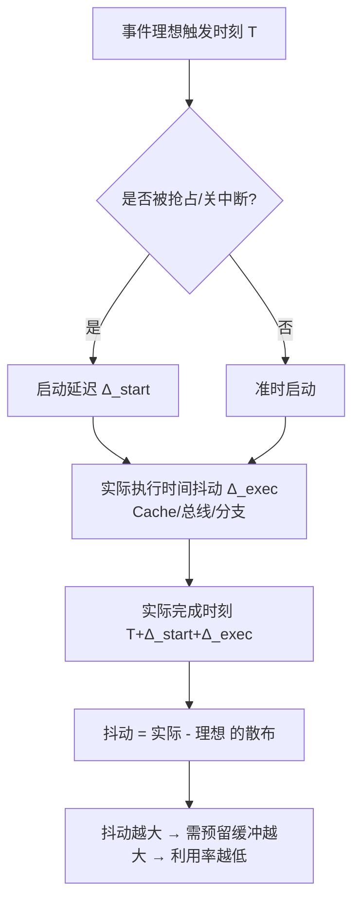

---

## 三、中断延迟（Interrupt Latency）的构成

中断延迟是实时性最常被测量的指标之一，也是最容易被误读的指标。笔者反复强调：**必须先拆开中断延迟的构成，才能知道哪些能优化、哪些不能**。

### 3.1 完整定义

从中断事件（硬件信号置位）发生，到中断服务程序（ISR）**第一条有效指令**开始执行（或 ISR 实际开始做有用工作）之间的时间，称为中断延迟 / 中断响应时间。

它的构成可分解为：

```
中断延迟 = 关中断最长时间（软件可控）
         + 当前最高优先级任务/ISR 的剩余执行时间（抢占前必须跑完的活）
         + 硬件同步与取向量开销（NVIC 压栈、尾链等）
```

其中第一项和第二项是**软件可控**的，第三项是**硬件固有**的（但可通过架构选择缓解，例如用 TCM 减少取指等待）。第九章会用硬件框图把第三项彻底拆开。

### 3.2 硬件固有开销：以 Cortex-M NVIC 为例

Cortex-M 系列（M0/M3/M4/M7/M33 等）采用 NVIC（Nested Vectored Interrupt Controller）和"自动硬件压栈"机制。当中断被响应时：

1. 硬件自动把 `R0–R3、R12、LR、PC、xPSR` 共 8 个寄存器压入当前栈（M3/M4/M7 上约 **12 个时钟周期** 的硬件开销，M0 上略多且为顺序压栈）。若使能了 FPU 且任务触碰过浮点寄存器，还会额外压栈 `S0–S15` 等（lazy stacking 可把这部分延迟到真正用到 FPU 时才发生）。
2. 从向量表取出 ISR 入口地址（向量表位置由 `VTOR` 寄存器决定，可指向零 wait state 的 ITCM）。
3. 跳转到 ISR 开始执行。

这 12 周期左右是**不可消除的硬开销**，但它受 Flash 等待周期（wait state，因主频高于 Flash 访问速度而插入）显著影响。若向量表和 ISR 位于需要 wait state 的 Flash，取向量会被拉长；放到 ITCM 或零 wait state 内存则可消除这部分抖动。

### 3.3 软件可控项：关中断窗口

这是工程师最容易踩坑、也最容易优化的部分。如果系统中存在一段 `CPSID I`（关全局中断）或 `PRIMASK` 置位的临界区，那么所有（或所有可屏蔽）中断都被屏蔽，直到重新开中断。这段时间内发生的中断请求只能在开中断后排队响应，于是：

```
中断延迟额外增加 = 关中断时该中断请求已挂起 → 必须等临界区结束
```

所以"关中断最长时间"直接等于**系统中最长关中断窗口**。一个在临界区里调用 `printf`、做大块 `memcpy`、甚至 `while` 等待 SPI 完成的写法，会把这段窗口撑到毫秒级，毁掉整个系统的实时性。

### 3.4 Tail-Chaining（尾链）与迟滞（Late-Arrival）

Cortex-M 有两个关键机制影响中断时序，常被忽略：

- **Tail-Chaining（尾链）**：当一个 ISR 即将返回，而此时已有另一个挂起的中断（同优先级或更高优先级）等待，NVIC 不会执行完整的"出栈—再入栈"，而是跳过出栈/压栈，直接跳到下一个 ISR。这**省掉了一次 12 周期级别的上下文切换开销**，对高频连续中断（如高速 UART 接收、定时器级联）非常有利。
- **Late-Arrival（迟滞到达）**：如果在一个中断的压栈过程中，来了更高优先级的中断，NVIC 会"中途"改为先响应更高优先级中断。这减少了高优中断的响应延迟，但要求 ISR 可重入或设计上避免优先级倒置问题。

这两个机制说明：**中断延迟不是简单相加的常数，而是与系统中断拓扑、优先级分配紧密相关的动态量**。测量和建模时必须考虑它们（第九章 9.9 节会给出硬件视角的分解）。

### 3.5 中断延迟的完整分解图

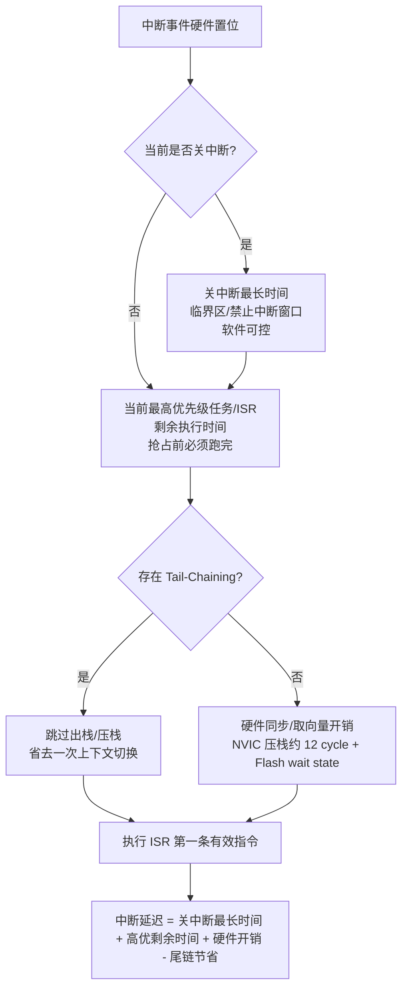

### 3.6 测量中断延迟的实战代码

下面给出一个在 Cortex-M 上用 DWT 周期计数器测量"从中断引脚翻转（GPIO 输入）到 ISR 第一条指令执行"的实用打点方法。注意这只是**端到端中断响应**的一个子集测量，不含关中断窗口（因为要测的就是在"未关中断"情况下的最小硬件+调度开销）。

```c
/* 前提：已使能 DWT->CYCCNT（CoreSight 数据观察与跟踪单元） */
#define DWT_CYCCNT  (*(volatile uint32_t *)0xE0001004)
#define DEMCR        (*(volatile uint32_t *)0xE000EDFC)
#define DWT_CTRL     (*(volatile uint32_t *)0xE0001000)

void benchmark_irq_init(void) {
    DEMCR |= (1u << 24);          /* 使能 DWT (TRCENA) */
    DWT_CTRL |= (1u << 0);        /* 使能 CYCCNT 计数器 */
    DWT_CYCCNT = 0;               /* 清零 */
}

volatile uint32_t g_irq_latency_cycles = 0;

/* 外部引脚触发的中断，ISR 第一条有效指令即打点 */
void EXTI_IRQHandler(void) {
    uint32_t t_isr = DWT_CYCCNT;          /* ISR 入口时刻 */
    uint32_t t_event = g_event_timestamp; /* 中断事件发生时由硬件边沿捕获的记录 */
    g_irq_latency_cycles = t_isr - t_event;
    /* 清除中断标志 ... */
}

/* 在 main 中用更高优先级定时器在"事件时刻"记录 t_event，
   再用 GPIO 翻转模拟外部事件，多次采样取最大值即为实测最坏中断延迟 */
```

这段代码的核心思想是：**用独立的、确定性的周期计数器（CYCCNT 不受 Cache 影响、每个内核周期 +1）作为时间标尺**，对比事件时刻与 ISR 入口时刻之差，多次采样取最大值，即为实际硬件+调度层面的最坏中断延迟。要测"含关中断窗口"的总延迟，则需要在系统最繁忙、最长临界区执行期间触发该中断，从而把软件可控项也纳入采样。

---

## 四、调度延迟（Scheduling Latency）：从"就绪"到"运行"

中断延迟关注 ISR，而**调度延迟（又称任务切换延迟 / 上下文切换延迟）**关注任务（thread）层面：一个任务从"变为就绪"到"真正开始运行"经过的时间。

### 4.1 调度延迟的构成

```
调度延迟 = 中断/系统调用触发调度的时间
         + 内核调度器决策时间（寻找最高优先级就绪任务）
         + 上下文切换时间（保存旧上下文、恢复新上下文）
         + 被抢占任务临界区剩余时间（若刚释放锁 / 开中断）
```

在抢占式 RTOS 中，典型路径是：中断或高优先级任务释放资源 → 触发 `PendSV`（Cortex-M 推荐的上下文切换机制）→ 内核在 `PendSV_Handler` 中完成上下文切换 → 新任务运行。

### 4.2 为什么用 PendSV 做上下文切换

Cortex-M 的设计哲学是：**ISR 应当尽可能短**，真正的上下文切换放到一个**最低优先级的系统异常 PendSV** 中延迟执行。这样，如果 ISR 返回时又有更高优先级中断到来，可以在 PendSV 之前先响应它（尾链效应），从而保证 ISR 响应不被上下文切换拖慢。这是一种优雅的"延迟调度（deferred scheduling）"设计。

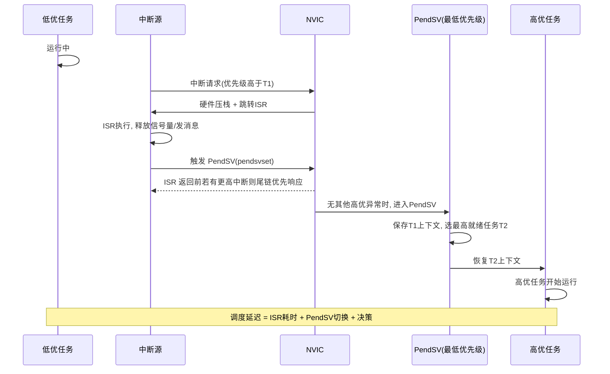

### 4.3 上下文切换时间为何不是常数

上下文切换时间本身也会抖：

- 若任务使用了 FPU，Cortex-M 需额外保存/恢复浮点寄存器（lazy stacking 机制可优化，但首次触碰 FPU 仍有开销）。
- 若 RTOS 就绪表是 `O(n)` 线性扫描，任务数越多切换越慢（优质 RTOS 用位图/优先级就绪树做到 `O(1)`）。
- MPU（内存保护单元）上下文切换若需重编程区域，也增加延迟。

因此，**调度延迟同样是抖动来源**，在可调度性分析里必须作为任务激活抖动（release jitter）的一部分计入。AUTOSAR Os 中这类抖动会被显式建模为任务的"激活抖动（Activation Jitter）"参数。

---

## 五、最坏执行时间 WCET 分析

WCET（Worst-Case Execution Time）是实时系统的"宪法"——它是所有后续可调度性分析的基础输入。没有可信的 WCET，任何"实时"声明都是空谈。

### 5.1 WCET 的定义与约束

WCET 指任务在**最坏条件下**的单次执行时间，所谓最坏条件包括但不限于：

- 最差输入数据（触发最深的循环、最多的分支、最复杂的计算路径）；
- Cache 全失效（冷启动或冲突失效）；
- 总线和内存被 DMA 或其他主设备占用（带宽争用）；
- 分支预测全部失败；
- 堆栈在慢速内存（需 wait state）。

WCET 必须满足：**WCET < 任务周期 / 截止时间**。否则就会出现丢帧、违约，实时性失效。

### 5.2 三类 WCET 分析方法

| 方法 | 原理 | 优点 | 缺点 | 适用 |
| --- | --- | --- | --- | --- |
| 静态分析（Static Analysis） | 基于控制流图（CFG）、数据流分析，结合处理器时序模型（pipeline/Cache）上界求解 | 结果有形式化保证；覆盖全部路径；无需实际运行 | 工具昂贵（如 aiT、Bound-T）；对复杂处理器（乱序、多核）极难精确；常偏保守 | 安全关键、航空、轨交 |
| 测量法（Measurement-Based） | 在目标硬件上大量运行，实测最大执行时间，外推上界（常加安全系数） | 工程易行；贴近真实硬件；成本低 | 无法保证覆盖最坏路径；外推无形式化保证；易低估 | 资源受限、快速迭代 |
| 混合方法（Hybrid） | 静态分析定结构/定上界框架，测量法填具体数值，或静态提供路径、测量提供基本块耗时 | 兼顾保证与成本；工业界主流选择 | 需要方法学支撑；流程复杂 | 汽车（ISO 26262 推荐思路） |

笔者在实际项目中倾向于**混合方法**：用静态分析识别"哪些路径可能成为最坏路径并给出结构保证"，用板级测量（带 Cache 压力、DMA 干扰）填充基本块（basic block）的真实最大耗时，再叠加安全裕量。

### 5.3 处理器微架构对 WCET 的威胁

现代 MCU 的"性能提升"手段几乎都在破坏确定性：

- **流水线（Pipeline）**：分支延迟槽、乱序执行让单条指令耗时依赖前序指令。
- **Cache**：确定性最大敌人——命中 1 周期，失效可能数十周期（甚至触发总线等待）。
- **写缓冲（Write Buffer）**：写操作看似完成，实际可能在临界区外才 flush，影响时序分析。
- **多核缓存一致性（MESI）**：多核共享缓存导致跨核干扰，WCET 分析需建模干扰延迟（这是多核实时研究的开放难题）。

应对思路：对确定性要求极高的 ISR 和任务，**把指令和数据锁进 TCM（紧耦合内存）**。ITCM/DTCM 访问周期固定（1 cycle），不经总线争用、不进 Cache，从而让 WCET 计算彻底摆脱"总线争用"和"Cache 失效"这两个最大的不确定变量。

```ld
/* 链接脚本片段：把热路径函数钉进 ITCM，高频数据进 DTCM */
.itcm_section (NOLOAD) :
{
  . = ALIGN(4);
  KEEP(*(.tcm_code))      /* 用 __attribute__((section(".tcm_code"))) 标记 */
} > ITCM

.dtcm_section (NOLOAD) :
{
  . = ALIGN(4);
  *(.dtcm_data)
} > DTCM
```

### 5.4 WCET 超标时的工程组合拳

当测量发现某任务 WCET 超标，笔者常用的降耗手段本质是**减少最坏路径上的不可控耗时**：

1. **软件 IIC → 硬件 IIC**：免 CPU 位操作轮询，交给外设状态机。
2. **全通道 DMA**：ADC/SPI/UART 的数据搬运交给 DMA，CPU 不被总线等待 stall。
3. **热路径进 TCM**：消除 Cache/总线不确定性。
4. **开硬浮点 FPU**：免软浮点模拟（软浮点一个乘法可能数十～上百周期，硬浮点单周期级）。
5. **编译优化 `-O2`/`-O3` 并固定优化等级**：同一份代码，优化等级不同 WCET 不同，必须锁定。
6. **提升主频 / 降总线 wait state**：直接缩小绝对时间，但要注意功耗与 EMC。

### 5.5 WCET 分析流程

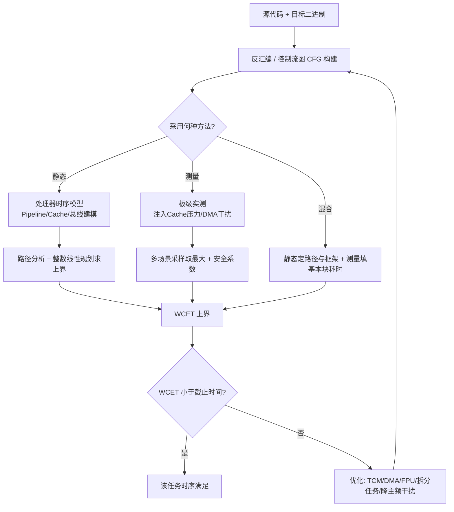

---

## 六、可调度性分析：RMS 与 EDF、利用率边界

有了每个任务的 WCET，下一步是回答：**这一组任务放在一起，是否每一个都能在截止时间前完成？** 这就是可调度性分析（Schedulability Analysis）。我们聚焦两类经典调度策略。

### 6.1 速率单调调度 RMS（Rate-Monotonic Scheduling）

RMS 是 Liu & Layland（1973）提出的经典结论，适用于**周期性、独立、抢占式**任务集，规则极其简单：

> **任务周期越短（频率越高），分配的优先级越高。**

即 `T_i` 越小 → 优先级越高。RMS 是静态优先级（固定优先级）调度中最优的（在任何固定优先级策略里，RMS 能调度的任务集最大）。

#### 6.1.1 利用率边界（Utilization Bound）

RMS 有一个著名的**充分但非必要**条件——处理器总利用率 `U` 不超过边界：

```
U = Σ (C_i / T_i)  ≤  n(2^(1/n) - 1)
```

其中 `C_i` 是任务 i 的 WCET，`T_i` 是其周期，`n` 是任务数。当 `n → ∞`，该边界趋于 `ln 2 ≈ 0.693`。也就是说，**即使 CPU 平均只用 69%，RMS 也保证可调度的**。这再次印证了"实时以牺牲利用率为代价"。

| 任务数 n | 利用率上界 n(2^(1/n)−1) | 近似 |
| --- | --- | --- |
| 1 | 1.000 | 100% |
| 2 | 0.828 | 82.8% |
| 3 | 0.780 | 78.0% |
| 4 | 0.757 | 75.7% |
| 5 | 0.743 | 74.3% |
| 10 | 0.718 | 71.8% |
| ∞ | 0.693 | 69.3%（ln 2） |

需要强调：**该边界是充分条件**。超过边界并不代表一定不可调度（精确可调度性需用响应时间分析 RTA 逐任务验证），只是 RMS 的充分条件不再保证。实践中若 `U` 超过边界，必须做**响应时间分析（Response Time Analysis, RTA）**：

```
对于每个任务 i（按优先级从低到高）:
    R_i = C_i + Σ_{j 优先级高于 i} (ceil(R_i / T_j) * C_j)
    迭代直到 R_i 收敛；若 R_i ≤ T_i（或截止时间），则任务 i 可调度。
```

#### 6.1.2 资源阻塞项与优先级反转

上述 RTA 公式假设任务只被更高优先级任务抢占。若存在共享资源（互斥量），还需加入**资源阻塞上界 `B_i`**——任务 i 因更低优先级任务持有锁而可能被阻塞的最大时间：

```
R_i = C_i + B_i + Σ_{j 优先级高于 i} (ceil(R_i / T_j) * C_j)
```

`B_i` 由优先级继承/天花板协议决定（第七章）。

#### 6.1.3 一个 RMS 可调度性数值算例

为了把抽象公式落到具体数字，笔者给出一个三任务集的算例。设系统时钟节拍无关，三个周期性任务参数如下：

| 任务 | 周期 T_i (ms) | WCET C_i (ms) | 截止时间 = 周期 |
| --- | --- | --- | --- |
| τ1（最高优先级） | 10 | 3 | 10 |
| τ2（中优先级） | 20 | 5 | 20 |
| τ3（最低优先级） | 40 | 8 | 40 |

先用利用率边界快速判断：`U = 3/10 + 5/20 + 8/40 = 0.3 + 0.25 + 0.2 = 0.75`。任务数 `n=3`，RMS 上界为 `3×(2^(1/3)−1) ≈ 0.780`。因为 `0.75 ≤ 0.780`，**充分条件满足**，可直接判定可调度，无需进一步迭代。

若把 τ3 的 WCET 改为 10ms，则 `U = 0.3+0.25+0.25 = 0.80 > 0.780`，充分条件失效——此时不能用边界下结论，必须做 RTA 逐任务验证：

- τ1（最高）：`R1 = C1 = 3 ≤ 10`，可调度。
- τ2（中）：`R2 = C2 + ceil(R2/10)×C1`。初值 `R2=5`；迭代：`5 + ceil(5/10)×3 = 5+3 = 8`；再迭代 `5 + ceil(8/10)×3 = 5+3 = 8` 收敛，`8 ≤ 20`，可调度。
- τ3（最低）：`R3 = C3 + ceil(R3/10)×C1 + ceil(R3/20)×C2`。初值 10；`10 + ceil(10/10)×3 + ceil(10/20)×5 = 10+3+5 = 18`；`10 + ceil(18/10)×3 + ceil(18/20)×5 = 10+6+5 = 21`；`10 + ceil(21/10)×3 + ceil(21/20)×5 = 10+9+5 = 24`；`10 + ceil(24/10)×3 + ceil(24/20)×5 = 10+9+5 = 24` 收敛。`24 ≤ 40`，可调度。

注意：尽管利用率超过理论边界，RTA 仍证明它可调度——这正是"边界是充分条件而非必要条件"的鲜活例证。反之，若 RTA 中某任务 `R_i > deadline`，则必须回到前面所列的优化手段（拆分任务、降低 WCET、调整周期、缩短被阻塞时间）重新设计。这个算例也揭示了一个工程直觉：**任务数越少、周期比越"整"（如 2 的幂次倍数），RMS 越接近满利用率**；周期不成比例的零碎任务集，实际可调度的利用率会明显低于 0.69。

#### 6.1.4 RMS 优先级分配与 RTA 验证伪代码

```c
/* 按周期升序分配优先级：周期最小 → 优先级最高（数值最小或最大视RTOS约定） */
void assign_rms_priority(task_t *tasks, int n) {
    /* 简单插入排序：按 T 从小到大 */
    for (int i = 1; i < n; i++) {
        task_t key = tasks[i];
        int j = i - 1;
        while (j >= 0 && tasks[j].period > key.period) {
            tasks[j + 1] = tasks[j];
            j--;
        }
        tasks[j + 1] = key;
    }
    /* tasks[0] 周期最小 → 分配最高优先级 */
    for (int i = 0; i < n; i++) {
        tasks[i].priority = HIGH_PRIO_BASE - i;  /* 数字越小优先级越高 */
    }
}

/* 响应时间分析（RTA）迭代，验证可调度性（含资源阻塞项 B_i） */
int is_schedulable_rta(task_t *tasks, int n) {
    for (int i = 0; i < n; i++) {           /* i 优先级从低到高，假定已排序 */
        int R = tasks[i].wcet + tasks[i].block;  /* 含阻塞上界 */
        int changed = 1;
        while (changed) {
            changed = 0;
            int newR = tasks[i].wcet + tasks[i].block;
            for (int j = i + 1; j < n; j++) {  /* 所有更高优先级任务 j */
                newR += ((R + tasks[j].period - 1) / tasks[j].period) * tasks[j].wcet;
            }
            if (newR > R) { R = newR; changed = 1; }
            if (R > tasks[i].deadline) return 0;  /* 违约 */
        }
        if (R > tasks[i].deadline) return 0;
    }
    return 1;  /* 全部可调度 */
}
```

### 6.2 最早截止期优先 EDF（Earliest Deadline First）

EDF 是**动态优先级**调度：在任何时刻，把 CPU 分配给**截止时间最早**的任务。EDF 是最优的（在单处理器、抢占、周期性/偶发任务下，能调度的任务集最大）。

EDF 的（充分且必要）条件简单得多：

```
U = Σ (C_i / T_i)  ≤  1
```

即只要总利用率不超过 100%，EDF 就可调度。这是 EDF 相比 RMS 的最大优势——更高的处理器利用率。

| 维度 | RMS（速率单调） | EDF（最早截止期优先） |
| --- | --- | --- |
| 优先级类型 | 静态（固定） | 动态（运行时变化） |
| 分配依据 | 周期越短优先级越高 | 截止时间越早优先级越高 |
| 最优性 | 固定优先级中最优 | 单处理器通用最优 |
| 利用率边界 | ≤ n(2^(1/n)−1)，极限 ln2≈0.69 | ≤ 1（充分且必要） |
| 实现复杂度 | 低（固定优先级易实现、易验证） | 较高（需运行时计算/比较截止时间） |
| 临时过载表现 | 高优任务仍满足，低优逐步丢失 | 可能全局紊乱（无临时保护） |
| 可预测性/鲁棒性 | 强，过载时行为局部可控 | 弱，过载时所有任务都可能违约 |
| 适用场景 | 任务数少、关键任务需稳定保障 | 高利用率、任务集动态变化 |

### 6.3 为什么汽车 ECU 多用固定优先级（类 RMS）而非 EDF

尽管理论上 EDF 利用率更高，但工业界（尤其汽车 AUTOSAR OSEK/OS）普遍采用**固定优先级调度（FPS，RMS 是其特例）**。原因包括：

1. **鲁棒性**：EDF 在临时过载（某任务偶发执行变长）时可能"雪崩"式全局违约；FPS 过载时只影响低优任务，高优任务仍受保护。
2. **可验证性**：FPS 的 RTA 和静态分析工具链成熟，认证（ISO 26262）成本低。
3. **优先级反转可控**：固定优先级下，优先级继承协议（PIP）等机制易于实施和证明。
4. **时间隔离（FFI）**：固定优先级天然支持"高 ASIL 任务固定高优先级，低 ASIL 任务不能拖延它"，契合 ISO 26262 的 Freedom From Interference。

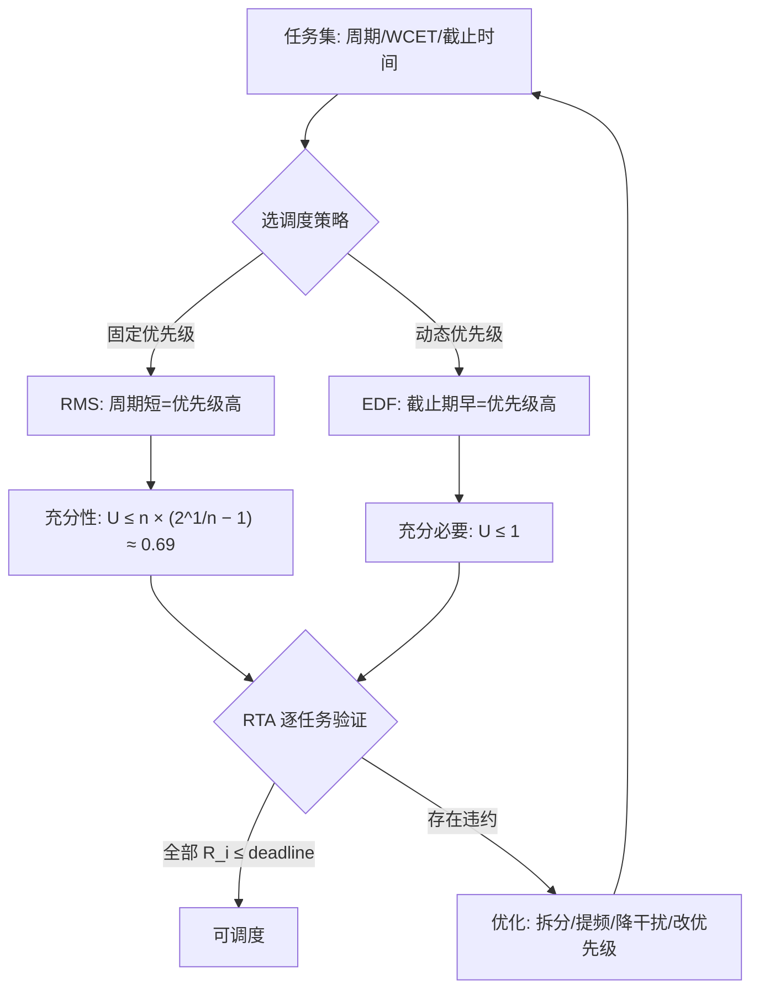

---

## 七、优先级反转对时序的影响（结合 RTOS）

优先级反转（Priority Inversion）是实时系统中最经典、也最隐蔽的时序破坏者，直接威胁 WCET 假设和截止时间。

### 7.1 什么是优先级反转

考虑三个任务：高优先级 `H`、中优先级 `M`、低优先级 `L`，它们共享一个资源（如一个全局缓冲区，用互斥量保护）。正常期望是 `H` 随时抢占 `L` 和 `M`。但出现如下序列：

1. `L` 运行，并持有共享资源的锁。
2. `H` 就绪，抢占 `L` 开始运行，但 `H` 也要访问该资源 → 因锁被 `L` 持有，`H` 阻塞。
3. **关键点**：此时 `M` 就绪，抢占 `L`（因为 `M` 优先级高于 `L` 但低于 `H`）。于是 `M` 一直跑，把 `L` 饿着，`L` 无法释放锁，导致 `H` 也被无限期（或长时间）阻塞。

结果是：**中优先级任务 M 间接阻塞了最高优先级任务 H**——优先级关系被"反转"了。如果 `M` 执行时间很长，`H` 的截止时间就会被错过。这正是 1997 年火星探路者（Mars Pathfinder）任务中导致系统反复重启的经典 bug。

### 7.2 优先级继承协议（PIP / Priority Inheritance）

解决方法是**优先级继承**：当高优先级 `H` 被低优先级 `L` 持有的锁阻塞时，临时把 `L` 的优先级提升到 `H` 的级别，这样 `M` 就无法抢占 `L`，`L` 得以尽快跑完临界区、释放锁，`H` 尽快恢复。锁释放后 `L` 恢复原优先级。

主流 RTOS（如 FreeRTOS 的 `mutex` 带优先级继承、AUTOSAR OSEK 的 `priority ceiling` / 天花板协议）都内置此机制。需要注意：**二值信号量（binary semaphore）通常不带优先级继承，仅用于同步而非保护共享资源**——误用会导致反转。

### 7.3 优先级天花板协议（Priority Ceiling Protocol, PCP）

比 PIP 更进一步的 OCPP（Original PCP）/ HLP（Highest Locker Priority）：给每个资源设定一个"天花板优先级"（等于所有可能访问它的最高任务优先级）。任务一旦获取资源，立即提升到该天花板优先级，从而**预防**死锁并进一步减少阻塞时间。AUTOSAR 中常用此机制（Os 的 `Resource` 可配 `OS_RES_SCHEDULER` 优先级天花板）。

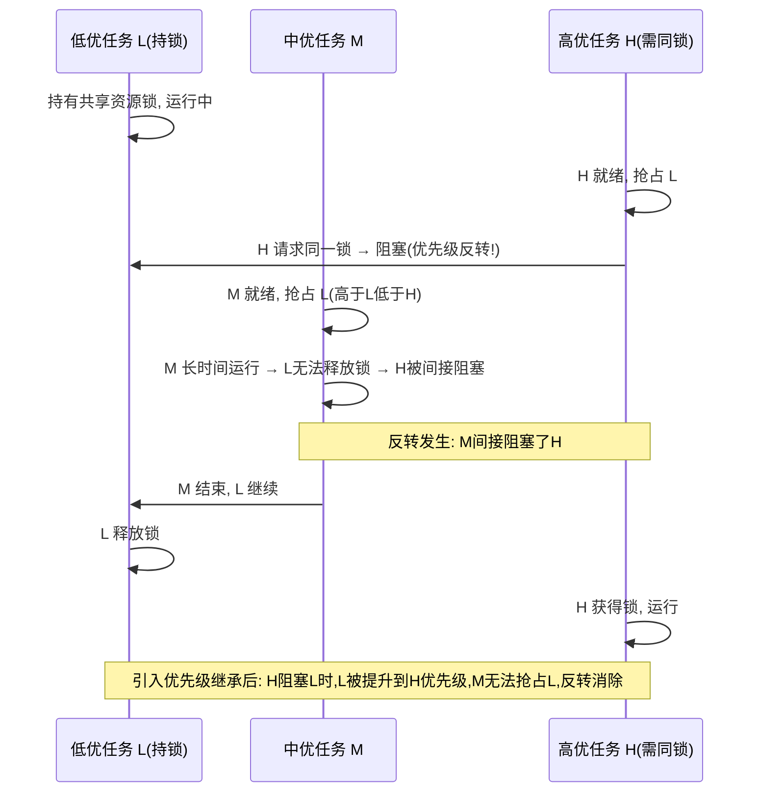

### 7.4 对时序分析的影响

优先级反转会**放大高优先级任务的有效 WCET / 阻塞时间**，必须在 RTA 中计入"资源阻塞项"（如 `B_i`，任务 i 因低优持锁而可能被阻塞的最大时间）。若忽略它，可调度性分析会过于乐观，导致现场违约。在 AUTOSAR Os 中，`B_i` 由资源配置的天花板优先级推导，并最终进入时间保护（Timing Protection）的监控预算。

---

## 八、临界区与关中断代价：怎么缩短

临界区（Critical Section）是保护共享资源不被并发破坏的代码段。在嵌入式实时系统中，临界区的实现方式直接决定系统的"最坏可预测性"。

### 8.1 两种临界区实现及其代价

| 方式 | 机制 | 代价 | 适用 |
| --- | --- | --- | --- |
| 关全局中断（`CPSID I` / `PRIMASK`） | 屏蔽所有可屏蔽中断 | 期间**所有 ISR 都无法响应**，直接加到中断延迟上；最长关中断窗口 = 最坏中断延迟上界 | 极短、不可被中断打断的原子操作 |
| 关部分中断（`BASEPRI`） | 仅屏蔽低于某阈值的中断 | 高优先级 ISR 仍可响应；代价可控 | Cortex-M 推荐的"中断分级保护" |
| 互斥量 / 自旋锁 | 任务级同步原语 | 引入优先级反转风险（需 PIP）；不屏蔽中断 | 任务间共享资源 |
| 原子指令（LDREX/STREX） | 硬件原子读改写 | 几乎无中断代价；仅重试冲突 | 单变量无锁更新 |

### 8.2 关中断的代价为何最危险

关全局中断是"一刀切"——它把**整个系统中断响应能力**都冻结了。如果这段临界区里做了大块 `memcpy`、等待 SPI、甚至 `printf`（会调串口阻塞），那么：

- 所有更低优先级的实时控制中断（如电机电流环、安全监控）都被延迟；
- CAN 报文可能溢出、看门狗可能饿死；
- 最坏中断延迟被直接拉到临界区长度。

这正是本章开头 BMS 事故的 root cause。正确写法是用**细粒度锁**只保护真正共享的少量操作，且临界区只留"改共享变量"的最小动作。第十章 10.3 节会给出 PRIMASK/BASEPRI 进入/退出的标准驱动写法。

```c
/* 反例：图省事关全局中断，挡住所有 ISR 与高优任务 */
__disable_irq();
memcpy(shared_buf, src, N);   /* N 大时，这段就是"关中断最长时间" */
__enable_irq();

/* 正例1：用 BASEPRI 只屏蔽低优先级中断，高优 ISR 仍可响应 */
__set_BASEPRI(0x40);          /* 仅屏蔽优先级数值 >= 0x40 的中断 */
shared_buf.head = new_head;   /* 极短临界区 */
__set_BASEPRI(0);

/* 正例2：任务级用互斥量 + 优先级继承保护共享区 */
lock_acquire(&buf_lock);
shared_buf.head = new_head;   /* 仅一两句，时间可控 */
lock_release(&buf_lock);
```

### 8.3 缩短临界区的工程准则

1. **临界区里只做"必要的最小原子操作"**：不要调用阻塞 API、不要做循环等待、不要做 I/O。
2. **外设等待交给 DMA / 中断**：不要在临界区 `while` 轮询标志。
3. **数据拷贝移出临界区**：先在临界区复制指针/索引（O(1)），实际大块拷贝在临界区外做（双缓冲 / 环形队列）。
4. **用无锁结构**：单生产者单消费者（SPSC）环形队列可完全避免锁。
5. **中断分级（BASEPRI）优于全局关中断**：把实时关键 ISR 设为高优先级，永远不被临界区屏蔽。
6. **对必须关中断的场景，明确预算并写注释**：约定"任何关中断窗口不超过 X 微秒"，并在代码审查中检查。AUTOSAR Os 的"中断关闭预算（Interrupt Lock Budget）"正是把这条工程准则自动化、可监控化的机制（见第十一章）。

---

## 九、芯片模块设计（A）：实时性相关硬件 IP 内部架构

> 前面八章是"理论层"。从本章起，笔者要把这些理论**下沉到硅片**。原因很简单：所有中断延迟、WCET、抖动，最终都由芯片内部的 NVIC、SysTick、GPT、DWT、ETM/ITM 等 IP 的硬件行为决定。驱动工程师如果不懂这些 IP 的寄存器与内部逻辑，就无法解释"为什么最坏中断延迟是 12 周期而不是 0"，也无法正确地测量和调优。本章给出一套**通用 IP 内部架构**描述（并非某一颗具体料号的逆向，而是符合 ARM Cortex-M 与常见车规 MCU 公开手册逻辑的高层模型），供工程参照。

### 9.1 为什么软件/驱动工程师必须懂硬件 IP

实时性保证的源头是硬件。几个常被忽视的事实：

- 中断"自动压栈"是 **NVIC + 内核协作** 的硬件行为，不是编译器插入的 prologue。
- WCET 的"尺子" **DWT CYCCNT** 是内核外的独立 32 位计数器，需要 `DEMCR.TRCENA` 与 `DWT_CTRL.CYCCNTENA` 两个位先后使能。
- Os 的节拍（tick）来自 **SysTick 或 GPT 硬件计数器** 的溢出/比较事件，其频率基准由 **Mcu 时钟树** 决定。
- 优先级分组、尾链、迟滞是 **NVIC 内部仲裁硬件** 的状态机，决定了中断延迟的动态构成。

不理解这些，就无法把"可调度性分析"变成"可在板子上证明的事实"。

### 9.2 芯片级实时性相关硬件总体框图

下面这张图是本章的核心——它把"中断控制器 NVIC + 内核 + SysTick/GPT 定时器 + 总线 + 中断优先级硬件 + 跟踪单元 ETM/ITM"的拓扑关系一次性画清。注意：**SysTick 与 GPT 都向 NVIC 产生中断请求**，而 **DWT/ETM/ITM 都挂在内核的 CoreSight 跟踪接口上**，并不占用应用总线带宽（低侵入）。

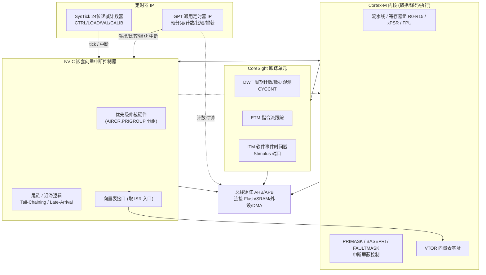

### 9.3 NVIC 内部架构：优先级分组硬件与尾链/迟滞逻辑

NVIC 不是一个简单的"中断或门"，而是一组**并行仲裁硬件 + 状态机**。其核心组成：

1. **中断使能/挂起/活跃寄存器组（ISER/ICER、ISPR/ICPR、IABR）**：每中断 1 位，决定该中断是否使能、是否挂起、是否在活跃。
2. **优先级寄存器组（IPR0..IPRn）**：每中断 8 位宽（实际实现常截断为高位若干 bit），保存该中断的优先级值（**数值越小优先级越高**）。
3. **优先级分组硬件（受 `SCB->AIRCR.PRIGROUP` 控制）**：把 8 位优先级拆成"组优先级（抢占优先级）"与"子优先级（亚优先级）"。组优先级决定能否抢占，子优先级仅在同组优先级内决定同周期仲裁次序（软件意义上，硬件仍用单一 8 位值比较，分组只是给软件一个分层视图）。
4. **仲裁器（The Arbiter）**：每个指令边界 / 异常退出点，NVIC 比较"当前执行优先级（execution priority）"与"所有挂起中断中的最高优先级"，若挂起者更高则触发响应。
5. **尾链 / 迟滞状态机**：维护"上一个 ISR 是否可省略出栈/入栈（Tail-Chaining）"以及"压栈中途是否插入更高优先级（Late-Arrival）"。

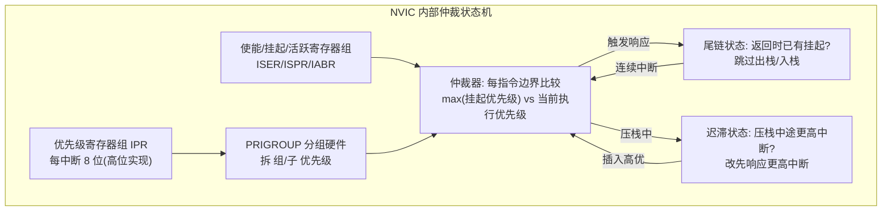

**优先级分组的关键点**：Cortex-M 的中断优先级是 8 位宽，但芯片实现时通常只用高 N 位（如 M3/M4 常用 4 位 → 16 级，M0 用 2 位 → 4 级）。`PRIGROUP` 决定这 N 位里多少位给"组优先级"、多少位给"子优先级"。例如 4 位、PRIGROUP 选择"3 位组 + 1 位子"，则组优先级有 8 级、子优先级有 2 级。AUTOSAR Os 的 `OsPriority` 最终会被映射进这些位，成为硬件可识别的抢占层级。

### 9.4 Cortex-M 内核取指/执行与中断响应路径

当中断被仲裁器选中，内核进入"中断响应序列"，该序列是与 NVIC 协作的硬件微操作：

1. **取向量（Vector Fetch）**：内核从 `VTOR` 指向的向量表读取对应 ISR 入口地址。若向量表在 Flash（有 wait state）则从 Flash 取，若存在 ITCM（零 wait state）则更快且无抖动。
2. **硬件压栈（Stack Push）**：内核自动把 `R0、R1、R2、R3、R12、LR、PC、xPSR` 压入当前使用的栈（MSP 或 PSP），通常 6 个总线周期（对 M3/M4/M7），对应约 12 内核时钟周期的整体开销（含取指与对齐）。若任务用过 FPU，则额外压 `S0–S15`（lazy stacking 延迟到真正执行浮点指令）。
3. **取指执行（Fetch & Execute）**：从向量表给出的地址取第一条 ISR 指令并执行。

这一序列的总时间，就是第九章 9.9 节"中断延迟硬件构成"中的"硬件同步 + 取向量"项。

### 9.5 SysTick 24 位定时器

SysTick 是 Cortex-M 内核自带的一个**24 位向下递减计数器**，是 OS tick 最经典的硬件源。其寄存器（均在 `0xE000E000` 私有外设区）：

- `SYST_CSR` @ `0xE000E010`：控制与状态
- `SYST_RVR` @ `0xE000E014`：重载值（Reload）
- `SYST_CVR` @ `0xE000E018`：当前值（可读写，写则清零）
- `SYST_CALIB` @ `0xE000E01C`：校准值（提供 10ms 定标参考）

其工作逻辑：使能后，`CVR` 每个内核时钟（或参考时钟）减 1；减到 0 时，若 `TICKINT=1` 则产生 SysTick 异常（优先级由 `SHPR3` 中 `SysTick` 字段配置，属于系统异常，受 PRIMASK 屏蔽但可单独调优先级），并把 `COUNTFLAG` 置位，`CVR` 自动重载 `RVR`。

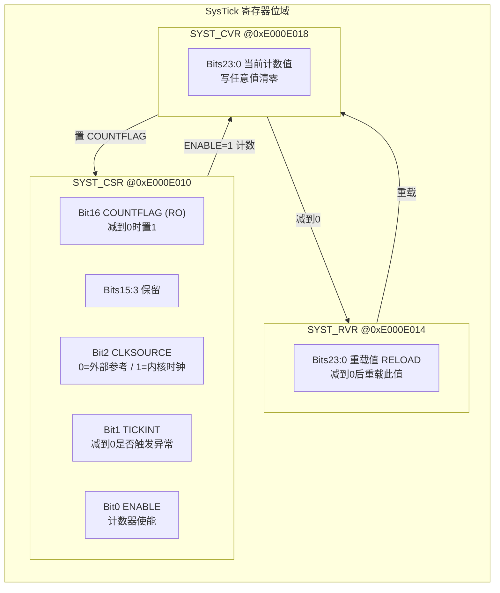

> 为什么是 24 位？24 位最大计数值 `2^24-1 = 16,777,215`。若内核 100MHz，单次最大计时约 167ms；若主频 1GHz 则仅约 16.7ms——这就是 SysTick 不适合做超长定时的原因，超长/高精度定时要用 GPT（9.6 节）。

### 9.6 GPT 通用定时器 IP（通用模型）

车规 MCU（如 NXP S32K 的 FTM/LPTMR、ST 的 TIM）普遍提供"通用定时器（GPT）"IP。这里给出符合常见实现逻辑的**通用 GPT 内部框图**：它包含时钟选择、预分频、计数、比较（输出）、捕获（输入）等子模块。

- **时钟选择（CLK SEL）**：可选内部总线时钟、外部晶振、或级联的前级定时器输出。
- **预分频器（PSC）**：对输入时钟做 `1..2^n` 分频，得到计数时钟 `f_cnt`。
- **计数器（CNT）**：向上/向下/中央对齐计数，受方向位控制。
- **自动重载 / 比较寄存器（ARR / CMPx）**：到比较值匹配产生比较事件（可触发中断或输出 PWM）。
- **输入捕获（IC）**：在外部边沿锁存 CNT 值，用于测脉宽/周期（ICU 模块底层，见第十一章）。
- **状态/中断（STATUS / IE）**：溢出、比较匹配、捕获等标志与中断使能。

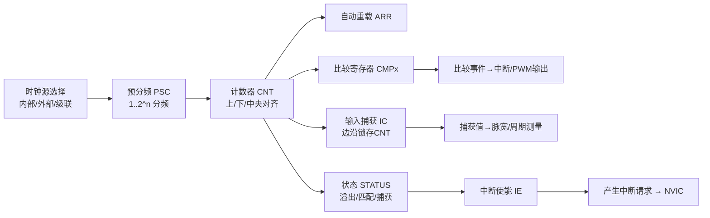

GPT 的寄存器位域（通用模型）如下，注意与 SysTick 不同，GPT 是**外设 IP**，地址在 MCU 外设区（如 `0x4000_xxxx`）而非私有外设区：

| 寄存器 | 关键位域 | 功能 |
| --- | --- | --- |
| GPT_CTRL | ENABLE, MODE(向上/下), DIR, INT_EN_OVF, INT_EN_CMP | 使能、模式、方向、中断使能 |
| GPT_STATUS | FLAG_OVF, FLAG_CMP, FLAG_CAP | 溢出/比较/捕获标志（写 1 清） |
| GPT_CMP | CMP[31:0] | 比较值（匹配触发事件） |
| GPT_CNT | CNT[31:0]（RO） | 当前自由运行计数值 |
| GPT_PSC | PSC[15:0] | 预分频分频比 |

### 9.7 DWT 数据观察与打点

DWT（Data Watchpoint and Trace）是 CoreSight 的一部分，提供：

- **CYCCNT**：32 位自由运行计数器，每内核时钟 +1，是 WCET 测量的"金标准尺子"。必须 `DEMCR.TRCENA=1` 且 `DWT_CTRL.CYCCNTENA=1` 才运行。
- **PC 采样 / 数据地址监测**：可配置在数据地址命中时触发事件，用于无侵入的性能分析。

DWT 与 ET-ITM 通过 CoreSight 内部总线连接，不占用应用 AHB/APB，因此打点几乎不引入额外抖动（仅读取 `CYCCNT` 本身的 1~2 周期）。

### 9.8 ETM / ITM 跟踪单元

- **ETM（Embedded Trace Macrocell）**：指令流跟踪。它压缩内核取指流并输出到 Trace 端口（常经 SWO 或并行 Trace 引脚），可**重建程序执行路径**，用于精确测量函数耗时、发现"实际走的最坏路径"是否与预期一致。ETM 是纯硬件采样，对被测代码执行时间的侵入极小（不插入软件指令）。
- **ITM（Instrumentation Trace Macrocell）**：软件追踪。应用通过写 `ITM->STIMULUS[x]`（激励端口，地址区间 `0xE0000000` 起）发送时间戳/日志事件，经 SWO 输出到 PC 端工具（如 Tracealyzer）。常用于在关键时刻"打点 + 附时间戳"，且不会像 `printf` 那样阻塞（SWO 是后台 DMA 式输出）。

内核、定时器、跟踪三者的协作关系：SysTick/GPT 提供**确定节拍** → 驱动 Os counter；DWT 提供**单周期尺子** → 驱动 WCET 测量；ETM/ITM 提供**非侵入观测** → 驱动时序验证。三者构成"基准—测量—验证"的闭环，是第九章到第十一章工程落地的基础。

### 9.9 中断延迟的硬件构成（硬件视角）

把第三章的公式从硬件角度重写，中断延迟的**硬件部分**由三段构成：

```
中断延迟(硬件) = 硬件压栈周期 (R0-R3,R12,LR,PC,xPSR ≈ 12 cycle)
               + 取向量 (向量表读取 + Flash wait state)
               + 同步开销 (流水线 drain / 总线对齐 / 多周期指令完成)
               − 尾链/迟滞带来的节省
```

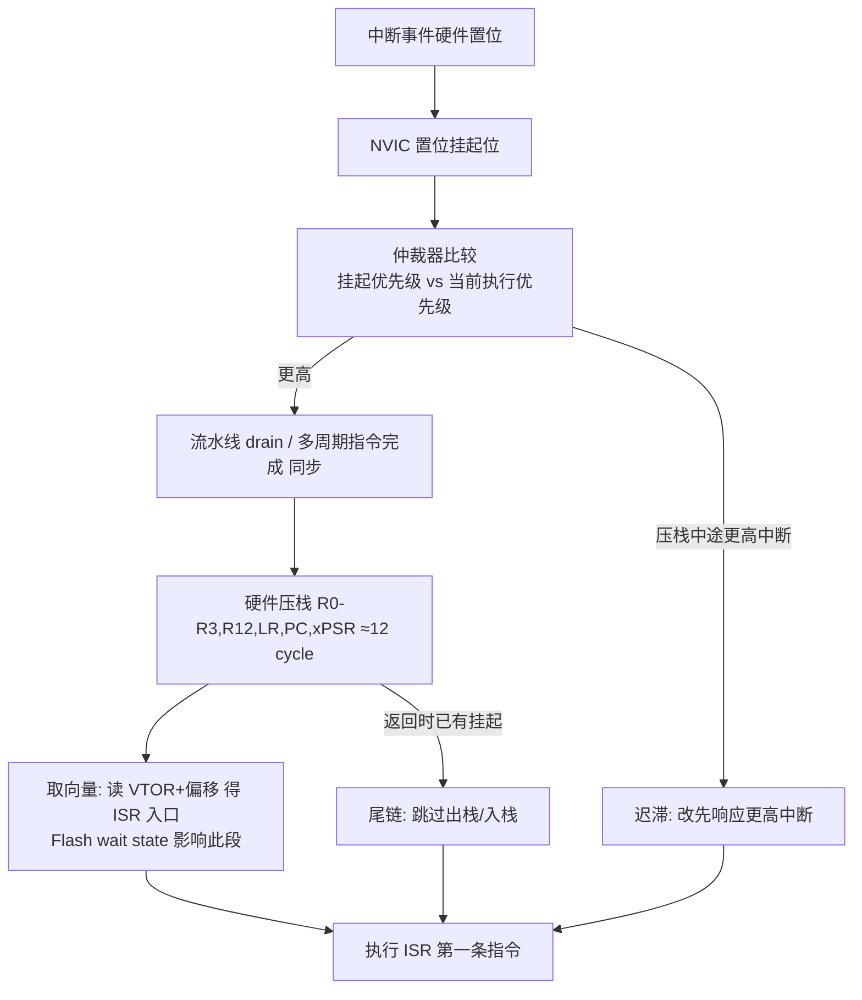

**关键工程结论**：硬件部分是"地板"，软件无论怎么优化都不可能低于它；而软件部分的"关中断最长时间"是"天花板"，决定了实际最坏中断延迟。降低硬件部分靠选型（高频零 wait state、ITCM 放向量表）和架构（减少多周期指令）；降低软件部分靠缩短临界区与中断分级（BASEPRI）。

### 9.10 内核 / 定时器 / 跟踪协作对时序的保证小结

| 硬件单元 | 提供的确定性保证 | 被谁消费 |
| --- | --- | --- |
| NVIC 优先级 + 尾链 | 可预测的抢占次序与最小切换开销 | 调度器 / ISR |
| SysTick / GPT | 确定节拍与精确计时基准 | Os Counter / 测量代码 |
| DWT CYCCNT | 单周期、无 Cache 影响的尺子 | WCET 测量（第十章） |
| ETM / ITM | 非侵入执行路径/事件观测 | 时序验证（第十二章） |

---

## 十、驱动代码实现（B）：从寄存器到测量

> 第九章讲清了硬件"有什么"，本章讲驱动工程师如何"用起来"。所有示例都是**真实可读的 C**，可直接在 Cortex-M 工程里编译运行（地址与位域均符合第九章给出的通用模型）。核心目标：把硬件寄存器变成可测量的时序数据，从而让第一至八章的理论"可被证明"。

### 10.1 寄存器操作基础约定

所有寄存器用 `volatile` 指针映射，避免编译器优化掉读写。位操作统一用"读-改-写"或"置位/清零"宏。下面给出贯穿全章的基础定义：

```c
#include <stdint.h>

/* ---------- CoreSight / NVIC / SysTick 寄存器映射（私有外设区） ---------- */
#define DEMCR      (*(volatile uint32_t *)0xE000EDFC)  /* 调试异常与监控控制 */
#define DWT_CTRL   (*(volatile uint32_t *)0xE0001000)  /* DWT 控制 */
#define DWT_CYCCNT (*(volatile uint32_t *)0xE0001004)  /* DWT 周期计数器 */
#define ITM_STIM0  (*(volatile uint32_t *)0xE0000000)  /* ITM 激励端口 0 */
#define ITM_TER    (*(volatile uint32_t *)0xE0000E00)  /* ITM 跟踪使能寄存器 */

#define SYST_CSR   (*(volatile uint32_t *)0xE000E010)  /* SysTick 控制 */
#define SYST_RVR   (*(volatile uint32_t *)0xE000E014)  /* SysTick 重载 */
#define SYST_CVR   (*(volatile uint32_t *)0xE000E018)  /* SysTick 当前值 */

/* 位定义 */
#define DEMCR_TRCENA     (1u << 24)
#define DWT_CTRL_CYCCNTENA (1u << 0)
#define SYST_ENABLE      (1u << 0)
#define SYST_TICKINT     (1u << 1)
#define SYST_CLKSOURCE   (1u << 2)
#define SYST_COUNTFLAG   (1u << 16)
```

### 10.2 中断延迟测量：ISR 内翻转 GPIO + DWT 打点

这是第三章 3.6 的**完整可运行版**。思路：**用更高优先级的定时器在"事件时刻"翻转一个 GPIO 作为被测中断的触发源，并在被测 ISR 内立即翻转另一个 GPIO + 读 DWT 打点**。逻辑分析仪同时抓两根线，时间差即"触发沿→ISR 内翻转沿"的延迟（含 GPIO 输入同步 + 硬件压栈 + 取向量 + 软件读 CYCCNT）；多次采样取最大即最坏中断延迟。

```c
/* ---------- 示例：用 GPIO 翻转 + DWT 测"硬件 + 调度"中断延迟 ---------- */
#define TEST_GPIO_SET()   (GPIOB->BSRR = (1u << 5))   /* 置位 PB5（ISR 内打点） */
#define TEST_GPIO_CLR()   (GPIOB->BRR  = (1u << 5))   /* 清零 PB5 */
#define TRIG_GPIO_TOGGLE() (GPIOA->ODR ^= (1u << 3))  /* 触发源：PA3 翻转 */

volatile uint32_t g_irq_latency_max = 0;   /* 实测最坏中断延迟（单位：周期） */
volatile uint32_t g_event_cyc = 0;        /* 事件时刻的 CYCCNT 快照 */

/* 高优先级定时器 ISR：模拟"外部事件"并打时间戳 */
void TIM_TRIG_IRQHandler(void) {
    g_event_cyc = DWT_CYCCNT;     /* 记录事件时刻 */
    TRIG_GPIO_TOGGLE();           /* 翻转触发引脚 → 被测中断被置位 */
    CLEAR_TIM_FLAG();             /* 清定时器标志 */
}

/* 被测中断 ISR（优先级低于触发定时器）：进入即打点 */
void TARGET_IRQHandler(void) {
    uint32_t t_isr = DWT_CYCCNT;                 /* ISR 第一条有效指令时刻 */
    TEST_GPIO_SET();                             /* 翻转观测引脚（供逻辑分析仪看） */
    uint32_t lat = t_isr - g_event_cyc;          /* 周期级延迟 */
    if (lat > g_irq_latency_max) g_irq_latency_max = lat;  /* 取最坏 */
    TEST_GPIO_CLR();
    CLEAR_TARGET_FLAG();
}

/* 主流程：初始化 DWT、GPIO、定时器，跑足够久后读 g_irq_latency_max */
void latency_benchmark_run(void) {
    DEMCR |= DEMCR_TRCENA;
    DWT_CTRL |= DWT_CTRL_CYCCNTENA;
    DWT_CYCCNT = 0;
    /* 配置触发定时器最高优先级、目标中断次高；启动触发定时器周期性翻转 */
    /* 循环运行 N 次，g_irq_latency_max 即为实测最坏中断延迟（换算 us = 周期/主频） */
}
```

> 解读：该测量覆盖了"关中断为 0 时"的硬件地板 + 调度开销。若要测"含最长关中断窗口"的真实最坏值，需在系统最繁忙、最长临界区执行期间触发目标中断——此时 `g_irq_latency_max` 会把软件可控项一并纳入。逻辑分析仪抓 PB5 的脉冲宽度还可直接读出 ISR 自身执行时长与间隔抖动。

### 10.3 临界区进入 / 退出：PRIMASK 与 BASEPRI

第八章强调"BASEPRI 优于全局关中断"。下面是符合 CMSIS 语义的**标准临界区进入/退出实现**，区分"全关中断"与"分级屏蔽"两种粒度，并体现"保存-恢复"原则（绝不允许无条件开中断，否则会破坏外层临界区）。

```c
/* ---------- 临界区：PRIMASK（全关）与 BASEPRI（分级） ---------- */
typedef uint32_t irq_state_t;

/* 全关中断（进入/退出配对，保存原 PRIMASK） */
static inline irq_state_t irq_enter_primask(void) {
    irq_state_t state;
    __asm volatile (
        "mrs %0, PRIMASK\n\t"   /* 读当前 PRIMASK */
        "cpsid i\n\t"           /* 关全局中断 */
        : "=r"(state) :: "memory"
    );
    return state;               /* 返回旧状态，供退出时恢复 */
}
static inline void irq_exit_primask(irq_state_t state) {
    __asm volatile (
        "msr PRIMASK, %0\n\t"   /* 恢复旧状态（可能仍关，若外层也在临界区） */
        :: "r"(state) : "memory"
    );
}

/* 分级屏蔽：仅屏蔽优先级数值 >= threshold 的中断（高优 ISR 仍可响应） */
static inline void irq_enter_basepri(uint32_t threshold) {
    __asm volatile (
        "msr BASEPRI, %0\n\t"
        "isb\n\t"               /* 指令同步屏障，保证后续按新优先级执行 */
        :: "r"(threshold) : "memory"
    );
}
static inline void irq_exit_basepri(void) {
    __asm volatile (
        "msr BASEPRI, %0\n\t"   /* 清零 BASEPRI = 解除分级屏蔽 */
        :: "r"(0u) : "memory"
    );
}

/* 用法示例：只保护共享队列头，实时关键 ISR（高优先级）永不被挡 */
void producer_push(void) {
    irq_enter_basepri(0x40);        /* 仅屏蔽低优先级中断 */
    shared_q.head = new_head;       /* 极短临界区 */
    irq_exit_basepri();
}
```

**要点**：① `irq_enter_primask` 必须返回旧状态并在 `irq_exit_primask` 恢复，支持临界区嵌套；② `BASEPRI` 写入的 `threshold` 是"优先级数值阈值"，数值越大屏蔽越多，需与第九章 9.3 节的优先级分组一致；③ 临界区内**禁止调用任何可能阻塞或耗时长的函数**。

### 10.4 SysTick 与 GPT 定时测量 WCET

第三章到第五章反复提到 WCET 必须用 DWT/CYCCNT 测量。下面给出**两个互补的计时器驱动**：一个用 SysTick（24 位）做周期节拍喂给 Os，另一个用 GPT 自由运行计数器（32 位）做高精度 WCET 打点。二者都展示"驱动如何读硬件寄存器得到时间"。

```c
/* ---------- (1) SysTick 初始化：作为 Os 节拍源，1ms tick ---------- */
void systick_init(uint32_t cpu_hz, uint32_t tick_hz) {
    SYST_RVR = (cpu_hz / tick_hz) - 1u;   /* 重载值 = 每 tick 周期数 - 1 */
    SYST_CVR = 0;                         /* 清零当前值 */
    SYST_CSR = SYST_ENABLE | SYST_TICKINT | SYST_CLKSOURCE;  /* 内核时钟 + 触发异常 */
}

/* SysTick ISR：每 1ms 调用 Os 的 Counter Tick（见 11.x） */
void SysTick_Handler(void) {
    Os_TickHandler();   /* AUTOSAR Os 递增 Counter、处理 Alarm / ScheduleTable */
}

/* ---------- (2) GPT 自由运行计数器：高精度 WCET 测量 ---------- */
#define GPT_CNT  (*(volatile uint32_t *)0x4000100Cu)  /* GPT 当前计数值 CNT（只读） */
#define GPT_CTRL (*(volatile uint32_t *)0x40001000u)  /* GPT 控制寄存器 */
#define GPT_STATUS (*(volatile uint32_t *)0x40001004u) /* GPT 状态寄存器（写1清标志） */

void gpt_timer_init(void) {
    GPT_CTRL = (1u << 0);   /* ENABLE=1，向上自由计数，不分频（PSC=0） */
}

/* 测量一个被测函数的 WCET：多次运行取最大耗时（单位：GPT 计数） */
uint32_t g_wcet_max = 0;
void measure_wcet(void (*fn)(void)) {
    for (int i = 0; i < 100000; i++) {
        uint32_t t0 = GPT_CNT;     /* 入口快照 */
        fn();                       /* 被测函数（刻意制造最坏输入） */
        uint32_t t1 = GPT_CNT;     /* 出口快照 */
        uint32_t delta = t1 - t0;  /* 32 位回绕安全相减 */
        if (delta > g_wcet_max) g_wcet_max = delta;
    }
    /* g_wcet_max / GPT_freq = 最坏执行时间（秒） */
}
```

> 为什么用 GPT 而非 SysTick 测 WCET？SysTick 是 24 位且常用于 Os tick，若被测函数跨越 tick 边界会被打断；GPT 是应用自定义的 32 位自由运行计数器，可专用于测量、分辨率与量程都更合适。二者本质都是"读一个递增计数器前后值相减"。

### 10.5 调度器 tick 实现：从硬件中断到 Os Counter

AUTOSAR Os 的 `Counter` 需要一个硬件事件自增。最常见实现是把 SysTick（或 GPT 比较中断）绑定到 `Os Counter`，在 ISR 里调用 `IncrementCounter` / `OsTick`。下面是**驱动侧**的经典实现骨架与状态机。

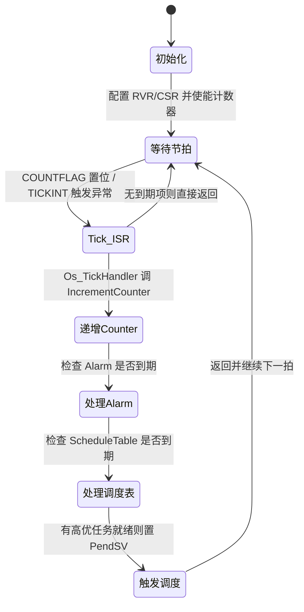

```c
/* ---------- 调度器 tick：SysTick ISR → Os Counter 自增 ---------- */
#include "Os.h"   /* AUTOSAR Os 头 */

void SysTick_Handler(void) {
    /* 注意：SysTick 是系统异常，优先级由 SHPR3 配置（见 9.3） */
    /* 1) 递增 Os 主计数器（Os 内部据此推进 Alarm / ScheduleTable） */
    (void)IncrementCounter(OS_COUNTER_SYS);

    /* 2) 终止当前预算（Timing Protection）：检查本任务执行时间是否超预算 */
    /* Os 内核会自动做，这里仅示意调用点 */
    /* 3) 若调度表/Alarm 激活了更高优先级任务，Os 会在返回时触发 PendSV 切换 */
}

/* GPT 比较中断作为 Counter 源的等价实现 */
void GPT_Compare_IRQHandler(void) {
    GPT_STATUS = (1u << 1);          /* 清比较标志 */
    (void)IncrementCounter(OS_COUNTER_GPT);
    /* 其余同上 */
}
```

### 10.6 Trace 打点：ITM 发送时间戳

第九章 9.8 提到 ITM 可"低侵入发时间戳"。下面给出驱动侧打点函数：把时间戳与事件 ID 写入 ITM 激励端口，经 SWO 输出到 PC 端 Trace 工具，用于重建时序而不阻塞应用（对比 `printf` 会 stall CPU）。

```c
/* ---------- ITM 软件 Trace 打点：发送 (事件ID, 时间戳) ---------- */
static inline int itm_port_ready(void) {
    return (ITM_TER & (1u << 0)) != 0;   /* 该激励端口是否已使能 */
}

void trace_mark(uint8_t event_id) {
    if (!itm_port_ready()) return;        /* 未使能则安全跳过，零阻塞 */
    /* 写激励端口：硬件经 SWO 后台输出，不 stall 应用核 */
    ITM_STIM0 = (uint32_t)event_id;       /* 事件 ID */
    ITM_STIM0 = (uint32_t)DWT_CYCCNT;     /* 附带当前周期时间戳 */
}

/* 用法：在 ISR 入口/出口、任务切换点、临界区进出处插 trace_mark(...) */
void TARGET_IRQHandler(void) {
    trace_mark(0x01);   /* ISR 进入 */
    /* ... 实际工作 ... */
    trace_mark(0x02);   /* ISR 退出 */
}
```

**驱动如何把硬件"变成"可测的时序**：① 使能 DWT/ITM（`DEMCR.TRCENA`）；② 提供 `cyc_now()`/`gpt_now()` 时间基；③ 在关键路径插 GPIO 与 ITM 打点；④ 用 GPT/SysTick 喂 Os Counter；⑤ 导出测量值给离线可调度性分析对比。至此，第一章到第八章的"理论 WCET/延迟/抖动"变成了"板子上可读取的数字"，形成闭环。

---

## 十一、MCAL 配置说明（C）：AUTOSAR 实时性相关模块

> 前两章是"裸驱动"。在车规量产项目里，这些驱动由 **AUTOSAR MCAL（Microcontroller Abstraction Layer）** 统一封装，并通过 **EB tresos / DaVinci Configurator** 等工具以图形化方式配置、由代码生成器产出 `*.c/*.h`。本章说明：哪些 MCAL 模块直接决定实时性，它们的关键配置项是什么，以及"配置 → 生成 → 实时性保证"的端到端路径，最后给出优先级映射与抖动预算的工程表。

### 11.1 AUTOSAR 分层与实时性相关模块

AUTOSAR 经典栈分层：`Application → RTE → Services(Os/Com/... ) → MCAL`。直接影响时间行为的是：

- **Os（操作系统）**：任务优先级、Counter、Alarm、ScheduleTable、Timing Protection。实时性的"调度者"。
- **Mcu（微控制器单元）**：时钟树、PLL、分频——**所有时序基准的物理来源**（主频、总线时钟都由此决定）。
- **Gpt（通用定时器）**：提供 Os Counter 的硬件节拍、应用级定时测量、唤醒源。
- **Icu（输入捕获）**：测脉宽/周期（如曲轴信号、PWM 反馈），把外部时间事件变成数字。

这四个模块的配置质量，直接决定第一至八章的理论是否成立。

### 11.2 Os 模块：任务 / 计数器 / 警报 / 调度表

Os 把第六章的 RMS / 固定优先级调度**实例化**为配置对象：

- `OsTask`：`OsTaskPriority`（数值，映射到 NVIC 优先级位，见 9.3）、`OsTaskActivation`（最大激活数）、`OsTaskTimeFrame`/`OsTaskExecutionBudget`（时间保护预算）。
- `OsCounter`：`OsCounterMaxAllowedValue`、`OsCounterTicksPerBase`、`OsCounterMinCycle`、`OsCounterSecondsPerTick`（由绑定的 Gpt/SysTick 硬件决定）。
- `OsAlarm`：绑定 Counter，到点在 `OsAlarmAction` 里激活任务 / 设事件 / 调回调。
- `OsScheduleTable`：按固定表激活多任务，适合强周期控制（如 1ms/5ms/10ms 任务帧）。
- `OsResource`：配天花板优先级，落实第七章的 PCP。

**Os 内核节拍绑定 GPT/SysTick**：`OsCounter` 的硬件源在生成时绑定到某个 Gpt 通道或 SysTick，配置里的 `OsCounterSecondsPerTick` 必须等于 `1 / (硬件计时频率)`。若 Mcu 把主频配错，整个 Os 时序基准全部漂移——这是 11.3 节要强调的。

### 11.3 Mcu 模块：时钟频率 / 分频直接决定时序基准

Mcu 配置决定 `SystemCoreClock`、总线时钟、定时器时钟。关键配置项：

| 配置项（通用） | 含义 | 对实时性的影响 |
| --- | --- | --- |
| `McuClockReferencePoint` | 各时钟域频率（CPU/HCLK/PCLK） | 决定每条指令耗时、SysTick 计时基准 |
| `McuPllConfiguration` | PLL 倍频/分频系数 | 主频偏差 → WCET 绝对时间整体缩放 |
| `McuPrescaler` | 总线/AHB/APB 分频 | 影响 NVIC 取向量（Flash wait state）、DMA 争用 |
| `McuFlashWaitState` | Flash 等待周期数 | 直接加在"取向量"硬件延迟上（见 9.9） |
| `McuResetReason` | 复位源 | 调试实时性失效时的定位 |

> 工程铁律：**Mcu 时钟配置必须经计算与实测双确认**。例如 SysTick 重载值 = `cpu_hz / tick_hz - 1`，若 `cpu_hz` 因 PLL 配错差 2%，则 1ms tick 实际变成 1.02ms，长期运行会让所有基于 Os Counter 的截止时间集体偏移——这种"慢漂移"在常温测试里不易发现，却能在高低温循环中暴露（呼应第一章 BMS 案例）。

### 11.4 Gpt 模块：定时测量 / 触发

Gpt 承袭第九章 9.6 的 GPT IP，在 MCAL 层配置为 Os Counter 源或独立测量通道。关键配置项：

| 配置项（通用） | 含义 | 实时性角色 |
| --- | --- | --- |
| `GptChannelId` | 通道编号 | 区分多个定时器通道 |
| `GptChannelMode` | 连续 / 单次（One-Shot） | 连续用于 Os tick，单次用于一次性超时监测 |
| `GptChannelPrescaler` | 预分频 | 决定计数频率 = `timer_clk / (PSC+1)` |
| `GptChannelTickFrequency` | 计数频率 | 必须等于 Os Counter 的 `SecondsPerTick` 倒数 |
| `GptEnableNotification` | 比较/溢出回调 | 连接 `Gpt_Notification` → Os IncrementCounter |
| `GptWakeupSource` | 是否唤醒源 | 低功耗下定时唤醒 |

### 11.5 Icu 模块：输入捕获测脉宽 / 周期

Icu 把第九章 9.6 的 GPT 输入捕获能力封装为标准化 API（`Icu_GetTimeElapsed`、`Icu_GetDutyCycle`），常用于：

- 曲轴/凸轮轴信号周期测量（发动机同步）；
- PWM 反馈脉宽测量（电机/阀控）；
- 外部事件时间戳（与 10.6 ITM 打点互补）。

其配置项含 `IcuChannelMode`（边沿/时间戳）、`IcuMeasurementMode`（周期/脉宽/边沿计数）、`IcuDefaultStartEdge` 等。Icu 的测量值会进入应用层用于闭环控制，其**采样抖动**也需计入第七章的激活抖动。

### 11.6 EB tresos / DaVinci 配置项清单（Os / GPT / MCU 重点）

下面是一张"配置项 → 实时性含义 → 常见取值"的速查表，覆盖三大重点模块：

| 模块 | 配置项 | 实时性含义 | 典型配置要点 |
| --- | --- | --- | --- |
| Os | `OsTaskPriority` | 任务优先级（映射到 NVIC 位） | 关键控制任务高优；按 RMS 周期分配 |
| Os | `OsTaskExecutionBudget` | 执行时间预算（时间保护） | ASIL-B 及以上必配，如 500μs |
| Os | `OsCounterSecondsPerTick` | Counter 一拍的真实时间 | 须等于 Gpt/SysTick 实际频率倒数 |
| Os | `OsAlarmTime` / `OsAlarmCycle` | 闹钟偏移与周期 | 激活周期任务，如 1ms / 5ms |
| Os | `OsScheduleTableDuration` | 调度表总长 | 覆盖整数个控制帧 |
| Os | `OsInterruptLockBudget` | 关中断预算 | 限制最长临界区，如 ≤ 5μs |
| Gpt | `GptChannelTickFrequency` | 计数频率 | 与 Os Counter 严格一致 |
| Gpt | `GptChannelPrescaler` | 预分频 | 由 timer_clk 与所需频率反推 |
| Gpt | `GptChannelMode` | 连续/单次 | Os 源用连续 |
| Mcu | `McuClockReferencePoint` | 各时钟域频率 | 决定 SysTick/WCET 基准 |
| Mcu | `McuFlashWaitState` | Flash 等待周期 | 高频必配，否则取指被拉长 |
| Mcu | `McuPllConfiguration` | PLL 系数 | 主频精度影响所有绝对时间 |

### 11.7 配置 → 生成 → 实时性保证路径

MCAL 的闭环可表示为下面的流程图：工程师在工具里配置参数 → 生成器产出驱动与 Os 配置代码 → 编译进 ECU → 板级实测（DWT/ITM/逻辑分析仪）→ 对比离线可调度性分析。若不符，回到配置或应用层修改。

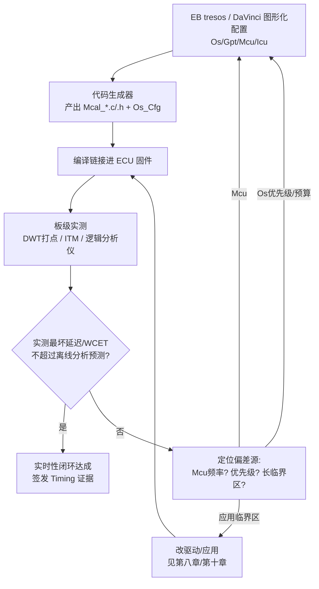

### 11.8 优先级映射与抖动预算

最后给出一张"应用任务 → Os 优先级 → NVIC 优先级位 → 抖动预算"的映射表（示例），体现第九章硬件优先级与第十一章 Os 配置的衔接。抖动预算（Jitter Budget）是预留给"被抢占/调度抖动"的时间裕量，必须 ≤ `deadline − WCET − 最坏阻塞 B_i`。

| 应用任务 / ISR | Os 优先级(数值) | NVIC 组优先级 | 周期/截止 | WCET(估) | 抖动预算 |
| --- | --- | --- | --- | --- | --- |
| 安全监控看门狗 ISR | 1（最高） | 0x00 | 事件型 | 2μs | 0（不可被屏蔽） |
| 电机 FOC 电流环 ISR | 2 | 0x10 | 100μs | 35μs | 10μs |
| CAN 接收 ISR | 4 | 0x30 | 事件型 | 8μs | 5μs |
| 均衡控制任务（OsTask） | 6 | 0x50 | 1ms | 0.4ms | 0.2ms |
| 诊断/日志任务 | 12 | 0xB0 | 10ms | 1ms | 1ms |

> 映射原则：① 安全相关 ISR 永远最高且**不被 BASEPRI 屏蔽**（阈值设得比它低）；② Os 任务优先级与 IRQ 优先级在同一 NVIC 编号空间内协同——Cortex-M 中**硬件中断优先级整体高于（数值小于）所有 Os 任务**（任务运行在线程模式，等效优先级由配置的 OsTaskPriority 经内核映射）；③ 抖动用完预算即触发 Timing Protection 报警，防止"长尾"突破截止时间。

---

## 十二、测量与观测方法：把理论落到示波器上

再完美的分析，也必须用实测来验证。下面梳理四种工程常用手段（第十章已给出对应驱动实现）。

### 12.1 逻辑分析仪 / 示波器 + GPIO 打点

最朴素也最可靠的方法：在关键事件处翻转一个 GPIO，用逻辑分析仪或示波器捕获时间差。例如：进入 ISR 时拉高某引脚、退出时拉低，即可直接看到中断服务时长与间隔抖动（见 10.2 的 `TEST_GPIO_SET/CLR`）。优点是不依赖任何软件基础设施、对系统侵入极小；缺点是能观测的点有限、受 GPIO 翻转自身开销影响（需扣除），且只能看"边沿"不能看"路径"。

### 12.2 定时器 / 周期计数器打点（DWT CYCCNT）

如第三章与第十章代码所示，Cortex-M 的 DWT `CYCCNT` 是内核每个周期 +1 的 32 位计数器，**不受 Cache 影响、分辨率达单周期**。在事件前后各读一次相减，即可得到纳秒级的精确耗时。这是板级 WCET 测量和中断延迟测量最常用的"尺子"。

```c
/* 通用打点计时模板（第十章 10.4 的简化版） */
static inline uint32_t cyc_now(void) { return DWT_CYCCNT; }

void measure_block(const char *name) {
    uint32_t t0 = cyc_now();
    critical_function_under_test();      /* 被测代码 */
    uint32_t t1 = cyc_now();
    uint32_t delta = t1 - t0;           /* 32位回绕安全相减 */
    uint32_t us = delta / (SystemCoreClock / 1000000);
    /* 记录最大值用于 WCET 评估 */
    if (delta > g_max_delta[name]) g_max_delta[name] = delta;
}
```

> 提示：多次运行取**最大值**而非平均值，并刻意制造最坏条件（冷 Cache、DMA 满载、最大输入数据），才能逼近真实 WCET。

### 12.3 CoreSight Trace：ETM / ITM / DWT

ARM CoreSight 提供强大的非侵入式（或低侵入）追踪能力（详见第九章 9.7/9.8，驱动见 10.6）：

- **ETM（Embedded Trace Macrocell）**：指令流追踪，可重建程序执行路径，用于精确测量函数耗时、发现"实际走的最坏路径"是否与预期一致。
- **ITM（Instrumentation Trace Macrocell）**：软件 printf-like 追踪，应用可发时间戳事件，用于记录事件序列而不阻塞。
- **DWT（Data Watchpoint and Trace）**：如前所述，提供 PC 采样、周期计数、数据地址监测。

结合这些，工程师可以在不停止系统的情况下，测量每段代码的真实最大执行时间，验证 WCET 假设。商业工具（如 Lauterbach TRACE32、Segger SystemView、Percepio Tracealyzer）都基于此构建可视化时序分析。

### 12.4 RTOS 内核 Trace 与运行时分析

主流 RTOS / AUTOSAR Os 提供内核事件追踪：任务切换、中断进入/退出、信号量获取/释放、消息发送等都会产生时间戳事件。将这些事件导出，可重建完整的调度时序图，直观看到：

- 某任务实际的最大响应时间；
- 优先级反转发生的时刻与持续；
- 关中断窗口造成的 ISR 延迟尖峰；
- 任务抖动的来源。

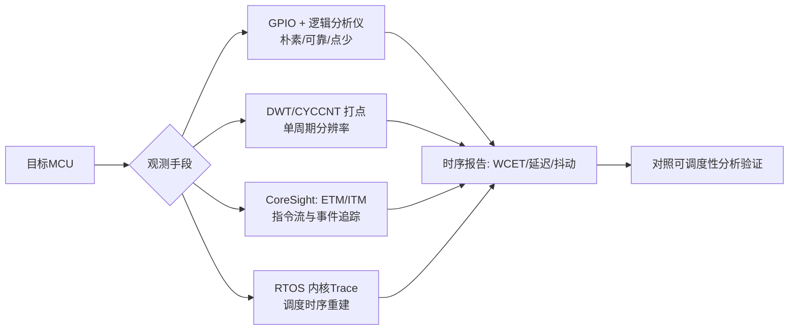

### 12.5 测量法的局限与陷阱

- **覆盖率陷阱**：你没测到的路径，可能就是最坏路径。测量法无法证明"已覆盖最坏情况"。
- **平均值陷阱**：示波器看"平均 0.8ms"就以为安全，却忽略 0.1% 的 3ms 长尾。
- **测试环境陷阱**：台架常温测得达标，高温下 Cache 行为、晶振/PLL 漂移、电源噪声导致实际更差（本章开头的 BMS 案例即此）。
- **插桩代价**：软件打点本身改变 Cache 和时序，需评估插桩对 WCET 的影响。

因此，笔者的方法论是：**测量用于发现与验证，静态分析用于证明与兜底，二者缺一不可**。

### 12.6 基于极值理论（EVT）的测量法上界外推

单纯"取实测最大值"在工程上有个尴尬：你测了一百万次，下一次仍可能出现更长的样本，于是 WCET 估计永远随样本量增长而漂移、无法收敛。学术界与工业界常用**极值理论（Extreme Value Theory）**来给测量法一个更有统计意义的上界：其核心思想是——把"单次执行时间"视为随机变量，关注其分布的"上尾（upper tail）"，用广义帕累托分布（GPD）对超过某高阈值 `u` 的样本建模，从而外推给定置信水平（如 1−10⁻⁹）下的 WCET 上界。

具体步骤（简化）：① 收集大量带最坏条件压力的实测执行时间；② 取一个较高阈值 `u`，只保留超过 `u` 的样本；③ 用 GPD 拟合这些"超阈值"样本，估计形状参数 `ξ` 与尺度参数 `σ`；④ 按目标超越概率 `p` 计算上界 `WCET_p = u + (σ/ξ)×((1−p)^(−ξ) − 1)`。这种方法的优势是让"测量法上界"不再是经验安全系数的拍脑袋，而是可解释的统计保证；局限是仍依赖"测试已覆盖最坏路径"这一前提——若最坏路径根本没被触发，EVT 也无能为力。因此它仍是混合方法里"测量"一侧的增强，而非对静态分析的替代。

### 12.7 时间保护（Timing Protection）机制：从分析到运行时兜底

即使离线可调度性分析全部通过，运行中仍可能出现偶发的执行时间异常（如某任务因数据异常陷入超长循环、或 DMA 配置错误导致总线长时间阻塞）。AUTOSAR OS / OSEK 提供的**时间保护（Timing Protection）**正是运行时兜底：它为每类对象配置三类监视——① **任务执行时间预算（Execution Budget）**，超限触发保护钩子（如终止任务、报警）；② **任务时间间隔（Inter-Arrival Time / 闭锁时间）**，防止某任务被过频激活；③ **操作系统锁/中断关闭时间监控（Lock / Interrupt Lock Budget）**，当关中断或持锁超过预算即触发警报。这三类监视共同把"最坏情况"从离线假设变成运行时可被检测和隔离的硬约束，是 ISO 26262 功能安全里"故障检测与容错"在时间维度上的落地。笔者的实践建议是：**任何 ASIL-B 及以上的任务，都应至少配置执行时间预算与关中断预算**（对应第十一章 11.6/11.8 的 `OsTaskExecutionBudget` / `OsInterruptLockBudget`），并在保护钩子里记录故障计数器供诊断。

---

## 十三、综合案例：把前面所有概念串起来

回到第一章的 BMS 主动均衡案例，用本章框架重新诊断：

1. **问题归类**：均衡输出是硬实时控制（截止时间 1ms），违约导致过充——硬实时违约。
2. **中断延迟分析**：CAN 接收中断和高优喂狗任务被"长关中断窗口"延迟，说明系统中存在过长的 `关中断最长时间` 项（第三章 / 第八章）。
3. **临界区代价**：`memcpy` 在关全局中断内执行，把临界区撑到毫秒级，直接毁掉中断延迟上界（第八章 8.2）。
4. **抖动来源**：高温下 Cache 命中率变化 → 临界区执行时间抖动放大 → 偶发 3ms 长尾（第二章）。
5. **WCET 假设被破坏**：原本按"平均 1ms 内"设计的控制回路，实际最坏 3ms，WCET 超过截止时间（第五章）。
6. **硬件视角根因**：向量表在 Flash（有 wait state）、临界区未用 BASEPRI 分级、热路径未在 TCM（第九章）——共同抬高了"硬件地板 + 软件天花板"。
7. **修复（全栈）**：驱动层把 `memcpy` 移出临界区（环形队列指针交换），临界区改用 `BASEPRI` 分级（第十章 10.3）；MCAL 层把均衡任务配 `OsTaskExecutionBudget` 与 `OsInterruptLockBudget`，并把相关 ISR 映射到最高 NVIC 优先级（第十一章）；热路径与均衡数据进 DTCM、向量表进 ITCM（第五章 / 第九章）。
8. **验证**：用 DWT 打点 + GPIO/逻辑分析仪抓最大延迟样本（第十/十二章），在台架高温下长时老化确认长尾消失，并把实测最大值与离线 RTA（第六章）闭环比对。

这个案例几乎串联了本章每一个知识点——它就是实时性工程全栈方法论（理论 → 硬件 → 驱动 → MCAL → 测量）的缩影。

---

## 十四、面试题精选（18+ 道，含答题要点）

以下题目适合汽车嵌入式 / 实时系统岗位笔试与面试，均以"要点 + 原理"方式给出，便于背诵与追问。

**Q1. 硬实时和软实时的区别是什么？举一个你项目中的硬实时例子。**
要点：区别在于"违约后果"而非"速度"；硬实时违约灾难性、截止时间绝对不可违反；软实时偶发违约可接受。例子：气囊触发、喷油正时、电机电流环、BMS 均衡窗口等。

**Q2. 中断延迟由哪几部分组成？哪些是软件可控的？**
要点：关中断最长时间 + 当前最高优先级任务/ISR 剩余执行时间 + 硬件同步/取向量开销（Cortex-M 约 12 cycle + Flash wait state）。前两项软件可控，第三项硬件固有（但可用 TCM 缓解，见第九章 9.9）。

**Q3. 什么是抖动（Jitter）？它如何影响系统利用率？**
要点：同一事件响应时间相对理想值的散布；来源含抢占、关中断、Cache miss、总线争用、中断嵌套；抖动越大 → 需预留缓冲越多 → 可调度利用率越低。

**Q4. 什么是 WCET？它必须和什么比较才有意义？**
要点：最坏条件下单次执行时间；必须 < 任务周期/截止时间；否则丢帧、违约，实时性失效。测量用 DWT CYCCNT（第十章 10.4）。

**Q5. WCET 的三种分析方法各有什么优劣？**
要点：静态分析（有形式化保证但工具贵、对复杂核保守）、测量法（易行但无法保证覆盖最坏路径）、混合方法（工业界主流，静态定结构+测量填数值）。

**Q6. 为什么 Cache 是 WCET 分析的"敌人"？如何应对？**
要点：命中 1 周期、失效数十周期且不可预测；应对：热路径/数据进 TCM（第九章 9.4）、锁定 Cache 行、标 non-cacheable、预热。

**Q7. 简述 RMS（速率单调调度）及其利用率边界。**
要点：周期越短优先级越高；静态优先级中最优；充分性 `U ≤ n(2^(1/n)-1)`，极限 ln2≈0.693；超过边界需用 RTA 进一步验证（含阻塞项 B_i）。

**Q8. RMS 和 EDF 的核心区别？为什么汽车多用 RMS/固定优先级？**
要点：RMS 静态优先级，边界~0.69；EDF 动态优先级，边界=1，理论利用率更高但过载时易全局雪崩；汽车选固定优先级因鲁棒性、可验证性、FFI 隔离、认证成本。

**Q9. 什么是优先级反转？怎么解决？**
要点：低优持锁阻塞高优，中优趁机抢占低优间接阻塞高优；解决：优先级继承（PIP）、优先级天花板协议（PCP）；RTOS 中 mutex 带继承，binary semaphore 不带（第七章）。

**Q10. 关全局中断和使用互斥量保护共享资源，哪种对实时性更危险？为什么？**
要点：关全局中断更危险，因为它冻结全部 ISR 响应，直接加到最坏中断延迟上；互斥量仅任务级且可配合优先级继承，但需防反转。推荐 BASEPRI 分级（第八章 / 第十章 10.3）。

**Q11. 什么是 PendSV？为什么 Cortex-M 用它在上下文切换中？**
要点：最低优先级系统异常，用于延迟（deferred）上下文切换；好处是 ISR 返回前若有更高中断可先响应（尾链），不让切换拖慢 ISR 响应（第四章）。

**Q12. Tail-Chaining 和 Late-Arrival 是什么？对中断延迟有何影响？**
要点：尾链——连续中断跳过出栈/压栈省一次上下文切换；迟滞——压栈过程中更高中断到达可先响应。二者都降低有效中断延迟，但要求在建模时考虑中断拓扑（第三章 / 第九章 9.3）。

**Q13. 如何用 DWT CYCCNT 测量一段代码的执行时间？为什么要取最大值而非平均值？**
要点：前后读 `DWT_CYCCNT` 相减（注意 32 位回绕）；实时性看最坏情况，平均值掩盖长尾，必须取最大值并在最坏条件下测试（第十/十二章）。

**Q14. 什么是可调度性分析中的响应时间分析（RTA）？**
要点：按优先级从低到高迭代 `R_i = C_i + B_i + Σ ceil(R_i/T_j)*C_j`，收敛后若 `R_i ≤ deadline` 则可调度；比利用率边界更精确（必要且充分，在固定优先级下）。

**Q15. 多核 MCU 给 WCET / 实时性带来什么新挑战？**
要点：共享缓存/总线跨核干扰、缓存一致性（MESI）导致不可控延迟、需建模干扰延迟（interference delay）、时间隔离更难；是多核实时开放研究难题。

**Q16. ISO 26262 中"时间隔离（FFI 的时间维度）"指什么？**
要点：Freedom From Interference 三隔离（空间、时间、通信）之一；调度须保证高 ASIL 任务有确定时间窗，低 ASIL 任务不能拖延它，通常通过固定高优先级 + 时序保护（Timing Protection）实现（第十一章）。

**Q17. NVIC 的优先级分组（PRIGROUP）有什么用？它和 AUTOSAR Os 优先级如何衔接？**
要点：把 8 位（实现高位）优先级拆成"组优先级（可抢占）"与"子优先级"；Cortex-M 硬件用单一数值比较，分组给软件分层视图；Os 的 `OsTaskPriority` 最终映射进这些位（第九章 9.3 / 第十一章 11.8）。

**Q18. 你如何验证一个硬实时任务的截止时间真的满足？**
要点：① 先做静态/混合 WCET 分析得 C_i；② 用 RMS/固定优先级 RTA 验证 `R_i ≤ deadline`（含 B_i）；③ MCAL 配好 Os Counter 基准、优先级、时间保护预算（第十一章）；④ 用 DWT/逻辑分析仪/RTOS Trace 在台架（含高低温、DMA 满载、最坏输入）实测取最大延迟，比对分析结论；⑤ 二者闭环，形成 Timing 证据。

**Q19.（开放题）如果一个硬实时任务偶发违约，你的排查思路？**
要点：① 确认是否 WCET 超标（测量最长执行，第十/十二章）；② 查最长关中断窗口/长临界区（第八章）；③ 查是否被高优任务或中断抢占（抖动点）；④ 查 Cache/总线/DMA 干扰；⑤ 查优先级反转（mutex 是否带继承）；⑥ 查调度配置（优先级、周期、截止时间、Os Counter 基准是否由 Mcu 时钟正确派生）；⑦ 查温度/电源等环境导致的平台抖动。

---

## 结语

实时性的本质，是**用确定性的代价换取可预测的安全**。从硬/软实时的定义，到中断延迟、调度延迟、抖动；从 WCET 的静态与测量方法，到 RMS/EDF 的可调度性边界；从优先级反转的陷阱到临界区的精细管控——这些是第一至八章的理论骨架。而要把理论变成可交付的安全关键产品，工程师还必须向下穿透到**芯片 IP 内部**（第九章：NVIC 的优先级分组与尾链、SysTick 24 位计数器、GPT 预分频/比较/捕获、DWT 单周期尺子、ETM/ITM 非侵入跟踪），用**真实可读的驱动代码**（第十章：GPIO+DWT 中断延迟测量、PRIMASK/BASEPRI 临界区、SysTick/GPT 定时、Os tick、ITM 打点）把它变成板上可测的数字，再通过 **MCAL 配置**（第十一章：Os/Gpt/Mcu/Icu 的配置项、生成路径、优先级映射与抖动预算）把保证固化进量产固件，最后用**测量与验证**（第十二章）形成闭环。

笔者的经验可以凝练为一句话：**永远按最坏情况设计、按最坏情况测量、按最坏情况证明**。平均值会骗人，长尾不会；理论会简化，实测会暴露；唯有把"最坏情况钉死"的工程闭环——理论分析 → 硬件理解 → 驱动测量 → MCAL 固化 → 板级验证——才能让安全关键系统在十年生命周期里，每一次都在截止时间前完成。
