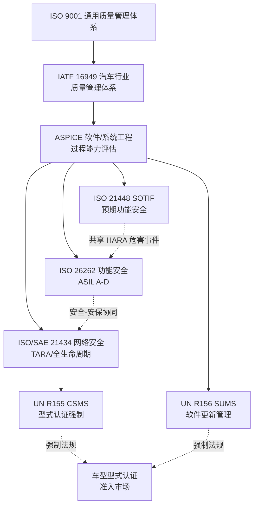
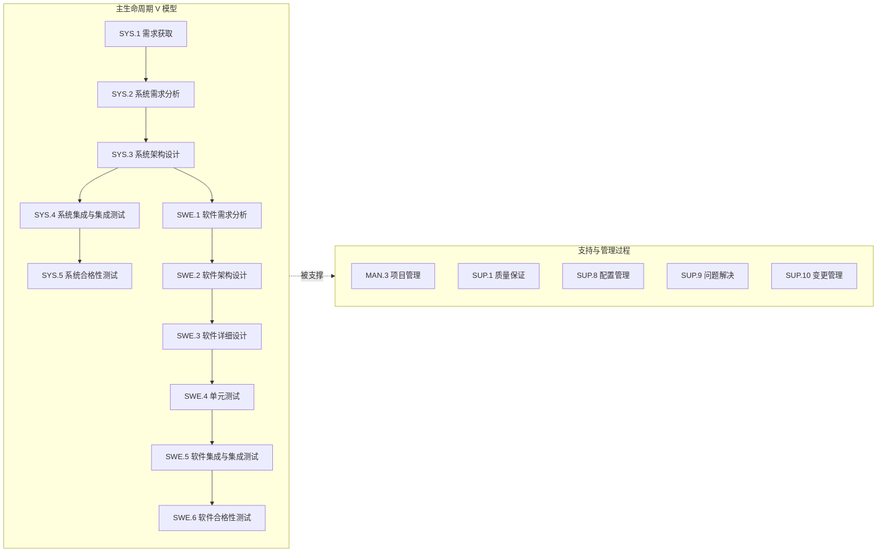
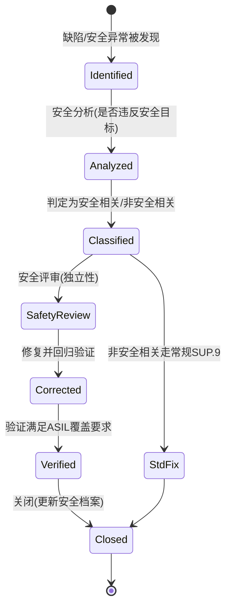
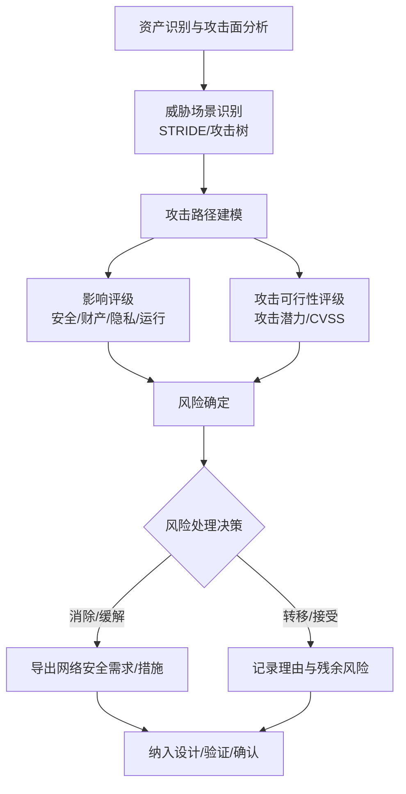
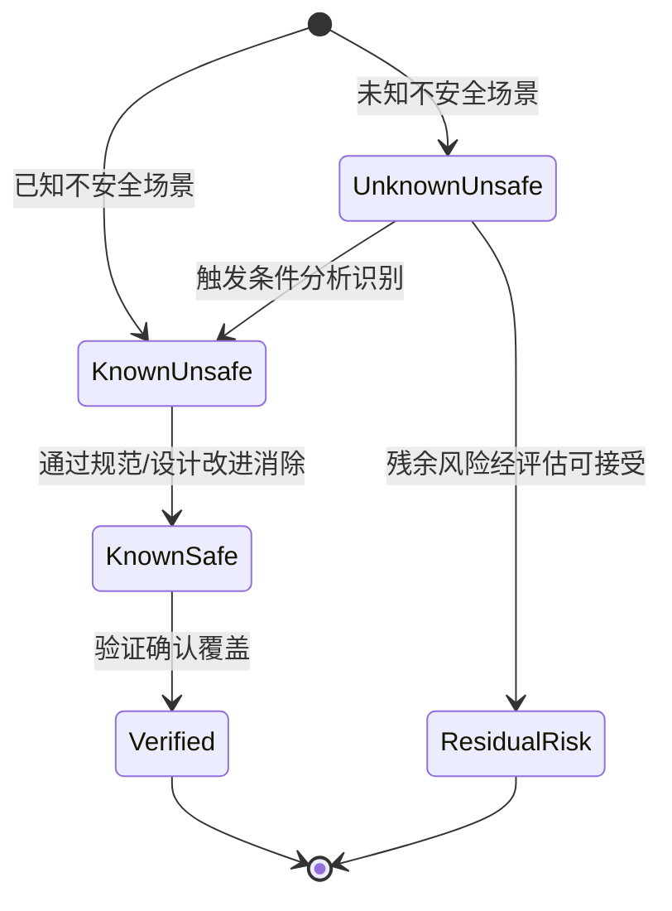
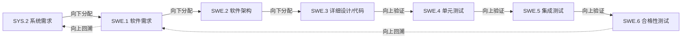
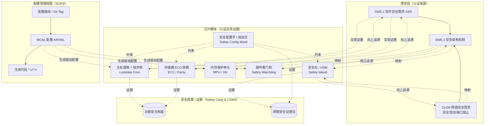
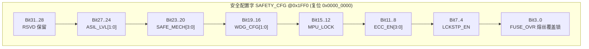
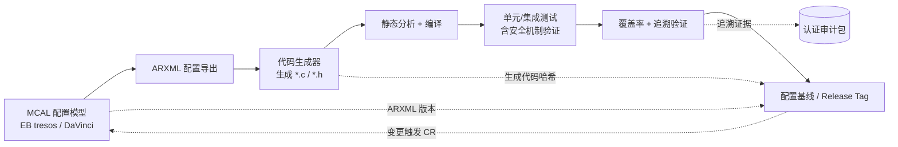

# 汽车软件认证与流程体系：从 ASPICE 到 ISO 26262 / 21434 / 21448 的全景、落地与芯片级证据链

## 零、写在前面：为什么"流程"是汽车软件的硬通货

在消费电子与互联网行业，一句流行的说法是"先跑起来再说"，迭代速度快于一切。但汽车是典型的安全攸关（safety-critical）且长生命周期（通常 15 年、数十万公里）的复杂系统。一辆现代智能汽车搭载的软件代码量已经突破上亿行，电子电气架构从分布式 ECU 走向中央计算平台与域控制器，整车 OTA 让软件在售后再持续演进。在这种背景下，**软件的"一次性正确"几乎不可能靠个人英雄主义实现，必须靠一套经过认证、可被审计、可重复执行的工程流程来兜底**。

这也是为什么汽车软件工程师的简历里，"做过 XX 功能"远不如"在 ASPICE L2/L3 体系下负责过 SWE.3/4""参与过 ISO 26262 ASIL D 项目""支撑过 UN R155 CSMS 型式认证"这些表述值钱。认证不是纸上谈兵，它直接决定了：

- 一家供应商能否进入主机厂（OEM）的定点（award）名单；
- 一款车型能否通过各国型式认证（type approval）合法上市销售；
- 一旦发生召回或事故，企业能否用"我们遵循了公认标准"来追溯责任、保护组织。

更进一步说，认证体系的真正价值在于**把"不可预测的个人判断"替换为"可追溯、可审计、可重复的组织能力"**。它不只是写在墙上的口号，而是要落到每一个工件（artifact）上——从一条系统需求、一段软件代码、一份配置基线，一直到芯片内部的安全机制使能与 MCAL 配置字。本文试图把汽车软件领域最重要的几张"证书"与"流程体系"放在同一张地图上，讲清它们各自的边界、相互关系，以及它们究竟如何改变了我们每天从需求、设计、编码、配置到芯片落地的每一个动作。

文中所有标准均为真实存在的国际/行业规范（不杜撰参数）；第一人称统一以"笔者"代称；新增的芯片与 MCAL 内容从"认证如何落到芯片/MCAL 配置与证据链"的角度展开，所有寄存器/位域、IP 框图均使用符合常见实现逻辑的通用示意，不指向任何特定厂商的真实料号，避免误导。

---

## 一、体系全景：七张证书，各管一段

在展开每一块之前，先建立一张全景图。汽车软件的质量与合规保障并不是单一标准能覆盖的，而是一组**互补、有时重叠**的标准族。可以用"三横四纵"粗略理解：

- 横向的质量底座：ISO 9001（通用质量管理）→ IATF 16949（汽车行业质量管理）；
- 纵向的能力与合规维度：ASPICE（软件/系统工程过程能力）、ISO 26262（功能安全）、ISO/SAE 21434（网络安全）、ISO 21448（预期功能安全 SOTIF），以及由联合国 WP.29 法规驱动的 UN R155（CSMS 网络安全管理体系）与 UN R156（SUMS 软件更新管理体系）。

下面这张图给出它们的归属与耦合关系。



注意其中两类逻辑：ASPICE、ISO 26262、ISO/SAE 21434、ISO 21448 属于**标准（standard）**，多为自愿性（客户或行业要求），而 UN R155 / R156 属于**技术法规（regulation）**，由各国政府（通过 WP.29 协调）强制实施，未通过则车型无法注册登记。ISO/SAE 21434 实际上是支撑 UN R155 的"实现方法"标准——法规要求车企具备 CSMS（网络安全管理体系），而 21434 给出了如何建立这套体系的具体工程方法。

### 1.1 认证体系对比表

为了直观对比，先把七套体系的关键属性列在一张表上。

| 体系/标准 | 性质 | 发布/归口 | 核心目标 | 主要方法或产出 | 适用对象 | 与开发流程耦合度 |
| --- | --- | --- | --- | --- | --- | --- |
| ISO 9001 | 通用标准（自愿） | ISO | 通用质量管理体系 | 过程方法、PDCA、风险思维 | 所有组织 | 中 |
| IATF 16949 | 行业标准（客户要求） | IATF / ISO | 汽车行业质量管理 | APQP、FMEA、SPC、MSA、PPAP | 零部件供应商/OEM | 中高 |
| ASPICE | 过程评估模型（客户要求） | intACS / VDA / ISO 330xx | 软件/系统工程过程能力 | 过程评估、能力等级 L1–L5 | 软件/系统开发商 | 极高 |
| ISO 26262 | 功能安全标准（安全攸关） | ISO / IEC | 电气电子系统功能安全 | HARA、安全生命周期、ASIL | E/E 系统供应商 | 高 |
| ISO/SAE 21434 | 网络安全工程标准 | ISO / SAE | 道路车辆网络安全 | TARA、网络安全生命周期 | 整车及供应链 | 高 |
| UN R155 | 技术法规（强制） | UN WP.29 | CSMS 与车型网安认证 | 强制型式认证、CSMS 证书 | OEM（整车） | 高（间接） |
| UN R156 | 技术法规（强制） | UN WP.29 | SUMS 与 OTA 合规 | 软件识别号、更新管理系统 | OEM（整车） | 高（间接） |
| ISO 21448 (SOTIF) | 预期功能安全标准 | ISO | 非故障导致的风险 | 已知/未知不安全场景分析 | 感知/决策/ADAS 系统 | 中高 |

从表中可以读出几个关键点：第一，ISO 9001 是地基，IATF 16949 是在其之上叠加汽车行业特殊要求的"加强版"；第二，ASPICE 与 ISO 26262 / 21434 / 21448 都是"过程/工程方法"层面的标准，它们彼此之间大量互引、协同；第三，真正卡住车型上市咽喉的是 UN R155 / R156 这类法规，但它们的"解法"依赖前面的工程标准。

### 1.2 一个真实场景：选型与合规的一票否决

在笔者参与的一次新平台底层软件准入评审里，硬件同事推荐了一颗性能指标亮眼、价格也很有优势的 MCU。笔者作为底层软件负责人，问了三个问题："它的 AEC-Q100 Grade 是多少？原厂有没有 IATF 16949 证书？是否提供功能安全安全手册（Safety Manual）以支持目标 ASIL？"对方答："这颗是工业级，Grade 没明确标，IATF 16949 暂时没有，也没有 Safety Manual。"结果这颗料在评审里被一票否决——不是它跑不动我们的软件，而是它**过不了车规准入与功能安全流程的门槛**。

这个场景说明：在汽车软件与硬件协同的世界里，合规与流程不是事后补的文档，而是**选型阶段就介入的一票否决项**。而这套否决逻辑，最终要能追溯到芯片内部——有没有安全手册、有没有可配置的安全机制、有没有可供审计的配置字与熔丝位——这正是本文第九至十一章要展开的主线。下文将沿着这条主线，把每一项体系讲透。

---

## 二、ASPICE：软件/系统工程过程能力的度量尺

### 2.1 什么是 ASPICE

ASPICE 全称 Automotive SPICE，是汽车行业用于**评估软件和系统开发过程能力**的参考模型。其底层方法论建立在 ISO/IEC 330xx（过程评估）系列与早年的 ISO/IEC 15504 之上，过程定义则大量借鉴了 ISO/IEC 12207（软件生命周期）与 IEEE 1220 等。简单说，ASPICE 回答的问题是：**"你们团队的开发过程，到底靠不靠谱、可不可重复、能不能预测结果？"**

需要澄清一个常见误解：ASPICE 评估的不是"产品好不好"，而是"过程能力达不达标"。一个过程能力 L3 的团队，不能保证交付零缺陷产品，但能保证交付过程高度规范化、可追溯、可预测，从而在统计意义上把缺陷率控制在可接受范围。这与 ISO 26262 关注"产品在安全意义上是否足够可靠"是不同维度，但二者在实践中高度协同。

### 2.2 过程分组与 VDA Scope

ASPICE 的过程被划分为若干组（process groups），每个过程有一个编号（如 SYS.1、SWE.3）。完整模型包含五大类：

- **Primary Life Cycle Processes（主生命周期过程）**：包括系统工程（SYS.1–SYS.5）与软件工程（SWE.1–SWE.6）。这是评估的重头戏。
- **Supporting Processes（支持过程，SUP）**：如 SUP.1 质量保证、SUP.8 配置管理、SUP.9 问题解决管理、SUP.10 变更请求管理。
- **Management Processes（管理过程，MAN）**：如 MAN.3 项目管理。
- **Process Improvement（过程改进，PIM）**。
- **Reuse（复用过程，REU）**。

所谓 **VDA Scope**，是德国汽车工业协会（VDA）联合 OEM 约定的一组"必查"过程范围，用于统一供应链评估口径。经典 VDA Scope 涵盖约 16 个过程，常见包含：

- SYS.1 需求获取、SYS.2 系统需求分析、SYS.3 系统架构设计、SYS.4 系统集成与集成测试、SYS.5 系统合格性测试；
- SWE.1 软件需求分析、SWE.2 软件架构设计、SWE.3 软件详细设计与单元构建、SWE.4 软件单元测试、SWE.5 软件集成与集成测试、SWE.6 软件合格性测试；
- SUP.1 质量保证、SUP.8 配置管理、SUP.9 问题解决管理、SUP.10 变更请求管理、MAN.3 项目管理、ACQ.4 供应商监控等。

下面用一张图把"系统工程—软件工程"的 V 模型与配套支持/管理过程叠在一起，这是 ASPICE 评估时最常被画出来的骨架。



### 2.3 过程能力等级（Capability Levels）

ASPICE 沿用了 ISO/IEC 330xx 的能力等级定义，从 L0 到 L5。每升一级，都意味着过程成熟度与组织化程度的跃迁。下面给出能力等级表。

| 能力等级 | 名称（英文/中文） | 核心判定（过程属性 PA） | 过程属性达标要求 | 组织含义 |
| --- | --- | --- | --- | --- |
| L0 | Incomplete / 不完整 | 无 | 过程未执行或失效 | 混乱，结果不可预测 |
| L1 | Performed / 已执行 | PA1.1 过程执行 | 仅 PA1.1 达标 | 过程做了，但依赖个人；不可重复 |
| L2 | Managed / 已管理 | PA2.1 绩效管理、PA2.2 工作产品管理 | PA1.1 + 全部 L2 PA | 过程被计划、监控，工作产品受控；项目级已定义 |
| L3 | Established / 已建立 | PA3.1 过程定义、PA3.2 过程部署 | L1+L2 全部 + L3 PA | 过程标准化、组织级裁剪，跨项目一致 |
| L4 | Predictable / 可预测 | PA4.1 定量管理 | 含 L4 PA | 过程性能可定量度量、统计受控 |
| L5 | Innovating / 持续优化 | PA5.1 过程创新 | 含 L5 PA | 基于量化反馈持续优化创新 |

过程属性（Process Attribute, PA）的评分采用 NPLF 四档：N（Not achieved 未达成，0–15%）、P（Partially 部分达成，16–50%）、L（Largely 大部分达成，51–85%）、F（Fully 完全达成，86–100%）。最终过程能力等级取"最低短板"——例如 L2 要求 PA1.1、PA2.1、PA2.2 全部至少达到 L（大部分达成）；任一不达标则等级下探。

> 实战提示：多数 Tier-1 供应商在 OEM 定点时承诺达到 ASPICE L2（部分关键过程 L3）。真正能稳定维持 L3 的组织，往往已经建立了组织级过程资产库（PAL），实现了"过程资产 + 项目裁剪"的运作模式。L4/L5 在国内供应商中仍属稀缺。

### 2.4 关键过程要点速览

下面把 VDA Scope 内最常被审计的过程逐一展开，说明"做什么、产出什么、常见坑在哪"。

- **SYS.1 需求获取（Requirements Elicitation）**：识别并整理利益相关方（客户、法规、内部）的诉求，形成利益相关方需求。常见坑：把"客户口头说的"当需求却无记录，导致后续追溯断点。
- **SYS.2 系统需求分析**：把利益相关方需求转化为结构化、可验证的系统需求，包含功能性与非功能性（性能、安全、安保）需求，并做一致性/可行性分析。典型产出是《系统需求规格书》，每条需求应有唯一 ID、优先级、验证方法。与 ISO 26262 的 HARA 输出、21434 的网络安全需求在此交汇。
- **SYS.3 系统架构设计**：定义系统元素、接口、动态行为，并做架构的合理性论证。功能安全里的安全概念（TSR、安全机制）往往在此落地为架构元素。需论证要素冗余、独立性、降级策略。
- **SYS.4 系统集成与集成测试**：按集成策略逐步把系统元素集成，并验证接口与交互。强调"集成顺序"有依据，而非随意拼装。
- **SYS.5 系统合格性测试**：在整车/系统层面验证系统需求被满足，是交付前的最后一道系统级确认。
- **SWE.1 软件需求分析**：将系统需求中软件承担的部分细化为软件需求，显式标注功能/性能/安全（SSR）/安保属性。必须与 SYS.3 架构元素建立向下追溯链接。
- **SWE.2 软件架构设计**：定义软件组件、接口、动态行为、资源消耗。ASIL 越高，对架构的模块化、可验证性、独立性（freedom from interference）要求越严。安全机制（看门狗、E2E、内存分区）需在此标注并追溯至 SSR。
- **SWE.3 软件详细设计与单元构建**：完成组件级详细设计并编码。要求遵循语言子集（MISRA C/C++）、防御性编程、低复杂度（圈复杂度阈值）。静态分析应无强制（required）级违规。
- **SWE.4 软件单元测试**：验证详细设计与代码单元。覆盖率目标随 ASIL 递增：ASIL A/B 通常要求语句+分支覆盖，ASIL C/D 要求 MC/DC（修正判定条件覆盖）。
- **SWE.5 软件集成与集成测试**：按集成策略验证组件间接口与交互，验证架构设计假设。
- **SWE.6 软件合格性测试**：在软件层面验证软件需求被满足，记录并追溯至 SWE.1。
- **SUP.1 质量保证**：独立于项目管理与开发，对过程与产品提供客观保证（如过程审计、产品审计）。
- **SUP.8 配置管理**：版本、基线、变更的可追溯，是双向追溯的物理基础。需定义配置项清单、基线策略、工具与权限。在芯片/MCAL 语境下，SUP.8 还要把 MCAL 配置 ARXML、生成代码、配置字定义一并纳入配置库（详见第十一章）。
- **SUP.9 问题解决管理**：缺陷从发现、分析、修复到关闭的闭环，需有严重度分级与升级机制。
- **SUP.10 变更请求管理**：所有变更经 CR 提出，做影响分析（范围、成本、进度、质量、安全/安保影响），评审后实施并验证。
- **MAN.3 项目管理**：计划、监控、里程碑、风险与机会管理，需维护风险登记册并定期评审。

### 2.5 评估与证据

ASPICE 评估由具备资质的评估师（当前由 intACS 体系认证的 Competent Assessor）执行，通常分三阶段：

1. **准备**：确定评估范围（哪些过程、哪些项目、哪些生命周期阶段）、收集证据计划。
2. **现场执行**：文档审查（process instance，即"过程实例"——某项目某阶段实际执行留下的痕迹）、人员访谈、工具演示。
3. **评级与报告**：对每个过程属性打分，形成评级报告。

评估的关键词是"**证据（evidence）**"。过程不是靠嘴说"我们这么做"，而是靠留下可追溯的工作产品与记录。一个典型的评估证据链：需求文档（SYS.2）→ 架构文档（SYS.3）→ 软件需求/架构（SWE.1/2）→ 代码与单元测试报告（SWE.3/4）→ 评审记录、缺陷单、配置库标签。任何一环"断链"都会影响评级。当证据链延伸到芯片级时，这条链还要继续向下贯穿到 MCAL 配置项、配置字位域与安全机制使能记录（见第九至十一章）。

### 2.6 差距分析（Gap Analysis）怎么落地

在正式评估前，组织通常会做一次差距分析，识别当前过程与目标的差距。下面给出一段用于差距分析的脚本化思路，便于工程团队把"定性自审"结构化。

```python
# 脚本：ASPICE 差距分析自动化盘点（示意）
# 说明：遍历 VDA Scope 内每个过程的过程属性，按 NPLF 收集证据并打分，
#       把未达成/部分达成的项生成为可执行的整改 backlog。

def gap_analysis(scope_processes, target_level):
    report = []
    for proc in scope_processes:                  # 遍历 VDA Scope 内的每个过程
        for pa in required_pa(proc, target_level): # 该目标等级要求的过程属性
            evidence = collect_evidence(proc, pa)  # 收集文档/记录/访谈证据
            score = rate_nplf(evidence)            # 按 NPLF 打分: N/P/L/F
            if score in ("N", "P"):                # 未达成或部分达成 → 记为差距
                report.append({
                    "process": proc,
                    "pa": pa,
                    "score": score,
                    "gap": describe_gap(evidence),  # 描述缺什么证据/动作
                    "action": recommend_action(proc, pa)
                })
    return sort_by_priority(report)               # 优先修补对等级最致命的短板

# 使用：gap_analysis(["SWE.1","SWE.2","SWE.3","SWE.4","SUP.8"], target_level=2)
```

差距分析的核心价值，是把"我们想达到 L2"变成一张可执行的整改清单（backlog），逐条闭环。

### 2.7 评估打分实操与高频失分点

在真实评估中，评估师对每个过程属性按 NPLF 打分，最终等级取"短板"。笔者总结几类最常见的失分情形，供团队规避：

- **"只有结果没有过程"**：例如 SWE.4 有测试报告，但找不到测试计划、测试用例与设计的可追溯链接，PA2.2（工作产品管理）失分。
- **"评审无遗留项追踪"**：评审记录写了"通过"，但没有记录提出的问题与关闭证据，PA2.1（绩效管理）被质疑。
- **"项目级做了、组织级没有"**：某项目达到 L2，但缺乏组织级标准过程与裁剪指南，无法证明可复制，影响向 L3 迈进。
- **"追溯靠手工、易断链"**：需求、设计、测试用例分散在多个工具，靠人工表格维护双向追溯，评估时链接对不上。成熟做法是引入需求管理工具（如 Polarion、DOORS、Jama）自动生成追溯矩阵，并把芯片/MCAL 配置项也纳入同一追溯底座。

需要强调的是，ASPICE 评估结论有"带条件通过"的情况：某些 PA 部分达成但已有整改计划，评估师会在报告中标注 observed weakness。组织应把这些 weakness 纳入下一年改进目标，形成"评估—改进—再评估"的螺旋上升。

此外，ASPICE 与车企的供应商审核常常捆绑。OEM 会要求 Tier-1 定期提交评估证书或自评结果，并把某些过程（如 SWE.4 覆盖率、SUP.8 配置管理）作为供应商定点的硬性门槛。因此，ASPICE 等级不仅是质量证明，更是商业准入的"门票"。

### 2.8 ASPICE 与敏捷开发能否兼容

一个常被问到的问题是：ASPICE 这种"重文档、重阶段"的模型，和敏捷（Scrum/Kanban）这种"快速迭代"的方法是否冲突？答案是否定的——二者关注点不同，可以且应当结合。

ASPICE 约束的是"必须有哪些过程与产出"，并不规定"必须用瀑布还是迭代"。敏捷约束的是"如何组织迭代节奏"。落地的关键在于：把 ASPICE 的过程属性映射到敏捷的仪式（ceremony）与工件上。例如，将 SWE.1 软件需求分析对应到 Product Backlog 的 refine 与 Sprint Planning；把同行评审（PA2.2 相关）嵌入 Pull Request 的代码评审；把每个 Sprint 的完成定义（DoD）与 SWE.4/SWE.5 的验证准则绑定；把 Sprint Review 作为阶段评审门禁的输入。配置管理（SUP.8）天然与 Git 的分支/标签/基线契合——这正是 MCAL 配置基线管理（第十一章）能在敏捷车规开发中落地的底层支撑。

需要警惕的反模式是"挂着敏捷的羊头，卖着无流程的狗肉"——迭代很快，但需求无 ID、测试无追溯、缺陷无登记，评估时依然只能评到 L1。真正成熟的车规敏捷，是把 ASPICE 的"过程属性"作为跨 Sprint 的质量红线，用自动化（CI 中的静态分析、覆盖率门禁、追溯矩阵生成）把合规成本压到最低，让工程师聚焦创造价值而非填表。

---

## 三、功能安全 ISO 26262 与流程的耦合

### 3.1 ISO 26262 是什么

ISO 26262《道路车辆—功能安全》是针对汽车电气电子（E/E）系统功能安全的国际标准（现行版本 ISO 26262:2018，含 Part 1–12），源于工业领域的 IEC 61508，专门针对道路车辆做了裁剪与适配。它处理的是"**由于 E/E 系统故障（系统性故障或随机硬件失效）导致的不合理风险**"。

核心概念是 **ASIL（Automotive Safety Integrity Level，汽车安全完整性等级）**，由危害分析与风险评估（HARA）得出，分为 ASIL A（最低）到 ASIL D（最高），另有 QM（质量管理，无功能安全要求）。ASIL 由三个因子决定：严重度（S0–S3）、暴露概率（E0–E4）、可控性（C0–C3）。ASIL 越高，对流程严谨度、冗余、诊断覆盖率、验证确认强度的要求越苛刻。

### 3.2 功能安全生命周期与 ASPICE 的叠加

ISO 26262 定义了一个横跨概念、系统、硬件、软件、生产、运维、报废的安全生命周期。其中软件层面的要求（Part 6）与 ASPICE 的 SWE 过程高度重叠，但又额外叠加了安全专属要求，例如：

- 软件安全需求（SSR）必须自上而下从技术安全概念（TSC）追溯而来；
- 软件架构设计需满足独立性（freedom from interference）、安全机制（如 E2E 保护、看门狗、内存分区）的部署；
- 编码需遵循语言子集（如 MISRA C/C++）与模块化、可验证原则；
- 验证需达到对应 ASIL 的覆盖率目标（如 ASIL D 要求 MC/DC 覆盖）；
- 需有**确认措施（confirmation measures）**：独立性评审、功能安全评估（FSA）、安全审计。

这正是"流程耦合"的本质：一个同时做 ASPICE L2 与 ISO 26262 ASIL D 的团队，其 SWE.2（软件架构设计）文档里，既要满足 ASPICE 的过程属性，又要显式包含安全机制、独立性论证、ASIL 分解记录。两份标准在同一份工作产品上"合流"。

下面用状态图表达一个安全相关软件缺陷在 ISO 26262 语境下的处置生命周期，注意它与 SUP.9 问题解决过程的衔接。



### 3.3 安全文化与确认措施

ISO 26262 强调"功能安全文化"与"确认措施"，这与纯工程流程不同，它要求组织层面建立：安全经理（Safety Manager）角色、独立的功能安全评估（由具备资质的人员执行，且与开发团队独立）、安全档案（Safety Case）的编制与维护。流程上，这些往往体现为额外的评审门禁（gate）与签字责任矩阵（RACI）。

### 3.4 安全机制如何"落到芯片"——承上启下的关键

ISO 26262 Part 6 要求的安全机制，并非都能仅靠软件实现。大量安全机制（如核锁步、存储器 ECC、MPU 内存分区、硬件看门狗、时钟监控、电源监控）本质上是**硬件 IP 提供的原子能力**，软件（含 MCAL）只是"使能"和"监督"它们。因此，功能安全认证的证据链必然要穿透到芯片内部：

- 硬件 IP 是否按照目标 ASIL 提供了足够的诊断覆盖率（DC）？这由芯片原厂的**安全手册（Safety Manual）**与**失效模式分析（FMEDA）**证明；
- 软件是否按安全手册的要求"使能"了这些安全机制？这由 MCAL 配置与启动代码（startup）证明；
- 配置字/熔丝位是否锁定了安全相关设置、防止被意外或恶意篡改？这由配置字位域定义与烧录记录证明。

这三点，正好对应本文第九至十一章的芯片模块设计、驱动代码实现与 MCAL 配置。换言之，功能安全认证在芯片层面的"最后一公里"，就是把"安全需求 → 硬件 IP → MCAL 配置项 → 配置字位域 → 证据记录"这一条链完整闭合。

---

## 四、网络安全 ISO/SAE 21434 与 UN R155：CSMS 与 TARA

### 4.1 为什么网络安全成为法规

传统汽车是相对封闭的机械系统，入侵面有限。但网联化（T-Box、V2X）、智能化（自动驾驶）、OTA 升级让汽车变成"轮子上的计算机"，攻击面骤增。联合国 WP.29 于 2020 年前后通过 **UN R155（网络安全管理体系 CSMS 与车型网络安全）** 与 **UN R156（软件更新管理体系 SUMS）** 两项法规，自 2022 年起在缔约方（欧盟、日本、韩国等）对新车型强制实施。这意味着：**不满足 CSMS 要求的车型，无法获得型式认证、无法上市**。

### 4.2 ISO/SAE 21434：网络安全的工程方法

ISO/SAE 21434《道路车辆—网络安全工程》（现行版本 ISO/SAE 21434:2021）给出了建立和实施网络安全管理体系（CSMS）的端到端工程方法，覆盖概念、设计、开发、生产、运维、报废全生命周期，并延伸到供应链。它定义的核心活动包括：

- 网络安全治理（cybersecurity governance）与风险管理框架；
- **TARA（Threat Analysis and Risk Assessment，威胁分析与风险评估）**；
- 网络安全概念（Cybersecurity Concept）与需求；
- 网络安全设计、实现、验证、确认；
- 生产控制、运维漏洞管理、事件响应。

TARA 是整个 21434 的"发动机"。它的输入是资产识别与攻击面，输出是威胁场景、攻击路径、影响评级（如安全/隐私影响）、攻击可行性评级，最终得到**风险值**，并据此决定风险处理决策（消除、缓解、转移、接受）。常见的攻击可行性评级方法参考工具包括 CVSS、攻击潜力（attack potential）维度（如所需时间、专业度、机会窗口、设备）等。

下面用流程图表达 TARA 的标准步骤。



举一个具体例子帮助理解 TARA：假设资产是"中央网关对 CAN 总线的访问控制"。威胁场景之一为"攻击者通过 compromised 的网联 ECU 向动力 CAN 注入伪造制动报文"。攻击路径分析会考虑：该网联 ECU 是否具备可信执行环境、网关是否做源身份认证（如基于 MAC 或 E2E 保护）、总线是否缺乏加密与鉴权。影响评级可能给出"安全影响高"（涉及车辆横纵向控制）、攻击可行性"中等"（需物理或近端访问、一定专业度）。综合得到的风险等级若为"不可接受"，则风险处理决策是"缓解"，导出网络安全需求：网关对跨域报文做来源鉴权与新鲜度校验、关键控制报文启用 E2E Profile、对异常报文速率进行入侵检测（IDS）。这些需求随后进入 SWE.1/2，并与 ISO 26262 的安全机制协同评审，避免安全隔离被鉴权机制破坏。

在安全启动（secure boot）、调试接口锁止、熔丝位保护这类网络安全需求上，同样要落到芯片配置字与 MCAL/BSW 配置——这正是芯片模块设计与 MCAL 配置章节要覆盖的"安保侧"证据。

### 4.3 UN R155 的 CSMS 要求与型式认证

UN R155 要求 OEM 在车型型式认证时，证明其具备有效的 CSMS（覆盖组织、车型项目、后生产阶段），并通过网络安全车型认证（vehicle type approval）。CSMS 的关键要素包括：

- 组织层面的网络安全管理（方针、角色、职责）；
- 网络安全风险管理流程；
- 网络安全事件响应与漏洞披露机制；
- 对车型项目全生命周期的网络安全治理；
- 对供应链的网络安全要求传导。

注意逻辑链路：ISO/SAE 21434 是"如何做"的方法标准，UN R155 是"必须证明你有"的法规定书。实践中，OEM 通常以 21434 为框架搭建 CSMS，再向认证机构提交符合性证据以换取 CSMS 证书与车型认证。

### 4.4 与功能安全的协同

网络安全与功能安全（ISO 26262）在方法论上同源（都做危害/威胁分析与风险评级、都强调全生命周期、都要求供应链协同），但实际关注的风险来源不同：功能安全关注"故障"，网络安全关注"人为恶意攻击"。现代车型开发往往建立"安全与安保协同分析（safety-security co-analysis）"，避免缓解措施相互冲突（例如一个安全隔离机制被某个安保需求绕过）。在芯片层面，这种冲突也会显现：比如 MCAL 为了功能安全使能了某个调试/观测机制，却可能成为网络安全的攻击面——两者必须在配置字与 MCAL 配置上统一决策。

### 4.5 供应链网络安全要求的传导

汽车网络安全不是 OEM 一家的事。一辆车的软件与硬件来自数百家 Tier-1/Tier-2 供应商，攻击面分布在每一个组件。UN R155 与 ISO/SAE 21434 都明确要求 OEM 把网络安全要求"向下游传导"，并通过合同、规范、审核保证供应商落实。

典型传导动作包括：在采购规范（SOR）中写入网络安全条款（如"组件须支持安全启动""提供 SBOM 软件物料清单""交付 TARA 报告"）；对关键供应商开展网络安全能力审核；要求供应商在交付物中包含网络安全证据（安全概念、验证报告、残余风险说明）。供应商侧则需在自身开发过程中执行 21434，产出可被 OEM 复用的 TARA 子项与网络安全需求，形成"整车—组件"两级 TARA 的衔接。这条链一旦断裂，整车 CSMS 的完整性就会出现缺口，型式认证时会被认证机构挑战。

---

## 五、SOTIF ISO 21448：预期功能安全（非故障导致的风险）

### 5.1 SOTIF 解决什么问题

ISO 21448（SOTIF，Safety of the Intended Functionality，现行版本 ISO 21448:2022）处理的是**即使系统不存在任何故障，仍可能因"功能设计局限或合理可预见的误用"导致危害**的场景。典型例子：

- 自动驾驶感知算法在罕见天气（强反光、特殊积雪纹理）下误判障碍物；
- 驾驶员因对辅助驾驶过度信任而发生的"合理可预见的误用（reasonably foreseeable misuse）"；
- 传感器在 ODD（设计运行域）边界处的性能不足。

这类风险不是由"故障"引起，所以 ISO 26262 覆盖不到——这就是 SOTIF 的独立价值。

### 5.2 SOTIF 的过程框架

SOTIF 把场景划分为四象限，核心是识别并消减"已知不安全"与"未知不安全"区域：

- 已知安全 / 已知不安全（可通过规范与验证处理）；
- 未知安全 / 未知不安全（需通过触发条件分析、数据驱动验证、运行监测去收敛）。

典型活动包括：功能规范与性能约束的明确、触发条件（triggering conditions）识别、感知/决策能力边界分析、基于场景的验证与确认、已知误用分析、运行阶段监控与反馈。下面用状态图表达 SOTIF 风险区域的收敛过程。



### 5.3 SOTIF 与 26262 / 21434 的关系

SOTIF 与 ISO 26262 互补：一个自动驾驶系统，既要满足 26262（防止故障导致危害），又要满足 21448（防止功能局限/误用导致危害）。二者共享 HARA 的产出（危害事件），并在系统层面统一分析。ISO/SAE 21434 则处理对抗性威胁。三者共同构成当代智能驾驶"非故障—故障—被攻击"三维风险的全覆盖。

在验证策略上，SOTIF 强调"基于场景的验证与确认（scenario-based V&V）"与"远离（departure from）分析"：通过仿真、封闭场地测试、真实道路长里程测试，逐步把未知不安全区域压缩到可接受水平；对已知不安全场景，则通过功能改进或限制 ODD 来消除或缓解。需要指出，SOTIF 的验证往往高度依赖数据驱动方法（如大规模场景库、边界场景挖掘），这对测试资产与数据治理能力提出了比传统 V 模型更高的要求，也是当前行业投入的重点方向之一。

---

## 六、认证对开发流程的实际改变

很多工程师第一次进入车规项目会"水土不服"，因为认证体系从根本上改变了日常动作。下面逐条拆解这些"被迫"的改变，以及它们为什么其实有价值。

### 6.1 文档化：从"代码即文档"到"文档先于代码"

ASPICE 与 ISO 26262 都要求"先有需求，后有设计，再有实现与验证"，且每一步都要留下工作产品。这打破了互联网行业"先写代码再补注释"的习惯。典型改变：

- 写代码前必须有经评审的软件需求（SWE.1）与架构（SWE.2）文档；
- 每次变更都要有变更请求（SUP.10）与影响分析；
- 设计决策需要"理由"记录，便于追溯。

表面看降低速度，实质是把"隐性知识"显性化，降低人员流动带来的风险。

### 6.2 评审（Review）：门禁而非形式

认证体系要求对关键工作产品进行正式评审，并留下评审记录（参与者、结论、遗留项）。评审成为"门禁"——未通过评审的工件不得进入下一阶段。下面给出一段可落地的评审门禁脚本（真实可执行，带注释）。

```python
# 脚本：阶段评审门禁（stage gate）自动化检查
# 说明：在 CI 流水线的发布前阶段调用本脚本，对关键工件做放行前检查。
#       任一检查项不通过则阻断发布，并输出未通过项清单。

def stage_gate(artifact, phase):
    checks = {
        "baseline_tagged": config_mgmt.has_baseline(artifact),   # 配置库已基线（SUP.8）
        "peer_reviewed":   review.has_approved_record(artifact), # 同行评审已通过且有记录
        "trace_links":     traceability.complete(artifact),      # 双向追溯完整（SYS/SWE）
        "coverage_met":    verify.coverage_ok(artifact, phase),  # 验证覆盖达标（ASIL 相关）
        "defects_closed":  issues.all_closed(artifact),          # 关联缺陷已关闭（SUP.9）
        "mcal_baselined":  mcal.is_baselined(artifact),          # MCAL 配置已基线（第十一章）
    }
    failed = [k for k, v in checks.items() if not v]
    if failed:
        gate = "BLOCKED"
        raise GateBlockedError(f"门禁未通过: {failed}")          # 阻断进入下一阶段
    gate = "PASSED"
    signoff.record(artifact, phase)                              # 记录放行签字（RACI）
    return gate

# 使用：stage_gate("SWE3_EngineCtrl", phase="SWE.4-entry")
```

### 6.3 双向追溯（Bidirectional Traceability）

这是 ASPICE 与 ISO 26262 共同强调的硬性要求。所谓双向追溯，是指任意两个相邻层级的工件之间，既能"自顶向下"追踪（需求 → 设计 → 实现 → 验证），也能"自底向上"回溯（某条测试用例 → 它验证了哪条需求）。它的价值在于：

- 证明"每条需求都被实现并验证"（完整性）；
- 证明"每段代码/每个测试都有存在理由"（无冗余/无遗漏）；
- 变更影响分析时，能快速定位"改这一行代码会影响哪些安全需求"。

下面用图表达需求到验证的双向追溯链。



当追溯链延伸到芯片级时，"实现"这一环还要继续向下贯穿到 MCAL 配置项与配置字位域（见第九、十一章），即：SWE.3 代码 → MCAL 配置项（如 Mcu、Wdg、Gpt 模块） → 芯片安全 IP/配置字。

### 6.4 配置管理（Configuration Management）

SUP.8 要求对所有工作产品进行版本控制、基线管理与变更追踪。在车规项目里，一次发布（release）必须能精确重建："当时用的需求文档是哪一版、代码是哪次提交、编译工具链是什么版本、生成的二进制哈希是多少"。配置管理是双向追溯得以成立的物理基础，也是事故回溯、召回定位的"黑匣子"。在芯片/MCAL 语境下，配置管理还要覆盖：MCAL 配置 ARXML 版本、由 ARXML 生成的代码版本、芯片配置字定义（option bytes/fuse）版本——三者必须锁在同一发布基线内。

---

## 七、如何为认证做准备（过程资产、检查单、审计配合）

### 7.1 建立组织级过程资产库（PAL）

要稳定通过 ASPICE 评估，单靠某个项目"临时抱佛脚"几乎不可能。成熟组织会建立 **Process Asset Library（PAL）**，沉淀：

- 标准过程定义（含裁剪指南 tailoring guideline）；
- 模板（需求模板、架构模板、测试报告模板）；
- 检查单（checklist）、指南（编码规范、评审指南）；
- 工具链与自动化脚本（静态分析、覆盖率、追溯矩阵生成、MCAL 配置审计）。

项目启动时，从 PAL 中"实例化"出项目专用过程，并记录裁剪理由。这样既保证一致性，又保留必要的项目灵活性。

### 7.2 过程检查单示例

下面给出一份面向 ASPICE SWE 过程、并纳入芯片/MCAL 视角的简化检查单，用于项目自检。

```text
# SWE 过程就绪检查单（节选，含芯片/MCAL 视角）
[ ] SWE.1 软件需求已定义且经评审，含功能/非功能/安全/安保属性
[ ] SWE.1 与 SYS.3 架构元素存在向下追溯链接
[ ] SWE.2 架构设计包含组件、接口、动态行为，已论证
[ ] SWE.2 安全机制（看门狗/E2E/分区）已标注并追溯至 SSR
[ ] SWE.3 详细设计遵循 MISRA 子集，静态分析无强制违规
[ ] SWE.4 单元测试覆盖满足 ASIL 目标（语句/分支/MC-DC）
[ ] SWE.5 集成测试基于集成策略，接口测试完整
[ ] SWE.6 合格性测试覆盖软件需求，记录可追溯
[ ] SUP.8 全部工件已纳入配置管理并有基线标签
[ ] SUP.8 MCAL 配置 ARXML + 生成代码 + 配置字定义已同基线锁定
[ ] SUP.9 缺陷闭环，无未关闭的阻塞性缺陷
[ ] SUP.10 所有变更有 CR 与影响分析记录
[ ] MAN.3 里程碑评审记录、风险登记册已更新
[ ] 芯片安全 IP（锁步/ECC/MPU/WDG）已在安全手册中按 ASIL 证明
[ ] MCAL 安全机制使能与配置字位域已记录为功能安全/安保证据
```

### 7.3 审计与评估配合

面对评估师或认证机构，团队应做到：

- **证据随手可得**：评估前整理"过程实例地图"，把每个过程的输入输出工件、责任人、存储位置列清；
- **人员口径一致**：开发、测试、质量、项目经理对"过程如何执行"的描述要一致，避免访谈时前后矛盾；
- **不夸大**：没做到的就如实说明并给出改进计划，伪造证据在认证体系里是严重违规；
- **重视访谈**：ASPICE 评估大量依赖人员访谈，"文档有、人不会说"同样会失分。

> 经验之谈：评估中失分最多的往往不是"没有流程"，而是"流程有但没人按它做、也没留下痕迹"。流程落地与痕迹留存（traceability of performance）同等重要。

### 7.4 组织变革与成本权衡

引入认证体系不是免费午餐，它带来真实的成本：流程资产建设的人力投入、工具链采购（需求管理、静态分析、覆盖率、追溯）、评估/认证费用、以及工程师写文档与参加评审的时间。管理者常问"投入产出比如何"。

笔者的判断是：对量产车型与进入主流 OEM 供应链的供应商，认证是"入场券"而非"可选项"——没有它根本拿不到项目，讨论成本无意义。真正的权衡在于"做到哪一档"：把关键过程做到 L2 是普遍基线，把核心安全相关过程做到 L3 是差异化竞争力；而盲目冲击全范围 L4/L5 对中小供应商可能 ROI 不高。建议采取"分过程、分等级、渐进式"路线：先确保准入必需的少数过程达标，再逐步扩展到全 VDA Scope，把改进节奏与项目里程碑对齐，避免一次性大跃进导致过程"纸上化"。

### 7.5 一个微型案例：从 L1 到 L2 的整改闭环

某底层软件团队初次自审时，SWE.4（单元测试）被评 L1：有测试、有通过报告，但测试用例与软件需求无链接、覆盖率数据缺失、缺陷无统一登记。整改小组按 2.6 的差距分析思路建立 backlog：①引入需求管理工具，给每条 SWE.1 需求建 ID；②在单元测试框架中把用例与需求 ID 绑定，自动生成追溯矩阵；③补齐语句/分支覆盖率报告并设定门禁；④用缺陷管理系统接管 SUP.9 闭环。三个月后复评，SWE.4 达到 L2，且因流程资产可复制，相邻项目的 SWE.5/6 也同步受益。这个案例说明：认证提升的本质不是"写更多文档"，而是"让隐性活动显性化、可度量、可复制"。

---

## 八、面试题精选（20+ 道，含要点）

本节汇总汽车软件认证与流程体系的高频面试题，供求职者准备。每题给出核心要点，不求背诵，重在理解逻辑。

1. **ASPICE 是什么？评估的是产品还是过程？**
   要点：Automotive SPICE，基于 ISO/IEC 330xx 的过程能力评估模型；评估"过程能力"而非"产品质量"；等级 L1–L5。

2. **VDA Scope 一般包含哪些过程？**
   要点：系统工程 SYS.1–5、软件工程 SWE.1–6、SUP.1/8/9/10、MAN.3 等约 16 个；是 OEM 统一供应链评估口径。

3. **ASPICE 能力等级 L1 与 L2 的本质区别？**
   要点：L1 仅 PA1.1（过程执行），依赖个人、不可重复；L2 增加 PA2.1 绩效管理、PA2.2 工作产品管理，过程被计划监控、产品受控，项目级可重复。

4. **NPLF 评分是什么？**
   要点：Not/Partially/Largely/Fully，对应 0–15% / 16–50% / 51–85% / 86–100% 的达成度；等级取短板（最低 PA）。

5. **ISO 26262 处理什么风险？ASIL 由哪三个因子决定？**
   要点：处理 E/E 系统故障（系统性+随机硬件）导致的不合理风险；ASIL 由严重度 S、暴露概率 E、可控性 C 决定，分 A–D 与 QM。

6. **ISO 26262 与 ASPICE 在软件开发上如何耦合？**
   要点：SWE 过程重叠；26262 Part 6 额外要求 SSR 追溯、安全机制、独立性、MISRA、覆盖率、确认措施（独立评审/FSA/安全审计）。

7. **什么是功能安全确认措施（confirmation measures）？**
   要点：独立性评审、功能安全评估（FSA）、安全审计；由独立于开发的人员执行，保障客观性与安全档案可信。

8. **UN R155 与 ISO/SAE 21434 的关系？**
   要点：R155 是强制法规（CSMS 与车型认证），21434 是落地方法标准；以 21434 搭建 CSMS 满足 R155 要求。

9. **TARA 是什么？主要输出是什么？**
   要点：Threat Analysis and Risk Assessment；输出威胁场景、攻击路径、影响与可行性评级、风险值、风险处理决策与网络安全需求。

10. **攻击可行性评级常用哪些参考？**
    要点：攻击潜力（时间、专业度、机会窗口、设备）、CVSS 等；与功能安全的"可控性"在思路上呼应但对象不同。

11. **UN R156 管什么？与 OTA 有何关系？**
    要点：软件更新管理体系（SUMS）；要求软件识别号、更新管理流程；是合法 OTA（含 SOTA/FOTA）的合规基础。

12. **ISO 21448 SOTIF 解决什么问题？与 26262 有何不同？**
    要点：处理非故障导致的风险（功能局限、合理可预见误用）；26262 管故障，21448 管"无故障仍可能危险"。

13. **SOTIF 四象限是什么？**
    要点：已知安全、已知不安全、未知安全、未知不安全；目标是消减已知不安全、收敛未知不安全到可接受残余风险。

14. **什么是双向追溯？为什么认证强制要求？**
    要点：相邻层级工件可自顶向下追踪、自底向上回溯；保证完整性、无冗余、支持变更影响分析。

15. **SUP.8 配置管理为什么是双向追溯的基础？**
    要点：版本、基线、变更可控，才能精确重建"当时用了什么"，追溯链才有物理支撑。

16. **ASPICE 评估证据主要来自哪里？**
    要点：过程实例（项目实际痕迹）、文档、评审记录、缺陷单、配置标签、人员访谈、工具演示。

17. **差距分析（Gap Analysis）的目的与方法？**
    要点：识别当前过程与目标等级差距，形成整改 backlog；基于过程属性逐项比对证据与 NPLF 评分。

18. **为什么"流程有但没人执行、没留痕迹"会失分？**
    要点：评估看的是"实际执行绩效"，非纸面定义；痕迹缺失即视为过程未达标。

19. **安全与安保协同分析（safety-security co-analysis）为何必要？**
    要点：避免安全隔离机制被安保需求绕过、缓解措施冲突；二者风险来源不同但同生命周期。

20. **IATF 16949 与 ISO 9001 的关系？它和 ASPICE 有何区别？**
    要点：IATF 16949 基于 ISO 9001 叠加汽车特殊要求（APQP/FMEA/SPC/MSA/PPAP）；前者管质量体系（含硬件供应链），ASPICE 管软件/系统工程过程能力。

21. **（芯片/MCAL 视角）功能安全的安全机制如何落到芯片与 MCAL？**
    要点：硬件 IP（锁步/ECC/MPU/WDG）由安全手册+FMEDA 证明诊断覆盖率；MCAL 配置使能与监督这些机制；配置字/熔丝位锁定关键设置；三者共同构成功能安全在芯片级的实现证据。

22. **（芯片/MCAL 视角）为什么 MCAL 配置要纳入配置管理与 ASPICE 追溯？**
    要点：MCAL 配置决定了安全/安保机制是否真正使能，是需求→实现的最后一环；其 ARXML、生成代码、配置字必须同基线锁定，才能被认证审计追溯与重建。

---

## 九、芯片模块设计（IP 内部架构）：从认证证据链视角

> 本章是本文章的"新增核心 A"。思路：认证体系不能只停在文档层，必须贯穿到芯片内部的硬件 IP 与配置字。下面以一颗**通用车规 MCU/SoC 的芯片模块**为对象，从"功能安全/网络安全要求的实现证据"角度，给出 IP 内部架构框图、安全配置字/熔丝位、寄存器位域示意，以及需求→芯片模块/配置项的双向追溯视图。所有内容均为符合常见实现逻辑的通用示意，不指向任何特定厂商真实料号。

### 9.1 为什么认证证据链要延伸到芯片内部

在 ISO 26262 与 ISO/SAE 21434 的语境里，"安全需求"与"安保需求"最终必须落到具体的、可验证的实现上。很多安全机制（safety mechanism）和安保机制（security mechanism）**无法仅靠应用软件完成**，必须依赖芯片内部的硬件 IP：

- 防止控制流错误的**锁步核（Lockstep Core）**或冗余核；
- 防止存储器翻转导致数据损坏的 **ECC / 奇偶校验（ECC/Parity）**；
- 防止非法内存访问的 **MPU（内存保护单元）/ XN（永不执行）位**；
- 防止程序跑飞的**硬件看门狗（Hardware Watchdog）**；
- 独立于主应用的**安全岛（Safety Island）/ 硬件安全模块（HSM）**；
- 以及锁定上述机制、并保护启动与调试接口的**安全配置字（Safety/Config Word）与熔丝位（Fuse Bits）**。

认证机构在审查时，不会只接受"我们写了看门狗驱动"这样的说法；它要看到：①芯片原厂通过安全手册/ FMEDA 证明这些 IP 的诊断覆盖率满足目标 ASIL；②软件/MCAL 真正"使能"了这些机制；③配置字/熔丝位把关键设置锁定且不可篡改；④以上三点的配置都被纳入配置管理与双向追溯。这就是"芯片模块设计作为认证证据链的一环"的含义。

### 9.2 安全相关硬件 IP 全景

下面逐一说明常见安全相关硬件 IP，以及它们分别对应哪些认证要求。

| 安全相关硬件 IP | 作用（功能安全/网络安全） | 对应认证要求 | 典型证据来源 |
| --- | --- | --- | --- |
| 锁步核 Lockstep Core | 双核锁步比较，检测控制流/运算错误 | ISO 26262 随机硬件失效诊断、ASIL D 高诊断覆盖率 | 芯片安全手册、FMEDA、锁步比较失败中断记录 |
| ECC / 奇偶校验 | 检测并纠正 SRAM/Flash/寄存器位翻转 | ISO 26262 存储器诊断覆盖率 | ECC 错误计数寄存器、安全手册 DC 表 |
| MPU / XN | 内存分区，防止非法访问（freedom from interference） | ISO 26262 独立性、免于干扰 | MPU 区域配置、启动代码设置记录 |
| 硬件看门狗 WDG | 程序跑飞/死锁时触发复位或安全状态 | ISO 26262 安全机制、 ASIL 相关 | WDG 配置、喂狗记录、超时复位日志 |
| 时钟/电源监控 | 检测时钟丢失、电压越界，进入安全状态 | ISO 26262 外部失效诊断 | 监控中断、安全状态机记录 |
| 安全岛 / HSM | 独立于主核执行安全/安保关键功能、密钥与可信启动 | ISO 26262 + ISO/SAE 21434（安全启动、密钥保护） | HSM 固件版本、安全启动日志、密钥管理证据 |
| 配置字/熔丝位 | 锁定安全机制使能、调试接口锁止、启动模式 | ISO 26262 + ISO/SAE 21434（防篡改/防回滚） | 配置字位域定义、烧录记录、哈希校验 |

这张表本身就是一张"硬件 IP → 认证证据"的映射表，可以直接作为功能安全档案（Safety Case）与网络安全证据包的输入。

### 9.3 芯片模块架构框图（认证 / 追溯视角）

下面这张框图从**认证证据链**视角组织芯片模块：上方是需求层（认证来源），中间是芯片内部的安全相关硬件 IP，右侧是配置管理视图（SUP.8），下方是安全档案。它表达的不是传统"数据流"，而是"**需求 → 芯片模块/MCAL 配置项的双向追溯**"。



要点：图中虚线方向刻意区分了"需求向下实现"与"硬件 IP 向上追溯"两条链——这正是 ASPICE/ISO 26262 强制的双向追溯在芯片级的具象化。

### 9.4 安全配置字与熔丝位（配置字 / 选项字节）

车规芯片通常提供一组**配置字（Config Word）/ 选项字节（Option Bytes）/ 熔丝位（Fuse Bits）**，在出厂烧录或产线烧录时固化，用于：

1. 锁定安全机制的使能状态（如锁步核是否强制开启）；
2. 锁止调试接口（JTAG/SWD），防止未授权访问；
3. 设定启动模式与可信启动（secure boot）策略；
4. 配置存储器保护（读保护 RDP 等级等）。

这些位一旦烧录为"锁定"状态，通常不可软件回退（otp/熔丝特性），因此它们是"防篡改、防回滚"的物理基础，也是 UN R155 / ISO/SAE 21434 在芯片侧最关键的安保证据。同时，配置字的选择必须与目标 ASIL 一致（如 ASIL D 不允许关闭锁步核），否则功能安全档案会出现"安全机制未使能"的致命断点。

### 9.5 寄存器 / 位域图（安全配置字示例，作为认证证据链一环）

下面给出"安全配置字寄存器（SAFETY_CFG）"的位域示意图（通用示意，寄存器宽度 32 bit，偏移地址为示意值）。它既是一张 mermaid 图，也配合 9.6 的位域说明表共同作为认证证据。



为便于审计，下面用表格给出该寄存器的逐位域说明（含认证约束）。这张表与安全手册中的"配置字定义"一一对应，是审计时直接查阅的证据。

| 位域 | 字段名 | 取值/含义 | 认证约束 |
| --- | --- | --- | --- |
| Bit[31:28] | RSVD | 保留，读 0 | 必须保持 0，防止未定义行为 |
| Bit[27:24] | ASIL_LVL[1:0] | 00=QM, 01=ASIL B, 10=ASIL C, 11=ASIL D | 必须与项目目标 ASIL 一致；ASIL D 项目禁止设为 QM |
| Bit[23:20] | SAFE_MECH[3:0] | 位图：b0=MPU, b1=WDG, b2=ECC, b3=时钟监控 | 对应安全机制须全部使能，缺一则功能安全档案记缺口 |
| Bit[19:16] | WDG_CFG[1:0] | 00=关闭, 01=独立看门狗, 10=窗口看门狗, 11=安全看门狗 | ASIL C/D 通常要求 10/11，禁止 00 |
| Bit[15:12] | MPU_LOCK | 1=MPU 区域锁定（禁止运行时改） | 安全相关分区应置 1，防篡改 |
| Bit[11:8] | ECC_EN[3:0] | 位图：分别使能 SRAM/Flash/寄存器/缓存 ECC | 与安全手册 DC 表一致 |
| Bit[7:4] | LCKSTP_EN | 1=锁步核使能 | ASIL D 强制 1；置 0 需有安全分析理由 |
| Bit[3:0] | FUSE_OVR | 熔丝覆盖锁：写 1 后禁止后续覆盖 | 产线烧录后锁 1，防回滚/篡改 |

> 说明：上述位域为通用示意，不对应任何具体芯片的真实寄存器。真实项目中，位域定义、复位值、锁存时机必须以该芯片《安全手册》与《参考手册》为准，并纳入配置管理基线。

### 9.6 需求 → 芯片模块 / 配置项的双向追溯视图

认证要求"每条安全需求都能追到实现、每个实现都能回溯到需求"。在芯片级，这表现为如下的双向追溯（以"制动失效需检测"这一系统安全目标为例）。

```mermaid
graph LR
    R1[系统安全需求<br/>"制动失效须被检测"] --> S1[软件安全需求<br/>SSR-007 核锁步使能]
    S1 --> M1[芯片模块<br/>Lockstep Core IP]
    S1 --> C1[MCAL 配置项<br/>Mcu Mode / Clock]
    M1 --> W1[配置字位域<br/>LCKSTP_EN=1]
    C1 --> W1
    W1 -.证据记录.-> E1[(安全档案 Safety Case)]
    E1 -.向上回溯.-> R1
    S1 -.向上回溯.-> R1
```

这条链的意义：当认证机构问"SSR-007 是怎么被满足的？"，应答不是一段文字，而是"SSR-007 → Lockstep Core IP（安全手册证明 DC）→ MCAL Mcu 配置项（使能锁步）→ 配置字 LCKSTP_EN=1（烧录记录）→ 安全档案条目"。四环闭合，证据自洽。

### 9.7 认证对芯片配置的约束（ASIL 等级、安全机制使能）

芯片配置不是"能跑就行"，而是被认证目标严格约束：

- **ASIL 等级约束**：配置字中的 `ASIL_LVL` 必须与项目 HARA 得出的目标 ASIL 一致；ASIL D 项目若把锁步核（`LCKSTP_EN`）设为 0，等于放弃最高级别的诊断覆盖率，功能安全评估（FSA）必判不符合。
- **安全机制使能约束**：`SAFE_MECH` 位图列出的机制（MPU/WDG/ECC/时钟监控）须按安全概念（TSC）全部使能；使能状态需有 MCAL 配置与启动代码双重证明。
- **看门狗策略约束**：`WDG_CFG` 的选择要与 ASIL 匹配——ASIL C/D 通常要求窗口/安全看门狗，且喂狗逻辑须由独立实体或硬件计时器保障，避免"假喂狗"。
- **防篡改 / 防回滚约束（安保侧）**：`FUSE_OVR` 与调试接口锁止位须在产线烧录后锁定，并做哈希校验，满足 ISO/SAE 21434 对安全启动与防回滚的要求。

这些约束最终会写入《芯片配置规格书》，作为 MCAL 配置（第十一章）与驱动代码（第十章）的输入。

### 9.8 芯片配置作为功能安全 / 网络安全要求的"实现证据"

小结：芯片配置字、熔丝位、硬件 IP 使能状态，是功能安全与网络安全要求在芯片物理层的"落地证明"。它们与需求文档、架构文档、MCAL 配置、生成代码一起，构成一条从"标准条款"到"硅片设置"的完整证据链。缺少任意一环，认证审计都会判为"证据不足"。这也是为什么笔者在选型评审中坚持要求供应商提供安全手册——没有它，芯片内部的安全机制就无从证明，整条证据链在源头断开。

---

## 十、驱动代码实现：从证据闭环到自动化脚本

> 本章是本文章的"新增核心 B"。内容聚焦"代码与脚本"层面：如何用真实可读的脚本与代码，把第十章讲的需求、第九章讲的芯片/MCAL 配置，串成一条可自动校验、可审计的证据闭环。所有脚本均为可运行的 Python 思路（带注释），C 代码片段为通用嵌入式示意。

### 10.1 从需求到代码的证据闭环

在 ASPICE SWE.3/4/5/6 与 ISO 26262 Part 6 的要求下，每一行与安全/安保相关的代码都应能回答三个问题：它实现了哪条需求？它验证了哪条需求？它的配置从哪里来、受谁管控？为此，工程团队需要用自动化手段维护以下产物：

1. **需求追踪矩阵（RTM, Requirements Traceability Matrix）**：需求 ↔ 设计 ↔ 代码/配置项 ↔ 测试 的映射；
2. **配置版本比对**：MCAL 配置 ARXML 与 Git 历史的 diff，作为变更证据；
3. **评审门禁**：发布前自动检查（见第六章 6.2）；
4. **配置项导出/校验**：从配置库导出 MCAL 关键项并校验一致性；
5. **安全机制使能代码与证据记录**：在启动代码中使能锁步/ECC/MPU/WDG，并留下运行期证据。

下面逐一给出可落地的脚本与代码。

### 10.2 需求追踪矩阵生成 / 校验脚本

需求追踪矩阵是双向追溯的"物理载体"。下面脚本从一个简单的数据源（需求 CSV + 测试/配置映射）生成并校验 RTM，检查"每条需求都有实现与验证"。

```python
# 脚本：需求追踪矩阵生成与校验（RTM）
# 输入：requirements.csv（含 id, type, asil），links.csv（需求↔实现/测试/配置项的映射）
# 输出：rtm_report.md（可读报告）+ 校验结果
import csv

def load_csv(path):
    with open(path, newline="", encoding="utf-8") as f:
        return list(csv.DictReader(f))

def build_rtm(requirements, links):
    # 以需求 ID 为键，聚合其实现/测试/配置项链接
    rtm = {r["id"]: {"req": r, "impl": [], "test": [], "mcal": []} for r in requirements}
    for link in links:
        rid = link["req_id"]
        kind = link["kind"]          # impl / test / mcal
        rtm.setdefault(rid, {"req": {}, "impl": [], "test": [], "mcal": []})
        rtm[rid][kind].append(link["target"])
    return rtm

def verify_rtm(rtm):
    # 校验规则：安全相关(ASIL!=QM)需求必须同时有实现与测试链接；MCAL 配置项须存在
    gaps = []
    for rid, entry in rtm.items():
        asil = entry["req"].get("asil", "QM")
        if asil != "QM":
            if not entry["impl"]:
                gaps.append((rid, "缺少实现链接"))
            if not entry["test"]:
                gaps.append((rid, "缺少测试验证链接"))
        if entry["mcal"] and not entry["impl"]:
            gaps.append((rid, "有MCAL配置但无实现链接"))
    return gaps

# 用法示例：
# reqs = load_csv("requirements.csv")
# links = load_csv("links.csv")
# rtm = build_rtm(reqs, links)
# gaps = verify_rtm(rtm)
# print("追溯缺口:", gaps if gaps else "无（双向追溯闭合）")
```

该脚本输出的 `rtm_report.md` 可直接作为 ASPICE/ISO 26262 审计的追溯证据；`gaps` 为空即代表"每条安全需求都向下有实现、向上有验证"，满足双向追溯要求。

### 10.3 配置版本比对（ARXML / Git diff 自动化）

MCAL 配置以 ARXML（AUTOSAR XML）形式存储。每次配置变更都是认证关注的"变更证据"。下面脚本自动比对两次基线的 ARXML，输出结构化 diff，并生成可追溯的变更记录。

```python
# 脚本：MCAL 配置 ARXML 版本比对（Git diff 自动化）
# 说明：调用 git 获取两个 tag 间的 ARXML 变更，解析关键配置项并生成审计 diff 报告。
import subprocess
import xml.etree.ElementTree as ET
import re

ARXML_GLOB = "mcal/**/*.arxml"

def git_diff_arxml(base_tag, new_tag):
    # 用 git diff 获取两个基线之间的 ARXML 文件变更清单
    out = subprocess.run(
        ["git", "diff", "--name-only", base_tag, new_tag, "--", ARXML_GLOB],
        capture_output=True, text=True, check=True
    )
    return [f for f in out.stdout.splitlines() if f]

def extract_key_params(arxml_path):
    # 解析 ARXML，抽取关键 MCAL 配置项（示意：Mcu/Wdg/Gpt 模块使能）
    tree = ET.parse(arxml_path)
    root = tree.getroot()
    params = {}
    for elem in root.iter():
        # 真实项目应匹配 AUTOSAR 命名空间下的具体 PARAMETER 节点
        if elem.tag.endswith("PARAMETER") or "SHORT-NAME" in (elem.findtext("./*") or ""):
            name = elem.findtext("./*") or elem.get("NAME")
            value = elem.findtext("*")
            if name and value:
                params[name] = value
    return params

def compare_configs(old_params, new_params):
    changed = {}
    for k in set(old_params) | set(new_params):
        if old_params.get(k) != new_params.get(k):
            changed[k] = {"old": old_params.get(k), "new": new_params.get(k)}
    return changed

# 用法示例：
# files = git_diff_arxml("rel_1.0", "rel_1.1")
# for f in files:
#     old_p = extract_key_params(f + "@rel_1.0")   # 示意：需先 checkout 对应版本
#     new_p = extract_key_params(f)
#     diff = compare_configs(old_p, new_p)
#     print(f"配置变更 {f}: {diff}")
```

该脚本产出的 diff 报告可直接作为 SUP.10 变更请求的影响分析附件，也是 ISO 26262/ISO/SAE 21434 配置变更审计的核心证据。

### 10.4 评审门禁脚本（门禁检查清单自动化）

已在第六章 6.2 给出门禁脚本。这里补充一个"配置一致性门禁"的片段，专门检查 MCAL 配置与芯片配置字是否冲突。

```python
# 脚本：MCAL 配置与芯片配置字一致性门禁（片段）
# 说明：在 CI 中校验 MCAL 使能的安全机制，与配置字位域定义不冲突。

def config_consistency_gate(mcal_cfg, safety_word):
    conflicts = []
    # 例：MCAL 使能锁步，但配置字 LCKSTP_EN=0 → 冲突
    if mcal_cfg.get("LockstepEnabled") and safety_word["LCKSTP_EN"] == 0:
        conflicts.append("MCAL 使能锁步，但配置字 LCKSTP_EN=0（功能安全断点）")
    # 例：MCAL 关闭看门狗，但 ASIL>=C 要求使能
    if not mcal_cfg.get("WdgEnabled") and safety_word["ASIL_LVL"] >= 2:  # 2=C,3=D
        conflicts.append("ASIL>=C 但看门狗未使能（违反 TSC）")
    if conflicts:
        raise GateBlockedError("配置字/MCAL 一致性门禁未通过: " + str(conflicts))
    return "PASSED"

# 该门禁保证：配置管理中的 MCAL 与芯片配置字在语义上自洽，避免"文档说使能、实际没使能"。
```

### 10.5 配置项导出 / 校验代码

在发布前，需要从配置库导出关键 MCAL 配置项（如 Mcu、Wdg、Gpt、Port），与芯片配置字定义、需求 ID 绑定后做一致性校验。下面脚本实现"导出 + 校验 + 产物落盘"。

```python
# 脚本：MCAL 关键配置项导出与校验
# 输入：ARXML 配置库、配置字定义表、需求映射表
# 输出：mcal_export.json（受控产物）+ 校验报告

import json

MCAL_MODULES = ["Mcu", "Wdg", "Gpt", "Port", "Can", "Os"]

def export_mcal_items(arxml_tree, req_map):
    export = {}
    for mod in MCAL_MODULES:
        nodes = arxml_tree.findall(f".//{mod}")   # 示意：按模块抽取
        items = []
        for n in nodes:
            item = {
                "module": mod,
                "name": n.get("NAME"),
                "enabled": n.get("ENABLED"),
                # 反向追溯：该配置项服务哪条需求
                "req_id": req_map.get(n.get("NAME"), "N/A"),
            }
            items.append(item)
        export[mod] = items
    return export

def validate_export(export, req_map):
    # 校验：所有安全相关需求对应的 MCAL 配置项均已导出且使能
    missing = []
    for req_id, cfg_name in req_map.items():
        found = any(cfg["name"] == cfg_name and cfg["enabled"] == "TRUE"
                     for mod in export.values() for cfg in mod)
        if not found:
            missing.append((req_id, cfg_name))
    return missing

# 用法示例：
# data = export_mcal_items(tree, req_map)
# with open("mcal_export.json", "w") as f: json.dump(data, f, indent=2)
# miss = validate_export(data, req_map)
# print("缺失配置项:", miss if miss else "全部安全相关配置项已导出且使能")
```

导出的 `mcal_export.json` 应纳入发布基线，作为"需求 → MCAL 配置项"追溯的受控证据。

### 10.6 追溯生成脚本

把"需求、设计、代码、测试、MCAL 配置项、配置字"统一生成一张追溯图（供审计与可视化）。下面脚本输出 mermaid 格式的追溯关系，可直接贴入文档。

```python
# 脚本：生成端到端追溯图（mermaid 源码）
# 说明：把多维映射合并，输出可被文档渲染的 mermaid graph，满足审计可视化。

def generate_traceability_mermaid(model):
    # model: {req_id: {impl, test, mcal, fuse}}
    lines = ["graph LR"]
    for rid, links in model.items():
        for impl in links.get("impl", []):
            lines.append(f'    {rid}["{rid}"] -->|实现| {impl}["{impl}"]')
        for test in links.get("test", []):
            lines.append(f'    {test}["{test}"] -->|验证| {rid}')
        for mcal in links.get("mcal", []):
            lines.append(f'    {rid} -->|映射| {mcal}["{mcal}"]')
        for fuse in links.get("fuse", []):
            lines.append(f'    {mcal} -->|锁定| {fuse}["{fuse}"]')
            lines.append(f'    {fuse} -.证据.-> SC[(安全档案)]')
    return "\n".join(lines)

# 用法示例：
# mmd = generate_traceability_mermaid(model)
# open("traceability.mmd","w").write(mmd)
# => 生成的 mermaid 即第九章 9.6 所示那样的端到端追溯视图
```

### 10.7 安全机制使能代码与证据记录

最后落到 C 代码：在启动代码（startup）与 MCAL 初始化中使能硬件安全机制，并在运行期记录证据（便于审计与现场回溯）。

```c
/* 代码片段：安全机制使能与证据记录（通用嵌入式示意，非特定芯片） */
#include "Mcu.h"
#include "Wdg.h"
#include "Det.h"   /* 默认错误跟踪器，用于证据记录 */

/* 安全机制使能结构体：集中记录使能状态，供审计读取 */
typedef struct {
    uint8 LockstepEn;   /* 锁步核使能 */
    uint8 EccEn;        /* ECC 使能 */
    uint8 MpuLock;      /* MPU 锁定 */
    uint8 WdgMode;      /* 看门狗模式 */
} SafetyMechStateType;

static SafetyMechStateType gSafetyState;

void SafetyMech_Enable(void)
{
    /* 1) 使能锁步核：写配置字位域 LCKSTP_EN（示意寄存器地址） */
    *((volatile uint32*)0x1FF0) |= (0x1u << 4);   /* LCKSTP_EN = 1 */
    gSafetyState.LockstepEn = 1u;

    /* 2) 使能 SRAM/Flash ECC（示意：ECC_EN 位图） */
    *((volatile uint32*)0x1FF0) |= (0xFu << 8);   /* ECC_EN[3:0] = 1 */
    gSafetyState.EccEn = 0xFu;

    /* 3) 锁定 MPU 区域，防止运行时非法改写 */
    MPU_LockRegions();
    gSafetyState.MpuLock = 1u;

    /* 4) 初始化看门狗为窗口看门狗（ASIL C/D 要求） */
    Wdg_Init(&WdgConfig_Window);
    gSafetyState.WdgMode = 2u;  /* 10=窗口看门狗 */

    /* 5) 证据记录：把使能状态写入安全日志区，供运维/审计读取 */
    SafetyLog_Record(&gSafetyState);

    /* 6) 自检：回读配置字，确认使能确实生效（防止"写失效"假象） */
    if ((*((volatile uint32*)0x1FF0) & 0x1u<<4) == 0u) {
        Det_ReportError(MODULE_ID_SAFE, 0, 0, SAFE_E_LOCKSTEP_NOT_EN);
    }
}
```

这段代码体现的证据闭环要点：①所有使能动作都对应配置字位域；②使能后**回读校验**，避免"写了但没生效"的假使能；③状态写入安全日志区（`SafetyLog_Record`），可供运维期与认证审计读取；④异常通过 `Det_ReportError` 上报，进入 SUP.9 缺陷闭环。这正是"代码即证据"的工程落地。

---

## 十一、MCAL 配置说明：ASPICE / ISO 26262 对 MCAL 配置的管理要求

> 本章是本文章的"新增核心 C"。MCAL（Microcontroller Abstraction Layer，微控制器抽象层）是 AUTOSAR 架构中贴近芯片的一层，几乎所有安全/安保机制（看门狗、ECC、MPU、时钟、安全启动相关寄存器）的使能都经由 MCAL 配置实现。因此，MCAL 配置不是"工具里点几下"的琐事，而是认证证据链的终端环节，必须被严格配置管理、追溯与审计。

### 11.1 ASPICE / ISO 26262 对 MCAL 配置的管理要求

从标准视角看，MCAL 配置需要满足：

- **ASPICE SUP.8（配置管理）**：MCAL 配置源文件（ARXML）、由配置生成的代码（*.c/*.h）、以及配置工具工程文件，必须全部纳入版本控制与基线管理；任何配置变更须走 SUP.10 变更请求，并做影响分析。
- **ASPICE SWE.2/3（架构/详细设计）**：MCAL 配置中与安全相关的项（如 Wdg、Mcu、Gpt 安全相关配置）须在架构设计中标注，并向上追溯至 SSR。
- **ISO 26262 Part 6（软件安全需求实现）**：MCAL 配置必须真实使能安全概念（TSC）要求的安全机制；配置的生成代码须经过验证（单元测试/集成测试），覆盖 ASIL 对应要求。
- **ISO/SAE 21434（网络安全）**：MCAL 中涉及调试接口、密码学、安全启动的配置，须满足网络安全需求（如禁用未授权调试、启用安全启动）。

简言之：MCAL 配置是"需求→实现"的最后一跳，必须**可配置、可追溯、可重建、可验证**。

### 11.2 MCAL 配置项的可追溯性

MCAL 配置项要与需求建立双向追溯。典型做法是在配置工具（EB tresos / DaVinci Configurator）或配置导出物中，为关键配置项挂接"需求 ID"属性；再经第十章 10.2/10.6 的脚本，把"需求 ↔ MCAL 配置项"的映射落入 RTM。这样，认证机构问"SSR-007（核锁步）如何实现？"，可一路追到 `Mcu` 模块中 `McuLockstepEnabled=TRUE` 这一配置项。

### 11.3 配置版本与基线管理（Git / 配置库）

工程上推荐：

- MCAL 工程文件与 ARXML 存入 Git（或 Polarion/DOORS 等配置库），按版本/项目建立分支与 tag；
- 每次发布打 Release Tag，将"需求文档版本 + 代码提交 + 工具链版本 + ARXML 版本 + 生成代码哈希 + 配置字定义版本"**锁在同一基线**；
- 变更须提 CR，关联影响分析（是否影响 ASIL、是否影响安全机制使能、是否需要回归测试）。

下面给出"配置→生成代码→验证"的闭环图，体现 MCAL 配置在认证中的端到端管理。



### 11.4 ARXML diff 作为变更证据

如第十章 10.3 所示，ARXML 的 Git diff 是配置变更的"天然证据"。审计时，认证机构会要求：①能重现任意历史发布的 ARXML；②能说明每次配置变更的原因与影响。因此，ARXML diff 报告应随 CR 一并归档，作为 SUP.10 的变更证据。特别地，**安全相关配置项（Wdg/Mcu 安全位）的变更**，还需附功能安全影响分析，必要时触发 FSA（功能安全评估）。

### 11.5 EB tresos / DaVinci 配置项作为认证证据（纳入追溯清单）

下面表格列出常见 MCAL 模块的关键配置项，以及哪些应纳入认证追溯。此表可直接作为"MCAL 配置审计清单"的蓝本。

| MCAL 模块 | 关键配置项（通用名） | 关联认证要求 | 是否纳入追溯 | 证据形式 |
| --- | --- | --- | --- | --- |
| Mcu | McuClockSetting、McuLockstepEnabled、McuEccConfig | ISO 26262 时钟/锁步/ECC | 是 | 配置项值 + 配置字位域 |
| Wdg | WdgMode（关/独立/窗口/安全）、WdgTimeout | ISO 26262 看门狗安全机制 | 是 | 配置项值 + 喂狗日志 |
| Gpt | GptChannelMode、GptNotification | ISO 26262 时序监控 | 是（安全相关时） | 配置项值 + 测试报告 |
| Port | PortPinDirection、PortPinMode（调试脚） | ISO/SAE 21434 调试接口锁止 | 是 | 配置项值 + 烧录记录 |
| Os | OsIsr、OsCounter、内存保护 | ISO 26262 独立性/分区 | 是 | 配置项值 + 架构论证 |
| Can / Eth | 通信安全（SecOC/E2E 关联） | ISO/SAE 21434 + 26262 | 是 | 配置项值 + TARA 映射 |
| Crc / Crypto | CryptoKey、安全启动配置 | ISO/SAE 21434 安全启动 | 是 | 密钥管理证据 + 启动日志 |
| Dem / Det | 错误跟踪与上报 | ISO 26262 诊断 | 是 | 上报记录 + 缺陷闭环 |

凡是标注"是"的配置项，都应在 RTM 中有对应需求链接，并在发布基线中可重建。

### 11.6 配置审计清单（Config Audit Checklist）

下面给出面向 MCAL 配置的审计清单（节选），供内部审查与认证配合直接使用。

| 审计项 | 检查内容 | 通过准则 | 责任角色 |
| --- | --- | --- | --- |
| 配置纳入版本控制 | ARXML 与生成代码是否入库 | 路径受控、有提交历史 | 配置管理员 |
| 基线一致性 | 生成代码是否由当前 ARXML 生成 | 代码哈希与配置版本匹配 | 构建工程师 |
| 安全机制使能 | Wdg/Mcu 安全位是否使能 | 与 TSC/配置字一致 | 功能安全工程师 |
| 双向追溯 | 关键配置项↔需求链接完整 | RTM 无缺口 | 系统/软件工程师 |
| 变更合规 | 配置变更是否走 CR | 有 CR + 影响分析 | 变更委员会 |
| 安保配置 | 调试接口、安全启动配置合规 | 满足 21434 需求 | 网络安全工程师 |
| 重建能力 | 历史发布可精确重建 | 同基线锁定全部要素 | 配置管理员 |
| 证据归档 | diff 报告/烧录记录已归档 | 随审计包可查 | 质量工程师 |

### 11.7 配置管理与认证审计的协同路径

把"配置管理"与"认证审计"真正协同起来，推荐一条端到端路径：

1. **定义配置项清单**：明确哪些 MCAL 配置项、哪些芯片配置字位域属于"受控安全/安保配置"（见 11.5 表）。
2. **工具链打通**：EB tresos / DaVinci 工程 → Git 基线 → CI 生成代码 → 静态分析/覆盖率门禁 → 自动生成 RTM 与 ARXML diff 报告。
3. **门禁前置**：发布前用 6.2 / 10.4 的门禁脚本，阻断"配置与需求/配置字冲突"的发布。
4. **证据包自动装配**：把 RTM、ARXML diff、覆盖率、烧录记录、回读校验日志汇总为"认证审计包"，随每次发布生成。
5. **审计即查即用**：面对评估师/认证机构，直接展示该证据包，证明 MCAL 配置"可被追溯、可被重建、可被验证"。

这条路径把原本分散、靠人工表格维护的配置证据，变成**自动化、可重复、可审计**的工程能力——这正是 ASPICE L3（组织级标准化、可复制）在 MCAL 配置领域的落地体现。

---

## 十二、结语：认证不是终点，而是能力的证据

回到开篇的那次选型评审。一票否决一颗工业级芯片，表面看是"门槛苛刻"，本质上是用一整套经过行业验证的流程，把"不可预测的个人判断"替换为"可追溯、可审计、可重复的组织能力"。ASPICE、ISO 26262、ISO/SAE 21434、ISO 21448，以及强制落地的 UN R155/R156，构成了一张从"过程能力"到"安全"、从"网络安全"到"预期功能安全"、再到"法规准入"的完整防护网。

而本文新增的第九至十一章进一步说明：这张防护网不能停在文档层，必须一路穿透到芯片内部的锁步核、ECC、MPU、看门狗与安全配置字，穿透到 MCAL 的每一项配置、每一行使能代码、每一份 ARXML diff 与烧录记录。当"标准条款 → 系统需求 → 软件需求 → MCAL 配置项 → 芯片配置字 → 安全档案"这条链完整闭合、可被自动重建与审计时，认证才从"负担"变成真正可信的"能力证据"。

对工程师个人而言，理解这套体系意味着：你写的每一行代码、留下的每一条评审记录、维护的每一个配置基线、烧录的每一个配置字位域，都不再只是"交付物"，而是组织能力证据的有机组成部分。把认证要求内化为工程习惯，才是车规软件从业者真正的护城河。在软件定义汽车的时代，谁先把流程能力沉淀为组织资产，谁就握住了通往高端供应链的钥匙。

> 本文所列标准均为现行有效规范（ASPICE 基于 ISO/IEC 330xx 系列；ISO 26262:2018；ISO/SAE 21434:2021；ISO 21448:2022；UN R155/R156 由 UN WP.29 发布；IATF 16949:2016；ISO 9001:2015）。芯片模块框图、寄存器位域、脚本与代码均为符合常见实现逻辑的通用示意，不指向任何特定厂商真实料号或私有参数；具体项目执行请以最新版标准原文、芯片《安全手册》《参考手册》及认证机构解释为准。
