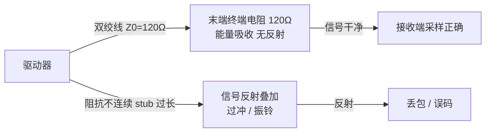
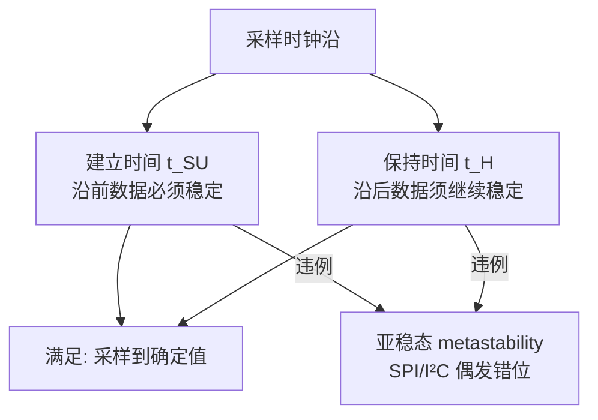

# 数字电路与信号完整性：终端匹配与建立保持

## 一、一个真实场景：CAN 报文在产线上"薛定谔式"丢包

一次 BMS 控制器量产产线上，约 5% 的板子 CAN 通信偶发丢包，故障帧时有时无。硬件同事换了终端电阻阻值（120Ω 标称，实测有板子是 118Ω、有是 123Ω），问题依旧。最后用示波器看 CANH/CANL 差分波形，发现丢包那几块板的波形在 ACK 段有明显的**过冲与振铃（ringing）**——根源是终端电阻焊盘到收发器之间的 stub 太长、且其中一块板的终端电阻回流地不完整，导致阻抗不连续、信号在总线上反射叠加。

这不是软件 bug，但作为底层软件工程师必须能看懂波形、能和硬件一起定位——因为"通信不稳"第一道抱怨往往落到写驱动的人头上。信号完整性（SI）就是研究"数字 0/1 在物理线上传输时，怎么不变形、不串扰、不误判"的学问。下面从最常被底层工程师用到的几个概念讲起。

## 二、核心原理：从"理想方波"到"真实传输线"

教科书里的数字信号是理想方波：瞬间 0→1。真实世界里，PCB 走线是一根有电阻、电感、电容的**传输线**。当信号上升时间足够快、走线足够长（经验法则：走线延迟 > 信号上升时间的 1/6 时就得当传输线看），信号会在阻抗不连续处**反射**，叠加出振铃、过冲、台阶。

### 1. 终端匹配（Termination）：消除反射

反射的根源是"阻抗突变"。解决办法是在传输线末端并联/串联一个电阻，让负载端阻抗等于线特性阻抗（Z0），使能量被吸收而非反射回去。

最经典的例子是 **CAN 总线**：双绞线特性阻抗约 120Ω，因此在总线**两端**各接一个 120Ω 终端电阻，让信号到达末端被完全吸收，消除反射。注意是"两端"，中间节点不能再加——否则并联后阻抗偏离 120Ω，反而加剧反射；支线（stub）也要尽量短，否则支线本身成了个反射腔。

类比：终端匹配像在山谷尽头立一面"吸音墙"，让喊出去的声音被吃掉而不是弹回来和你自己的话混在一起。

> 图：终端匹配消除反射——末端阻抗等于特性阻抗 Z0 才能吸收信号能量。



### 2. 上拉/下拉与开漏：I²C/SMBus 的"线与"

I²C/SMBus 用**开漏（open-drain）+ 上拉电阻**：所有设备只能把线拉低（拉到地），释放时靠上拉电阻把线拉高。这是"线与（wire-AND）"逻辑——任一设备拉低，总线即为低，实现多主仲裁与应答。上拉阻值有讲究：太小则上升沿陡但功耗大、灌电流超规格；太大则上升沿过缓、速率上不去。常按总线电容与所需速率在几 kΩ 量级选取。CAN 虽是差分推挽，但同样依赖终端电阻而非上拉。

### 3. 建立/保持时间（Setup/Hold）：采样不翻车的铁律

这是同步接口（SPI/I²C/并口/采样触发器）的核心时序约束。定义如下：

- **建立时间（Setup Time, t_SU）**：在采样时钟沿**之前**，数据必须已经稳定保持的最短时间。
- **保持时间（Hold Time, t_H）**：在采样时钟沿**之后**，数据还必须继续稳定保持的最短时间。

```
        时钟沿(采样)           时钟沿(采样)
          ↓                     ↓
数据:  ────────[必须稳定]──────[必须继续稳定]────
       ├─ t_SU ─┤            ├─ t_H ─┤
```

若违例（数据在采样沿前后没稳住），触发器可能采到亚稳态（metastability）——输出在 0/1 之间徘徊不定，导致 SPI 读到的字节错位、I²C 收错 bit。底层调试 SPI 时，绝大多数"偶发通信错"都是 CPOL/CPHA 配错导致采样边沿落在数据跳变区，本质上就是建立/保持被违反。

> 图：建立/保持时间约束——采样沿前后数据不稳则进入亚稳态。



### 4. 电平标准与跨电平

常见 IO 电平：1.8V / 3.3V / 5V。3.3V 器件直接驱动 5V 系统可能不安全；5V-tolerant 输入允许 5V 信号进 3.3V 器件但不反向驱动。跨电平需电平转换（电平平移芯片或开漏+上拉技巧）。

## 三、关键时序描述与代码（SPI 建保示例）

以 SPI（模式 0：CPOL=0 空闲低、CPHA=0 第一个边沿采样）为例，主从必须满足：

```
SCK:   ___┐   ┌───┐   ┌───┐   ┌──
         │   │   │   │   │   │
数据MOSI:    [D7][D6][D5]...         (在 SCK 上升沿被从设备采样)
要求: 数据在 SCK 上升沿前稳定 ≥ t_SU，之后保持 ≥ t_H。
```

驱动层配置时要注意：**CS 建立/保持时间**（片选拉低到第一个 SCK 的间隔、最后一拍 SCK 到 CS 拉高的间隔）也常被忽视。伪代码层面的约束检查：

```c
/* SPI 传输前，确认从设备时序预算（示意，参数取自芯片手册） */
#define SLAVE_T_SU_NS   20   /* 数据建立时间要求 */
#define SLAVE_T_H_NS    20   /* 数据保持时间要求 */
#define SCK_PERIOD_NS   100  /* 当前 SCK 周期，由时钟频率决定 */

/* 关键：SCK 半周期必须 > 从设备建立+保持要求之和的余量 */
if ((SCK_PERIOD_NS / 2) < (SLAVE_T_SU_NS + SLAVE_T_H_NS)) {
    /* 时钟太快 → 建立/保持违例风险，需降频或调 CPHA */
    reduce_sck_frequency();
}
```

寄存器层（GPIO/外设）的常见位域也值得记：如 GPIO 的 `PU/PD`（上下拉使能）、`MUX/AF`（复用功能选择，配错则 SPI 信号根本没连到引脚）、`SLEW`（斜率控制，降斜率可抑 EMI 但增延迟）。这些位配错，信号完整性从源头就坏了。

## 四、常见坑与调试手段（至少 3 条）

1. **终端电阻缺失/阻值偏差/位置不对** → CAN 反射、过冲、丢包。→ 用示波器看差分波形末端是否有振铃；确认两端 120Ω、stub 短、回流地完整。
2. **SPI CPOL/CPHA 主从不一致** → 采样边沿错位，整帧数据错乱，且时好时坏（取决于相位偶然对齐）。→ 逻辑分析仪抓 SCK/MOSI/MISO/CS 四线，对照从设备手册时序图逐边沿核对；优先确认模式号与建立/保持窗。
3. **建立/保持违例（时钟太快或线太长）** → 高频 SPI 在长线/大电容下数据在采样沿未稳，偶发错 byte。→ 降 SCK 频率、缩短走线、减小总线电容；必要时调 CPHA 让采样沿避开跳变区。
4. **I²C 上拉不当/总线死锁** → 上拉太大速率上不去，太小功耗/灌电流超规格；从设备异常拉低 SDA 不释放导致死锁。→ 按总线电容选上拉；死锁时主设备手动发 9 个 SCL 脉冲释放 SDA，或复位从设备。

## 五、面试高频要点

- **CAN 为什么两端要加 120Ω？** → 阻抗匹配消除信号反射，避免过冲/振铃导致采样错误；两端而非中间，stub 要短。
- **SPI 通信不稳第一查什么？** → CPOL/CPHA 模式匹配、CS 时序、SCK 速率是否违反建立/保持、上拉与线长串扰。
- **建立时间和保持时间违例会怎样？** → 触发器进入亚稳态，采样到错误/不定值，表现为偶发数据错位，难稳定复现。
- **为什么 I²C 必须上拉（开漏）？** → 开漏+上拉实现线与逻辑，支持多主仲裁与每字节 ACK 应答。
- **信号完整性的本质目标是什么？** → 让数字 0/1 在真实传输线上不变形、不反射、不串扰，保证接收端在采样窗内采到确定值。
