# 信号完整性与电源完整性：从传输线理论、芯片 IO 单元到 MCAL 配置的全链路工程实践

## 〇、本文的定位与阅读地图

信号完整性（Signal Integrity, SI）与电源完整性（Power Integrity, PI）是一门横跨"物理"与"工程"的学科：向下它连着麦克斯韦方程与传输线理论，向上它连着 PCB 叠层、端接电阻、去耦电容，再向上它连着芯片内部的 IO 单元设计、GPIO 配置寄存器，最后落到嵌入式软件工程师每天都在写的那几行 `PORTx->PINCFG[n] = ...`，以及 AUTOSAR 体系里由 EB tresos / DaVinci Configurator 生成的 `Port_Cfg.c`。

大多数 SI 教材停在"板级"这一层：讲反射、讲端接、讲串扰、讲去耦，然后戛然而止。但笔者在一线做嵌入式底层与硬件协同调试多年，反复遇到的一个现实是：**同一块板子、同一套走线，换一个 GPIO 驱动强度档位，波形就从"振铃三个周期"变成"干净单调上升"；改一个 slew rate 位，EMC 辐射测试就从超标 3 dB 变成余量 6 dB。** 这说明 SI 的"控制旋钮"有相当一部分并不在 PCB 上，而在芯片 IO 单元的可编程寄存器里，在驱动代码里，在 MCAL 的配置表里。

所以本文在传统 SI/PI 主干之外，专门用三大块把"芯片—代码—配置"这条链路补齐：

- **块 A：芯片模块设计（IP 内部架构）**——芯片 IO 单元（IO Cell / Pad Cell）的内部框图：pad、ESD 保护、输出驱动级（PMOS/NMOS 推挽或开漏）、输入缓冲（施密特触发）、可编程上下拉、slew rate 控制、多档驱动强度、引脚复用矩阵，以及引脚配置寄存器的完整位域定义。
- **块 B：驱动代码实现**——真实可读的 C 代码：按位域操作配置驱动强度/上下拉/slew rate/复用/开漏，高速信号引脚的 SI 相关配置，I²C 开漏引脚配置，以及测量侧的 Python 眼图脚本与 PCB 规则检查清单脚本。
- **块 C：MCAL 配置说明**——AUTOSAR PORT 模块的配置项、这些配置项与 SI 的对应关系表、EB tresos / DaVinci 的配置清单与"配置→生成→硬件初始化"路径，以及 CAN / Ethernet 等高速通信引脚的 SI 注意事项。

原有的板级 SI/PI 主干（高速基础、反射、端接、串扰、振铃、阻抗控制、PDN、EMC、测量、checklist、面试题）全部保留并进一步深化。

---

## 一、一个真实场景：CAN 报文在产线上"薛定谔式"丢包

一次 BMS（电池管理系统）控制器量产产线上，约 5% 的板子 CAN 通信偶发丢包，故障帧时有时无，软件复位能恢复、断电重上电又可能正常，典型的"薛定谔式"故障。硬件同事先换了终端电阻阻值（120Ω 标称，实测有板子是 118Ω、有是 123Ω），问题依旧。最后用示波器看 CANH/CANL 差分波形，发现丢包那几块板的波形在 ACK 段有明显的**过冲与振铃（ringing）**——根源是终端电阻焊盘到收发器之间的 stub（支线）太长、且其中一块板的终端电阻回流地不完整，导致阻抗不连续、信号在总线上反射叠加，叠加后的波形在接收器判决阈值附近反复穿越，从而随机误判。

这个案例还有一个"软件侧"的尾巴值得记录：整改期间，有人尝试把 CAN 收发器的 STB（standby）控制脚、以及与 CAN 收发器共用一片电源域的几个 GPIO 的驱动强度从默认的最高档（12 mA）降到 4 mA，并打开 slow slew rate，结果同一块问题板的误码率明显下降。原因并不神秘：那几个 GPIO 与 CAN 收发器共用同一组电源/地引脚，它们同时翻转时产生的 **SSO（Simultaneous Switching Output）地弹**，通过封装引线电感抬高了收发器的本地地电位，等效地改变了差分接收器的共模判决参考点。把驱动强度调小、把边沿放缓，就是直接减小了 dI/dt，从而减小了 L·dI/dt 的地弹幅度。

这是本文想反复强调的核心观点之一：**SI 问题的因（cause）常常在芯片 IO 侧，而果（symptom）显现在板级波形上；只会看板不会看芯片配置，就只能"换电阻碰运气"。**

这个案例是典型的信号完整性问题：它不是软件 bug，但作为底层软件与系统工程师必须能看懂波形、能和硬件一起定位——因为"通信不稳"第一道抱怨往往落到写驱动的人头上。更深层的原因是：**当数字信号的上升时间足够快、互连的电气长度足够长时，PCB 走线、连接器、线缆就不再是"理想导线"，而必须当成一根有分布参数（电阻 R、电感 L、电容 C）的传输线来对待**。一旦把传输线看漏了，反射、振铃、串扰、时序偏移就会接踵而至。

信号完整性与电源完整性研究的就是同一件事的两个侧面：在真实、非理想的物理通道上，如何让代表 0/1 的电平在接收端采样窗内被干净、确定地判决，同时让为这些电路供电的网络始终维持稳定的电压与低噪声的返回路径。

---

## 二、高速信号基础：上升沿、带宽与何时必须当传输线看

### 2.1 上升时间决定"有效频率"

教科书里的数字信号是理想方波：瞬间 0→1，频谱是无穷多个奇次谐波。但真实驱动器的输出是一个有限斜率的边沿，用上升时间（rise time，通常取 10%→90% 幅度的时间，记作 t_r）来刻画。一个被广泛引用的经验公式是**信号带宽（Bandwidth）**：

    f_bandwidth ≈ 0.35 / t_r       （t_r 以秒计，f 单位为 Hz）

若采用 20%→80% 的上升时间定义，系数会变为约 0.4。无论取哪个系数，结论是一致的：**信号的"速度"不看数据速率，而看上升时间**。一个 1 Mbps 的 CAN 信号如果驱动器很"硬"（t_r = 20 ns），其带宽只有约 17.5 MHz；而一个 100 MHz 时钟若 t_r = 0.5 ns，其带宽高达 700 MHz。后者即便数据率低，也远比前者"高速"。这正是很多工程师的误区：以为只有 Gbps 链路才需要考虑 SI，实际上只要上升沿足够陡、走线足够长，MHz 级总线同样会出事。

为什么上升时间这么关键？因为上升沿里携带的高频分量会在传输线中遇到阻抗不连续并发生反射，反射回来的波与原始波在时域叠加，直接把干净的边沿"啃"出振铃与台阶。上升越陡，包含的高频成分越多，反射造成的畸变越显著。

这里就出现了第一个"芯片 IO 与 SI"的连接点：**t_r 并不是一个物理常数，它由芯片 IO 单元的输出驱动级尺寸（驱动强度）与 slew rate 控制电路共同决定，而这两者在绝大多数现代 MCU/SoC 上都是软件可编程的。** 换句话说，写驱动的人手里握着一个可以直接改变整条链路 SI 特性的旋钮。

### 2.2 传输线判据：电气长度而非物理长度

一条互连是否必须按传输线分析，判据是**电气长度**（与时延相关）相对信号上升时间的比例。信号在 PCB 中的传播速度约为 v = c / √ε_r，其中 c 是真空中光速（约 3×10⁸ m/s），ε_r 是介质相对介电常数（FR-4 典型值 4.2~4.5）。于是传播时延 T_d ≈ 1/(6×10⁸) ≈ 0.167 ns/mm（FR-4 上约 5.5~6 ps/mm 量级，或约 150 ps/inch）。

经验法则：

> **当走线的单向传播时延 T_d 大于信号上升时间 t_r 的约 1/6（也有保守取 1/2 或 1/10 的工程口径）时，必须按传输线处理。**

用公式表达：若走线长度 L 满足

    L × T_d_per_length > t_r / 6

则这根走线就不再是导线，而是一根传输线。举例：t_r = 1 ns 的 3.3V 信号，FR-4 上 T_d ≈ 0.167 ns/mm，则临界长度约为 (1/6)/0.167 ≈ 1 mm 量级（按 1/6 准则），若取更宽松的 1/2 准则则约 3 mm。这意味着在现代快沿器件上，**几乎任何超过几厘米的走线都该按传输线看**。同样的逻辑适用于连接器、封装引线、线缆——它们都有不可忽略的电气长度。

反过来讲：如果一条走线因为布局限制无法缩短、又无法加端接（比如已经投板的样机），那么把驱动端的 slew rate 调慢、把 t_r 从 1 ns 拉长到 4 ns，临界长度就从约 1 mm 放宽到约 4 mm，很多"勉强"的走线就重新落回集总参数区间。这是软件侧最廉价的 SI 补救手段。

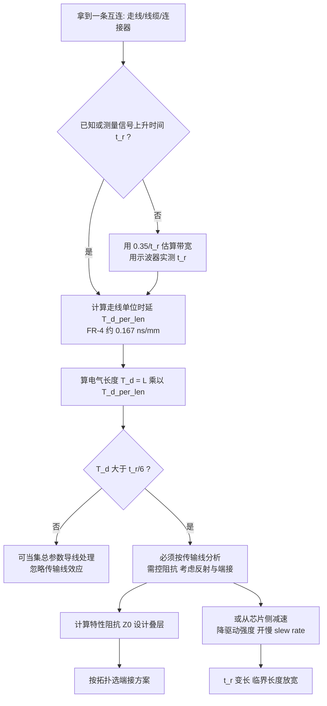

### 2.3 集总与分布：一个实用分界

在 T_d 远小于 t_r 时，沿走线各点的电压/电流"几乎同时"变化，可以用一个集总（lumped）的 R、L、C 模型近似，基尔霍夫定律成立。一旦进入传输线区间，信号是"波"，电压电流沿位置变化，必须用分布（distributed）模型或者传输线方程（电报方程）来描述。这个分界不是物理突变，而是工程近似——只要反射造成的波形畸变落在时序裕量与噪声裕量之内，就可以"假装"它是导线。

工程上判断"能不能假装"的标准，最终要回到**噪声裕量**：接收器的 V_IH / V_IL 与驱动器的 V_OH / V_OL 之间的差额，就是留给反射、串扰、地弹、电源纹波共同挥霍的预算。一条 3.3V LVCMOS 链路的典型静态噪声裕量在数百 mV 量级，而一次未端接的全反射过冲就可能吃掉其中大半。

---

## 三、传输线理论核心：特性阻抗与传播

### 3.1 特性阻抗 Z0

一条无损耗传输线（忽略 R、G）的**特性阻抗**定义为：

    Z0 = √(L0 / C0)

其中 L0、C0 是单位长度的串联电感与并联电容。注意 Z0 与线长无关，只由横截面几何与介质决定。常见值：单端微带线 50Ω、带状线 50Ω、差分对 90~100Ω（USB/Ethernet）、CAN 双绞线 120Ω、RS-485 120Ω、LVDS 100Ω。

传输线的**传播速度**为：

    v = 1 / √(L0 × C0) = c / √ε_eff

有效介电常数 ε_eff 介于介质 ε_r 与空气 1 之间（微带线部分场在空气中，故 ε_eff < ε_r）。

理解 Z0 的物理直觉很重要：当一个阶跃从驱动器出发、沿线向前推进时，它每前进一小段就要给这段线的分布电容充电、并在分布电感中建立电流。驱动器"看到"的负载，在波还没到达终点之前，就是一个纯电阻 Z0——**这就是为什么源端串联端接可以在"波还没跑到终点"时就完成匹配**。

### 3.2 反射系数与端接的本质

当波到达阻抗不连续处（如线末端接了一个不等于 Z0 的负载 R_L），一部分能量被反射回去。电压反射系数：

    Γ = (R_L − Z0) / (R_L + Z0)

- R_L = Z0 → Γ = 0，无反射（理想匹配）。
- R_L = ∞（开路）→ Γ = +1，反射同相，末端电压翻倍（过冲来源）。
- R_L = 0（短路）→ Γ = −1，反射反相。

多重不连续会产生多次反射，时域上表现为振铃。端接（termination）的本质，就是在源端或负载端引入一个等于 Z0 的电阻（或等效阻抗），让 Γ→0，把能量"吸收"掉而非弹回。

一个常被忽略的点：**芯片 IO 单元的输出阻抗 Z_out 本身就是反射系数的一部分**。当反射波从末端返回源端时，源端的反射系数是 Γ_s = (Z_out − Z0)/(Z_out + Z0)。若 IO 配置在最高驱动强度档，Z_out 可能只有 15~25Ω，则 Γ_s ≈ −0.4，反射波会被再次弹回去，形成多次往返振铃；若把驱动强度降到低档，Z_out 上升到 40~60Ω，Γ_s 接近 0，第一次返回的反射波就被源端吸收掉了。**低驱动强度在某种意义上就是"内建的源端串联端接"**——这是本文块 A 会详细展开的关键机理。

### 3.3 阻抗与反射的计算脚本

下面给出一段特性阻抗与反射系数的计算示例（Python），供板级工程师快速估算，并额外加入了"由 IO 驱动强度反推源端反射系数"的部分：

```python
# ============================================================
# 代码块 1：特性阻抗 / 反射系数 / 源端匹配 快速估算工具
# 用途：板级评审阶段快速判断阻抗目标、端接需求、IO 档位是否合适
# ============================================================
import math


def microstrip_z0(w_mm, h_mm, er):
    """惠勒(Wheeler)微带线特性阻抗近似公式（工程估算级精度）。

    w_mm : 线宽 (mm)
    h_mm : 走线到参考平面的介质厚度 (mm)
    er   : 介质相对介电常数，FR-4 取 4.2~4.5
    适用范围：w/h 不太极端（约 0.1 < w/h < 3）时误差在百分之几量级。
    精确设计请用 Polar Si9000 / 场求解器 / PCB 厂阻抗表。
    """
    w = w_mm  # 此处忽略铜厚 t 的修正，铜厚会略微降低 Z0
    return (87.0 / math.sqrt(er + 1.41)) * math.log(5.98 * h_mm / (0.8 * w + h_mm))


def stripline_z0(w_mm, h_mm, t_mm, er):
    """对称带状线特性阻抗近似公式。
    h_mm: 两参考平面间总距离; t_mm: 铜厚
    """
    return (60.0 / math.sqrt(er)) * math.log(4.0 * h_mm / (0.67 * math.pi * (0.8 * w_mm + t_mm)))


def reflection_coeff(r_load, z0):
    """电压反射系数 Gamma = (RL - Z0) / (RL + Z0)"""
    return (r_load - z0) / (r_load + z0)


def prop_delay_ns_per_mm(er_eff):
    """PCB 传播时延（ns/mm）。v = c / sqrt(er_eff)"""
    c = 3.0e8                       # m/s
    v = c / math.sqrt(er_eff)       # m/s
    return 1.0e-6 / v               # ns/mm  (1 mm = 1e-3 m, 1 s = 1e9 ns)


def critical_length_mm(t_rise_ns, er_eff, ratio=6.0):
    """传输线临界长度：T_d > t_r / ratio 时必须按传输线处理。"""
    td = prop_delay_ns_per_mm(er_eff)
    return (t_rise_ns / ratio) / td


# ---------- 场景 1：叠层阻抗估算 ----------
z0 = microstrip_z0(w_mm=0.30, h_mm=0.20, er=4.3)
print(f"[微带线] w=0.30mm h=0.20mm er=4.3  ->  Z0 = {z0:.1f} ohm")

z0_sl = stripline_z0(w_mm=0.15, h_mm=0.40, t_mm=0.035, er=4.3)
print(f"[带状线] w=0.15mm h=0.40mm         ->  Z0 = {z0_sl:.1f} ohm")

# ---------- 场景 2：末端负载反射 ----------
print("\n[末端反射系数]")
for rl in (120.0, 100.0, 50.0, 1.0e9, 0.0):
    label = "开路" if rl > 1e6 else ("短路" if rl == 0 else f"{rl:.0f} ohm")
    print(f"  R_L = {label:>8}  ->  Gamma = {reflection_coeff(rl, 50.0):+.3f}")

# ---------- 场景 3：由 IO 驱动强度反推源端反射 ----------
# 典型 3.3V LVCMOS IO 单元：驱动强度档位 <-> 等效输出阻抗（含 PMOS/NMOS 导通电阻）
DRIVE_TABLE = {
    "2mA  (低)":  75.0,
    "4mA  (中低)": 45.0,
    "8mA  (中高)": 28.0,
    "12mA (高)":  18.0,
}
print("\n[源端反射系数：驱动强度档位影响]  线阻抗 Z0 = 50 ohm")
for name, zout in DRIVE_TABLE.items():
    g = reflection_coeff(zout, 50.0)
    verdict = "接近匹配，反射波被源端吸收" if abs(g) < 0.15 else "源端会二次反射，易振铃"
    print(f"  {name:<10} Z_out={zout:>5.1f} ohm  Gamma_s={g:+.3f}  {verdict}")

# ---------- 场景 4：临界长度 ----------
print("\n[传输线临界长度 @ er_eff=3.8]")
for tr in (0.5, 1.0, 2.0, 5.0, 20.0):
    print(f"  t_r = {tr:>5.1f} ns  ->  临界长度约 {critical_length_mm(tr, 3.8):.1f} mm")
```

这段代码给出三点启示：一是 Z0 对几何尺寸敏感（线宽、介质厚、ε_r 任一偏差都会让阻抗偏离目标）；二是只要负载不等于 Z0 就存在反射，开路/短路是极端情形，而"接近但不等于 Z0"是量产中更常见的隐患（如 CAN 终端 118Ω vs 120Ω）；三是**驱动强度档位直接决定源端反射系数**，"最大驱动强度"在 SI 意义上往往是最差选择。

---

## 四、反射与端接技术：串联/并联/AC/戴维南/差分

### 4.1 负载端并联端接

在负载端并联一个 R_t = Z0 到地（或到 VCC，取决于直流偏置需求），使负载看进去的阻抗等于 Z0。优点：彻底吸收末端反射，对多负载总线友好；缺点：直流功耗大（尤其信号摆幅大、端接到电源/地时），且会改变直流电平，常用于点对点或对功耗不敏感的情景。CAN、RS-485 用的就是两端并联 120Ω 的经典结构。

在 CAN 上还有一个工程细节：**分裂端接（split termination）**——把 120Ω 拆成两个 60Ω 串联，中点通过一个 4.7 nF 电容接地。这样差模看到的仍是 120Ω，但共模在高频被电容旁路到地，共模噪声被显著抑制，EMC 辐射通常能改善数 dB。这是差分总线端接设计里性价比最高的一个技巧。

### 4.2 源端串联端接（Series / Source Termination）

在驱动器输出端串一个 R_s，使 R_s + 驱动器输出阻抗 = Z0。其机理巧妙：信号从源出发时，因串联电阻与线的阻抗分压，线上只看到一半幅度（Z0 / (Z0 + Z0)）；波到达开路末端被全反射（Γ=+1，幅度翻倍），于是末端电压"长"到满幅；反射波返回源端，遇到串联电阻 + 输出阻抗 = Z0，被源端吸收，不再二次反射。优点：直流零功耗；缺点：仅适用于点对点、且接收端必须有高输入阻抗（否则末端不是"开路"），且存在一次半幅传输的中间状态（沿线中间点在往返时间内会停在半幅，不能在这里再挂负载）。

这里必须强调 R_s 的计算与 IO 配置的耦合：**R_s = Z0 − Z_out，而 Z_out 由 GPIO 驱动强度决定。** 如果硬件按"12 mA 档、Z_out=18Ω"设计了 33Ω 串阻，而软件初始化时把该脚配成 2 mA 档（Z_out=75Ω），则源端总阻抗变成 108Ω，严重过阻尼，上升沿被拖得很长，可能直接导致 SPI 在高速率下建立时间不足。**硬件的串阻值与软件的驱动强度必须"合同化"地约定下来，写进设计文档与 MCAL 配置说明**——这是本文块 C 会再次强调的点。

### 4.3 AC 端接（电容隔直系端）

并联端接通过电容串联后再接地，直流隔离、无功耗，同时高频下电容近似短路、提供交流匹配。适合直流电平敏感、又不能长期灌电流的场合（如某些高速单端总线）。代价是电容容值与频率共同决定等效阻抗，对极低速或启动瞬态可能"失配"，且引入一个 RC 时间常数。经验取值：R = Z0，C 使得 RC 时间常数约为 3~5 倍的 t_r，同时远小于最短的数据位周期。

### 4.4 戴维南（Thevenin）端接

用两个电阻 R1、R2 分压到 VCC 和地，等效并联电阻 R1∥R2 = Z0，同时把偏置点设在接收器要求的共模/阈值电平。典型用于需要上拉到高电平的开漏总线（如早期的并行总线/某些存储器接口），或需要给差分线提供终端偏置的场合。缺点是功耗与器件数增加，且 R1、R2 的精度共同影响偏置与匹配。

### 4.5 差分端接

差分对两端各跨接一个 R_t = Z_diff（如 100Ω）的电阻，吸收差模反射。共模端还可能需要通过电容或电阻网络提供共模偏置（某些接收器要求）。差分端接对抑制共模噪声、维持对称至关重要。

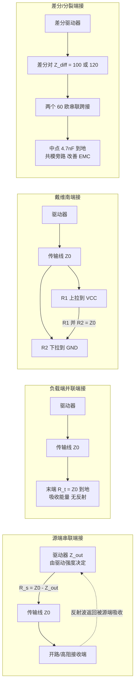

下面给出一段"端接方案自动选择"的 C 代码，体现工程决策逻辑，并把 IO 驱动强度纳入决策：

```c
/* ============================================================
 * 代码块 2：端接方案选择 + 源端串阻计算
 * 依据拓扑 / 功耗预算 / 电平约束 / IO 输出阻抗 选择端接策略
 * ============================================================ */
#include <stdint.h>
#include <stdbool.h>

typedef enum {
    TERM_NONE = 0,      /* 无需端接：电气长度远小于 t_r/6 */
    TERM_SERIES,        /* 源端串联 */
    TERM_PARALLEL,      /* 负载端并联到地/电源 */
    TERM_AC,            /* RC 交流端接 */
    TERM_THEVENIN,      /* 戴维南分压端接 */
    TERM_DIFF_SPLIT     /* 差分分裂端接（含共模电容） */
} term_scheme_t;

/* GPIO 驱动强度档位 -> 等效输出阻抗（欧姆），来自数据手册 V/I 曲线或 IBIS */
static const float g_drive_zout[4] = {
    75.0f,   /* DRV_2MA  */
    45.0f,   /* DRV_4MA  */
    28.0f,   /* DRV_8MA  */
    18.0f    /* DRV_12MA */
};

typedef struct {
    float   z0_ohm;              /* 走线特性阻抗 */
    float   trace_len_mm;        /* 走线长度 */
    float   t_rise_ns;           /* 驱动器上升时间 */
    uint8_t n_loads;             /* 负载数量 */
    bool    is_differential;     /* 是否差分对 */
    bool    dc_sensitive;        /* 接收端是否对直流电平敏感 */
    float   iq_budget_ma;        /* 允许的端接静态电流预算 (mA) */
    uint8_t drive_level;         /* 当前 GPIO 驱动强度档位 0..3 */
} net_spec_t;

typedef struct {
    term_scheme_t scheme;
    float         rs_ohm;        /* 源端串阻建议值（仅 SERIES 有效） */
    float         rt_ohm;        /* 端接电阻建议值 */
    const char   *note;
} term_result_t;

/* FR-4 单位时延，ns/mm */
#define TD_PER_MM_NS   (0.167f)

term_result_t choose_termination(const net_spec_t *n)
{
    term_result_t r = { TERM_NONE, 0.0f, 0.0f, "" };

    /* 步骤 1：先判断是否真的需要端接（电气长度判据） */
    const float td = n->trace_len_mm * TD_PER_MM_NS;
    if (td < (n->t_rise_ns / 6.0f)) {
        r.scheme = TERM_NONE;
        r.note   = "电气长度短于 t_r/6，按集总处理，无需端接";
        return r;
    }

    /* 步骤 2：差分对统一走差分/分裂端接 */
    if (n->is_differential) {
        r.scheme = TERM_DIFF_SPLIT;
        r.rt_ohm = n->z0_ohm;                 /* 差模阻抗，如 100 / 120 */
        r.note   = "两个 Z_diff/2 串联跨接，中点经 4.7nF 到地做共模旁路";
        return r;
    }

    /* 步骤 3：多负载总线 —— 源端串联不适用（中间点半幅问题） */
    if (n->n_loads > 1) {
        const float i_para_ma = 1000.0f * 3.3f / n->z0_ohm;  /* 粗估并联端接电流 */
        if (i_para_ma > n->iq_budget_ma) {
            r.scheme = TERM_AC;
            r.rt_ohm = n->z0_ohm;
            r.note   = "多负载且功耗受限：RC 交流端接，RC 常数取 3~5 倍 t_r";
        } else if (n->dc_sensitive) {
            r.scheme = TERM_THEVENIN;
            r.rt_ohm = 2.0f * n->z0_ohm;      /* Vth = VCC/2 时 R1 = R2 = 2*Z0 */
            r.note   = "戴维南：R1 = R2 = 2*Z0，偏置在 VCC/2，等效并联 = Z0";
        } else {
            r.scheme = TERM_PARALLEL;
            r.rt_ohm = n->z0_ohm;
            r.note   = "末端并联 Z0 到地，最稳健，注意直流功耗";
        }
        return r;
    }

    /* 步骤 4：点对点 —— 优先源端串联，零直流功耗 */
    const float zout = g_drive_zout[n->drive_level & 0x03u];
    float rs = n->z0_ohm - zout;
    if (rs < 0.0f) {
        /* 驱动太"硬"，Z_out 已低于 Z0，串阻取 0 并提示降档 */
        rs = 0.0f;
        r.note = "Z_out < Z0：建议降低驱动强度档位，否则源端仍会二次反射";
    } else if (rs < 5.0f) {
        r.note = "串阻很小，可考虑直接靠 IO 输出阻抗自匹配（降档到更低驱动）";
    } else {
        r.note = "标准源端串联端接，电阻紧贴驱动器引脚放置（< 5mm）";
    }
    r.scheme  = TERM_SERIES;
    r.rs_ohm  = rs;
    return r;
}
```

### 4.6 终端电阻的计算实例

负载并联端接直接取 R_t = Z0。源端串联取 R_s = Z0 − Z_out（Z_out 为驱动器输出阻抗，可从 IBIS 模型的 V/I 曲线或数据手册的 V_OL/I_OL 斜率估算）。戴维南要求 R1∥R2 = Z0 且分压点 V_bias = V_th：

    R1 = Z0 × VCC / V_th，  R2 = Z0 × VCC / (VCC − V_th)
    （当 V_th = VCC/2 时退化为 R1 = R2 = 2×Z0）

差分端接取跨接 R_t = Z_diff，且确保 R_t 精度 ±1% 量级，因为差分反射系数对失配同样敏感。

### 4.7 端接方式对比表

| 端接方式 | 匹配位置 | 直流功耗 | 适用拓扑 | 与 IO 配置的关系 | 关键优点 | 主要缺点 |
|---|---|---|---|---|---|---|
| 负载并联 | 末端到地/电源 | 高 | 多负载总线、CAN/RS-485 | 要求 IO 有足够灌/拉电流能力，需选高驱动档 | 彻底吸收末端反射、稳健 | 持续功耗、改变直流电平 |
| 源端串联 | 驱动器输出 | 零（稳态） | 单点对点 | R_s 值与驱动强度档位强耦合，必须锁定 | 零直流功耗、简单 | 仅点对点、末端须高阻 |
| AC 端接 | 末端经 RC 到地 | 零（直流） | 直流敏感/大摆幅 | 对 slew rate 敏感，RC 需按 t_r 设计 | 隔直、无静态功耗 | 低频/启动可能失配 |
| 戴维南 | 末端 R1∥R2 | 中 | 需偏置、开漏总线 | 与片内上拉互斥，务必关闭片内上拉 | 偏置可控、易匹配 | 功耗与器件数增加 |
| 差分/分裂 | 差分末端跨接 | 低 | 差分对 | 差分 IO 通常固定驱动，配置项少 | 抑制共模、对称性好 | 需精度电阻、共模偏置 |
| 无端接 + 慢沿 | 无 | 零 | 短线、低速控制脚 | 完全靠 slew rate/驱动强度控制 | 零 BOM 成本 | 仅适合短线低速 |

最后一行"无端接 + 慢沿"值得单独说：在很多量产成本敏感的项目里，几十个控制类 GPIO 不可能每个都加串阻。此时**统一把非关键 GPIO 配成低驱动强度 + 慢 slew rate，就是最经济的 SI 与 EMC 策略**。这也是 MCAL PORT 配置里最应该被审视的一项默认值。

---

## 五、串扰：容性/感性耦合与 3W 规则

### 5.1 两种耦合机制

相邻走线间的串扰（crosstalk）来自两个物理机制：

- **容性耦合（电容性）**：两条线间存在寄生互容 C_m，攻击线（aggressor）电压跳变 dV/dt 通过 C_m 向受害线（victim）注入位移电流 i = C_m·dV/dt，表现为电容性串扰。
- **感性耦合（电感性）**：两条线间存在互感 M，攻击线电流变化 dI/dt 通过 M 在受害线感应出电压 v = M·dI/dt，表现为电感性串扰。

两者方向不同：容性耦合在受害线近端（near end，靠近攻击线驱动端的一侧）与远端都有贡献；感性耦合的近端噪声与容性近端噪声极性相反，远端同相叠加。综合结果是：**近端串扰（NEXT）通常较小且短暂，远端串扰（FEXT）随耦合长度积累、随攻击线上升时间变快而增大**。

注意两个机制的分母都写着 dV/dt 与 dI/dt——它们直接正比于边沿速率。**串扰幅度与 slew rate 近似成正比**，这意味着把攻击线的驱动强度降一档、slew rate 调慢，串扰能立刻按比例下降。这在"板已经打样、走线改不了"的阶段是唯一可行的整改手段。

### 5.2 前向/后向串扰与饱和长度

串扰可分为后向（backward，朝攻击线源端传播，即 NEXT）与前向（forward，朝攻击线负载端传播，即 FEXT）两类。当耦合长度 L_c 小于信号上升沿在空间上的长度（L_c < v×t_r，称为"未饱和"）时，串扰幅度随 L_c 线性增加；当 L_c 超过饱和长度后，近端串扰达到饱和值（不再随长度增加），而远端串扰仍近似随长度线性增长（这是 FEXT 更难处理的原因）。因此**缩短平行走线长度、减少并行区间是抑制串扰最直接有效的手段**。

值得注意的是：在纯带状线（均匀介质）中，容性与感性远端串扰理论上相互抵消，FEXT 近似为零；而在微带线中因为场部分在空气中、两种耦合速度不同，抵消不完全，FEXT 显著存在。**这是"高速敏感线优先走带状线"的一个深层理由**，远不只是"辐射小"这么简单。

### 5.3 3W 规则与保护线

**3W 规则**：相邻走线中心间距 ≥ 3 倍线宽（center-to-center ≥ 3W），可将容性/感性耦合降低到一个可接受量级（经验上耦合能量降到约 70% 场强以内）。更激进的 2W 用于空间极度紧张时，5W/10W 用于对隔离要求极高的射频或时钟线。在关键的时钟、复位、高速差分对附近，还可插入**保护线（guard trace）**——一条两端接地的屏蔽走线，把受害线与攻击线隔开，进一步衰减串扰。

保护线有一条铁律：**必须沿线每隔约 λ/20（或经验上每 5~10 mm）打一个接地过孔**，否则这条悬空或单端接地的走线会变成一根谐振天线，把串扰问题升级成辐射问题。笔者见过整改团队加了保护线之后辐射反而恶化 6 dB 的案例，原因正是过孔间距太稀。

### 5.4 层间串扰与带状线优势

同一层的侧边耦合之外，相邻层的垂直交叉也会耦合。良好的叠层设计让高速线走在带状线（被两地平面夹在中间）层，而非微带线（一侧是介质、一侧是空气），可显著降低对外辐射与受扰。走线正交（相邻层互相垂直走线）也能减小平行耦合长度。若两个信号层必须相邻且同向，则应保证它们之间有足够的介质厚度，或干脆在中间插入参考平面。

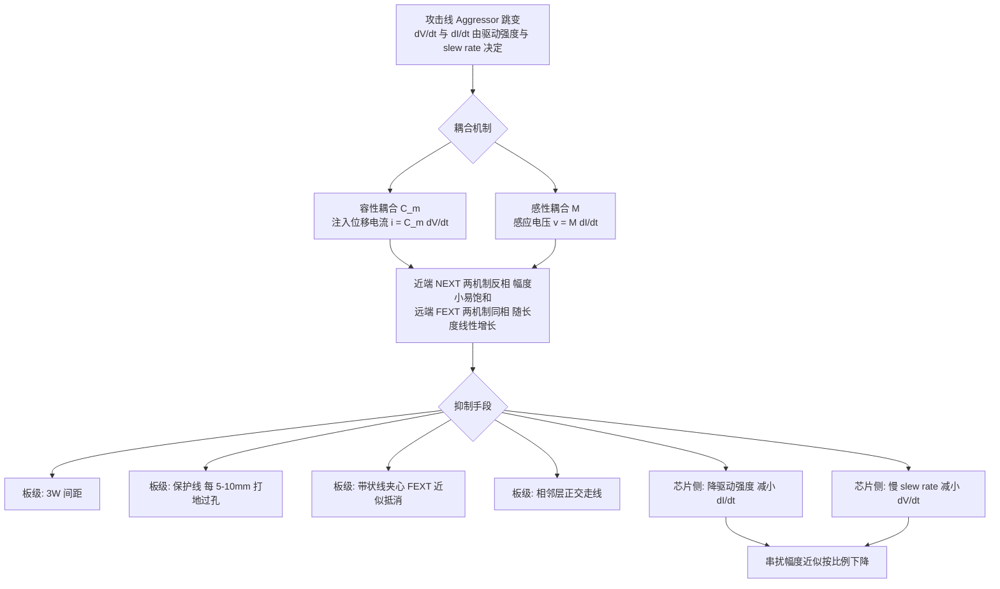

---

## 六、振铃、过冲与阻尼

### 6.1 过冲与振铃的来源

当传输线末端开路或高阻、且未端接时，反射波全幅返回并与原波叠加，在时域上表现为**过冲（overshoot）**与随后围绕终值反复的**振铃（ringing）**。若驱动器太"硬"、负载电容又大，LC 谐振回路（走线电感 + 负载电容 + 封装电感）会以自然频率振荡，振铃持续多个周期。

过冲的危害是双重的：一方面它可能超出接收器的绝对最大额定值，触发输入 ESD 保护二极管导通，长期反复会造成栅氧退化甚至闩锁（latch-up）；另一方面它在频谱上抬高了高频分量，直接恶化辐射发射。振铃则可能让信号在判决阈值附近多次穿越，引发误触发或时序抖动——尤其是接在中断脚、复位脚、时钟脚上时，一次振铃穿越就是一次伪中断。

### 6.2 阻尼与串联电阻

抑制振铃的根本是**破坏谐振条件、增加阻尼**。手段按优先级排列：

1. **降低 IO 驱动强度 / 打开慢 slew rate**（零成本，软件即可完成，应首先尝试）；
2. 源端串联电阻（几欧到几十欧，紧贴驱动器）；
3. 缩短走线、消除 stub；
4. 末端加端接（有功耗代价）；
5. 加磁珠或 RC 缓冲（snubber），但会显著影响时序。

但注意：增大串联电阻/降低压摆率会延长上升时间、压缩高频带宽，可能反过来危及建立/保持时间——这是典型的"SI 与时序的权衡"。工程上的做法是先算出时序预算允许的最大 t_r，再在这个上限内尽可能放慢边沿。

### 6.3 阻尼比与临界阻尼

把走线 + 负载近似为二阶 RLC 串联回路，阻尼比为：

    ζ = (R_total / 2) × √(C_load / L_trace)

其中 R_total = Z_out + R_s（源端总电阻）。ζ < 1 为欠阻尼（振铃），ζ = 1 为临界阻尼（最快无振收敛），ζ > 1 为过阻尼（无振但边沿变慢）。工程上追求 ζ 在 0.7~1.0 之间：既基本无振铃又不至于过慢。

从这个公式可以直接读出软件旋钮的作用：**降低驱动强度 → Z_out 上升 → R_total 上升 → ζ 上升 → 从欠阻尼推向临界阻尼**。这就是"改一个寄存器位、振铃消失"的定量解释。

---

## 七、特性阻抗控制与叠层设计

### 7.1 微带线与带状线

- **微带线（Microstrip）**：走线在表层，下方是参考地平面，上方是空气。场部分在空气中（ε_eff 较低，速度较快、损耗较小），但对外辐射大、易受干扰。Z0 由线宽 w、介质厚 h、铜厚 t、ε_r 决定；在 w/h 适中时近似 Z0 ≈ (87/√(ε_r+1.41))·ln(5.98h/(0.8w+t))。
- **带状线（Stripline）**：走线夹在两个地平面之间，场完全束缚在介质内，ε_eff = ε_r，辐射极小、对称好、FEXT 近似抵消，但损耗略大（介质中传播全程）、加工对称要求高、传播速度较慢。常用对称带状线 Z0 ≈ (60/√ε_r)·ln(4h/(0.67π(0.8w+t)))。

### 7.2 阻抗受控的叠层设计流程

1. 选定板材（ε_r、损耗角正切 tanδ、铜厚、玻纤布类型）。
2. 决定参考平面位置与介质厚度 h（h 越小，同等 Z0 需要的线宽越窄，串扰也越小，因为场被更紧地束缚）。
3. 用阻抗计算工具（Polar Si9000、Altium 阻抗计算器或厂家阻抗表）反算线宽。
4. 与 PCB 厂确认其蚀刻因子（侧蚀使实际线宽小于光绘宽度，梯形截面）与介质厚度公差，预留补偿。
5. 在叠层表里锁定每层的 Z0 目标与公差（常见 ±10%，严格场合 ±5%），并要求厂家做阻抗测试条（coupon）随板出货。
6. 对 10 Gbps 以上链路，还需考虑**玻纤编织效应（fiber weave effect）**：差分对两根线分别压在玻纤束与树脂区上时 ε_r 不同，导致对内偏斜（skew），需通过走线偏转角度（zig-zag routing）或选用扁平化玻纤布（spread glass）缓解。

**连续参考平面**是阻抗稳定与返回路径低感的关键：高速线下方参考平面不能有缝隙，否则返回电流被迫绕行、回路电感激增、阻抗突变、EMI 恶化。换层时务必在被换层附近（理想是 1~2 mm 内）提供同电位返回路径：同为地参考则加地过孔，若跨越地/电源参考则需在附近放置去耦电容作为高频返回通路。

### 7.3 差分对设计要点

差分对需保持**等长（length matching）**与**等距（controlled spacing）**，以维持差模阻抗 Z_diff ≈ 2×Z0_single×(1−k)（k 为耦合系数，边缘耦合近似）并抑制模式转换。等长偏差通常控制在 ΔL < 5~10 mil（或按时序偏差换算，如 <5 ps），关键的时钟/数据对更要收紧。蛇形绕线（serpentine）用于补偿长度，但蛇形自身的平行段会引入额外串扰与阻抗波动，应遵循"蛇形间距 ≥ 3~4 倍线宽、单段幅度不宜过大"的原则，且**补偿应尽量靠近产生偏差的位置（如引脚扇出处），而非全部堆到末端**。

### 7.4 过孔与残桩

过孔是高速链路上最常见的阻抗不连续点之一。一个过孔包含焊盘电容、桶身电感、反焊盘（antipad）几何决定的局部阻抗。更麻烦的是**残桩（stub）**：信号从表层走到第 3 层，但过孔桶身一直延伸到底层，剩下的那段就是残桩，它构成一个 λ/4 谐振器，在 f = v/(4×L_stub) 处形成深度陷波，直接把该频点的信号能量吸掉。解决办法是**背钻（back-drill）**去除残桩，或采用盲埋孔。对于速率在 5 Gbps 以上的链路，背钻几乎是必选项。

---

## 八、电源完整性：去耦、PDN 与目标阻抗

### 8.1 为什么要去耦电容

每个翻转的 IO、每个时钟边沿都从电源网络（PDN）抽取瞬态电流。若 PDN 在该频率呈现高阻抗，瞬态电流会在电源/地上产生 ΔV = I×Z 的电压跌落（低频的 IR 压降 + 高频 ΔI/Δt 引起的尖峰），这就是**电源噪声/纹波**，它直接叠加到信号摆幅上、压缩噪声裕量、甚至引起逻辑错误或时钟抖动增大。去耦电容（decoupling capacitor）就近提供低阻抗的本地电荷库，在高频瞬态期间"托住"电压。

一个直观的算法：一个 IO 从低跳到高，要给负载电容 C_L 充电到 V，需要电荷 Q = C_L×V。若 32 个 IO 在 1 ns 内同时翻转、每个 C_L = 15 pF、V = 3.3 V，则总电荷 Q = 32×15p×3.3 ≈ 1.58 nC，平均电流 I = Q/t = 1.58 A。这 1.58 A 必须由本地去耦电容在 1 ns 内提供——任何走线电感都会让它"来不及"。

### 8.2 电容的等效模型与目标阻抗

真实电容不是理想电容，而是 ESL（等效串联电感）+ ESR + C 的串联。其阻抗随频率呈 V 形：低频由 C 主导（Z = 1/(2πfC)，随 f 上升而下降），自谐振频率（SRF = 1/(2π√(L·C))）处阻抗最低（≈ESR），高于 SRF 后 ESL 主导（Z = 2πfL，随 f 上升而上升，电容"变成了电感"）。因此**单一电容只能覆盖一段频率**，必须多值并联：大电解/钽电容覆盖低频（kHz~百 kHz），陶瓷 X7R/X5R 10μF/1μF 覆盖中频，0.1μF/0.01μF 小尺寸陶瓷覆盖高频（十 MHz~百 MHz），必要时再加嵌入式平板电容或片上电容（on-die decap）。

需要警惕**反谐振（anti-resonance）**：两个不同容值电容并联时，在其间某个频点上，小电容的容抗与大电容的感抗并联谐振，PDN 阻抗反而出现尖峰。缓解方法是采用容值跨度不要过大（如按 1:10 而非 1:1000 梯度）、增加同容值电容的并联数量、利用 ESR 提供阻尼。

PDN 设计的目标是让**目标阻抗** Z_target 在关心的整个频带内都被满足：

    Z_target = ΔV_allowed / ΔI_max

例如 1.2V 内核允许 ±3% 即 ±36 mV 纹波、瞬态电流 3A，则 Z_target ≈ 12 mΩ——这是非常苛刻的指标，需要"稳压模块 + 大容量电容 + 中频陶瓷 + 高频陶瓷 + 低感封装 + 平面电容 + 片上电容"多级协同。

### 8.3 布局与安装电感

去耦电容的效能极大取决于**安装电感**（走线 + 过孔 + 焊盘构成的回路电感）。一个 0402 电容自身 ESL 约 0.5~1 nH，但若用细长走线 + 单过孔连接，安装电感可达 2~5 nH，总电感被安装方式主导，SRF 被拉低数倍、高频彻底失效。最佳做法：

- 电容紧靠 IC 电源引脚（越高频的电容越靠近）；
- 用极短而宽的走线（长宽比 < 2:1），或直接用过孔在焊盘内（via-in-pad）；
- 电源与地各打多个过孔并联落到平面（两个过孔并联电感减半）；
- 形成最小的电流回路面积（电源过孔与地过孔尽量靠近，电流方向相反可互感抵消）。

### 8.4 地弹与电源弹（Ground Bounce / Power Bounce）

当多个输出同时翻转（SSO），瞬态电流经封装引线电感 L_pkg 产生 L×dI/dt 的感应电压，**地引脚被抬升（地弹）或电源引脚被拉低（电源弹）**。结果是器件的"地"相对板级地瞬态浮动，使输出电平参考漂移、输入阈值相对变化，可能误触发；严重时甚至会让静态输出的相邻引脚产生足以被误判的毛刺（这就是"静默引脚跳变"现象）。

地弹幅度的估算：V_gb = N × L_pkg × (dI/dt)，N 是同时翻转的引脚数。对一个 L_pkg = 2 nH、单引脚 dI/dt = 20 mA/ns 的封装，8 个引脚同时翻转就是 8×2n×20m/1n = 0.32 V——已经吃掉 LVCMOS 3.3V 噪声裕量的一大半。

缓解手段中，软件能做的两项极其有效：

- **降低驱动强度**：直接减小每个引脚的 dI/dt；
- **打开慢 slew rate**：把同样的电荷转移摊在更长时间内完成，峰值 dI/dt 下降。

硬件侧则是：增加电源/地引脚对数量、缩短封装引线（BGA 优于 QFP）、增加片上与板级去耦、把 SSO 组分散到不同电源域、在软件上错开翻转时刻（如把并行总线改为分批驱动）。

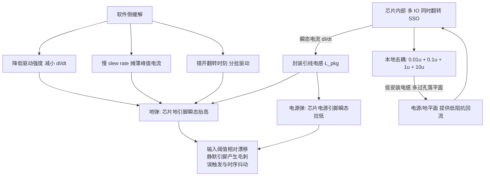

### 8.5 PDN 频段与器件对应表

| 频段 | 主导器件 | 典型阻抗贡献 | 失效表现 | 关键设计要点 |
|---|---|---|---|---|
| DC ~ 1 kHz | 稳压器 VRM 环路 | 输出阻抗 mΩ 级 | 负载阶跃时电压跌落/过冲 | 环路带宽、瞬态响应、远端反馈 |
| 1 kHz ~ 500 kHz | 大容量电解/钽/聚合物 | 由 C 与 ESR 决定 | 低频纹波、负载切换压降 | 容量足够、ESR 提供阻尼 |
| 500 kHz ~ 20 MHz | 10μF / 1μF 陶瓷 | 接近 ESR 谷底 | 中频噪声、开关电源纹波耦合 | 容值梯度合理、避免反谐振 |
| 20 MHz ~ 300 MHz | 0.1μF / 0.01μF 小陶瓷 | 安装电感主导 | IO 翻转尖峰、地弹 | 极短回路、多过孔、贴近引脚 |
| > 300 MHz | 平面电容 + 片上 decap | 平面间电容与扩散电感 | 高频噪声无法被板级电容抑制 | 薄介质电源/地平面对、依赖片上电容 |

---

## 九、共模/差模噪声与 EMC 基础

### 9.1 差模与共模

- **差模（Differential Mode, DM）噪声**：信号的两根线（或电源正负）上大小相等、方向相反的噪声电流，是正常工作电流的"不完美"部分，回路面积小，主要通过滤波（X 电容、差模电感）抑制。
- **共模（Common Mode, CM）噪声**：两根线上大小相等、方向相同的噪声电流，通过寄生电容经参考地（大地/机壳）返回，回路面积大、等效天线效率高，是 EMI 辐射的主要来源。共模往往由地电位差、不平衡走线、不对称的驱动/端接把差模能量转换而来（mode conversion）。

差分对若长度/间距不匹配、阻抗不对称、两侧驱动强度不一致，差模能量就会部分转换为共模。**这里再次触及芯片 IO：如果一对差分信号是用两个普通 GPIO 以"软件差分"方式驱动的，两个引脚的驱动强度、slew rate 必须严格配置一致**，否则上升沿与下降沿不对称，直接产生共模发射。

### 9.2 EMC：辐射与传导

EMC（电磁兼容）分两方面：EMI（电磁干扰，设备对外发射）与 EMS（电磁敏感度/抗扰）。干扰传播途径：

- **传导（Conducted）**：噪声通过电源线、信号线、地传导，频段通常 150 kHz~30 MHz，靠滤波器（共模电感、X/Y 电容、磁珠、π 型网络）抑制。
- **辐射（Radiated）**：噪声以电磁波形式通过空间耦合，频段通常 30 MHz 以上，靠屏蔽、减小回路面积、端接、滤波、合理接地抑制。

一个重要的定量关系：一个周期性方波信号的谐波包络在 f < 1/(πT) 时以 −20 dB/decade 滚降，在 f > 1/(π·t_r) 后以 −40 dB/decade 滚降。**拐点频率 f_knee = 1/(π·t_r) 直接由上升时间决定**——把 t_r 从 1 ns 放慢到 4 ns，拐点从约 318 MHz 降到约 80 MHz，在 200 MHz 处的谐波幅度可以下降十几 dB。这就是"EMC 整改第一步先查 GPIO slew rate 配置"的理论依据。

### 9.3 滤波、屏蔽与接地

- **滤波**：在 IO 与电源入口放置磁珠/共模电感 + 旁路电容组成低通；时钟等噪声源加 RC 滤波或专用时钟缓冲。去耦电容本质也是电源滤波。注意磁珠的选型要看阻抗-频率曲线，而非单看"标称阻抗"，且要避免磁珠与后级电容形成 LC 谐振抬高某频点。
- **屏蔽**：金属外壳、屏蔽罩、屏蔽线缆把辐射源包裹在法拉第笼里；屏蔽必须连续（接缝、开孔的最大线性尺寸 ≪ λ/20）且良好接地，否则缝隙成为缝隙天线。屏蔽罩的接地点间距同样要按 λ/20 控制。
- **接地**：接地策略直接决定 EMC 成败。常见策略：**单点接地**（避免地环路，适合低频/混合信号）、**多点接地**（高频下降低接地阻抗，但可能引入地环路）、**混合接地**（用磁珠/电容在所需频段隔离）。关键是避免地环路放大共模噪声，同时保证高频返回路径连续低感。分割地平面（模拟/数字）要非常谨慎：跨分割的走线会破坏返回路径，通常比不分割更差；现代做法更倾向于"完整地平面 + 布局分区"。

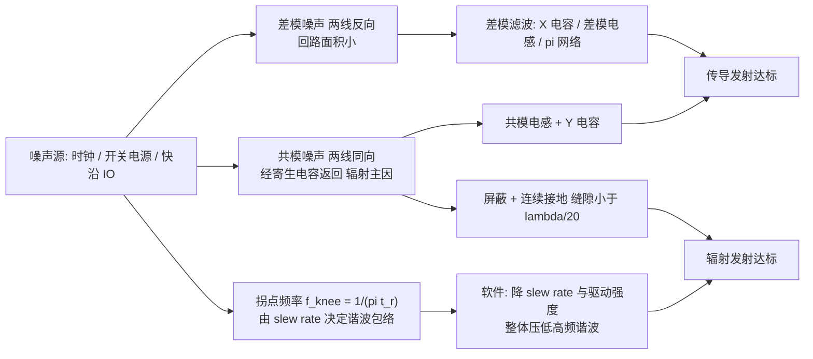

### 9.4 EMC 措施对照表

| 干扰类型/路径 | 典型频段 | 主要措施 | 软件/配置侧可做的事 | 备注 |
|---|---|---|---|---|
| 传导差模 | 150 kHz ~ 30 MHz | X 电容、差模电感、π 型滤波 | 降低开关频率抖动、错开负载切换 | 电源入口重点 |
| 传导共模 | 150 kHz ~ 30 MHz | 共模电感、Y 电容 | 减少不必要的 IO 翻转 | 注意安规 Y 电容漏电流限制 |
| 辐射（共模主导） | > 30 MHz | 屏蔽、减小回路面积、滤波 | 关闭未使用 IO 的输出、配置为输入下拉 | 缝隙与开孔 < λ/20 |
| 辐射（差模） | > 30 MHz | 端接、缩短走线、3W 间距 | 降驱动强度、开慢 slew rate | 直接压低 f_knee |
| 时钟谐波尖峰 | 宽频 | 扩频时钟 SSC、串阻、屏蔽 | 使能 PLL 的 SSC 功能 | SSC 会引入额外抖动，需评估 |
| 抗扰 EMS | 全频段 | 滤波、屏蔽、去耦、TVS | 输入使能施密特触发、开毛刺滤波器 | 端口加防护器件 |

表中"软件/配置侧可做的事"一列是本文特意补充的：EMC 整改常被视为纯硬件工作，实际上底层软件工程师至少能贡献三件事——**配置未使用引脚、配置驱动强度与 slew rate、使能输入侧的施密特与数字滤波**。这三件事都不改一颗料、不动一根走线。

---

## 十、块 A：芯片模块设计——IO 单元（Pad Cell）的内部架构

前面九节讲的都是"信号离开芯片之后"的世界。现在把镜头拉回芯片内部：**信号是怎么被驱动出去的？为什么它有这个上升时间、这个输出阻抗？软件的每一位配置到底改变了哪个晶体管？**

### 10.1 IO 单元在 SoC 中的位置

一个典型 MCU/SoC 的引脚，从内到外经过四层：

1. **内核与外设逻辑**：CPU、SPI/I²C/CAN/以太网控制器、定时器等功能模块，产生逻辑级的输出数据与输出使能。
2. **引脚复用矩阵（Pin Mux / IOMUX）**：一个多路选择网络，决定这个物理引脚此刻由哪个外设或 GPIO 控制器占用。
3. **IO 控制寄存器组（PINCFG）**：保存每个引脚的电气属性配置——驱动强度、上下拉、slew rate、开漏、施密特、输入使能等。
4. **IO 单元（IO Cell / Pad Cell）**：真正的模拟/混合信号电路，包含 ESD 保护、输出驱动级、输入缓冲、上下拉电阻网络、slew rate 控制电路，最终连到金属 pad 与封装引线。

### 10.2 IO 单元内部结构框图

下面是一个通用的 3.3V LVCMOS 双向 IO 单元的内部架构框图。它综合了主流工艺库中 IO Cell 的常见实现结构，可作为理解任何 MCU GPIO 数据手册"IO 结构图"的模板。

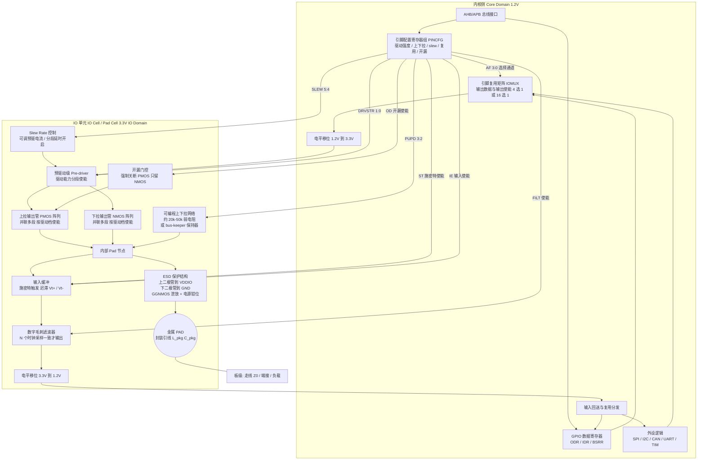

这张图值得逐块拆解。

### 10.3 输出驱动级：推挽与开漏

输出级的核心是一对互补管：**PMOS 接 VDDIO 负责把 pad 拉高，NMOS 接 GND 负责把 pad 拉低**。两者由预驱动级互补控制，这就是**推挽（push-pull）**结构。它的特点是：

- 高低电平都是"强驱动"，边沿快、抗干扰强；
- 输出高电平接近 VDDIO，无需外部上拉；
- 但两个管子在切换瞬间会有短暂同时导通，产生**直通电流（shoot-through / crowbar current）**，这是电源尖峰与 EMI 的重要来源之一；良好的 IO 设计会在预驱动级引入非交叠（non-overlap）时序来抑制它。

若把 PMOS 强制关断、只保留 NMOS，就是**开漏（open-drain）**结构：引脚只能主动拉低，高电平必须靠外部上拉电阻（或片内上拉）。开漏的价值在于：

- 支持**线与（wired-AND）**：多个器件的开漏输出并联，任一拉低则总线为低——这正是 I²C 的 SDA/SCL、以及许多中断汇总线的工作方式；
- 支持**电平转换**：3.3V 器件的开漏输出可以上拉到 1.8V 电源，直接跨电平域通信（前提是 pad 耐压允许）；
- 但开漏的上升沿由上拉电阻 R_pu 与总线电容 C_bus 的 RC 决定，t_r ≈ 0.85×R_pu×C_bus（10%→90%），**这是开漏总线最主要的 SI 瓶颈**。

### 10.4 驱动强度：并联管段与输出阻抗

"驱动强度"（drive strength）在物理上不是一个电流源，而是**并联输出管的段数**。IO 单元的输出管被拆成若干段（如 1×、1×、2×、4× 的加权分段），DRVSTR 位域决定使能哪几段：

- 使能段数少 → 总沟道宽度小 → 导通电阻 R_on 大 → 等效输出阻抗 Z_out 大 → 驱动电流能力小 → 边沿慢；
- 使能段数多 → R_on 小 → Z_out 小 → 电流能力强 → 边沿快。

数据手册上标称的"2/4/8/12 mA"通常指的是**在规定的 V_OL（如 0.4V）下能灌入的电流**，它间接反映了 R_on。粗略地，Z_out ≈ V_OL / I_OL，例如 0.4V / 8mA = 50Ω 量级（实际因为 V/I 曲线非线性，大信号摆动时的等效阻抗要从 IBIS 的 V/I 表取斜率）。

驱动强度对 SI 的影响是双向的，必须权衡：

| 驱动强度 | 输出阻抗 Z_out | 上升时间 t_r | 源端反射系数 | 过冲/振铃 | 地弹 SSO | EMI | 适用场景 |
|---|---|---|---|---|---|---|---|
| 低（2 mA） | 高（60~80Ω） | 长 | 接近 0（自匹配） | 很小 | 很小 | 低 | 短线控制脚、LED、慢速使能信号 |
| 中低（4 mA） | 45Ω 左右 | 较长 | 小 | 小 | 小 | 较低 | 一般 GPIO、低速 UART、I²C |
| 中高（8 mA） | 25~30Ω | 短 | 中等负值 | 中等 | 中等 | 较高 | 中速 SPI、并行总线、需驱动多负载 |
| 高（12 mA+） | 15~20Ω | 很短 | 较大负值 | 明显 | 大 | 高 | 长走线、大容性负载、高速时钟输出 |

**选型准则**：先按"负载电容 + 走线长度 + 所需 t_r（由时序预算给出）"算出最低够用的驱动强度，然后取这个档位，而不是习惯性地取最大值。很多量产 EMC 问题的根源，就是初始化代码里一句"全部配成最大驱动"。

### 10.5 Slew Rate 控制：在同一驱动强度下调边沿

Slew rate 控制与驱动强度是两个正交的旋钮。驱动强度决定"最终能灌多大电流"，slew rate 决定"电流以多快的速度建立起来"。常见的电路实现有三种：

1. **预驱动电流限流**：给预驱动级串一个可调电流源，限制输出管栅极电容的充放电速度，栅压上升变慢，输出管缓慢开启，dI/dt 降低。
2. **分段延时开启**：把并联的输出管段用逐级延时链依次打开（例如 0 ps、100 ps、200 ps 三批），电流呈阶梯式建立，等效地把边沿"斜坡化"。
3. **反馈式压摆控制**：用一个小电容从输出反馈到预驱动节点（米勒电容效应），输出跳变时反馈电流抑制栅压变化，形成自限速。

从 SI 角度，慢 slew rate 带来的收益是：

- **f_knee = 1/(π·t_r) 下降**，高频谐波能量整体减小，辐射发射改善；
- **dV/dt 与 dI/dt 下降**，串扰按比例减小；
- **地弹幅度 L·dI/dt 下降**，SSO 噪声改善；
- **反射的影响相对减小**：因为临界长度 ∝ t_r，走线相对"变短"了。

代价是：

- 传播延迟增加、建立时间被压缩，高速接口可能超时；
- 边沿在阈值区停留时间变长，若线上有噪声，穿越阈值时更容易被干扰出毛刺（这也是为什么慢沿输入必须配施密特触发）；
- 占空比失真可能加剧（上升与下降边沿速率不完全对称时）。

### 10.6 输入缓冲与施密特触发

输入侧的第一级是输入缓冲器。普通反相器型缓冲只有一个阈值 V_t，输入在阈值附近缓慢变化或带噪声时，输出会连续抖动，甚至因为输入级 PMOS/NMOS 同时导通而产生大的直通电流（这也是**未使用引脚必须配置为输入 + 上/下拉，或直接关闭输入使能**的原因，浮空输入会持续耗电并产生噪声）。

**施密特触发（Schmitt trigger）**引入迟滞：上升时用较高的阈值 V_t+，下降时用较低的阈值 V_t−，迟滞窗口 ΔV = V_t+ − V_t− 通常是 VDDIO 的 10%~30%。只要噪声幅度小于迟滞窗口，输出就不会误翻转。**这是 IO 单元里最直接的抗扰措施**，对慢边沿信号（如 RC 上升的 I²C、按键、光耦输出）几乎是必开项。

再往后可以有**数字毛刺滤波器**：用一个采样时钟对输入连续采样 N 次，只有连续 N 次一致才更新输出状态。它能滤掉宽度小于 N 个采样周期的窄脉冲（串扰毛刺、ESD 耦合的尖峰），代价是引入 N 个周期的延迟。中断输入脚、复位脚、按键脚上强烈建议使能。

`IE`（Input Enable）位控制输入通路是否使能。对纯输出引脚，关闭 IE 有三个好处：省电（避免浮空输入的直通电流）、避免输出跳变时输入回送产生的内部噪声、减少不必要的内部翻转从而降低 EMI。

### 10.7 可编程上下拉与 bus-keeper

上下拉网络通常由一个 PMOS（上拉到 VDDIO）与一个 NMOS（下拉到 GND）配合串联电阻构成，阻值一般在 20 kΩ~50 kΩ 量级，精度很差（±50% 常见）。它们的用途：

- 防止输入浮空（这是最重要的用途）；
- 为开漏总线提供上拉——但要特别注意：**片内上拉阻值太大（如 40 kΩ），对 I²C 这类有 400 pF 总线电容规格的总线，RC 上升时间会长达 0.85×40k×400p ≈ 13.6 μs，远超 400 kHz 快速模式要求的 300 ns**。所以 I²C 几乎总是需要外部 2.2k~4.7k 上拉，片内上拉只能作为"防浮空"兜底。

某些 IO 单元提供 **bus-keeper（也叫 latch / repeater）**模式：一对弱反相器构成的锁存器，把引脚保持在最后一次被驱动的电平上，驱动能力极弱（几微安），一旦有外部驱动就会被轻易翻转。它适合三态总线在无人驱动时保持确定电平，避免浮空，同时又不像固定上下拉那样在总线被驱动到反相电平时持续耗电。

### 10.8 ESD 保护与过压结构

ESD（Electro-Static Discharge）保护是 IO 单元里最不起眼却最关键的部分。典型结构包含：

- **上二极管（到 VDDIO）与下二极管（到 GND）**：正常工作时反偏截止；当 pad 电压超过 VDDIO + V_f（约 0.7V）时上二极管导通，把过冲能量泄放到电源；当 pad 低于 −V_f 时下二极管导通，泄放负向能量。**这正是"过冲不能超过 VDDIO+0.3V"这条绝对最大额定值的物理由来**——超过它，二极管开始灌电流，长期反复会导致金属电迁移、器件退化，瞬间大电流则可能触发闩锁。
- **GGNMOS（Gate-Grounded NMOS）或 SCR**：作为主泄放器件，在 ESD 事件（HBM 2 kV、CDM 500 V 等）下以雪崩/骤回（snapback）方式导通，泄放安培级电流。
- **电源钳位（Power Clamp）**：在 VDDIO 与 GND 之间的大尺寸泄放管 + RC 触发电路，为"pad → VDDIO → clamp → GND"的泄放路径提供低阻通道。
- **限流电阻**：在 pad 与内部栅极之间串一个小电阻（几十到几百欧），配合二次保护二极管，保护薄栅氧。

ESD 结构对 SI 的副作用不可忽视：**ESD 二极管的结电容构成了引脚输入电容 C_pin 的主要部分**（典型 2~10 pF）。对高速差分链路，这几 pF 就是一个明显的容性不连续点，会拉低局部阻抗、造成反射。这正是为什么"USB/以太网端口的外置 ESD 保护器件必须选择超低电容型（< 0.5 pF）"——外置器件的电容会与 pad 电容叠加，共同劣化阻抗连续性。

对于容忍高于 VDDIO 输入的引脚（5V-tolerant），IO 单元会去掉到 VDDIO 的上二极管，改用堆叠管、浮动 N 阱等结构，使 pad 可以被拉到高于 VDDIO 而不产生反灌电流。**注意：5V-tolerant 引脚通常不能在开漏模式下上拉到 5V 以上，也不能在芯片未上电时被外部驱动**——后者会通过残余路径给芯片"反向供电"，这是很多板级"上电顺序"问题的根源。

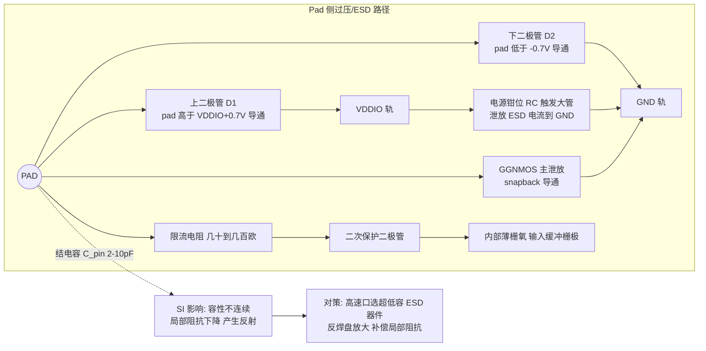

### 10.9 引脚配置寄存器位域

现在把上面所有可编程项收敛到一个寄存器上。下面是一个通用 32 位引脚配置寄存器 `PINCFG[n]`（每个引脚一个）的位域定义，其字段划分方式与主流 MCU（Cortex-M 系列、汽车级 MCU、应用处理器）的 IOMUX/PAD_CTRL 寄存器高度一致。

```mermaid
graph TB
    subgraph REG["PINCFG[n] 引脚配置寄存器 32 位 复位值 0x0000_0100"]
        direction TB
        B0["bit 1:0  DRVSTR  驱动强度<br/>00=2mA  01=4mA  10=8mA  11=12mA"]
        B1["bit 3:2  PUPD    上下拉选择<br/>00=悬空 01=上拉 10=下拉 11=bus-keeper"]
        B2["bit 5:4  SLEW    压摆率控制<br/>00=最慢 01=慢 10=快 11=最快"]
        B3["bit 6    OD      开漏使能<br/>0=推挽 PMOS+NMOS  1=开漏 仅 NMOS"]
        B4["bit 7    IE      输入缓冲使能<br/>0=关闭省电抗噪 1=使能"]
        B5["bit 8    ST      施密特触发使能<br/>0=普通缓冲 1=迟滞输入"]
        B6["bit 9    FILT    数字毛刺滤波使能<br/>0=直通 1=连续 3 次采样一致"]
        B7["bit 10   OE      输出使能<br/>0=高阻输入 1=输出驱动"]
        B8["bit 11   INV     输入极性反相"]
        B9["bit 15:12 AF     复用功能选择 4 位<br/>0=GPIO 1=SPI 2=I2C 3=UART 4=CAN 5=TIM ..."]
        B10["bit 17:16 IOVSEL IO 电平域选择<br/>00=3.3V 01=1.8V 10=1.2V"]
        B11["bit 18   ODLVL  初始输出电平<br/>0=低 1=高 复位后立即生效"]
        B12["bit 30:19 RSVD  保留 写 0"]
        B13["bit 31   LOCK   配置锁定<br/>写 1 后本寄存器只读 直到复位"]
    end
    B0 --> SI1["SI 影响: Z_out 与 t_r 与源端反射"]
    B2 --> SI2["SI 影响: dV/dt dI/dt 串扰 地弹 EMI"]
    B3 --> SI3["SI 影响: 上升沿由外部 RC 决定"]
    B1 --> SI4["SI 影响: 防浮空 开漏总线上升沿"]
    B5 --> SI5["SI 影响: 抗噪迟滞 防振铃误触发"]
    B9 --> SI6["SI 影响: 决定该脚归属外设 影响并发翻转分布"]
```

配套的位域表如下，这张表在写驱动时是最常查的：

| 位域 | 名称 | 宽度 | 复位值 | 取值含义 | 对信号完整性的影响 |
|---|---|---|---|---|---|
| [1:0] | DRVSTR | 2 | 00 | 00=2mA / 01=4mA / 10=8mA / 11=12mA | 决定 Z_out 与 t_r；档位越高边沿越陡、反射与地弹越大 |
| [3:2] | PUPD | 2 | 00 | 00=悬空 / 01=上拉 / 10=下拉 / 11=keeper | 防浮空；作为开漏上拉时阻值过大会拖慢上升沿 |
| [5:4] | SLEW | 2 | 00 | 00=最慢 … 11=最快 | 直接调节 dV/dt；压低 f_knee，是 EMC 首选旋钮 |
| [6] | OD | 1 | 0 | 0=推挽 / 1=开漏 | 开漏时上升沿由外部 RC 决定，需校核总线时序 |
| [7] | IE | 1 | 1 | 0=输入通路关闭 / 1=使能 | 纯输出脚关闭可省电、减少内部翻转噪声 |
| [8] | ST | 1 | 1 | 0=普通缓冲 / 1=施密特迟滞 | 迟滞窗口抵抗振铃与串扰引起的误翻转 |
| [9] | FILT | 1 | 0 | 0=直通 / 1=连续采样滤波 | 滤除窄毛刺；代价是增加输入延迟 |
| [10] | OE | 1 | 0 | 0=高阻 / 1=输出 | 三态控制；总线冲突会造成大电流与电源塌陷 |
| [11] | INV | 1 | 0 | 输入极性反相 | 无直接 SI 影响，影响逻辑解释 |
| [15:12] | AF | 4 | 0000 | 复用功能通道号 | 决定引脚归属；影响同组引脚的并发翻转与 SSO 分布 |
| [17:16] | IOVSEL | 2 | 00 | IO 电平域 3.3/1.8/1.2V | 决定摆幅与噪声裕量；电平域切换需匹配外部器件 |
| [18] | ODLVL | 1 | 0 | 复位后初始输出电平 | 避免上电瞬间的非预期电平造成总线争用 |
| [31] | LOCK | 1 | 0 | 写 1 锁定配置 | 防止运行期误改关键引脚配置（安全相关） |

### 10.10 IO 单元与内核/总线的连接

从软件视角，"写一个 GPIO"这条路径是：

CPU 执行 `STR` 指令 → AHB/APB 总线事务 → GPIO 控制器的 ODR/BSRR 寄存器被写入 → 输出数据送入 IOMUX → IOMUX 根据 `AF[3:0]` 选择数据源（GPIO 还是某个外设）→ 数据经电平移位进入 IO 单元预驱动 → 预驱动按 `DRVSTR` 与 `SLEW` 控制输出管开启 → PMOS/NMOS 驱动 pad → 信号出芯片。

反向读取路径是：pad → ESD 网络 → 输入缓冲（受 `IE`、`ST` 控制）→ 毛刺滤波（`FILT`）→ 电平移位 → IOMUX 输入分发 → GPIO 的 IDR 或外设接收端。

有三个工程细节值得强调：

1. **BSRR 型寄存器的意义**：直接对 ODR 做"读—改—写"会带来竞态（中断中改另一位会丢失）。BSRR（Bit Set/Reset Register）用置位/复位两个半字实现原子写，是驱动代码里应当默认使用的方式。
2. **配置顺序很重要**：正确顺序是"先配电气属性（驱动强度/slew/上下拉/开漏）与初始电平 → 再配复用功能 → 最后使能输出"。如果先使能输出再配驱动强度，引脚会以复位默认档位（往往是最强驱动）短暂驱动一次，产生一个陡沿毛刺；对总线争用敏感的场合甚至会拉低整条总线。
3. **时钟门控**：绝大多数 MCU 的 GPIO 端口寄存器在外设时钟未使能时写入无效（且不报错）。驱动初始化的第一步永远是打开对应端口的时钟，否则会出现"寄存器写了但读回是复位值"的经典现象。

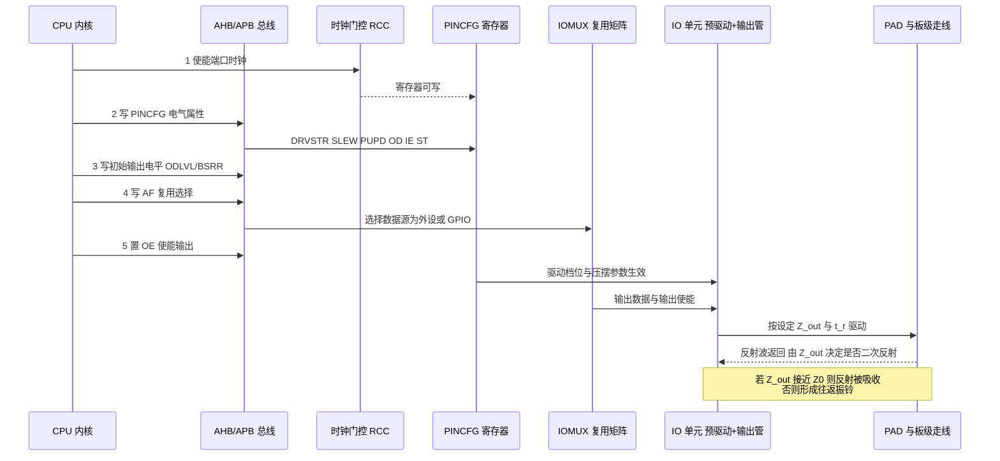

---

## 十一、块 B：驱动代码实现

本节给出可直接移植的 C 驱动代码框架，全部围绕上一节定义的 `PINCFG` 位域。代码风格遵循嵌入式常规：`volatile` 寄存器映射、位域宏、无动态内存、可静态断言。

### 11.1 寄存器定义与通用配置 API

```c
/* ============================================================
 * 代码块 3：GPIO / PINCFG 驱动 —— 寄存器定义与通用配置 API
 * 目标：把 SI 相关的电气属性（驱动强度/slew/上下拉/开漏）
 *       抽象成可读的配置结构体，避免驱动代码里散落魔数
 * ============================================================ */
#include <stdint.h>
#include <stdbool.h>
#include <stddef.h>

/* ---------- 1. PINCFG 位域定义（对应块 A 的寄存器图） ---------- */
#define PINCFG_DRVSTR_Pos      (0u)
#define PINCFG_DRVSTR_Msk      (0x3u << PINCFG_DRVSTR_Pos)
#define PINCFG_PUPD_Pos        (2u)
#define PINCFG_PUPD_Msk        (0x3u << PINCFG_PUPD_Pos)
#define PINCFG_SLEW_Pos        (4u)
#define PINCFG_SLEW_Msk        (0x3u << PINCFG_SLEW_Pos)
#define PINCFG_OD_Pos          (6u)
#define PINCFG_OD_Msk          (0x1u << PINCFG_OD_Pos)
#define PINCFG_IE_Pos          (7u)
#define PINCFG_IE_Msk          (0x1u << PINCFG_IE_Pos)
#define PINCFG_ST_Pos          (8u)
#define PINCFG_ST_Msk          (0x1u << PINCFG_ST_Pos)
#define PINCFG_FILT_Pos        (9u)
#define PINCFG_FILT_Msk        (0x1u << PINCFG_FILT_Pos)
#define PINCFG_OE_Pos          (10u)
#define PINCFG_OE_Msk          (0x1u << PINCFG_OE_Pos)
#define PINCFG_INV_Pos         (11u)
#define PINCFG_INV_Msk         (0x1u << PINCFG_INV_Pos)
#define PINCFG_AF_Pos          (12u)
#define PINCFG_AF_Msk          (0xFu << PINCFG_AF_Pos)
#define PINCFG_IOVSEL_Pos      (16u)
#define PINCFG_IOVSEL_Msk      (0x3u << PINCFG_IOVSEL_Pos)
#define PINCFG_ODLVL_Pos       (18u)
#define PINCFG_ODLVL_Msk       (0x1u << PINCFG_ODLVL_Pos)
#define PINCFG_LOCK_Pos        (31u)
#define PINCFG_LOCK_Msk        (0x1u << PINCFG_LOCK_Pos)

/* ---------- 2. 枚举：让配置代码自解释 ---------- */
typedef enum { DRV_2MA = 0u, DRV_4MA = 1u, DRV_8MA = 2u, DRV_12MA = 3u } pin_drive_t;
typedef enum { PUPD_NONE = 0u, PUPD_UP = 1u, PUPD_DOWN = 2u, PUPD_KEEPER = 3u } pin_pupd_t;
typedef enum { SLEW_SLOWEST = 0u, SLEW_SLOW = 1u, SLEW_FAST = 2u, SLEW_FASTEST = 3u } pin_slew_t;
typedef enum { PIN_PUSHPULL = 0u, PIN_OPENDRAIN = 1u } pin_otype_t;
typedef enum { IOV_3V3 = 0u, IOV_1V8 = 1u, IOV_1V2 = 2u } pin_iov_t;

/* 复用功能通道号（与芯片 IOMUX 表一一对应） */
typedef enum {
    AF_GPIO = 0u, AF_SPI = 1u, AF_I2C = 2u, AF_UART = 3u,
    AF_CAN  = 4u, AF_TIM = 5u, AF_ETH  = 6u, AF_ADC  = 7u
} pin_af_t;

/* ---------- 3. 端口寄存器映射 ---------- */
typedef struct {
    volatile uint32_t PINCFG[32];   /* 0x000: 每引脚一个配置寄存器 */
    volatile uint32_t IDR;          /* 0x080: 输入数据（只读） */
    volatile uint32_t ODR;          /* 0x084: 输出数据 */
    volatile uint32_t BSRR;         /* 0x088: 位置位/复位（低半字置位，高半字复位）*/
    volatile uint32_t LOCKR;        /* 0x08C: 端口级锁定 */
} port_regs_t;

#define PORTA   ((port_regs_t *)0x40020000u)
#define PORTB   ((port_regs_t *)0x40020400u)
#define PORTC   ((port_regs_t *)0x40020800u)

/* ---------- 4. 配置描述结构体 ---------- */
typedef struct {
    port_regs_t *port;
    uint8_t      pin;          /* 0..31 */
    pin_af_t     af;
    bool         is_output;
    pin_otype_t  otype;
    pin_drive_t  drive;        /* SI 关键项：决定 Z_out 与 t_r */
    pin_slew_t   slew;         /* SI 关键项：决定 dV/dt 与 EMI */
    pin_pupd_t   pupd;
    bool         input_enable;
    bool         schmitt;      /* SI 关键项：抗振铃误触发 */
    bool         glitch_filter;
    bool         init_high;    /* 初始输出电平，防上电争用 */
    pin_iov_t    iov;
    bool         lock;         /* 配置完成后锁定（安全相关引脚） */
} pin_cfg_t;

/* ---------- 5. 核心配置函数 ---------- */
/**
 * @brief  按描述结构体配置一个引脚。
 * @note   配置顺序至关重要：
 *         (1) 先写电气属性与初始电平，(2) 再选复用功能，(3) 最后使能输出。
 *         若顺序颠倒，引脚会先以复位默认（通常是最强驱动）驱动一次，
 *         产生一个非预期的陡沿毛刺，可能干扰总线或造成争用。
 */
void hal_pin_config(const pin_cfg_t *cfg)
{
    if ((cfg == NULL) || (cfg->port == NULL) || (cfg->pin > 31u)) {
        return;
    }

    volatile uint32_t *reg = &cfg->port->PINCFG[cfg->pin];

    /* 已锁定的引脚不可再配置（LOCK 位只能由复位清除） */
    if ((*reg & PINCFG_LOCK_Msk) != 0u) {
        return;
    }

    /* --- 步骤 1：先把初始输出电平写好，避免使能输出瞬间的毛刺 --- */
    cfg->port->BSRR = cfg->init_high ? (1u << cfg->pin)          /* 置位 */
                                     : (1u << (cfg->pin + 16u)); /* 复位 */

    /* --- 步骤 2：组装电气属性（此时 OE 仍为 0，引脚保持高阻） --- */
    uint32_t v = 0u;
    v |= ((uint32_t)cfg->drive  << PINCFG_DRVSTR_Pos) & PINCFG_DRVSTR_Msk;
    v |= ((uint32_t)cfg->pupd   << PINCFG_PUPD_Pos)   & PINCFG_PUPD_Msk;
    v |= ((uint32_t)cfg->slew   << PINCFG_SLEW_Pos)   & PINCFG_SLEW_Msk;
    v |= ((uint32_t)cfg->otype  << PINCFG_OD_Pos)     & PINCFG_OD_Msk;
    v |= ((uint32_t)cfg->iov    << PINCFG_IOVSEL_Pos) & PINCFG_IOVSEL_Msk;
    if (cfg->input_enable)  { v |= PINCFG_IE_Msk;   }
    if (cfg->schmitt)       { v |= PINCFG_ST_Msk;   }
    if (cfg->glitch_filter) { v |= PINCFG_FILT_Msk; }
    if (cfg->init_high)     { v |= PINCFG_ODLVL_Msk;}
    *reg = v;

    /* --- 步骤 3：选择复用功能 --- */
    v = (*reg & ~PINCFG_AF_Msk) | (((uint32_t)cfg->af << PINCFG_AF_Pos) & PINCFG_AF_Msk);
    *reg = v;

    /* --- 步骤 4：最后使能输出 --- */
    if (cfg->is_output) {
        *reg |= PINCFG_OE_Msk;
    }

    /* --- 步骤 5：可选锁定（功能安全 / 防误改） --- */
    if (cfg->lock) {
        *reg |= PINCFG_LOCK_Msk;
    }
}

/* ---------- 6. 运行期单项调整：SI 现场调试最常用 ---------- */
/** 运行期改驱动强度：调试振铃时可在不重编译硬件的情况下逐档扫描 */
void hal_pin_set_drive(port_regs_t *port, uint8_t pin, pin_drive_t drv)
{
    volatile uint32_t *reg = &port->PINCFG[pin];
    *reg = (*reg & ~PINCFG_DRVSTR_Msk) |
           (((uint32_t)drv << PINCFG_DRVSTR_Pos) & PINCFG_DRVSTR_Msk);
}

/** 运行期改压摆率：EMC 整改时最先尝试的旋钮 */
void hal_pin_set_slew(port_regs_t *port, uint8_t pin, pin_slew_t slew)
{
    volatile uint32_t *reg = &port->PINCFG[pin];
    *reg = (*reg & ~PINCFG_SLEW_Msk) |
           (((uint32_t)slew << PINCFG_SLEW_Pos) & PINCFG_SLEW_Msk);
}

/** 原子写引脚电平（务必用 BSRR，避免读改写竞态） */
static inline void hal_pin_write(port_regs_t *port, uint8_t pin, bool level)
{
    port->BSRR = level ? (1u << pin) : (1u << (pin + 16u));
}

/** 未使用引脚的安全默认配置：关输入、下拉、最低驱动、不输出
 *  目的：消除浮空输入的直通电流与噪声敏感点，同时降低 EMI 天线效应 */
void hal_pin_park_unused(port_regs_t *port, uint8_t pin)
{
    pin_cfg_t c = {
        .port = port, .pin = pin, .af = AF_GPIO,
        .is_output = false, .otype = PIN_PUSHPULL,
        .drive = DRV_2MA, .slew = SLEW_SLOWEST,
        .pupd = PUPD_DOWN,          /* 明确下拉，杜绝浮空 */
        .input_enable = false,      /* 关闭输入缓冲，省电且抗噪 */
        .schmitt = false, .glitch_filter = false,
        .init_high = false, .iov = IOV_3V3, .lock = false
    };
    hal_pin_config(&c);
}
```

### 11.2 高速信号引脚的 SI 相关配置

下面这段代码是本文块 B 的核心：把前面所有 SI 理论落到"给一组具体信号选什么档位"上。它包含一个**按走线长度与负载电容自动推荐驱动强度与 slew rate 的策略函数**，这正是笔者在实际项目里用来替代"全部最大驱动"的做法。

```c
/* ============================================================
 * 代码块 4：高速信号引脚的 SI 相关配置
 * 覆盖：SPI 时钟/数据、CAN TX/RX、以太网 RMII、时钟输出
 * 核心思想：驱动强度按"够用即可"选择，而非默认拉满
 * ============================================================ */

/* --- 1. 按负载与走线长度推荐驱动档位 ---------------------------- */
/**
 * @brief  依据容性负载与走线长度推荐驱动强度与压摆率。
 * @param  c_load_pf     总负载电容（接收端 C_pin + 走线电容 + 连接器）
 * @param  trace_mm      走线长度 (mm)
 * @param  t_r_max_ns    时序预算允许的最大上升时间 (ns)
 * @param  has_series_r  板上是否已放置源端串阻
 * @param  out_drive     [out] 推荐驱动强度
 * @param  out_slew      [out] 推荐压摆率
 *
 * 依据：
 *   - 容性负载充电近似 t_r ≈ 2.2 × Z_out × C_load（一阶 RC 10%~90%）
 *   - 走线越长越接近传输线，越需要源端阻抗接近 Z0（即中低驱动）
 *   - 若板上已有串阻，则 IO 侧应选低驱动，避免总阻抗过大导致过阻尼
 */
void si_recommend_drive(float c_load_pf, float trace_mm, float t_r_max_ns,
                        bool has_series_r,
                        pin_drive_t *out_drive, pin_slew_t *out_slew)
{
    /* 各档位等效输出阻抗（来自数据手册 V/I 曲线，单位欧姆） */
    static const float zout[4] = { 75.0f, 45.0f, 28.0f, 18.0f };

    pin_drive_t best = DRV_2MA;
    for (int i = 0; i < 4; ++i) {
        /* 一阶 RC 估算 10%->90% 上升时间，单位 ns：
           t_r = 2.2 * R(ohm) * C(pF) * 1e-3  */
        float t_r = 2.2f * zout[i] * c_load_pf * 1e-3f;
        if (t_r <= t_r_max_ns) {
            best = (pin_drive_t)i;   /* 找到第一个满足时序的最低档位 */
            break;
        }
        best = (pin_drive_t)i;       /* 都不满足则取最高档 */
    }

    /* 若板上已有源端串阻，IO 侧再降一档，避免 Z_out + R_s 远大于 Z0 */
    if (has_series_r && (best > DRV_2MA)) {
        best = (pin_drive_t)((int)best - 1);
    }

    /* 压摆率：走线短则尽量慢（EMC 友好）；走线长且时序紧则放快 */
    pin_slew_t slew;
    if (trace_mm < 30.0f) {
        slew = SLEW_SLOWEST;                 /* 短线，慢沿零风险 */
    } else if (trace_mm < 100.0f) {
        slew = (t_r_max_ns > 3.0f) ? SLEW_SLOW : SLEW_FAST;
    } else {
        slew = SLEW_FAST;                    /* 长线，需保留边沿裕量 */
    }

    *out_drive = best;
    *out_slew  = slew;
}

/* --- 2. SPI 高速接口引脚配置（50 MHz，板上已有 22Ω 串阻） -------- */
void board_spi_pins_init(void)
{
    pin_drive_t drv;
    pin_slew_t  slw;

    /* SCK：负载 12pF（从设备 C_pin + 走线），走线 45mm，
       50MHz 下半周期 10ns，要求 t_r < 3ns；板上已有 22Ω 串阻 */
    si_recommend_drive(12.0f, 45.0f, 3.0f, true, &drv, &slw);

    const pin_cfg_t sck = {
        .port = PORTA, .pin = 5, .af = AF_SPI,
        .is_output = true, .otype = PIN_PUSHPULL,
        .drive = drv,               /* 由策略函数给出，通常落在 8mA */
        .slew  = slw,
        .pupd = PUPD_NONE,          /* 有主动驱动，无需上下拉 */
        .input_enable = false,      /* 纯输出，关输入缓冲减少内部翻转噪声 */
        .schmitt = false, .glitch_filter = false,
        .init_high = false,         /* CPOL=0，空闲低电平 */
        .iov = IOV_3V3, .lock = false
    };
    hal_pin_config(&sck);

    /* MOSI：与 SCK 同档位，保证边沿速率一致，避免 skew */
    pin_cfg_t mosi = sck;
    mosi.pin = 7;
    hal_pin_config(&mosi);

    /* MISO：输入脚。必须开输入使能 + 施密特（抵抗长线上的振铃）
       上拉防止从设备高阻时浮空 */
    const pin_cfg_t miso = {
        .port = PORTA, .pin = 6, .af = AF_SPI,
        .is_output = false, .otype = PIN_PUSHPULL,
        .drive = DRV_2MA, .slew = SLEW_SLOWEST,   /* 输出级不用，取最小 */
        .pupd = PUPD_UP,
        .input_enable = true,
        .schmitt = true,            /* 关键：迟滞抵抗振铃穿越阈值 */
        .glitch_filter = false,     /* 高速数据线不能加滤波，会破坏时序 */
        .init_high = false, .iov = IOV_3V3, .lock = false
    };
    hal_pin_config(&miso);

    /* NSS 片选：低速控制信号，用最低驱动 + 最慢沿，EMC 最优 */
    const pin_cfg_t nss = {
        .port = PORTA, .pin = 4, .af = AF_GPIO,
        .is_output = true, .otype = PIN_PUSHPULL,
        .drive = DRV_2MA, .slew = SLEW_SLOWEST,
        .pupd = PUPD_UP,            /* 上拉保证复位期间从设备不被误选中 */
        .input_enable = false, .schmitt = false, .glitch_filter = false,
        .init_high = true,          /* 初始为高 = 未选中，防上电误操作 */
        .iov = IOV_3V3, .lock = false
    };
    hal_pin_config(&nss);
}

/* --- 3. CAN 收发器接口引脚配置 --------------------------------- */
void board_can_pins_init(void)
{
    /* CAN_TX：到收发器距离通常很短（<20mm），
       用中低驱动 + 慢沿，显著改善整车 EMC；
       CAN 的位时间在微秒量级，完全不需要快沿 */
    const pin_cfg_t can_tx = {
        .port = PORTB, .pin = 9, .af = AF_CAN,
        .is_output = true, .otype = PIN_PUSHPULL,
        .drive = DRV_4MA,           /* 收发器输入是高阻 CMOS，4mA 足够 */
        .slew  = SLEW_SLOWEST,      /* 关键：CAN 不需要快沿，慢沿降辐射 */
        .pupd = PUPD_UP,            /* 上拉保证复位期间为隐性电平，不干扰总线 */
        .input_enable = false, .schmitt = false, .glitch_filter = false,
        .init_high = true,          /* 隐性 = 高，避免上电时把总线拉成显性 */
        .iov = IOV_3V3, .lock = true /* 安全相关：配置完成后锁定 */
    };
    hal_pin_config(&can_tx);

    /* CAN_RX：输入，必开施密特（收发器输出边沿在长线后可能变缓）
       不开毛刺滤波，避免破坏位定时与采样点 */
    const pin_cfg_t can_rx = {
        .port = PORTB, .pin = 8, .af = AF_CAN,
        .is_output = false, .otype = PIN_PUSHPULL,
        .drive = DRV_2MA, .slew = SLEW_SLOWEST,
        .pupd = PUPD_UP,
        .input_enable = true, .schmitt = true, .glitch_filter = false,
        .init_high = false, .iov = IOV_3V3, .lock = true
    };
    hal_pin_config(&can_rx);

    /* CAN_STB 待机控制：低速、低驱动，且必须下拉
       —— 复位期间保持收发器处于正常模式还是待机，取决于收发器极性，
          此处假定低电平=正常工作 */
    const pin_cfg_t can_stb = {
        .port = PORTB, .pin = 7, .af = AF_GPIO,
        .is_output = true, .otype = PIN_PUSHPULL,
        .drive = DRV_2MA, .slew = SLEW_SLOWEST,
        .pupd = PUPD_DOWN,
        .input_enable = false, .schmitt = false, .glitch_filter = false,
        .init_high = false, .iov = IOV_3V3, .lock = false
    };
    hal_pin_config(&can_stb);
}

/* --- 4. 以太网 RMII 引脚配置（50 MHz REF_CLK，SI 要求最严） ------- */
void board_eth_rmii_pins_init(void)
{
    /* RMII 参考时钟 50MHz：t_r 需 < 2ns，走线约 60mm，
       必须用较高驱动 + 快沿；板上应配 22~33Ω 串阻做源端端接 */
    const pin_cfg_t ref_clk = {
        .port = PORTC, .pin = 1, .af = AF_ETH,
        .is_output = false,         /* PHY 提供时钟时为输入 */
        .otype = PIN_PUSHPULL,
        .drive = DRV_8MA, .slew = SLEW_FAST,
        .pupd = PUPD_NONE,          /* 时钟线严禁加上下拉，会改变阻抗与直流点 */
        .input_enable = true,
        .schmitt = false,           /* 高速时钟不开施密特，迟滞会引入占空比失真 */
        .glitch_filter = false,
        .init_high = false, .iov = IOV_3V3, .lock = true
    };
    hal_pin_config(&ref_clk);

    /* TXD0/TXD1/TX_EN：三根输出线必须使用完全相同的驱动与压摆配置，
       否则边沿速率不一致 -> 组内 skew -> 眼图恶化 */
    static const uint8_t tx_pins[3] = { 13, 14, 11 };   /* TXD0 TXD1 TX_EN */
    for (size_t i = 0; i < (sizeof(tx_pins) / sizeof(tx_pins[0])); ++i) {
        const pin_cfg_t tx = {
            .port = PORTB, .pin = tx_pins[i], .af = AF_ETH,
            .is_output = true, .otype = PIN_PUSHPULL,
            .drive = DRV_8MA,       /* 与 REF_CLK 同档，保证组内一致 */
            .slew  = SLEW_FAST,
            .pupd = PUPD_NONE,
            .input_enable = false, .schmitt = false, .glitch_filter = false,
            .init_high = false, .iov = IOV_3V3, .lock = true
        };
        hal_pin_config(&tx);
    }
}
```

### 11.3 I²C 开漏引脚配置

I²C 是"开漏 + 外部上拉"的教科书案例，也是最容易踩 SI 坑的总线之一。核心矛盾是：**上升沿完全由 R_pu × C_bus 决定，而 I²C 规范对上升时间有硬性上限**（标准模式 1000 ns、快速模式 300 ns、快速模式+ 120 ns）。

```c
/* ============================================================
 * 代码块 5：I2C 开漏引脚配置 + 上拉电阻校核 + 总线恢复
 * ============================================================ */

/**
 * @brief  校核 I2C 上拉电阻是否满足规范的上升时间与灌电流要求。
 * @param  vdd_v        总线电源电压 (V)
 * @param  r_pu_ohm     外部上拉电阻 (ohm)
 * @param  c_bus_pf     总线总电容 (pF)，含所有器件 C_pin + 走线电容
 * @param  t_r_max_ns   规范允许的最大上升时间 (ns)
 * @param  i_ol_max_ma  从设备/主设备的最小灌电流能力 (mA)，通常 3mA
 * @return 0 通过；负值表示不满足
 *
 * 两条约束：
 *   上限约束：t_r = 0.8473 * R_pu * C_bus <= t_r_max   -> R_pu 不能太大
 *   下限约束：R_pu >= (Vdd - V_OL) / I_OL              -> R_pu 不能太小
 */
int i2c_check_pullup(float vdd_v, float r_pu_ohm, float c_bus_pf,
                     float t_r_max_ns, float i_ol_max_ma)
{
    const float v_ol_max = 0.4f;   /* I2C 规范：V_OL 最大 0.4V */

    /* 上升时间（ns）= 0.8473 * R(ohm) * C(pF) * 1e-3 */
    const float t_r_ns = 0.8473f * r_pu_ohm * c_bus_pf * 1e-3f;
    const float r_min  = (vdd_v - v_ol_max) / (i_ol_max_ma * 1e-3f);

    if (t_r_ns > t_r_max_ns) {
        /* 上拉太弱：上升沿太慢，接收端可能在阈值区停留过久被噪声打断 */
        return -1;
    }
    if (r_pu_ohm < r_min) {
        /* 上拉太强：拉低时灌电流超过器件能力，V_OL 抬高，低电平裕量不足 */
        return -2;
    }
    return 0;
}

/**
 * @brief  I2C 引脚配置（开漏）。
 * @note   SI 要点：
 *   1) 必须 OD=1（开漏），推挽会在多主/时钟延展场景造成总线争用与大电流；
 *   2) 片内上拉阻值太大（20k~50k），仅作防浮空兜底，绝不能替代外部上拉；
 *   3) 必开施密特：I2C 的 RC 上升沿是缓慢边沿，无迟滞极易被噪声打出多次翻转；
 *   4) 开毛刺滤波：I2C 规范本身要求抑制 50ns 以下的尖峰；
 *   5) 驱动强度选中档：需要保证 3mA 灌电流能力，但过高档位会让下降沿过陡，
 *      在长总线上产生负向过冲（可能触发下 ESD 二极管）。
 */
void board_i2c_pins_init(bool use_internal_pullup)
{
    const pin_cfg_t scl = {
        .port = PORTB, .pin = 6, .af = AF_I2C,
        .is_output = true,
        .otype = PIN_OPENDRAIN,     /* 关键：开漏，支持线与与时钟延展 */
        .drive = DRV_4MA,           /* 保证 >3mA 灌电流，又不至于下降沿过陡 */
        .slew  = SLEW_SLOW,         /* 下降沿放缓，抑制负向过冲与辐射 */
        .pupd  = use_internal_pullup ? PUPD_UP : PUPD_NONE,
        .input_enable = true,       /* 开漏必须能读回，用于时钟延展与仲裁检测 */
        .schmitt = true,            /* 关键：缓慢 RC 边沿必须迟滞 */
        .glitch_filter = true,      /* 规范要求抑制 50ns 尖峰 */
        .init_high = true,          /* 释放总线（开漏下写 1 = 高阻） */
        .iov = IOV_3V3, .lock = false
    };
    hal_pin_config(&scl);

    pin_cfg_t sda = scl;
    sda.pin = 7;
    hal_pin_config(&sda);

    /* 上电自检：核对上拉是否满足快速模式(400kHz, t_r <= 300ns)
       典型场景：Vdd=3.3V, R_pu=4.7k, C_bus=150pF */
    (void)i2c_check_pullup(3.3f, 4700.0f, 150.0f, 300.0f, 3.0f);
}

/**
 * @brief  I2C 总线恢复：从设备把 SDA 卡在低电平时的标准复位流程。
 * @note   把引脚临时切回 GPIO 开漏，手动发 9 个时钟脉冲 + 一个 STOP。
 *         这是开漏总线特有的故障模式，与 SI 直接相关：
 *         多数"SDA 卡死"其实源于一次被噪声/振铃破坏的时钟边沿，
 *         导致从设备状态机停在读出数据的中间。
 */
void i2c_bus_recover(void)
{
    /* 切回 GPIO 开漏手动控制 */
    pin_cfg_t scl_gpio = {
        .port = PORTB, .pin = 6, .af = AF_GPIO,
        .is_output = true, .otype = PIN_OPENDRAIN,
        .drive = DRV_4MA, .slew = SLEW_SLOW, .pupd = PUPD_UP,
        .input_enable = true, .schmitt = true, .glitch_filter = true,
        .init_high = true, .iov = IOV_3V3, .lock = false
    };
    hal_pin_config(&scl_gpio);

    pin_cfg_t sda_gpio = scl_gpio;
    sda_gpio.pin = 7;
    hal_pin_config(&sda_gpio);

    /* 发送 9 个时钟脉冲，让从设备把剩余位移完并释放 SDA */
    for (int i = 0; i < 9; ++i) {
        hal_pin_write(PORTB, 6, false);   /* SCL 拉低 */
        for (volatile int d = 0; d < 200; ++d) { }   /* 约 5us，即 100kHz */
        hal_pin_write(PORTB, 6, true);    /* SCL 释放（靠上拉变高） */
        for (volatile int d = 0; d < 200; ++d) { }
        if ((PORTB->IDR & (1u << 7)) != 0u) {
            break;                        /* SDA 已释放，提前结束 */
        }
    }

    /* 补一个 STOP 条件：SCL 高时 SDA 由低变高 */
    hal_pin_write(PORTB, 7, false);
    for (volatile int d = 0; d < 200; ++d) { }
    hal_pin_write(PORTB, 6, true);
    for (volatile int d = 0; d < 200; ++d) { }
    hal_pin_write(PORTB, 7, true);

    /* 恢复为 I2C 复用功能 */
    board_i2c_pins_init(false);
}
```

### 11.4 测量与眼图分析脚本

代码写完了，还要能验证。下面是一段基于示波器导出波形（CSV）的 Python 分析脚本，可计算上升时间、过冲、振铃次数，并生成眼图与统计裕量。它是"改一档驱动强度、量一次波形"这个闭环里的自动化环节。

```python
#!/usr/bin/env python3
# ============================================================
# 代码块 6：SI 测量分析脚本 —— 边沿参数提取 + 眼图 + 裕量统计
# 输入：示波器导出的 CSV（两列：时间(s), 电压(V)）
# 输出：t_r / t_f / 过冲 / 下冲 / 振铃次数 / 眼图 PNG / 眼高眼宽
# 用途：驱动强度与 slew rate 档位扫描时，量化比较各档位的 SI 表现
# ============================================================
import csv
import math
import numpy as np
import matplotlib
matplotlib.use("Agg")
import matplotlib.pyplot as plt


# ---------- 1. 读取波形 ----------
def load_waveform(path):
    """读取示波器 CSV，返回 (t, v) 两个 numpy 数组，单位 s / V。"""
    t_list, v_list = [], []
    with open(path, "r", encoding="utf-8", errors="ignore") as f:
        for row in csv.reader(f):
            if len(row) < 2:
                continue
            try:
                t_list.append(float(row[0]))
                v_list.append(float(row[1]))
            except ValueError:
                continue          # 跳过表头等非数值行
    return np.asarray(t_list), np.asarray(v_list)


# ---------- 2. 稳态电平估计 ----------
def estimate_levels(v):
    """用直方图双峰估计逻辑 0 / 1 的稳态电平，比 min/max 更抗过冲干扰。"""
    hist, edges = np.histogram(v, bins=100)
    centers = 0.5 * (edges[:-1] + edges[1:])
    half = len(hist) // 2
    v_low = centers[int(np.argmax(hist[:half]))]
    v_high = centers[half + int(np.argmax(hist[half:]))]
    return v_low, v_high


# ---------- 3. 边沿参数：上升时间 / 过冲 / 振铃 ----------
def edge_metrics(t, v, v_low, v_high):
    """提取第一个上升沿的 t_r(10%-90%)、过冲、下冲与振铃穿越次数。"""
    amp = v_high - v_low
    th10 = v_low + 0.10 * amp
    th90 = v_low + 0.90 * amp

    # 找第一个从 <10% 上升到 >90% 的区段
    i10 = i90 = None
    for i in range(1, len(v)):
        if i10 is None and v[i - 1] < th10 <= v[i]:
            i10 = i
        elif i10 is not None and v[i - 1] < th90 <= v[i]:
            i90 = i
            break
    if i10 is None or i90 is None:
        return None

    t_r = t[i90] - t[i10]

    # 过冲：上升沿之后一段窗口内的最大值相对稳态高电平
    win_end = min(len(v), i90 + int(0.2 * len(v)))
    v_peak = float(np.max(v[i90:win_end]))
    v_dip = float(np.min(v[i90:win_end]))
    overshoot_pct = 100.0 * (v_peak - v_high) / amp
    undershoot_pct = 100.0 * (v_high - v_dip) / amp

    # 振铃：统计稳定前穿越 "高电平 ±5% 幅度" 边界的次数
    band = 0.05 * amp
    crossings = 0
    inside = True
    for x in v[i90:win_end]:
        now_inside = abs(x - v_high) <= band
        if now_inside != inside:
            crossings += 1
            inside = now_inside

    return {
        "t_r_ns": t_r * 1e9,
        "bandwidth_MHz": 0.35 / t_r / 1e6,       # f_BW = 0.35 / t_r
        "overshoot_pct": overshoot_pct,
        "undershoot_pct": undershoot_pct,
        "ring_crossings": crossings,
        "v_low": v_low,
        "v_high": v_high,
    }


# ---------- 4. 眼图生成 ----------
def build_eye(t, v, ui_s, n_ui=2, out_png="eye.png"):
    """把长记录按 UI 折叠成眼图，并估算眼高与眼宽。

    ui_s : 单位间隔（秒），= 1 / 数据率
    n_ui : 眼图横跨几个 UI，通常取 2
    """
    dt = t[1] - t[0]
    span = int(round(n_ui * ui_s / dt))     # 每段采样点数
    if span < 8:
        raise ValueError("采样率不足，无法构建眼图：请提高示波器采样率")

    segments = [v[i:i + span] for i in range(0, len(v) - span, span)]
    x_axis = np.arange(span) * dt / ui_s    # 横轴单位：UI

    plt.figure(figsize=(8, 5))
    for seg in segments:
        plt.plot(x_axis, seg, color="tab:blue", alpha=0.06, linewidth=0.8)
    plt.xlabel("Time (UI)")
    plt.ylabel("Voltage (V)")
    plt.title("Eye Diagram")
    plt.grid(True, alpha=0.3)
    plt.savefig(out_png, dpi=150, bbox_inches="tight")
    plt.close()

    # 眼高：在眼中心（0.5 UI 处）统计上下轨的最差分离
    center = span // (2 * n_ui)
    center_samples = np.array([s[center] for s in segments if len(s) == span])
    mid = np.median(center_samples)
    upper = center_samples[center_samples > mid]
    lower = center_samples[center_samples <= mid]
    eye_height = (np.min(upper) - np.max(lower)) if (len(upper) and len(lower)) else 0.0

    return {"eye_height_V": float(eye_height), "n_segments": len(segments)}


# ---------- 5. 主流程：驱动强度档位扫描对比 ----------
def sweep_report(files_by_drive, ui_s):
    """files_by_drive: {"2mA": "wave_2ma.csv", "4mA": ..., ...}"""
    print(f"{'档位':<8}{'t_r(ns)':>10}{'BW(MHz)':>10}"
          f"{'过冲%':>9}{'下冲%':>9}{'振铃':>7}{'眼高(V)':>10}")
    print("-" * 64)
    for name, path in files_by_drive.items():
        t, v = load_waveform(path)
        v_low, v_high = estimate_levels(v)
        m = edge_metrics(t, v, v_low, v_high)
        if m is None:
            print(f"{name:<8}  未检测到有效边沿")
            continue
        eye = build_eye(t, v, ui_s, out_png=f"eye_{name}.png")
        print(f"{name:<8}{m['t_r_ns']:>10.2f}{m['bandwidth_MHz']:>10.1f}"
              f"{m['overshoot_pct']:>9.1f}{m['undershoot_pct']:>9.1f}"
              f"{m['ring_crossings']:>7d}{eye['eye_height_V']:>10.3f}")
    print("\n判读准则：")
    print("  过冲 > 20%  -> 源端过驱动，降一档驱动强度或加串阻")
    print("  振铃穿越 > 4 -> 阻尼不足，优先开慢 slew rate")
    print("  眼高不足    -> 检查通道损耗与串扰，考虑均衡或缩短走线")


if __name__ == "__main__":
    sweep_report(
        {
            "2mA":  "wave_drv2.csv",
            "4mA":  "wave_drv4.csv",
            "8mA":  "wave_drv8.csv",
            "12mA": "wave_drv12.csv",
        },
        ui_s=1.0 / 50e6,        # 50 Mbps -> UI = 20 ns
    )
```

### 11.5 PCB 规则检查清单脚本

最后一段代码把板级规则（阻抗、端接、3W、等长、去耦、参考平面）做成可执行的检查器，可以接入 CI 流程，在网表/规则表导出后自动跑一遍。

```python
#!/usr/bin/env python3
# ============================================================
# 代码块 7：PCB SI/PI 规则检查清单脚本（DRC 补充检查）
# 输入：从 EDA 导出的网络属性表（这里用内联字典演示）
# 检查项：传输线判据 / 阻抗公差 / 端接存在性 / 3W / 等长 /
#         参考平面连续性 / stub 长度 / 去耦配比 / IO 驱动档位一致性
# ============================================================
from dataclasses import dataclass, field
from typing import List, Optional

TD_PER_MM_NS = 0.167        # FR-4 微带线单位时延
Z0_TOL = 0.10               # 阻抗公差 ±10%


@dataclass
class Net:
    name: str
    is_high_speed: bool
    t_rise_ns: float            # 驱动器上升时间
    length_mm: float
    z0_target: Optional[float]  # 目标阻抗；None 表示未做阻抗控制
    z0_measured: Optional[float]
    has_termination: bool
    term_type: str              # series / parallel / ac / thevenin / diff / none
    ref_plane_continuous: bool  # 全程参考平面是否连续（无跨分割）
    stub_mm: float
    trace_width_mm: float
    spacing_mm: float           # 到最近邻攻击线的中心距
    is_diff_pair: bool
    length_mismatch_mil: float
    drive_level: int            # GPIO 驱动强度档位 0..3
    group: str = ""             # 同组信号（如 RMII TX 组），组内档位需一致


@dataclass
class Report:
    errors: List[str] = field(default_factory=list)
    warnings: List[str] = field(default_factory=list)

    def err(self, msg): self.errors.append(msg)
    def warn(self, msg): self.warnings.append(msg)


def check_net(n: Net, rpt: Report) -> None:
    td = n.length_mm * TD_PER_MM_NS
    crit = n.t_rise_ns / 6.0
    is_tl = td > crit

    # --- 1. 传输线判据 ---
    if is_tl and not n.is_high_speed:
        rpt.warn(f"[{n.name}] 电气长度 {td:.2f}ns > t_r/6 = {crit:.2f}ns，"
                 f"应标记为高速网络并做阻抗控制")

    # --- 2. 阻抗公差 ---
    if is_tl:
        if n.z0_target is None:
            rpt.err(f"[{n.name}] 需按传输线处理但未设定阻抗目标")
        elif n.z0_measured is not None:
            dev = abs(n.z0_measured - n.z0_target) / n.z0_target
            if dev > Z0_TOL:
                rpt.err(f"[{n.name}] 阻抗超差：实测 {n.z0_measured:.1f}Ω "
                        f"vs 目标 {n.z0_target:.1f}Ω，偏差 {dev*100:.1f}% > 10%")

    # --- 3. 端接存在性 ---
    if is_tl and not n.has_termination:
        rpt.err(f"[{n.name}] 需传输线处理但无任何端接，"
                f"预期出现全反射过冲与振铃")
    if n.term_type == "series" and n.drive_level >= 2:
        rpt.warn(f"[{n.name}] 已用源端串联端接，但 GPIO 驱动档位为 "
                 f"{n.drive_level}（偏高），Z_out+R_s 可能远小于 Z0，"
                 f"建议降档以逼近匹配")

    # --- 4. 参考平面连续性 ---
    if is_tl and not n.ref_plane_continuous:
        rpt.err(f"[{n.name}] 参考平面跨分割：返回电流绕行，"
                f"回路电感激增，阻抗突变且 EMI 恶化")

    # --- 5. stub 长度：应远小于上升沿空间长度的 1/10 ---
    #     信号在 FR-4 上 1ns 走约 6mm
    stub_limit_mm = (n.t_rise_ns / TD_PER_MM_NS) / 10.0
    if n.stub_mm > stub_limit_mm:
        rpt.err(f"[{n.name}] stub 过长 {n.stub_mm:.1f}mm > "
                f"限值 {stub_limit_mm:.1f}mm，会形成谐振陷波")

    # --- 6. 3W 规则 ---
    if n.is_high_speed and n.spacing_mm < 3.0 * n.trace_width_mm:
        rpt.err(f"[{n.name}] 违反 3W：间距 {n.spacing_mm:.2f}mm < "
                f"3×线宽 {3*n.trace_width_mm:.2f}mm，串扰风险高")

    # --- 7. 差分等长 ---
    if n.is_diff_pair and n.length_mismatch_mil > 5.0:
        rpt.err(f"[{n.name}] 差分对内偏差 {n.length_mismatch_mil:.1f}mil > 5mil，"
                f"差模转共模，辐射与眼图恶化")


def check_group_consistency(nets: List[Net], rpt: Report) -> None:
    """同组信号（如 RMII TX 组、并行总线）的 IO 驱动档位必须一致，
    否则边沿速率不同 -> 组内 skew -> 采样窗口被压缩。"""
    groups = {}
    for n in nets:
        if n.group:
            groups.setdefault(n.group, []).append(n)
    for g, members in groups.items():
        levels = {m.drive_level for m in members}
        if len(levels) > 1:
            rpt.err(f"[组 {g}] 组内 GPIO 驱动档位不一致：{sorted(levels)}，"
                    f"将引入边沿速率差异与组内 skew")


def check_decoupling(n_power_pins: int, caps: dict, rpt: Report) -> None:
    """去耦配比检查：每个电源引脚至少 1 个高频电容，且频段覆盖完整。"""
    hf = caps.get("0.01uF", 0) + caps.get("0.1uF", 0)
    if hf < n_power_pins:
        rpt.err(f"[PDN] 高频去耦不足：电源引脚 {n_power_pins} 个，"
                f"0.1uF/0.01uF 仅 {hf} 个，建议至少 1:1")
    for need in ("1uF", "10uF"):
        if caps.get(need, 0) < 1:
            rpt.warn(f"[PDN] 缺少 {need} 中低频去耦，"
                     f"该频段 PDN 阻抗可能超出目标阻抗")


def main():
    nets = [
        Net("ETH_TXD0", True, 1.5, 62.0, 50.0, 52.0, True, "series",
            True, 0.5, 0.15, 0.60, False, 0.0, 2, group="RMII_TX"),
        Net("ETH_TXD1", True, 1.5, 60.0, 50.0, 49.0, True, "series",
            True, 0.5, 0.15, 0.30, False, 0.0, 3, group="RMII_TX"),   # 档位不一致 + 违反3W
        Net("SPI_SCK", True, 2.0, 45.0, 50.0, 55.0, True, "series",
            True, 1.0, 0.20, 0.70, False, 0.0, 2),
        Net("CAN_H", True, 30.0, 150.0, 120.0, 121.0, True, "diff",
            True, 8.0, 0.25, 0.25, True, 3.0, 1),
        Net("LED_STAT", False, 20.0, 80.0, None, None, False, "none",
            False, 0.0, 0.25, 1.00, False, 0.0, 0),
    ]

    rpt = Report()
    for n in nets:
        check_net(n, rpt)
    check_group_consistency(nets, rpt)
    check_decoupling(n_power_pins=12,
                     caps={"0.1uF": 10, "0.01uF": 0, "1uF": 2, "10uF": 1},
                     rpt=rpt)

    print(f"=== SI/PI 规则检查结果：{len(rpt.errors)} 错误，{len(rpt.warnings)} 警告 ===\n")
    for e in rpt.errors:
        print("  [ERROR] " + e)
    for w in rpt.warnings:
        print("  [WARN ] " + w)
    return 1 if rpt.errors else 0


if __name__ == "__main__":
    raise SystemExit(main())
```

---

## 十二、块 C：MCAL 配置说明——AUTOSAR PORT 模块与信号完整性

在汽车电子的 AUTOSAR Classic Platform 体系里，上一节那些手写的 `hal_pin_config()` 是不允许出现在应用层的。所有引脚的电气属性都由 **MCAL（Microcontroller Abstraction Layer）的 PORT 模块**统一管理，配置在工具（EB tresos Studio、Vector DaVinci Configurator）里以图形化方式录入，生成 `Port_Cfg.c` / `Port_PBcfg.c`，再由 EcuM 在启动早期调用 `Port_Init()` 一次性写入所有引脚寄存器。

对 SI 而言，这意味着一件很重要的事：**你在 tresos 里点选的每一个下拉框，最终就是上一节 `PINCFG` 寄存器里的一个位域。配置错了，示波器上就能看到。**

### 12.1 PORT 模块在 AUTOSAR 分层中的位置与初始化路径

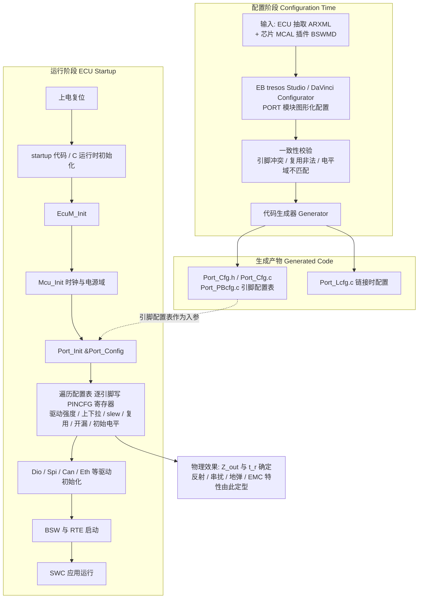

这条路径上有两个 SI 相关的关键时刻：

1. **复位到 `Port_Init()` 之间的窗口**。在这段时间里，所有引脚都处于芯片复位默认状态——通常是"输入、无上下拉、浮空"。浮空的控制引脚可能被邻线串扰或外部干扰拉到不确定电平，导致外部器件（继电器驱动、功率 MOS 栅极、CAN 收发器 STB）出现非预期动作。因此**外部关键控制脚必须有板级下拉/上拉电阻，不能只依赖片内配置**——这是一条 SI/安全交叉的硬性设计规则。
2. **`Port_Init()` 写寄存器的瞬间**。如果几十个引脚在同一个循环里被依次配成输出并驱动初始电平，会形成一次集中的 SSO 事件，产生明显的电源塌陷与地弹。质量好的 MCAL 实现会先写电气属性再统一使能输出；如果发现上电瞬间有异常复位或欠压检测触发，值得检查这一点。

### 12.2 PORT 模块的标准配置容器与参数

AUTOSAR 规范（SWS_Port）定义的容器结构如下，各芯片厂商会在 `PortPinVendorSpecific` 之类的扩展容器里加入驱动强度、slew rate 等硬件特有项：

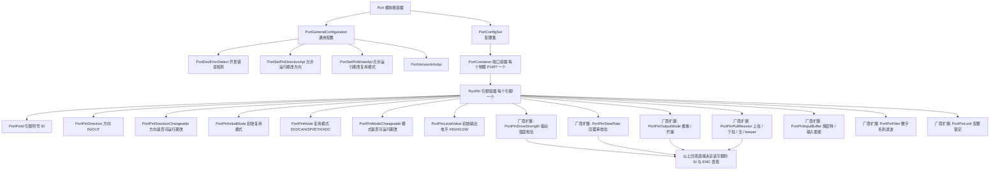

### 12.3 PORT 配置项与信号完整性关联表

这是本节最实用的一张表。笔者建议把它直接贴进项目的《引脚配置评审规范》，评审时逐项对照。

| PORT 配置项 | 对应寄存器位域 | 典型取值 | 对信号完整性的直接影响 | 配置不当的典型故障现象 | 评审要点 |
|---|---|---|---|---|---|
| PortPinDirection | OE | IN / OUT | 决定引脚是否驱动传输线；输入脚为高阻，末端相当于开路，全反射 | 误配为 IN 导致总线无人驱动、浮空乱跳 | 与原理图方向逐一比对 |
| PortPinOutputMode | OD | PUSH_PULL / OPEN_DRAIN | 推挽为强驱动双向；开漏上升沿由外部 RC 决定 | I²C 误配推挽 → 总线争用、大电流、器件损伤 | 所有线与总线必须开漏 |
| PortPinPullResistor | PUPD | PULL_UP / PULL_DOWN / NONE / KEEPER | 防浮空；开漏上拉时决定 RC 上升时间；高速线上加上下拉会改变直流点与局部阻抗 | 高速时钟脚误加上拉 → 阻抗不连续、占空比失真 | 高速线一律 NONE；未用脚必须有上/下拉 |
| PortPinDriveStrength | DRVSTR[1:0] | LOW / MEDIUM / HIGH / VERY_HIGH | 决定 Z_out 与 t_r；档位越高源端反射系数绝对值越大、地弹越大、EMI 越高 | 全部拉满 → EMC 辐射超标、过冲超绝对最大额定、SSO 地弹误触发 | 按"够用即可"选档，组内保持一致 |
| PortPinSlewRate | SLEW[1:0] | SLOW / MEDIUM / FAST / FASTEST | 决定 dV/dt 与 dI/dt；直接决定 f_knee=1/(π·t_r)，是 EMC 最有效的软件旋钮 | 低速控制脚配成最快沿 → 无谓地把高频谐波推高十几 dB | 非高速信号一律 SLOW |
| PortPinMode | AF[3:0] | DIO / CAN / SPI / ETH / ADC | 决定引脚归属；影响哪些引脚会同时翻转（SSO 分布） | 复用错误 → 外设无输出；同组高速信号分散到不同电源域 → 回流路径变差 | 核对 IOMUX 表，注意同组信号集中在同一电源域 |
| PortPinLevelValue | ODLVL | HIGH / LOW | 决定 `Port_Init()` 后到应用接管之间的电平 | CAN_TX 初始为低 → 上电瞬间把总线拉成显性，全网通信中断 | 所有总线类输出的初始电平必须是"非活动"态 |
| PortPinInputBuffer | IE / ST | 使能 / 施密特 | 施密特迟滞抵抗振铃与串扰引起的多次翻转；纯输出脚关 IE 可省电抗噪 | 慢沿输入不开施密特 → 单次边沿被识别为多次跳变 | RC 边沿、长线输入必开施密特 |
| PortPinFilter | FILT | 使能 / 关闭 | 滤除窄毛刺，代价是增加输入延迟 | 高速数据线误开滤波 → 有效数据被滤掉 | 仅用于中断/按键/复位，高速线禁用 |
| PortPinDirectionChangeable | — | TRUE / FALSE | 运行期改方向会短暂经历高阻态，总线可能被拉到不确定电平 | 双向总线切换时产生毛刺被误采样 | 非必要设为 FALSE |
| PortPinModeChangeable | — | TRUE / FALSE | 运行期改复用同样有中间态风险 | 切换瞬间引脚短暂由 GPIO 默认值驱动 | 非必要设为 FALSE |
| PortPinLock | LOCK | TRUE / FALSE | 锁定后运行期不可改，防止误写破坏已验证的 SI 配置 | 未锁定的安全相关引脚被误改档位 | ASIL 相关引脚建议锁定 |

### 12.4 EB tresos / DaVinci 中的 PORT 配置清单

在 EB tresos Studio 中，PORT 配置的实际操作路径与检查清单如下（DaVinci Configurator 的层级名称略有差异，但项目一一对应）：

**配置步骤：**

1. 在工程树中选择 `Port` 模块 → `PortConfigSet` → `PortContainer`。
2. 为每个物理端口（PORTA/PORTB/…）建立一个 `PortContainer`，命名建议与原理图页对应，便于评审追溯。
3. 在每个容器下为用到的引脚建立 `PortPin` 实例，`PortPinId` 使用 MCAL 提供的符号常量（如 `PortConf_PortPin_ETH_TXD0`），**严禁写裸数字**——否则换封装时无法追踪。
4. 逐项填写方向、模式、初始电平、上下拉，再到厂商扩展页填写驱动强度、slew rate、输入缓冲、滤波、锁定。
5. 运行 `Validate`，重点关注三类校验错误：引脚重复分配（同一 pin 被两个容器引用）、复用模式非法（该 pin 不支持所选外设）、电平域冲突（同一电源域内配置了不同 IOVSEL）。
6. `Generate` 生成 `Port_Cfg.c` / `Port_PBcfg.c`，并纳入版本管理。
7. 编译链接后，在目标板上用调试器读回 `PINCFG` 寄存器实际值，与配置表逐位对照——**这一步是很多团队会跳过、但笔者强烈建议保留的验证环节**，它能在几分钟内发现"工具配了但生成器没落实"的插件 bug。

**评审清单（SI 视角）：**

```text
【MCAL PORT 配置 SI 评审清单】
 1. 所有未使用引脚是否已配置为输入 + 明确上/下拉 + 关闭输入缓冲？
 2. 所有总线类输出（CAN_TX / SPI_NSS / 使能脚）的初始电平是否为"非活动"态？
 3. 是否存在把驱动强度统一配成最高档的"偷懒配置"？逐脚复核了吗？
 4. 非高速控制脚的 slew rate 是否统一配成最慢档？
 5. 同组并行信号（RMII TX 组、并行总线、DDR 组）的驱动强度与 slew rate 是否完全一致？
 6. 高速时钟/差分脚是否已确认关闭片内上下拉（PULL_NONE）？
 7. 所有开漏总线（I²C、SMBus、单线中断汇总）是否配成 OPEN_DRAIN？
 8. 板上已放源端串阻的网络，IO 驱动档位是否与硬件设计文档中的假定值一致？
 9. 慢边沿输入（I²C、光耦输出、按键、长线输入）是否开启施密特触发？
10. 高速数据线是否确认关闭了数字毛刺滤波？
11. 中断脚 / 复位脚是否开启了毛刺滤波与施密特？
12. 5V-tolerant 引脚的配置是否避免了在未上电状态被外部驱动的路径？
13. ASIL 相关引脚是否设置了 PortPinLock，且 DirectionChangeable / ModeChangeable 为 FALSE？
14. Port_Init() 之前的复位窗口内，关键外部器件是否由板级电阻保证了安全默认态？
15. 生成的 Port_Cfg.c 中的寄存器值，是否已在目标板上读回比对过？
```

### 12.5 高速通信引脚（CAN / Ethernet）的 SI 注意事项

**CAN / CAN-FD 引脚：**

- **CAN_TX 初始电平必须为高（隐性）**。这是最经典也最致命的一条：如果配成低电平，`Port_Init()` 之后到 CAN 驱动初始化之前的这段时间里，本节点会把整条总线拉成显性，整车 CAN 网络全部瘫痪。量产阶段这类问题往往表现为"某个 ECU 一上电全车就通信中断"。
- **CAN_TX 的驱动强度与 slew rate 应取低档、慢沿**。MCU 到收发器的走线通常只有十几毫米，收发器输入是高阻 CMOS，几 pF 负载；用最快沿驱动没有任何收益，只会增加辐射。CAN-FD 数据段速率可达 5 Mbps，位时间 200 ns，即便如此 20~30 ns 的上升时间也绰绰有余。
- **CAN_RX 必开施密特**。收发器输出经过一段走线后边沿会变缓，且总线侧的共模噪声可能耦合过来。
- **CAN_STB / CAN_EN 待机控制脚需配合板级电阻**，确保复位窗口内收发器处于已知模式；同时用最低驱动、最慢沿。
- **总线侧的 SI 由硬件负责**：两端 120Ω（推荐分裂端接 + 4.7 nF 共模电容）、stub 尽量短（经典规则：分支 stub < 30 cm @ 500 kbps，CAN-FD 下要求更严）、双绞线保证对称、共模扼流圈抑制共模辐射。

**以太网（RMII / RGMII）引脚：**

- **组内一致性是第一原则**。RMII 的 TXD0/TXD1/TX_EN 三根线、RGMII 的四根 TXD 加 TX_CTL，必须使用**完全相同的驱动强度与 slew rate 配置**。任何差异都会转化为组内 skew，直接压缩接收端的采样窗口。MCAL 配置里这几个 `PortPin` 的扩展参数应逐项核对一致。
- **REF_CLK / TX_CLK 严禁加片内上下拉**。时钟线是最敏感的受控阻抗网络，任何并联电阻都会改变直流工作点并造成局部阻抗不连续。同时时钟脚**不要开施密特**——迟滞会让上升沿与下降沿的有效阈值不同，直接引入占空比失真，而以太网对时钟占空比有明确要求（典型 35%~65%）。
- **RGMII 需要关注 TX/RX 延时策略**。2 ns 的时钟-数据延时可以由 PHY 内部（internal delay）提供，也可以由 PCB 走线长度差提供，两者只能选其一。MCAL 侧配置的是引脚模式，延时策略在 PHY 寄存器里通过 MDIO 配置——这两处必须一致，否则会出现"链路能建立但丢包率极高"的现象。
- **MDIO 是开漏总线**，需配 OPEN_DRAIN + 外部上拉（典型 1.5k~4.7k），并开施密特。
- **PHY 复位脚**要保证足够的复位保持时间与释放后的稳定延时；用低驱动 + 慢沿，并配下拉保证上电期间 PHY 处于复位态。
- **板级要点**：RMII/RGMII 走线走带状线或有完整参考平面的微带线，差分对（若为 100BASE-T1 等车载单对以太网）严格 100Ω 差分阻抗、等长控制在 5 mil 内，变压器/共模扼流圈与 RJ45 之间的走线要短且对称，Bob-Smith 端接网络的接地要与机壳地正确连接。

### 12.6 MCAL 配置到硬件寄存器的映射示例

为了让"配置项 → 寄存器"这条链路完全可见，下面给出生成代码的典型形态（简化示意，实际生成器输出会带更多防护宏）：

```c
/* ============================================================
 * 代码块 8：MCAL PORT 生成代码示意（Port_PBcfg.c 片段）
 * 说明：配置工具把每个 PortPin 的选项打包成一个配置表项，
 *       Port_Init() 遍历该表逐引脚写入 PINCFG 寄存器。
 * ============================================================ */

/* 由生成器根据 tresos 配置产生的引脚配置表项类型 */
typedef struct {
    uint8  PortIdx;          /* 端口索引 0=PORTA 1=PORTB 2=PORTC */
    uint8  PinIdx;           /* 引脚号 0..31 */
    uint32 PinCfgValue;      /* 直接映射到 PINCFG 寄存器的完整 32 位值 */
    uint8  InitialLevel;     /* 初始输出电平 */
    boolean DirectionChangeable;
    boolean ModeChangeable;
} Port_PinConfigType;

/* 位域宏（与硬件手册一致，由生成器从 BSWMD 中导出） */
#define PORT_DRV(x)    ((uint32)(x) << 0)
#define PORT_PUPD(x)   ((uint32)(x) << 2)
#define PORT_SLEW(x)   ((uint32)(x) << 4)
#define PORT_OD(x)     ((uint32)(x) << 6)
#define PORT_IE(x)     ((uint32)(x) << 7)
#define PORT_ST(x)     ((uint32)(x) << 8)
#define PORT_FILT(x)   ((uint32)(x) << 9)
#define PORT_OE(x)     ((uint32)(x) << 10)
#define PORT_AF(x)     ((uint32)(x) << 12)

/* ---- 生成的配置表 ---- */
const Port_PinConfigType Port_PinConfigTable[] =
{
    /* PortPin_CAN_TX：
       tresos 配置 -> Direction=OUT, Mode=CAN, OutputMode=PUSH_PULL,
                      PullResistor=PULL_UP, DriveStrength=LOW(4mA),
                      SlewRate=SLOW, LevelValue=HIGH(隐性), Lock=TRUE
       SI 意图：短走线 + 高阻负载，低驱动慢沿以降低整车辐射；
               初始高电平确保上电不把总线拉成显性。 */
    { 1u, 9u,
      PORT_DRV(1u) | PORT_PUPD(1u) | PORT_SLEW(0u) | PORT_OD(0u) |
      PORT_IE(0u)  | PORT_ST(0u)   | PORT_OE(1u)   | PORT_AF(4u),
      1u, FALSE, FALSE },

    /* PortPin_CAN_RX：Direction=IN, Mode=CAN, PULL_UP, 施密特开 */
    { 1u, 8u,
      PORT_DRV(0u) | PORT_PUPD(1u) | PORT_SLEW(0u) |
      PORT_IE(1u)  | PORT_ST(1u)   | PORT_AF(4u),
      0u, FALSE, FALSE },

    /* PortPin_I2C_SCL：OPEN_DRAIN + 施密特 + 毛刺滤波 + 中等驱动 */
    { 1u, 6u,
      PORT_DRV(1u) | PORT_PUPD(0u) | PORT_SLEW(1u) | PORT_OD(1u) |
      PORT_IE(1u)  | PORT_ST(1u)   | PORT_FILT(1u) | PORT_OE(1u) |
      PORT_AF(2u),
      1u, FALSE, FALSE },

    /* PortPin_ETH_TXD0 / TXD1 / TX_EN：三项必须完全一致（组内无 skew） */
    { 1u, 13u,
      PORT_DRV(2u) | PORT_PUPD(0u) | PORT_SLEW(2u) | PORT_OE(1u) | PORT_AF(6u),
      0u, FALSE, FALSE },
    { 1u, 14u,
      PORT_DRV(2u) | PORT_PUPD(0u) | PORT_SLEW(2u) | PORT_OE(1u) | PORT_AF(6u),
      0u, FALSE, FALSE },
    { 1u, 11u,
      PORT_DRV(2u) | PORT_PUPD(0u) | PORT_SLEW(2u) | PORT_OE(1u) | PORT_AF(6u),
      0u, FALSE, FALSE },
};

#define PORT_PIN_CONFIG_COUNT \
    (sizeof(Port_PinConfigTable) / sizeof(Port_PinConfigTable[0]))

/* ---- Port_Init 的核心循环（MCAL 内部实现示意） ---- */
void Port_Init(const Port_ConfigType *ConfigPtr)
{
    static port_regs_t * const PortBase[3] = { PORTA, PORTB, PORTC };

    (void)ConfigPtr;   /* 预编译变体下配置表为静态常量 */

    for (uint32 i = 0u; i < PORT_PIN_CONFIG_COUNT; ++i) {
        const Port_PinConfigType *p = &Port_PinConfigTable[i];
        port_regs_t *base = PortBase[p->PortIdx];

        /* 步骤 1：先写初始电平，确保后续使能输出时不产生毛刺 */
        base->BSRR = (p->InitialLevel != 0u)
                        ? (1u << p->PinIdx)
                        : (1u << (p->PinIdx + 16u));

        /* 步骤 2：写入完整的电气属性 + 复用 + 输出使能 */
        base->PINCFG[p->PinIdx] = p->PinCfgValue;
    }
}
```

从这段代码可以直观看到：**tresos 里的一个下拉框，最终就是 `PinCfgValue` 里的两个 bit；这两个 bit 决定了输出管的段数；输出管的段数决定了 Z_out 与 t_r；Z_out 与 t_r 决定了示波器上的过冲幅度与频谱仪上的辐射峰值。** 这条链路完整闭合，就是本文最想传达的工程观。

---

## 十三、测量与诊断手段

### 13.1 示波器：时域第一工具

示波器是看波形畸变（过冲、振铃、台阶、眼图）的首选。要点：

- 用**高带宽、低输入电容的有源探头**。10× 无源探头配长地线时，地线电感（约 1 nH/mm）与探头输入电容会构成 LC 谐振回路，把原本干净的快沿"人为地"振出振铃——这是最经典的测量假象。用探头的接地弹簧（spring tip）替代鳄鱼夹地线，能把这个假象基本消除。
- 示波器带宽应至少为信号带宽（0.35/t_r）的 3~5 倍，否则测出来的 t_r 是"示波器的 t_r"而非信号的。实测 t_r 与真实 t_r 的关系近似为 t_measured = √(t_signal² + t_scope²)。
- 采样率至少为带宽的 2.5~4 倍；存储深度足够长才能抓到偶发故障。
- 测差分信号必须用差分探头，不能用"两路单端相减"（共模抑制比不足，且两通道的偏斜会引入伪差模）。
- 探测点尽量选在**接收端**——SI 关心的是接收器看到了什么，而不是驱动器发出了什么。

### 13.2 TDR：时域反射计

TDR 向传输线注入快沿阶跃，测量反射回来的电压随时间的变化，从而**定位阻抗不连续的位置与大小**。反射的时延对应距离（距离 = v×Δt/2），反射幅度对应阻抗偏差。常用于排查断线、开路、连接器阻抗突变、stub、过孔残桩。现代采样示波器配合 TDR 模块即可完成。

TDR 的空间分辨率由入射阶跃的上升时间决定：Δx ≈ v×t_r/2。35 ps 的阶跃在 FR-4 上对应约 2.7 mm 的分辨率——比这更近的两个不连续点会被"糊"成一个。

```python
# ============================================================
# 代码块 9：TDR 数据分析 —— 定位不连续点并反推阻抗剖面
# ============================================================
import numpy as np

C0 = 3.0e8              # 真空光速 m/s
ER_EFF = 3.8            # 有效介电常数（微带线典型值）
V_PROP = C0 / np.sqrt(ER_EFF)      # 传播速度 m/s
Z_SOURCE = 50.0         # TDR 系统阻抗


def distance_from_delay(delta_t_s):
    """由入射到反射的时间差反推不连续点距离（往返取一半）。"""
    return V_PROP * delta_t_s / 2.0          # 单位 m


def impedance_from_reflection(v_incident, v_reflected, z0=Z_SOURCE):
    """由反射电压反推该点阻抗。
    Gamma = V_reflected / V_incident,  Z = Z0 * (1+G)/(1-G)
    """
    gamma = v_reflected / v_incident
    if abs(1.0 - gamma) < 1e-9:
        return float("inf")                  # 开路
    return z0 * (1.0 + gamma) / (1.0 - gamma)


def tdr_profile(t, v, v_incident, z0=Z_SOURCE):
    """把整条 TDR 波形转换成 (距离, 阻抗) 剖面，便于画阻抗-位置图。"""
    t0 = t[0]
    dist = np.array([distance_from_delay(ti - t0) for ti in t])
    # 归一化：TDR 显示的是入射+反射的叠加，减去入射台阶得到反射分量
    v_ref = v - v_incident
    gamma = v_ref / v_incident
    gamma = np.clip(gamma, -0.999, 0.999)
    z = z0 * (1.0 + gamma) / (1.0 - gamma)
    return dist * 1000.0, z                  # 距离转为 mm


def spatial_resolution_mm(t_rise_s):
    """TDR 空间分辨率：两个更近的不连续点无法分辨。"""
    return V_PROP * t_rise_s / 2.0 * 1000.0


def find_discontinuities(dist_mm, z_ohm, z_target=50.0, tol=0.10):
    """找出偏离目标阻抗超过容差的区段。"""
    hits = []
    in_region = False
    start = 0.0
    for d, z in zip(dist_mm, z_ohm):
        bad = abs(z - z_target) / z_target > tol
        if bad and not in_region:
            in_region, start = True, d
        elif (not bad) and in_region:
            in_region = False
            hits.append((start, d))
    return hits


if __name__ == "__main__":
    print(f"传播速度 v = {V_PROP/1e6:.1f} mm/ns")
    print(f"35ps 阶跃的空间分辨率 = {spatial_resolution_mm(35e-12):.2f} mm")

    # 例：反射在 2 ns 后到达
    d = distance_from_delay(2e-9)
    print(f"不连续点距探头约 {d*1000:.1f} mm")

    # 例：反射系数 -0.2（欠阻抗，如过宽走线或过孔焊盘电容）
    z = impedance_from_reflection(1.0, -0.2)
    print(f"该点阻抗约 {z:.1f} Ω（低于 50Ω 目标 -> 容性不连续）")

    # 例：反射系数 +0.15（过阻抗，如走线变窄或参考平面缺口）
    z = impedance_from_reflection(1.0, 0.15)
    print(f"该点阻抗约 {z:.1f} Ω（高于 50Ω 目标 -> 感性不连续）")
```

### 13.3 近场探头与频谱仪

**近场探头**（H 场/E 场探头）配合**频谱分析仪**用于定位辐射热点：把探头贴近 PCB 表面扫描，找到噪声最强的芯片、走线、连接器、缝隙，从而定点整改。近场（距离 ≪ λ）只耦合局部场，不反映远场辐射绝对值，但定位极为有效。

一个高效的诊断技巧：**在近场探头扫描的同时，用调试器在线修改 GPIO 的 slew rate 与驱动强度寄存器**，观察频谱峰值的实时变化。如果某个频点随 slew rate 变化明显，就锁定了辐射源引脚——这比逐个贴铜箔屏蔽快得多。

### 13.4 网络分析仪（VNA）与 S 参数

VNA 测量 S 参数（S11 回波损耗、S21 插入损耗、S31/S41 近端/远端串扰），是频域量化 SI 的权威手段，用于表征通道损耗、回波损耗、串扰隔离度，结合 TDR 互证（两者可通过傅里叶变换互相转换）。对 PDN，则用低频 VNA 或专用阻抗分析仪做**两端口分流法（2-port shunt-through）**测量，这是测量毫欧级 PDN 阻抗的标准方法。

### 13.5 测量工具选择流程

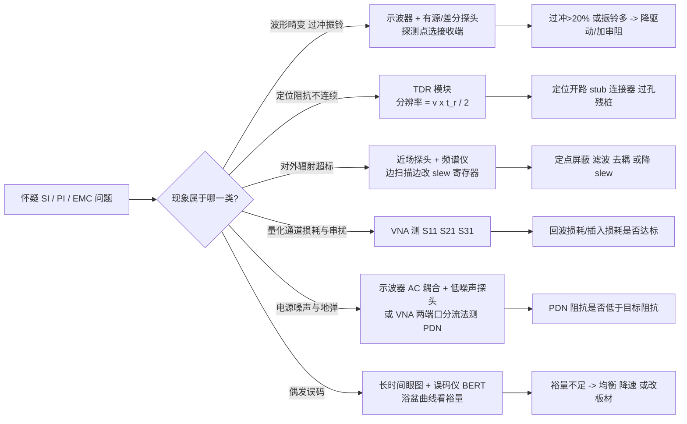

---

## 十四、板级设计 Checklist（落地清单）

下面是一份可直接用于评审的板级 SI/PI 设计检查清单，已把芯片 IO 配置项一并纳入：

```text
【SI/PI 板级 + 芯片 IO 设计 Checklist】
--- 识别与判据 ---
 1. 高速线识别: 列出所有 t_r 短/速率高的网络(CLOCK, DDR, USB, ETH, CAN-FD, SPI)
 2. 传输线判据: 对每条高速线计算 T_d 与 t_r/6, 标记必须控阻抗的网络
 3. 上升时间来源: 明确 t_r 是由 IO 驱动档位与 slew rate 决定, 记录假定档位

--- 阻抗与叠层 ---
 4. 阻抗目标: 叠层表锁定 Z0(单端 50Ω / 差分 90~100Ω / CAN 120Ω), 公差 ±10%
 5. 参考平面: 高速线全程下方有连续同电位参考平面, 无跨分割
 6. 换层: 换层处 1~2mm 内有伴随地过孔或跨接电容, 保证返回路径连续
 7. 阻抗测试条: 要求 PCB 厂随板提供 coupon 并出具阻抗报告
 8. 过孔残桩: >5Gbps 链路做背钻, 或采用盲埋孔

--- 端接 ---
 9. 端接方案: 按拓扑加并联/串联/AC/戴维南/差分端接, 电阻精度 ±1%
10. 串阻位置: 源端串阻紧贴驱动器引脚(<5mm), 否则串阻前的那段线仍会反射
11. 串阻取值: R_s = Z0 - Z_out, Z_out 取自实际配置的驱动档位(而非最大档)
12. CAN/RS-485: 两端 120Ω, 优先分裂端接(2x60Ω + 4.7nF 到地)
13. stub 控制: 末端 stub 长度 < (t_r / 单位时延) / 10

--- 串扰 ---
14. 3W 间距: 关键线满足中心距 ≥ 3 倍线宽; 时钟/复位取 5W
15. 保护线: 加保护线时每 5~10mm 打一个接地过孔, 否则成为天线
16. 层间: 相邻信号层正交走线; 高速敏感线优先走带状线
17. 并行长度: 限制平行走线长度, 优先从布局上避免长距离并行

--- 等长与差分 ---
18. 等长: 差分对内 ΔL < 5mil; 数据组等长按时序预算换算
19. 补偿位置: 蛇形补偿尽量靠近偏差产生处, 蛇形间距 ≥ 3~4 倍线宽
20. 差分对称: 两根线同层同宽、过孔对称、避免单边绕行

--- 电源完整性 ---
21. 目标阻抗: 算出 Z_target = ΔV / ΔI, 分频段核对 PDN 阻抗
22. 去耦配比: 每个电源引脚至少 1 个 0.1μF, 另配 1μF / 10μF / 大容量
23. 反谐振: 容值梯度不宜过大(建议 1:10), 必要时增加同值并联数量
24. 安装电感: 电容用短宽走线, 电源与地各多过孔直接落平面, 优先 via-in-pad
25. 位置: 越高频的电容越靠近电源引脚, 大容量可稍远
26. 地弹: 限制同组 SSO 数量, 分散翻转时刻, 增加电源/地引脚对

--- 芯片 IO 配置(软件侧) ---
27. 驱动强度: 逐脚按"够用即可"选档, 严禁全局配成最大档
28. 组内一致: 同组并行信号(RMII TX / 并行总线)驱动与 slew 完全一致
29. slew rate: 非高速信号一律配最慢档, 直接压低 f_knee
30. 上下拉: 高速时钟/差分线一律 PULL_NONE; 未使用引脚必须明确上/下拉
31. 输入使能: 纯输出脚关闭 IE, 减少内部翻转噪声与浮空耗电
32. 施密特: 慢边沿输入(I2C/光耦/长线/按键)必开; 高速时钟不开
33. 毛刺滤波: 中断/复位/按键开启; 高速数据线禁用
34. 初始电平: 所有总线类输出(CAN_TX/NSS/使能脚)初始为"非活动"态
35. 复位窗口: Port_Init 之前的窗口内, 关键外部器件由板级电阻保证安全默认态
36. 配置锁定: ASIL 相关引脚设置 LOCK, Direction/Mode Changeable 设为 FALSE
37. 回读验证: 用调试器读回 PINCFG 实际值, 与配置表逐位对照

--- EMC ---
38. 滤波: IO/电源入口加磁珠/共模电感/X-Y 电容, 注意磁珠与电容的 LC 谐振
39. 屏蔽: 必要时加屏蔽罩, 缝隙与开孔最大尺寸 < λ/20, 接地点间距同样受限
40. 接地: 明确单点/多点/混合接地策略, 避免地环路, 慎用地平面分割
41. 时钟: 时钟源加串阻/屏蔽, 评估是否启用扩频时钟 SSC

--- 验证 ---
42. 测试点: 预留 TDR/示波器探头点与接地弹簧落点
43. 仿真: 投板前用 IBIS 跑时域仿真, 高速链路跑通道/统计眼图仿真
44. 档位扫描: 样机阶段对关键网络做驱动强度与 slew rate 档位扫描并记录波形
45. 归档: 把最终选定的 IO 档位写入硬件设计文档与 MCAL 配置说明, 形成"合同"
```

---

## 十五、进阶专题：抖动、通道损耗与仿真验证

### 15.1 抖动（Jitter）与眼图

**抖动**是信号跳变沿相对理想时间位置的偏差，本质是时序噪声。它分为两大类：

- **随机抖动（RJ, Random Jitter）**：由热噪声、散粒噪声等随机过程产生，服从高斯分布、理论上无界，只能用统计尾巴描述（如 1e-12 误码率对应的峰峰值 ≈ 14.07 × σ）。
- **确定性抖动（DJ, Deterministic Jitter）**：有界、可复现，包括占空比失真（DCD，常由上升/下降边沿速率不对称引起）、码型相关的码间串扰（ISI，源于通道损耗）、周期性抖动（PJ，来自开关电源纹波、时钟串扰、PLL 参考杂散）、有界不相关抖动（BUJ，如相邻通道串扰）。

总抖动 TJ ≈ DJ + k×RJ（k 由目标误码率 BER 决定，BER 越严 k 越大；BER=1e-12 时 k≈14.07）。在示波器上，把大量比特波形按 UI（单位间隔）叠加就得到**眼图**：眼图高度反映噪声/幅度裕量，眼图宽度反映抖动裕量。更进一步的**浴盆曲线（Bathtub Curve）**以采样位置为横轴、BER 为纵轴，刻画在最佳采样点之外误码率如何指数上升，是评估链路裕量的标准工具。

这里同样有芯片 IO 的贡献：**占空比失真（DCD）的一个常见来源，就是 IO 单元里 PMOS 与 NMOS 驱动能力不对称**。PMOS 的载流子迁移率低于 NMOS，同尺寸下上拉能力弱于下拉，所以 IO 设计中 PMOS 的沟道宽度通常做成 NMOS 的 2~3 倍来补偿。若某个档位下补偿不完美，上升沿就会慢于下降沿，输出占空比偏离 50%——对时钟信号而言这直接吃掉抖动预算。这也是"以太网 REF_CLK 脚不要开施密特"的另一层原因：迟滞会人为地在上下沿引入不同的有效阈值，进一步加剧 DCD。

### 15.2 通道损耗：趋肤效应、介质损耗与 ISI

信号沿 PCB 走线、过孔、连接器、线缆传输时会被衰减，称为**插入损耗（Insertion Loss, S21）**。损耗来自两方面：

- **导体损耗（趋肤效应）**：高频电流被挤到导体表面，趋肤深度 δ = √(ρ/(πfμ))，有效截面积减小、电阻上升，损耗 ∝ √f。铜箔表面粗糙度（为增强附着力而做的齿化处理）会进一步加剧高频损耗，这是超低粗糙度铜箔（VLP/HVLP）在高速板上的价值所在。
- **介质损耗**：板材偶极子反复极化耗能，损耗 ∝ f × tanδ（损耗角正切），是高速板材（Megtron 6/7、Rogers、Tachyon）强调低 tanδ 的原因。FR-4 的 tanδ 约 0.02，高速板材可低至 0.002 量级。

总插入损耗随频率近似线性滚降（dB 单位下）。当 Nyquist 频率（= 数据率/2）处的损耗过大，高频分量被削掉，方波边沿变圆、相邻比特相互拖尾，产生**码间串扰（ISI）**，直接表现为眼图闭合。为补偿：

- 发射端做**预加重/去加重（Pre/De-emphasis）**——抬升跳变沿、压低连续相同电平的能量，人为预补偿高频损失；
- 接收端用 **CTLE（连续时间线性均衡）**做高频提升，用 **DFE（判决反馈均衡）**消除后续比特的拖尾；
- 极高速率（56G/112G PAM4）还会引入 FFE 与前向纠错。

PCIe/USB/SATA/以太网 SerDes 等串行链路普遍依赖这类均衡才能在几 GHz 以上的通道上工作。

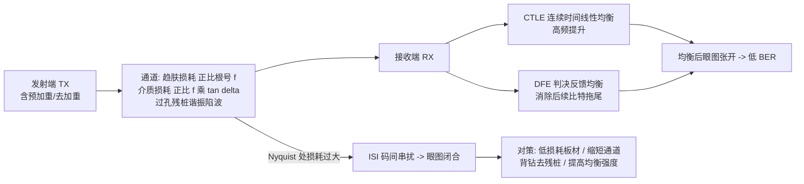

### 15.3 IBIS 与通道仿真

要在投板前预测 SI，常用两类模型：

- **IBIS（I/O Buffer Information Specification）**是芯片厂商提供的、基于 V/I 曲线的行为级缓冲模型，不泄露电路细节。一个 IBIS 模型包含：`[Pullup]`/`[Pulldown]` 的 V/I 表（描述输出管的驱动特性，正是"驱动强度"的量化体现）、`[GND Clamp]`/`[POWER Clamp]` 的 V/I 表（描述 ESD 二极管的钳位特性）、`[Ramp]` 与 `[Rising Waveform]`/`[Falling Waveform]`（描述上升/下降斜率，即 slew rate）、`[Package]` 的封装寄生（R_pkg、L_pkg、C_pkg）、`C_comp`（裸片电容）。

  **关键实践**：一个支持多档驱动强度与多档 slew rate 的 IO，其 IBIS 文件里会为每个组合提供一个独立的 `[Model]`（例如 `IO_8mA_FAST`、`IO_4mA_SLOW`）。做仿真时**必须选用与软件实际配置一致的那个 model**，否则仿真结果毫无意义。笔者见过不止一次"仿真过了但实测振铃"的案例，根因就是仿真用了 4 mA 模型而代码里配的是 12 mA。

- **IBIS-AMI / SPICE** 则进一步支持带均衡的串行链路统计仿真：AMI 模型以 DLL 形式描述 TX/RX 的均衡算法，配合通道的 S 参数，可在几分钟内跑出 1e-12 BER 级别的统计眼图与浴盆曲线，这是靠时域逐比特仿真无法企及的。

下面给出一段通道损耗预算评估的 C 代码：

```c
/* ============================================================
 * 代码块 10：通道损耗预算评估与板材/均衡决策
 * ============================================================ */
#include <math.h>

typedef enum {
    CH_PASS = 0,              /* 裕量充足 */
    CH_NEED_EQ,               /* 需开启预加重/均衡 */
    CH_NEED_BETTER_MATERIAL,  /* 需更换低损耗板材 */
    CH_NEED_REDESIGN          /* 需缩短通道或改拓扑 */
} channel_verdict_t;

/**
 * @brief 评估高速串行通道的损耗预算。
 * @param data_rate_gbps  数据率 (Gbps)
 * @param len_inch        通道总长（含连接器等效长度，inch）
 * @param tan_delta       板材损耗角正切（FR-4 约 0.02，高速材约 0.005）
 * @param n_vias          通道上的过孔数量
 * @param has_backdrill   是否做了背钻去残桩
 * @param eq_budget_db    收发端均衡可补偿的总量 (dB)
 */
channel_verdict_t channel_budget_check(float data_rate_gbps, float len_inch,
                                       float tan_delta, int n_vias,
                                       int has_backdrill, float eq_budget_db)
{
    /* Nyquist 频率 = 数据率 / 2 */
    const float f_nyq_ghz = data_rate_gbps / 2.0f;

    /* 介质损耗经验式：约 2.3 * f(GHz) * tanδ  dB/inch（微带线量级） */
    const float loss_diel = 2.3f * f_nyq_ghz * tan_delta * len_inch;

    /* 导体损耗经验式：约 0.35 * sqrt(f(GHz))  dB/inch（含表面粗糙度余量） */
    const float loss_cond = 0.35f * sqrtf(f_nyq_ghz) * len_inch;

    /* 过孔损耗：无背钻时残桩谐振可造成显著额外损耗 */
    const float loss_via = (float)n_vias * (has_backdrill ? 0.15f : 0.60f);

    const float total = loss_diel + loss_cond + loss_via;

    /* 经验阈值：Nyquist 处 12dB 以内可无均衡工作 */
    const float limit_no_eq = 12.0f;

    if (total <= limit_no_eq) {
        return CH_PASS;
    }
    if (total <= (limit_no_eq + eq_budget_db)) {
        return CH_NEED_EQ;                /* 均衡可以补回来 */
    }
    /* 判断主要损耗来源，给出针对性建议 */
    if (loss_diel > loss_cond) {
        return CH_NEED_BETTER_MATERIAL;   /* 介质损耗主导 -> 换低 tanδ 板材 */
    }
    return CH_NEED_REDESIGN;              /* 导体/过孔主导 -> 缩短通道、减少过孔 */
}
```

仿真不能替代实测，但能提前暴露明显问题（阻抗断点、stub 谐振、等长超差、驱动档位选错），把整改从"样机阶段"前移到"设计阶段"，成本相差一个数量级。

### 15.4 实战总线速览（DDR / USB / PCIe / 车载以太网）

不同总线对 SI 的关注点各有侧重：

- **DDR（SDRAM）**：源同步接口。命令/地址为单端、常需 VTT 端接（上拉到 VDDQ/2）并按 Fly-by 拓扑走线；数据组 DQ 与选通 DQS 带 **ODT（On-Die Termination，片上端接）**，由控制器根据读写方向动态开启，省去板级电阻。片上端接本质上就是 IO 单元里一组可编程的并联电阻——这是"芯片 IO 单元可编程性"在高速领域的极致体现。DDR 还需要**写均衡（Write Leveling）**与**读眼训练**来补偿 Fly-by 拓扑造成的时序偏移。速率越高（DDR4 3200 MT/s、DDR5 4800 MT/s 起），对分支 stub、过孔、参考平面完整性越敏感。
- **USB**：差分对阻抗 90Ω。全速（12 Mbps）到 SuperSpeed（5/10/20 Gbps）跨度巨大。ESD 保护器件必须是**超低电容型（< 0.5 pF）**，否则其结电容会直接拉低局部阻抗形成不连续点。USB 2.0 的 D+/D− 走线需严格等长，共模扼流圈抑制共模辐射。
- **PCIe**：差分 100Ω，天然带预加重与接收端均衡，靠链路训练（Link Training and Status State Machine, LTSSM）自适应协商均衡参数。过孔残桩与连接器是主要不连续点，Gen4（16 GT/s）以上背钻几乎是必选项。AC 耦合电容（典型 100 nF 0402）本身也是一个不连续点，需在仿真中建模。
- **车载以太网（100BASE-T1 / 1000BASE-T1）**：单对差分线、100Ω 差分阻抗、全双工回波抵消。对共模噪声极其敏感，共模扼流圈与端接网络的设计是成败关键；线束长度可达 15 m，连接器一致性要求高。MCU 侧的 RMII/RGMII 到 PHY 这一段，则完全适用本文块 C 中讨论的组内一致性原则。

掌握这些总线的 SI 共性（控阻抗、短 stub、等长、良好返回路径、按需均衡、IO 档位一致），就能把前面抽象的原理落到具体设计上。

---

## 十六、板级 SI 故障定位七步法

理论之外，真正的功力体现在"板子出问题了怎么查"。笔者在长期调试中归纳出一套七步法，供一线工程师按图索骥。相比传统版本，这里在第二步之前插入了一个"零成本步骤"——先查芯片 IO 配置。

**第零步：先查 IO 配置。** 在动烙铁之前，用调试器读回问题引脚的 `PINCFG` 寄存器实际值，核对驱动强度、slew rate、上下拉、开漏、施密特是否与设计意图一致。这一步耗时几分钟、零成本，却能解决相当比例的"疑似硬件问题"。特别要警惕两类情况：一是初始化代码里遗留的"全局最大驱动"；二是某个库函数或第三方中间件在背后偷偷改了引脚配置。

**第一步：复现与隔离。** 先弄清故障是必现还是偶发、软复位能否恢复、是否与温度/电压/负载相关。把"通信错""死机""误触发"等表象先归类为 SI、PI 还是纯软件；用最小系统（只留怀疑的总线、断开其余负载）隔离变量。一个高效技巧：写一段测试固件，让问题引脚以固定图样（如 1010 或伪随机序列）连续翻转，把偶发问题变成可持续观测的稳定现象。

**第二步：查端接与波形。** 用示波器（差分对用差分探头，单端用有源探头 + 接地弹簧）观察**接收端**波形：有无过冲、振铃、台阶、回沟。振铃 + 过冲几乎必是阻抗不连续/未端接/stub 过长；台阶常见于多负载分支反射；单调但缓慢的上升沿则指向驱动能力不足或负载电容过大。同步确认终端电阻的阻值、精度、位置与回流地是否完整。

**第三步：做档位扫描。** 这是块 A/B 带来的新武器：用调试器在线把问题引脚的驱动强度从最低档扫到最高档、slew rate 从最慢扫到最快，每档记录一次波形（用代码块 6 的脚本自动提取过冲、振铃次数、t_r）。扫描结果会立刻告诉你三件事：当前档位是否合适、最佳档位在哪、以及问题对源端阻抗是否敏感（若敏感则确认是反射问题，若不敏感则要往串扰/电源方向查）。

**第四步：查时序。** 对同步接口（SPI/I²C/并口/RMII），用逻辑分析仪或示波器同时抓时钟与数据，逐边沿核对 CPOL/CPHA、CS 建立/保持、数据建立/保持窗。任何"时好时坏"的错位，八成是采样边沿落在跳变区（亚稳态）或时钟太快。注意：如果第三步把 slew rate 调慢解决了振铃，一定要在这一步复核时序裕量是否还够。

**第五步：查阻抗不连续。** 用 TDR 注入快沿，从反射波形定位开路、短路、连接器突变、过孔残桩、跨分割处，量化偏离目标 Z0 多少、距离多远。这一步对"看不见的"内部不连续（板内过孔、BGA 扇出、连接器压接）尤其有效。

**第六步：查串扰与电源。** 串扰：反转攻击线极性或让攻击线静默，观察受害线噪声是否同步变化；若变化即坐实串扰，整改方向是拉大间距、加保护线、相邻层正交、缩短并行，以及**把攻击线的驱动强度降档**。电源：用示波器 AC 耦合看 PDN 噪声是否超预算，看多 IO 同时翻转时的地/电源引脚瞬态浮动；确认去耦电容是否按频带配齐、安装电感是否够低、返回平面是否连续。

**第七步：查 EMC 与整改闭环。** 若涉及对外辐射/抗扰，用近场探头 + 频谱仪定位热点，依次尝试：降 slew rate（零成本，先试）、滤波（磁珠/共模电感/X-Y 电容）、屏蔽（罩体连续接地、缝隙 < λ/20）、接地策略调整。每改一处复测，形成"假设—整改—验证"闭环，并把每次改动与结果记录成表，避免"改了一堆最后不知道哪一项起了作用"。

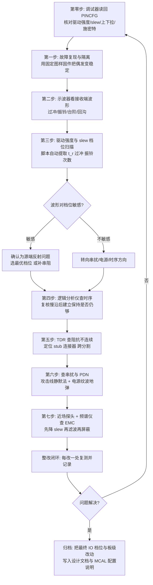

---

## 十七、面试题精选（含要点，30 道）

以下是信号完整性/电源完整性/芯片 IO/MCAL 方向的常见面试题与要点，适合校招与社招技术深挖。

### 17.1 传输线与反射

1. **什么是信号完整性？它的核心目标是什么？**
   要点：研究数字信号在真实互连（传输线）上传输时如何保持波形完整，核心是让接收端在采样窗内采到确定、无歧义的 0/1，避免反射、串扰、振铃、时序偏移导致误判。

2. **什么时候必须把一个 PCB 走线当传输线看？**
   要点：当走线单向传播时延 T_d > 信号上升时间 t_r 的约 1/6（工程口径有 1/2、1/10 之分）。由上升时间而非数据速率决定，FR-4 上约 0.167 ns/mm。

3. **信号的带宽和上升时间什么关系？为什么看带宽不看数据率？**
   要点：f_BW ≈ 0.35/t_r。上升沿携带的高频分量决定反射/辐射严重程度，一个慢数据率但快上升沿的信号依然"高速"。

4. **特性阻抗 Z0 由什么决定？它和线长有关吗？**
   要点：Z0 = √(L0/C0)，由横截面几何（线宽、介质厚、铜厚）与介质 ε_r 决定，与线长无关。

5. **反射系数公式是什么？开路、短路、匹配时各是多少？**
   要点：Γ = (R_L − Z0)/(R_L + Z0)。开路 Γ=+1（末端电压翻倍），短路 Γ=−1，匹配 Γ=0。

6. **有哪些端接方式？各适用什么场景？**
   要点：负载并联（多负载、CAN/RS-485）、源端串联（点对点、零直流功耗）、AC（隔直、大摆幅怕功耗）、戴维南（需偏置、开漏）、差分/分裂（100~120Ω 跨接 + 共模电容）。

7. **源端串联端接为什么能消除反射、又不增加直流功耗？**
   要点：出发时线上半幅，末端开路全反射翻倍到满幅，反射波回源端遇到"串阻+输出阻抗=Z0"被吸收；稳态时线上是直流、串联电阻无持续电流。

8. **源端串阻的阻值怎么定？和软件有关系吗？**
   要点：R_s = Z0 − Z_out，而 Z_out 由 GPIO 驱动强度档位决定。硬件选定的串阻值隐含了对软件档位的假定，两者必须在设计文档里"合同化"锁定，否则会出现过阻尼或欠阻尼。

### 17.2 串扰与阻抗控制

9. **什么是 3W 规则？它抑制的是什么？**
   要点：相邻走线中心距 ≥ 3 倍线宽，降低容性/感性串扰；更紧用 2W，时钟等敏感线用 5W/10W。

10. **NEXT 与 FEXT 有何区别？为什么 FEXT 更难处理？**
    要点：NEXT 是近端（后向）串扰，超过饱和长度后不再增长；FEXT 是远端（前向）串扰，随耦合长度线性增长，且远端正是接收端，直接污染信号。

11. **为什么带状线的远端串扰近似为零？**
    要点：均匀介质中容性与感性远端串扰大小相等、方向相反而抵消；微带线因场部分在空气中、两种耦合速度不同，抵消不完全。

12. **加保护线一定能减小串扰吗？**
    要点：不一定。保护线必须两端接地且沿线每 5~10 mm 打接地过孔，否则会变成谐振天线，反而恶化辐射与串扰。

13. **微带线和带状线的区别与取舍？**
    要点：微带线在表层、辐射大、速度快、损耗小、易加工；带状线夹心、辐射小、对称好、FEXT 近似抵消，但损耗略大、速度慢。高速敏感线优先带状线。

14. **为什么高速线下方参考平面不能跨分割？**
    要点：返回电流被迫绕行，回路电感激增、阻抗突变、EMI 恶化、串扰增大。换层时需在附近加地过孔或跨接电容维持返回路径。

15. **什么是过孔残桩？为什么高速要背钻？**
    要点：过孔未使用的那一段构成 λ/4 谐振器，在 f = v/(4·L_stub) 处形成深度陷波，吃掉该频点能量。背钻去除残桩可显著改善插入损耗。

### 17.3 电源完整性与 EMC

16. **去耦电容为什么要多值并联？单一大电容不行吗？**
    要点：真实电容有 ESL/ESR，阻抗随频率呈 V 形，只覆盖一段频率；需大容量 + 中频陶瓷 + 高频小陶瓷协同覆盖全频段。

17. **什么是反谐振？怎么缓解？**
    要点：不同容值电容并联时，小电容容抗与大电容感抗在某频点并联谐振，PDN 阻抗出现尖峰。缓解：容值梯度不要过大、增加同值并联数量、利用 ESR 阻尼。

18. **PDN 目标阻抗怎么算？**
    要点：Z_target = ΔV_allowed / ΔI_max。如 1.2V 允许 ±3%（36 mV）、瞬态 3A，则约 12 mΩ，需多级协同。

19. **去耦电容的"安装电感"为什么比电容自身 ESL 更重要？**
    要点：0402 自身 ESL 约 0.5~1 nH，而细长走线 + 单过孔的安装电感可达 2~5 nH，总电感被安装方式主导，SRF 被拉低数倍。对策：短宽走线、多过孔、via-in-pad、最小回路面积。

20. **什么是地弹/电源弹？怎么缓解？**
    要点：多 IO 同时翻转（SSO）经封装引线电感产生 L·dI/dt，使芯片地/电源引脚瞬态浮动，导致输入阈值漂移、静默引脚出毛刺。缓解：降驱动强度、开慢 slew rate、错开翻转时刻、增加去耦与电源地引脚对。

21. **差模与共模噪声的区别？哪个是辐射主因？**
    要点：差模两线反向、回路面积小；共模两线同向、经寄生电容返回、回路面积大，是 EMI 辐射主因，常由不平衡把差模转换而来。

22. **EMC 中辐射与传导如何分别抑制？**
    要点：传导（150 kHz~30 MHz）靠滤波（共模电感、X/Y 电容、磁珠、π 网络）；辐射（>30 MHz）靠屏蔽、减小回路面积、端接、接地、降低 slew rate。

23. **为什么说 slew rate 是 EMC 最有效的软件旋钮？**
    要点：谐波包络的拐点频率 f_knee = 1/(π·t_r)。把 t_r 从 1 ns 放慢到 4 ns，拐点从约 318 MHz 降到约 80 MHz，高频段谐波幅度可下降十几 dB，且零 BOM 成本。

### 17.4 芯片 IO 单元与配置

24. **画一下 GPIO 的 IO 单元内部结构，说明各部分作用。**
    要点：pad → ESD 保护（上/下二极管 + GGNMOS + 电源钳位）→ 输出驱动级（PMOS/NMOS 推挽或仅 NMOS 开漏，分段并联实现多档驱动强度）→ 预驱动 + slew rate 控制 → 可编程上下拉/keeper → 输入缓冲（施密特）→ 毛刺滤波 → 电平移位 → IOMUX → 内核逻辑。

25. **驱动强度在物理上是什么？为什么档位越高 SI 越差？**
    要点：物理上是并联输出管的使能段数。段数多 → R_on 小 → Z_out 小 → t_r 短。SI 变差的原因有三：源端反射系数 |Γ_s| 增大导致多次往返振铃；dI/dt 增大导致地弹增大；f_knee 上升导致辐射增强。

26. **slew rate 控制电路有哪几种实现？**
    要点：预驱动限流（限制栅极充放电速度）、分段延时开启（输出管分批打开）、米勒反馈式自限速。

27. **推挽和开漏的区别？开漏的 SI 瓶颈在哪？**
    要点：推挽 PMOS+NMOS 双向强驱动；开漏仅 NMOS 拉低、靠外部上拉拉高。开漏的上升沿由 R_pu × C_bus 决定，t_r ≈ 0.85·R_pu·C_bus，这是速率上限的主要制约；且开漏支持线与和跨电平域，是 I²C 的基础。

28. **为什么片内上拉不能替代 I²C 的外部上拉？**
    要点：片内上拉典型 20~50 kΩ 且精度差（±50%），对 400 pF 总线电容其 RC 上升时间可达十几微秒，远超快速模式 300 ns 的规范；只能作为防浮空兜底。

29. **施密特触发解决什么问题？什么场合不能开？**
    要点：迟滞窗口（典型 VDDIO 的 10%~30%）使噪声与振铃不会造成多次误翻转，适合慢边沿输入（I²C、光耦、按键、长线）。不能开的场合：高速时钟脚——迟滞使上下沿有效阈值不同，引入占空比失真。

30. **ESD 保护结构对信号完整性有什么副作用？**
    要点：ESD 二极管的结电容构成引脚输入电容 C_pin 的主要部分（2~10 pF），在高速链路上形成容性不连续点、拉低局部阻抗产生反射。所以 USB/以太网端口的外置 ESD 器件必须选超低电容型（< 0.5 pF）。

31. **未使用的引脚该怎么配置？为什么？**
    要点：配置为输入 + 明确上拉或下拉 + 关闭输入缓冲。理由：浮空输入会使输入级 PMOS/NMOS 同时导通产生直通电流（耗电且发热）、易被串扰打成随机翻转（产生内部噪声）、长引线成为天线（恶化 EMI）。

32. **配置 GPIO 时寄存器写入顺序为什么重要？**
    要点：正确顺序是"电气属性与初始电平 → 复用功能 → 使能输出"。若先使能输出，引脚会以复位默认档位（往往最强驱动）驱动一次，产生陡沿毛刺，甚至造成总线争用。此外必须先开端口时钟，否则寄存器写入无效。

### 17.5 MCAL 与 AUTOSAR

33. **AUTOSAR PORT 模块负责什么？与 DIO 模块的分工是什么？**
    要点：PORT 负责引脚的静态配置——方向、复用模式、上下拉、驱动强度、slew rate、初始电平，在 `Port_Init()` 中一次性写入；DIO 只负责运行期的电平读写，不改变引脚配置。

34. **`Port_Init()` 在 ECU 启动流程中的位置？之前的窗口有什么风险？**
    要点：位于 `EcuM_Init` → `Mcu_Init` 之后、各外设驱动初始化之前。之前的窗口内所有引脚处于芯片复位默认（通常浮空输入），关键外部器件必须靠板级上下拉电阻保证安全默认态。

35. **CAN_TX 引脚的初始电平为什么必须配成高？**
    要点：CAN 隐性电平为高。若配成低，`Port_Init()` 之后到 CAN 驱动初始化之前，本节点会把整条总线拉成显性，导致全车 CAN 通信瘫痪。

36. **为什么 RMII 的 TXD0/TXD1/TX_EN 必须配置相同的驱动强度与 slew rate？**
    要点：不同档位对应不同的 t_r，会在组内引入边沿速率差异即 skew，直接压缩接收端的建立/保持窗口，恶化眼图。

37. **以太网 REF_CLK 脚为什么不能加片内上下拉、也不建议开施密特？**
    要点：上下拉会改变直流工作点并造成局部阻抗不连续；施密特的迟滞使上升沿与下降沿有效阈值不同，引入占空比失真，而以太网对时钟占空比有明确要求。

38. **MCAL 配置生成的代码怎么验证真的落到了硬件上？**
    要点：在目标板上用调试器读回 `PINCFG` 寄存器实际值，与配置表逐位比对。这能发现生成器插件 bug、配置未生效、被其他模块覆盖等问题。

39. **做 IBIS 仿真时最容易犯的错误是什么？**
    要点：选错 model。一个多档 IO 的 IBIS 文件里每个"驱动强度 + slew"组合是一个独立 `[Model]`，必须选用与软件实际配置一致的那个，否则仿真结论无效。

40. **如果一块已投板的样机出现振铃，你的排查与整改顺序是什么？**
    要点：先读回 `PINCFG` 核对配置 → 做驱动强度与 slew 档位扫描（零成本）→ 若敏感则确认为源端反射，选最优档位或补串阻 → 复核时序裕量 → 若不敏感则转向 TDR 查不连续、近场探头查串扰、示波器查 PDN。

---

## 十八、写在最后：SI/PI 是贯穿芯片、代码与板级的系统工程

信号完整性与电源完整性不是"投板前的几条规定"，而是贯穿需求、芯片选型、IO 配置、驱动代码、MCAL 配置、仿真、叠层、布局、端接、去耦、测量、整改的**系统工程**。在器件上升时间越来越快、电压裕量越来越小、集成度越来越高的今天，忽略 SI/PI 的板子往往在样机阶段才暴露出偶发通信错、温漂失效、EMC 超标等"玄学"问题，而这些问题一旦进入量产，定位与召回成本极高。

笔者最想留给读者的，是三条已经反复验证过的工作习惯：

**第一，把传输线思维变成肌肉记忆。** 看到一条走线先问四个问题："它的 Z0 是多少？驱动它的那个 IO 配在什么档位、上升时间多快？需不需要端接？返回路径通不通？"这四个问题里，第二个正是大多数纯硬件工程师会漏掉、而底层软件工程师最有条件回答的。

**第二，把 PDN 当成另一条必须控阻抗的"信号线"。** 它的负载是所有翻转的 IO 与内核，它的"特性阻抗"就是目标阻抗 Z_target，它的"反射"就是电压跌落与地弹。用同样严谨的态度对待它。

**第三，把芯片 IO 配置纳入 SI 设计流程，而不是当成"随便填的初始化代码"。** 具体做法是：硬件在设计文档中明确写出每个关键网络"假定的 IO 驱动档位与 slew rate"；软件在 MCAL/驱动配置中严格按此实现；样机阶段做一次档位扫描验证并回写文档；投板前的 IBIS 仿真使用与配置一致的 model。这条闭环一旦建立，"改一个寄存器位、EMC 就过了"这类看似玄学的事情，就变成了可预测、可设计、可复现的确定性工程结果。

配合仿真（IBIS 时域仿真、IBIS-AMI 统计眼图、PDN 阻抗仿真）与实测（示波器档位扫描、TDR、近场探头、VNA）的双闭环，才能把"薛定谔式"的故障，变成写在设计文档里的一行确定参数。

> 本文所引概念（传输线理论、特性阻抗、反射系数、各类端接、串扰与 3W 规则、去耦与 PDN 目标阻抗、地弹与 SSO、共模/差模与 EMC、TDR/VNA/近场探头测量、IO 单元结构与 ESD 保护、驱动强度与 slew rate 控制、施密特触发、开漏与线与、AUTOSAR PORT 模块配置项等）均为信号完整性/电源完整性与集成电路 IO 设计领域公开、成熟的技术原理。文中的寄存器位域定义、IO 档位与输出阻抗对应关系、代码示例均为便于说明而构造的通用示意模型，其字段划分与实现逻辑参照主流 MCU/SoC 的常见做法，不对应任何特定型号；所有参数示例仅用于说明量级。实际设计请以具体器件手册、IBIS 模型、板材规格、MCAL 插件文档与仿真/实测结果为准。