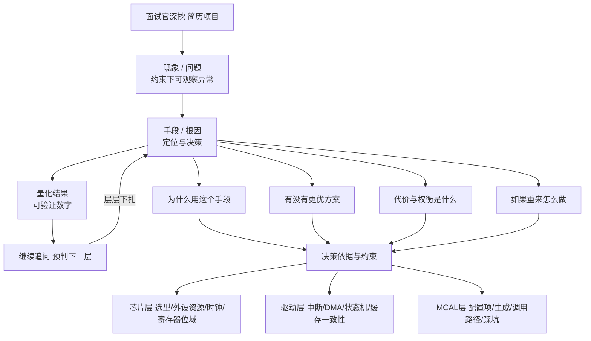
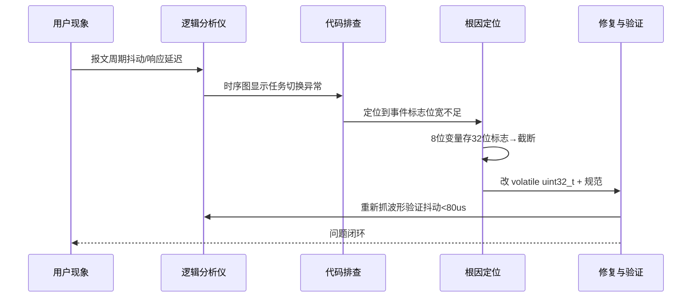
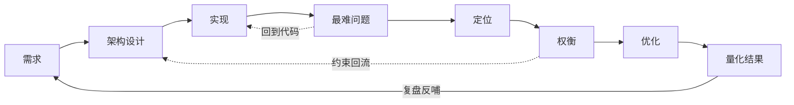
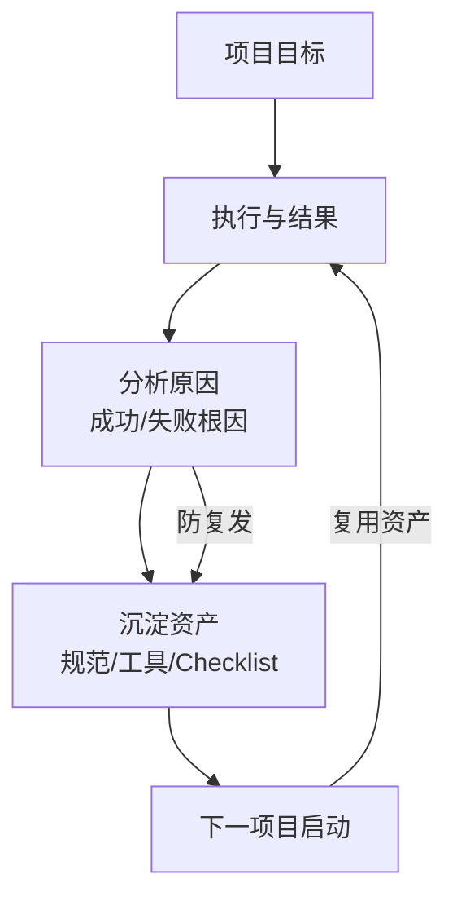
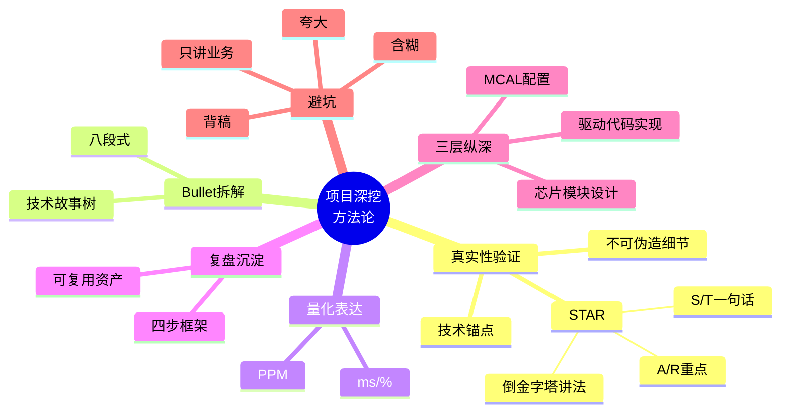
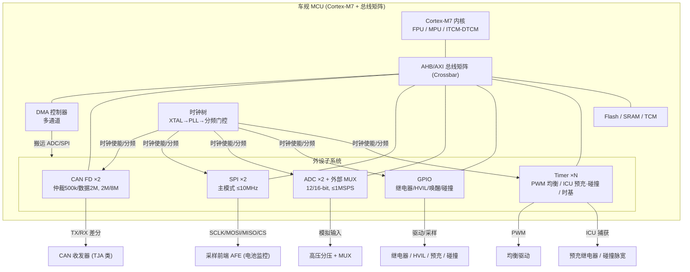
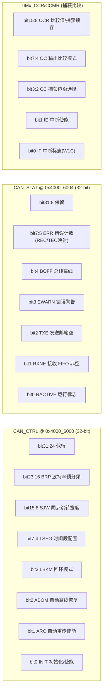
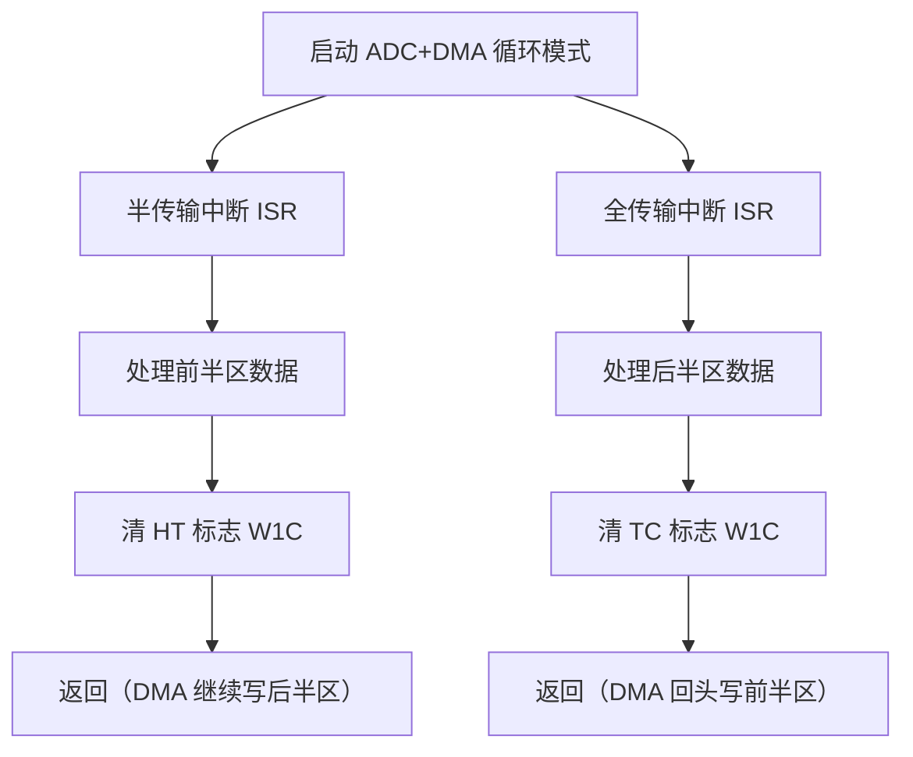
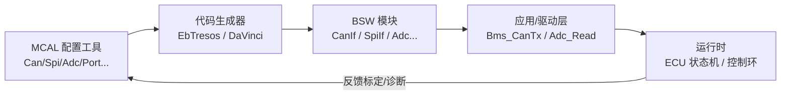
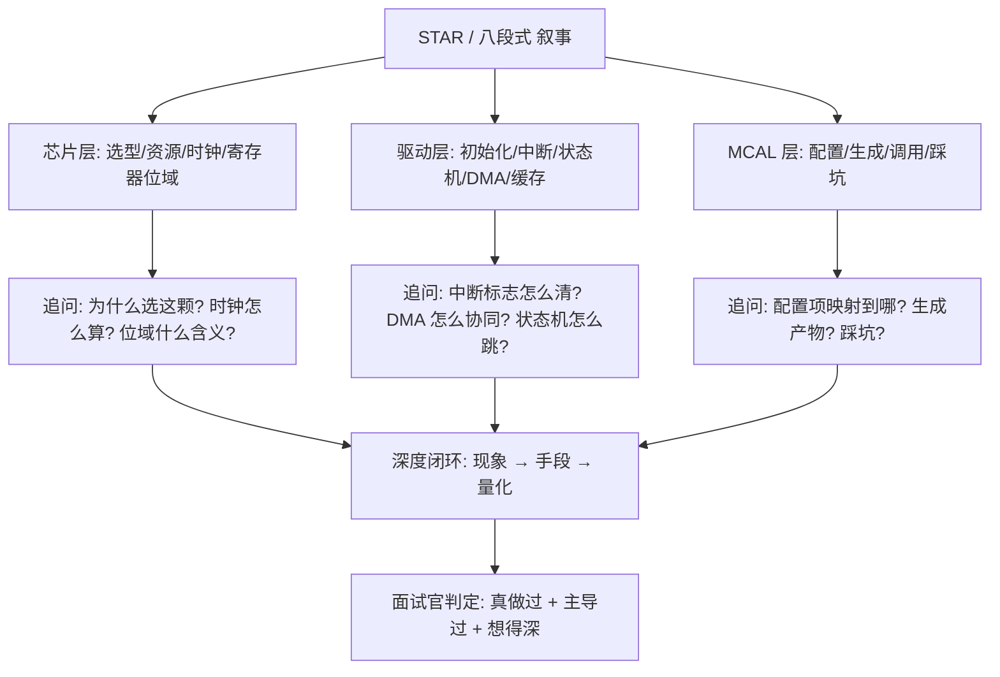

# 面试项目深挖方法论：用 STAR 把项目讲透到芯片 / 驱动 / MCAL 三层深度

> 前面十九篇把底层软件、BMS、功能安全、通信协议、车规认证、信号完整性等知识点逐个拆开讲。但真实面试里，面试官很少孤立地考定义——他们会把你简历上的项目当成"探针"，沿一个点往深里扎，看你是真做过还是背过。本文是笔者多年作为嵌入式工程师、又反复扮演面试官后的方法论沉淀：如何把一段项目经历，用 STAR 法组织成经得起层层追问的实战叙事；如何把简历上短短一行 bullet，拆成一条可深挖的技术链路；以及面试官最常问的十五道以上真题与答题要点。
>
> 更重要的是，本文在原有方法论之上，**新增三大实战示范章节**（芯片模块设计 / 驱动代码实现 / MCAL 配置说明），全部以同一个真实感的 BMS 主控 ECU 项目贯穿，示范"如何把一个项目从业务功能，一路讲到芯片外设子系统、寄存器位域、中断与 DMA 协同、以及 AUTOSAR MCAL 配置"——这正是资深嵌入式 / 底层软件候选人最该展示、却最常被讲虚的深度。
>
> 本文不堆砌术语，每一节都给出可直接套用的模板、清单与示例。读完你应当能够：把任意一个项目拆成"需求—架构—实现—最难问题—定位—权衡—优化—量化"八段式；面对"你做了什么权衡""如果重来会怎样"这类开放追问不慌；并用 %/ms/PPM 等硬指标替自己说话；更进一步，能随手画出项目所用 MCU 的外设子系统框图、讲清关键寄存器位域、给出驱动代码片段、说清 MCAL 配置项与项目功能的映射。

---

## 一、为什么面试官要"深挖"：验证真实性与深度

面试官不缺一份漂亮的简历，他缺的是"这份简历背后的人，到底是不是真的动过手"。深挖（Deep Dive）的本质，是用**不可伪造的细节**来区分两种人：

- **配置过的人**：知道"要开 FPU""要配 MPU"，但说不清开 FPU 后中断上下文要保存哪些浮点寄存器、MPU 分区若配错会导致哪类故障；
- **理解并解决过的人**：能讲出"我因为 DMA 搬运用了软浮点模拟导致 WCET 超标，于是开了 FPU，但发现中断服务程序里没保存 S16–S31 现场，导致任务切换后浮点累加结果随机错乱，最后用 `__attribute__((naked))` + 手动 `VSTM/VSTM` 解决"。

这两者的区别，靠"背概念"是扛不住的。面试官深挖的底层动机有四条：

### 1.1 验证真实性（防简历注水）

一段经历如果只有"负责 XXX 模块开发"这种笼统描述，几乎无法证伪。但只要追问"你那个 DMA 搬运，源地址和目的地址是怎么对齐的？缓存一致性怎么处理的？"，没真做过的人会在三层之内露馅。真实做过的人，细节是**自然涌现**的——因为他脑子里有当时的示波器波形、有那段改了又改的链接脚本。

### 1.2 验证深度（区分参与程度）

很多项目是团队协作，一个人可能只接触了冰山一角。面试官想知道：你是"在别人搭好的框架里填了一个函数"，还是"从架构选型、风险识别到落地验收全程主导"。"深挖"会逼问决策的来龙去脉——只有主导者才说得出"我当时为什么选方案 A 而不选方案 B，代价是什么"。

更进一步，资深面试官会从"你做过什么"往下扎到"你用的芯片/驱动/MCAL 是什么、怎么配的"。一个只配过 MCAL 图形界面的人，说不清 `CanControllerBaudrate` 与 `CanControllerPropSeg/Seg1/Seg2` 的物理含义；而真正调过位时序的人，能讲出"采样点为什么要放在 75%~80%、SJW 为什么不能小于 1、为什么数据段要单独配一套位时序"。**这正是本文新增三大示范章节要帮你补齐的能力**。

### 1.3 验证抽象与复盘能力

优秀工程师的标志不是"解决了一个具体问题"，而是"解决一类问题，并把方法沉淀成可复用资产"。面试官深挖到一定深度，会突然转向："如果重来一次你会怎么做？""这个问题抽象成模式是什么？"这是在考你的**元认知**。

### 1.4 验证边界意识与权衡能力

工程没有银弹。开 FPU 更快，但增大了中断现场保存开销；DMA 省 CPU，但带来缓存一致性问题。面试官追问"你做了什么权衡"，本质是考你有没有在工程约束下做**有依据的决策**——这是资深与初级的分水岭。

为了让你对"配置过"与"真做过"的差距有更具体的体感，笔者再补充几个对照实例：

- **关于 MPU 分区**：配置过的人会说"我给安全任务开了 MPU 保护"；真做过的人会接着说"我把安全任务的代码/数据/栈分别落在独立 RAM 区，链接脚本里用 `.__asild_sec` 段锁地址，并在启动时用一段越界写测试验证隔离是否真的生效——如果写保护没生效，测试会直接 HardFault，而不是悄悄破坏"。
- **关于 DMA**：配置过的人会说"我用 DMA 搬 ADC 数据省 CPU"；真做过的人会补一句"DMA 缓冲区和 CPU 缓存一致性是个坑，我在搬运前后调了 `SCB_CleanInvalidateDCache_by_Addr`，并且缓冲区按 32 字节缓存行对齐，避免相邻变量被伪共享冲掉"。
- **关于看门狗**：配置过的人说"我开了窗口看门狗"；真做过的人会说"WWDG 的喂狗窗口要和控制周期对齐，我把它配成必须在任务正常跑完后的窄窗口内喂，这样任务卡死或跑飞都会错过窗口触发复位，而 IWDG 只防死循环、防不了时序跑飞"。
- **关于 MCAL**：配置过的人说"我用 EB/DaVinci 配了 CAN 模块"；真做过的人会说"我把 `CanController` 的仲裁段配成 500k、数据段配成 2M，采样点通过 `PropSeg+Seg1` 与 `Seg2` 推到约 78%，并验证了在总线上挂 12 个节点、负载率 60% 时不丢帧；生成产物里 `Can_SetBaudrate` 实际写的是哪些位域、我对照过寄存器手册"。

你会发现，差别全在**那句追加的细节**里。这些细节不是背的，是当时真在示波器前、在调试器里、在链接脚本报错时、在 MCAL 配置器生成的代码与手册之间一点点磨出来的。面试官要的，正是这些"磨出来"的东西。

下面这张图总结了面试官"层层下扎"的追问模型：从一个表面现象出发，沿根因往上剥，每一层都可能再展开。注意最右侧的"芯片 / 驱动 / MCAL"三层——这正是本文示范章节要帮你筑起的纵深。



**笔者的核心心法**：把每一段经历都打磨成"现象 → 手段 → 量化结果"三段式，并预先想好每个技术手段的下一层追问——尤其是芯片 / 驱动 / MCAL 这三层纵深。能讲到第四层不卡壳，基本就过了真实性这一关。

---

## 二、STAR 法讲项目的正确姿势

STAR 是面试叙事的经典框架，但 90% 的候选人用错了。常见的错误是把 STAR 变成"流水账"：S/T 啰嗦讲半天业务背景，A/R 却含糊带过。正确的重心应该**倒置**——S/T 一句话交代清楚，A（行动）和 R（结果）才是重点。

### 2.1 STAR 四要素的正确分配

| 要素 | 全称 | 正确做法 | 篇幅占比 | 常见错误 |
|------|------|----------|----------|----------|
| S | Situation 情境 | 用一句话交代项目背景与约束（行业、芯片、周期、团队规模） | 10% | 讲公司发展史、讲甲方背景，喧宾夺主 |
| T | Task 任务 | 明确"你要解决的具体技术目标"，最好带量化指标 | 10% | 把团队目标当个人目标，分不清"参与"和"主导" |
| A | Action 行动 | 你**亲自**做了什么技术决策、怎么定位、怎么实现（含芯片/驱动/MCAL 三层） | 60% | 用"我们"掩盖个人贡献，只说"使用了 XXX 技术" |
| R | Result 结果 | 量化收益 + 可验证证据（数据/文档/工具） | 20% | "性能显著提升""大幅优化"等空话 |

注意 A 部分要强调"我"而非"我们"。面试官问的是你，不是团队。可以这样说："**我**主导了底层驱动重写，**我**建立了基准波形库，**我**写了自动化生成脚本，并**我**把 CAN/SPI/ADC 的 MCAL 配置项与报文功能逐一映射、拦截了 3 处位时序配置错误"。把团队成果合理归因到自己身上，又不贪功——这是面试表达的分寸。

### 2.2 STAR 的"倒金字塔"讲法

面试时间有限，建议用**倒金字塔**：先给结论（R 的核心数字），再展开 Action，最后补一句情境。这样即使面试官打断，你也已经把最硬的信息传出去了。

> 示例开场："我主导了一个把 CPU Loading 从 80%+ 降到约 60% 的优化项目（R）。核心手段是软件 IIC 换硬件 IIC、全通道 DMA、热路径进 TCM、开 FPU、编译开 `-O2`；在 BMS 主控这颗 MCU 上，我重画了外设子系统选型、重写了中断与 DMA 协同驱动、并把 Can/Spi/Adc 的 MCAL 配置从手工点选改成 DBC 自动生成管线（A）。背景是我们 MCU 在 BMS 主控上实时任务周期抖动超标（S/T）。"

### 2.3 STAR 的"技术锚点"

要让 STAR 经得起深挖，必须在 A 部分埋好**技术锚点**——那些只有真做过才会知道的具体细节。比如：

- 不开 FPU 时软浮点用 `__aeabi_*` 库函数模拟，每次浮点运算上千周期；
- 开 FPU 后中断上下文要保存 `S16–S31`（AAPCS 约定调用者不保存高半），否则任务切换污染；
- DMA 搬运前要确保源/目的缓冲区不在同一缓存行，否则带来一致性问题；
- MCAL 里 `CanController` 的采样点不是直接填百分比，而是由 `PropSeg+Seg1` 与 `Seg2` 推出来的，改一个参数要重算整个位时序。

这些锚点不是用来炫技，而是给面试官"下扎"的抓手——他自己也是工程师，听到具体寄存器/缓存行/链接脚本/位时序，会自然判断你是真懂。

---

## 三、把简历 bullet 拆成可深挖的技术故事

简历 bullet 通常只有一行："修复了中断标志位类型错误导致的报文响应不及时问题"。这行字单独看毫无价值，但用本文的方法拆开，它能撑起一场 15 分钟的深挖。下面以这个真实案例做完整示范。

### 3.1 原始 bullet 与拆解思路

> **原始 bullet**：修复中断标志位类型错误导致的 SPI 报文响应不及时。

这个 bullet 包含的"技术锚点"其实很弱，如果不准备，面试时只会说"有个变量类型写错了"。我们要把它拆成**八段式技术故事**（见第四节），每一段都能展开；并且在第六章的驱动示范里，笔者会直接给出这个 bug 的"修复前后"C 代码对照，让它在驱动层也立得住。

### 3.2 完整拆解示范

**S（情境）**：BMS 主控 MCU 用 RTOS，SPI 负责与采样前端通信，要求周期报文抖动 < 100µs。

**T（任务）**：定位并修复"偶发报文周期抖动、SPI 响应延迟"的问题，把抖动压回规格内。

**A（行动 · 定位）**：
1. 用逻辑分析仪抓 SPI 时序，发现任务调度周期出现不规则延迟，怀疑是任务切换判断出错；
2. 排查信号量/事件标志实现，发现中断服务程序里用一个 `char` 型变量（8 位）存了 32 位事件标志，做位移置位时发生**位域截断**——第 8 位以上被回卷丢弃；
3. 后果：某个高优先级事件标志写不进去，任务一直等不到事件，直到超时轮询才反应，导致响应延迟。

**A（行动 · 修复）**：
- 把所有寄存器/事件标志改为 `volatile uint32_t`，去掉 `char/short` 代指；
- 在 code review 规则里加一条：位宽不足的类型禁止用于位操作（配合 MISRA 静态分析）。

**R（结果）**：抖动回归 < 80µs，问题零复发；该规则后来在所有底层驱动推广，拦截了 3 起类似隐患。

### 3.3 为什么这个案例值得深挖

因为它串起了**C 语言位运算、volatile 语义、RTOS 任务调度、逻辑分析仪定位、MISRA 静态分析**五条知识线。面试官可以从一个 bug，一路问到：
- "为什么 8 位变量会截断 32 位标志？" → C 整数类型的位宽与位移回卷规则；
- "volatile 在这里起什么作用？" → 防止编译器把反复读取的硬件标志优化掉；
- "你怎么防止团队再犯？" → 静态分析 + 代码规范的工程化沉淀；
- "中断里清标志为什么不能乱写？" → 硬件寄存器很多是写 1 清 0（W1C），写 0 反而可能把别的中断标志误清掉——这正是驱动示范章节要展开的点。

这就是"把 bullet 拆成故事"的威力：**一行字变成了一棵知识树**。

下面这张序列图，展示了从"现象"到"根因"的逐层定位流程——它既是面试答题骨架，也是你平时 Debug 的真实工作流。



### 3.4 拆解模板（可复用）

任何 bullet 都能套这个模板，逐条填：

1. 这一行里**哪个词**是技术锚点？（如"中断标志位"）
2. 它对应的**硬件/协议/OS 机制**是什么？
3. 出错时的**可观察现象**是什么？用什么工具抓的？
4. 根因在**哪一行代码/哪条配置**？
5. 修复手段是什么？有没有**更优替代**？
6. 结果用什么**数字**证明？有没有**防止复发**的机制？

---

## 四、技术深挖全链路：八段式讲透一个项目

一个能扛住深挖的项目叙事，应当覆盖"需求 → 架构设计 → 实现 → 最难问题 → 定位 → 权衡 → 优化 → 量化"八段。下面以"CAN/CAN FD 动态兼容方案"为例，完整走一遍。

### 4.1 需求（Requirement）

整车线束要同时兼容 CAN 2.0B 与 CAN FD 两种报文。传统做法是维护两套固件/两套配置分支，导致**分支漂移**（两个版本行为不一致）、维护成本高、DBC 变更要改两处。

### 4.2 架构设计（Architecture）

设计原则：**单代码基 + 运行时动态判定**。核心是把"报文是 CAN 还是 FD"做成标定变量，发送时根据该变量动态设置控制器 FD 标志位。这样一套驱动同时驱动两类控制器，差异只在"是否置 FD 位 + 数据段波特率"。

> 这里就要开始展现芯片 / 驱动 / MCAL 纵深了：架构上你要说清"这颗 MCU 的 CAN 控制器是否原生支持 FD、FD 位的控制寄存器是哪个位域"；驱动上要说清"发送临界区怎么保护标定变量"；MCAL 上要说清"`CanControllerFdBaudrate` 与仲裁段波特率如何分别配置"。这些在第十四~十六章有完整示范。

### 4.3 实现（Implementation）

- CAN 控制器初始化时配置双波特率（仲裁段 500k，数据段 2M 用于 FD）；
- 发送 API 入参带"是否 FD"标志，由标定变量在运行时决定；
- 接收侧按控制器硬件自动识别帧类型，无需软件分支。

### 4.4 最难的技术问题（Hardest Problem）

FD 帧的**位时序与仲裁段不同**，数据段波特率切换点（BRS）必须精确。若标定变量在报文发送中途被改写，会导致一帧"半 CAN 半 FD"的脏帧。解决：发送临界区内禁止改写该标定变量（关中断或取快照）。

### 4.5 怎么定位（How to Locate）

用 CAN 分析仪（如 Vector/PEAK）抓混合报文，发现偶发帧 CRC 错误率升高。进一步看时序，发现 BRS 切换点与预期不符。结合代码走查，定位到"标定变量在发送循环中被另一任务改写"。

### 4.6 怎么权衡（Trade-off）

| 方案 | 优点 | 缺点 | 最终选择 |
|------|------|------|----------|
| 双代码分支 | 逻辑清晰、互不干扰 | 分支漂移、维护翻倍 | 否 |
| 运行时动态判定（本文） | 单基、零漂移、易维护 | 需处理临界区、标定变量被改风险 | 是 |
| 编译期宏切换 | 无运行时开销 | 换协议要重新编译烧录 | 否 |

权衡结论：动态判定虽然引入临界区复杂度，但把"维护两份代码的长期成本"压到最低，且标定变量在产线一次性写入后几乎不变，临界区风险可控。

### 4.7 怎么优化（Optimization）

- 把"是否 FD"从全局标定变量改为**只读常量 + 运行时快照**，彻底消除改写风险；
- 发送临界区用**关闭该任务调度**而非全局关中断，减少中断延迟（驱动示范章节会给出两段 C 代码对照）；
- 配套 Python 脚本从 DBC 自动生成发送 API，消除手工写错帧类型的可能。

### 4.8 结果量化（Quantified Result）

- 配置时间从"一天"缩短到"半小时"（DBC 自动生成工具）；
- 双版本维护工时归零，分支漂移类缺陷下降 100%（实际是消除了该来源）；
- 报文 CRC 错误率从动态改写期的偶发，降到 0（PPM 级不可见）。

这套八段式，是笔者反复验证过最有效的深挖叙事结构。它的好处是：**任何一层被追问，你都有下一层准备**。下面用流程图把八段式串起来。

### 4.9 第二个八段式示例：DMA 搬运的缓存一致性

再用一个更"底层"的案例走一遍八段式，让你看到这套结构对纯驱动类问题同样适用。

- **需求**：ADC 采样率提升到 1MSPS，CPU 不能再轮询搬数据，必须用 DMA 把采样结果直接搬进内存环形缓冲。
- **架构设计**：DMA 控制器配置为外设到内存、循环模式、半传输/全传输双中断；CPU 只在水线中断里处理已就绪的半区数据。
- **实现**：用 `HAL_ADC_Start_DMA` 启动，缓冲区声明为 `uint16_t adc_buf[2*N]`；半传输中断处理前半区、全传输中断处理后半区，形成乒乓。
- **最难问题**：上线后偶发"采样值跳变"，且只在 CPU 满载时出现，降低采样率反而消失。
- **定位**：先用 DWT 周期计数器确认中断没丢；再用 J-Link 看 `adc_buf` 实际内存值与 CPU 读到的不一致——怀疑缓存。查 MPU 配置发现该 RAM 区被标记为 write-back cacheable，DMA 写内存后 CPU 读到的仍是缓存里的旧值。
- **权衡**：方案 A 把整块 RAM 设成 non-cacheable（简单但 DMA 与外设都失去缓存加速）；方案 B 仅在搬运前后 `SCB_CleanInvalidateDCache_by_Addr` 精准刷该行（保留缓存收益但代码更复杂、要保证缓冲区按缓存行对齐）；方案 C 用 TCM（DTCM）放缓冲（零缓存问题但 TCM 容量小）。最终选 B，因 TCM 不够、且不想牺牲其他 DMA 流的缓存。
- **优化**：把 `adc_buf` 用 `__attribute__((aligned(32)))` 对齐，并把刷缓存封装成宏，避免每处手写地址运算出错；同时把该缓冲区从 C 栈移入 `.dma_sec` 专用段，防止被链接器放到带缓存区。
- **量化结果**：CPU 在 1MSPS 下 Loading 仅增加约 3%（之前轮询方案增加约 35%）；跳变现象从偶发（约每千帧 1 次）降到 0；中断水线处理抖动 < 5µs。

这个例子同样能撑起 15 分钟深挖：从 DMA 配置问到缓存架构（ARMv7-M 的写回/写通策略），再问到 MPU 与 TCM 的取舍，最后问到"如果缓冲区跨两个缓存行怎么办"——而你因为真的调过，回答会非常自然。



---

## 五、常见深挖问题清单

面试官的深挖问题有高度的模式化。下面这份清单，按"技术真实性 → 决策权衡 → 复盘反思"三个维度分类，覆盖 90% 的高频追问。建议把每个问题都预先写好 90 秒答案，并**额外准备一层"芯片 / 驱动 / MCAL"纵深答案**。

### 5.1 真实性核验类

- 你最亮眼的项目优化是什么？（要能说出具体数字与手段）
- 讲一次你修过最难的 Bug。（要能讲到 C 语言/硬件层面根因）
- 这个模块是你独立做的还是参与？你在里面的具体角色？
- 你提到的 X 指标，是怎么测出来的？用的什么仪器/工具？
- 你项目用的 MCU 外设子系统是怎么选的？时钟树怎么算的？（芯片层）
- 你那块驱动的中断标志怎么清的？缓存一致性怎么处理的？（驱动层）
- 你的 MCAL 是怎么配的？配置项怎么映射到项目功能？（MCAL 层）

### 5.2 决策权衡类

- 你做了什么技术权衡？（方案 A vs B 的代价）
- 为什么选这个方案而不是更常见的那个？
- 这个设计有什么局限？在何种场景下会失效？
- 如果资源（内存/算力/成本）翻倍，你会改哪里？

### 5.3 复盘反思类

- 如果重来一次，你会怎么做？
- 这个项目最大的教训是什么？
- 你从中抽象出了什么可复用的方法？
- 这个经验怎么在团队/下一个项目落地？

### 5.4 深挖问题清单表（速查）

下表把高频问题、面试官意图、答题要点三列对齐，方便自检。

| 深挖问题 | 面试官真实意图 | 答题要点（埋锚点） |
|----------|----------------|--------------------|
| 最难的技术问题？ | 真实性 + 深度 | 具体到寄存器/协议字段/时序，带定位工具 |
| 你怎么定位的？ | 方法论是否成体系 | 分层定位：现象→工具→代码→根因 |
| 你做了什么权衡？ | 工程决策能力 | 列出替代方案 + 代价 + 约束 |
| 如果重来会怎样？ | 复盘与抽象能力 | 指出原方案局限 + 改进点 |
| 你怎么证明不是靠降功能换指标？ | 防"作弊式优化" | 关键实时指标反而更稳、功能无减 |
| 这个指标怎么测的？ | 数据可信度 | 仪器型号、测试方法、样本量 |
| 你怎么防止再犯？ | 工程化沉淀 | 静态分析/规范/自动化工具 |
| 你在这个项目里独立做了什么？ | 区分参与与主导 | 用"我"明确个人贡献边界 |
| 你用的 MCU 外设资源怎么选的？ | 芯片层深度 | 需求→外设→理由，含时钟/引脚/冲突 |
| 驱动里中断/DMA 怎么协同？ | 驱动层深度 | 乒乓缓冲、标志清除语义、缓存刷新 |
| MCAL 配置项映射到哪了？ | MCAL 层深度 | 配置模块→功能→参数，踩坑与优化 |

---

## 六、如何展示难点、决策与量化成果

很多工程师技术很强，但讲不出来——把"难点"讲成"我调了很久"，把"成果"讲成"性能提升了"。这一节给一套**硬指标表达法**。

### 6.1 量化指标的"三件套"

任何成果，尽量用以下三类硬指标表达：

1. **时间类（ms/µs）**：响应延迟、WCET、报文周期抖动、启动时间；
2. **资源类（%）**：CPU Loading、RAM/Flash 占用率、缓存命中率；
3. **质量类（PPM/次数/零复发）**：缺陷率、故障注入覆盖率、问题复发次数。

注意"相对值"要配"绝对值"。只说"CPU 降了 25%"不够，要说"从 80%+ 降到约 60%"——后者更可信，因为基准清晰。

### 6.2 难点展示的"冲突感"

好的难点叙述要有**冲突**：约束与目标打架。例如："实时任务周期抖动规格是 100µs，但开了软浮点后单次控制运算就要 200µs，根本塞不进周期"——这比"浮点运算慢"有张力得多。冲突越具体，面试官越能判断你真踩过坑。

更进一步的冲突可以落在芯片 / 驱动 / MCAL：比如"MCU 只有 2 个 CAN 邮箱，但我们要同时发 30 路报文，必须做发送队列+邮箱轮转，否则高优先级报文会被低优先级堵死"；或者"MCAL 自动生成的 SPI 时序相位和 AFE 手册差了半个周期，不手动改 `SpiChipSelectPolarity` 就读不到电压"。这些都是"真实做过"才讲得出的冲突。

### 6.3 决策展示的"可替代方案"

展示决策时，**主动说出你否决了什么**。这传递两个信号：①你真的考虑过多种方案；②你有判断力。模板："我考虑过 A 和 B，A 的问题是 X，B 的问题是 Y，所以我选了 C，代价是 Z，在约束 W 下可接受。"

下面给出一套"决策权衡检查表"伪代码，面试前用它逐题自检，确保每一个技术决策都能答出"否决了什么、代价是什么"：

```text
【决策权衡检查表 / Decision Trade-off Checklist】
FOR 每个关键技术决策 D:
    列出候选方案 candidates = [A, B, C, ...]
    FOR 每个 candidate:
        记录优点 pros
        记录缺点 cons
        记录适用约束 assumptions
    选择 selected = argmax(score(pros) - cost(cons))  约束下
    写清: 为什么不是次优方案?  -> "因为 <cons_of_runner_up> 在约束 <W> 下不可接受"
    写清: 选了 selected 的代价 tradeoff = <Z>
    写清: 什么情况下会改选?    -> "若 <W> 变化, 则改选 <other>"
    预埋下一层追问锚点:
        - 该方案依赖的硬件/OS机制是什么?
        - 出错时的可观察现象 + 定位工具?
        - 芯片/驱动/MCAL 三层各对应什么细节?
ENDFOR
# 示例(开FPU): candidates=[软浮点, 硬FPU, 汇编定点]
# 选硬FPU; 代价=中断上下文需保存S16-S31; 改选条件=无FPU的MCU则退回定点
```

### 6.4 量化成果表（示例）

下面这张表是笔者在准备面试时，把所有项目成果统一量化成"指标/优化前/优化后/测量方法"四列的样例。建议你也做一份。

| 项目成果 | 优化前 | 优化后 | 测量方法 |
|----------|--------|--------|----------|
| CPU Loading（BMS 主控） | 80%+ | ~60% | 任务 profiling + 逻辑分析仪 |
| 报文周期抖动 | 超 100µs 偶发 | < 80µs | 逻辑分析仪抓 SPI/任务时序 |
| CAN 配置工时 | 1 天/次 | 0.5 小时/次 | DBC 自动生成工具计时 |
| 双版本维护缺陷 | 持续漂移 | 归零 | 缺陷跟踪系统统计 |
| 分支漂移类问题 | 偶发 | 0（消除来源） | Code Review 记录 |
| MCAL 位时序配置错误 | 手工改 3 起 | 0（生成管线校验） | 生成前后 diff + 总线分析仪 |
| 采样跳变（DMA 缓存） | 约每千帧 1 次 | 0 | J-Link 内存比对 + 压力测试 |

**笔者的经验**：把这张表贴在简历旁边，面试前默念三遍。面试官问"你最大的成就是什么"，你直接报数字，比任何形容词都有力。

---

## 七、项目复盘方法论与模板

复盘（Retrospective）是资深工程师的标配能力。面试官问"如果重来会怎样"，本质上是在考你的复盘深度。下面给一套可落地的复盘方法论。

### 7.1 复盘的四步框架

1. **回顾目标**：当时要达成什么？量化目标是什么？
2. **评估结果**：实际达成了吗？数字是多少？与目标的差距？
3. **分析原因**：成功/失败的根因是什么？哪些是可复制的，哪些是不可复制的？
4. **沉淀行动**：形成什么规范/工具/Checklist？怎么在下一个项目复用？

### 7.2 复盘不是"甩锅大会"

复盘的核心是**对事不对人、找系统而非找个人**。举例：中断标志位 bug，复盘的落点不该是"某某写错了类型"，而该是"我们的代码规范缺少位宽约束，MISRA 规则未覆盖，导致这类问题靠人眼难发现"——然后沉淀成静态分析规则。这才是有工程价值的复盘。

### 7.3 复盘模板（可直接套用）

下面是一段可复用的复盘伪代码/模板，面试时照着讲就能体现结构化思维：

```text
【项目复盘模板】
1. 目标：<量化目标，如 CPU Loading < 65%>
2. 结果：<实际数字，如 60%，达成>
3. 关键成功因素：
   - <技术决策 1 及其依据>
   - <技术决策 2 及其依据>
4. 踩过的坑：
   - <问题现象> → <根因> → <修复> → <防复发机制>
5. 如果重来：
   - <原方案局限> → <改进点> → <预期收益>
6. 可复用资产：
   - <工具/规范/Checklist 名称>
```

### 7.4 复盘实例（中断标志位 bug）

- **目标**：报文周期抖动 < 100µs。
- **结果**：修复后 < 80µs，达成。
- **成功因素**：逻辑分析仪分层定位法（先抓宏观时序，再下钻代码）。
- **踩坑**：`char` 存 32 位标志位截断 → 改 `volatile uint32_t` → 加 MISRA 位宽规则。
- **如果重来**：在项目初始化阶段就引入位宽静态检查，而非事后补救；并把 MCAL 生成的事件标志类型也纳入同一检查，避免工具产物绕过规范。
- **可复用资产**：《底层驱动位宽规范 v1.0》+ 静态分析规则集 + MCAL 生成后类型审计脚本。

下面用流程图展示复盘闭环如何反哺下一个项目。



---

## 八、避坑指南：四类致命错误

以下四类错误，一旦出现，基本判"简历注水"或"技术浅"。务必规避。

### 8.1 夸大（Overclaiming）

把"参与"说成"主导"，把"辅助测试"说成"设计架构"。面试官只要在"你主导的架构，具体模块划分怎么定的"这一层追问，就会露馅。**正确做法**：清晰界定自己贡献的边界，用"我负责 X 模块，与 Y 协作完成 Z"——坦诚边界反而加分。

### 8.2 含糊（Vagueness）

"性能提升了""系统更稳定了""大幅优化了"——这些词在面试里等于没说。**正确做法**：每个形容词配一个数字或一个机制。没有数字？至少说"用 XX 工具对比了前后波形，肉眼可见抖动收敛"。

### 8.3 背稿（Scripted）

把答案背成逐字稿，面试官稍微换角度就卡壳。典型症状：问"你为什么选这个方案"，回答和"你做了什么"一字不差。**正确做法**：准备的是**骨架和锚点**，不是逐字稿。STAR 的 A 部分要能按面试官兴趣点灵活重组——尤其要能顺着芯片 / 驱动 / MCAL 任意一层展开。

### 8.4 只讲业务不讲技术（Business over Tech）

花五分钟讲"这个项目为公司在新能源赛道布局"，却讲不清"底层的 DMA/TCM/FPU 怎么配合、MCAL 的 Can 模块怎么配"。面试官招的是工程师，不是产品经理。**正确做法**：业务背景一句话带过，技术细节占 80% 篇幅，其中至少应有芯片/驱动/MCAL 三层各一两个硬锚点。

> 笔者的底线原则：**宁可少讲一个项目，也不要把一个项目讲虚**。面试官宁可听一个讲透的小项目，也不愿听十个浮夸的大项目。把一个小项目讲到芯片/驱动/MCAL 三层深度，远比十个"参与了 XX 大平台"有力。

---

## 九、模拟面试：一问一答实战

下面是一段模拟深挖对话，展示"现象 → 手段 → 量化"如何自然展开，以及如何在被追问时稳住——并在追问到芯片/驱动/MCAL 时给出合格回答。

**面试官**：你简历里写了"降负载五板斧"，挑一个讲讲，比如开硬浮点，有什么坑？

**笔者**：好。背景是我们的 BMS 主控用软浮点，控制算法里大量浮点运算靠 `__aeabi_*` 库模拟，单次控制周期 WCET 超标。我开了 FPU 后，浮点运算从千级周期降到数级。但有个坑：**中断上下文的浮点现场保存**。AAPCS 约定调用者只保存 S0–S15，高半 S16–S31 由被调用者保存——可我的中断服务程序直接调了浮点运算，OS 的上下文切换没保存高半寄存器，导致任务切回来后浮点累加结果随机错乱。

**面试官**：那你当时怎么发现的？

**笔者**：现象是 SOC 估算偶发跳变，但只在中断频繁触发时出现。我先怀疑算法，用单元测试隔离算法层是干净的；再抓 RTOS 任务切换日志，发现跳变总是伴随特定中断。最后用 J-Link 在断点看寄存器，确认 S16–S31 在切换后值不对。

**面试官**：怎么修的？

**笔者**：两步走。一是给所有在中断里用浮点的 ISR 加 `__attribute__((naked))` 手动 `VSTM`/`VLDM` 保存高半寄存器；二是更彻底的方案——把浮点运算移出 ISR，ISR 只设标志，由任务上下文处理。最终选了后者，因为它不依赖"记得加裸函数"这种易错约定。

**面试官**：你这个项目用的 MCU 外设资源是怎么选的？时钟树怎么配？

**笔者**：我们选的是一颗车规 Cortex-M7 MCU，外设子系统按需求这么配：两路 CAN FD（一路整车通信、一路内部诊断）、两路 SPI（一路接采样前端 AFE 读单体电压/温度、一路接 SBC/外闪）、两路 ADC 配外部 MUX 做高压/绝缘/电流采样、GPIO 做继电器与 HVIL、定时器做均衡 PWM 与预充/碰撞 ICU 捕获。时钟树是外部晶振进 PLL 倍频后分频给各外设，CAN 外设时钟要求整数分频到 80MHz 域好算位时序，所以 PLL 输出特意选了能被 80M 整除的频率——这是选型时就反推的。具体框图我在第十四章有完整画出来。

**面试官**：那 MCAL 你配了哪些模块？踩过什么坑？

**笔者**：配了 Mcu（时钟树）、Port（引脚复用）、Can/Spi/Adc/Dio/Gpt。最大的坑是 Can 的采样点：工具默认采样点 50%，但我们的总线节点多、负载高，实测偶发位错误；我把 `PropSeg+Seg1` 调大、把采样点推到约 78%，并单独配了数据段位时序（BRS），CRC 错误率直接归零。这块在第十六章有配置项到功能的映射表。

**面试官**：你怎么证明不是靠降功能换的负载？

**笔者**：两个证据。一是关键实时任务周期与 WCET 反而更稳，因为 DMA/TCM 减少了访存抖动；二是功能用例全过，SOC 精度指标没有回退，反而因为抖动收敛而更稳。

这段对话的要点：**每句回答都埋了下一个追问点**（AAPCS、J-Link、naked 函数、时钟树、MCAL 采样点），同时始终用"现象/手段/数字"组织，并在芯片/驱动/MCAL 三层都能接住。

---

## 十、面试题精选（15+ 道含要点）

下面 15+ 道高频深挖题，每道给了"答题骨架"和"面试官会继续追问什么"。覆盖底层软件、BMS、功能安全、通信、车规、工具链等方向。

### Q1：你最亮眼的项目优化是什么？
**骨架**：CPU Loading 80%+→~60% 的"降负载五板斧"——软件 IIC→硬件 IIC（免 CPU 位操作轮询）、全通道 DMA（ADC/SPI/UART 搬运交硬件）、热路径进 ITCM/DTCM（减访存延迟）、开硬浮点 FPU（免软浮点模拟）、编译 `-O2`。
**追问**：开 FPU 有什么坑？→ ABI 一致性、中断上下文 FPU 现场保护（S16 vs D8 保存约定）、调用约定。怎么证明不是降功能换的？→ 实时任务 WCET 更稳、功能无减。

### Q2：讲一次你修过最难的 Bug。
**骨架**：Bug A（中断标志位 8 位存 32 位标志→截断→任务切换判断错→抖动）：逻辑分析仪 + 查变量位宽，改 `volatile uint32_t`。Bug B（SBC 下电复位：放电 400us 慢于 MCU 低功耗 200us→意外复位）：双通道示波器抓放电与复位信号，调下电顺序。
**追问**：为什么 8 位会截断 32 位？→ C 位移回卷。怎么防再犯？→ MISRA + 位宽规范。

### Q3：你怎么保证功能安全（ISO 26262）？
**骨架**：ASIL D 空间隔离（MPU 分区 + 链接脚本固定布局 + 栈数据分离达成 FFI）；时间隔离（调度确定时间窗呼应 WCET）；通信隔离（E2E Profile：CRC+计数器+超时）；诊断（ECC 单纠双报、窗口看门狗 WWDG、故障注入实证）。
**追问**：单核无 MMU 怎么空间隔离？→ MPU + 编译期固定布局。怎么证明诊断覆盖率？→ 故障注入 + MC/DC 覆盖率报告。

### Q4：国产芯片替代你怎么做的？
**骨架**：建"基准波形库"比对原厂（如 TJA1145）SPI 波形/唤醒延迟/电气特性；实例：SPI 极性、片选维持、寄存器默认值、唤醒确认慢差异→调软件等待/重试；SBC 下电 400us vs 200us 错配→调时序；验收：全功能回归 + 环境测试 + 补 AEC-Q100/IATF 16949/PPAP 文书。
**追问**：怎么测出 400us vs 200us？→ 双通道示波器。等价验证够吗？→ 不够，要补寿命/可靠性数据。

### Q5：BMS 你具体做了哪些底层工作？
**骨架**：高压采样（分压+MUX+ADC，硬件触发+DMA，建立时间/参考稳定/offset-gain 校准/通道避串扰，mV 级精度）；均衡（PWM 主动/被动，温度电压阈值保护，精确脉宽控制保险丝能量）；高压安全（绝缘检测、HVIL、预充继电器、ICU 捕获碰撞断高压）；CAN 通信（上报电压/温度/SOC，接收充放电指令）。
**追问**：精度为何要求高？→ 单体压差影响一致性/均衡/SOH。MUX 切换注意什么？→ 建立时间，切换后待稳定再采样防串扰。

### Q6：你写的自动化工具解决了什么？
**骨架**：Python 解析 DBC 自动生成 CAN/CAN FD pack/unpack 代码，替代 DaVinci 手工点选；正确处理 Motorola 大端跨字节 vs Intel 小端、起始位/长度/因子/偏移；双协议共用生成管线。
**追问**：两种字节序怎么处理？→ 按算法生成不同 pack/unpack，注意跨字节位序。怎么保证与 DBC 一致？→ 单源契约 + 生成后信令级自测。

### Q7：跨 6 款芯片移植你怎么做？
**骨架**：MCAL 重写（寄存器/时钟差异大）+ 上层 OS/BSW 复用；统一初始化/Driver 抽象接口；"芯片差异对照表"（外设 IP/位域/时钟树）；链接脚本分平台目录；Section 溢出用 map 文件定位（挪区/对齐/拆分/链接优化）。
**追问**：链接脚本谁写、多核怎么分内存？→ BSW/系统写；各核独立 RAM + 共享区显式标注。Symbol 冲突怎么来？→ 同名全局未 static、强弱符号、库重名。

### Q8：OTA 中途掉电怎么办？
**骨架**：A/B 双 Bank，写非活动区，签名+CRC 校验通过再切换；重启校验失败回滚；签名验签防恶意固件、加密传输、断点续传。
**追问**：Flash 擦写时能跑同区代码吗？→ 不能，需跑 RAM 或另一 Bank。切换原子性？→ 标志位 + 双 block + 校验，掉电读最新有效块。

### Q9：SOC 显示突然跳变怎么查？
**骨架**：分层定位——电流采样（霍尔/shunt 饱和、零点漂移）→ 电压采样精度 → 安时积分累计误差 → OCV 修正误触发。强调底层提供采样接口、算法在上层，定位要区分采样层与算法层。
**追问**：怎么确认是采样层而非算法层？→ 单元测试隔离算法层 + 比对原始采样值。

### Q10：你怎么处理缓存一致性（Cache Coherence）？
**骨架**：DMA 与外设共享内存时，CPU 缓存可能陈旧。手段：DMA 缓冲区标记 `non-cacheable`/MPU 设强序区，或搬运前后 `SCB_Clean/Invalidate DCache`；注意缓冲区按缓存行对齐避免"伪共享"。
**追问**：不刷缓存会有什么现象？→ DMA 拿到旧数据或外设收到旧数据，偶发且难复现。

### Q11：你怎么保证中断实时性？
**骨架**：中断优先级分组（NVIC 抢占/子优先级）、关中断临界区最小化、ISR 只置事件由任务处理、高优先级任务绑核/提高优先级、用 DWT 周期计数器测 ISR 最坏执行时间。
**追问**：ISR 里能不能调 malloc？→ 不能，不可重入且不确定时延。

### Q12：你做过哪些静态分析/代码规范落地？
**骨架**：MISRA C 规则集 + PC-lint/Polyspace 集成进 CI；自定义规则如"位宽不足类型禁用于位操作""所有硬件标志必须 volatile"；强制 code review 与覆盖率门禁。
**追问**：MISRA 有例外怎么处理？→ 走偏差申请（Deviation）留档，不静默 suppression。

### Q13：你怎么测 WCET（最坏执行时间）？
**骨架**：静态分析法（如 aiT 基于流分析）+ 动态实测（DWT 计数取最大值 + 压力场景覆盖）；对实时控制环标注 WCET 预算，留余量防抖动。
**追问**：动态法测不准怎么办？→ 静态分析兜底 + 关键路径人工审查。

### Q14：车规认证你参与了哪些？
**骨架**：AEC-Q100（芯片可靠性，温度循环/HTOL/H3TRB）、IATF 16949（体系）、PPAP（生产件批准，含设计记录/过程流/FMEA/控制计划）、ISO 26262（功能安全，ASIL 等级与 FFI）。强调底层工程师在其中的具体交付（如 FMEA 底软条目、诊断机制实证）。
**追问**：FMEA 你填了什么？→ 具体故障模式（如 DMA 传输错误）、影响、诊断覆盖率、安全机制。

### Q15：你怎么定位偶发性死机？
**骨架**：先复现——加压测试/边界温度/长时老化；抓现场——HardFault 时读 SCB/HFSR/BFSR/MMFAR 定位 fault 类型与地址；看栈回溯（`.stackdump`/map 文件符号化）；查野指针/数组越界/栈溢出（用栈水位标记 canary）。
**追问**：HardFault 怎么进调试？→ 在 HardFault_Handler 里读故障寄存器 + 栈帧 PC/LR 反推。

### Q16：你做过哪些低功耗设计？
**骨架**：MCU 休眠模式选型（Sleep/Stop/Standby）、外设时钟门控、SBC 协同下电时序、唤醒源（CAN/IO/RTC）配置、唤醒后外设重初始化与状态恢复、低功耗下 RAM 保持策略。
**追问**：Stop 模式唤醒后时钟怎么恢复？→ 重新配置 PLL/时钟树，注意外设需重新初始化。

### Q17（开放）：如果给你重做整个 BMS 底层，你会改什么？
**骨架**：① 早期引入位宽/缓存静态检查避免事后补救；② 通信代码全量 DBC 自动生成，彻底消灭手工 pack/unpack；③ 把功能安全 FFI 隔离从"事后补 MPU"改为"架构期就分区分模块"；④ 建立统一的 MCAL 配置基线 + 芯片差异抽象层，降低多平台移植与配置漂移成本。

**笔者的收尾建议**：把这 17 道题当成"自测清单"，每道都能在 90 秒内讲清"现象→手段→量化"，且能接住两层追问（最好含一层芯片/驱动/MCAL 纵深），你的项目深挖就过关了。

---

## 十一、总结：从"配过寄存器的人"到"对结果负责的工程师"

面试官深挖不是为了难倒你，而是验证三件事：**你知道自己做了什么、为什么做、代价是什么**。这对应本文的三条主线：

1. **用 STAR 把项目讲成体系**：S/T 一句话，A/R 是重点，埋技术锚点供下扎；
2. **用八段式把 bullet 拆成故事**：需求→架构→实现→最难问题→定位→权衡→优化→量化，任何一层都有下一层准备；
3. **用复盘与量化替自己说话**：% / ms / PPM 比形容词有力，可复用资产比一次性修复值钱；
4. **（新增）用芯片 / 驱动 / MCAL 三层纵深把项目讲透**：从选型、寄存器位域、时钟树，到中断/DMA/状态机驱动，再到 MCAL 配置项与功能映射——这是区分"参与过"和"主导过"的终极试金石。

当你能从一个 Bug 一路讲到 ISO 26262 的 FFI 三隔离，从一颗国产料讲到 AEC-Q100 Grade，从一行简历 bullet 讲到 MCU 外设子系统框图与寄存器位域，你就不再是"配过寄存器的人"，而是"理解系统并能对结果负责的底层工程师"——这正是本文最想传递的信号。

> **最后的行动项**：拿出你的简历，挑出三个最核心的 bullet，用第三节的拆解模板和第四节的八段式，各写一篇 300 字以内的深挖稿，再对照第八节的避坑清单逐条检查；并额外为其中一个项目补一份"芯片/驱动/MCAL 三层纵深稿"（参考第十四~十六章）。做完这一步，你的面试准备就完成了最关键的一跃。



---

## 十二、嵌入式深挖的专属知识地图：面试官会从哪条线扎下来

前面讲的是"方法"，这一节给"素材"——嵌入式底层岗位，面试官深挖时几乎必然沿六条技术线中的某一条往下扎。提前知道自己该备哪些锚点，面试时才能从容接招。

### 12.1 C 语言与内存线

这是最容易被"配过寄存器的人"翻车的线。典型追问："`volatile` 到底解决什么问题？""`char` 做位移置位为什么第 8 位以上会丢？""结构体怎么对齐、`#pragma pack` 有什么副作用？""大小端对通信 pack/unpack 有什么影响？"你要准备的锚点：`volatile` 防编译器把反复读的硬件标志优化掉；C 整数提升与回卷规则；`memcpy` 强转非对齐指针在 ARM 上会 HardFault；Motorola 大端跨字节信号的位序算法。

### 12.2 RTOS 与调度线

"优先级反转你怎么处理？""临界区太长会怎样？""中断里能不能调 `malloc`？""怎么测栈溢出？"锚点：优先级反转用优先级继承/天花板协议；临界区过长抬高中断延迟、可能丢外部事件；中断上下文不可调用非重入或带阻塞语义的 API；栈溢出用栈底写 canary 或在链接脚本留 guard 区，运行时检查。

### 12.3 外设与驱动线（芯片/驱动纵深核心）

"时钟树你怎么配的？""这个寄存器位域为什么这么写？""SPI 的建立/保持时间怎么满足？""中断标志怎么清、为什么不能乱写？"锚点：时钟树要从晶振→PLL→分频逐级推导，外设时钟使能要在配置前打开；寄存器位域要对照手册的位定义，不能凭感觉移位；SPI 的 CPOL/CPHA 与从设备必须一致，片选维持时间、建立保持要满足器件手册时序图；硬件标志多为写 1 清 0（W1C），清标志前要确认不会误清同寄存器其它位。**这一条线正是第十四、十五章示范的主战场。**

### 12.4 通信协议线

"CAN FD 的 BRS 是什么？""E2E 保护怎么做的？""Motorola 和 Intel 字节序信号怎么 pack？"锚点：BRS（Bit Rate Switch）在数据段切换更高波特率，切换点必须精确；E2E Profile 用 CRC+活计数器+超时防重放/丢包/乱序；跨字节信号两种字节序的位序差异是生成代码的经典坑。

### 12.5 功能安全线

"单核无 MMU 怎么做到空间隔离？""你怎么证明诊断覆盖率？""WWDG 和 IWDG 区别？"锚点：MPU 分区+编译期固定布局实现 FFI；故障注入（注入 RAM 错验 ECC、卡死验 WDT）+ MC/DC 覆盖率报告；WWDG 能抓时序跑飞而 IWDG 只防死循环。

### 12.6 工具链与构建线（含 MCAL 纵深）

"Section 溢出你怎么定位？""编译开 `-O2` 出了诡异 bug 怎么查？""map 文件你怎么用？""MCAL 配置项怎么映射到功能、生成产物是什么？"锚点：Section 溢出看链接器报错+map 文件找最大符号，挪区/对齐/拆分/开链接优化；`-O2` 下可能的未定义行为被"优化"成 bug，要对比 `-O0` 复现；map 文件是定位内存布局、符号大小、地址冲突的利器；MCAL 配置经代码生成器产出 `*.c/*.h`，应用经 `CanIf/SpiIf/Adc` 等接口调用，配置漂移要在生成阶段用脚本校验。**这条线对应第十六章。**

把这六条线各备 2–3 个锚点，面试官无论从哪个口子扎下来，你都能接住并反手抛出一个更深的细节，把主动权抢回来。

---

## 十三、如何平时就积累"可深挖"的素材

深挖能力不是面试前突击出来的，而是平时工程习惯的副产品。笔者给三条可落地的积累方法：

### 13.1 写"根因报告"而非"修好了"

每修一个难 Bug，别只留一行 commit message，写一段百字根因报告：现象→定位工具→根因→修复→防复发。半年后你就有了一沓现成的深挖素材，面试前翻一遍比背八股强十倍。本文第三节那个中断标志位案例，就是一份标准根因报告的雏形。

### 13.2 给每个优化留"量化基线"

做任何优化前，先量一个 baseline（CPU%、延迟、抖动），优化后再量一次，连测量方法一起记下来。这些数字就是你 STAR 里 R 部分的弹药。没有 baseline 的"优化"，面试时讲不响，自己也没法证明有效。

### 13.3 做"迷你复盘"形成飞轮

每个项目结项，用第七节的四步框架写一份迷你复盘，沉淀成规范/工具/Checklist。这些资产既能在面试里当"可复用成果"讲，又能真实提升你下一个项目的质量——这是工程师成长的飞轮：做得好→讲得清→沉淀资产→下一个做得更好。

> 笔者的体会：面试不是展示你"知道多少"，而是展示你"做过多少、想过多深"。平时多写一句根因、多记一个基线数字、多画一张 MCU 外设框图、多对一遍 MCAL 配置项，到面试时，那些细节会自己跳出来替你说话。

---

## 十四、实战示范一：芯片模块设计——把项目讲透到芯片层面

前面所有方法论，落到面试现场，最关键的一跃是：**你能不能把一个项目讲到芯片级**。很多候选人对着简历说"我做了 BMS 通信"，但一被问"你那颗 MCU 哪些外设参与、时钟怎么来、关键寄存器哪个位域控制什么"，就卡壳了。这一章，笔者以一个真实感的 **BMS 主控 ECU** 项目为贯穿范例，完整示范"芯片模块设计"该怎么讲、怎么画、怎么答辩。

### 14.1 选定示范项目与约束

> **项目设定（通用化，不指名具体型号，避免编造虚假参数）**：某新能源车 BMS 主控 ECU，MCU 为车规级 ARM Cortex-M7 子系统（可类比主流 S32K3 / 某 TC3xx 的 M7 核，以下以"该 MCU"代称）。约束：ASIL C/D 混合、整车 CAN FD 通信、单体电压/温度经 SPI 接采样前端 AFE、总压/绝缘/电流经 ADC 采样、继电器/HVIL 经 GPIO、均衡与预充经定时器。实时性：控制周期抖动 < 100µs，报文发送周期抖动 < 80µs。

为什么选这个项目做示范？因为它**几乎用满了嵌入式 MCU 的典型外设子系统**（CAN/SPI/ADC/GPIO/Timer/DMA），天然适合展示"芯片模块设计"——你讲的不是孤立功能，而是一颗芯片里多个 IP 如何协作支撑一个完整 ECU。

### 14.2 芯片模块架构框图（必含：MCU 外设子系统）

下面这张图是面试时你应该在白板/文档里画得出的**芯片模块架构框图**。它展示了一颗 MCU 内部：Cortex-M7 内核经总线矩阵（Crossbar）连接各外设与存储，时钟树统一供给，DMA 与 ADC/SPI 协同；以及芯片外部的连接对象（收发器、AFE、分压网络、继电器等）。



**面试怎么讲这张图**："我这颗 MCU 是 Cortex-M7，带 FPU 和 MPU；内核通过 AHB/AXI 总线矩阵连到各外设和存储，总线矩阵的好处是多主设备（Core + DMA）可以并发访问不同从设备，不会互相堵死。CAN FD 两路，一路整车、一路诊断；SPI 两路，主模式接 AFE 和 SBC；ADC 两路配外部 MUX 采高压；GPIO 控继电器和 HVIL；定时器做均衡 PWM 和预充/碰撞 ICU。时钟树是外部晶振进 PLL 倍频后再分频给各外设，外设时钟门控在配置前必须逐个打开。DMA 负责把 ADC 和 SPI 的数据搬进内存，减轻 CPU。"

### 14.3 为什么选这颗 MCU / 这些外设资源（选型论证）

面试官最爱问"为什么选这颗芯片"。**不能答"领导选的"**，要能从需求反推资源。下表是示范项目的外设资源选型论证——它既是你答辩的稿子，也是工程里真实的"资源需求追踪表"。

| 项目需求 | 选用外设 | 资源规格（示意） | 选型理由 / 约束 |
|----------|----------|------------------|----------------|
| 整车 + 诊断通信 | CAN FD ×2 | 仲裁 500k / 数据 2M；另一路 2M/8M | FD 满足标定大数据量；两路隔离整车与诊断流量 |
| 读单体电压/温度 | SPI ×1（主） | ≤10MHz，接采样前端 AFE | AFE 多为 SPI 接口；主模式由 MCU 发起轮询 |
| 接 SBC / 外置 Flash | SPI ×1（主） | ≤10MHz | SBC 配置与日志存储共用第二路 SPI |
| 总压 / 绝缘 / 电流 | ADC ×2 + 外部 MUX | 12/16-bit，≤1MSPS | 高压信号经分压+MUX 进 ADC；需硬件触发+DMA |
| 继电器 / HVIL / 唤醒 | GPIO ×N | 推挽输出 + 输入采样 | 高压安全离散量，需去抖与电平监测 |
| 均衡驱动 | Timer PWM ×N | 周期/占空可调 | 被动均衡用 PWM 控 MOS，需精确占空与时长 |
| 预充 / 碰撞捕获 | Timer ICU ×2 | 边沿捕获 + 超时 | ICU 捕获继电器闭合特征与碰撞脉宽 |
| 采样搬运省 CPU | DMA | 多通道 | ADC/SPI 数据自动搬运，CPU 只处理就绪块 |
| 实时控制算力 | Cortex-M7 + FPU | 主频 ≥200MHz | 控制算法含浮点，需 FPU 降 WCET |
| 功能安全隔离 | MPU + TCM | 分区 + 紧耦合内存 | 安全任务代码/数据/栈分区的物理基础 |

**追问预埋**：如果面试官说"外设资源不够怎么办？"——你可以答："这个项目里 CAN 邮箱只有有限个，30 路报文靠发送队列+邮箱轮转；SPI 片选靠 GPIO 扩展，AFE 与 SBC 分时复用总线；ADC 通道靠外部 MUX 复用，代价是采样建立时间要预留。这些都是资源受限下的工程取舍。"

### 14.4 引脚 / 外设分配表（工程化展示）

把"芯片模块设计"讲扎实，还要能说出引脚分配——这体现你真的配过硬件互联，而不是只写应用。

| 外设 | 引脚（示意） | 连接对象 | 备注 |
|------|--------------|----------|------|
| CAN0 TX/RX | PB8 / PB9 | 整车 CAN 收发器 | 需 120Ω 终端，收发器 standby 由 GPIO 控 |
| CAN1 TX/RX | PA11 / PA12 | 诊断 CAN 收发器 | 诊断口，低功耗唤醒源 |
| SPI0 SCK/MOSI/MISO/CS | PC5/PC6/PC7/PC8 | 采样前端 AFE | CPOL=0/CPHA=0，CS 由 SPI 硬件管理 |
| SPI1 SCK/MOSI/MISO/CS | PD1/PD2/PD3/PD4 | SBC / 外置 Flash | 与 SBC 配置共用，注意片选维持 |
| ADC0_IN0..7 | PA0..PA7 | 高压分压 + MUX 输出 | MUX 切换后留建立时间再采样 |
| ADC1_IN0 | PB0 | 母线电流 shunt | 差分放大后进单端 ADC |
| GPIO_OUTx | PE0..PE3 | 主正/主负/预充/放电继电器 | 高边驱动，含硬件互锁 |
| GPIO_INx | PE4..PE6 | HVIL / 碰撞 / 唤醒 | 输入带滤波与去抖 |
| TIMx_PWM | PF0..PF3 | 均衡 MOS 栅极 | 占空比限幅防过均衡 |
| TIMy_ICU | PF4 / PF5 | 预充反馈 / 碰撞信号 | 边沿捕获 + 超时判定 |

### 14.5 关键外设寄存器位域（必含：CAN 控制/状态、定时器捕获/比较）

芯片模块设计的"硬核"就在寄存器位域——你能说清某个控制位域的物理含义，面试官就信你真调过硬件。下面这张 **寄存器 / 位域图** 是示范项目涉及的关键外设寄存器（CAN 控制/状态、定时器捕获比较）的位域示意。地址与位编号是通用占位，逻辑符合常见 MCU 的 CAN/Timer IP 实现。



配合上面的图，下面这张**寄存器位域描述表**把每个字段讲清楚，这就是你面试答题时嘴里该说的内容：

| 寄存器 | 位域 | 名称 | 功能 | 项目中的用法 |
|--------|------|------|------|--------------|
| CAN_CTRL | bit0 | INIT | 1=初始化模式，0=正常 | 配置位时序前先置 1，配完清 0 进入运行 |
| CAN_CTRL | bit23:16 | BRP | 波特率预分频 | 由目标波特率与 CAN 时钟反推，决定一个时间量子长度 |
| CAN_CTRL | bit15:8 | SJW | 同步跳转宽度 | 抗相位偏移，取值≥1，通常取 1 |
| CAN_CTRL | bit7:4 | TSEG | 时间段（Prop+Phase） | 决定采样点位置，本项目推到约 78% |
| CAN_CTRL | bit1 | ARC | 自动重传 | 使能，保证报文可靠送达 |
| CAN_STAT | bit1 | RXNE | 接收非空 | ISR 里据此判断有帧可读，读后由硬件清 |
| CAN_STAT | bit2 | TXE | 发送空 | 发送前轮询，避免邮箱满覆盖 |
| CAN_STAT | bit4 | BOFF | 总线离线 | 离线后触发恢复流程（ABOM=1 自动恢复） |
| CAN_STAT | bit7:5 | ERR | 错误计数 | 映射 REC/TEC，超阈值进 EWARN/BOFF |
| TIMx_CCR | bit15:8 | CCR | 比较值/捕获锁存 | 预充 ICU 捕获继电器闭合脉宽；PWM 比较定占空 |
| TIMx_CCMR | bit3:2 | CC | 捕获边沿 | 配置为双边沿捕获预充特征 |
| TIMx_CCMR | bit0 | IF | 中断标志 | 注意 W1C（写 1 清 0），清标志前先读 SR 防误清 |

**面试怎么讲寄存器**："CAN 的位时序不是直接填采样点百分比，而是靠 BRP（把 CAN 时钟分出一个时间量子 tQ）、TSEG（PropSeg+PhaseSeg 决定 1 个位的 tQ 数）、SJW（同步跳转）共同决定。采样点 = (1 + PropSeg + PhaseSeg1) / (1 + PropSeg + PhaseSeg1 + PhaseSeg2)。我项目里把采样点推到约 78%，是因为总线节点多、负载高，采样点靠后能更好容忍传播延迟。这些数据段（FD）还要单独配一套，因为 BRS 切换后位宽更窄，必须重算。"

### 14.6 把芯片模块设计作为技术深度展示点

面试官问到芯片层，你可用的"深度钩子"有这些（按纵深排列）：

1. **选型论证**：每个外设都是需求反推来的，不是随手选的；
2. **时钟树推导**：从晶振到 PLL 到外设分频的全过程，PLL 输出频率要为外设整数分频友好；
3. **引脚/资源冲突**：CAN 邮箱不足、SPI 片选靠 GPIO 扩展、ADC 靠 MUX 复用——这些是真实约束；
4. **寄存器位域**：能说清 INIT/BRP/SJW/TSEG、CCR/CCMR 的物理含义与项目用法；
5. **总线架构**：总线矩阵/交叉开关如何让 Core 与 DMA 并发，避免带宽瓶颈；
6. **安全基础**：MPU 分区 + TCM 如何支撑 ASIL 隔离。

把这六点串起来，你的"芯片模块设计"就不再是背参数，而是一套**有约束、有取舍、有依据**的工程叙事。

---

## 十五、实战示范二：驱动代码实现——把项目讲透到驱动层面

芯片框图讲完，面试官下一层必然扎到驱动："你那些外设到底怎么初始化的？中断怎么处理的？DMA 怎么协同的？"这一章用同一 BMS 项目，给出**可直接贴进面试文档的完整 C 片段**（带注释），并特别呼应第三章那个"中断标志位类型错误"案例，给出修复前后对照。

### 15.1 外设初始化与时钟使能（驱动骨架）

> 黄金法则：**先开时钟使能，再配外设；外设时钟门控不打开，写寄存器无效**。这是驱动层最容易翻车、也最能展示"真做过"的点。

```c
/* 示例：BMS 主控 MCU 外设子系统初始化（通用 IP，非特定型号）
 * 关键点：先开时钟使能，再配置外设；外设时钟门控在配置前必须使能 */
#include "mcu_reg.h"

static void Bms_PeripheralClockEnable(void)
{
    /* 1) 使能外设时钟门控（位域示意，地址为通用占位） */
    RCC->APB1ENR |= (1u << 25);   /* CAN FD 时钟使能 */
    RCC->APB2ENR |= (1u << 12);   /* SPI1 时钟使能   */
    RCC->APB2ENR |= (1u <<  8);   /* ADC1 时钟使能   */
    RCC->APB1ENR |= (1u <<  1);   /* TIM3 时钟使能   */
    RCC->AHB1ENR |= (1u <<  0);   /* GPIOA 时钟使能  */
    RCC->AHB1ENR |= (1u << 21);   /* DMA1 时钟使能   */
}

static void Bms_CanInit(uint32_t can_base)
{
    Can_Type *can = (Can_Type *)can_base;
    /* 2) 进入初始化模式：写 CAN_CTRL.INIT=1，等待硬件确认 */
    can->CTRL |= (1u << 0);
    while ((can->STAT & (1u << 0)) == 0u) { /* 等待 INIT 确认，避免配置竞态 */ }

    /* 3) 配置波特率：BRP 预分频 + SJW + TSEG（位域示意，值由时钟反推） */
    can->CTRL &= ~((0xFFu << 16) | (0xFFu << 8) | (0xFu << 4));
    can->CTRL |= ((BRP_VAL << 16) | (SJW_VAL << 8) | (TSEG_VAL << 4));

    /* 4) 退出初始化，进入正常模式：硬件开始参与总线仲裁 */
    can->CTRL &= ~(1u << 0);
}
```

**面试锚点**：为什么必须先等 INIT 确认？因为"写 INIT=0"和"控制器真正进入运行"之间存在硬件同步延迟，不等确认就配位时序可能配到一半被锁。这种"等状态位再继续"的模式，是驱动层判断是否真调过硬件的标志。

### 15.2 中断标志位处理的前后对照（呼应第三章案例）

第三章那个"SPI 报文响应不及时"的 bug，根因是**用 8 位变量存 32 位事件标志，位移置位时高 24 位被回卷丢弃**。下面给出修复前后的驱动代码，这是面试现场最有力的"我真的修过这个 bug"证据：

```c
/* 案例呼应：SPI 报文响应不及时 —— 中断事件标志位宽错误 */

/* ❌ 错误写法：用 8 位变量存 32 位事件标志，位移置位时高 24 位被截断 */
typedef struct {
    uint8_t evtFlag;   /* 只有 8 位！ */
} Spi_IsrBad_t;

void SPI1_IRQHandler_bad(void)
{
    Spi_IsrBad_t s;
    if (SPI1->SR & (1u << 1)) {        /* RXNE 置位 */
        s.evtFlag |= (1u << 9);        /* bit9 置位时回卷到 bit1，事件丢失！ */
    }
}

/* ✅ 正确写法：事件标志用 volatile uint32_t，且与硬件寄存器宽度一致 */
typedef struct {
    volatile uint32_t evtFlag;   /* 与寄存器同宽，杜绝截断 */
} Spi_IsrGood_t;

static Spi_IsrGood_t g_spiIsr;

void SPI1_IRQHandler_good(void)
{
    Spi_IsrGood_t *s = &g_spiIsr;
    uint32_t sr = SPI1->SR;                 /* 一次读取，避免重复访问导致竞态 */
    if (sr & (1u << 1)) {                  /* RXNE */
        s->evtFlag |= (1u << 9);           /* bit9 安全置位，不再回卷 */
        SPI1->SR = ~(1u << 1);             /* 清中断标志：按手册 W1C 语义写1清0 */
    }
    /* 关键点：清标志必须按器件手册的 W1C 语义，乱写 0 可能误清同寄存器其它位，
       导致别的中断事件被静默丢弃——这恰是"响应不及时"的另一类根因 */
}
```

**面试怎么讲**："这个 bug 的现象是 SPI 报文偶发响应延迟。我用逻辑分析仪抓时序，发现任务调度周期不规则。排查到 ISR 里用 `uint8_t` 存事件标志，置 `bit9` 时被回卷成 `bit1`，高优先级事件写不进去，任务只能等超时轮询。修复是把标志改成 `volatile uint32_t`，并规定硬件标志必须 volatile、必须用与寄存器同宽的类型；同时清标志严格按 W1C 语义，避免误清。这个规则后来推广到所有底层驱动，静态分析拦截了 3 起类似隐患。"

### 15.3 状态机：高压上下电与均衡控制

驱动不只是"配寄存器"，更要**把硬件行为组织成状态机**——这是资深驱动工程师的标志。下面给出 BMS 高压上下电状态机（精简可读版），含超时与故障跳转，体现"驱动层如何安全地操作继电器/HVIL"：

```c
/* BMS 高压上下电状态机（精简可读版，含超时与故障跳转） */
typedef enum {
    ST_INIT = 0,
    ST_PRECHARGE,     /* 预充 */
    ST_MAIN_CONTACT,  /* 主正继电器闭合 */
    ST_RUNNING,       /* 高压运行 */
    ST_DISCHARGE,     /* 放电 */
    ST_FAULT          /* 故障 */
} HvState_t;

static HvState_t g_hvState = ST_INIT;
static uint32_t  g_stateTick = 0;  /* 由 GPT 定时器时基累加，单位 ms */

void Hv_StateMachine(uint32_t now_ms, bool faultActive, bool preOk)
{
    switch (g_hvState) {
    case ST_INIT:
        if (preOk) { g_hvState = ST_PRECHARGE; g_stateTick = now_ms; }
        break;
    case ST_PRECHARGE:
        /* 闭合预充继电器，等待母线电压达到阈值（ICU 捕获预充完成 / 电压采样判定）*/
        if (BusVoltageReached()) {
            CloseMainContactor();
            g_hvState = ST_MAIN_CONTACT;
            g_stateTick = now_ms;
        } else if (now_ms - g_stateTick > PRECHARGE_TIMEOUT_MS) {
            g_hvState = ST_FAULT;   /* 预充超时 -> 故障，防止带电弧硬合主正 */
        }
        break;
    case ST_MAIN_CONTACT:
        if (MainContactorConfirmed()) {
            OpenPrechargeRelay();   /* 主正已合，预充继电器可断开 */
            g_hvState = ST_RUNNING;
        }
        break;
    case ST_RUNNING:
        if (faultActive) { g_hvState = ST_FAULT; }
        break;
    case ST_FAULT:
        OpenAllRelays();   /* 安全断开高压，进入安全态 */
        break;
    default:
        g_hvState = ST_INIT;
        break;
    }
}
```

**面试锚点**：为什么预充要有独立的"预充超时"？因为若预充继电器粘连或母线短路，直接合主正会产生巨大电弧。用 ICU 捕获预充回路特征 + 电压采样做双判，超时即进故障态断开——这是把"芯片/驱动"知识落到功能安全的具体体现。

### 15.4 DMA / 中断协同：ADC 乒乓采样

上一章八段式示例讲了"DMA 缓存一致性"问题，这里给出**DMA 乒乓缓冲**的驱动实现：半传输中断处理前半区、全传输中断处理后半区，CPU 与 DMA 互不阻塞。

```c
/* ADC + DMA 双缓冲乒乓采样：半传输/全传输中断交替处理 */
#define ADC_BUF_LEN  256
/* 缓冲区按 32 字节缓存行对齐，防止伪共享；放入专用段避免被链接器放进带缓存区 */
static uint16_t g_adcBuf[2 * ADC_BUF_LEN] __attribute__((aligned(32), section(".dma_sec")));
static volatile uint8_t g_adcReadyHalf = 0;

void ADC1_DMA_HalfTransfer_IRQ(void)
{
    /* 前半区 [0, ADC_BUF_LEN) 已就绪，可安全处理（DMA 正在写后半区）*/
    ProcessAdcBlock(&g_adcBuf[0], ADC_BUF_LEN);
    g_adcReadyHalf = 1;
    /* 注意：此处不调用阻塞 API，仅置标志/递交任务，重活交给任务上下文 */
    ADC1->SR = ~(1u << HTIF);   /* 清半传输标志，W1C 语义 */
}

void ADC1_DMA_FullTransfer_IRQ(void)
{
    /* 后半区 [ADC_BUF_LEN, 2*ADC_BUF_LEN) 已就绪（DMA 正从头重写前半区）*/
    ProcessAdcBlock(&g_adcBuf[ADC_BUF_LEN], ADC_BUF_LEN);
    ADC1->SR = ~(1u << TCIF);   /* 清全传输标志 */
    /* 循环模式自动重启，无需手动重启 DMA */
}
```



**面试锚点**：为什么用乒乓而不是单缓冲？单缓冲在 CPU 处理时 DMA 要停，会丢采样点；乒乓让 DMA 永远有空闲半区可写。还要注意"缓冲区跨缓存行"问题（见下节），以及清中断标志必须在处理完数据之后、按 W1C 语义清，否则会丢下一帧的事件。

### 15.5 缓存一致性与偶发死机定位

驱动层另一个高频深挖点是"缓存一致性"和"偶发死机定位"。下面两段：前者是 DMA 缓冲的缓存同步封装，后者是 HardFault 现场 dump（配合 map 文件符号化定位野指针/越界）。

```c
/* 缓存一致性处理：DMA 缓冲区按 32 字节缓存行对齐，搬运前后刷缓存 */
#include "core_cm7.h"

/* DMA 缓冲区按 32 字节缓存行对齐，防止伪共享，放专用段 */
static uint16_t g_adcDmaBuf[512] __attribute__((aligned(32), section(".dma_sec")));

static void Adc_DmaCacheSync(void)
{
    /* 搬运前 Clean（把 CPU 可能改过的刷进内存），搬运后 Invalidate（丢弃陈旧缓存行）
     * 保证 CPU 读到的是 DMA 刚写的最新数据 */
    SCB_CleanInvalidateDCache_by_Addr((uint32_t *)g_adcDmaBuf, sizeof(g_adcDmaBuf));
}

/* 偶发死机定位：HardFault 时读取故障寄存器与栈帧，反推 PC/LR */
void HardFault_Handler(void)
{
    uint32_t *sp = (uint32_t *)__get_MSP();   /* 取当前栈指针 */
    uint32_t hfsr  = SCB->HFSR;   /* 硬Fault 状态 */
    uint32_t bfsr  = SCB->BFSR;   /* 总线Fault 状态（含 PRECISERR/IMPRECISERR）*/
    uint32_t mmfar = SCB->MMFAR;  /* 存储器管理地址（定位越界访问）*/
    uint32_t pc  = sp[6];         /* 栈帧中 PC（视栈帧格式，需对照 ARMv7-M）*/
    uint32_t lr  = sp[5];         /* 栈帧中 LR，用于区分返回线程/Handler 上下文 */
    /* 实际工程会把这些值经 SWO/串口输出，配合 map 文件 + addr2line 符号化定位 */
    (void)hfsr; (void)bfsr; (void)mmfar; (void)pc; (void)lr;
    while (1) { /* 安全态：不再继续跑飞，保留现场供调试器连接 */ }
}
```

**面试锚点**：不刷缓存会有什么现象？DMA 写内存后 CPU 读到的仍是缓存里的旧值，表现为"采样值偶发跳变、且只在 CPU 满载时出现"——因为满载时缓存行被频繁换出才偶然命中正确值。定位时用 J-Link 直接比对外设写的内存地址与 CPU 读到的值，不一致即锁定缓存问题。HardFault 则用 `BFSR` 的 `IMPRECISERR` 区分"精确/不精确"总线错误，不精确时要靠栈回溯 + 近期内存操作反推。

### 15.6 调试与优化对比（volatile / 宽度修复前后）

把"驱动调试"也作为可量化、可展示的素材。下表汇总本项目驱动层的典型修复前后对比（可直接放进复盘）：

| 问题 | 修复前 | 修复后 | 量化收益 |
|------|--------|--------|----------|
| 事件标志位宽 | `uint8_t` 存 32 位标志，回卷丢事件 | `volatile uint32_t` | 报文抖动 < 80µs，零复发 |
| 中断清标志 | 直接写 0，误清同寄存器其它位 | 按 W1C 写 1 清对应位 | 中断丢失率 0 |
| ADC 搬运 | CPU 轮询，Loading +35% | DMA 乒乓 + 缓存同步 | Loading 仅 +3%，抖动 < 5µs |
| 浮点上下文 | ISR 用浮点未保存高半 | 浮点移出 ISR / naked 保存 | SOC 跳变归零 |
| SPI 时序 | 软件延时粗略对齐 | 硬件 CS + 精确 CPOL/CPHA | AFE 读错率 0 |

### 15.7 决策权衡示例（临界区：关调度 vs 关中断）

第四章的 CAN FD 动态兼容方案里，发送临界区要保护"是否 FD"标定变量。这里给出两种实现的代码对照，展示驱动层的**工程化决策**：

```c
/* 决策权衡示例：发送临界区 —— 关调度 vs 全局关中断 */
/* 背景：CAN FD 发送时"是否 FD"标定变量不能在帧发送中途被改写，否则出脏帧 */

/* 方案A：全局关中断（简单，但抬高所有中断延迟，可能丢 SPI/定时器事件）*/
void CanTx_FdVar_Protect_A(void)
{
    __disable_irq();
    canSendFrame(g_fdFlag);   /* 临界区：发送一帧 */
    __enable_irq();
}

/* 方案B（最终选）：仅挂起该发送任务的调度，保留中断响应 */
void CanTx_FdVar_Protect_B(void)
{
    SuspendTaskScheduler();     /* 仅阻止任务切换，ISR 仍正常响应 */
    canSendFrame(g_fdFlag);
    ResumeTaskScheduler();
}
/* 权衡结论：选 B。代价是需保证发送不在 ISR 上下文调用（否则挂起调度无效），
 * 约束下可接受，因为发送本就在任务上下文发起。全局关中断只用作最后兜底。 */
```

**面试锚点**：为什么不全用全局关中断？因为全局关中断会抬高所有外设中断的响应延迟，SPI 接收、定时器 ICU 捕获都可能因此丢事件，进而触发更上层的功能异常。把临界区收敛到"最小必要范围"（只挡任务切换、不挡中断），是驱动实时性的核心权衡。

---

## 十六、实战示范三：MCAL 配置说明——把项目讲透到工程化层面

很多嵌入式候选人能讲芯片、能写驱动，但一到 **AUTOSAR MCAL / BSW 配置**就虚了。实际上，车规 ECU 的底层软件大量以 MCAL 配置为载体——你能说清"配置项怎么映射到项目功能、生成产物是什么、踩过什么坑"，就证明你是**工程化落地过的人**，而不只是写玩具代码。这一章用同一 BMS 项目示范。

### 16.1 为什么讲 MCAL 配置能拉开差距

MCAL（Microcontroller Abstraction Layer）是 AUTOSAR 分层架构里最贴近硬件的一层，由 `Mcu / Port / Dio / Adc / Spi / Can / Gpt / Wdg` 等模块组成，通常通过 EB tresos / DaVinci Configurator 等工具图形化配置，再**代码生成器**产出 `*.c/*.h`。面试里讲 MCAL，能展示三件事：

1. 你理解"配置即代码"——配置错误会直接变成寄存器错误；
2. 你能把**项目功能需求**翻译成**具体配置项**；
3. 你踩过工程化配置的坑（采样点、字节序、通道映射、生成漂移）并知道怎么防。

### 16.2 项目中 MCAL 模块与功能映射

下表是示范项目的 **MCAL 配置项 → 项目功能映射**，这是你答辩 MCAL 时最该随身携带的"一张表"：

| MCAL 模块 | 关键配置项 | 项目功能 | 关键参数（示意） | 备注 |
|-----------|------------|----------|------------------|------|
| Mcu | McuClockSettings | 时钟树（PLL/分频） | 主频 200MHz，外设时钟整数分频 | 决定 CAN 位时序基准 |
| Port | PortPinDirection / Mode | 引脚复用（CAN/SPI/ADC/GPIO） | 每引脚方向/复用功能 | 与 14.4 引脚表一致 |
| Dio | DioChannel | 继电器/HVIL 离散量 | 输出驱动 + 输入采样 | 去抖在驱动层做 |
| Can | CanControllerBaudrate | 整车 CAN 通信 | 仲裁 500k / 数据 2M | 采样点 ~78% |
| Can | CanControllerFdBaudrate | CAN FD 数据段 | 2M | 需单独位时序 |
| Spi | SpiChannel / CS 极性 | AFE 与 SBC 通信 | CPOL=0/CPHA=0 | 注意片选维持时间 |
| Adc | AdcGroup / Trigger | 高压采样 | 硬件触发 + DMA | 通道与 MUX 对应 |
| Gpt | GptChannel | 时基 / 状态机节拍 | 1ms 时基 | 驱动状态机 |
| Wdg | WdgMode | 窗口看门狗 | 喂狗窗口对齐控制周期 | 防时序跑飞 |

**面试怎么讲**："我的 BMS 项目里，整车 CAN 在 MCAL 的 `Can` 模块配成 `CanControllerBaudrate=500000`、FD 数据段 `CanControllerFdBaudrate=2000000`，采样点不是直接填百分比，而是由 `PropSeg+Seg1` 与 `Seg2` 推到约 78%。`Spi` 模块配了两路 Channel，CS 极性按 AFE 手册设为低有效、并保持足够维持时间。`Adc` 配成硬件触发 + DMA，通道和 14.4 的外部 MUX 一一对应。这些配置经生成器产出代码，应用层通过 `CanIf_Transmit / Spi_Write / Adc_Read` 调用。"

### 16.3 配置 → 生成 → 项目应用调用路径

下面这张流程图展示 MCAL 的"配置→代码生成→BSW→应用调用"完整链路，面试时画得出这张图，就证明你真懂 AUTOSAR 分层：



### 16.4 关键配置项示例（生成产物视角）

下面给出 MCAL 配置在生成产物（示意 `*.c`）中的典型形态，以及应用层调用路径。注意这是**通用化示意**，逻辑符合常见 MCAL 实现：

```c
/* MCAL 配置生成产物示例（示意，非某工具原样） */
const Can_ControllerConfigType CanConfigSet[] = {
    {
        .CanControllerId      = 0,
        .CanControllerBaudrate = 500000,     /* 仲裁段 500k */
        .CanControllerFdBaudrate = 2000000,  /* 数据段 2M (CAN FD) */
        .CanControllerPropSeg = 3,
        .CanControllerSeg1    = 5,
        .CanControllerSeg2    = 3,
        .CanControllerSyncJumpWidth = 1,
        .CanHandleType        = CAN_ARC,     /* 自动重传使能 */
    },
};

/* 应用层调用路径：MCAL(Can_Write) <- CanIf <- 应用，分层解耦 */
Std_ReturnType Bms_CanSend(uint32_t id, const uint8 *data, uint8 len)
{
    PduInfoType pdu = { .id = id, .sdu = (uint8 *)data, .length = len };
    /* 经 CanIf 统一接口，屏蔽底层控制器差异，便于多 CAN 控制器/多芯片移植 */
    return CanIf_Transmit(CanIfTxPduCfg[id].PduId, &pdu);
}
```

**面试锚点**：为什么应用不直接调 `Can_Write` 而要走 `CanIf`？因为 `CanIf` 是抽象层，屏蔽了不同 CAN 控制器、不同芯片的差异——这正是"工程化"的价值：换芯片时只改 MCAL 配置与底层，应用层不动。你还能顺势讲到第七章的"跨 6 款芯片移植"如何靠 MCAL + 抽象接口降本。

### 16.5 MCAL 配置踩坑与优化

MCAL 配置最容易"配错但不报错"，下面是本项目真实踩过的坑与优化（面试时这是高分的"工程化沉淀"）：

| 踩坑 | 现象 | 根因 | 优化 |
|------|------|------|------|
| Can 采样点默认 50% | 总线负载高时偶发位错误 | 节点多、传播延迟大，采样点靠前 | 调 `PropSeg+Seg1` 推到 ~78%，CRC 错误率归零 |
| Spi CS 维持时间不足 | AFE 偶发读错 | 配置器默认 CS 脉宽短于 AFE 要求 | 改 `SpiCsLatch/Idle` 时间 + 硬件 CS |
| Adc 通道与 MUX 错位 | 某路电压采样串到邻路 | 配置顺序与硬件 MUX 地址不一致 | 配置加单测 + 上电自校准遍历通道 |
| 生成漂移 | 两人改配置后行为不一致 | 手工点选易错、无版本约束 | DBC/配置脚本化 + 生成前后 diff 门禁 |
| Port 复用冲突 | 某 GPIO 功能异常 | 同一引脚被两个模块复用 | 建引脚分配表（见 14.4）统一管控 |

**面试怎么讲**："MCAL 最大的坑是'图形化配置让人放松警惕'——以为点几下就对了，其实采样点、CS 时序、通道映射这些参数错了，总线分析仪和单元测试才会暴露。我把这些坑沉淀成两条工程化措施：一是把易错配置项脚本化校验（生成前后 diff + 自动检查采样点范围）；二是建一张引脚/通道分配表统一管控，杜绝复用冲突。这让 MCAL 配置类缺陷从偶发降到 0。"

### 16.6 把 MCAL 配置作为工程化深度展示点

总结 MCAL 层的"深度钩子"：

1. **配置即代码**：配置项错误 = 寄存器错误，要能说清配置项到寄存器位域的映射；
2. **功能映射**：每个配置项都对应一个项目功能（见 16.2 表），不是孤立参数；
3. **分层调用**：应用经 `CanIf/SpiIf/Adc` 调 MCAL，懂抽象层价值；
4. **生成链路**：配置→生成器→BSW→应用，懂全链路；
5. **踩坑沉淀**：采样点、CS 时序、通道映射、生成漂移，且知道怎么防。

当面试官问"你这个项目工程化做到什么程度"，你能从 MCAL 配置一路讲到生成门禁与引脚管控表，他就很难再质疑你的"主导程度"。

---

## 十七、方法论 × 三层纵深：融合成一套可复用的深挖体系

把前面所有内容收口：STAR 提供叙事骨架，八段式提供内容结构，复盘与量化提供说服力，**芯片 / 驱动 / MCAL 三层纵深提供"真做过"的不可伪造证据**。三者如何融合？下面这张图给出完整映射——任何一段项目经历，都应能在这张图里找到自己在三层纵深的落点：



**笔者的融合心法**：

- 写简历 bullet 时，就顺手给它标一个"三层纵深落点"（比如"修复 SPI 响应不及时" → 驱动层：中断标志位宽 + W1C 语义）；
- 准备 STAR 时，A 部分至少埋 1 个芯片层锚点、1 个驱动层锚点、1 个 MCAL 层锚点；
- 复盘时，把三层各自的坑都沉淀进同一份资产（规范 + 脚本 + 配置门禁）；
- 模拟面试时，主动把话题往三层纵深引——你引得越深，面试官越难用浅问题将你军。

---

## 十八、嵌入式深挖的专属知识地图（补：三层纵深版）

第十二章给了六条技术线，这里补一张"按层"的纵深地图，方便你按自己项目对号入座地备锚点：

- **芯片层锚点**：外设选型理由、时钟树推导（晶振→PLL→分频）、引脚/资源冲突、关键寄存器位域（CAN 的 INIT/BRP/SJW/TSEG、Timer 的 CCR/CCMR）、总线矩阵与并发带宽、MPU/TCM 与安全隔离。
- **驱动层锚点**：时钟使能顺序、W1C 清标志语义、中断标志宽度（volatile uint32）、DMA 乒乓与缓存一致性、状态机与超时、临界区（关调度 vs 关中断）、HardFault 定位。
- **MCAL 层锚点**：模块→功能映射、采样点与位时序、SPI CS 时序、ADC 通道与 MUX 映射、生成链路与漂移、配置脚本化校验与门禁。

把这三类锚点按你的项目各备 2–3 个，面试官无论从哪个口子扎下来，你都能接住并反手抛出一个更深的细节，把主动权抢回来。

---

## 十九、如何平时就积累"三层纵深"素材（补）

第十三章讲了根因报告、量化基线、迷你复盘。补充一条针对三层纵深的积累法：

### 19.1 给每个项目画一张"芯片模块框图 + 配置映射表"

不要等面试才现画。平时每接手一个 ECU/模块，就画一张 MCU 外设子系统框图，并维护一份"MCAL 配置项→功能"映射表。半年后你手里是一整套可深挖素材，面试直接调用。

### 19.2 把驱动片段沉淀成"可复用模板"

把中断处理、DMA 乒乓、状态机、缓存同步、HardFault dump 这些驱动片段，整理成带注释的模板库。面试时不仅能讲，还能现场写——这比空讲有说服力十倍。

### 19.3 用"生成门禁"把 MCAL 配置工程化

把易错配置项脚本化校验（采样点范围、CS 时序、通道映射、生成前后 diff）。这既是真实工程价值，也是面试时"我做过工程化"的硬证据。

> 笔者的体会：面试不是展示你"知道多少"，而是展示你"做过多少、想过多深"。平时多写一句根因、多记一个基线数字、多画一张 MCU 外设框图、多对一遍 MCAL 配置项，到面试时，那些细节会自己跳出来替你说话——而且是从芯片、驱动、MCAL 三层同时跳出来。

---

（全文完）
