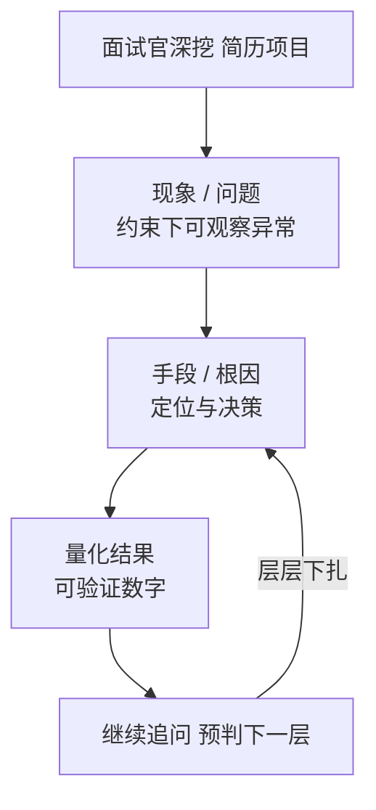

# 项目深挖与高频真题自测：面试官会这样追问

> 前面十九篇把底层软件、BMS、功能安全、通信协议、车规认证、信号完整性等知识点逐个拆开讲。但真实面试里，面试官很少孤立考定义——他们会把你简历上的项目当成"探针"，沿一个点往深里扎，看你是真做过还是背过。本文把笔者简历里的核心项目映射成面试官会追问的真题，并给出"面试官想听什么"的答题骨架，帮助你把零散知识点串成有说服力的实战叙事。

## 一、答题心法：用"现象→手段→量化结果"组织故事

面试官深挖时，最想区分的是"我配置过"和"我理解并解决过"。一个经得起追问的回答必须包含三要素：

1. **现象/问题**（在什么约束下、出现了什么可观察的异常）；
2. **手段/根因**（你是怎么定位的、做了什么技术决策）；
3. **量化结果**（把"好了一点"说成"CPU Loading 从 80%+ 降到约 60%"这类可验证数字）。

下面 8 道题，每道都按这个骨架给答题要点，并标注"面试官会如何继续追问"，帮你预判下一层。

> 图：面试官深挖的追问链路——用"现象→手段→量化结果"组织、预判下一层。



## 二、高频深挖题（5–8 道）

> 图：笔者的底层软件能力雷达——以 BMS / 功能安全 / 通信协议为核心，车规认证为辅。

```mermaid
radar
  axis max 5
  axis 底层软件, BMS, 功能安全, 通信协议, 车规认证, 信号完整性
  curve 笔者能力画像 [4, 5, 4, 4, 3, 4]
```

### 真题 1：你最亮眼的项目优化是什么？

**答题骨架**：
- 主案例：CPU Loading 从 80%+ 降到约 60% 的"降负载五板斧"——软件 IIC→硬件 IIC（免 CPU 位操作轮询）、全通道 DMA（ADC/SPI/UART 搬运交给硬件）、热路径进 ITCM/DTCM（减访存延迟）、开硬浮点 FPU（免软浮点模拟）、调编译优化 `-O2`。
- 副案例：CAN/CAN FD 动态兼容方案——用标定变量作报文类型判断位，写控制器时运行时动态设 FD 标志，一套代码覆盖双协议，消除双版本维护与分支漂移。
- 量化结果：日常报文配置时间由"一天"缩到"半小时"（DBC 自动生成工具）。

**面试官会追问**：开硬浮点有什么坑？→ 答 ABI 一致性、中断上下文 FPU 现场保护（S16 vs D8 保存约定）、调用约定。你怎么证明不是靠降功能换的负载？→ 答关键实时任务周期与 WCET 反而更稳，因为 DMA/TCM 减少了抖动。

### 真题 2：讲一次你修过最难的 Bug。

**答题骨架（二选一或都讲）**：
- Bug A（RTOS 中断标志位）：中断标志位用了 8 位变量存 32 位标志 → 位域截断 → 任务切换判断错 → 报文周期抖动、SPI 响应延迟。定位：逻辑分析仪抓时序 + 查变量位宽；修复：`volatile uint32_t` + 去掉 char/short 代指。
- Bug B（SBC 下电复位）：休眠时 SBC 电容放电（400us）慢于 MCU 进低功耗（200us）→ MCU 被意外复位。定位：双通道示波器同时抓 SBC 放电与 MCU 复位/低功耗进入信号；修复：调下电顺序，让 MCU 先稳定进低功耗或对 SBC 放电做延迟确认/状态清理。

**面试官会追问**：为什么 8 位变量会截断 32 位标志？→ 答 C 里对宽度不足的类型做位移/置位会回卷，第 8 位以上被丢弃。你怎么防止再犯？→ 答静态分析（MISRA）+ code review 规则：所有寄存器/标志位必须用匹配位宽的 volatile 类型。

### 真题 3：你怎么保证功能安全（ISO 26262）？

**答题骨架**：
- 为 ASIL D 安全任务设独立内存保护区：MPU 分区 + 编译期固定内存布局（链接脚本锁各模块地址）+ 栈/数据分离，达成 Freedom From Interference 的"空间隔离"。
- 时间隔离：调度保证高 ASIL 任务有确定时间窗（呼应 WCET 分析）。
- 通信隔离：端到端保护（E2E Profile：CRC + 计数器 + 超时）。
- 诊断机制：ECC（单 bit 纠、双 bit 报）、窗口看门狗（WWDG 比 IWDG 更敏感，能抓时序跑飞）、故障注入实证。

**面试官会追问**：单核 MCU 怎么做到 ASIL D 空间隔离？→ 答靠 MPU 分区 + 编译期固定布局，无 MMU 也能实现空间隔离。你怎么向审核员证明"诊断覆盖率达标"？→ 答故障注入（注入 RAM 错误验 ECC、卡死验 WDT）+ 覆盖率报告（MC/DC）。

### 真题 4：国产芯片替代你怎么做的？

**答题骨架**：
- 方法：建立"基准波形库"——把原厂芯片（如 TJA1145）的 SPI 配置波形、唤醒延迟、电气特性作为基准，逐项比对国产替代件。
- 实例 1：TJA1145 国产替代，差异在 SPI 时钟极性、片选维持时间、寄存器默认值不同、唤醒确认慢于原厂 → 调整软件等待/重试策略。
- 实例 2：SBC 下电时序 400us vs 200us 错配 → 调时序。
- 验收：全功能用例回归 + 环境测试（温度/EMC）+ 补齐车规认证文书（AEC-Q100/IATF 16949/PPAP）。

**面试官会追问**：怎么测出 400us vs 200us？→ 答双通道示波器同时抓 SBC 放电曲线与 MCU 低功耗进入/复位信号。等价验证够了吗？→ 答还不够，要补寿命/可靠性数据，否则只是"功能等价"。

### 真题 5：BMS 你具体做了哪些底层工作？

**答题骨架**：
- 高压采样：分压网络 + 多路 MUX + ADC，硬件触发 + DMA 搬运，满足建立时间、参考电压稳定、内部 offset/gain 校准、通道顺序避开串扰，目标 mV 级精度。
- 均衡：PWM 驱动主动均衡/被动耗散，带温度与电压阈值保护；PWM 精确脉宽控制保险丝引爆能量。
- 高压安全：绝缘检测、HVIL（高压互锁）、预充继电器控制、ICU 输入捕获碰撞信号触发断高压。
- CAN 通信：BMS 与整车通信，上报电压/温度/SOC，接收充放电指令。

**面试官会追问**：采样精度为什么要求这么高？→ 答单体压差 mV 级直接影响一致性判断、均衡决策与 SOH 估算。MUX 切换要注意什么？→ 答开关建立时间，切换后信号需稳定才能采样，否则串入前一路电压。

### 真题 6：你写的自动化工具解决了什么？

**答题骨架**：
- 用 Python 解析 DBC 文件，自动生成 CAN/CAN FD 通信配置与信号 pack/unpack 代码，替代 DaVinci Configurator/Developer 的手工点选。
- 关键点：正确处理字节序（Motorola 大端跨字节 vs Intel 小端）、信号起始位/长度/因子/偏移；双协议（CAN/CAN FD）共用同一生成管线。
- 收益：日常配置由一天缩到半小时，减少人为错误，DBC 变更只需重跑脚本。

**面试官会追问**：Motorola 和 Intel 字节序信号怎么处理？→ 答按字节序算法生成不同 pack/unpack，注意跨字节信号位序易混。生成代码怎么保证和 DBC 一致？→ 答单源（DBC 为唯一契约）+ 生成后做信令级自测。

### 真题 7：跨 6 款芯片移植你怎么保证不踩坑？

**答题骨架**：
- 架构：MCAL 重写（寄存器/时钟差异大）+ 上层配置与应用复用（OS/BSW 相对平台无关）。
- 工程手段：统一的初始化/Driver 抽象接口；建立"芯片差异对照表"（外设 IP、位域、时钟树）；链接脚本按平台分目录管理；Section 溢出用 map 文件定位（挪区/对齐/拆分/开链接优化）。
- 验证：每平台过一遍启动→main、外设驱动 smoke test、CI 静态分析。

**面试官会追问**：链接脚本谁写、怎么给多核分内存？→ 答 BSW/系统集成写；各核独立 RAM 区 + 共享区显式标注避免地址重叠。Symbol 冲突怎么来？→ 答同名全局变量未 static、弱/强符号、库重名。

### 真题 8：场景题——OTA 升级中途车掉电了怎么办？

**答题骨架**：
- 用 A/B 双 Bank：升级写非活动区，校验签名 + CRC 通过后再切换活动区；未完成不切换。
- 重启后检测活动区有效性，若新 Bank 校验失败则回滚到旧版本。
- 安全：签名验签防恶意固件、加密传输、断点续传。

**面试官会追问**：Flash 擦写时能跑同区代码吗？→ 答不能，需跑在 RAM 或另一 Bank。怎么保证切换原子性？→ 答用标志位 + 双 block + 校验，掉电恢复时读最新有效块。

### 附加场景题：SOC 显示突然跳变怎么查？

**答题骨架**：分层定位——先看电流采样（霍尔/shunt 是否饱和、零点漂移）、再看电压采样精度、再查安时积分累计误差、最后看 OCV 修正是否误触发。强调"底层提供采样数据接口，算法在上层"，定位时要能区分是采样层还是算法层的问题。

## 三、把故事讲成体系：最后的提醒

面试官深挖不是为了难倒你，而是验证"你知道自己做了什么、为什么做、代价是什么"。准备时，把每一段经历都按"现象→手段→量化结果"打磨成 90 秒内能讲清的版本，并预先想好每个技术决策的可替代方案与权衡（比如"为什么选被动均衡而不是主动"——成本/效率权衡）。当你能从一个 Bug 一路讲到 ISO 26262 的 FFI 三隔离、从一颗国产料讲到 AEC-Q100 Grade，你就不再是"配过寄存器的人"，而是"理解系统并能对结果负责的底层工程师"——这正是笔者这份技术画像最该传递的信号。
