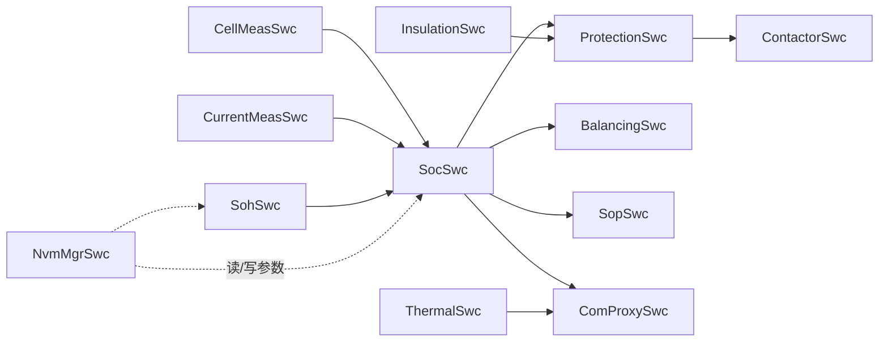
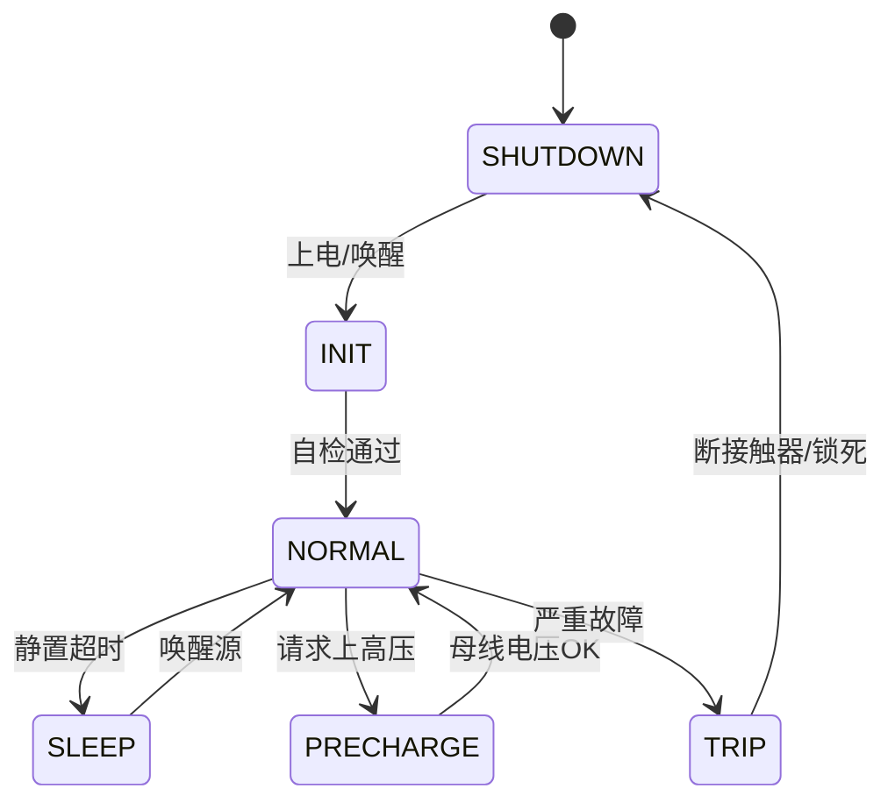

# BMS 进阶（九）· AUTOSAR 应用层与 BMS 软件组件设计

> `10-bms-system.md` 的「C 节」只讲了 **MCAL**（最底层，寄存器封装）。但一个量产 BMS 真正的"大脑"在**应用层（Application Layer）**：那些跑 SOC、SOH、均衡、保护、接触器控制的可复用软件组件（SWC）。本文把 BMS 在 AUTOSAR 里的应用层彻底讲透——SWC 怎么切、它们之间怎么通信、算法怎么住进去、学习参数存哪、上下电怎么管。读完你应能画出一张完整的 BMS AUTOSAR 软件架构图。

---

## 一、先定位：应用层在 AUTOSAR 软件栈里的位置

AUTOSAR Classic Platform 自顶向下的分层是固定的：

```mermaid
graph TD
    APP[应用层 Application<br/>BMS 各 SWC: 采样/SOC/SOH/均衡/保护...]
    RTE[RTE 运行时环境<br/>SWC 间 & 跨 ECU 通信的"假函数"桥梁]
    SVC[服务层 Services<br/>COM / NVM / DEM / DCM / WdgM / BswM]
    ECA[ECU 抽象层<br/>IoHwAb: 原始值→物理量]
    MCA[MCAL 微控制器抽象层<br/>ADC/SPI/CAN/Wdg... 寄存器封装]
    HW[硬件: AFE / MCU / 继电器 / 隔离]
    APP --> RTE --> SVC --> ECA --> MCA --> HW
```

注意分工边界：**MCAL 给"原始计数值/字节流/电平"，IoHwAb 把计数值换成物理量，服务层管通信/存储/诊断，RTE 把 SWC 调用抽象成收发，应用层只认业务语义（电压 mV、SOC %、是否过压）**。本文聚焦 `APP` 这一层，以及它和 `RTE/SVC` 的衔接。

---

## 二、AUTOSAR 应用层的基本构件

应用层由若干 **SWC（Software Component，软件组件）** 拼成。一个 SWC 不是"文件"，而是一组**可运行实体（RunnableEntity）** + **端口（Port）** + **内部行为（Internal Behavior）** 的集合。

- **Port（端口）**：SWC 对外的"插头"。`PPort`（提供/Provide）对外输出，`RPort`（需求/Require）从外面取。
- **Interface（接口）**：插头上的"协议"。
  - **Sender-Receiver（S/R）**：一发多收的"数据广播"，如把 SOC 发给十几个 SWC。
  - **Client-Server（C/S）**：调用-返回，如 Balancing SWC 调 Model SWC 的 `ComputeOCV(SOC)`。
- **Data Types**：`Application Data Type`（业务语义，如 `SocType`）→ `Implementation Data Type`（实现，如 `uint16 0..1000 表示 0~100.0%`）→ `Base Type`（C 原生类型）。
- **Runnable**：SWC 里真正跑代码的函数。触发方式：
  - `TimingEvent`：周期触发（如每 10ms 采一次电压）；
  - `DataReceivedEvent`：收到数据即触发（如收到新电流值立刻算一步安时积分）；
  - `ModeSwitchEvent`：模式切换触发；
  - `OperationInvokedEvent`：被 C/S 调用触发。

> 真实工程里，Runnable 的周期、优先级、栈大小都在工具里配，生成代码后**不能在 C 里随手改**——改了也得回工具改配置，否则下一次生成就被覆盖。

---

## 三、BMS 典型 SWC 划分与职责

一个分布式 BMS（主控 BMU + 若干从控 CSC）通常这样切 SWC（仅列主控侧核心）：

| SWC | 职责 | 典型周期 |
| --- | --- | --- |
| `CellMeasSwc` | 收从控上传的单体电压/温度，做一致性检查、找最大/最小单体 | 10~100 ms |
| `CurrentMeasSwc` | 读总电流（霍尔/分流），做零偏补偿、滤波，供安时积分 | 1~10 ms |
| `SocSwc` | 安时积分 + OCV 校正 + KF 估计（呼应 `b02`） | 100 ms~1 s |
| `SohSwc` | 容量/内阻/ICA 健康度估计（呼应 `b03`） | 1 s~数分钟 |
| `SopSwc` | 功率能力估计（可放可充最大功率） | 100 ms~1 s |
| `BalancingSwc` | 均衡调度决策（呼应 `b04`） | 1 s |
| `ProtectionSwc` | 过压/欠压/过流/过温判定与安全状态机 | 10~50 ms |
| `ContactorSwc` | 主继/预充继电器控制与粘连检测（呼应 `b10`） | 事件/10 ms |
| `InsulationSwc` | 绝缘电阻估计（呼应 `b10`） | 1~5 s |
| `ThermalSwc` | 热管理控制（风扇/水泵/加热，呼应 `b05`） | 100 ms~1 s |
| `ChargingSwc` | 充电流程状态机、GB/T 27930 需求下发（呼应 `b07`） | 100 ms |
| `ComProxySwc` | 把内部数据映射成 CAN 信号对外上报 | 100 ms~1 s |
| `NvmMgrSwc` | 管理学习参数/标定数据的读写 | 事件/下电 |



切分原则：**高安全等级（Protection/Contactor）放独立 SWC 并配 Memory/Timing Protection；算法（SOC/SOH）可独立验证、独立替换；I/O 密集的采样归并，减少跨 SWC 耦合**。

---

## 四、SWC 之间的 RTE 通信

### 4.1 Sender-Receiver：数据广播
`SocSwc` 算完 SOC，通过 `RPort/Soc_Out` 发出，`ProtectionSwc`、`ComProxySwc`、`BalancingSwc`、`SopSwc` 都用 `RPort` 收。RTE 在生成时决定：同 ECU 内用**共享缓冲（按引用传递，零拷贝）**，还是**队列**，还是**拷贝**。

> 坑：大数据（如整包所有单体电压数组）务必用"按引用"而非"按值"传，否则每次收发都整体 memcpy，栈和 CPU 都扛不住。

### 4.2 Client-Server：调用-返回
`BalancingSwc` 想用最新模型参数算目标，调 `ModelSwc.ProvideOCV(SocIn, TempIn)` → 返回 `Vout`。RTE 把调用转成本地函数跳转（同 ECU）或跨核/跨 ECU 报文。

### 4.3 跨 ECU：RTE → COM → 硬件
主控要告诉 VC U 整车状态，路径是：`SocSwc.RPort → RTE → Com(信号打包) → PduR → CanIf → Can(MCAL) → 总线`。接收端 VC U 对称解包。**这就是为什么 SWC 里"调一下拿到 SOC"在跨 ECU 时其实变成了一帧 CAN 报文**——位置对调用者透明。

---

## 五、核心算法如何在 SWC 中落地（呼应 b01-b03）

算法不是"散落的全局函数"，而是 SWC 里一个或多个 Runnable。以 `SocSwc` 为例：

```c
/* RTE 生成的"假函数"原型（示意），实现体由我们写 */
void Soc_Run_100ms(void)
{
    float I = CurrentMeasSwc_GetCurrent();      /* RTE 取电流(S/R) */
    float vcell[96];
    CellMeasSwc_GetMinMax(vcell, &n);            /* 取电压(S/R) */
    /* 安时积分 + OCV 校正 + EKF（见 b02） */
    soc = Ah_integrate(soc, I, 0.1f);
    soc = ocv_correct(soc, vcell_min, t_now);
    SocSwc_Soc_Out = (uint16)(soc * 1000.0f);    /* 发广播(S/R) */
}
```

模型参数（`R0/R1/C1` 表）从 `NvmMgrSwc` 读进 SWC 内部状态；在线辨识（见 `b01`）可放在 `CurrentMeasSwc` 或 `SocSwc` 里跑，辨识结果写回 NVM。

**周期规划铁律**：采样（电压/温度 10~100ms、电流 1~10ms）> 安时积分步长 > 估计（SOC 100ms~1s）> 决策（均衡 1s、保护 10~50ms）。保护必须最快，否则过流几十毫秒就烧电芯。

---

## 六、NVM：学习参数与标定数据的"家"

BMS 有大量**跨上下电必须保留**的数据，全靠 NVM（非易失存储，通常是 MCU 内部 Flash 或外置 EEPROM）：

- OCV–SOC 表、模型参数 `R0/R1/C1`（随老化更新）；
- SOH 历史、累计 throughput（Ah  throughput，用于寿命预测）；
- 均衡累计时间/能量（判断哪节早衰）；
- 自学习偏移（采样零偏、温度补偿系数）；
- 产线标定系数（见 `10-bms` 14.1）。

NVM 设计要点：
- **分 Block**：频繁改的（如 SOH 历史）和很少改的（标定系数）分开，避免互相擦写；
- **写策略**：下电存 + 变化量超阈值存 + 周期性存，别每帧都写（Flash 有擦写寿命）；
- **CRC + 冗余**：存两份 + 校验，掉电中途写坏能恢复；
- **Wear Leveling**：轮流用不同扇区，均摊擦写。

---

## 七、COM / DCM / DEM：对外上报与诊断

- **COM**：把 SWC 内部数据映射成 CAN 信号。配置（DBC/ARXML）决定"哪个 SWC 端口 → 哪帧 CAN 的哪个 bit"。典型上报：单体最高/最低电压、SOC、SOH、最高温度、总电流、故障标志、继电器状态。周期通常 100ms~1s。
- **DEM（Diagnostic Event Manager）**：管 DTC（Diagnostic Trouble Code）。`ProtectionSwc` 判定过压 → 调 `Dem_SetEventStatus(OVERVOLT, FAILED)`；去抖（防抖 N 次/时间窗）在 DEM 配（呼应 `b06`）。DTC 可锁定为"待定/确认/历史"。
- **DCM（Diagnostic Communication Manager）**：实现 UDS（ISO 14229）。`0x22` 读数据（如读当前 SOC）、`0x2E` 写标定（如改均衡阈值）、`0x14` 清 DTC、`0x19` 读 DTC 快照。产线标定与售后诊断都走它。

---

## 八、BswM / EcuM：上下电与休眠唤醒

- **EcuM**：管 MCU 启动/关闭、休眠（STOP/STANDBY）。BMS 整包静置时进低功耗，只留极少数唤醒源（如充电器插入、CAN 唤醒）。
- **BswM（Basic Software Mode Manager）**：根据模式仲裁外设上下电。例如进入 `SLEEP` 模式 → 关 AFE 采样、关通信、只留唤醒检测；进入 `RUN` → 初始化 MCAL、AFE 上电、启动采样。



---

## 九、时间触发与多核：主控 + 从控的部署

- **从控（CSC）**：算力弱（多为低成本 MCU 或纯 AFE 链），通常只跑"采样 + 转发 + 被动均衡"，软件可在 MCAL + CDD 层完成，**不一定要完整 AUTOSAR**；高端从控才上轻量 SWC。
- **主控（BMU）**：跑完整 BSW + 全部应用 SWC。多核 MCU（如 S32K3 双核、AURIX 多核）上：
  - 采样/通信放一个核，重算法（SOC/SOH/KF）放另一个核；
  - **锁步核**放安全相关（Protection/Contactor），满足 ASIL-D。

---

## 十、工程实践：从 ARXML 到代码生成

工具链（以 Vector/EB/ETAS 为例）里做 BMS 应用层的典型流：

1. **定义 SWC**：在工具里建 `SocSwc`，加 `RPort Soc_In_Current`（S/R）、`PPort Soc_Out`（S/R）、`Runnable Soc_Run_100ms`（TimingEvent 100ms）。
2. **连端口**：把 `SocSwc.Soc_In_Current` 连到 `CurrentMeasSwc` 的对应 PPort。
3. **配 OS**：给 Runnable 配周期 100ms、优先级、栈。
4. **配 COM**：把 `Soc_Out` 映射到某帧 CAN 信号的 bit 区间。
5. **生成**：RTE Generator 生成 `Rte_SocSwc.h/.c`，把"假函数"接好；BSW 生成 COM/NVM/DEM 配置。
6. **编译链接**。

算法若用 **MATLAB/Simulink + Embedded Coder**，可把 `SocSwc` 的内部行为直接由模型生成（atomic SWC），与手写 C 的 SWC 共存——这就是 Model-Based Design（MBD）落地 AUTOSAR 的标准姿势（详见 `b10` 第十节）。

---

## 十一、常见坑（血泪清单）

1. **ARXML 改了 SWC 没同步**：接口名/数据类型改了，对手 SWC 没更新 → 生成失败或"假函数"连错。
2. **Runnable 周期定太短**：SOC 跑 10ms 而非 100ms，CPU loading 直接爆。
3. **NVM 写太频繁**：每帧都存 SOH → Flash 几个月写穿。
4. **跨 ECU 信号忘了配 COM**：RTE 生成了"假函数"，但没人发包/收包 → 永远拿到初值 0。
5. **S/R 大数据按值传**：整包电压数组被整体拷贝 N 次 → 栈溢出。
6. **安全 SWC 没配保护**：Protection SWc 没开 Memory/Timing Protection → 被别的任务踩内存或跑飞。
7. **多核共享缓冲没保护**：两个核同时写同一采样缓冲 → 数据撕裂。

---

## 十二、面试要点

- **应用层 SWC 为什么可移植？** RTE 把通信/调度抽象掉，换芯片只重生成 RTE + 重写 MCAL，SWC 内部行为几乎不动。
- **RTE 里 SWC 调用为什么是"假"函数？** 它实际转成共享缓冲/队列/信号/网络报文，"位置透明"——本地是函数跳转，跨 ECU 变成 CAN 帧。
- **BMS 哪些该放应用层、哪些放 CDD/MCAL？** AFE 实时采样、特殊硬件访问放 CDD/MCAL；算法、保护、均衡、上报放 SWC。
- **NVM 怎么保证断电不丢学习参数？** 分 Block + 下电/变化量/周期写 + CRC 冗余 + wear leveling。
- **COM 信号和 SWC 端口怎么对应？** 在 ARXML/DBC 里把 SWC 的 PPort 映射到某帧 CAN 的 bit 区间，工具生成 pack/unpack。
- **为什么从控常不上完整 AUTOSAR？** 算力弱、只做采样转发，MCAL+CDD 足够，上全套栈反而拖慢、增成本。
