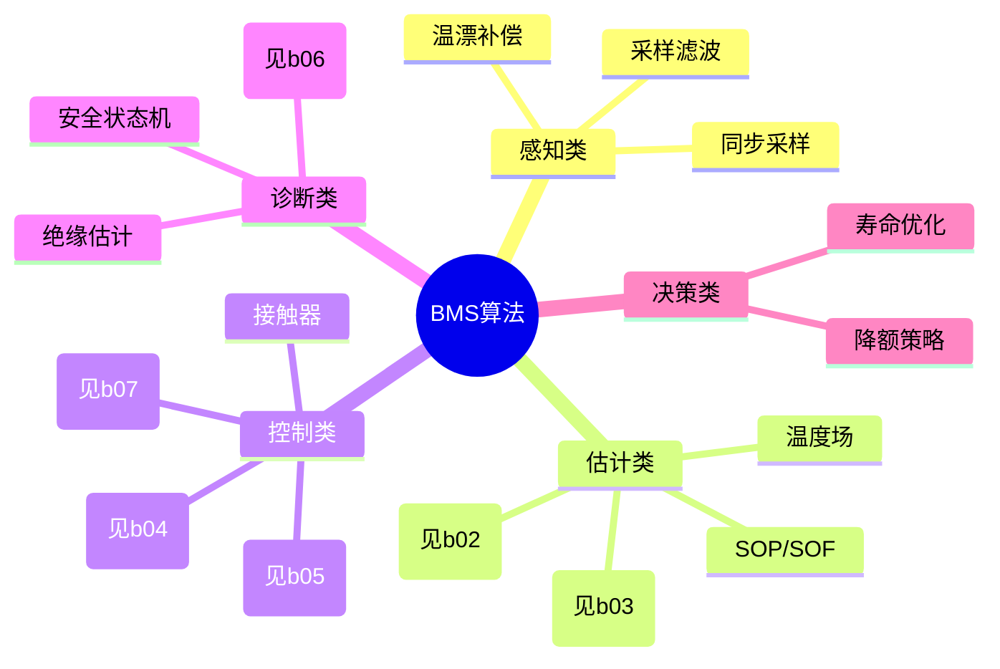
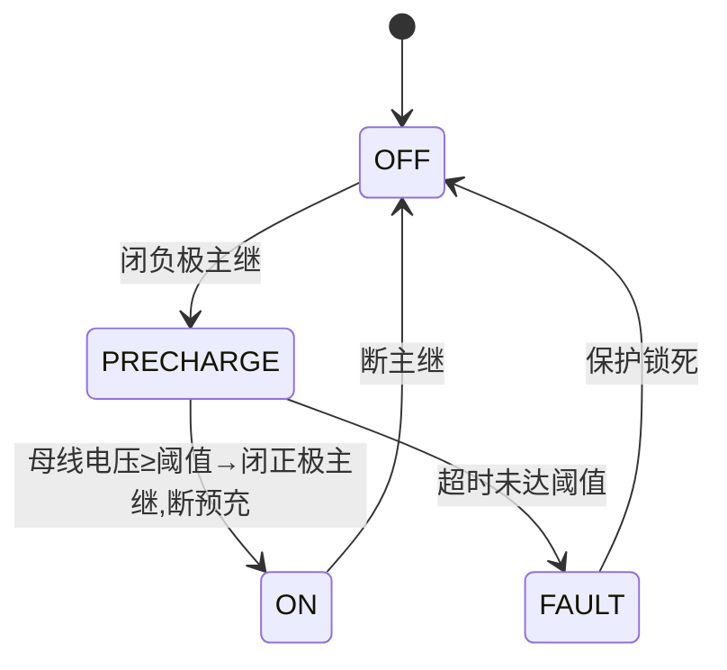

# BMS 进阶（十）· 核心算法全景与工程化部署

> `b01/b02/b03` 把**建模 / SOC / SOH** 三个最硬的算法讲到了实现级。本文是它们的"总纲 + 补完"：先给出 BMS 算法的完整分类地图，再补上 `b01-b03` 没深挖的**系统级算法**——SOP 功率能力、均衡调度、热管理控制、绝缘电阻估计、接触器预充状态机，最后讲算法怎么从模型**部署到 MCU**（MBD / 定点 / 自动代码）。建议和 `b01-b03`、`b04-b07` 对照着读。

---

## 一、BMS 算法全景地图



五大类：**感知（把信号弄干净）→ 估计（猜状态）→ 控制（动执行器）→ 诊断（发现异常）→ 决策（综合降额）**。下面逐类展开，深度算法指回对应章节。

---

## 二、感知类：采样与信号调理（算法入口）

再好的估计算法也架不住脏输入。感知类算法负责把 AFE 原始值变成可信信号：

- **滤波**：滑动平均（去随机噪）、IIR 一阶低通（去高频毛刺）、中值滤波（去偶发尖峰/EMI）；电压慢变用轻滤波，电流快变用稍重滤波但要保相位。
- **去偏移（offset）**：霍尔零偏随温漂，上电/静置时采零位补偿，或在线估计慢漂。
- **温漂补偿**：采样增益/偏移随温度查表修正。
- **同步采样**：电流与电压要在**同一时刻**采样，否则算瞬时功率/内阻会引入相位误差（尤其大电流时）。
- **软硬边界**：硬件 RC 滤波定带宽，软件滤波定平滑；别用软件滤波去扛本该硬件解决的噪声，会引入延迟。

---

## 三、估计类：SOC / SOH / SOP / 温度场

### 3.1 SOC / SOH
`b02` 讲安时积分+OCV+KF；`b03` 讲容量/内阻/ICA。这里补一个工程视角：**多时间尺度**——快轴（ms~100ms）只做安时积分保证实时性，慢轴（秒级）做 OCV/KF 校正消除累计误差。两轴解耦，既稳又准。

### 3.2 SOP / SOF（本文重点，新内容）
**SOP（State of Power，功率能力）**：在当前 SOC/温度/健康度下，未来一段时间 `Δt`（典型 1s/10s/30s）内，电池**还能安全放出/吸收的最大功率**。这是整车功率限制、充电功率限制、再生制动回收的核心输入。

约束来自四个方面，取最严：

| 约束 | 不等式（放电方向） |
| --- | --- |
| 电压不越过放终 `Vmin` | `OCV(SOC - I·Δt/Q) - I·R0 - V1(Δt) ≥ Vmin` |
| 电流不超 `Imax` | `\|I\| ≤ Imax` |
| SOC 不越界 | `SOC - I·Δt/Q ≥ SOC_min` |
| 温度不越界 | `T + k·I²·R0·Δt ≤ Tmax` |

用 Thevenin 模型（见 `b01`）预测 `Δt` 后极化电压 `V1(Δt) = V1(0)·e^(-Δt/τ) + I·R1·(1-e^(-Δt/τ))`，代入上表解 `I` 的最大可行值即 `I_dis_max`；充电方向对称取 `I_chg_max`。`SOP = min(V约束, I约束, SOC约束, T约束)`。

> **SOF（State of Function）** 是 SOP 的扩展：不仅限功率，还限制"能不能快充/能不能大电流放电"等功能使能，常用于寿命保护（老化后收紧 SOP）。
>
> 坑：用**稳态模型**忽略极化，会把瞬时可放功率**高估**一大截——大电流急加速时电压瞬间塌方，车"蹿"一下又掉功率，体验极差。必须用带极化的动态模型。

### 3.3 温度场估计
见 `b05`：由集总热模型反演核心温度，给热管理前馈。

---

## 四、均衡控制算法（调度逻辑，补充 b04 硬件）

`b04` 讲了主动均衡的拓扑（开关电容/飞返/Cuk…）。本文讲"**什么时候均衡、均衡谁**"——这是纯算法层：

- **判据**：基于 `ΔSOC`（最准，但需好 SOC）、或 `ΔV`（简单但受负载/滞回干扰）、或 `ΔQ`（可用容量差，最贴合"要不要均衡"的本质）。
- **被动均衡窗口**：多在**充电末段 / 静置**跑（行车时被动均衡耗的是本就少的能量，得不偿失）；阈值如 `ΔSOC > 3%~5%` 才启动。
- **主动均衡调度**：优先给"偏差最大的单体"搬运能量；考虑能量往返效率（别为 1% 偏差花 30% 效率去搬）；受温度门限（低温不衡）、电流门限（大电流不衡）约束。

```c
/* 均衡调度伪代码（主动均衡，基于 SOC 差） */
void balancing_schedule(const float soc[], int n, float *act_on)
{
    int hi = argmax(soc, n), lo = argmin(soc, n);
    float dSOC = soc[hi] - soc[lo];
    for (int i = 0; i < n; i++) act_on[i] = 0;
    if (dSOC > BAL_THRESH && temp_ok() && current_small()) {
        act_on[hi] = 1;   /* 最高单体放电 */
        act_on[lo] = 1;   /* 最低单体充电（主动拓扑） */
    }
}
```

---

## 五、热管理控制算法（补充 b05）

目标：把包温维持在窗口、减小单体间温差（温差大→一致性差→可用容量缩水）。

- **Bang-bang**：超上限开风扇/水泵，最简单但易振荡。
- **PID**：对水温/包温做闭环，平稳但参数难调、有超调。
- **模型预测（MPC）**：用热模型预测未来温度，提前调节流量/压缩机，最优但算力要求高（多在域控/上位机）。
- **前馈**：用温度场估计（§3.3）预测升温趋势，提前加大冷却，而不是等超温才动作。
- **低温加热**：脉冲自加热（电池自身通双向脉冲发热）或外部 PTC/水暖，算法控加热功率与温度窗口。

---

## 六、充电控制算法（呼应 b07）

- **CC-CV 状态机**：恒流到截止电压 → 转恒压 → 电流降到 C/20 判满。
- **阶梯/脉冲充电**：分段提电流，减极化、提速。
- **热感知降额**：温度/SOC 进析锂边界（见 `b07`）时降电流。
- **GB/T 27930 接口**：BMS 通过 BCL 报文下发"需求电压/电流"，充电桩跟从（详见 `b07`）。

---

## 七、绝缘电阻估计算法（新）

高压电池包正、负母线对车身地都有寄生绝缘电阻 `Rp`、`Rn`。绝缘检测常用**电桥注入法**：

1. 在正负母线对地间各串已知电阻 `R0`，中间注入一个已知电压/靠切换开关改变桥臂；
2. 测正、负对地电压 `Vp`、`Vn`；
3. 列方程组解出 `Rp`、`Rn`，合成总绝缘 `Riso = (Rp·Rn)/(Rp+Rn)`。

```c
/* 非平衡电桥法（示意，两步采样解 Rp/Rn） */
void insulation_estimate(float Vp1, float Vn1, float Vp2, float Vn2,
                         float R0, float Vsrc, float *Rp, float *Rn)
{
    /* 两步切换桥臂得到两组 (Vp,Vn)，解线性方程组 */
    float det = Vp1*Vn2 - Vp2*Vn1;
    *Rp = R0 * (Vsrc*Vn2 - Vn1*Vsrc) / det;   /* 公式化简略，工程用标定拟合 */
    *Rn = R0 * (Vp1*Vsrc - Vsrc*Vp2) / det;
}
```

要点：注入信号要避开干扰频段；开关动作要同步采样；补偿漏电流；判定阈值按 GB 38031 / GB/T 18384（通常 `Riso < 100Ω/V` 报警）。

---

## 八、接触器与预充控制状态机（新）

上高压时母线挂着巨大容性负载（电机/逆变器直流母线电容），直接闭合主继会拉弧烧毁触点，必须**预充**：



预充电阻按 `I²t` 和功率选型（太大预充慢、太小烧电阻）；监测母线电压上升曲线判断是否预充成功。**粘连检测**：断开主继后测触点两端电压/电流，若有压降说明触点焊死，禁止再次上电。

---

## 九、安全状态机与故障仲裁（呼应 b06）

全局 `Safety State`：`NORMAL → WARNING（降额）→ FAULT（断接触器）→ TRIP（锁死）`。各 SWC 的故障请求（过压/过流/过温/绝缘/均衡失效）汇总到 `ProtectionSwc` 集中仲裁，按严重度决定降额力度或断高压。分级比"一刀切断电"更友好（轻微过温先降功率，而非立刻抛锚）。

---

## 十、算法工程化部署：MBD + 定点 + 自动代码

算法不能只在 MATLAB 里跑通，要落到 MCU。标准路径：

1. **建模（Simulink / Stateflow）**：用 `b01` 的 Thevenin 模型 + KF 搭 SOC 估算，Stateflow 画充电/接触器状态机。
2. **定点化（Fixed-Point）**：MCU 无 FPU 或要省算力时，浮点模型转 **Q 格式定点**（如 Q15 表 `-1~+1`、Q31 高精度）。做 overflow/精度分析，建 scaling 表 `real = raw * 2^(-frac)`。
3. **代码生成（Embedded Coder）**：模型 → 生成 `atomic SWC` 内部行为 C 代码 + 接口（见 `b09` 第十节），直接进 AUTOSAR。
4. **单元/集成测试**：MIL（模型在环）→ SIL（生成代码在 PC 跑）→ HIL（接真实硬件在环，见 `10-bms` 14.3）；覆盖率要求 MC/DC（高 ASIL）。
5. **调度落地**：算法 Runnable 的周期/优先级在 OS 配置（呼应 `b09`）。

> 手写 C 也能做，但 MBD 的优势是**算法与代码同源可追溯、改模型即改码、自动满足接口契约**，大厂量产主流。定点化没做对，轻则精度崩、重则数值溢出系统跑飞。

---

## 十一、算法精度与标定

标定参数（OCV 表、模型 `R0/R1/C1`、各类阈值、增益/偏移）都来自台架/产线标定（见 `10-bms` 14.1）。算法要"参数外置"——别把阈值 hardcode 进代码，放标定区（NVM/Calibration 区），便于迭代且不重编译。

---

## 十二、常见坑（血泪清单）

1. **算法周期与采样不同步** → 估计抖动、SOC 跳变。
2. **SOP 用稳态模型** → 忽略极化，瞬时功率高估，车"蹿"后掉功率。
3. **均衡只在充电跑** → 行车不一致持续积累，可用容量悄悄缩水。
4. **绝缘检测注入干扰敏感** → 误报/漏报，整包不敢上电。
5. **定点 scaling 错** → 溢出或精度崩，KF 发散。
6. **多算法共享采样缓冲未加锁** → 中断改写导致数据撕裂（读一半被更新）。
7. **阈值 hardcode** → 标定改不了，每次调参重编译烧录。

---

## 十三、面试要点

- **BMS 算法分哪几类？** 感知/估计/控制/诊断/决策五类，互相串成闭环。
- **SOP 怎么算？约束有哪些？** 用动态模型解未来 Δt 最大可行电流，受电压/电流/SOC/温度四大约束。
- **均衡调度算法思路？** 基于 ΔSOC/ΔV/ΔQ 判据，被动在充电末段、主动优先搬最大偏差，受温度/电流门限约束。
- **算法怎么从 Simulink 部署到 AUTOSAR MCU？** 建模→定点化→Embedded Coder 生成 atomic SWC→RTE 接好→编译；MIL/SIL/HIL 验证。
- **为什么定点化？** MCU 无 FPU 时省算力、确定性好、易认证；但要防溢出与精度损失。
- **绝缘检测为什么用电桥法？** 正负母线对地寄生电阻未知，注入已知源测压解方程组反推。
