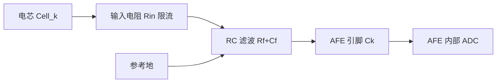

# BMS 进阶（十一）· BMS 硬件设计深解

> `10-bms-system.md` 讲了 AFE / 采样 / 均衡 / 高压的**概览**。本文把硬件做"透"——从**器件选型**到**原理图细节**到 **PCB 布局**再到 **EMC/安规**，把每个电路为什么这么画、参数怎么算讲清楚。这一章是硬件工程师的"踩坑合集 + 选型手册"。

---

## 一、BMS 硬件总览与形态

典型分布式 BMS 的板卡分工：

| 板卡 | 功能 | 关键器件 |
| --- | --- | --- |
| 从控 CSC（采样板） | 采 N 节电压/温度、被动均衡 | AFE + 均衡 MOS/电阻 + NTC |
| 主控 BMU | 算 SOC/SOH、保护、通信、接触器 | MCU + SBC + CAN-FD + 隔离通信 |
| 高压板 | 继电器/预充/绝缘/总压/总流 | 继电器 + 预充电阻 + 分流器 + 绝缘电路 |

关键器件总清单：AFE、MCU、SBC（电源+看门狗+CAN）、隔离通信器件、均衡 MOS/电阻、电流传感器（分流/霍尔）、NTC、继电器、预充电阻、TVS/保险丝、隔离器、精密电阻。

---

## 二、AFE（模拟前端）选型

AFE 是把多节电芯电压"搬"出来并做均衡的核心芯片。主流与选型维度：

| 厂商/系列 | 通信 | 通道 | 精度 | 均衡 | 备注 |
| --- | --- | --- | --- | --- | --- |
| ADI LTC68xx / ADBMS68xx | isoSPI（变压器/电容隔离） | 12~18 | 16bit | 被动(外MOS) | 菊花链标杆，级联多 |
| NXP MC33771/2/4 | TPL（变压器隔离）/SCI | 4~14 | 14bit | 被动 | 车规生态好 |
| TI BQ796xx | 电容隔离菊花链 | 6~16 | 16bit | 被动/主动 | 诊断强 |
| 国产（中颖/灿瑞/思瑞浦/比亚迪等） | isoSPI/电容 | 6~16 | 12~16bit | 被动 | 国产替代降本主力 |

**选型看什么**：
- **通道数 & 级联**：800V 包 96~120 节，要算几片 AFE 级联；级联深度受通信耐受与共模限制。
- **精度**：16bit 对 LFP（OCV 平）更友好；14bit 够 NMC。
- **隔离通信方式**：isoSPI（变压器隔离，抗共模强）vs 电容隔离（省变压器但共模弱些）。
- **功能安全**：是否带内部诊断、ASIL 等级、支持冗余采样。
- **均衡电流**：内置被动均衡电流（50~200mA）是否够；主动均衡需外搭（见 `b04`）。
- **成本 & 供货**：大批量必考虑国产替代与交期。

---

## 三、电芯电压采样输入电路

每节电芯 `Cell_k` 正负端接 AFE 对应 `Ck / Ck+1` 引脚。关键细节：

- **输入电阻 `Rin`**：限流 + 防热插拔冲击。太大 → 采样建立慢、易受干扰；太小 → 静态功耗/发热（多节并联到同一参考）。典型几十 kΩ~数百 kΩ。
- **RC 滤波**：`τ = Rf·Cf` 要远小于采样窗口，滤高频 EMI，但别把电池真实动态滤掉。
- **过压/反极性保护**：输入端串限流电阻 + 钳位二极管（到 AFE 供电轨）+ 可选 TVS，防热插拔/反接烧毁。
- **Kelvin 连接**：采样走线从电芯端子直接引，别和均衡大电流走线共用，否则均衡时压降污染采样。

---

## 四、隔离通信（isoSPI / TPL）

主从之间要扛**数百伏共模电压**，必须隔离：

- **变压器隔离（isoSPI）**：片外小变压器耦合，共模耐受高（±60V 连续、瞬态更高），抗扰强，最常用。PCB 上变压器要对称、走线等长、下方净空。
- **电容隔离**：省变压器，靠高压电容耦合，共模耐受略弱，成本略低。
- **拓扑**：菊花链（一进一出串起来，省线）vs 星型（每从控独立回主控，冗余好但线多）。高端方案做**双 isoSPI 冗余**（主+备链路）。
- **双绞线 + 终端匹配**：特征阻抗匹配减反射，长距离要终端电阻。

---

## 五、均衡电路（硬件侧，呼应 b04）

**被动均衡**（最常见）：每节并一个 `MOS + 功率电阻`，导通时把该节多余能量以热耗散。

- 电阻选型：`R = Vcell² / P`，如 3.7V、目标 0.5W → R≈27Ω；选功率余量 2~3 倍并算温升。
- 均衡电流 `I = Vcell/R`（约 50~200mA）；电阻要远离 NTC（否则加热污染温度采样）。
- MOS 选低压降、低栅荷，驱动级限流。

**主动均衡**功率级见 `b04`（变压器/电容/电感拓扑），此处不重复。

---

## 六、电流采样

| 方案 | 原理 | 优点 | 缺点 | 适用 |
| --- | --- | --- | --- | --- |
| 分流电阻 + 隔离放大器 | 测小电阻压降 | 高精度、低温漂、线性好 | 有功耗、需隔离 | 主流车用 |
| 霍尔效应 | 磁场感应 | 非接触、无插入损耗、带宽好 | 零偏温漂、需补偿 | 大电流/双向 |

- **位置**：多放总负侧（电位低、安全）；放总正需更高隔离耐压。
- **温漂补偿**：霍尔零偏随温度，软件（见 `b02/b10`）或硬件温补。
- **噪声**：分流+ΔΣ ADC 噪声低；信号链要滤波、远离功率走线。

---

## 七、温度采样

- **NTC 选型**：B 值（如 3435K/3950K）、精度（±1%）、封装（贴电芯表面）。
- **分压+滤波**：上拉电阻精度决定绝对精度；RC 滤波去噪。
- **布局**：贴在单体表面（测芯温）、母线、均衡电阻旁、功率器件旁——**千万别把 NTC 放均衡电阻边上**，均衡发热会骗过温度采样。
- **多路复用**：多 NTC 经模拟开关轮询，注意开关导通电阻影响。
- **导线电阻**：长线电阻叠加进分压 → 远端测温偏移，必要时用恒流源或远端补偿。

---

## 八、继电器 / 预充驱动与高压测量

- **高压继电器**：选线圈电压（12/24V）、触点容量（持续电流/浪涌）、寿命（次）；驱动用高边 MOS/智能高边，带续流二极管，软启动防触点弹跳。
- **预充电阻**：按 `I²t` 和功率选。`E = ½·C·V²` 是预充要吸收的能量，电阻 `R` 限制峰值电流 `I=V/R`，功率 `P=V²/R·占空`。太小→电流大烧触点；太大→预充慢。详见 `b10` 第八节状态机。
- **接触器状态检测**：辅助触点或测触点两端压降，判断粘连（见 `b10`）。
- **总压采样**：精密电阻分压 + 缓冲/隔离放大器 + 滤波；电阻精度/温漂直接决定总压误差（通常要求 <1%）。

---

## 九、绝缘检测电路

电桥法（见 `b10` 第七节）：正负母线对地各串检测电阻 + 切换开关 + 检测源，测对地电压解 `Rp/Rn`。PCB 上要注意高压侧与低压侧的**隔离间距**，检测电阻用高精度低温漂，切换开关耐压要够。

---

## 十、电源与 SBC

- **供电链**：12/24V 蓄电池 → 防反接（理想二极管/智能高边）→ Buck/LDO → MCU/AFE 各路电源。
- **SBC（System Basis Chip）**：集成电源 + 看门狗 + CAN 收发器 + 唤醒（如 NXP 3377x、Infineon TLF 系列），一颗搞定供电+安全喂狗+通信，省板面积、易认证。
- **低功耗待机**：休眠时只留极小 LDO 供唤醒检测，整机电流降到 mA 级。
- **保护**：反极性、抛负载（Load Dump，瞬态高压）、过压 → TVS/智能保护。

---

## 十一、MCU 选型

| 需求 | 考量 |
| --- | --- |
| 算力 | SOC/SOH/KF 算法（见 `b01-b03`）要浮点/MAC；有 FPU 或 DSP 指令更佳 |
| 外设 | SPI（isoSPI 主控）、ADC、高精度定时器、CAN-FD、多路 PWM |
| 功能安全 | 锁步核、ECC、MPU → ASIL-D（见 `03-functional-safety`） |
| 温度等级 | Grade 1（−40~125℃）或 Grade 0（−40~150℃） |
| 生态 | 有 AUTOSAR MCAL（见 `b09`）、调试工具 |

主流：NXP S32K3（锁步双核、车规全）、Infineon AURIX TC3xx（多核强）、Renesas RH850、国产（芯驰/国芯/紫光）。**主控要强、从控可弱**——从控只采样转发，低成本 MCU 即可。

---

## 十二、EMC / 隔离 / 安规

- **隔离**：高压-低压数字隔离（磁/电容隔离器）、通信隔离（isoSPI）；按系统电压留余量。
- **爬电/电气间隙**：按电压等级与污染等级查表（如 800V 系统、加强绝缘要求数十 mm 级间距），CTI 材料等级影响。
- **EMC**：电源入口共模扼流 + Y 电容、信号线滤波、屏蔽壳体、地环路处理；BMS 常见传导发射（开关电源/均衡）与辐射（长线/继电器）。
- **安规**：耐压（HI-POT）、绝缘电阻、阻燃（外壳 UL94）、热失控隔离（见 `b05` GB 38031）。

---

## 十三、PCB 布局要点

- **高低压分区**：高压区（继电器/分流/总压）与低压区（MCU/AFE）物理隔离，留爬电间距。
- **Kelvin 采样走线**：细而短、直连电芯端子，远离均衡/功率走线；加 guard ring 减小漏电流。
- **地分割**：模拟地/数字地单点连接，避免功率地噪声串入采样。
- **AFE 散热铺铜**：AFE 下方/周边铺铜帮助散热。
- **均衡电阻布局**：远离 NTC、远离温度敏感件，保证通风或加散热焊盘。
- **去耦电容**：每芯片电源脚就近放 100nF + 大电容。
- **菊花链走线**：等长、阻抗匹配、下方净空（变压器区域）。

---

## 十四、BOM 与降本

- **成本结构**：AFE + MCU + SBC + 继电器 + 被动元件 + 结构件 + 开发摊销。
- **降本方向**：国产替代 AFE/MCU、SBC 集成减元件、平台化摊薄 NRE、设计优化（少料号、少手工工序）。
- **权衡**：降本不能动安全相关（继电器/隔离/绝缘），否则认证翻车。

---

## 十五、常见坑（血泪清单）

1. **输入电阻太大** → 采样建立慢、受干扰；太小 → 功耗/发热大。
2. **均衡电阻紧挨 NTC** → 温度测量被均衡加热污染，热管理误动作。
3. **总压分压电阻温漂** → 总压慢慢漂，SOC 校正基准错。
4. **菊花链共模没隔离** → 上高压瞬间炸 AFE。
5. **预充电阻 I²t 不够** → 预充几次就烧。
6. **共地没处理好** → 采样零偏、继电器误判。
7. **NTC 长线电阻** → 远端测温系统性偏冷/偏热。
8. **EMC 没滤波** → 过不了认证，整包召回风险。

---

## 十六、面试要点

- **AFE 怎么选？** 看通道数/级联、精度、隔离通信方式、均衡电流、ASIL、成本供货。
- **被动均衡电阻怎么算？** `R = V²/P`，电流 `I=V/R`，功率余量 2~3 倍并算温升。
- **isoSPI 隔离方式？** 变压器隔离（共模强）vs 电容隔离（省变压器），菊花链拓扑。
- **电流采样分流 vs 霍尔？** 分流高精度低温漂但耗能需隔离；霍尔非接触但零偏温漂需补。
- **800V 系统爬电间距怎么定？** 按电压等级+污染等级查安规表，加强绝缘留余量。
- **MCU 为什么要多核锁步？** 锁步核比较双核结果检硬件随机失效，满足 ASIL-D。
