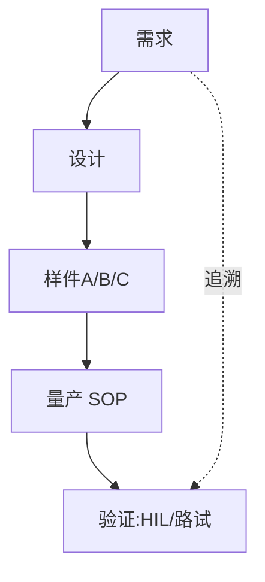

# BMS 进阶（十二）· BMS 产品工程

> 前面十一章都是**技术**。但 BMS 首先是一个**产品**——它要卖出去、过认证、能量产、不亏钱。`b01-b11` 讲的是"能不能做出来"，本章讲"做出来怎么变成能赚钱、能交付的产品"。面向想从工程师走向技术负责人/产品经理，或要和客户/供应商打交道的同学。

---

## 一、BMS 作为"产品"是什么

从价值链看，BMS 不是一个单点，而是一条链：

产品形态：
- **芯片级**：ADI/NXP/TI 卖 AFE+参考设计；
- **板级**：分立从控/主控板；
- **一体机**：集成式 BMS（小包/两轮常用）；
- **无线 BMS（wBMS）**：去掉线束，AFE 无线组网（见第九节）。

工程师常只见板级，但产品视角要看到整条链与毛利分布。

---

## 二、市场与场景分层

| 场景 | 典型需求 | 关键差异 |
| --- | --- | --- |
| EV 乘用车 | 高压 400/800V、ASIL-D、长寿 | 精度/安全极致、认证严 |
| 商用车/大巴 | 大电流、长寿命、工况恶劣 | 可靠性+维护 |
| 两轮/低速 | 低成本、小包 | 价格敏感、认证宽松 |
| 储能 ESS | 长寿命(10+年)、大容量、梯次 | 寿命+成本+安全 |
| 特种(船/工程机械/航空) | 极端环境、定制 | 高可靠+定制 |
| 消费(工具/3C) | 极小包 | 极致成本 |

**核心认知**：同一套算法，乘用车要 ASIL-D + 全认证，两轮可能只要基本保护——**产品定义决定了技术投入的天花板**。

---

## 三、需求工程

客户需求来自 OEM 的**规格书（Spec）**，典型条目：

- **电气**：电压范围、最大电流（持续/峰值）、通道数、均衡电流；
- **精度**：电压 ±X mV、电流 ±X %、SOC ±X %、温度 ±X ℃；
- **通信**：CAN/CAN-FD（帧定义）、GB/T 27930（充电）、可选以太网；
- **接口**：继电器驱动数量、加热输出、唤醒源；
- **环境**：温度/湿度/振动/EMC 等级；
- **寿命**：循环次数、日历寿命、失效率 PPM；
- **认证**：ISO 26262 ASIL、GB 38031、UN 38.3、IEC/UL 等。

**需求分解**：系统需求 → 硬件/软件/算法/测试需求，建**需求追踪矩阵（RTM）**，保证"每条需求都有设计对应、有测试覆盖"（双向追溯，认证必备）。

---

## 四、产品架构与平台化

- **平台化**：一套硬件+软件覆盖多车型/多电量。通过**配置参数**（通道数、电流量程、通信矩阵）变型，而非每项目重画板。
- **模块化**：主控+从控可裁剪（96 节用 8 片 AFE、120 节用 10 片）；软件用同一份代码 + 不同标定。
- **过度平台化的坑**：为了"全覆盖"堆冗余料号，单项目成本反而高。平台边界要划在"80% 项目共用"处。

---

## 五、成本结构与 BOM

- **成本构成**：MCU + AFE + SBC + 继电器/预充 + 被动元件 + 结构件 + NRE 摊销。
- **降本杠杆**（呼应 `b11` 第十四节）：国产替代 AFE/MCU、SBC 集成减元件、规模化摊薄、设计优化（少料号）。
- **报价逻辑**：硬件 BOM × 倍率 + 软件/认证摊销 + 毛利；大客户年降（每年降价几个点）要提前预留。
- **不可动的成本**：安全相关（继电器/隔离/绝缘）不能为了降本牺牲——认证过不了全白搭。

---

## 六、质量体系（车规）

车规量产绕不开的质量工具：

- **APQP（先期产品质量策划）**：五阶段（计划→产品设计→过程设计→验证→量产），里程碑 gate review。
- **PPAP（生产件批准）**：量产前向客户提交样件+文档，证明过程能力。
- **FMEA**：DFMEA（设计失效分析）+ PFMEA（过程失效分析），列失效模式/严酷度/探测度，算 RPN。
- **SPC / MSA**：统计过程控制 + 测量系统分析，保证产线稳定、测试设备可信。
- **与 `10-bms` 14.2 EOL 测试的衔接**：产线 EOL 是 PPAP 里"过程能力"的落地——每片板都过功能测试。

> 车规的潜规则：**文档和代码同等重要**。没有可追溯的 FMEA/RTM/测试报告，技术再好也拿不到定点。

---

## 七、开发流程与里程碑

经典 V 模型（呼应 `10-bms` 14.3）：

里程碑：Concept → A 样（功能演示）→ B 样（设计冻结）→ C 样（量产工艺）→ SOP（量产）。每阶段 gate review 不过不让进下一阶段。

---

## 八、竞品与行业格局

- **国际 Tier1**：Bosch、Continental、Denso、LG、三星 SDI（自制）、Tesla（深度自研）。
- **芯片**：ADI（isoSPI 标杆）、NXP、TI 三强；国产 AFE 崛起。
- **国内 BMS 厂**：宁德时代（自研+供货）、比亚迪（垂直整合）、均胜、亿纬、力高、华霆等。
- **技术路线对比**：集中式（低成本小包）vs 分布式（大包主流）vs 无线 BMS（降本减重）vs 云 BMS（数据驱动）。

---

## 九、技术趋势

- **无线 BMS（wBMS）**：AFE 无线组网（如 ADI wBMS），去掉菊花链线束 → 降本、减重、易维护、可在线监测每节，但可靠性和实时性要额外保证。
- **云 BMS / AI BMS**：云端聚合海量电池数据，做 SOH/RUL 预测（呼应 `b03`）、故障预警（呼应 `b06`）、梯次利用评估——把单车算法升级成群体智能。
- **电池护照 / 数字孪生**：每包全生命周期数据上链，支撑碳足迹/回收/保险。
- **CTC/CTB 集成**：电芯-包-车身一体化，BMS 与 pack 结构融合，采样更近、更省。
- **高压化（800V/1200V）**：对采样隔离、爬电间距（见 `b11`）、继电器提出更高要求。

---

## 十、产品定义实战要点（给工程师）

写一份 BMS 产品规格书的关键 KPI：
- **精度**：电压/电流/SOC/温度指标；
- **寿命**：循环/日历/失效率（PPM）；
- **成本**：目标 BOM 与售价；
- **认证**：必须过的法规清单；
- **不可妥协项**：与客户对齐的"红线"（如过充保护必须 ASIL-D）。

和客户对齐时，**先锁需求再开干**——需求一变，硬件返工、认证重来，代价是月级。

---

## 十一、常见坑（产品侧）

1. **需求没冻结就开干** → 反复返工，认证延期。
2. **平台化过度** → 单项目成本反而高，料号爆炸。
3. **国产替代未验证** → 量产翻车，批次性失效。
4. **认证规划滞后** → 技术做完才发现少做 EMC/ISO 26262 证据，上市延迟半年。
5. **只追功能忽略 DFM/DFT** → 板子能跑但难量产、难测试，良率低。
6. **忽视可维护性** → 现场故障无法诊断/升级，售后成本爆。

---

## 十二、面试要点

- **BMS 产品怎么平台化？** 一套 HW/SW + 配置参数变型，主控从控可裁剪，标定区分项目。
- **APQP/PPAP 是什么？** APQP 五阶段先期策划；PPAP 量产前样件批准，证明过程能力。
- **无线 BMS 优缺点？** 优点：去线束、降本减重、易维护；缺点：可靠性/实时性/干扰需额外保证。
- **怎么给客户做 BMS 方案？** 先读 Spec 拆需求→对标平台→算成本/认证→出方案+风险。
- **储能 vs 车用 BMS 差异？** 储能重寿命/成本/安全（10+年），车用重功率/ASIL/实时。
- **为什么文档和代码同等重要？** 车规认证要求需求-设计-测试双向追溯，缺文档拿不到定点。
