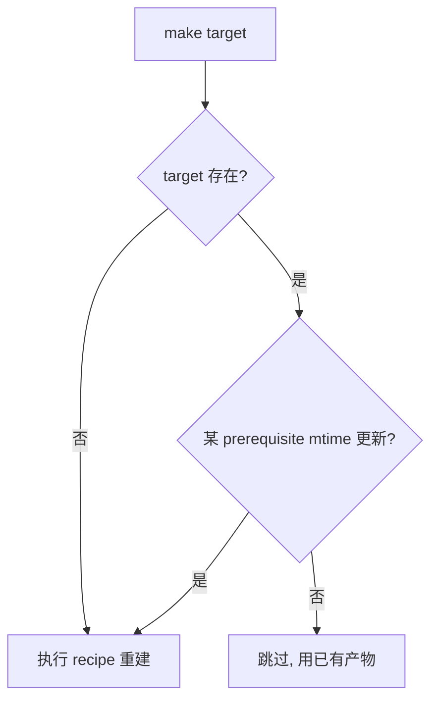

# Makefile 工程化全解：从规则原语到大型嵌入式构建

> 构建系统是整个软件工程的"地基"——它决定了"这份源码到底能不能稳定、可复现地变成那一份固件"。在嵌入式 / 车载领域，Make 依旧是压舱石级的构建引擎：它足够底层、足够可控、足够古老也足够可靠。本文把 Makefile 从"会用几行"讲到"能设计上千文件的大型交叉编译工程"，覆盖语法原语、增量原理、并行、自动依赖、递归 Make 的坑，以及一个可直接落地的 Cortex-M 实战 Makefile。

---

## 一、为什么 Make 仍是嵌入式构建的"压舱石"

在 CMake、Bazel、Ninja 满天飞的今天，为什么还要深学 Make？三个无法回避的理由：

1. **底层可控**：Make 是"规则引擎"，你可以精确控制每一个 `.o` 怎么来、链接顺序、后处理（objcopy/签名/CRC）在哪一步发生。对车规固件，这种可控性 = 可审计性。
2. **无处不在**：无数芯片厂商的 SDK（STM32Cube、NXP SDK、Zephyr 的部分构建、RT-Thread 的 scons 底层、Linux 内核 Kbuild）本质都是 Make 或类 Make 语法。读不懂 Makefile，就读不懂这些工程的构建。
3. **零依赖**：Make 几乎在任意 POSIX 环境都有，CI 容器、Yocto、交叉编译服务器上 `make` 一定在。它不挑平台、不挑 IDE。

> 生动类比：Make 像厨房里"按菜谱做菜"的规则本——`target`（菜）依赖 `prerequisites`（食材），`recipe`（步骤）告诉锅怎么动。时间戳就是"食材新鲜度"，只有食材变了才重做这道菜。

---

## 二、Makefile 的语法原语

### 2.1 规则（Rule）：一切的起点

```makefile
target: prerequisites
<TAB>recipe
```

- `target`：要生成的文件，或是一个"动作名"（伪目标）。
- `prerequisites`（前置条件）：生成 target 需要存在的文件 / 其他 target。
- `recipe`：**必须以 Tab 开头**（这是新手最常见的报错：`missing separator`）。它是一行行 shell 命令。

```makefile
# 最简单的规则：把 main.c 编译成 main.o
build/main.o: src/main.c inc/main.h
	@mkdir -p build
	$(CC) $(CFLAGS) -c src/main.c -o build/main.o
```

> 注意：`recipe` 每一行都在**独立的子 shell** 中执行（除非用 `\` 续行或设 `.ONESHELL`）。所以 `cd build && make` 这种跨行状态不会保留。

### 2.2 变量（Variable）与"风味"

Make 的变量有**两种展开时机**，这是 90% 诡异 bug 的来源：

| 赋值符 | 名称 | 展开时机 | 典型用途 |
|--------|------|----------|----------|
| `=` | 递归展开（recursive） | 使用时才展开（可能递归引用） | 跨文件引用、延迟求值 |
| `:=` | 简单展开（simple） | 定义时立即展开 | 避免递归、性能更好 |
| `?=` | 条件赋值 | 若未定义才赋值 | 允许用户/环境覆盖 |
| `+=` | 追加 | 按原风味追加 | 逐步累加 flags |

```makefile
# 递归展开：VALUE 在"被使用时"才求值，可引用后面才定义的变量
FOO = $(BAR)
BAR = hello
# 此时 $(FOO) -> "hello"

# 简单展开：定义时即固化，BAR 此刻还是空
FOO := $(BAR)
BAR = hello
# 此时 $(FOO) -> ""

# 条件赋值：命令行 make OPT=-O3 可覆盖
OPT ?= -O2

# 追加
CFLAGS := -Wall
CFLAGS += $(OPT)
# CFLAGS -> "-Wall -O2"
```

**工程纪律**：默认用 `:=`（简单展开），需要跨文件延迟引用时才用 `=`。`?=` 常用于"允许用户从命令行覆盖工具链前缀"。

### 2.3 自动变量（Automatic Variables）

这些是 Make 在每条规则执行时**自动填充**的变量，是写出"通用规则"的关键：

| 变量 | 含义 |
|------|------|
| `$@` | 当前规则的 target 名 |
| `$<` | 第一个 prerequisite |
| `$^` | 全部 prerequisites（**去重**） |
| `$+` | 全部 prerequisites（**不去重**） |
| `$?` | 比 target 新的 prerequisites |
| `$*` | 模式规则中 `%` 匹配到的主干名 |
| `$|` | order-only prerequisites（见 2.11） |
| `$(@D)` / `$(@F)` | `$@` 的目录部分 / 文件名部分 |

```makefile
# 用自动变量写出"通用编译规则"
build/%.o: src/%.c
	$(CC) $(CFLAGS) -c $< -o $@
# $< = src/foo.c, $@ = build/foo.o
```

### 2.4 模式规则（Pattern Rule）与静态模式（Static Pattern）

**模式规则**：用 `%` 通配，定义"某一类"目标怎么生成。

```makefile
# 任意 build/%.o 都从 src/%.c 来
build/%.o: src/%.c
	$(CC) $(CFLAGS) -c $< -o $@
```

**静态模式**：把一组已知目标套用同一个模式，比纯模式规则更"收敛"（不会误伤）。

```makefile
OBJS := build/main.o build/uart.o build/can.o
# 只对 $(OBJS) 里列出的目标应用该模式
$(OBJS): build/%.o: src/%.c
	$(CC) $(CFLAGS) -c $< -o $@
```

### 2.5 隐含规则（Implicit Rules）与函数

Make 内置了大量"隐含规则"，例如它**天生知道** `.c -> .o` 该怎么编。所以很多时候你只写：

```makefile
OBJS = main.o uart.o
app: $(OBJS)
	$(CC) $(OBJS) -o app
```

Make 会自动用隐含规则把 `main.o` 从 `main.c` 编出来。**坑**：隐含规则用的编译命令是 `$(CC) $(CFLAGS) $(CPPFLAGS) -c`，如果你的工程需要特殊 include 路径，必须确保这些变量已设好，否则隐含规则会"编错但不报错"。

### 2.6 文本 / 文件 / 流程函数

Make 自带一套函数，用 `$(fn,args)` 调用。工程里最高频的：

**字符串类**
```makefile
$(subst from,to,text)          # 字符替换
$(patsubst %.c,%.o,$(SRCS))    # 模式替换：把 a.c b.c -> a.o b.o
$(strip $(VAR))                # 去首尾空格、压缩内部空格
$(findstring s,text)           # 是否包含子串
$(filter %.c,$(FILES))         # 只保留匹配模式
$(filter-out %.h,$(FILES))     # 剔除匹配模式
$(sort list)                   # 排序 + 去重
$(word n,list) / $(words list) # 取第 n 个 / 总数
```

**文件名类**
```makefile
$(dir path) / $(notdir path)   # 目录 / 文件名
$(suffix f) / $(basename f)    # 后缀 / 去后缀
$(addsuffix .o,$(OBJS))        # 批量加后缀
$(addprefix build/,$(SRCS))    # 批量加前缀
$(wildcard src/*.c)            # 展开通配（注意：和 Shell 通配不同，这是 Make 层的）
$(realpath f) / $(abspath f)   # 绝对/规范路径
```

**流程类**
```makefile
$(foreach v,list,expr)         # 遍历，类似 map
$(if cond,then,else)           # 条件
$(call var,arg1,arg2)          # 调用"参数化变量"（类似函数）
$(shell cmd)                   # 调用 shell 并取 stdout
$(error text) / $(warning text) / $(info text)  # 报错/告警/信息
```

组合示例（工程常用）：
```makefile
SRCS := $(wildcard src/*.c)
OBJS := $(patsubst src/%.c,build/%.o,$(SRCS))
# 再用 $(OBJS) 作为链接输入
```

### 2.7 条件指令

```makefile
ifeq ($(DEBUG),1)
  CFLAGS += -g -O0
else
  CFLAGS += -O2 -DNDEBUG
endif

ifdef CROSS_COMPILE
  CC := $(CROSS_COMPILE)gcc
endif
```

> 易错点：`ifeq` 后面的括号里**不要有函数调用的副作用**；`ifeq ("a","b")` 与 `ifeq (a,b)` 等价，但引号是字面比较。

### 2.8 include 与自动依赖

```makefile
include common.mk
-include $(OBJS:.o=.d)   # 减号前缀：文件不存在也不报错（首次构建 .d 还没生成）
```

`.d` 文件是"自动生成的头文件依赖"（见第五节），Make 用它来决定"某 .c 改了哪个 .h，哪些 .o 要重编"。

### 2.9 特殊目标与伪目标

```makefile
.PHONY: all clean flash   # 声明这些不是文件，永远执行其 recipe
all: app

clean:
	rm -rf build app.elf app.bin

flash: app.bin
	openocd -f board.cfg -c "program $< verify reset exit"
```

常用特殊目标：
- `.PHONY`：防止"恰好有个叫 clean 的文件"导致 make clean 不执行。
- `.DEFAULT`：没有匹配规则时的兜底 recipe。
- `.DELETE_ON_ERROR`：recipe 失败时**删除**未完成的 target（避免留下半截文件骗过下次增量）。**强烈建议开启**。
- `.PRECIOUS`：构建中被中断也不要删的中间文件。
- `.NOTPARALLEL`：整个 Makefile 禁止并行（见第四节）。
- `.ONESHELL`：让一条规则里的多行 recipe 在同一个 shell 执行（便于 `cd` 后继续）。
- `.SECONDARY`：不要把中间文件当垃圾回收。

### 2.10 VPATH / vpath：源码不在当前目录时

```makefile
VPATH := src:../common/src   # Make 会去这些目录找 prerequisites
vpath %.c src:common          # 更精细：只对这些后缀用对应搜索路径
```

> 注意 `VPATH` 影响"寻找 prerequisites"，但 `$@`/`$<` 里**不会自动带路径**，实践中容易踩坑——更稳妥的是用 `$(wildcard ...)` 把源路径直接写全。

### 2.11 次序-only 依赖（Order-only Prerequisites）

普通 prerequisite 变了，target 就要重编；但有时你只要求"目录先存在"，目录时间戳变了（比如别人 `touch` 了它）**不该**触发重编。用 `|` 分隔：

```makefile
build/%.o: src/%.c | build
	$(CC) $(CFLAGS) -c $< -o $@

build:
	mkdir -p build
```

`build` 在 `|` 右边——它只要求"先建好"，自身变化不触发重编。

### 2.12 二次展开（Secondary Expansion）

默认前提是"首次读到规则时展开一次"。写 `.SECONDEXPANSION:` 后，含 `$$` 的部分会在**决定依赖的那一刻再展开一次**，能做更动态的依赖：

```makefile
.SECONDEXPANSION:
app: $$(objects)
objects = main.o uart.o
```

工程里较少手写，但理解它有助于读懂复杂 SDK 的 Makefile。

---

## 三、增量构建的底层原理：为什么"改一行要全编"？

Make 的增量判断极简单：**比较 target 与 prerequisites 的文件修改时间（mtime）**。

- 若 target 不存在 → 重建。
- 若任一 prerequisite 的 mtime **晚于** target → 重建。
- 否则 → 跳过。



**三大诡异现象的根因**：
1. **"我改了代码它不重编"**：通常是时钟回拨（虚拟机、NFS、解压旧包），prerequisite 的 mtime 反而比 target 旧。→ 用 `touch` 或 `make -B`（强制全编）救急。
2. **"改个注释也全编"**：因为链接阶段把"所有 .o"当 app 的 prerequisite，而 app 的 recipe 实际只链接，但时间戳逻辑上只要任一 .o 变就重链——这是对的，但如果你是"只改注释"，其实该 .o 也会重编（编译器认为源变了）。可通过 `make -n` 看它打算做什么。
3. **"头文件改了没重编"**：因为 Make 默认不知道 `.c` 依赖 `.h`！必须靠 `-MMD` 自动生成 `.d`（见第五节）。

> 冷知识：GNU Make 4.0+ 支持 `--hash`（用内容哈希而非 mtime 判断），对时钟问题免疫，但多数嵌入式环境还是老版本。

---

## 四、并行构建：make -j 与 jobserver

```bash
make -j8        # 最多 8 个 recipe 同时跑
make -j$(nproc) # 用满 CPU
```

并行能成，是因为 Make 会分析依赖图，只有"互不依赖"的规则才并发。但两个大坑：

**坑 1：规则内部 multi-line 不是原子的**
```makefile
# 危险！两行并发时可能交错，且第一行失败第二行仍跑
build:
	mkdir build
	echo x > build/f
```
→ 开 `.ONESHELL` 或用 `&&` 串成一行。

**坑 2：不安全的"并行友好"假设**
若两条规则都往同一个临时文件写，并行会互相踩。Make 只知道"文件级依赖"，不知道 recipe 内部在碰什么文件。
→ 用 `.NOTPARALLEL` 保护特定 target，或确保 recipe 各自写独立文件。

**jobserver（作业服务器）**：`make -j8` 时，父 Make 持有一个"令牌池"（8 个令牌），递归调用子 Make（`$(MAKE)`）会继承同一个池子——这样整棵构建树的并发总数被全局限制为 8，而不是每层都 8。**关键**：递归调用必须用 `$(MAKE)` 而不是硬编码 `make`，否则 jobserver 失效、并发爆炸。

```makefile
subdir:
	$(MAKE) -C libs      # 正确：继承 jobserver
#	make -C libs         # 错误：新建一个 8 并发池，总并发失控
```

---

## 五、自动依赖生成：让 .d 纳入决策

这是"头文件改了能重编"的命门。GCC/Clang 提供 `-MMD -MP`：

```makefile
build/%.o: src/%.c
	$(CC) $(CFLAGS) -MMD -MP -c $< -o $@
# -MMD : 生成 build/foo.d（列出 foo.o 依赖的所有 .h）
# -MP  : 为头文件也生成伪目标，防止头被删时报错
```

`foo.d` 内容形如：
```makefile
build/foo.o: src/foo.c inc/foo.h inc/bar.h
inc/foo.h:
inc/bar.h:
```
然后 Makefile 里 `include` 它们：
```makefile
-include $(OBJS:.o=.d)
```
这样 Make 在启动时就知道了 `.h` 依赖，头一改，对应 `.o` 自然重编。**这是专业嵌入式 Makefile 的标配**，缺了它增量构建就是"半残"。

---

## 六、递归 Make vs 非递归 Make

**递归 Make**（`make -C subdir`）：每个子目录一个 Makefile，顶层派发。
- 优点：目录自治、心智简单。
- 致命缺点：**依赖图被割裂**。顶层不知道子目录内部的依赖，无法做全局最优的并行与增量；改一个底层头文件，上层可能不重编。

**非递归 Make**（单一 Makefile + 多处 `include`）：
- 整个工程的依赖图是**一张完整的 DAG**，Make 能做全局正确的增量与并行。
- Linux 内核 Kbuild、多数现代工程 preferred。
- 缺点：Makefile 较大，需要 `include` 拆分模块。

> 工程建议：中型以上固件优先"单 Makefile + include 子模块 .mk"，把递归 Make 留给"独立第三方库"这种天然隔离的场景。

---

## 七、完整嵌入式交叉编译 Makefile 实战（Cortex-M4 + FPU）

下面是一份可直接用的工程 Makefile（GNU Arm Embedded Toolchain，`arm-none-eabi-`）：

```makefile
# ============ 工具链（?= 允许用户命令行覆盖） ============
CROSS_COMPILE ?= arm-none-eabi-
CC      := $(CROSS_COMPILE)gcc
OBJCOPY := $(CROSS_COMPILE)objcopy
SIZE    := $(CROSS_COMPILE)size
LD      := $(CROSS_COMPILE)gcc        # 用 gcc 驱动链接，自动带正确的 crt0/libs

# ============ 芯片与优化 ============
CPU    := -mcpu=cortex-m4 -mfloat-abi=hard -mfpu=fpv4-sp-d16
OPT    ?= -O2
DEBUG  ?= -g
CFLAGS := $(CPU) $(OPT) $(DEBUG) -Wall -Wextra -Werror=implicit-int \
          -ffunction-sections -fdata-sections -std=gnu11
LDFLAGS := $(CPU) -T link.ld -Wl,--gc-sections -Wl,-Map=build/app.map

# ============ 源与产物 ============
BUILD  := build
SRCS   := $(wildcard src/*.c) $(wildcard src/drv/*.c)
OBJS   := $(patsubst src/%.c,$(BUILD)/%.o,$(SRCS))
TARGET := $(BUILD)/app

.PHONY: all clean flash size
all: $(TARGET).bin

# 自动依赖 .d
-include $(OBJS:.o=.d)

# 模式规则：任意 .o 从对应 .c 编译，并生成 .d
$(BUILD)/%.o: src/%.c | $(BUILD)
	@mkdir -p $(dir $@)
	$(CC) $(CFLAGS) -MMD -MP -c $< -o $@

$(BUILD):
	mkdir -p $(BUILD)

# 链接成 ELF
$(TARGET).elf: $(OBJS)
	$(LD) $(OBJS) $(LDFLAGS) -o $@

# 后处理：ELF -> BIN；顺便 size 自检
%.bin: %.elf
	$(OBJCOPY) -O binary $< $@
	$(SIZE) $<

flash: $(TARGET).bin
	openocd -f board/stm32f4discovery.cfg -c "program $< verify reset exit"

clean:
	rm -rf $(BUILD)
```

要点回顾：
- `CROSS_COMPILE ?=` 一行改前缀即换编译器；
- `-ffunction-sections -fdata-sections` + `--gc-sections` 自动删死代码，固件更小；
- `-MMD -MP` + `-include .d` 让头文件改动正确触发增量；
- `order-only` `| $(BUILD)` 保证目录先建好但不触发重编；
- `size` 在每次出 bin 时自动跑，溢出早知道。

---

## 八、调试 Makefile 的六大武器

| 命令 | 作用 |
|------|------|
| `make -n` / `--dry-run` | 只打印准备执行的命令，不真跑——排查"它会做什么"首选 |
| `make -p` | 打印完整规则库（含隐含规则、变量终值）——看变量到底展开成啥 |
| `make -d` | 海量调试信息（为什么重编/跳过）——信息过载但有答案 |
| `make --trace` | 执行到每条规则时打印（GNU Make 4.0+）——比 `-d` 清爽 |
| `make --warn-undefined-variables` | 用了未定义变量就告警——抓拼写错 |
| `$(info x=$(x))` / `$(warning ...)` / `$(error ...)` | 在 Makefile 里插桩打印 |

```bash
make --trace all          # 看每条规则触发情况
make -p 2>/dev/null | grep CFLAGS   # 看 CFLAGS 最终值
make --warn-undefined-variables     # 揪出打错的变量名
```

---

## 九、Make 的局限与替代

Make 不是银弹，它的短板：
- 依赖图靠"文件名 + 时间戳"，对"生成代码""配置变化"支持弱；
- 跨平台（尤其 Windows）体验差，路径/Shell 差异大；
- 大型工程依赖图管理繁琐，递归 Make 又会割裂。

于是有了：
- **Ninja**：Make 的"快替代品"，规则更精简、增量解析快，但人类不直接写 Ninja，而是 CMake 生成它；
- **CMake**：元构建，生成 Makefile 或 Ninja，解决跨平台与依赖管理（见 m03）；
- **Bazel/Buck**：彻底重新设计，基于内容哈希的封闭世界构建，可复现性最强，但迁移成本高。

> 现实：很多工程是 **CMake 生成 Ninja/Makefile，再交给底层引擎**。所以"懂 Make"是读懂这一切的底层能力。

---

## 十、常见坑与对策

1. **`missing separator`**：recipe 没用 Tab 开头（被编辑器换成了空格）。→ 用真实 Tab；或 `grep -nP '\t' Makefile` 自查。
2. **`clean` 不执行**：目录里恰好有个叫 `clean` 的文件。→ 加 `.PHONY: clean`。
3. **头文件改了不重编**：没引入 `.d`。→ 加 `-MMD -MP` + `-include`。
4. **并行下偶发失败**：recipe 内部有共享临时文件/状态。→ `.ONESHELL` 或 `.NOTPARALLEL` 保护。
5. **`make -C` 并发爆炸**：硬编码 `make` 而非 `$(MAKE)`。→ 永远用 `$(MAKE)`。
6. **变量展开诡异**：混用 `=` 与 `:=`。→ 默认 `:=`，需要延迟才 `=`。
7. **`*** recipe commences before first target`**：规则写在了变量/条件之外、格式错位。→ 检查 Tab 与缩进。
8. **增量失效（时钟问题）**：NFS/虚拟机时钟回拨。→ `make -B` 强制，或升级支持 `--hash`。

---

## 十一、面试题精选（含要点）

**Q1：Make 怎么判断要不要重编一个目标？**
A：比较 target 与各 prerequisite 的 mtime；任一 prerequisite 更新则重编，否则跳过；不存在则必编。可引申到 `--hash` 用内容哈希。

**Q2：增量构建为什么"改了头文件却没重编"，怎么根治？**
A：Make 默认不知道 `.c` 依赖 `.h`；用编译器 `-MMD -MP` 生成 `.d` 依赖文件，`-include` 进 Makefile，使其参与依赖决策。

**Q3：`=` 和 `:=` 的区别？**
A：`=` 递归展开（使用时求值，可后向引用），`:=` 简单展开（定义时固化）。默认推荐 `:=` 避免递归与性能问题。

**Q4：`$@ $< $^` 是什么？**
A：自动变量，分别代表当前 target、首个 prerequisite、全部 prerequisites（去重）。是写通用模式规则的核心。

**Q5：并行构建的 jobserver 是什么？为什么递归 Make 用 `$(MAKE)` 而非 `make`？**
A：jobserver 是一个全局令牌池，限制整棵构建树的并发总数。`$(MAKE)` 会继承父 Make 的 jobserver 与 `-j` 设置；硬编码 `make` 会新建池子导致并发失控。

**Q6：递归 Make 和非递归 Make 各有什么问题/优势？**
A：递归简单但割裂依赖图、增量/并行不全局最优；非递归（单 Makefile + include）依赖图完整、可全局优化，是现代大型工程首选。

---

## 结语

Makefile 是一门"又老又小却极深"的语言。把它吃透，你会发现 CMake、Kbuild、乃至各种 CI 构建脚本背后的逻辑都是同一套"规则—依赖—增量"思想。在嵌入式 / 车载固件这种"每一个字节都要可控、可复现、可审计"的领域，手写一份干净、可并行、依赖正确的 Makefile，是资深工程师的基本功。下一篇（m02）我们把视角下沉到"编译器本身"——它究竟把你的 C 代码变成了什么。
