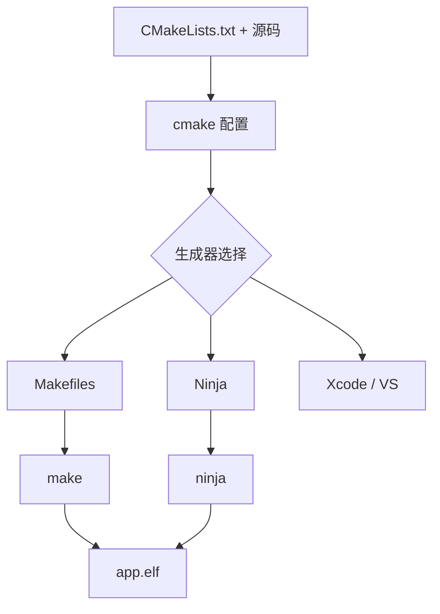

# CMake 现代实践：从"全局变量地狱"到 target-based 工程

> 在 `m01` 里我们手写 Makefile；在大工程里，手写 Make 的依赖图管理会变成噩梦。CMake 的出现就是为了解决这个问题：它**不是构建系统本身**，而是"元构建系统（meta-build）"——你用一套跨平台的 `CMakeLists.txt` 描述工程，它替你生成 Makefile、Ninja、Xcode 或 Visual Studio 工程。本文聚焦"现代 CMake"（3.15+ 风格）：target-based 思想、生成器表达式、交叉编译 toolchain、Presets、嵌入式实战，以及那些让老手也翻车的反模式。

---

## 一、CMake 是什么，不是什么



- CMake **生成**构建文件，真正的编译由 `make`/`ninja` 完成（呼应 `m01`）。
- 现代 CMake 的核心范式转变：**从"全局变量 + 命令式设置"转向"以 target 为中心、声明使用要求（usage requirements）"**。
- 老教程里满屏的 `include_directories()`、`link_directories()`、`add_compile_options()` 是**反模式**，会让依赖关系"隐式且全局污染"。

```bash
# 典型工作流（out-of-source 构建，永远别在源码目录里 cmake）
mkdir -p build && cd build
cmake -DCMAKE_BUILD_TYPE=Release -DCMAKE_TOOLCHAIN_FILE=../arm-gcc.cmake ..
cmake --build . -j8
```

---

## 二、CMake 语言与执行模型

### 2.1 变量、作用域、缓存

```cmake
set(SRC main.c)                 # 普通变量（当前作用域）
set(SRC main.c PARENT_SCOPE)    # 向上一层作用域设
set(CACHEVAR "x" CACHE STRING "说明")  # 缓存变量（写入 CMakeCache.txt，可 -D 覆盖）
option(BUILD_TESTS "是否编测试" ON)     # 缓存的 ON/OFF，等价于 BOOL 缓存变量
```

**作用域规则**：
- `function()` 内 `set()` 只在该函数内可见（除非 `PARENT_SCOPE`）。
- `macro()` 是**文本替换**，没有独立作用域（易踩坑，优先用 `function`）。
- `add_subdirectory()` 进入子目录会有新的目录作用域。
- 缓存变量（`CACHE`）全局且持久，命令行 `-DVAR=...` 优先级最高。

### 2.2 列表与字符串

CMake 的"列表"就是**分号分隔的字符串**：`set(L a;b;c)` 与 `set(L a b c)` 等价。

```cmake
list(APPEND SRCS a.c b.c)       # 追加
list(LENGTH SRCS n)
list(GET SRCS 0 first)
string(TOUPPER ${x} X)
```

### 2.3 流程控制

```cmake
if(DEFINED VAR)
elseif(VAR STREQUAL "x")
elseif(VAR VERSION_GREATER "1.2")
endif()

foreach(f ${SRCS})
  message(STATUS "source: ${f}")
endforeach()

while(...)
endwhile()
```

### 2.4 function vs macro

```cmake
function(my_func arg)   # 有作用域，参数按值传入，推荐
  set(local ${arg})
endfunction()

macro(my_macro arg)     # 文本替换，无作用域，变量泄漏到调用处，慎用
  set(x ${arg})
endmacro()
```

---

## 三、现代 CMake 核心：target-based

这是 CMake 的"灵魂"。每个 `target`（可执行/库）自带属性，依赖通过 `target_link_libraries` 表达，**使用要求自动传递**。

```cmake
# 1) 定义库与目标
add_library(hal STATIC hal_uart.c hal_can.c)
add_library(app_lib STATIC app_logic.c)
add_executable(firmware main.c)

# 2) 包含路径：PUBLIC 表示"我自己用 + 依赖我的人也要用"
target_include_directories(hal
    PUBLIC  ${CMAKE_CURRENT_SOURCE_DIR}/inc
    PRIVATE ${CMAKE_CURRENT_SOURCE_DIR}/src)

# 3) 编译定义与选项
target_compile_definitions(hal PUBLIC USE_DMA=1)
target_compile_options(hal PRIVATE -Wall -Wextra)

# 4) 链接：PUBLIC 传递 / PRIVATE 仅自己 / INTERFACE 仅传递
target_link_libraries(app_lib
    PUBLIC  hal          # app_lib 用 hal，且用 app_lib 的人也获得 hal
    PRIVATE utils)       # 仅 app_lib 自己链接 utils
target_link_libraries(firmware PRIVATE app_lib)
```

**三种可见性语义（极其重要）**：

| 关键字 | 含义 |
|--------|------|
| `PRIVATE` | 只作用于当前 target |
| `PUBLIC` | 作用于当前 target **且传递给依赖它的人** |
| `INTERFACE` | 只传递给依赖它的人（当前 target 本身不用，常用于 header-only 库） |

> 生动类比：库像一间工厂。`PUBLIC` 是把原料和成品都对外开放；`PRIVATE` 是只给自己车间用；`INTERFACE` 是"我不生产，但我的客户需要这份图纸"。乱用 `PUBLIC` 会污染依赖链，乱用 `PRIVATE` 会让下游编译不过。

**为什么 `target_include_directories` 优于全局 `include_directories`？**
全局版会污染所有 target（包括第三方），且无法表达"谁需要谁"。target 版精确、可组合、可传递，是现代 CMake 的基石。

---

## 四、生成器表达式（Generator Expressions）

`$<...>` 形式的表达式在**生成构建系统时**才求值，用于"按配置/平台/语言精细控制"，是写出干净跨平台工程的利器。

```cmake
target_compile_options(firmware PRIVATE
    $<$<CONFIG:Debug>:-O0 -g>
    $<$<CONFIG:Release>:-O2 -DNDEBUG>
    $<$<PLATFORM_ID:Linux>:-pthread>
    $<$<C_COMPILER_ID:GNU>:-Wall -Wextra>
    $<$<COMPILE_LANGUAGE:CXX>:-std=c++17>
    $<$<BOOL:${USE_ASAN}>:-fsanitize=address>)
```

常见表达式：
- `$<CONFIG:Debug>` / `$<CONFIG:Release>`：按构建类型。
- `$<PLATFORM_ID:...>` / `$<C_COMPILER_ID:...>`：按平台/编译器。
- `$<COMPILE_LANGUAGE:C>`：按源文件语言。
- `$<IF:cond,true,false>` / `$<BOOL:var>` / `$<STREQUAL:a,b>`：条件。
- `$<TARGET_PROPERTY:tgt,prop>`：取某 target 的属性。

---

## 五、find_package 与依赖管理

找第三方库有两种模式：

**Module 模式**：CMake 自带或从 `CMAKE_MODULE_PATH` 找 `FindXXX.cmake`（用 `find_library`/`find_path` 探测）。
```cmake
find_package(Threads REQUIRED)        # 自带 FindThreads
target_link_libraries(app PRIVATE Threads::Threads)
```

**Config 模式**：库自己提供了 `<Package>Config.cmake` + `<Package>Targets.cmake`（导出目标，如 `Boost::system`）。
```cmake
find_package(Boost 1.71 REQUIRED COMPONENTS system)
target_link_libraries(app PRIVATE Boost::system)
```

自己写 `FindXXX.cmake` 片段：
```cmake
find_path(MYLIB_INCLUDE_DIR mylib.h PATH_SUFFIXES mylib)
find_library(MYLIB_LIBRARY NAMES mylib)
include(FindPackageHandleStandardArgs)
find_package_handle_standard_args(MYLIB REQUIRED_VARS MYLIB_LIBRARY MYLIB_INCLUDE_DIR)
if(MYLIB_FOUND)
  add_library(MYLIB::mylib UNKNOWN IMPORTED)
  set_target_properties(MYLIB::mylib PROPERTIES
      IMPORTED_LOCATION ${MYLIB_LIBRARY}
      INTERFACE_INCLUDE_DIRECTORIES ${MYLIB_INCLUDE_DIR})
endif()
```

**第三方源码管理三选一**：
- `FetchContent`：配置时下载并 `add_subdirectory`，像用本地代码（现代首选）。
- `ExternalProject`：构建时才拉取编译（适合大型/需独立构建的库）。
- `find_package`：库已装在系统 / sysroot。

---

## 六、交叉编译：toolchain file

交叉编译**绝不要**在命令行硬敲一堆 `-DCMAKE_C_COMPILER=...`，而是写一份 **toolchain file**，被 `CMAKE_TOOLCHAIN_FILE` 引用。

```cmake
# arm-gcc.cmake —— ARM Cortex-M 裸机工具链
set(CMAKE_SYSTEM_NAME Generic)        # 告诉 CMake：没有 OS
set(CMAKE_SYSTEM_PROCESSOR arm)

# 指定编译器（必须绝对路径或 PATH 可达）
set(CMAKE_C_COMPILER   arm-none-eabi-gcc)
set(CMAKE_CXX_COMPILER arm-none-eabi-g++)
set(CMAKE_ASM_COMPILER arm-none-eabi-gcc)
set(CMAKE_OBJCOPY      arm-none-eabi-objcopy)
set(CMAKE_SIZE         arm-none-eabi-size)

# 编译/链接标志
set(CPU_FLAGS "-mcpu=cortex-m4 -mfloat-abi=hard -mfpu=fpv4-sp-d16")
set(CMAKE_C_FLAGS_INIT   "${CPU_FLAGS} -Wall -Wextra")
set(CMAKE_CXX_FLAGS_INIT "${CPU_FLAGS} -Wall -Wextra -fno-rtti")
set(CMAKE_EXE_LINKER_FLAGS_INIT "${CPU_FLAGS} -T${CMAKE_SOURCE_DIR}/link.ld -Wl,--gc-sections -Wl,-Map=firmware.map")

# 关键：交叉编译下不要去 host 找库/头
set(CMAKE_FIND_ROOT_PATH_MODE_PROGRAM NEVER)   # 工具链程序从 host 找
set(CMAKE_FIND_ROOT_PATH_MODE_LIBRARY ONLY)    # 库只在 sysroot 找
set(CMAKE_FIND_ROOT_PATH_MODE_INCLUDE ONLY)    # 头只在 sysroot 找

# 避免交叉编译时 try_run 卡死（无法在 host 跑目标程序）
set(CMAKE_TRY_COMPILE_TARGET_TYPE STATIC_LIBRARY)
```

> 为什么用 `CMAKE_*_FLAGS_INIT` 而不是 `set(CMAKE_C_FLAGS ...)`？`INIT` 版本会在 CMake 内部默认值之后、用户 `-D` 之前插入，既不被覆盖也不覆盖用户设置，是最优雅的注入点。

调用：
```bash
cmake -DCMAKE_TOOLCHAIN_FILE=arm-gcc.cmake -DCMAKE_BUILD_TYPE=Release ..
```

---

## 七、构建类型与 Presets

```cmake
if(NOT CMAKE_BUILD_TYPE AND NOT CMAKE_CONFIGURATION_TYPES)
  set(CMAKE_BUILD_TYPE Release CACHE STRING "Build type" FORCE)
endif()
set(CMAKE_CONFIGURATION_TYPES "Debug;Release;RelWithDebInfo;MinSizeRel" CACHE STRING "" FORCE)
```

现代更推荐 **`CMakePresets.json`**，把"怎么配置/构建/测试"固化成可共享的预设：

```json
{
  "version": 6,
  "cmakeMinimumRequired": { "major": 3, "minor": 21 },
  "configurePresets": [
    {
      "name": "arm-debug",
      "displayName": "ARM Cortex-M Debug",
      "toolchainFile": "arm-gcc.cmake",
      "cacheVariables": { "CMAKE_BUILD_TYPE": "Debug" }
    },
    {
      "name": "arm-release",
      "inherits": "arm-debug",
      "cacheVariables": { "CMAKE_BUILD_TYPE": "Release" }
    }
  ],
  "buildPresets": [
    { "name": "debug", "configurePreset": "arm-debug", "jobs": 8 }
  ]
}
```

```bash
cmake --preset arm-release
cmake --build --preset debug
```

Presets 优于"命令行参数记忆"：新人 clone 下来直接 `--preset`，无需猜 `-D` 一长串。

---

## 八、生成器：Makefiles vs Ninja

- **Unix Makefiles**：默认、通用，但大工程增量解析慢、并行调度一般。
- **Ninja**：CMake 生成 Ninja 后，`ninja` 启动/增量极快（适合 CI 与巨量文件）。**推荐用于日常与 CI**。
- **Ninja Multi-Config**：一次配置支持多构建类型切换，免去反复重配置。

```bash
cmake -G Ninja -DCMAKE_TOOLCHAIN_FILE=arm-gcc.cmake ..
ninja
```

---

## 九、自定义构建步骤（代码生成 / 后处理）

嵌入式离不开"编完 ELF 再出 bin、算 CRC、注入版本"。CMake 用 `add_custom_command` / `add_custom_target`：

```cmake
# POST_BUILD：链接后立刻出 bin + size 自检
add_custom_command(TARGET firmware POST_BUILD
    COMMAND ${CMAKE_OBJCOPY} -O binary $<TARGET_FILE:firmware> firmware.bin
    COMMAND ${CMAKE_SIZE} $<TARGET_FILE:firmware>
    COMMENT "Generating firmware.bin")

# 代码生成：先由一个 Python 脚本从 DBC 生成 can_signals.c（呼应 07 的 codegen）
add_custom_command(
    OUTPUT ${GEN_DIR}/can_signals.c
    COMMAND python ${CMAKE_SOURCE_DIR}/gen_can.py ${DBC} ${GEN_DIR}/can_signals.c
    DEPENDS ${DBC} gen_can.py
    COMMENT "Generating CAN signals from DBC")
add_custom_target(gen_can DEPENDS ${GEN_DIR}/can_signals.c)
# 让 firmware 依赖生成物
target_sources(firmware PRIVATE ${GEN_DIR}/can_signals.c)
```

要点：`OUTPUT`/`DEPENDS` 让 CMake 把"生成物"纳入依赖图，做到真正增量（DBC 没变就不重生成）。

---

## 十、测试（CTest）与打包（CPack）

```cmake
enable_testing()
add_test(NAME unit_bms_soc COMMAND ./tests/test_soc)
set_tests_properties(unit_bms_soc PROPERTIES TIMEOUT 30)

# 打包固件 release（如 zip 包含 bin/map/版本说明）
set(CPACK_GENERATOR "ZIP")
set(CPACK_PACKAGE_NAME "bms-firmware")
include(CPack)
```

```bash
ctest --output-on-failure     # 跑测试
cpack                          # 出包
```

---

## 十一、安装与导出（让别人 find_package 你）

```cmake
install(TARGETS hal
    ARCHIVE DESTINATION lib
    PUBLIC_HEADER DESTINATION include)
install(EXPORT hal-targets
    FILE hal-targets.cmake
    NAMESPACE hal::
    DESTINATION lib/cmake/hal)
```

导出后，别人 `find_package(hal)` 就能拿到 `hal::hal` 导入目标——这正是现代 CMake 依赖复用的标准姿势。

---

## 十二、策略（policy）与版本

```cmake
cmake_minimum_required(VERSION 3.21)
# 新行为由 policy 控制，例如 CMP0074 让 XXX_ROOT 变量生效
if(POLICY CMP0074)
  cmake_policy(SET CMP0074 NEW)
endif()
```

`cmake_minimum_required` 不仅设定最低版本，还会**默认把该版本之前的 policy 设为 OLD**。升版本往往是为了拿到新的、更安全的行为（如 `CMP0025` 区分编译器与语言标准）。别为了"兼容老环境"一味压低版本号。

---

## 十三、嵌入式专项实战：Cortex-M 工程结构

```
project/
├── arm-gcc.cmake        # 工具链
├── CMakeLists.txt       # 顶层
├── link.ld              # 链接脚本
├── app/  (main.c)
├── hal/  (hal_uart.c, hal_can.c, inc/)
├── mcal/ (生成的 MCAL 代码)
└── 3rdparty/ (CMSIS, 第三方)
```

顶层 `CMakeLists.txt`：
```cmake
cmake_minimum_required(VERSION 3.21)
project(bms_firmware C CXX ASM)

# 全局标准
set(CMAKE_C_STANDARD 11)
set(CMAKE_C_STANDARD_REQUIRED ON)

add_subdirectory(hal)
add_subdirectory(app)

add_executable(firmware app/main.c)
target_link_libraries(firmware PRIVATE hal)

# 链接脚本通过 toolchain 的 EXE_LINKER_FLAGS_INIT 已注入 -Tlink.ld
# 后处理：出 bin + size
add_custom_command(TARGET firmware POST_BUILD
    COMMAND ${CMAKE_OBJCOPY} -O binary $<TARGET_FILE:firmware> firmware.bin
    COMMAND ${CMAKE_SIZE} $<TARGET_FILE:firmware>)
```

`hal/CMakeLists.txt`：
```cmake
add_library(hal STATIC hal_uart.c hal_can.c startup.c)
target_include_directories(hal PUBLIC inc)
target_compile_definitions(hal PUBLIC HAL_USE_DMA)
# 把 startup/向量表放进特定段（呼应 m02 的 section 属性）
set_source_files_properties(startup.c PROPERTIES COMPILE_DEFINITIONS "_VECTOR_TABLE")
```

> 与 `06`/`m01` 呼应：链接脚本、`.data/.bss` 搬运、向量表布局在 `06` 已深挖；CMake 负责"把对的东西按对的顺序交给链接器"，链接器再按 `link.ld` 落位。

---

## 十四、常见反模式与坑

1. **`file(GLOB src *.c)`**：GLOB 在**配置时**展开，新增文件不会触发重配置，导致"漏编"。→ 真实工程显式列出源文件（或用 `CONFIGURE_DEPENDS` 但仍有局限）。
2. **全局 `include_directories()` / `link_directories()`**：污染所有 target。→ 一律用 `target_*` 系列。
3. **`target_link_libraries` 漏写 `PUBLIC/PRIVATE`**：旧语法默认 `PUBLIC`，依赖传递失控。→ 现代 CMake **必须显式写**。
4. **链接顺序错**：静态库顺序影响符号解析（被依赖的库放后面）。→ 用 `target_link_libraries` 让 CMake 推导顺序，避免手写 `-l` 顺序。
5. **缓存变量被环境"骗"**：`CC` 环境变量会覆盖 `CMAKE_C_COMPILER`，导致用的不是预期编译器。→ 交叉编译时在 toolchain 里 `set(... CACHE FORCE)` 或用 `-D` 显式。
6. **多配置生成器下 `CMAKE_BUILD_TYPE` 无效**：Ninja Multi-Config / VS / Xcode 用 `--config`。→ 用 Presets 的 `configuration` 字段。
7. **`add_custom_command` 没列 `BYPRODUCTS`/`DEPENDS`**：Ninja 可能因为"输出文件未在依赖图中"而误判。→ 写全 `OUTPUT`/`DEPENDS`。
8. **在源目录里 `cmake .`**：污染源码树。→ 永远 out-of-source（`build/`）。

---

## 十五、面试题精选（含要点）

**Q1：现代 CMake 和传统"全局变量"写法最大区别？**
A：现代以 target 为中心，用 `target_include_directories/compile_definitions/link_libraries` 的 `PUBLIC/PRIVATE/INTERFACE` 表达精确且可传递的"使用要求"；传统 `include_directories()` 等全局污染、不可组合。

**Q2：`PUBLIC`/`PRIVATE`/`INTERFACE` 的区别？**
A：`PRIVATE` 仅当前 target；`PUBLIC` 当前+传递下游；`INTERFACE` 仅传递（自身不用，常用于 header-only 库）。

**Q3：交叉编译为什么用 toolchain file 而不是命令行硬传？**
A：toolchain file 把编译器、sysroot、CPU flags、find 模式（ONLY/BOTH）一次性固化、可复用、可版本管理；命令行一长串易错难共享。且 `CMAKE_FIND_ROOT_PATH_MODE_*` 能避免误用 host 的库/头。

**Q4：CMake 和 Make/Ninja 什么关系？**
A：CMake 是元构建，生成 Makefile/Ninja 等；真正编译由 `make`/`ninja` 完成（呼应 m01）。

**Q5：`file(GLOB)` 为什么是反模式？**
A：GLOB 在配置时展开，新增源文件不触发重配置会漏编；应显式列出源或谨慎用 `CONFIGURE_DEPENDS`。

**Q6：什么是生成器表达式，解决什么问题？**
A：`$<...>` 在生成构建系统时求值，用于按配置/平台/编译器/语言精细控制 flags，避免写一堆 `if()` 分支重复 target。

---

## 结语

CMake 把"成百上千文件的依赖组织、跨平台、交叉编译"从手工苦力变成了声明式描述。掌握 target-based 思维与 toolchain/Presets，你会发现它和手写 Makefile（m01）是同一件事的两种表述——底层都是"规则—依赖—增量"。而当我们把构建规模再放大一个数量级（如整车 ECU 的超大型 C/C++ 代码库、CI 全量构建动辄几十分钟），单机 `-j` 就不够了，这就引出了 `m04` 的 eMake 分布式并行构建加速。
