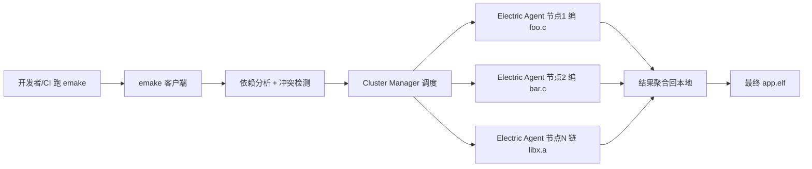
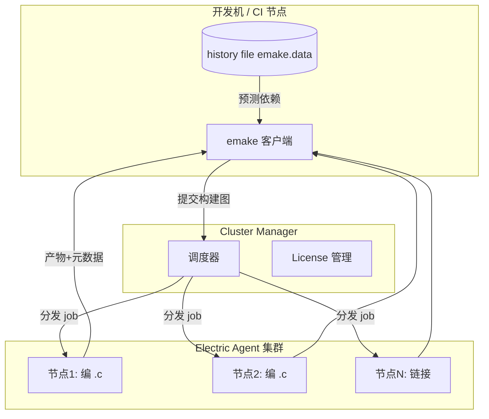

# eMake（Electric Make / CloudBees Accelerator）深度：分布式并行构建的工程化加速

> 在 `m01` 我们学了 Make，`m03` 学了 CMake。但当工程膨胀到**数万文件、全量构建 30 分钟以上**，光靠单机 `make -j$(nproc)` 已经触到天花板——你的笔记本再快也就那几个核。这时就需要把构建**分发到集群**。本文聚焦 **eMake（Electric Make，CloudBees Accelerator 的构建引擎）**：它是一个对 GNU Make 几乎透明的"分布式并行"替代品，能把大型 C/C++ 构建加速 5～20 倍。同时我们厘清"eMake"这个词的歧义，并把它和 distcc / ccache / IncrediBuild / Bazel 放到一张对比图上。

---

## 一、构建慢，是研发效能的头号杀手

先算一笔账（典型大型 C/C++ 工程）：

| 场景 | 单机全量 | 影响 |
|------|----------|------|
| 游戏引擎 / 浏览器 / 车载 ECU 大代码库 | 30～90 min | 开发者改一行要干等；CI 排队几小时 |
| 增量构建（改 1 文件） | 2～10 min | 频繁打断心流 |
| CI 全量门禁 | 占满构建节点 | 提交即排队，反馈延迟 |

> 痛点本质：**构建是高度可并行的计算（每个 `.c` 独立编译），却被"单机核数"和"Makefile 依赖图的保守性"双重限制**。eMake 正是为打破这个限制而生。

---

## 二、eMake 是什么

- **eMake = Electric Make**，是 **CloudBees Accelerator**（前身 Electric Cloud）的核心构建引擎。
- 定位：**对 GNU Make 的"兼容 + 分布式加速"替换**——你几乎不用改现有 Makefile，把它从 `make` 换成 `emake`，构建就被分发到集群。
- 适用对象：超大型 **C / C++** 代码库（游戏引擎、Chromium 类浏览器、电信/车载 ECU 的巨型固件与 Host 侧软件栈、HIL 测试软件）。
- 不适用：小型 MCU 固件（交叉编译的小工程，分布式开销 > 收益，见第九节）。



---

## 三、为什么需要"分布式 + 冲突安全"

普通 Makefile 之所以不能无脑并行，是因为它依赖"文件名 + 时间戳"，并不知道 recipe 内部在碰哪些文件。两条 recipe 若都偷偷写同一个中间文件，并发就会互相踩，结果不确定。

eMake 解决这个问题的核心不是"让 Makefile 作者把所有文件依赖都写对"（那几乎不可能），而是**在运行时监控真实的文件系统访问**，安全地处理冲突：

1. **冲突检测（Conflict Detection）**：emake 在并行执行各 job 时，记录它们"读了谁、写了谁"。若发现 job A 读了某文件、job B 同时要写它（或反之），就判定为冲突，把 B 回滚重跑（串行化），保证最终结果与"严格串行"一致。
2. **History File（历史文件，如 `emake.data`）**：记录每次构建中每个 job 的真实文件访问。下次构建时，emake 用历史**预测**依赖，提前避免已知冲突，减少回滚次数，构建越来越快（"学习效应"）。
3. **Agent 集群执行**：通过 Cluster Manager 把 job 分发到多台 Electric Agent 机器（往往几十到上百核），突破单机核数上限。
4. **结果聚合**：各 agent 的产物与元数据汇总回发起端，得到和普通 `make` 完全一致的产物。

> 生动类比：普通 `make -j` 像一个人同时炒好几盘菜，但怕两盘菜抢同一个锅；eMake 像把菜分给一个后厨团队，有个"调度员"盯着谁动了哪个锅，冲突的菜就让人重做一盘，最后拼成一桌一致的宴席。

---

## 四、与 GNU Make 的兼容性

这是 eMake 最大的卖点——**透明替换**：

- 直接吃现有的 GNU Makefile（`make` 能编的，`emake` 基本也能编）。
- 实现 GNU Make 的语义，包括大部分扩展（模式规则、自动变量、函数、条件等）。
- 兼容 GNU Make 的命令行选项：`-j`、`-f`、`-C`、`-k`、`-p` 等大部分照常工作。
- 通过 **emake 专属指令/注释** 与命令行选项开启加速能力，不破坏原有 Makefile 语义。

```bash
# 以前
make -j8 all
# 现在（分布式加速），Makefile 一行都不用改
emake -j 200 all
```

> 注意：`-j` 在 emake 里含义扩展为"可申请的并发 job 上限"（受集群 agent 数约束），不是单机核数。

eMake 特有能力的注入方式：
- 命令行 `--emake-*` 选项；
- Makefile 中用特殊注释（emake annotation / emake 指令）标注"哪些文件是安全的并行共享"等提示，进一步减少冲突回滚。

---

## 五、架构：客户端 + Cluster Manager + Agent



- **emake 客户端**：你运行的 `emake`，负责解析 Makefile、依赖分析、冲突检测、结果聚合。
- **Cluster Manager**：管理 Agent 资源池、调度、License。
- **Electric Agent**：实际执行编译/链接的 worker 节点。
- **History File**：本地或共享的"学习记录"，跨构建复用。
- **Build Cache（可选）**：缓存 job 结果，命中则直接复用（与下面 ccache 思想类似，但集成在 emake 体系内）。

---

## 六、命令行与配置要点

```bash
# 基本替换
emake -j 200 all

# 常用 --emake-* 选项（示意，具体以所用版本文档为准）
emake --emake-machinefile=agents.txt \     # 指定 agent 列表
      --emake-maxagents=50 \               # 最大并发 agent 数
      --emake-historyfile=emake.data \     # 历史文件（学习效应）
      --emake-jobcache \                   # 开启 job 缓存
      --emake-debug=1 \                    # 调试
      --emake-annodetail=full \            # annotation 详细度
      -j 200 all

# 生成标注文件 emake.xml，用于性能分析
emake --emake-annodetail=build emake.xml -j 200 all
```

**emake.xml（annotation）**：记录每个 job 的耗时、在哪个 agent 上跑、为何被回滚（冲突）、关键路径。这是定位"构建瓶颈"的黄金资料——哪一步最慢、哪个 job 一直在冲突回滚，一目了然。

---

## 七、与 CI 集成


- 在 Jenkins / GitLab CI 里，把"构建步骤"从 `make` 换成 `emake` 即可。
- 监控指标：**构建时长趋势**、**agent 利用率**、**cache 命中率**、**冲突回滚次数**（回滚多说明 Makefile 依赖/共享文件有问题，应优化而非硬扛）。
- CloudBees 平台还提供构建加速的报表与瓶颈分析，是"研发效能度量"的现成数据源。

---

## 八、与其他加速方案对比

| 方案 | 机制 | 优点 | 局限 | 是否需改构建描述 |
|------|------|------|------|------------------|
| **eMake** | 分布式 + 冲突检测 + 历史预测 | 对 GNU Make **透明**，不改 Makefile，可并行 + 缓存 | 商业授权、需 Agent 集群；小工程不划算 | 否 |
| **distcc** | 仅分发**编译**到多机 | 轻量、开源 | 不解决 Makefile 依赖/链接并行，仅编译阶段加速 | 否（配 distcc host） |
| **ccache / sccache** | **编译结果缓存**（哈希输入） | 单机构建加速明显、开源 | 只缓存、不并行；命中靠输入一致性 | 否 |
| **IncrediBuild** | 分布式（XGE，Windows 强） | Windows 生态好、加速显著 | 商业、主要是 Windows/MSVC 场景 | 基本否 |
| **Ninja** | 本地更快的构建生成器 | 增量快、解析快 | 仍是单机 | 是（换生成器） |
| **Bazel / Buck** | 基于内容哈希的封闭世界构建 | 可复现性最强、海量缓存/分布式 | 需彻底改写构建描述，迁移成本高 | 是（彻底改写） |

> 选型直觉：
> - 想"**不改 Makefile 就分布式加速**" → eMake / IncrediBuild。
> - 想"**缓存省去重编**" → ccache/sccache（常与 eMake 叠加使用）。
> - 想"**从根上重设计构建**" → Bazel（长期收益最大、短期成本最高）。
> - 小 MCU 固件 → 单机 Make/Ninja + ccache 足够，上 eMake 是杀鸡用牛刀。

---

## 九、何时该用 / 不该用 eMake

**适合**：
- 全量构建 > 10 分钟的大型 C/C++ 代码库；
- CI 中全量门禁占用大量节点、排队严重；
- 有多台空闲机器可做 Agent 集群；
- 团队不愿（或不能）把 Makefile 重写为 Bazel。

**不适合**：
- **小型 MCU 固件**（几千行、交叉编译，全量也就几十秒到几分钟）——分布式调度/文件传输开销反而更慢；
- 纯解释型 / 无编译步骤的工程；
- 没有集群资源、也不想买商业授权的个人项目。

**与嵌入式 / 车载的关系**：车载 ECU 的**大型 AUTOSAR 代码库**、Host 端标定/诊断工具、HIL 测试软件栈、座舱 SoC 上的 Linux 侧大型组件，往往体量足以让 eMake 大显身手；而 MCU 端那一份几十 KB 的固件，通常由 m01/m03 的 Make/CMake 在本机交叉编译即可。

---

## 十、常见坑与对策

1. **history file 过期/损坏导致冲突回滚变多、变慢**：→ 定期清理或更新 `emake.data`，或在重大重构后重置历史重新"学习"。
2. **"本地能过，集群上挂"**：Agent 环境与本地工具链/头文件路径/版本不一致。→ Agent 必须**镜像一致的 toolchain 与 sysroot**（呼应 m02 的"锁工具链版本"），用相同的 `CMAKE_TOOLCHAIN_FILE`/Makefile 变量。
3. **网络文件系统（NFS）成为瓶颈**：Agent 频繁读写共享盘。→ 让 agent 在本地盘构建、仅在必要处同步产物；优化共享存储性能。
4. **jobcache 与增量语义冲突**：缓存了不该缓存的结果。→ 理解 cache key（源+flags+依赖），确保 key 覆盖所有相关输入；慎重缓存"带时间戳/环境相关"的构建。
5. **某些 GNU Make 扩展不完全一致**：极少数 Makefile 用了 eMake 未实现的边缘特性。→ 查阅版本兼容矩阵；必要时把该部分拆成串行步骤。
6. **License / 资源争抢**：构建卡在"等 agent"。→ 通过 Cluster Manager 合理分配 License 与 agent 配额，监控利用率。

---

## 十一、术语澄清：eMake 也可能指别的

"eMake" 这个词在不同语境下可能被用来表示不同东西，本文**专指 CloudBees Electric Make**。提醒几点：
- 某些团队内部可能把自研的"构建脚本"命名为 `emake`（如封装了 cmake 的 wrapper）。若你们内部有此含义，请按实际工程对齐——本文的分布式冲突检测/history/agent 等概念仅对应 CloudBees 那一个。
- 它**不是** CMake 的某种模式，也不是 `make` 的拼写错误。
- 与 `emacs`（编辑器）毫无关系，仅拼写相近。

若你真正想要的是"CMake 的分布式构建"，常见做法是 CMake 生成 Makefile/Ninja 后，再用 distcc / eMake / IncrediBuild 做底层加速（分层组合，见 m03 第十三节与本文第八节）。

---

## 十二、面试题精选（含要点）

**Q1：eMake 是什么？和普通 make 比强在哪？**
A：CloudBees Accelerator 的分布式并行 Make 引擎；强在把构建分发到 Agent 集群（突破单机核数），且对 GNU Make 透明（基本不改 Makefile），还能缓存结果与历史预测。

**Q2：eMake 怎么做到"并行不安全 Makefile 也不出错"？**
A：靠**冲突检测**——运行时监控各 job 的真实文件读写，发现冲突就回滚重跑，保证结果与串行一致；并用 **history file** 预测依赖、减少回滚。

**Q3：eMake 和 distcc / ccache / Bazel 的区别？**
A：distcc 只分发编译、不解决依赖/链接并行；ccache 只缓存不并行；Bazel 需彻底重写构建描述但可复现性最强；eMake 是对 GNU Make 透明的分布式+缓存加速。

**Q4：什么场景不适合 eMake？**
A：小型 MCU 固件、无编译步骤的工程、无集群资源/不愿买授权的场景；分布式开销会得不偿失。

**Q5：eMake 和 CI 怎么结合？监控什么指标？**
A：CI 构建步骤把 `make` 换成 `emake`；监控构建时长趋势、agent 利用率、cache 命中率、冲突回滚次数（回滚多说明 Makefile 共享文件有问题）。

**Q6：为什么 Agent 环境不一致会导致"本地过集群挂"？如何解决？**
A：分布式 job 在 agent 上执行，若 agent 的工具链/头文件路径/版本与本地不同，行为就不同；解决是让所有 agent 镜像一致的 toolchain 与 sysroot，统一 toolchain file。

---

## 结语

eMake 代表了"构建加速"的一个成熟工业方案：**不逼你重写工程，就把单机瓶颈打破**。它和 `m01` 的 Make、`m03` 的 CMake 并非对立，而是分层组合——CMake 生成 Makefile，eMake 把它跑在集群上。理解它的"冲突检测 + 历史预测 + 集群"模型，你就能在"研发效能"这个高阶话题上，从"会写代码"走到"会让整个团队的交付飞起来"。

至此，构建系统四部曲（Makefile → 编译器 → CMake → eMake）收官。它们从"手写规则"到"编译器语义"到"工程组织"再到"规模化加速"，构成了嵌入式 / 车载工程师完整的构建能力栈。
