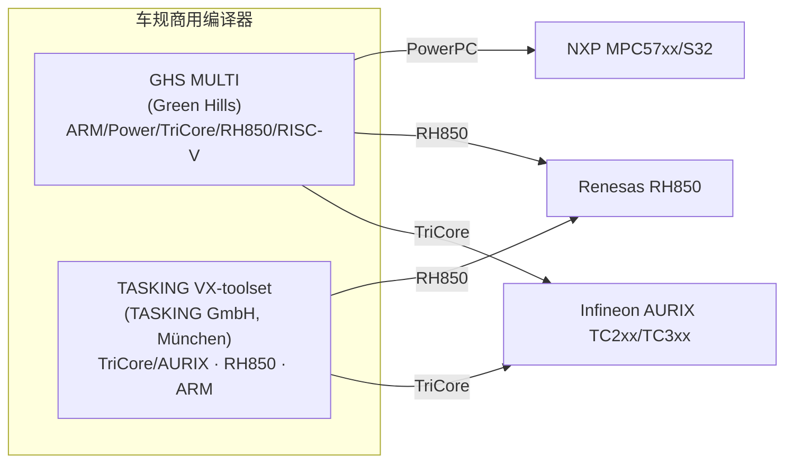
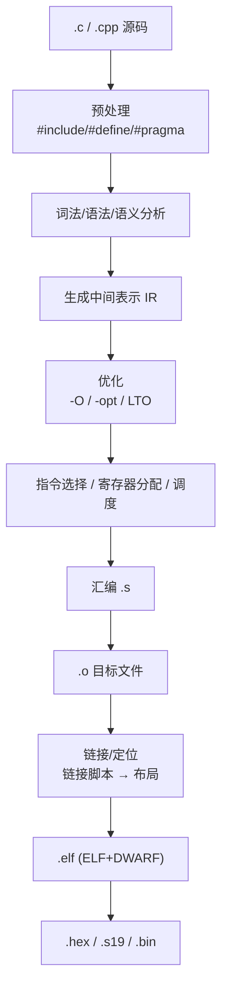
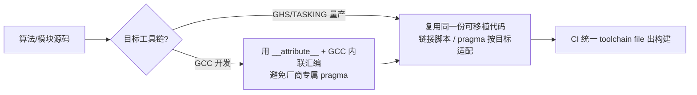

# GHS 与 TASKING 编译器工程化深度：车规级商用工具链的底层机制与实战

> 本文面向汽车电子、工业控制等深度嵌入式领域的软件与系统工程师，系统性地拆解两款**车规量产事实标准**的商用编译器——**Green Hills MULTI（GHS）**与 **TASKING VX-toolset**。当我们谈"编译"，很多人只想到 GCC/Clang（正如本仓库 `m02-编译器工程化` 所讲）；但在动力域、底盘域、网关、BMS 主控这类 ASIL 项目里，**工具链是否被功能安全认证、是否可审计、是否有原厂长期支持，往往比"免费"重要得多**。GHS 与 TASKING 正是为这种场景而生的。
>
> 文中所有型号、选项、认证均为公开资料中真实存在的内容（GHS MULTI、TASKING VX-toolset for TriCore/AURIX、TÜV NORD/exida 认证、ISO 26262 ASIL D 等），驱动名与关键选项以厂商手册为准（不同版本/目标略有差异，文中会标注）。代码片段以 **Infineon AURIX TC3xx（TriCore TC1.6x）/ RH850** 等车规平台为例，原理同样适用于 ARM Cortex-R/A、PowerPC 等。
>
> 本文与 `m02-编译器工程化`、`m01-Makefile`、`m03-CMake` 互为纵深：m02 讲通用编译原理与 GCC/Clang，本文把"车规商用编译器"这一被 m02 略过的工程面补齐——**为什么车厂指定它、它和 GCC 本质差在哪、怎么把它接进你和 Make/CMake 的构建流、量产怎么排错**。

---

## 一、为什么车规量产指定 GHS / TASKING，而不是 GCC

这是整篇文章的"题眼"。在消费电子里，"编译器能跑就行"；在汽车安全相关项（safety-related item）里，编译器本身是 **ISO 26262 Part 8 §11 要求的"软件工具"**，必须给出**工具置信度（Tool Confidence Level, TCL）**论证。这直接催生了商用编译器的三大不可替代性：

### 1.1 工具资格认证（Qualification）—— 最核心的差异

| 维度 | GCC / Clang（开源） | GHS MULTI | TASKING VX-toolset |
|---|---|---|---|
| 功能安全认证 | **默认无**，需自行做工具置信度论证（如 Validas CTS、OSADL LTS 配合测试套件） | 由 **TÜV NORD + exida** 认证，满足 **ISO 26262:2018 ASIL D / IEC 61508 SIL 4 / EN 50128 / EN 50657** | 由 **TÜV NORD** 认证，**ISO 26262 ASIL D + ISO 21434（网络安全）+ ISO 25119 + IEC 61508** |
| 认证交付物 | 无官方"认证包" | **Qualification Kit + Safety Manual + 证书** | **Qualification Kit + 合并 Safety/Security Manual** |
| 版本绑定 | 版本自由、无 LTS 承诺 | **固定 LTS 版本 + 长期 bug-fix 窗口** | 固定版本、长期支持（"lifetime of your product"） |

> **工程含义**：当你要在 ASIL B/D 项目里用 GCC，你得自己（或买第三方套件）证明"这个编译器版本在这个目标上、对这个语言子集不会悄悄生成错误代码"——这是一份要进 Safety Case 的论证文档。而 GHS/TASKING 把这份论证由原厂做好了，你只需要在 Safety Manual 规定的配置范围（编译器版本 + 目标 triple + 语言子集 + 选项集合）内使用即可。这就是为什么 Tier1/OEM 在招标书里直接点名这两家。

### 1.2 针对特定内核的"深度优化"

GHS 与 TASKING 不是"通用编译器碰巧支持嵌入式"，而是把优化**钉死在某几个车规内核**上做到极致：

- **TriCore / AURIX（TC1.6/TC1.8）**：TASKING 的 VX-toolset 用自研 **Viper 技术**，针对 TriCore 指令集做速度/体积双优；GHS 的 `cctc` 同样深度适配。
- **RH850 / V850（Renesas 车规）**：GHS `ccrh`、TASKING 均有专用前端。
- **PowerPC e200z（NXP MPC57xx/S32 系列）**：GHS `ccppc` 是车规 PowerPC 的经典选择。
- **ARM Cortex-R/A/M**：GHS `ccarm`/`cxarm`、TASKING ARM 工具链。

> 生动类比：GCC 像"通用翻译"，什么语种都接但每种未必最地道；GHS/TASKING 像"同声传译专攻某国政要讲话"，只为 TriCore/RH850 这几种"外语"做到无损且最快。

### 1.3 一体化工具生态（不止于编译器）

商用编译器的价值一半在编译器、一半在**周边工具链**，这是 GCC 难以单点替代的：

- **GHS MULTI**：集成 IDE + 编译器 + 调试器 + **TimeMachine（记录/回放调试）** + **History/Profiler（时序级性能分析）** + **DoubleCheck（静态分析 + 运行时错误检查）** + SuperTrace 探针，覆盖"编译→调试→时间分析→认证"全链路。
- **TASKING VX-toolset**：Eclipse 基座 IDE + 多核感知调试器（DAP/JTAG、片上 trace）+ **MISRA 检查** + 可选代码覆盖/剖析 + WinIDEA 联动（isystem）。

> 在 ASIL 项目里，"能编译"只是起点；"能证明它编译出的代码满足 WCET/确定性、能追溯到源码、能复现"才是硬指标——这正是商用套件的附加值。

---

## 二、两款工具链的定位与差异



**关键差异（务实视角）**：

- **GHS** 平台覆盖最广（ARM/Power/TriCore/RH850/RISC-V 全有），且其 **TimeMachine 记录回放**对偶发故障根因分析极有价值；多用在动力域、智驾域等对时间分析与确定性要求极高的场合。
- **TASKING** 在 **Infineon AURIX/TriCore** 上是"官方强推级"首选（Infineon 自己都站台其 TÜV 认证降低用户认证成本），RH850 同样强势；其 **LSL 链接脚本语言**对多核 AURIX 的内存布局表达很顺手。

> 二者在 AURIX 项目里经常"同台"：MCAL/BSW 可能来自不同供应商、用不同工具链编译，最终由链接器/链接脚本统一布局——这正是本文第七、十二节要讲的工程现实。

---

## 三、编译驱动与编译流程

### 3.1 GHS 驱动模型

GHS 提供**按目标架构命名**的编译器驱动（driver），本质上都是一个"编译/汇编/归档/链接统一调度器"：

| 驱动名 | 目标 | 语言 |
|---|---|---|
| `ccarm` | ARM/AArch32（仅 C + 汇编） | C |
| `cxarm` | ARM/AArch32（含 C++） | C/C++ |
| `cctc` | TriCore / AURIX | C/C++ |
| `ccppc` | PowerPC | C/C++ |
| `ccrh` | Renesas RH850 | C/C++ |

> **驱动语法规则（以 GHS 手册为准）**：
> - 形式为 `driver [file | -option]...`，**所有选项区分大小写**（如 `-l` 指定库、`-L` 指定库目录）。
> - 无论当前在编译、汇编还是链接，**通常应在所有构建步骤传递相同的驱动选项**（保证一致性）；例外：`-L`/`-l` 可在非链接步骤省略，`-D`/`-I` 若不参与预处理（如纯链接）也可省略。
> - 若同一功能出现两个选项，**后者覆盖前者**；遇到无法识别/无效的选项，驱动会忽略并发警告或错误。

### 3.2 TASKING 驱动模型

TASKING 同样按架构命名前端，最典型的是 TriCore/AURIX 的 **`cctc`**（C/C++ 编译器 + 汇编 + 链接器/定位器统一驱动），RH850 等另有对应前端（具体名随版本而变，以手册为准）。TASKING 以 **Eclipse 基座 IDE** 为主，但也提供完整命令行工具，可直接被 Make/CMake 调用（见第十一节）。

### 3.3 通用编译阶段（二者一致）



> 注意：GHS/TASKING 同样产出 **ELF + DWARF** 调试信息（也支持 Stabs），因此 TRACE32、winIDEA、MULTI 调试器都能做"源码级单步 + 内存视图"的联合调试——和 GCC 产出的 ELF 在调试生态上是互通的。

---

## 四、优化选项体系

### 4.1 GHS：`-O` / `-opt` / `#pragma optimize_level`

GHS 的优化是**"默认 + 可调参数"**组合，可做到**按工程、按文件、按函数**三级细粒度：

- **全局等级**：`-O0`（不优化，调试友好）、`-O1`/`-O2`（常用）、`-Ogeneral`、`-Ospeed`（偏速度）、`-Osize`（偏体积）、`-Onolimit`（不限制优化努力）。
- **细粒度 `-opt` 指令**（传递优化子参数）：
  - `-opt inline=aggressive`：跨文件激进内联（配合 LTO 效果最佳）
  - `-opt no_vectorize`：禁用自动向量化
  - `-opt no_parallelize`：禁用自动并行化（**ASIL 项目常显式关闭**，见 4.3）
  - `-opt no_tailcall`：禁用尾调用优化（避免破坏调用栈回溯）
  - `-opt no_speculate`：关闭推测执行（避免非法内存访问）
- **逐文件**：可在命令行对单文件指定等级，如 `cc -O1 critical_module.c` 与全局 `-O2` 共存。
- **逐函数**：用 pragma 局部关闭/恢复：
  ```c
  #pragma optimize_level 0          /* GHS：本函数不优化，确保语句按序执行 */
  void critical_isr(void) {
      HW_REG = 0x01;
      delay_us(10);
      HW_REG = 0x00;
  }
  #pragma optimize_level default     /* 恢复全局等级 */
  ```

### 4.2 TASKING：`-O` / `--optimize` / `--tradeoff`

TASKING 的优化维度类似，典型表述为"针对速度与代码大小的最佳平衡"：

- `--optimize` / `-O`：优化等级（如 `-O0` ~ `-O3` 风格，具体名以版本为准）。
- `--tradeoff`：在**速度 vs 体积**之间取舍（对应 GHS 的 `-Ospeed`/`-Osize`）。
- 同样支持**死代码消除、常量传播、循环优化、内联展开**，并可对 TriCore 特定指令集做专属优化。
- LTO（链接时优化）：在链接阶段做跨翻译单元全局分析，配合上述优化实现"跨文件内联"。

### 4.3 功能安全下的优化限制（ISO 26262 / IEC 61508）

在 **ASIL B 及以上 / SIL-2+** 系统中，必须避免"不可预测的优化行为"，通常**显式禁用**以下特性，并生成**优化影响分析报告**作为 Safety Case 证据：

| 优化特性 | 风险 | 推荐措施 |
|---|---|---|
| 自动并行化 | 引入隐式并发，违反单线程假设 | 显式禁用（`-opt no_parallelize`） |
| 尾调用优化 | 破坏调用栈回溯，影响故障诊断 | 禁用（`-opt no_tailcall`） |
| 浮点重组 | 改变运算顺序，影响数值精度 | 启用确定化（`-frounding-math` 类） |
| 推测执行 | 可能触发非法内存访问 | 关闭（`-opt no_speculate`） |

> **工程经验**：安全相关函数（看门狗喂狗序列、安全状态机切换、加密验签）建议**局部关闭优化**或用 `volatile`/内存屏障保序，配合 `-g` 调试符号，确保"每条语句按源码顺序落到机器码"。

---

## 五、`#pragma` 与 `__attribute__`

商用编译器在"section 落位、对齐、弱符号、中断、内联"等控制上，既有自己的 `#pragma`，也普遍兼容 GCC 风格的 `__attribute__`（便于代码在 GCC 与商用工具链间迁移）。

### 5.1 GHS 常用 `#pragma ghs`

```c
#pragma ghs section .mytext          /* 切换后续符号落入的段 */
#pragma ghs align 8                  /* 后续全局变量按 8 字节对齐 */
#pragma ghs inline                   /* 建议内联 */
#pragma ghs interrupt                /* 声明为中断服务函数（自动压栈/恢复现场） */
#pragma ghs weak my_symbol           /* 声明弱符号 */
#pragma ghs start / #pragma ghs end  /* 控制优化/诊断的作用域 */
```

### 5.2 TASKING 常用 `#pragma`

```c
#pragma section ".mycode"            /* 段切换 */
#pragma align 8                      /* 对齐 */
#pragma inline                       /* 建议内联 */
#pragma MESSAGE OFF C2911            /* 关闭某条 MISRA/诊断告警（抑制） */
```

### 5.3 与 GCC 的差异与迁移要点

| 控制点 | GCC 风格（可移植写法） | 商用专属（注意差异） |
|---|---|---|
| 段落位 | `__attribute__((section(".x")))` | GHS `#pragma ghs section` / TASKING `#pragma section` |
| 对齐 | `__attribute__((aligned(8)))` | 各有 `#pragma align` |
| 弱符号 | `__attribute__((weak))` | GHS `#pragma ghs weak` |
| 中断 | `__attribute__((interrupt))` | GHS `#pragma ghs interrupt` |
| 内联 | `inline` / `__attribute__((always_inline))` | 各 `#pragma inline` + `__forceinline` 类 |

> **坑**：不要在一个工程里混用两种写法的"同义控制"，否则换工具链时语义可能漂移。推荐**优先用 `__attribute__`（GCC 风格）做可移植控制**，把 `#pragma` 留给确实需要商用专属行为的场景。

---

## 六、内联汇编与内建/原子

两家都支持 **GCC 风格的扩展内联汇编**（`__asm__ __volatile__(...)`），这是跨工具链移植的最大福音：

```c
/* GHS / TASKING / GCC 通用写法示例：插入一条 nop 并读 special register */
static inline uint32_t read_core_id(void) {
    uint32_t id;
    __asm__ __volatile__("mfcr %0, CPU_CORE_ID" : "=d"(id));
    return id;
}
```

- **GHS/TASKING 内建（builtin）**：提供原子操作、位操作、饱和运算等内建函数，便于无锁临界区与 DSP 风格运算；具体内建名以手册为准，迁移时需注意与 GCC `__builtin_*` 的映射。
- **原子与内存屏障**：在 RTOS 关中断、自旋锁、多核通信场景，务必配合工具链提供的内存屏障内建（如 `__sync`/`__atomic` 或厂商专属），避免优化破坏顺序一致性。

---

## 七、链接器与链接脚本

这是 GHS/TASKING 工程里**最容易出事故、也最见功力**的环节（对应本仓库知识点梳理「六、编译与链接」里 Section 溢出 / Symbol 冲突 / 对齐三大坑）。

### 7.1 GHS 链接器命令文件

GHS 链接由驱动（如 `ccarm`/`cctc`）调度，底层链接编辑器接受 **GNU ld 风格**的 `MEMORY`/`SECTIONS` 语法 + GHS 专属指令（`FORCE_ACTIVE`、`RESERVE`、`GROUP` 等）。一个 TriCore/AURIX 风格骨架：

```ld
/* ghs_link.cmd —— GHS 链接器命令文件（骨架，具体语法以版本为准） */
MEMORY {
  pflash0 (RX) : ORIGIN = 0x80000000, LENGTH = 0x00100000   /* 程序 Flash */
  pfls0   (RX) : ORIGIN = 0x80100000, LENGTH = 0x00100000   /* 第二块 Flash */
  dspr0   (RW) : ORIGIN = 0xB0000000, LENGTH = 0x00040000   /* DSPR / RAM */
}
SECTIONS {
  .text : { *(.text) *(.text.*) } > pflash0
  .rodata : { *(.rodata) } > pflash0
  .data : { *(.data) } > dspr0 AT > pflash0    /* 运行在 RAM，加载镜像在 Flash */
  .bss  : { *(.bss)  } > dspr0
  /* GHS 专属：强制保留某符号（避免被死代码消除） */
  FORCE_ACTIVE { reset_handler }
}
```

### 7.2 TASKING LSL（Linker Script Language）

TASKING 用自研 **LSL** 描述内存布局，概念与 GNU ld 相似但语法自有体系，特别适合表达 AURIX 多核的"各核独立 RAM + 共享区"：

```lsl
/* tasking.lsl —— TASKING LSL 骨架（AURIX 多核示意） */
MEMORY {
  pfls0  : ORIGIN = 0x80000000, LENGTH = 0x100000   /* PFlash */
  dspr0  : ORIGIN = 0xB0000000, LENGTH = 0x40000    /* CPU0 DSPR */
  dspr1  : ORIGIN = 0xB0010000, LENGTH = 0x40000    /* CPU1 DSPR */
}
SECTIONS {
  GROUP : {
    .text (TEXT) : { *(.text) }
    .data (DATA) : { *(.data) }
    .bss  (BSS)  : { *(.bss)  }
  } > pfls0
  /* 各核栈/堆显式分區，避免地址重叠 */
  STACK (SIZE = 0x1000) > dspr0
  HEAP  (SIZE = 0x2000) > dspr0
}
```

> **多核布局铁律**：为各核分配**独立 RAM 区**，共享区（如跨核通信 buffer、自旋锁变量）必须**显式标注且 cache/一致性可控**；否则会出现"两个核的栈悄悄重叠"这种最难查的偶发崩溃。

### 7.3 MAP 文件：你的"内存 X 光片"

链接产物 `.elf` 之外，**务必归档 MAP 文件**（各符号地址/大小、各段布局、未用段、总体积）。CI 里可用脚本解析 MAP 做"体积门禁"（超过阈值就拦截提交），在内存悄悄增长越界之前告警。

---

## 八、启动代码 / crt0 / 向量表 / 多核入口

- **crt0 / startup**：GHS/TASKING 都提供**可裁剪的启动文件**（清零 `.bss`、拷贝 `.data`、初始化 C 库、设栈指针、配时钟/内存控制器），你要在其上接自己的 `Reset_Handler`/`_start`。
- **向量表**：位置由链接脚本的向量段地址决定（或 VTOR 重映射，跳 App 时用到，见 BMS Bootloader 章）。商用工具链的 startup 通常已为特定 MCU 生成好向量表模板。
- **多核入口**：AURIX 多核要从 `CPU0` 的 startup 里**显式启动 `CPU1/CPU2`**（释放它们各自的 `CPUx_PC`/halt 状态）；这一步的地址必须和链接脚本里各核的复位入口一致，否则"核起不来"或"跑飞"。

---

## 九、MISRA 与静态分析

车规 C 代码的"红线"是 **MISRA C:2012**（部分新项目用 MISRA C:2023 / AUTOSAR C++14 / MISRA C++:2023）。两家都把编码规范检查**内置进工具链**：

- **GHS**：编译器集成 MISRA 2012/2004 检查，另有 **DoubleCheck**（静态分析 + 运行时错误检查）。
- **TASKING**：VX-toolset 内置 MISRA 检查与静态分析，可输出违规清单。

抑制单条规则的典型写法（以 TASKING 为例）：

```c
#pragma MESSAGE OFF C2911   /* 临时抑制某条 MISRA/诊断告警（需评审留痕） */
int32_t raw = *(volatile int32_t*)0xB0000000;
#pragma MESSAGE ON  C2911
```

> **工程纪律**：抑制（suppression）**必须评审留痕**，否则 MISRA 检查会变成"全屏静音"。量产项目的 MISRA 偏差（deviation）要进 MISRA 合规矩阵，作为功能安全证据链的一环。

---

## 十、功能安全工具认证：把"编译器"写进 Safety Case

这是商用工具链真正的护城河，也是与 GCC 的本质分水岭：

1. **TCL 论证**：ISO 26262 Part 8 §11 要求对每个"输出进入安全相关项"的工具给 TCL 论证。GHS/TASKING 由 **TÜV NORD（GHS 还含 exida）** 认证到 **ASIL D / SIL 4**，并交付 **Qualification Kit + Safety Manual + 证书**。
2. **配置范围绑定**：认证**绑定到具体"编译器版本 + 目标 triple + 语言子集 + 选项集合"**。你在 Safety Manual 规定范围内使用，即可直接引用认证；一旦升级编译器大版本或大幅改选项，可能要重新评估。
3. **确定性与可复现**：ASIL 项目要求**可复现构建**——固定工具链版本、固定头文件/库、避免编译期嵌入时间戳（注意 `-Wdate-time` 类警告）、锁定优化选项。商用工具链对此有明确支持与文档。
4. **网络安全叠加**：TASKING 还把 **ISO/SAE 21434（网络安全）** 认证与功能安全合并进同一 Safety/Security Manual——网联化时代，这两张证是"一辆车能不能合法装 ECU"的入场券。

> 对照：用 GCC 做 ASIL 项目，要么用第三方"编译器资格认证套件"（如 Validas CTS 针对特定 GCC 版本+目标），要么自己做工具置信度论证——工作量和风险都显著高于直接用已认证商用工具链。

---

## 十一、与构建系统协同（呼应 m01 / m03）

GHS/TASKING 都能被 **Make / CMake** 驱动，关键是写对 **toolchain 描述**：

- **Make（详见 `m01-Makefile`）**：把 `ccarm`/`cctc` 设为 `CC`，`CFLAGS` 里放 `-O2 -g --signed_fields` 等，链接用驱动 + 链接脚本；`make -j` 并行编译照常工作。
- **CMake（详见 `m03-CMake`）**：用 **toolchain file** 封装交叉编译器与 sysroot：
  ```cmake
  # toolchain-ghs-aurix.cmake（示意）
  set(CMAKE_SYSTEM_NAME Generic)
  set(CMAKE_C_COMPILER   cctc)      # GHS/TASKING TriCore 驱动
  set(CMAKE_CXX_COMPILER cctc)
  set(CMAKE_TRY_COMPILE_TARGET_TYPE STATIC_LIBRARY)   # 避免 try_compile 去链接
  # 统一优化/警告/链接脚本，由 CMAKE_C_FLAGS 透传给驱动
  ```
  由于 GHS/TASKING 驱动"全程传相同选项"的特性，CMake 的 `target_compile_options` + `target_link_options` 要**把编译期选项也透传到链接步**（否则链接阶段丢选项，行为不一致）。

> **反模式**：把 GHS/TASKING 当"黑盒按钮"点 IDE Build——一旦工程上千文件、要上 CI，就失去了无头（headless）可复现构建能力。正确做法：把工具链固化进 Make/CMake，CI 里用同一份 toolchain file 出构建。

---

## 十二、GCC ↔ GHS / TASKING 迁移要点

量产里常见"算法团队用 GCC 开发、车规集成用 GHS/TASKING 编译"或反向迁移，差异集中在：

| 迁移点 | 注意 |
|---|---|
| 内联汇编 | 通用 GCC 风格可移植；厂商专属语法需重写 |
| `#pragma` / `__attribute__` | 优先 `__attribute__`；专属 pragma 需逐条对应 |
| 内建/原子 | `__builtin_*` ↔ 厂商内建，逐一对表 |
| 标准库 | 商用运行时库（C/C++ 库）与 newlib/glibc 行为细节不同（如 `printf` 浮点、宽字符支持） |
| 诊断宏 | `__FILE__`/`__LINE__`/`__func__` 一致；但**警告编号不同**（GCC `-Wxxx` vs TASKING `Cxxxx`），CI 的 `-Werror` 抑制清单要重做 |
| 浮点调用约定 | 软浮点/硬浮点（ABI）必须两端一致，否则链接期或运行期崩溃 |
| 链接脚本 | GNU `.ld` ↔ GHS 命令文件 / TASKING LSL，内存地址需人工对齐到芯片实际映射 |



---

## 十三、量产排错与常见坑

对应知识点梳理「六」里的三大经典坑，给出商用工具链下的定位与修复：

1. **Section 溢出（段超分配内存）**
   - 定位：看 **MAP 文件**（各符号地址/大小）、链接器报错 `overflow by N bytes`。
   - 修复：挪区（扩段）/ 改对齐 / **拆分大模块** / 开链接优化去死代码（`-opt` 去死代码）/ 压缩常量到 `.rodata`。
2. **Symbol 冲突**
   - 来源：同名全局变量（未 `static`）、弱符号被强符号覆盖、不同库符号重名。
   - 排查：MAP + 链接器 `multiple definition` 报错；规范用 `static` / 命名空间前缀 / 弱符号约定。
3. **对齐约束**
   - 非对齐访问在部分架构直接 HardFault；DMA buffer 需按外设要求对齐（如 32 字节 cache line）。
   - 用 `__attribute__((aligned(n)))` 或 `#pragma align` 控制；TASKING/GHS 链接脚本里也可指定段对齐。
4. **链接期优化与调试符号**
   - 开 LTO 后源码行号映射可能"跳行/断点难命中"——关键函数**局部关优化 + 保留 `-g`**。
5. **浮点/ABI 不一致**
   - "能编译、一运行就崩"常因软/硬浮点混用；确保全工程（含第三方库）ABI 一致。

---

## 十四、面试题精选（含要点）

1. **为什么车规不用 GCC 直接做 ASIL 项目？**
   答：ISO 26262 Part 8 §11 要求对"输出进入安全相关项"的编译器做 TCL 论证；GCC 默认无认证，需自行或买第三方套件做工具置信度论证；GHS/TASKING 由原厂（TÜV NORD/exida）认证到 ASIL D/SIL 4，并交付 Qualification Kit + Safety Manual，可直接引用。

2. **GHS/TASKING 的优化在功能安全项目里要注意什么？**
   答：ASIL B+ 要禁用自动并行化、尾调用、推测执行等"不可预测"优化，启用浮点确定化，对安全相关函数局部关优化保序，并生成优化影响分析报告进 Safety Case。

3. **Section 溢出怎么定位与修？**
   答：MAP 文件定位超区段，挪区/对齐/拆分模块/开链接优化去死代码/压缩常量；多核还要检查各核 RAM 是否重叠。

4. **Symbol 冲突一般怎么来的？**
   答：同名全局变量未 static、弱/强符号覆盖、不同库重名；用 static/前缀/弱符号约定 + MAP 排查。

5. **GCC 工程迁移到 GHS/TASKING 最易踩的坑？**
   答：内联汇编语法、pragma/attribute 差异、内建原子映射、标准库行为、警告编号（CI 抑制清单要重做）、浮点 ABI 一致性、链接脚本（ld↔LSL）地址对齐。

6. **多核 AURIX 的内存怎么分？**
   答：各核独立 RAM 区 + 共享区显式标注且一致性可控；链接脚本（LSL）里 STACK/HEAP 按核分配，启动代码里显式释放 CPU1/2 的 halt 状态，入口地址与链接脚本一致。

---

## 十五、总结

GHS MULTI 与 TASKING 不是"另一个 GCC"，而是**为车规功能安全量身打造、可被认证、可审计、有原厂长期托底**的工业化工具链。理解它们的关键，是跳出"编译出二进制"的视角，上升到"**编译器的输出要进 Safety Case**"的高度：

- **为什么用**：TCL 论证由厂商完成（TÜV NORD/exida，ASIL D/SIL 4），省去自证；深度内核优化 + 一体化调试/时间分析生态。
- **怎么用**：驱动模型（按目标命名）、优化选项（`-O`/`-opt`/`#pragma optimize_level`）、`#pragma`/`__attribute__` 控制、`#pragma MESSAGE OFF` 抑制 MISRA（需评审留痕）。
- **怎么接**：用 Make/CMake + toolchain file 把它纳入无头可复现构建（呼应 `m01`/`m03`）。
- **怎么排错**：MAP 文件定位 Section 溢出 / Symbol 冲突 / 对齐，多核内存分区分明，浮点 ABI 一致。
- **怎么迁移**：以 `__attribute__` + GCC 风格内联汇编做可移植基底，厂商专属 pragma 按目标适配。

把本文与 `m02-编译器工程化`（通用原理与 GCC/Clang）、`m01-Makefile`、`m03-CMake`、`06-编译链接`（map 文件与那些坑）串起来，就构成了一条从"编译原理 → 商用工具链 → 构建系统 → 量产排错"的完整车规编译工具链知识链。
