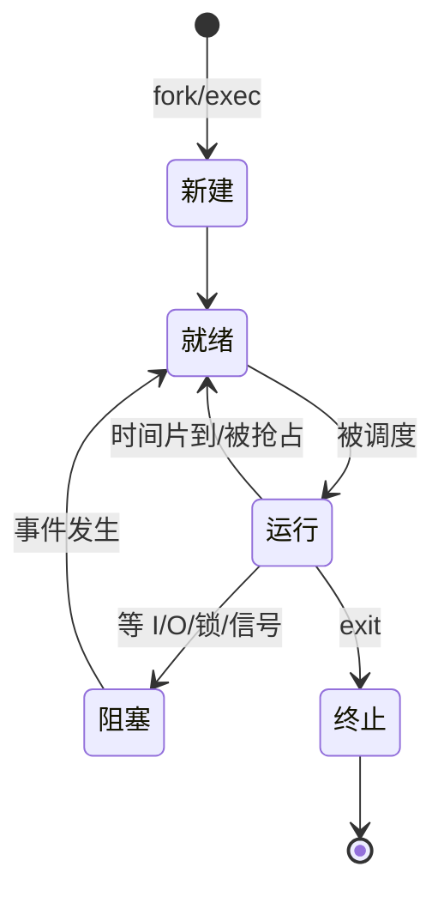

# 操作系统进阶（一）· 进程、线程与执行流抽象

> 本文把"进程与线程"从工程直觉拉到第一性原理：先回答"为什么要有进程这个抽象"，再讲清进程与线程到底差在哪、内核怎么管理它们、一次上下文切换到底换了什么、以及 `fork/exec`、线程库、协程这些嵌入式与后端工程师天天碰到却又容易说不清的概念。文中与仓库 `02-rtos-tuning.md`（RTOS 任务模型）形成对照——RTOS 的 Task 是"进程与线程未分化"的轻量形态，理解本篇能反过来吃透 RTOS 的任务机制。

---

## 一、为什么需要"进程"：从裸机到多道程序的跨越

在 `02-rtos-tuning.md` 里我们聊过"前后台系统"的单栈困境；在更通用的计算机里，最早的形态是**单道程序（单任务）**：一个程序独占整台机器，从启动跑到结束，CPU、内存、外设全是它的。这种模型的问题是**资源利用率极低**——程序等待 I/O（比如读磁盘、等键盘）时，CPU 只能空转。

为了榨干硬件，操作系统引入了**多道程序（multiprogramming）**：内存里同时放多个程序，一个在等 I/O 就把 CPU 让给另一个。但"多个程序同时活着"带来了一个根本问题：**它们会互相踩内存、抢外设、状态互相污染**。于是操作系统必须给每个运行的程序造一个"隔离的舞台"，这个舞台就是**进程（Process）**。

> 一句话：**进程 = 一个正在运行的程序实例 + 它被操作系统分配的资源集合 + 它的执行状态**。它是最早的"资源隔离 + 执行流"抽象。

而**线程（Thread）** 是后来为了进一步降低开销、支持一个进程内并发而引入的：同一个进程内的多个线程**共享地址空间与资源**，但各自有独立的执行流（栈、寄存器、程序计数器）。理解进程与线程，先记住一条主线：

- **进程是"资源分配"的基本单位**（拥有独立的虚拟地址空间、文件描述符表、信号处理等）。
- **线程是"CPU 调度"的基本单位**（内核真正调度的是线程，不是进程）。

---

## 二、进程的图像：地址空间、PCB 与状态机

### 2.1 进程的虚拟地址空间

现代 OS 给每个进程一个**独立、连续、私有的虚拟地址空间**（32 位进程通常是 4 GB，64 位更大但受限于实际物理内存）。这个空间被划分为若干段：

```
高地址 ┌─────────────────┐
       │   内核空间        │  ← 所有进程共享同一份内核映射（高 1GB/高半）
       ├─────────────────┤
       │   栈 (向下生长)   │  ← 线程私有，存局部变量、返回地址
       │        ↓          │
       │        ↑          │
       │   堆 (向上生长)   │  ← malloc/new 分配，进程内线程共享
       ├─────────────────┤
       │   BSS 段          │  ← 未初始化全局变量
       │   数据段          │  ← 已初始化全局变量
       │   代码段 (.text)  │  ← 程序指令，只读、可共享
低地址 └─────────────────┘
```

关键点：
- **代码段**通常只读且可被多个进程共享（比如多个 bash 进程共享同一份 bash 代码页）。
- **堆**由 `malloc`/`new` 在运行时动态扩张；**栈**由函数调用自动压栈/出栈。
- 每个进程的虚拟地址空间彼此**隔离**：进程 A 访问 `0x08048000` 和进程 B 访问 `0x08048000` 是完全不同的物理页，一个进程崩溃不会拖垮另一个（除非共享内存段）。

### 2.2 进程控制块（PCB）

内核用一个结构体（Linux 里是 `task_struct`，极其庞大，上百字段）记录每个进程的一切，这就是 **PCB（Process Control Block）**。它至少包含：

| 类别 | 典型字段 | 说明 |
| --- | --- | --- |
| 标识 | PID、PPID、UID/GID | 进程号、父进程号、属主 |
| 状态 | 运行/就绪/阻塞/僵尸 | 调度依据 |
| 上下文 | 通用寄存器、PC、PSW、栈指针 | 切换时保存/恢复 |
| 地址空间 | 页表基址（CR3/页表指针） | 进程切换时换页表 |
| 资源 | 打开的文件表、信号、cwd | 进程拥有的资源 |
| 调度 | 优先级、时间片、调度策略 | 调度器用 |

> 对比 RTOS：`02-rtos-tuning.md` 的 TCB（Task Control Block）是 PCB 的"精简版"——RTOS 任务也有栈、上下文、优先级、状态，但**没有独立地址空间**（所有任务共享同一片物理内存），所以 RTOS 上下文切换**不换页表**，比进程切换轻得多。这是理解"为什么 RTOS 快、Linux 进程重"的核心。

### 2.3 进程状态机

经典五态（比 RTOS 任务多了"新建/终止"与更细的挂起语义）：



Linux 实际把"阻塞"细分为 `Interruptible`（可被信号唤醒）与 `Uninterruptible`（如磁盘 I/O，不可被信号打断，表现为 `D` 状态，常见"假死"元凶）睡眠。

---

## 三、线程：进程内的轻量执行流

### 3.1 线程 vs 进程：共享什么、独占什么

| 资源 | 进程内多线程 | 多进程 |
| --- | --- | --- |
| 地址空间 | **共享** | 各自独立 |
| 全局变量 / 堆 | **共享** | 不共享（除非 IPC/共享内存） |
| 打开的文件 | 共享 | 各自（fork 后复制） |
| 栈 | **各自私有** | 各自私有 |
| 寄存器/PC | **各自私有** | 各自私有 |
| 创建/切换开销 | 小 | 大（换页表、复制资源） |
| 隔离性/容错 | 弱（一炸全炸） | 强 |
| 通信成本 | 低（直接读写共享变量） | 高（需 IPC） |

**工程取舍**：一炸全炸 vs 通信便宜。Web 服务器用多进程（如早期 Apache prefork）图隔离；现代 Nginx/Redis 用单进程多 worker 或单线程事件循环图效率；计算密集又需并发则用线程池。嵌入式 RTOS 里"任务"本质就是线程（共享地址空间）。

### 3.2 线程的实现：内核级 vs 用户级

- **内核级线程（KLT，如 Linux pthread）**：线程由内核调度，一个线程阻塞不影响同进程其他线程；但每次操作（创建、切换）都要陷入内核，开销较大。
- **用户级线程（ULT，如早期 GNU Pth、协程库）**：线程库在用户态自己调度，**对内核透明**，切换极快；但一个线程阻塞（如系统调用）会卡住整个进程——内核以为你只有一个执行流。
- **两级模型（N:M，如 Go runtime 的 G-M-P）**：M 个用户协程映射到 N 个内核线程，兼顾效率与并发。Go 的 goroutine、Linux 的 `io_uring` + 协程都属此类思想。

### 3.3 一个 pthread 可读示例

```c
#include <pthread.h>
#include <stdio.h>

int shared_counter = 0;

void *worker(void *arg) {
    int id = *(int *)arg;
    for (int i = 0; i < 100000; i++) {
        shared_counter++;          /* 非原子！需要互斥保护（见 o03） */
    }
    printf("thread %d done\n", id);
    return NULL;
}

int main(void) {
    pthread_t t1, t2;
    int a = 1, b = 2;
    pthread_create(&t1, NULL, worker, &a);
    pthread_create(&t2, NULL, worker, &b);
    pthread_join(t1, NULL);   /* 等待，避免主线程先退出 */
    pthread_join(t2, NULL);
    printf("counter=%d (期望 200000)\n", shared_counter);
    return 0;
}
```

> 注意：上面 `shared_counter++` 在多核下**不是原子的**（读-改-写三步），不加锁几乎必然丢更新——这正是 `o03` 同步章要解决的事。这里先埋个引子。

---

## 四、上下文切换：到底"换"了什么，有多贵

### 4.1 切换的两种粒度

- **进程切换（Process Switch）**：换整个执行环境，包括**页表（CR3/TTBR）**。换页表会导致 TLB 大量失效（TLB shootdown），代价高昂；还要切换地址空间相关的内核结构。
- **线程切换（Thread Switch）**：同进程内两线程切换，**不换页表**，只换寄存器/栈/PC，开销小得多。

### 4.2 切换的步骤（以进程切换为例）

1. **保存现场**：把当前运行线程的寄存器（通用寄存器、PC、PSW、栈指针）压入其内核栈或 PCB。
2. **切换地址空间**：把新进程的页表基址载入 MMU（如 x86 的 `CR3`、ARM 的 `TTBR0`）。这一步使 TLB 相关的旧映射失效。
3. **恢复现场**：从新进程的 PCB 取出寄存器，载入 CPU，跳到其上次被切走时的 PC 继续执行。
4. **内核态 ↔ 用户态**：切换发生在内核态，完成后通过 `iret`/`eret` 返回到新进程的用户态。

### 4.3 开销数量级

- 线程/同进程切换：几百到几千 CPU 周期（亚微秒到数微秒）。
- 跨进程切换：多一次页表切换 + TLB 失效，通常数微秒到十几微秒，且相邻 cache 命中率下降带来隐性惩罚。
- 对比 `02-rtos-tuning.md` 第六章的 PendSV 上下文切换（只换 R4–R11 + PSP），RTOS 任务切换在几十到数百周期——因为**不换地址空间**。

> 关键认知：**切换本身不干活，纯开销**。所以调度粒度（时间片、tick）不能太细，否则大量时间花在切换上；但太粗又伤实时性。RTOS 用"事件驱动 + 高优先级抢占"避免无谓 tick 切换，正是这个权衡的体现。

---

## 五、进程的诞生：fork / exec / 写时复制

### 5.1 fork()：复制一个自己

Unix 的经典模型：`fork()` 创建一个**几乎完全复制父进程**的子进程（新的 PID、独立地址空间），但用**写时复制（Copy-On-Write, COW）** 优化——父子初始**共享同一份物理页**，只有在任一方写入时才真正复制那一页。这样 `fork` 很便宜。

```c
pid_t pid = fork();
if (pid == 0) {
    /* 子进程：pid == 0 */
    printf("child, ppid=%d\n", getppid());
} else if (pid > 0) {
    /* 父进程：pid 是子进程号 */
    printf("parent, child pid=%d\n", pid);
} else {
    perror("fork failed");
}
```

### 5.2 exec()：换个程序跑

`exec` 系列（`execl/execlp/execve`）**不创建新进程**，而是把当前进程的地址空间**替换为新程序**的代码/数据，从新程序的入口开始执行。典型组合：

```c
if (fork() == 0) {
    execl("/bin/ls", "ls", "-l", NULL);  /* 子进程变成 ls */
    perror("exec failed");               /* 只有失败才走到这 */
}
```

**shell 运行命令的本质**就是：`fork` 一个子进程，子进程 `exec` 目标程序，父进程 `wait` 回收。

### 5.3 僵尸进程与孤儿进程

- **僵尸（Zombie）**：子进程退出后，内核仍保留其 PCB 让父进程 `wait` 读取退出状态；若父进程一直不 `wait`，子进程会一直以 `Z` 状态存在，占用 PID。父进程退出后由 `init`（PID 1）收养并回收。
- **孤儿（Orphan）**：父进程先退出，子进程被 `init` 收养，继续正常运行。
- **工程坑**：写服务端时父进程忘了 `wait`/`waitpid`，会堆积僵尸进程耗尽 PID 上限（如 32768），导致无法 `fork`。解法：`signal(SIGCHLD, SIG_IGN)` 让内核自动回收，或用 `waitpid(-1, ..., WNOHANG)` 循环回收。

---

## 六、协程：用户态的"轻线程"

协程（Coroutine）是**在单个线程内**由程序员/运行时显式调度的协作式执行流。它比线程更轻（创建成本纳秒级、可百万级存在），切换只换少量寄存器、不陷入内核、不换栈地址空间。

- **有栈协程（stackful）**：每个协程有独立栈（如 Lua、libtask、Go goroutine 早期），可嵌套挂起。
- **无栈协程（stackless）**：用状态机/`async/await` 实现（如 C++20 coroutine、Python asyncio、Rust async），不占独立大栈。

```c
/* 伪代码：async/await 风格的协程，单线程并发处理多个连接 */
async Task handle_client(Connection c) {
    var data = await c.ReadAsync();   /* 挂起，让出 CPU 给别的协程 */
    await c.WriteAsync(process(data));
}
```

协程把"回调地狱"变成"顺序写法"，是 Linux 高并发（Nginx、Redis 单线程、Go 网络模型）的底层哲学——与 RTOS 的"单栈事件循环 + 协作让出"在思想上同源。

---

## 七、常见坑

1. **把线程当进程用**：期望线程隔离，结果一个线程写越界把整个进程（含别的线程）搞崩——线程共享地址空间，容错靠的是锁与仔细设计，不是隔离。
2. **忘记 join/detach**：主线程退出会带走整个进程，子线程若没 `join`/`detach` 可能被执行一半就被杀；或重复 `join` 同一线程导致未定义行为。
3. **在信号处理里调用非异步信号安全函数**：如 `printf`、`malloc`（非 `async-signal-safe`），会死锁或崩溃。信号 handler 里只能调 `write`、`_exit` 等安全函数。
4. **fork 后多线程**：在多线程程序里 `fork`，子进程只保留调用 `fork` 的那个线程，**但可能继承了一个被别的线程锁住、但那个线程已不存在的锁**——死锁。所以用 `fork` 后通常紧接着 `exec`。
5. **僵尸堆积**：见 5.3。
6. **混淆虚拟地址与物理地址**：调试时看到两个进程的 `0x08048000` 不同，是正常的虚拟隔离，别当成 bug。

---

## 八、面试要点

1. **进程和线程的本质区别？** 进程是资源分配单位（独立地址空间），线程是调度单位（共享地址空间）；切换成本线程 < 进程（进程换页表）。
2. **进程切换和线程切换在内核里差在哪？** 主要差在是否切换页表（CR3/TTBR）与地址空间相关结构，页表切换带来 TLB 失效。
3. **fork 为什么快？（COW）** 写时复制让父子共享物理页，只有写入才复制，避免无谓的全量拷贝。
4. **僵尸进程怎么产生、怎么处理？** 子进程退出父不 `wait`；用 `waitpid`/`SIGCHLD` 回收，或 `SIG_IGN` 让内核自动回收。
5. **协程和线程的区别？** 协程在用户态、单线程内协作调度，开销极小、数量可极大；线程是内核调度、可真并行（多核）。
6. **为什么单线程事件循环（Redis/Nginx）能扛高并发？** I/O 多路复用 + 非阻塞 + 协程/回调，避免线程切换与锁开销；瓶颈在 CPU 计算时不适用，故 Redis 用多进程分摊。
7. **用户态线程阻塞为何会卡住整个进程？** 内核只看到内核级线程，用户态线程阻塞触发系统调用时，内核把整个 KLT 挂起，同进程所有 ULT 跟着停。
