# 操作系统进阶（二）· CPU 调度算法：从指标到实时调度

> 调度（Scheduling）是操作系统的"交通指挥"。本文把"谁该用 CPU、用多久、以什么顺序"这件事讲透：先建立评价调度的量化指标，再逐个拆解经典算法（FCFS、SJF、RR、优先级、多级反馈队列），最后深入**实时调度**（Rate-Monotonic / EDF）——这部分直接和仓库 `02-rtos-tuning.md`、`b09`（AUTOSAR 应用层）的工程实践打通。所有算法都配甘特图与可手算的例子。

---

## 一、调度的基本设定与评价指标

### 1.1 调度的层次

- **长程调度（作业调度）**：决定哪些作业从磁盘" admission "进内存成为进程（批处理系统明显，现代桌面几乎无）。
- **中程调度（交换调度）**：把进程换出/换入内存（swap），调节多道程序度。
- **短程调度（CPU 调度）**：最频繁，决定"下一个该跑哪个就绪线程"——我们常说的"调度器"主要指它。
- **I/O 调度**：决定 I/O 请求的服务顺序（见 `o06`）。

### 1.2 核心评价指标

| 指标 | 含义 | 关注方 |
| --- | --- | --- |
| 周转时间（Turnaround） | 完成 − 到达 | 用户（总耗时） |
| 响应时间（Response） | 首次响应 − 到达 | 交互用户（"卡不卡"） |
| 等待时间（Waiting） | 在就绪队列累计等待 | 公平性 |
| 吞吐量（Throughput） | 单位时间完成进程数 | 系统 |
| CPU 利用率 | 忙的比例 | 系统 |
| 公平性 | 是否饿死某个进程 | 多用户 |

> 工程里的根本张力：**吞吐/利用率 ↔ 响应/公平**。批处理偏前者，交互/实时偏后者。`02-rtos-tuning.md` 第十一章讲 RTOS 抖动抑制，本质就是在实时约束下优化响应与确定性。

---

## 二、先来先服务（FCFS）

最简单的非抢占调度：按到达顺序排一条 FIFO 队列。

```
到达：P1(0,24) P2(0,3) P3(0,3)   （格式：到达时间, 运行时间）
甘特： [ P1 24 ][ P2 3 ][ P3 3 ]
周转： P1=24  P2=27  P3=30  平均=27
```

**致命缺陷——护航效应（Convoy Effect）**：一个长作业在前，后面一堆短作业被它"护航"着干等，平均等待/响应极差。FCFS 对短作业极不友好，几乎只作"反面教材"或底层兜底。

---

## 三、最短作业优先（SJF）与其抢占版 SRTF

### 3.1 非抢占 SJF

每次选**预计运行时间最短**的进程。可证明它在"已知运行时间"前提下，使**平均等待时间最优**。

```
到达：P1(0,7) P2(2,4) P3(4,1) P4(5,4)
调度：P1 跑 0-7 → 期间 P2/P3/P4 到达 → 之后按短到长 P3(1) P2(4) P4(4)
甘特：[P1 7][P3 1][P2 4][P4 4]
```

### 3.2 抢占版 SRTF（最短剩余时间优先）

新进程到达时若其剩余时间比当前运行进程的剩余短，则抢占。

```
到达：P1(0,7) P2(2,4) P3(4,1) P4(5,4)
甘特：[P1 0-2][P2 2-4][P3 4-5][P2 5-7][P4 7-11][P1 11-16]
```

**现实难题**：OS 怎么知道进程"还要跑多久"？SJF 的最优建立在"预知未来"上，实际只能用**历史估计**（如指数平滑：`τ_{n+1}=α·t_n+(1-α)·τ_n`），或退化成"优先级 = 预期 CPU 突发长度"。

---

## 四、时间片轮转（RR）

给每个进程分配一个**固定时间片（quantum）**，用完就排到队尾；抢占式，保证公平与响应。

```
进程均到达 0：P1(0,24) P2(0,3) P3(0,3)，时间片 q=4
甘特：[P1 4][P2 4→完成3][P3 4→完成3][P1 4][P1 4][P1 4][P1 4][P1 4]（P1 余 9 分多片）
```

**时间片大小是核心权衡**：
- q 太大 → 退化成 FCFS，响应差。
- q 太小 → 切换开销占比高，吞吐量掉（上下文切换是纯开销，见 `o01` 第四章）。
- 经验：q 设成"上下文切换开销的若干倍以上、且大于典型交互突发"，如 10–100 ms。

> RTOS 呼应：`02-rtos-tuning.md` 第三章 3.2 的 Round-Robin 是 RR 在 RTOS 同优先级任务上的实现；`tick` 就是 RR 的"时间片到期"信号源。

---

## 五、优先级调度与多级反馈队列（MLFQ）

### 5.1 优先级调度

每个进程有优先级，调度器总选最高优先级。**缺陷**：低优先级可能**饥饿（Starvation）**。解法：**老化（Aging）**——随等待时间增加动态提升优先级，保证最终能被服务。

### 5.2 多级反馈队列（MLFQ）—— 经典通用调度器思想

不用预先知道进程是 I/O 密集还是 CPU 密集，用"行为自适应"：

- 设多个队列，优先级从高到低；高优先级时间片短，低优先级时间片长。
- 新进程进最高优先级队列。
- 若进程**用完时间片还没结束**（说明是 CPU 密集）→ 降级到下一队列。
- 若进程**在时间片内主动阻塞（如等 I/O）**（说明是 I/O 密集、交互友好）→ 保持原级或升级。
- 定期把所有进程"提升"回高层级，防止低优先级饥饿。

这本质上**自动区分了交互型（I/O 密集）与批处理型（CPU 密集）**进程，兼顾响应与吞吐。Windows/早期 Unix 的调度思路都与此同源；Linux 的 CFS 则改用"虚拟运行时间"另辟蹊径（见下文）。

---

## 六、Linux 的 CFS（完全公平调度器）速写

现代 Linux（2.6.23+）默认用 **CFS**：维护一棵以"虚拟运行时间（vruntime）"为键的红黑树，**总选 vruntime 最小（最"吃亏"）的进程运行**。vruntime 按实际运行时间除以权重（优先级高权重高，增长慢）累加。这样：

- 高优先级进程 vruntime 增长慢，更常被选中 → 拿更多 CPU。
- 低优先级不会饿死，只是 vruntime 增长快、被选中少。
- 天然实现"加权公平"，无需 MLFQ 那套复杂升降级。

> 实时进程走另一套（`SCHED_FIFO` / `SCHED_RR`），优先级高于所有 CFS 普通进程。

---

## 七、实时调度：硬实时算法

通用调度追求"平均好"，实时调度追求"**每个期限都满足**"。两个经典静态优先级算法：

### 7.1 速率单调调度（Rate-Monotonic, RMS）

- 适用于**周期性、独立、抢占**的硬实时任务。
- **规则：周期越短（频率越高）的任务，分配越高优先级。**
- **可调度性检验（利用率界）**：所有任务 CPU 利用率总和 `U = Σ(C_i/T_i)`，若 `U ≤ n(2^{1/n}−1)` 则一定可调度（该上界随 n 增大趋近 `ln 2 ≈ 0.693`）。

```
任务 A: C=10ms, T=20ms → U_A=0.5
任务 B: C=10ms, T=40ms → U_B=0.25
U=0.75 > ln2(≈0.693) → 单凭此界不能保证（但可能实际可调度，需用精确检验）
```

### 7.2 最早截止时间优先（EDF）

- 动态优先级：**截止时间最近的先跑**。
- 最优调度：只要 `U ≤ 1`（利用率 ≤ 100%）就能调度所有可行任务集——比 RMS 利用率上限更优。
- 代价：优先级动态变化，worst-case 分析更难；实现与认证较复杂。

```mermaid
gantt
    title EDF 示例（A: T=20,C=5; B: T=50,C=15）
    dateFormat  X
    axisFormat  %s
    section A
    A1 : 0, 5
    A2 : 20, 5
    section B
    B1 : 5, 15
```



> RTOS 呼应：`02-rtos-tuning.md` 讲抢占/优先级；AUTOSAR OS 的 `Schedule Table`/`Alarm`（`b09` 有提及）就是实现周期性实时任务调度的机制。RMS 是你给 AUTOSAR 任务分配 `OsTaskPriority` 时的重要依据——高频周期任务（如 1ms 控制环）天然该比 10ms 诊断任务优先级高。

---

## 八、多核调度

多核下调度变复杂：
- **负载均衡**：把任务从高负载核迁到低负载核（但迁移有缓存冷启动代价）。
- **亲和性（Affinity）**：把线程绑在某个核（`taskset`/`sched_setaffinity`），避免缓存频繁失效——对延迟敏感任务常用。
- **NUMA**：内存访问本地节点快、跨节点慢，调度要考虑"就近分配内存"。
- **对称多处理（SMP）**：各核平等跑同一份内核；**AMP**（如 Cortex-M + Cortex-A 异构）则每核跑不同 OS，靠 IPC 协同（常见于汽车域控，见 `15-autosar-arch.md`）。

---

## 九、常见坑

1. **时间片过小导致吞吐崩**：调度太频繁，CPU 全花在切换上。
2. **优先级反转**：高优先级被低优先级间接阻塞（见 `o03` 与 `02` 第三章 3.4）——RTOS 用优先级继承/天花板解决。
3. **SJF 的"预知未来"幻觉**：实际做不到真最优，用历史估计会误判，导致长作业饿死。
4. **实时任务利用率超界却以为安全**：RMS 利用率界只是充分条件不是必要，超界要跑精确检验而非直接判定不可调度。
5. **NUMA 忽略**：在 NUMA 机器上跨节点分配内存，延迟翻倍还没察觉。
6. **把 CFS 的"公平"误解为"平分"**：CFS 是加权公平，高 nice 值（低优先级）进程本就拿得少。

---

## 十、面试要点

1. **FCFS 的问题？** 护航效应，对短作业不友好，平均等待差。
2. **SJF 为何平均等待最优、为何难用？** 数学上最优但需预知运行时间，实际只能估计。
3. **RR 时间片怎么选？** 太小切换开销大、太大响应差，取切换开销若干倍到典型交互突发量级。
4. **MLFQ 怎么自动区分 I/O 密集与 CPU 密集？** 用完时间片未完→降级（CPU密集）；时间片内阻塞→保级/升级（I/O密集）。
5. **RMS vs EDF？** RMS 静态优先级、周期短者优先、利用率上界 ~69%；EDF 动态、截止近者优先、利用率≤100% 最优但实现难。
6. **CFS 是什么思想？** 红黑树按 vruntime 选最"吃亏"进程，加权公平，无需 MLFQ 升降级。
7. **多核调度要考虑什么？** 负载均衡、亲和性、NUMA 就近内存。
