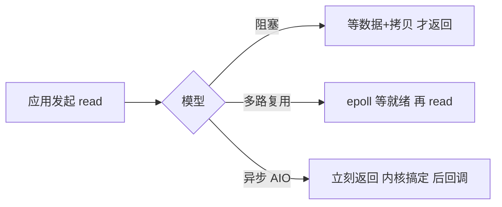

# 操作系统进阶（六）· 文件系统与 I/O 管理

> 进程、内存讲完，剩下两块"对外"的子系统：**文件系统（管持久数据）** 与 **I/O（管设备）**。本文从 VFS 抽象、inode、目录、块分配、日志，讲到磁盘调度、I/O 模型（阻塞/非阻塞/多路复用/异步）、DMA 与缓冲。内容呼应 `o01`（文件描述符表）、`o05`（中断与 DMA 是 I/O 的底层），并对接仓库里 SPI/I2C/UART 等外设协议（`p01-p14`）——那些是"设备侧"，本文是"OS 如何统一管理它们"。

---

## 一、文件系统的抽象层级

用户看到"目录/文件"，磁盘上只有"扇区/块"。二者之间的桥梁是文件系统。经典分层：

```
应用程序
  │  open/read/write/close（POSIX 接口）
  ↓
VFS（虚拟文件系统，统一抽象）
  ↓
具体文件系统（ext4 / FAT / NTFS / UBIFS / LittleFS ...）
  ↓
块设备层（通用块层、I/O 调度）
  ↓
设备驱动（见仓库 p0x 外设协议、o07 驱动）
  ↓
物理介质（SSD/HDD/eMMC/SD/NAND）
```

---

## 二、VFS 与 inode：一切皆文件

### 2.1 VFS（虚拟文件系统）

Unix 哲学"一切皆文件"由 **VFS** 实现：内核定义一套统一对象（`inode`、`dentry`、`file`、`super_block`），各具体文件系统把自身结构"适配"到这套对象上。于是 `read()` 对同一套接口，背后可能是 ext4、可能是管道、可能是 socket、甚至 `/dev` 设备节点。

### 2.2 inode（索引节点）

每个文件/目录在磁盘上对应一个 **inode**，存**元数据**（权限、大小、时间戳、数据块指针），**不含文件名**。文件名在目录项（dentry）里。

```
inode 结构（简化）：
- 文件类型/权限 (rwxr-xr-x)
- 属主 UID/GID
- 大小、时间戳 (atime/mtime/ctime)
- 链接数 (硬链接数)
- 数据块指针（直接 + 间接块，见下）
```

### 2.3 数据块寻址：直接/间接块

小文件直接用 inode 里的"直接指针"指向数据块；大文件用**一级/二级/三级间接块**（指针指向一张"块号表"，表里再指数据），类似页表的"分级"思想（`o04` 第三章）。

### 2.4 硬链接 vs 符号链接

- **硬链接**：多个目录项指向**同一个 inode**（同一份数据），`ln a b`。删一个不影响数据，直到链接数归零。
- **符号链接（软链接）**：是一个独立小文件，内容是"目标路径"，`ln -s a b`。可跨文件系统，但目标删了就成了悬空链接。

---

## 三、目录、路径与挂载

- **目录**本质是一种特殊文件，内容是"文件名→inode 号"的映射表。
- **路径解析**：`/home/user/a.txt` 从根目录 inode 出发，逐层查 dentry 找到最终 inode。
- **挂载（mount）**：把一个文件系统的根挂到目录树的某点，此后访问该点就进入新文件系统（如把 `/dev/sdb1` 挂到 `/mnt`）。

---

## 四、空闲空间管理与文件系统的可靠性

### 4.1 空闲块管理

- **位图（Bitmap）**：每数据块一位，0 空闲 1 占用，简单高效（ext 系常用）。
- **空闲链表**：链接空闲块（FAT 把"下一簇"直接存在 FAT 表里，既是文件链也是空闲管理）。

### 4.2 日志（Journaling）：防崩溃不一致

写文件要改多处（数据块 + inode + 位图），若中途断电会**不一致**（如 inode 说文件存在但位图没更新）。**日志文件系统**（ext3/4、NTFS、UBIFS）先"把 planned 改动写进日志区"，提交标记后再真正落盘；崩溃重启时回放/丢弃未完成事务，保证一致。这对**车载/工业掉电场景**极重要——仓库里 BMS/ECU 的存储选型常因此偏好带掉电保护的文件系统（如 UBIFS on NAND、带 supercap 缓冲的 eMMC）。

---

## 五、I/O 硬件与驱动

- **端口 I/O vs 内存映射 I/O（MMIO）**：设备寄存器被映射到地址空间，CPU 像访问内存一样读写它（ARM 几乎全用 MMIO；x86 还有独立的 `in/out` 端口）。
- **轮询 vs 中断驱动 vs DMA**：
  - 轮询：CPU 反复查状态位，简单但占 CPU（适合极快或启动早期）。
  - 中断：设备就绪才通知 CPU（`o05`）。
  - **DMA（直接内存访问）**：设备**不经过 CPU** 直接把数据搬进/出内存，搬完发中断。解放 CPU，是高吞吐（网卡、显示、音频）的关键。仓库 `p14-dma.md` 专讲这个。

---

## 六、I/O 软件层次与缓冲

```
用户态 Buffer → 库缓冲（如 C 的 FILE*） → 内核页缓存（Page Cache）→ 通用块层 → 驱动 → 设备
```

- **缓冲（Buffering）**：平滑速度差（CPU 快、设备慢），合并小块写。
- **缓存（Caching）**：页缓存把文件数据缓在内存，重复读不落盘，极大提速；`write` 常先写缓存，由内核 `pdflush` 异步刷盘（故掉电可能丢近期写——重要数据用 `fsync`/`O_SYNC`）。
- **双缓冲（Double Buffering）**：一边设备写一块、CPU 处理另一块，流水线化。

---

## 七、磁盘调度（I/O Scheduling）

机械硬盘（HDD）寻道最贵，I/O 调度器重排请求顺序减少磁头移动：
- **FCFS**：简单但寻道乱。
- **SSTF / SCAN（电梯算法）**：沿一个方向扫到底再反向，类似电梯，吞吐好。
- **CFQ / mq-deadline / BFQ**（现代 Linux）：兼顾公平与延迟，`mq-deadline` 保证请求有截止时间不被饿死。
- **SSD 无机械寻道**，调度重点转为合并/并行（NVMe 用多队列），但仍需合并小请求。

---

## 八、五种 I/O 模型（网络编程核心）

以 `read` 网络套接字为例：

1. **阻塞 I/O**：调用后一直等，数据到才返回。最简单，但一线程一连接浪费。
2. **非阻塞 I/O**：立即返回，没数据返回 `EWOULDBLOCK`，需轮询——忙等，少用。
3. **I/O 多路复用（select/poll/epoll）**：一个线程管成千上万连接，哪有事通知你（`epoll` 是 Linux 高并发基石，Nginx/Redis 依赖）。
4. **信号驱动 I/O**：数据就绪发信号（`SIGIO`），再读——少用。
5. **异步 I/O（AIO / io_uring）**：发起后立刻返回，内核**全程搞定**后通知"已完成"（连 copy 都做了）。`io_uring` 是当代 Linux 异步 I/O 的王牌。



---

## 九、常见坑

1. **以为 `write` 已落盘**：默认写页缓存，掉电丢数据；重要数据 `fsync()` 或开 `O_SYNC`。
2. **打开文件不关（fd 泄漏）**：进程有 fd 上限（`ulimit -n`），泄漏久了 `open` 失败（`EMFILE`）。
3. **用 `printf` 调试 DMA/中断**：这些上下文可能不允许该调用；见 `o05`。
4. **epoll 用错 LT/ET 模式**：边缘触发（ET）必须一次读尽（循环到 `EAGAIN`），否则事件不重报、数据卡住。
5. **硬链接跨文件系统**：硬链接只能同文件系统（同 inode 域），跨盘得用软链接或复制。
6. **rootfs/挂载点崩溃**：车载系统突然断电，非日志文件系统易损坏，选日志/掉电安全 FS（UBIFS/F2FS）。
7. **缓冲与 cache 混淆**：缓冲为速度差、缓存为重复读，常共用页缓存但目的不同。

---

## 十、面试要点

1. **VFS 解决什么？** 统一抽象不同文件系统，让 `open/read/write` 一套接口适配 ext4/pipe/socket/设备。
2. **inode 里有什么、文件名在哪？** inode 存元数据与数据块指针；文件名在目录项（dentry），不在 inode。
3. **硬链接 vs 软链接？** 硬链接同 inode（同数据，跨文件系统中不行）；软链接独立文件存路径（可跨、可悬空）。
4. **日志文件系统为什么需要？** 掉电时多步写可能不一致；先写日志再提交，崩溃回放/撤销保证一致。
5. **DMA 是什么？** 设备不经 CPU 直接搬数据到内存，搬完中断；高吞吐关键（见 `p14`）。
6. **页缓存的作用？** 文件数据缓内存，提速重复读；`write` 常先缓存后异步刷盘。
7. **五种 I/O 模型？** 阻塞/非阻塞/多路复用（epoll）/信号驱动/异步（AIO/io_uring）；高并发靠 epoll 与 io_uring。
8. **为什么车载/工业偏好掉电安全 FS？** 突发断电常见，非日志 FS 易损坏，选 UBIFS/F2FS + 掉电保护硬件。
