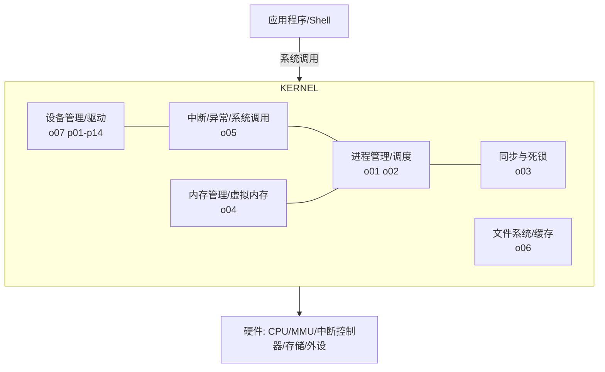

# 操作系统进阶（八）· 全景图、发展趋势与面试总览

> 这是 OS 系列的收官篇。先把前七章串成一张"操作系统全景图"，再讲现代 OS 的发展趋势（微内核、异构 AMP、容器、机密计算、AI 调度），最后给出一份**覆盖全仓库相关章节的高频面试题清单**，方便你面试前总复习。本文与 `02-rtos-tuning.md`、`15-autosar-arch.md`、`b09-b12`（BMS 软件/硬件/产品）、`p01-p14`（外设协议）形成总索引式的呼应。

---

## 一、操作系统全景图

一个 OS 内核在结构上就是"管理四样东西"：**进程（CPU）、内存、文件、设备**，并给上层提供统一接口。

- **进程管理（o01/o02）**：抽象执行流、调度 CPU。
- **内存管理（o04）**：虚拟地址空间、分页、置换。
- **文件系统与 I/O（o06）**：持久数据、设备统一。
- **同步（o03）**：让并发执行流安全协作。
- **中断/系统调用（o05）**：内核被"唤醒"的入口。
- **嵌入式落地（o07）**：上述理论在 Linux/驱动上的具体化。

---

## 二、从"理论内核"到"你仓库的实战"

| 理论主题 | 仓库里的工程对应 |
| --- | --- |
| 进程/线程（o01） | RTOS Task（`02` 第二章）、AUTOSAR SWC（`b09`） |
| 调度算法（o02） | RTOS 抢占/时间片（`02` 三）、RMS 分配 AUTOSAR 优先级（`b09`/`02` 十五） |
| 同步死锁（o03） | RTOS 信号量/互斥量（`02` 七/八）、资源分级法、天花板协议 |
| 内存管理（o04） | MCU 栈/堆/BSS 布局、MPU 保护（`02` 五）、无 MMU 故无分页 |
| 中断/系统调用（o05） | Cortex-M NVIC/SysTick/PendSV/SVC（`02` 五/六/十） |
| 文件系统/I/O（o06） | SPI/I2C/UART/CAN 等外设协议（`p01-p14`）、DMA（`p14`）、掉电安全 FS |
| 嵌入式 Linux（o07） | Linux 驱动/设备树/BMS 上层应用（`b07-b12`） |

这张表就是"操作系统原理 → 你 BMS/汽车电子实战"的翻译字典。

---

## 三、现代 OS 发展趋势

### 3.1 微内核（Microkernel）与安全隔离

传统宏内核（Linux）把文件系统/网络/驱动都放内核态，一处崩全崩。微内核（如 seL4、QNX、Zircon）只保留**最小组件在内核**（IPC、调度、基础内存），其余作**用户态服务进程**，靠 IPC 通信。好处：故障隔离强、可形式化验证（seL4 有数学证明）。汽车座舱/安全关键域越来越倾向微内核（QNX 在车载座舱大量使用，ISO 26262 友好）。

### 3.2 异构多核与 AMP

性能与实时要兼顾：Cortex-A（Linux/QNX）跑生态，Cortex-M（RTOS/AUTOSAR）跑实时，二者 AMP 共存，靠 **核间通信（IPC）**（如 OpenAMP、AUTOSAR IOC）。这与 `15-autosar-arch.md` 的 AP/CP 混合架构一致。

### 3.3 容器与操作系统虚拟化

容器（Docker）用 **namespace（隔离视图）+ cgroup（限制资源）** 在**同一内核**上造出轻量"伪进程级隔离"，比虚拟机省。嵌入式侧有 `balena`/轻量容器跑边缘应用。注意容器不是真 OS 隔离（共享内核），安全边界弱于 VM。

### 3.4 机密计算（Confidential Computing）

用硬件可信执行环境（TEE，如 ARM TrustZone、Intel SGX）把敏感计算放进"加密飞地"，即便 OS 被攻破也看不到数据——对接 `15-autosar-arch.md` 的信息安全（ISO/SAE 21434）与 TrustZone 在车载的落地。

### 3.5 AI 驱动的调度与资源预测

用机器学习预测工作负载、做更优的调度与缓存/预取决策（研究活跃，工业落地早期）。对 BMS/车载，可类比"学习用户驾驶习惯做能耗预测"（呼应 `b02`/`b03` 的数据驱动 SOH/SOC）。

---

## 四、面试总复习清单（按主题）

### 进程/线程（o01）
- 进程 vs 线程；进程切换为何比线程切换贵（换页表 → TLB 失效）。
- `fork`/`exec`/`COW`；僵尸/孤儿进程与回收。
- 协程为何轻量（用户态、不陷内核、不换栈）。

### 调度（o02）
- FCFS 护航效应；SJF 最优但需预知；RR 时间片权衡。
- MLFQ 如何自适应区分 I/O/CPU 密集；CFS 用 vruntime。
- 实时 RMS（周期短者优先、利用率界 ~69%）vs EDF（利用率≤100% 最优）。

### 同步死锁（o03）
- 临界区、互斥；互斥量 vs 二值信号量（所有权/防反转）。
- 条件变量必须 `while` 检查；自旋锁适用多核短临界区。
- 死锁四条件与破坏；银行家算法（安全状态）；活锁 vs 饥饿。
- 优先级反转：继承 vs 天花板（AUTOSAR 用天花板）。

### 内存（o04）
- 分页无外部碎片、分段有外部碎片；段页式结合。
- 虚拟内存按需调页、缺页（minor/major）；TLB 与 ASID。
- 置换：OPT/FIFO(Belady)/LRU/Clock；抖动与工作组模型。
- RTOS 无 MMU 故无虚拟内存，靠 MPU 保护。

### 中断/系统调用（o05）
- 中断/异常/系统调用三者区别。
- 系统调用旅程：`syscall` 提权切栈查表返回。
- 上半部/下半部（softirq/tasklet/workqueue）；中断上下文不能睡。
- Cortex-M PendSV 延迟切换（`02`）。

### 文件系统/I/O（o06）
- VFS 统一抽象；inode 不含文件名；硬链/软链区别。
- 日志 FS 防掉电不一致（车载关键）。
- DMA 解放 CPU；页缓存与 `fsync`；epoll/io_uring 高并发。

### 嵌入式 Linux（o07）
- 内核态/用户态、LKM；设备树 `compatible` 匹配。
- 字符设备 `file_operations` + `copy_to/from_user`；platform 驱动。
- kmalloc/vmalloc/mmap；Linux vs RTOS 对照。

### 与仓库实战交叉题
- **RTOS 任务为何切换比 Linux 进程快？**（无 MMU、不换页表、`02`/`o01`/`o04`）
- **AUTOSAR Os 的 Counter 怎么绑定时器？优先级怎么定？**（RMS，`02` 十五/`b09`/`o02`）
- **BMS 多任务并发怎么防竞争？**（信号量/互斥量/资源分级，`02`/`b04` 均衡/`o03`）
- **车载为什么偏好日志/掉电安全 FS？**（`o06` 4.2）
- **域控为何 AMP 而非单 RTOS？**（`o07` 八/`15-autosar-arch.md`）

---

## 五、常见坑（跨章节综合）

1. **把"OS 概念"直接套到无 MMU 的 MCU**：分页/虚拟内存/进程隔离在 Cortex-M 上不成立，用 MPU + RTOS 任务模型替代。
2. **忽视"理论最优"的前提**：SJF 需预知、RMS 利用率界只是充分非必要、OPT 不可实现——面试/选型别记死公式。
3. **同步原语跨上下文乱用**：中断里用会睡的锁、条件变量用 `if`（见 `o03`/`o05`）。
4. **缺页/交换误解为硬件故障**：major fault 从磁盘读是正常慢路径，但过多就是内存压力（抖动，`o04` 八）。
5. **容器当真隔离**：共享内核，安全边界弱于 VM/TEE。
6. **实时需求错配 OS**：硬实时别用普通 Linux 裸跑，上 PREEMPT_RT 或外包 RTOS 核。

---

## 六、结语

操作系统不是"一门课"，而是你写每一行嵌入式代码背后的**隐形地基**：你用的 `printf` 走的是 `write` 系统调用（`o05`/`o06`），你开的 RTOS 任务是一个轻量线程（`o01`/`02`），你配的 AUTOSAR 优先级背后是 RMS（`o02`/`b09`），你担心的栈溢出是内存管理的一环（`o04`/`02`），你调的 SPI 最终由驱动 + 中断 + DMA 串起来（`o05`/`o06`/`p01`）。把这套全景图内化，就能从"会调 API"升级到"懂为什么这么设计、出问题往哪查"。

> 至此，OS 进阶系列（o01–o08）与仓库既有 `02-rtos-tuning.md`、`15-autosar-arch.md`、`b09-b12`、`p01-p14` 共同构成一条"**理论 → RTOS 工程 → AUTOSAR → 嵌入式 Linux → BMS 落地**"的完整操作系统知识链。
