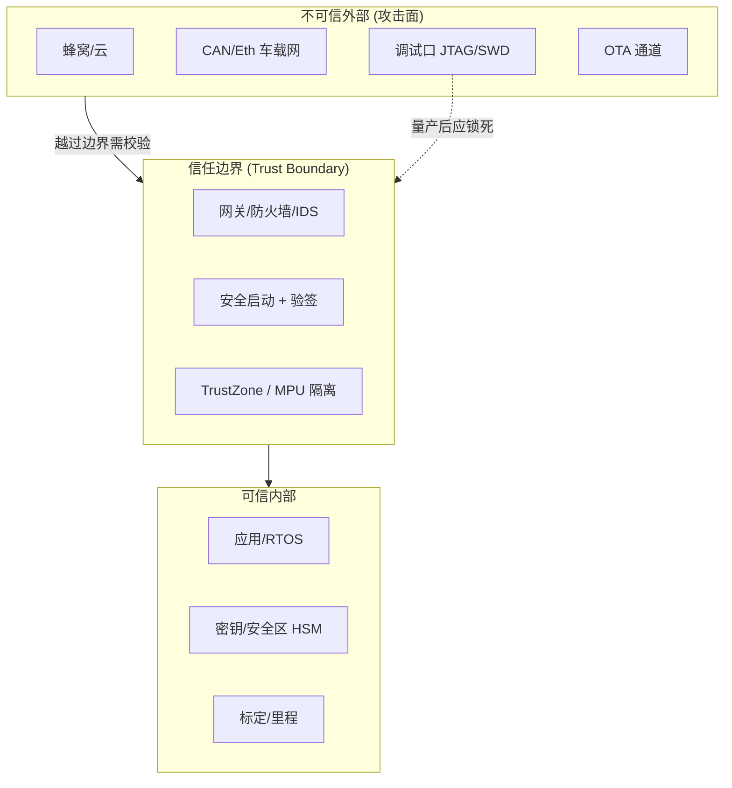
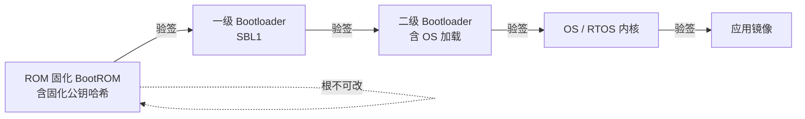
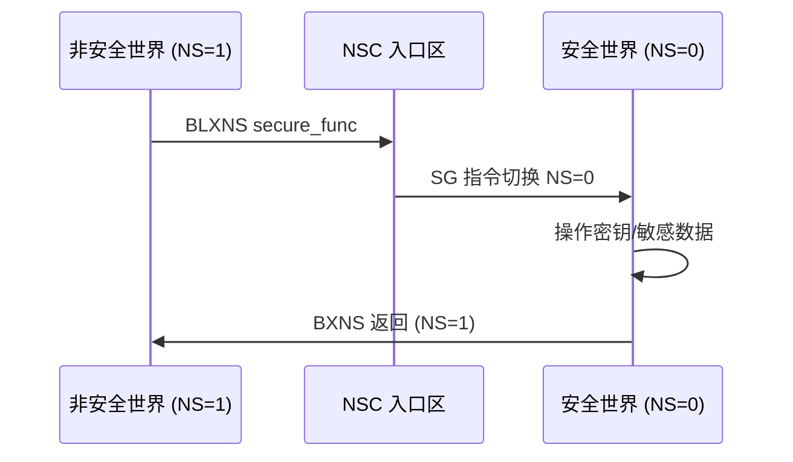
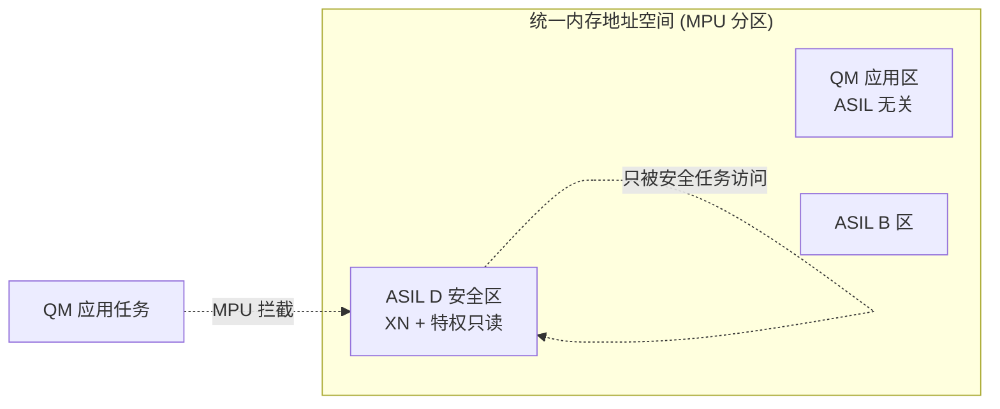
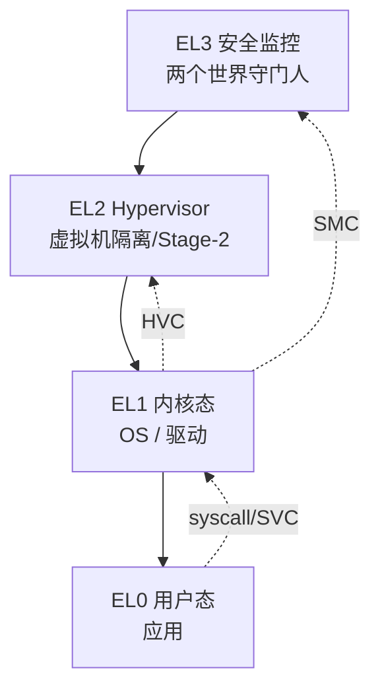
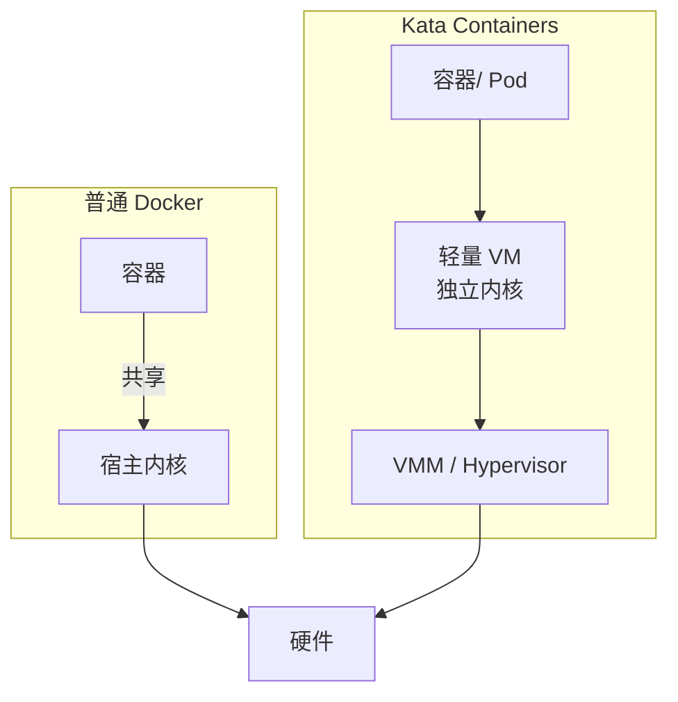
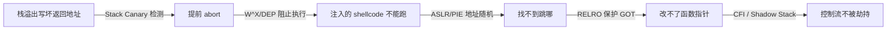

# 操作系统安全与隔离：从 TrustZone 到容器/虚拟机——嵌入式与车载的工程级深度技术章节

> 本文面向汽车电子、工业控制、IoT 等深度嵌入式领域的软件与系统工程师，系统性地拆解"操作系统级安全与隔离"这一课题：从一个物理核如何被劈成安全/非安全两个世界（ARM TrustZone-A/M），到可信执行环境（TEE / OP-TEE）如何托管密钥与敏感算法；从 MPU/MMU 这种"撞墙式"硬件隔离，到用户态、系统调用过滤、能力（capability）这类软件隔离；再到当单内核隔离不够用时，嵌入式容器（LXC/Docker）、虚拟机背书容器（Kata）、静态分区虚拟机监控器（Jailhouse）、车载虚拟机（Xen on ARM）如何把多个系统塞进同一颗 SoC。文中所有机制均为量产或主流开源方案（ARM TrustZone、OP-TEE、Jailhouse、Xen、Kata、LXC），代码片段以 Cortex-M33 / Cortex-A53 + Linux 为例，原理同样适用于瑞萨 RH850/U2A、NXP S32G/S32K3、TI TDA4 等车规平台。
>
> 本文在通用安全原理之上，重点补齐三块工程纵深：**A. 芯片模块与安全硬件（HSM/TRNG/SAU/TZASC）**、**B. 驱动与固件实现（安全启动验签、SG 调用、MPU 配置、hypervisor cell）**，以及 **C. 量产落地（ISO 21434 / TARA、调试口锁定、OTA 签名、侧信道与故障注入评估）**，并对威胁建模、漏洞缓解、功能安全交叉（Freedom From Interference）做工程化收口。

---

## 一、一个真实的攻击故事：为什么"隔离"是底线

某款出口海外的电动车，售后出现一类诡异投诉：少数车辆里程读数被悄悄"清零"或"调小"，二手车残值被做手脚。安全团队复盘攻击链，发现攻击者根本不需要拆车——只要通过 OBD-II 口接上诊断仪，利用未及时封堵的 UDS 调试服务（0x27 安全访问的默认种子-密钥算法过弱），就能拿到刷写权限，再把一段未签名校验的标定固件写进应用区；更糟的是，该车的安全启动**只验了 bootloader，没验应用镜像**，于是恶意固件直接跑了起来，顺手把存储在 EEPROM 里的里程计数改掉。

这条攻击链里没有一行"神奇漏洞"，全是**隔离与信任链缺位**的叠加：

- 调试口没在量产后锁死（攻击面敞开）；
- 安全启动信任链不连续（应用镜像未验签）；
- 密钥与里程数据放在同一片可被应用改写的 Flash 里（没有用 MPU/TrustZone 做硬件隔离）；
- OTA 只做了传输加密，没做端到端签名校验（中间人可替换）。

一句话：**没有隔离，就没有安全**。在车规语境下，一次成功的固件篡改可能不只是"调表"，而是让刹车标定参数被改写、让电池热管理算法被绕过——直接击穿 ISO 26262 的功能安全论证。所以本文把"安全"和"隔离"并列：安全是目标，隔离是实现安全的首要手段。

### 1.1 攻击者的成本曲线

理解安全的工程优先级，要看"攻击者成本 vs 我们防御成本"。把调试口留在量产后，等于给攻击者留了一扇没锁的门，防御成本几乎为零却能挡掉一大类人；而对抗专业实验室的故障注入（电压毛刺、激光 Fault Injection），则需要芯片级的传感器与锁步核，成本高昂。工程上遵循**"用最低成本挡掉最大概率攻击"**原则：先把调试口锁了、把信任链补全、把密钥用硬件隔离，再去谈对抗国家级实验室。

---

## 二、威胁建模：先想清楚"谁攻击什么"

安全工程的第一条铁律：**不要一上来就堆技术，先建模**。没有威胁模型的安全设计，往往是"哪里漏补哪里"的被动救火。

### 2.1 STRIDE 与资产-威胁-缓解

业界常用 STRIDE 框架枚举威胁：

| 类别 | 含义 | 嵌入式典型实例 |
| --- | --- | --- |
| S (Spoofing) | 伪造身份 | 伪造 ECU 节点发 CAN 帧、伪造 OTA 服务端 |
| T (Tampering) | 篡改数据/代码 | 改写标定参数、刷恶意固件、改里程 |
| R (Repudiation) | 抵赖 | 操作无日志，事后无法追责 |
| I (Information Disclosure) | 信息泄露 | 侧信道偷密钥、调试口读固件 |
| D (Denial of Service) | 拒绝服务 | 总线泛洪、看门狗被卡死 |
| E (Elevation of Privilege) | 提权 | 应用态攻破内核、非安全世界越权访问安全世界 |

### 2.2 攻击面枚举与信任边界

工程上要把"攻击面"一条条列出来，再画"信任边界"：

```text
[外部网络/蜂窝] ──▶ [车机/网关] ──▶ [CAN/Eth 车载网] ──▶ [ECU 应用] ──▶ [标定/密钥存储]
        ↑调试口(JTAG/SWD)        ↑OTA 服务端           ↑诊断(UDS)        ↑Flash/SRAM
```

- **调试接口（JTAG/SWD）**：量产前是救命稻草，量产后是头号攻击面，必须锁。
- **外部通信（CAN/LIN/Eth/蜂窝）**：默认不可信，所有入站数据按"敌方输入"处理。
- **OTA 通道**：只加密不够，必须服务端签名 + 设备端验签。
- **存储（Flash/EEPROM）**：密钥、里程、标定必须硬件隔离，应用不可直写。

mermaid 画出信任边界与隔离层的关系：



### 2.3 常见坑

- **只列技术不列资产**：威胁建模要从"我要保护什么资产"出发（密钥？控制权限？隐私？），而不是"我有哪些加密算法"。
- **信任边界画错**：把"已经过网关"误当成"已可信"，忘了车内网 CAN 本身无认证，网关被攻破后车内网即沦陷。
- **忽略侧信道/物理攻击**：纯软件建模会漏掉电压毛刺、时钟故障注入、功耗分析，这些在实验室级攻击里是常规手段。

---

## 三、硬件信任根与信任链：安全启动

所有安全机制的起点，是一个**无法被篡改的起点**——硬件信任根（Root of Trust, RoT）。

### 3.1 信任链（Chain of Trust）

从一个固化在芯片 ROM 里、出厂即不可改的"第一段代码"开始，每一级只加载并验签下一级，形成链式信任：



- **RoT 不可改**：固化在 ROM（或 eFuse 锁定的 OTP），攻击者无法替换。
- **每一跳都验签**：用上一跳写入的非对称公钥（或哈希）验证下一跳的签名。
- **防回滚**：镜像带版本号，设备只接受 ≥ 当前版本号的固件，防止刷回有漏洞的老版本。

### 3.2 镜像签名与验签

主流做法：固件用私钥 `S` 签名（ECDSA P-256 最常见），设备用固化公钥 `V` 验签；签名对象通常是固件的哈希（SHA-256），而非整段固件。

伪代码（安全启动验签核心）：

```c
/* 安全启动：验证下一级镜像的 ECDSA 签名 */
typedef struct {
    uint32_t magic;
    uint32_t version;        /* 防回滚版本号 */
    uint8_t  hash[32];       /* SHA-256 of payload */
    uint8_t  sig[64];        /* ECDSA-P256 签名 (r||s) */
} image_header_t;

int verify_image(const uint8_t *base, uint32_t len)
{
    const image_header_t *hdr = (const image_header_t *)base;
    const uint8_t *payload = base + sizeof(image_header_t);

    /* 1) 防回滚：版本号必须单调 */
    if (hdr->version < get_anti_rollback_counter())
        return -1;                       /* 拒绝旧版本 */

    /* 2) 重算 payload 哈希并比对（防篡改） */
    uint8_t calc[32];
    sha256(payload, len - sizeof(image_header_t), calc);
    if (crypto_cmp_ct(calc, hdr->hash, 32) != 0)
        return -1;                       /* 常量时间比较，防时序侧信道 */

    /* 3) 用固化公钥验签 */
    if (ecdsa_verify(PUBKEY_FIXED, hdr->hash, hdr->sig) != 0)
        return -1;                       /* 验签失败 */

    /* 4) 只有全部通过才允许跳转 */
    set_anti_rollback_counter(hdr->version);   /* 提交新版本 */
    return 0;
}
```

### 3.3 工程实现要点

- **公钥固化**：公钥哈希烧进 eFuse/OTP，验签前先比对公钥本身是否合法（防替换公钥）。
- **常量时间比较**：`crypto_cmp_ct` 必须不随比较位置提前返回，否则泄露匹配进度（时序攻击）。
- **防回滚计数器**：用单调计数器（eFuse 烧写位，或安全的 version 区），且只在验签完全通过后提交。
- **调试口锁定**：量产后通过 eFuse 永久关闭 JTAG/SWD（或设"安全调试"需认证）。

### 3.4 常见坑

- **信任链断裂**：只验 bootloader 不验应用（故事里的真实故障）；或验签通过后才做版本检查（应先查版本再验签，省算力也防逻辑乱序）。
- **公钥可被改**：公钥放在可被改写的分区，攻击者换公钥即可伪造签名。
- **比较非恒定时间**：用 `memcmp` 比哈希/签名，泄露时序，可被远程侧信道利用。
- **防回滚缺失**：老版本固件带已知漏洞，攻击者刷回去即可利用。

---

## 四、ARM TrustZone：把一个物理核劈成两个世界

TrustZone 是 ARM 在**体系结构层面**提供的隔离：同一颗 CPU，通过额外的"安全位"（NS 位），在时间和地址空间上被切成**安全世界（Secure World）**与**非安全世界（Non-secure World）**两个执行环境，各自有独立的内存视图、外设与中断。

### 4.1 A-profile TrustZone（Cortex-A）

- **NS 位**：存在 CPU 状态位（SCR.NS）和总线信号（AXI 上的 `AxPROT[1]` / `NS` 线）。非安全世界发出的所有总线访问，NS=1，硬件据此拒绝其访问安全资源。
- **安全监控调用（SMC）**：非安全世界通过 `SMC` 指令陷入 EL3（安全监控器），请求安全服务；EL3 是"两个世界的守门人"。
- **TZASC / TZPC**：TrustZone 地址空间控制器 / 保护控制器，把 DDR 与外设按安全/非安全切分。安全 DDR 只有 NS=0 的访问能进。
- **安全外设**：加密加速器、TRNG、密钥存储等只挂在安全侧，非安全世界看不到也摸不到。

### 4.2 M-profile TrustZone（TrustZone-M，Armv8-M）

Cortex-M23/M33/M55 引入，对 MCU 尤其重要（BMS/网关大量用 M33）。

- **SAU（安全属性单元）+ IDAU（实现定义属性单元）**：共同决定每段地址是 Secure / Non-secure / Non-secure-Callable（NSC）。
- **NSC 区域**：唯一允许非安全代码"跳入"安全世界的入口区，里面只放**安全网关（SG）**指令。
- **调用规则**：非安全函数只能经由 NSC 区的 `SG` 指令进入安全函数；安全函数返回时用 `BXNS`；安全函数调用非安全回调用 `BLXNS`。

汇编骨架（安全函数入口与跨世界调用）：

```armasm
    .section .text.secure
    .global secure_add
secure_add:
    SG                  /* 必须是 NSC 区第一条：非安全世界只能从这里进 */
    /* 进入安全世界，NS 位被硬件清 0 */
    PUSH {R0-R3, LR}
    LDR  R0, =secret_key
    ...                 /* 操作密钥，非安全世界不可见 */
    POP  {R0-R3, LR}
    BXNS LR             /* 返回非安全世界 */

    .section .text.ns_caller
    .global ns_entry
ns_entry:
    /* 非安全侧调用安全函数 */
    BLXNS secure_add    /* 经 NSC 陷入安全世界 */
```

寄存器与配置（CMSIS 风格）：

```c
/* SAU 配置：把 0x3000_0000 起 256KB 标为 Secure，0x3004_0000 起 64KB 为 NSC */
SAU->RNR  = 0;
SAU->RBAR = 0x30000000UL;            /* 基址，bit0=0(Secure) */
SAU->RLAR = (0x3003FFFFUL & SAU_RLAR_LADDR_Msk) | SAU_RLAR_ENABLE_Msk;
SAU->RNR  = 1;
SAU->RBAR = 0x30040000UL | 1;        /* bit0=1 -> NSC */
SAU->RLAR = (0x3004FFFFUL & SAU_RLAR_LADDR_Msk) | SAU_RLAR_ENABLE_Msk;
SCB->AIRCR = (0x05FAUL << SCB_AIRCR_VECTKEY_Pos) | SCB_AIRCR_BFHFNMINS_Msk;
/* BFHFNMINS=1: 让 BusFault/HardFault/NMI 也走安全栈，避免被非安全劫持 */
```

mermaid 画出 M-profile 跨世界调用流：



### 4.3 PSA 与熵源（TRNG）

- **PSA Certified**：ARM 的平台安全架构认证，分 Level 1~3（加上"Functional API"），嵌入式 SoC 常标 L2/L3。
- **NIST SP 800-90B**：对真随机数发生器（TRNG）的熵源健康测试标准。密钥安全的前提是熵够随机——用 `rand()` 或弱 LFSR 当密钥源是灾难。
- **HSM / EVITA**：车规硬件安全模块，按 EVITA 轻量/中等/全功能分级，提供密钥存储、加解密、MAC、安全时钟。

### 4.4 常见坑

- **NSC 区放了非 SG 代码**：非安全世界只能从 `SG` 进安全世界，若 NSC 区混入了普通函数，链接器/配置错误会导致安全函数被非预期调用或干脆跳飞。
- **SAU 区域未对齐/重叠**：SAU 基址与上限有对齐要求，重叠区域以"安全"为准但易引起困惑，务必工具生成并审查。
- **忘了锁 AIRCR**：不置 `BFHFNMINS`，硬故障可能被非安全世界触发并污染安全栈。
- **把密钥当普通全局变量**：密钥必须放在安全 RAM/Flash，绝不出现在非安全世界可读的地址。

---

## 五、TEE 与 OP-TEE：在安全世界里跑可信应用

TEE（Trusted Execution Environment，可信执行环境）是在安全世界（Secure World）里运行的可信子系统，与非安全世界的 REE（Rich Execution Environment，如 Linux/Android）并存。典型实现是 **OP-TEE**（开源，符合 GlobalPlatform TEE 规范）。

### 5.1 架构分层

```mermaid
flowchart TB
    subgraph REE["非安全世界 (REE / Linux)"]
        CA[Client App (CA)]
        LIB[libtee / TEE Client API]
    end
    subgraph SW["安全世界 (Secure World)"]
        CORE[OP-TEE Core<br/>可信内核 + 驱动]
        TA1[Trusted App A<br/>密钥管理]
        TA2[Trusted App B<br/>算法/签名]
    end
    CA -->|TEE Client API| LIB
    LIB -->|SMC 陷入 EL3/安全监控| CORE
    CORE --> TA1
    CORE --> TA2
```

- **CA（Client App）**：普通 Linux 用户态程序，通过 GP 标准的 TEE Client API 发起请求。
- **TA（Trusted App）**：运行在安全世界的可信应用，持有密钥、执行敏感算法。
- **共享内存**：CA 与 TA 通过预先登记的共享缓冲区传递大数据，避免把敏感数据长期留在非安全侧。

### 5.2 代码片段：CA 调用 TA

```c
/* 非安全世界：调用 TA 做安全签名 */
#include <tee_client_api.h>

TEEC_Context ctx;
TEEC_Session sess;
TEEC_Result res;
TEEC_UUID uuid = { /* TA 的 UUID */ };

TEEC_InitializeContext(NULL, &ctx);
TEEC_OpenSession(&ctx, &sess, &uuid, TEEC_LOGIN_PUBLIC, NULL, NULL, NULL);

uint8_t buf[32] = { /* 待签名数据 */ };
TEEC_Operation op;
memset(&op, 0, sizeof(op));
op.paramTypes = TEEC_PARAM_TYPES(TEEC_MEMREF_TEMP_INPUT,
                                 TEEC_MEMREF_TEMP_OUTPUT,
                                 TEEC_NONE, TEEC_NONE);
op.params[0].tmpref.buffer = buf;
op.params[0].tmpref.size   = sizeof(buf);
op.params[1].tmpref.buffer = sig_out;
op.params[1].tmpref.size   = sizeof(sig_out);

res = TEEC_InvokeCommand(&sess, CMD_SECURE_SIGN, &op, NULL);
/* TA 在安全世界用受保护密钥完成签名，签名密钥永不离开安全世界 */
```

### 5.3 工程要点

- **参数必须校验**：TA 收到的所有指针/长度都要检查落在合法共享内存内，否则非安全世界可构造越界指针读安全内存。
- **会话与身份**：TA 可按 CA 身份做访问控制，避免任意 CA 调任意命令。
- **时序侧信道**：安全算法（尤其是比较、分支）要避免随密钥数据变化的分支/访存，否则被非安全侧计时攻击。

### 5.4 常见坑

- **TA 当万能保险箱**：TEE 不是"把代码丢进安全世界就安全"，TA 自身漏洞（越界、TOCTOU）照样可被非安全世界利用。
- **共享内存未清**：敏感数据在共享内存残留，非安全侧可读；用完应清零。
- **SMC 被滥用**：所有 SMC 都应被 EL3 严格校验命令号与参数，防止非安全世界伪造请求。

---

## 六、MPU/MMU 隔离：让错误"撞墙"

当隔离粒度不需要"两个世界"，但需要"让错误代码碰不到别人"，**MPU（Cortex-M）** 与 **MMU（Cortex-A）** 是性价比最高的硬件隔离手段。

### 6.1 MPU（Cortex-M）：8 个可配区域

MPU 把地址空间切成若干"区域"，每个区域配属性：

- **AP（访问权限）**：特权可读写 / 只读、非特权不可访问 / 只读等。
- **XN（Execute Never）**：不准执行，数据区设 XN 可防代码注入。
- **TEX/C/B/S**：内存类型与缓存策略（Device / Normal / 直写 / 回写）。
- **背景区（Background region）**：特权模式下可访问未覆盖地址（慎用，易留后门）。

配置骨架（CMSIS MPU 驱动）：

```c
/* 用 MPU 把"看门狗配置寄存器"设为特权只读、不可执行，应用态碰不到 */
MPU->CTRL = 0;                          /* 先关 MPU 再改 */
MPU->RNR  = 0;
MPU->RBAR = (0x40002000UL & MPU_RBAR_ADDR_Msk) /* WDT 基址 */
          | MPU_RBAR_VALID_Msk | 0;
MPU->RLAR = (0x40002FFFUL & MPU_RLAR_LIMIT_Msk)
          | MPU_RLAR_ATTR_Msk                     /* 属性索引 0 */
          | MPU_RLAR_EN_Msk;
/* 属性 0：AP=Privileged RO(0b10 经 AP 编码), XN=1, 强序 Device */
/* 开 MPU，且使能特权默认映射到背景区关闭的头保护 */
MPU->CTRL = MPU_CTRL_ENABLE_Msk | MPU_CTRL_PRIVDEFENA_Msk;
__DSB(); __ISB();
```

### 6.2 MMU（Cortex-A）：页表 + 权限 + PAN/PXN

MMU 以页（通常 4KB）为粒度，提供：

- **AP/UXN/PXN**：用户态可否访问、是否可执行（PXN 限制特权执行、UXN 限制用户执行）。
- **PAN（Privileged Access Never）**：内核态默认不能访问用户态内存，需显式开关，防"内核误用用户指针"类漏洞。
- **Domain / Stage-2（虚拟化下）**：配合 EL2 做虚拟机隔离。

### 6.3 Freedom From Interference（FFI）

ISO 26262 要求不同 ASIL 等级软件间"免干扰"。工程上常用 MPU：



QM（低安全等级）任务一旦越权访问 ASIL D 区，MPU 直接触发 MemFault，被安全监控捕获——这就是"撞墙"。

### 6.4 常见坑

- **区域重叠与对齐**：MPU 区域大小须为 2 的幂且基址对齐；重叠时以"更严格"属性生效，但配置易错。
- **Cache 与 MPU 属性不一致**：某区标 Device 却按可缓存访问，导致 DMA 一致性问题或读到旧值。
- **XN 忘了开**：把栈/堆标明可执行，给代码注入开绿灯。
- **背景区留后门**：`PRIVDEFENA=1` 让未覆盖地址对特权可读写，若误留则隔离形同虚设。

---

## 七、特权分级与系统调用过滤

即便在同一内核里，也要用特权分级把"能做什么"最小化。

### 7.1 特权环（Cortex-A）



- **EL0 用户态**：跑应用，不能直接碰硬件，要过系统调用（SVC）陷入 EL1。
- **EL1 内核态**：OS/驱动，拥有特权，但受 PAN/PXN 约束。
- **EL2 虚拟层**：管虚拟机，做 Stage-2 地址翻译。
- **EL3 安全层**：管安全世界切换，最高特权。

### 7.2 系统调用过滤（seccomp-BPF）

Linux 上可用 seccomp 把"进程能用哪些 syscall"用 BPF 程序过滤，实现最小权限：一个只做加解密的 TA 类进程，只保留 `read/write/exit`，其余 syscall 一律 kill。

```c
/* 用 seccomp 限制进程只能调用 read/write/exit */
#include <seccomp.h>
scmp_filter_ctx ctx = seccomp_init(SCMP_ACT_KILL);   /* 默认杀 */
seccomp_rule_add(ctx, SCMP_ACT_ALLOW, SCMP_SYS(read),  0);
seccomp_rule_add(ctx, SCMP_ACT_ALLOW, SCMP_SYS(write), 0);
seccomp_rule_add(ctx, SCMP_ACT_ALLOW, SCMP_SYS(exit),  0);
seccomp_load(ctx);                                    /* 生效，不可逆 */
```

### 7.3 能力（capabilities）vs 全权 root

不要为了"某个进程要绑 80 端口"就给整个 root。Linux capability 把 root 权限拆成细粒度（CAP_NET_BIND_SERVICE、CAP_SYS_TIME…），只发所需。

### 7.4 常见坑

- **以 root 跑一切**：容器/进程全 root，一旦被攻破即全盘失守。
- **seccomp 规则过宽**：默认 ALLOW + 个别 DENY，等于没防；应默认 DENY + 白名单。
- **用户态指针未校验**：内核/驱动直接解引用用户传来的指针，造成提权或信息泄露。

---

## 八、嵌入式容器与虚拟机：当隔离需要"多个系统"

单内核 + MPU 的隔离，在"要跑多个供应商、多个 OS、甚至遗留系统"的车载/工业场景里不够用了。于是**容器**与**虚拟机**下沉到嵌入式。

### 8.1 为什么嵌入式也要容器/VM

- **多供应商共存**：Tier1 的算法、OEM 的应用、第三方的安卓，谁也不信谁，需要强隔离。
- **安全等级混布**：QM 的娱乐系统与 ASIL 的控制系统在同一颗 SoC，必须用虚拟机做 FFI。
- **OTA 粒度与回滚**：容器/VM 镜像可独立更新、独立回滚。
- **遗留 + 新系统**：老 RTOS 与新 Linux 并存，分区 hypervisor 最省事。

### 8.2 容器：LXC / Docker 在嵌入式

容器共享宿主内核，靠 **namespace（隔离视图）+ cgroup（限制资源）** 实现轻量隔离。

- **Yocto/Buildroot 里做 Docker**：嵌入式 Linux 发行版可带 Docker，跑 OCI 镜像。
- **局限**：共享内核 → 内核漏洞一损俱损；实时性受宿主调度影响；体积仍不小。

```text
宿主机内核 (Linux)
 ├─ namespace: PID/Net/Mount/IPC/UTS 各自独立
 ├─ cgroup: 每容器 CPU/内存/IO 上限
 └─ 容器 A (算法)  容器 B (服务)  容器 C (诊断)
    ↑ 共享同一个内核，隔离弱于 VM
```

### 8.3 Kata Containers：用虚拟机背书的容器

Kata 让每个容器/ pod 跑在一个**轻量虚拟机**里（用 QEMU 或轻量 VMM），硬件级隔离却保持 OCI 兼容——开发者无感，安全性接近 VM。



适用：既要容器化交付的便利，又要多租户强隔离（云边一体、车载服务域）。

### 8.4 Jailhouse：静态分区 hypervisor

Jailhouse 与众不同——它**不调度、不做完整虚拟化**，而是把硬件"切格子"：Linux 作 root cell 占大部分资源，RTOS（如 Zephyr/裸机）作 non-root cell 占一小块，二者物理隔离、各自跑自己的 OS。

```c
/* Jailhouse cell 配置（节选）：给 RTOS 安全岛分一块内存 + 一个 UART */
struct jailhouse_cell_descr {
    .name = "rtos-island",
    .cpus = 0x2,                 /* 独占 CPU1 */
    .mem_regions = {
        { .phys_start = 0x80000000, .virt_start = 0x80000000,
          .size = 0x01000000, .flags = JAILHOUSE_MEM_READ |
          JAILHOUSE_MEM_WRITE | JAILHOUSE_MEM_EXECUTE },
        /* UART 设备透传给该 cell */
        { .phys_start = 0x4000c000, .virt_start = 0x4000c000,
          .size = 0x1000, .flags = JAILHOUSE_MEM_IO },
    },
};
```

适用：**硬实时安全岛 + Linux 通用**的经典搭配（如动力域控里 Linux 跑诊断、RTOS 跑 ASIL D 控制回路）。

### 8.5 Xen 与车载：Dom0 / DomU

Xen 是全功能 type-1 hypervisor，在车载（尤其 S32G、TDA4）用作"车载服务器"：

- **Dom0**：特权管理域，跑 Linux，负责创建/销毁其他域、设备分配。
- **DomU**：客域，可跑 Android（座舱）、RTOS（控制）、unikernel（单一服务）。
- **Xen on ARM** 利用 EL2 做 Stage-2 翻译，GIC 虚拟化把中断精准投递到对应域。

```mermaid
flowchart TB
    HW[SoC: CPU(EL2)/内存/外设] --> XEN[Xen Hypervisor<br/>Stage-2 隔离]
    XEN --> D0[Dom0 Linux<br/>设备管理]
    XEN --> D1[DomU Android<br/>座舱/信息娱乐]
    XEN --> D2[DomU RTOS<br/>ASIL 控制]
    XEN --> D3[DomU Unikernel<br/>网关服务]
```

与 Adaptive AUTOSAR 的关系：Adaptive 平台常跑在 POSIX OS（如 Linux）上，而多个 Adaptive/Classic 应用可分居不同 Xen 域，实现 FFI 与独立 OTA。

### 8.6 ARM 虚拟化扩展（EL2）

- **Stage-2 翻译**：客户机物理地址（IPA）→ 宿主物理地址（PA），hypervisor 控制映射，实现内存隔离。
- **GIC 虚拟化**：VGIC 让中断直接投到对应 vCPU，减少陷入。
- **陷阱（trap）**：敏感指令（MRS/MSR 系统寄存器）被 EL2 捕获模拟，客户机无感。

### 8.7 常见坑

- **容器当 VM 用**：以为 Docker 隔离够了，结果共享内核漏洞让所有容器一起裸奔。
- **Jailhouse 配置重叠**：两个 cell 抢同一段内存/中断，互相踩。
- **实时性被虚拟化吃掉**：VM 调度引入抖动，硬实时任务必须绑在专属 CPU/non-root cell，不能和普通 Linux 混跑。
- **设备透传缺隔离**：把整块外设透传给某域却没隔离其 DMA，域间仍可通过 DMA 互访内存。

---

## 九、漏洞缓解工程：让利用变难

即使代码有 bug，也要让攻击者"利用不了"。一层层 mitigation 把利用链切断：



- **Stack Canary**：栈返回地址前放随机 cookie，函数返回时校验，被改即 abort。
- **W^X / DEP**：内存页要么可写要么可执行，不可同时（杜绝注入即执行）。
- **ASLR / PIE**：代码/库/栈地址随机化，攻击者难猜绝地址。
- **RELRO**：把 GOT 表重定位后设为只读，防改函数指针。
- **CFI / Shadow Stack**：控制流完整性（如 x86 CET / ARM 的 BTI + PAC + RDAI），保护返回地址与间接跳转。
- **内存安全语言**：用 Rust、或遵守 MISRA C，从源头减少 UAF/溢出。

GCC/Clang 常用开关清单：

```text
# 嵌入式常见加固编译选项
-fstack-protector-strong      # canary
-Wl,-z,relro,-z,now           # RELRO + 立即绑定
-fPIE -pie                    # 位置无关 + ASLR
-Wl,-z,noexecstack            # 栈不可执行 (DEP)
-fcf-protection=full          # CET/CFI (x86)
-mbranch-protection=pac-ret+bti  # ARMv8.3 PAC + BTI
-fno-strict-overflow          # 防整数溢出优化陷阱
```

### 9.1 常见坑

- **开了 PIE 忘了 `-pie`**：只 `-fPIE` 不产生位置无关可执行文件，ASLR 无效。
- **测试固件带全量调试符号**：符号表泄露函数名/地址，给逆向省大劲；发布版应 strip。
- **canary 只护栈不护堆**：堆溢出仍需 ASAN/边界检查或换安全分配器。

---

## 十、信息安全 × 功能安全：ISO 21434 与车载

安全（Security）与功能安全（Safety）在车上必须打通：

- **ISO/SAE 21434**：汽车网络安全工程标准，规定从概念到退役的网络安全流程，核心是 **TARA（威胁分析与风险评估）**。
- **TARA**：识别资产→威胁→攻击路径→影响评级（严重度/可控性/可行性）→确定缓解措施与 AL（保障等级）。
- **HSM / EVITA**：密钥与加解密硬件根，安全启动、SecOC（安全车载通信，带 MAC 的 CAN 帧）都依赖它。
- **IDPS**：车载入侵检测与防御，监测异常 CAN/以太网流量。
- **与安全启动 / FFI 的交叉**：安全机制（签名校验、MPU 隔离）既是安全需求也是安全论证证据。

原则：**Safety 关心"系统会不会伤到人"，Security 关心"坏人能不能让它伤到人"**——没有 Security 的 Safety 是空中楼阁。

---

## 十一、工程落地清单（Checklist）

部署一套"过得去审计"的嵌入式安全基线，至少覆盖：

1. **安全启动**：完整信任链（bootloader→OS→应用全验签）+ 防回滚 + 公钥固化。
2. **密钥管理**：密钥仅在 HSM/TrustZone 安全区，永不进非安全内存，TRNG 熵达标（90B）。
3. **隔离**：用 MPU/TrustZone/TEE 做资产隔离；多系统用 VM/分区 hypervisor 做 FFI。
4. **调试口**：量产后 eFuse 锁死 JTAG/SWD，或仅"安全调试"需认证。
5. **OTA**：端到端签名校验 + 加密 + 回滚保护 + 断电可恢复（A/B 分区）。
6. **漏洞缓解**：canary + RELRO + PIE/ASLR + W^X + CFI 全开，发布 strip 符号。
7. **最小权限**：应用非 root、seccomp 白名单、capability 按需发。
8. **进程/通信**：跨域通信走认证通道（SecOC/IPsec/TLS），不信任车内网。
9. **侧信道/故障注入**：对安全关键算法做 DPA/DFA 评估，关键路径加盲化/冗余。
10. **审计与日志**：关键操作留痕（抗抵赖），异常可上报。

---

## 十二、常见坑（避坑指南）

- **"加了 TLS 就安全了"**：TLS 只保护传输，不保护终端；设备被攻破后 TLS 密钥照样被读。
- **"TrustZone 里就安全"**：TA 自身漏洞照样被利用，TEE 不是免死金牌。
- **"容器等于隔离"**：共享内核，隔离弱；多租户强隔离需求要用 Kata/VM。
- **"安全启动只验 bootloader"**：应用镜像未验，恶意固件直跑（本章开篇故事）。
- **"调试口留着方便售后"**：量产后调试口是头号攻击面，必须用安全调试替代。
- **"MPU 配了就万事大吉"**：背景区/重叠/缓存属性错配都会让隔离形同虚设。
- **"非恒定时间比较"**：比密钥/哈希用普通 `memcmp`，泄露时序被远程利用。
- **"安全与功能安全各搞各的"**：21434 与 26262 必须打通，否则安全机制无法作为安全证据。

---

## 十三、面试要点（速答）

- **Q：TrustZone 是怎么做到两个世界的？**
  A：靠 NS 位（CPU 状态 + 总线信号），安全世界 NS=0 可访问全部资源，非安全世界 NS=1 被硬件拒绝访问安全内存/外设；切换经 EL3/SMC 或 M-profile 的 SG 网关。

- **Q：安全启动断了链会怎样？**
  A：只要有一级不验签，攻击者就能在那一级植入恶意代码，其后所有"验签"都由恶意代码执行，信任链整体失效。

- **Q：MPU 和 MMU 隔离有什么区别？**
  A：MPU（Cortex-M）按"区域"粗粒度、无页表、开销小，适合 MCU；MMU（Cortex-A）按页细粒度、支持虚拟内存与 PAN/PXN，适合跑 OS。

- **Q：容器和虚拟机的隔离本质区别？**
  A：容器共享宿主内核，隔离靠 namespace/cgroup，内核漏洞一损俱损；VM 各有独立内核，硬件级隔离，隔离强但开销大。Kata 用 VM 背书容器取其平衡。

- **Q：Jailhouse 和普通 hypervisor 有何不同？**
  A：Jailhouse 不调度、不模拟完整硬件，只做静态分区（把 CPU/内存/设备切格子），实时性好，适合"Linux + RTOS 安全岛"共存。

- **Q：为什么安全算法要常量时间？**
  A：比较/分支若随密钥数据变化，攻击者可用计时差推断出密钥（计时攻击），故敏感比较与查表须恒定时间、避免数据相关的分支与访存。

- **Q：21434 和 26262 什么关系？**
  A：26262 管功能安全（别伤到人），21434 管网络安全（别让坏人导致伤人）；TARA 识别的威胁缓解措施，常复用 26262 的安全机制作为证据。

---

## 十四、本章小结

操作系统级安全与隔离，是嵌入式/车载系统从"能跑"到"敢量产"的分水岭。本文从**威胁建模**出发，串起四条隔离主线：

1. **信任根与信任链**（安全启动 + 防回滚 + 公钥固化）：给系统一个不可篡改的起点；
2. **体系结构隔离**（TrustZone-A/M、TEE/OP-TEE、SAU/TZASC）：把密钥与敏感算法锁进安全世界；
3. **内存隔离**（MPU/MMU、XN/PXN/PAN、FFI）：让错误与越权"撞墙"；
4. **多系统隔离**（容器 LXC/Docker、Kata、Jailhouse、Xen、ARM EL2）：当单内核不够用时，把多个 OS 安全共存于一颗 SoC。

再叠加**漏洞缓解**（canary/RELRO/PIE/CFI）、**最小权限**（seccomp/capability）、与**流程标准**（ISO 21434 / TARA、调试口锁定、OTA 签名），才能交付一套经得起审计与真实攻击的系统。记住开篇那句话：**没有隔离，就没有安全**——所有加密、签名、认证，最终都要落到"坏人够不到关键资源"这一硬件事实之上。

> 撰写说明：本章所述寄存器名、指令（SG/BXNS/BLXNS/SMC/HVC）、扩展（PAC/BTI/EL2 Stage-2）与开源项目（OP-TEE、Jailhouse、Xen、Kata、LXC）均为公开技术事实；代码片段为通用工程示意，寄存器位域与配置请以所用 SoC 与安全 IP 的最新官方文档为准。
