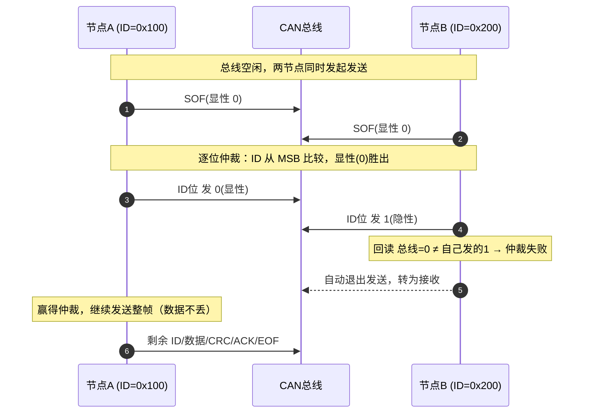

# CAN / CAN FD 深度解析：从差分线到逐位仲裁

## 一、场景引入：那根莫名瘫痪的总线

某天凌晨两点，一辆在环境舱里做耐久试验的电动车突然"失联"——整车 CAN 总线静默，仪表黑屏，VCU 收不到任何报文，BMS 也停止了上报。示波器往 CANH/CANL 上一挂，两条线被死死地钉在隐性（约 0V 压差）电平，偶尔有一两个节点尝试发送，刚冒头一个显性位就被压了回去。最后定位到故障：某个节点因为验收滤波器配置错误，把本该应答的帧当成了"我不关心"，而更难查的是——有另一块板子的 120Ω 终端电阻在过温后虚焊脱落，导致长线反射让仲裁段错误帧频发，整个网络被错误计数器拖进了 Bus-Off。

这就是 CAN。它不像 UART 那样"发完就走"，也不像 LIN 那样"主叫从答"。它是车上最硬核的多主竞争总线：所有节点平等地抢同一根线，靠**非破坏性逐位仲裁**决定谁先说，靠差分线和终端电阻扛住发动机舱的电磁地狱，靠位填充和 CRC 把位错误摁在出厂前。理解它，是每一个汽车电子底层工程师的必修课。

## 二、核心原理：差分线、非破坏性仲裁与"抢话筒"

### 2.1 物理层：两根线拧成一股绳

CAN 用的是**双绞线差分信号**，两根线叫 CANH 和 CANL。逻辑上只有两个状态：

- **显性（Dominant，逻辑 0）**：CANH 拉高、CANL 拉低，两线压差约 2V。
- **隐性（Recessive，逻辑 1）**：两线都回到约 2.5V 的中间电平，压差约 0V。

关键点在于：显性优先于隐性，这是"线与（wired-AND）"特性——只要任意一个节点拉成显性，总线就是显性。这个特性正是非破坏性仲裁的硬件基础。

总线**两端各挂一个 120Ω 终端电阻**，目的是阻抗匹配，消除信号在长线两端反射造成的过冲和振铃。支线（stub）要尽量短，否则支线上的反射会污染主信号。这就像在长长的走廊两头装上吸音棉，否则一端喊话，回声会让另一端听不清。

速率方面，经典 CAN 最高 1Mbps（车里常用 500k/250k）；CAN FD 的**仲裁段**仍 ≤1Mbps，但**数据段**最高可到 8Mbps——后面会解释为什么能这么做。

### 2.2 协议机制：仲裁比作"抢话筒"

想象一群人围着圆桌开会，谁都能随时开口，但规则是：**说话内容用 ID 编号，编号越小越优先；一旦两人同时说，就从第一个字开始逐字比，谁先说出"更大的音（显性 0）"谁就继续，另一个立刻闭嘴听**。这就是 CAN 的**非破坏性逐位仲裁（Non-destructive Bitwise Arbitration）**。

所谓"非破坏性"，是指输掉仲裁的节点**不会丢失它要发的数据**——它只是自动退出发送、转为接收，等总线空闲再重试。高优先级报文因此零延迟送达，没有任何一个字节被丢弃或重排。这和以太网的 CSMA/CD（冲突后整帧重发）有本质不同。

为什么 ID 越小优先级越高？因为仲裁从 ID 最高位（MSB）逐位比较，显性（0）胜出。一个数值小的 ID，其高位有更多 0，也就更早在逐位比较中"盖过"对方。注意：**ID 是报文内容的标识，不是目标地址**——节点用验收滤波器（mask + code）决定自己收不收这帧，这是"内容寻址"，而不是"发给某地址"。

> **图：非破坏性逐位仲裁时序** —— 两节点同时抢发，从 ID 最高位逐位比较，显性(0)胜出；输方自动退出发送转为接收，数据不丢。



### 2.3 位填充、错误帧与 ACK：三道防线

- **位填充（Bit Stuffing）**：发送方只要连续发出 5 个相同位，就自动插入 1 个反相位（填充位）；接收方同步去除。作用有二：一是保证总线上有足够的边沿让所有节点重新同步（否则一长串 1 会让从节点丢失时钟基准）；二是填充违例本身可作为一种错误检测手段。
- **错误检测**：位监控（发的同时回读比对）、格式检查、CRC、ACK 缺失、位填充违例——任一触发就发**错误帧**，发送方自动重发。节点有 TEC/REC 错误计数器，严重到一定程度进入"被动错误"甚至 Bus-Off。
- **ACK（应答）**：发送方在 ACK 槽发隐性，总线上**任意**一个正确接收的节点把它覆写为显性，表示"我收到了"。注意是"任意"，所以一帧 CAN 报文即使只有一个节点在听，也能被确认。

## 三、帧格式逐字段拆解

### 3.1 标准帧（11 位 ID）

```
SOF(1) | ID(11) | RTR(1) | IDE(1) | r0(1) | DLC(4) | DATA(0~8B) | CRC(15+1) | ACK(1+1) | EOF(7)
```

| 字段 | 位宽 | 含义 |
|------|------|------|
| **SOF** | 1 | 帧起始，显性(0)。总线空闲为隐性，SOF 用显性在空闲后制造明确下降沿，所有节点据此硬同步 |
| **ID** | 11 | 报文标识符 = 内容 + 优先级，仲裁段逐位比较，越小越高 |
| **RTR** | 1 | 远程传输请求；数据帧=0、远程帧=1（远程帧无数据段，用于请求数据） |
| **IDE** | 1 | 标识符扩展位；0=标准帧，1=扩展帧 |
| **r0** | 1 | 保留位，经典 CAN 中恒为显性，留作协议演进 |
| **DLC** | 4 | 数据长度码，0~8 字节 |
| **DATA** | 0~8B | 应用数据，内部信号布局由 DBC 定义（起始位/长度/字节序） |
| **CRC** | 15+1 | 15 位循环冗余校验 + 1 位 CRC 定界符（隐性） |
| **ACK** | 1+1 | 应答槽（隐性发送、显性覆盖）+ 应答定界符 |
| **EOF** | 7 | 帧结束，全隐性，期间禁止启动新帧，给错误/过载帧留窗口 |

> **图：标准帧（11 位 ID）逐字段结构** —— SOF 起帧，ID 同时承载内容与优先级，经 RTR/IDE/r0/DLC 后跟数据、CRC、ACK，帧尾 EOF 全隐性。


### 3.2 扩展帧（29 位 ID）

```
SOF(1) | ID(11) | SRR(1) | IDE(1) | ID(18) | RTR(1) | r1(1) | r0(1) | DLC(4) | DATA(0~8B) | CRC(15+1) | ACK(1+1) | EOF(7)
```

多了 **SRR（Substitute Remote Request，隐性 1）**：当标准帧前 11 位 ID 与扩展帧前 11 位相同时，SRR 让扩展帧在仲裁中"先输"，保证标准帧优先、消除二义性。再追加 18 位 ID，合计 29 位，提供巨大地址空间（网关路由、信号密集场景常用）。

### 3.3 CAN FD 帧

```
SOF | ID(11) | RTR(恒0) | IDE(1) | FDF(1) | rsv(1) | BRS(1) | ESI(1) | DLC(4) | DATA(0~64B) | CRC(17/21+1) | ACK | EOF
```

FD 把经典帧的保留位 **r0 复用为 FDF（FD Format 标志）**，并在其后新增三个控制位：

- **BRS（Bit Rate Switch）**：=1 时数据段切换到高速率；
- **ESI（Error State Indicator）**：发送节点错误状态，被动错误时发隐性，向网络广播"我状态异常"；
- **rsv**：保留。

**DLC 非线性编码**是 FD 的一大特色（经典 CAN 仅 0~8）。FD 用 4 位 DLC 表达 12/16/20/24/32/48/64 这些长度：

| 字节数 | 8 | 12 | 16 | 20 | 24 | 32 | 48 | 64 |
|--------|---|----|----|----|----|----|----|----|
| DLC 码 |0x8|0xC |0xD |0xE |0x1 |0x2 |0x3 |0x4 |

介于其间的 9~11、13~15… 等 DLC 值是非法的。CRC 也相应加长：数据 ≤16 字节用 17 位，>16 字节用 21 位——因为数据段从 8 字节扩到 64 字节，短 CRC 的汉明距离已不足以保可靠性。

### 3.4 配置代码：动态兼容 CAN / CAN FD

我主导过一套"一套代码覆盖双协议"的方案，核心是用**标定变量**作报文类型判断位，写硬件控制器时动态设 FD 标志，避免维护两套代码库导致分支漂移：

```c
/* 标定变量：1=按 FD 帧发送，0=经典 CAN */
extern volatile uint32_t g_canFdEnable;

void CanIf_Send(const CanMsgType *msg)
{
    CAN_TxHeaderTypeDef hdr;
    hdr.IDE  = (msg->id > 0x7FFu) ? CAN_ID_EXT : CAN_ID_STD;
    hdr.StdId = (hdr.IDE == CAN_ID_STD) ? msg->id : 0;
    hdr.ExtId = (hdr.IDE == CAN_ID_EXT) ? msg->id : 0;
    hdr.DLC  = CanIf_EncodeDlc(msg->len);   /* 处理 FD 非线性 DLC */

    if (g_canFdEnable && (msg->len > 8)) {
        hdr.FDF = 1;   /* FD 格式 */
        hdr.BRS = 1;   /* 数据段提速 */
    } else {
        hdr.FDF = 0;
        hdr.BRS = 0;
    }
    HAL_CAN_AddTxMessage(&hcan, &hdr, msg->data, &txMailbox);
}
```

控制器侧需分别配置两段比特率（Nominal 用于仲裁段、Data 用于数据段）和采样点，二者都要全网一致。

## 四、位时序：采样点一致比波特率更重要

一位 CAN 时间被切成：

```
SYNC_SEG(1) + PROP_SEG + PSEG1 + PSEG2
```

采样点通常设在 75%~87.5% 处。**波特率、SJW（同步跳转宽度，抗时钟偏差）、采样点**三者必须全网一致，否则某些节点会在位边界附近采样，偶发错误帧。很多"偶发丢帧"的元凶不是波特率差，而是 A 节点采样点 80%、B 节点采样点 60%，累积偏差导致边沿附近采样出错。

## 五、常见坑与调试手段

1. **终端电阻缺失/不符**：两端 120Ω 漏焊或变成 60Ω/240Ω，长线反射让波形过冲振铃，错误帧飙升。调试：示波器量 CANH-CANL 波形，看末端是否过冲；用万用表量总线电阻应约 60Ω（两端 120Ω 并联）。
2. **波特率/采样点全网不一致**：表象是偶发错误帧、特定节点掉线。调试：把所有节点位时序参数列成表逐一比对，尤其 SJW 和采样点。
3. **收发器供电/唤醒时序错配**：如 SBC 下电时电容放电(400us)慢于 MCU 进低功耗(200us)，MCU 被意外复位，总线唤醒失败。调试：双通道示波器同时抓 SBC 放电曲线与 MCU 复位/低功耗进入信号，调下电顺序。
4. **总线负载过高**：节点太多、周期太密，仲裁延迟累积导致实时性下降。调试：用 CAN 分析仪统计总线负载率，优化报文周期或上 CAN FD 提吞吐。
5. **国产替代坑**：某主流 CAN 收发器（如 NXP TJA 系列）的国产替代料，SPI 配置波形、寄存器默认值、唤醒延迟可能不同，需建"基准波形库"逐项比对。

## 六、面试高频要点

- **CAN 为什么用差分？** → 抗共模干扰、长距离可靠，发动机舱强电磁环境必备。
- **仲裁为什么是非破坏性的？** → 输方自动退出发送转为接收、数据不丢，高优先级零延迟送达；类比抢话筒，输了的人只是闭嘴听，不用重说一遍。
- **ID 越小为什么优先级越高？** → 仲裁从 MSB 逐位比，显性(0)赢；小 ID 高位更多 0，更早盖过对方。
- **CAN FD 数据段为什么能提速到 8Mbps？** → 仲裁段低速保证远距离可靠同步；仲裁完成后收发双方已位同步，数据段即可切高速率，结束前切回。
- **一套代码不重新编译怎么切 CAN/CAN FD？** → 运行时由标定变量动态设 FDF/BRS 标志，写控制器时决定帧格式。
- **位填充的作用？** → 保证足够边沿用于重同步 + 填充违例作为错误检测手段。
- **ACK 槽为什么能被"任意"节点覆写？** → 显性优先的线与特性，任一正确接收节点覆写为显性即确认，不指定具体接收方。
