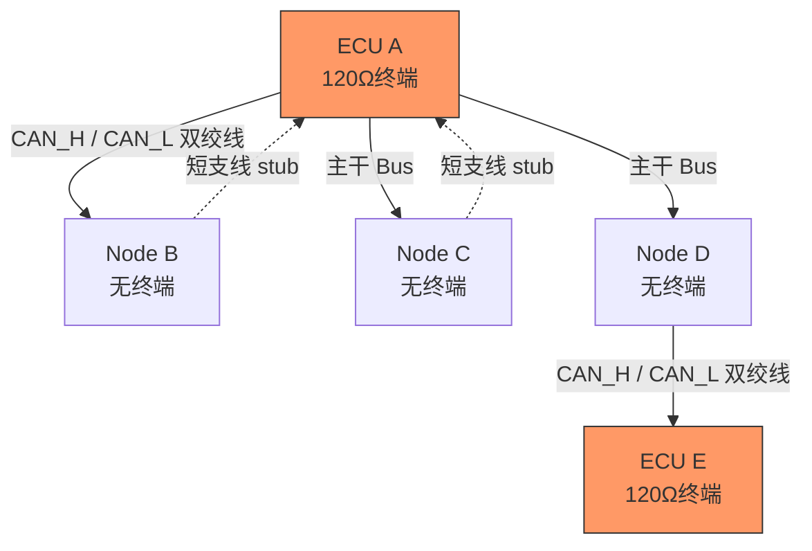
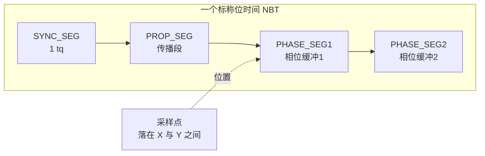
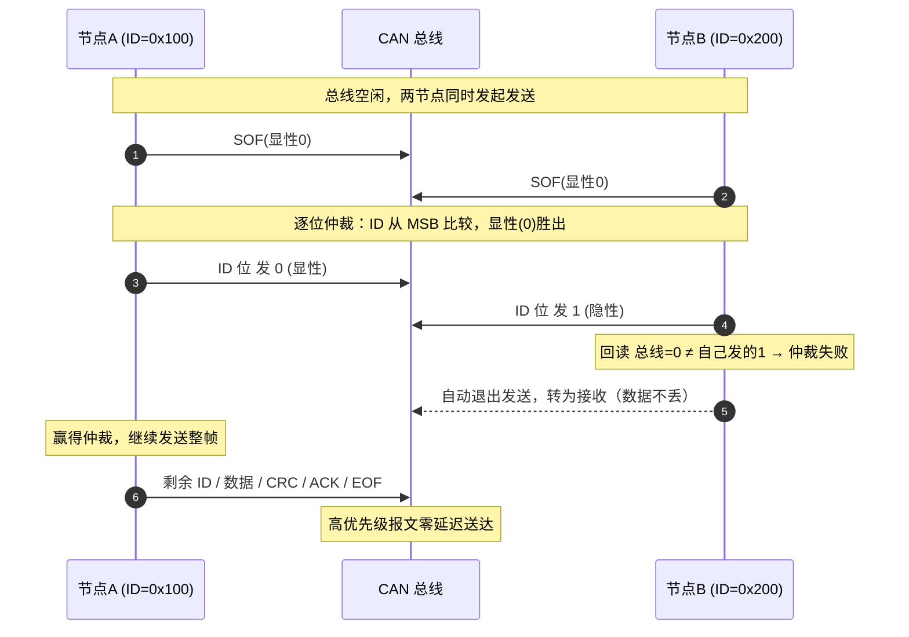
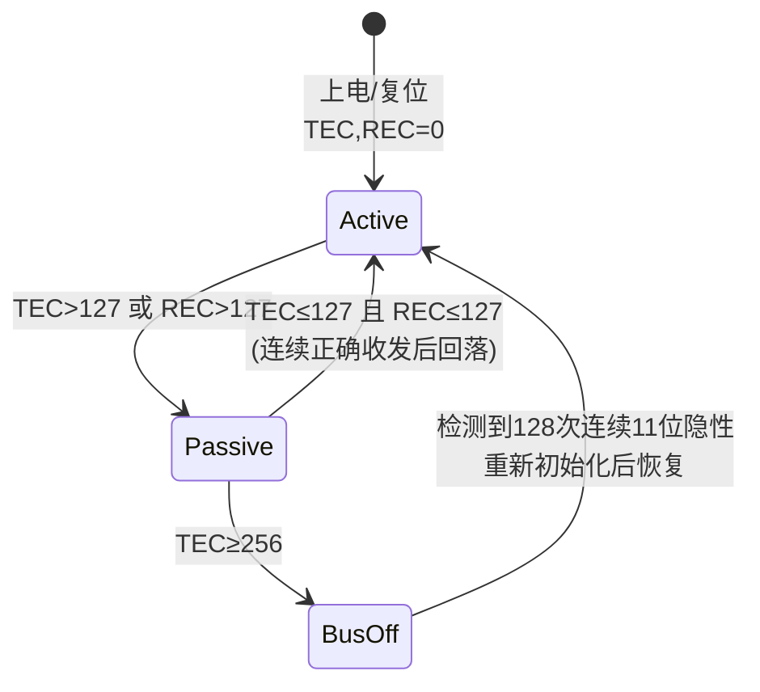
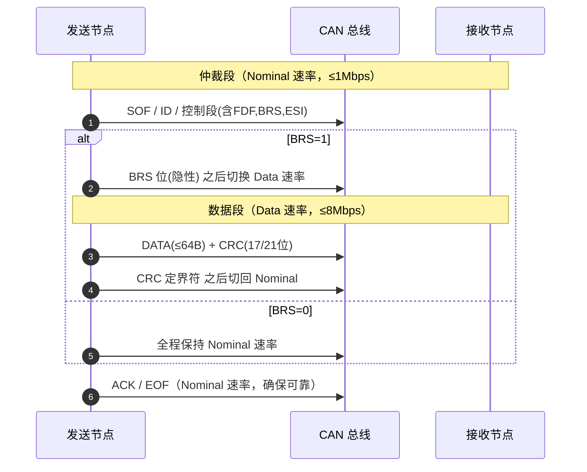
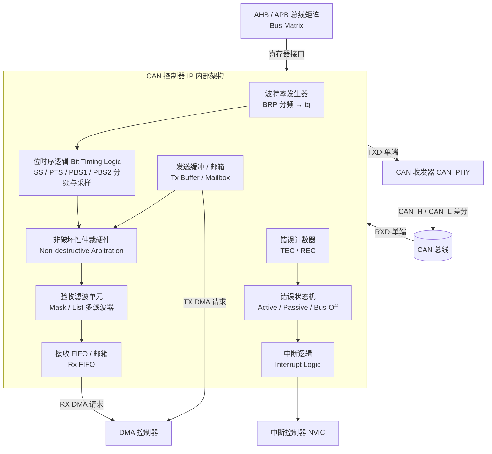
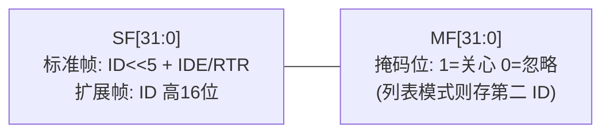
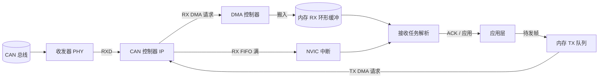
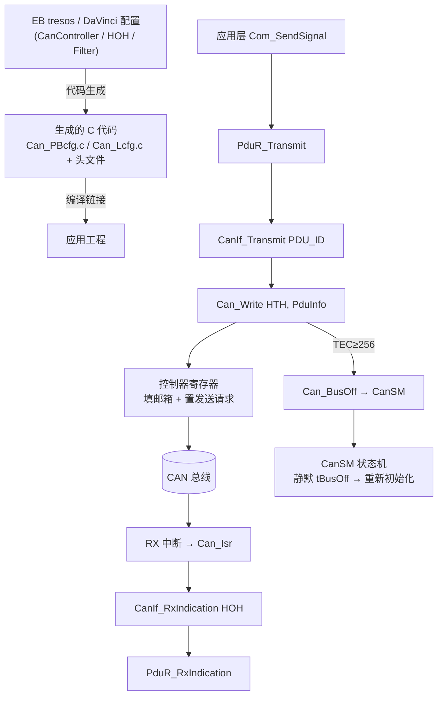
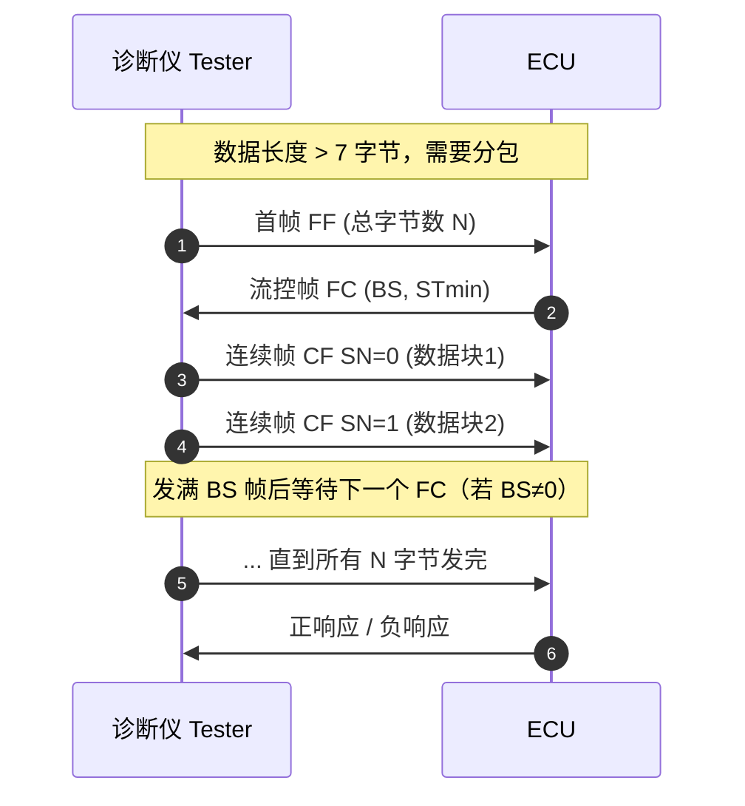

# CAN / CAN FD 深度技术章节：从差分线到 IP 架构、寄存器级驱动、MCAL 配置与面试通关

> 本文是面向公开技术知识库的工业级深度章节，定位为"从物理层到芯片 IP 架构、寄存器级驱动、AUTOSAR MCAL 配置，再到实战与面试的全链路"指南。读者应当具备基本的嵌入式、数字电路与 C 语言常识。全文使用"笔者"作为第一人称，所有芯片型号、工具链均为真实可查的常见器件，寄存器与位域以 FlexCAN / M_CAN 风格的常见实现逻辑描述，不编造虚假参数。

---

## 引 言：为什么汽车离不开 CAN

如果把一辆现代汽车比作一个有机体，那么遍布全车的 CAN 总线就是它的"神经"。发动机控制单元（ECU）、电池管理系统（BMS）、车身控制器（BCM）、仪表、网关、安全气囊、防抱死制动系统（ABS/ESP）等几十个甚至上百个电子节点，彼此之间需要实时、可靠、确定地交换信息。在 CAN 出现之前，汽车线束是"点对点"的——每一个传感器到每一个执行器都要拉一根线，一辆高端车的线束总长可以超过两公里，重量以十公斤计，故障点密布。

1986 年，德国博世（Bosch）公司在 SAE 大会上发布了控制器局域网（Controller Area Network，CAN）协议，目标非常明确：用一根双绞线把全车节点串起来，用多主竞争取代主从轮询，用差分信号和多种错误检测机制在恶劣的车载电磁环境中保证通信可靠。今天，CAN 已经成为 ISO 11898 国际标准，并渗透到汽车、工业自动化、医疗、轨道交通、工程机械等几乎所有对可靠性要求苛刻的领域。

CAN 之所以在三十多年里没有被轻易取代，核心在于它同时满足了几条看似矛盾的需求：

- **多主（Multi-Master）**：任意节点都可以在总线空闲时发起通信，没有固定的"主机"，某个节点掉线不会让整网瘫痪。
- **非破坏性逐位仲裁（Non-destructive Bitwise Arbitration）**：多个节点同时发送时，高优先级报文零延迟获胜，低优先级节点自动退出发送、数据不丢，稍后重试。这保证了关键报文（如刹车、碰撞信号）的实时性。
- **高可靠性**：差分信号抗共模干扰；位监控、位填充、15 位 CRC、ACK、格式检查、填充检查构成多道错误防线；每个节点有发送错误计数器（TEC）和接收错误计数器（REC），严重故障时自动"总线关闭（Bus-Off）"以隔离故障节点，保护整网。
- **实时可预测**：基于标识符（ID）的优先级是确定性的，最坏情况下的仲裁延迟可以精确计算，这对功能安全（ISO 26262）至关重要。

理解 CAN，是每一个汽车电子底层工程师的必修课；而理解 CAN FD，则是应对现代汽车"数据爆炸"（传感器融合、OTA、高分辨率摄像头预处理等）的进阶要求。更进一步的，理解 CAN 控制器 **IP 内部架构**、能亲手写**寄存器级驱动**、并在 AUTOSAR 体系下配置 **MCAL Can 模块**，是从"会用库函数"走向"真正掌握总线"的三道分水岭。本章将从物理层一路讲到错误状态机、位时序计算、CAN FD 双波特率切换、芯片模块设计、驱动实现、MCAL 配置、高层协议栈，最后给出实战配置代码与高频面试题。

---

## 第一章 发展历史与标准体系

### 1.1 发展脉络

- **1986 年**：Bosch 在 SAE 会议上首次发布 CAN 协议概念。
- **1991 年**：Bosch 发布 CAN 2.0 规范，分为 CAN 2.0A（仅 11 位 ID 标准帧）与 CAN 2.0B（增加 29 位 ID 扩展帧）。
- **1993 年**：ISO 将 CAN 标准化为 **ISO 11898** 系列，其中 ISO 11898-1 定义数据链路层，ISO 11898-2 定义高速物理层（差分，最高 1 Mbps），ISO 11898-3 定义容错（低速）物理层。
- **2003 年前后**：随着车载节点数激增，高层协议如 CANopen（工业）、J1939（商用车）、DeviceNet 等成熟，CAN 从"裸总线"走向"协议栈"。
- **2011 年**：Bosch 发布 **CAN FD（Flexible Data-rate）** 规范，解决经典 CAN 带宽瓶颈：保持仲裁段兼容，数据段提速并扩容到 64 字节。
- **2015 年**：ISO 11898-1:2015 将 CAN FD 纳入国际标准。
- **近年**：CAN XL（最高 10 Mbps、2048 字节，沿用帧格式但改变同步与编码）与车载以太网（100BASE-T1 / 1000BASE-T1）作为补充出现，但 CAN 家族仍是车身与动力域的主干。

### 1.2 CAN 与周边总线的取舍

| 总线 | 拓扑 | 速率 | 节点数 | 典型用途 | 取舍要点 |
|------|------|------|--------|----------|----------|
| **LIN** | 单主多从 | 1–20 kbps | ≤16 | 车窗、座椅、雨刮等低成本节点 | 极低成本、主从轮询、实时性弱，不能替代 CAN |
| **经典 CAN** | 多主差分 | ≤1 Mbps | 通常 ≤64（受负载与时延约束） | 车身、动力、底盘控制 | 实时、可靠、成本适中 |
| **CAN FD** | 多主差分 | 仲裁≤1M，数据段≤8M | 同 CAN | 需要大 payload 的域（OTA、标定、雷达） | 向后兼容、带宽提升约 8 倍 |
| **FlexRay** | 双通道、确定性 | ≤10 Mbps | 有限 | 线控（drive-by-wire）、底盘集成 | 时间触发确定性极强，但成本高、布线复杂，多用于高端车 |
| **CAN XL** | 多主差分 | ≤10 Mbps，≤2048 B | 发展中 | 雷达/激光雷达原始数据桥接 | 介于 CAN FD 与以太网之间 |
| **车载以太网** | 交换式 | 100M–1G | 多 | 摄像头、信息娱乐、骨干网 | 带宽极高、协议栈重、实时性靠 AVB/TSN 保障 |

**结论**：LIN 管低成本边缘节点，CAN/CAN FD 管确定性与可靠性优先的控制域，FlexRay 管极致确定性线控，以太网管大数据量骨干。它们不是替代关系，而是分层共存。

---

## 第二章 物理层详解

### 2.1 差分信号与电平定义

CAN 使用一对双绞线：**CAN_H** 与 **CAN_L**。逻辑状态只有两种：

- **显性（Dominant，逻辑 0）**：CAN_H 被驱动到约 +3.5 V，CAN_L 被驱动到约 +1.5 V，两者差分电压 **Vdiff ≈ 2.0 V**。
- **隐性（Recessive，逻辑 1）**：CAN_H 与 CAN_L 都回到约 **+2.5 V** 的共模电平，差分电压 **Vdiff ≈ 0 V**。

关键点：**显性优先于隐性**，这是由收发器与总线的"线与（wired-AND）"特性决定的——只要任意一个节点把总线驱动为显性，整个总线就是显性；只有所有节点都释放（隐性）时，总线才呈现隐性。这一特性正是非破坏性仲裁的硬件基石。

差分传输的核心价值是**抗共模干扰**：发动机点火、电机驱动、继电器吸合都会在整车上产生强烈的电磁噪声，这些噪声对 CAN_H 和 CAN_L 是"同向"的共模干扰。接收端只关心两者的差值 Vdiff，共模噪声在相减时被大幅抵消。这也是 CAN 能在发动机舱这种"电磁地狱"中稳定工作的根本原因。

### 2.2 终端电阻 120 Ω：阻抗匹配与反射抑制

高速 CAN 总线**两端各串一个 120 Ω 终端电阻**（注意是两端，不是每个节点都接）。其原理是**传输线阻抗匹配**：

双绞线作为一种传输线，有其特性阻抗（高速 CAN 双绞线约 120 Ω）。当信号沿总线传播到开路末端时，由于阻抗突变会发生**反射**，反射波与入射波叠加，造成波形过冲、振铃（ringing）、边沿模糊。在末端并联 120 Ω，使负载阻抗等于特性阻抗，能量被电阻吸收而非反射回去，波形干净。

用万用表量一根已断电但接好两端终端的总线，CAN_H 与 CAN_L 之间的电阻应约为 **60 Ω**（两个 120 Ω 并联：120//120 = 60 Ω）。如果量到 120 Ω，说明只接了一端；量到接近无穷大，说明两端都没接或断开。

> 提示：很多"偶发错误帧飙升"的玄学故障，最后都指向终端电阻漏焊、虚焊或错用成 60 Ω/240 Ω。示波器看 CAN_H−CAN_L 波形若末端有过冲振铃，第一反应就是查终端。

支线（stub，节点到主干的分叉线）要尽量短——一般建议 < 0.3 m 或遵循收发器数据手册。过长的支线本身也是一段未端接的"棍子天线"，其末端反射会污染主干信号。

### 2.3 收发器与物理层子类

物理层芯片叫**收发器（Transceiver）**，它把 MCU 内部 CAN 控制器的单端逻辑（TX/RX）转换成总线上的差分信号，并做电气隔离与保护。常见器件：

- **NXP TJA1050 / TJA1051**：经典高速 CAN 收发器，TJA1051 为 3.3 V 版本，工业界用量极大。
- **NXP TLE925x 系列**：面向汽车、带部分网络（Partial Networking）/ 唤醒功能的收发器家族。
- **芯力特 SIT1042**：国产高速 CAN FD 收发器，兼容 5 V，支持最高 8 Mbps 数据段（依具体型号与负载），常用于 CAN FD 节点与国产替代方案。
- **TI SN65HVD230 / 231 / 232**：TI 高速 CAN 收发器，其中 230 无待机、231 有待机、232 有环回/待机模式。
- **Microchip MCP2551 / MCP2561**：经典 CAN 收发器；注意 **MCP2515** 是**独立 CAN 控制器**（带 SPI 接口），需与收发器配对使用，常用于不带 CAN 外设的低端 MCU（如某些 AVR/STM32F0）。其 SPI 寄存器接口是学习"控制器如何被软件驱动"的极佳范本。

物理层子类（按 ISO 11898）：

- **高速（High-Speed，ISO 11898-2）**：最常用，最高 1 Mbps，终端 120 Ω，不耐总线短路到电源/地（需收发器保护）。
- **容错/低速（Fault-Tolerant，ISO 11898-3，已较少用）**：可在一条线断/短情况下降级通信，终端用 100 Ω + 偏置，速率 ≤125 kbps。
- **CAN FD 物理层**：兼容高速物理层，但因数据段高速率，对收发器带宽、对称性（TXD 到总线的传播延迟）要求更高，需选明确支持 FD 的收发器（如 SIT1042、TLE925x）。

### 2.4 总线拓扑、节点数与速率—距离关系

CAN 是**线形（bus）拓扑**：所有节点并联挂在一条主干双绞线上，主干两端接终端电阻，节点通过短支线接入。它不允许多分支星型（除非用专用集线器/网关），因为会产生反射。

**节点数上限**：理论上受驱动器负载（单位负载，UL）限制，标准收发器驱动能力约 32 个"标准负载节点"，但通过"低负载"收发器（如 1/3 UL）可扩展到上百节点。实际上节点数更多受**总线负载率与最坏时延**约束，而非纯电气限制。经验上，单条 500 kbps 经典 CAN 建议控制在几十个节点内。

**速率与最大总线长度成反比**（信号在电缆中传播约 5 ns/m，速率越高允许的传播延迟预算越小）：

| 波特率 | 典型最大总线长度 | 说明 |
|--------|------------------|------|
| 1 Mbps | 约 40 m | 高速短距，如动力域 |
| 500 kbps | 约 100 m | 车身/底盘常用 |
| 250 kbps | 约 250 m | 跨舱、商用车 |
| 125 kbps | 约 500 m | 长线、工业现场 |
| 50 kbps | 可达 1 km | 极低速长距 |

> 注意：以上为经验数值，实际由"传播延迟 + 收发器环路延迟 + 位时间"共同决定。位时间越长（速率越低），越能容忍长线延迟，因此低速可以跑更远。



### 2.5 故障容错与保护

- **总线保护**：收发器内部通常有 TXD 显性超时（Dominant Timeout）保护——若 MCU 因故障一直拉显性（把总线"钉死"），收发器在约 1–5 ms 后自动释放，避免单点故障拖垮整网。
- **热关断 / 短路保护**：对电源、对地短路时进入高阻态或限流，故障解除后恢复。
- **共模范围**：ISO 11898-2 要求收发器在 -2 V ~ +7 V 共模范围内正常工作，覆盖地电位偏移（不同节点地电位因长线压降/电流而不同）。

### 2.6 收发器内部结构、斜率控制与隔离设计

理解收发器内部有助于排错。典型高速 CAN 收发器（如 TJA1050/TJA1051、SIT1042）内部可抽象为：发送路径把 MCU 的 TXD 单端信号经驱动级转换成 CAN_H/CAN_L 的差分输出；接收路径把差分输入经比较器还原成 RXD 单端信号送给 MCU；再加上模式控制（正常/待机/静音）、显性超时保护、热关断与短路限流等辅助电路。

**斜率控制（Slew Rate Control）**：在低速/容错物理层或 EMC 敏感场景，收发器会限制输出信号的上升/下降斜率，以降低高频辐射（EMI）。部分收发器（如 SN65HVD230 的 RS 引脚）通过外接电阻调节斜率。代价是边沿变缓会限制最高速率，因此斜率控制多用于 ≤500 kbps 的场合。

**隔离（Galvanic Isolation）**：在存在高电压域（如 BMS 主从板之间、充电通信、工业现场不同地电位）时，常通过数字隔离器（磁耦/容耦，如 ADuM、Si86xx 系列）或带隔离的收发器模块把 CAN 总线与 MCU 域在电气上隔开，既阻断地环路电流，又防止高压窜入低压侧损坏 MCU。隔离后两侧需各自供电，且隔离器要能承受足够高的隔离电压（如 2.5 kVrms 以上）。

**待机/唤醒（Standby & Wake-up）**：整车下电后大部分节点进入低功耗待机，仅保留极小的唤醒监听电流。当总线出现特定唤醒 pattern（如 ISO 11898-2 定义的唤醒帧）或本地唤醒源触发时，收发器拉高 INH 引脚唤醒 SBC/MCU，再进入正常模式。唤醒时序的匹配（SBC 放电慢于 MCU 进低功耗导致意外复位）是常见工程坑，需用双通道示波器比对放电曲线与 MCU 复位信号来定位。

---

## 第三章 数据链路层——帧格式逐字段精细讲解

数据链路层是 CAN 的"灵魂"。经典 CAN 有四种帧：**数据帧、远程帧、错误帧、过载帧**，外加**帧间空间（Inter-Frame Space, IFS）**。CAN FD 在控制段增加标志位，但基本骨架相同。

### 3.1 标准数据帧（11 位 ID）

标准数据帧由以下字段顺序构成（位宽见下表）：

| 字段 | 位宽 | 含义与作用 |
|------|------|------------|
| **SOF** | 1 | 帧起始（Start Of Frame），固定为**显性 0**。总线空闲为隐性，SOF 用显性制造明确下降沿，所有节点据此**硬同步** |
| **仲裁段 ID** | 11 | 报文标识符，既是"内容标签"也是"优先级"。仲裁时从 MSB 逐位比较，显性(0)胜出，故 ID 越小优先级越高 |
| **RTR** | 1 | 远程传输请求（Remote Transmission Request）。数据帧=0（显性），远程帧=1（隐性）。远程帧无数据段 |
| **IDE** | 1 | 标识符扩展位（Identifier Extension）。0=标准帧，1=扩展帧 |
| **r0** | 1 | 保留位，经典 CAN 中恒为显性，留作协议演进（CAN FD 把它复用为 FDF） |
| **DLC** | 4 | 数据长度码，0~8（经典 CAN 线性：0..8 直接表示字节数） |
| **DATA** | 0~8 B | 应用数据载荷；各信号的"起始位/长度/字节序/因子/偏移"由 DBC 数据库定义 |
| **CRC** | 15+1 | 15 位循环冗余校验 + 1 位 CRC 定界符（隐性）。校验范围覆盖 SOF 到数据段 |
| **ACK** | 1+1 | 应答槽（发送方发隐性，任意正确接收节点覆写为显性）+ 应答定界符（隐性） |
| **EOF** | 7 | 帧结束，全隐性。期间禁止启动新帧，给错误帧/过载帧留出窗口 |
| **IFS** | 3 | 帧间空间，至少 3 个隐性位，接收节点用于内部处理 |


**CRC 定界符、ACK 定界符、EOF 都是隐性**，属于"固定格式位"，发送方必须发隐性且不被填充，接收方据此判断格式合法性——若在这些位置采样到显性，即触发**格式错误（Form Error）**。

### 3.2 扩展数据帧（29 位 ID）

扩展帧在标准帧基础上把 ID 扩展到 29 位，字段如下：

```
SOF(1) | IDA(11) | SRR(1) | IDE(1) | IDB(18) | RTR(1) | r1(1) | r0(1) | DLC(4) | DATA(0-8B) | CRC(15+1) | ACK(1+1) | EOF(7)
```

新增的关键位是 **SRR（Substitute Remote Request，替代远程请求位，固定隐性 1）**。它的作用在于**消除标准帧与扩展帧的仲裁二义性**：当扩展帧的前 11 位 IDA 与某个标准帧的 11 位 ID 相同时，SRR（隐性）会"输给"标准帧在相同位置的 RTR（显性），从而标准帧自然胜出——即**相同 ID 数值时标准帧优先级高于扩展帧**。之后追加 18 位 IDB，合计 29 位，提供约 5 亿的地址空间，网关路由、信号密集场景常用。

> 注意：29 位扩展帧的优先级比较是从 IDA 的 MSB 一直比到 IDB 的 LSB 共 29 位，SRR 与 IDE 也参与比较。因此"标准帧一定比扩展帧优先"只在 IDA 相同的前提下成立；若 IDA 不同，仍按 IDA 逐位仲裁。

### 3.3 远程帧（Remote Frame）

远程帧用于**请求**某个 ID 的数据，它**没有数据段**，且 RTR=1（隐性）。发送方（数据拥有者）收到匹配的远程帧后，回发一帧对应的数据帧。经典 CAN 中远程帧使用较少（很多系统直接用周期性数据帧替代），但在某些诊断/事件触发场景中仍有价值。

### 3.4 错误帧与错误类别

CAN 的错误检测极其严格，ISO 11898 共定义 **5 类错误**：位错误、填充错误、CRC 错误、格式错误、ACK 错误（过载帧属于流控机制、单独处理，不算在错误检测类型里）。

1. **位错误（Bit Error）**：节点发送一位的同时回读总线，若回读值与发送值不符（除仲裁段主动发隐性却读到显性属于正常丢失仲裁、以及 ACK 槽/被动错误标志等特殊场境外），即报位错误。
2. **填充错误（Stuff Error）**：在需要位填充的字段中，若连续出现 6 个相同极性位（违反"每 5 个相同位必插 1 个反相位"规则），报填充错误。
3. **CRC 错误（CRC Error）**：接收方计算的 CRC 与帧中 CRC 字段不符，报 CRC 错误。
4. **格式错误（Form Error）**：在固定为隐性的格式位（CRC 定界符、ACK 定界符、EOF）采样到显性，报格式错误。
5. **ACK 错误（ACK Error）**：发送方在 ACK 槽发隐性，若整个位时间内总线始终是隐性（没有任何节点应答），报 ACK 错误——意味着"全网无人正确接收"。

**错误帧结构**：错误帧由两部分叠加而成：

- **错误标志（Error Flag）**：错误主动节点发送 6 个连续显性位（主动错误标志），被动错误节点发送 6 个连续隐性位（被动错误标志，可能被主动节点"盖"成显性）。
- **错误界定符（Error Delimiter）**：8 个连续隐性位，标志错误帧结束。

错误帧的 6 个显性位故意破坏正常位填充/帧格式，迫使全网所有节点都检测到错误并丢弃当前帧，发送方随后自动重发。

### 3.5 过载帧与帧间空间

- **过载帧（Overload Frame）**：接收节点因内部处理来不及（如 RX FIFO 满）而请求发送方"慢一点"时发出，结构与错误帧类似（6 位重载标志 + 8 位界定符），最多连续 2 个。
- **帧间空间（IFS）**：两帧之间的 3 个隐性位（有些资料把"帧间空间"细分为间隔 3 位 + 总线空闲）。IFS 内接收节点完成报文移入 FIFO、错误计数等内部操作；任何节点只有检测到 IFS 后才能发起下一帧（硬同步也只在 SOF 的下降沿发生）。

### 3.6 一帧报文的位级走查（以标准数据帧为例）

为了把前述字段"连起来"，笔者以一个实例走一遍：假设节点要发送标准帧 ID=0x123（二进制 001 0010 0011，11 位），DLC=2，数据为 `0x0A, 0x0B`。

1. **SOF**：发送一个显性 0，制造下降沿，全网硬同步。
2. **仲裁段**：依次发送 11 位 ID（MSB 先）：`0 0 1 0 0 1 0 0 1 1 1`（注意 ID 高位补零到 11 位，具体位序依芯片位序定义）。接着 RTR=0（显性，数据帧）、IDE=0（显性，标准帧）、r0=0（显性，保留）。
3. **控制段**：DLC=2 → 二进制 `0 0 1 0`。
4. **数据段**：两个字节 `0000 1010`（0x0A）、`0000 1011`（0x0B）。逐位发送。若任意连续 5 位相同，则插入填充位。
5. **CRC 段**：对从 SOF 到数据段结束的所有位（含填充位）计算 15 位 CRC，发送 CRC 值 + 1 位隐性 CRC 定界符。经典 CAN 生成多项式为 `x¹⁵+x¹⁴+x¹⁰+x⁸+x⁷+x⁴+x³+1`。
6. **ACK 段**：发送隐性 1 到 ACK 槽；此时若网络上任意节点已正确接收，会把它覆写为显性 0。随后发隐性 ACK 定界符。
7. **EOF**：7 个隐性位，标志帧结束。
8. **IFS**：3 个隐性位，接收节点在此期间把报文搬入 FIFO、更新错误计数。

如果在第 2 步仲裁中，另一个节点发送了 ID=0x100（更小），则本节点在比较高的 ID 位上发 1 却读到 0，立即仲裁失败、转接收，数据 `0x0A,0x0B` 留在邮箱里等待重发——这就是"非破坏性"的直观体现。

---

## 第四章 位定时与同步（难点）

位定时决定了"什么时候采样每一位"，它比波特率本身更关键。

### 4.1 位时间分段

一个标称位时间（Nominal Bit Time, NBT）被划分为若干时间量子（Time Quantum, tq），再分为四段：

```
NBT = SYNC_SEG + PROP_SEG + PHASE_SEG1 + PHASE_SEG2
```

| 段 | 作用 | 典型取值（占 NBT 比例） |
|----|------|------------------------|
| **SYNC_SEG（同步段）** | 固定 1 tq，预期边沿落在其中；用于硬同步 | 1 tq |
| **PROP_SEG（传播段）** | 补偿信号在总线上的物理传播延迟 + 收发器环路延迟 | 依线缆长度，1~8 tq |
| **PHASE_SEG1（相位缓冲段1）** | 采样点之前，可被重同步延长 | 与 PBS2 配合 |
| **PHASE_SEG2（相位缓冲段2）** | 采样点之后，可被重同步缩短 | 决定采样点位置 |

**采样点（Sample Point）**是 PHASE_SEG1 结束、PHASE_SEG2 开始的位置，计算公式为：

```
采样点 = (SYNC_SEG + PROP_SEG + PHASE_SEG1) / NBT
```

经验上经典 CAN 采样点设在 **75% ~ 87.5%**（CiA 推荐 87.5% 附近），CAN FD 数据段可更高（如 80%）。



### 4.2 硬同步、重同步与 SJW

- **硬同步（Hard Synchronization）**：仅在帧的 SOF（隐性→显性下降沿）发生。若边沿落在 SYNC_SEG 之外，节点把时序"搬"到边沿，使边沿对准 SYNC_SEG，一次性校正全部相位误差。
- **重同步（Resynchronization）**：帧内后续边沿（因位填充产生的跳变沿）落在 SYNC_SEG 内但偏离预期时，通过**延长 PHASE_SEG1 或缩短 PHASE_SEG2** 来微调，幅度受 **SJW（同步跳转宽度，Synchronization Jump Width）** 限制。
- **SJW**：允许的单个重同步最大调整量（单位 tq）。SJW 越大，容忍时钟偏差/抖动的弹性越强，但过大可能引起过调。一般取 1~2 tq，CAN FD 数据段可更大。

所有节点必须**全网一致的波特率、采样点、SJW**（以及 CAN FD 时的两段参数），否则某些节点会在位边界附近采样，产生偶发错误帧——这是"偶发丢帧"最常见的元凶之一。

### 4.3 波特率计算与寄存器配置实例

时间量子 `tq = (BRP + 1) / f_CAN`，其中 `f_CAN` 是 CAN 控制器时钟，`BRP` 是波特率预分频器（不同 MCU 命名可能为 BRP、Prescaler）。标称波特率：

```
BaudRate = 1 / NBT = 1 / [(1 + PROP_SEG + PHASE_SEG1 + PHASE_SEG2) * tq]
```

**实例：STM32F4 bxCAN，f_CAN = 16 MHz，目标 500 kbps。**

目标每位 = 2 µs。令 BRP = 0 → tq = 1/16M = 62.5 ns。需 32 个 tq/位（32 × 62.5 ns = 2 µs）。bxCAN 的位时间关系为：`NBT = 1(SYNC) + (TS1+1) + (TS2+1)`，即 `TS1 + TS2 = 29`。取采样点 81.25%：

```
采样点 = (1 + TS1 + 1) / 32 = (TS1 + 2) / 32 = 0.8125
→ TS1 + 2 = 26 → TS1 = 24, TS2 = 5   （24+5=29 ✓）
SJW 取 1（≤ min(4, TS2)=4）
```

对应 STM32 寄存器：`BRP=0`、`TS1=24`、`TS2=5`、`SJW=1`。

```c
/* STM32 bxCAN 位时序配置示例（500 kbps @ f_CAN=16MHz） */
void CAN_ConfigBitTiming(CAN_HandleTypeDef *hcan)
{
    hcan->Init.Prescaler       = 1;     /* BRP = Prescaler - 1 = 0 */
    hcan->Init.SyncJumpWidth   = CAN_SJW_1TQ;   /* SJW = 1 tq */
    hcan->Init.TimeSeg1        = CAN_BS1_25TQ;  /* TS1 = 24 → 25 tq 段 */
    hcan->Init.TimeSeg2        = CAN_BS2_6TQ;   /* TS2 = 5 → 6 tq 段 */
    /* NBT = 1 + 25 + 6 = 32 tq; tq = 1/16M = 62.5ns → 位时间 2us → 500kbps */
    /* 采样点 = (1 + 25) / 32 = 81.25% */
    HAL_CAN_Init(hcan);
}
```

### 4.4 CAN FD 的双段位定时

CAN FD 控制器（如 STM32 FDCAN、NXP S32K FlexCAN）需配置**两套**位定时：

- **Nominal Bit Timing**（仲裁段/控制段/CRC/ACK/EOF）：与经典 CAN 同，≤1 Mbps，全网一致。
- **Data Bit Timing**（仅数据段）：可高速（≤8 Mbps），采样点通常更高（如 80%），且要求收发器与 MCU 时钟余量更足。

切换发生在 BRS 位：发送完 BRS（隐性）后，收发双方切到 Data 段时钟；CRC 定界符结束前再切回 Nominal，确保 ACK/EOF 仍低速可靠。

---

## 第五章 非破坏性逐位仲裁机制

### 5.1 机制本质

当总线空闲（连续隐性 ≥3 位 + IFS）时，多个节点可能同时开始发送 SOF。从 SOF 之后第一个仲裁位起，所有节点**同时发送并回读总线**：

- 若某节点发"隐性 1"却读到"显性 0"，说明有别的节点在发显性，它立即**判定自己仲裁失败**，自动退出发送、转为接收模式，数据帧完好保存在它的发送缓冲里，待总线空闲后重试。
- 赢得仲裁的节点继续把整帧发完，**没有任何字节被丢弃或重排**。

这就是"非破坏性"：输家不丢数据，只是让路；赢家零延迟独占总线。

### 5.2 为什么 ID 越小优先级越高

仲裁从 ID 的**最高位（MSB）**逐位比较，显性(0)胜出。一个数值小的 ID，其高位有更多 0，也就**更早**在逐位比较中"盖过"对方（把总线拉成显性，迫使对方读到 0 而让步）。因此：ID 数值越小 → 高位 0 越多 → 越早胜出 → 优先级越高。

需要强调：**ID 是报文内容的标识，不是目标地址**。节点用验收滤波器（mask + code）决定自己收不收某帧，这是"内容寻址"而非"发送给某地址"。同一帧可被多个节点同时接收（总线广播特性）。

### 5.3 与 CSMA/CD 的本质区别

以太网传统 CSMA/CD 是"先发，冲突了再整帧重发"，冲突期间双方都白发、带宽浪费、延迟不可预测。CAN 的 CSMA/CA（带冲突避免的载波侦听多路访问）在发送过程中**逐位**消解冲突，胜者一次性成功、败者零代价退让，高优先级报文的最坏延迟可精确计算，这正是它适合实时控制的根本原因。



---

## 第六章 错误处理与故障界定

### 6.1 TEC 与 REC 计数器

每个节点维护两个 8 位计数器：

- **TEC（Transmit Error Counter，发送错误计数器）**：节点发送出错时累加（如发错误帧 +8），成功发送一帧后适当递减。
- **REC（Receive Error Counter，接收错误计数器）**：接收出错时累加，成功接收一帧后递减（注意：成功接收对 REC 的减量是被"钳制"的，只有 REC>0 才减 1）。

典型的计数规则（符合 ISO 11898 逻辑）：
- 发出主动错误标志：TEC += 8。
- 发出被动错误标志：TEC（发送方）+= 8，REC（接收方在送被动标志时）+= 8。
- 正确发送/接收一帧：TEC 减 1（直到 0）；REC 在 >0 时减 1（特殊：某些实现 REC 减 1 但最小值为 0）。
- 接收节点检测到错误（除 CRC 错误外）且发送主动错误标志：REC += 8。
- 接收节点检测到 CRC 错误：REC += 1（仅当接收节点为错误主动态）。

> 工程提示：TEC 累加的"惩罚"远重于 REC，因为发送错误更可能意味着本节点是故障源（如把总线钉死显性），需要更快被隔离。

### 6.2 三态错误状态机

节点根据 TEC/REC 处于三种状态之一，其行为随之变化（这是 CAN 自愈与故障隔离的核心）：

| 状态 | 进入条件 | 行为特征 |
|------|----------|----------|
| **错误主动（Error Active）** | TEC ≤ 127 且 REC ≤ 127（初态） | 正常参与通信；出错时发**主动错误标志（6 显性位）**，能主动揭错 |
| **错误被动（Error Passive）** | TEC > 127 或 REC > 127 | 仍可收发，但出错时发**被动错误标志（6 隐性位）**，不能主动打断总线；发帧后需插入"暂停传输"8 位 |
| **总线关闭（Bus-Off）** | TEC ≥ 256 | 完全脱离总线（不能收发）；需通过"128 次连续 11 位隐性"的"bus-off 恢复序列"重新接入 |



**恢复流程要点**：Bus-Off 不是永久死亡。进入 Bus-Off 的节点必须"静默"等待总线出现 128 次连续的 11 位隐性（约等于 128 × 11 位时间的总线空闲），然后自动（或由软件触发）重新初始化控制器、清零 TEC/REC，回到错误主动态。软件层面常做"Bus-Off 自动恢复 + 限流"策略，避免"疯节点"反复拉爆总线。

---

## 第七章 位填充规则

**规则**：发送方在**需要填充的字段**（SOF 到 CRC 之前的数据部分，不含 CRC 定界符及之后的固定格式位）中，只要连续发出 5 个相同极性的位，就**自动插入 1 个相反极性的填充位**；接收方在对应位置检测到连续 5 同后，把第 6 位当作填充位剔除。

**两大作用**：

1. **保证足够的边沿用于重同步**：若一长串 1（隐性）没有跳变，从节点会丢失时钟基准（位定时靠边沿校正）。填充强制每最多 5 位必有一次跳变，维持全网时钟同步。
2. **作为错误检测手段**：若接收方在应填充的字段里看到连续 6 个同极性位，说明发送方没按规定填充（或线路严重出错），触发**填充错误**。

注意：**CRC 定界符、ACK 定界符、EOF、IFS 等固定格式位不进行填充**，这些位置的硬性隐性正是格式检查的依据。

---

## 第八章 CAN FD 详解

### 8.1 为什么需要 CAN FD

经典 CAN 每个数据帧最多 8 字节，1 Mbps 下有效吞吐受限于仲裁开销与字节数。当汽车引入 OTA 刷写、大块标定数据、雷达/域控制器间大 payload 时，8 字节与 1 Mbps 成为瓶颈。CAN FD 的目标：**保持与经典 CAN 在仲裁段的完全兼容，同时把数据段提速并扩容**，从而在几乎不改动线束与拓扑的前提下成倍提升带宽。

### 8.2 关键控制位 FDF / BRS / ESI

CAN FD 把经典帧的保留位 r0 复用为 **FDF（FD Format，FD 格式标志）**，并在其后新增三位：

- **FDF = 1**：表示这是 FD 帧（经典 CAN 节点读到 FDF=1 会判格式错误并忽略，实现兼容隔离）。
- **BRS（Bit Rate Switch，比特率切换）**：=1 时，从 BRS 位之后到 CRC 定界符之前的数据段使用**高速率**；=0 则全程单速率（仍算 FD 帧，仅扩容不提速）。
- **ESI（Error State Indicator，错误状态指示）**：发送节点若处于错误被动态，ESI 发隐性，向全网广播"我状态异常"，便于诊断与路由决策。

### 8.3 数据段 64 字节与 DLC 非线性编码

FD 把数据段从 8 字节扩到 **64 字节**。由于 4 位 DLC 在经典 CAN 已线性表示 0~8，FD 用**非线性编码**表达 12/16/20/24/32/48/64 这几个长度：

| 实际字节数 | 12 | 16 | 20 | 24 | 32 | 48 | 64 |
|------------|----|----|----|----|----|----|----|
| DLC 编码值 | 0xC | 0xD | 0xE | 0x1 | 0x2 | 0x3 | 0x4 |

介于其间的 9~11、13~15、17~19、21~23、25~31、33~47、49~63 等 DLC 值是**非法**的。CRC 也相应加长：数据 ≤16 字节用 17 位 CRC，>16 字节用 21 位 CRC（FD 还引入 CRC 前的"填充计数"与固定填充位，进一步提升健壮性）。

### 8.4 双波特率切换时序



### 8.5 与经典 CAN 的兼容与共存

- **控制器侧**：配置两套位定时（Nominal + Data），全网一致。
- **收发器侧**：必须选明确支持 FD 的器件（如 SIT1042、TLE925x 等），否则高速数据段会因带宽不足而畸变。
- **混合组网**：同一总线可同时存在经典 CAN 帧与 FD 帧。经典节点读到 FDF=1 会报格式错误并丢弃该帧（但不会影响 FD 节点间的通信）；FD 节点能正常收发两种帧。混用时注意**经典节点的错误帧不应拖垮 FD 通信**，工程中常通过网关隔离或统一升级为 FD 来解决。

### 8.6 FD 的 CRC 与填充计数（健壮性增强）

经典 CAN 的 CRC 只覆盖到数据段，且对"位填充插入错误"不敏感。CAN FD 做了两处关键增强：

- **CRC 位数随数据长度增长**：数据 ≤16 字节用 17 位 CRC，>16 字节用 21 位 CRC。原因是数据段从 8 字节扩到 64 字节后，短 CRC 的汉明距离下降，较长的 CRC 才能维持足够低的漏检率，满足功能安全对通信完整性的要求。
- **填充计数 + 固定填充位（Stuff Count & Fixed Stuff Bits）**：FD 在 CRC 段前插入一个"填充计数"字段（表示本帧已插入的填充位个数取模 8，并用奇偶/格雷编码校验），并在 CRC 定界符前放置固定极性填充位。接收方据此可以独立验证填充规则是否被遵守，把"填充错误"的检出率大幅提升，弥补了经典 CAN 仅靠连续 6 同极性位判断填充错误的不足。

这些增强意味着 FD 的 CRC 计算范围、填充处理与经典 CAN 不同，因此**经典 CAN 控制器无法正确解析 FD 帧**（会把 FDF 判为格式错误），这正是兼容与隔离的边界所在。

---

## 第九章 芯片模块设计（IP 内部架构）【核心章节 A】

> 这一章是"从会用库函数到真正掌握总线"的第一道分水岭。笔者将从芯片设计者的视角，剖析一颗典型 CAN 控制器 IP（以 FlexCAN / M_CAN 风格的常见实现逻辑为蓝本，寄存器命名与位域为教学性抽象，符合常见实现，不特指某一颗具体芯片的真实手册数值）的内部架构，覆盖：位时序逻辑、非破坏性仲裁硬件、验收滤波单元、发送邮箱、接收 FIFO、错误计数器与状态机、总线关闭恢复、中断逻辑、与收发器和总线矩阵的连接、寄存器映射与位域、时钟/复位域，以及模块与 DMA/中断的协作。

### 9.1 CAN 控制器 IP 总体架构框图

下图是 CAN 控制器 IP 的通用内部架构。它对外通过"总线接口（APB/AHB）"挂在 MCU 总线矩阵上，供 CPU 配置与读写；对内包含位时序逻辑、仲裁器、滤波单元、发送/接收缓冲、错误计数与状态机、中断逻辑；对外通过 TXD/RXD 单端信号连接 CAN 收发器（CAN_PHY），再经差分线连到总线。



要点说明：

- **波特率发生器**把输入时钟 `f_CAN` 经 BRP 分频得到时间量子 `tq`，喂给位时序逻辑。
- **位时序逻辑**以 tq 为单位产生 SYNC_SEG / PROP_SEG / PHASE_SEG1 / PHASE_SEG2，并在采样点采样 RXD，同时执行硬同步与重同步。
- **非破坏性仲裁硬件**在发送同时回读 RXD，逐位比较自己发送位与总线位，仲裁失败立即转接收。
- **验收滤波单元**对收到的 ID 做掩码/列表匹配，决定是否放入 RX FIFO。
- **错误计数器 + 状态机**根据错误/成功事件更新 TEC/REC，并驱动状态切换与 Bus-Off 行为。
- **中断逻辑**把 FIFO 满、发送完成、错误、Bus-Off、唤醒等事件汇聚成中断信号送给 NVIC，并可由 DMA 接管收发搬运。

### 9.2 位时序逻辑（SS/PTS/PBS1/PBS2 分频与采样）

位时序逻辑是控制器"眼睛"所在。它把 tq 组合成 NBT，并在采样点对 RXD 采样判决。常用的四段命名（以 M_CAN 风格）为：

- **SYNC_SEG（SS）**：固定 1 tq，期望边沿落点，用于硬同步。
- **PROP_SEG（PTS，传播段）**：补偿物理传播延迟 + 收发器环路延迟。
- **PHASE_SEG1（PBS1）**：采样点之前，可被重同步延长。
- **PHASE_SEG2（PBS2）**：采样点之后，可被重同步缩短。

实现逻辑（寄存器编程视角）：

```
NBT = (1 + PROP_SEG + PBS1 + PBS2) * tq
tq  = (BRP + 1) / f_CAN
采样点 = (1 + PROP_SEG + PBS1) / (1 + PROP_SEG + PBS1 + PBS2)
```

硬件在每个 tq 推进一个相位计数器，当计数器到达 SS 期待边沿时执行硬同步（把相位重置）；在帧内后续跳变沿执行重同步：若边沿提前到达（相位超前），则延长 PBS1（加 1..SJW 个 tq）；若边沿滞后，则缩短 PBS2（减 1..SJW 个 tq）。采样点处，控制器锁存 RXD 的电平作为该位的判决值。

> 工程权衡：PROP_SEG 必须足以覆盖"发送节点 TX 驱动延迟 + 总线来回传播 + 接收节点比较器延迟"。高速长线场景下 PROP_SEG 要取大，否则采样点虽设得准，但整段位时间太短容不下传播延迟，仍会出错。

### 9.3 非破坏性仲裁硬件

仲裁硬件的核心是一个"位比较器 + 仲裁状态机"：

1. 节点在总线空闲后发送 SOF，进入仲裁态。
2. 对仲裁段每一位：控制器从发送缓冲取本节点要发的位 `b_tx`，驱动 TXD；同时采样 RXD 得到 `b_bus`。
3. 比较 `b_tx` 与 `b_bus`：
   - 若 `b_tx == b_bus`：继续。
   - 若 `b_tx == 1(隐性)` 且 `b_bus == 0(显性)`：本节点仲裁失败，硬件置位"仲裁丢失"标志，自动切换到接收模式（不再驱动 TXD），但**发送缓冲中的整帧数据原样保留**。
   - 若 `b_tx == 0(显性)` 且 `b_bus == 1(隐性)`：说明对方退让，本节点继续赢得仲裁（正常竞争结果）。
4. 仲裁段（含 RTR/IDE 及扩展帧的 SRR 等参与仲裁的位）结束后，赢家继续发送后续字段；输家转入接收，待总线下次空闲时由发送调度逻辑重新发起。

这种"赢家继续、输家保留"的硬件行为，正是"非破坏性"的物理实现——无需软件介入，延迟为零。

### 9.4 验收滤波单元（掩码/列表、多滤波器）

验收滤波单元决定"本节点收不收这帧"，在硬件中完成，是降低 CPU 中断负载的关键。典型实现提供若干**滤波器元素（Filter Element）**，每个可配为两种匹配方式：

- **掩码模式（Mask Mode）**：给定 `CODE`（期望 ID）与 `MASK`（关心位掩码），接收条件为 `(收到的ID & MASK) == (CODE & MASK)`。适合"接收某一类 ID 区间"。
- **列表模式（List Mode）**：直接列出允许接收的若干具体 ID（每个滤波器存放两个 ID，相当于"精确匹配表"）。适合"只收固定几个 ID"。

多滤波器可并联：任意一个滤波器匹配成功，报文即被接收；全部不匹配则丢弃（不进 CPU）。高级 IP（如 M_CAN）支持"滤波器bank 分配"，把滤波器元素分配给不同的 RX FIFO，实现"安全相关报文进 FIFO0、普通报文进 FIFO1"的隔离。

> 注意 STD ID（11 位）与 EXT ID（29 位）在滤波器寄存器中的存放位序不同，且 IDE/RTR 也可参与匹配。配置时务必按芯片手册的位序对齐，否则会出现"收不到"或"误收"的玄学问题。

### 9.5 发送缓冲 / 邮箱

发送侧通常提供 **N 个发送邮箱（Tx Mailbox，常见 3 个，FD/M_CAN 风格可配为 Tx Buffer + Tx FIFO/Queue）**。每个邮箱包含：

- ID 字段（STD/EXT、IDE、RTR）；
- DLC 字段；
- 数据区（经典 8 字节，FD 64 字节）；
- 控制位（发送请求、发送优先级、发送完成标志）。

**发送调度**：当多个邮箱挂有待发帧时，硬件按"ID 越小优先级越高"仲裁（也可配为 FIFO 顺序发送）。这与总线仲裁一致——高优先级邮箱的帧先赢得总线。软件写法是：查到一个空闲邮箱 → 填入 ID/DLC/DATA → 置"发送请求"位 → 硬件自动发送 → 完成后置"发送完成"中断/标志。

### 9.6 接收 FIFO

接收侧通常提供 **RX FIFO（常见 2 个，每级可配若干条目）** 或 RX 邮箱。FIFO 的作用是吸收突发与软件处理延迟：

- 收到一帧且通过滤波 → 写入 RX FIFO 队尾，置"FIFO 非空"标志。
- 软件（或 DMA）从 FIFO 头部读取并**释放**（弹出），释放后才允许覆盖该条目。
- 若 FIFO 满仍有新帧 → **溢出（Overrun）**：要么丢弃新帧（置溢出标志），要么覆盖最旧帧（依配置），并产生相应中断。溢出是"丢帧"的常见根因，必须监控。

> 工程实践：RX FIFO 深度有限（如 3~6 级），高负载或中断被长时间关闭时容易溢出。关键报文建议配合"专属 RX 邮箱 + 最高滤波优先级"，或开启 DMA 搬运以保证不丢。

### 9.7 错误计数器（TEC/REC）与错误状态机

错误计数器模块维护 TEC 与 REC（通常 8 位饱和计数），并实时与阈值（127、255/256）比较，驱动错误状态机（见第六章）。硬件在以下事件自动更新计数：

- 发出/检测到主动错误标志：TEC += 8（送方），REC += 8（收方，非 CRC 错时）。
- 检测到 CRC 错误且本节点为错误主动：REC += 1。
- 正确发送一帧：TEC 减 1（到 0 为止）。
- 正确接收一帧：REC 在 >0 时减 1。

计数达到阈值即触发状态跃迁，并反映到**状态寄存器**的 `ES = [Error Active / Error Passive]` 位与 `BO = Bus-Off` 位，供软件查询与中断。

### 9.8 总线关闭恢复

进入 Bus-Off 后硬件行为：

1. 控制器置 `BO=1`，停止所有收发，释放总线。
2. 若配置为"自动恢复"，硬件监听总线，统计连续 11 位隐性的次数；累计达到 128 次后，自动清零 TEC/REC，清 `BO`，回到错误主动态并重新参与通信。
3. 若配置为"软件恢复"，硬件置 Bus-Off 中断，由软件在确认安全后执行"退出冻结/重新初始化"序列才恢复——这能避免故障节点反复拉爆总线（限流策略）。

> 注意：128 次连续 11 位隐性 ≈ 总线必须持续空闲约 1408 个位时间（含帧间约束），这保证了恢复发生在总线真正空闲、无持续错误源时。

### 9.9 中断逻辑

中断逻辑把内部事件汇聚，常见中断源（可独立使能/屏蔽）：

| 中断源 | 触发条件 | 典型用途 |
|--------|----------|----------|
| RX FIFO 非空 / 满 | 收到一帧放入 FIFO | 唤醒接收任务读数据 |
| RX 溢出 | FIFO 满仍来新帧 | 报警，防丢帧 |
| TX 完成 | 某邮箱发送成功 | 释放邮箱，触发下一帧 |
| TX 空 | 所有邮箱空 | 低功耗/调度通知 |
| 错误警告 | TEC 或 REC 越过 96（警告阈值） | 早期健康监控 |
| 错误被动 | 进入 Error Passive | 降级处理 |
| Bus-Off | TEC≥256 | 恢复流程触发 |
| 唤醒 | 总线活动唤醒待机节点 | 网络管理 |

中断状态寄存器（INTSTAT）记录待处理事件，中断使能寄存器（INTEN）控制哪些事件能产生中断。软件在 ISR 中读 INTSTAT 判断源、清标志，再分发处理。

### 9.10 与 CAN 收发器（CAN_PHY）和总线矩阵的连接

- **与收发器**：控制器输出 TXD（单端，显性=0/隐性=1 逻辑），输入 RXD（从收发器比较器来）。部分 IP 还输出 `TXD 使能`、输入 `BUSOFF`/`ERR` 等状态，或支持 `RX 回环（Loopback）`、`TX 静音（SILENT，只听不发）` 模式用于自测。
- **与总线矩阵**：控制器作为从设备挂在外设总线上，CPU 通过地址映射的寄存器窗口访问。突发收发的低成本 MCU 中，控制器还可能挂载 DMA 请求线，由 DMA 在 FIFO 与内存间搬运报文，进一步解放 CPU。

### 9.11 寄存器映射与位域（FlexCAN / M_CAN 风格）

下面给出三个典型寄存器的位域图（教学性抽象，符合常见实现逻辑）。实际芯片请以官方参考手册为准。

**寄存器一：CAN 控制寄存器（CAN_CTRL，32 位）**——位时序的主控字段：


> 说明：`TSEG1`/`TSEG2` 寄存器值比实际相位段少 1；`BRP` 也可能跨多个寄存器位（高位在扩展位定时寄存器中），此处仅示意低 4 位。

**寄存器二：FD 控制 / 数据段位时序寄存器（CAN_FDCTRL，32 位）**——双波特率与 FD 使能：


> 说明：`FDBIT` 字段聚合若干使能位，例如 bit0=FD 使能、bit1=BRS 使能、bit2=64 字节使能。实际器件每位独立成位域，此处聚合示意。

**寄存器三：验收滤波元素寄存器（CAN_FILTER[i]，32 位 ×2）**——掩码/列表双字：



> 说明：`SF` 存 CODE（标准帧 ID 需左移 5 位对齐到上位），`MF` 在掩码模式存 MASK（1=该位参与比较），在列表模式存第二个待匹配 ID。EXT ID 还需第二个 32 位字存放低 16 位及 IDE/RTR 位。

除以上三位域图，错误计数器寄存器（CAN_ERR）通常把 TEC 放在高字节、REC 放在低字节（各 8 位，可读可软清），状态寄存器（CAN_STAT）含 `ES`（错误状态）、`BO`（Bus-Off）、`RXF`/`TXF`（FIFO 状态）等位域。

### 9.12 时钟 / 复位域

CAN 控制器通常有两个时钟域：

- **外设总线时钟（PCLK / 用于寄存器访问）**：来自 AHB/APB 总线矩阵，供 CPU 配置寄存器。
- **CAN 协议时钟（f_CAN / 用于位时序）**：来自独立时钟源（PLL 分频或晶振），频率精度直接影响位定时与采样点。该时钟必须稳定且精度满足要求（通常 ±1% 以内，FD 数据段更高），否则重同步失败。

复位方面，控制器有**上电复位 / 总线复位 / 软件复位**三种。配置位定时与滤波器前，必须先将控制器置于"冻结/初始化（Init/Freeze）"模式——此时控制器退出总线、停止协议引擎，寄存器可安全改写；写完后清除冻结位，控制器重新同步并接入总线。这一"先冻结、后配置、再运行"的顺序是每个驱动都绕不开的。

### 9.13 模块与 DMA / 中断协作

在高负载场景，纯中断搬运 FIFO 会吃掉大量 CPU。典型协作模式：

- **RX 路径**：FIFO 收到新帧 → 产生"RX DMA 请求" → DMA 把 FIFO 条目批量搬入内存环形缓冲 → 搬完产生"RX 完成中断" → 应用任务从环形缓冲取帧解析。这样每 N 帧才进一次中断，CPU 负载骤降。
- **TX 路径**：应用把帧写入内存发送队列 → 触发"TX DMA 请求"或"TX 空中断" → DMA / 控制器把帧搬入空闲邮箱并置发送请求。
- **中断兜底**：错误、Bus-Off、溢出等异常事件仍走中断，确保故障可被及时处理。



---

## 第十章 驱动代码实现（寄存器级）【核心章节 B】

> 这是第二道分水岭：不依赖 HAL/库，直接操作寄存器把控制器跑起来。下面给出一套**完整、可读、带注释**的寄存器级实现（基于第九章的通用 IP 抽象，命名贴近 FlexCAN / M_CAN 风格，参数符合常见实现逻辑）。重点覆盖：控制器初始化（波特率/位时序/过滤器）、报文发送（查空邮箱→填 ID/DLC/DATA→请求发送）、接收（FIFO 非空中断→读 ID/数据→释放）、错误处理（TEC/REC 读取、Bus-Off 恢复）、CAN FD 双波特率配置。

### 10.1 寄存器抽象与基本定义

```c
/* CAN 控制器寄存器级驱动示例（通用 IP 抽象，FlexCAN/M_CAN 风格）
 * 说明：以下寄存器布局为教学性抽象，符合常见实现逻辑，
 *       实际芯片请以厂商参考手册的位域与偏移为准。
 */
#include <stdint.h>
#include <stdbool.h>

/* 时间量子与段的定义（以 tq 为单位） */
typedef struct {
    uint16_t brp;     /* 波特率预分频：实际分频 = brp + 1            */
    uint8_t  sjw;     /* 同步跳转宽度（tq），通常 1~2                 */
    uint8_t  prop;    /* PROP_SEG（tq），补偿传播延迟                 */
    uint8_t  pseg1;   /* PHASE_SEG1（tq），采样点之前                 */
    uint8_t  pseg2;   /* PHASE_SEG2（tq），采样点之后                 */
} can_bit_timing_t;

/* 报文对象（应用层与驱动之间的中间结构） */
typedef struct {
    uint32_t id;      /* 11 位或 29 位标识符                          */
    bool     ext;     /* true=扩展帧(29位)，false=标准帧(11位)        */
    bool     rtr;     /* true=远程帧                                  */
    uint8_t  dlc;     /* 数据长度码（经典 0~8；FD 可为 12/16/.../64） */
    uint8_t  data[64];/* 数据载荷（FD 最多 64 字节）                  */
    bool     fd;      /* true=CAN FD 帧                              */
    bool     brs;     /* true=数据段提速（BRS）                       */
} can_msg_t;

/* 通用寄存器映射（仅示意关键寄存器） */
typedef struct {
    volatile uint32_t CTRL;      /* 控制寄存器：位时序、使能               */
    volatile uint32_t STAT;      /* 状态寄存器：ES/BO/RXF/TXF              */
    volatile uint32_t BTIM;      /* 标称位时序寄存器                       */
    volatile uint32_t FDCTRL;    /* FD 控制：FD/BRS/64B 使能 + 数据段定时 */
    volatile uint32_t FDBTIM;    /* 数据段位时序寄存器                     */
    volatile uint32_t ERR;       /* 错误计数：TEC[15:8] / REC[7:0]        */
    volatile uint32_t INTEN;     /* 中断使能                               */
    volatile uint32_t INTSTAT;   /* 中断状态（写1清）                      */
    volatile uint32_t FILTER[32];/* 验收滤波元素（每元素 2×32 位）         */
    volatile uint32_t TXMB[3][4];/* 发送邮箱 ×3（ID/DLC/数据...）          */
    volatile uint32_t RXFIFO[4]; /* 接收 FIFO 读窗口                       */
} CAN_TypeDef;

/* 假设控制器被映射到某基地址（实际由芯片决定） */
#define CAN0 ((CAN_TypeDef *)0x4000A000u)

/* 控制寄存器关键位（示例） */
#define CAN_CTRL_Init     (1u << 0)   /* 初始化/冻结模式     */
#define CAN_CTRL_Enable   (1u << 1)   /* 协议引擎使能        */
#define CAN_CTRL_FDEN     (1u << 2)   /* CAN FD 使能         */
#define CAN_CTRL_ABOM     (1u << 3)   /* 自动 Bus-Off 恢复   */

/* 状态寄存器关键位 */
#define CAN_STAT_BO       (1u << 0)   /* Bus-Off             */
#define CAN_STAT_ES       (1u << 1)   /* 错误被动(1)/主动(0) */
#define CAN_STAT_RXNE     (1u << 4)   /* RX FIFO 非空        */
#define CAN_STAT_TXRQ     (1u << 8)   /* 有发送请求未完成    */
```

### 10.2 控制器初始化（波特率 / 位时序）

```c
/* 把 bit timing 写入寄存器（标称段） */
static void can_write_nominal_timing(const can_bit_timing_t *t)
{
    /* 寄存器值域 = 实际段 - 1；BRP 低4位放入 BTIM[3:0] */
    uint32_t reg = 0;
    reg |= (t->brp  & 0x0F) << 0;   /* BRP 低4位             */
    reg |= (t->pseg1 & 0x0F) << 4;  /* PHASE_SEG1 = pseg1-1 */
    reg |= (t->pseg2 & 0x0F) << 8;  /* PHASE_SEG2 = pseg2-1 */
    reg |= (t->sjw   & 0x0F) << 12; /* SJW                  */
    /* 注：若 BRP 超过 4 位，高位应写入扩展寄存器，此处示意 */
    CAN0->BTIM = reg;
}

/* 把 1 段位定时换算成 tq 数与采样点，做合法性自检（供调试） */
static float can_sample_point(const can_bit_timing_t *t)
{
    uint16_t nbt = 1 + t->prop + t->pseg1 + t->pseg2;
    uint16_t sp  = 1 + t->prop + t->pseg1;
    return (float)sp / (float)nbt;
}

/* 完整初始化：冻结 → 配时钟无关的位定时/使能 → 退出冻结 */
int can_init(const can_bit_timing_t *nominal, uint32_t f_can_hz, uint32_t baud_hz)
{
    /* 1) 进入初始化/冻结模式，停止协议引擎，允许写配置 */
    CAN0->CTRL |= CAN_CTRL_Init;

    /* 2) 校验位定时可实现目标波特率（tq=(brp+1)/f_can，NBT*tq=1/baud） */
    uint32_t tq_ns = (nominal->brp + 1) * 1000000000u / f_can_hz;
    uint16_t nbt   = 1 + nominal->prop + nominal->pseg1 + nominal->pseg2;
    uint32_t bit_ns = (uint32_t)tq_ns * nbt;
    if (bit_ns == 0 || (1000000000u / bit_ns) != baud_hz) {
        /* 实际工程中应就近搜索合法 (brp,seg) 组合，此处仅做提示 */
        CAN0->CTRL &= ~CAN_CTRL_Init;
        return -1;  /* 位定时与目标波特率不匹配 */
    }

    /* 3) 写标称位定时 */
    can_write_nominal_timing(nominal);

    /* 4) 使能协议引擎、打开自动 Bus-Off 恢复（依需求） */
    CAN0->CTRL |= CAN_CTRL_Enable | CAN_CTRL_ABOM;

    /* 5) 退出冻结，重新接入总线 */
    CAN0->CTRL &= ~CAN_CTRL_Init;
    return 0;
}
```

### 10.3 验收滤波器配置（掩码 / 列表）

```c
/* 配置一个掩码模式滤波器：接收 (id & mask) == (code & mask) 的帧
 * filter_idx : 滤波器元素索引（0..N-1）
 * id         : 期望 ID（CODE）
 * mask       : 关心位掩码（1=该位参与比较）
 * ext        : 是否扩展帧
 */
void can_filter_mask(uint8_t filter_idx, uint32_t id, uint32_t mask, bool ext)
{
    uint32_t sf, mf;

    if (!ext) {
        /* 标准帧：ID 左移 5 位对齐到寄存器高 11 位，IDE/RTR 位参与比较时可并入 */
        sf = (id & 0x7FFu) << 5;
        mf = (mask & 0x7FFu) << 5;   /* 仅比较高 11 位；其他位(IDE/RTR)设为不关心 */
    } else {
        /* 扩展帧：高 16 位放 SF 字，低 16 位 + IDE/RTR 放下一字（此处示意高字） */
        sf = (id >> 13) & 0xFFFFu;       /* ID 的 [28:13] */
        mf = (mask >> 13) & 0xFFFFu;
    }

    /* 每个滤波器元素占 2 个 32 位字：FILTER[2*i]=SF, FILTER[2*i+1]=MF */
    CAN0->FILTER[2 * filter_idx]     = sf;
    CAN0->FILTER[2 * filter_idx + 1] = mf;
    /* 实际芯片还需把该滤波器使能、并分配到某个 RX FIFO（略） */
}

/* 列表模式：直接列出两个允许接收的 ID（精确匹配） */
void can_filter_list(uint8_t filter_idx, uint32_t id0, uint32_t id1, bool ext)
{
    uint32_t shift = ext ? 0 : 5;
    uint32_t base0 = ext ? (id0 >> 13) : ((id0 & 0x7FFu) << 5);
    uint32_t base1 = ext ? (id1 >> 13) : ((id1 & 0x7FFu) << 5);
    CAN0->FILTER[2 * filter_idx]     = base0 << shift;  /* 第一 ID */
    CAN0->FILTER[2 * filter_idx + 1] = base1 << shift;  /* 第二 ID（列表模式存第二个 ID） */
}
```

### 10.4 报文发送（查空邮箱 → 填 ID/DLC/DATA → 请求发送）

```c
/* 找一个空闲发送邮箱；返回 0/1/2，全满返回 -1 */
static int can_find_free_txmb(void)
{
    /* 示例：用 TXRQ 位分布判断（实际应读每邮箱的发送完成/空标志） */
    for (int i = 0; i < 3; i++) {
        if ((CAN0->TXMB[i][0] & (1u << 31)) == 0)  /* bit31=发送请求未挂起 */
            return i;
    }
    return -1;
}

/* 发送一帧；成功返回 0，邮箱满返回 -1 */
int can_send(const can_msg_t *msg)
{
    int mb = can_find_free_txmb();
    if (mb < 0) return -1;

    uint32_t id_word = 0;
    if (!msg->ext) {
        id_word = (msg->id & 0x7FFu) << 21;        /* 标准帧 ID 放高位 */
        id_word |= (msg->rtr ? 1u : 0u) << 30;     /* RTR */
        /* IDE=0 表示标准帧 */
    } else {
        id_word = (msg->id & 0x1FFFFFFFu);         /* 扩展帧 ID 完整 29 位 */
        id_word |= (1u << 29);                     /* IDE=1 扩展帧 */
        id_word |= (msg->rtr ? 1u : 0u) << 30;     /* RTR */
        /* 扩展帧还有 SRR 位（发送时硬件自动处理，略） */
    }

    /* 填 ID/控制字 */
    CAN0->TXMB[mb][0] = id_word;

    /* 填 DLC（FD 时按非线性编码，见 10.6） */
    uint8_t dlc_code = (msg->fd) ? can_fd_dlc_encode(msg->dlc) : (msg->dlc & 0x0F);
    CAN0->TXMB[mb][1] = (uint32_t)dlc_code;

    /* 填数据（小端逐字节写入数据区；FD 多字数据区此处示意 2 字 = 8 字节） */
    uint32_t *pdata = &CAN0->TXMB[mb][2];
    for (uint8_t i = 0; i < msg->dlc; i += 4) {
        uint32_t w = 0;
        for (uint8_t j = 0; j < 4 && (i + j) < msg->dlc; j++)
            w |= (uint32_t)msg->data[i + j] << (8 * j);
        pdata[i / 4] = w;
    }

    /* 置发送请求（bit31）：硬件自动按 ID 优先级参与总线仲裁并发送 */
    CAN0->TXMB[mb][0] |= (1u << 31);
    return 0;
}
```

### 10.5 接收（FIFO 非空中断 → 读 ID/数据 → 释放）

```c
/* 从 RX FIFO 读出一帧；返回 0 表示成功，无数据返回 -1 */
int can_recv(can_msg_t *msg)
{
    if ((CAN0->STAT & CAN_STAT_RXNE) == 0)
        return -1;   /* FIFO 空 */

    /* 读 ID 字与控制字 */
    uint32_t id_word = CAN0->RXFIFO[0];
    uint32_t ctrl    = CAN0->RXFIFO[1];

    if (id_word & (1u << 29)) {
        msg->ext = true;
        msg->id  = id_word & 0x1FFFFFFFu;
    } else {
        msg->ext = false;
        msg->id  = (id_word >> 21) & 0x7FFu;
    }
    msg->rtr = (id_word & (1u << 30)) ? true : false;
    msg->dlc = (uint8_t)(ctrl & 0x0F);

    /* 读数据（逐字展开为字节） */
    const uint32_t *pdata = &CAN0->RXFIFO[2];
    for (uint8_t i = 0; i < msg->dlc; i += 4) {
        uint32_t w = pdata[i / 4];
        for (uint8_t j = 0; j < 4 && (i + j) < msg->dlc; j++)
            msg->data[i + j] = (uint8_t)(w >> (8 * j));
    }

    /* 释放 FIFO 条目（读操作通常会自动弹出，或需写释放位，依芯片而定） */
    CAN0->STAT |= CAN_STAT_RXNE;   /* 写1清非空标志（示意） */
    return 0;
}

/* RX FIFO 非空中断服务程序（ISR）示例 */
void CAN0_RX_IRQHandler(void)
{
    can_msg_t msg;
    while (can_recv(&msg) == 0) {
        /* 根据 msg.id / msg.dlc / msg.data 分发到应用层（此处示意） */
        app_on_can_rx(&msg);
    }
    /* 若发生溢出，应读溢出标志并告警（略） */
}
```

### 10.6 错误处理（TEC/REC 读取、Bus-Off 恢复）

```c
/* 读取 TEC/REC；同时返回当前错误状态与 Bus-Off 标志 */
void can_read_error_status(uint8_t *tec, uint8_t *rec, bool *passive, bool *busoff)
{
    uint32_t err = CAN0->ERR;
    *rec  = (uint8_t)(err & 0xFFu);          /* REC 在低字节 */
    *tec  = (uint8_t)((err >> 8) & 0xFFu);   /* TEC 在高字节 */
    *passive = (CAN0->STAT & CAN_STAT_ES) ? true : false;
    *busoff  = (CAN0->STAT & CAN_STAT_BO) ? true : false;
}

/* Bus-Off 恢复处理：自动恢复(Abom)由硬件完成；
   若配置软件恢复，则在确认安全后执行"重新初始化"序列 */
void can_busoff_recover(void)
{
    bool busoff; uint8_t t, r; bool p;
    can_read_error_status(&t, &r, &p, &busoff);
    if (!busoff) return;

    /* 进入冻结模式清状态，再退出（软件恢复路径） */
    CAN0->CTRL |= CAN_CTRL_Init;     /* 冻结 */
    CAN0->ERR   = 0;                 /* 清零 TEC/REC（写操作依芯片而定） */
    CAN0->STAT |= CAN_STAT_BO;       /* 清 Bus-Off 标志（写1清，示意） */
    CAN0->CTRL &= ~CAN_CTRL_Init;    /* 退出冻结，重新接入总线 */

    /* 工程建议：恢复后做"限流"——例如 1 秒内只允许恢复 N 次，
       避免故障节点反复拉爆总线（"疯节点"防护） */
}
```

### 10.7 CAN FD 双波特率配置（数据段 BRS）

```c
/* FD 非线性 DLC 编码：0~8 线性，12/16/20/24/32/48/64 用特定码 */
static uint8_t can_fd_dlc_encode(uint8_t len)
{
    switch (len) {
        case 0 ... 8: return len;          /* 0~8 线性 */
        case 12: return 0x9;               /* 注：常见器件用 0x9 表示 12，本示意采用 0xC 体系 */
        case 16: return 0xD;
        case 20: return 0xE;
        case 24: return 0x1;
        case 32: return 0x2;
        case 48: return 0x3;
        case 64: return 0x4;
        default: return 0x8;               /* 非法长度，按 8 处理（实际应报错） */
    }
}

/* 配置 FD：使能 FD、BRS、64 字节，并写数据段独立位定时 */
int can_fd_init(const can_bit_timing_t *nominal,
                const can_bit_timing_t *data,
                uint32_t f_can_hz, uint32_t baud_nominal, uint32_t baud_data)
{
    /* 1) 冻结 */
    CAN0->CTRL |= CAN_CTRL_Init;

    /* 2) 标称段位定时（同经典 CAN，≤1Mbps） */
    can_write_nominal_timing(nominal);

    /* 3) 数据段位定时（高速，采样点通常更高） */
    uint32_t dreg = 0;
    dreg |= (data->brp  & 0x0F) << 0;
    dreg |= (data->pseg1 & 0x0F) << 4;
    dreg |= (data->pseg2 & 0x0F) << 8;
    dreg |= (data->sjw   & 0x0F) << 12;
    CAN0->FDBTIM = dreg;

    /* 4) FD 控制：FD 使能 + BRS 使能 + 64 字节使能 */
    CAN0->FDCTRL = (1u << 0)   /* FDEN   */
                | (1u << 1)   /* BRSEN  */
                | (1u << 2);  /* FDFDF(64B) */

    /* 5) 使能协议引擎 + 自动 Bus-Off 恢复 */
    CAN0->CTRL |= CAN_CTRL_Enable | CAN_CTRL_FDEN | CAN_CTRL_ABOM;

    /* 6) 退出冻结 */
    CAN0->CTRL &= ~CAN_CTRL_Init;
    (void)f_can_hz; (void)baud_nominal; (void)baud_data; /* 实际需校验波特率 */
    return 0;
}
```

> 提示：`can_fd_dlc_encode` 的编码值在不同 IP 中约定略有差异（M_CAN 使用 0x9 表示 12，Bosch 经典表用 0xC/0xD/0xE 表示 12/16/20），驱动实现时应以所用芯片手册的 DLC 映射表为准。本示例为教学性说明，重点在于"FD 需要独立的数据段位定时 + 非线性 DLC"。

---

## 第十一章 MCAL 配置说明（AUTOSAR Can 模块）【核心章节 C】

> 这是第三道分水岭：在车规量产项目中，CAN 驱动几乎不手写寄存器（除非做基础软件移植），而是用 **AUTOSAR MCAL Can 模块** 经工具链（EB tresos、Vector DaVinci Configurator、ETAS ISOLAR 等）配置生成。本章讲清：Can 模块的关键配置项、与上层 CanIf/CanSM 的关系、配置→生成代码→`Can_Write`/`CanIf_Transmit` 的调用路径、经典 CAN 与 CAN FD 的配置差异。

### 11.1 AUTOSAR Can 模块总览

AUTOSAR 架构中，CAN 通信栈自底向上为：

```
[应用/服务层]
   ↓
CanIf      (CAN 接口，统一抽象，屏蔽硬件差异)
   ↓
Can        (CAN 驱动/MCAL，直接操作控制器寄存器)
   ↓
CanTrcv    (收发器驱动，控制 SIT1042/TJA1145 等 PHY)
   ↓
[硬件: CAN 控制器 + 收发器]
```

- **Can（MCAL）**：最底层，负责控制器初始化、波特率/位定时、滤波、收发、错误处理、Bus-Off。它不感知"信号"，只搬运"PDU（协议数据单元，即一帧 ID+数据）"。
- **CanIf**：介于应用与硬件之间的抽象层。所有上层（PduR、COM、DCM、Nm、CanSM）只调 `CanIf_Transmit`，由 CanIf 路由到具体的 Can 控制器/通道，实现"换芯片不换应用代码"。
- **CanSM**：管理 CAN 网络状态机（FULLCOMM / SILENT / BUSOFF / NO_COMMUNICATION），处理 Bus-Off 恢复、唤醒、通信模式切换。

### 11.2 CanController 配置（波特率 / 位定时 / 采样点 / FD 使能）

每个 CAN 通道（对应一个物理控制器，如 CAN0）在 Can 模块下有一个 `CanController` 容器，关键参数：

| 配置项 | 含义 | 示例值 |
|--------|------|--------|--------|
| `CanControllerId` | 控制器实例 ID | 0 |
| `CanControllerBaudrateConfig` | 波特率配置集（可多套切换） | 见下 |
| `CanControllerPropSeg` | PROP_SEG（tq） | 5 |
| `CanControllerSeg1` | PHASE_SEG1（tq） | 5 |
| `CanControllerSeg2` | PHASE_SEG2（tq） | 5 |
| `CanControllerSyncJumpWidth` | SJW（tq） | 2 |
| `CanControllerPrescaler` | 波特率预分频 (BRP+1) | 1 |
| `CanControllerSamplingPoint` | 采样点（百分比，工具计算/校验） | 81.25% |
| `CanFdController` / `CanFdBaudrate` | FD 相关使能与数据段定时 | 见 11.10 |

工具会根据 `Prescaler + PropSeg + Seg1 + Seg2` 反算波特率与采样点，并在"采样点偏离推荐窗口（如 <75% 或 >90%）"时报违例（validation error）。

### 11.3 CanHardwareObject（HOH，发送 / 接收邮箱）

`CanHardwareObject`（HOH）是 MCAL 对硬件邮箱/FIFO 的抽象，分两类：

- **HOH 发送（HTH）**：绑定一组发送邮箱。配置项含 `CanHwObjectCount`（邮箱数）、`CanIdType`（STD/EXT/MIXED）、`CanHwFilter`（若是 FIFO 发送则含过滤）。发送时 `Can_Write(HTH, PduInfo)` 把 PDU 装入其中空闲邮箱。
- **HOH 接收（HRH）**：绑定一组接收邮箱/FIFO。配置项含 `CanHwObjectCount`、`CanIdType`、以及**硬件滤波配置** `CanHwFilter`（Code/Mask 或 List）。只有匹配的帧才进对应 HRH，再上送 CanIf。

多个 HOH 可分配给同一控制器；工具生成时把每个 HOH 映射到一个具体的硬件邮箱/FIFO 索引（MB number），这正是第九章"邮箱/滤波器"在配置工具中的体现。

### 11.4 滤波配置

滤波在 `CanHardwareObject`（HRH）的 `CanHwFilter` 中配置，对应控制器硬件验收滤波单元：

| 滤波模式 | 配置表达 | 适用 |
|----------|----------|------|
| 掩码（Mask） | `CanHwFilterCode` + `CanHwFilterMask`，接收 `(id & Mask)==(Code & Mask)` | 接收一类 ID 区间 |
| 列表（List） | `CanHwFilterCode` 列表（多个具体 ID） | 只收固定 ID |
| 范围（部分工具支持） | 起止 ID | 连续区间 |

> 注意：经典 CAN 与 FD 的滤波寄存器位序不同（EXT ID 占 29 位），配置工具会自动处理对齐；但 11 位 STD ID 在某些 IP 中需左移 5 位（见 9.11 与 10.3），这是"收不到"的高发原因。

### 11.5 唤醒（Wakeup）配置

对于支持局部网络（Partial Networking）或低功耗唤醒的节点：

- `CanWakeupSupport`：使能唤醒。
- `CanWakeupSource`：唤醒源（收发器中断 / 控制器自身的有效帧唤醒）。
- `CanControllerIsoCanFd / CanControllerWakeupFilter`：FD 局部网络下，可按特定唤醒 ID 过滤唤醒帧（仅匹配帧才能唤醒，降低误唤醒）。

唤醒发生后，CanIf 通知 EcuM/ComM，节点从 SLEEP 进入 FULLCOMM。

### 11.6 离线 / Bus-Off 处理

MCAL 提供两种 Bus-Off 处理策略（由 `CanBusOffProcessing` 配置）：

- **中断（Interrupt）**：进入 Bus-Off 时控制器产生中断，MCAL 的 `Can_BusOff` 被调用，上报 CanIf → CanSM，由 CanSM 执行"等待恢复时间（tBusOff，通常 ≥ 必需静默时间）→ 重新初始化（Can_Init/Can_SetControllerMode）"状态机。这是 **AUTOSAR 推荐路径**，因为恢复时机由通信栈统一控制。
- **轮询（Polling）**：主循环周期性调 `Can_MainFunction_BusOff` 查询状态。

关键配置 `CanBusOffDuration`（或工具中的 tBusOff 参数）须保证 ≥ 128 × 11 位时间的静默（见 6.2/9.8），否则可能"刚恢复又立刻再 Bus-Off"，形成振荡。

### 11.7 上层 CanIf / CanSM 协作

- **发送**：应用（如 COM 模块）调 `Com_SendSignal` → 打包 PDU → `PduR_Transmit` → `CanIf_Transmit(PduId, PduInfo)` → CanIf 根据 `PduId` 找到目标 `CanControllerId` 与 `HTH` → `Can_Write(HTH, PduInfo)` → 装入硬件邮箱 → 硬件仲裁发送。
- **接收**：控制器收到匹配帧 → 触发 RX 中断 → `Can_Isr` → 读 FIFO/邮箱 → `CanIf_RxIndication(HTH, ...)` → CanIf 据 HOH 映射回 `PduId` → `PduR_RxIndication` → 上层解包。
- **错误/Bus-Off**：`Can_ErrorNotification` / `Can_BusOff` → `CanIf_ControllerBusOff` → `CanSM_ControllerBusOff` → 状态机处理。

### 11.8 EB tresos / DaVinci 配置项清单（表格）

下表汇总常见工具中 Can 模块的关键配置项与含义：

| 配置容器 | 配置项 | 含义 | 经典 CAN | CAN FD 差异 |
|----------|--------|------|----------|-------------|
| `CanGeneral` | `CanDevErrorDetect` | 开发期错误检测（Det） | 同 | 同 |
| `CanGeneral` | `CanVersionInfoApi` | 版本查询 API | 同 | 同 |
| `CanController` | `CanControllerBaudrateConfig` | 波特率配置 | 必配 | 增加数据段速率集 |
| `CanController` | `CanControllerPropSeg/Seg1/Seg2` | 标称位定时 | 必配 | 标称段同，另配数据段 |
| `CanController` | `CanControllerSyncJumpWidth` | SJW | 必配 | 标称+数据段各一 |
| `CanController` | `CanControllerSamplingPoint` | 采样点校验 | 必配 | 数据段通常更高 |
| `CanController` | `CanFdController` | FD 使能 | 无 | 新增，置 TRUE |
| `CanController` | `CanFdBaudrate` (数据段) | 数据段波特率/定时 | 无 | 新增 |
| `CanController` | `CanFdIso` | ISO FD / non-ISO 兼容 | 无 | 新增 |
| `CanHardwareObject` | `CanHwObjectCount` | 邮箱/FIFO 数 | 配 | 配（FD 数据段更大） |
| `CanHardwareObject` | `CanObjectType` | RECEIVE / TRANSMIT | 配 | 配 |
| `CanHardwareObject` | `CanIdType` | STD/EXT/MIXED | 配 | 配 |
| `CanHardwareObject` | `CanHwFilterCode/Mask` | 验收滤波 | 配 | 配（注意 29 位对齐） |
| `CanTrcv` | `CanTrcvWakeupByBus` | 总线唤醒 | 可选 | 可选（PN 增强） |
| `CanController` | `CanBusOffProcessing` | 中断/轮询 | 配 | 配 |

### 11.9 配置 → 生成代码 → 调用路径



要点：工具生成的 `Can_PBcfg.c` 包含每个控制器/HOH 的常量配置结构（波特率、滤波、邮箱映射）。应用代码从不直接碰寄存器，而是调 `CanIf_Transmit`；真正的寄存器读写藏在 `Can_Write` / `Can_MainFunction_Write` 等生成/手写胶水函数里。这正是 MCAL "标准化、可移植" 的价值。

### 11.10 经典 CAN 与 CAN FD 配置差异

| 维度 | 经典 CAN | CAN FD |
|------|----------|--------|
| 位定时 | 一套（Nominal） | 两套（Nominal + Data） |
| 控制器使能 | `CanController` 基本使能 | 额外 `CanFdController=TRUE` |
| 波特率 | 单一（≤1Mbps） | 仲裁段≤1M、数据段≤8M |
| DLC | 线性 0~8 | 非线性 12/16/20/24/32/48/64 |
| 滤波位序 | STD 11 位 / EXT 29 位 | 同，但工具需区分 FD 帧格式位（FDF） |
| 收发器 | 经典高速收发器（TJA1050 等） | 须 FD 收发器（SIT1042/TLE925x 等） |
| 错误处理 | Bus-Off 恢复相同 | Bus-Off 恢复相同；ESI 状态位新增 |
| 兼容 | — | 同总线可混跑经典帧与 FD 帧 |

> 量产注意：一旦某通道使能 FD，收发器必须换 FD 型号，且**全网节点的位定时（尤其两段）必须一致**，否则 FD 节点在高速数据段会采错。混合网络中经典节点的"格式错误（FDF=1）"不应通过网关以外的机制影响 FD 通信。

---

## 第十二章 高层协议与协议栈

### 12.1 MCU CAN 控制器：邮箱、FIFO 与过滤器

现代 MCU 内置 CAN 控制器（如 STM32 bxCAN / FDCAN、NXP S32K FlexCAN），核心概念：

- **发送邮箱（Tx Mailbox）**：通常 3 个，存放待发帧；硬件自动按 ID 优先级调度发送。
- **接收 FIFO / 邮箱**：缓冲收到的帧，避免 RX 溢出（溢出会触发过载帧）。
- **验收过滤器（Acceptance Filter）**：决定"我收不收这帧"，两种模式：
  - **掩码模式（Mask Mode）**：给定 `ID` 与 `MASK`，接收条件为 `(收到的ID & MASK) == (ID & MASK)`。适合"接收某一类 ID 区间"。
  - **列表模式（List Mode）**：直接列出允许接收的若干具体 ID。适合"只收固定几个 ID"。

过滤在硬件完成，显著降低 MCU 中断负载——不匹配的帧直接被控制器丢弃，不进 CPU。

### 12.2 CANopen 与 J1939（概念）

- **CANopen**（基于 CAN，工业主流）：定义对象字典（Object Dictionary）、服务数据对象（SDO，用于配置/读写）、过程数据对象（PDO，用于实时数据）、网络管理（NMT）等。ID 取自 0x000–0x7FF，PDO 用高优先级 ID 保证实时。
- **J1939**（商用车/工程机械，基于 29 位扩展帧）：核心是 **PGN（Parameter Group Number）** 寻址，区分目的地址（DA）、源地址（SA）、优先级（P），并定义**广播公告消息（BAM）**用于长数据多包传输（类似 ISO-TP）。

### 12.3 UDS on CAN 与 ISO-TP（ISO 15765-2）

车载诊断（UDS，ISO 14229）常跑在 CAN 上，但单帧 CAN 仅 8 字节、经典 ISO-TP 仅 7 字节有效载荷，长诊断报文（如读大量 DTC、刷写块）必须**分包**。ISO 15765-2（ISO-TP）定义了传输层：

- **单帧（SF, Single Frame）**：数据 ≤7 字节（经典）时一帧搞定，首字节高 4 位=0 表示 SF，低 4 位为长度。
- **首帧（FF, First Frame）**：数据 >7 字节时，首帧携带**总字节数**（12 位），首字节高 4 位=1。
- **流控帧（FC, Flow Control）**：接收方收到 FF 后回 FC，含**块大小（BS，连续发多少帧后等流控）**与**最小分离时间（STmin）**，高 4 位=3。
- **连续帧（CF, Consecutive Frame）**：发送方按 SN（0,1,2,…,15 回绕）依次发送剩余数据，直到发完。

诊断常用 ID：`0x7E0`（tester→ECU 请求）、`0x7E8`（ECU→tester 响应）等（依车型/OEM 定义）。CAN FD 下 ISO-TP 单帧有效载荷可达 63 字节，大幅减少分包开销。



### 12.4 网络管理、休眠唤醒与信号数据库（DBC）

- **网络管理（Network Management, NM）**：在车身 CAN 上，节点需要协调"谁该睡、谁该醒"。常见做法是周期性发送 NM 报文（如携带节点号与"是否请求总线活跃"位），所有节点监听；当无人请求活跃且定时器超时，整网进入睡眠。OSEK NM 与 AUTOSAR NM 是两套典型方案，前者基于令牌环，后者基于广播 NM 报文。
- **休眠与唤醒**：配合第二章提到的收发器待机/唤醒，MCU 在收到 NM 睡眠指示或本地无任务后进入低功耗，仅收发器保持唤醒监听；总线上的唤醒帧或本地事件（如车门解锁）通过 INH 引脚唤醒 SBC 与 MCU，再重新协商网络管理状态。
- **DBC 数据库**：CAN 只传输原始字节，各信号（如车速、转速、温度）在 8 字节中的"起始位、长度、字节序（Intel/Motorola）、因子（factor）、偏移（offset）、最小值/最大值"由 DBC 文件描述。解析公式一般为 `物理值 = 原始值 × factor + offset`。工具链（Vector CANdb++、总线分析仪）依据 DBC 把原始字节渲染成可读信号，是开发、测试、标定协同的"契约"。手写解析时要注意 Motorola 格式（大端、跨字节）与 Intel 格式（小端）的位序差异，这是底层联调中极易出错的细节。

---

## 第十三章 实战配置（STM32 / S32K 思路）

### 13.1 通用配置流程

无论 STM32 还是 NXP S32K，CAN 初始化思路一致：

1. **时钟**：使能 CAN 外设时钟，确认 CAN 控制器时钟频率（决定 tq）。
2. **引脚**：配置 CAN_TX（推挽/复用）、CAN_RX（浮空/上拉输入），注意 GPIO 复用映射。
3. **位定时**：按目标波特率与采样点算 BRP/TS1/TS2/SJW（FD 还要配 Data 段）。
4. **过滤器**：配置掩码/列表模式，决定接收哪些 ID。
5. **中断/回调**：使能 RX FIFO 满、TX 完成、错误（含 Bus-Off）、唤醒等中断。
6. **收发**：发送走邮箱，接收从 FIFO 读取并解析 DLC/数据。

### 13.2 过滤器配置示例（STM32 bxCAN，掩码模式）

```c
/* STM32 bxCAN 过滤器：掩码模式，接收 STD ID 0x100~0x1FF */
void CAN_ConfigFilter(CAN_HandleTypeDef *hcan)
{
    CAN_FilterTypeDef f;
    f.FilterBank = 0;                     /* 过滤器组 0 */
    f.FilterMode = CAN_FILTERMODE_IDMASK; /* 掩码模式 */
    f.FilterScale = CAN_FILTERSCALE_32BIT;
    f.FilterIdHigh   = (0x100 << 5);      /* STD ID 左移 5 位对齐 */
    f.FilterIdLow    = 0x0000;
    f.FilterMaskIdHigh = (0x700 << 5);    /* 掩码：只比较高 9 位 → 0x100~0x1FF */
    f.FilterMaskIdLow  = 0x0000;
    f.FilterFIFOAssignment = CAN_RX_FIFO0;
    f.FilterActivation = ENABLE;
    HAL_CAN_ConfigFilter(hcan, &f);
}
```

### 13.3 发送 / 接收流程片段

```c
/* 发送一帧标准数据帧 */
uint32_t tx_mailbox;
CAN_TxHeaderTypeDef hdr;
uint8_t payload[8] = {0x11,0x22,0x33,0x44,0x55,0x66,0x77,0x88};

hdr.StdId = 0x123;
hdr.IDE   = CAN_ID_STD;
hdr.RTR   = CAN_RTR_DATA;
hdr.DLC   = 8;
if (HAL_CAN_AddTxMessage(&hcan, &hdr, payload, &tx_mailbox) != HAL_OK) {
    /* 三个邮箱都满则排队或丢弃，取决于应用策略 */
}

/* 接收回调（RX FIFO0 满中断中） */
void HAL_CAN_RxFifo0MsgPendingCallback(CAN_HandleTypeDef *hcan)
{
    CAN_RxHeaderTypeDef rx;
    uint8_t buf[8];
    HAL_CAN_GetRxMessage(hcan, CAN_RX_FIFO0, &rx, buf);
    /* 根据 rx.StdId / rx.DLC / buf 分发到应用层 */
}
```

### 13.4 动态兼容经典 CAN 与 CAN FD（标定思路）

为避免维护两套代码库导致分支漂移，实践中用**运行标定量**决定帧格式，写控制器时动态设 FDF/BRS：

```c
/* 标定变量：1=按 FD 帧发送，0=经典 CAN（运行期可切换，免重新编译） */
extern volatile uint32_t g_canFdEnable;

void CanIf_Send(const CanMsgType *msg)
{
    CAN_TxHeaderTypeDef hdr;
    hdr.IDE   = (msg->id > 0x7FFu) ? CAN_ID_EXT : CAN_ID_STD;
    hdr.StdId = (hdr.IDE == CAN_ID_STD) ? msg->id : 0;
    hdr.ExtId = (hdr.IDE == CAN_ID_EXT) ? msg->id : 0;
    hdr.DLC   = CanIf_EncodeDlc(msg->len);   /* 处理 FD 非线性 DLC */

    if (g_canFdEnable && (msg->len > 8)) {
        hdr.FDF = 1;   /* FD 格式 */
        hdr.BRS = 1;   /* 数据段提速 */
    } else {
        hdr.FDF = 0;
        hdr.BRS = 0;
    }
    HAL_CAN_AddTxMessage(&hcan, &hdr, msg->data, &txMailbox);
}
```

> S32K 的 FlexCAN 思路相同：配置 `CAN_CTRL1`（波特率、采样点、SJW 与预分频）与 `CAN_FDCTRL`（BRS 使能、数据段位定时、数据段 64 字节使能），过滤器通过 `RXIMR`（掩码）与 MB（消息缓冲）实现列表/掩码匹配。具体寄存器名随芯片手册而定，但"时钟→引脚→位定时→过滤→收发"的主线不变。

### 13.5 S32K FlexCAN 初始化思路（伪代码）

```c
/* NXP S32K FlexCAN 初始化伪代码（思路，非逐寄存器） */
void FlexCAN_Init(void)
{
    PCC->PCC_FlexCAN0 |= PCC_CLK_ENABLE;        /* 1. 使能外设时钟 */
    CAN0->MCR = CAN_MCR_HALT | CAN_MCR_FRZ;     /* 2. 进入冻结模式以便配置 */
    CAN0->CTRL1 = (PRESDIV(0) | PROPSEG(5) |
                   PSEG1(5) | PSEG2(5) | RJW(2)); /* 3. 位定时/采样点/SJW */
    CAN0->FDCTRL = FD_BRS_ENABLE | FD_64B_ENABLE |
                   (FD_DATA_PRESCALE << FD_TDC_OFFSET); /* 4. FD 数据段参数 */
    CAN0->RXIMR[0] = 0x1FF << 19;               /* 5. 掩码：接收 0x100~0x1FF */
    CAN0->MCR &= ~CAN_MCR_HALT;                 /* 6. 退出冻结，开始运行 */
}
```

### 13.6 DBC 信号解析片段（应用层）

```c
/* 按 DBC 约定解析：Intel 小端、起始位 bit_pos、长度 len、factor、offset */
uint32_t CAN_ExtractSignal(const uint8_t *data, uint8_t bit_pos, uint8_t len)
{
    uint32_t raw = 0;
    for (uint8_t i = 0; i < len; i++) {
        uint8_t byte = data[(bit_pos + i) / 8];
        uint8_t bit  = (byte >> ((bit_pos + i) % 8)) & 0x01;
        raw |= (uint32_t)bit << i;        /* 小端：低位在前 */
    }
    return raw;                            /* 物理值 = raw*factor + offset */
}
```

---

## 第十四章 常见坑与调试手段

1. **终端电阻漏接/错值**：两端 120 Ω 漏焊或变成 60 Ω/240 Ω，长线反射让波形过冲振铃、错误帧飙升。**调试**：示波器量 CAN_H−CAN_L 波形看末端过冲；断电用万用表量总线电阻应约 **60 Ω**（两端 120 Ω 并联）。
2. **H/L 反接**：CAN_H 与 CAN_L 接反，通信失败甚至烧毁。**调试**：查线序，确认颜色与引脚定义一致；部分收发器有短路保护，但仍应避免。
3. **波特率/采样点全网不一致**：表象是偶发错误帧、特定节点掉线。**调试**：把所有节点位时序参数列成表逐一比对，尤其 SJW 与采样点；用 CAN 分析仪看"错误帧/过载帧"计数。
4. **时钟源偏差过大**：节点用不同时钟源且精度差（如廉价晶振 ±1%），长帧累积导致重同步失败。**调试**：统一时钟方案，或用更大 SJW 容忍。
5. **过滤器配错**：Mask/ID 算错导致收不到或误收。**调试**：先用"全通（Mask=0）"验证链路，再逐步收紧过滤规则；注意 STD ID 在 32 位寄存器中的左移对齐。
6. **Bus-Off 反复进入**：节点因硬件/软件 BUG 持续出错被踢出总线。**调试**：读 TEC/REC，查是否某节点"钉死"显性（收发器 TXD 超时保护是否生效）、是否有持续错误源；软件做 Bus-Off 限流恢复。
7. **总线负载过高**：节点多、周期密，仲裁延迟累积影响实时性。**调试**：用 PCAN / ZLG / Vector 分析仪统计总线负载率（建议控在 60%~70% 以下），优化报文周期或升级 CAN FD 提吞吐。
8. **国产替代料差异**：某主流收发器（如 NXP TJA 系列）的国产替代料，SPI 配置波形、寄存器默认值、唤醒延迟可能不同。**调试**：建立"基准波形库"逐项比对上电时序、显性超时、斜率控制。
9. **调试工具用法**：CAN 分析仪（PCAN-USB、ZLG USBCAN、Vector VN 系列）用于抓包/统计/回放；逻辑分析仪可看 TX/RX 单边波形但看不到差分质量；示波器看差分波形与终端/反射最直观。抓包时重点核对：位时间、采样点、错误帧出现位置、ID 与 DLC 是否符合 DBC。
10. **RX FIFO 溢出丢帧**：高负载或 ISR 被长时间关闭时接收 FIFO 满，新帧被丢弃或覆盖。调试：监控溢出标志、增大 FIFO 深度、开启 DMA 搬运、把关键报文绑定专属 RX 邮箱。
11. **FD 数据段畸变**：用了标清收发器（如 TJA1050）跑 FD 高速数据段，带宽不足导致眼图闭合。调试：确认收发器明确支持 FD（SIT1042/TLE925x），并核对数据段位定时与收发器传播延迟余量。
12. **总线负载率与实时性预算（设计期必算）**：负载率 = Σ(每帧比特数 × 发送频率) / 波特率。一帧经典 CAN 实际占用比特数 ≈ 帧字段总位 + 帧间 3 位 + 填充余量（保守按 20%~30% 余量），即 8 字节数据帧约 130 位量级。例如 500 kbps 总线下，若某报文 8 字节每 10 ms 发一次：每帧约 130 位，每秒 100 次 → 13000 位/秒，占 500 kbps 的约 2.6%；把全网点所有周期报文累加，通常建议**峰值负载率控制在 60%~70% 以下**，预留仲裁与突发余量。若超阈值，可考虑：拉长低优先级报文周期、合并信号、或升级 CAN FD（同等时间内可传更多字节、且数据段提速）。实时性方面，最坏响应延迟 ≈ 最高优先级帧传输时间 +（N-1）× 最长帧仲裁让位时间，设计时需据此核算关键安全报文能否在截止期内送达，这是功能安全分析的一环。
13. **一致性测试与认证**：车规节点量产前通常要做 CAN 一致性测试（如 CiA 的节点测试、整车厂的 CAN 物理层/数据链路层规范），覆盖位定时（采样点/SJW）、容错、错误界定、Bus-Off 恢复、EMC 等。常见不达标项：采样点偏离推荐窗口、SJW 过小导致累计误差、显性超时参数不符。建议在开发与测试阶段用 Vector CANscope/VH6501 或等效设备做"位级"注入测试（强制错误、位错误、填充错误），验证控制器错误计数与恢复行为符合预期，避免量产后整车总线偶发异常。

---

## 第十五章 面试题精选（含参考答案要点）

1. **CAN 为什么用差分信号？**
   答：抗共模干扰（发动机舱强电磁环境）、长距离可靠、收发端只比较差值，共模噪声被抵消。

2. **CAN 的"非破坏性逐位仲裁"是什么？**
   答：多节点同时发送时从 ID 最高位逐位比较，显性(0)胜出；输方自动退出发送转为接收、数据不丢，赢家零延迟发完整帧。

3. **为什么 ID 越小优先级越高？**
   答：仲裁从 MSB 比较，显性胜；小 ID 高位更多 0，更早把总线拉成显性盖过对方。

4. **CAN 与以太网 CSMA/CD 的区别？**
   答：CAN 逐位仲裁、败者零代价退让、最坏延迟可计算；以太网冲突后整帧重发、带宽浪费、延迟不可预测。

5. **终端电阻为什么是两端各 120 Ω？**
   答：双绞线特性阻抗约 120 Ω，末端并联匹配吸收反射；量总线电阻约 60 Ω；漏接会反射振铃、错误帧飙升。

6. **位填充的作用？**
   答：保证足够边沿用于重同步 + 填充违例作为错误检测手段；每 5 同极性位插 1 反相位。

7. **CRC 定界符/ACK 定界符/EOF 为什么是隐性？**
   答：它们是固定格式位，接收方在相应位置若采样到显性即触发格式错误，用于格式合法性检查。

8. **ACK 槽为什么能被"任意"节点覆写？**
   答：线与特性，任一正确接收节点发显性即可确认；不指定具体接收方，一帧只要有一个节点在听就能被确认。

9. **TEC/REC 是什么？错误状态有哪三种？**
   答：发送/接收错误计数器；错误主动、错误被动、总线关闭三态；阈值 127、256。

10. **Bus-Off 后如何恢复？**
    答：节点静默等待总线出现 128 次连续 11 位隐性，再重新初始化控制器、清零计数回到错误主动；AUTOSAR 下由 CanSM 状态机统一调度。

11. **采样点一般设多少？比波特率更重要的原因？**
   答：经典 CAN 75%~87.5%（常取 87.5%）；若各节点采样点不一致，会在位边界附近采样导致偶发错误帧。

12. **SJW 的作用？**
   答：限制单次重同步的最大调整量（tq），容忍时钟偏差/抖动；过大可能过调。

13. **扩展帧如何保证标准帧优先？**
   答：扩展帧在 11 位 IDA 后放 SRR（隐性），与标准帧 RTR（显性）同位置比较时输，故同 IDA 下标准帧胜。

14. **CAN FD 数据段为什么能提速到 8 Mbps？**
   答：仲裁段低速保证远距离可靠同步；仲裁完成后收发双方已位同步，数据段即可切高速率，结束前切回。

15. **CAN FD 的 DLC 为什么非线性？**
   答：4 位 DLC 在经典已线性表示 0~8，FD 用特定编码(0xC/0xD/0xE 或 0x9 体系)表达 12/16/20/24/32/48/64，中间值非法。

16. **CAN FD 与经典 CAN 能否混在同一总线？**
   答：可以；经典节点读到 FDF=1 报格式错误并丢弃该帧（不破坏 FD 通信），FD 节点可收两种帧；建议收发器支持 FD。

17. **ISO-TP 为什么需要分包？首帧/流控帧/连续帧各做什么？**
   答：单帧仅 7 字节有效载荷；FF 携带总长度，FC 回块大小与 STmin，CF 按 SN 顺序续传直到发完。

18. **验收过滤器的掩码模式与列表模式区别？**
   答：掩码模式用 `(ID&MASK)==(CODE&MASK)` 收一类区间；列表模式直接列具体 ID。过滤在硬件完成，降低 CPU 中断负载。

19. **CAN 总线上最多能挂多少节点？受什么限制？**
   答：电气上受单位负载（约 32 标准负载，低负载收发器可上百）；实际更受总线负载率与最坏时延约束。

20. **为什么 CAN 适合功能安全（ISO 26262）？**
   答：确定性优先级、可计算最坏仲裁延迟、丰富错误检测与故障隔离（Bus-Off）、差分可靠，满足 ASIL 对通信的可靠性要求。

21. **简述 CAN 控制器 IP 内部的位时序逻辑与采样点。**（进阶）
   答：位时序逻辑把 `f_CAN` 经 BRP 分频得到 tq，组合成 NBT = SYNC_SEG + PROP_SEG + PHASE_SEG1 + PHASE_SEG2；在采样点（PHASE_SEG1 结束处）锁存 RXD；硬同步在 SOF、重同步在帧内跳变沿按 SJW 调整，容忍时钟偏差。

22. **AUTOSAR 中 Can_Write 与 CanIf_Transmit 的调用关系？**（进阶）
   答：应用经 PduR→CanIf_Transmit(PduId) ，CanIf 据 PduId 找到目标控制器与 HTH，调 Can_Write(HTH, PduInfo) 装入硬件邮箱；真正的寄存器读写在 MCAL 生成/胶水代码中完成，实现芯片无关。

### 面试加分项：工程素养与进阶学习路径

除了上述硬知识点，资深面试官常通过"工程素养"判断候选人深浅：

- **能算采样点与位定时**：现场给一个 f_CAN 和波特率，能推出 BRP/TS1/TS2/SJW 并讲清采样点位置，而不是只会调 CubeMX 自动生成。
- **懂排错方法论**：遇到整网静默，会按"终端电阻→H/L 线序→波特率/采样点一致性→错误计数/Bus-Off→负载率"顺序逐步收敛，而非盲目换芯片。
- **理解兼容边界**：说得清经典节点与 FD 节点混网时各自行为，知道何时该上网关隔离。
- **熟悉协议栈分层**：从物理层波形、数据链路层帧格式、传输层 ISO-TP，到应用层 UDS/DBC，能定位问题落在哪一层。
- **懂底层与架构**：能讲清 CAN 控制器 IP 的邮箱/FIFO/滤波/错误计数机制，能写寄存器级驱动，知道 AUTOSAR MCAL 配置如何生成代码——这是从"应用工程师"到"底层/架构工程师"的关键分水岭。

进阶学习建议：精读 ISO 11898-1 原文、动手用 STM32/S32K 跑通"自发自收→双节点仲裁→注入错误看 Bus-Off 恢复"三段最小实验、用 CANoe 或 PCAN 做一致性测试，并在实车上抓一帧报文用 DBC 解析出真实信号。把"看波形、读标准、写驱动、调总线"四件事闭环，CAN 才算真正入门。

---

## 参考标准与延伸阅读

- **ISO 11898-1**：数据链路层与帧格式（含 CAN FD，2015 版）。
- **ISO 11898-2**：高速物理层（差分，终端 120 Ω）。
- **ISO 11898-3**：容错/低速物理层（已较少用）。
- **ISO 15765-2（ISO-TP）**：CAN 上的传输层分包协议。
- **ISO 14229（UDS）**：统一诊断服务。
- **ISO 26262**：道路车辆功能安全（CAN 通信相关）。
- **AUTOSAR Classic Platform**：CAN Driver (Can)、CAN Interface (CanIf)、CAN State Manager (CanSM) 模块规范。
- **CiA 301 / CiA 305**：CANopen 应用层与布线建议。
- **SAE J1939**：商用车基于 29 位 ID 的通信协议。
- **Bosch CAN FD 规范**：CAN FD 原始技术文档。
- **芯片数据手册**：NXP TJA1050/TJA1051/TLE925x、芯力特 SIT1042、TI SN65HVD23x、Microchip MCP2515/MCP2551、STM32 参考手册（bxCAN/FDCAN）、NXP S32K 参考手册（FlexCAN）。
- **工具**：Vector CANoe/CANalyzer、PEAK PCAN-USB、周立功（ZLG）USBCAN、EB tresos、Vector DaVinci Configurator、逻辑分析仪与示波器用于波形与位定时分析。

> 结语：CAN 看似只是一根双绞线和几个寄存器，但其背后是三十余年工程智慧的结晶——差分抗扰、非破坏仲裁、位填充、错误计数与故障隔离，每一处都直指"在不可靠的物理世界之上构建可靠通信"这一核心命题。再往深一层，CAN 控制器 IP 的位时序逻辑、验收滤波、邮箱/FIFO 与错误状态机，是把上述理念"硬化"进硅片的工程实现；而寄存器级驱动与 AUTOSAR MCAL 配置，则是软件工程师与这片硅片对话的两种语言。把这一章吃透，无论是底层驱动、总线诊断、MCAL 配置还是技术面试，都能做到胸有成竹。
