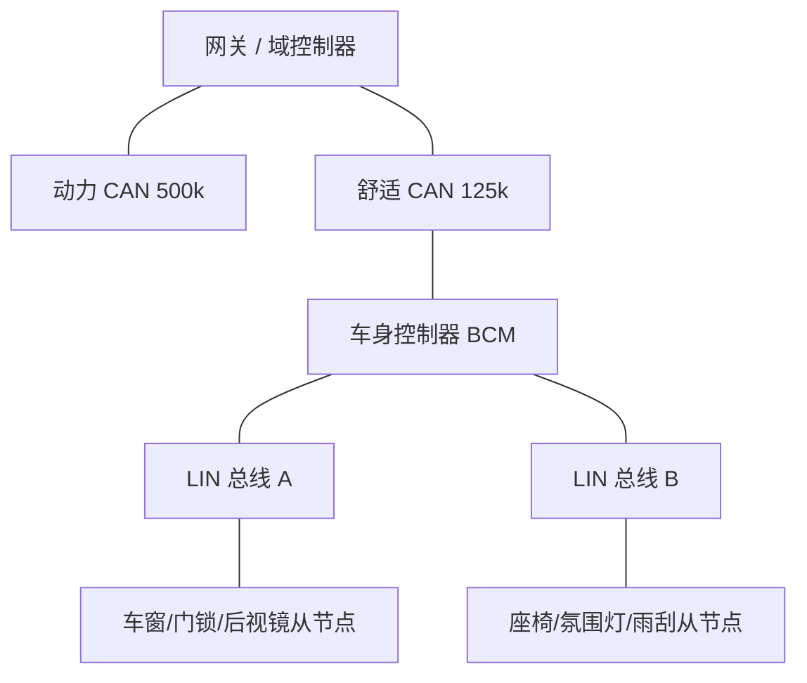
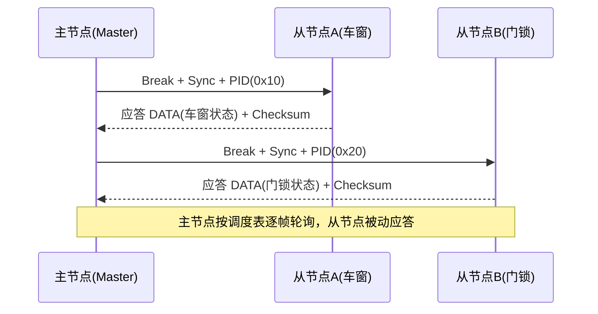
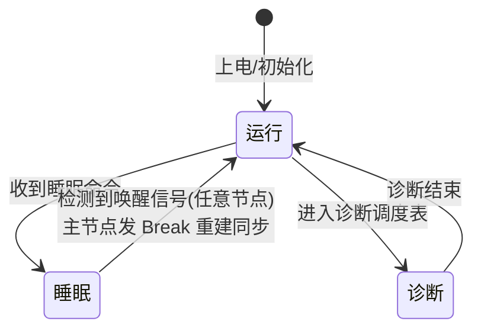
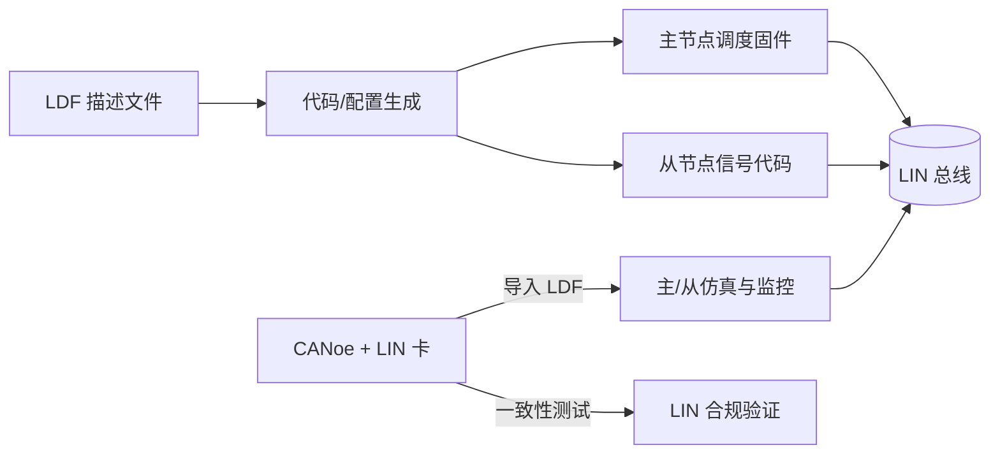
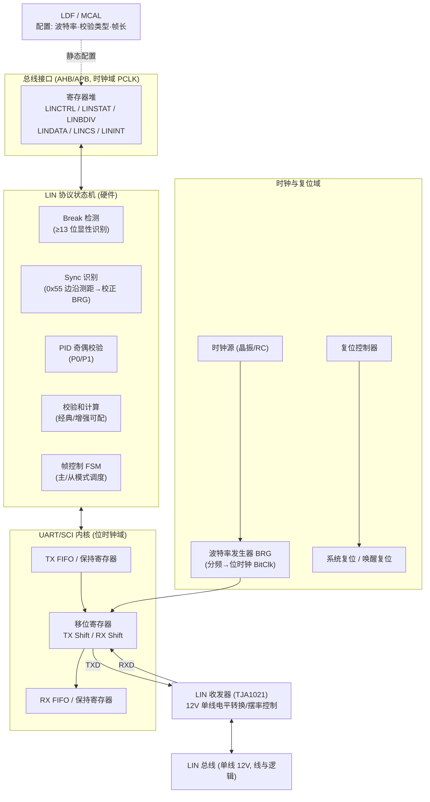
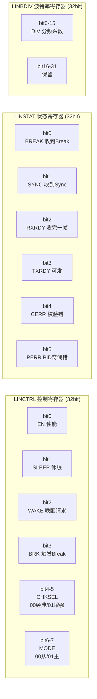
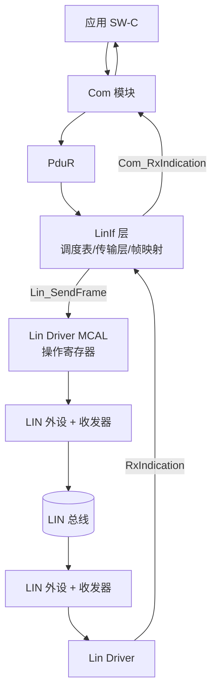

# LIN 总线深度详解：低成本车身子网的调度艺术、自同步魔法与芯片底层实现

> 本文面向汽车电子总线工程师、嵌入式软件开发者、芯片 IP 设计者以及准备车载网络方向面试的读者。笔者试图从工程实践与硅级实现两个视角，把 LIN（Local Interconnect Network）这张"廉价却精妙"的车载网络讲透——不仅讲"是什么"，更讲"为什么这样设计"、"芯片里怎么落地"，以及"踩坑时怎么定位"。相比市面常见的科普文，本文新增了芯片 IP 模块设计、寄存器位域、裸机驱动代码、AUTOSAR MCAL 配置三大工业级章节，可作为车载 LIN 方向的案头参考。

---

## 第一章　LIN 的由来：CAN 太贵，于是有了 LIN

### 1.1　为什么需要一张更便宜的网络

在车载网络的发展史里，CAN（Controller Area Network）几乎成了"车载总线"的代名词。它多主竞争、非破坏位仲裁、差分抗扰、最高 1 Mbps 带宽，是动力总成、底盘控制、整车网关这些"要命"的系统的绝对主力。可是工程师很快发现一个尴尬的现实：一辆车里绝大多数的电子节点，其实根本不需要 CAN 那么强的本事变。

请思考下面这些节点：

- 四个车门的车窗电机、门锁电机；
- 电动座椅的多个方向电机与记忆模块；
- 雨刮电机、喷水电机、天窗电机；
- 自动空调的鼓风机、左右独立温区执行器；
- 车内氛围灯、转向柱调节电机、后视镜折叠电机；
- 方向盘上的各类开关面板（灯光、雨刮、巡航）。

这些节点的共同特征是：**带宽需求极低（每帧几个字节足矣）、实时性要求宽松（人按一下开关，几百毫秒才动也察觉不到）、对成本极其敏感（一辆车上几十个，每个省一块钱就是几十块）**。如果给每一个车窗电机都配一颗带 CAN 控制器和高速收发器的 MCU、再加双绞线、终端电阻、磁环，整车的 BOM 成本会失控，线束重量和接插件数量也会暴涨。

LIN 正是为解决这个问题而生的。它的设计哲学可以浓缩成一句话：**用最廉价的硬件、最简洁的协议，去承载那些"不值钱"的节点**。为此，LIN 在协议层面做了大量"减法"：

- 物理层只用**一根线**（与 12V 供电系统同源），不用双绞线，不用终端电阻；
- 节点可以**不需要高精度时钟**，从节点用廉价 RC 振荡器即可，靠主节点每帧发来的同步字节自校准；
- 通信采用**严格主从**，从节点永远是被点名的角色，不需要任何仲裁逻辑和冲突检测；
- 帧头由主节点统一播发，从节点只需要在被叫到时应答，**硬件状态机极简**；
- 数据长度由调度表事先约定，帧内不携带长度字段，**进一步压缩协议开销**。

把这些"减法"加总，一个 LIN 从节点可以做到：一个 8 位 MCU + 一个几毛钱的开漏驱动 + 一个上拉电阻就能跑起来，软件栈可以只有几百字节。这正是它能在车身里大量铺开的根本原因。也正因如此，LIN 在芯片层面的实现通常直接复用 MCU 内部已有的 UART/SCI 外设，再叠加一个轻量的 LIN 协议状态机——详见第十一章。

### 1.2　LIN 与 CAN 不是替代，而是分层互补

很多初学者会问："既然有了 LIN，还要 CAN 干什么？"答案恰恰是：**LIN 永远替代不了 CAN，它们是汽车网络分层模型里的两个不同层级**。

可以用一个形象的比喻：CAN 是城市里的主干高速公路，双向多车道、限速高、抗堵车（仲裁）；LIN 则是小区里的单行便道，限速低、只能一辆车一辆车的过，但修起来极便宜。高速公路负责把"重要的人"（发动机、制动、转向报文）快速送到中枢，便道负责把"家门口的小事"（开个窗、调个灯）送到单元门口。两者之间靠一个"网关"——通常就是车身控制器（BCM）或域控制器——来做协议转换与报文路由。

因此，在典型的整车网络拓扑里，你会看到这样的结构：动力 CAN、舒适 CAN、信息 CAN 等若干条 CAN 总线，经由网关汇聚；而 LIN 总线则像藤蔓一样从各个 ECU（车窗控制单元、座椅模块、BCM）上"长"出来，挂接一群最底层的执行器和传感器。LIN 是 CAN 的"最后一厘米"延伸，是成本敏感型节点的集散地。



### 1.3　LIN 与 CAN 的量化对比

把两者的关键差异放到一张表里，对照着看最清楚：

| 对比维度 | LIN | CAN（以 125k/500k 为例） |
|----------|-----|---------------------------|
| 拓扑 | 单主多从（确定性调度） | 多主（非破坏位仲裁） |
| 物理介质 | 单线（12V 单端） | 双绞线差分 |
| 速率 | 1~20 kbps（典型 19.2k） | 最高 1 Mbps（常用 125k/500k） |
| 终端电阻 | 不需要 | 需要 120 Ω ×2 |
| 从节点时钟 | 可无晶振（Sync 自同步） | 需精度时钟 |
| 仲裁/冲突 | 无（主节点独占） | 有（ID 优先级） |
| 错误检测 | 奇偶 + 校验和（较弱） | CRC + 位监控 + ACK（强） |
| 单帧数据 | 1~8 字节 | 0~8 字节 |
| 成本 | 极低（几毛~几元级） | 较高（MCU+收发器+双绞线） |
| 适用域 | 车身低速非安全节点 | 动力/底盘/整车通信 |
| 典型角色 | CAN 的末端延伸 | 主干网络 |

这张表几乎就是"选型决策表"：带宽低、成本敏感、实时宽松 → LIN；带宽高、实时强、需抗扰与安全 → CAN。两者经网关互补，构成整车分层网络。

### 1.4　LIN 标准的演进：从 1.3 到 2.2A

LIN 并非一日成型，它的规范由 LIN Consortium（后来并入 AUTOSAR 体系）逐步迭代，关键版本如下：

| 版本 | 关键时间节点 | 主要变化与意义 |
|------|--------------|----------------|
| LIN 1.0 / 1.1 | 1999–2000 | 最初原型，定义了单主多从、调度表、帧格式的基本骨架，但诊断与配置能力很弱。 |
| LIN 1.2 | 2000 左右 | 增强了诊断规范，初步定义了节点配置服务。 |
| **LIN 1.3** | 2002 | 强化了物理层电气特性，明确了从节点无需晶振的自同步机制，是早期量产车广泛采用的稳定版本。 |
| **LIN 2.0** | 2003 | 重大升级：引入 **LDF（LIN Description File，LIN 描述文件）** 标准化、节点配置与识别服务、增强校验和、诊断传输层、节点能力语言（NCF），工具链成熟度大幅提升。 |
| **LIN 2.1** | 2006 | 引入 **节点配置与识别的更强规范**、传输层协议细化、节点能力文件（NCF）、更完善的休眠/唤醒与诊断，加强了与 AUTOSAR 的衔接。 |
| **LIN 2.2 / 2.2A** | 2010 / 2010 修订 | 当前量产主流版本，主要在 2.1 基础上做勘误与一致性增强，明确节电、诊断、时间基准等细节，绝大多数新车型以 2.2A 为准。 |
| LIN 2.0 兼容子集 | — | 很多低成本从节点只实现 2.0 的子集，工程上需确认主从版本兼容。 |

> 工程提示：选型与联调时，**务必弄清楚主节点和从节点各自宣称的 LIN 版本**。一个 LIN 2.2A 主节点去配一个 LIN 1.3 老从节点，虽然帧级通信通常能通（帧格式向后兼容），但诊断、节点配置、增强校验这些"高级功能"可能完全对不上。实际项目里，笔者见过不少"帧能通但配不上节点属性"的诡异故障，根因就是版本错配。

---

## 第二章　网络拓扑与节点角色：只有一个指挥

### 2.1　严格的主从结构

LIN 网络在拓扑上是**单主多从（one master, multiple slaves）**的星型或线型结构。整条总线上**有且只有一个主节点**（Master），其余全部是从节点（Slave）。主节点往往同时兼任 LIN 网关的角色——它一边连着 CAN（或更高层网络），一边作为 LIN 集群的"指挥家"。

需要强调几个硬约束：

1. **主节点唯一性**：不允许出现两个主节点抢着发帧头，否则调度彻底乱套。LIN 协议本身没有主节点选举机制，谁是主节点是设计阶段焊死在硬件与软件里的。
2. **从节点被动性**：从节点永远不能主动发起通信。它只能响应主节点的帧头，按约定填充应答。即使从节点检测到一个车门被撬、一个开关被按下，它也不能"立刻上报"，而是要等主节点下一轮轮询到自己时才能把事件带出去。
3. **节点数上限**：理论上一帧 PID 有 6 位 ID（0~63），但其中 60~63 保留给诊断与配置，可用 ID 约 0~59，对应约 60 个从节点上限。工程上受限于单线电容负载与调度周期，实际一般挂 16 个以内，典型是 4~12 个。

### 2.2　主节点到底"主"在哪里

主节点承担了三件从节点绝不做的事：

- **发帧头（Header）**：Break、Sync、PID 三段永远由主节点播发；
- **跑调度表（Schedule Table）**：决定每一时刻轮询谁、问什么；
- **提供时间基准**：Sync 字节由主节点发出，从节点的波特率以它为准，主节点自然就是全网的时间源头。

从节点只有一件核心工作：**监听帧头，命中 PID 就应答，没命中就静默**。这种不对称性正是 LIN 廉价的根源——把复杂度与成本集中到唯一的主节点，让几十个从节点都变成"傻瓜式"廉价器件。



---

## 第三章　物理层：一根线、12V 电平与"线与"逻辑

### 3.1　单线总线与供电同源

LIN 物理层最直观的特征就是**只有一根信号线**（LIN bus），它的电气参考是车身 12V 电源系统。总线空闲（隐性，recessive）时，被主节点或通过从节点上的一个上拉电阻（典型 1 kΩ，连接至电池电压 VBAT，经二极管防反灌）拉到接近电池电压，通常约 **12V（或系统标称的 VBAT）**；显性（dominant）时，由某个节点的发射级把总线拉低到地（约 0V）。

这正是典型的**开漏/开集电极"线与（wired-AND）"**逻辑：只要有一个节点把总线拉低，整条线就是低；所有节点都释放，总线才回到高。这与 CAN 的差分显性/隐性异曲同工，但 LIN 用单端电压而非差分，成本更低，代价是抗共模干扰能力差——所以它只配在电磁环境相对温和的车身内饰区域用，绝不会出现在发动机舱或动力线旁边。

### 3.2　电平与时序参数（以 12V 系统为例）

LIN 规范定义了总线电压、斜率、边沿等参数。以常见的 12V 车身系统为例：

- 显性电平：总线电压 ≤ 0.4 × VBAT（被拉低到接近地）；
- 隐性电平：总线电压 ≥ 0.6 × VBAT（被上拉到接近电池）；
- 通信速率：1 kbps ~ 20 kbps，**典型 19.2 kbps**（也有 9.6 k、10.4 k 等）；
- 从节点内部上拉：通常 20 kΩ ~ 60 kΩ（弱上拉，用于无主时自举），主节点侧用强上拉（约 1 kΩ）维持总线空闲高电平；
- 总线电容：受从节点数量与上拉强度限制，需保证边沿斜率在规定范围内，避免反射与误采样。

之所以选 19.2 kbps 这个略"怪"的数值，是因为它在低成本的 RC 时钟体系里容易用整数分频得到，且足够承载车身低速信号。相比 CAN 动辄 125 k~500 k，LIN 的带宽确实寒酸，但对车窗电机状态这种"每秒更新几次"的变量绰绰有余。

下表汇总了物理层关键参数与容限（以 LIN 2.2A / 12V 系统为例）：

| 参数 | 符号 | 典型值 / 范围 | 说明 |
|------|------|---------------|------|
| 标称供电 | VBAT | 12 V（9~16 V 允许） | 与车身电源同源 |
| 显性阈值上限 | VDOM | ≤ 0.4 × VBAT | 低于此判为显性 |
| 隐性阈值下限 | VREC | ≥ 0.6 × VBAT | 高于此判为隐性 |
| 波特率 | BR | 1~20 kbps（19.2k 典型） | 主节点决定 |
| 主节点上拉 | RPU_MASTER | ≈ 1 kΩ | 维持空闲高电平 |
| 从节点上拉 | RPU_SLAVE | 20~60 kΩ | 弱上拉，自举用 |
| 唤醒脉冲宽 | Twake | 250 μs ~ 5 ms | 显性脉冲唤醒 |
| 总线电容 | Cbus | ≤ 数 nF | 限制节点数与线长 |

### 3.3　收发器与"无收发器"方案

LIN 收发器（如经典的 NXP TJA1020 / TJA1021 / TJA1027 系列，Infineon TLE7259，ST L9637 等）把 MCU 的 UART 信号电平转换成 LIN 总线上的 12V 单线信号，并集成短路保护、欠压检测、唤醒滤波等功能。TJA1021 这类器件内部集成了摆率控制（slew-rate control）以抑制 EME、过温与短路保护、以及本地/远程唤醒识别，是量产 LIN 从节点的标准选择。

但 LIN 最诱人的地方在于：**从节点可以完全不用专用收发器**。一个普通 IO 口配上拉电阻加上开漏驱动，就能在软件层面"bit-bang"出 LIN 波形。虽然这样抗扰和斜率控制不如专用收发器，但在成本极致敏感的场景下是可行的——很多低端的车窗、雨刮模块就是这么干的。

> 笔者提醒：bit-bang 方案对软件时序要求极高，断不能在被中断打扰的上下文里发 Break 这种"超长显性位"，否则时序一偏，从节点自同步就废了。量产项目除非成本卡到骨头，否则建议老老实实用收发器。

### 3.4　为什么 LIN 不用终端电阻和差分

CAN 必须用 120 Ω 终端电阻来匹配双绞线特性阻抗、抑制信号反射；LIN 则完全不需要。原因是 LIN 速率极低（≤20 kbps）、线束极短（车身内一般 <5 米）、且是单端信号。在这个速率和距离组合下，反射的幅度与时间尺度远小于位宽，根本不构成问题。省掉终端电阻，又是一笔线束与接插件的成本节约。这也意味着 LIN 对线束施工的要求比 CAN 宽松得多——这也是它适合"到处拉一根线"的底层逻辑。

```mermaid
timing
    title 帧起始：Break(≥13位显性) + BreakDelimiter(≥1位隐性) + Sync(0x55)
    axisMode transparent
    LIN : 0, 0, 0, 0, 0, 0, 0, 0, 0, 0, 0, 0, 0, 1, 0, 1, 0, 1, 0, 1, 0, 1, 0, 1, 0, 1
```

> 上图示意一帧最前端的位流：连续 ≥13 个显性位（Break）后跟一个隐性位（Delimiter），再进入 Sync 字节 0x55（二进制 01010101）。从节点硬件 Break 检测模块正是靠"超长显性"识别帧起点。

---

## 第四章　帧结构逐字段拆解：从 Break 到 Checksum

LIN 的一帧（Frame）由"主节点发的帧头 Header"和"从节点（或主节点代发）发的应答 Response"拼接而成，物理上表现为一段连续的位流。完整结构如下：

```
Break(≥13位0) | BreakDelim(≥1位1) | Sync(0x55) | PID(8) | DATA(1~8B) | Checksum(8)
```

下面逐字段深挖。

### 4.1　同步间隔场（Break Field）：用"异常长"宣告开始

Break 是一段**持续的显性（0）电平，宽度至少 13 个位时间（位时间 = 1/波特率）**。正常 UART 字节最多是 1 个起始位 + 8 数据位 + 可选奇偶位 + 1~2 停止位，任意连续相同极性位最多约 9~10 位。也就是说，Break 的"超长 0"在合法数据里是**不可能自然出现**的。这个"刻意制造的不可能"，正是从节点从休眠、待机、错乱状态里"啪"地识别出"新的一帧来了"的可靠锚点。

设计上，Break 必须足够长，是因为从节点可能处于任意状态：刚被唤醒、RC 时钟还在起振、上一个字节没收完就卡死……一个普普通通的起始位会被这些噪声淹没，但一段 ≥13 位的持续显性位，几乎不可能被误判。它是 LIN 鲁棒性的第一道保险。

### 4.2　同步间隔界定符（Break Delimiter）

紧跟 Break 之后，是一段**至少 1 个位时间的隐性（1）电平**，称为 Break Delimiter。它的作用是为 Sync 字节的第一个位提供一个清晰的上升沿。试想：如果 Break 之后立刻接 Sync 的第一位（也是 0 起始位），从节点可能分不清 Break 的尾部和 Sync 的起始位。Delimiter 这段"高电平缓冲"确保 Sync 字节的 0x55 能被干净地识别为"一个正常的 UART 字节"，从节点 UART 的状态机也能正确进入接收 Sync 的流程。

### 4.3　同步字段（Sync Byte）：0x55 的自同步魔法

Sync 字节固定为 **0x55**，二进制即 `01010101`。它的每一位都在 0 和 1 之间跳变，于是总线上出现一串等间距的上升沿与下降沿。从节点只要测量相邻下降沿（或边沿）之间的时间间隔，就能反推出主节点的位时间（bit time），进而算出波特率，并**把自己的采样时钟重新对齐**到主节点。

这正是 LIN 从节点敢用廉价 RC 振荡器的根本原因——它不需要长期频率精度，只需要"每帧重新对一次表"。即便 RC 振荡器因为温度漂移，在一帧内部采样点慢慢偏出了位中心，下一帧的 Sync 又把它拉了回来。这种机制把对从节点时钟精度的要求从"ppm 级长期稳定"降到了"一帧之内别漂出采样容限"级别，直接省掉了每个从节点的晶振成本。

```mermaid
timing
    title 同步字节 0x55 的自同步原理（每格一个位时间，边沿等距）
    axisMode transparent
    LIN : 0, 1, 0, 1, 0, 1, 0, 1
```

> 上图示意 0x55 的位跳变：从节点测量相邻边沿间隔 T，得到位时间 ≈ T，据此重同步采样时钟。若用硬件 LIN 外设，这一"边沿测距"由波特率校正逻辑在 Sync 段自动完成（见第十一章）。

### 4.4　受保护标识符（PID）：6 位 ID + 2 位奇偶

PID 是 8 位，其中**低 6 位是帧 ID（Frame ID，取值 0~63）**，**高 2 位是奇偶校验位（Parity）**。这就是"Protected ID（受保护标识符）"名字的由来——接收方可以校验这两位奇偶位，从而检测帧 ID 在传输过程中是否发生位翻转错误。

帧 ID 的语义划分（依据 LIN 规范约定）：

- **ID 0 ~ 59**：普通通信帧，由应用层调度表定义，承载信号（车窗、门锁、灯等）；
- **ID 60（0x3C）**：诊断请求帧（Master Request），用于主节点向从节点发诊断/配置命令；
- **ID 61（0x3D）**：诊断应答帧（Slave Response），用于从节点回诊断/配置响应；
- **ID 62（0x3E）与 63（0x3F）**：保留（Reserved），用于节点配置与未来扩展（如用户定义、供应商扩展等）。

奇偶位的算法（规范定义）如下：

- P0 = ID0 ⊕ ID1 ⊕ ID2 ⊕ ID4
- P1 = ¬(ID1 ⊕ ID3 ⊕ ID4 ⊕ ID5)

其中 ID0 是最低有效位（LSB）。计算后的 PID = (P1 << 7) | (P0 << 6) | (ID & 0x3F)。接收方在收到 PID 后重算 P0、P1 并与收到的比较，不一致则判定该帧 ID 错误，丢弃。

下表给出几个典型 ID 的 PID 计算结果示例（便于联调时手算核对）：

| 帧 ID (hex) | 帧 ID (bin) | P0 | P1 | PID (bin) | PID (hex) | 用途 |
|-------------|-------------|----|----|-----------|-----------|------|
| 0x10 | 010000 | 0 | 1 | 1010 0000 | 0xA0 | 应用帧（车窗） |
| 0x20 | 100000 | 0 | 1 | 1010 0001 | 0xA1 | 应用帧（门锁） |
| 0x3C | 111100 | 0 | 0 | 0011 1100 | 0x3C | 诊断请求 |
| 0x3D | 111101 | 1 | 0 | 0111 1101 | 0x7D | 诊断应答 |

> 注意：ID 的奇偶位不是简单的偶校验，而是规范固定的两组异或式，不能用通用奇偶校验函数替代，务必按上式实现（代码见第十二章）。

### 4.5　数据场（Data Field）：长度由调度表规定

LIN 的数据场长度可以是 **1 到 8 字节**，但关键点是：**长度不是帧里自描述的，而是调度表事先约定好的**。主节点发某个 PID 时，通信双方都"心照不宣"地知道这一帧该是 2 字节还是 4 字节或 8 字节。这又替 LIN 省掉了一个类似 CAN 的 DLC（数据长度码）字段——进一步降低复杂度。

字节序上，LIN 与多数车载协议一致：**先发低字节（LSB first in frame），字节内先发最低位（bit LSB first）**。这也是为什么用 UART 直接搬 LIN 帧时往往"看起来对、解析却错位"，因为 UART 默认也是 LSB first，但字节顺序和帧内的信号排布（信号可能跨字节、有字节序/位序约定）需要严格按 LDF 的"信号布局（signal layout）"来解析。

### 4.6　校验和（Checksum）：经典与增强

LIN 帧尾是一字节校验和，目的是检测数据场在传输中的错误。它有两种算法：

- **经典校验（Classic Checksum）**：仅对**数据场所有字节**逐字节累加（模 256，即忽略进位），然后取反（即 0xFF 减去累加和）。**不包含 PID**。主要用于 LIN 1.x 时代的普通帧。
- **增强校验（Enhanced Checksum）**：对 **PID 字节 + 数据场所有字节** 一起累加取反。**包含 PID**，因此能多防一层"PID 传错但奇偶位恰好没抓到"的风险，检错能力更强。LIN 2.0 及以后，普通应用帧推荐用增强校验；**诊断帧（ID 60/61）强制使用经典校验**（这是规范硬性规定，务必注意）。

主从双方必须**约定使用同一种校验方式**，否则校验永远对不上，帧会被当成错误帧丢弃。这是工程联调时的高频雷区。两种校验方式的区别汇总如下：

| 项目 | Classic 经典校验 | Enhanced 增强校验 |
|------|------------------|-------------------|
| 校验覆盖范围 | 仅数据场 | PID + 数据场 |
| 检错能力 | 较弱（漏检 PID 错） | 较强 |
| LIN 版本 | 1.x 普通帧 / 全部诊断帧 | 2.0+ 普通应用帧 |
| 诊断帧（60/61） | 强制 | 禁止 |
| 取反方式 | 0xFF − Σ(数据) | 0xFF − Σ(PID+数据) |

下面给出从节点接收一帧的完整解析伪代码，覆盖 Break 检测、Sync 校验、PID 校验与数据接收：

```c
/* 从节点接收并解析一帧 LIN（伪代码，体现状态机思路） */
typedef enum {
    ST_IDLE,        /* 等待 Break */
    ST_SYNC,        /* 已收到 Break，等 Sync=0x55 */
    ST_PID,         /* 等 PID */
    ST_DATA,        /* 收数据 */
    ST_CHECKSUM     /* 收校验和并验证 */
} LinRxState;

void Lin_SlaveRxTick(uint8_t rxbyte, uint8_t is_break)
{
    static LinRxState st = ST_IDLE;
    static uint8_t pid, len, idx, sum;
    static uint8_t buf[8];

    if (is_break) {                 /* 检测到 ≥13 位显性 Break */
        st = ST_SYNC;
        return;
    }
    switch (st) {
    case ST_SYNC:
        if (rxbyte != 0x55) { st = ST_IDLE; break; }  /* Sync 必须 0x55 */
        st = ST_PID; break;
    case ST_PID:
        if (!Lin_PidParityOk(rxbyte)) { st = ST_IDLE; break; } /* 奇偶校验失败丢弃 */
        pid = rxbyte;
        len = Lin_GetFrameLen(pid);   /* 长度由调度表/LDF 约定查表得到 */
        idx = 0; sum = pid;           /* 增强校验从 PID 起算 */
        st = ST_DATA; break;
    case ST_DATA:
        buf[idx++] = rxbyte;
        sum = (uint8_t)(sum + rxbyte);  /* 模 256 累加 */
        if (idx >= len) st = ST_CHECKSUM;
        break;
    case ST_CHECKSUM:
        if (((uint8_t)(~sum)) != rxbyte) { st = ST_IDLE; break; } /* 取反比对 */
        Lin_OnFrameReceived(pid, buf, len);  /* 命中，交付应用 */
        st = ST_IDLE; break;
    default: st = ST_IDLE;
    }
}
```

### 4.7　信号封装与位序：为什么解析常"差一位"

工程联调里另一类常见病是"帧收到了、字节也对，但某个开关位怎么都读不对"。根因几乎都在**信号位序（bit order）与字节序（byte order）**上。LIN 在字节层面是 LSB-first（低字节先发、字节内最低位先发），这点和 UART 一致；但在"信号如何塞进字节"上，LDF 约定了信号的**起始位（start bit）与长度（bit length）**，允许一个信号跨字节、允许信号从某字节的某一位起连续排布。例如一个 12 位的"车窗位置"信号，可能从字节 0 的第 0 位起跨到字节 1 的第 3 位。若解包代码按"字节整体"去读，必然错位。

因此，从节点发送方必须把"信号值"按 LDF 的布局打包成字节流（pack），主节点接收方再按同一布局解包（unpack）。这一步**必须严格以 LDF 为唯一真源自动生成**，手写极易出错。常见陷阱还包括：把"信号长度"当"字节数"、忽略信号初始值与偏移（offset）/因子（factor）导致物理量换算偏差、以及小端/大端在跨字节信号上的理解错误。掌握 LDF 的信号布局规则，是 LIN 应用层开发的基本功。

### 4.8　字节间帧内响应间隔（Inter-byte Space）

除了 Break 与 Sync 之间需要 Break Delimiter，LIN 规范还定义了字节与字节之间的"帧内响应空间（response space / inter-byte space）"——即相邻字节之间允许插入的隐性位间隔，用于从节点准备下一段数据或主从切换驱动方向。这个间隔是**有上限**的，过长会被判定为帧内超时错误。理解它有助于解释"为什么用 bit-bang 软件发帧时不能随意被中断插入"：一旦插值延迟超过允许空间，对端直接判帧失败。这也是专用 LIN 收发器 + 硬件 UART 比软件模拟更稳的原因之一。


> 上图为 LIN 帧字段级流程：帧头（Break+Delim+Sync+PID）恒由主节点发送，应答（Data+Checksum）由从节点（或主节点代发偶发帧时）发送。

---

## 第五章　调度表、时隙与四类帧：LIN 的"节目单"机制

### 5.1　调度表（Schedule Table）就是时钟

LIN 是确定性网络，**时间由主节点的调度表完全掌控**。调度表可以理解为一串有序的"时隙（Slot）"列表，每个时隙规定：在这一刻发哪个 PID、期望谁来应答、这一帧多长。主节点从上到下、循环往复地扫描这张表，于是整网通信就像按节目单演出。

调度表的设计直接决定了网络的两个关键指标：

- **带宽利用率**：时隙排得密，响应快但总线忙；排得疏，省带宽但响应慢。
- **实时性（延迟）**：某个帧被轮询到的周期，就是它最坏情况下的上报延迟。把防夹信号排成 10 ms 周期，把氛围灯排成 100 ms 周期，体验与成本就能平衡。

工程上常把调度表分成多条，例如"普通调度表""诊断调度表""休眠调度表"，按需切换。比如正常行驶用普通表，进诊断时用诊断表，休眠时用极简表只留唤醒监听。

### 5.2　LIN 的四种帧类型

LIN 规范定义了四类语义不同的帧，理解它们对设计调度表至关重要：

| 帧类型 | 触发方式 | 用途说明 | 典型 PID 范围 |
|--------|----------|----------|----------------|
| **无条件帧（Unconditional / Static Frame）** | 主节点无条件按调度表周期播发 | 承载周期性信号（车窗状态、温度等），是网络主体 | 0~59 应用帧 |
| **事件触发帧（Event-Triggered Frame）** | 主节点发一个"公共 PID"，**只有发生变化的从节点才应答** | 把多个状态帧聚合，节省带宽；无变化时从节点全部静默 | 0~59 |
| **偶发帧（Sporadic Frame）** | 由主节点代发，但仅当某从节点"有数据要上报"时才发 | 让从节点能"借"主节点的口把事件推出去（从节点不能主动发） | 0~59 |
| **诊断帧（Diagnostic Frame）** | 固定 PID 60（请求）/ 61（应答） | 节点配置、识别、读写、传输层等诊断服务载体 | 60、61 |

下面逐一展开。

#### 5.2.1　无条件帧（静态帧）

最常见的帧。主节点每个周期都把某个 PID 发出去，对应从节点老老实实应答。简单、可预测，带宽开销固定。车身里绝大多数周期信号都是它。

#### 5.2.2　事件触发帧

设想有 8 个车门开关状态，每个都排无条件帧，等于 8 个时隙被占满，可大多数时候这些开关根本没动。事件触发帧的思路是：主节点发一个"聚合 PID"，这个 PID 背后其实对应多个从节点的不同信号；**只有真正发生变化的那个从节点才应答**，其余保持静默。如果同时有多个从节点应答（总线冲突），主节点检测到冲突后，会退化为分别用各自的无条件帧去轮询，确保不丢数据。这样平时一个时隙就能监控 8 个开关，带宽利用率极高。

#### 5.2.3　偶发帧

从节点不能主动发帧，但有些事件（如"门被撬""玻璃遇阻"）又确实需要即时上报。偶发帧让从节点先把数据"挂"在主节点那边，主节点在自己的调度表里**仅在从节点有数据时才代发**该 PID。它是一种"由从节点需求驱动、由主节点执行"的上行通道，弥补了纯主从不能主动上报的短板。注意偶发帧与事件触发帧方向相反：偶发帧是被从节点"拉"出来的上行数据，事件触发帧是主节点聚合下行/状态查询。

#### 5.2.4　诊断帧

ID 60 和 61 专用于诊断与节点配置，承载 LIN 传输层（见第六章）的报文。诊断帧强制使用**经典校验**，这是规范红线。

### 5.3　时隙与帧时隙（Frame Slot）的时序

每个调度表条目对应一个"帧时隙"，其长度必须 ≥ 该帧最坏情况下的传输时间（含 Break、Sync、PID、数据、校验和，以及从节点应答的处理与传播延迟，再加一点余量，称为"帧时隙余量/响应间隔"）。主节点发完一个帧头后，会等待"帧响应空间（response space）"让从节点准备，再从节点发应答。下图的甘特图示意了一张典型调度表的时间排布：

```mermaid
gantt
    title LIN 主节点调度表（时隙排布示例）
    dateFormat  s
    axisFormat  %S.%L
    section 短周期(实时)
    车窗防夹状态(无条件帧)   :a1, 0.00, 0.05
    门锁状态(无条件帧)       :a2, after a1, 0.05
    门状态事件触发帧(聚合)   :a3, after a2, 0.05
    section 中周期
    座椅加热设定             :b1, after a3, 0.10
    section 长周期(慢变量)
    氛围灯颜色(无条件帧)     :c1, after b1, 0.30
    诊断帧(按需插入)         :c2, after c1, 0.10
```

> 短周期帧（防夹、门锁）排在前面且时隙短，保证交互实时；慢变量（氛围灯）周期长、时隙宽松；诊断帧按需插入到调度表空隙。

### 5.4　调度表在代码里长什么样

调度表本质是"PID + 长度 + 时隙时长 + 类型"的数组，下面给出一个典型实现骨架：

```c
/* 主节点调度表定义（伪代码） */
typedef struct {
    uint8_t  pid;          /* 受保护标识符 */
    uint8_t  dlc;          /* 该帧数据长度（由 LDF 约定） */
    uint16_t slot_us;      /* 帧时隙时长（微秒），需 ≥ 最坏传输时间 */
    uint8_t  type;         /* 0=无条件 1=事件触发 2=偶发 3=诊断 */
} LinScheduleEntry;

const LinScheduleEntry g_LinSchedule[] = {
    { 0x10, 2, 1500, 0 },  /* 车窗状态，2 字节，1.5ms 时隙 */
    { 0x20, 1, 1500, 0 },  /* 门锁状态，1 字节 */
    { 0x31, 4, 2000, 1 },  /* 事件触发帧（聚合 4 个开关） */
    { 0x40, 3, 3000, 2 },  /* 偶发帧（从节点有数据才发） */
    { 0x3C, 8, 4000, 3 },  /* 诊断请求帧，8 字节 */
};

/* 主循环：按调度表依次发帧头，必要时填充/转发应答 */
void Lin_SchedulerTick(void)
{
    static uint8_t i = 0;
    const LinScheduleEntry *e = &g_LinSchedule[i];
    Lin_SendHeader(e->pid);                 /* Break+Sync+PID */
    if (e->type == 2 /*偶发*/ && Lin_SlaveHasPending(e->pid)) {
        Lin_SendResponse(e->pid, e->dlc);   /* 主节点代从节点发应答 */
    }
    WaitSlot(e->slot_us);                   /* 等满一个时隙 */
    i = (uint8_t)((i + 1) % (sizeof(g_LinSchedule)/sizeof(g_LinSchedule[0])));
}
```

### 5.5　如何估算总线负载率（Bus Load）

调度表设计完，必须算一笔账：**总线负载率** = 所有时隙占用时间之和 ÷ 调度表总周期。一般建议 LIN 负载率控制在 60%~80% 以内，留出突发诊断与偶发帧的余量，否则实时性会恶化。估算时别忘了把 Break（≥13 位）+ Delimiter（≥1 位）+ Sync（8 位）+ PID（8 位）这些"帧头开销"算进去，它们每个时隙都要重复付出。举例：波特率 19.2 kbps（位时间 ≈ 52 μs），一帧 2 字节的无条件帧，帧头约 30 位、应答约 (2×8+8)=24 位，加间隔约 60 位 ≈ 3.1 ms；若排成 10 ms 周期，单帧负载约 31%；十条类似帧就逼近 80%。这种"先算账再排表"的习惯，能避免上线后频发响应卡顿。

---

## 第六章　节点配置、传输层与网络管理

### 6.1　LIN 传输层（Transport Layer）

诊断帧每帧最多 8 字节，但节点配置、软件刷写、大量参数读写常常远超 8 字节。为此 LIN 2.0+ 定义了**传输层协议（Transport Layer / TL）**，把多帧诊断报文"分包—重组"。它定义了首帧（SF/FF）、连续帧（CF）、流控等机制（与 ISO-TP 思想类似但更轻量），让一个 20 字节的诊断报文能拆成几帧在 ID 60/61 上分多次传完。这是 LIN 能承载"节点配置""参数标定""轻度刷写"的基础。

### 6.2　节点配置与识别（Node Configuration）

LIN 2.x 规定了一套节点配置服务，主节点可以在上电/下线时"认识"每个从节点：

- **节点识别（Node Identification）**：读取从节点的产品标识、供应商 ID、功能 ID、 Variant 等，确认"你是谁"；
- **节点配置（Node Configuration）**：设置从节点的帧长度、PID 映射、帧_publishing/subscribing 关系（即该从节点负责发哪些 PID、收哪些 PID）、配置 NAD（节点地址）等；
- **保存配置（Save Configuration）**：把配置写入从节点非易失存储，下次上电自动生效。

这套机制的意义是：**同一个从节点硬件，可以通过配置扮演不同角色**。供应商生产一批"通用 LIN 从节点"，主机厂按车型需求配置成"左前窗"或"右后窗"，降低零件种类。

### 6.3　睡眠与唤醒（Sleep / Wakeup）

车身节点必须极致省电。LIN 定义了低功耗流程：

- **睡眠（Go-to-Sleep）**：主节点通过调度表发出"睡眠命令帧"（通常是 ID 60 诊断帧里携带特定命令，或经传输层下发的休眠指令），所有从节点收到后进低功耗，停止发帧、关外设，仅保留极弱监听。
- **唤醒（Wakeup）**：任何节点（主或从）都可以在总线上发一个**唤醒信号（Wakeup Signal，一段 250 μs~5 ms 的显性脉冲，或按规范定义的唤醒波形）**。其他节点检测到后退出睡眠，主节点随后发 Break 重新建立同步，网络复活。

注意一个微妙点：**从节点也能发起唤醒**（比如门被撬时从节点要"叫醒"主节点），但它唤醒后**仍然不能主动发数据**，只能等主节点恢复调度后轮询到自己才上报。这是 LIN 主从铁律的体现。



---

## 第七章　LDF 描述文件与工具链（含 CANoe LIN）

### 7.1　LDF（LIN Description File）是什么

LDF 是用文本描述的 LIN 网络"蓝图"，它把网络的全部静态信息标准化、机器可读：节点清单、每个节点的属性（NAD、供应商、协议版本）、信号与帧的定义、帧 ID 与长度、信号在哪个字节哪几位、调度表内容、时序参数……主节点代码生成、测试工具、从节点配置，全都围绕 LDF 展开。

一份 LDF 大致包含这些段落：

- `Nodes{...}`：主节点与从节点的名称、属性；
- `Signals{...}`：信号名、长度（位）、初始值、 publisher/subscriber；
- `Frames{...}`：帧名、ID、承载的信号、长度；
- `Schedule_tables{...}`：每条调度表的帧序列与时序；
- `Node_attributes{...}`：每个节点的诊断、配置、时序细节。

LDF 的出现，让"改一个帧长度""加一个信号"从改代码变成改配置文件，工具自动生成代码，极大降低了出错率。这也是 LIN 2.0 相比 1.x 在量产落地上的最大进步之一。

### 7.2　LDF 解析与代码生成

量产流程通常是：架构工程师写好 LDF → 用工具（如 Vector 的 LDF 编辑器、开源 ldfparser 等）解析 → 自动生成主节点的调度表数组、从节点的信号打包/解包代码、诊断桩代码。工程师不再手写 PID、长度、时隙这些易错常量，而是改 LDF、重新生成。

下面是一段简化的 LDF 片段，帮助建立直观印象：

```text
LIN_description_file;
LIN_protocol_version = "2.2";
LIN_language_version = "2.2";
Nodes {
    Master: CEM, 20 ms, 0.1 ms ;   // 主节点 CEM，调度表基准 20ms
    Slaves: DoorFL, DoorFR ;        // 两个从节点
}
Signals {
    WindowPos   : 8, 0, DoorFL, CEM ;   // 车窗位置 8 位
    LockState   : 1, 0, DoorFR, CEM ;   // 门锁状态 1 位
}
Frames {
    WindowFrame  : 0x10, WindowPos, 2 ms ;  // 帧 ID 0x10
    LockFrame    : 0x20, LockState, 2 ms ;
}
Schedule_tables {
    NormalTable {
        WindowFrame  delay 10 ms ;
        LockFrame    delay 10 ms ;
    }
}
```

### 7.3　CANoe LIN 与主流工具

在研发与测试环节，LIN 离不开总线分析工具。以 **CANoe（Vector 公司）配合 LIN 接口卡**为例，它的典型能力包括：

- 导入 LDF，自动识别网络拓扑、帧、信号与调度表；
- 实时监听总线，按信号名/帧名解码显示，而非裸字节；
- 作为**主节点仿真**：用 CAPL 脚本驱动调度表，模拟 BCM 去控制从节点；
- 作为**从节点仿真（Slave Simulation）**：把某个从节点的行为做成脚本，在真实主节点下"扮演"车窗或门锁，做 HIL（硬件在环）测试；
- 注入错误：篡改 PID、破坏校验和、拉长 Break、制造冲突，验证从节点容错；
- 一致性测试（Conformance Test）：依据 LIN 规范自动跑一套用例，验证节点是否合规。

除此之外，还有 LIN 总线示波器/逻辑分析仪（低成本调试利器）、各 MCU 厂商的 LIN 驱动库（如 NXP、Infineon、ST 的 MCAL）、以及 AUTOSAR 的 Lin 与 LinIf 模块，都是工程常用武器。



---

## 第八章　典型应用场景：LIN 在车身上的落脚点

### 8.1　电动车窗与防夹

四个车窗电机是 LIN 最经典的宿主。车窗模块作为从节点，定期上报"当前位置""是否堵转"，接收"升降指令""防夹使能"。**防夹信号要求高实时**，所以在调度表里排短周期（如 10~20 ms）；而"车窗到位后停"这类慢状态可以拉长。从节点用 RC 振荡器即可，因为每帧 Sync 都会重新校准，配合章节一所讲的温度漂移场景，工程上完全可控。

### 8.2　中央门锁与门状态

门锁电机、门状态开关（开/关/半开）、儿童锁，常通过一条 LIN 挂在 BCM 下。事件触发帧在这里大放异彩：主节点用一帧聚合 PID 轮询所有门状态，只有状态变化的门才应答，省下大量带宽。

### 8.3　雨刮与清洗

雨刮电机（含间歇、低速、高速、回位）与清洗泵，信号交互简单但电机功率大、电磁环境相对差。LIN 单线从 BCM 拉到雨刮模块，指令与状态上报分离成两帧即可。注意雨刮模块尽量远离动力线束走线，补偿单线抗扰的不足。

### 8.4　电动座椅与记忆

座椅往往有多个电机（前后、高低、靠背、腰托）加记忆模块、加热/通风。把所有电机控制器挂在同一 LIN 上，由座椅模块（主或从）统一管理，是成本最优解。记忆功能靠诊断/配置服务把位置参数存进从节点 NVM，下次一键还原。

### 8.5　氛围灯与天窗

车内 RGB 氛围灯数量多、颜色更新缓慢，是典型的"慢变量 + 多节点"场景，LIN 几乎是为它量身定做。天窗电机、遮阳帘同理。

---

## 第九章　常见坑与调试实战

### 9.1　波特率偏差累积导致长帧尾部采样错

**现象**：RC 振荡器温漂大的从节点，在长帧（8 字节）尾部字节频繁出错，短帧正常。
**根因**：单帧内时钟慢漂移，采样点逐渐偏出位中心，越靠后越严重。
**调试**：逻辑分析仪抓取从节点返回的 DATA，统计"越靠后越易错"的分布；确认 Sync 自校准是否生效；手段包括降低单帧长度、提高 Sync 出现频率（缩短调度周期）、或更换温漂更小的时钟源。

### 9.2　单线对地短路导致全网瘫痪

**现象**：LIN 总线常显低电平，所有从节点失联。
**根因**：LIN 只有一根线，对地短路或某节点内部把总线长期拉低（显性短路），"线与"逻辑让全网都"听不见"主节点。
**调试**：量总线空闲电平（应接近 VBAT 高）；若为常低，逐段断开从节点，定位是哪个节点或哪段线束把线拉死。

### 9.3　调度表周期设计不当引起"失灵"错觉

**现象**：用户按开关要等几百毫秒才动，被误报"失灵"，但 CAN 上无 DTC。
**根因**：交互类帧排得太稀，最坏延迟超过人感知阈值。
**调试**：审视调度表时隙分配，把交互帧周期压到几十毫秒内，慢变量拉长，平衡实时与带宽。

### 9.4　PID 奇偶与校验模式不匹配

**现象**：帧能收到但被当成错误丢弃，从节点永不应答。
**根因**：主从在"经典/增强校验"或 PID 奇偶算法版本上不一致；尤其诊断帧必须用经典校验，若误用增强必然失败。
**调试**：抓完整帧，手动按规范重算 PID parity 与 Checksum 比对；查 LDF 的校验设置。

### 9.5　从节点休眠/唤醒时序没处理好

**现象**：休眠后主节点发唤醒，从节点"装死"不恢复。
**根因**：从节点状态机没正确处理唤醒脉冲后的 Break 重新同步，或唤醒后硬件没重新初始化 UART/时钟。
**调试**：示波器同时抓总线唤醒波形与从节点供电/复位脚，确认唤醒路径与软件恢复流程。

### 9.6　事件触发帧冲突处理缺失

**现象**：多个从节点同时变化，事件触发帧数据乱套。
**根因**：主节点收到冲突（检测到意外长度/校验失败）后，没按规范退化到逐条无条件帧轮询。
**调试**：在调度表里为事件触发帧配好"冲突后回退"的无条件帧序列，并验证主节点逻辑。

### 9.7　偶发帧被当成普通帧误发

**现象**：偶发帧在无数据时仍周期性占用时隙，浪费带宽甚至制造非法应答。
**根因**：主节点没判断"从节点是否有挂起数据"就代发响应。
**调试**：代发前先查从节点的 pending 标志（见第五章调度表示例），无数据则只发帧头、不代发响应。

### 9.8　LDF 与代码版本脱节

**现象**：改了 LDF 却忘了重新生成代码，或手改代码覆盖了生成结果，导致帧长度/信号位序不匹配。
**根因**：LDF 与固件来源不单一，缺乏生成流程约束。
**调试**：建立"LDF 唯一真源 + 自动生成"的 CI 流程，禁止手写覆盖生成代码。

---

## 第十章　面试高频题精选（20+ 道，含要点）

下面汇总车载网络岗位常考的 LIN 题目，笔者给出要点，供自测与复习。

1. **LIN 为什么这么便宜？**
   要点：单线（与 12V 同源）、从节点无需高精度时钟（靠 Sync 自同步）、严格主从不需仲裁、帧内不携长度字段、可用廉价 8 位 MCU 与 RC 振荡器、无终端电阻与专用收发器硬性要求。

2. **从节点没有晶振怎么通信？**
   要点：主节点每帧发 Sync(0x55) 字节，从节点测其等距边沿得位时间，自校准波特率；一帧内漂移下一帧再拉回，故只要求"一帧内不漂出采样容限"。

3. **Break 为什么必须 ≥13 位显性？**
   要点：正常字节任意连续相同极性位 ≤ 约 9~10 位，≥13 位的持续显性在正常数据流中不可能出现，从而保证从任意状态可靠识别帧起始；Break Delimiter 提供上升沿供 Sync 采样。

4. **PID 为什么叫"受保护"？**
   要点：低 6 位帧 ID + 高 2 位奇偶校验，接收方校验可检测 ID 传输错误；ID 0~59 应用，60/61 诊断，62/63 保留。

5. **经典校验与增强校验的区别？**
   要点：经典仅对数据字节累加取反，不含 PID；增强含 PID 累加取反，检错更强；二者主从必须一致，否则校验失败；**诊断帧强制经典校验**。

6. **LIN 与 CAN 的本质区别与关系？**
   要点：LIN 单主从、单线、≤20k、成本低、无仲裁；CAN 多主竞争、差分、高带宽抗扰。两者互补分层，LIN 是 CAN 的低成本末端延伸，经网关互联。

7. **LIN 为什么不需要终端电阻？**
   要点：速率低（≤20k）、线束短（<5m）、单端信号，反射尺度远小于位宽，不构成问题，省成本为设计目标。

8. **LIN 帧的数据长度怎么确定？**
   要点：不由帧内声明，而由调度表/LDF 事先约定；对应 PID 的长度是固定的，省掉 DLC 字段。

9. **LIN 有哪四类帧？各自用途？**
   要点：无条件帧（周期信号）、事件触发帧（聚合状态、仅变化者应答）、偶发帧（从节点有数据主节点代发上行）、诊断帧（ID 60/61，配置与传输层载体）。

10. **事件触发帧冲突了怎么办？**
    要点：主节点检测到多从节点同时应答（冲突/校验失败）后，退化为逐条无条件帧轮询相关从节点，保证不丢数据。

11. **偶发帧与事件触发帧方向有何不同？**
    要点：偶发帧是被从节点"拉"出来的上行数据（主节点代发）；事件触发帧是主节点聚合下行/状态查询，方向不同但都为了省带宽。

12. **LIN 的睡眠与唤醒机制？**
    要点：睡眠由主节点命令触发，从节点进低功耗；任意节点可发唤醒脉冲唤醒，但唤醒后从节点仍须等主节点 Break 重建同步才能上报（主从铁律）。

13. **LIN 传输层解决什么问题？**
    要点：诊断帧每帧 ≤8 字节，传输层做多帧分包/重组，支撑节点配置、参数读写、轻度刷写等超过单帧容量的诊断。

14. **LDF 的作用是什么？**
    要点：机器可读的 LIN 网络蓝图，含节点、信号、帧、调度表、时序；是代码生成与测试工具的唯一真源，改配置即改文件再生成，降低出错。

15. **CANoe 在 LIN 开发中能做什么？**
    要点：导入 LDF 解码、主/从仿真、错误注入、一致性测试、HIL，既当主节点也当从节点仿真，是研发测试核心工具。

16. **LIN 典型波特率是多少？为什么是这个值？**
    要点：典型 19.2 kbps（也有 9.6k/10.4k）；在低成本 RC 时钟下易整数分频且够用。

17. **LIN 从节点数量上限大概多少？实际挂几个？**
    要点：ID 0~59 约 60 个理论上限；受电容负载与调度周期约束，工程一般 4~12 个，至多十几。

18. **LIN 2.0 相比 1.3 的主要进步？**
    要点：引入 LDF 标准化、节点配置/识别服务、增强校验、传输层、NCF，工具链成熟，量产落地能力大幅增强。

19. **为什么 LIN 从节点不能主动上报事件？怎么缓解？**
    要点：纯主从铁律，从节点只能响应帧头；用偶发帧（主节点代发）或事件触发帧聚合，把事件"借"主节点口带出。

20. **LIN 在芯片里一般怎么实现？**
    要点：多数 MCU 的 LIN 外设复用 UART/SCI 内核（波特率发生器 + 移位寄存器），叠加 LIN 协议状态机（Break 检测、Sync 识别、PID 奇偶校验、校验和计算）；也可纯软件 bit-bang。专用收发器（如 TJA1021）负责 12V 单线电平转换。详见第十一~十三章。

21. **调试 LIN 最便宜的入门工具是什么？**
    要点：逻辑分析仪 + 示波器即可抓 Break/Sync/PID/Data/Checksum 原始波形，配合 LDF 手动解析；正式开发再上 CANoe 等。

---

## 第十一章　芯片模块设计：LIN 外设 IP 的内部架构（新增核心章节 A）

前面十章讲的是"协议与系统"，本章进入硅级：一颗 MCU 里的 LIN 外设（Peripheral IP）到底长什么样。笔者在多家车规 MCU 的 LIN 模块上做过验证，结论是——**绝大多数 LIN 外设并非从零设计的独立硬核，而是"UART/SCI 内核 + LIN 协议状态机"的叠加件**。理解了这一点，就能看懂手册里那些寄存器，也能在 FPGA/ASIC 上自己搭一个最小 LIN 从节点。

### 11.1　总体架构：UART/SCI 内核 + LIN 协议状态机

LIN 帧本质上仍是一串 NRZ 异步串行位流（LSB first、8N1 风格），所以最自然的实现就是复用通用异步收发器（UART/SCI）的**波特率发生器（Baud Rate Generator, BRG）**与**移位寄存器（Shift Register）**，再在它外面裹一层**LIN 协议状态机（LIN Protocol FSM）**去处理 LIN 特有的 Break 检测、Sync 自同步、PID 奇偶校验和校验和装配/校验。收发器（如 TJA1021）只负责把片内外设的 TXD/RXD 单端逻辑电平转换成 LIN 总线的 12V 单线信号，本身不含协议逻辑。

下图是笔者归纳的通用 LIN 外设 IP 架构框图：



> 框图要点：(1) 寄存器堆挂在 APB 上，CPU 通过它装载波特率、帧长、校验类型并读取状态；(2) BRG 由系统时钟分频出位时钟，Sync 段硬件可据 0x55 边沿动态微调以消除漂移；(3) LIN FSM 在 UART 内核之上做协议级处理，Break 检测需越过普通 UART 的"起始位+8位"约束去数显性位宽度；(4) 收发器独立于协议硬核，是模拟/功率域器件。

### 11.2　波特率发生器（BRG）与自同步校正

BRG 的核心是"分频器"：位时钟 `BitClk = 系统时钟 / (DIV + 1)`（不同厂商公式略有差异，常见为 `BR = Fsys / (16 × Baud)` 的整数/小数分频）。对从节点而言，BRG 的初值只是一个粗略估计，真正的精度来自 Sync 段的校正：硬件在收到 Sync 字节 0x55 时，用高精度计数器的边沿间隔反算实际位时间，再回写 BRG 的校正系数（或微调小数分频相位）。这一机制使从节点即便用 ±2% 温漂的 RC 振荡器，也能在每帧开始把采样点拉回位中心——这是 LIN 能省掉晶振的根本硬件保障。

工程上主节点的 BRG 必须一开始就把波特率调得很准（因为主节点是时间基准，它自身不能靠 Sync 校正），所以主节点通常配置为晶振时钟源；从节点则可以是 RC。

### 11.3　Break 检测：为什么 UART 内核要"开小灶"

普通 UART 永远不会收到"13 个连续 0"，因为它的帧格式里最长连续同极性位就是起始位(1) + 数据位里的连续 0（最多 8 个）≈ 9 位。LIN 的 Break 是"异常长显性"，UART 内核若直接处理会把它当成"帧错误（Framing Error / Break Error）"。因此 LIN 外设必须有一个独立的 **Break 检测计数器**：当 RXD 持续为显性超过阈值（典型 ≥11 位即报 Break Interrupt，规范下限 13 位用于判决帧起始），触发一个专用中断/状态位，并**不**走正常 UART 接收路径。从节点的 LIN FSM 收到这个 Break 中断后，强制复位内部接收状态机，准备迎接随后的 Sync。

### 11.4　PID 奇偶校验与校验和计算单元

这两块是纯组合逻辑/小状态机：

- **PID 奇偶校验**：硬件在收到 PID 字节后，按 P0 = ID0⊕ID1⊕ID2⊕ID4、P1 = ¬(ID1⊕ID3⊕ID4⊕ID5) 实时算出 P0/P1，与收到字节的 bit6/bit7 比对，不符则置 `PERR` 状态位、丢弃本帧。
- **校验和计算（CSUM）**：发送端按"经典/增强"配置，在数据（或 PID+数据）流进移位寄存器时同步做模 256 累加，帧尾自动取反发出；接收端同步累加后与收到的 Checksum 比较，不符置 `CERR` 状态位。注意**增强校验要把 PID 也纳入累加**，硬件需要在状态机进入 DATA 段前就把 PID 预装载进累加器初值。

### 11.5　寄存器堆与位域（通用示意）

下面给出一组通用 LIN 外设寄存器及其位域划分，符合常见车规 MCU 的实现逻辑（非某款特定器件，但读者可对照任一厂商手册）。先以 mermaid 位域图呈现三个核心寄存器的位分配：



> 说明：CHKSEL 决定校验和类型（经典/增强），硬件据此切换 CSUM 单元的输入选择；MODE 决定本节点是主（由硬件自动发 Break+Sync+PID 帧头）还是从（等 Break 中断再响应）；BDIV 的 DIV 字段写入波特率分频值，Sync 校正时由硬件回写微调。

下面用表格给出寄存器功能清单（更便于查阅）：

| 寄存器 | 偏移 | 字段 | 位 | 功能 |
|--------|------|------|----|------|
| LINCTRL | 0x00 | EN | 0 | 外设使能，置 1 后 BRG 与状态机工作 |
| LINCTRL | 0x00 | SLEEP | 1 | 休眠请求，配合收发器进入低功耗 |
| LINCTRL | 0x00 | WAKE | 2 | 唤醒请求，在总线上发唤醒脉冲 |
| LINCTRL | 0x00 | BRK | 3 | 主模式：触发发送 Break（写 1 启动） |
| LINCTRL | 0x00 | CHKSEL | 4-5 | 00=Classic 校验，01=Enhanced 校验 |
| LINCTRL | 0x00 | MODE | 6-7 | 00=从节点，01=主节点 |
| LINSTAT | 0x04 | BREAK | 0 | 收到 Break 置位（从模式） |
| LINSTAT | 0x04 | SYNC | 1 | 收到 Sync=0x55 置位 |
| LINSTAT | 0x04 | RXRDY | 2 | 收完一帧且校验通过 |
| LINSTAT | 0x04 | TXRDY | 3 | 发送保持寄存器空，可写下一字节 |
| LINSTAT | 0x04 | CERR | 4 | 校验和错误 |
| LINSTAT | 0x04 | PERR | 5 | PID 奇偶错误 |
| LINBDIV | 0x08 | DIV | 0-15 | 波特率分频系数 |
| LINDATA | 0x0C | DATA | 0-7 | 发送/接收数据保持（FIFO 入口） |
| LINCS | 0x10 | CSUM | 0-7 | 校验和值（只读或自动装载） |

### 11.6　时钟域与复位域

LIN 外设通常跨两个时钟域：

- **PCLK 域（总线时钟）**：CPU 通过 APB 访问寄存器堆，速率较高（如 40~80 MHz）；
- **BitClk 域（位时钟，= 波特率）**：协议状态机与移位寄存器工作域，速率极低（≤20 kHz 量级）。

两者间需做**跨时钟域同步（CDC）**，尤其状态位（如 RXRDY）回写给 CPU 时要打两拍防止亚稳态。复位上分为：`SYS_RST`（上电/看门狗复位，清整个外设）、`LIN_RST`（仅复位 LIN 协议状态机，用于从节点收到 Break 或唤醒后的软复位）、`WAKE_RST`（唤醒专用复位，仅恢复 BRG 与接收链路）。这种分级复位是低功耗唤醒后能快速恢复同步的关键。

### 11.7　主从时序的硬件保障

- **主节点**：硬件 FSM 在写 `LINCTRL.BRK=1` 后，自动依次产生 Break → Delimiter → 发 0x55 → 发 PID，无需 CPU 逐位干预；之后 CPU 把数据写进 LINDATA，硬件自动算校验和并发出应答。
- **从节点**：Break 中断触发后，硬件自动完成 Sync 测距校正 BRG、PID 奇偶校验、数据接收与校验和比对；只有"PID 命中本节点且校验通过"才置 RXRDY 并触发中断，CPU 再去读 LINDATA。这样把最苛刻的实时位定时完全交给硬件，软件只在帧粒度上工作，极大降低了中断抖动导致的采样失败。

这也是为什么**有硬件 LIN 外设的 MCU 几乎不会用 bit-bang**——位定时的确定性由硅保证，而不是赌 OS 调度。

---

## 第十二章　驱动代码实现：真实可读的 C（新增核心章节 B）

本章给出可在裸机/RTOS 上落地的 C 代码，覆盖：PID 计算、校验和计算、主节点帧发送、从节点响应、调度表实现、帧解析。这些代码以"通用 UART/SCI + 软件 LIN 状态机"为假设（便于在没有专用 LIN 外设时复用），若使用硬件 LIN 外设，则把"发字节/收字节"换成寄存器读写即可，状态机逻辑不变。

### 12.1　PID 计算与奇偶校验

```c
#include <stdint.h>

/* 由 6 位帧 ID 计算 8 位受保护标识符 PID */
uint8_t Lin_CalcPID(uint8_t id)
{
    uint8_t p0, p1, pid;
    id &= 0x3FU;                       /* 仅取低 6 位 */
    p0 = (id ^ (id >> 1) ^ (id >> 2) ^ (id >> 4)) & 0x01U;
    /* P0 = ID0^ID1^ID2^ID4 */
    p1 = (~((id >> 1) ^ (id >> 3) ^ (id >> 4) ^ (id >> 5))) & 0x01U;
    /* P1 = ~(ID1^ID3^ID4^ID5) */
    pid = (uint8_t)((p1 << 7) | (p0 << 6) | id);
    return pid;
}

/* 校验收到的 PID 奇偶位是否正确 */
int Lin_PidParityOk(uint8_t pid)
{
    uint8_t id = pid & 0x3FU;
    uint8_t p0 = (id ^ (id >> 1) ^ (id >> 2) ^ (id >> 4)) & 0x01U;
    uint8_t p1 = (~((id >> 1) ^ 0U)) & 0x01U; /* 占位，下面按完整式计算 */
    p1 = (~((id >> 1) ^ (id >> 3) ^ (id >> 4) ^ (id >> 5))) & 0x01U;
    uint8_t rp0 = (pid >> 6) & 0x01U;
    uint8_t rp1 = (pid >> 7) & 0x01U;
    return ((p0 == rp0) && (p1 == rp1)) ? 1 : 0;
}
```

### 12.2　校验和计算（经典 / 增强）

```c
/* 计算 LIN 校验和
 * enhanced: 1=增强校验(含PID) 0=经典校验(仅数据)
 * pid: 帧 PID（增强校验时参与累加）
 * data: 数据指针, len: 数据长度(1~8)
 * 返回: 校验和字节（已取反）
 */
uint8_t Lin_CalcChecksum(uint8_t pid, const uint8_t *data, uint8_t len, int enhanced)
{
    uint16_t sum = 0U;
    uint8_t i;
    if (enhanced) {
        sum += pid;                   /* 增强校验：先把 PID 加进去 */
    }
    for (i = 0; i < len; i++) {
        sum += data[i];               /* 模 256 累加（自然溢出即取低 8 位） */
        if (sum > 0xFFU) {            /* 进位回卷 */
            sum = (sum & 0xFFU) + 1U;
        }
    }
    return (uint8_t)(~sum);          /* 取反得到校验和 */
}
```

> 注意累加的"进位回卷"：LIN 规范规定是模 256 累加后取反，等价实现是 `sum = (sum + byte)`，依赖 8 位变量自然溢出。上面的 `if` 显式处理是为可读性，实际用 `uint8_t sum` 直接加即可。

### 12.3　主节点帧发送（Break + Sync + PID + 数据 + 校验和）

```c
/* 主节点发送一帧：软件模拟 Break（无硬件 LIN 外设时）
 * 假定 uart_putc() 发送一个 8 位字节，uart_set_break() 控制 TX 显性电平
 * pid: 受保护标识符, data: 数据, len: 长度, enhanced: 校验类型
 */
void Lin_MasterSendFrame(uint8_t pid, const uint8_t *data, uint8_t len, int enhanced)
{
    uint8_t i, cs;

    /* 1) Break：拉低 TX 至少 13 个位时间（此处用 uart 发送 0x00 并禁用停止位，
       或直接控制 TX 引脚输出显性，期间须关闭中断以保证宽度） */
    uart_disable_irq();
    uart_send_break();                /* 硬件支持时：发 ≥13 位显性 */
    uart_enable_irq();

    /* 2) Break Delimiter + Sync：发送 0x55（含 1 位停止位即充当界定符） */
    uart_putc(0x55);                  /* Sync 字节 */

    /* 3) PID */
    uart_putc(pid);

    /* 4) 数据场 */
    for (i = 0; i < len; i++) {
        uart_putc(data[i]);
    }

    /* 5) 校验和 */
    cs = Lin_CalcChecksum(pid, data, len, enhanced);
    uart_putc(cs);
}

/* 若使用硬件 LIN 外设（见 11.5），主发送可简化为：
 *   LINCTRL = (MODE=主 | CHKSEL | EN);
 *   LINCTRL |= BRK;           触发硬件自动发 Break+Delim+Sync
 *   轮询 TXRDY 后依次写 LINDATA = pid, data[0..n]
 *   硬件自动算并发送校验和
 */
```

### 12.4　从节点响应（命中 PID 才应答）

```c
/* 从节点被主节点帧头点名后，发送应答数据
 * 假定本从节点负责帧 ID=0x10（车窗）与 0x20（门锁）
 */
void Lin_SlaveRespond(uint8_t pid, uint8_t *txbuf, uint8_t *txlen)
{
    uint8_t id = pid & 0x3FU;
    uint8_t cs;

    switch (id) {
    case 0x10:                       /* 车窗状态帧：2 字节 */
        txbuf[0] = Window_GetPos();  /* 信号打包（真实项目由 LDF 生成） */
        txbuf[1] = Window_GetStatus();
        *txlen = 2;
        break;
    case 0x20:                       /* 门锁状态帧：1 字节 */
        txbuf[0] = Lock_GetState();
        *txlen = 1;
        break;
    default:
        *txlen = 0;                  /* 非本节点负责的帧，静默 */
        return;
    }
    cs = Lin_CalcChecksum(pid, txbuf, *txlen, 1 /*增强校验*/);
    uart_putc(txbuf[0]);
    if (*txlen > 1) uart_putc(txbuf[1]);
    uart_putc(cs);
}
```

### 12.5　调度表实现（主节点周期轮询）

```c
typedef struct {
    uint8_t  pid;          /* 受保护标识符 */
    uint8_t  dlc;          /* 数据长度（LDF 约定） */
    uint16_t slot_us;      /* 帧时隙(微秒) */
    uint8_t  type;         /* 0无条件 1事件触发 2偶发 3诊断 */
    uint8_t  (*get)(uint8_t*, uint8_t*); /* 主节点侧数据来源（偶发/主发时用） */
} LinSchEntry;

/* 调度表（由 LDF 生成） */
static const LinSchEntry g_Sch[] = {
    { 0xA0, 2, 1500, 0, NULL },   /* 0x10 车窗，增强校验 PID=0xA0 */
    { 0xA1, 1, 1500, 0, NULL },   /* 0x20 门锁 */
    { 0x91, 4, 2000, 1, NULL },   /* 事件触发帧 */
    { 0x40, 3, 3000, 2, Master_GetSporadic }, /* 偶发，主节点代发 */
    { 0x3C, 8, 4000, 3, NULL },   /* 诊断请求 */
};

/* 调度器：由定时器周期调用（如 1ms tick） */
void Lin_SchedulerTick(void)
{
    static uint8_t idx = 0;
    static uint32_t elapsed = 0;
    const LinSchEntry *e = &g_Sch[idx];

    if (elapsed == 0) {                  /* 时隙起点：发帧头 */
        Lin_MasterSendHeader(e->pid);    /* Break+Sync+PID */
        if (e->type == 2 && e->get) {    /* 偶发帧：有数据才代发响应 */
            uint8_t buf[8], len;
            if (e->get(buf, &len)) {
                Lin_MasterSendResponse(e->pid, buf, len, 1);
            }
        }
    }
    elapsed += LIN_TICK_US;
    if (elapsed >= e->slot_us) {         /* 时隙结束，切下一帧 */
        elapsed = 0;
        idx = (uint8_t)((idx + 1) % (sizeof(g_Sch)/sizeof(g_Sch[0])));
    }
}
```

### 12.6　帧解析与错误检测（从节点接收状态机）

```c
/* 从节点接收状态机（配合 UART 接收中断逐字节喂入）
 * 输入：rxbyte 收到的字节; is_break 是否检测到 Break
 * 输出：完整帧交 Lin_AppFrame()
 */
typedef enum { IDLE, SYNC, PID, DATA, CKSM } RxSt;
static RxSt   g_st = IDLE;
static uint8_t g_pid, g_len, g_idx, g_sum, g_buf[8], g_csm;

void Lin_RxFeed(uint8_t rxbyte, uint8_t is_break)
{
    if (is_break) { g_st = SYNC; return; }   /* Break → 准备收 Sync */
    switch (g_st) {
    case SYNC:
        if (rxbyte != 0x55) { g_st = IDLE; break; }
        g_st = PID; break;
    case PID:
        if (!Lin_PidParityOk(rxbyte)) { g_st = IDLE; break; } /* PID 错丢弃 */
        g_pid = rxbyte;
        g_len = Lin_GetFrameLen(g_pid);      /* 查 LDF 约定长度 */
        g_idx = 0; g_sum = rxbyte;           /* 增强校验：PID 入累加 */
        g_st = DATA; break;
    case DATA:
        g_buf[g_idx++] = rxbyte;
        g_sum = (uint8_t)(g_sum + rxbyte);
        if (g_idx >= g_len) { g_st = CKSM; }
        break;
    case CKSM:
        g_csm = rxbyte;
        if (g_csm == (uint8_t)(~g_sum)) {    /* 校验通过 */
            Lin_AppFrame(g_pid, g_buf, g_len);
        }
        g_st = IDLE; break;
    default: g_st = IDLE;
    }
}
```

以上代码展示了从"算 PID"到"收一整帧并校验"的完整链路，可直接作为裸机驱动的骨架；在 AUTOSAR 环境下，这些动作被封装进 MCAL 的 Lin 驱动（见第十三章），应用层无需关心。

---

## 第十三章　MCAL 配置说明：AUTOSAR Lin 模块（新增核心章节 C）

量产车规软件几乎都跑在 AUTOSAR 架构上。LIN 在 AUTOSAR 中横跨两层：**Lin（MCAL，微控制器抽象层）** 与 **LinIf（LIN Interface，系统服务层）**。本章讲清楚它们各自管什么、怎么配、配完如何生成代码、应用如何通过 Com/PduR 收发信号。

### 13.1　AUTOSAR 分层与职责划分

- **Lin Driver（Lin，MCAL）**：最底层，直接操作 LIN 外设寄存器。提供 `Lin_Init()`、`Lin_SendFrame()`、`Lin_ReceiveResponse()`、`Lin_GoToSleep()`、`Lin_Wakeup()`、`Lin_GetStatus()`、`Lin_CheckWakeup()` 等 API。它**不**懂信号、不懂调度表，只负责"按给定的 PID、数据、长度、校验类型把一帧发出去/收上来"。
- **LIN Interface（LinIf）**：在 Lin 之上，持有**调度表（Schedule Table）**、帧到 PDU 的映射、传输层（诊断分包）、节点属性，并向上对接 **Com（通信服务）**。LinIf 决定"现在该发哪帧、由哪个节点响应、数据从哪个 Com 信号来"。
- **Com / PduR / 应用**：Com 把应用层的信号（如 `WindowPos`）打包成 I-PDU，经 PduR 交给 LinIf，再由 LinIf 触发 Lin_SendFrame。

调用链示意：



> 主节点发帧路径：LinIf 调度器（MainFunction）按调度表选出下一帧 → 调用 `LinIf_TriggerTransmit()` 从 Com 取数据 → 调用 `Lin_SendFrame()` → 驱动写寄存器发帧 → 收完触发 `LinIf_RxIndication()` → `Com_RxIndication()` 把数据交应用。从节点路径相反，由驱动收帧后逐层上报。

### 13.2　LinChannel 关键配置项

LinChannel 是 MCAL Lin 的核心配置容器，常见字段：

| 配置项 | 含义 | 典型取值 |
|--------|------|----------|
| LinChannelId | 通道 ID（对应物理 LIN 外设实例） | 0, 1, ... |
| LinChannelBaudrate | 波特率（由 LDF 的 `Master` 时序推导） | 19200 |
| LinChannelChecksumType | 校验类型（CLASSIC / ENHANCED） | ENHANCED（诊断帧强制 CLASSIC） |
| LinChannelFrameLength | 默认帧长（LDF 中该帧约定长度） | 1~8 |
| LinChannelNodeType | 节点角色 MASTER / SLAVE | MASTER（主节点） |
| LinChannelWakeupSupport | 是否支持唤醒 | TRUE |
| LinChannelSleepSupport | 是否支持休眠 | TRUE |
| LinChannelBreakLength | Break 长度（位时间） | 13~20 |
| LinChannelDelimiterLength | Break Delimiter 长度 | 1 |

### 13.3　调度表与帧配置（在 LinIf 层）

调度表不在 Lin（MCAL）里，而在 **LinIf**：

- **LinIfFrame**：定义每帧的 PID、长度、校验类型、所属 I-PDU；
- **LinIfScheduleTable**：定义帧的排列顺序与每帧之间的 `LinIfTimeDelay`（时隙），分"普通/诊断/休眠"等多张表；
- **LinIfFrameTrigger**（事件触发/偶发）：标记某帧是否事件触发、是否偶发及其 collision 回退序列。

配置项清单（以 EB tresos / Vector DaVinci 为例）：

| 配置项（工具内名称） | 所属模块 | 说明 |
|----------------------|----------|------|
| LinIfScheduleTableEntry | LinIf | 调度表条目：帧引用 + 时隙延时 |
| LinIfFrame | LinIf | 帧定义：PID、长度、校验 |
| LinIfTransmissionMode | LinIf | UNCONDITIONAL / EVENT_TRIGGERED / SPORADIC / DIAGNOSTIC |
| LinIfCollisionResolvingTable | LinIf | 事件触发帧冲突后回退的无条件帧序列 |
| LinIfWakeupTime | LinIf | 唤醒后等待同步的时间 |
| LinGeneral / LinChannel | Lin (MCAL) | 波特率、校验、节点类型 |
| LinHardwareChannel | Lin (MCAL) | 绑定到具体外设 |

> EB tresos（ETAS/Vector 早期）与 DaVinci Configurator Pro（Vector）都把上述项以图形化方式呈现；配置完经 RTE/BSW 生成器产出 `Lin_Cfg.c`、`LinIf_Cfg.c`，其中包含 `LinChannel` 结构体数组与调度表常量数组，与第十一章的寄存器位域、第十二章的数组一一对应。

### 13.4　配置 → 生成 → Lin_SendFrame 的完整路径

1. **写 LDF**：架构工程师定义节点、帧、信号、调度表，导出 `.ldf`；
2. **导入工具**：EB tresos / DaVinci 导入 LDF，自动生成 LinIfFrame、LinIfScheduleTable、LinChannel 等配置；
3. **生成代码**：BSW 生成器产出 `Lin_Cfg.h/.c`、`LinIf_Cfg.h/.c`（含 `Lin_ConfigType` 与调度表常量）；
4. **应用调用**：应用通过 Com 发送信号 → Com 触发 `LinIf_TriggerTransmit` → LinIf 选帧 → `Lin_SendFrame()` 写寄存器发帧；
5. **接收上报**：驱动 ISR 收完帧 → `LinIf_RxIndication` → `Com_RxIndication` → 应用收到信号。

应用层通常**不直接调 `Lin_SendFrame`**，而是经 Com：`Com_SendSignal()` / `Com_ReceiveSignal()`。只有在诊断（DCM/Transport Layer）场景下，诊断栈才更直接地经 LinIf 传输层使用 ID 60/61。

### 13.5　LDF 与 MCAL 配置的对应关系

LDF 是"网络蓝图"，MCAL/LinIf 配置是"落地参数"，两者必须一一对应，否则帧长/校验/时序全错。对照表如下：

| LDF 元素 | 映射到 MCAL / LinIf | 说明 |
|----------|---------------------|------|
| `Nodes` 中 Master 的时序（如 20ms） | LinChannelBaudrate + LinIfScheduleTable 基准 | 决定波特率与调度周期 |
| `Frames` 的帧 ID | LinIfFrame.PID（经 Lin_CalcPID 得到受保护 ID） | 帧标识 |
| `Frames` 的帧长度 | LinChannelFrameLength / LinIfFrame.DlC | 数据长度 |
| `Frames` 的校验设置 | LinChannelChecksumType | 经典/增强 |
| `Schedule_tables` | LinIfScheduleTable + 各表条目延时 | 调度排布 |
| `Signals` | Com 信号 + Com/PduR 打包解包 | 经 LDF 自动生成信号布局代码 |
| `Node_attributes` 诊断/唤醒 | LinChannelWakeupSupport/SleepSupport | 节点能力 |
| 事件触发帧聚合关系 | LinIfTransmissionMode=EVENT_TRIGGERED + 冲突回退表 | 需配置回退序列 |

> 工程纪律：**LDF 是唯一真源**。任何对帧长度、PID、校验、调度周期的修改，都应回到 LDF，重新生成 MCAL/LinIf 配置与代码，禁止手改生成文件。CI 里可加一条检查：比对 LDF 导出的信号布局头文件与固件中实际使用的常量，不一致则构建失败。

### 13.6　诊断与传输层在 MCAL 之上的位置

节点配置、软件刷写等诊断业务由 **DCM（Diagnostic Communication Manager）+ LIN Transport Layer（在 LinIf 内）** 承载，使用固定 PID 0x3C（主请求）/0x3D（从应答），且**强制经典校验**。开发者在配置诊断时只需在 DSD（Diagnostic Service Dispatcher）里挂服务，LinIf 的传输层自动完成多帧分包/重组，对 LIN 驱动层透明。

---

## 第十四章　结语

LIN 是一张"甘当配角"的网络。它不追求速度、不追求抗扰、不追求宏大，只把一件事做到极致：**用最低的成本，把车身里那些零碎、低速、对实时不敏感的节点可靠地连起来**。它的每一个"减法"——单线、主从、自同步、调度表、无长度字段——背后都是对 BOM 与线束的极致精打细算。

更进一步看，LIN 的真正精妙之处还在于它的**可硅级落地性**：用一套 UART/SCI 内核叠一层轻量协议状态机，就能在几毛钱的 8 位 MCU 上跑起来；用一颗 TJA1021 收发器把逻辑电平翻成 12V 单线；再用 LDF 把网络蓝图标准化、用 AUTOSAR MCAL 把驱动与配置解耦——这条"协议 → 芯片 IP → 驱动代码 → 配置工具链"的完整链路，才是它在量产车上铺满每一个车门、每一扇天窗、每一组氛围灯的根本原因。

理解 LIN，关键不在于背参数，而在于理解这套"把复杂度集中到主节点、把廉价留给从节点"的设计哲学，以及它如何被芯片与软件栈忠实实现。掌握了它，你也就掌握了汽车电子"分层、分区、按成本分配总线"的底层思路——这正是资深总线工程师看车载网络时的那把尺子。

（全文完）
