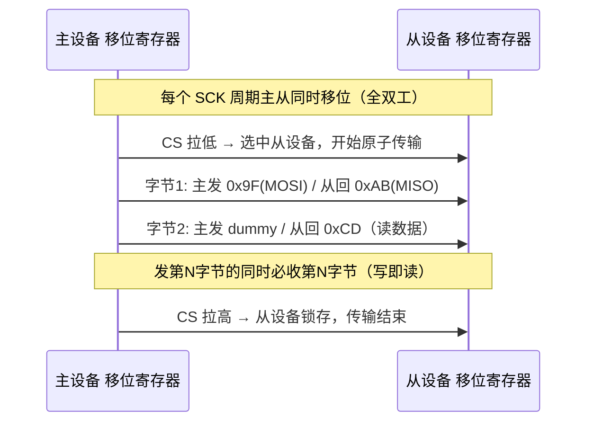
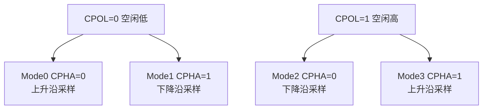

# SPI 串行外设接口：四线全双工与 CPOL/CPHA 迷局

## 一、场景引入：国产替代料的 SPI 波形"鬼影"

我在做某国产 CAN 收发器（对标 NXP TJA 系列，带 SPI 配置接口）替代验证时，遇到过一个很隐蔽的 Bug：原厂料一切正常，换上国产料后，MCU 通过 SPI 写收发器寄存器，读回来的值偶尔不对，导致收发器没能正确进入低功耗，整车休眠电流超标。把逻辑分析仪四根线全抓出来对比——SCK、MOSI、MISO、CS 一个不落——发现国产料的**片选（CS）维持时间比原厂短一截**，而且它对某些寄存器的默认值不同。原厂料在 CS 拉低后留足了建立时间，国产料在时钟沿来临时数据还没稳，"写"进去的是错误值。

这种问题在 SPI 上太典型了：SPI 没有统一的"标准"，它是一族**约定**。时钟极性、采样相位、位序、片选极性、建立保持时间——任何一项主从对不上，通信就错位。理解 SPI，关键不是背"四根线叫什么"，而是吃透 **CPOL/CPHA 的四种组合**和**CS 如何界定一次原子传输**。

## 二、核心原理：四线、全双工、移位寄存器"推手"

### 2.1 物理层：四根线各司其职

SPI 是典型的**板级同步串行总线**，四根线：

- **SCK（Serial Clock）**：时钟，由主设备产生，是整条总线的节拍器。
- **MOSI（Master Out Slave In）**：主出从入，主设备发、从设备收。
- **MISO（Master In Slave Out）**：主入从出，从设备发、主设备收。
- **CS/SS（Chip Select / Slave Select）**：片选，低有效，主设备用它"点名"哪一个从设备。

一主多从时，每个从设备单独占一根 CS，主设备拉低谁家的 CS，就只和谁说话。这就是 SPI 的"寻址"方式——**靠 CS 选设备，而不是地址寻址**，所以 SPI 帧里没有地址字段。

### 2.2 协议机制：移位寄存器共移 = "写即读"

SPI 的本质是主从各有一个**移位寄存器（Shift Register）**，在 SCK 的驱动下同步移位。每一个时钟周期，主寄存器移出 1 位到 MOSI、同时移入 1 位来自 MISO；从寄存器反之亦然。**发第 N 字节的同时，必定收第 N 字节**——这就是 SPI 的**全双工**。

类比两个人在转盘上同步转桶：每转一格，你递给我一颗豆，我也递给你一颗。所以 SPI 的"读"操作往往要先"写"一个 dummy 字节，目的只是为了让主设备产生 SCK 时钟、把从设备的数据"挤"出来。这是初学者最容易 confusion 的地方：你以为在读，其实在写时钟换数据。

## 三、CPOL/CPHA 迷局：四种模式的真相

这是 SPI 调试的核心。两个参数决定采样时刻：

- **CPOL（Clock Polarity）**：SCK 的**空闲电平**。CPOL=0 时空闲为低，CPOL=1 时空闲为高。
- **CPHA（Clock Phase）**：**采样发生在第几个边沿**。CPHA=0 在第一个边沿（即空闲→活跃的第一个跳变）采样；CPHA=1 在第二个边沿采样。

组合出 4 种模式：

| 模式 | CPOL | CPHA | 采样边沿 | 切换边沿 |
|------|------|------|----------|----------|
| Mode 0 | 0 | 0 | 上升沿（空闲低→第一个上升） | 下降沿 |
| Mode 1 | 0 | 1 | 下降沿 | 上升沿 |
| Mode 2 | 1 | 0 | 下降沿（空闲高→第一个下降） | 上升沿 |
| Mode 3 | 1 | 1 | 上升沿 | 下降沿 |

**主从必须模式一致，否则整帧数据错位**。这是 SPI 通信出错的第一嫌疑。很多 datasheet 不直接写"Mode 3"，而是写"数据在 SCK 的上升沿采样、空闲时 SCK 为高"——你要把它翻译成 CPOL=1、CPHA=1（Mode 3）。

> **图：SPI 全双工（主从同时移位）** —— 每个 SCK 周期主从移位寄存器共移，发第 N 字节同时必收第 N 字节（写即读）；CS 低选中、高锁存。



### 3.1 单次传输逐位结构

```
CS(拉低) → [字节1: 8个SCK周期, 每周期移项] → ... → [字节N] → CS(拉高)
```

- **CS**：低有效，一次原子传输期间保持低；CS 上升沿通常表示从设备锁存本次结果。多从设备靠独立 CS 区分。
- **每字节**：8 个 SCK 周期，MOSI 与 MISO 同时进行——全双工。
- **位序（Bit Order）**：可配 MSB-first 或 LSB-first，主从须一致，否则字节内位序反了。

> **图：CPOL/CPHA 四模式** —— CPOL 决定 SCK 空闲电平，CPHA 决定采样边沿，二者组合出 Mode0~3，主从须一致否则整帧错位。



### 3.2 关键控制参数（即"字段"）

| 参数 | 含义 | 出错后果 |
|------|------|----------|
| CPOL | 时钟空闲电平 | 采样边沿错位→数据错 |
| CPHA | 采样相位 | 同样导致错位 |
| Bit order | MSB/LSB 先 | 字节内位序反 |
| Clock rate | SCK 频率 | 超从设备上限→时序违例 |
| CS polarity | 片选有效电平 | 选不中从设备 |
| CS setup/hold | 片选建立/保持 | 数据未稳即被采样 |

### 3.3 配置代码：以 Mode 3 读写一个寄存器

```c
/* 某 SPI 外设：CPOL=1(空闲高), CPHA=1(上升沿采样) → Mode 3 */
#define SPI_MODE3  (SPI_CR1_CPOL | SPI_CR1_CPHA)

void SPI_Init(void)
{
    SPI1->CR1 = 0;
    SPI1->CR1 |= SPI_MODE3;        /* CPOL=1, CPHA=1 */
    SPI1->CR1 |= SPI_CR1_MSTR;     /* 主模式 */
    SPI1->CR1 |= SPI_CR1_BR_1;     /* 分频得到合适 SCK(如 5MHz) */
    SPI1->CR1 |= SPI_CR1_SPE;      /* 使能 */
}

/* 写即读：发 1 字节同时收 1 字节 */
static uint8_t SPI_Transfer(uint8_t tx)
{
    while (!(SPI1->SR & SPI_SR_TXE));   /* 等发送空 */
    SPI1->DR = tx;
    while (!(SPI1->SR & SPI_SR_RXNE));  /* 等接收满 */
    return (uint8_t)SPI1->DR;
}

/* 读外设寄存器 reg：先写(ADDR<<1)|0x80 读命令，再 dummy 读数据 */
uint8_t SPI_ReadReg(uint8_t reg)
{
    CS_LOW();                       /* 拉低片选，锁定一次原子传输 */
    SPI_Transfer(reg | 0x80);       /* 发读命令 */
    uint8_t val = SPI_Transfer(0x00); /* dummy 写以产生时钟，换回数据 */
    CS_HIGH();                      /* 拉高片选，从设备锁存 */
    return val;
}
```

注意 `CS_LOW()/CS_HIGH()` 之间才是一次完整的原子传输。若 CS 中途被其它中断打断又拉高，从设备会认为本次传输结束、数据锁存，下一波就是新的一笔，结果是两个半截拼错。

## 四、SPI 在 BMS 中的强相关应用

- **配置 CAN 收发器**：如 TJA1145 类的收发器，MCU 经 SPI 写其寄存器来设工作模式、唤醒源、看门狗。这正是文章开头那个国产替代坑的来源。
- **外部 ADC / 高压采样前端**：BMS 用外置高精度 ADC 采单体电压，SPI 把数字结果搬回 MCU。
- **RTC、Flash、显示屏**等板级外设。
- **国产替代验证**：建"基准波形库"，逐项比对原厂与国产料的 SCK 极性、CS 维持时间、寄存器默认值、唤醒延迟；全功能用例回归 + 环境测试（温度/EMC）闭环。

## 五、常见坑与调试手段

1. **CPOL/CPHA 模式不匹配**：主从采样边沿错位，整帧数据错乱。调试：逻辑分析仪抓 SCK/MOSI，对照 datasheet 时序图确认空闲电平与采样边沿，逐一核对四种模式。
2. **CS 时序不对（建立/保持不足或中途跳变）**：片选拉低后数据未稳就被采样，或一笔传输被拆成两笔。调试：看 CS 相对 SCK 的建立保持时间，确认一笔传输期间 CS 不被中断释放；用 GPIO 软件控 CS 时注意插入足够延时。
3. **时钟太快超出从设备上限 / 线长导致建立保持违例**：SCK 频率太高，从设备来不及响应，或长线使波形畸变。调试：降频验证，缩短走线、加源端匹配；注意 CS 与 SCK 的 skew。
4. **位序（MSB/LSB）配置反了**：字节内位序翻转，读出的寄存器值像"镜像"。调试：抓 MOSI 首位，确认与 datasheet 一致。
5. **上拉/线长串扰**：MISO 在从设备不驱动时浮空被干扰。调试：必要时加弱上拉，远离高频/大电流走线，做好屏蔽。
6. **DMA 与 SPI 配合时的数据宽度/对齐**：用 DMA 搬 SPI 数据须注意字节/半字对齐、buffer 缓存一致性（Clean/Invalid Cache），否则偶发错字节。

## 六、面试高频要点

- **SPI 四线各干什么？** → SCK 时钟节拍、MOSI 主出从入、MISO 主入从出、CS 选通从设备。
- **SPI 为什么没有地址字段？** → 靠 CS 选设备而非地址寻址，一条总线每从设备一根 CS。
- **SPI 同时收发怎么理解？** → 主从移位寄存器在 SCK 下共移，发第 N 字节同时收第 N 字节，"写即读"，所以读操作常要先 dummy 写以产生时钟。
- **四种模式由什么决定？** → CPOL（空闲电平）+ CPHA（采样在第一个还是第二个边沿）；主从模式必须一致，否则整帧错位。
- **为什么每段传输要独立 CS？** → CS 界定一次原子传输，拉低选中、拉高锁存；多从靠不同 CS 区分，中途释放会让从设备误判传输结束。
- **SPI 通信出错第一查什么？** → CPOL/CPHA 模式、CS 时序、时钟速率、上拉/线长串扰、位序 MSB/LSB。
