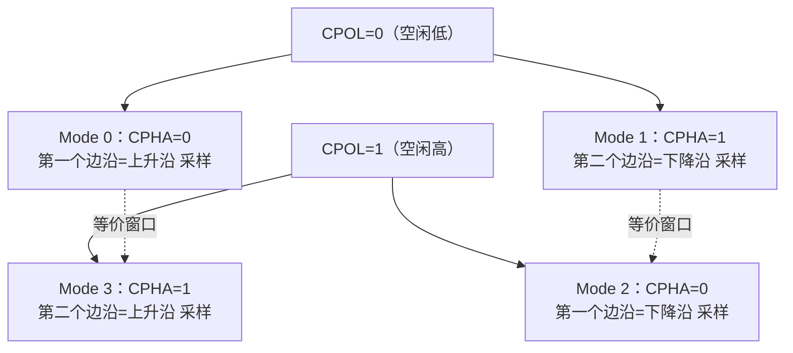
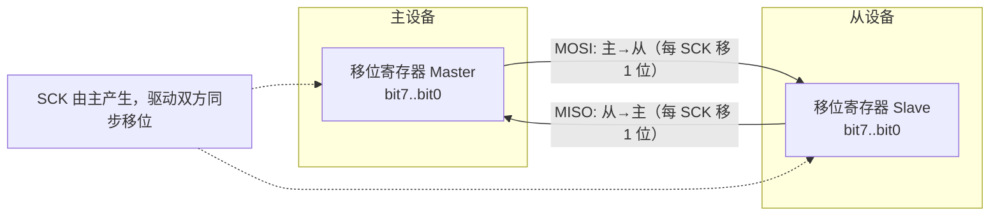
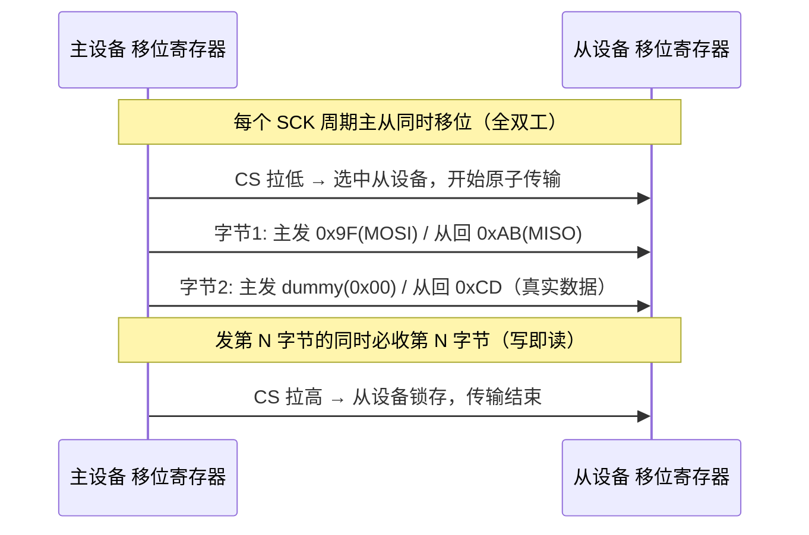
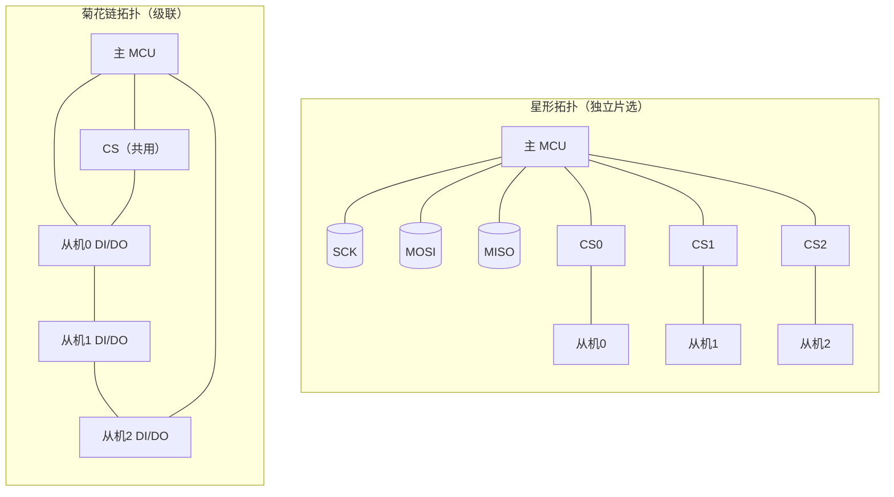
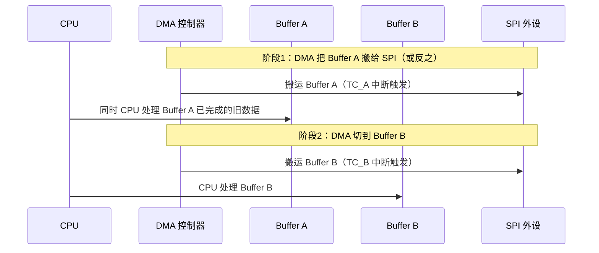

# SPI 串行外设接口：四线全双工、四种工作模式与外设实战全链路

> 本文面向嵌入式软件与系统工程师，从物理层信号线、协议机制、四种工作模式的本质，一直讲到多从机拓扑、时序参数、DMA 配合、常见外设驱动设计、调试手段与面试题。目标是帮助读者建立一套"既能读懂 datasheet、又能写出健壮驱动、还能在面试中讲清楚"的 SPI 知识体系。

---

## 一、引言：为什么 SPI 在嵌入式里无处不在

如果把嵌入式系统的板级互连总线做个排行榜，I2C、UART、SPI 一定稳居前三，而其中 **SPI（Serial Peripheral Interface，串行外设接口）** 往往是吞吐量和灵活性要求最高那一档的第一选择。在笔者参与的各类项目中，SPI 几乎是"板级数据主干道"：

- **非易失存储**：W25Q 系列 SPI NOR Flash 用来存固件、参数、日志，容量从 1 Mbit 到 256 Mbit 甚至更高；
- **传感器**：MPU9250、ICM20948 这类 9 轴 IMU，气压计、温湿度传感器，很多都走 SPI；
- **显示**：ILI9341、ST7789 驱动的 TFT LCD、OLED，命令与像素数据靠 SPI 高速灌入；
- **数据采集**：ADS1256、MCP3208、ADS8688 等 SPI ADC 把模拟量数字化后回传 MCU；
- **大容量存储**：SD 卡除了 SDIO 模式外，还支持一条向后兼容的 SPI 模式，方便没有 SDIO 外设的 MCU 也能读写；
- **通信前端/电源管理**：CAN 收发器（如 TJA1145 一类）、PMIC、RTC、外部 DAC 等也常以 SPI 配置。

SPI 之所以"无处不在"，根本原因在于它的设计取舍：**用更多的连线换取更高的速度、更简单的协议、更灵活的帧格式**。它不需要像 I2C 那样处理仲裁、地址、时钟拉伸（clock stretching），也不需要像 UART 那样在每个字节里塞起始位/停止位和波特率自适应。SPI 在硬件上就是两个移位寄存器"手拉手"在时钟下同步转，软件上几乎可以"想怎么发就怎么发"——代价是每多一个从设备就多一根片选线，且缺乏标准化的寻址和错误校验机制。

本文不会停留在"SPI 有四根线"这种常识层面，而是要把以下几个**真正决定工程成败**的难点讲透：CPOL/CPHA 四种模式的本质与匹配、片选（CS/NSS）如何界定一次原子传输、多从机拓扑的取舍、时序参数（t_SU/t_HD）如何读 datasheet 落地、DMA 与缓存一致性的坑，以及一众真实外设的驱动要点。

---

## 二、历史与"标准"：一个没有官方标准的"标准"

SPI 由 **Motorola（摩托罗拉）在 1980 年代** 提出，最早出现在 MC68HC 系列单片机的手册里。它从诞生起就不是像 USB、PCIe 那样的"官方标准化总线"——没有 IEEE/IEC 标准号，没有统一的电气规范、帧格式、最大速率或连接器定义。各半导体厂商在引用 SPI 时，通常写的是"compatible with Motorola SPI"，然后各自加变种：

- 有的器件只支持 Mode 0 和 Mode 3；
- 有的支持 8/16/32 位数据宽度，有的只支持 8 位；
- 有的 MSB-first 固定，有的可配 LSB-first；
- 有的片选高有效（CS active-high），绝大多数低有效；
- 有的在 CS 拉高后需要一段锁存恢复时间，有的则没有；
- 三线半双工（共用一条双向数据线）、双线（半双工双向）等变种也常被叫做"SPI"。

这种"一族约定"的特性，正是 SPI 工程问题的根源：**两个器件能不能通，不取决于它们都"支持 SPI"，而取决于它们在 CPOL、CPHA、位序、数据宽度、片选极性、建立保持时间这些细节上是否对齐**。

### 2.1 SPI 与 I2C、UART 的取舍对比

| 维度 | SPI | I2C | UART |
|------|-----|-----|------|
| 信号线（典型） | 4 线（SCK/MOSI/MISO/CS） | 2 线（SCL/SDA，开漏） | 2 线（TX/RX） |
| 拓扑/寻址 | 每从机一根 CS，靠 CS 选通 | 多主多从，地址寻址 | 点对点 |
| 速度 | 几 MHz 到几十 MHz，甚至上 100 MHz | 标准 100 k / 快速 400 k / 高速 3.4 M | 常见 115200，高至几 M |
| 全/半双工 | 全双工 | 半双工 | 全双工 |
| 硬件复杂度 | 主从各移位寄存器，简单 | 需仲裁、时钟拉伸、ACK | 需波特率匹配、起始停止位 |
| 错误检测 | 几乎无（靠上层） | 有 ACK/NACK | 奇偶校验可选 |
| 多从机成本 | 每从机多一根 CS | 不增加线 | 不适用 |
| 典型用途 | Flash、屏、高速 ADC、SD | 传感器、EEPROM、PMIC | 调试口、模块通信 |

一句话概括：**要速度、要全双工、要帧格式自由，选 SPI；要线少、要多从机、要标准寻址，选 I2C；要简单点对点异步通信，选 UART**。工程上这三者常常共存于同一块板子上，各司其职。

### 2.2 "无统一标准"带来的工程现实

正因为 SPI 没有 IEEE 或 ISO 级别的强制规范，各厂商在引用时自由度很大，这给工程师带来几个现实问题：

首先是**兼容矩阵复杂**。同一颗 MCU 的 SPI 外设，去对接不同厂家的从机，常常出现"A 能通、B 不通"的现象，根因并非硬件损坏，而是某一细节（例如 B 只支持 Mode 0、Mode 3，而驱动默认配了 Mode 1）。笔者在项目中就曾遇到某国产替代料在 CS 维持时间、寄存器默认值上与原厂料不同，导致低功耗配置写不进、休眠电流超标的情况——这正印证了"SPI 是一族约定而非一个标准"的判断。工程上建议对关键器件建立**基准波形库**：用逻辑分析仪抓原厂料的 SCK 极性、CS 维持时间、寄存器默认值、唤醒延迟，再逐项比对替代料，做全功能用例回归加环境测试（温度、EMC）闭环。

其次，**电气电平不统一**。早期 SPI 多为 3.3 V 或 5 V 电平；如今低功耗器件常见 1.8 V I/O，MCU 若为 3.3 V，直接相连会超出从机输入高电平上限或拉不高，需要电平转换（电平转换芯片、串联电阻分压、或带耐压的开漏）。这一点常被初学者忽略：协议配对了，却因为电平不匹配而"死活不通"。

最后，**术语混乱**。同一概念在不同手册里叫法不同：片选有人写 CS、有人写 SS、有人写 NSS；时钟有人写 SCLK、有人写 SCK；数据线有人写 MOSI/MISO、有人写 SDO/SDI（注意 DO/DI 的主从视角容易反）。读 datasheet 时务必先确认引脚定义视角的相对关系，避免"主机的 MOSI 接到了从机的 MOSI"这种低级但致命的接线错误（应为 MOSI 对 MOSI 还是 MOSI 对 MOSI？取决于从机把该脚叫什么——很多从机标 MOSI 是"主入"视角，实为 MISO，需对照框图）。

---

## 三、信号线详解：为什么是四根线，能不能更少

SPI 是**板级同步串行总线**，"同步"意味着有一根专门的时钟线（SCK）来驱动收发双方，收发不需要各自约定波特率；"串行"意味着数据一位一位地移。

### 3.1 四根线的职责

- **SCK（Serial Clock）**：时钟，由主设备（Master）产生，是整个总线的节拍器。从设备一切动作都跟随 SCK。
- **MOSI（Master Out Slave In）**：主出从入。主设备发、从设备收。
- **MISO（Master In Slave Out）**：主入从出。从设备发、主设备收。
- **CS/SS（Chip Select / Slave Select）**：片选，绝大多数低有效（active-low）。主设备用它"点名"与哪个从设备通信。

一主多从时，每个从设备单独占一根 CS。主设备拉低谁的 CS，就只和谁说话。**这就是 SPI 的"寻址"方式——靠 CS 选设备，而不是地址寻址**，所以 SPI 帧里通常没有地址字段（除非器件协议层自己在数据里定义了寄存器地址）。

### 3.2 全双工主从结构

SPI 是全双工：在每一个时钟周期里，MOSI 上有一位从主到从，同时 MISO 上有一位从从到主。两条数据线方向相反、同时工作。这一点和 I2C 的半双工（同一根 SDA 分时收发）截然不同，也是 SPI 吞吐率高的关键。

### 3.3 能不能少于四根线

可以，但要做取舍：

- **三线 SPI（半双工）**：把 MOSI 和 MISO 合并成一根双向数据线（常叫 SISO 或 SDIO）。同一时刻要么主发要么从发，靠方向切换实现半双工。省一根线，但速率与灵活性下降，且需要明确的方向切换时序（很多 Flash、一些传感器支持这种模式）。
- **双线 SPI**：某些器件（如一些 Flash 的 Dual/Quad 模式）在数据阶段把两根线都当数据线用，变成 2-bit 或 4-bit 并行传输，本质是在 SPI 基础上扩展数据通路以提高吞吐，但地址/命令阶段仍是单线 SPI 时序。
- **单线 + 片选**：极简器件（如某些温度传感器）甚至只用 SCK + 一根双向数据线 + CS，即三线。

需要强调的是：**四线全双工才是 SPI 的"标准形态"**，三线/多线都是变种。读者在遇到"三线 SPI"时，要先确认是"半双工共用数据线"还是"加了额外数据线的多线 SPI"，二者机制和坑完全不同。

### 3.4 电气特性与电平匹配

SPI 是数字电平接口，但"数字"不等于"任意电平都能接"。常见 I/O 电平有 5 V、3.3 V、1.8 V、1.2 V 等。判断能否直连，要看两端器件的 **V_IH（输入高电平最小值）** 与 **V_OH（输出高电平最小值）** 是否匹配，以及输入是否容忍更高电压：

- 若 MCU 输出 3.3 V、从机输入容忍 5 V（即 V_IH 上限 ≥ 3.3 V 且允许 5 V 容忍），可直连；
- 若 MCU 输出 3.3 V、从机是 1.8 V 器件且不支持 3.3 V 容忍，则 3.3 V 会超过从机最大输入电压，损坏器件，必须加电平转换；
- MISO 方向同理：从机输出 1.8 V，MCU 若以 3.3 V 为 V_IH 阈值，可能判不出高电平，需要电平转换或确认 MCU 是否支持更低 V_IH。

电平转换常用方案：双向电平转换芯片（如 TXS/TXB 系列，基于 pass-transistor 或方向自动感知）、电阻分压（仅适合单向、低速）、或带耐压的开漏 + 上拉。SPI 速率较高时，电阻分压会削弱边沿、限制速率，慎用。

此外，**驱动能力与走线电容**也影响最高速率：SCK/MOSI 由主驱动，MISO 由被选中的从驱动。若总线挂多个从机（星形），MISO 上多重负载（各从机输入电容并联）会增加主端接收的容性负载，降低有效速率上限。高速设计要考虑每个从机的输入电容与总线总电容，必要时由从机三态隔离、或降低速率。

---

## 四、四种工作模式（重点 + 难点）

这是 SPI 调试的核心，也是面试高频考点。SPI 的采样时刻由两个参数决定：

- **CPOL（Clock Polarity，时钟极性）**：SCK 在**空闲（无传输）时**的电平。
  - CPOL = 0：空闲时 SCK 为**低电平**；
  - CPOL = 1：空闲时 SCK 为**高电平**。
- **CPHA（Clock Phase，时钟相位）**：数据**采样发生在第几个时钟边沿**。
  - CPHA = 0：在**第一个边沿**（空闲电平到活跃电平的第一个跳变）采样；
  - CPHA = 1：在**第二个边沿**采样。

### 4.1 四种模式对照表

| 模式 | CPOL | CPHA | SCK 空闲电平 | 采样边沿 | 数据变化（移出）边沿 | 常见器件 |
|------|------|------|--------------|----------|----------------------|----------|
| Mode 0 | 0 | 0 | 低 | 上升沿（第一个边沿） | 下降沿 | 多数 Flash、很多传感器默认值 |
| Mode 1 | 0 | 1 | 低 | 下降沿（第二个边沿） | 上升沿 | 部分 ADC |
| Mode 2 | 1 | 0 | 高 | 下降沿（第一个边沿） | 上升沿 | 部分 IMU、Flash |
| Mode 3 | 1 | 1 | 高 | 上升沿（第二个边沿） | 下降沿 | 很多 Flash、CAN 收发器、IMU |

> 记忆口诀：**CPOL 决定"空闲长啥样"，CPHA=0 在第一个边沿采、CPHA=1 在第二个边沿采**。所谓"第一个边沿"是相对空闲电平而言的：CPOL=0 时第一个边沿是上升沿，CPOL=1 时第一个边沿是下降沿。

### 4.2 模式匹配的致命性

**主从必须模式一致，否则整帧数据错位**。原因很直观：采样边沿错了，主设备认为在上升沿采到的那位，从设备其实是在下降沿才把数据放到线上的，于是主收的每一位的建立/保持关系全部错位，读回来的字节要么整体错位、要么"镜像"般错乱。

很多 datasheet 并不直接写"Mode 3"，而是用文字描述："数据在 SCK 的上升沿采样，且 SCK 空闲时为高电平"。读者要把它翻译成 **CPOL=1、CPHA=1（Mode 3）**。反之，如果写"上升沿采样、空闲为低"，那就是 Mode 0（CPOL=0、CPHA=0）。

### 4.3 从 datasheet 判断用哪种模式

实操建议：

1. 找到器件的"SPI Timing"或"Serial Interface Timing"章节；
2. 看时序图里的 **SCK 空闲电平**（图里无传输区间 SCK 画高还是画低）→ 定 CPOL；
3. 看图中的 **"数据有效 / 采样点"标记**（常标 `t_su`、`t_hd`、`SDI valid`），观察采样发生在 SCK 的哪个边沿 → 定 CPHA；
4. 注意有些器件"写"用一种模式、"读"用另一种（罕见但存在，多见于老器件）；也有的器件在 Mode 0 和 Mode 3 下都能工作（因为二者采样边沿在"数据稳定窗口"上是等价的，只要数据在采样边沿前足够早建立即可）。

### 4.4 四种模式关系图（mermaid）



> 图中"等价窗口"表示：在某些器件上 Mode 0 与 Mode 3、Mode 1 与 Mode 2 因数据建立窗口对称而可互换，但这只是时序余量带来的兼容，不能当成通用结论，仍以 datasheet 为准。

### 4.5 时序对比（mermaid timing 图）

下面用 mermaid 的 timing 图直观对比 Mode 0 与 Mode 3 的采样边沿差异（CS/MOSI 为示意，SCK 标注采样点）。

```mermaid
timing
  title SPI Mode0 (CPOL=0,CPHA=0) vs Mode3 (CPOL=1,CPHA=1)
  axisType: none
  CS    : b0, b1, b1, b1, b1, b1, b1, b1, b1, b0
  SCK_M0: 0, 1, 0, 1, 0, 1, 0, 1, 0, 0
  SAMP_M0: 0, 1, 0, 1, 0, 1, 0, 1, 0, 0
  SCK_M3: 1, 0, 1, 0, 1, 0, 1, 0, 1, 1
  SAMP_M3: 0, 1, 0, 1, 0, 1, 0, 1, 0, 0
```

> 说明：Mode 0 在 SCK 上升沿采样（图中 `SAMP_M0` 在上升沿置位），数据在下降沿切换；Mode 3 空闲为高，在第二个边沿（上升沿）采样。两图采样点都是上升沿，但**空闲电平**和**数据切换边沿**不同，这正体现了 CPOL/CPHA 的组合差异。

### 4.6 寄存器级配置实例（STM32 SPI 初始化）

下面给出一段贴近真实 STM32 标准外设库的 SPI 初始化代码，展示如何配置 CPOL/CPHA、波特率分频、数据宽度与主从模式。寄存器名（如 `SPI_CR1`、`SPI_SR`）与位定义（如 `SPI_CR1_CPOL`、`SPI_CR1_BR_0`）在 STM32 各系列参考手册中高度一致。

```c
#include <stdint.h>

/* 以 SPI1 为例：目标 Mode 3（CPOL=1, CPHA=1），主模式，8 位帧，SCK 分频得到 ~5MHz */
#define SPI1_BASE      0x40013000UL
#define SPI1_CR1       (*(volatile uint32_t *)(SPI1_BASE + 0x00))
#define SPI1_CR2       (*(volatile uint32_t *)(SPI1_BASE + 0x04))
#define SPI1_SR        (*(volatile uint32_t *)(SPI1_BASE + 0x08))
#define SPI1_DR        (*(volatile uint32_t *)(SPI1_BASE + 0x0C))

#define SPI_CR1_CPHA   (1u << 0)   /* 时钟相位 */
#define SPI_CR1_CPOL   (1u << 1)   /* 时钟极性 */
#define SPI_CR1_MSTR   (1u << 2)   /* 主模式 */
#define SPI_CR1_BR_0   (1u << 3)   /* 波特率分频位0 */
#define SPI_CR1_BR_1   (1u << 4)   /* 波特率分频位1 */
#define SPI_CR1_SPE    (1u << 6)   /* SPI 使能 */
#define SPI_CR1_DFF    (1u << 11)  /* 数据帧格式：0=8位, 1=16位 */
#define SPI_SR_TXE     (1u << 1)   /* 发送缓冲空 */
#define SPI_SR_RXNE    (1u << 0)   /* 接收缓冲非空 */
#define SPI_SR_BSY     (1u << 7)   /* 总线忙 */

void SPI1_Init_Mode3(void)
{
    SPI1_CR1 = 0;                       /* 清配置 */
    SPI1_CR1 |= SPI_CR1_CPOL;           /* CPOL=1：空闲高 */
    SPI1_CR1 |= SPI_CR1_CPHA;           /* CPHA=1：第二个边沿采样 → Mode 3 */
    SPI1_CR1 |= SPI_CR1_MSTR;           /* 主模式 */
    SPI1_CR1 |= SPI_CR1_BR_1 | SPI_CR1_BR_0; /* 分频 16（视 PCLK 而定） */
    /* DFF=0 默认 8 位帧；如需 16 位帧再加 SPI_CR1_DFF */
    SPI1_CR1 |= SPI_CR1_SPE;            /* 使能 SPI */
}

/* 单字节写即读 */
static uint8_t SPI1_Transfer(uint8_t tx)
{
    while (!(SPI1_SR & SPI_SR_TXE));    /* 等发送缓冲空 */
    SPI1_DR = tx;
    while (!(SPI1_SR & SPI_SR_RXNE));   /* 等接收缓冲非空 */
    return (uint8_t)SPI1_DR;
}

/* 切换为 Mode 0 的辅助函数（部分从机只支持 Mode 0） */
void SPI1_SetMode(uint8_t cpol, uint8_t cpha)
{
    uint32_t cr1 = SPI1_CR1 & ~(SPI_CR1_CPOL | SPI_CR1_CPHA);
    if (cpol)  cr1 |= SPI_CR1_CPOL;
    if (cpha)  cr1 |= SPI_CR1_CPHA;
    SPI1_CR1 = cr1;                     /* 注意：切换前应先 SPE=0 关闭 SPI */
}
```

要点：STM32 要求在修改 `CPOL/CPHA/BR` 等字段前先清除 `SPE` 关闭 SPI；NXP S32K 的 LPSPI 则通过 `TCR`（传输配置寄存器）的 `CPOL/CPHA/FRAMESZ/PCS` 字段在每次传输前灵活配置，更适合总线上挂多种模式器件。无论哪家的 SPI 外设，**CPOL/CPHA 的本质不变，变的只是写哪个寄存器、哪个字段**。

---

## 五、数据传输机制：主从移位寄存器的"环形推手"

### 5.1 本质：两个移位寄存器共移

SPI 的本质是**主从各有一个移位寄存器（Shift Register）**，在 SCK 驱动下同步移位。每个时钟周期：

- 主寄存器从高位（或低位，取决于位序）移出 1 位到 MOSI，同时移入 1 位来自 MISO；
- 从寄存器相反：移出 1 位到 MISO，同时移入 1 位来自 MOSI。

因为双方在同一时钟下同步移动，**发第 N 字节的同时必定收第 N 字节**——这就是 SPI 的"全双工"和"写即读"本质。

一个经典的类比：两个人面对面坐在传送带转盘两侧，每转一格，你递给我一颗豆，我也递给你一颗。所以 SPI 的"读"操作往往要先"写"一个 dummy（空）字节，目的只是为了让主设备产生 SCK 时钟，把从设备的数据"挤"出来。初学者最易困惑之处正在于此：**你以为在读，其实在写时钟换数据**。

### 5.2 主从移位寄存器环形结构（mermaid）



> 这是一个"环形"结构：主寄存器输出的位绕一圈经从寄存器再回到主寄存器输入。经过 8 个 SCK 周期，主从各自完成一次 8 位交换，原主寄存器内容跑到从寄存器，原从寄存器内容回到主寄存器。

### 5.3 全双工"写即读"时序（mermaid sequence）



### 5.4 位序（Bit Order）：MSB-first 与 LSB-first

SPI 通常先传最高位（MSB-first），符合"人读二进制从左到右"的习惯，也是绝大多数器件默认。但有些器件（尤其某些老式或特殊接口）支持或强制 LSB-first。主从位序必须一致，否则**字节内位序被整体翻转**，读出的寄存器值看起来像"镜像"。例如 0xA5（1010 0101）若按 LSB 收，会变成 0xA5 的反向 0xA5？——注意 0xA5 反转仍是 0xA5 这个巧合不具普遍性；换成 0x3C（0011 1100）反转后变成 0x3C？实际 0x3C=00111100 反转=00111100 也是巧合。举个明确例子：0x81（1000 0001）反转是 0x81 也是巧合……为避免误导，明确举例：0x0C = 0000 1100，按位反转后是 0011 0000 = 0x30。所以当位序配反，0x0C 会变成 0x30，这种"半字节交换"现象是定位位序错误的信号。

### 5.5 多字节帧的边界与"连续传输"本质

很多初学者把"一次 SPI 传输"理解为"一个字节"，这是误解。SPI 硬件层面没有"字节边界"概念——移位寄存器只是按位移动，CS 拉低期间可以连续传任意多个字节（甚至非 8 的倍数位，取决于外设是否支持如 16/32 位帧）。所谓"字节"只是软件约定的打包单位。

理解这一点对调试很重要：以 W25Q 读 JEDEC ID 为例，协议是"发 1 字节命令 0x9F，再连续收 3 字节"。期间 CS 必须保持低，且主设备要**连续产生 4×8=32 个 SCK 周期**（发命令 8 个 + dummy 24 个）。若软件在发完命令后错误地释放了 CS，从机 A 会认为命令阶段结束并复位内部指针，下一波命令被当成新的传输起点，读不到完整 ID。这正是"CS 界定原子传输边界"的另一种体现：一次逻辑操作（读 ID）可能由多个字节组成，但它在物理上是一段不被 CS 中断的连续时钟流。

另一个要点是**时钟由主独占产生**。从机没有自己驱动 SCK 的能力（标准 SPI 中），所以"从机主动上报数据"在纯 SPI 下是不可能的——除非从机先通过 INT/DRDY 引脚拉低中断主，主再发起一次传输去把数据读出来。这也是为什么 MPU9250 有 INT 引脚、ADS1256 有 DRDY 引脚：它们用额外的边带信号（sideband）来告知主"数据就绪"，再由主发起 SPI 读取。理解"SPI 永远主从同步、从不能主动推"这一本质，能避免很多架构设计上的误区。

---

## 六、片选 NSS 的细节：一次原子传输的边界

片选信号（NSS、CS、SS）是 SPI 里最容易被轻视、却最容易出大问题的信号。

### 6.1 硬件 NSS vs 软件 GPIO 控制

- **硬件 NSS**：由 SPI 外设的 NSS 引脚自动管理。主模式下通常仍可配置为"软件管理 NSS"（即 SSM=1，NSS 由内部寄存器位模拟），此时 CS 由软件用任意 GPIO 拉低拉高。
- **软件 GPIO 控制**：最常见做法——随便挑一根 GPIO，当作 CS 用，在传输开始前拉低、结束后拉高。灵活，但要求软件严格遵守时序。

无论哪种，CS 都**定义了一次"原子传输"的边界**：CS 拉低表示从设备被选中、开始接收命令/数据；CS 拉高表示从设备锁存本次结果、结束传输。

### 6.2 CS 建立时间与保持时间

就像数据有建立保持时间，CS 相对 SCK 也有要求：

- **CS 建立时间（t_SU,CS / Lead time）**：CS 拉低后，必须等待一段时间，第一个 SCK 边沿才到来，让从设备完成"被选中"的内部准备（比如复位内部状态机、采样命令）。太早给时钟，从设备还没准备好，首字节会错。
- **CS 保持时间（t_HD,CS / Trail time）**：传输最后一个字节后，CS 必须再保持低（或保持高）一段时间，给从设备锁存内部处理。拉太高早，最后一字节没收完；拉太高晚，无妨但浪费时间。

### 6.3 经典坑：CS 没拉低 / 拉低时机错 → 首字节丢失

一个非常常见的 Bug：软件先写了 SPI 数据寄存器，再去拉低 CS——结果从设备在被选中之前就已经"看到"时钟，首字节数据作废。正确顺序是：**先拉低 CS，等满足 t_SU 后，再开始送 SCK/数据；传输完毕，等满足 t_HD 后，再拉高 CS**。

另一个坑：多字节传输时 CS 应在整个帧期间**保持低电平不要释放**。例如读 W25Q 的 JEDEC ID，指令 0x9F 后面要连续读 3 字节，期间 CS 必须一直低；若每发一个字节就释放再拉低 CS，从设备会认为每次都是独立的小传输，ID 读取被打断，读到的不是完整 3 字节。

### 6.4 CS 与 SCK 的 skew（偏移）

在长走线或高速下，CS 与 SCK 到达从设备存在时间差（skew）。如果 CS 相对 SCK 延迟太大，可能破坏 t_SU；如果 CS 提前太多释放，可能破坏 t_HD。高速 SPI（如几十 MHz 驱动 TFT 屏）要特别注意 PCB 走线等长。

---

## 七、多从机拓扑：星形 vs 菊花链

挂多个从设备时，SPI 有两种主流拓扑。

### 7.1 独立片选（星形拓扑）

每个从设备有独立 CS，所有从设备共用同一组 SCK/MOSI/MISO。主设备通过拉低某一根 CS 选中对应从机。

- 优点：各从机独立，互不干扰；任意时刻只和一个从机通信；模式/速率可按从机单独配置（切换时注意重新初始化 SPI 寄存器）；某个从机故障不影响其他。
- 缺点：从机越多，CS 线越多，占用 GPIO 多；MISO 需要三态/高阻，多个从机同时驱动 MISO 会冲突（靠 CS 选中才驱动 MISO 来解决）。

### 7.2 菊花链（Daisy Chain）

从机的 MISO 不直接回主，而是级联：主 MOSI → 从机1 DI，从机1 DO → 从机2 DI，……，最后一级 DO → 主 MISO。数据像"穿糖葫芦"一样逐级移位传递。常用于多片级联的 ADC、LED 驱动、移位寄存器（如 74HC595）。

- 优点：只需一根 CS、一组总线，节省 GPIO；适合大量相同器件级联。
- 缺点：一次传输要移位 N 倍长度（N 为级数），延迟大；任一从机故障可能断链；不支持对单个从机的"随机访问"，必须整体移位；帧格式需按级联协议设计（通常每级固定字节数）。

### 7.3 拓扑对比图（mermaid）



---

## 八、速率与时序参数：如何读 datasheet 落地

### 8.1 SCK 最大频率

每个从机都有 `f_SCK(max)`，超出则内部采样电路跟不上，数据出错。从机越慢（如某些老传感器），这个值越低（几百 kHz）；Flash、屏可到几十 MHz；部分器件配合硬件设计可达 100 MHz 以上（含 Dual/Quad 模式）。主设备通过 SPI 时钟分频器（BR 位）把 MCU 外设时钟分频得到目标 SCK。

### 8.2 建立时间 t_SU 与保持时间 t_HD

对任意被采样的数据（MOSI 上的命令/地址/数据，或 MISO 上的回读数据），在采样边沿前后都要满足：

- **t_SU（Setup）**：数据在采样边沿**之前**必须稳定的最短时间；
- **t_HD（Hold）**：数据在采样边沿**之后**必须保持的最短稳定时间。

对 SPI 来说，典型情况是：主在"非采样边沿"把数据放到 MOSI，从在"采样边沿"读；从在采样边沿前某时刻把 MISO 数据放好，主在采样边沿读。只要 SCK 频率足够低、PCB 延迟足够小，就能天然满足。一旦频率过高或走线长导致传播延迟大，就可能违例。

### 8.3 传播延迟 t_PD 与 t_SU/t_HD 的关系

数据从主到从经过走线有传播延迟 t_PD。若主在边沿 T 改变 MOSI，从在 T+d 才看到变化，其中 d≈t_PD。从的采样发生在自己的 SCK 边沿；若 SCK 也经同样延迟到达从，则有效建立窗口 = 主的数据稳定时间 − 路径延迟差。工程上简化做法是：**降频 + 缩短走线 + 必要时在布局上让 SCK 与数据线等长或让 SCK 略滞后**，确保从机采样时数据已稳。

### 8.4 时序参数表（示例）

| 参数 | 含义 | 典型值（参考） | 违例后果 |
|------|------|----------------|----------|
| f_SCK(max) | 最大时钟频率 | Flash 常见 50–104 MHz | 超频→采样错 |
| t_SU,DI | MOSI 数据建立时间 | 5–20 ns | 数据未稳被采→错 |
| t_HD,DI | MOSI 数据保持时间 | 5–20 ns | 数据过早变→错 |
| t_SU,CS | CS 建立（Lead） | 数 ns 到数 µs | 首字节错/丢 |
| t_HD,CS | CS 保持（Trail） | 数 ns 到数 µs | 末字节未锁存 |
| t_V,DO | MISO 数据有效延迟 | 数 ns 到数十 ns | 主采到旧值 |

> 注意：具体数值必须查所用器件的 datasheet，上表仅为说明性示例，不可当作通用参数。

### 8.5 时序建立/保持示意（mermaid timing）

```mermaid
timing
  title 数据建立/保持示意（CPHA=0，上升沿采样）
  axisType: none
  CS  : b0, b1, b1, b1, b1, b0
  SCK : 0, 1, 0, 1, 0, 0
  MOSI: z, a, a, b, b, z
  SAMPL: 0, 1, 0, 1, 0, 0
```

> 图中 `a` 在 SCK 上升沿（采样点）之前已稳定，满足 t_SU；采样后保持到下一变化，满足 t_HD。若 `a` 在上升沿附近才跳变，则建立时间不足，采样可能采到错误电平。

### 8.6 信号完整性与 PCB 布局要点

当 SCK 频率达到几十 MHz，SPI 已经进入"高速数字信号"范畴，PCB 布局直接决定能否稳定通信：

- **走线尽量短**：SCK/MOSI/MISO 越短，传播延迟与反射越小，越容易满足 t_SU/t_HD；
- **避免锐角与长平行**：减少串扰（crosstalk），尤其 MISO 不要与大电流、高频走线长距离平行；
- **CS 与 SCK 等长或 CS 略滞后**：高速下两者到达从机的 skew 会破坏建立/保持，必要时让 CS 走线稍长使其在 SCK 之后到达，或在软件上 CS 拉低后插入少量延迟；
- **终端匹配**：极高速或长线时可考虑源端串联小电阻（如 22–33 Ω）抑制反射；
- **地平面完整**：SPI 四线应靠近完整地平面回流，避免跨分割；
- **去耦电容**：每个 SPI 从机电源脚就近放 0.1 µF 去耦，降低电源噪声导致采样抖动。

### 8.7 时钟分频与波特率计算示例

SPI 外设的 SCK 由 MCU 外设时钟（如 APB 时钟）经分频得到。以 STM32 为例，SPI 控制寄存器里的 BR[2:0] 位选择分频系数（2、4、8、16、32、64、128、256）。假设 APB2 时钟为 84 MHz，要得到不超过从机 10 MHz 的 SCK：

- 分频 8 → 84/8 = 10.5 MHz（略超，若从机标称 10 MHz 可能不稳）；
- 分频 16 → 84/16 = 5.25 MHz（安全）；

因此选 BR 对应分频 16。工程上**留 20%~30% 余量**：标称 10 MHz 的从机，实际跑 8 MHz 以内更稳。对 S32K（LPSPI）则是通过 TCR 的 PRESCALE 与 CCR 的 SCKDIV 字段计算波特率 = 外设时钟 / (PRESCALE × (SCKDIV+1) × 2)，配置时要查参考手册的时序公式，并通过示波器实测 SCK 实际频率校准。

---

## 九、DMA 与 SPI：把 CPU 从轮询里解放出来

当 SPI 速率高、数据量大（如刷屏、读大块 Flash、连续采样 ADC），用 CPU 轮询或中断逐字节搬运既占 CPU 又容易丢数。**DMA（Direct Memory Access，直接存储器访问）** 让外设和内存之间直接搬运，CPU 只负责启动和收尾。

### 9.1 为什么用 DMA

- **免轮询**：CPU 不必每字节等 TXE/RXNE 标志；
- **高吞吐**：连续搬运不受中断延迟抖动影响；
- **低功耗**：CPU 可进低功耗，DMA 后台搬；
- **双缓冲**：DMA 双缓冲（ping-pong）可在搬运一块的同时 CPU 处理另一块，实现"无停顿"数据流。

### 9.2 SPI+DMA 收发要点

- SPI 发送用 TX DMA 通道，接收用 RX DMA 通道；
- 由于 SPI 是"写即读"，**接收 DMA 必须与发送 DMA 配对**：即使只想发，也要开 RX DMA 把收到的（可能是 dummy）数据搬走，否则 RX FIFO 溢出；同理只读时要开 TX DMA 发 dummy 以产生时钟；
- 数据宽度、地址增量（外设地址不增、内存地址增）要配对；
- 传输完成以 RX DMA 的 TC（Transfer Complete）中断为准，而非 TX。

### 9.3 双缓冲（Ping-Pong）图（mermaid）



### 9.4 缓存一致性陷阱（Cache Coherency）

在带 Cache（如 Cortex-M7 带 D-Cache，或 A 核）的 MCU 上，DMA 与 CPU 共享内存，问题来了：

- **CPU 写数据给 DMA 发**：CPU 可能只把数据写进 Cache 而没写回物理内存（Write-back），DMA 读到的还是旧值。解决：在启动 DMA 前 **Clean（清理/回写）** 该 buffer 的 Cache，把脏数据刷进内存。
- **DMA 写数据给 CPU 读**：DMA 直接写物理内存，但 CPU 的 Cache 里可能还有旧副本，CPU 读到旧值。解决：CPU 读前 **Invalidate（失效）** 该 buffer 的 Cache，强迫从内存重新加载。

在带 MPU（Memory Protection Unit）的系统里，常把 DMA 用的 buffer 所在内存区域配置为 **non-cacheable** 或 **write-through**，从根上避免一致性问题。这是"用 DMA 后偶发错字节"的头号元凶，务必在驱动里处理。

### 9.5 SPI+DMA 常见配置错误清单

- **只开 TX DMA 没开 RX DMA**：SPI 写即读，TX 进行时 RX FIFO 不断进数，不搬走会溢出丢数甚至阻塞。只读时也要开 TX DMA 发 dummy。
- **数据宽度配错**：SPI 数据寄存器若是 8 位，DMA 内存/外设宽度应设 byte；若配置成 half-word/word 而 buffer 未按偶数对齐，会错位。用 16 位帧时则相应配 half-word。
- **地址增量方向反了**：内存地址应递增（指向连续 buffer），外设地址（SPI DR）应固定不增。配反会导致所有数据写到同一寄存器或内存错位。
- **传输长度与 CS 边界不匹配**：DMA 传完 N 字节才产生 TC 中断，但若 CS 应在 N/2 处释放（例如分两段命令+数据），单凭 DMA TC 无法精确控制 CS，需要 DMA 半传输/传输完成双中断配合，或改用"DMA 传数据 + 软件在 TC 中断里拉高 CS"。
- **DMA 缓冲区被栈上数组占用**：buffer 若是函数内局部数组，函数返回后内存失效，DMA 仍在搬——轻则数据错，重则踩内存。SPI+DMA 的 buffer 必须是静态/全局或DMA专用内存。

### 9.6 SPI+DMA 收发片段（伪代码）

下面给出一段"用 DMA 把一块内存发到 SPI、同时从 SPI 收回一块内存"的示意伪代码，体现"TX 与 RX 必须配对、以 RX 完成中断为准"的要点：

```c
/* 假设已配置好 SPI、DMA 控制器与两个通道：tx_ch、rx_ch */
static uint8_t  tx_buf[256] __attribute__((aligned(32)));  /* 发送数据，需 Clean 缓存 */
static uint8_t  rx_buf[256] __attribute__((aligned(32)));  /* 接收数据，需 Invalidate 缓存 */

void SPI_DMAC_Transfer(const uint8_t *src, uint8_t *dst, uint16_t len)
{
    /* 1) 写前 Clean 发送缓冲，确保 DMA 看到最新数据 */
    Cache_Clean(tx_buf, len);

    /* 2) 读前 Invalidate 接收缓冲，丢弃 CPU 的旧副本 */
    Cache_Invalidate(rx_buf, len);

    /* 3) 配置 RX DMA：外设地址固定(SPI_DR)，内存地址增，长度 len */
    DMA_Setup(rx_ch, (uint32_t)&SPI1_DR, (uint32_t)rx_buf, len,
              DMA_DIR_PERIPH_TO_MEM, DMA_INC_MEM);
    /* 4) 配置 TX DMA：外设地址固定，内存地址增，长度 len */
    DMA_Setup(tx_ch, (uint32_t)&SPI1_DR, (uint32_t)tx_buf, len,
              DMA_DIR_MEM_TO_PERIPH, DMA_INC_MEM);

    /* 5) 先使能 RX DMA，再使能 TX DMA（避免 RX 溢出） */
    DMA_Enable(rx_ch);
    DMA_Enable(tx_ch);

    /* 6) 以 RX 传输完成中断(TC)为准，触发回调函数处理 rx_buf */
    /* 注意：不要以 TX TC 作为"全部完成"的依据 */
}
```

注意步骤 3/4 中 SPI 数据寄存器地址对 TX、RX 是同一个 `SPI_DR`，但 DMA 方向不同。在带 Cache 的内核（如 Cortex-M7）上，`Cache_Clean`/`Cache_Invalidate` 是**不可省略**的步骤，否则会出现"发的是新数据、DMA 却发了旧值"或"收完数据 CPU 却读到旧缓存"的诡异现象。

---

## 十、中断 vs 轮询 vs DMA：如何选型

| 方式 | CPU 占用 | 实时性 | 实现复杂度 | 适用场景 |
|------|----------|--------|------------|----------|
| 轮询（Polling） | 高（忙等） | 好（无中断延迟） | 最低 | 低频小数据、初始化、调试 |
| 中断（Interrupt） | 中 | 受中断优先级影响 | 中 | 中低频、需异步通知 |
| DMA | 低 | 好（硬件搬运） | 高（含缓存处理） | 高速、大数据流、刷屏、连续采样 |

**选型经验**：

- 偶尔读个寄存器、初始化阶段：轮询足够简单可靠；
- 周期性中等速率通信：中断 + FIFO；
- 高速刷屏、连续 ADC 采样、音频流：DMA 双缓冲；
- 既想低占用又想处理复杂协议：DMA + 完成中断 + 协议状态机。

---

## 十一、常见外设实战

### 11.1 SPI Flash（以 W25Q 系列为例）

W25Qxx 是经典 SPI NOR Flash，容量常见 W25Q16（2 MB）、W25Q64（8 MB）、W25Q128（16 MB）等。要点：

- **指令集**：读 JEDEC ID（0x9F）、读状态寄存器（0x05）、写使能（0x06）、扇区擦除（0x20，4 KB）、页编程（0x02，最多 256 字节）、读数据（0x03 / 0x0B 快读）等。
- **写保护 / 写使能时序**：Flash 内部有"写使能锁存（WEL）"。任何写操作（编程/擦除/写状态寄存器）前**必须先发 0x06 写使能**；操作完成后 WEL 自动清零。若忘记写使能，写命令会被器件忽略。
- **状态寄存器 BUSY 位**：擦除/编程进行中 BUSY=1，期间不能发起新的写操作，需轮询或等其就绪。
- **扇区擦除**：Flash 不能"覆盖写"，只能先擦除（把位清 1）再编程（把位清 0）。擦除以扇区（4 KB）为单位，整片擦除也有。

**读 ID + 读状态寄存器 + 页编程流程（伪代码/C）：**

```c
#include <stdint.h>

/* 假设已初始化 SPI 为 Mode 0/3（依器件），CS 由 GPIO 控制 */
extern void CS_LOW(void);
extern void CS_HIGH(void);
extern uint8_t spi_transfer(uint8_t tx);  /* 写即读：发1收1 */

/* 读 JEDEC ID：指令 0x9F，随后连续读 3 字节（厂商/类型/容量） */
void w25q_read_id(uint8_t *id, int n)
{
    CS_LOW();
    spi_transfer(0x9F);              /* 发读 ID 命令 */
    for (int i = 0; i < n; i++)
        id[i] = spi_transfer(0x00);  /* dummy 产生时钟，读回数据 */
    CS_HIGH();
}

/* 读状态寄存器1：指令 0x05，回 1 字节 */
uint8_t w25q_read_status(void)
{
    CS_LOW();
    spi_transfer(0x05);
    uint8_t s = spi_transfer(0x00);
    CS_HIGH();
    return s;
}

/* 写使能：指令 0x06（无需数据返回，仅发命令） */
void w25q_write_enable(void)
{
    CS_LOW();
    spi_transfer(0x06);
    CS_HIGH();
}

/* 页编程：在已擦除区域写入最多 256 字节 */
void w25q_page_program(uint32_t addr, const uint8_t *buf, int len)
{
    w25q_write_enable();             /* 必须先写使能 */
    CS_LOW();
    spi_transfer(0x02);              /* 页编程命令 */
    spi_transfer((addr >> 16) & 0xFF);
    spi_transfer((addr >> 8) & 0xFF);
    spi_transfer(addr & 0xFF);       /* 24 位地址 */
    for (int i = 0; i < len; i++)
        spi_transfer(buf[i]);        /* 数据 */
    CS_HIGH();
    while (w25q_read_status() & 0x01); /* 等待 BUSY 清零 */
}
```

> 注意：地址是 24 位（部分大容量器件 32 位）；页编程不可跨页；写前必须擦除。这些约束是 Flash 物理特性决定的，违反会导致数据错误。

### 11.2 SPI LCD / OLED（ILI9341 / ST7789）

TFT 屏驱动（ILI9341、ST7789）走 SPI 时，除了 SCK/MOSI/CS，还多一根 **D/C（Data/Command）线**：

- **D/C = 0**：当前 MOSI 上是命令（如设置窗口、初始化序列）；
- **D/C = 1**：当前 MOSI 上是显存数据（像素）。

因为命令与数据靠 D/C 区分而非地址，所以屏驱动常把 D/C 当作"第 5 根线"。初始化时要按厂家给的初始化序列（一长串命令+参数）配置，之后才能正常刷屏。刷屏用 DMA 把显存 buffer 连续搬给屏，速度很关键。

### 11.3 SPI ADC / DAC（ADS1256、MCP3208、ADS8688）

- **MCP3208**：8 通道 12 位 SAR ADC，SPI 模式下主发控制字节（含通道选择、单端/差分），随后读回 12 位结果。注意它的采样需要主在合适时刻发时钟，且数据格式（前导 0 + 12 位）要按 datasheet 解析。
- **ADS1256**：高精度 24 位 Σ-Δ ADC，SPI 配置寄存器（增益、数据速率、通道），发起单次/连续转换后通过 DRDY 引脚通知，主再用 SPI 读 24 位数据。它的时序对模式（常用 Mode 1）和 DRDY 同步要求严格。
- **ADS8688**：8 通道 16 位 SAR ADC，带内部基准，SPI 读取转换结果，支持多种输入范围。

ADC 应用里，常把 **DRDY/INT 引脚 + SPI 读** 配合，避免盲等。

### 11.4 SPI 传感器（MPU9250 / ICM20948）

MPU9250（3 轴陀螺 + 3 轴加速度 + 3 轴磁力计）和 ICM20948（6 轴 + 可选磁力计）都是经典 9 轴 IMU，SPI 模式下通过读寄存器获取原始数据。要点：

- 寄存器读需先发寄存器地址（最高位为 1 表示读），再 dummy 读数据；
- 数据量分多字节（如加速度 X/Y/Z 各 2 字节），需连续读且 CS 保持低；
- 注意器件支持的最高 SPI 速率和 Mode（多为 Mode 0/3）。

### 11.5 SD 卡：SPI 模式 vs SDIO 模式

SD 卡有两种主机接口：

- **SDIO 模式（4 位数据线）**：速度快，是主流；需要 MCU 有 SDIO 外设。
- **SPI 模式**：只用 CS、SCK、MOSI、MISO 四线，向后兼容，任何有 SPI 的 MCU 都能用，但速度慢很多。

SPI 模式初始化命令序列（简化）：

1. 上电后至少延时 74 个时钟（CS 高）让卡同步；
2. 发 CMD0（0x40）带正确 CRC，使卡进入 Idle（SPI 模式）；
3. 发 CMD8 查询电压；发 ACMD41 循环直到卡退出 Idle（就绪）；
4. 发 CMD58 读 OCR（可选）；
5. 之后用 CMD17/CMD24 读/写单块，CMD18/CMD25 读/写多块。

SD 卡 SPI 模式要求 CRC 在初始化阶段有时需校验（命令 CMD0/CMD8），之后的数据块可用简单 CRC 或关闭。速率从低速（初始化 400 kHz 以内）逐步提升。

### 11.6 外设驱动的通用调试方法论

面对任何陌生 SPI 外设，建议按如下"由简到繁"的顺序打通，能极大降低排错成本：

1. **先确认物理层**：用万用表/示波器确认 VCC、GND 接好，电平匹配，CS 默认未被拉死，MISO 在未被选中时确实高阻；
2. **用最低速率跑"读 ID"**：几乎每个 SPI 器件都有某种 ID/WHO_AM_I 寄存器（Flash 的 0x9F、IMU 的 WHO_AM_I、ADC 的某只读寄存器）。先降频到 100~400 kHz，发读 ID 命令，能读回正确 ID 就说明 CPOL/CPHA/位序/CS 时序全对了——这一步能排除 80% 的问题；
3. **读一个已知值的只读寄存器**：例如状态寄存器里某固定位，验证回读解析正确；
4. **再测写+回读**：写使能后写一个可写寄存器再读回，验证写路径；
5. **最后上高速/DMA/中断**：基础打通后再提速、加 DMA，逐步逼近目标工况；
6. **用逻辑分析仪看波形**：抓 SCK/MOSI/MISO/CS 四路，对照 datasheet 时序图逐边沿核对，是定位"时好时坏"类问题的终极手段。

这套方法论的核心思想是：**把"协议层正确"和"性能层（速率/DMA）"解耦**。很多人一上来就开 DMA 跑满速，出错后分不清是模式配错还是缓存问题，反而更难定位。先把协议跑通在最低速轮询，再叠加性能优化，是嵌入式外设调试的黄金路径。

---

## 十二、软件抽象与驱动设计

### 12.1 把 SPI 抽象成 register read/write 接口

好的驱动不暴露"拉 CS、发字节"这种细节，而是提供 `read_reg()` / `write_reg()`，把器件协议（命令字节、地址、dummy）封装起来。例如：

```c
typedef struct {
    void (*cs_low)(void);
    void (*cs_high)(void);
    uint8_t (*xfer)(uint8_t);   /* 单字节写即读 */
    uint8_t mode;               /* CPOL/CPHA */
    uint32_t max_hz;
} spi_device_t;

uint8_t dev_read_reg(spi_device_t *dev, uint8_t reg)
{
    dev->cs_low();
    dev->xfer(reg | 0x80);          /* 读命令（示例：最高位置1） */
    uint8_t v = dev->xfer(0x00);    /* dummy 读数据 */
    dev->cs_high();
    return v;
}

void dev_write_reg(spi_device_t *dev, uint8_t reg, uint8_t val)
{
    dev->cs_low();
    dev->xfer(reg & 0x7F);          /* 写命令 */
    dev->xfer(val);
    dev->cs_high();
}
```

### 12.2 设备配置表与回调

多个器件挂同一总线时，可用配置表描述每个器件的模式、速率、CS 引脚、位序，启动时注册。传输前根据目标器件配置 SPI 外设（切模式、切波特率），传输后恢复。注意**模式切换开销**：每次切换要重新写 SPI 控制寄存器且可能需短暂禁止/使能，高频切换会拖慢总线。若同总线器件模式差异大，可考虑把"慢且模式特殊"的器件分到另一条 SPI 总线。

### 12.3 支持多器件同总线的注意点

- 同一时刻只选中一个 CS；
- 切换器件前确认目标器件的 CPOL/CPHA/速率，必要时重配 SPI；
- MISO 多从机共享时，未选中的从机必须高阻其 MISO，否则会拉坏总线（这是器件硬件要保证的，选型时注意）；
- 留意 CS 间的最小间隔，避免前一个器件锁存未完成就开始下一个。

### 12.4 中断上下文与可重入设计

当 SPI 驱动同时被主循环和中断调用（例如定时器中断里读 ADC、主循环里写 Flash），要防止两者交错破坏同一条总线的原子性。典型做法：

- **总线锁（bus lock）**：进入一次完整传输（CS 拉低到拉高）前获取互斥锁/关中断，传输完释放；中断里若要发起 SPI，要么用独立的 SPI 总线，要么排队到主循环处理；
- **传输队列**：把"读寄存器""写寄存器"封装成请求结构体，投入队列，由唯一的总线任务（或 DMA 完成回调）串行消费，从架构上杜绝并发冲突；
- **不要在中断里做长耗时操作**：SPI 轮询等待 BUSY 的循环不应放在高优先级中断里长时间阻塞，否则影响系统实时性；优先用 DMA + 完成中断异步处理。

良好的 SPI 驱动应当做到：**总线访问串行化、CS 边界由驱动统一管控、上层只调用语义化接口**。这样既能支持多器件共总线，又能在多任务/中断环境下安全运行。

---

## 十三、常见坑与调试

1. **CPOL/CPHA 模式不匹配**：主从采样边沿错位，整帧数据错乱。调试：逻辑分析仪抓 SCK/MOSI，对照 datasheet 时序图确认空闲电平与采样边沿，逐一核对四种模式。
2. **CS 时序不对（建立/保持不足或中途跳变）**：片选拉低后数据未稳就被采样，或一笔传输被拆成两笔。调试：看 CS 相对 SCK 的建立保持时间；确认一笔传输期间 CS 不被中断释放；用 GPIO 软件控 CS 时注意插入足够延时。
3. **时钟太快超出从设备上限 / 线长导致建立保持违例**：SCK 频率太高，从设备来不及响应，或长线使波形畸变。调试：降频验证，缩短走线、加源端匹配；注意 CS 与 SCK 的 skew。
4. **位序（MSB/LSB）配置反了**：字节内位序翻转，读出的寄存器值像"镜像"（如 0x0C 变 0x30）。调试：抓 MOSI 首位，确认与 datasheet 一致。
5. **MISO 浮空 / 上拉问题**：从设备未选中时若 MISO 不三态，会干扰总线；或从设备驱动弱、线上浮空被干扰。调试：确认未选中从机高阻 MISO；必要时加弱上拉，远离高频/大电流走线。
6. **DMA 缓存不一致**：带 Cache 的 MCU 上，DMA 与 CPU 看到的内存副本不一致，偶发错字节。调试：TX 前 Clean、RX 后 Invalidate，或把 buffer 区设为 non-cacheable。
7. **忘了写使能 / BUSY 未就绪（Flash）**：写命令被忽略或写入中又发起操作。调试：写前发 0x06，写后等 BUSY 清。
8. **读操作没发 dummy / 多字节 CS 提前释放**：收不到数据或帧被打断。调试：确认"写即读"和 CS 全程保持低。

调试利器首推**逻辑分析仪**（Saleae 一类），同时抓 SCK/MOSI/MISO/CS 四路，直接看波形与建立保持；高端示波器可看眼图与抖动。软件层面可先降频、用最小指令（读 ID）打通，再逐步加复杂度。

### 13.1 用逻辑分析仪定位问题的具体手法

把逻辑分析仪四通道分别接 SCK/MOSI/MISO/CS，设置触发条件为"CS 下降沿触发"，即可完整捕获一次传输的全部波形。重点看三件事：

1. **CS 是否真的拉低、拉低后是否等到足够长才来第一个 SCK**：若第一个时钟紧贴 CS 下降沿，而器件要求 t_SU,CS 较长，则首字节易错；
2. **SCK 空闲电平与采样边沿**：对照 datasheet，确认空闲是高是低、数据在哪一个边沿被采样（逻辑分析仪可叠加协议解码，直接显示每字节值，方便比对预期）；
3. **MOSI/MISO 的实际位序与字节值**：把抓到的 MOSI 按位展开，确认最高位先发，并与代码发出的命令字节一致；若 MISO 全程为 0xFF，基本可锁定为"从机没被选中 / MISO 浮空 / 模式不匹配"三类问题之一。

实战中，很多"偶发错"的元凶是**电源噪声导致从机采样抖动**或**长线反射使 SCK 出现毛刺**。此时示波器比逻辑分析仪更管用：用示波器看 SCK 的边沿是否干净、是否有过冲/振铃、MISO 在采样点附近是否平稳。确认是信号质量问题后，再回到 PCB 层面做终端匹配或缩短走线，而不是在软件里盲目降速掩盖问题。

---

## 十四、面试题精选（含参考答案要点）

1. **SPI 是全双工还是半双工？**
   答：标准四线 SPI 是**全双工**（MOSI、MISO 同时工作）；三线 SPI 是半双工变种。

2. **SPI 有几根线，各干什么？**
   答：SCK（时钟）、MOSI（主出从入）、MISO（主入从出）、CS/SS（片选选通）。

3. **为什么 SPI 帧里通常没有地址字段？**
   答：靠 CS 选设备而非地址寻址，每个从机一根 CS，拉低谁就跟谁通信。

4. **SPI 的四种模式由什么决定？**
   答：CPOL（空闲电平）+ CPHA（采样在第几个边沿）；组合出 Mode 0~3。

5. **Mode 0 和 Mode 3 的区别是什么？**
   答：Mode 0：CPOL=0（空闲低）、CPHA=0（第一个边沿=上升沿采样）；Mode 3：CPOL=1（空闲高）、CPHA=1（第二个边沿=上升沿采样）。二者采样边沿都是上升沿，但空闲电平和数据切换边沿不同。

6. **主从模式不匹配会怎样？**
   答：采样边沿错位，整帧数据错乱/错位/镜像。

7. **SPI 为什么"读"经常要先发一个 dummy 字节？**
   答：因为全双工写即读，主设备只有在产生 SCK 时才从 MISO 收到数据，发 dummy 只为产生时钟把从机数据挤出来。

8. **CS 在 SPI 中起什么作用？**
   答：界定一次原子传输边界：拉低选中开始，拉高锁存结束；多从机靠不同 CS 区分。

9. **为什么多字节传输时 CS 要保持低不能中途释放？**
   答：释放会让从机认为本次传输结束并锁存，下一波被当成新传输，帧被打断/拼接错误。

10. **为什么有时 SPI 读回全是 0xFF？**
    答：常见原因——MISO 浮空/未接好、从机没被 CS 选中、模式不匹配导致采样到空闲高、速率过快、从机未就绪。0xFF 表示 MOSI/MISO 线上一直为高。

11. **SPI 与 I2C 最大区别是什么？**
    答：SPI 全双工、四线、靠 CS 选通、无标准地址/ACK、速度快；I2C 半双工、两线开漏、地址寻址、有 ACK/仲裁、速度较低。

12. **什么是菊花链（daisy chain）？**
    答：从机级联，前级 DO 接后级 DI，数据逐级移位传递，只需一根 CS，适合多片相同器件级联，但延迟大、不支持随机访问。

13. **MSB-first 和 LSB-first 反了会怎样？**
    答：字节内位序整体翻转（如 0x0C↔0x30），读取值"镜像"错乱。

14. **SPI 时钟太快会有什么问题？**
    答：超出从机 f_SCK(max)，或长线传播延迟破坏 t_SU/t_HD，导致采样错误。

15. **为什么 SPI 用 DMA 时接收也要开？**
    答：SPI 写即读，TX 必然产生 RX；若不开 RX DMA，RX FIFO 会溢出丢数。只读时也要开 TX DMA 发 dummy 产生时钟。

16. **带 Cache 的 MCU 上 SPI+DMA 为什么偶发错字节？**
    答：CPU 与 DMA 共享内存的缓存一致性问题：TX 前需 Clean，RX 后需 Invalidate，或把 buffer 设 non-cacheable。

17. **SPI Flash 写之前为什么要写使能（0x06）？**
    答：Flash 内部有写使能锁存，写/擦除前必须置位，否则命令被忽略；操作完自动清零。

18. **SPI Flash 为什么不能"直接覆盖写"？**
    答：NOR Flash 只能把位从 1 写 0，要改数据需先擦除（整块置 1）再编程；擦除以扇区为单位。

19. **SD 卡 SPI 模式与 SDIO 模式怎么选？**
    答：SDIO 速度快需专用外设；SPI 模式兼容性好、任何有 SPI 的 MCU 都能用但慢，适合无 SDIO 或低速场景。

20. **如何根据 datasheet 确定器件用哪种 SPI 模式？**
    答：看时序图的 SCK 空闲电平定 CPOL，看采样边沿（t_SU/t_HD 标注的采样点）定 CPHA，二者组合即模式；注意文字描述"上升沿采样、空闲高"= Mode 3。

---

## 十五、参考与延伸阅读

- Motorola/Freescale **"SPI Block Guide"**（原 Motorola SPI 规范文档，理解 CPOL/CPHA 起源的权威资料）。
- 各器件官方 datasheet：Winbond **W25Q 系列 SPI Flash**、TI **ADS1256 / ADS8688**、Microchip **MCP3208**、ILITEK **ILI9341**、Sitronix **ST7789**、InvenSense **MPU9250 / ICM20948**、SD 协会 **SD Physical Layer Specification**（含 SPI 模式章节）。
- MCU 参考手册：ST **STM32 系列 SPI 外设章节（SPI/I2S、DMA 配合）**、NXP **S32K 系列 SPI（LPSPI）章节**。
- 延伸主题：Quad SPI（QSPI）/ OCTO SPI 高速 Flash 接口、SPI 与缓存一致性（Cortex-M7 D-Cache/MPU）、高速 SPI 的 PCB 等长与时序设计、SPI 安全（固件完整性校验）等。

> 本文强调的工程要点归结为一句话：**SPI 不是"四根线背下来"就能用的总线，它是主从双方在 CPOL/CPHA/位序/CS 时序上的一组精确约定；任何一项对不上，通信就会错位。读懂 datasheet 时序图、用逻辑分析仪验证波形、在驱动里把模式与 CS 边界管严，是写出健壮 SPI 驱动的三块基石。**
