# SPI 串行外设接口：四线全双工、四种工作模式与外设实战全链路（工业级增强版）

> 本文面向嵌入式软件与系统工程师，从物理层信号线、协议机制、四种工作模式的本质，讲到多从机拓扑、时序参数、SPI 控制器 IP 内部架构、寄存器级驱动实现、DMA 配合、AUTOSAR MCAL 配置、常见外设驱动设计、调试手段与面试题。目标是帮助读者建立一套"既能读懂 datasheet、又能写出健壮驱动、还能在面试中讲清楚、更能从 IP 与 MCAL 视角审视总线"的 SPI 知识体系。

---

## 一、引言：为什么 SPI 在嵌入式里无处不在

如果把嵌入式系统的板级互连总线做个排行榜，I2C、UART、SPI 一定稳居前三，而其中 **SPI（Serial Peripheral Interface，串行外设接口）** 往往是吞吐量和灵活性要求最高那一档的第一选择。在笔者参与的各类项目中，SPI 几乎是"板级数据主干道"：

- **非易失存储**：W25Q 系列 SPI NOR Flash（如 W25Q16JV、W25Q64JV、W25Q128JV）用来存固件、参数、日志，容量从 1 Mbit 到 256 Mbit 甚至更高；
- **传感器**：MPU9250、ICM20948 这类 9 轴 IMU，LPS22HB 气压计、SHT 系列温湿度传感器，很多都走 SPI；
- **显示**：ILI9341、ST7789 驱动的 TFT LCD、SSD1306/SH1106 OLED，命令与像素数据靠 SPI 高速灌入；
- **数据采集**：ADS1256（24 位 Σ-Δ）、MCP3208（12 位 SAR）、ADS8688（16 位 SAR）等 SPI ADC 把模拟量数字化后回传 MCU；
- **大容量存储**：SD 卡除了 SDIO 模式外，还支持一条向后兼容的 SPI 模式，方便没有 SDIO 外设的 MCU 也能读写；
- **通信前端/电源管理**：CAN 收发器（如 TJA1145 一类）、PMIC、RTC、外部 DAC、以太网 PHY 的寄存器配置等也常以 SPI 完成。

SPI 之所以"无处不在"，根本原因在于它的设计取舍：**用更多的连线换取更高的速度、更简单的协议、更灵活的帧格式**。它不需要像 I2C 那样处理仲裁、地址、时钟拉伸（clock stretching），也不需要像 UART 那样在每个字节里塞起始位/停止位和波特率自适应。SPI 在硬件上就是两个移位寄存器"手拉手"在时钟下同步转，软件上几乎可以"想怎么发就怎么发"——代价是每多一个从设备就多一根片选线，且缺乏标准化的寻址和错误校验机制。

为便于后文讨论，先给出本文反复使用的术语约定：

- **Master / Slave（主 / 从）**：时钟 SCK 的产生方叫主设备，跟随方叫从设备。标准 SPI 中从设备不能主动驱动 SCK。
- **MOSI / MISO**：站在主设备视角，MOSI = Master Out Slave In（主出从入），MISO = Master In Slave Out（主入从出）。注意从设备 datasheet 上常把同一根物理线标为 SDI/SDO 或 DIN/DOUT，对接时务必以物理连线而非名称对齐。
- **CS / NSS / SS**：片选，绝大多数低有效（active-low）。
- **CPOL / CPHA**：决定四种工作模式的两个参数，后文专章展开。

本文不会停留在"SPI 有四根线"这种常识层面，而是要把以下几个**真正决定工程成败**的难点讲透：CPOL/CPHA 四种模式的本质与匹配、片选（CS/NSS）如何界定一次原子传输、多从机拓扑的取舍、时序参数（t_SU/t_HD）如何读 datasheet 落地、SPI 控制器 IP 的内部架构与寄存器位域、寄存器级驱动与 SPI+DMA 实现、AUTOSAR MCAL 配置，以及一众真实外设的驱动要点与调试方法。

---

## 二、历史与"标准"：一个没有官方标准的"标准"

SPI 由 **Motorola（摩托罗拉）在 1980 年代** 提出，最早出现在 MC68HC 系列单片机的手册里，并以 *"SPI Block Guide"* 这份文档作为事实规范（de-facto specification）。它从诞生起就不是像 USB、PCIe 那样的"官方标准化总线"——没有 IEEE/IEC 标准号，没有统一的电气规范、帧格式、最大速率或连接器定义。各半导体厂商在引用 SPI 时，通常写的是"compatible with Motorola SPI"，然后各自加变种：

- 有的器件只支持 Mode 0 和 Mode 3（如很多 SPI Flash 与 IMU）；
- 有的支持 8/16/32 位数据宽度，有的只支持 8 位；
- 有的 MSB-first 固定，有的可配 LSB-first；
- 有的片选高有效（CS active-high），绝大多数低有效；
- 有的在 CS 拉高后需要一段锁存恢复时间，有的则没有；
- 三线半双工（共用一条双向数据线）、双线/四线（Dual/Quad）等变种也常被叫做"SPI"。

这种"一族约定"的特性，正是 SPI 工程问题的根源：**两个器件能不能通，不取决于它们都"支持 SPI"，而取决于它们在 CPOL、CPHA、位序、数据宽度、片选极性、建立保持时间这些细节上是否对齐**。

### 2.1 SPI 与 I2C、UART 的取舍对比

| 维度 | SPI | I2C | UART |
|------|-----|-----|------|
| 信号线（典型） | 4 线（SCK/MOSI/MISO/CS） | 2 线（SCL/SDA，开漏） | 2 线（TX/RX） |
| 拓扑/寻址 | 每从机一根 CS，靠 CS 选通 | 多主多从，地址寻址 | 点对点 |
| 速度 | 几 MHz 到几十 MHz，Dual/Quad 可上 100+ MHz | 标准 100 k / 快速 400 k / 高速 3.4 M | 常见 115200，高至几 M |
| 全/半双工 | 全双工（四线）；三线为半双工变种 | 半双工 | 全双工 |
| 硬件复杂度 | 主从各移位寄存器，简单 | 需仲裁、时钟拉伸、ACK | 需波特率匹配、起始停止位 |
| 错误检测 | 几乎无（靠上层） | 有 ACK/NACK、PEC 可选 | 奇偶校验可选 |
| 多从机成本 | 每从机多一根 CS | 不增加线 | 不适用 |
| 典型用途 | Flash、屏、高速 ADC、SD | 传感器、EEPROM、PMIC | 调试口、模块通信 |

一句话概括：**要速度、要全双工、要帧格式自由，选 SPI；要线少、要多从机、要标准寻址，选 I2C；要简单点对点异步通信，选 UART**。工程上这三者常常共存于同一块板子上，各司其职。现代 MCU（如 STM32 各系列、NXP S32K）通常把三种外设都集成在同一芯片上，软件上通过总线抽象层统一调度。

### 2.2 "无统一标准"带来的工程现实

正因为 SPI 没有 IEEE 或 ISO 级别的强制规范，各厂商在引用时自由度很大，这给工程师带来几个现实问题：

首先是**兼容矩阵复杂**。同一颗 MCU 的 SPI 外设，去对接不同厂家的从机，常常出现"A 能通、B 不通"的现象，根因并非硬件损坏，而是某一细节（例如 B 只支持 Mode 0、Mode 3，而驱动默认配了 Mode 1）。笔者在项目中就曾遇到某国产替代料在 CS 维持时间、寄存器默认值上与原厂料不同，导致低功耗配置写不进、休眠电流超标的情况——这正印证了"SPI 是一族约定而非一个标准"的判断。工程上建议对关键器件建立**基准波形库**：用逻辑分析仪抓原厂料的 SCK 极性、CS 维持时间、寄存器默认值、唤醒延迟，再逐项比对替代料，做全功能用例回归加环境测试（温度、EMC）闭环。

其次，**电气电平不统一**。早期 SPI 多为 3.3 V 或 5 V 电平；如今低功耗器件常见 1.8 V I/O，MCU 若为 3.3 V，直接相连会超出从机输入高电平上限或拉不高，需要电平转换（电平转换芯片、串联电阻分压、或带耐压的开漏）。这一点常被初学者忽略：协议配对了，却因为电平不匹配而"死活不通"。特别是当 MCU 是 1.8 V 内核 + 3.3 V 可耐受 I/O 的复用脚时，要先确认该引脚的具体电气属性。

最后，**术语混乱**。同一概念在不同手册里叫法不同：片选有人写 CS、有人写 SS、有人写 NSS；时钟有人写 SCLK、有人写 SCK；数据线有人写 MOSI/MISO、有人写 SDO/SDI（注意 DO/DI 的主从视角容易反）。读 datasheet 时务必先确认引脚定义视角的相对关系，避免"主机的 MOSI 接到了从机的 MOSI"这种低级但致命的接线错误。一般规律是：**主设备的 MOSI 接从设备的 SI/DI/SDI（数据输入），主设备的 MISO 接从设备的 SO/DO/SDO（数据输出）**，名可不同，物理方向必须一致。

---

## 三、信号线详解：为什么是四根线，能不能更少

SPI 是**板级同步串行总线**，"同步"意味着有一根专门的时钟线（SCK）来驱动收发双方，收发不需要各自约定波特率；"串行"意味着数据一位一位地移。

### 3.1 四根线的职责

- **SCK（Serial Clock）**：时钟，由主设备（Master）产生，是整个总线的节拍器。从设备一切动作都跟随 SCK。
- **MOSI（Master Out Slave In）**：主出从入。主设备发、从设备收。
- **MISO（Master In Slave Out）**：主入从出。从设备发、主设备收。
- **CS/SS（Chip Select / Slave Select）**：片选，绝大多数低有效（active-low）。主设备用它"点名"与哪个从设备通信。

一主多从时，每个从设备单独占一根 CS。主设备拉低谁的 CS，就只和谁说话。**这就是 SPI 的"寻址"方式——靠 CS 选设备，而不是地址寻址**，所以 SPI 帧里通常没有地址字段（除非器件协议层自己在数据里定义了寄存器地址，如 Flash 的 24 位地址、IMU 的寄存器地址）。

### 3.2 全双工主从结构

SPI 是全双工：在每一个时钟周期里，MOSI 上有一位从主到从，同时 MISO 上有一位从从到主。两条数据线方向相反、同时工作。这一点和 I2C 的半双工（同一根 SDA 分时收发）截然不同，也是 SPI 吞吐率高的关键。全双工意味着"主发第 N 字节的同时，必然收第 N 字节"——这是后文"写即读"与"SPI+DMA 收发必须配对"的硬件根因。

### 3.3 能不能少于四根线

可以，但要做取舍：

- **三线 SPI（半双工）**：把 MOSI 和 MISO 合并成一根双向数据线（常叫 SISO 或 SDIO）。同一时刻要么主发要么从发，靠方向切换实现半双工。省一根线，但速率与灵活性下降，且需要明确的方向切换时序（很多 Flash、一些传感器支持这种模式）。此时主从 SPI 外设需配为"单线双向"模式（如 STM32 的 BITR 单线收/发、S32K LPSPI 的 PCSCFG 配置）。
- **双线/四线 SPI（Dual/Quad）**：某些 Flash（W25Q 系列支持 Dual/Quad 命令）在数据阶段把两根或四根线都当数据线用，变成 2-bit 或 4-bit 并行传输，本质是在 SPI 基础上扩展数据通路以提高吞吐；但地址/命令阶段仍是单线 SPI 时序。
- **单线 + 片选**：极简器件（如某些温度传感器）甚至只用 SCK + 一根双向数据线 + CS，即三线。

需要强调的是：**四线全双工才是 SPI 的"标准形态"**，三线/多线都是变种。读者在遇到"三线 SPI"时，要先确认是"半双工共用数据线"还是"加了额外数据线的多线 SPI"，二者机制和坑完全不同。

### 3.4 电气特性与电平匹配

SPI 是数字电平接口，但"数字"不等于"任意电平都能接"。常见 I/O 电平有 5 V、3.3 V、1.8 V、1.2 V 等。判断能否直连，要看两端器件的 **V_IH（输入高电平最小值）** 与 **V_OH（输出高电平最小值）** 是否匹配，以及输入是否容忍更高电压：

- 若 MCU 输出 3.3 V、从机输入容忍 5 V（即 V_IH 上限 ≥ 3.3 V 且允许 5 V 容忍），可直连；
- 若 MCU 输出 3.3 V、从机是 1.8 V 器件且不支持 3.3 V 容忍，则 3.3 V 会超过从机最大输入电压，损坏器件，必须加电平转换；
- MISO 方向同理：从机输出 1.8 V，MCU 若以 3.3 V 为 V_IH 阈值，可能判不出高电平，需要电平转换或确认 MCU 是否支持更低 V_IH。

电平转换常用方案：双向电平转换芯片（如 TXS/TXB 系列，基于 pass-transistor 或方向自动感知）、电阻分压（仅适合单向、低速）、或带耐压的开漏 + 上拉。SPI 速率较高时，电阻分压会削弱边沿、限制速率，慎用。对于单向高速场景（如 MCU→屏的 MOSI 单向推），用方向固定的电平转换（如 74LVC 系列、专门的 SPI level shifter）比自动方向感知芯片更可靠。

此外，**驱动能力与走线电容**也影响最高速率：SCK/MOSI 由主驱动，MISO 由被选中的从驱动。若总线挂多个从机（星形），MISO 上多重负载（各从机输入电容并联）会增加主端接收的容性负载，降低有效速率上限。高速设计要考虑每个从机的输入电容与总线总电容，必要时由从机三态隔离、或降低速率。一个常被忽略的细节：**未被选中的从设备必须把 MISO 置为高阻（High-Z）**，否则它会拉住 MISO 总线，破坏当前选中从机的回读——这是从机硬件必须保证的，选型时要在 datasheet 里确认"unselected 时 MISO 为高阻"。

---

## 四、四种工作模式（重点 + 难点）

这是 SPI 调试的核心，也是面试高频考点。SPI 的采样时刻由两个参数决定：

- **CPOL（Clock Polarity，时钟极性）**：SCK 在**空闲（无传输）时**的电平。
  - CPOL = 0：空闲时 SCK 为**低电平**；
  - CPOL = 1：空闲时 SCK 为**高电平**。
- **CPHA（Clock Phase，时钟相位）**：数据**采样发生在第几个时钟边沿**。
  - CPHA = 0：在**第一个边沿**（空闲电平到活跃电平的第一个跳变）采样；
  - CPHA = 1：在**第二个边沿**采样。

### 4.1 四种模式对照表

| 模式 | CPOL | CPHA | SCK 空闲电平 | 采样边沿 | 数据变化（移出）边沿 | 常见器件 |
|------|------|------|--------------|----------|----------------------|----------|
| Mode 0 | 0 | 0 | 低 | 上升沿（第一个边沿） | 下降沿 | 多数 Flash、很多传感器默认值（W25Q 读/编程、MPU9250） |
| Mode 1 | 0 | 1 | 低 | 下降沿（第二个边沿） | 上升沿 | 部分 ADC（MCP3208 常用） |
| Mode 2 | 1 | 0 | 高 | 下降沿（第一个边沿） | 上升沿 | 部分 IMU、Flash |
| Mode 3 | 1 | 1 | 高 | 上升沿（第二个边沿） | 下降沿 | 很多 Flash、CAN 收发器（TJA1145）、IMU（ADS1256 常用 Mode 1，注意区分） |

> 记忆口诀：**CPOL 决定"空闲长啥样"，CPHA=0 在第一个边沿采、CPHA=1 在第二个边沿采**。所谓"第一个边沿"是相对空闲电平而言的：CPOL=0 时第一个边沿是上升沿，CPOL=1 时第一个边沿是下降沿。

### 4.2 模式匹配的致命性

**主从必须模式一致，否则整帧数据错位**。原因很直观：采样边沿错了，主设备认为在上升沿采到的那位，从设备其实是在下降沿才把数据放到线上的，于是主收的每一位的建立/保持关系全部错位，读回来的字节要么整体错位、要么"镜像"般错乱。

很多 datasheet 并不直接写"Mode 3"，而是用文字描述："数据在 SCK 的上升沿采样，且 SCK 空闲时为高电平"。读者要把它翻译成 **CPOL=1、CPHA=1（Mode 3）**。反之，如果写"上升沿采样、空闲为低"，那就是 Mode 0（CPOL=0、CPHA=0）。**任何"采样边沿"的描述都只定义了 CPHA，还必须以"空闲电平"确定 CPOL**，二者缺一不可，这是工程师读时序图的基本功。

### 4.3 从 datasheet 判断用哪种模式

实操建议：

1. 找到器件的"SPI Timing"或"Serial Interface Timing"章节；
2. 看时序图里的 **SCK 空闲电平**（图里无传输区间 SCK 画高还是画低）→ 定 CPOL；
3. 看图中的 **"数据有效 / 采样点"标记**（常标 `t_su`、`t_hd`、`SDI valid`），观察采样发生在 SCK 的哪个边沿 → 定 CPHA；
4. 注意有些器件"写"用一种模式、"读"用另一种（罕见但存在，多见于老器件）；也有的器件在 Mode 0 和 Mode 3 下都能工作（因为二者采样边沿在"数据稳定窗口"上是等价的，只要数据在采样边沿前足够早建立即可）。但请注意：Mode 0 与 Mode 3 可互换、Mode 1 与 Mode 2 可互换，这是"数据建立窗口对称"带来的余量兼容，前提是从机的数据在两种 CPOL 下都能满足 t_SU/t_HD，不能当成通用结论，仍以 datasheet 为准。

### 4.4 四种模式关系图（mermaid）

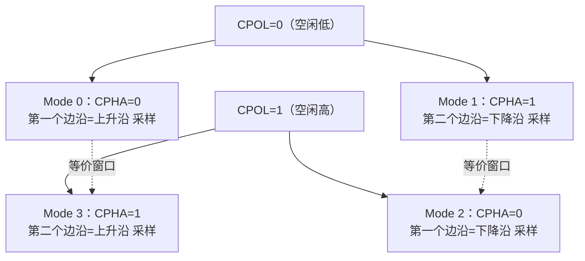

> 图中"等价窗口"表示：在某些器件上 Mode 0 与 Mode 3、Mode 1 与 Mode 2 因数据建立窗口对称而可互换，但这只是时序余量带来的兼容，不能当成通用结论，仍以 datasheet 为准。

### 4.5 时序对比（mermaid timing 图）

下面用 mermaid 的 timing 图直观对比 Mode 0 与 Mode 3 的采样边沿差异（CS/MOSI 为示意，SCK 标注采样点）。

```mermaid
timing
  title SPI Mode0 (CPOL=0,CPHA=0) vs Mode3 (CPOL=1,CPHA=1)
  axisType: none
  CS    : b0, b1, b1, b1, b1, b1, b1, b1, b1, b0
  SCK_M0: 0, 1, 0, 1, 0, 1, 0, 1, 0, 0
  SAMP_M0: 0, 1, 0, 1, 0, 1, 0, 1, 0, 0
  SCK_M3: 1, 0, 1, 0, 1, 0, 1, 0, 1, 1
  SAMP_M3: 0, 1, 0, 1, 0, 1, 0, 1, 0, 0
```

> 说明：Mode 0 在 SCK 上升沿采样（图中 `SAMP_M0` 在上升沿置位），数据在下降沿切换；Mode 3 空闲为高，在第二个边沿（上升沿）采样。两图采样点都是上升沿，但**空闲电平**和**数据切换边沿**不同，这正体现了 CPOL/CPHA 的组合差异。

### 4.6 寄存器级配置实例（STM32 SPI 初始化）

下面给出一段贴近真实 STM32 标准外设库的 SPI 初始化代码，展示如何配置 CPOL/CPHA、波特率分频、数据宽度与主从模式。寄存器名（如 `SPI_CR1`、`SPI_SR`）与位定义（如 `SPI_CR1_CPOL`、`SPI_CR1_BR_0`）在 STM32 各系列参考手册中高度一致。

```c
#include <stdint.h>

/* 以 SPI1 为例：目标 Mode 3（CPOL=1, CPHA=1），主模式，8 位帧，SCK 分频得到 ~5MHz */
#define SPI1_BASE      0x40013000UL
#define SPI1_CR1       (*(volatile uint32_t *)(SPI1_BASE + 0x00))
#define SPI1_CR2       (*(volatile uint32_t *)(SPI1_BASE + 0x04))
#define SPI1_SR        (*(volatile uint32_t *)(SPI1_BASE + 0x08))
#define SPI1_DR        (*(volatile uint32_t *)(SPI1_BASE + 0x0C))

#define SPI_CR1_CPHA   (1u << 0)   /* 时钟相位 */
#define SPI_CR1_CPOL   (1u << 1)   /* 时钟极性 */
#define SPI_CR1_MSTR   (1u << 2)   /* 主模式 */
#define SPI_CR1_BR_0   (1u << 3)   /* 波特率分频位0 */
#define SPI_CR1_BR_1   (1u << 4)   /* 波特率分频位1 */
#define SPI_CR1_BR_2   (1u << 5)   /* 波特率分频位2 */
#define SPI_CR1_SPE    (1u << 6)   /* SPI 使能 */
#define SPI_CR1_LSBFIRST (1u << 7) /* 位序：0=MSB, 1=LSB */
#define SPI_CR1_SSM    (1u << 9)   /* 软件从机管理：1=软件 NSS */
#define SPI_CR1_SSI    (1u << 8)   /* 软件 NSS 电平（主模式 SSM=1 时需置1） */
#define SPI_CR1_DFF    (1u << 11)  /* 数据帧格式：0=8位, 1=16位 */
#define SPI_SR_TXE     (1u << 1)   /* 发送缓冲空 */
#define SPI_SR_RXNE    (1u << 0)   /* 接收缓冲非空 */
#define SPI_SR_BSY     (1u << 7)   /* 总线忙 */
#define SPI_SR_OVR     (1u << 6)   /* 溢出标志 */

void SPI1_Init_Mode3(void)
{
    SPI1_CR1 = 0;                       /* 清配置 */
    SPI1_CR1 |= SPI_CR1_CPOL;           /* CPOL=1：空闲高 */
    SPI1_CR1 |= SPI_CR1_CPHA;           /* CPHA=1：第二个边沿采样 → Mode 3 */
    SPI1_CR1 |= SPI_CR1_MSTR;           /* 主模式 */
    SPI1_CR1 |= SPI_CR1_BR_2;           /* 分频 32（视 PCLK 而定，BR[2:0]=100） */
    SPI1_CR1 |= SPI_CR1_SSM | SPI_CR1_SSI; /* 软件 NSS 管理：CS 由 GPIO 控制 */
    /* DFF=0 默认 8 位帧；如需 16 位帧再加 SPI_CR1_DFF */
    SPI1_CR1 |= SPI_CR1_SPE;            /* 使能 SPI */
}

/* 单字节写即读：发 tx，同时收 1 字节 */
static uint8_t SPI1_Transfer(uint8_t tx)
{
    while (!(SPI1_SR & SPI_SR_TXE));    /* 等发送缓冲空 */
    SPI1_DR = tx;
    while (!(SPI1_SR & SPI_SR_RXNE));   /* 等接收缓冲非空 */
    return (uint8_t)SPI1_DR;
}

/* 切换模式（CPOL/CPHA）的辅助函数（部分从机只支持 Mode 0） */
void SPI1_SetMode(uint8_t cpol, uint8_t cpha)
{
    uint32_t cr1 = SPI1_CR1;
    cr1 &= ~(SPI_CR1_CPOL | SPI_CR1_CPHA);
    if (cpol)  cr1 |= SPI_CR1_CPOL;
    if (cpha)  cr1 |= SPI_CR1_CPHA;
    /* 注意：切换前先清 SPE 关闭 SPI，改完再置 SPE，否则可能触发 MODF 或产生畸变波形 */
    SPI1_CR1 &= ~SPI_CR1_SPE;
    SPI1_CR1 = cr1;
    SPI1_CR1 |= SPI_CR1_SPE;
}
```

要点：STM32 要求在修改 `CPOL/CPHA/BR` 等字段前先清除 `SPE` 关闭 SPI；NXP S32K 的 LPSPI 则通过 `TCR`（传输配置寄存器）的 `CPOL/CPHA/FRAMESZ/PCS` 字段在每次传输前灵活配置，更适合总线上挂多种模式器件（一条总线上有 Mode 0 的 Flash 与 Mode 1 的 ADC 时，LPSPI 可在不重启外设的情况下逐帧切换）。无论哪家的 SPI 外设，**CPOL/CPHA 的本质不变，变的只是写哪个寄存器、哪个字段**。

---

## 五、数据传输机制：主从移位寄存器的"环形推手"

### 5.1 本质：两个移位寄存器共移

SPI 的本质是**主从各有一个移位寄存器（Shift Register）**，在 SCK 驱动下同步移位。每个时钟周期：

- 主寄存器从高位（或低位，取决于位序）移出 1 位到 MOSI，同时移入 1 位来自 MISO；
- 从寄存器相反：移出 1 位到 MISO，同时移入 1 位来自 MOSI。

因为双方在同一时钟下同步移动，**发第 N 字节的同时必定收第 N 字节**——这就是 SPI 的"全双工"和"写即读"本质。

一个经典的类比：两个人面对面坐在传送带转盘两侧，每转一格，你递给我一颗豆，我也递给你一颗。所以 SPI 的"读"操作往往要先"写"一个 dummy（空）字节，目的只是为了让主设备产生 SCK 时钟，把从设备的数据"挤"出来。初学者最易困惑之处正在于此：**你以为在读，其实在写时钟换数据**。

### 5.2 主从移位寄存器环形结构（mermaid）

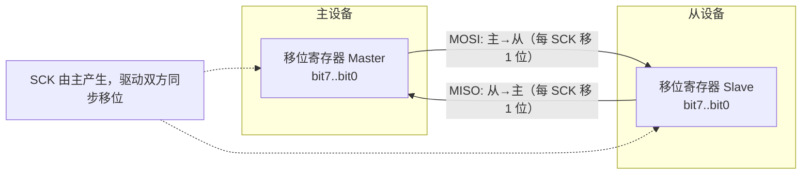

> 这是一个"环形"结构：主寄存器输出的位绕一圈经从寄存器再回到主寄存器输入。经过 8 个 SCK 周期，主从各自完成一次 8 位交换，原主寄存器内容跑到从寄存器，原从寄存器内容回到主寄存器。也正是因为这个环形交换，主设备在任何时刻都无法"只收不发"——要收就必须发（哪怕发 dummy），要发就必然收。

### 5.3 全双工"写即读"时序（mermaid sequence）

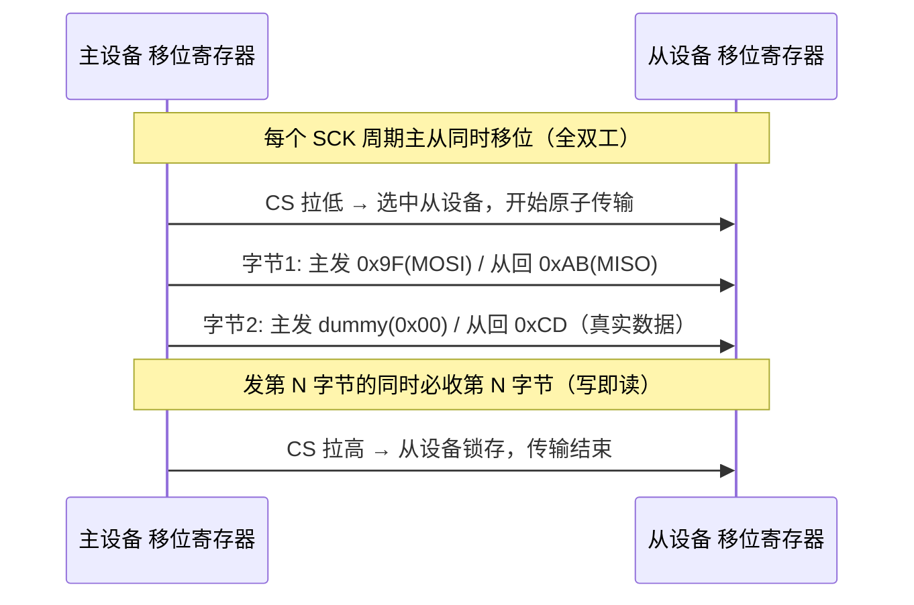

### 5.4 位序（Bit Order）：MSB-first 与 LSB-first

SPI 通常先传最高位（MSB-first），符合"人读二进制从左到右"的习惯，也是绝大多数器件默认。但有些器件（尤其某些老式或特殊接口）支持或强制 LSB-first。主从位序必须一致，否则**字节内位序被整体翻转**，读出的寄存器值看起来像"镜像"。例如 0x0C = 0000 1100，按位反转后是 0011 0000 = 0x30；0x3C = 0011 1100 反转后仍是 0011 1100 = 0x3C（巧合），所以**绝不能用巧合值判断位序**，要用 0x0C↔0x30 这类非对称值验证。明确规律：位序配反会让读取值呈现"半字节交换 + 位反转"特征，是定位位序错误的信号。

STM32 的 `SPI_CR1` 中 `LSBFIRST` 位（bit7）控制位序；NXP LPSPI 在 `TCR` 的 `LSBF` 位控制。配置时务必与从机 datasheet 一致，且注意某些从机仅在"命令字节"用 MSB，而"数据阶段"可配——不要想当然统一处理。

### 5.5 多字节帧的边界与"连续传输"本质

很多初学者把"一次 SPI 传输"理解为"一个字节"，这是误解。SPI 硬件层面没有"字节边界"概念——移位寄存器只是按位移动，CS 拉低期间可以连续传任意多个字节（甚至非 8 的倍数位，取决于外设是否支持如 16/32 位帧，LPSPI 的 FRAMESZ 支持 1–32 位任意帧）。所谓"字节"只是软件约定的打包单位。

理解这一点对调试很重要：以 W25Q 读 JEDEC ID 为例，协议是"发 1 字节命令 0x9F，再连续收 3 字节"。期间 CS 必须保持低，且主设备要**连续产生 4×8=32 个 SCK 周期**（发命令 8 个 + dummy 24 个）。若软件在发完命令后错误地释放了 CS，从机 A 会认为命令阶段结束并复位内部指针，下一波命令被当成新的传输起点，读不到完整 ID。这正是"CS 界定原子传输边界"的另一种体现：一次逻辑操作（读 ID）可能由多个字节组成，但它在物理上是一段不被 CS 中断的连续时钟流。

另一个要点是**时钟由主独占产生**。从机没有自己驱动 SCK 的能力（标准 SPI 中），所以"从机主动上报数据"在纯 SPI 下是不可能的——除非从机先通过 INT/DRDY 引脚拉低中断主，主再发起一次传输去把数据读出来。这也是为什么 MPU9250 有 INT 引脚、ADS1256 有 DRDY 引脚：它们用额外的边带信号（sideband）来告知主"数据就绪"，再由主发起 SPI 读取。理解"SPI 永远主从同步、从不能主动推"这一本质，能避免很多架构设计上的误区（例如误以为从机能像 I2C 从机那样主动发数据）。

---

## 六、片选 NSS 的细节：一次原子传输的边界

片选信号（NSS、CS、SS）是 SPI 里最容易被轻视、却最容易出大问题的信号。

### 6.1 硬件 NSS vs 软件 GPIO 控制

- **硬件 NSS**：由 SPI 外设的 NSS 引脚自动管理。主模式下通常可配置为"软件管理 NSS"（即 SSM=1，NSS 由内部寄存器位 SSI 模拟，外部 NSS 脚不再参与片选），此时 CS 由软件用任意 GPIO 拉低拉高。部分 MCU（如 STM32 的 NSS 脉冲模式、S32K LPSPI 的 PCS 控制）还支持"硬件自动在每帧起止切换 PCS"，适合单从机连续传输。
- **软件 GPIO 控制**：最常见做法——随便挑一根 GPIO，当作 CS 用，在传输开始前拉低、结束后拉高。灵活，但要求软件严格遵守时序，且中断/任务切换不能插在原子传输中间（需用总线锁保护，见 十四节）。

无论哪种，CS 都**定义了一次"原子传输"的边界**：CS 拉低表示从设备被选中、开始接收命令/数据；CS 拉高表示从设备锁存本次结果、结束传输。对多数 Flash 而言，CS 拉高的边沿触发内部状态机对本次命令"提交"（如写使能被清除、页编程缓冲写入阵列）。

### 6.2 CS 建立时间与保持时间

就像数据有建立保持时间，CS 相对 SCK 也有要求：

- **CS 建立时间（t_SU,CS / Lead time）**：CS 拉低后，必须等待一段时间，第一个 SCK 边沿才到来，让从设备完成"被选中"的内部准备（比如复位内部状态机、采样命令）。太早给时钟，从设备还没准备好，首字节会错。典型值从数 ns（高速 Flash）到数 µs（慢速传感器、需要唤醒延迟的器件）不等。
- **CS 保持时间（t_HD,CS / Trail time）**：传输最后一个字节后，CS 必须再保持低（或保持高）一段时间，给从设备锁存内部处理。拉太高早，最后一字节没收完；拉太高晚，无妨但浪费时间。

### 6.3 经典坑：CS 没拉低 / 拉低时机错 → 首字节丢失

一个非常常见的 Bug：软件先写了 SPI 数据寄存器，再去拉低 CS——结果从设备在被选中之前就已经"看到"时钟，首字节数据作废。正确顺序是：**先拉低 CS，等满足 t_SU 后，再开始送 SCK/数据；传输完毕，等满足 t_HD 后，再拉高 CS**。在 MCU 上，CS 由 GPIO 控制时，务必在写第一个数据字节之前完成 `CS_LOW()`，且 `CS_LOW()` 后若需要 t_SU 延迟应插入阻塞延时或等待循环。

另一个坑：多字节传输时 CS 应在整个帧期间**保持低电平不要释放**。例如读 W25Q 的 JEDEC ID，指令 0x9F 后面要连续读 3 字节，期间 CS 必须一直低；若每发一个字节就释放再拉低 CS，从设备会认为每次都是独立的小传输，ID 读取被打断，读到的不是完整 3 字节。

### 6.4 CS 与 SCK 的 skew（偏移）

在长走线或高速下，CS 与 SCK 到达从设备存在时间差（skew）。如果 CS 相对 SCK 延迟太大，可能破坏 t_SU；如果 CS 提前太多释放，可能破坏 t_HD。高速 SPI（如几十 MHz 驱动 TFT 屏、W25Q 在 104 MHz 下读）要特别注意 PCB 走线等长。经验法则：**让 CS 走线等于或略长于 SCK 走线**，确保 CS 在 SCK 之后到达从机、在 SCK 之后释放，从硬件上吸收 skew。

---

## 七、多从机拓扑：星形 vs 菊花链

挂多个从设备时，SPI 有两种主流拓扑。

### 7.1 独立片选（星形拓扑）

每个从设备有独立 CS，所有从设备共用同一组 SCK/MOSI/MISO。主设备通过拉低某一根 CS 选中对应从机。

- 优点：各从机独立，互不干扰；任意时刻只和一个从机通信；模式/速率可按从机单独配置（切换时注意重新初始化 SPI 寄存器或 LPSPI 的 TCR）；某个从机故障不影响其他。
- 缺点：从机越多，CS 线越多，占用 GPIO 多；MISO 需要三态/高阻，多个从机同时驱动 MISO 会冲突（靠 CS 选中才驱动 MISO 来解决）；多从机并联电容会降低最高 SCK 速率。

### 7.2 菊花链（Daisy Chain）

从机的 MISO 不直接回主，而是级联：主 MOSI → 从机1 DI，从机1 DO → 从机2 DI，……，最后一级 DO → 主 MISO。数据像"穿糖葫芦"一样逐级移位传递。常用于多片级联的 ADC（如多片 ADS1256 级联采集）、LED 驱动、移位寄存器（如 74HC595、TLC59711）。

- 优点：只需一根 CS、一组总线，节省 GPIO；适合大量相同器件级联。
- 缺点：一次传输要移位 N 倍长度（N 为级数），延迟大；任一从机故障可能断链；不支持对单个从机的"随机访问"，必须整体移位；帧格式需按级联协议设计（通常每级固定字节数，且要注意首级命令需经过 N-1 级延迟才到达末级）。

### 7.3 拓扑对比图（mermaid）

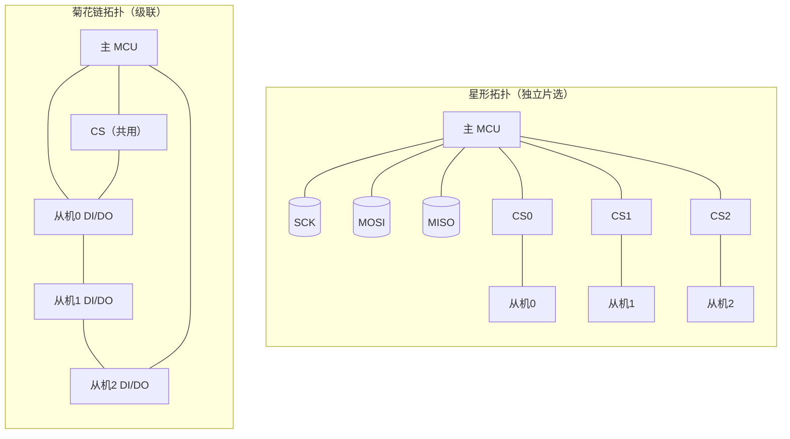

---

## 八、速率与时序参数：如何读 datasheet 落地

### 8.1 SCK 最大频率

每个从机都有 `f_SCK(max)`，超出则内部采样电路跟不上，数据出错。从机越慢（如某些老传感器、或带内部电荷泵的器件），这个值越低（几百 kHz）；W25Q128JV 在快读（0x0B）下达 104 MHz，普通读（0x03）约 50 MHz；ST7789 刷屏 SPI 接口常跑到 20–62 MHz；部分器件配合 Dual/Quad 模式可达 100 MHz 以上。主设备通过 SPI 时钟分频器（BR 位）把 MCU 外设时钟分频得到目标 SCK。

### 8.2 建立时间 t_SU 与保持时间 t_HD

对任意被采样的数据（MOSI 上的命令/地址/数据，或 MISO 上的回读数据），在采样边沿前后都要满足：

- **t_SU（Setup）**：数据在采样边沿**之前**必须稳定的最短时间；
- **t_HD（Hold）**：数据在采样边沿**之后**必须保持的最短稳定时间。

对 SPI 来说，典型情况是：主在"非采样边沿"把数据放到 MOSI，从在"采样边沿"读；从在采样边沿前某时刻把 MISO 数据放好，主在采样边沿读。只要 SCK 频率足够低、PCB 延迟足够小，就能天然满足。一旦频率过高或走线长导致传播延迟大，就可能违例。Mode 0/Mode 3 下，主在 SCK 下降沿改变 MOSI、在上升沿采样，因此 MOSI 的 t_SU/t_HD 窗口相对于 SCK 周期中心对称；这正是 Mode 0/3 "等价"的硬件基础。

### 8.3 传播延迟 t_PD 与 t_SU/t_HD 的关系

数据从主到从经过走线有传播延迟 t_PD。若主在边沿 T 改变 MOSI，从在 T+d 才看到变化，其中 d≈t_PD。从的采样发生在自己的 SCK 边沿；若 SCK 也经同样延迟到达从，则有效建立窗口 = 主的数据稳定时间 − 路径延迟差。工程上简化做法是：**降频 + 缩短走线 + 必要时在布局上让 SCK 与数据线等长或让 SCK 略滞后**，确保从机采样时数据已稳。当 SCK 周期接近 2×(t_PD + t_SU + t_HD) 时，系统已逼近时序极限，再提速需重新评估 PCB 与器件驱动能力。

### 8.4 时序参数表（示例）

| 参数 | 含义 | 典型值（参考） | 违例后果 |
|------|------|----------------|----------|
| f_SCK(max) | 最大时钟频率 | W25Q 读 50–104 MHz；MCP3208 可达 1–1.6 MHz 范围；IMU 多 ≤10 MHz | 超频→采样错 |
| t_SU,DI | MOSI 数据建立时间 | 5–20 ns（Flash 高速下更紧） | 数据未稳被采→错 |
| t_HD,DI | MOSI 数据保持时间 | 5–20 ns | 数据过早变→错 |
| t_SU,CS | CS 建立（Lead） | 数 ns 到数 µs（慢速传感器更长） | 首字节错/丢 |
| t_HD,CS | CS 保持（Trail） | 数 ns 到数 µs | 末字节未锁存 |
| t_V,DO | MISO 数据有效延迟 | 数 ns 到数十 ns（受从机驱动强度影响） | 主采到旧值/中间态 |

> 注意：具体数值必须查所用器件的 datasheet，上表仅为说明性示例，不可当作通用参数。W25Q 系列 AC 时序表、ADS1256 的 SPI 时序图、MCP3208 的时钟要求都各有差异，落地时务必以原厂文档为准。

### 8.5 时序建立/保持示意（mermaid timing）

```mermaid
timing
  title 数据建立/保持示意（CPHA=0，上升沿采样）
  axisType: none
  CS  : b0, b1, b1, b1, b1, b0
  SCK : 0, 1, 0, 1, 0, 0
  MOSI: z, a, a, b, b, z
  SAMPL: 0, 1, 0, 1, 0, 0
```

> 图中 `a` 在 SCK 上升沿（采样点）之前已稳定，满足 t_SU；采样后保持到下一变化，满足 t_HD。若 `a` 在上升沿附近才跳变，则建立时间不足，采样可能采到错误电平。注意 CS 在 SCK 之前拉低、在 SCK 之后释放，满足 t_SU,CS / t_HD,CS。

### 8.6 信号完整性与 PCB 布局要点

当 SCK 频率达到几十 MHz，SPI 已经进入"高速数字信号"范畴，PCB 布局直接决定能否稳定通信：

- **走线尽量短**：SCK/MOSI/MISO 越短，传播延迟与反射越小，越容易满足 t_SU/t_HD；
- **避免锐角与长平行**：减少串扰（crosstalk），尤其 MISO 不要与大电流、高频走线长距离平行；
- **CS 与 SCK 等长或 CS 略滞后**：高速下两者到达从机的 skew 会破坏建立/保持，必要时让 CS 走线稍长使其在 SCK 之后到达，或在软件上 CS 拉低后插入少量延迟；
- **终端匹配**：极高速或长线时可考虑源端串联小电阻（如 22–33 Ω）抑制反射；
- **地平面完整**：SPI 四线应靠近完整地平面回流，避免跨分割；
- **去耦电容**：每个 SPI 从机电源脚就近放 0.1 µF 去耦，降低电源噪声导致采样抖动；对高速 Flash 可在 VCC 与 GND 间并 0.1 µF + 10 µF。

### 8.7 时钟分频与波特率计算示例

SPI 外设的 SCK 由 MCU 外设时钟（如 APB 时钟）经分频得到。以 STM32 为例，SPI 控制寄存器里的 BR[2:0] 位选择分频系数（2、4、8、16、32、64、128、256）。假设 APB2 时钟为 84 MHz，要得到不超过从机 10 MHz 的 SCK：

- 分频 8 → 84/8 = 10.5 MHz（略超，若从机标称 10 MHz 可能不稳）；
- 分频 16 → 84/16 = 5.25 MHz（安全）；

因此选 BR 对应分频 16。工程上**留 20%~30% 余量**：标称 10 MHz 的从机，实际跑 8 MHz 以内更稳。对 S32K（LPSPI）则是通过 TCR 的 PRESCALE 与 CCR 的 SCKDIV 字段计算波特率 = 外设时钟 / (PRESCALE × (SCKDIV+1) × 2)，配置时要查参考手册的时序公式，并通过示波器实测 SCK 实际频率校准。注意：STM32 的 SPI 时钟源有时来自 APB1（如 SPI2，最高 36 MHz PCLK）或 APB2（SPI1，最高 84 MHz PCLK，部分系列 APB2 可达 100+ MHz），分频基准要先看对时钟树。

---

## 九、DMA 与 SPI：把 CPU 从轮询里解放出来

当 SPI 速率高、数据量大（如刷屏、读大块 Flash、连续采样 ADC），用 CPU 轮询或中断逐字节搬运既占 CPU 又容易丢数。**DMA（Direct Memory Access，直接存储器访问）** 让外设和内存之间直接搬运，CPU 只负责启动和收尾。

### 9.1 为什么用 DMA

- **免轮询**：CPU 不必每字节等 TXE/RXNE 标志；
- **高吞吐**：连续搬运不受中断延迟抖动影响；
- **低功耗**：CPU 可进低功耗，DMA 后台搬；
- **双缓冲**：DMA 双缓冲（ping-pong）可在搬运一块的同时 CPU 处理另一块，实现"无停顿"数据流。

### 9.2 SPI+DMA 收发要点

- SPI 发送用 TX DMA 通道，接收用 RX DMA 通道；
- 由于 SPI 是"写即读"，**接收 DMA 必须与发送 DMA 配对**：即使只想发，也要开 RX DMA 把收到的（可能是 dummy）数据搬走，否则 RX FIFO 溢出；同理只读时要开 TX DMA 发 dummy 以产生时钟；
- 数据宽度、地址增量（外设地址不增、内存地址增）要配对；
- 传输完成以 RX DMA 的 TC（Transfer Complete）中断为准，而非 TX。

### 9.3 双缓冲（Ping-Pong）图（mermaid）

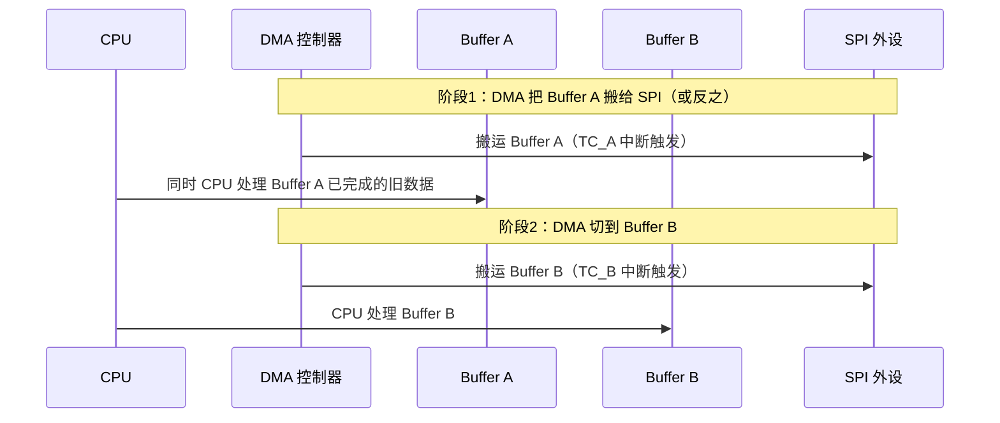

### 9.4 缓存一致性陷阱（Cache Coherency）

在带 Cache（如 Cortex-M7 带 D-Cache，或 A 核）的 MCU 上，DMA 与 CPU 共享内存，问题来了：

- **CPU 写数据给 DMA 发**：CPU 可能只把数据写进 Cache 而没写回物理内存（Write-back），DMA 读到的还是旧值。解决：在启动 DMA 前 **Clean（清理/回写）** 该 buffer 的 Cache，把脏数据刷进内存。
- **DMA 写数据给 CPU 读**：DMA 直接写物理内存，但 CPU 的 Cache 里可能还有旧副本，CPU 读到旧值。解决：CPU 读前 **Invalidate（失效）** 该 buffer 的 Cache，强迫从内存重新加载。

在带 MPU（Memory Protection Unit）的系统里，常把 DMA 用的 buffer 所在内存区域配置为 **non-cacheable** 或 **write-through**，从根上避免一致性问题。这是"用 DMA 后偶发错字节"的头号元凶，务必在驱动里处理。在 STM32H7（Cortex-M7）上，典型做法是把 SPI RX/TX buffer 放在 AXI SRAM 中通过 MPU 设为 non-cacheable，或使用 `SCB_CleanDCache_by_Addr()` / `SCB_InvalidateDCache_by_Addr()` 在每次传输前后处理。

### 9.5 SPI+DMA 常见配置错误清单

- **只开 TX DMA 没开 RX DMA**：SPI 写即读，TX 进行时 RX FIFO 不断进数，不搬走会溢出丢数甚至阻塞。只读时也要开 TX DMA 发 dummy。
- **数据宽度配错**：SPI 数据寄存器若是 8 位，DMA 内存/外设宽度应设 byte；若配置成 half-word/word 而 buffer 未按偶数对齐，会错位。用 16 位帧时则相应配 half-word。
- **地址增量方向反了**：内存地址应递增（指向连续 buffer），外设地址（SPI DR）应固定不增。配反会导致所有数据写到同一寄存器或内存错位。
- **传输长度与 CS 边界不匹配**：DMA 传完 N 字节才产生 TC 中断，但若 CS 应在 N/2 处释放（例如分两段命令+数据），单凭 DMA TC 无法精确控制 CS，需要 DMA 半传输/传输完成双中断配合软件在合适时机拉低/拉高 CS，或采用"DMA 传数据 + 软件在 TC 中断里拉高 CS"。在 STM32 上可借助 DMA 的 HT（Half Transfer）中断在半程插入 CS 操作；在 LPSPI 上可用 PCSCFG + 帧计数在硬件层界定 CS。
- **DMA 缓冲区被栈上数组占用**：buffer 若是函数内局部数组，函数返回后内存失效，DMA 仍在搬——轻则数据错，重则踩内存。SPI+DMA 的 buffer 必须是静态/全局或 DMA 专用内存（如 DTCM/特定 SRAM bank）。

### 9.6 SPI+DMA 收发片段（寄存器级 + 缓存处理）

下面给出一段"用 DMA 把一块内存发到 SPI、同时从 SPI 收回一块内存"的示例，体现"TX 与 RX 必须配对、以 RX 完成中断为准、缓存需 Clean/Invalidate"的要点：

```c
#include <stdint.h>
#include <string.h>

/* 假设已配置好 SPI（Mode0/3 依器件）、DMA 控制器与两个通道：tx_ch、rx_ch */
extern volatile uint32_t SPI1_DR;     /* SPI 数据寄存器（TX/RX 共用） */
extern void DMA_Setup(uint8_t ch, uint32_t src, uint32_t dst,
                      uint16_t len, uint8_t dir, uint8_t inc);
extern void DMA_Enable(uint8_t ch);
extern void SCB_CleanDCache_by_Addr(void *addr, int size);
extern void SCB_InvalidateDCache_by_Addr(void *addr, int size);

/* DMA 缓冲区必须静态/全局，且按 Cache 行（通常 32 字节）对齐 */
static uint8_t  tx_buf[256] __attribute__((aligned(32)));
static uint8_t  rx_buf[256] __attribute__((aligned(32)));

/* SPI+DMA 全双工收发：把 tx 发出去，同时把 rx 收回来，长度 len */
void SPI_DMA_FullDuplex(const uint8_t *src, uint8_t *dst, uint16_t len)
{
    memcpy(tx_buf, src, len);                 /* 1) 先拷到对齐的发送缓冲 */

    SCB_CleanDCache_by_Addr(tx_buf, len);     /* 2) 写前 Clean，确保 DMA 看到新数据 */
    SCB_InvalidateDCache_by_Addr(rx_buf, len);/* 3) 读前 Invalidate，丢弃 CPU 旧副本 */

    /* 4) RX DMA：外设地址固定(SPI_DR)，内存地址增，长度 len */
    DMA_Setup(RX_CH, (uint32_t)&SPI1_DR, (uint32_t)rx_buf, len,
              DMA_DIR_PERIPH_TO_MEM, DMA_INC_MEM);
    /* 5) TX DMA：外设地址固定，内存地址增，长度 len */
    DMA_Setup(TX_CH, (uint32_t)tx_buf, (uint32_t)&SPI1_DR, len,
              DMA_DIR_MEM_TO_PERIPH, DMA_INC_MEM);

    /* 6) 先使能 RX DMA，再使能 TX DMA（避免 RX 溢出） */
    DMA_Enable(RX_CH);
    DMA_Enable(TX_CH);

    /* 7) 以 RX 传输完成中断(TC)触发回调；注意：不要以 TX TC 作为"全部完成"依据 */
    /* CS 的拉低在调用本函数前完成，拉高在 RX TC 回调里执行 */
}

/* 仅发送（仍须开 RX DMA 搬走 dummy，防止溢出） */
void SPI_DMA_TransmitOnly(const uint8_t *src, uint16_t len)
{
    memcpy(tx_buf, src, len);
    SCB_CleanDCache_by_Addr(tx_buf, len);
    /* RX 仍要开，但 rx_buf 可丢弃 */
    DMA_Setup(RX_CH, (uint32_t)&SPI1_DR, (uint32_t)rx_buf, len,
              DMA_DIR_PERIPH_TO_MEM, DMA_INC_MEM);
    DMA_Setup(TX_CH, (uint32_t)tx_buf, (uint32_t)&SPI1_DR, len,
              DMA_DIR_MEM_TO_PERIPH, DMA_INC_MEM);
    DMA_Enable(RX_CH);
    DMA_Enable(TX_CH);
}
```

注意：SPI 数据寄存器地址对 TX、RX 是同一个 `SPI_DR`，但 DMA 方向不同。在带 Cache 的内核（如 Cortex-M7、Cortex-A）上，`SCB_CleanDCache_by_Addr` / `SCB_InvalidateDCache_by_Addr` 是**不可省略**的步骤，否则会出现"发的是新数据、DMA 却发了旧值"或"收完数据 CPU 却读到旧缓存"的诡异现象。

---

## 十、中断 vs 轮询 vs DMA：如何选型

| 方式 | CPU 占用 | 实时性 | 实现复杂度 | 适用场景 |
|------|----------|--------|------------|----------|
| 轮询（Polling） | 高（忙等） | 好（无中断延迟） | 最低 | 低频小数据、初始化、调试、读 ID |
| 中断（Interrupt） | 中 | 受中断优先级影响 | 中 | 中低频、需异步通知、短包 |
| DMA | 低 | 好（硬件搬运） | 高（含缓存处理） | 高速、大数据流、刷屏、连续采样 |

**选型经验**：

- 偶尔读个寄存器、初始化阶段：轮询足够简单可靠；
- 周期性中等速率通信：中断 + FIFO；
- 高速刷屏、连续 ADC 采样、音频流：DMA 双缓冲；
- 既想低占用又想处理复杂协议：DMA + 完成中断 + 协议状态机。

补充一个经验法则：**当单帧数据量超过 FIFO 深度数倍、且帧率要求高时，必须上 DMA**。例如 ST7789 刷一屏（240×320×16bit = 153600 字节），若用中断逐字节搬，CPU 占用极高且易丢；DMA 双缓冲几乎是唯一可行方案。

---

## 十一、A. 芯片模块设计：SPI 控制器 IP 内部架构

> 这一节从 IP（Intellectual Property，半导体 IP 核）设计视角，剖析一颗典型 SPI 控制器（如挂在 APB/AHB 上的 SPI 外设）的内部结构。理解 IP 内部架构，是写好寄存器级驱动、正确配置 DMA/中断、以及排查疑难问题的前提。下面以"通用 SPI 外设 IP"为蓝本，其寄存器布局与 STM32 的 SPI、NXP S32K 的 LPSPI 在概念上高度一致。

### 11.1 SPI 控制器 IP 整体框图

一颗工业级 SPI 控制器 IP 通常包含以下模块：APB/AHB 总线接口、控制/状态/数据寄存器组、移位寄存器（主从推手）、波特率分频器（产生 SCK）、CPOL/CPHA 控制逻辑、TX/RX FIFO（或单级缓冲）、NSS 片选控制（硬件/软件）、DMA 请求逻辑、中断逻辑、以及引脚复用（PAD MUX）连接。下图为典型架构：

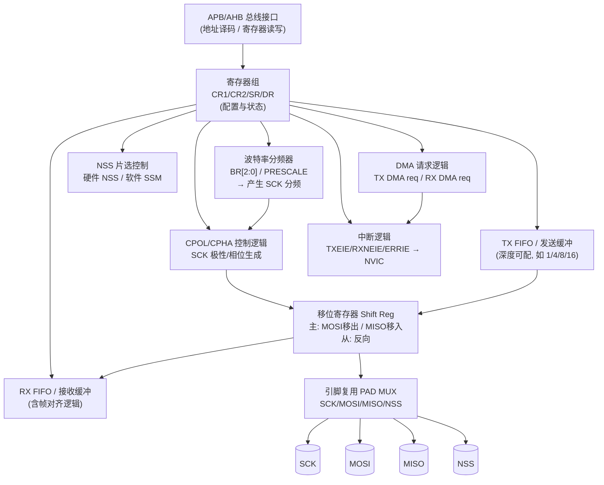

**各模块职责说明：**

1. **APB/AHB 总线接口**：主机（CPU 或 DMA）通过总线地址访问 SPI 寄存器。APB 适合低速外设（多数 MCU 的 SPI 挂在 APB），AHB/AXI 适合高吞吐（H7 的 SPI 可挂 AHB）。接口负责地址译码、读写节拍、时序同步。
2. **寄存器组（CR1/CR2/SR/DR）**：存储配置（模式、波特率、帧宽、中断使能）与状态（TXE/RXNE/BUSY/OVR）。驱动对 SPI 的所有操作本质上都是读写这组寄存器。
3. **移位寄存器（Shift Register）**：SPI 的"心脏"。主模式下，它在 SCK 边沿把 TX 数据逐位推到 MOSI、把 MISO 逐位收进 RX；从模式方向相反。移位宽度由帧格式（8/16/…/32 位）决定。
4. **波特率分频器（Baud Rate Divider）**：把外设时钟（PCLK/SPI_CLK）按 BR[2:0] 或 PRESCALE×SCKDIV 分频，得到 SCK。它决定了总线速率上限。
5. **CPOL/CPHA 控制逻辑**：根据 CR1 的 CPOL/CPHA 位，生成 SCK 的空闲电平与采样边沿，并同步到移位寄存器。这是四种模式的硬件实现点。
6. **TX/RX FIFO**：解耦"CPU/DMA 写数据"与"移位寄存器移位"的速率差。TX FIFO 暂存待发数据，RX FIFO 暂存已收数据；FIFO 非空/满状态直接反映到 SR 的 TXE/RXNE 及中断。
7. **NSS 片选控制**：硬件模式下由 SCK 同步自动拉低/拉高 PCS；软件模式（SSM=1）下 CS 由外部 GPIO 或内部 SSI 位控制。多从机时每个从机对应一个 PCS 输出。
8. **DMA 请求逻辑**：当 TX FIFO 低于阈值（需要新数据）或 RX FIFO 高于阈值（有数据待搬）时，向 DMA 控制器发请求（tx_req / rx_req），实现自动批量搬运。
9. **中断逻辑**：把 TXE/RXNE/OVR/MODF/CRC 等事件按 CR2 的使能位汇成中断线送往 NVIC。
10. **引脚复用（PAD MUX）**：通过 IOMUX 选择引脚功能，SCK/MOSI/MISO/NSS 可映射到不同物理脚，并可配上/下拉、驱动强度、速度。

### 11.2 时钟域与复位域

SPI 外设跨越两个时钟域：**总线时钟域（PCLK，用于寄存器访问）** 与 **SPI 功能时钟域（SPI_CLK，用于产生 SCK 与移位）**。二者可能同源也可能分频不同。设计上需注意：

- **时钟门控（Clock Gating）**：低功耗时关闭 SPI_CLK 可省电，但关闭前须确保当前传输已完成（BSY=0），否则会截断帧。
- **复位（Reset）**：上电复位或软件复位会把 CR/SR/FIFO 清零。复位释放后须重新初始化寄存器。注意有些 MCU 的 SPI 复位与总线复位同步，有些有独立 SPI_RST；软件复位外设（如 STM32 的 RCC reset）要等复位解除再配置。
- **跨时钟域同步**：NSS 由 GPIO 输入时（从机检测主机片选），需经同步器（2 级触发器）避免亚稳态；MODF（模式故障）检测也依赖跨域同步。

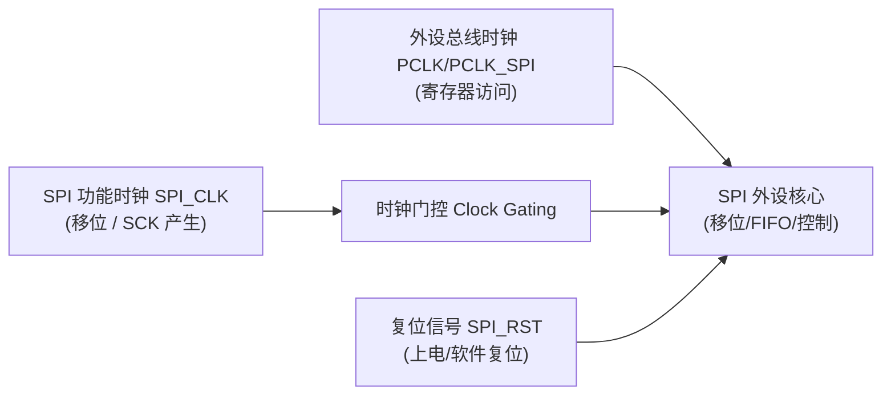

### 11.3 寄存器位域图（控制/状态/数据/中断使能）

下面给出一颗"通用 SPI 外设 IP"的寄存器位域图。控制寄存器 `SPI_CR1` 包含 CPOL/CPHA/波特率分频/主从/数据宽度等；状态寄存器 `SPI_SR` 包含 TXE/RXNE/BUSY/OVR；数据寄存器 `SPI_DR` 收发共用；`SPI_CR2` 承载中断使能与 DMA 请求使能。

```mermaid
flowchart LR
    subgraph CR1["SPI_CR1 控制寄存器（左为高位 bit15）"]
    direction LR
        C0["bit0<br/>CPHA<br/>采样相位"]
        C1["bit1<br/>CPOL<br/>时钟极性"]
        C2["bit2<br/>MSTR<br/>主/从"]
        C3["bit3-5<br/>BR[2:0]<br/>波特率分频 2~256"]
        C6["bit6<br/>SPE<br/>SPI 使能"]
        C7["bit7<br/>LSBFIRST<br/>位序"]
        C8["bit8<br/>SSI<br/>软件 NSS 电平"]
        C9["bit9<br/>SSM<br/>软件 NSS 管理"]
        C10["bit10<br/>RXONLY<br/>仅收(主)"]
        C11["bit11<br/>DFF<br/>帧宽 8/16"]
    end
    subgraph SR["SPI_SR 状态寄存器"]
    direction LR
        S0["bit0<br/>RXNE<br/>收非空"]
        S1["bit1<br/>TXE<br/>发空"]
        S2["bit2<br/>CRCERR<br/>CRC错"]
        S3["bit3<br/>MODF<br/>模式故障"]
        S4["bit4<br/>OVR<br/>溢出"]
        S7["bit7<br/>BSY<br/>忙"]
    end
    subgraph CR2["SPI_CR2 中断/DMA 使能"]
    direction LR
        I0["bit0<br/>RXNEIE<br/>收中断使能"]
        I1["bit1<br/>TXEIE<br/>发中断使能"]
        I2["bit2<br/>ERRIE<br/>错误中断使能"]
        I3["bit3<br/>DMA_RX<br/>RX DMA 请求"]
        I4["bit4<br/>DMA_TX<br/>TX DMA 请求"]
    end
    subgraph DR["SPI_DR 数据寄存器"]
    direction LR
        D0["bit15-0<br/>DATA[15:0]<br/>收发共用"]
    end
```

> 注：以上位域为通用化描述。STM32 各系列与 S32K LPSPI 的具体位宽/命名略有差异（如 STM32H7 增加 `SPI_CFG1`（DSIZE、MBR、CRCEN）与 `SPI_CFG2`、`SPI_TXDR/RXDR` FIFO 寄存器；LPSPI 用 `TCR`（CPOL/CPHA/FRAMESZ/PCS）、`CCR`（SCKDIV/PRESCALE）、`TDR/RDR`）。**驱动工程师的通用心智模型就是这张图：CR 配模式/速率/宽度，SR 查状态，DR 收发，CR2 开中断/DMA。**

### 11.4 FIFO 与双缓冲协作机制

现代 SPI IP 普遍带 TX/RX FIFO（深度常见 1/4/8/16 级）。其协作逻辑：

- **发送**：CPU/DMA 把数据写入 TX FIFO；移位寄存器空闲时从 TX FIFO 取数移位。当 TX FIFO 变空（TXE=1），若开了 TXEIE 则触发中断请求新数据；若开了 DMA_TX，则向 DMA 发请求搬下一批。
- **接收**：移位寄存器收满一帧写入 RX FIFO；当 RX FIFO 非空（RXNE=1），若开了 RXNEIE 则触发中断；若开了 DMA_RX，则发请求把数据搬走。若 RX FIFO 满仍有新数据（CPU/DMA 没及时取），则置 OVR 溢出标志，后续数据丢失——这正是"不开 RX DMA 只开 TX DMA"会溢出的原因。
- **双缓冲（Double Buffer）**：部分 IP 在 FIFO 之上提供"当前缓冲 + 下一缓冲"双缓冲寄存器，允许在 DMA 搬当前块时 CPU 准备下一块，实现零停顿。在 PS 层体现为 DMA 的 ping-pong（第九节），在 IP 层可配合"半传输中断（HT）"切换 buffer。

### 11.5 从模式下的细节

在从模式下（MSTR=0），SCK 由外部主机提供，IP 内部用 SCK 驱动移位。从机须注意：

- **CPOL/CPHA 必须与主机一致**，否则采样错位（同主模式）；
- **NSS 为输入**，由主机片选拉低选中本从机；未选中时从机不驱动 MISO（高阻），这是硬件保证总线不冲突的关键；
- **从机无法主动发数据**，只能等主机给时钟；因此从机"上报"必须依赖 INT/DRDY 边带中断主机来读；
- **从机时钟域异步于自身系统时钟**，SCK 边沿需经同步器，存在最大 SCK 频率限制（受从机内部采样电路约束，见 f_SCK(max)）。

---

## 十二、B. 驱动代码实现：真实可读的寄存器级 C

> 这一节把"协议"落为"代码"。涵盖：SPI 外设寄存器级初始化（配 CPOL/CPHA/波特率/数据宽度）、全双工收发（查 TXE/RXNE 状态机）、NSS 软件 GPIO 控制（CS 建立/保持）、SPI Flash 驱动（Read JEDEC ID / Page Program / Sector Erase / Write Enable）、SPI LCD 命令/数据（D/C 线）、SPI+DMA 批量收发。所有代码均带注释，可直接作为项目骨架。

### 12.1 SPI 外设寄存器级初始化

下面给出可复用的初始化函数族：按寄存器位域操作 CPOL/CPHA/波特率分频/主从/数据宽度。设计成"参数化配置"，便于同总线上挂多种模式器件时切换。

```c
#include <stdint.h>

/* ---------- 寄存器映射（以某 APB 总线上的 SPI 外设为例） ---------- */
#define SPI_BASE        0x40013000UL
#define SPI_CR1         (*(volatile uint32_t *)(SPI_BASE + 0x00))
#define SPI_CR2         (*(volatile uint32_t *)(SPI_BASE + 0x04))
#define SPI_SR          (*(volatile uint32_t *)(SPI_BASE + 0x08))
#define SPI_DR          (*(volatile uint32_t *)(SPI_BASE + 0x0C))

/* ---------- CR1 位域 ---------- */
#define CR1_CPHA     (1u << 0)
#define CR1_CPOL     (1u << 1)
#define CR1_MSTR     (1u << 2)
#define CR1_BR0      (1u << 3)
#define CR1_BR1      (1u << 4)
#define CR1_BR2      (1u << 5)
#define CR1_SPE      (1u << 6)
#define CR1_LSBFIRST (1u << 7)
#define CR1_SSI      (1u << 8)
#define CR1_SSM      (1u << 9)
#define CR1_RXONLY   (1u << 10)
#define CR1_DFF      (1u << 11)

/* ---------- SR 位域 ---------- */
#define SR_RXNE      (1u << 0)
#define SR_TXE       (1u << 1)
#define SR_OVR       (1u << 4)
#define SR_BSY       (1u << 7)

/* 波特率分频编码：BR[2:0] = 000/001/.../111 → 2/4/8/16/32/64/128/256 */
typedef enum { BR_DIV2=0, BR_DIV4, BR_DIV8, BR_DIV16,
               BR_DIV32, BR_DIV64, BR_DIV128, BR_DIV256 } spi_br_t;

/* SPI 配置参数（与 MCAL SpiChannel 概念对应） */
typedef struct {
    uint8_t      cpol;       /* 0 / 1 */
    uint8_t      cpha;       /* 0 / 1 */
    uint8_t      lsbfirst;   /* 0=MSB, 1=LSB */
    uint8_t      datasize;   /* 8 或 16（位） */
    spi_br_t     baud;       /* 波特率分频 */
} spi_config_t;

/* 关闭 SPI → 写入配置 → 重新使能（切换 CPOL/CPHA/BR 前必须先关 SPE） */
void SPI_Init(const spi_config_t *cfg)
{
    uint32_t cr1 = 0;

    SPI_CR1 &= ~CR1_SPE;             /* 1) 关 SPI，允许改配置 */

    if (cfg->cpol)     cr1 |= CR1_CPOL;
    if (cfg->cpha)     cr1 |= CR1_CPHA;
    cr1 |= CR1_MSTR;               /* 主模式 */
    cr1 |= (cfg->baud & 0x7) << 3; /* BR[2:0] 波特率分频 */
    if (cfg->lsbfirst) cr1 |= CR1_LSBFIRST;
    if (cfg->datasize == 16) cr1 |= CR1_DFF;  /* 16 位帧 */
    cr1 |= CR1_SSM | CR1_SSI;      /* 软件 NSS：CS 由 GPIO 控制 */

    SPI_CR1 = cr1;
    SPI_CR1 |= CR1_SPE;             /* 2) 使能 SPI */
}

/* 运行时切换为另一个器件的配置（同总线多从机） */
void SPI_ApplyConfig(const spi_config_t *cfg)
{
    SPI_Init(cfg);   /* 内部已先关 SPE 再配，安全 */
}
```

### 12.2 全双工收发（TX/RX FIFO 状态机）

基于 SR 的 TXE/RXNE 位，用"写即读"方式实现单字节及多字节收发。这是所有上层驱动的基石。

```c
/* 单字节全双工：写 tx，同时收 1 字节（写即读） */
static inline uint8_t SPI_TransferByte(uint8_t tx)
{
    while (!(SPI_SR & SR_TXE));     /* 等 TX FIFO 空 */
    SPI_DR = tx;                    /* 写发送，触发移位 */
    while (!(SPI_SR & SR_RXNE));    /* 等 RX FIFO 非空 */
    return (uint8_t)SPI_DR;         /* 读接收（环形交换的另一半） */
}

/* 多字节全双工：把 txbuf 发出、rxbuf 收回，长度 len。
   txbuf/rxbuf 可为同一指针（自发自收忽略）或 NULL（仅发/仅收）。 */
void SPI_TransferBuffer(const uint8_t *txbuf, uint8_t *rxbuf, uint16_t len)
{
    for (uint16_t i = 0; i < len; i++) {
        uint8_t tx = txbuf ? txbuf[i] : 0x00;  /* 仅收时发 dummy */
        uint8_t rx = SPI_TransferByte(tx);
        if (rxbuf) rxbuf[i] = rx;
    }
}

/* 仅发送（仍需处理 RX 以免溢出，但这里用轮询"消费"掉 dummy） */
void SPI_SendOnly(const uint8_t *txbuf, uint16_t len)
{
    SPI_TransferBuffer(txbuf, NULL, len);
}

/* 仅接收（发 dummy 产生时钟） */
void SPI_ReceiveOnly(uint8_t *rxbuf, uint16_t len)
{
    SPI_TransferBuffer(NULL, rxbuf, len);
}
```

> 要点：轮询式收发会忙等，适合低频/小数据。高频大数据请改用 DMA（见 12.6 与第九节）。若 RX FIFO 在收发中发生溢出（SR_OVR 置位），需清 OVR：先读 SR 再读 DR（或写 SR 清 OVR，依 IP 而定）。

### 12.3 NSS 软件 GPIO 控制（CS 建立/保持）

CS 由 GPIO 控制时，必须严格遵守"先拉低、等 t_SU、再发数据；发完、等 t_HD、再拉高"的顺序。

```c
#include <stdint.h>

/* 假设 CS 接在某 GPIO 端口（此处以通用 GPIO 接口示意） */
extern void GPIO_Write(uint8_t pin, uint8_t level);  /* level:0=低,1=高 */
extern void Delay_us(uint32_t us);                   /* 微秒级阻塞延时 */

/* CS 引脚定义（依板级连接修改） */
#define FLASH_CS_PIN   0

/* 拉低 CS，并满足 CS 建立时间 t_SU,CS */
static inline void CS_LOW(uint8_t pin)
{
    GPIO_Write(pin, 0);     /* 拉低 */
    /* 若器件 t_SU,CS 较长，此处插入 Delay_us(t_SU)：
       Delay_us(1);  // 例：慢速传感器需数 µs */
}

/* 拉高 CS，并满足 CS 保持时间 t_HD,CS */
static inline void CS_HIGH(uint8_t pin)
{
    /* 若器件 t_HD,CS 较长，先延时再拉高：
       Delay_us(1); */
    GPIO_Write(pin, 1);     /* 拉高，从机锁存 */
}

/* 一次带 CS 管控的原子传输模板（读 ID 示例） */
void SPI_Xfer_WithCS(uint8_t pin, const uint8_t *tx, uint8_t *rx, uint16_t len)
{
    CS_LOW(pin);              /* 1) 选中从机（建立时间已含在拉低后首字节前） */
    SPI_TransferBuffer(tx, rx, len);
    CS_HIGH(pin);            /* 2) 释放从机，触发锁存 */
}
```

> 关键：CS_LOW 必须在首字节 `SPI_TransferByte` 之前完成；CS_HIGH 必须在末字节收完之后。多字节帧期间 CS 不得释放——这是从机界定原子操作的唯一依据。

### 12.4 SPI Flash 驱动（W25Q 系列：Read JEDEC ID / Page Program / Sector Erase）

W25Qxx 是经典 SPI NOR Flash（W25Q16/64/128JV 等）。关键指令：读 JEDEC ID（0x9F）、读状态寄存器1（0x05）、写使能（0x06）、扇区擦除（0x20，4 KB）、页编程（0x02，最多 256 字节）、读数据（0x03）/快读（0x0B）。Flash 内部有写使能锁存（WEL），任何写操作前必须先发 0x06；擦除/编程进行中状态寄存器 BUSY=1。

```c
#include <stdint.h>

/* Flash 指令集（W25Q 系列） */
#define FLASH_CMD_WREN   0x06   /* 写使能 */
#define FLASH_CMD_WRDI   0x04   /* 写禁止 */
#define FLASH_CMD_RDSR   0x05   /* 读状态寄存器1 */
#define FLASH_CMD_READ   0x03   /* 读数据 */
#define FLASH_CMD_FASTREAD 0x0B /* 快读（需 dummy） */
#define FLASH_CMD_PP     0x02   /* 页编程（最多256B） */
#define FLASH_CMD_SE     0x20   /* 扇区擦除（4KB） */
#define FLASH_CMD_RDID   0x9F   /* 读 JEDEC ID */

#define FLASH_SR_BUSY    (1u << 0)   /* 状态寄存器 BUSY 位 */
#define FLASH_SR_WEL     (1u << 1)   /* 写使能锁存位 */

/* 读 JEDEC ID：命令 0x9F，随后连续 3 字节（厂商/类型/容量） */
void W25Q_ReadJEDEC(uint8_t id[3])
{
    CS_LOW(FLASH_CS_PIN);
    SPI_TransferByte(FLASH_CMD_RDID);
    for (int i = 0; i < 3; i++)
        id[i] = SPI_TransferByte(0x00);   /* dummy 产生时钟，读回数据 */
    CS_HIGH(FLASH_CS_PIN);
}

/* 读状态寄存器1 */
static uint8_t W25Q_ReadStatus(void)
{
    CS_LOW(FLASH_CS_PIN);
    SPI_TransferByte(FLASH_CMD_RDSR);
    uint8_t s = SPI_TransferByte(0x00);
    CS_HIGH(FLASH_CS_PIN);
    return s;
}

/* 写使能（任何写/擦除前必须调用） */
static void W25Q_WriteEnable(void)
{
    CS_LOW(FLASH_CS_PIN);
    SPI_TransferByte(FLASH_CMD_WREN);
    CS_HIGH(FLASH_CS_PIN);
    /* 写使能后 WEL 位应置 1，可选检查 */
}

/* 等待 BUSY 清零（轮询，超时由调用方保障） */
static void W25Q_WaitReady(void)
{
    while (W25Q_ReadStatus() & FLASH_SR_BUSY) {
        /* 可插入轻量延时降低轮询频率；禁止在中断里长时间阻塞 */
    }
}

/* 扇区擦除（4KB）：addr 须 4KB 对齐 */
void W25Q_SectorErase(uint32_t addr)
{
    W25Q_WriteEnable();
    CS_LOW(FLASH_CS_PIN);
    SPI_TransferByte(FLASH_CMD_SE);
    SPI_TransferByte((addr >> 16) & 0xFF);  /* 24 位地址高字节 */
    SPI_TransferByte((addr >> 8)  & 0xFF);
    SPI_TransferByte(addr & 0xFF);
    CS_HIGH(FLASH_CS_PIN);
    W25Q_WaitReady();                         /* 擦除耗时数毫秒到数十毫秒 */
}

/* 页编程：在已擦除区域写入最多 256 字节；addr 任意，但不可跨页 */
void W25Q_PageProgram(uint32_t addr, const uint8_t *buf, uint16_t len)
{
    if (len == 0 || len > 256) return;        /* 页编程上限保护 */
    W25Q_WriteEnable();
    CS_LOW(FLASH_CS_PIN);
    SPI_TransferByte(FLASH_CMD_PP);
    SPI_TransferByte((addr >> 16) & 0xFF);
    SPI_TransferByte((addr >> 8)  & 0xFF);
    SPI_TransferByte(addr & 0xFF);
    for (uint16_t i = 0; i < len; i++)
        SPI_TransferByte(buf[i]);             /* 数据 */
    CS_HIGH(FLASH_CS_PIN);
    W25Q_WaitReady();                         /* 编程期间 BUSY=1 */
}
```

> 注意：地址是 24 位（W25Q256 系列为 32 位，需用 4 字节地址命令 0x12/0x13）；页编程不可跨页（跨页部分会回绕覆盖页首）；写前必须擦除。这些约束是 NOR Flash 物理特性决定的，违反会导致数据错误。为性能计，连续写建议用"扇区擦除 + 多页编程"批量完成，并在 DMA 下搬运页数据（见 12.6）。

### 12.5 SPI LCD 命令/数据（D/C 线，ILI9341 / ST7789）

TFT 屏驱动（ILI9341、ST7789）走 SPI 时，除了 SCK/MOSI/CS，还多一根 **D/C（Data/Command）线**：D/C=0 表示当前 MOSI 上是命令，D/C=1 表示是显存数据。刷屏用 DMA 把显存 buffer 连续搬给屏。

```c
#include <stdint.h>

#define LCD_CS_PIN   1
#define LCD_DC_PIN   2   /* D/C 线 */
extern void GPIO_Write(uint8_t pin, uint8_t level);

/* 发命令（D/C=0） */
void LCD_WriteCmd(uint8_t cmd)
{
    GPIO_Write(LCD_DC_PIN, 0);    /* D/C 拉低 = 命令 */
    CS_LOW(LCD_CS_PIN);
    SPI_TransferByte(cmd);
    CS_HIGH(LCD_CS_PIN);
}

/* 发数据（D/C=1，可多字节连续） */
void LCD_WriteData(const uint8_t *data, uint16_t len)
{
    GPIO_Write(LCD_DC_PIN, 1);    /* D/C 拉高 = 数据 */
    CS_LOW(LCD_CS_PIN);
    SPI_TransferBuffer(data, NULL, len);  /* 仅发，忽略回读 */
    CS_HIGH(LCD_CS_PIN);
}

/* 初始化序列（厂家提供），此处示意一个命令+参数的典型写法 */
void LCD_Init(void)
{
    LCD_WriteCmd(0x01);           /* 软件复位（示例） */
    /* ... 按厂家初始化序列发一长串命令+参数 ... */
    LCD_WriteCmd(0x29);           /* 开启显示（示例） */
}

/* 刷一帧显存：DMA 搬运像素缓冲（高性能路径，配合第 12.6 节 DMA） */
void LCD_FlushFrame(const uint8_t *pixels, uint32_t nbytes)
{
    GPIO_Write(LCD_DC_PIN, 1);    /* D/C=1 数据 */
    CS_LOW(LCD_CS_PIN);
    SPI_DMA_TransmitOnly(pixels, nbytes);  /* 用 DMA 推屏，收尾回调里拉高 CS */
    /* 注意：CS 拉高须放在 DMA RX TC 回调中，而非此处立即执行 */
}
```

> 关键：D/C 必须在每个字节前稳定（命令字节前 D/C=0，数据字节前 D/C=1）。多数屏驱动在 CS 拉低期间连续发数据，靠 D/C 区分，因此 D/C 的切换时序常被忽略而酿成"整屏乱码"——D/C 必须在 MOSI 数据位之前建立好。

### 12.6 SPI+DMA 批量收发（驱动层封装）

把第九节的 DMA 收发封装为驱动接口，支持带 CS 管控的整帧传输，并在 RX TC 回调里统一释放 CS，解决"DMA TC 与 CS 边界不匹配"问题。

```c
#include <stdint.h>

/* 假设 DMA 通道号与中断回调已就绪 */
extern void DMA_Setup(uint8_t ch, uint32_t src, uint32_t dst,
                      uint16_t len, uint8_t dir, uint8_t inc);
extern void DMA_Enable(uint8_t ch);
extern void SCB_CleanDCache_by_Addr(void *a, int s);
extern void SCB_InvalidateDCache_by_Addr(void *a, int s);

static uint8_t  dma_tx[512] __attribute__((aligned(32)));
static uint8_t  dma_rx[512] __attribute__((aligned(32)));
static uint8_t  dma_cs_pin;          /* 记录当前传输的 CS 引脚 */
static uint8_t  dma_active = 0;       /* 传输进行中标志，防止重入 */

/* RX DMA 传输完成回调：在此释放 CS，保证 CS 边界与 DMA 长度一致 */
void SPI_DMA_RxComplete_Callback(void)
{
    CS_HIGH(dma_cs_pin);          /* DMA 结束 → 从机锁存 */
    dma_active = 0;
}

/* 带 CS 管控的全双工 DMA 传输；CS 在函数内拉低，在回调内拉高 */
int SPI_DMA_Xfer_WithCS(uint8_t pin, const uint8_t *tx, uint8_t *rx, uint16_t len)
{
    if (dma_active) return -1;        /* 上一次未结束，拒绝重入 */
    if (len > sizeof(dma_tx)) return -1;

    dma_cs_pin = pin;
    dma_active = 1;
    if (tx) memcpy(dma_tx, tx, len);
    else     memset(dma_tx, 0x00, len);   /* 仅收 → 发 dummy */

    SCB_CleanDCache_by_Addr(dma_tx, len);
    SCB_InvalidateDCache_by_Addr(dma_rx, len);

    DMA_Setup(RX_CH, (uint32_t)&SPI_DR, (uint32_t)dma_rx, len,
              DMA_DIR_PERIPH_TO_MEM, DMA_INC_MEM);
    DMA_Setup(TX_CH, (uint32_t)dma_tx, (uint32_t)&SPI_DR, len,
              DMA_DIR_MEM_TO_PERIPH, DMA_INC_MEM);

    CS_LOW(pin);                   /* 先拉低 CS，建立时间后 DMA 产生 SCK */
    DMA_Enable(RX_CH);
    DMA_Enable(TX_CH);
    /* RX TC 中断 → SPI_DMA_RxComplete_Callback → CS_HIGH */
    return 0;
}
```

> 设计要点：(1) CS 拉低在启动 DMA 前，拉高在 RX TC 回调里，确保 CS 边界精确对齐 DMA 长度；(2) `dma_active` 防止同一条总线并发传输破坏原子性；(3) 收发 buffer 静态对齐，规避栈失效与 Cache 行错位。

### 12.7 传输状态机（驱动层有限状态机）

为便于理解"查 TXE/RXNE → 收发 → 完成"的流程，下面用状态机概括一次 SPI 传输的生命周期（也对应中断/DMA 驱动的软件模型）：

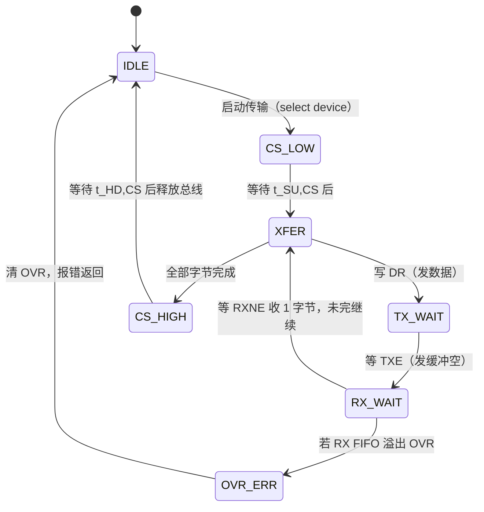

---

## 十三、常见外设实战（深化）

### 13.1 SPI Flash（W25Q 系列，见 12.4 代码）

要点回顾：写保护/写使能时序、状态寄存器 BUSY 位、扇区擦除（先擦后写）。工程上建议把 Flash 操作封装为 `flash_read/write/erase` 语义接口，并在上层加磨损均衡或简单文件系统（如 LittleFS、SPIFFS）以管理坏块与寿命。W25Q 支持 Dual/Quad 命令（如 0x3B/0x6B/0xEB 快读），在 STM32 的 QUADSPI/OCTOSPI 外设或支持 Quad 的 SPI 模式下可大幅提升读吞吐；但 Quad 模式需要器件进入 QPI 模式（发 0x38 使能），且需要 4 根数据线均连接，PCB 上要处理 4 线等长。

### 13.2 SPI LCD / OLED（ILI9341 / ST7789，见 12.5 代码）

ST7789 常配 240×240 或 240×320 圆屏/方屏，SPI 接口支持 9 位/16 位数据格式（命令 8 位、参数 8 位、像素 16 位 RGB565）。刷屏时：先发"设置列地址/页地址/写显存"命令序列，再 D/C=1 连续推像素。像素 buffer 通常 16 位宽，DMA 搬运时要保证内存半字对齐。OLED（SSD1306）则是单色，按页（page）写入，命令/数据同样靠 D/C 区分。

### 13.3 SPI ADC / DAC（ADS1256、MCP3208、ADS8688）

- **MCP3208**：8 通道 12 位 SAR ADC。SPI 模式下主发控制/配置字节（含通道选择、单端/差分、MSB/LSB 顺序），随后读回 12 位结果（常用 Mode 0/1，取决于配置位）。数据格式为"前导 0 + 12 位"，需按 datasheet 移位拼装。注意它的采样需要主在合适时刻发时钟，且转换由 CS 下降沿触发采样保持。
- **ADS1256**：高精度 24 位 Σ-Δ ADC。SPI 配置寄存器（增益、数据速率、通道），发起单次/连续转换后通过 **DRDY 引脚**通知，主再用 SPI 读 24 位数据。常用 Mode 1（CPOL=0, CPHA=1）。它的时序对 CS 维持、SCLK 频率（≤ f_CLK/4，ADS1256 主时钟常 7.68 MHz，SCLK 上限约 1.92 MHz 或更高依配置）要求严格。注意读数据寄存器（RDATAC 连续读）时 CS 必须保持低，否则会中止连续读模式。
- **ADS8688**：8 通道 16 位 SAR ADC，带内部基准与可编程输入范围（±10.24 V 等）。SPI 读取转换结果，支持多种输入范围；通过寄存器配置通道、范围、序列。

ADC 应用里，常把 **DRDY/INT 引脚 + SPI 读** 配合，避免盲等：主在 DRDY 下降沿中断里发起 SPI 读，既省 CPU 又保证数据新鲜。这正呼应"SPI 从不能主动推，需边带中断"的本质。

### 13.4 SPI 传感器（MPU9250 / ICM20948）

MPU9250（3 轴陀螺 + 3 轴加速度 + 3 轴磁力计）与 ICM20948 都是经典 9 轴 IMU。SPI 模式下寄存器读需先发寄存器地址（最高位为 1 表示读，0 表示写），再 dummy 读数据；数据量分多字节（如加速度 X/Y/Z 各 2 字节），需连续读且 CS 保持低。支持最高 SPI 速率（MPU9250 最高约 20 MHz）与 Mode 0/3。注意 ICM20948 寄存器地址最高位含义与 MPU9250 一致（读=1，写=0）。

### 13.5 SD 卡：SPI 模式 vs SDIO 模式

SD 卡两种主机接口：

- **SDIO 模式（4 位数据线）**：速度快，是主流；需要 MCU 有 SDIO 外设（如 STM32 SDIO/SDMMC）。
- **SPI 模式**：只用 CS、SCK、MOSI、MISO 四线，向后兼容，任何有 SPI 的 MCU 都能用，但速度慢很多（受 SPI 时钟与协议开销约束，典型几 MB/s）。

SPI 模式初始化命令序列（简化）：

1. 上电后至少延时 74 个时钟（CS 高）让卡同步；
2. 发 CMD0（0x40）带正确 CRC，使卡进入 Idle（SPI 模式）；
3. 发 CMD8 查询电压；发 ACMD41 循环直到卡退出 Idle（就绪）；
4. 发 CMD58 读 OCR（可选）；
5. 之后用 CMD17/CMD24 读/写单块，CMD18/CMD25 读/写多块。

SD 卡 SPI 模式初始化阶段（≤400 kHz）需校验 CRC（CMD0/CMD8），之后的数据块可用简单 CRC 或关闭。就绪后可提升 SCK 至数 MHz。

### 13.6 外设驱动的通用调试方法论

面对任何陌生 SPI 外设，建议按如下"由简到繁"顺序打通，能极大降低排错成本：

1. **先确认物理层**：万用表/示波器确认 VCC、GND 接好，电平匹配，CS 默认未被拉死，MISO 在未被选中时确实高阻；
2. **用最低速率跑"读 ID"**：几乎每个 SPI 器件都有 ID/WHO_AM_I（Flash 0x9F、IMU WHO_AM_I、ADC 只读寄存器）。降频到 100~400 kHz，发读 ID 命令，能读回正确 ID 就说明 CPOL/CPHA/位序/CS 时序全对——排除 80% 问题；
3. **读一个已知值的只读寄存器**：验证回读解析正确；
4. **再测写+回读**：写使能后写一个可写寄存器再读回，验证写路径；
5. **最后上高速/DMA/中断**：基础打通后再提速、加 DMA，逐步逼近目标工况；
6. **用逻辑分析仪看波形**：抓 SCK/MOSI/MISO/CS 四路，对照 datasheet 时序图逐边沿核对，是定位"时好时坏"的终极手段。

核心思想：**把"协议层正确"和"性能层（速率/DMA）"解耦**。很多人一上来就开 DMA 跑满速，出错后分不清是模式配错还是缓存问题，反而更难定位。先最低速轮询打通，再叠加性能优化，是嵌入式外设调试的黄金路径。

---

## 十四、软件抽象与驱动设计

### 14.1 把 SPI 抽象成 register read/write 接口

好的驱动不暴露"拉 CS、发字节"细节，而是提供 `read_reg()` / `write_reg()`，把器件协议（命令字节、地址、dummy）封装起来。例如：

```c
typedef struct {
    void (*cs_low)(void);
    void (*cs_high)(void);
    uint8_t (*xfer)(uint8_t);   /* 单字节写即读 */
    uint8_t mode;               /* CPOL/CPHA */
    uint32_t max_hz;
} spi_device_t;

uint8_t dev_read_reg(spi_device_t *dev, uint8_t reg)
{
    dev->cs_low();
    dev->xfer(reg | 0x80);          /* 读命令（示例：最高位置1） */
    uint8_t v = dev->xfer(0x00);    /* dummy 读数据 */
    dev->cs_high();
    return v;
}

void dev_write_reg(spi_device_t *dev, uint8_t reg, uint8_t val)
{
    dev->cs_low();
    dev->xfer(reg & 0x7F);          /* 写命令 */
    dev->xfer(val);
    dev->cs_high();
}
```

### 14.2 设备配置表与回调

多个器件挂同一总线时，可用配置表描述每个器件的模式、速率、CS 引脚、位序，启动时注册。传输前根据目标器件配置 SPI 外设（切模式、切波特率），传输后恢复。注意**模式切换开销**：每次切换要重新写 SPI 控制寄存器且可能需短暂禁止/使能，高频切换会拖慢总线。若同总线器件模式差异大，可考虑把"慢且模式特殊"的器件分到另一条 SPI 总线（如 STM32 有多路 SPI1/2/3，S32K 有 LPSPI0/1/2）。

### 14.3 支持多器件同总线的注意点

- 同一时刻只选中一个 CS；
- 切换器件前确认目标器件的 CPOL/CPHA/速率，必要时重配 SPI（调用 `SPI_ApplyConfig`）；
- MISO 多从机共享时，未选中的从机必须高阻其 MISO，否则会拉坏总线（器件硬件保证，选型时注意）；
- 留意 CS 间的最小间隔，避免前一个器件锁存未完成就开始下一个；
- 总线访问必须串行化（见 14.4）。

### 14.4 中断上下文与可重入设计

当 SPI 驱动同时被主循环和中断调用（例如定时器中断里读 ADC、主循环里写 Flash），要防止两者交错破坏同一条总线的原子性。典型做法：

- **总线锁（bus lock）**：进入一次完整传输（CS 拉低到拉高）前获取互斥锁/关中断，传输完释放；中断里若要发起 SPI，要么用独立的 SPI 总线，要么排队到主循环处理；
- **传输队列**：把"读寄存器""写寄存器"封装成请求结构体，投入队列，由唯一的总线任务（或 DMA 完成回调）串行消费，从架构上杜绝并发冲突；
- **不要在中断里做长耗时操作**：SPI 轮询等待 BUSY 的循环不应放在高优先级中断里长时间阻塞；优先用 DMA + 完成中断异步处理。

良好 SPI 驱动应做到：**总线访问串行化、CS 边界由驱动统一管控、上层只调用语义化接口**。这样既能支持多器件共总线，又能在多任务/中断环境下安全运行。

---

## 十五、C. MCAL 配置说明：AUTOSAR Spi 模块

> 这一节面向使用 AUTOSAR 栈的车规/工业项目，讲解 **Spi 模块**（MCU 驱动层之下的 SPI 驱动）的配置模型。AUTOSAR 把 SPI 驱动抽象为一组"静态配置 + 动态调用"的接口，使应用无需关心底层 MCU 差异。下面以 Classic Platform 的 Spi 模块（SWS_SPI）为核心，结合 EB tresos / DaVinci Configurator 的配置项说明，并给出"配置 → 代码生成 → 调用"的完整路径。

### 15.1 AUTOSAR Spi 模块的核心概念

AUTOSAR Spi 用四个层级对象描述一次传输：

- **SpiChannel（通道）**：描述一次传输中"一个从机的一段连续数据"的属性——数据宽度（如 8/16 位）、波特率、CPOL、CPHA、移位方向（MSB/LSB）、CS 极性、片选关联。一个 Job 可由多个 Channel 串联组成一条数据链。
- **SpiJob（作业）**：绑定到**一个具体的 SPI 外设（HW Unit）**与**一个片选（CS/NSS）**，包含一个有序的 Channel 序列。Job 规定了"用哪个外设、选哪个从机、按什么顺序发哪些 Channel"。
- **SpiSequence（序列）**：由一个或多个 Job 组成，是**一次原子传输请求**（异步/同步提交的最小单元）。Sequence 内的 Job 顺序执行；整个 Sequence 完成才触发 Notification。
- **SpiExternalDevice（外部设备）**：描述从机物理参数——支持的 SPI 模式（CPOL/CPHA 组合）、波特率、片选极性、片选建立/保持时间（Lead/Trail delay）、数据移位方向、CS 空闲电平。Job 通过片选引用一个 ExternalDevice。

关系：**SpiChannel ⊂ SpiJob ⊂ SpiSequence**，ExternalDevice 由 Job 引用。应用调用 `Spi_AsyncTransmit(SequenceId)` 提交一个 Sequence，驱动按 Job→Channel 顺序，用 Channel 里的参数（或 Job 关联的 ExternalDevice 参数）配置硬件并完成传输。

### 15.2 异步 vs 同步传输

- **异步 `Spi_AsyncTransmit(Spi_SequenceType)`:** 立即返回，传输在后台（中断/DMA）进行；完成（或每个 Job 完成）通过 **Notification**（回调函数，在配置里指定）通知应用。适合大数据、非阻塞、刷屏、连续采样。
- **同步 `Spi_SyncTransmit(Spi_SequenceType)`:** 阻塞直到整个 Sequence 传输完成才返回。内部通常用轮询 TXE/RXNE 实现。适合初始化、低频小数据、对时序确定性要求高的场景。
- **`Spi_GetStatus()` / `Spi_GetJobResult()` / `Spi_GetSequenceResult()`**: 用于查询传输结果（SPI_OK / SPI_PENDING / SPI_FAILED 等）。

### 15.3 EB tresos / DaVinci 配置项清单（表格）

下表列出典型配置工具中的关键配置项，及其与底层硬件位域的映射：

| 配置项（容器/参数） | 含义 | 对应硬件/寄存器 | 取值示例 |
|------|------|----------------|----------|
| `SpiMaxChannel` / `SpiMaxJob` / `SpiMaxSequence` | 静态配置的通道/作业/序列数量上限 | 编译期数组大小 | 8 / 8 / 4 |
| `SpiChannel<ch>.SpiChannelType` | 通道数据宽度 | CR1.DFF / LPSPI TCR.FRAMESZ | 8 / 16 位 |
| `SpiChannel<ch>.SpiDataShiftEdge` | 采样边沿（CPHA） | CR1.CPHA | LEADING / TRAILING |
| `SpiChannel<ch>.SpiShiftClockIdleLevel` | 空闲电平（CPOL） | CR1.CPOL | HIGH / LOW |
| `SpiChannel<ch>.SpiBitOrder` | 位序 | CR1.LSBFIRST / TCR.LSBF | MSB / LSB |
| `SpiChannel<ch>.SpiBaudrate` | 目标波特率 | BR[2:0] / PRESCALE×SCKDIV | 1000000 (1 MHz) |
| `SpiJob<job>.SpiHwUnit` | 绑定 SPI 外设 | SPI1 / LPSPI0 | SPI1 |
| `SpiJob<job>.SpiCsIdentifier` | 片选 GPIO/NSS | GPIO / PCS | CS_FLASH |
| `SpiJob<job>.SpiExternalDevice` | 引用外部设备 | — | ExtDev_Flash |
| `SpiExternalDevice<dev>.SpiDeviceMode` | 从机支持模式 | CPOL+CPHA | MODE_0 / MODE_3 |
| `SpiExternalDevice<dev>.SpiCsLeadDelay` | CS 建立时间 | t_SU,CS | 1 µs |
| `SpiExternalDevice<dev>.SpiCsTrailDelay` | CS 保持时间 | t_HD,CS | 1 µs |
| `SpiExternalDevice<dev>.SpiCsIdlePolarity` | CS 空闲极性 | 电平 | LOW（active-low） |
| `SpiSequence<seq>.SpiJobAssignment` | 序列内的 Job 列表 | — | Job0, Job1 |
| `SpiSequence<seq>.SpiNotification` | 完成回调 | Notification 函数 | Spi_FlashDone |
| `SpiGeneral.SpiInterruptible` | 序列可否被高优先级打断 | 硬件队列 | TRUE / FALSE |
| `SpiGeneral.SpiDmaSupported` | 是否使用 DMA | DMA_TX/DMA_RX | TRUE |

> 注意：不同工具（EB tresos 的 `Spi` 模块、Vector DaVinci 的 `Spi` 配置）界面文案略有差异，但核心对象（Channel/Job/Sequence/ExternalDevice）与参数语义一致，符合 AUTOSAR SWS_SPI 规范。

### 15.4 配置 → 代码生成 → 调用路径

典型 AUTOSAR 工程的 SPI 数据流：

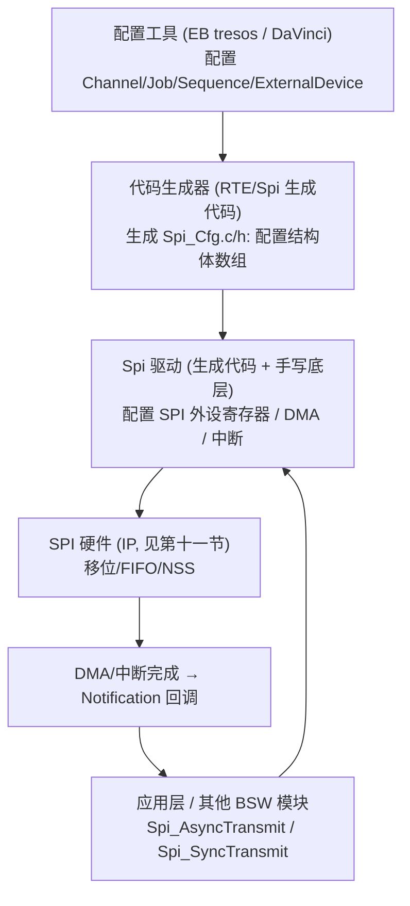

**具体调用路径示例：**

1. 在 tresos/DaVinci 中新建 `SpiExternalDevice` = `ExtDev_Flash`（Mode 3、1 MHz、CS 低有效、Lead/Trail 各 1 µs），新建 `SpiChannel` = `Ch_Flash_Cmd`（8 位、Mode 3、MSB），新建 `SpiJob` = `Job_Flash_ReadID`（HwUnit=SPI1，CsIdentifier=CS_FLASH，引用 ExtDev_Flash，Channel 列表=[Ch_Flash_Cmd]），新建 `SpiSequence` = `Seq_Flash_ReadID`（Job=[Job_Flash_ReadID]，Notification=`Spi_ReadIdDone`）。
2. 生成代码后，得到 `SpiConfig` 结构体（含 `SpiChannelConfig`、`SpiJobConfig`、`SpiSequenceConfig` 数组）与 `Spi_AsyncTransmit()` 等 API。
3. 应用层准备发送/接收 buffer，调用：

```c
/* AUTOSAR Spi 调用示例（语义化，具体 API 名依版本） */
uint8_t tx_buf[4] = {0x9F, 0x00, 0x00, 0x00};
uint8_t rx_buf[4];

Spi_SetupEB(0, tx_buf, rx_buf, 4);     /* 配置 Sequence 0 的缓冲(写 IB 或指 EB) */
Std_ReturnType r = Spi_AsyncTransmit(0); /* 提交 Sequence 0，异步返回 */
if (r == E_OK) {
    /* 传输在后台进行；完成触发 Spi_ReadIdDone() 通知 */
}

/* 同步版本（阻塞直到完成）： */
Spi_SyncTransmit(0);
/* 此时 rx_buf 已包含 JEDEC ID */
```

4. 驱动内部：`Spi_AsyncTransmit` → 按 Sequence 的 Job 列表，逐个 Job 用其 ExternalDevice 参数配置 SPI 硬件（写 CR1 的 CPOL/CPHA、BR，拉对应 CS）→ 通过中断或 DMA 把 Channel 数据搬完 → Job 完成 → 下一个 Job → 全部 Sequence 完成 → 调用 `Spi_ReadIdDone()` Notification。

### 15.5 与外设（Flash / LCD / ADC）配置映射

| 外设 | 推荐 SpiChannel 参数 | SpiExternalDevice 参数 | 传输方式 | 备注 |
|------|----------------------|------------------------|----------|------|
| W25Q Flash | 8 位、Mode 0 或 3（依命令）、MSB | Mode3、1–50 MHz、CS 低有效、Lead/Trail 1–5 µs | 异步 + DMA（读大块） | 写前 WREN、轮询 BUSY |
| ST7789 LCD | 8 位、Mode 0、MSB | Mode0、10–40 MHz、CS 低有效 | 异步 + DMA（刷屏） | D/C 线单独 GPIO，命令/数据分开 Job |
| MCP3208 ADC | 8 位、Mode 0、MSB | Mode0、≤1.6 MHz、CS 低有效 | 同步或异步 | CS 下降沿触发采样 |
| ADS1256 ADC | 8 位、Mode 1、MSB | Mode1、≤1.9 MHz、CS 低有效 | 异步 + DRDY 中断 | 配寄存器后等 DRDY 再读 24 位 |
| MPU9250 IMU | 8 位、Mode 0/3、MSB | Mode3、≤10 MHz、CS 低有效 | 异步 | 多字节读连续，CS 保持低 |

> 映射原则：**CS 不同的从机必须用不同的 Job（或不同的 ExternalDevice）**；同一 Job 内不允许切换 CS；若需在单 Sequence 内访问多个从机，用多个 Job（每个 Job 一个 CS）串联。LCD 的 D/C 线不属于 SPI 片选，仍按普通 GPIO 在 Job 前后由驱动/应用用回调切换，或拆成"命令 Job（D/C=0）"+"数据 Job（D/C=1）"两个 Job，用 Notification 或 Sequence 串联自动切换——这正是 AUTOSAR 把传输拆成 Job/Channel 的工程价值。

### 15.6 MCAL 调试要点

- **配置与硬件不一致**：EB/DaVinci 里 Baudrate 超出 MCU 分频能力，生成代码会被钳位或报错；Lead/Trail delay 配太小会丢失首/末字节。务必把 ExternalDevice 的 CPOL/CPHA 与从机 datasheet 严格对齐。
- **Sequence 重入**：`Spi_AsyncTransmit` 后未等完成（PENDING）就再次提交同一 Sequence，会返回 `SPI_BUSY`；应用应等 Notification 或查 `Spi_GetSequenceResult`。
- **Notification 未注册**：若配了 Notification 但回调函数为空，完成后无任何通知，应用会"永远等待"——须确认生成代码里回调已绑定。
- **DMA 与 Cache**：AUTOSAR 多运行在带 Cache 的芯片（如 S32K3、AURIX、Cortex-A），使用 EB 的 `SpiDmaSupported=TRUE` 时，buffer 必须位于 non-cacheable 内存或驱动内做好 Cache 处理（同第九节），否则偶发错字节。

---

## 十六、常见坑与调试

1. **CPOL/CPHA 模式不匹配**：主从采样边沿错位，整帧数据错乱。调试：逻辑分析仪抓 SCK/MOSI，对照 datasheet 时序图确认空闲电平与采样边沿，逐一核对四种模式。
2. **CS 时序不对（建立/保持不足或中途跳变）**：片选拉低后数据未稳就被采样，或一笔传输被拆成两笔。调试：看 CS 相对 SCK 的建立保持时间；确认一笔传输期间 CS 不被中断释放；用 GPIO 软件控 CS 时注意插入足够延时（见 12.3）。
3. **时钟太快超出从设备上限 / 线长导致建立保持违例**：SCK 频率太高，从设备来不及响应，或长线使波形畸变。调试：降频验证，缩短走线、加源端匹配；注意 CS 与 SCK 的 skew。
4. **位序（MSB/LSB）配置反了**：字节内位序翻转，读出的寄存器值像"镜像"（如 0x0C 变 0x30）。调试：抓 MOSI 首位，确认与 datasheet 一致。
5. **MISO 浮空 / 上拉问题**：从设备未选中时若 MISO 不三态，会干扰总线；或从设备驱动弱、线上浮空被干扰。调试：确认未选中从机高阻 MISO；必要时加弱上拉，远离高频/大电流走线。
6. **DMA 缓存不一致**：带 Cache 的 MCU 上，DMA 与 CPU 看到的内存副本不一致，偶发错字节。调试：TX 前 Clean、RX 后 Invalidate，或把 buffer 区设为 non-cacheable（见 9.4）。
7. **忘了写使能 / BUSY 未就绪（Flash）**：写命令被忽略或写入中又发起操作。调试：写前发 0x06，写后等 BUSY 清（见 12.4）。
8. **读操作没发 dummy / 多字节 CS 提前释放**：收不到数据或帧被打断。调试：确认"写即读"和 CS 全程保持低（见 5.5、6.3）。
9. **NSS 配置错误（硬件/软件混淆）**：主模式用了硬件 NSS 却没接外部脚，或软件模式忘了置 SSI，导致 MODF（模式故障）报错。调试：主模式软件控 CS 时务必 `SSM=1, SSI=1`（见 11.1、12.1）。
10. **中断里长阻塞轮询**：高优先级中断里忙等 SPI 完成，拖累系统实时性。调试：改用 DMA + 完成中断，或把 SPI 操作移出中断（见 14.4）。

调试利器首推**逻辑分析仪**（Saleae 一类），同时抓 SCK/MOSI/MISO/CS 四路，直接看波形与建立保持；高端示波器可看眼图与抖动。软件层面先降频、用最小指令（读 ID）打通，再逐步加复杂度。

### 16.1 用逻辑分析仪定位问题的具体手法

把逻辑分析仪四通道分别接 SCK/MOSI/MISO/CS，设置触发条件为"CS 下降沿触发"，即可完整捕获一次传输的全部波形。重点看三件事：

1. **CS 是否真的拉低、拉低后是否等到足够长才来第一个 SCK**：若第一个时钟紧贴 CS 下降沿，而器件要求 t_SU,CS 较长，则首字节易错；
2. **SCK 空闲电平与采样边沿**：对照 datasheet，确认空闲是高是低、数据在哪一个边沿被采样（逻辑分析仪可叠加协议解码，直接显示每字节值，方便比对预期）；
3. **MOSI/MISO 的实际位序与字节值**：把抓到的 MOSI 按位展开，确认最高位先发，并与代码发出的命令字节一致；若 MISO 全程为 0xFF，基本可锁定为"从机没被选中 / MISO 浮空 / 模式不匹配"三类问题之一。

实战中，很多"偶发错"的元凶是**电源噪声导致从机采样抖动**或**长线反射使 SCK 出现毛刺**。此时示波器比逻辑分析仪更管用：用示波器看 SCK 的边沿是否干净、是否有过冲/振铃、MISO 在采样点附近是否平稳。确认是信号质量问题后，再回到 PCB 层面做终端匹配或缩短走线，而不是在软件里盲目降速掩盖问题。

### 16.2 Flash 写操作状态机（调试参考）

为帮助理解"擦除→编程→等待 BUSY"的时序约束，下面给出 W25Q 写流程状态机，可作为驱动实现的参考模型：

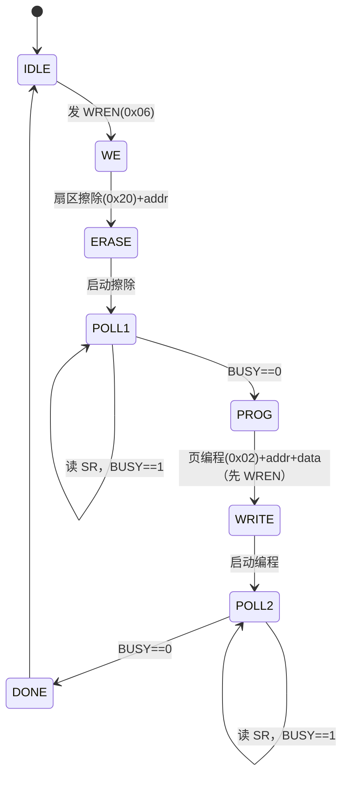

---

## 十七、面试题精选（含参考答案要点）

1. **SPI 是全双工还是半双工？**
   答：标准四线 SPI 是**全双工**（MOSI、MISO 同时工作）；三线 SPI 是半双工变种。

2. **SPI 有几根线，各干什么？**
   答：SCK（时钟）、MOSI（主出从入）、MISO（主入从出）、CS/SS（片选选通）。

3. **为什么 SPI 帧里通常没有地址字段？**
   答：靠 CS 选设备而非地址寻址，每个从机一根 CS，拉低谁就跟谁通信。

4. **SPI 的四种模式由什么决定？**
   答：CPOL（空闲电平）+ CPHA（采样在第几个边沿）；组合出 Mode 0~3。

5. **Mode 0 和 Mode 3 的区别是什么？**
   答：Mode 0：CPOL=0（空闲低）、CPHA=0（第一个边沿=上升沿采样）；Mode 3：CPOL=1（空闲高）、CPHA=1（第二个边沿=上升沿采样）。二者采样边沿都是上升沿，但空闲电平和数据切换边沿不同。部分器件二者可互换（建立窗口对称）。

6. **主从模式不匹配会怎样？**
   答：采样边沿错位，整帧数据错乱/错位/镜像。

7. **SPI 为什么"读"经常要先发一个 dummy 字节？**
   答：因为全双工写即读，主设备只有在产生 SCK 时才从 MISO 收到数据，发 dummy 只为产生时钟把从机数据挤出来。

8. **CS 在 SPI 中起什么作用？**
   答：界定一次原子传输边界：拉低选中开始，拉高锁存结束；多从机靠不同 CS 区分。

9. **为什么多字节传输时 CS 要保持低不能中途释放？**
   答：释放会让从机认为本次传输结束并锁存，下一波被当成新传输，帧被打断/拼接错误。

10. **为什么有时 SPI 读回全是 0xFF？**
    答：常见原因——MISO 浮空/未接好、从机没被 CS 选中、模式不匹配导致采样到空闲高、速率过快、从机未就绪。0xFF 表示 MISO 线上一直为高。

11. **SPI 与 I2C 最大区别是什么？**
    答：SPI 全双工、四线、靠 CS 选通、无标准地址/ACK、速度快；I2C 半双工、两线开漏、地址寻址、有 ACK/仲裁、速度较低。

12. **什么是菊花链（daisy chain）？**
    答：从机级联，前级 DO 接后级 DI，数据逐级移位传递，只需一根 CS，适合多片相同器件级联，但延迟大、不支持随机访问。

13. **MSB-first 和 LSB-first 反了会怎样？**
    答：字节内位序整体翻转（如 0x0C↔0x30），读取值"镜像"错乱。

14. **SPI 时钟太快会有什么问题？**
    答：超出从机 f_SCK(max)，或长线传播延迟破坏 t_SU/t_HD，导致采样错误。

15. **为什么 SPI 用 DMA 时接收也要开？**
    答：SPI 写即读，TX 必然产生 RX；若不开 RX DMA，RX FIFO 会溢出丢数。只读时也要开 TX DMA 发 dummy 产生时钟。

16. **带 Cache 的 MCU 上 SPI+DMA 为什么偶发错字节？**
    答：CPU 与 DMA 共享内存的缓存一致性问题：TX 前需 Clean，RX 后需 Invalidate，或把 buffer 设 non-cacheable。

17. **SPI Flash 写之前为什么要写使能（0x06）？**
    答：Flash 内部有写使能锁存，写/擦除前必须置位，否则命令被忽略；操作完自动清零。

18. **SPI Flash 为什么不能"直接覆盖写"？**
    答：NOR Flash 只能把位从 1 写 0，要改数据需先擦除（整块置 1）再编程；擦除以扇区为单位（4KB）。

19. **SD 卡 SPI 模式与 SDIO 模式怎么选？**
    答：SDIO 速度快需专用外设；SPI 模式兼容性好、任何有 SPI 的 MCU 都能用但慢，适合无 SDIO 或低速场景。

20. **如何根据 datasheet 确定器件用哪种 SPI 模式？**
    答：看时序图的 SCK 空闲电平定 CPOL，看采样边沿（t_SU/t_HD 标注的采样点）定 CPHA，二者组合即模式；注意文字描述"上升沿采样、空闲高"= Mode 3。

21. **简述 SPI 控制器 IP 的主要模块（加分题）**
    答：APB/AHB 接口、寄存器组（CR/SR/DR）、移位寄存器、波特率分频器、CPOL/CPHA 控制、TX/RX FIFO、NSS 控制、DMA 请求、中断逻辑、引脚复用。详见第十一节。

22. **AUTOSAR Spi 的 Channel/Job/Sequence 三层分别是什么？**
    答：Channel 描述一段连续数据（宽度/速率/模式）；Job 绑定一个外设与一个片选，含有序 Channel 序列；Sequence 由一个或多个 Job 组成，是异步/同步提交的最小原子单元。

---

## 十八、参考与延伸阅读

- Motorola/Freescale **"SPI Block Guide"**（原 Motorola SPI 规范文档，理解 CPOL/CPHA 起源的权威资料）。
- 各器件官方 datasheet：Winbond **W25Q 系列 SPI Flash**（W25Q16/64/128JV 数据手册与指令集）、TI **ADS1256 / ADS8688**、Microchip **MCP3208**、ILITEK **ILI9341**、Sitronix **ST7789**、InvenSense **MPU9250 / ICM20948**、SD 协会 **SD Physical Layer Specification**（含 SPI 模式章节）。
- MCU 参考手册：ST **STM32 系列 SPI / QUADSPI / OCTOSPI、DMA 配合**、NXP **S32K 系列 SPI（LPSPI）与 DMA**、NXP **S32K3 参考手册（Cortex-M7 + Cache/MPU）**。
- AUTOSAR 规范：**AUTOSAR Classic Platform SWS_SPI**（Spi 模块技术规范）、**SWS_MCU / SWS_PORT**（与 Spi 协同）。
- 配置工具文档：EB tresos Studio **Spi 模块配置指南**、Vector **DaVinci Configurator SPI 配置**。
- 延伸主题：Quad/Octo SPI 高速 Flash 接口、SPI 与缓存一致性（Cortex-M7 D-Cache/MPU）、高速 SPI 的 PCB 等长与时序设计、SPI 安全（固件完整性校验、Secure Boot 通过 SPI Flash 加载）、SPI 在车规功能安全（ASIL）中的容错设计。

> 本文强调的工程要点归结为一句话：**SPI 不是"四根线背下来"就能用的总线，它是主从双方在 CPOL/CPHA/位序/CS 时序上的一组精确约定；任何一项对不上，通信就会错位。读懂 datasheet 时序图、用逻辑分析仪验证波形、在驱动里把模式与 CS 边界管严、从 IP 与 MCAL 视角审视总线，是写出健壮 SPI 驱动的四块基石。** 从 IP 内部架构（移位寄存器是心脏、FIFO 解耦速率、DMA/中断是外援）到寄存器级驱动，再到 AUTOSAR MCAL 的配置对象（Channel/Job/Sequence/ExternalDevice），层层抽象最终都服务于同一件事——让主从双方在同一个时钟节拍上，正确地交换每一位数据。
