# I²C 与 SMBus 深度详解：从开漏总线、芯片 IP 到 MCAL 配置的工业级技术全栈

> 本文面向嵌入式外设驱动工程师、芯片底层开发者与系统软件工程师，系统讲解 I²C（Inter-Integrated Circuit）总线与 SMBus（System Management Bus）系统管理总线的物理层原理、协议帧格式、多主仲裁机制、芯片控制器 IP 内部架构、可落地的驱动代码实现、AUTOSAR MCAL 配置，以及典型故障定位与恢复。全篇以"开漏 + 上拉 + 线与仲裁"这一核心思想贯穿，并在工业级深度上补齐了"芯片 IP 如何把协议变成硬件状态机""驱动代码如何写得既正确又健壮""车规/高可靠项目如何通过 MCAL 配置把 I²C 纳入标准化软件栈"这三条工程主线。力求在原理深度、硬件可制造性与软件可维护性之间取得平衡。

---

## 一、场景引入：卡死的总线与被"绑架"的 SDA

在某 BMS（Battery Management System，电池管理系统）项目的量产样机上，笔者的同事曾遇到一个极其典型的偶发故障：整块板卡在上电后，挂在 I²C 总线上的全部外设——NTC 温度传感器、电量计（fuel gauge）、电源管理芯片（PMIC）——统一失去响应。主控 MCU 的 I²C 外设控制器始终上报"总线忙（BUSY）"状态标志，软件无论怎样软件复位外设、重新初始化控制器，这个标志都清不掉。用示波器同时抓取 SCL 与 SDA 两根信号线，看到的波形令人绝望：SDA 被死死地拉在低电平，SCL 同样处于低电平，两条线均完全失去跳变。

这正是 I²C 开漏（Open-Drain）拓扑结构下最著名、也最让初学者抓狂的故障——**总线死锁（Bus Lockup）**，业内也常称之为"从设备绑架总线"或"总线挂死"。

其根因往往是这样的：某个从设备在通信中途（例如正在向主机回送 ACK 位、或在连续发送数据字节的中间）被意外复位、掉电、或者固件跑飞导致状态机卡死，没有把 SDA 数据线释放回高阻态。由于 I²C 的物理层是开漏结构，任何设备都只能主动把线拉低、不能主动拉高，因此一旦有从设备把 SDA 长时间拉低，其余所有设备即使想拉高也拉不动——总线就被这一个"耍赖"的节点彻底锁死。更糟糕的是，当 SDA 被拉低时，主机若再试图发送 START（需要在 SCL 高时让 SDA 由高变低，但 SDA 已经是低），协议状态机无法产生有效的起始条件，于是 BUSY 标志永远清不掉，整个总线进入不可逆的瘫痪。

恢复手段简单却非常经典，是每一位底层工程师必须掌握的"保命技能"：**主设备（或任意能够控制 GPIO 的控制器）完全绕开 I²C 协议状态机，直接在 SCL 引脚上用 GPIO 模拟输出 9 个（甚至更多）时钟脉冲**。每一个 SCL 下降/上升沿都会推动那个卡死的从设备状态机前进一位，使其把尚未发送完的剩余位逐个推到 SDA 上并最终释放。通常，从设备最多只会在 SDA 上"赖"住 8 个数据位加 1 个 ACK 位共 9 个周期（即一帧可能残留的位宽），因此 9 个额外时钟足以让它把残局走完、腾出 SDA。随后主机再补发一个 STOP 条件，把总线协议状态机复位到空闲态，总线即宣告复活。这一恢复手法在本文第八章第四节有完整、带注释的 C 实现。

理解 I²C 与 SMBus，笔者认为核心只有三件事，读者在后续所有章节中都应反复回扣这三点：

1. **开漏 + 上拉实现"线与仲裁"**：这是 I²C 能够多主共线、无需额外仲裁信号的物理根基。
2. **START/STOP 由"SCL 为高时的 SDA 跳变"唯一定义**：这是 I²C 在仅用两根线的情况下，区分"数据位"与"控制事件"的巧妙编码。
3. **在系统管理（BMS、电源）场景中，I²C 之上长出了更严苛的 SMBus**：电量计上报电压、电流、SOC（State of Charge，荷电状态）几乎都是 SMBus 协议的标配。

而本文新增的三条工业级主线，则是把前三点从"懂原理"推进到"能设计芯片、能写驱动、能配 MCAL"：

4. **芯片 IP 把协议固化成硬件状态机**：开漏驱动、输入滤波、波特率分频、仲裁、地址匹配、移位收发，都是可综合的数字逻辑。
5. **驱动代码必须在"正确"之外保证"健壮"**：超时检测、总线恢复、NACK 重试、重复起始，四件事缺一不可。
6. **车规/高可靠项目用 MCAL 把 I²C 纳入标准化软件栈**：配置项决定生成代码，生成代码决定运行时行为。

---

## 二、历史与起源：从飞利浦的"两线串行"到系统管理标准

### 2.1 I²C 的诞生

I²C 总线由荷兰飞利浦半导体（Philips Semiconductors，后独立为 NXP）在 1980 年代初期提出，最初的目的是**解决电视机、音响等消费电子产品内部，MCU 与大量外围芯片（调谐器、音频处理器、键盘控制器）之间连线过多的问题**。在那个年代，并行总线与独立控制线占据了大量 PCB 走线面积和连接器引脚，飞利浦的工程师希望用尽可能少的线（最终收敛为两根）把板内低速外设串起来。

I²C 的全称是 Inter-Integrated Circuit，业界常读作"eye-squared-cee"或"I-two-C"。它的设计哲学极具务实精神：

- **只用两根线**：一根时钟 SCL（Serial Clock），一根数据 SDA（Serial Data）。
- **多主多从（multi-master, multi-slave）**：总线上允许存在多个能够发起通信的主设备（master，规范新版本也称 controller），也允许挂载多个被动响应的从设备（slave，新版规范倾向称 target，但本文沿用经典术语以保持与手册一致）。
- **开漏 + 上拉**：用非常廉价的外部电阻实现电平逻辑与多主仲裁，无需三态门与方向控制。
- **地址寻址**：每个从设备有固定或可配置的总线地址，无需片选线（Chip Select）。

这种"少引脚、可扩展、低成本"的特性，使其迅速从电视走向几乎所有嵌入式板卡，成为板级低速外设（传感器、EEPROM、RTC、Codec、电源芯片、触摸屏控制器）事实上的互连标准。1992 年飞利浦发布了 1.0 规范，1998 年推出 2.0 规范加入了快速模式（400 kbit/s），2000 年加入高速模式（3.4 Mbit/s），2007 年补充超快模式（UFm，5 Mbit/s 单向）。需要说明的是，I²C 规范的知识产权现在归属于 NXP，但作为一种开放的工业事实标准，几乎没有哪家 MCU 厂商敢不支持它。

### 2.2 SMBus 的由来

SMBus（System Management Bus，系统管理总线）由 Intel 在 1994 年前后联合 Duracell、Energizer、Intel、Microsoft、Smart Battery System 联盟提出，初衷是**为笔记本电脑的"智能电池系统（Smart Battery System，SBS）"提供一套统一、可靠、可预期的通信协议**。SMBus 在设计上明确**以 I²C 为底层物理与电气基础**，但针对系统管理场景（电池、电源、温度监控）做了大量"收紧"与"补全"：

- 增加了**硬性超时**约束，防止某个设备拖死整条系统管理总线（系统管理总线往往关乎整机供电安全，不能容忍无限挂起）。
- 标准化了**命令协议（read byte / write byte / read word / write word / block read/write 等）**，让不同厂商的电池、充电器、温度传感器可以即插即用。
- 引入了 **PEC（Packet Error Check，CRC-8 包错误校验）**，显著提升在电气噪声环境下的可靠性。
- 定义了 **Alert 报警信号线（SMBALERT#）**，让从设备可以主动拉低向主机报告紧急事件，而非主机盲目轮询。

因此在工程实践中，我们常把两者关系概括为：**SMBus 是 I²C 的"严父"——底层一样，上层更严**。一个符合 SMBus 规范的设备通常可以在 I²C 控制器上通信（前提是 I²C 控制器支持时钟延展与必要的电平），但反过来，一个纯 I²C 设备未必满足 SMBus 的超时与协议约束。

---

## 三、物理层深度：开漏、上拉电阻与信号完整性

### 3.1 开漏（Open-Drain）与集电极开路

I²C 的两根线 SCL 与 SDA 在电气上均为**开漏（Open-Drain，CMOS 工艺）或集电极开路（Open-Collector，双极工艺）**结构。所谓开漏，是指输出级只有一个下拉的 NMOS 管（或 NPN 管），没有上拉的 PMOS 管。于是每个引脚有且仅有两种可控状态：

推挽（push-pull）与开漏的本质区别，决定了 I²C 为何"非开漏不可"。下面对比两种输出结构在二线总线上的行为：

```mermaid
graph LR
    subgraph PP["推挽输出（不可用于 I2C）"]
        A1[PMOS 上拉] --- N1[NMOS 下拉]
        N1 --- LINE1[总线]
        A1 --- LINE1
        NOTE1[两管互补：可强拉高也可强拉低]
    end
    subgraph OD["开漏输出（I2C 采用）"]
        A2[无上拉管] --- N2[NMOS 下拉]
        N2 --- LINE2[总线]
        RPU[外部上拉电阻] --- LINE2
        NOTE2[只能拉低或释放：靠上拉提供高]
    end
    PP -.冲突风险：一拉高另一拉低=短路大电流.-> X[× 总线损坏]
    OD -.线与：任意拉低则整线低.-> Y[√ 天然抗竞争]
```

为何 I²C 坚持开漏？如果用推挽，两个设备在同一时刻一个输出高、一个输出低，V<sub>DD</sub> 与 GND 之间会经两个导通管形成低阻通路，瞬间大电流既烧毁 IO 又破坏信号。开漏则从根本上杜绝这种"高低对冲"：既然谁都不能拉高，就不存在两强相争的短路。代价是需要外部上拉电阻来补上"拉高"的能力——这正是本节反复讨论上拉取值的原因。

- **输出低（逻辑 0）**：NMOS 导通，把引脚强行拉到 GND。
- **高阻释放（逻辑 1 / 隐性态）**：NMOS 截止，引脚对外呈现高阻抗，既不拉高也不拉低，**电平由外部上拉电阻决定**。

注意一个关键事实：**开漏结构永远无法主动输出"高电平"**。所谓逻辑 1，本质上是"我不拉低，让上拉电阻把我拉高"。这一设计带来两个直接后果：

1. 多个设备挂在同一条开漏线上时，只要任意一个设备拉低，整条线就是低；只有**全部**设备都释放（都为高阻），上拉电阻才能把线拉高。这便是**线与（Wired-AND，负逻辑）**特性，也是后文多主仲裁的物理基础。
2. 因为谁都拉不高，所以不可能出现"两个设备一个拉高一个拉低造成短路大电流"的推挽冲突，总线天然抗总线竞争损坏——这是开漏相对推挽（push-pull）总线最大的鲁棒性优势。

### 3.2 上拉电阻为什么必不可少

既然开漏设备不能拉高，逻辑 1 的电平必须由外部一个上拉电阻（pull-up resistor）连接到正电源（V<sub>DD</sub>）来提供。如果没有上拉电阻：

- SDA/SCL 在"释放"状态下将悬空（floating），电平不确定，极易受噪声误触发，总线完全无法可靠工作。

因此，**上拉电阻不是可选项，而是 I²C 物理层正常工作的必要元件**。它一端接 V<sub>DD</sub>（通常是 3.3 V 或 5 V，取决于器件供电电平），另一端接 SDA 或 SCL。在噪声较大的工业环境，还会在 SDA/SCL 靠近从机端并联小电容或串联电阻做简单滤波，但本质上仍以开漏+上拉为根基。

### 3.3 上拉电阻的取值：上升时间与功耗的折中

上拉电阻的阻值 R<sub>p</sub> 是 I²C 设计中最常被问到、也最容易被拍脑袋决定的参数。它本质上是在**信号上升速度**与**功耗 / 灌电流**之间做工程折中。

从信号完整性视角，SDA/SCL 线并非理想导线，而是带有分布**总线电容 C<sub>b</sub>**（包括引脚输入电容、PCB 走线电容、导线电容等，典型值在几十到几百 pF 量级，规范把单总线总电容上限限定为 400 pF）。当设备释放总线时，上拉电阻 R<sub>p</sub> 通过给 C<sub>b</sub> 充电来把线从低拉高，这是一个典型的 RC 一阶充电过程：

$$V(t) = V_{DD} \cdot (1 - e^{-t/(R_p \cdot C_b)})$$

信号从 0 上升到某一阈值（通常关心上升到 0.7 × V<sub>DD</sub> 的"有效高"所需时间）的上升时间 t<sub>r</sub> 近似为：

$$t_r \approx R_p \cdot C_b \cdot \ln\!\left(\frac{V_{DD}}{V_{DD} - V_{TH}}\right)$$

取 V<sub>TH</sub> ≈ 0.7·V<sub>DD</sub> 时，ln 项约为 ln(1/0.3) ≈ 1.20，于是**上升时间近似与 R<sub>p</sub>·C<sub>b</sub> 成正比**：

$$t_r \; \approx \; 1.2 \cdot R_p \cdot C_b$$

I²C 规范对每种速率模式都限定了最大允许上升时间（例如标准模式 1000 ns、快速模式 300 ns）。由此可得上拉电阻的**上限约束**：

$$R_p \le \frac{t_{r(max)}}{1.2 \cdot C_b}$$

- **R<sub>p</sub> 太大**：RC 时间常数大，上升沿过缓，在高速模式下波形会变成平缓的斜坡，接收端采样窗口内电平可能尚未越过阈值，导致采样错误、速率上不去、且上升沿缓慢的线更容易被噪声干扰、发生误触发。
- **R<sub>p</sub> 太小**：低电平时的灌电流 I<sub>sink</sub> = V<sub>DD</sub> / R<sub>p</sub> 变大，功耗升高，且可能超过器件 IO 引脚允许的最大灌电流规格（规范通常要求 3 mA 拉低能力，部分快速模式器件要求能吸收 6 mA 甚至 20 mA）。此外电阻自身功耗 P = V<sub>DD</sub>² / R<sub>p</sub> 也会增大。

因此存在**下限约束**：需满足总线所有器件中最小的拉低电流能力 I<sub>sink(min)</sub>：

$$R_p \ge \frac{V_{DD} - V_{OL}}{I_{sink(min)}}$$

其中 V<sub>OL</sub> 为器件保证的"低电平输出最大电压"（通常 0.4 V）。例如 V<sub>DD</sub>=3.3 V、要求 V<sub>OL</sub>≤0.4 V、I<sub>sink</sub>=3 mA，则 R<sub>p</sub> ≥ (3.3−0.4)/0.003 ≈ 967 Ω。

综合上下限，工程上常见取值为：**标准模式 100 kbit/s 用 4.7 kΩ 或 10 kΩ；快速模式 400 kbit/s 用 2.2 kΩ 或 1 kΩ 量级**。现代 SoC 常内置可调上拉，但外置精密电阻仍是高可靠设计（尤其是长走线、多器件、高速）的首选。

为直观参考，下表给出不同速率模式与总线电容组合下的典型上拉电阻区间（仅作设计起点，须以具体器件数据手册为准）：

| 速率模式 | 最大 t<sub>r</sub> | 总线电容 C<sub>b</sub> | 典型 R<sub>p</sub> 取值 | 备注 |
|----------|--------------------|------------------------|--------------------------|------|
| 标准模式 100 k | 1000 ns | 100 pF | 4.7 kΩ ~ 10 kΩ | 阻值可偏大以省功耗 |
| 快速模式 400 k | 300 ns | 100 pF | 2.2 kΩ ~ 4.7 kΩ | 阻值需收紧 |
| 快速+模式 1 M | ~120 ns | 100 pF | 1 kΩ ~ 2.2 kΩ | 低容总线优先 |
| 高速模式 3.4 M | ~120 ns | 100 pF | 主端需有源电流源上拉 | 靠电阻难以满足，需电流源辅助 |

> 实践建议：上拉电阻先按电容上限算上限、按灌电流算下限，取交集中间值；事后用示波器实测上升时间，留 30% 裕量。长走线、多器件、高温（电容与漏电变化）场景务必实测。若总线上挂有支持时钟延展的从机，还需确认主机控制器 SCL 也为开漏且会回读等待。

---

## 四、速率模式全览

I²C 规范随版本演进定义了若干速率模式，下表汇总其关键参数（注：实际器件往往只支持其中一部分，需查数据手册）：

| 模式 | 代号 | 比特率 | 最大 t<sub>r</sub> | 方向 | 主要用途 |
|------|------|--------|--------------------|------|----------|
| 标准模式 | Sm | 100 kbit/s | 1000 ns | 双向 | 通用低速外设 |
| 快速模式 | Fm | 400 kbit/s | 300 ns | 双向 | 较高速传感器、EEPROM |
| 快速模式 Plus | Fm+ | 1 Mbit/s | 120 ns | 双向 | 驱动能力更强（20 mA 灌电流） |
| 高速模式 | Hs | 3.4 Mbit/s | 120 ns | 双向 | 需主端电流源上拉、专用握手 |
| 超快模式 | UFm | 5 Mbit/s | — | **单向**（仅主→从） | 高速 LED 控制等 |

需要特别说明几点：

- **高速模式（Hs-mode）** 的启动非常特殊：通信必须先以 Fm 速率发送一个特殊的"Hs 主码"（0000 1XXX），从设备在收到后切换到高速接收；且 Hs 模式要求主设备在 SCL 上提供**有源电流源上拉**（而非纯电阻），否则 3.4 M 下的上升时间无法满足。多数 MCU 内置 I²C 仅支持到 Fm 或 Fm+，Hs 需专门的物理层。
- **超快模式（UFm）** 是纯单向广播式总线，去掉了 ACK 与双向能力，牺牲交互性换速率，适用于像 RGB LED 灯带控制器这类"主只管往下灌数据"的场景。
- 同一总线上可以混挂不同速率的器件，但**总线实际速率由最慢且已正确响应的器件决定**；高速通信前须确保所有从设备能跟上，否则需分总线隔离。

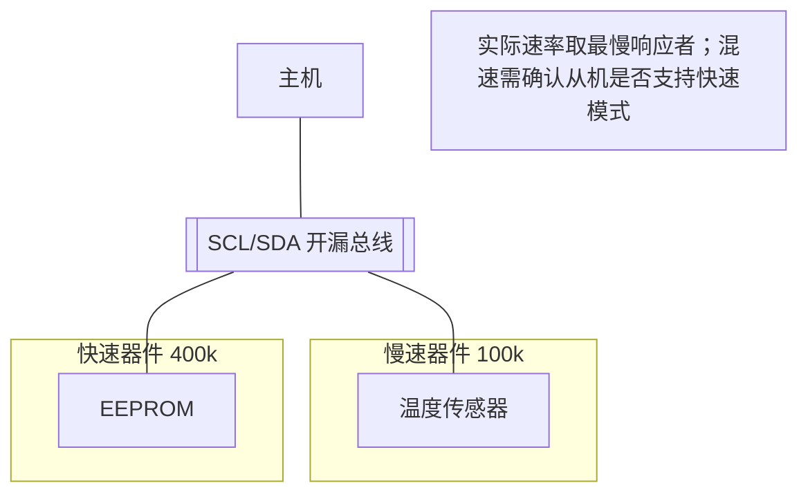

---

## 五、协议帧格式逐字段拆解

### 5.1 起止条件：用"违规跳变"定义控制事件

I²C 没有独立的片选线，也没有额外的"帧同步"信号，它靠**在 SCL 为高的窗口内，SDA 发生违反数据规则的跳变**来定义两个特殊控制事件：

- **START（起始条件）**：当 SCL 为高电平时，SDA 由高电平跳变到低电平。
- **STOP（停止条件）**：当 SCL 为高电平时，SDA 由低电平跳变到高电平。

为什么非得是"SCL 高时的跳变"？因为 I²C 规定：**正常的数据位（bit）只在 SCL 为低电平时由发送方改变，在 SCL 为高电平时保持稳定、由接收方采样**。也就是说，在 SCL=1 期间，SDA 本应保持不动以表示某一位的 0 或 1。只有"SCL=1 时 SDA 翻转"这种**违反数据位规则的边沿**，才能被所有设备唯一地识别为"起"或"停"的特殊事件，绝不会与某个数据位混淆。这一编码技巧是 I²C 仅凭两根线就能可靠分帧的精髓。

> **重复起始（Repeated START，记作 Sr）**：在通信进行中、不释放总线（不发 STOP）的情况下，再次产生一个 START 条件。它的电平波形与 START 完全相同（SCL 高时 SDA 高→低），只是出现在一次事务中间而非开头。Sr 的价值在于"保持总线占有"，防止其它主设备在"写寄存器指针"和"读数据"之间插入抢占总线。

### 5.2 地址字段：7 位与 10 位寻址

START 之后，主机立即发送**地址字节**，其结构为：

- **7 位地址模式**（最常用）：地址字节 = 7 位从机地址 + 1 位 R/W 方向位（0 = 主机写，1 = 主机读）。例如从机地址 0x2A，写操作发 `0x54`（0x2A<<1 | 0），读操作发 `0x55`（0x2A<<1 | 1）。
- **10 位地址模式**：地址分两字节发送。首字节高 5 位固定为 `11110`，接着 2 位地址高位 A9/A8，再接 R/W 位；第二字节发剩下的 8 位地址 A7~A0。10 位模式用于地址空间耗尽（如挂大量同类型传感器）的场景，但其兼容性复杂，实际产品中使用比例远低于 7 位。

**7 位地址空间**共 0~127（128 个）。其中：

- 0x00 为**通用呼叫（General Call）**地址，主机广播给所有从设备。
- 0x78~0x7F（即 1111 0xx / 1111 1xx）被保留用于 10 位地址寻址与未来扩展。
- 实际可自由分配的从机地址大约 112 个左右，部分地址还被常见器件"预定"（例如不少温传感固定 0x48~0x4F 由引脚选择）。

**地址冲突**是工程常态：两块同型号、地址不可改的传感器挂在同一总线会"打架"。解决手段包括：选择带 ADDR 引脚可配置的器件、用 I²C 多路复用器（如 TCA9548A）按通道隔离、或用 GPIO 控制电源分时上电。

### 5.3 ACK / NACK：每字节的"握手确认"

I²C 规定：**每传输一个字节（8 位）之后，接收方必须在第 9 个时钟周期把 SDA 拉低，作为 ACK（Acknowledge，应答）**；若接收方不拉低（SDA 保持高，由发送方释放、上拉拉高），则为 NACK（Not Acknowledge，非应答）。注意 ACK/NACK 的"低有效"特性正源于开漏+上拉：接收方想 ACK 就主动拉低，想 NACK 就释放（呈现高）。

几种典型 NACK 含义：

- **主机读最后一字节后回 NACK**：通知从机"我不要再读了"，随后主机发 STOP。这是正常流程，不是错误。
- **从机对地址字节回 NACK**：说明该地址无设备响应（设备不存在、未上电、地址错）。
- **从机对数据字节回 NACK**：从机寄存器不可写、忙、或内部错误。

发送方必须检测 ACK/NACK：收到 NACK 后通常应中止事务或重试，忽略 NACK 是许多隐性 Bug 的根源。

### 5.4 数据字段与地址自增

地址/数据之后是若干**数据字节**，每个 8 位，高位（MSB）先发。多数 I²C 存储器/寄存器型器件支持**寄存器地址自增**：连续写/读时，内部指针自动 +1，方便一次写入/读出一片连续区域（如 EEPROM 页写、传感器多轴数据连续读取）。但也有不自动自增的器件，需每字节重新指定子地址，开发时务必查手册。

### 5.5 完整事务示例（含重复起始的读）

读一个寄存器最标准的流程是"**先写寄存器指针，再读数据**"，且用重复起始保证原子性：

```
START | ADDR+W(0) | ACK | REG(8) | ACK | Sr | ADDR+R(1) | ACK | DATA(8) | NACK | STOP
```

下面用两张图分别展示"写事务"与"读事务（重复起始）"的时序交互：

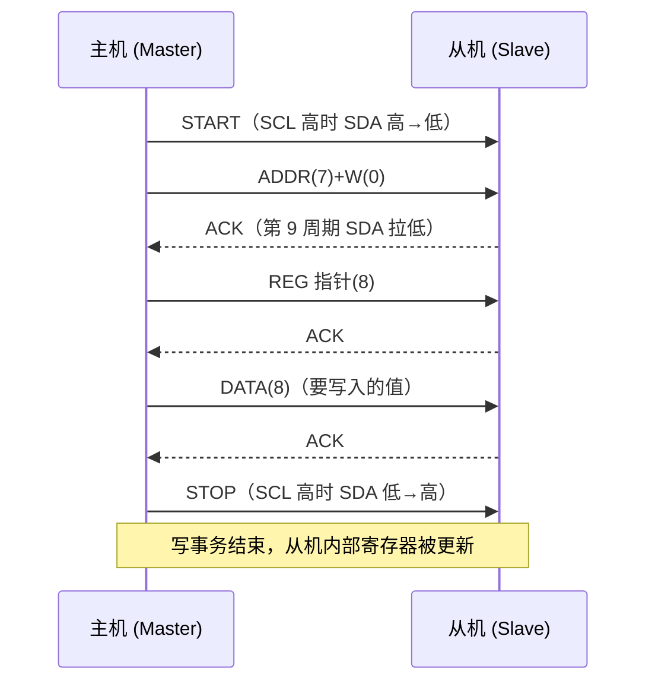

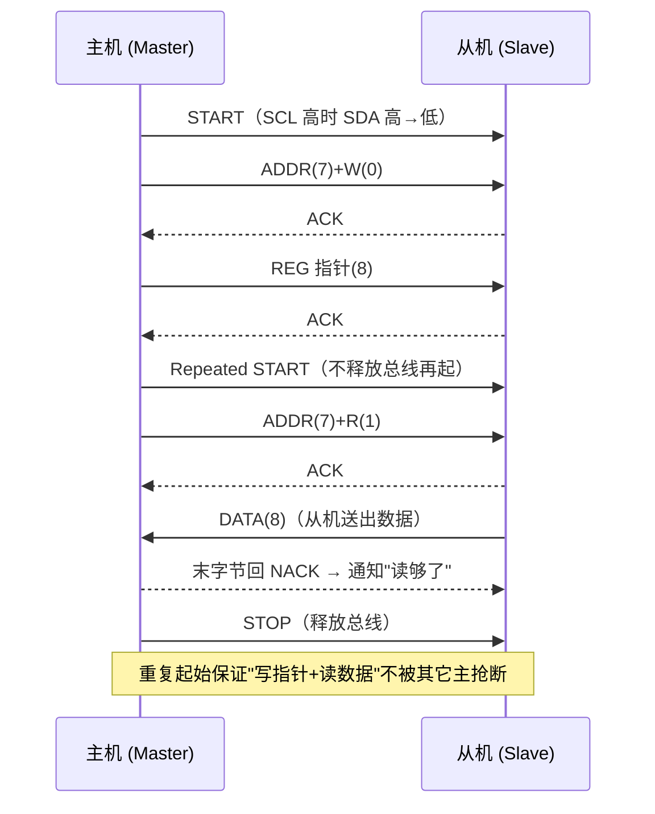

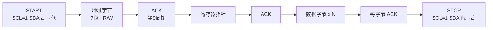

---

## 六、多主仲裁与时钟同步

### 6.1 线与仲裁：谁发 0 谁赢，输家静默退场

多主场景下，两个（或多个）主机可能同时认为总线空闲并尝试发起 START。I²C 没有中央仲裁器，而是靠**开漏线与 + 回读比较**实现完全分布式的仲裁：

1. 每个主机在 SCL 的每个时钟周期内，先按自己的数据驱动 SDA（发 0 则拉低，发 1 则释放）。
2. 在 SCL 为高（采样窗口）时，每个主机都**回读 SDA 总线电平**，并与自己本想发送的电平比较。
3. 若某主机想发 1（释放）却回读到 0（被别的主机拉低），它立即判定"仲裁失败"，**停止驱动 SDA 并在本次事务剩余部分退出发送（转为从模式或不参与）**，不会发出 STOP（以免误伤胜者的事务）。
4. 想发 0 的主机把线拉低，回读到 0，与预期一致，继续发送。

由于"线与"保证：只要有任何人发 0，总线就是 0；只有所有人都发 1 总线才为 1。**因此仲裁结果永远是"发送数据较小（更早出现 0 比特）的一方获胜"**，且整个过程数据不丢失、无破坏——这是 I²C 极其优雅的设计。

下图展示两主机仲裁的竞争过程：

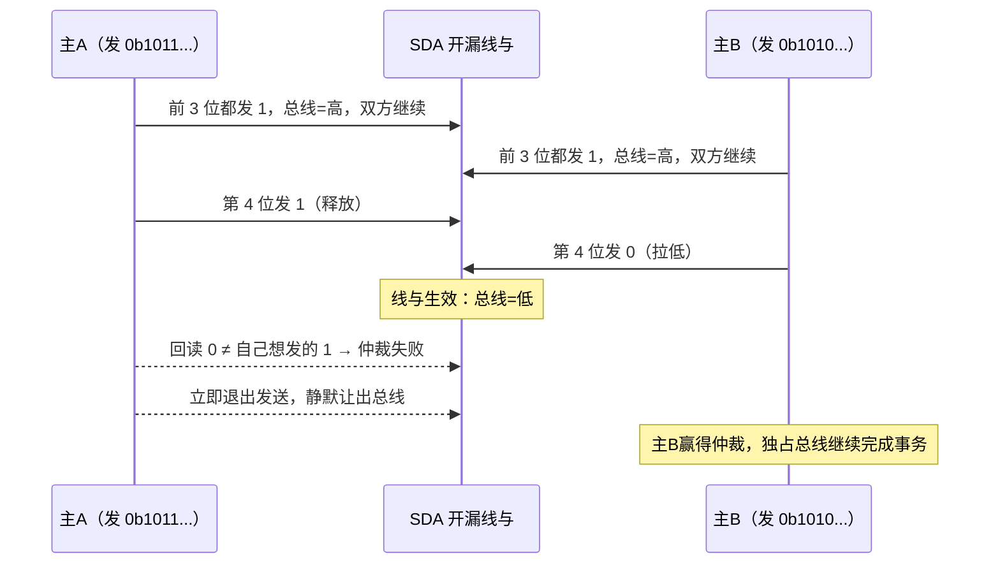

> 关键补充：仲裁不仅在地址阶段发生，而是贯穿**整个地址与数据阶段**。只要发送的位出现差异，必然有一方先遇到"想发 1 却读到 0"而失败。因此 I²C 仲裁能精确到字节内的比特，不会出现两个主同时成功写坏数据的情形。仲裁失败后，输家通常在硬件层面自动清除"主模式忙"标志并（若使能）产生仲裁丢失中断，软件应据此切回从模式或重试。

### 6.2 时钟同步与时钟延展

多主环境下，SCL 同样是开漏线与的。若两个主机以不同速率驱动 SCL，实际总线 SCL 的"低电平"由**拉低最久的主机**决定（线与），"高电平"由**释放最早的主机**决定。于是多主会自动同步到一个共同的最慢时钟——这叫**时钟同步（Clock Synchronization）**。

更关键的概念是**时钟延展（Clock Stretching）**：**从设备可以在应答之后、下一字节之前，主动把 SCL 拉低并保持，以告诉主机"我还没准备好下一批数据"**。主机在产生 SCL 高电平时必须先检测 SCL 是否真的被拉高——若从机一直拉低，主机必须等待，直到从机释放 SCL。

时钟延展的意义在于：低速从机（如 EEPROM 写周期、传感器内部 ADC 转换）无需在通信前缓存全部数据，可以"边处理边通信"，用拉低 SCL 的方式"踩刹车"。但代价是：**主机必须支持时钟延展（即 SCL 输出为开漏且会回读 SCL 电平等待）**，否则遇到会延展的从机就会死锁在"主机以为发了高、从机却拉低"的状态。

> 常见陷阱：许多 MCU 的硬件 I²C 在某些配置下 SCL 是推挽或不会等待延展，导致接上会延展的 EEPROM/传感器时偶发卡顿。务必在器件手册确认"目标从机是否需要时钟延展"以及"主机控制器是否支持"。在 AUTOSAR/MCAL 与 SMBus 场景里，时钟延展还会触及超时边界，详见第九章与第十一章。

---

## 七、芯片模块设计（IP 内部架构）

这一章是工业级深度相对原文章新增的核心之一：把"协议"还原成"硬件"。笔者的观点是，理解 I²C 控制器 IP 的内部结构，能让你在写驱动、配寄存器、定位异常时拥有"俯视芯片"的能力——你清楚每一个状态位背后是哪块组合/时序逻辑产生的。

### 7.1 I²C 控制器 IP 整体框图

一颗典型的 I²C 控制器（无论是 STM32 的 I²C 外设、NXP 的 LPI2C，还是自研 IP）在芯片内部的逻辑划分高度一致。下面给出通用示意框图：

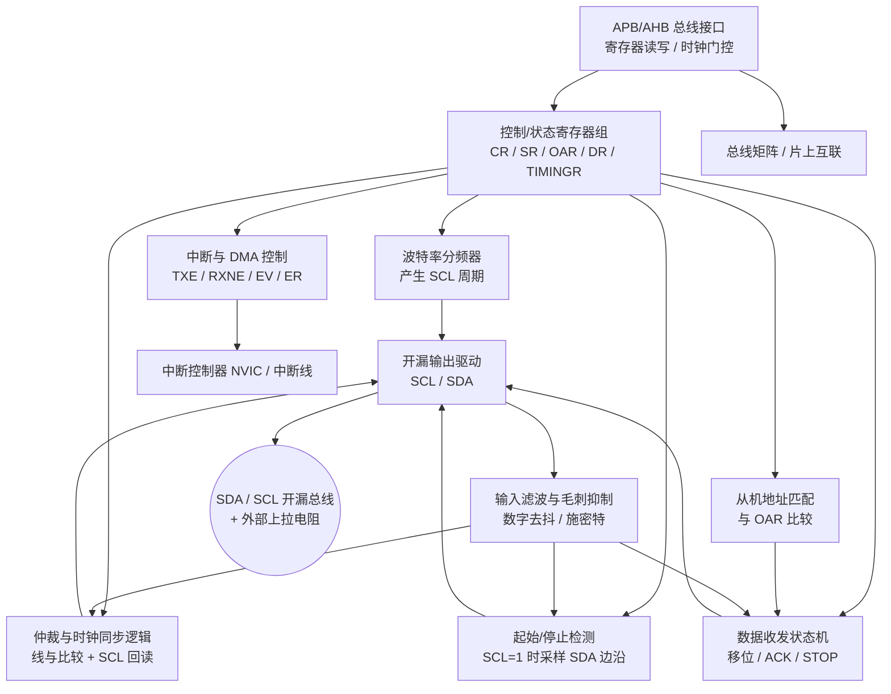

从框图可以看到，I²C 外设并非"一根线直连 MCU 内核"，而是经过**总线矩阵（Bus Matrix / Interconnect）**挂在内核与外设总线上，受**时钟（CLK）与复位（RST）域**控制，并经由**中断控制器**与 DMA 与内核协作。下面逐块拆解。

### 7.2 开漏输出驱动与输入滤波（毛刺抑制）

**开漏输出驱动**：I²C 的 SDA/SCL 引脚在芯片内部由"输出使能 + 下拉 NMOS"构成。控制器根据状态机需要，决定是把引脚拉低，还是释放（高阻）交给外部上拉。关键点在于——**SCL 同样必须是开漏**，否则多主时钟同步与时钟延展的"线与"无法成立。很多工程师误以为只有 SDA 要开漏，这是错的。

**输入滤波（毛刺抑制）**：芯片 IO 在采样 SDA/SCL 之前，通常会经过一级数字滤波（去抖 / 施密特触发 + 多位表决，或基于采样时钟的同步器）。其作用是：

- 抑制总线上的窄毛刺（如邻近大电流开关噪声引起的尖峰），避免被误判为 START/STOP 或错误数据位。
- 跨越"异步域"：SDA/SCL 是异步于 MCU 主时钟的外部信号，需先经两级触发器同步，避免亚稳态。
- 在快速模式下滤波窗口需更短，否则会吃掉有效边沿；部分 IP 允许通过配置寄存器调节滤波深度（如"模拟/数字噪声滤波"个数）。

### 7.3 波特率分频器（产生 SCL）

SCL 的时钟并不是直接用 MCU 主频，而是由**波特率分频器（Baud Rate Generator）**从外设时钟（如 APB1 clock）分频而来。现代 IP（如 STM32 的 TIMINGR、NXP 的 SCL 高/低电平寄存器）通常把一个 SCL 周期拆成若干段：

- 预分频（PRESC）：先对外设时钟做整数分频，得到"时序基准时钟"。
- SCL 高电平时间（SCLH）：高电平持续的基准周期数。
- SCL 低电平时间（SCLL）：低电平持续的基准周期数。
- 部分 IP 还细分"数据建立时间（t<sub>SU,DAT</sub>）""数据保持时间（t<sub>HD,DAT</sub>）""START/STOP 建立保持"，以满足不同速率模式的建立/保持时间规范。

以 100 kbit/s 为例：目标位周期 10 µs，若外设时钟 8 MHz、预分频后基准 1 MHz（1 µs/拍），则可配 SCLH=4、SCLL=4 得到约 8 µs 高低各半的周期（再叠加内部固定开销接近 10 µs）。**注意：配置值必须留足上拉电阻决定的实际上升时间，否则高电平"理论宽度"会被 RC 上升沿吃掉一部分**。这就是为什么硬件 I²C 偶发卡顿，往往是 TIMINGR 配置与板上 R<sub>p</sub>/C<sub>b</sub> 不匹配。

### 7.4 起始/停止检测

"START/STOP 检测"逻辑持续监控 SCL 与 SDA：当在 SCL=1 采样到 SDA 由高变低，置位"起始条件检测"标志；当采样到 SDA 由低变高，置位"停止条件检测"标志。这个逻辑**对所有设备（主、从）都工作**，因此从机也能靠它识别主机何时开始/结束一次事务。检测逻辑的输入来自前级的"输入滤波"，所以毛刺不会伪造出 START/STOP。

### 7.5 仲裁与时钟同步逻辑（线与）

这是多主能力的硬件核心。硬件在每个 SCL 高电平窗口回读 SDA：

- **仲裁比较器**：把"本主想驱动的电平"与"总线实际电平"比较，一旦发现"我想发 1 却读到 0"，立即置"仲裁丢失（ARLO）"标志、停驱动、退出发送。
- **时钟同步**：SCL 也是线与，硬件在拉高 SCL 后会回读 SCL 引脚——若被别的设备或从机拉低，则硬件自动把内部 SCL 保持为低，直到总线真正变高，从而实现时钟同步与时钟延展兼容。

这部分逻辑直接决定了"主机是否支持时钟延展"：如果 IP 的 SCL 输出是推挽、或拉高后不回读等待，那它就**不支持**延展，接会延展的从机必死锁。

### 7.6 从机地址匹配

当 IP 工作于从模式（或被动态监听）时，"地址匹配"逻辑把收到的 7/10 位地址与自身地址寄存器 OAR 比较。匹配成功则置"地址匹配（ADDR）"标志、产生中断，并从机进入数据收发。10 位地址需两次比较（首字节 11110 + 高位，再比第二字节）。通用呼叫（0x00）可通过 OAR 中的 GC 位使能。

### 7.7 数据收发状态机

这是 IP 的"大脑"，典型状态包括：

- IDLE（空闲，等待 START）
- START/Repeated START 生成
- ADDR 发送 + ACK 接收（主）/ ACK 发送（从）
- DATA 移位发送 / 接收 + 第 9 位 ACK 处理
- STOP 生成 / 检测

状态机驱动"移位寄存器（Shift Register）"逐位把 DR 中的数据推出到 SDA（MSB 先），并在第 9 个周期采样 ACK。发送空（TXE）、接收非空（RXNE）等状态标志即由此状态机产生，供软件或 DMA 查询/响应。

### 7.8 中断与 DMA

- **中断**：IP 通常把事件（EV：ADDR/STOPF/TXE/RXNE 等）与错误（ER：仲裁丢失 ARLO、应答失败 AF、过载 OVR、超时 TIMEOUT 等）分别或合并送到 NVIC。软件可在中断里推进状态机。
- **DMA**：为降低 CPU 占用，TXE/RXNE 可触发 DMA 请求，由 DMA 在外设与内存间搬运 DR。大数据块（如 EEPROM 页写、传感器多轴连续读）用 DMA 能显著降低中断频率。注意 DR 是 8 位宽，DMA 需按字节配置；带 FIFO 的 IP 则可按字配置。

### 7.9 寄存器位域（通用示意）

下面给出一套"通用示意"的寄存器位域图。注意不同厂商（STM32 的 CR1/CR2/ISR/OAR1/TIMINGR、NXP LPI2C 的 MCR/MFCR/MCCR/MDER 等）命名与位布局不同，但功能域高度一致。此图帮助建立"寄存器即状态机控制面"的直觉：

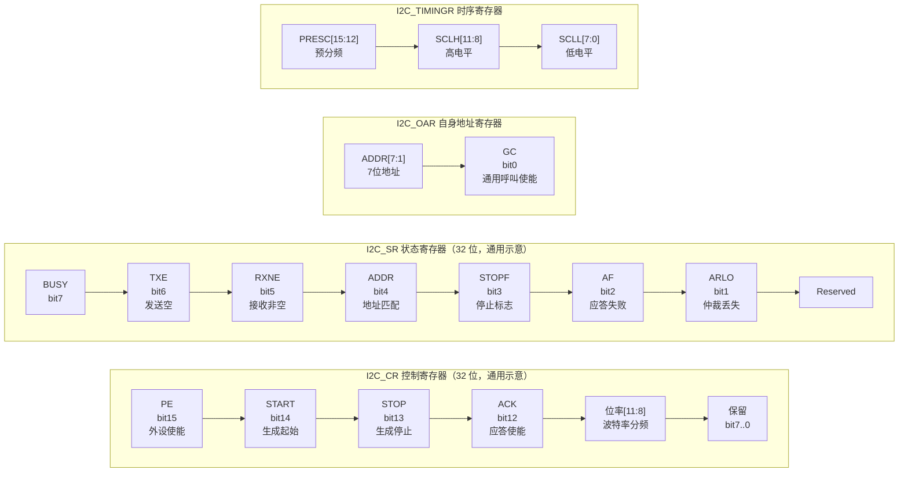

各寄存器语义简述（通用示意，非某特定芯片精确位定义）：

| 寄存器 | 关键位域 | 作用 |
|--------|----------|------|
| CR（控制） | PE / START / STOP / ACK / 位率 | 使能外设、软件触发起停、使能应答、设定分频 |
| SR（状态） | BUSY / TXE / RXNE / ADDR / STOPF / AF / ARLO | 反映状态机当前状态，软件轮询或中断依据 |
| OAR（地址） | ADDR[7:1] / GC | 从模式自身地址与通用呼叫使能 |
| DR（数据） | DATA[7:0] | 收发数据缓冲（通常含移位+保持双寄存器） |
| TIMINGR（时序） | PRESC / SCLH / SCLL 等 | 配置 SCL 周期与建立/保持时间 |

### 7.10 时钟/复位域

I²C 外设属于"外设时钟域"，由 RCC（复位与时钟控制）分配独立时钟与复位。要点：

- **时钟门控**：不用时关闭 I²C 外设时钟可省功耗；但关闭前必须先释放总线（发 STOP），否则总线会卡在忙。
- **复位**：软件复位（置位 RCC 的 I²C 复位位）可把状态机、标志、移位寄存器全部清到已知态，是驱动初始化与"恢复"的底层手段。
- **异步唤醒**：部分低功耗芯片允许 I²C 在 STOP 模式下被地址匹配唤醒（从模式），需额外配置唤醒源与时钟。

### 7.11 模块与总线/中断协作

总结一条"写事务"在硬件层面的链路：内核 → 总线矩阵 → APB 写 DR/CR → 状态机驱动移位 → 开漏驱动 SDA/SCL → 外部上拉形成电平 → 从机响应 ACK → 输入滤波回读 → 置 RXNE/TXE/ADDR → 中断或 DMA 通知内核。理解这条链路，你就能解释：为什么"BUSY 清不掉"往往意味着外部某节点把 SDA 拉死（硬件看不到 STOP）；为什么 TIMINGR 配错会"能发地址却读不到数据"；为什么中断里必须先读 SR 再读 DR（清标志顺序）。

---

## 八、驱动代码实现

这一章把第七章的硬件"翻译"成可运行的 C。所有示例均带注释、可直接阅读，强调"正确 + 健壮"。

### 8.1 GPIO 模拟 I²C（Bit-Bang）完整时序

在 MCU 没有硬件 I²C 外设、引脚被占用、或需要精细控制恢复流程时，常用 GPIO 模拟。下列代码展示起始、停止、重复起始、位收发、字节收发与 ACK/NACK，含精确延时与读电平回读：

```c
/* ===================== GPIO 模拟 I2C（Bit-Bang） ===================== */
#include <stdint.h>

/* 平台相关：以下函数需替换为你的 MCU 的 GPIO 驱动。
   开漏配置：SDA/SCL 引脚配置为开漏输出（OD）+ 上拉电阻在外。 */
extern void gpio_set_od(uint32_t pin, int high); /* high=1 释放(高阻), high=0 拉低 */
extern int  gpio_read(uint32_t pin);             /* 读引脚电平 1/0 */
extern void delay_us(unsigned us);               /* 微秒级忙等延时 */

#define I2C_SDA_PIN  0
#define I2C_SCL_PIN  1
#define I2C_DELAY_US 5   /* 标准模式 100k：半周期约 5us；400k 用 ~1.25us */

static void sda_high(void) { gpio_set_od(I2C_SDA_PIN, 1); } /* 释放，靠上拉变高 */
static void sda_low (void) { gpio_set_od(I2C_SDA_PIN, 0); } /* 主动拉低 */
static void scl_high(void) { gpio_set_od(I2C_SCL_PIN, 1); }
static void scl_low (void) { gpio_set_od(I2C_SCL_PIN, 0); }
static int  sda_rd  (void) { return gpio_read(I2C_SDA_PIN); }

static void i2c_delay(void) { delay_us(I2C_DELAY_US); }

/* START：SCL 高时 SDA 高->低 */
void i2c_start(void) {
    sda_high(); scl_high(); i2c_delay();   /* 空闲态：两线皆高 */
    sda_low();  i2c_delay();               /* SCL=1 时 SDA 下拉 = START */
    scl_low();  i2c_delay();               /* 拉低 SCL 进入数据相位 */
}

/* STOP：SCL 高时 SDA 低->高 */
void i2c_stop(void) {
    sda_low();  scl_high(); i2c_delay();
    sda_high(); i2c_delay();               /* SCL=1 时 SDA 上拉 = STOP */
    i2c_delay();                           /* 总线回到空闲 */
}

/* 重复起始：同 START，但前面不发 STOP */
void i2c_repeated_start(void) {
    scl_low();  sda_high(); i2c_delay();
    scl_high(); i2c_delay();
    sda_low();  i2c_delay();               /* SCL=1 时 SDA 高->低 = Sr */
    scl_low();  i2c_delay();
}

/* 写一个 bit（SCL 低时改 SDA，SCL 高时保持采样） */
static void i2c_write_bit(int bit) {
    scl_low();
    if (bit) sda_high(); else sda_low();
    i2c_delay();
    scl_high(); i2c_delay();               /* 接收方在此窗口采样 */
    scl_low();
}

/* 读一个 bit（释放 SDA 让从机驱动，SCL 高时采样） */
static int i2c_read_bit(void) {
    int b;
    scl_low();  sda_high(); i2c_delay();    /* 释放 SDA 以允许从机驱动 */
    scl_high(); i2c_delay();
    b = sda_rd();                           /* 采样 */
    scl_low();
    return b & 0x1;
}

/* 写一个字节，返回 ACK(0)/NACK(1) */
int i2c_write_byte(uint8_t byte) {
    for (int i = 7; i >= 0; i--) i2c_write_bit((byte >> i) & 0x1);
    return i2c_read_bit();                  /* 第 9 位：从机 ACK */
}

/* 读一个字节，ack=0 主机回 ACK，ack=1 主机回 NACK（末字节用） */
uint8_t i2c_read_byte(int ack) {
    uint8_t byte = 0;
    for (int i = 7; i >= 0; i--) byte = (byte << 1) | i2c_read_bit();
    i2c_write_bit(ack);                     /* 主机回 ACK/NACK */
    return byte;
}

/* 典型"写寄存器"封装 */
int i2c_write_reg(uint8_t addr7, uint8_t reg, const uint8_t *dat, int len) {
    i2c_start();
    if (i2c_write_byte((addr7 << 1) | 0)) { i2c_stop(); return -1; } /* 地址 NACK */
    if (i2c_write_byte(reg))               { i2c_stop(); return -2; }
    for (int i = 0; i < len; i++)
        if (i2c_write_byte(dat[i]))        { i2c_stop(); return -3; }
    i2c_stop();
    return 0;
}

/* 典型"读寄存器"（重复起始，原子） */
int i2c_read_reg(uint8_t addr7, uint8_t reg, uint8_t *buf, int len) {
    i2c_start();
    if (i2c_write_byte((addr7 << 1) | 0)) { i2c_stop(); return -1; }
    if (i2c_write_byte(reg))               { i2c_stop(); return -2; }
    i2c_repeated_start();
    if (i2c_write_byte((addr7 << 1) | 1)) { i2c_stop(); return -3; }
    for (int i = 0; i < len; i++)
        buf[i] = i2c_read_byte((i == len - 1) ? 1 : 0); /* 末字节 NACK */
    i2c_stop();
    return 0;
}
```

### 8.2 MCU 硬件 I²C 外设驱动（初始化 + 主模式读写）

以 STM32 系列 I²C 外设风格为例，展示"时序寄存器初始化 + 主模式读写 + 中断/状态机"。重点：TIMINGR 必须按外设时钟与目标速率配置；错误处理要清除 AF/ARLO 等标志并恢复。

```c
/* ===================== STM32 风格硬件 I2C 驱动（简化示意） ===================== */
#include "stm32f4xx_hal.h"

static I2C_HandleTypeDef hi2c1;

/* 初始化：配置时序、地址模式、时钟使能 */
void i2c_hw_init(void) {
    hi2c1.Instance             = I2C1;
    hi2c1.Init.ClockSpeed      = 100000;          /* 100k 标准模式 */
    hi2c1.Init.DutyCycle       = I2C_DUTYCYCLE_2; /* 快速模式占空比，标准模式忽略 */
    hi2c1.Init.OwnAddress1     = 0x00;            /* 主模式自身地址（可任意） */
    hi2c1.Init.AddressingMode  = I2C_ADDRESSINGMODE_7BIT;
    hi2c1.Init.DualAddressMode = I2C_DUALADDRESS_DISABLE;
    hi2c1.Init.GeneralCallMode = I2C_GENERALCALL_DISABLE;
    hi2c1.Init.NoStretchMode   = I2C_NOSTRETCH_DISABLE; /* 允许时钟延展 */
    HAL_I2C_Init(&hi2c1);
    /* HAL_I2C_Init 内部依据 ClockSpeed 计算 TIMINGR（实际芯片请用 CubeMX 生成值） */
}

/* 读寄存器：内部用 Repeated START，超时 100ms 防止永久阻塞 */
int i2c_hw_read_reg(uint8_t addr7, uint8_t reg, uint8_t *buf, uint16_t len) {
    HAL_StatusTypeDef st;
    st = HAL_I2C_Mem_Read(&hi2c1, (uint16_t)(addr7 << 1), reg,
                          I2C_MEMADD_SIZE_8BIT, buf, len, 100);
    if (st == HAL_TIMEOUT || st == HAL_ERROR) {
        i2c_hw_recover();   /* 见 8.4：总线死锁恢复 */
        return -1;
    }
    return 0;
}

/* 写寄存器 */
int i2c_hw_write_reg(uint8_t addr7, uint8_t reg, uint8_t *dat, uint16_t len) {
    HAL_StatusTypeDef st;
    st = HAL_I2C_Mem_Write(&hi2c1, (uint16_t)(addr7 << 1), reg,
                           I2C_MEMADD_SIZE_8BIT, dat, len, 100);
    if (st == HAL_TIMEOUT || st == HAL_ERROR) {
        i2c_hw_recover();
        return -1;
    }
    return 0;
}

/* 中断方式（示意）：在 I2C 事件/错误中断里调用 HAL_I2C_EV_IRQHandler /
   HAL_I2C_ER_IRQHandler，由 HAL 状态机推进；错误回调里做恢复。 */
void I2C1_EV_IRQHandler(void) { HAL_I2C_EV_IRQHandler(&hi2c1); }
void I2C1_ER_IRQHandler(void) {
    HAL_I2C_ER_IRQHandler(&hi2c1);
    /* 错误回调中检测 BUSY 异常，调用 i2c_hw_recover() */
}
```

> 工程提醒：HAL 的 `HAL_MAX_DELAY` 在死锁时会一直阻塞；生产代码应使用**有限超时**并在返回 `HAL_TIMEOUT`/`HAL_ERROR` 时调用恢复流程，否则一个卡死从机可能拖垮整个任务调度。若用 DMA，还需在 `HAL_I2C_Mem_Read_DMA` 完成后于传输完成回调里处理。

HAL 封装虽方便，但屏蔽了第七章讲的寄存器语义。为了让读者建立"寄存器即状态机控制面"的直觉，下面给出一份**不依赖 HAL 的裸寄存器级驱动**：直接配置时序寄存器、用中断推进收发状态机。命名沿用第七章的通用示意（CR/SR/DR/OAR/TIMINGR），移植时按具体芯片手册替换：

```c
/* ============ 裸寄存器级 I2C 主模式驱动 + 中断状态机（通用示意） ============ */
#include <stdint.h>

/* --- 寄存器映射（示意，实际以芯片手册为准） --- */
typedef struct {
    volatile uint32_t CR;       /* 控制：PE/START/STOP/ACK/位率 */
    volatile uint32_t SR;       /* 状态：BUSY/TXE/RXNE/ADDR/STOPF/AF/ARLO */
    volatile uint32_t DR;       /* 数据缓冲 */
    volatile uint32_t OAR;      /* 自身地址 + 通用呼叫使能 */
    volatile uint32_t TIMINGR;  /* PRESC/SCLH/SCLL 时序 */
    volatile uint32_t IER;      /* 中断使能 */
} I2C_TypeDef;

#define I2C0            ((I2C_TypeDef *)0x40005400UL)

/* CR 位定义（对应 7.9 位域图） */
#define CR_PE           (1U << 15)   /* 外设使能 */
#define CR_START        (1U << 14)   /* 生成起始条件 */
#define CR_STOP         (1U << 13)   /* 生成停止条件 */
#define CR_ACK          (1U << 12)   /* 接收后自动应答 */
/* SR 位定义 */
#define SR_BUSY         (1U << 7)
#define SR_TXE          (1U << 6)    /* 发送缓冲空 */
#define SR_RXNE         (1U << 5)    /* 接收缓冲非空 */
#define SR_ADDR         (1U << 4)    /* 地址已发送/匹配 */
#define SR_STOPF        (1U << 3)
#define SR_AF           (1U << 2)    /* 应答失败 = 收到 NACK */
#define SR_ARLO         (1U << 1)    /* 仲裁丢失 */

/* --- 传输上下文：中断状态机的"当前进度" --- */
typedef enum {
    I2C_ST_IDLE = 0, I2C_ST_ADDR, I2C_ST_TX, I2C_ST_RX, I2C_ST_DONE, I2C_ST_ERR
} i2c_state_t;

static struct {
    uint8_t      addr8;      /* 已含 R/W 位的 8 位地址 */
    uint8_t     *buf;
    uint16_t     len;
    uint16_t     idx;
    i2c_state_t  state;
} g_xfer;

/* --- 初始化：配置时序寄存器 --- */
/* pclk_hz：外设时钟；scl_hz：目标 SCL 频率 */
void i2c_reg_init(uint32_t pclk_hz, uint32_t scl_hz)
{
    I2C0->CR &= ~CR_PE;                       /* 配置前必须先失能外设 */

    /* 预分频得到基准时钟，再把一个位周期均分为高/低两半。
       注意：SCLH 需为上拉 RC 上升时间留裕量，否则高电平被斜坡吃掉。 */
    uint32_t presc = (pclk_hz / 8000000U);    /* 目标基准约 8 MHz */
    if (presc == 0U) presc = 1U;
    uint32_t base_hz = pclk_hz / presc;
    uint32_t half    = (base_hz / scl_hz) / 2U;   /* 半周期基准拍数 */
    if (half > 255U) half = 255U;

    I2C0->TIMINGR = ((presc - 1U) << 12) |        /* PRESC[15:12] */
                    ((half  & 0x0FU) << 8) |      /* SCLH[11:8]  */
                    ( half  & 0xFFU);             /* SCLL[7:0]   */

    I2C0->OAR = 0x00U;                        /* 主模式：自身地址不使用，关通用呼叫 */
    I2C0->IER = SR_TXE | SR_RXNE | SR_ADDR | SR_AF | SR_ARLO; /* 使能事件与错误中断 */
    I2C0->CR |= CR_ACK | CR_PE;               /* 使能应答 + 使能外设 */
}

/* --- 发起一次主模式传输（异步，中断中推进） --- */
int i2c_reg_start_xfer(uint8_t addr7, int is_read, uint8_t *buf, uint16_t len)
{
    if (I2C0->SR & SR_BUSY) return -1;        /* 总线忙：上层应触发超时恢复 */

    g_xfer.addr8 = (uint8_t)((addr7 << 1) | (is_read ? 1U : 0U));
    g_xfer.buf   = buf;
    g_xfer.len   = len;
    g_xfer.idx   = 0;
    g_xfer.state = I2C_ST_ADDR;

    I2C0->CR |= CR_START;                     /* 硬件生成 START，随后进中断发地址 */
    return 0;
}

/* --- 中断服务：按状态机推进（对应 7.7 数据收发状态机） --- */
void I2C0_IRQHandler(void)
{
    uint32_t sr = I2C0->SR;                   /* 必须先读 SR，再读 DR，顺序不可颠倒 */

    /* 1) 错误优先处理 */
    if (sr & (SR_AF | SR_ARLO)) {
        I2C0->SR &= ~(SR_AF | SR_ARLO);       /* 清错误标志 */
        I2C0->CR |= CR_STOP;                  /* 收到 NACK 或仲裁失败：立即释放总线 */
        g_xfer.state = I2C_ST_ERR;
        return;
    }

    /* 2) 地址阶段完成：发送方向决定后续走 TX 还是 RX */
    if (sr & SR_ADDR) {
        I2C0->DR = g_xfer.addr8;              /* 写入地址字节，硬件移位发出 */
        g_xfer.state = (g_xfer.addr8 & 1U) ? I2C_ST_RX : I2C_ST_TX;
        return;
    }

    /* 3) 发送阶段：缓冲空则填下一字节 */
    if ((sr & SR_TXE) && g_xfer.state == I2C_ST_TX) {
        if (g_xfer.idx < g_xfer.len) {
            I2C0->DR = g_xfer.buf[g_xfer.idx++];
        } else {
            I2C0->CR |= CR_STOP;              /* 数据发完，生成 STOP */
            g_xfer.state = I2C_ST_DONE;
        }
        return;
    }

    /* 4) 接收阶段：读走数据；末字节前关 ACK 以回 NACK */
    if ((sr & SR_RXNE) && g_xfer.state == I2C_ST_RX) {
        if (g_xfer.idx + 1U == g_xfer.len)
            I2C0->CR &= ~CR_ACK;              /* 末字节回 NACK，通知从机停止发送 */
        g_xfer.buf[g_xfer.idx++] = (uint8_t)(I2C0->DR & 0xFFU);
        if (g_xfer.idx >= g_xfer.len) {
            I2C0->CR |= CR_STOP;
            I2C0->CR |= CR_ACK;               /* 恢复默认应答，供下次传输 */
            g_xfer.state = I2C_ST_DONE;
        }
        return;
    }
}
```

这份代码把第七章的每个硬件模块都"点了名"：`TIMINGR` 对应波特率分频器（7.3），`SR_ARLO` 对应仲裁逻辑（7.5），`OAR` 对应地址匹配（7.6），中断状态机对应数据收发状态机（7.7），`IER` 对应中断控制（7.8）。读者对照阅读，可把"寄存器手册"与"硬件框图"彻底打通。

### 8.3 SMBus 命令实现（Quick / Read Byte / Write Byte + PEC）

SMBus 把"读写寄存器"标准化为命令。下列代码给出 Quick Command、Read Byte、Write Byte，并在 Write/Read Byte 上演示 PEC（CRC-8，多项式 0x07，初值 0x00）的纳入与校验。PEC 必须把**所有经总线实际传输的字节**（含地址字节，R/W 位按实际取值）依序纳入。

```c
/* ===================== SMBus 命令（含 PEC） ===================== */
#include <stdint.h>

/* CRC-8 (SMBus PEC)：poly 0x07, init 0x00, 无反转 */
static uint8_t smbus_pec(const uint8_t *buf, uint8_t len) {
    uint8_t crc = 0x00;
    for (uint8_t i = 0; i < len; i++) {
        crc ^= buf[i];
        for (uint8_t b = 0; b < 8; b++)
            crc = (crc & 0x80) ? (uint8_t)((crc << 1) ^ 0x07) : (uint8_t)(crc << 1);
    }
    return crc;
}

/* Quick Command：只发命令码（R/W 决定是"写命令"还是"读命令"），无数据、无 PEC */
int smbus_quick(uint8_t addr7, uint8_t cmd, int is_read) {
    /* 伪代码：START + ADDR+(R/W) + cmd + STOP；用于触发从机某动作 */
    return i2c_write_reg_raw(addr7, is_read, &cmd, 1); /* 见 8.1 的底层封装 */
}

/* Write Byte：START + ADDR+W + cmd + data + (PEC) + STOP */
int smbus_write_byte_pec(uint8_t addr7, uint8_t cmd, uint8_t data) {
    uint8_t addr_w = (uint8_t)((addr7 << 1) | 0);
    uint8_t frame[3] = { cmd, data, 0 };
    uint8_t pec_in[3] = { addr_w, cmd, data };
    frame[2] = smbus_pec(pec_in, 3);        /* PEC 覆盖 地址W + 命令 + 数据 */
    return i2c_write_reg_raw(addr7, 0, frame, 3);
}

/* Read Byte：START + ADDR+W + cmd + Sr + ADDR+R + data + PEC + STOP */
int smbus_read_byte_pec(uint8_t addr7, uint8_t cmd, uint8_t *data) {
    uint8_t addr_w = (uint8_t)((addr7 << 1) | 0);
    uint8_t addr_r = (uint8_t)((addr7 << 1) | 1);
    uint8_t rx[2];                          /* 数据 + PEC */
    int ret = i2c_read_reg_after_write(addr7, cmd, rx, 2);
    if (ret != 0) return ret;
    uint8_t pec_in[4] = { addr_w, cmd, addr_r, rx[0] };
    if (smbus_pec(pec_in, 4) != rx[1])      /* 校验失败 */
        return -2;
    *data = rx[0];
    return 0;
}
```

> 说明：上例 `i2c_write_reg_raw` / `i2c_read_reg_after_write` 为"裸"GPIO 或硬件 I²C 收发封装（可直接套用 8.1/8.2）。PEC 的纳入顺序必须严格按字节在总线上的实际出现顺序：地址 W、命令、地址 R、数据……错序则永远校验失败。

### 8.4 总线死锁恢复（9 个 SCL 脉冲释放 SDA）

当 SDA 被从机拉死、BUSY 清不掉时，绕开协议状态机、用 GPIO 在 SCL 上补 9 个脉冲：

```c
/* ===================== 总线死锁恢复 ===================== */
/* 前提：SCL 引脚可切换为 GPIO 开漏输出（临时绕过 I2C 外设） */
void i2c_bus_recover(void) {
    /* 1) 释放 SDA，尝试让从机自然释放 */
    sda_high();
    /* 2) 在 SCL 上用 GPIO 产生 9 个脉冲，推完从机残留位 */
    for (int i = 0; i < 9; i++) {
        scl_high(); i2c_delay();
        scl_low();  i2c_delay();
    }
    /* 3) 补一个 STOP，把总线协议状态机复位到空闲 */
    i2c_stop();
}

/* 硬件 I2C 层面的恢复：先禁用外设，GPIO 恢复，再重新初始化 */
void i2c_hw_recover(void) {
    __HAL_I2C_DISABLE(&hi2c1);              /* 关外设，释放对引脚的驱动 */
    /* 此处需把 SCL/SDA 临时配置为 GPIO 开漏，调用 i2c_bus_recover() */
    /* ...（平台相关 GPIO 重配置）... */
    __HAL_I2C_ENABLE(&hi2c1);
    HAL_I2C_Init(&hi2c1);                   /* 重新初始化状态机与寄存器 */
}
```

固件应在初始化后与上电自检阶段主动检测 BUSY 超时：若 `I2C_GetFlagStatus(BUSY)` 长时间为 1，立即调用 `i2c_hw_recover()`，把故障消灭在开机阶段。

---

## 九、MCAL 配置说明（AUTOSAR I2c / CDD）

在车规与高可靠量产项目中，I²C 通常不会"裸写寄存器"，而是纳入 AUTOSAR 基础软件（BSW）。本章讲清两条路径，并给出可落地的配置清单。

### 9.1 AUTOSAR I2c 模块概览

AUTOSAR 提供了标准化的 **I2c 模块（I2c Driver，属于 MCAL 层）**，向上提供 `I2c_Write()`、`I2c_Read()`、`I2c_AsyncTransmit()` 等 API，向下操作 I²C 外设寄存器。其核心配置对象有三：

- **I2cChannel（通道）**：对应一个物理 I²C 外设实例，配置波特率、地址模式（7/10 位）、是否支持时钟延展、自身从地址、时序参数等。
- **I2cJob（作业）**：一次完整的"主→从"通信单元，包含从机地址、读写方向、使用的 Channel、以及引用的 Sequence。
- **I2cSequence（序列）**：一组 Job 的有序集合，支持 Job 间的"保持总线（无 STOP）/重复起始"衔接，适合"写指针+读数据"原子操作。

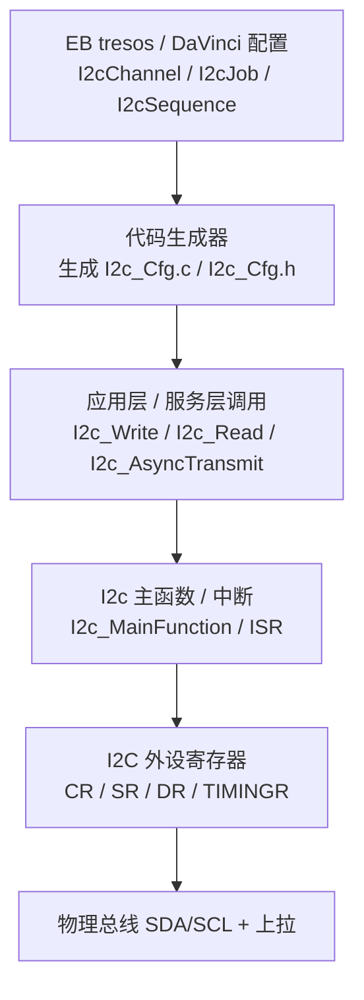

### 9.2 I2cChannel / I2cJob / I2cSequence 语义

- **Channel** 决定"这个 I²C 跑多快、几位地址、延不延展"。
- **Job** 决定"跟哪个从机、读还是写、用哪个 Channel"。
- **Sequence** 决定"多个 Job 是否连成一条不间断的总线事务"。

配置示例（概念性伪配置，真实以工具 GUI/XML 为准）：

| 配置项 | 示例值 | 说明 |
|--------|--------|------|
| I2cChannelId | 0 | 通道编号 |
| I2cBaudRate | 100000 | 100 kbit/s |
| I2cAddressMode | I2C_7_BIT | 7 位地址 |
| I2cClockStretching | ENABLED | 允许从机延展 |
| I2cSlaveAddress | 0x2A | 主模式一般用不到，从模式填自身地址 |
| I2cJobId | Job_ReadTemp | 作业编号 |
| I2cJobChannelRef | I2cChannel_0 | 引用通道 |
| I2cJobSlaveAddr | 0x48 | 目标从机地址 |
| I2cJobDirection | I2C_READ | 读 |
| I2cSequenceId | Seq_ReadReg | 序列编号 |
| I2cSequenceJobRef | Job_WritePtr, Job_ReadData | 先写指针，再读数据（保持总线） |

### 9.3 为什么很多 MCU 仍用手写 CDD 而非标准 I2c

尽管 AUTOSAR 提供了 I2c 模块，但在实际车规与工业项目中，**相当多团队选择用 CDD（Complex Device Driver，复杂设备驱动）手写 I2C 驱动**，原因包括：

1. **标准 I2c 模块对"SMBus 语义"支持有限**：PEC、SMBALERT#、Block 传输、超时恢复等需要大量定制，标准模块未必覆盖，写 CDD 反而更直接。
2. **多主/仲裁/复杂恢复**：标准模块的状态机未必满足特定总线恢复策略，CDD 可精细控制 9 脉冲恢复、超时重试。
3. **性能与确定性**：CDD 可直接用 DMA + 中断，避免 AUTOSAR 调度层级带来的延迟波动。
4. **IP 差异大**：不同厂商 I²C 外设寄存器差异巨大，标准 I2c 的"通用抽象"在某些芯片上需要大量适配，CDD 更贴硬件。

因此实务中常见方案：**标准 I2c 用于简单 EEPROM/IO 扩展；CDD 用于电池/电源/SMBus 等严苛场景**。

### 9.4 EB tresos / DaVinci 配置项清单（表格）

下面以"标准 I2c 模块视角 + CDD 补充视角"给出一份配置清单（典型项，具体以工具版本为准）：

| 配置层级 | 配置项 | 取值示例 | 作用 | 备注 |
|----------|--------|----------|------|------|
| 模块级 | I2cDevErrorDetect | ON | 开发期错误检测 | 量产前可关以省开销 |
| 模块级 | I2cInterruptEnabled | ON | 使能中断驱动 | 否则轮询 |
| 模块级 | I2cDmaEnabled | ON/OFF | DMA 搬运 | 大数据块建议开 |
| Channel | I2cBaudRate | 100000/400000 | 位速率 | 需与 TIMINGR 一致 |
| Channel | I2cAddressMode | 7/10 BIT | 地址宽度 | 7 位最常用 |
| Channel | I2cClockStretching | ENABLED | 允许延展 | SMBus 从机常需 |
| Channel | I2cHwUnit | I2C0 | 物理外设 | 映射芯片实例 |
| Job | I2cJobSlaveAddr | 0x48 | 目标地址 | 7 位 |
| Job | I2cJobDirection | READ/WRITE | 方向 | |
| Job | I2cJobDataSize | 1..N | 字节数 | |
| Sequence | I2cSeqJobRef | [Job1,Job2] | 作业顺序 | 保持总线实现 Sr |
| CDD补充 | BusRecoverTimeout | 35 ms | 总线超时恢复阈值 | 对齐 SMBus 超时 |
| CDD补充 | PECEnable | ON | 启用 PEC | SMBus 可靠性 |
| CDD补充 | AlertPin | GPIOx | SMBALERT# 映射 | 事件驱动报警 |

### 9.5 配置 → 生成代码 → 调用路径

1. **配置**：在 EB tresos / DaVinci 中填 Channel/Job/Sequence，设置波特率、地址模式、时序、中断/DMA。
2. **生成**：工具生成 `I2c_Cfg.c/.h`（`I2cConfig` 结构）和 `I2c_PBcfg.c`（后构建配置）。
3. **初始化**：`I2c_Init(&I2cConfig)` 把配置写入外设寄存器（含 TIMINGR 等效项）。
4. **调用**：应用层调用 `I2c_AsyncTransmit(SeqId)`（异步）或 `I2c_Read/I2c_Write`（同步）；异步完成由 `I2c_MainFunction` 或中断通知。
5. **时序保障**：Channel 的 BaudRate/Timing 最终落到 7.3 节的波特率分频器；Sequence 的"保持总线"对应硬件的"不生成 STOP + 重复起始"。

### 9.6 SMBus 超时 / PEC 在 BSW 中的处理

- **超时**：AUTOSAR I2c 本身不一定强制 SMBus 35 ms/25 ms 超时，需在 CDD 或上层（如 BswM、SWC）实现"看门狗式"监控：每次 `I2c_AsyncTransmit` 启动定时器，超时未回调则触发 `i2c_hw_recover()`，并上报 DTC（诊断故障码）。
- **PEC**：标准模块通常不管 PEC，需在 CDD 发送/接收路径插入 `smbus_pec()` 计算与校验（见 8.3）。发送方把 PEC 作为最后一字节发出；接收方重算并比对，失败则重试或报错。
- **SMBALERT#**：把 Alert GPIO 配为外部中断，ISR 中向 ARA（0x0C）发 Alert Response 读命令，定位报警从机（见第十一章）。这一逻辑通常放在 CDD 或系统服务层。

---

## 十、典型故障诊断与恢复

### 10.1 故障全景与定位流程

把前文分散的坑集中到一张决策图，便于现场定位：

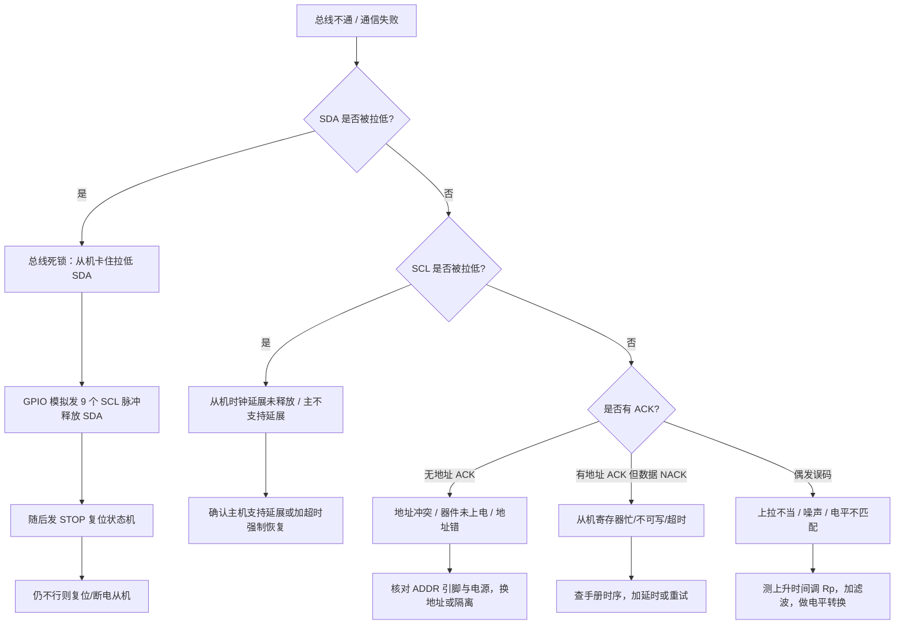

### 10.2 故障一：上拉电阻阻值不当

- **现象**：高速下误码、上升沿呈斜坡、易受干扰；或低电平时过热、灌电流超限。
- **根因**：R<sub>p</sub> 超出第三章推导的上下限区间。
- **对策**：按 C<sub>b</sub> 与 t<sub>r(max)</sub> 重算 R<sub>p</sub>；用示波器实测上升时间；长走线/多器件优先选较小阻值并验证灌电流。

### 10.3 故障二：总线死锁（SDA 被从机拉低不放）

- **现象**：SDA 长期低，BUSY 清不掉，全总线瘫痪。
- **根因**：从机在字节中间复位/掉电/跑飞，未释放 SDA（详见第一章场景）。
- **对策**：主机用 GPIO 在 SCL 上补 9 个以上脉冲把从机状态机推完；随后补 STOP。固件应内置"总线超时恢复"流程：检测 BUSY 超时就触发恢复（见 8.4）。

### 10.4 故障三：地址冲突

- **现象**：两个同址器件互相干扰，读写结果错乱或无响应。
- **对策**：选用带 ADDR 配置引脚的器件；用 I²C 多路复用器分通道；或用 GPIO 控制电源分时上电。设计阶段就应规划地址分配表。

### 10.5 故障四：SCL 被拉低（时钟延展卡死）

- **现象**：SCL 低且不上高，事务卡在等待。
- **根因**：从机延展 SCL 后未释放（内部异常），或主机不支持延展。
- **对策**：确认主控制器支持时钟延展；在固件中设置 SCL 低超时（对齐 SMBus 35 ms），超时则按总线死锁恢复流程处理。

### 10.6 故障五：电平不匹配

- **现象**：3.3 V MCU 读 5 V 器件采样错、或 5 V 灌入 3.3 V IO 烧毁。
- **对策**：使用双向电平转换（如 MOSFET 电平转换电路、专用电平转换芯片）；确认器件是否 5 V-tolerant；I²C 因开漏特性，简单的 MOSFET 转换非常适用。

### 10.7 故障速查表

| 故障现象 | 最可能根因 | 首选对策 |
|----------|------------|----------|
| SDA 长期低 | 从机卡死拉低 | 9 脉冲 + STOP 恢复 |
| SCL 长期低 | 时钟延展未释放 / 不支持延展 | 确认延展支持 + 超时恢复 |
| 无地址 ACK | 地址错/未上电/冲突 | 核地址、电源、分通道 |
| 数据 NACK | 从机忙/不可写 | 延时/重试 |
| 高速误码 | 上拉/电容不当 | 重算 R<sub>p</sub>、实测 t<sub>r</sub> |
| 电平错/烧 IO | 3.3V↔5V 不匹配 | MOSFET 双向转换 |

---

## 十一、SMBus 与 I²C 的差异详解

### 11.1 总体定位

SMBus 以 I²C 为物理基础，但在系统管理所需的**可靠性、可预期性、安全性**方向上做了大量约束。下表系统对比两者：

| 维度 | I²C | SMBus |
|------|-----|-------|
| 总线拓扑 | 开漏 + 上拉，多主多从 | 同 I²C（开漏 + 上拉） |
| 速率 | 100 k ~ 3.4 M（多种模式） | 主要 10 k ~ 100 k（典型 100 k），较窄 |
| 超时 | **无硬超时** | **有**（如 35 ms 时钟低超时、25 ms 数据超时） |
| 命令协议 | 自定义，厂商各定 | 标准化（read/write byte/word、block 等） |
| 校验 | 仅 ACK 位 | 可选 **PEC（CRC-8）包错误校验** |
| 电气电平 | 较宽松（可 5 V/3.3 V 混用） | 更严（规定 V<sub>DD</sub>、V<sub>IL</sub>、V<sub>IH</sub> 范围） |
| 报警机制 | 无 | 有 **SMBALERT#** 中断线 |
| 典型场景 | 通用传感器、EEPROM、Codec | 电源管理、电池/电量计、温度监控 |
| 地址机制 | 7/10 位 | 同 I²C（常用 7 位） |

### 11.2 超时（Timeout）：系统管理总线的安全阀

I²C 规范本身**没有硬性超时**——一个主设备可以永远占用总线，或从机可以无限延展时钟（只要主机愿意等）。这在通用场景下无所谓，但在**系统管理总线**上不可接受：如果电池或电源管理总线被某个卡死的器件拖死，可能导致整机无法上电、无法读取电量而误关机，甚至安全隐患。

因此 SMBus 规定了关键超时：

- **T<sub>LOW</sub>, SMBus：时钟低超时（Clock Low Timeout）**：SCL 被拉低的时间不得超过约 35 ms（规范值 35 ms，部分定义为 25 ms 量级），超过则主机判定总线异常并恢复。
- **数据超时**：两个边沿之间、或数据保持时间有上限约束（典型 25 ms）。

这些超时把"无限等待"变成"有限等待 + 主动恢复"，是 SMBus 适合安全攸关场景的关键。在 BSW（第九章）里，这正是 CDD 要补上的"看门狗"。

### 11.3 PEC（Packet Error Check）：CRC-8 包差错校验

SMBus 可选在每帧末尾附加一个 **PEC 字节**，它是基于 CRC-8（多项式通常 0x07，即 x⁸+x²+x+1，初值 0x00 或 0xFF 视具体规范条款）对整个数据封包（含地址、命令、数据）计算的校验值。接收方重算并与收到的 PEC 比较，不匹配则丢弃并重试。

PEC 的意义在于：I²C 仅有每字节的 ACK 位，只能检测"从机是否收到"，**无法检测数据传输过程中因噪声而发生的位翻转**。在电池组、电源等存在大电流开关噪声的环境中，PEC 把误码漏检率降低数个量级，是工业级可靠通信的标配。

### 11.4 命令协议与 Block 传输

SMBus 把"读/写一个寄存器"抽象成统一命令集，例如：

- **Write Byte / Read Byte**：写一个命令码 + 1 字节数据 / 读回 1 字节。
- **Write Word / Read Word**：命令码 + 2 字节（小端）。
- **Block Write / Block Read**：命令码 + 长度字节 + 若干数据字节（最长为 32 字节规范上限），非常适合读传感器序列、电池序列号等。
- **Process Call、Block Write-Block Read Process Call** 等更高阶事务。

这种"协议标准化"让主机（如 EC、MCU、操作系统 ACPI 驱动）无需为每个电池厂商写私有驱动，是实现"智能电池即插即用"的基础。

### 11.5 Alert 信号（SMBALERT#）

SMBus 定义了一条**低电平有效的报警线 SMBALERT#**。当某个从设备（如过温的电源、电量过低的电池）需要主动上报紧急事件，它把 SMBALERT# 拉低。主机的中断引脚检测到后，发起一个** ARP（Address Resolution Protocol，地址解析协议）风格的"谁在报警"查询**：向保留地址 0x0C 发 Alert Response Address（ARA）读命令，真正报警的从机在总线上以"线与仲裁"方式回送自己的地址，主机据此定位报警源，再读取具体状态寄存器。这把"被动轮询"升级为"事件驱动报警"，显著降低主机负担与事件延迟。

### 11.6 电压范围与电气约束

SMBus 规范规定了更严格的 V<sub>DD</sub>（典型 3.3 V 系统，允许范围更窄）、输入低/高阈值，并要求从机在总线电压低于自身供电时也能正确识别逻辑，确保不同厂商器件混插时的电平兼容性。相比之下 I²C 允许 5 V 与 3.3 V 器件（通过电平转换）混用，电气上更"宽容"也更易出错。

### 11.7 SMBus 典型拓扑与报警流向

下图展示一个典型的笔记本/便携设备系统管理总线拓扑：主机（嵌入式控制器 EC 或 SoC）作为唯一主设备，挂载电池电量计、充电 IC、若干温度传感器，并共用一条 SMBALERT# 报警线。任一从机出现紧急事件时主动拉低报警线，触发主机中断后通过 ARA 查询定位：

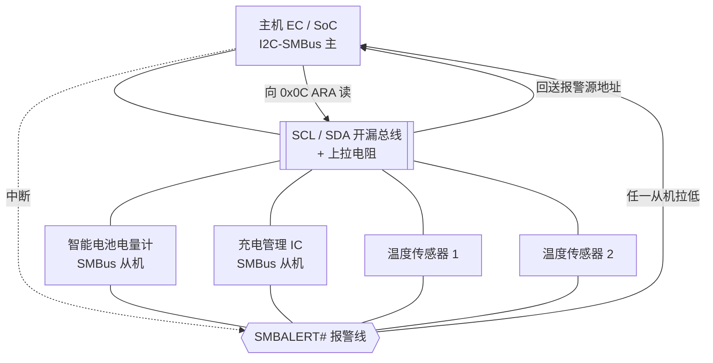

该拓扑体现了 SMBus 相对 I²C 的一大工程进步：**把"主机盲目轮询所有器件"转变为"从机事件驱动报警 + 精准定位"**，在监控 dozens 个温度/电源节点的整机里，可显著降低 CPU 占用与事件响应延迟。

### 11.8 PEC 计算细节与常见误区

PEC 的 CRC-8 在 SMBus 规范中采用多项式 P(x) = x⁸ + x² + x + 1，对应十六进制 0x07，初始值通常为 0x00，且**输入字节按总线实际传输顺序逐字节异或进 CRC 寄存器、逐位左移处理**，不存在输入/输出反转（与部分其它 CRC-8 变体的区别要特别注意）。常见误区包括：

- **漏算地址字节**：PEC 必须把首个地址字节（含 R/W 位）纳入计算，否则接收方永远校验失败。
- **把重复起始前后两次地址都算入**：在一次"写命令 + 重复起始读"事务中，地址 W 与地址 R 两个字节都要分别纳入 PEC 序列，因为它们确实先后出现在总线上。
- **大小端混淆**：SMBus Word 以**小端（LSB 在先）**传输，PEC 计算顺序应与字节在总线上的实际出现顺序一致，而非寄存器内部的大小端表示。

另外，PEC 是**可选**特性：许多 SMBus 从机允许通过配置位关闭 PEC，主从双方必须在该点上达成一致，否则一方带 PEC 发送、另一方按无 PEC 解析，会把 PEC 字节误当作数据字节，导致整帧错位。

---

## 十二、常见坑汇总（工程清单）

1. **上拉阻值拍脑袋**：不按总线电容计算，高速误码。务必先算上下限再实测。
2. **忽略时钟延展**：主机不支持延展却接会延展的 EEPROM/传感器，偶发挂死。查双方手册。
3. **读流程误用 STOP 而非 Sr**：写完寄存器指针后发 STOP 再 START，被其它主抢断，读到错误寄存器。务必用重复起始。
4. **忘记末字节 NACK**：读多个字节时主设备在最后一字节仍回 ACK，从机可能继续发、协议错乱。末字节必须 NACK。
5. **地址左移错误**：HAL/裸机混淆"7 位地址"与"已含 R/W 的 8 位地址"，导致地址错位。明确哪一层负责拼 R/W 位。
6. **总线死锁无恢复流程**：固件不检测 BUSY 超时，一旦死锁整机瘫痪。必须内置 9 脉冲 + STOP 恢复。
7. **电平不匹配烧 IO**：3.3 V MCU 直连 5 V 器件未做电平转换。使用 MOSFET 双向转换。
8. **长走线大电容**：总线电容超 400 pF 上限，上升时间超标。分段、加缓冲器或降低速率。
9. **混速器件拉低速率却未隔离**：高速器件与慢速器件同总线，慢器件拖速。用多路复用器分总线。
10. **PEC 计算漏字节**：SMBus PEC 少算地址字节导致校验永远失败。严格按规范纳入全部字节。
11. **滥用通用呼叫/保留地址**：误把 0x00、0x78~0x7F 当普通设备地址，引发总线广播异常。
12. **未处理仲裁丢失**：多主系统中主设备仲裁失败后未切回从模式，继续驱动造成冲突。仲裁失败应立即静默退出。
13. **TIMINGR 配置与硬件不符**：外设时钟或 R<sub>p</sub>/C<sub>b</sub> 变了却没重算时序寄存器，导致能发地址读不到数据。
14. **MCAL 超时未补**：标准 I2c 模块不强制 SMBus 35 ms 超时，CDD 不补看门狗则死锁无人恢复。
15. **DMA/中断标志清序错误**：先读 DR 后读 SR 导致标志清不掉，状态机卡死。严格按手册清标志顺序。

---

## 十三、面试高频要点精选（20 题 + 要点）

以下为嵌入式驱动 / 硬件岗位面试中关于 I²C 与 SMBus 的高频题目，附要点提示：

1. **I²C 为什么必须接上拉电阻？**
   要点：开漏结构无法主动拉高，逻辑 1 靠上拉提供；上拉同时是实现线与仲裁的基础。

2. **START 和 STOP 如何与数据位区分？**
   要点：SCL 高电平时 SDA 跳变才表示起/停；正常数据位只在 SCL 低时变化、SCL 高时稳定被采样。

3. **上拉电阻怎么选？给出约束公式。**
   要点：上限由 t<sub>r(max)</sub> 与 C<sub>b</sub> 决定 R<sub>p</sub> ≤ t<sub>r</sub>/(1.2·C<sub>b</sub>)；下限由灌电流 V<sub>DD</sub>/R<sub>p</sub> ≤ I<sub>sink</sub> 决定；标准模式常见 4.7 kΩ，快速模式 2.2 kΩ。

4. **总线卡死（死锁）怎么恢复？**
   要点：GPIO 在 SCL 补 9 个脉冲推完从机残位 → 再发 STOP；固件加 BUSY 超时恢复流程；必要时复位从机。

5. **为什么读要先写寄存器地址再用重复起始？**
   要点：I²C 读需先指定寄存器；Sr 保持总线占有，防止中途被其它主抢断，保证"写指针+读数据"原子连贯。

6. **SMBus 和 I²C 什么关系？**
   要点：SMBus 基于 I²C 物理层但更严；增加超时、标准命令协议、PEC、Alert；用于电源/电池管理。

7. **什么是时钟延展？有什么风险？**
   要点：从机拉低 SCL 告知未就绪，主机须等待；主机不支持延展会挂死。

8. **I²C 多主仲裁如何实现？会丢数据吗？**
   要点：开漏线与 + 回读比较；发 1 读到 0 者判负并静默退出；数据不丢失、无破坏，最慢/最小数据方胜。

9. **7 位与 10 位地址有何区别？地址空间多少？**
   要点：7 位 0~127，含保留与通用呼叫，可用约 112；10 位两字节、首字节 11110 前缀，兼容复杂场景。

10. **ACK 与 NACK 哪个是低有效？末字节为何 NACK？**
    要点：低有效（拉低=ACK）；主机读末字节回 NACK 通知从机停止发送，随后 STOP。

11. **I²C 总线电容上限是多少？超限会怎样？**
    要点：规范 400 pF；超 limit 上升时间超标、误码、速率上不去，需分段或降速。

12. **SMBus 的超时具体指什么？**
    要点：时钟低超时（约 35 ms）、数据超时（约 25 ms），防止设备无限拖死系统管理总线。

13. **PEC 是什么？为什么需要它？**
    要点：CRC-8 包校验；I²C 的 ACK 仅检测"收到"不检测"位翻转"，PEC 抗噪声误码。

14. **SMBALERT# 的作用？**
    要点：从机主动报警线；主机收到中断后向 ARA(0x0C) 查询报警源地址，实现事件驱动而非轮询。

15. **I²C 能接多少个从设备？受什么限制？**
    要点：地址空间（约 112 个 7 位可用）+ 总线电容 400 pF + 上拉驱动能力共同限制。

16. **推挽和开漏挂在 I²C 上有什么问题？**
    要点：推挽设备会破坏线与、可能短路大电流损坏；I²C 必须全开漏 + 上拉。

17. **如何做 I²C 电平转换（3.3 V ↔ 5 V）？**
    要点：利用开漏特性，用单个 N 沟道 MOSFET + 两路上拉即可实现双向转换。

18. **高速模式（Hs）为什么需要电流源上拉？**
    要点：3.4 M 下纯电阻上拉上升时间无法满足，主端需有源电流源加速上升。

19. **为什么 SDA 和 SCL 都要上拉，SCL 也需要吗？**
    要点：需要；SCL 也是开漏（尤其多主与时钟延展场景），必须上拉才能产生高电平与同步。

20. **芯片里波特率分频器、仲裁逻辑、地址匹配分别在哪？**
    要点：波特率分频器由 TIMINGR/PRESC 配置产生 SCL；仲裁/时钟同步在硬件回读 SDA/SCL 比较；地址匹配把收到地址与 OAR 比较；均为 I²C IP 内部逻辑（见第七章）。

---

## 十四、结语

I²C 与 SMBus 是嵌入式世界中最朴素也最容易被低估的两种总线。它们的优雅之处在于：用"开漏 + 上拉 + 线与"三根设计原则，仅用两根线就解决了多主竞争、分帧、寻址与时钟同步。而它们的"坑"也恰恰源于这种朴素——上拉不当、死锁、地址冲突、时钟延展、电平不匹配，每一个都足以让一个本该简单的传感器读取变成数天的调试噩梦。

本文在保留并深化了"起源 / 开漏上拉原理与计算 / 速率模式 / 帧格式 / 多主仲裁 / 时钟延展 / 典型故障 / SMBus 差异 / 调试坑 / 面试题"这些经典主题的同时，新增了三条工业级主线：**芯片 IP 内部架构**（开漏驱动、输入滤波、波特率分频、起始/停止检测、仲裁与时钟同步、地址匹配、数据收发状态机、中断/DMA，以及寄存器位域与时钟复位域）、**可落地的驱动代码**（GPIO 模拟 I²C、硬件 I²C 初始化与读写、SMBus 命令与 PEC、9 脉冲总线恢复）、以及 **AUTOSAR MCAL 配置**（I2cChannel/Job/Sequence、CDD 取舍、EB tresos/DaVinci 配置清单、超时与 PEC 在 BSW 中的处理）。这三条主线把"懂协议"推进到"能设计芯片、能写健壮驱动、能配标准化软件栈"。

笔者的经验是：**把物理层（开漏/上拉/电容）想清楚，协议层（START/STOP/ACK/Sr）就不会乱，故障（死锁/冲突/延展）也就有迹可循；再把芯片 IP 看成状态机、把驱动写成带超时与恢复的健壮代码、把车规项目纳入 MCAL 配置，I²C/SMBus 就从一个"易翻车的总线"变成"可预期、可诊断、可量产"的可靠互连**。当你的板子第一次出现"SDA 被从机绑架"时，记得那 9 个 SCL 脉冲——它不是 hack，而是 I²C 设计者为开漏拓扑预留的、写在规范里的标准逃生通道。而在涉及电池、电源、整机供电安全的场景，请毫不犹豫地选择 SMBus：它的超时、PEC 与 Alert，正是把"能通信"升级为"可靠且安全通信"的那几道防线。

最后再强调一个常被忽视的工程纪律：**I²C/SMBus 的稳定性，七分在原理图与 PCB，三分在驱动代码，一分在软件栈配置**。原理图上上拉电阻算错、走线太长电容过大、电源域电平不一致，再精巧的驱动也救不回来；反之，若硬件已留足裕量，驱动里再把"超时检测 + 总线恢复 + NACK 重试 + 重复起始"这四件事做扎实，并在车规项目中通过 MCAL/ CDD 把超时与 PEC 纳入 BSW，绝大多数现场通信问题都能在固件层面自愈。笔者建议在每一个量产项目的 I²C 初始化之后，主动跑一次"总线扫描 + 死锁自检"：上电先探测各从机地址是否存在、BUSY 是否异常，异常即触发 9 脉冲恢复，把故障消灭在开机阶段，而非留到用户使用途中才暴露。这种"设计即防御"的思路，正是资深驱动工程师与初学者的分水岭。
