# UART / USART 异步串行通信深度详解：从起始位、波特率误差到芯片 IP 架构、驱动实现与 MCAL 配置

> 本文面向有一定嵌入式基础、希望把"会用串口"提升到"理解串口为什么这样工作、知道硅片里到底发生了什么、坑在哪里、能在面试与现场把问题讲清楚"的工程师。全文围绕一条主线展开：**异步串行没有共用时钟，通信双方在字符起始的下降沿对齐相位，之后各自按约定波特率数 tick；一切乱码、丢字节、方向切换失败的工程现象，几乎都能从这一本质推导出根因。** 笔者在十多年的总线调试、MCU 外设驱动开发与量产项目落地中，反复验证过本文中的每一条结论，它们既是面试题的高频考点，也是现场排故的 checklist。
>
> 相较于常见的"串口入门"文章，本文额外补足了三块通常被忽略、却决定工程师深度的内容：**（A）芯片模块设计——USART 控制器 IP 的内部架构与寄存器位域**，让读者从"调库"走向"读硅"；**（B）驱动代码实现——从波特率寄存器计算到中断、环形缓冲、DMA、RS485 方向控制的完整可读 C 代码**；**（C）MCAL 配置说明——在 AUTOSAR 体系下 UART 为何多以 CDD 实现，以及配置→生成→调用的完整路径**。

---

## 一、三个真实的工程场景

### 1.1 场景一：长帧尾部乱码

凌晨两点，台架上的 BMS 主控板正通过调试串口向 PC 吐日志。笔者遇到过一个诡异现象：前几十字节一切正常，越往后字符越容易变成乱码，尤其一帧超过十几个字节后，末尾几乎必错。换一根更短的线、把波特率从 115200 降到 57600，问题就消失了。

这背后不是"串口不稳定"，而是异步串行通信最本质的矛盾：**通信双方没有共用时钟线，全靠在字符起始的那一瞬间对齐相位，之后各自按约定波特率数 tick**。一旦本地时钟分频出来的实际比特率与对方有偏差，每采一个 bit 相位就偏移一点，字符越长，偏移累积越多，末端的采样点就滑出了位中心——于是乱码。

### 1.2 场景二：RS485 从机"偶尔不应答"

某工业网关通过 RS485 挂了 12 个 Modbus RTU 从机。绝大多数轮询正常，但每隔几十次就会出现某个从机不应答、主机超时重试。抓 A/B 差分波形后发现：主机最后一个字节的停止位还没走完，DE（发送使能）就被拉低了，总线瞬间被偏置电阻拉回空闲态，从机端看到的是一个"停止位缺失"的帧，判为帧错误（FE）而整包丢弃。**这不是通信质量问题，而是软件在错误的时刻（TXE 而非 TC）切换了方向。**

### 1.3 场景三：DMA 收得到、应用却"少一段"

某项目用 DMA 循环模式接收 GPS 模块的 NMEA 数据，偶发丢一整行。排查后发现：应用只在 IDLE 中断里处理数据，而当数据流连续不断（模块以 10 Hz 输出、行与行几乎无间隔）时，IDLE 迟迟不触发，DMA 写指针绕回缓冲头部覆盖了尚未被消费的数据。**这不是 DMA 的问题，而是"生产者-消费者"速率与缓冲容量没有做量化设计。**

### 1.4 为什么串口值得写一万多字

理解 UART，就是理解"没有时钟线，怎么还能把字节收对"这件事。它看似是最简单的外设，却是每个嵌入式工程师踩坑的第一站，也是面试官最爱追问的外设之一。串口问题之所以让人头疼，是因为它的失效模式往往是"时好时坏"——短帧正常、长帧乱码；冷机正常、热机漂移；近距离正常、长线出错；空载正常、满负载丢包。这种非确定性正是**异步机制、时间精度、缓冲深度、软件时序**四者耦合的体现。

上面三个场景分别对应三层认知：场景一考验对**物理层与时钟精度**的理解；场景二考验对**外设状态机与标志位语义**的理解；场景三考验对**数据通路与缓冲设计**的理解。本文将从原理、帧格式、波特率误差、流控、电平标准、**芯片 IP 内部架构**、收发模型、环形缓冲、**驱动代码**、**MCAL/CDD 配置**、常见坑到面试要点，进行系统性的深度拆解，帮助读者建立可推导、可定位、可预防的工程认知。

---

## 二、异步串行原理：没有时钟线，靠什么同步

### 2.1 UART 与 USART 的区别

UART（Universal Asynchronous Receiver/Transmitter，通用异步收发器）与 USART 的区别在于那个 S（Synchronous）。纯 UART 是严格的异步：只有 TX（发送数据）与 RX（接收数据）两根线交叉相连，**没有 SCK 时钟线**。而 USART（Universal Synchronous/Asynchronous Receiver/Transmitter）在异步之外还能支持同步模式——同步模式下多一根 SCK 时钟线，由主设备在每一个比特边界驱动时钟，接收方在时钟边沿采样数据，时序上更接近 SPI。绝大多数 MCU（如 STM32 的 USART 外设、NXP 的 LPUART、TI 的 SCI）都命名为 USART 或类似，但我们在不开启同步功能、仅用 TX/RX 两线时，它实际工作为 UART 模式。

值得补充的是，部分厂商还提供 LPUART（低功耗 UART），特点是可以用低速时钟（如 32.768 kHz 晶振）在 Stop 模式下维持通信，用于唤醒系统；还有 LIN 控制器往往内嵌于 UART/USART 之上，增加 Break 生成/检测与帧调度；智能卡（ISO 7816）模式、IrDA 红外模式同样是在同一套收发器上叠加编码层。这些变体在本质上仍遵循"异步、起始位对齐"的核心机制——这也是为什么厂商愿意把它们做进同一个 IP：**核心的波特率发生器与移位寄存器是可以复用的**。

### 2.2 异步与同步的本质区别

要理解 UART 为什么"不需要时钟线"，先要理解同步串行的做法。在同步串行（如 SPI、I2S、带时钟的 USART 同步模式）中，发送方和接收方由**同一条时钟线**驱动，接收方在时钟的跳变沿锁存数据。由于采样时刻由发送方直接给出，时钟线的抖动和频率偏差都被"外部化"了，接收方几乎不需要自己判断"此刻是不是位中心"。代价是必须多走一根时钟线，且主从双方要共用同一个时钟域（或在接收端做时钟恢复）。

异步串行放弃了这条时钟线，代价是：**接收方必须自己恢复每一位的时间位置**。它依靠三条约定：

1. **空闲态为高电平（Idle = logic 1）**：线路空闲时 TX 拉高，这样第一个下降沿一定代表"新字符来了"。没有空闲高电平的约定，接收方就无法区分"没有数据"和"正在发连续的逻辑 1"。
2. **起始位（Start，显性 0）提供相位对齐瞬间**：接收方在检测到下降沿的瞬间，复位内部的波特率计数器，并从位中点开始采样。这个下降沿就是整条字符的"时间零点"。
3. **每字符独立同步**：每个字符都自带 Start 位，因此一帧出错不会污染下一帧。这也是为什么短帧（少量数据位）比长帧更抗误差、为什么很多协议喜欢把长报文切成短帧。

可以用一个生活化的类比：两个人隔着墙用摩斯电码敲管子，约定"每秒敲 9600 下"，但谁也没戴表。发方在敲第一个"开始"敲击的瞬间，收方把耳朵贴上去、按下自己心里那个节拍器，然后每一拍数一下。只要两人节拍器快慢差不离，整串就能听对。可要是发方心里是 9600、收方心里是 9800，敲到第 10 拍时，收方数的"第 10 拍"其实已经对应到发方的第 10.2 拍——采样点偏离了中心。异步串行正是如此：双方的"节拍器"就是各自的波特率发生器，偏差会逐 bit 累积。

### 2.3 异步串行的优劣势

- **优势**：只需两根线（外加可选的流控线），布线简单；双方无需时钟域对齐，器件可完全异步独立运行；接口通用，几乎每个 MCU 都有；对引脚和布线成本极其友好；协议极简，任何一个逻辑分析仪都能解码，调试成本低。
- **劣势**：波特率必须预先约定一致，且双方时钟精度都要够；没有时钟线，无法做高频下的确定性采样，速率上限与误码率受限于时钟精度；每字节都要付出起始位+停止位的开销（8N1 下有效载荷约占 80%，即 1/10 的带宽是"税"）；错误检测能力弱（仅可选奇偶校验），需要上层协议补足；不支持多主仲裁（不像 CAN），总线冲突要由协议自己解决；没有内建的帧边界与流量控制语义。

### 2.4 同步与异步的取舍：一张对比图

下面用流程图直观对比同步串行与异步串行在"谁提供采样时钟"上的根本差异，以及由此带来的代价与收益。

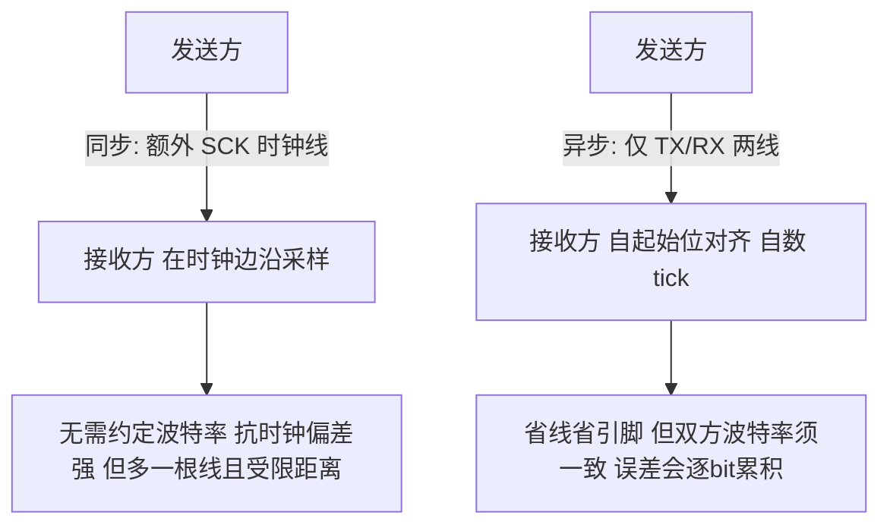

从系统视角看，异步串行把"时钟同步"的成本从硬件（一根线）转移到了"时间精度"（双方晶振与分频必须准）。这在器件成本低、引脚紧张、距离近的场景极具优势；但在高速、长距离、强干扰场景，同步或差分（如 RS485、CAN、LVDS）往往更可靠。理解这一权衡，能帮助我们在选型时作出正确判断，而不是盲目认为"串口简单就够用"。在汽车、工业场景，CAN、LIN（底层仍基于 UART 式异步）之所以取代裸 UART，正是因为它们在误码、仲裁、抗干扰上做了额外工程投入。

---

## 三、帧格式逐字段拆解

### 3.1 一帧的位布局

以最常用的 **8N1**（8 数据位、无校验、1 停止位）为例，一帧的比特结构如下：

```
Idle(高) | Start(1位 0) | Data(8位, LSB先) | Parity(可选0/1位) | Stop(1/1.5/2位 高) | Idle
```

下面用甘特图把一帧在时间轴上的位置画出来（每格 = 1 bit，LSB 先发）。

```mermaid
gantt
    title UART 8N1 异步帧（每格 = 1 bit，LSB 先发）
    dateFormat X
    axisFormat %s
    section 一帧
    Idle(高)    : 0, 1
    Start(0)    : 1, 2
    D0(LSB)     : 2, 3
    D1          : 3, 4
    D2          : 4, 5
    D3          : 5, 6
    D4          : 6, 7
    D5          : 7, 8
    D6          : 8, 9
    D7(MSB)     : 9, 10
    Stop(高)    : 10, 11
    Idle(高)    : 11, 12
```

### 3.2 字段含义表

| 字段 | 位宽 | 含义与作用 |
|------|------|------------|
| **Idle** | 不定 | 线路空闲为高电平，是检测"有新字符"的基准态 |
| **Start** | 1 | 显性（0）下降沿，标志字符开始；接收方据此对齐波特率相位 |
| **Data** | 5~9 | 数据位，**LSB（最低位）先发**，通常 8 位；长度可配置 |
| **Parity** | 0/1 | 奇/偶/无校验；对 Data 位做奇偶统计，检测单 bit 翻转 |
| **Stop** | 1/1.5/2 | 高电平，标志字符结束，给接收方恢复/准备下一字符的时间 |
| **Baud** | — | 每秒符号数（bit/s），双方必须一致，是整条链路的时间基准 |

### 3.3 几个关键点深挖

- **Data 为什么 LSB 先发**：这是历史惯例，源于早期移位寄存器硬件设计——移位寄存器每次右移一位即可自然按 LSB 顺序送出，电路最简单（后文第七章会看到，发送移位器的右移结构确实决定了这一点）。驱动写数据寄存器时若忘记位序约定，会出现"收到的是镜像字节"的现象（例如发 0x01 收到 0x80）。现代 UART 硬件会自动处理位序，软件通常无需手动颠倒，但做位级协议解析或软件模拟 UART（GPIO 翻转，即 bit-banging）时必须牢记 LSB 先。

- **数据位的 5~9 配置**：标准 UART 支持 5、6、7、8、9 位数据位。5~8 位用于普通字节传输；9 位数据位（在 STM32 等上常有）常被用作多点通信的"地址/数据"标志位——第 9 位为 1 表示地址帧、为 0 表示数据帧，配合地址过滤可实现多机总线，省去额外协议层。7 位数据位则常见于某些老式终端或 ASCII 专用设备。需要注意：在很多 IP 实现中，"数据位长度"字段统计的是**含校验位在内的总长度**——例如 STM32 的 M 位设为 1（9 位）时，若同时开启校验（PCE=1），实际是 8 数据位 + 1 校验位，而不是 9 数据位 + 1 校验位。这是初始化时最容易配错的一处。

- **奇偶校验是弱校验**：它只能检测出**奇数个** bit 翻转；若是偶数个 bit 同时出错，奇偶性不变，错误完全检不出。关键场合必须上 CRC 或应用层重传协议。很多工程师误以为"开了校验就安全"，其实串口校验只是防住单 bit 瞬时噪声，对突发成片错误毫无办法。另外，校验位本身也会占用一个 bit 时间，在追求带宽时应权衡是否值得。

- **Stop 1.5 / 2 位**：1.5 停止位主要用于 5 位数据位的老式电传设备（与 1.5 配合凑整字符时间），现代基本不用；2 停止位用于某些慢速或抗干扰要求高的工业模块，用来拉开帧间间隔、给接收方更长的恢复时间，并在连续数据流中提供额外的同步容错余量。要注意有些 MCU 仅支持 1 或 2 停止位，1.5 需要特定配置（智能卡模式下常见 0.5/1.5）或根本不支持。

- **空闲帧（Idle Frame）与 Break 帧**：除了正常数据帧，UART 还有两种特殊帧。Idle 帧指线路持续高电平超过一帧时间，常作为"一包数据结束"的边界信号（STM32 的 IDLE 中断即据此触发）。Break 帧指 TX 持续低电平超过一个完整帧时间（含起始+数据+停止），常用于 LIN 总线唤醒、某些设备进入 Bootloader 的触发序列。

### 3.4 进阶帧用法：9 位多机通信与 LIN Break

在多点总线（如 RS485 上的自定义协议）中，常把数据位配成 9 位：第 9 位作为"地址/数据"标志。发送地址帧时第 9 位置 1，发送数据帧时置 0；从机开启"地址唤醒"（Address Mark Wakeup）中断，只在本机地址匹配时才接收后续数据帧，从而省去软件逐字节过滤、降低总线负载。这是 UART 硬件原生支持的一种轻量多机机制，在 Modbus 类主从网络中很有用。硬件层面，它由接收状态机在"停止位采样完成"时额外比较第 9 位与配置的地址寄存器完成，属于典型的"用一点点门电路换大量 CPU 中断"的设计。

Break 帧（线路持续低电平超过一个完整帧时间）是另一种特殊帧。LIN 总线用它作帧头唤醒从机；某些 MCU 的 Bootloader 也用"收到 Break 后切换到下载模式"。接收方需配置 Break 检测中断（或检测帧错误+线低的组合）来识别，而非当作普通数据处理。下面用状态图表示接收方在各类帧之间的状态流转。

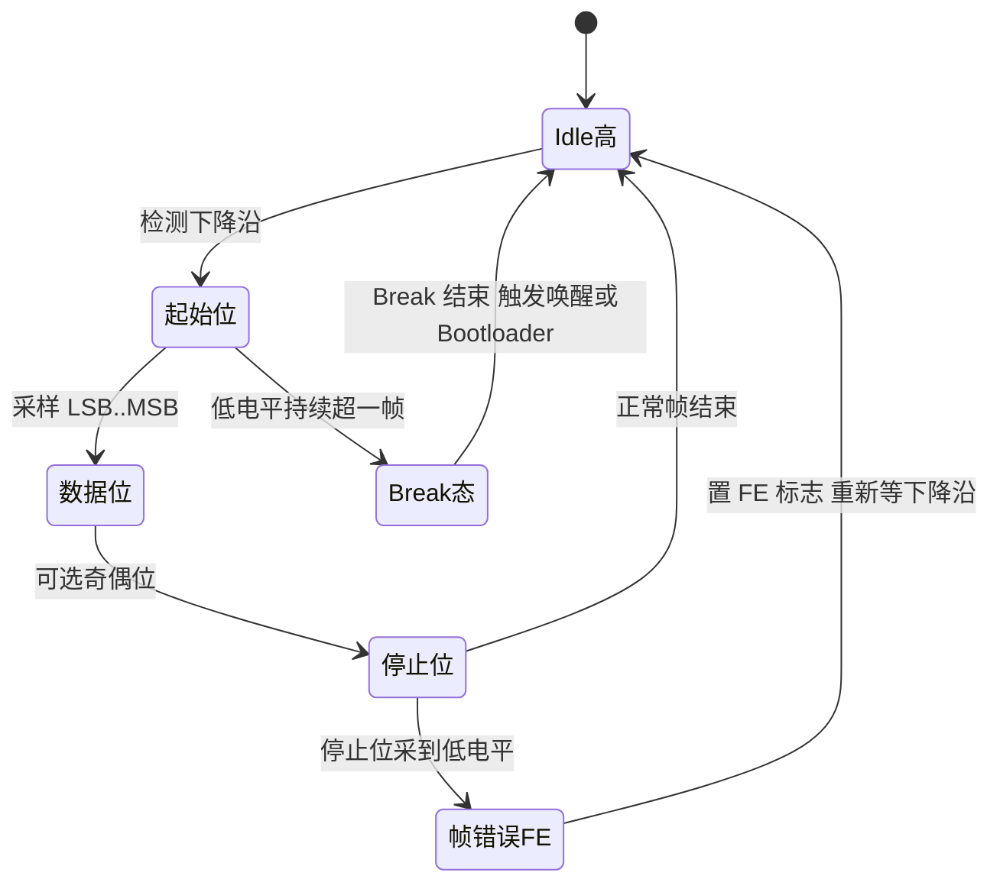

---

## 四、波特率与过采样：误差从哪来、能容忍多少

### 4.1 波特率的来源：时钟分频

波特率误差的根源在**时钟分频**。UART 外设通常用一个分频器把外设时钟（如 16 MHz、80 MHz、48 MHz）除出目标比特率。理想分频系数往往不是整数，硬件只能取整（或配合小数分频），于是实际波特率偏离标称值。

误差计算公式为：

```
实际波特率 = 外设时钟 / (分频值 × 过采样倍数)
误差%      = (实际波特率 − 目标波特率) / 目标波特率 × 100%
```

举例：外设时钟 16 MHz，目标 115200。以 16 倍过采样计，分母应为 16×115200 = 1,843,200，整数分频 16000000 / 1843200 ≈ 8.68，若只能取整为 9，则实际波特率 = 16000000 / (9×16) = 111,111，误差约 −3.5%，**已经超过 2%~3% 的安全经验阈值**，容易出问题。换成 8 倍过采样：分母 8×115200 = 921,600，16000000 / 921600 ≈ 17.36，取整 17，实际 = 16000000 / (17×8) = 117,647，误差约 +2.1%，略好。若硬件支持 1/16 步进的小数分频（分频值可取 8.6875），误差可压到 0.1% 以内。这也是为什么某些时钟树下 115200 比 9600 更容易出问题——并非波特率越高越不稳，而是分频余量在作怪。

### 4.2 过采样（Oversampling）

接收方并不是每个 bit 只采一次，而是以更高的频率对线路采样，以提高抗噪声能力：

- **16 倍过采样（OVER8=0）**：每个 bit 时间内采 16 个 tick，在中间的第 8、9、10 拍做三取二多数表决，判定该 bit 的值。这是传统做法，噪声容限最好。
- **8 倍过采样（OVER8=1）**：每个 bit 采 8 个 tick，在中间第 3、4、5 拍判定。可在高波特率下降低对外设时钟的要求（同样的时钟能跑到更高波特率，上限翻倍），但噪声容限略有下降，且小数分频的最小步进从 1/16 变为 1/8。

过采样还带来一个工程意义：**允许在 Start 下降沿后做亚位对齐**。接收方在检测到下降沿后，会等待半个 bit 时间（在 16x 下是 8 个 tick）才到达位中心，之后再按整 bit 间隔采样数据位，这样即使下降沿检测有 ±1 tick 抖动，也落在采样窗口内。部分高端 UART 还支持 3 倍或可调过采样，并配合数字滤波（对噪声跳变做去抖）进一步提升鲁棒性。

**起始位确认（Start Bit Validation）**是过采样的另一个隐藏用途：硬件在检测到下降沿后，并不立刻认定"起始位来了"，而是在第 3/5/7 拍再采几次，若仍为低电平才确认；若中途回到高电平，则判为噪声毛刺，丢弃并重新等待下降沿，同时可置 NE（噪声标志）。这套机制让 UART 在一定程度上免疫短脉冲干扰——但也意味着**如果线路上有周期性毛刺且宽度超过阈值，接收器会被"骗"进一个假帧**，随后产生 FE 帧错误。现场遇到"没发数据却不断收到 0x00/0xFF"，多半就是这个原因。

### 4.3 误差的累积与容忍阈值

理解误差累积，要抓住一句话：**每个 bit 的采样相位偏差 = 累积的波特率偏差 × 已采样 bit 数**。假设双方累积频率偏差为 e（例如收方快 2%），那么在采样第 N 个 bit 时，相位已经偏离了约 N×e 个 bit 周期。当这个偏离接近 ±0.5 个 bit 时，采样点就滑到了相邻 bit 的边界，判决必然出错。

以 8N1 为例，最后被采样的是第 10 个位（停止位），若要求偏移不超过 ±0.5 bit，则理论上限 e < 5%。但这是"理想采样点恰在位中心"的极限值；实际还要扣掉起始位检测抖动（±1 tick，16x 下为 ±6.25%×1bit=±0.0625bit）、噪声余量、上升/下降沿的斜率损失。因此工程经验值收紧到：

**双方总误差（累加）< 2%~3% 时，单字符内采样点不会滑出位中心；帧越长、数据位越多、停止位越少，越危险。**

所以长日志、长报文、连续多字节场景，要把误差余量留足——这正是开篇"长帧尾部乱码"的数学解释。注意这里是"双方误差累加"：若发送方时钟 +1.5%、接收方 −1.5%，合计 3%，比单边 1.5% 危险得多。

下面用流程图表示误差逐 bit 累积直至误码的过程。


### 4.4 用流程图看分频计算过程

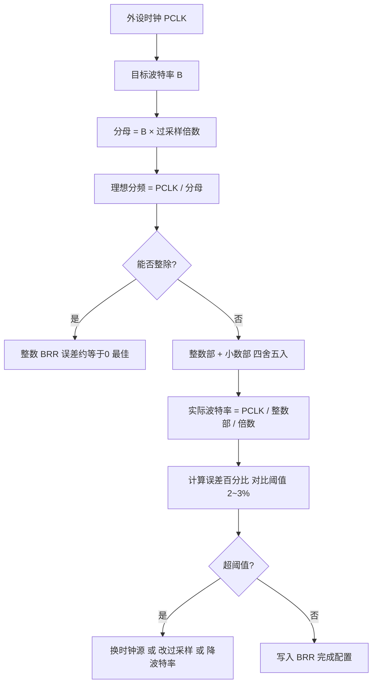

以 STM32 为例，其波特率寄存器 BRR 把 16 位拆成整数部（高 12 位 DIV_Mantissa）和小数部（低 4 位 DIV_Fraction，按 1/16 步进）。当过采样为 8 时，小数部分的刻度变为 1/8，硬件规定 BRR[3] 必须写 0，实际小数位只用 BRR[2:0]。这正是"小数分频"把误差压到 <1% 的工程实现。驱动开发时可直接调用厂商库函数并让其自动计算 BRR，但理解背后的除法能帮你在"库算出来仍乱码"时手动核查。

### 4.5 常见时钟/波特率组合的误差速查

下表给出几个典型组合的误差（16x 过采样、纯整数分频，不使用小数部分），说明"为什么老工程师喜欢 11.0592 MHz 这种奇怪的晶振"。

| 外设时钟 | 目标波特率 | 理想分频 | 取整分频 | 实际波特率 | 误差 |
|---------|-----------|---------|---------|-----------|------|
| 16 MHz | 9600 | 104.17 | 104 | 9615 | +0.16% |
| 16 MHz | 115200 | 8.68 | 9 | 11111 ×10 = 111111 | −3.55% |
| 11.0592 MHz | 115200 | 6.00 | 6 | 115200 | 0.00% |
| 48 MHz | 115200 | 26.04 | 26 | 115385 | +0.16% |
| 80 MHz | 921600 | 5.43 | 5 | 1000000 | +8.51% |
| 80 MHz | 921600（8x） | 10.85 | 11 | 909091 | −1.36% |

结论一目了然：**11.0592 MHz、14.7456 MHz、18.432 MHz 这类"看起来奇怪"的晶振，正是 115200 及其倍数的整数倍**，能把误差压到零，这是几十年前留下的工程智慧。而高主频（80 MHz）配高波特率（921600）时，若只能整数分频，误差反而可能爆炸——此时必须启用小数分频或切换过采样倍数。

### 4.6 误差的另一来源：时钟源精度与温漂

即使分频系数算得完美，若时钟源本身精度差（如内部 RC 振荡器 ±1%~±2% 出厂偏差、全温区可能到 ±5%），也会吃掉全部余量；而外部晶振（Xtal）通常 ±10~30 ppm（0.001%~0.003%），几乎可以忽略。所以在精度敏感场景，要优先用外部晶振作为 UART 时钟源，并关注 MCU 主频配置（PLL 倍频误差也会传导到波特率）。

笔者的经验：在都用内部 HSI RC 的两条板子互连时，若各自偏差方向相反，叠加误差可能突破阈值；用外部 HSE 晶振则可彻底规避。另一个常被忽略的细节是**低功耗唤醒后的时钟切换**——系统从 Stop 模式恢复时可能先跑内部 RC、几百微秒后才切回 PLL，这段窗口内如果有串口数据到来，波特率是错的，表现为"每次唤醒后第一帧必错"。解决办法：唤醒后先等时钟稳定标志置位再使能 UART 接收，或直接把 UART 时钟源独立配置为 HSI/LSE（多数现代 MCU 支持外设时钟源独立选择）。

---

## 五、流控：什么时候必须加、怎么加

### 5.1 为什么需要流控

UART 接收方处理数据需要时间。如果发送方来得太快、接收方缓冲区（FIFO 或软件环形缓冲）来不及取走，就会发生**溢出（Overrun）**，导致字节永久丢失。流控的目的就是让接收方有能力"叫停"发送方。要注意：UART 本身没有"背压"机制，接收方不会自动让发送方减速，必须显式设计流控。

可以做个量化估算：115200 bps、8N1 下，每字节 10 bit，字节间隔约 86.8 µs。若接收方是纯中断模式、ISR 进出开销 2 µs、但被一个 200 µs 的高优先级任务屏蔽，则这段时间内会有约 2.3 个字节到达。若硬件 FIFO 只有 1 级（无 FIFO），第二个字节到来时第一个还没被读走，直接触发 ORE。这就是"为什么没有 FIFO 的 MCU 在高波特率下必须上 DMA 或流控"的定量依据。

### 5.2 硬件流控 RTS/CTS

硬件流控使用两根额外的信号线：

- **RTS（Request To Send，请求发送）**：由接收方驱动，表示"我准备好接收了"。注意在现代 UART 语境里 RTS 是**本机接收缓冲状态的输出**，用来告诉对方"我可以收"（与传统 modem 的半双工请求语义略有差异，建议以器件手册为准）。
- **CTS（Clear To Send，清除发送）**：由对端 RTS 驱动的**输入**，发送方在启动一个新字符前检查自己的 CTS 输入，若为有效电平才允许发送。

典型接法：A 的 RTS 连 B 的 CTS，B 的 RTS 连 A 的 CTS，形成双向握手。当 B 的接收 FIFO 达到设定阈值时，硬件自动把 RTS 置为无效，A 的 CTS 检测逻辑在**下一个字符边界**阻止发送器启动，直到 CTS 恢复。硬件流控的优点是**不占用数据通道、不破坏协议、响应快**，适合高速（>1 Mbps）或接收方处理慢（如 MCU 正忙其他任务）的场景。许多 USB 转串口芯片（如 FT232、CP210x）原生支持 RTS/CTS，PC 端也方便开启。

一个重要细节：CTS 是在**字符边界**检查的，一旦某字符已经开始移位输出，就必须发完。因此从"对方拉无效 RTS"到"本机真正停下"，最坏延迟 = 线路传播延迟 + 当前字符剩余时间 + 已在 TX FIFO 中排队的字符数 × 字符时间。**这意味着接收方的 RTS 触发阈值必须留出足够余量**（典型做法：FIFO 深度的 3/4 处拉无效，而不是满了才拉），否则仍会溢出。

### 5.3 软件流控 XON/XOFF

软件流控不增加信号线，而是在数据流中插入控制字符：

- **XOFF（0x13, DC3）**：接收方缓冲快满时，向发送方发一个 XOFF，请求暂停。
- **XON（0x11, DC1）**：接收方缓冲腾出空间后，发 XON 恢复发送。

软件流控的致命缺点：控制字符会**混在数据中**，若数据本身恰好含有 0x11 / 0x13 就必须转义，否则会被误判为流控命令；此外它有延迟（XOFF 字符本身要排在已有发送队列之后），不适合高速或二进制透明传输。因此二进制协议几乎都用硬件流控或干脆靠协议层窗口控制。文本终端（如老式 console）才常用 XON/XOFF。

### 5.4 何时需要流控

- 波特率较高（≥1 Mbps）且接收方 CPU 可能短时繁忙（如处理中断、跑 RTOS 高优先级任务）时，强烈建议硬件流控。
- 文件传输（XMODEM/YMODEM）、大批量日志、AT 指令 modem 场景常用 RTS/CTS。
- 若双方都有足够深的 FIFO + DMA，且协议有应用层握手（如请求-应答、固定窗口），可省去硬件流控。
- 很多板子图省事没接流控线，结果高峰期丢字节，定位极难——这是现场最隐蔽的一类问题。笔者的建议是：只要链路速率上 Mbps 且接收方非确定性繁忙，就在原理图阶段就把 RTS/CTS 画上，哪怕默认不使能，也留好后路。

### 5.5 硬件流控握手时序

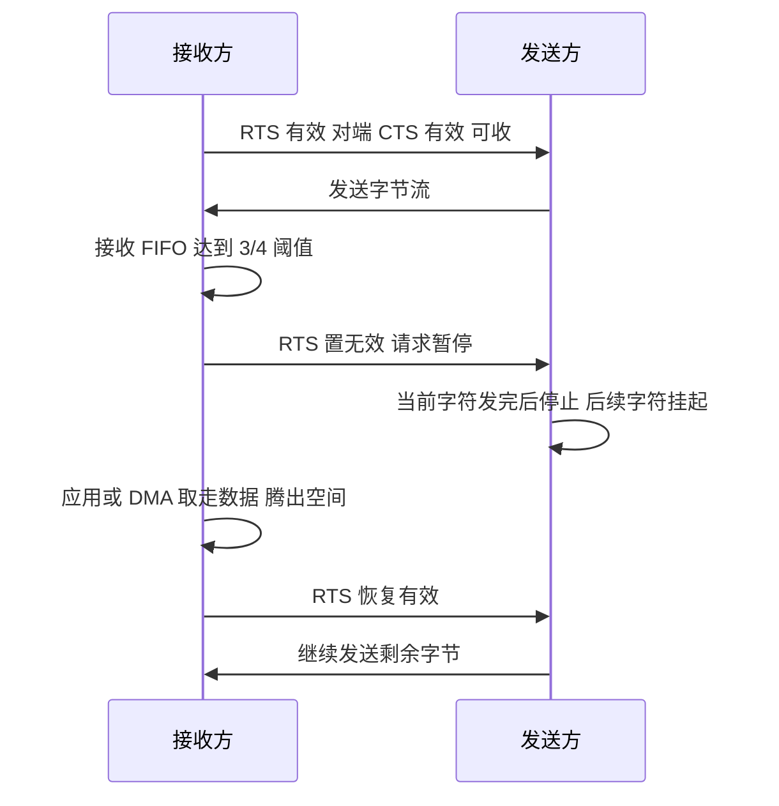

硬件流控的精髓在于：暂停信号通过独立的 CTS 线传递，不占用数据通道，也不破坏已有协议字节；且因为是电平信号，响应延迟仅取决于线路与发送方对 CTS 的检测粒度。对于"发送方是 PC、接收方是慢速 MCU"的场景，RTS/CTS 几乎是必选项。

---

## 六、电平标准：TTL / RS232 / RS485

### 6.1 三种电平标准对比

| 标准 | 逻辑电平 | 工作方式 | 典型距离 | 拓扑 | 备注 |
|------|----------|----------|----------|------|------|
| **TTL** | 0V=逻辑0，3.3V/5V=逻辑1（正向） | 单端 | <1 m（板内） | 点对点 | MCU IO 原生电平，不可长线 |
| **RS232** | +3~+15V=逻辑0，−3~−15V=逻辑1（反相） | 单端 | ≤15 m | 点对点 | 电平与极性都反，需电平转换芯片（如 MAX3232） |
| **RS485** | 差分：A−B > +200mV 为1，< −200mV 为0 | 差分、半双工/全双工 | ≤1200 m | 多点总线（32~256 节点） | 需终端电阻、偏置电阻、方向控制 |

### 6.2 TTL

TTL 串口是 MCU 引脚原生的逻辑电平（3.3V 或 5V 系统），空闲高电平、起始低电平的电平语义与逻辑一致。它只能用于板内或极短距离（几十厘米内）的板间连接，长线会受地电位差和共模噪声严重干扰。**TTL 直连 RS232 会瞬间烧毁 IO**——因为 RS232 的负电压会超出 MCU 绝对最大额定值，这是新手最常见的硬件事故。此外，3.3V 与 5V TTL 互连也要注意：5V 器件输出高电平可能超出 3.3V 器件输入容忍范围，需串联电阻、加电平转换器或确认引脚是否 5V-tolerant。

### 6.3 RS232

RS232 的致命特点是**电平与极性都反**：逻辑 0 对应 +12V（典型），逻辑 1 对应 −12V。它用单端方式传输，抗共模干扰能力弱，距离一般限制在 15 米内，实际工程中常更短。MCU 的 TTL 必须经过电平转换芯片（如 MAX3232、SP3232，内部用电荷泵产生 ±电压）才能对接 RS232 设备（如老式工控机、GPS 模块、某些调试串口）。调试前务必确认两端电平标准，切勿 TTL 直插 RS232。还要留意 DB9 接口的引脚定义（TXD/RXD/GND 通常对应 3/2/5），交叉线（NULL modem）与直连线的区别常是"能识别但收不到"的元凶。

### 6.4 RS485：差分、半双工、端接与方向控制

RS485 采用**差分信号**（A、B 两线），接收方判决的是 A−B 的电压差而非绝对电平，因此抗共模干扰和长距离传输能力远强于 RS232，标准允许最长约 1200 米、最多挂载 32 个单位负载（用 1/8 负载收发器可扩展到 256 个）节点，构成多点总线。

RS485 的工程注意点：

- **半双工方向控制**：绝大多数 RS485 收发器是半双工的，同一对差分线分时收发，需要一根 GPIO（DE/~RE 控制脚，常合并驱动）来切换方向。发送前拉高使能发送，发送完成（包括停止位）后**必须等到最后一个 bit 真正发完**才能切回接收，否则会截掉帧尾，造成对端帧错误——这是 RS485 最经典的坑（见 1.2 场景与第十二章）。
- **终端匹配（Termination）**：长距离、高速（如 115200 以上）时，双绞线特性阻抗约 120Ω，必须在总线**两端**各并一个 120Ω 终端电阻，否则信号在末端反射，造成码间干扰和误码。短距离低速（如 <1m、<9600）时可省略。切忌每个节点都并一个 120Ω——那会把总线负载压垮，导致差分幅度不足。
- **偏置电阻（Bias）**：为确保总线空闲时有确定的差分电平（避免浮动导致误触发），常在 A 线上拉、B 线下拉一个偏置电阻（典型 560Ω~1kΩ），使空闲态 A−B > +200mV，被判决为逻辑 1（即空闲高电平，符合 UART 约定）。无偏置时，总线空闲悬浮可能被噪声误判为起始位，表现为"没人发数据却不停收到垃圾字节"。
- **接地与隔离**：长距离多点 RS485 建议共地（用双绞线中的第三根或屏蔽层单点接地）或加光耦/数字隔离器，避免地电位差超出共模范围（−7V~+12V）。不共地且压差过大时，会用隔离型收发器切断地环路。
- **总线拓扑**：必须是"手拉手"的菊花链，尽量避免星型和长支线（stub）。支线长度应远小于信号上升时间对应的电长度，否则同样会引起反射。

### 6.5 电平标准的拓扑对比

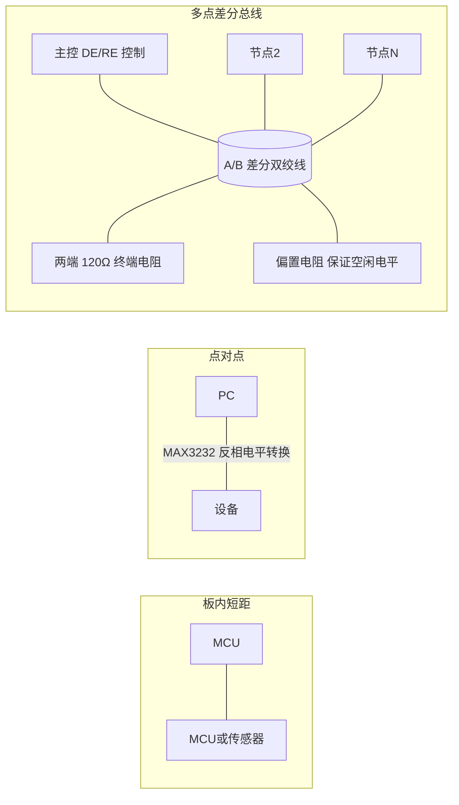

RS485 多点总线中，所有节点挂在同一对差分线上，靠地址或方向调度避免冲突。主控发数据时拉高自身 DE 并（半双工下）使其他节点处于接收态；收到后应应答的节点再切到发送。这种"令牌/主从"式总线要靠协议约定，否则会出现总线抢占冲突（RS485 本身不仲裁，不像 CAN 有非破坏性仲裁，两个节点同时发送会造成差分电平打架，双方数据全毁）。因此 RS485 上通常跑 Modbus RTU 这类明确主从、带应答超时的协议。

---

## 七、芯片模块设计：USART 控制器 IP 内部架构

> 这一章是本文与常见入门文章拉开差距的地方。绝大多数工程师只会"配寄存器"，而不知道寄存器背后的门电路在做什么。当你理解了 IP 内部的数据通路与状态机，很多"手册没写清楚"的行为就能自己推导出来——例如"为什么 TXE 置位时数据还没发完""为什么读 DR 会清 RXNE""为什么改波特率必须先关 UE"。

### 7.1 从"外设"到"IP"：一个 UART 控制器里到底有什么

在 SoC/MCU 中，USART 是一个挂在低速外设总线（APB）上的 IP 核。它的职责可以拆成六个功能块：

1. **总线接口与寄存器文件（Register File）**：把 CPU/DMA 的 APB 读写译码到内部寄存器，处理读写副作用（如"读 DR 清 RXNE"）。
2. **波特率发生器（Baud Rate Generator, BRG）**：把外设时钟分频出过采样时钟（16x 或 8x 位速率）。
3. **发送通道（TX Path）**：TX FIFO → 发送移位寄存器 → 帧组装（加起始位/校验位/停止位）→ TX 引脚。
4. **接收通道（RX Path）**：RX 引脚 → 数字滤波/起始位确认 → 采样与多数表决 → 接收移位寄存器 → 校验/帧检查 → RX FIFO。
5. **控制状态机（Control FSM）**：管理空闲/起始/数据/校验/停止/Break 各状态的迁移，生成标志位。
6. **中断与 DMA 请求生成（Event Unit）**：把标志位与使能位相与，产生 IRQ 与 DMA 请求握手信号。

外加两个横切关注点：**时钟/复位域管理**与**扩展模式编码器**（IrDA/LIN/SmartCard/RS485-DE 自动控制）。

### 7.2 顶层模块架构框图

下图是一个典型 USART IP 的内部架构（综合了主流厂商实现的公共结构）。这就是本章的核心——**芯片模块框图**。

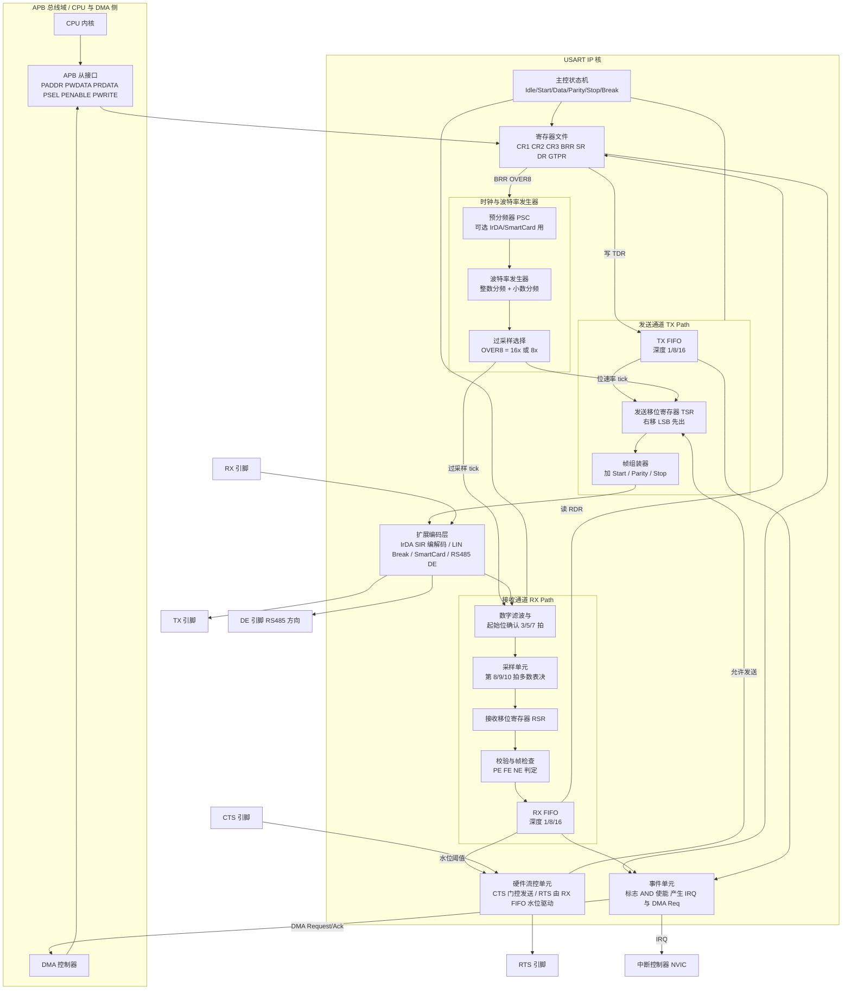

读图要点：

- **数据只有两条通路**：写 TDR 进 TX FIFO，读 RDR 出 RX FIFO。所有"是否发得出去""是否收得进来"的问题，最终都落在这两条通路上的某个环节被卡住。
- **时钟只有一条源头**：BRG 输出的过采样 tick 同时驱动 TX 移位与 RX 采样，所以本机收发波特率必然一致（除非 IP 支持独立收发分频，少数器件有）。
- **流控与 FIFO 强绑定**：RTS 的产生依赖 RX FIFO 水位，没有 FIFO 的极简 IP 往往只能由软件模拟 RTS。
- **扩展模式在最外层**：IrDA/LIN/SmartCard 都是在"标准 NRZ 帧"之上再套一层编码或时序约束，不改变内核的移位与采样逻辑。这解释了为什么这些模式的波特率配置方式与普通 UART 完全一致。

### 7.3 APB 总线接口层

USART 作为 APB 从设备，实现的是最简单的两拍访问协议：`PSEL` 选中、`PENABLE` 进入访问相、`PWRITE` 区分读写、`PADDR` 低位做寄存器译码。IP 内部通常做三件额外的事：

1. **地址译码与非法访问处理**：未实现的地址返回 0 或产生 `PSLVERR`。
2. **读写副作用（Side Effect）生成**：这是 UART 寄存器最"反直觉"的地方。经典实现里，读 DR 会**自动清 RXNE**，读 SR 后再读 DR 会**清 ORE/FE/PE/NE**（所谓"读 SR then 读 DR"序列）。这些副作用由译码逻辑产生一个单周期脉冲送给状态机，而不是软件写 1 清零。新一代 IP（如 STM32 的 USARTv2）改成了独立的 ICR（Interrupt Clear Register）写 1 清零，语义更清晰，也更适合 DMA 场景。
3. **跨时钟域同步**：APB 运行在总线时钟 `PCLK`，而收发逻辑运行在 UART 内核时钟 `ker_ck`（可能来自 HSI/LSE/PLL）。寄存器写入的控制位需要打两拍同步到内核时钟域，标志位回读也要同步回总线域。这就是**为什么手册常写"某些控制位只能在 UE=0 时修改"**——因为 IP 无法保证运行中跨域改配置的时序安全。

### 7.4 寄存器组总览

一个典型 USART IP 的寄存器映射如下（偏移与命名沿用经典实现的习惯）：

| 偏移 | 名称 | 全称 | 主要职责 |
|------|------|------|----------|
| 0x00 | **SR / ISR** | Status Register | TXE、TC、RXNE、IDLE、ORE、FE、PE、NE、CTS 等状态标志 |
| 0x04 | **DR / TDR-RDR** | Data Register | 写=送入 TX FIFO；读=从 RX FIFO 取出（新 IP 拆成 TDR/RDR 两个地址） |
| 0x08 | **BRR** | Baud Rate Register | 波特率分频值，整数部 + 小数部 |
| 0x0C | **CR1** | Control Register 1 | UE、TE、RE、M0/M1、PCE、PS、OVER8 及各类中断使能 |
| 0x10 | **CR2** | Control Register 2 | STOP[1:0] 停止位、LINEN、CLKEN 同步模式、地址匹配 ADD |
| 0x14 | **CR3** | Control Register 3 | DMAT/DMAR、RTSE/CTSE 流控使能、HDSEL 半双工、IREN 红外、DEM/DEP RS485 |
| 0x18 | **GTPR** | Guard Time & Prescaler | 智能卡保护时间、IrDA/SmartCard 预分频 |
| 0x1C | **ICR** | Interrupt Clear Register | 写 1 清除对应标志（新一代 IP） |

### 7.5 寄存器位域图

下图把最关键的四个寄存器的位域画出来（仅列常用位，位置按主流实现的通用布局示意）。这就是本章要求的**寄存器/位域图**。

```mermaid
flowchart TB
    subgraph CR1["USART_CR1 控制寄存器 1"]
      direction LR
      C1["bit28 M1<br/>数据长度高位<br/>M1:M0=00 8位 01 9位 10 7位"] --- C2["bit15 OVER8<br/>0=16倍过采样<br/>1=8倍过采样"] --- C3["bit13 UE<br/>USART 总使能<br/>改配置前须清零"] --- C4["bit12 M0<br/>数据长度低位"] --- C5["bit10 PCE<br/>校验使能"] --- C6["bit9 PS<br/>0=偶校验 1=奇校验"]
      C6 --- C7["bit7 TXEIE<br/>发送空中断使能"] --- C8["bit6 TCIE<br/>发送完成中断使能"] --- C9["bit5 RXNEIE<br/>接收非空中断使能"] --- C10["bit4 IDLEIE<br/>空闲中断使能"] --- C11["bit3 TE<br/>发送使能"] --- C12["bit2 RE<br/>接收使能"]
    end

    subgraph CR2["USART_CR2 控制寄存器 2"]
      direction LR
      D1["bit31-24 ADD<br/>多机地址匹配值"] --- D2["bit14 LINEN<br/>LIN 模式使能"] --- D3["bit13-12 STOP<br/>00=1位 01=0.5位<br/>10=2位 11=1.5位"] --- D4["bit11 CLKEN<br/>同步时钟输出使能"] --- D5["bit6 LBDIE<br/>LIN Break 检测中断"]
    end

    subgraph CR3["USART_CR3 控制寄存器 3"]
      direction LR
      E1["bit15 DEP<br/>DE 极性"] --- E2["bit14 DEM<br/>硬件 DE 使能 RS485"] --- E3["bit10 CTSE<br/>CTS 硬件流控使能"] --- E4["bit8 RTSE<br/>RTS 硬件流控使能"] --- E5["bit7 DMAT<br/>发送 DMA 请求使能"] --- E6["bit6 DMAR<br/>接收 DMA 请求使能"] --- E7["bit3 HDSEL<br/>单线半双工"] --- E8["bit1 IREN<br/>IrDA 模式使能"]
    end

    subgraph SR["USART_SR / ISR 状态寄存器"]
      direction LR
      F1["bit9 CTS<br/>CTS 电平变化标志"] --- F2["bit7 TXE<br/>发送数据寄存器空<br/>可写下一字节"] --- F3["bit6 TC<br/>发送完成<br/>移位器与停止位均已发出"] --- F4["bit5 RXNE<br/>接收数据寄存器非空"] --- F5["bit4 IDLE<br/>线路空闲检测"] --- F6["bit3 ORE<br/>溢出错误"] --- F7["bit2 NE<br/>噪声错误"] --- F8["bit1 FE<br/>帧错误 停止位为0"] --- F9["bit0 PE<br/>校验错误"]
    end

    subgraph BRR["USART_BRR 波特率寄存器"]
      direction LR
      G1["bit15-4 DIV_Mantissa<br/>分频整数部分 12 bit"] --- G2["bit3-0 DIV_Fraction<br/>分频小数部分 4 bit<br/>OVER8=1 时 bit3 必须为 0"]
    end

    CR1 --> SR
    BRR --> SR
```

**位域使用的三条铁律：**

1. **UE 是总闸**：修改 M0/M1、PCE、PS、STOP、OVER8、BRR 等"帧结构与时序"相关位，必须先 `UE=0`，配置完再 `UE=1`。原因见 7.3——跨时钟域配置在运行中无法保证时序收敛，硬件不承诺行为。
2. **TXE ≠ TC**：TXE 表示"发送数据寄存器（或 FIFO）有空位，可以写下一个字节"，此时上一个字节可能还在移位器里；TC 表示"移位器也空了，最后一个停止位已经推出引脚"。**RS485 方向切换、进入低功耗前关闭 UART，必须等 TC 而不是 TXE。**
3. **错误标志与 RXNE 的清除顺序有讲究**：老 IP 需要"读 SR，再读 DR"才能清 ORE；新 IP 用 ICR 写 1 清。用 DMA 接收时，DMA 只会读 DR，**不会去读 SR**，所以错误标志必须由中断或轮询单独清理，否则 ORE 一旦置位就会持续屏蔽后续接收。

### 7.6 波特率发生器（BRG）的内部实现

BRG 是一个带小数累加的分频器，其典型电路结构为：

- 一个 12 位的**整数计数器**，从 `DIV_Mantissa` 装载，每个 `ker_ck` 周期减一，减到 0 时产生一个"过采样 tick"并重装载。
- 一个 4 位的**小数累加器**，每产生一次 tick 就累加 `DIV_Fraction`；当累加器溢出（超过 16）时，让本次整数计数器多计一个周期。这样在长时间平均意义上实现了 N + F/16 的等效分频比。
- 一个 `÷16` 或 `÷8` 的**位时钟分频**（由 OVER8 选择），把过采样 tick 变成实际的位速率 tick。

用公式表达（OVER8=0 时）：

```
USARTDIV  = DIV_Mantissa + DIV_Fraction / 16
波特率     = ker_ck / (16 × USARTDIV)     ... OVER8 = 0
波特率     = ker_ck / (8  × USARTDIV)     ... OVER8 = 1（此时小数刻度为 1/8）
```

注意小数分频带来的副作用：**位周期不再严格等长**，会在 N 与 N+1 个时钟之间抖动。这个抖动最大为 1 个 `ker_ck` 周期，相对位周期而言极小（例如 80 MHz 时钟、115200 波特，位周期约 694 个时钟，抖动 <0.15%），完全在容限内。但如果 `ker_ck` 只比波特率高十几倍（例如用 32.768 kHz LSE 跑 9600），抖动占比就会显著上升——这正是 LPUART 需要专门设计更宽分频器（如 20 位、且要求 USARTDIV ≥ 0x300）的原因。

### 7.7 发送通道：FIFO、移位器与帧组装

发送路径的时序如下：

1. 软件（或 DMA）向 TDR 写一个字节 → 进入 **TX FIFO**。
2. 若发送移位寄存器 TSR 为空且 TE=1 且（若开启 CTSE）CTS 有效，FIFO 头部字节被并行装载进 TSR，同时 TXE 置位（FIFO 又有空位了）。
3. **帧组装器**先推出一个低电平（起始位），然后 TSR 每来一个位速率 tick 就右移一位，把 LSB 送到输出；数据位发完后，若 PCE=1，把奇偶生成器（对数据位做异或树）的结果作为校验位推出；最后推出 1/1.5/2 个位时间的高电平（停止位）。
4. 当 TSR 空且 FIFO 也空、停止位推完时，置 **TC**。

几个硬件细节值得注意：

- **奇偶生成器是一棵异或树**，纯组合逻辑，不消耗额外时钟，所以开启校验不会降低吞吐，只是每帧多一个位时间。
- **TE 位的置位会先发一个空闲帧**（部分 IP 行为）：从 TE=0 切到 TE=1 时，硬件会先驱动一个完整帧时间的高电平，确保线路处于确定的空闲态。这解释了"为什么使能发送后第一个字节会延迟一帧时间才出来"。
- **半双工单线模式（HDSEL）**下，TX 与 RX 内部短接到同一个引脚，硬件会在发送时自动屏蔽接收（避免收到自己发的回环），发送结束后自动切回接收。这是"软件 RS485 方向控制"之外的另一种实现路径，但它只解决内部回环，外部收发器的 DE 仍需 DEM 或 GPIO 控制。

### 7.8 接收通道：滤波、采样与多数表决

接收路径是整个 IP 里最精巧的部分：

1. **输入同步与数字滤波**：RX 引脚先经过两级触发器同步到 `ker_ck` 域（消除亚稳态），再经过一个可选的毛刺滤波器。
2. **起始位检测与确认**：检测到下降沿后，硬件启动过采样计数器；在 16x 模式下，它会在第 3、5、7 拍再采三次，**三次都为 0 才确认起始位有效**；若不全为 0，则判为噪声，置 NE 并回到空闲等待。这一步同时完成了相位对齐：计数器从下降沿重新开始，使后续采样点自动落在位中心。
3. **数据位采样与多数表决**：每个位周期的第 8、9、10 拍各采一次，三取二判定。若三次采样不一致，说明位中心附近有跳变，置 **NE 噪声标志**（但数据仍按多数值接收）。
4. **移位与校验**：采样结果从 MSB 侧移入接收移位寄存器 RSR（LSB 先到，所以是右移进、最终对齐到低位）；数据位收完后校验位与本地异或树结果比对，不符则置 **PE**。
5. **停止位检查**：在停止位应有的位置采样，若为低电平则置 **FE 帧错误**——这正是波特率偏差过大时最典型的表现。
6. **入 FIFO 与溢出判定**：整帧无误则写入 RX FIFO，置 RXNE。若 FIFO 已满而新帧又到达，则新数据被丢弃（或覆盖，视实现而定）并置 **ORE**。

**这里有一条极重要的推论**：ORE 是在"下一帧收完准备入 FIFO"时才置位的，也就是说**当你看到 ORE 时，已经确定丢了至少一个字节**，且丢的是"最后到达的"还是"FIFO 里最老的"取决于实现。这就是为什么可靠系统不能依赖"检测到 ORE 再补救"，而必须从架构上（DMA + 足够深的缓冲 + 流控）杜绝溢出。

### 7.9 硬件流控单元与 RS485 DE 自动控制

流控单元是一组比较器与门控逻辑：

- **RTS 输出**：比较 RX FIFO 当前水位与阈值（可配置为 1/8、1/4、1/2、3/4、7/8 深度），超过阈值则把 RTS 置无效。
- **CTS 门控**：CTS 输入经同步后，作为发送状态机"启动新字符"的使能条件；CTS 在字符中途变化不会打断当前字符。

**DEM（Driver Enable Mode）**是现代 USART IP 为 RS485 提供的杀手锏：硬件自动在"发送第一个起始位之前"拉高 DE 引脚，在"最后一个停止位发完之后"拉低。而且提供两个可配置的时间参数：

- **DEAT（Driver Enable Assertion Time）**：起始位之前提前多少个采样时间拉高 DE，用于补偿收发器的使能建立时间。
- **DEDT（Driver Enable De-assertion Time）**：停止位之后延迟多少个采样时间才拉低 DE，用于确保最后一位完整驱动到总线。

启用 DEM 后，软件完全不需要在中断里翻转 GPIO，从根本上消灭了 1.2 节那类"方向切换早了"的 bug。**如果你的 MCU 支持 DEM，永远优先用它。** 只有在老器件或 DE 引脚不在复用功能上时，才退回软件 GPIO 控制（见 10.6 节代码）。

### 7.10 扩展模式：IrDA、LIN、SmartCard

这三种模式共享同一套收发内核，只是在最外层插入了不同的编码/时序层：

| 模式 | 硬件增加的逻辑 | 典型配置 | 应用 |
|------|---------------|---------|------|
| **IrDA (SIR)** | 发送时把逻辑 0 编码成 3/16 位宽的脉冲；接收时脉冲解码回 NRZ | IREN=1，配 GTPR 预分频产生 IrDA 载波基准 | 红外遥控、老式手持设备 |
| **LIN** | Break 生成器（发 13 位以上低电平）、Break 检测器、同步域检测 | LINEN=1，固定 8N1，波特率 ≤20 kbps | 汽车车身网络从节点 |
| **SmartCard** | 半双工单线、0.5/1.5 停止位、NACK 自动重发、保护时间 GT | SCEN=1，配 GTPR 的保护时间字段 | ISO 7816 IC 卡读卡器 |
| **RS485 DE** | DE 自动使能与 DEAT/DEDT 定时 | DEM=1，配 DEAT/DEDT | 工业半双工总线 |

理解这一层的价值在于：**当你在手册里看到几十页的 IrDA/SmartCard 章节时，不必恐惧——它们都不改变波特率与帧的核心机制**，只是外挂了一层编码或时序约束。

### 7.11 时钟域与复位域

一个 USART IP 至少涉及两个时钟域：

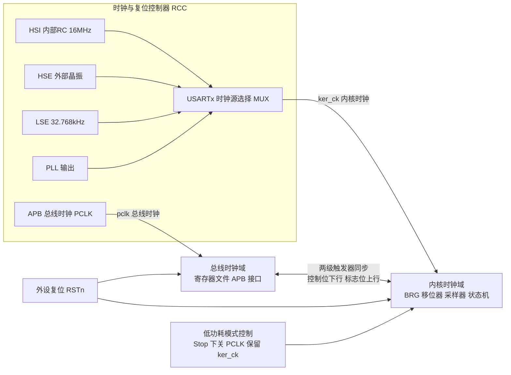

工程含义：

- **时钟源可独立选择**是现代 MCU 的重要特性。把 USART 的 `ker_ck` 配成 HSI 或 LSE，可以让串口波特率不随系统主频（PLL 动态调频、低功耗降频）而改变，避免"跑 DVFS 时串口就乱码"。
- **Stop 模式唤醒**依赖 `ker_ck` 在 Stop 下仍然运行（LSE/HSI 可保持），而 `pclk` 关闭。此时 IP 用内核时钟检测起始位或地址匹配，命中后再请求唤醒总线时钟域。这就是 LPUART "Stop 模式下接收唤醒"的硬件基础。
- **复位域**：外设复位会把所有寄存器恢复默认值，包括 UE=0。驱动初始化的第一步应该是"复位外设 → 使能时钟 → 配置 → 使能"，而不是直接改寄存器，否则会继承上一次运行（如 Bootloader）留下的状态。这是 A/B 分区升级场景下"跳转到 App 后串口不工作"的常见根因。

### 7.12 中断与 DMA 请求的产生：双缓冲协作

事件单元的逻辑极简：`IRQ = Σ (Flag_i AND Enable_i)`。所有标志共用一条中断线（多数 MCU 上一个 USART 只占一个 NVIC 向量），所以 ISR 必须逐个判别标志。

DMA 请求则更精细：

- **DMAR（接收请求）**：RX FIFO 非空（或达到水位）时拉高请求线，DMA 响应后读 RDR，硬件自动撤销请求。
- **DMAT（发送请求）**：TX FIFO 有空位时拉高请求线，DMA 写 TDR 后撤销。

下图展示 DMA 双缓冲（Ping-Pong）与 USART 的协作时序，这是高速连续接收的标准架构：

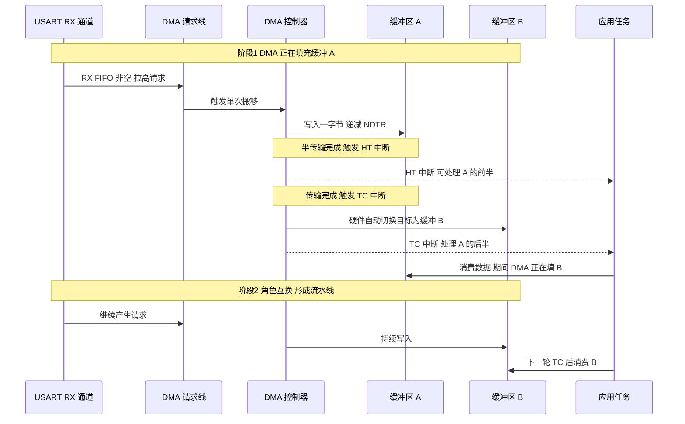

双缓冲的**约束条件**必须量化：设缓冲区大小为 S 字节、波特率为 R bps、8N1（每字节 10 bit），则填满一块的时间 T = S × 10 / R 秒。**应用处理一块的耗时必须显著小于 T**（工程上建议留 50% 余量），否则 DMA 追上应用，数据被覆盖且没有任何标志提示——这正是 1.3 节场景的根因。例如 S=512、R=115200，T ≈ 44.4 ms，应用处理必须在 22 ms 内完成，这个预算通常很宽裕；但若 R=3 Mbps，T 只有 1.7 ms，就必须精打细算了。

---

## 八、三种收发模型：中断、FIFO、DMA

UART 接收（以及高速发送）有三类典型工程模型，各有适用场景。选型的原则是：在可接受的开销下，让 CPU 在"搬运字节"这件事上花的时间尽可能少。

### 8.1 纯中断驱动（每字节进一次 ISR）

最简单：每收到一个字节触发一次 RXNE 中断，在中断里把数据搬到软件缓冲。优点是逻辑直观、延迟低、实现快；缺点是**高速时中断频率过高**，115200 下约每 86.8 µs 一个字节，若每字节都进中断，CPU 被严重占用，且一旦中断被高优先级任务阻塞就可能溢出。仅适合低速（如 9600~19200）、数据量小的场景，或作为教学示例。在带 RTOS 的系统里，每字节中断还会带来多次上下文切换，开销惊人。

量化一下：Cortex-M4 @ 72 MHz，一次中断进出（压栈、跳转、判标志、搬字节、出栈）约 40~60 个周期，即 0.6~0.85 µs。在 921600 bps 下字节间隔仅 10.8 µs，中断开销占比达到 6~8%；若同时收发双向满负荷，占比翻倍。加上其它外设中断，CPU 很快就会成为瓶颈。

### 8.2 FIFO 模式

许多 UART（尤其 PC 串口芯片 16550 及衍生、部分 MCU）内置硬件 FIFO（如 8/16/32 字节）。接收 FIFO 在积攒到一定阈值（如 8 字节）或超时（字符间超时，Character Timeout，通常为 3~4 个字符时间无新数据）才触发一次中断，把一批数据一次性搬走，大幅降低中断频率。发送 FIFO 则允许一次填入多个字节，硬件自动逐字节发出。

FIFO 是"中断驱动"的增强版，是很多中速场景的默认选择。配置 FIFO 时要设置触发级别与超时中断，在"及时性"与"中断频率"之间权衡：

- 阈值设太高（如 7/8 满）：中断少、CPU 省，但单字节的响应延迟大（要等凑够才通知），且留给软件的溢出余量小。
- 阈值设太低（如 1/8）：响应快，但中断频率接近纯中断模式，失去 FIFO 意义。
- 典型折中：**接收阈值 1/2 或 3/4，配合字符超时中断兜底**；发送阈值 1/2（半空即续填）。

### 8.3 DMA 模式

在高速（≥1 Mbps）或大数据量场景，最佳实践是 **DMA（直接存储器访问）+ 环形缓冲**：UART 每收到一个字节，由 DMA 自动搬入内存环形缓冲，CPU 完全不介入单字节搬运，只在需要时（如空闲中断、半传输/传输完成中断、或应用层去读）处理整块数据。DMA 把 CPU 占用降到极低，且几乎杜绝因 CPU 来不及取数导致的溢出。

代价是软件要处理：环形缓冲的写指针（由 DMA 维护）与读指针（由应用维护）的同步；DMA 缓冲翻转（circular mode）时的边界；以及 **Cache 一致性**（在带 D-Cache 的 Cortex-M7/A 核上，DMA 写入的内存必须在读取前 `SCB_InvalidateDCache_by_Addr`，或把缓冲区放在非 Cache 区/配置 MPU 为 Device 属性，否则会读到陈旧数据——这是高端 MCU 上极其隐蔽的坑）。

### 8.4 三种模型对比表

| 维度 | 纯中断 | FIFO + 阈值中断 | DMA + 环形缓冲 |
|------|--------|----------------|---------------|
| CPU 占用 | 高（每字节一次 ISR） | 中（每 N 字节一次） | 极低（仅帧级中断） |
| 实现复杂度 | 低 | 中 | 高（指针/边界/Cache） |
| 单字节延迟 | 最低 | 取决于阈值与超时 | 取决于 IDLE 或 HT/TC |
| 抗溢出能力 | 差 | 中 | 强 |
| 适用波特率 | ≤115200 | 115200~1 Mbps | ≥1 Mbps 或大批量 |
| 帧边界处理 | 软件逐字节判 | 软件判 + 超时中断 | IDLE 中断天然切帧 |
| 典型场景 | 调试 console、低速指令 | AT 指令、传感器 | 透传网关、雷达/GPS 数据流 |

### 8.5 选择建议与时序对比

- 调试 console、低速控制指令：纯中断即可。
- 中速传感器、AT 指令：FIFO + 阈值中断 + 字符超时。
- 高速透传、大数据采集、协议网关：DMA + 环形缓冲 + IDLE 中断。
- 极高速且需零丢失：DMA 双缓冲 + 硬件流控兜底 + 缓冲容量按最坏处理延迟量化。

下面用序列图比较"无流控高速发送导致溢出"与"DMA 接收"的时序关系，直观体现模型差异。

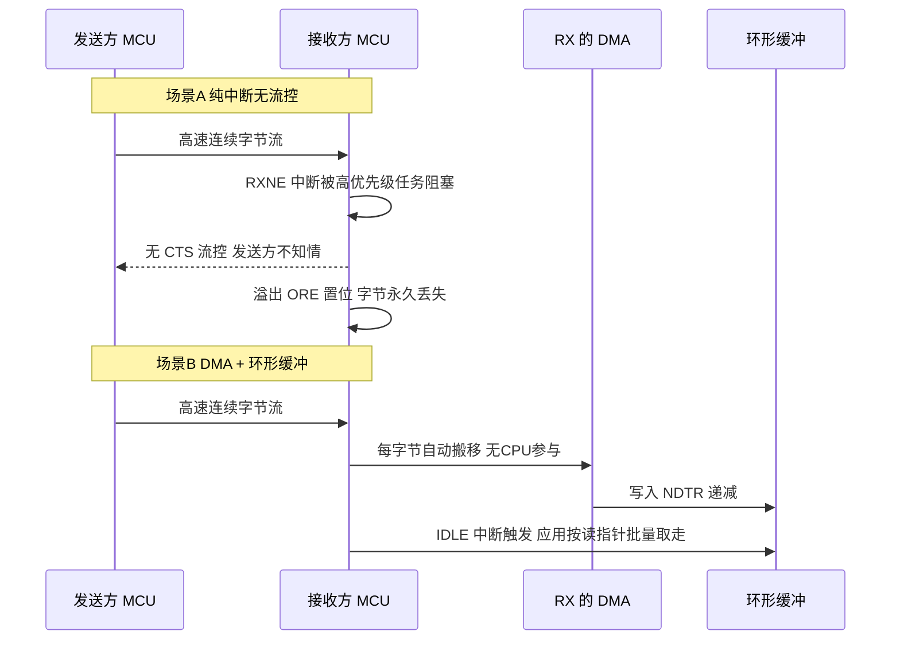

---

## 九、环形缓冲区设计与线程安全

### 9.1 为什么需要环形缓冲

无论中断还是 DMA，硬件产数据的节奏和应用程序消费数据的节奏是不同的。环形缓冲（Circular/Ring Buffer）是连接"生产者（中断/DMA）"与"消费者（应用任务）"的标准解耦结构：它是一个定长数组 + 写指针（head） + 读指针（tail），写指针在生产者侧推进，读指针在消费者侧推进，到末尾回绕到开头，形成环。它在固定内存下实现了"无限流"的错觉，是嵌入式串口接收的事实标准。

### 9.2 基本设计要点

- 缓冲区大小通常取 2 的幂（如 256、512），便于用位与运算 `& (SIZE-1)` 代替取模、并自然回绕（取模在无硬件除法器的 M0 上是几十个周期的库调用，位与只要 1 个周期）。
- `head` 指向下一个可写位置，`tail` 指向下一个可读位置。
- 判空：`head == tail`；判满：`(head + 1) & (SIZE-1) == tail`（空出一个槽位区分满与空，或改用独立计数变量）。
- 数据量：`(head - tail) & (SIZE-1)`。
- **容量选择要量化**：容量 ≥ 波特率 ÷ 10 × 最坏消费延迟（秒） × 安全系数 2。例如 115200 bps、消费任务最坏 20 ms 才被调度一次，则需 11520 × 0.02 × 2 ≈ 461 字节，应取 512。

### 9.3 线程安全要点

在 RTOS 或多中断环境中，生产者（UART 中断/DMA 完成中断）和消费者（应用任务）并发访问 head/tail，必须保证一致性：

1. **单生产者单消费者（SPSC）是天然无锁的**：只要 `head` 只被生产者写、`tail` 只被消费者写，且两者的读写都是原子的（32 位 MCU 上对齐的 32 位/16 位变量读写是原子的），就**不需要任何锁**。这是环形缓冲最优雅的性质，但前提是严格遵守"各写各的指针"。
2. **多生产者或多消费者时必须加锁**：例如两个任务都调用 `ring_write`，就必须用临界区或原子 CAS 保护 head 的"读-改-写"。
3. **关中断保护要极短**：若确实需要临界区，用 `__disable_irq()` / 恢复 PRIMASK 的方式，且只包住指针更新，绝不能把整个拷贝循环包进去，否则中断延迟飙升、破坏实时性。更好的做法是只屏蔽该 UART 的中断（`NVIC_DisableIRQ`）而非全局关中断。
4. **写指针由 DMA 维护时**：可用 DMA 的"剩余计数器 NDTR"反推写指针（`head = SIZE − NDTR`），无需自己维护 head，避免双写冲突；应用只维护 tail，天然线程安全（只要读 NDTR 是原子的）。
5. **内存屏障 / volatile**：head/tail 必须声明为 `volatile`，防止编译器缓存到寄存器；在弱内存序架构或跨核（AMP）场景，还需在"写数据"与"更新 head"之间插入写屏障 `__DMB()`，保证消费者看到 head 更新时数据已经落盘。**在 Cortex-M 单核上通常可省略屏障，但写上更严谨。**
6. **避免覆盖未读数据**：生产者检测到"下一个位置 == tail（即将满）"时应丢弃新数据或触发流控，绝不能覆盖未消费数据，否则造成静默数据损坏。决策"丢新"还是"丢旧"还是"触发流控"取决于业务：日志可丢新，命令帧应流控，实时采样流有时宁愿丢旧保新。无论选哪种，**都要有溢出计数器并上报**，否则问题会被永远掩盖。

### 9.4 用 IDLE 中断 + DMA 实现"帧边界"

一个高级技巧：用 UART 的 **IDLE 中断**（检测到线路空闲超过一帧时间）来标记"一包数据收完"。配合 DMA circular 模式，应用可以在 IDLE 触发时一次性处理从上次 tail 到当前 DMA 写指针之间的所有字节，再更新 tail。这样无需每字节进中断，又能按帧边界切包，是串口接收事实上的"最佳实践"模板。

需要留意三点：

- IDLE 中断在数据流连续时**可能长时间不触发**，必须同时使能 DMA 的半传输（HT）与传输完成（TC）中断作为兜底，形成"IDLE + HT + TC"三重触发，任何一个先到就处理一次。这正是修复 1.3 节场景的正确做法。
- IDLE 标志的清除方式因 IP 而异（老 IP 需读 SR 再读 DR，新 IP 写 ICR 的 IDLECF），漏清会导致中断反复进入。
- 上层协议若本身有帧结束符（如 NMEA 的 `\r\n`、Modbus 的 3.5 字符静默），应以协议为准，IDLE 只作为辅助的"批量处理触发器"，而不是唯一的帧判据。

### 9.5 环形缓冲的状态迁移

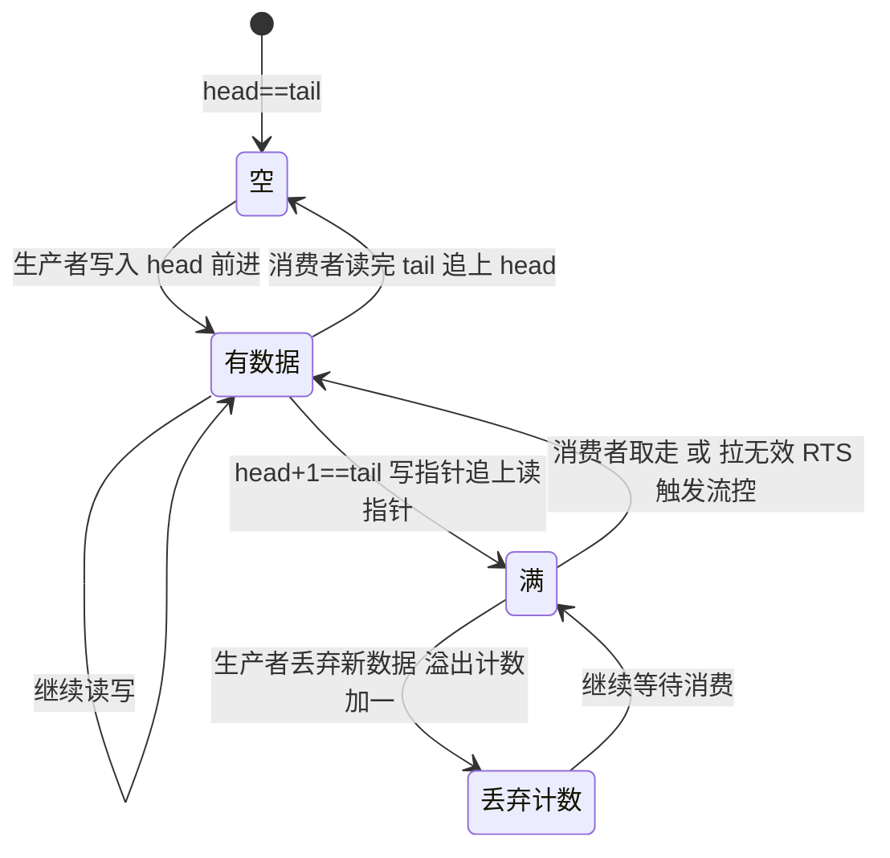

---

## 十、驱动代码实现

> 本章给出可直接移植参考的 C 代码。为了跨厂商可读，寄存器采用通用命名（与第七章的 IP 架构一一对应），位定义以宏给出。真实工程中请把寄存器名替换为具体 MCU 手册的定义，逻辑本身无需改动。所有代码均按"可读、可审查、可移植"的工业标准编写。

### 10.1 寄存器映射与位定义

```c
#include <stdint.h>
#include <stdbool.h>
#include <string.h>

/* ============================================================
 * USART 寄存器映射（对应第七章 IP 架构中的寄存器文件）
 * 所有寄存器必须用 volatile 修饰，防止编译器优化掉访问；
 * 必须用与硬件一致的 32 位宽度访问，用 uint8_t 访问会截断。
 * ============================================================ */
typedef struct {
    volatile uint32_t SR;    /* 0x00 状态寄存器：TXE/TC/RXNE/IDLE/ORE/FE/NE/PE */
    volatile uint32_t DR;    /* 0x04 数据寄存器：写=发送，读=接收 */
    volatile uint32_t BRR;   /* 0x08 波特率寄存器：[15:4]整数 [3:0]小数 */
    volatile uint32_t CR1;   /* 0x0C 控制寄存器1：UE/TE/RE/M/PCE/PS/OVER8/中断使能 */
    volatile uint32_t CR2;   /* 0x10 控制寄存器2：STOP/LINEN/CLKEN/ADD */
    volatile uint32_t CR3;   /* 0x14 控制寄存器3：DMAT/DMAR/RTSE/CTSE/DEM/HDSEL */
    volatile uint32_t GTPR;  /* 0x18 保护时间与预分频 */
    volatile uint32_t ICR;   /* 0x1C 中断标志清除（新一代 IP） */
} USART_TypeDef;

#define USART1  ((USART_TypeDef *)0x40011000UL)   /* 示例基地址 */

/* ---- SR 状态位 ---- */
#define SR_PE        (1U << 0)   /* 校验错误 */
#define SR_FE        (1U << 1)   /* 帧错误：停止位采样到低电平 */
#define SR_NE        (1U << 2)   /* 噪声错误：多数表决不一致 */
#define SR_ORE       (1U << 3)   /* 溢出错误：必须清，否则后续接收全部阻塞 */
#define SR_IDLE      (1U << 4)   /* 线路空闲，可作帧边界 */
#define SR_RXNE      (1U << 5)   /* 接收数据寄存器非空 */
#define SR_TC        (1U << 6)   /* 发送完成：移位器与停止位都已推出（RS485 用它） */
#define SR_TXE       (1U << 7)   /* 发送数据寄存器空：可写下一字节（≠发送完成） */

/* ---- CR1 控制位 ---- */
#define CR1_RE       (1U << 2)   /* 接收使能 */
#define CR1_TE       (1U << 3)   /* 发送使能 */
#define CR1_IDLEIE   (1U << 4)   /* 空闲中断使能 */
#define CR1_RXNEIE   (1U << 5)   /* 接收非空中断使能 */
#define CR1_TCIE     (1U << 6)   /* 发送完成中断使能 */
#define CR1_TXEIE    (1U << 7)   /* 发送空中断使能 */
#define CR1_PS       (1U << 9)   /* 0=偶校验 1=奇校验 */
#define CR1_PCE      (1U << 10)  /* 校验使能 */
#define CR1_M0       (1U << 12)  /* 字长低位 */
#define CR1_UE       (1U << 13)  /* USART 总使能：改配置前必须清零 */
#define CR1_OVER8    (1U << 15)  /* 1=8倍过采样 0=16倍过采样 */
#define CR1_M1       (1U << 28)  /* 字长高位 */

/* ---- CR2 / CR3 ---- */
#define CR2_STOP_POS   12
#define CR2_STOP_MASK  (3U << CR2_STOP_POS)
#define CR3_DMAR     (1U << 6)   /* 接收 DMA 请求使能 */
#define CR3_DMAT     (1U << 7)   /* 发送 DMA 请求使能 */
#define CR3_RTSE     (1U << 8)   /* RTS 硬件流控 */
#define CR3_CTSE     (1U << 10)  /* CTS 硬件流控 */
#define CR3_DEM      (1U << 14)  /* RS485 DE 硬件自动控制 */
#define CR3_DEP      (1U << 15)  /* DE 极性：0=高有效 */
```

### 10.2 USART 初始化：BRR 计算、过采样、数据位、校验、停止位

```c
/* ============================================================
 * 帧格式与初始化参数
 * ============================================================ */
typedef enum { UART_PARITY_NONE = 0, UART_PARITY_EVEN, UART_PARITY_ODD } uart_parity_t;
typedef enum { UART_STOP_1 = 0, UART_STOP_0P5 = 1, UART_STOP_2 = 2, UART_STOP_1P5 = 3 } uart_stop_t;

typedef struct {
    uint32_t      ker_clk_hz;   /* USART 内核时钟 ker_ck（不是系统主频！） */
    uint32_t      baudrate;     /* 目标波特率 */
    uint8_t       data_bits;    /* 7 / 8 / 9（注意：含校验位在内的总长度语义） */
    uart_parity_t parity;
    uart_stop_t   stop;
    bool          use_over8;    /* true = 8 倍过采样（高波特率时用） */
    bool          hw_flowctrl;  /* 是否使能 RTS/CTS */
} uart_cfg_t;

/* ------------------------------------------------------------
 * 计算 BRR 值。
 * 16 倍过采样：USARTDIV = ker_ck / baud，BRR = USARTDIV 的 Q12.4 定点表示
 * 8  倍过采样：USARTDIV = ker_ck / baud（小数刻度 1/8），
 *              硬件要求 BRR[3] = 0，小数部分左移一位放在 BRR[2:0]
 * 返回 0 表示参数非法。
 * ------------------------------------------------------------ */
static uint32_t uart_calc_brr(uint32_t ker_clk, uint32_t baud, bool over8)
{
    if (baud == 0U || ker_clk == 0U) {
        return 0U;
    }

    /* 用定点运算避免浮点：把 USARTDIV 放大 16 倍后四舍五入 */
    uint32_t usartdiv_x16;
    if (!over8) {
        /* 16x：USARTDIV = ker_ck / baud，放大 16 倍 = 16*ker_ck/baud */
        usartdiv_x16 = (uint32_t)(((uint64_t)ker_clk * 16U + baud / 2U) / baud);
        return usartdiv_x16;                       /* 天然就是 Q12.4 格式 */
    } else {
        /* 8x：位速率 = ker_ck / (8 * USARTDIV)，故 USARTDIV = ker_ck/(8*baud)*8… */
        usartdiv_x16 = (uint32_t)(((uint64_t)ker_clk * 32U + baud / 2U) / baud) / 2U;
        /* 低 4 位是 1/16 刻度的小数，8x 模式下需转成 1/8 刻度并保证 bit3=0 */
        uint32_t frac_x16 = usartdiv_x16 & 0x0FU;
        uint32_t mant     = usartdiv_x16 & 0xFFFFFFF0U;
        return mant | ((frac_x16 << 1) & 0x07U);   /* bit3 保持 0 */
    }
}

/* ------------------------------------------------------------
 * 计算实际波特率误差（千分比），用于上电自检 / 日志告警。
 * 返回值单位 0.01%，例如 350 表示 3.50%。
 * ------------------------------------------------------------ */
static uint32_t uart_baud_error_e4(uint32_t ker_clk, uint32_t baud, uint32_t brr, bool over8)
{
    uint32_t mult    = over8 ? 8U : 16U;
    /* BRR 是 Q12.4 定点；实际分频比 = brr/16 */
    uint32_t actual  = (uint32_t)(((uint64_t)ker_clk * 16U) / ((uint64_t)brr * mult));
    uint32_t diff    = (actual > baud) ? (actual - baud) : (baud - actual);
    return (uint32_t)(((uint64_t)diff * 10000U) / baud);
}

/* ------------------------------------------------------------
 * USART 初始化主函数
 * 关键顺序：清 UE → 配置全部帧参数与波特率 → 置 TE/RE → 置 UE
 * 原因见第 7.3 / 7.5 节：跨时钟域配置在 UE=1 时行为未定义。
 * ------------------------------------------------------------ */
int uart_init(USART_TypeDef *u, const uart_cfg_t *cfg)
{
    uint32_t cr1 = 0U, cr2 = 0U, cr3 = 0U;

    /* --- 步骤 0：外设复位并使能时钟（伪代码，具体见 RCC 章节） --- */
    rcc_periph_reset(u);
    rcc_periph_clock_enable(u);

    /* --- 步骤 1：关闭 UE，进入配置态 --- */
    u->CR1 &= ~CR1_UE;

    /* --- 步骤 2：波特率 --- */
    uint32_t brr = uart_calc_brr(cfg->ker_clk_hz, cfg->baudrate, cfg->use_over8);
    if (brr < 16U) {                    /* USARTDIV < 1，分频比过小，无法工作 */
        return -1;
    }
    /* 上电自检：误差超过 2.00% 直接告警，避免带病上线（见第四章阈值） */
    if (uart_baud_error_e4(cfg->ker_clk_hz, cfg->baudrate, brr, cfg->use_over8) > 200U) {
        log_warn("UART baud error > 2%%, check clock tree / try OVER8");
    }
    u->BRR = brr;

    /* --- 步骤 3：字长与校验 ---
     * 注意语义陷阱：M 字段是"含校验位的总数据长度"。
     * 想要 8 数据位 + 1 校验位，必须配 9 位字长（M0=1）。 */
    uint8_t total_bits = cfg->data_bits +
                         ((cfg->parity == UART_PARITY_NONE) ? 0U : 1U);
    switch (total_bits) {
        case 7U:  cr1 |= CR1_M1;              break;   /* M1:M0 = 10 -> 7 位 */
        case 8U:  /* M1:M0 = 00 -> 8 位，无需置位 */    break;
        case 9U:  cr1 |= CR1_M0;              break;   /* M1:M0 = 01 -> 9 位 */
        default:  return -2;                            /* 不支持的组合 */
    }
    if (cfg->parity != UART_PARITY_NONE) {
        cr1 |= CR1_PCE;
        if (cfg->parity == UART_PARITY_ODD) {
            cr1 |= CR1_PS;                              /* 1 = 奇校验 */
        }
    }

    /* --- 步骤 4：过采样 --- */
    if (cfg->use_over8) {
        cr1 |= CR1_OVER8;
    }

    /* --- 步骤 5：停止位 --- */
    cr2 |= ((uint32_t)cfg->stop << CR2_STOP_POS) & CR2_STOP_MASK;

    /* --- 步骤 6：硬件流控 --- */
    if (cfg->hw_flowctrl) {
        cr3 |= (CR3_RTSE | CR3_CTSE);
    }

    /* --- 步骤 7：写回并使能收发 --- */
    u->CR2 = cr2;
    u->CR3 = cr3;
    u->CR1 = cr1 | CR1_TE | CR1_RE;

    /* --- 步骤 8：最后拉起 UE（此后帧参数不可再改） --- */
    u->CR1 |= CR1_UE;
    return 0;
}
```

### 10.3 中断驱动收发（TXE / RXNE / 错误处理）

```c
/* ============================================================
 * 中断驱动的收发。发送采用"TXE 中断续填"模式：
 *   - 应用把数据放进发送环形缓冲，然后使能 TXEIE；
 *   - 每次 TXE 中断从缓冲取一字节写 DR；
 *   - 缓冲空时关闭 TXEIE（否则会中断风暴），改开 TCIE 等待真正发完。
 * ============================================================ */
#define TX_BUF_SIZE   256U          /* 必须是 2 的幂 */
#define RX_BUF_SIZE   512U

static uint8_t  s_tx_buf[TX_BUF_SIZE];
static volatile uint16_t s_tx_head, s_tx_tail;
static uint8_t  s_rx_buf[RX_BUF_SIZE];
static volatile uint16_t s_rx_head, s_rx_tail;
static volatile uint32_t s_ore_cnt, s_fe_cnt, s_pe_cnt, s_drop_cnt;  /* 可观测性计数 */

void USART1_IRQHandler(void)
{
    uint32_t sr = USART1->SR;        /* 只读一次，避免多次读引发副作用不一致 */

    /* ---------- 1. 错误优先处理：必须先清，否则会持续阻塞接收 ---------- */
    if (sr & (SR_ORE | SR_FE | SR_NE | SR_PE)) {
        if (sr & SR_ORE) { s_ore_cnt++; }
        if (sr & SR_FE)  { s_fe_cnt++;  }
        if (sr & SR_PE)  { s_pe_cnt++;  }
        /* 老 IP：读 SR 后读 DR 即可清除这一组标志；新 IP 用 ICR 写 1 清 */
        (void)USART1->DR;
        USART1->ICR = (SR_ORE | SR_FE | SR_NE | SR_PE);
        /* 注意：这里读走的字节是"出错的那一帧"，按协议应丢弃而非入缓冲 */
    }

    /* ---------- 2. 接收：搬入环形缓冲 ---------- */
    if (sr & SR_RXNE) {
        uint8_t  b    = (uint8_t)(USART1->DR & 0xFFU);   /* 读 DR 自动清 RXNE */
        uint16_t next = (uint16_t)((s_rx_head + 1U) & (RX_BUF_SIZE - 1U));
        if (next != s_rx_tail) {          /* 未满才写，绝不覆盖未消费数据 */
            s_rx_buf[s_rx_head] = b;
            s_rx_head = next;             /* 先写数据再更新 head，顺序不能反 */
        } else {
            s_drop_cnt++;                 /* 溢出必须计数上报，不能静默丢弃 */
        }
    }

    /* ---------- 3. 发送：TXE 续填 ---------- */
    if ((sr & SR_TXE) && (USART1->CR1 & CR1_TXEIE)) {
        if (s_tx_head != s_tx_tail) {
            USART1->DR = s_tx_buf[s_tx_tail];
            s_tx_tail  = (uint16_t)((s_tx_tail + 1U) & (TX_BUF_SIZE - 1U));
        } else {
            USART1->CR1 &= ~CR1_TXEIE;    /* 数据发完，关 TXEIE 防中断风暴 */
            USART1->CR1 |= CR1_TCIE;      /* 转而等待 TC（真正发完最后一位） */
        }
    }

    /* ---------- 4. 发送完成：RS485 切向 / 低功耗时机 ---------- */
    if ((sr & SR_TC) && (USART1->CR1 & CR1_TCIE)) {
        USART1->ICR  = SR_TC;
        USART1->CR1 &= ~CR1_TCIE;
        uart_on_tx_complete();            /* 回调：例如把 RS485 切回接收 */
    }

    /* ---------- 5. 空闲：帧边界 ---------- */
    if ((sr & SR_IDLE) && (USART1->CR1 & CR1_IDLEIE)) {
        (void)USART1->DR;                 /* 老 IP 的清除序列 */
        USART1->ICR = SR_IDLE;
        uart_on_idle();                   /* 回调：通知任务"一包收完了" */
    }
}

/* 应用侧发送入口：把数据入队并启动发送 */
int uart_send(const uint8_t *data, uint16_t len)
{
    for (uint16_t i = 0; i < len; i++) {
        uint16_t next = (uint16_t)((s_tx_head + 1U) & (TX_BUF_SIZE - 1U));
        if (next == s_tx_tail) {
            return i;                     /* 缓冲满，返回已入队字节数 */
        }
        s_tx_buf[s_tx_head] = data[i];
        s_tx_head = next;
    }
    USART1->CR1 |= CR1_TXEIE;             /* 使能 TXE 中断，触发首次搬运 */
    return len;
}
```

### 10.4 通用环形缓冲区：put / get 与线程安全

```c
/* ============================================================
 * 可复用的 SPSC（单生产者单消费者）无锁环形缓冲。
 * 设计前提（必须遵守，否则无锁性质失效）：
 *   - head 只在生产者上下文（ISR/DMA 回调）修改
 *   - tail 只在消费者上下文（任务）修改
 *   - size 是 2 的幂，用位与代替取模
 * 若存在多生产者或多消费者，请改用 ring_put_locked 版本。
 * ============================================================ */
typedef struct {
    uint8_t          *buf;
    uint16_t          size;      /* 必须是 2 的幂 */
    volatile uint16_t head;      /* 生产者写 */
    volatile uint16_t tail;      /* 消费者写 */
    volatile uint32_t dropped;   /* 溢出丢弃计数，可观测性关键指标 */
} ring_t;

static inline uint16_t ring_count(const ring_t *r)
{
    return (uint16_t)((r->head - r->tail) & (r->size - 1U));
}

static inline uint16_t ring_space(const ring_t *r)
{
    return (uint16_t)(r->size - 1U - ring_count(r));   /* 空一格区分满与空 */
}

void ring_init(ring_t *r, uint8_t *storage, uint16_t size_pow2)
{
    r->buf     = storage;
    r->size    = size_pow2;
    r->head    = 0U;
    r->tail    = 0U;
    r->dropped = 0U;
}

/* ---- 生产者侧：ISR / DMA 上下文调用，无需关中断 ---- */
bool ring_put(ring_t *r, uint8_t b)
{
    uint16_t h    = r->head;                       /* 本地副本，减少 volatile 访问 */
    uint16_t next = (uint16_t)((h + 1U) & (r->size - 1U));
    if (next == r->tail) {                         /* 满：丢弃并计数 */
        r->dropped++;
        return false;
    }
    r->buf[h] = b;
    __DMB();                                       /* 保证数据先于 head 可见 */
    r->head = next;
    return true;
}

/* ---- 消费者侧：任务上下文调用，无需关中断 ---- */
uint16_t ring_get(ring_t *r, uint8_t *out, uint16_t max)
{
    uint16_t t = r->tail;
    uint16_t h = r->head;                          /* 快照，之后 head 增长不影响本次 */
    uint16_t n = 0U;
    while (n < max && t != h) {
        out[n++] = r->buf[t];
        t = (uint16_t)((t + 1U) & (r->size - 1U));
    }
    __DMB();                                       /* 保证数据读完再释放空间 */
    r->tail = t;
    return n;
}

/* ---- 多生产者场景的加锁版本：临界区只包住指针更新 ---- */
bool ring_put_locked(ring_t *r, uint8_t b)
{
    bool ok;
    uint32_t primask = __get_PRIMASK();
    __disable_irq();                               /* 临界区极短：仅几条指令 */
    {
        uint16_t next = (uint16_t)((r->head + 1U) & (r->size - 1U));
        if (next == r->tail) {
            r->dropped++;
            ok = false;
        } else {
            r->buf[r->head] = b;
            r->head = next;
            ok = true;
        }
    }
    __set_PRIMASK(primask);                        /* 恢复而非无脑开中断 */
    return ok;
}
```

### 10.5 DMA 收发：循环接收 + 空闲中断切帧

```c
/* ============================================================
 * DMA 接收（循环模式）+ IDLE/HT/TC 三重触发切帧。
 * 核心思想：
 *   - DMA 以 circular 模式持续把 RDR 搬进 s_dma_rx[]，写指针由硬件维护；
 *   - 软件只维护读指针 s_rd_pos，用 (SIZE - NDTR) 反推写指针；
 *   - IDLE 中断（帧间空闲）、DMA 半传输、DMA 传输完成，任一触发即处理。
 *     三重触发是必需的：数据流连续时 IDLE 可能永不到来（见 1.3 场景）。
 * ============================================================ */
#define DMA_RX_SIZE   1024U
static uint8_t  s_dma_rx[DMA_RX_SIZE];
static volatile uint16_t s_rd_pos;          /* 应用读指针 */

void uart_dma_rx_start(void)
{
    /* --- 1. 配置 DMA 通道：外设固定地址 -> 内存自增，循环模式 --- */
    DMA1_CH5->CPAR  = (uint32_t)&USART1->DR;      /* 源：数据寄存器 */
    DMA1_CH5->CMAR  = (uint32_t)s_dma_rx;         /* 目的：内存缓冲 */
    DMA1_CH5->CNDTR = DMA_RX_SIZE;                /* 传输个数 */
    DMA1_CH5->CCR   = DMA_CCR_MINC               /* 内存地址自增 */
                    | DMA_CCR_CIRC               /* 循环模式：满了自动回绕 */
                    | DMA_CCR_PSIZE_8BIT
                    | DMA_CCR_MSIZE_8BIT
                    | DMA_CCR_PL_HIGH            /* 高优先级，抢总线带宽 */
                    | DMA_CCR_HTIE               /* 半传输中断 */
                    | DMA_CCR_TCIE;              /* 传输完成中断 */
    DMA1_CH5->CCR  |= DMA_CCR_EN;

    /* --- 2. 使能 USART 的 DMA 接收请求与 IDLE 中断 --- */
    USART1->CR3 |= CR3_DMAR;
    USART1->CR1 |= CR1_IDLEIE;
    s_rd_pos = 0U;
}

/* 统一的数据处理入口：把 [s_rd_pos, wr_pos) 区间交给协议层，处理环回绕 */
static void uart_dma_process(void)
{
    uint16_t wr_pos = (uint16_t)(DMA_RX_SIZE - DMA1_CH5->CNDTR);  /* 反推写指针 */

    if (wr_pos == s_rd_pos) {
        return;                                   /* 无新数据 */
    }

    /* 带 D-Cache 的核（M7/A 核）必须先失效缓存行，否则读到陈旧数据 */
    /* SCB_InvalidateDCache_by_Addr(s_dma_rx, DMA_RX_SIZE); */

    if (wr_pos > s_rd_pos) {
        /* 未回绕：一段连续区间 */
        protocol_feed(&s_dma_rx[s_rd_pos], (uint16_t)(wr_pos - s_rd_pos));
    } else {
        /* 已回绕：分两段送给协议层，避免拷贝 */
        protocol_feed(&s_dma_rx[s_rd_pos], (uint16_t)(DMA_RX_SIZE - s_rd_pos));
        if (wr_pos > 0U) {
            protocol_feed(&s_dma_rx[0], wr_pos);
        }
    }
    s_rd_pos = wr_pos;
}

/* IDLE 中断：帧间静默，说明一包收完 */
void USART1_IDLE_Handler(void)
{
    if (USART1->SR & SR_IDLE) {
        (void)USART1->DR;              /* 老 IP 清除序列：读 SR 后读 DR */
        USART1->ICR = SR_IDLE;         /* 新 IP：写 ICR 清除 */
        uart_dma_process();
    }
}

/* DMA 半传输 / 传输完成中断：数据流连续时的兜底触发 */
void DMA1_CH5_IRQHandler(void)
{
    if (DMA1->ISR & DMA_ISR_HTIF5) {
        DMA1->IFCR = DMA_IFCR_CHTIF5;
        uart_dma_process();            /* 缓冲过半，先消费一次 */
    }
    if (DMA1->ISR & DMA_ISR_TCIF5) {
        DMA1->IFCR = DMA_IFCR_CTCIF5;
        uart_dma_process();            /* 缓冲写满回绕，必须及时消费 */
    }
}

/* ------------------------------------------------------------
 * DMA 发送：一次性把整块数据交给 DMA，CPU 只在完成时被打扰一次。
 * 注意发送缓冲在 DMA 完成前不可被修改或释放（生命周期陷阱）。
 * ------------------------------------------------------------ */
static volatile bool s_tx_busy;

int uart_dma_send(const uint8_t *data, uint16_t len)
{
    if (s_tx_busy || len == 0U) {
        return -1;                                 /* 上一次尚未完成 */
    }
    s_tx_busy = true;

    DMA1_CH4->CCR  &= ~DMA_CCR_EN;                 /* 配置前必须先关通道 */
    DMA1_CH4->CPAR  = (uint32_t)&USART1->DR;
    DMA1_CH4->CMAR  = (uint32_t)data;
    DMA1_CH4->CNDTR = len;
    DMA1_CH4->CCR   = DMA_CCR_MINC | DMA_CCR_DIR_M2P
                    | DMA_CCR_PSIZE_8BIT | DMA_CCR_MSIZE_8BIT
                    | DMA_CCR_TCIE;
    /* 带 D-Cache 时需 SCB_CleanDCache_by_Addr 把数据写回主存 */

    USART1->ICR  = SR_TC;                          /* 先清 TC，避免误触发 */
    USART1->CR3 |= CR3_DMAT;
    DMA1_CH4->CCR |= DMA_CCR_EN;
    return 0;
}

void DMA1_CH4_IRQHandler(void)   /* DMA 发送完成：注意此时最后一字节仍在移位器 */
{
    if (DMA1->ISR & DMA_ISR_TCIF4) {
        DMA1->IFCR   = DMA_IFCR_CTCIF4;
        DMA1_CH4->CCR &= ~DMA_CCR_EN;
        USART1->CR3  &= ~CR3_DMAT;
        USART1->CR1  |= CR1_TCIE;   /* 关键：再等 USART 的 TC 才算真正发完 */
    }
}
```

### 10.6 RS485 半双工方向控制

```c
/* ============================================================
 * RS485 方向控制。三种实现，优先级从高到低：
 *   方案A（首选）：硬件 DEM，MCU 自动在起始位前拉高、停止位后拉低；
 *   方案B：软件 GPIO + TC 中断（发送完成才切回接收）；
 *   方案C：软件 GPIO + 精确延时（无 TC 中断的老器件兜底）。
 * 绝对禁止在 TXE 中断里切方向——那会截断最后一个字节（见 1.2 场景）。
 * ============================================================ */

/* ---------- 方案 A：硬件自动 DE ---------- */
void rs485_init_hw_de(USART_TypeDef *u, uint8_t deat, uint8_t dedt)
{
    u->CR1 &= ~CR1_UE;                       /* 配置前关 UE */
    /* DEAT：起始位前提前拉高 DE 的时间（单位：1/16 位时间）
     * DEDT：停止位后延迟拉低 DE 的时间，需覆盖收发器关断延迟 */
    u->CR1 = (u->CR1 & ~(0x1FU << 21)) | ((uint32_t)deat << 21);
    u->CR1 = (u->CR1 & ~(0x1FU << 16)) | ((uint32_t)dedt << 16);
    u->CR3 |= CR3_DEM;                       /* 使能硬件 DE */
    u->CR3 &= ~CR3_DEP;                      /* DE 高电平有效 */
    u->CR1 |= CR1_UE;
    /* 之后软件完全不用管方向，像全双工一样收发即可 */
}

/* ---------- 方案 B：软件 GPIO + TC 中断（最常用的可移植做法） ---------- */
#define RS485_DE_PORT   GPIOA
#define RS485_DE_PIN    (1U << 8)

static inline void rs485_tx_enable(void)
{
    RS485_DE_PORT->BSRR = RS485_DE_PIN;              /* DE=1：驱动总线，进入发送 */
    /* 收发器使能建立时间典型几十 ns~几百 ns，一条总线读改写即可覆盖；
     * 若手册要求更长，此处插入 __NOP() 或 ndelay()。 */
}

static inline void rs485_rx_enable(void)
{
    RS485_DE_PORT->BSRR = (uint32_t)RS485_DE_PIN << 16;  /* DE=0：释放总线，接收 */
}

int rs485_send(USART_TypeDef *u, const uint8_t *data, uint16_t len)
{
    if (len == 0U) {
        return 0;
    }
    rs485_tx_enable();                 /* 1. 先切发送方向 */

    USART1->ICR = SR_TC;               /* 2. 清残留 TC，防止立即误触发 */
    uart_dma_send(data, len);          /* 3. 用 DMA 或中断把数据发出去 */
    USART1->CR1 |= CR1_TCIE;           /* 4. 使能 TC 中断等待"真正发完" */
    return len;
}

/* TC 回调：此刻最后一个停止位已推出引脚，切回接收是安全的 */
void uart_on_tx_complete(void)
{
    rs485_rx_enable();                 /* 唯一正确的切换时机 */
}

/* ---------- 方案 C：无 TC 中断时的阻塞式兜底 ---------- */
void rs485_send_blocking(USART_TypeDef *u, const uint8_t *data, uint16_t len,
                         uint32_t baud)
{
    rs485_tx_enable();
    for (uint16_t i = 0; i < len; i++) {
        while (!(u->SR & SR_TXE)) { }      /* 等发送寄存器空 */
        u->DR = data[i];
    }
    while (!(u->SR & SR_TC)) { }           /* 关键：等发送完成而不是 TXE！ */

    /* 额外保险：再等一个字符时间，覆盖收发器传播延迟与线路容性延迟。
     * 一个 8N1 字符 = 10 bit，耗时 = 10 * 1e6 / baud 微秒。 */
    udelay((10U * 1000000U) / baud);
    rs485_rx_enable();
}
```

### 10.7 常见错误标志码对照表

| 错误标志 | 含义 | 典型成因 | 处理建议 |
|----------|------|----------|----------|
| **ORE** | Overrun Error 溢出 | 接收不及时、缓冲满、无流控、ISR 被长时间屏蔽 | 清 ORE、加速取数、上 DMA/流控；必须计数上报 |
| **FE** | Framing Error 帧错误 | 停止位采到低电平（波特率偏差/噪声/线断/RS485 切向过早） | 检查波特率误差、线序、DE 时序 |
| **PE** | Parity Error 校验错 | 数据位奇偶不符（噪声/干扰/双方校验配置不一致） | 查干扰源与配置；关键数据用 CRC |
| **NE** | Noise Error 噪声 | 过采样多数表决不一致（线路差/EMI/阻抗不匹配） | 查接地、屏蔽、端接电阻 |
| **IDLE** | 线路空闲 | 一帧结束后线路持续高电平超过一帧时间 | 用作帧边界；注意清除序列 |
| **TC** | Transmission Complete | 一帧全部发完（含停止位），移位器已空 | RS485 切接收、进低功耗的唯一可靠时机 |
| **TXE** | Transmit Data Reg Empty | 发送寄存器/FIFO 有空位（可填下一字节） | 注意它 **≠** 发送完成 |
| **RXNE** | Read Data Reg Not Empty | 收到一个完整帧并已入 FIFO | 读 DR 自动清除 |

---

## 十一、MCAL 配置说明：AUTOSAR 体系下的 UART

> 这一章面向做汽车电子（尤其 ECU 基础软件）的读者。如果你只做消费类或工业裸机项目，可以把它当作"另一种工程组织方式"来了解——它解释了为什么在某些行业里，写驱动这件事变成了"配工具链"。

### 11.1 一个关键事实：AUTOSAR Classic 的标准 MCAL 里没有 UART 模块

这是很多刚接触 AUTOSAR 的工程师最困惑的一点。翻遍 AUTOSAR Classic Platform 的 MCAL 层规范，你会看到 **Spi、Can、Lin、Eth、Fls、Adc、Pwm、Icu、Dio、Port、Gpt、Wdg、Mcu** 这些标准模块，唯独**没有一个叫 `Uart` 的标准 BSW 模块**。

原因并不难理解：

1. **AUTOSAR 的通信栈是面向"车载网络"设计的**。ECU 之间的通信标准是 CAN、LIN、FlexRay、Ethernet，这些都有完整的协议栈（CanIf / CanTp / PduR / Com / Dcm）。UART 作为点对点的字节流接口，在车载网络拓扑中没有标准位置，也没有对应的上层协议栈。
2. **UART 在车载 ECU 里的角色是"边缘接口"**：连调试口、连蓝牙/4G 模组、连某个只提供串口的传感器（如毫米波雷达、GPS）、连另一颗协处理器。这些用法千差万别，无法抽象出一套通用的标准接口。
3. **LIN 已经覆盖了"基于 UART 硬件的车载总线"这一场景**。LIN 驱动（Lin 模块）本身就是构建在 UART/USART 硬件之上的，规范定义了完整的帧调度、Break 生成、从机响应。所以 AUTOSAR 认为"UART 硬件"已经通过 Lin 模块被标准化覆盖了。

**结论：在 AUTOSAR 项目里，UART 绝大多数以 CDD（Complex Device Driver，复杂驱动）的形式手写实现。** 少数芯片厂商（如 NXP、Infineon、Renesas 的部分 MCAL 包）会额外提供一个**非标准的、厂商私有的 `Uart` 驱动模块**（有时叫 `Uart`、`Sci`、`Lpuart`），可以在 EB tresos / DaVinci Configurator 里配置——但它不属于 AUTOSAR 标准，跨平台移植时接口会变。

### 11.2 CDD 是什么、为什么它是 UART 的正确归宿

CDD（Complex Device Driver）是 AUTOSAR 架构中官方留下的"逃生舱口"：它允许开发者绕过分层架构，从 RTE 或应用层直接访问硬件寄存器，用于那些**时序要求苛刻、或标准 BSW 无法覆盖**的场景（喷油控制、点火正时、专用传感器接口、以及我们这里的 UART）。

CDD 的特权与责任：

- **特权**：可以直接访问 MCU 寄存器、可以注册自己的中断向量、可以跨越分层调用（例如直接被 RTE 调用，同时直接操作硬件）。
- **责任**：必须自己保证 MemMap 内存段分配、Schedule Manager 的临界区保护（`SchM_Enter_/SchM_Exit_`）、DET 错误上报、以及与 EcuM/BswM 的启停配合。**标准 BSW 帮你做的事，CDD 都得自己做一遍。**

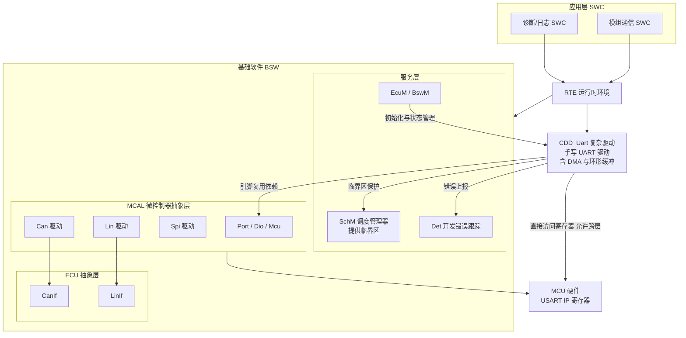

图中要点：**CDD_Uart 是唯一一个被允许"从 RTE 直连硬件"的方块**，但它仍要依赖 Port 模块完成引脚复用配置、依赖 SchM 提供临界区、依赖 EcuM 决定初始化时机。这三条依赖是 CDD 与裸机驱动的本质区别——**CDD 不是"随便写"，而是"在框架约束下写"**。

### 11.3 CDD_Uart 的配置管理（EB tresos / DaVinci 视角）

虽然 CDD 是手写的，但在 EB tresos 或 Vector DaVinci Configurator 里，它同样需要一份配置。做法是创建一个**自定义模块定义（Module Definition，即 `.xdm` 文件）**，声明 CDD 的配置容器与参数，工具就能像对待标准 MCAL 模块一样为它生成配置代码。

一份典型的 `CDD_Uart` 配置容器结构：

| 容器 / 参数 | 类型 | 说明 |
|------------|------|------|
| `CddUartGeneral` | 容器 | 全局配置 |
| ├ `CddUartDevErrorDetect` | Boolean | 是否使能 DET 开发错误检测 |
| ├ `CddUartVersionInfoApi` | Boolean | 是否生成 `GetVersionInfo` API |
| ├ `CddUartMainFunctionPeriod` | Float | 周期主函数调用周期（秒），供 BswM 排程 |
| `CddUartChannel` | 容器（可多实例） | 每个物理 UART 通道一个 |
| ├ `CddUartChannelId` | Integer | 通道逻辑 ID，供上层引用 |
| ├ `CddUartHwUnit` | Enum | 映射到 USART1/USART2/LPUART1… |
| ├ `CddUartBaudRate` | Integer | 波特率，如 115200 |
| ├ `CddUartDataBits` | Enum | 7 / 8 / 9 |
| ├ `CddUartParity` | Enum | NONE / EVEN / ODD |
| ├ `CddUartStopBits` | Enum | ONE / TWO |
| ├ `CddUartFlowControl` | Enum | NONE / RTS_CTS |
| ├ `CddUartRxMode` | Enum | INTERRUPT / DMA_CIRCULAR |
| ├ `CddUartRxBufferSize` | Integer | 接收环形缓冲大小（2 的幂） |
| ├ `CddUartTxBufferSize` | Integer | 发送缓冲大小 |
| ├ `CddUartRs485Enable` | Boolean | 是否启用 RS485 方向控制 |
| ├ `CddUartRs485DePin` | Reference | 引用 Dio 模块的 Channel（DE 引脚） |
| ├ `CddUartRxNotification` | Function Name | 接收完成回调函数名 |
| └ `CddUartErrorNotification` | Function Name | 错误回调函数名 |

注意 `CddUartRs485DePin` 这一项：它是一个**指向 Dio 模块配置容器的引用（Reference）**。这体现了 AUTOSAR 配置的核心思想——**模块之间通过配置引用而非硬编码耦合**。当硬件工程师改了 DE 引脚，只需在 Port/Dio 配置里改一处，CDD 无需重新编码。

### 11.4 相关通信 MCAL 的配置思路对照

虽然 UART 走 CDD，但同一个项目里的其它通信外设走标准 MCAL，配置思路可以互相印证：

| 模块 | 标准性 | 关键配置容器 | 上层接口 | 与 UART/CDD 的关系 |
|------|-------|-------------|---------|-------------------|
| **Spi** | AUTOSAR 标准 | `SpiChannel`（数据宽度/缓冲）、`SpiJob`（片选+序列）、`SpiSequence`（可调度单元）、`SpiExternalDevice`（时钟极性/相位/波特率） | SpiIf → 上层 | 三层抽象（Channel/Job/Sequence）是 AUTOSAR 抽象能力的典范，UART 因缺乏"事务"概念难以套用 |
| **Can** | AUTOSAR 标准 | `CanController`（波特率段配置 PropSeg/PhaseSeg）、`CanHardwareObject`（邮箱与 ID 过滤）、`CanConfigSet` | CanIf → PduR → Com | 车载主干网络，配置最重的通信模块 |
| **Lin** | AUTOSAR 标准 | `LinChannel`（波特率/唤醒）、`LinGlobalConfig` | LinIf（含调度表 Schedule Table） | **底层硬件就是 UART**，可视为"被标准化的 UART" |
| **Dio / Port** | AUTOSAR 标准 | `DioChannel`、`PortPin`（复用功能/上下拉/速度） | 被 CDD 引用 | CDD_Uart 的引脚复用与 RS485 DE 引脚依赖它 |
| **Mcu** | AUTOSAR 标准 | `McuClockSettingConfig`（PLL/分频/外设时钟源） | EcuM 调用 | **决定 UART 的 ker_ck，直接影响波特率误差** |
| **CDD_Uart** | 非标准（自定义） | 见 11.3 表 | RTE 直连 | 本章主题 |

**特别提醒**：`Mcu` 模块的时钟配置是 UART 波特率精度的上游。在 tresos 里改了 PLL 分频，生成的 `Mcu_Cfg.c` 会改变 `ker_ck`，而手写的 CDD_Uart 如果把时钟频率硬编码成常量，波特率就会静默出错。**正确做法是让 CDD 调用 `Mcu_GetClockFrequency()` 或引用生成的时钟宏，而不是自己写死 `#define UART_CLK 80000000`。** 笔者见过不止一次因为这个原因，在切换时钟配置后整车下线检测时串口全挂。

### 11.5 配置 → 生成 → 应用调用的完整路径

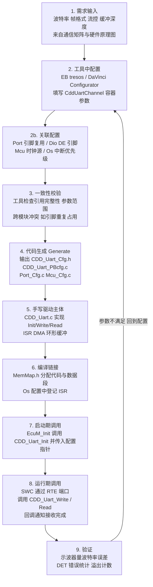

生成物与手写物的分工是这一流程的关键：

- **工具生成**：`CDD_Uart_Cfg.h`（编译期常量，如 `CDD_UART_CHANNEL_COUNT`、`CDD_UART_DEV_ERROR_DETECT`）、`CDD_Uart_PBcfg.c`（Post-Build 配置结构体数组，含每个通道的波特率、帧格式、缓冲指针）。
- **手写**：`CDD_Uart.c` / `CDD_Uart.h`，实现真正的寄存器操作、中断服务、DMA 管理。**手写代码只读配置结构体，绝不硬编码参数。**

一段典型的生成配置与驱动初始化的配合：

```c
/* ============================================================
 * 由 EB tresos 生成：CDD_Uart_PBcfg.c（片段，不可手工修改）
 * ============================================================ */
#include "CDD_Uart.h"

/* 由 Mcu 模块生成的时钟宏，避免硬编码（见 11.4 的提醒） */
#include "Mcu_Cfg.h"

static uint8 CddUart_Ch0_RxBuf[512];
static uint8 CddUart_Ch0_TxBuf[256];

const CddUart_ChannelConfigType CddUart_ChannelConfig[CDD_UART_CHANNEL_COUNT] =
{
    /* ---- Channel 0：诊断口，115200 8N1，中断接收 ---- */
    {
        .ChannelId        = 0U,
        .HwUnit           = CDD_UART_HW_USART1,
        .KerClockHz       = MCU_PERIPH_CLOCK_APB2_HZ,   /* 引用 Mcu 生成的时钟 */
        .BaudRate         = 115200U,
        .DataBits         = CDD_UART_DATABITS_8,
        .Parity           = CDD_UART_PARITY_NONE,
        .StopBits         = CDD_UART_STOPBITS_1,
        .FlowControl      = CDD_UART_FLOW_NONE,
        .RxMode           = CDD_UART_RXMODE_INTERRUPT,
        .RxBuffer         = CddUart_Ch0_RxBuf,
        .RxBufferSize     = 512U,
        .TxBuffer         = CddUart_Ch0_TxBuf,
        .TxBufferSize     = 256U,
        .Rs485Enable      = FALSE,
        .Rs485DeDioChannel= 0U,
        .RxNotification   = &Diag_UartRxIndication,     /* 生成自配置里的函数名 */
        .ErrorNotification= &Diag_UartErrorIndication
    },
    /* ---- Channel 1：RS485 传感器总线，9600 8E1，DMA 接收 ---- */
    {
        .ChannelId        = 1U,
        .HwUnit           = CDD_UART_HW_USART3,
        .KerClockHz       = MCU_PERIPH_CLOCK_APB1_HZ,
        .BaudRate         = 9600U,
        .DataBits         = CDD_UART_DATABITS_8,
        .Parity           = CDD_UART_PARITY_EVEN,
        .StopBits         = CDD_UART_STOPBITS_1,
        .FlowControl      = CDD_UART_FLOW_NONE,
        .RxMode           = CDD_UART_RXMODE_DMA_CIRCULAR,
        .RxBuffer         = CddUart_Ch1_RxBuf,
        .RxBufferSize     = 1024U,
        .TxBuffer         = CddUart_Ch1_TxBuf,
        .TxBufferSize     = 256U,
        .Rs485Enable      = TRUE,
        .Rs485DeDioChannel= DioConf_DioChannel_RS485_DE, /* 引用 Dio 生成的符号 */
        .RxNotification   = &SensorBus_RxIndication,
        .ErrorNotification= &SensorBus_ErrorIndication
    }
};

const CddUart_ConfigType CddUart_Config =
{
    .ChannelCount  = CDD_UART_CHANNEL_COUNT,
    .ChannelConfig = CddUart_ChannelConfig
};

/* ============================================================
 * 手写驱动：CDD_Uart.c（片段）
 * 只读配置，绝不硬编码参数——这是可配置性的底线
 * ============================================================ */
static const CddUart_ConfigType *s_cfg = NULL_PTR;

void CDD_Uart_Init(const CddUart_ConfigType *ConfigPtr)
{
#if (CDD_UART_DEV_ERROR_DETECT == STD_ON)
    if (ConfigPtr == NULL_PTR) {
        Det_ReportError(CDD_UART_MODULE_ID, 0U,
                        CDD_UART_SID_INIT, CDD_UART_E_PARAM_POINTER);
        return;
    }
#endif
    s_cfg = ConfigPtr;

    for (uint8 i = 0U; i < ConfigPtr->ChannelCount; i++) {
        const CddUart_ChannelConfigType *ch = &ConfigPtr->ChannelConfig[i];

        /* 把 AUTOSAR 配置结构翻译成第 10.2 节的裸机初始化参数 */
        uart_cfg_t hw = {
            .ker_clk_hz  = ch->KerClockHz,      /* 来自 Mcu 模块，不硬编码 */
            .baudrate    = ch->BaudRate,
            .data_bits   = (uint8)ch->DataBits,
            .parity      = (uart_parity_t)ch->Parity,
            .stop        = (uart_stop_t)ch->StopBits,
            .use_over8   = (ch->BaudRate > 1000000U),   /* 高波特率自动切 8x */
            .hw_flowctrl = (ch->FlowControl == CDD_UART_FLOW_RTS_CTS)
        };
        (void)uart_init(CddUart_GetHwBase(ch->HwUnit), &hw);

        if (ch->RxMode == CDD_UART_RXMODE_DMA_CIRCULAR) {
            CddUart_DmaRxStart(i);
        }
        if (ch->Rs485Enable == TRUE) {
            Dio_WriteChannel(ch->Rs485DeDioChannel, STD_LOW);  /* 默认接收态 */
        }
    }
}

/* 上层（RTE / SWC）调用的发送接口 */
Std_ReturnType CDD_Uart_Write(uint8 ChannelId, const uint8 *Data, uint16 Length)
{
#if (CDD_UART_DEV_ERROR_DETECT == STD_ON)
    if (s_cfg == NULL_PTR) {
        Det_ReportError(CDD_UART_MODULE_ID, ChannelId,
                        CDD_UART_SID_WRITE, CDD_UART_E_UNINIT);
        return E_NOT_OK;
    }
    if (ChannelId >= s_cfg->ChannelCount) {
        Det_ReportError(CDD_UART_MODULE_ID, ChannelId,
                        CDD_UART_SID_WRITE, CDD_UART_E_PARAM_CHANNEL);
        return E_NOT_OK;
    }
#endif
    Std_ReturnType ret;

    /* 用 SchM 提供的临界区，而不是直接 __disable_irq()：
     * 这样 OS 集成商可以统一控制中断屏蔽级别，避免破坏其它任务的时序 */
    SchM_Enter_CddUart_TxBuffer();
    ret = CddUart_EnqueueTx(ChannelId, Data, Length);
    SchM_Exit_CddUart_TxBuffer();

    return ret;
}
```

### 11.6 若厂商提供了非标准 Uart 模块

部分 MCAL 包（例如某些 NXP S32K、Infineon AURIX 的扩展包）确实提供了 `Uart`/`Lpuart`/`Asclin` 模块。若采用，配置项与 CDD 高度相似，只是容器名遵循厂商命名，且提供标准化的 API 形态：

- `Uart_Init(const Uart_ConfigType *ConfigPtr)`
- `Uart_SyncSend(uint8 Channel, const uint8 *Buffer, uint32 Size, uint32 Timeout)`
- `Uart_AsyncSend(uint8 Channel, const uint8 *Buffer, uint32 Size)`
- `Uart_AsyncReceive(uint8 Channel, uint8 *Buffer, uint32 Size)`
- `Uart_GetStatus(uint8 Channel, uint32 *BytesRemaining, Uart_StatusType *Status)`

选型建议很直接：

- **只做一个平台、且厂商模块功能够用** → 用厂商 Uart 模块，省去手写与维护成本，也能享受工具链的一致性校验。
- **要跨多个 MCU 平台、或需要特殊时序（如自定义 RS485 时序、9 位多机、非常规波特率）** → 用 CDD 自己封装一层平台无关接口，内部按平台条件编译。**接口稳定、实现可换**，这是长期维护成本最低的方案。

### 11.7 CDD_Uart 落地的六条实践清单

1. **接口先行**：先定义平台无关的 `CDD_Uart_Init/Write/Read/GetStatus` 接口和回调原型，再写实现。接口一旦被 SWC 依赖就很难改。
2. **配置不硬编码**：波特率、缓冲大小、引脚、时钟频率全部来自生成的配置结构体。特别是 `ker_ck` 必须引用 Mcu 模块的输出。
3. **临界区用 SchM**：不要在 CDD 里直接 `__disable_irq()`，用 `SchM_Enter_/SchM_Exit_` 让 OS 集成商统一管理。
4. **错误可观测**：ORE/FE/PE 计数、缓冲溢出计数、发送超时计数，全部通过 DET 或 DEM 上报，不要静默吞掉。
5. **中断登记进 OS 配置**：CDD 的 ISR 必须在 Os 配置里注册为 ISR Category 1/2 并分配优先级，不能直接往向量表里塞函数。
6. **MemMap 规范**：代码、常量、初始化变量、非初始化变量分别放进 `CDD_UART_START_SEC_*` / `CDD_UART_STOP_SEC_*` 段，否则链接脚本与内存保护（MPU）配置会出错。

---

## 十二、常见坑与调试手段

### 12.1 波特率误差累积导致长帧尾部乱码

这是开篇场景一的根因。调试时用示波器量一位的宽度（如 115200 对应约 8.68 µs），反算实际波特率，看与标称差多少；优先选能被外设时钟"整除"的标称波特率，或换带小数分频的 USART。降低波特率、缩短线长也是应急手段。若时钟源是内部 RC，考虑改用外部晶振。

笔者的排故顺序：**先量 bit 宽度算误差 → 再查时钟树配置（`ker_ck` 是不是你以为的那个值）→ 再查 BRR 实际写入值（在线调试读寄存器）→ 最后才怀疑线材**。绝大多数情况在第二步就能定位——尤其是"库函数按 APB1 算、实际外设挂在 APB2"这类张冠李戴。

### 12.2 电平不匹配烧 IO

TTL（3.3V）直连 RS232（±12V）会瞬间损坏引脚。调试前先确认两端电平标准；跨电平用电平转换芯片；RS485 长距离务必两端 120Ω 终端匹配并加偏置电阻。还要防止 5V TTL 输出直驱 3.3V 输入造成的过压。一个便宜的保险做法：在调试串口的 RX 上串 330Ω 电阻，能在误接时限制灌入电流，救回不少板子。

### 12.3 接收溢出（ORE）不清除导致"死锁式"乱码

RXNE 取走不及时会置溢出标志，部分 MCU 不手动清 ORE 则后续帧全部错位甚至彻底停止接收。务必在中断里检查并清除溢出，且用 DMA/环形缓冲把取数延迟降到最低。

**用 DMA 接收时这个坑尤其隐蔽**：DMA 只读 DR，不会读 SR，所以老 IP 的"读 SR 再读 DR"清除序列永远不会被执行。一旦某次总线繁忙导致 ORE 置位，接收就永久卡死，现象是"跑了几小时后串口突然不收了，复位就好"。解决办法：**即使用 DMA，也要使能错误中断（EIE）并在 ISR 里清标志**。

### 12.4 波特率"配错一半"的隐藏 bug

用一个 8 位变量去读写 16/32 位分频寄存器，高位被截断 → 实际波特率翻倍或减半，整机看似能通但满屏乱码。寄存器访问必须用匹配位宽的 `volatile uint32_t`。曾有一个案例：某驱动用 `uint8_t` 暂存 BRR 高字节，结果高 8 位丢失，波特率恰好翻倍，造成间歇性乱码，排查了两天。

### 12.5 粘包与分包

串口是**字节流协议**，没有内建的帧边界。若应用层不做边界处理，TCP 那样的"粘包/分包"问题在串口一样存在：发送方两次发送可能被接收方一次读完（粘包），或一次发送被拆成两次读（分包）。解决办法：定长帧、特殊结束符（如 `\r\n`）、长度前缀（TLV）、字符间超时（Modbus RTU 的 3.5 字符静默）、或利用 IDLE 中断做帧边界。**协议设计阶段就定好边界规则，能省去大量现场扯皮。**

### 12.6 RS485 方向切换时机错误

这是 RS485 最经典坑，也是开篇场景二。发送完数据后，软件常在"发送数据寄存器空（TXE）"中断里就切回接收，但此时最后一个字节（含停止位）还在移位寄存器里没发完，贸然切换 DE 会截掉帧尾，对端收到残缺帧。正确做法：等 **TC（Transmission Complete）**中断，或用硬件 DEM 自动控制（见 10.6 三种方案）。半双工总线方向切换 bug 常被误判为"对端设备坏了"。

补充一个更隐蔽的变体：**DE 拉高得太晚**。若在写第一个字节之后才拉高 DE，起始位可能已经开始输出但总线还没被驱动，对端会漏掉起始位。所以顺序必须是"先拉 DE，再写数据"，且中间预留收发器的使能建立时间。

### 12.7 IDLE 中断在连续数据流下不触发

对应开篇场景三。修复方式已在 9.4 节给出：**IDLE + DMA 半传输 + DMA 传输完成三重触发**。这是 DMA 循环接收的标准架构，缺一不可。

### 12.8 D-Cache 导致 DMA 数据陈旧

在 Cortex-M7/A 核上，DMA 写入 SRAM 后，CPU 可能仍从 D-Cache 读到旧值。必须在读之前 `SCB_InvalidateDCache_by_Addr()`，或用 MPU 把 DMA 缓冲区配成 Non-cacheable，或把缓冲放到 DTCM（不经 Cache）。发送方向则相反，需要 `SCB_CleanDCache_by_Addr()` 把数据写回主存。缓冲区起止地址还必须按 Cache 行（通常 32 字节）对齐，否则会误伤相邻变量。

### 12.9 printf 重定向的重入与阻塞陷阱

把 `printf` 重定向到串口是最常用的调试手段，但有三个陷阱：一是 `printf` 内部使用静态缓冲，**不可重入**，在中断和任务里同时调用会输出错乱甚至崩溃；二是阻塞式 `fputc`（`while(!TXE);`）会在中断里造成长时间占用，破坏实时性；三是浮点格式化会拉入庞大的库并消耗大量栈。

工程做法：日志走"入环形缓冲 + 低优先级任务批量 DMA 输出"，中断里只入队不输出；或直接用轻量的自研 `log_printf`，只支持 `%d/%x/%s`，栈占用可控。

### 12.10 调试手段清单

| 手段 | 能解决什么 | 使用要点 |
|------|-----------|---------|
| **示波器抓 TX 波形** | 波特率误差、电平幅度、上升沿斜率、毛刺 | 量单个 bit 宽度反算波特率；看停止位是否完整 |
| **逻辑分析仪 + 串口解码** | 帧结构、数据内容、时序关系、RS485 的 DE 时序 | 同时抓 TX/RX/DE 三路，一眼看出方向切换时机 |
| **自发自收回环** | 快速二分：问题在本机发送、本机接收还是外部链路 | MCU 内部 LOOP 位或外部 TX-RX 短接 |
| **在线调试读寄存器** | BRR/CR1/CR3 实际值是否与预期一致 | 比读代码可靠——库函数可能悄悄改了你的配置 |
| **错误计数器** | 长期运行的健康度、偶发问题的量化 | ORE/FE/PE/drop 四个计数，通过日志或诊断服务暴露 |
| **串口助手十六进制显示** | 区分"显示乱码"与"真乱码" | 看到 0x00/0xFF 成片，多半是电平或起始位误判 |
| **压力测试** | 缓冲容量与流控是否够用 | 满带宽连续发几小时，观察 drop 计数是否为 0 |

---

## 十三、面试高频要点精选（26 道）

### 13.1 原理与帧格式（第 1~8 题）

1. **异步为什么不需要时钟线也能同步采样？**
   要点：每个字符以 Start 下降沿对齐相位，接收方按约定波特率从位中点采样；字符级独立同步，错一帧不影响下一帧。

2. **UART 与 USART 的区别？**
   要点：U 是通用异步收发器（仅 TX/RX）；USART 多支持同步模式（带 SCK 时钟线），平时不开启同步时即工作为 UART。

3. **波特率误差过大会怎样？容忍阈值是多少？**
   要点：每 bit 相位累积偏移，帧越长末端采样点越偏出位中心 → 乱码；经验阈值约 <2~3%，且是**双方误差累加**；理论极限 5%（8N1 采到第 10 位）。

4. **奇偶校验能防什么、防不了什么？**
   要点：只能检奇数个 bit 翻转，偶数个错误检不出；关键数据需 CRC/重传。

5. **为什么 Data 要 LSB 先发、Stop 还会有 1.5/2 位？**
   要点：LSB 先是早期移位寄存器右移结构的硬件惯例；1.5/2 停止位给慢速外设恢复时间、拉开帧间隔。

6. **16 倍与 8 倍过采样的区别与取舍？**
   要点：16x 在第 8/9/10 拍三取二表决，噪声容限好；8x 在第 3/4/5 拍，同样时钟下波特率上限翻倍但容限降、小数刻度变粗。

7. **什么是起始位、空闲帧、Break 帧？**
   要点：起始位=下降沿对齐并经 3/5/7 拍确认；空闲帧=线路高电平超一帧（IDLE 中断依据）；Break=低电平超一帧（LIN 唤醒/Bootloader 触发）。

8. **9 位数据位有什么用？**
   要点：第 9 位作地址/数据标志，配合硬件地址唤醒实现轻量多机通信，省去软件逐字节过滤。注意 M 字段是"含校验位的总长度"。

### 13.2 芯片与寄存器（第 9~14 题）

9. **画一下 USART IP 的内部框图。**
   要点：APB 接口 + 寄存器文件、波特率发生器（整数+小数分频、过采样选择）、TX FIFO+移位器+帧组装、RX 滤波+采样+移位器+校验+FIFO、主控状态机、流控单元、扩展编码层、中断/DMA 事件单元。

10. **TXE 和 TC 有什么区别？各用在什么场景？**
    要点：TXE=发送寄存器/FIFO 有空位，可续填；TC=移位器空且停止位已推出。RS485 切方向、进低功耗、关闭外设必须等 TC。

11. **为什么修改波特率或帧格式前必须先清 UE？**
    要点：寄存器在 APB 时钟域、收发逻辑在内核时钟域，运行中跨域改配置无法保证时序收敛，硬件不承诺行为；清 UE 让状态机回到确定的空闲态。

12. **ORE 是怎么产生的？为什么用 DMA 时更要小心？**
    要点：新帧收完准备入 FIFO 时发现满则置 ORE，此时已经丢了字节；DMA 只读 DR 不读 SR，老 IP 的清除序列不会被执行，ORE 会永久卡死接收，必须单独开错误中断清理。

13. **BRR 的小数分频是怎么实现的？会带来什么副作用？**
    要点：整数计数器 + 小数累加器，累加溢出时让本周期多计一拍，实现平均 N+F/16 的分频比；副作用是位周期在 N/N+1 之间抖动，占比很小可忽略，但低时钟比（如 LSE 跑 9600）时需注意。

14. **硬件 DE（DEM/DEAT/DEDT）解决了什么问题？**
    要点：硬件自动在起始位前 DEAT 时间拉高 DE、停止位后 DEDT 时间拉低，彻底消灭软件切方向的时序 bug，且不占 CPU。

### 13.3 流控、电平与总线（第 15~19 题）

15. **硬件流控与软件流控各有什么优缺点？**
    要点：硬件不占数据通道、响应快、二进制透明，但需额外两根线；软件不占线但破坏二进制透明、有延迟、需转义。

16. **RTS 的触发阈值为什么不能设成"FIFO 满"？**
    要点：CTS 在字符边界才检查，从对方拉无效到真正停下有"当前字符 + 已排队字符 + 线路延迟"的滞后；阈值必须留余量（典型 3/4 深度）。

17. **TTL、RS232、RS485 的核心区别？RS232 为什么不能直连 MCU？**
    要点：TTL 单端板内；RS232 单端反相 ±12V、≤15m，负电压超出 MCU 绝对最大额定值会烧 IO；RS485 差分多点、≤1200m、需端接与方向控制。

18. **RS485 为什么要终端电阻和偏置电阻？只在一端加终端行吗？**
    要点：终端电阻抑制末端反射，必须在总线**两端**各一个 120Ω（只加一端仍会在另一端反射）；偏置电阻保证空闲态 A−B>200mV，防浮动误触发。

19. **RS485 半双工方向切换为什么容易出错？有几种正确做法？**
    要点：在 TXE 就切会截掉停止位；正确做法有三：硬件 DEM（首选）、TC 中断切、阻塞等 TC 再延时一个字符时间。另外 DE 必须在写第一个字节**之前**拉高。

### 13.4 软件架构与驱动（第 20~26 题）

20. **高速 UART 怎么不丢字节？**
    要点：DMA + 环形缓冲 + 及时清错误标志，必要时上硬件 RTS/CTS，缓冲容量按"波特率 × 最坏消费延迟 × 2"量化。

21. **选择中断、FIFO 还是 DMA 的依据是什么？**
    要点：≤115200 用中断；115200~1M 用 FIFO 阈值+字符超时；≥1M 或大批量用 DMA+环形缓冲+IDLE；极高速加双缓冲与流控兜底。

22. **环形缓冲判满为什么常空一个槽位？SPSC 为什么可以无锁？**
    要点：空一格用 `(head+1)==tail` 区分满与空，避免 head==tail 二义；SPSC 下 head 只被生产者写、tail 只被消费者写，32 位对齐访问原子，故无需锁。

23. **DMA 接收时如何知道写指针位置？**
    要点：由 DMA 剩余计数器 NDTR 反推（写指针 = SIZE − NDTR），应用只维护读指针，避免双写冲突。

24. **只用 IDLE 中断做 DMA 切帧有什么风险？**
    要点：数据流连续时 IDLE 可能长期不触发，DMA 回绕覆盖未消费数据且无任何告警；必须加 HT/TC 中断三重触发。

25. **为什么串口也有"粘包/分包"？怎么解决？**
    要点：串口是字节流、无内建帧边界；用定长/结束符/长度前缀/字符间超时/IDLE 中断切帧。

26. **AUTOSAR MCAL 里为什么没有标准 UART 模块？项目里怎么落地？**
    要点：车载标准网络是 CAN/LIN/FlexRay/Ethernet，UART 是边缘接口无统一上层协议栈，且 LIN 已覆盖"基于 UART 的车载总线"；实际用 CDD 手写，在 tresos/DaVinci 里自定义 `.xdm` 模块定义生成配置，引用 Port/Dio/Mcu 模块，用 SchM 做临界区、Det 报错误。

---

## 十四、小结

UART 是嵌入式世界最朴素也最考验功底的外设。它的全部复杂性都源于一句话：**没有时钟线，靠起始位的下降沿对齐相位，之后各自数 tick**。理解了这一点，波特率误差的累积、长帧尾部乱码、溢出丢字节、RS485 方向切换时机、环形缓冲的线程安全，都会从"玄学"变成可推导、可定位、可预防的工程问题。

如果把本文压缩成一张认知地图，它有四层：

- **物理层**：帧格式、波特率与过采样、电平标准。决定"信号能不能被正确还原"。
- **芯片层**：USART IP 的波特率发生器、移位器、FIFO、状态机、流控单元、事件单元与寄存器位域。决定"硬件在什么时刻做了什么、标志位到底意味着什么"。
- **驱动层**：初始化顺序、中断/FIFO/DMA 三种模型、环形缓冲与线程安全、RS485 方向控制。决定"软件能不能把硬件的能力完整发挥出来"。
- **工程层**：AUTOSAR CDD 的配置管理、可观测性设计、压力测试与调试手段。决定"这套东西能不能在量产项目里活下来"。

作为工程师，笔者的建议非常具体：

1. 在**选型阶段**就核算波特率误差余量，优先选能整除的时钟组合（11.0592 MHz 系列晶振至今仍有意义），并把 `ker_ck` 的来源写进设计文档。
2. 在**原理图阶段**为高速链路预留 RTS/CTS，为 RS485 留足终端与偏置，DE 引脚尽量选在支持硬件 DEM 的复用引脚上。
3. 在**驱动阶段**用 DMA + 环形缓冲 + IDLE/HT/TC 三重触发，而非纯中断；错误标志必须单独清理并计数；缓冲容量按最坏消费延迟量化，而不是"感觉 256 够了"。
4. 在**集成阶段**把 ORE/FE/PE/drop 四个计数暴露到诊断接口，做满带宽长时间压力测试，让隐蔽问题在实验室而不是现场暴露。

最后提醒一句：串口协议虽简单，但"简单"不等于"可以粗糙"——恰恰是它无处不在、又常常承担着日志、升级、诊断这些关键路径的职责，才更值得把每一处细节做对。当你能从一段乱码波形一路推回到 BRR 的某一位、再推回到时钟树的某一次配置改动时，你对这个外设的掌控就真正完整了。
