# UART / USART 异步串行：从起始位到波特率误差

## 一、一个真实的工程场景

凌晨两点，台架上的 BMS 主控板正通过调试串口向 PC 吐日志。你发现一个诡异现象：前几十字节一切正常，越往后字符越容易变成乱码，尤其一帧超过十几个字节后，末尾几乎必错。换一根更短的线、把波特率从 115200 降到 57600，问题就消失了。

这背后不是"串口不稳定"，而是异步串行通信最本质的矛盾：**通信双方没有共用时钟线，全靠在字符起始的那一瞬间对齐相位，之后各自按约定波特率数 tick**。一旦本地时钟分频出来的实际比特率与对方有偏差，每采一个 bit 相位就偏移一点，字符越长，偏移累积越多，末端的采样点就滑出了位中心——于是乱码。

理解 UART，就是理解"没有时钟线，怎么还能把字节收对"这件事。它看似是最简单的外设，却是每个嵌入式工程师踩坑的第一站。

## 二、核心原理：异步靠什么同步

UART（Universal Asynchronous Receiver/Transmitter）与 USART 的区别在于 S（Synchronous）——USART 可额外支持同步模式（带时钟线，如 SPI 类时序），而纯 UART 是严格的异步：只有 TX / RX 两根数据线交叉相连，没有 SCK。

类比一个场景：两个人隔着墙用摩斯电码敲管子，约定"每秒敲 9600 下"，但谁也没戴表。发方在敲第一个"开始"敲击的瞬间，收方把耳朵贴上去、按下自己心里那个节拍器，然后每一拍数一下。只要两人节拍器快慢差不离，整串就能听对。可要是发方心里是 9600、收方心里是 9800，敲到第 10 拍时收方数的"第 10 拍"其实已经对应到发方的第 10.2 拍——采样点偏离了中心。

异步串行靠三个约定实现同步：

1. **空闲态为高电平（Idle = logic 1）**，线路空闲时 TX 拉高，这样第一个下降沿一定代表新字符来了。
2. **起始位（Start，显性 0）**提供那个"贴耳朵"的对齐瞬间，接收方在下降沿复位内部波特率计数器，从位中点开始采样。
3. **每字符独立同步**：每个字符都有自己的 Start 位，所以一帧出错不影响下一帧（这也是为什么短帧比长帧更抗误差）。

物理层电平上，常见有 TTL（3.3V / 5V）、RS232（±12V）、RS485（差分，长距离多节点）。注意 RS232 的电平极性是反的（"0"对应 +12V），TTL 直连 RS232 会烧毁 IO——这是新手最常见的硬件事故。

## 三、帧格式逐字段拆解

以最常用的 **8N1**（8 数据位、无校验、1 停止位）为例，一帧比特结构如下：

```
Idle(高) | Start(1位 0) | Data(8位, LSB先) | Parity(可选0/1位) | Stop(1/1.5/2位 高) | Idle
```

> 图：UART 8N1 异步帧比特布局——空闲为高电平，起始位下降沿对齐相位，数据位 LSB 先发，停止位拉高，每个字符独立同步。

```mermaid
gantt
    title UART 8N1 异步帧（每格 = 1 bit，LSB 先发）
    dateFormat X
    axisFormat %s
    section 一帧
    Idle(高) : 0, 1
    Start(0) : 1, 2
    D0 : 2, 3
    D1 : 3, 4
    D2 : 4, 5
    D3 : 5, 6
    D4 : 6, 7
    D5 : 7, 8
    D6 : 8, 9
    D7 : 9, 10
    Stop(高) : 10, 11
    Idle(高) : 11, 12
```



逐字段含义：

| 字段 | 位宽 | 含义与作用 |
|------|------|------------|
| **Idle** | 不定 | 线路空闲为高电平，是检测"有新字符"的基准态 |
| **Start** | 1 | 显性（0）下降沿，标志字符开始；接收方据此对齐波特率相位 |
| **Data** | 5~9 | 数据位，**LSB（最低位）先发**，通常 8 位；是可变长度的 |
| **Parity** | 0/1 | 奇/偶/无校验；对 Data 位做奇偶统计，检测单 bit 翻转 |
| **Stop** | 1/1.5/2 | 高电平，标志字符结束，给接收方恢复/准备下一字符的时间 |
| **Baud** | — | 每秒符号数（bit/s），双方必须一致，是整条链路的时间基准 |

几个关键点：

- **Data 为什么 LSB 先发**：历史惯例 + 简化早期移位寄存器硬件设计（移位寄存器右移即可）。驱动写寄存器时若忘记位序约定，会出现"收到的是镜像字节"的现象。
- **Parity 是弱校验**：只能检测奇数个 bit 翻转，偶数个错误完全检不出。关键场合必须上 CRC 或重传协议——很多工程师误以为"开了校验就安全"，其实串口校验只是防住单 bit 噪声。
- **Stop 1.5 / 2 位**：早期慢速外设需要更长恢复时间；现代 MCU 一般 1 位即可，但在某些工业模块上仍需 2 位来拉开帧间间隔，防止连续误判。

## 四、波特率误差：公式、配置与代码

波特率误差的根源在**时钟分频**。UART 外设通常用一个整数分频器把外设时钟（如 16 MHz、80 MHz）除出目标比特率。理想分频系数往往不是整数，硬件只能取整，于是实际波特率偏离标称值。

误差计算公式：

```
实际波特率 = 外设时钟 / 分频值
误差%     = (实际波特率 − 目标波特率) / 目标波特率 × 100%
```

更精细的 MCU 还提供**小数分频 / 过采样调节**：比如以 16 倍过采样（每个 bit 采 16 个 tick，取中间那拍），配合 `BRG` 整数和 `BRD` 小数寄存器，能把误差压到 <1%。反之，若时钟源是精度差的 RC 振荡器，即使分频完美，晶振本身 ±2% 漂移也会吃掉余量。

经验法则：**总误差（双方累加）< 2%~3% 时，单字符内采样点不会滑出位中心；越长帧越危险**。所以长日志、长报文场景要把误差留足。

> 图：波特率偏差让每个 bit 的采样相位逐拍累积偏移——字符越长，末端采样点越滑出位中心，最终误码成乱码。


下面是一段典型的 UART 初始化伪代码（基于寄存器视角，不绑定具体厂商）：

```c
/* 目标：115200, 外设时钟 16MHz, 16x 过采样 */
void uart_init(uint32_t periph_clk, uint32_t baud)
{
    uint32_t divisor = periph_clk / (baud * 16);   /* 整数分频 */
    uint32_t rem     = periph_clk % (baud * 16);
    uint32_t frac    = (rem * 64 + (baud * 16) / 2) / (baud * 16); /* 小数 */

    UART->BAUD_INT   = divisor;     /* BRG 整数部分 */
    UART->BAUD_FRAC  = frac & 0x3F; /* 6-bit 小数 */
    UART->LCR        = (0x3 << 0)   /* 8 数据位 */
                     | (0x0 << 3)   /* 1 停止位 */
                     | (0x0 << 4);  /* 无校验 */
    UART->CR         = (1 << 0)     /* 使能接收 */
                     | (1 << 1);    /* 使能发送 */
}
```

接收侧实战代码建议用 **DMA + 环形缓冲区**，避免高速时 CPU 来不及取走 RDR 导致溢出（ORE 标志置位、字节丢失）。下面是接收中断里的常见处理：

```c
#define RX_BUF_SIZE 256
uint8_t  rx_buf[RX_BUF_SIZE];
volatile uint16_t rx_head = 0, rx_tail = 0;

void UART_IRQHandler(void)
{
    if (UART->ISR & RXNE) {                 /* 接收非空 */
        uint8_t b = UART->RDR;
        uint16_t next = (rx_head + 1) % RX_BUF_SIZE;
        if (next != rx_tail) {              /* 没满才写，防覆盖 */
            rx_buf[rx_head] = b;
            rx_head = next;
        }
        /* 溢出错误必须清，否则后续帧全错 */
        if (UART->ISR & ORE) UART->ICR = ORE;
    }
}
```

硬件流控（RTS/CTS）在高速或对方处理慢时很关键：接收方缓冲快满时拉低 CTS，通知发送方暂停，防溢出——但很多板子图省事没接这四根线之外的流控线，结果高峰期丢字节，定位极难。

## 五、常见坑与调试手段

1. **波特率误差累积导致长帧尾部乱码**。这是本文开篇场景的根因。调试时用示波器量一位的宽度（如 115200 对应约 8.68 µs），反算实际波特率，看与标称差多少；优先选能被外设时钟"整除"的标称波特率，或换带小数分频的 USART。降低波特率、缩短线长也是应急手段。

2. **电平不匹配烧 IO**。TTL（3.3V）直连 RS232（±12V）会瞬间损坏引脚。调试前先确认两端电平标准；跨电平用电平转换芯片；RS485 长距离务必两端 120Ω 终端匹配并加偏置电阻。

3. **接收溢出（ORE）不清除导致"死锁式"乱码**。RXNE 取走不及时会置溢出标志，部分 MCU 不手动清 ORE 后续帧全部错位。务必在中断里检查并清除溢出，且用 DMA/环形缓冲把取数延迟降到最低。

4. **波特率"配错一半"的隐藏 bug**：用一个 8 位变量去读 16 位分频寄存器，高位被截断 → 实际波特率翻倍或减半，整机看似能通但满屏乱码。寄存器访问必须用匹配位宽的 `volatile uint32_t`（这点在 RTOS 任务切换 Bug 里也是同样教训）。

5. **调试手段**：示波器抓 TX 波形直接量 bit 宽度最准；逻辑分析仪配合串口解码插件可直观看 Start/Data/Stop 与奇偶；串口助手"自发自收回环"快速区分是发送端还是链路问题。

## 六、面试高频要点

- **异步为什么不需要时钟线也能同步采样？** → 每个字符以 Start 下降沿对齐相位，接收方按约定波特率从位中点采样；字符级独立同步，错一帧不影响下一帧。
- **波特率误差过大会怎样？** → 每 bit 相位累积偏移，帧越长末端采样点越偏出位中心 → 乱码；经验阈值约 <2~3%，长帧要更严。
- **奇偶校验能防什么、防不了什么？** → 只能检奇数个 bit 翻转，偶数个错误检不出；关键数据需 CRC/重传。
- **为什么 Data 要 LSB 先发、Stop 还会有 1.5/2 位？** → LSB 先是历史硬件惯例；1.5/2 停止位给慢速外设恢复时间、拉开帧间隔。
- **高速 UART 怎么不丢字节？** → DMA + 环形缓冲 + 及时清溢出标志，必要时上硬件 RTS/CTS 流控。
