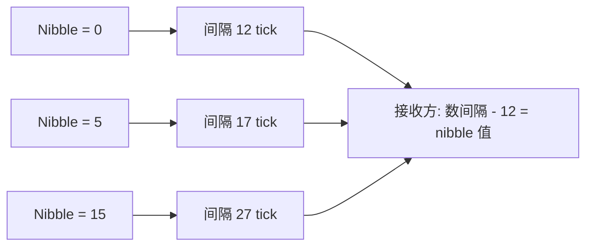

# SENT 单边沿调制：用时间编码的高精度传感

## 一、一个真实的工程场景

发动机舱里，一只节气门位置传感器要把角度以高精度报给 ECU。如果用传统模拟电压输出（0~5V 代表 0°~90°），你会发现：线束一长，压降来了；附近点火线圈一工作，共模噪声叠上来；接插件氧化，电阻一变，读数就飘。模拟量在汽车这个"电磁地狱"里天生脆弱。

于是工程师换了一种思路：不传"电压多高"，而是传"两个下降沿之间隔了多少时间"。时间这个量，在干净电源和脏电源里几乎一样准——只要你能数清 tick。这就是 SENT（Single Edge Nibble Transmission，单边沿半字节传输，标准 SAE J2716）的核心哲学：**用时间间隔编码数据，用单根信号线把高精度和低成本揉在一起**。

对 BMS 与汽车电子工程师而言，SENT 是理解"时间域传感"的绝佳入口：它比模拟抗扰、比 CAN 便宜、布线极简，却能提供 12 位量级的分辨率。

## 二、核心原理：时间即数据

SENT 是单线单向（多数实现，也有增强双向）、单端、低成本的传感器接口。发送端在一条信号线上输出一串脉冲，所有信息都编码在**相邻下降沿之间的时间间隔**里。接收端（通常是 MCU 的定时器/ICU 输入捕获，或专用 SENT 解码模块）只做一件事：精确测量每个下降沿到下一个下降沿用了多少个 tick。

类比：两个人约定"用敲管子传数，敲一下代表开始，之后每两次敲击间隔的'拍数'就是一个数"。你能听清的是"隔了几拍"，而不是"敲得多响"。这就是 SENT 抗干扰的本质——它完全不依赖幅值比较，只数时间。

SENT 的基本时间单位是 **tick**（通常约 3 µs，由传感器内部时钟决定，标准典型值 3~10 µs 区间；具体以器件手册为准）。一个 nibble（4 bit，即 0~15 的数值）用 **12~27 个 tick** 的间隔来表示：

```
间隔 ticks = 12 + nibble值  →  nibble 0 对应 12 tick，nibble 15 对应 27 tick
```

即每个半字节被映射成一段"比基准长 12~27 倍 tick"的时间窗。接收方数出间隔、减去 12、得到 0~15，拼出完整数据。

为什么用"间隔"而非"脉宽"？因为 SENT 每个脉冲都是固定宽度的低电平（下降沿触发、后跟固定宽度），真正的变量是**两个下降沿之间的距离（含高电平段）**，这样对上升/下降沿斜率、对电源幅值都不敏感。

> 图：SENT 用"相邻下降沿的时间间隔"编码半字节——间隔 = 12 + nibble 值（tick 数），接收方数出间隔减去 12 即还原 0~15。



## 三、帧格式逐字段拆解

一帧（Fast Message，快速通道）结构如下：

```
Sync(56 ticks 低电平) | Status/Comm(4 bit) | Data nibble×1~6 (各4bit) | CRC(4 bit) | Pause(可选)
```

> 图：SENT 快速通道帧——固定 56 tick 低电平 Sync 同步，其后每个 nibble/CRC 以"相邻下降沿间隔(12~27 tick)"编码，Pause 分隔帧或承载慢通道。

```mermaid
gantt
    title SENT 快速通道帧（横轴 = tick 数，间隔即数据）
    dateFormat X
    axisFormat %s
    section 帧
    Sync 56t 低电平 : 0, 56
    Status/Comm 12~27t : 56, 76
    Nibble1 12~27t : 76, 96
    Nibble2 12~27t : 96, 116
    Nibble3 12~27t : 116, 136
    CRC 12~27t : 136, 156
    Pause 可变 : 156, 170
```



逐字段含义：

| 字段 | 含义与作用 |
|------|------------|
| **Sync** | 固定 56 个 tick 宽度的低电平脉冲（注意是"低电平持续 56 tick"作为同步基准），接收方据此测量出本帧的 tick 周期（=1/波特）。相当于 UART 的 Start，但更长更稳。 |
| **Status/Comm** | 4 位状态/通信 nibble，传递错误标志、通信位（Comm）、滚码（rolling counter）等，用于诊断与帧间区分。 |
| **Data nibble** | 1~6 个 4 位数据半字节，**用相邻下降沿的时间间隔编码**（12~27 ticks 表示 0~15）。例如 12 位主信号用 3 个 nibble 拼成。 |
| **CRC** | 4 位校验，覆盖 Status + 全部 Data nibble，检测传输错误。 |
| **Pause** | 可选暂停脉冲（一段可变长度高电平），标志帧结束、分隔下一帧，也用于插入慢速通道（见下）。 |

几个关键设计点：

- **Sync 用"固定 56 tick 低电平"**：这个数字远长于任何数据 nibble 的最大间隔（27 tick），所以接收方一看到一段超长的低电平，就知道"新帧的同步段来了"，并据此算出当前 tick 周期。温度/电压导致传感器时钟微漂时，每帧重新标定 tick，天然免疫慢漂移。
- **nibble 数可变（1~6）**：一帧能传 4~24 位数据，灵活适配"12 位主信号 + 8 位辅信号"等组合。每个 nibble 都是独立时间窗，错一个 nibble 只影响局部。
- **Pause 段**：除了分隔帧，慢速通道（Slow Channel，如温度）常借 Pause 的可变长度来编码另一路低速率数据，实现"一帧里同时传快变量和慢变量"。

## 四、配置与解码代码思路

SENT 不需要像 CAN 那样配一堆定时器参数，但接收端必须有一个**高分辨率的定时器 + 输入捕获（ICU）**来数 tick。下面是基于 ICU 边沿捕获的解码伪代码：

```c
/* 假设定时器计数频率远高于 tick 频率，每 tick ≈ 3us */
#define TICK_US       3.0f
#define MIN_TICKS     12      /* nibble 0 的最短间隔 */
#define SYNC_TICKS    56      /* 同步段基准 */

volatile uint32_t last_fall = 0;   /* 上一个下降沿的捕获值 */
uint8_t  nibble_buf[6];
uint8_t  nib_cnt = 0;

void SENT_OnFallingEdge(uint32_t capture)
{
    uint32_t delta = capture - last_fall;     /* 两下降沿间隔的计数值 */
    last_fall = capture;
    float us = delta * TIMER_PERIOD_US;
    uint16_t ticks = (uint16_t)(us / TICK_US + 0.5f);

    if (ticks >= SYNC_TICKS - 4 && ticks <= SYNC_TICKS + 4) {
        /* 命中同步段，开始新帧 */
        nib_cnt = 0;
        return;
    }
    if (ticks < MIN_TICKS || ticks > MIN_TICKS + 15) {
        return;   /* 非法间隔，丢弃 */
    }
    uint8_t nib = ticks - MIN_TICKS;          /* 还原 0~15 */
    if (nib_cnt < 6) nibble_buf[nib_cnt++] = nib;

    if (nib_cnt == TOTAL_NIBBLES) {          /* 收满一帧 */
        uint8_t crc = calc_sent_crc(nibble_buf, nib_cnt - 1);
        if (crc == nibble_buf[nib_cnt - 1]) {
            uint32_t value = assemble(nibble_buf);  /* 拼装主数据 */
            publish_sensor(value);
        }
        nib_cnt = 0;
    }
}
```

注意几个实战细节：

- **tick 周期要每帧用 Sync 重新算**，不要假定固定 3 µs——传感器时钟会随温度漂移。
- **CRC 是 4 位**，覆盖 Status/Comm + Data，算法按 SAE J2716 规定的多项式（典型为带初始值的查表法），务必与传感器器件手册一致。
- **抖动容限**：电磁干扰会让某次下降沿提前/推后一点，所以判断 Sync 和 nibble 时都要留 ±容差窗口，而不是死卡精确值。

### 分辨率与误差预算：12 位是怎么来的

很多工程师看完 nibble 映射会问：每个 nibble 只有 0~15 共 16 档，12 位精度（4096 档）从哪来？答案是**多个 nibble 拼装**。例如一个 12 位主信号被拆成 3 个 nibble（4+4+4），接收端分别解出 N0/N1/N2 后拼成 `Value = N0<<8 | N1<<4 | N2`。每个 nibble 的量化步进是 1 个 tick（约 3 µs 时间或映射后对应的物理量），3 个 nibble 级联后整体步进精度由"每个 tick 对应的物理量"决定。

误差预算要算两笔账：一是**时间测量误差**——定时器计数频率决定你能多细地分辨 tick（计数频率越高，单 tick 边界越准）；二是**传感器时钟误差**——它决定 tick 本身准不准。两者独立累积：即便你的 ICU 能精确到 0.1 tick，传感器时钟若漂了 2%，整体精度也上不去。这也是为什么 SENT 标称高分辨率，但实际系统精度仍受限于传感器那一侧的时钟源质量。

### 慢速通道（Slow Channel）与温度上报

Fast 通道传的是高频主信号（如角度、压力）。而温度这类变化慢的量，SENT 借 **Pause 段的可变长度**编码进同一帧：每若干 Fast 帧插入一次变长 Pause，用 Pause 的 tick 数映射温度值。这样"一帧里同时传快变量和慢变量"，省掉额外一根线或一条总线。解析时状态机要区分"正常帧间隔 Pause"与"慢通道编码 Pause"，否则会把温度误当帧间间隔丢弃。

### SENT 与模拟输出、PWM 传感的成本对比

- **模拟电压**：最便宜但最脆，怕压降、怕噪声、需 ADC + 滤波 + 屏蔽线，长距离必衰。
- **PWM 占空比传感**：抗扰比模拟好，但接收端测占空比需稳定时钟与定时窗口，且一帧只能传一个量。
- **SENT**：单线、定点高精度（12 位级）、强抗扰、可挂 CRC，成本和 PWM 接近却信息量更大，是"模拟升级、又不想上 CAN"的甜点方案。

## 五、常见坑与调试手段

1. **tick 基准时钟精度直接决定测量精度**。SENT 的分辨率来自"数 tick 数"，若传感器内部时钟本身温漂大，即使解码再准，绝对精度也上不去。选型时确认器件时钟源（内部 trimmed RC 还是外部晶振），并在高低温下实测漂移。

2. **下降沿抖动导致 nibble 误判**。发动机舱内点火干扰会让边沿抖动几个微秒，正好跨过某个 nibble 边界（如 26→27 tick）就错一位。调试手段：用示波器/逻辑分析仪抓信号线，量每个间隔的 tick 数分布；软件上加容差窗口、对慢通道做多帧平均。

3. **Sync 检测阈值过严导致丢帧**。若把 Sync 判据卡死成"恰好 56 tick"，传感器时钟一漂就再也同步不上。应设一个合理范围（如 50~62 tick），并在失步后强制等待下一个超长低电平重新建同步。

4. **Pause / 慢通道时序理解错**。有些工程师只解析 Fast 通道，忽略了 Pause 段承载的慢速通道（温度等），结果"温度读不到"。需按器件手册把 Pause 长度也纳入解码状态机。

5. **调试手段**：逻辑分析仪配合 SENT 解码插件最直观（可直接看到每个 nibble 值）；示波器量相邻下降沿间距反算 tick；对比传感器数据手册的时序图逐段核对。

## 六、面试高频要点

- **SENT 怎么同步？** → 固定 56-tick 低电平的 Sync 段，接收方测其宽度算出本帧 tick 周期（每帧重新标定，抗时钟漂移）。
- **为什么用"时间间隔"而不是电压幅值编码？** → 时间测量抗电源噪声/共模干扰远强于幅值比较，适合发动机舱等恶劣电磁环境；精度高且布线简单。
- **一个 nibble 怎么表示 0~15？** → 相邻下降沿间隔 = 12 + nibble 值（tick 数），即 12~27 tick 映射到 0~15。
- **一帧能传多少数据？为什么 nibble 数可变？** → 1~6 个 nibble（4~24 位）可配置；按主/辅信号位数灵活组合，如 12 位主信号用 3 nibble。
- **4 位 CRC 够吗？和 SENT 比 CAN 的优劣？** → 短帧 4 位 CRC 足够覆盖 nibble 级错误，下一帧可补偿；SENT 比 CAN 单线、极低成本、强抗扰、定点高精度，但无多主/网络管理能力，只适合点对点传感器。
