# SENT 传感器接口深度详解：单边沿时间编码的高精度单向传感总线——从协议原理、芯片 IP 设计到驱动与 MCAL 配置

> 本文面向汽车电子、BMS 与嵌入式系统工程师，系统讲解 SAE J2716 SENT（Single Edge Nibble Transmission，单边沿半字节传输）协议的技术原理、帧结构、快/慢通道机制、增强特性、对比选型，并在此基础上深入到三个工程落地层面：SENT 接收芯片模块（基于定时器/输入捕获 ICU 的 IP 内部架构与寄存器位域设计）、真实可读的 C 语言驱动实现（输入捕获、tick 换算、nibble 拼装、CRC、慢通道串行解码、时间戳同步）、以及 AUTOSAR MCAL 视角下的 ICU/SENT 模块配置方法。所有技术描述均基于公开标准与业界通行实现，寄存器与 IP 框图为通用示意（不针对任何具体厂商的保密资料），旨在为技术知识库提供一份可长期参考的深度章节。

---

## 一、SENT 的起源与定位：为什么汽车需要"用时间说话"

### 1.1 从模拟传感说起

在汽车电子发展的很长一段历史里，传感器到 ECU（电子控制单元）之间最常见的接口是**模拟电压输出**。一只节气门位置传感器、一只制动踏板行程传感器，往往就是把机械位移通过电位计或线性霍尔元件转换成一个 0.5~4.5V 的电压信号，再经过几米线束送到 ECU 的 ADC 端口。

这种方案的"脆弱性"在发动机舱这种"电磁地狱"里被无限放大：

- **线束压降**：传感器供电与信号回流共用长线束，电流在线上产生压降，信号端电压不再等于传感器端电压，读数系统性偏低。
- **共模噪声**：点火线圈放电、喷油器关断、电机换向都会在电源线与地线上感应出高频共模电压，直接叠加到微弱的模拟信号上。
- **接插件氧化**：车载连接器长期受热受潮，接触电阻漂移，电压分压关系随之改变，同一物理量对应电压"飘了"。
- **温漂与老化**：电位计磨损、运放漂移，使标定曲线失效。

模拟量的本质问题是：**它用"电压幅值"这个模拟量来承载信息，而幅值在恶劣环境里恰恰是最不可靠的量**。

### 1.2 SENT 的核心哲学：用"时间间隔"代替"电压幅值"

既然幅值不可靠，工程师换了一个思路：**不传"电压多高"，而是传"两个下降沿之间隔了多少时间"**。时间这个量，在干净电源与脏电源里几乎是一样准的——只要接收端能数清 tick（基本时间单位）。

这就是 SENT（Single Edge Nibble Transmission，单边沿半字节传输）协议的核心思想：**用相邻下降沿之间的时间间隔来编码数据，用一根信号线把高精度和低成本揉在一起**。它完全不依赖幅值比较，只数时间，因此从根本上免疫共模干扰与压降。

### 1.3 标准归属与基本特征

SENT 由 **SAE International** 制定，标准号为 **SAE J2716**（全称《SENT — Single Edge Nibble Transmission for Automotive Applications》），2007 年首次发布，后经 2008、2010、2016 等多次修订完善（慢通道增强串行消息即在 2010 版中系统化）。该标准定义了一种**低成本、高分辨率、单向（传感器到 ECU）**的数字传感器接口，主要特征如下：

- **单线传输**：仅用一根信号线（外加电源与地，即典型三线制：VDD/GND/SENT）即可完成通信，无需时钟线、无需差分对。
- **无需独立时钟线**：发送端与接收端不共享时钟，接收端通过每帧的同步/校准段自行测量出当前 tick 周期，天然容忍发送端时钟漂移（标准允许发送端时钟相对标称值有约 ±20% 的偏差窗口，由接收端每帧校准吸收）。
- **单边沿调制**：所有信息编码在**相邻下降沿之间的时间间隔**上，低电平宽度基本固定（标准要求不少于 4 tick，典型约 5 tick），靠高电平持续时间（即两个下降沿间距）表达数值。
- **高分辨率**：通过多个 4-bit 半字节（nibble）级联，主通道可达 12 位（4096 档）甚至更高分辨率。
- **低成本**：传感器侧只需一个定时器/比较器即可产生波形，ECU 侧用普通定时器输入捕获即可解码，无需专用收发器或协议控制器。
- **单向为主**：经典 SENT 是传感器→ECU 单向；标准附录及衍生协议（如 SPC）在此基础上扩展了触发/有限双向能力。

### 1.4 SENT 在汽车接口谱系中的位置

在汽车传感器接口谱系中，SENT 恰好填补了"模拟/PWM"与"总线（CAN/LIN）"之间的空白：

- 比模拟、PWM 抗扰强、分辨率高、可带校验；
- 比 CAN/LIN 便宜、简单、无需网络管理、无需多主仲裁；
- 适合**点对点、单向、高分辨率、对成本敏感**的传感器场景，如加速踏板、制动踏板、涡轮增压压力、油温等。

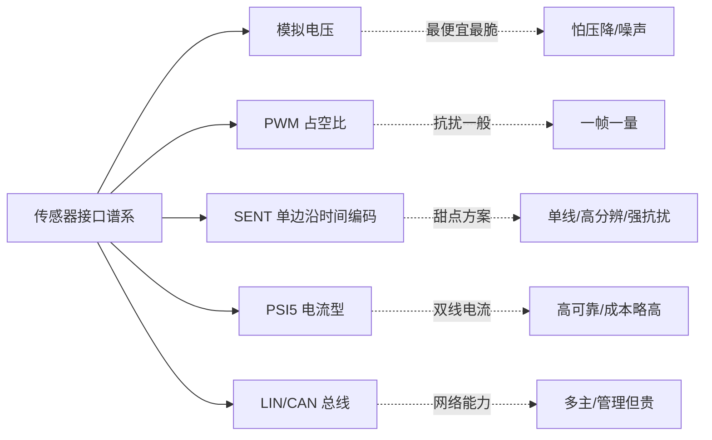

---

## 二、核心原理：时间即数据

### 2.1 基本时间单位 tick

SENT 的所有时间度量都基于一个基本单位——**tick**（标准中亦称 clock tick / unit time）。tick 的物理长度由传感器内部时钟决定，标准推荐的典型值为 **3 µs**（允许范围约 3~10 µs，具体以器件手册为准）。例如某压力传感器标称 tick = 3 µs，其同步/校准段宽度 56 tick 即约 168 µs。

需要强调的是：**tick 不需要接收端预先知道精确值**。接收端通过测量同步段的实际宽度，反推出"本帧的 tick 周期"，因此即使传感器时钟因温度、电压而漂移，每帧都会重新标定，整体精度不受慢漂移影响。

### 2.2 nibble 到时间间隔的映射

SENT 把数据切成若干个 **nibble（4 位，取值 0~15）**，每个 nibble 用一段"相邻下降沿之间的 tick 数"来表达。映射关系为：

```
相邻下降沿间隔(ticks) = 12 + nibble 值     (nibble 0 → 12 tick，nibble 15 → 27 tick)
```

即每个半字节被映射成一段 **12~27 tick** 的时间间隔。接收方数出间隔、减去 12，就还原出 0~15 的 nibble 值，再把多个 nibble 拼接成完整数据。

> 设计要点：为什么用"间隔"而非"脉宽"？SENT 每个脉冲的低电平宽度是基本固定的（下降沿之后跟约 5 tick 的固定低电平），真正的变量是**两个下降沿之间的距离（含高电平段）**。这样编码对上升/下降沿的斜率、对电源幅值都不敏感——只要下降沿能被识别，时间间隔就准。之所以选下降沿而非上升沿，是因为 SENT 驱动级通常为开漏拉低 + 上拉电阻回高：下降沿由晶体管主动拉低、陡峭且确定；上升沿由 RC 充电决定、缓慢且受负载电容影响。**用最陡的那个沿做基准，是抗抖动的第一性选择。**

### 2.3 抗干扰本质的类比

可以把 SENT 想象成两个人约定"用敲管子传数"：先敲一下代表开始，之后每一次敲击与下一次敲击之间"隔了几拍"就是一个 nibble 值。听觉能分辨的是"隔了几拍"，而不是"敲得多响"。SENT 抗干扰的本质正在于此：**它完全不依赖幅值比较，只数时间**。无论电源多脏、共模噪声多大，只要下降沿能被比较器识别出来，时间间隔的测量就不受影响。

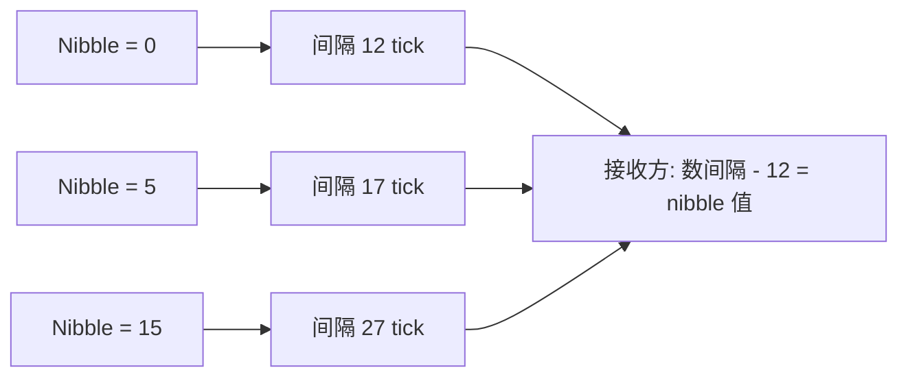

### 2.4 时间测量误差与时钟误差：两笔独立的账

很多工程师初次接触 SENT 会疑惑：每个 nibble 只有 16 档，12 位（4096 档）精度从何而来？答案是**多个 nibble 级联**。例如 12 位主信号拆成 3 个 nibble（4+4+4），接收端分别解出 N0/N1/N2 后拼成 `Value = N0<<8 | N1<<4 | N2`。

但这里必须算两笔独立的误差账：

1. **时间测量误差（接收端）**：由 MCU 定时器计数频率决定。计数频率越高，越能精细分辨"一个 tick 边界落在哪里"，单 tick 边界越准。
2. **传感器时钟误差（发送端）**：它决定 tick 本身准不准。哪怕接收端能精确到 0.1 tick，若传感器时钟漂了 2%，整体绝对精度也上不去。

两者独立累积，因此 SENT 标称"高分辨率"，但**系统绝对精度仍受限于传感器那一侧的时钟源质量**。选型时要确认器件时钟源（内部 trimmed RC 还是外部晶振），并在高低温下实测漂移。

---

## 三、帧结构逐字段拆解

### 3.1 快速通道（Fast Channel）帧总体布局

一帧典型的 SENT 快速消息（Fast Message）结构如下：

```
Sync/Calibration(56 tick) | Status/Comm(4 bit) | Data nibble ×1~6 (各 4 bit) | CRC(4 bit) | Pause(可选可变)
```

其中 Sync/Calibration（同步/校准脉冲）是一段**固定 56 tick 宽度的间隔**（以其起始下降沿到下一个下降沿计 56 tick，其中含约 5 tick 低电平），是接收端每帧重算 tick 的基准。其后每个 nibble 与 CRC 都以"相邻下降沿间隔 12~27 tick"编码；最后的可选 Pause 段是一段可变长度的脉冲，用于标志帧结束、把帧长补齐成恒定值，或分隔下一帧。


### 3.2 逐字段含义

| 字段 | 位数 | 编码方式 | 含义与作用 |
|------|------|----------|------------|
| **Sync/Calibration（同步/校准段）** | 固定 56 tick | 固定间隔 | 接收方据此测量出本帧的 tick 周期。相当于 UART 的 Start，但更长更稳；远长于任何数据 nibble 最大间隔（27 tick），便于可靠识别帧首。 |
| **Status/Comm（状态/通信 nibble）** | 4 bit | 间隔编码 | bit0/bit1 为应用状态位（错误标志、模式指示等）；bit2 为慢通道串行数据位；bit3 为慢通道消息起始/格式位。是快通道诊断与慢通道复用的关键载体。 |
| **Data nibble（数据半字节）** | 每 nibble 4 bit，共 1~6 个 | 间隔编码 | 用相邻下降沿时间间隔 12~27 tick 表示 0~15。例如 12 位主信号用 3 个 nibble 拼成，MSN（最高有效 nibble）先发。 |
| **CRC（校验）** | 4 bit | 间隔编码 | 覆盖全部 Data nibble（经典法不含 Status nibble），多项式 x⁴+x³+x²+1，种子 0b0101，检测传输错误。 |
| **Pause（暂停脉冲）** | 可选，12~768 tick | 可变间隔 | 标志帧结束、分隔下一帧；常用于"恒定帧周期"模式——数据变化导致帧长变化时，用 Pause 补齐，使帧率恒定，便于控制环采样。 |

### 3.3 关键设计点

- **Sync 固定 56 tick**：这个数字远长于任何数据 nibble 的最大间隔（27 tick），也小于最短 Pause 判定的歧义区。接收方一看到一段落在 56±20% 窗口内的超长间隔，就知道"新帧校准段来了"，并据此算出当前 tick 周期。温度/电压导致传感器时钟微漂时，每帧重新标定，天然免疫慢漂移。56 = 16×3.5 也便于传感器侧用分频器整数化生成。
- **nibble 数可变（1~6）**：一帧能传 4~24 位数据，灵活适配"12 位主信号 + 12 位副信号"（如 J2716 附录 H.1 定义的双 12 位快通道格式）或"12 位信号 + 8 位安全计数器 + MSN 取反"（H.4 格式，用于功能安全完整性校验）等组合。每个 nibble 都是独立时间窗，错一个 nibble 只影响局部，不会整帧崩溃。
- **Pause 段的角色**：除分隔帧、恒定帧周期外，一些工程实现也借 Pause 存在与否区分工作模式。注意：**标准的慢通道并不是"用 Pause 长度编码温度"**——这是一个常见误解，慢通道数据实际藏在 Status nibble 的 bit2/bit3 中跨帧串行传输（详见第四章）。笔者见过不止一个团队因这个误解写出永远收不到温度的解码器。

### 3.4 帧长度计算

设每帧含 `n` 个数据 nibble（不含 Status/Comm 与 CRC），则一帧的总 tick 数近似为：

```
帧总 tick ≈ Sync(56) + (Status/Comm 1 个 + Data n 个 + CRC 1 个) × 平均 nibble 间隔 + Pause
          = 56 + (n + 2) × 19.5(平均) + Pause
```

以典型 3 nibble 数据帧为例（1 个 Status + 3 个 Data + 1 个 CRC = 5 个 nibble，平均间隔取中值约 19.5 tick，Pause 取 0 即无暂停快速帧）：

```
帧总 tick ≈ 56 + 5 × 19.5 = 153.5 tick
若 tick = 3 µs，则帧周期 ≈ 460 µs，对应约 2.17 kHz 帧率
```

这个数量级说明：SENT 主通道更新率通常在 1~4 kHz 区间，足以覆盖踏板、压力等中高速物理量。实际帧率受 Pause 长度、数据内容（间隔随数值变化）影响。

为便于选型，下面给出在 tick = 3 µs、无 Pause 时，不同数据 nibble 数对应的近似帧长度与帧率（平均 nibble 间隔按 19.5 tick 估算）：

| 数据 nibble 数 | 总 nibble（含 Status+CRC） | 帧长(tick) 约 | 帧周期 @3µs | 近似帧率 |
|----------------|----------------------------|---------------|-------------|----------|
| 1（4 位） | 3 | 56 + 3×19.5 ≈ 114.5 | 343.5 µs | ~2.9 kHz |
| 2（8 位） | 4 | 56 + 4×19.5 ≈ 134 | 402 µs | ~2.5 kHz |
| 3（12 位） | 5 | 56 + 5×19.5 ≈ 153.5 | 460 µs | ~2.2 kHz |
| 4（16 位） | 6 | 56 + 6×19.5 ≈ 173 | 519 µs | ~1.9 kHz |
| 6（24 位） | 8 | 56 + 8×19.5 ≈ 212 | 636 µs | ~1.6 kHz |

可见：分辨率越高（nibble 越多），帧越长、帧率越低。设计时要按"分辨率需求 vs 实时性需求"折中；对超高速量（如曲轴振动），宁可降分辨率也要保帧率。

### 3.5 Status/Comm nibble 的位定义与错误语义

Status/Comm 这个 4 位 nibble 并非随意，它承载着关键的**诊断与慢通道复用信息**，业界通行的位分配是：

- **bit0、bit1**：应用特定状态位。常见用法：bit0 = 传感器故障/超量程标志，bit1 = 第二通道状态或模式指示；具体语义由器件手册/应用规范（如 TLE4998、MLX90372 等霍尔器件手册）定义。
- **bit2**：慢通道**串行数据位**（Serial Data）——每个快帧贡献 1 bit，跨多帧拼出慢通道消息。
- **bit3**：慢通道**消息起始位/格式标志**（Start bit）——短串行消息中标记 16 帧序列的第一帧；增强串行消息中以特定 bit3 图样标识格式。

笔者在驱动中务必解析这些位——仅取数据而忽略 Status，会丢掉传感器上报的故障信号与整个慢通道，等于放弃了 SENT 自带的诊断能力。

---

## 四、快通道与慢通道：一根线上的时间复用

### 4.1 快通道（Fast Channel）

**快通道**承载高频主信号，如角度、压力、位置等需要每帧刷新的量。它使用前述标准帧结构，分辨率由 nibble 数决定（常见 12 位，即用 3 个数据 nibble）。快通道帧率高、实时性好，是 SENT 的主力数据通道。J2716 附录 H 定义了若干标准化快通道格式，工程上直接按传感器声明的格式解码即可：

| 格式 | 数据布局 | 典型用途 |
|------|----------|----------|
| H.1 | 两个独立 12 位快通道（6 数据 nibble） | 双通道角度/双压力 |
| H.2 | 单一 12 位快通道（3 数据 nibble） | 单路位置/压力 |
| H.3 | 高速低分辨（如 2×8 位紧凑帧） | 高帧率场合 |
| H.4 | 12 位数据 + 8 位安全计数器 + MSN 取反 | 功能安全（滚码+取反自检） |
| H.5/H.6/H.7 | 单通道 12 位变体 / 14+2 位 / 16 位等扩展 | 高分辨率单通道 |

### 4.2 慢通道（Slow Channel）：藏在 Status nibble 里的第二条链路

温度、诊断码、传感器序列号这类变化缓慢的量，如果用快通道每帧都传，会浪费宝贵的带宽。SENT 的设计是：**每个快帧的 Status nibble 贡献 2 个比特（bit2 数据 + bit3 标记），跨多帧串行累积出一条完整的慢通道消息**。这就是"时间复用"——快变量走数据 nibble、每帧刷新；慢变量走 Status 位、几十帧才凑齐一条，但对温度这类秒级变化量绰绰有余。

标准定义了两种慢通道消息格式：

| 特性 | 短串行消息（Short Serial） | 增强串行消息（Enhanced Serial） |
|------|---------------------------|--------------------------------|
| 跨越快帧数 | 16 帧 | 18 帧 |
| 起始标识 | 第 1 帧 bit3 = 1，其余帧 bit3 = 0 | 前 7 帧 bit3 图样 1111110 等特征序列 |
| 消息 ID | 4 位 | 8 位（C=1 时 4 位） |
| 数据载荷 | 8 位 | 12 位（C=1 时 16 位） |
| CRC | 4 位（同快通道算法思路） | 6 位（多项式 x⁶+x⁴+x³+1，种子 0b010101） |
| 单条消息耗时 @2kHz 帧率 | 约 8 ms | 约 9 ms |
| 典型内容 | 温度、诊断码 | 序列号、标定参数、扩展诊断 |

以短串行消息为例：16 个连续快帧的 bit2 依次串出 16 位——前 4 位是消息 ID，中间 8 位是数据（如温度），后 4 位是 CRC；第 1 帧的 bit3 置 1 作为"这是一条新消息的开始"的旗标。接收端只要在每个快帧解出 Status nibble，把 bit2 塞进移位寄存器、用 bit3 对齐消息边界，就能还原慢通道。

> 解析要点：慢通道解码器必须是一个**独立于快通道的并行状态机**，以帧为节拍推进。丢一个快帧（CRC 错被丢弃）就会让慢通道消息串位，因此慢通道状态机要在快帧 CRC 失败时同步复位或标记本条消息作废——这是慢通道"偶尔读不到温度"的最常见根因。

### 4.3 快/慢通道配合示意

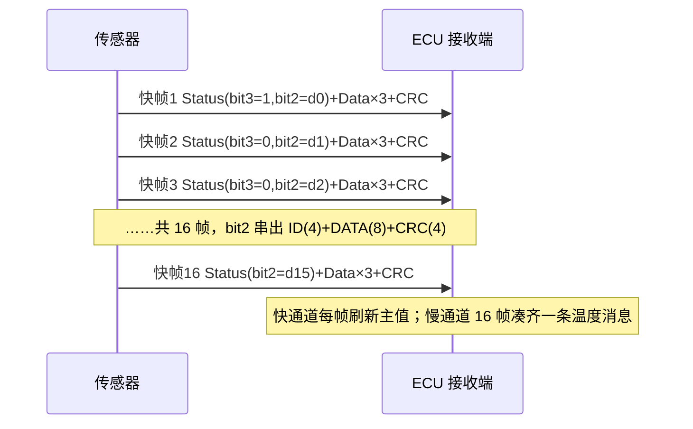

---

## 五、tick 时间的深层分析：时钟源、漂移与精度预算

### 5.1 tick 由谁产生

tick 源自传感器内部的时钟基准。常见实现有两种：

- **内部 trimmed RC 振荡器**：成本低，但温漂与初始精度有限（典型 ±1%~±5%），靠出厂修调（trim）改善。
- **外部晶振或片上 PLL**：精度高、温漂小，但成本与功耗上升。

因为 SENT 每帧用 Sync 重新测量 tick，所以**慢漂移被自然抵消**；但快抖动（如 RC 振荡器短期抖动）仍会引入单帧随机误差。因此高分辨率应用优先选时钟质量好的器件。标准还规定接收端应对**相邻两帧的校准脉冲宽度做连续性检查**（变化超过约 1.5625% 即判定异常），以捕捉时钟突变类故障。

### 5.2 精度预算的两大来源

前面已提到两笔账，这里给出工程化的预算思路：

```
单 nibble 时间分辨率 = 1 tick ≈ 3 µs（以典型值计）
12 位主信号 = 3 nibble，nibble 级联后逐位组合出 4096 档
```

- **接收端误差**：若定时器计数频率 `f_cnt = 48 MHz`，则最小可分辨时间 = 1/48 µs ≈ 20.8 ns，相对单 tick(3 µs) 约 0.7%，即单 nibble 边界分辨率约 1/144 tick，足够精细。
- **发送端误差**：若传感器时钟温漂 2%，则同一物理 tick 实际长度从 3 µs 变到 3.06 µs，整帧累积偏移被每帧 Sync 重新标定，但单帧内所有 nibble 共享同一偏差 → 帧内相对测量仍准，绝对时间戳精度受 2% 限制。

结论：在 SENT 系统里，**提高接收端计数频率带来的收益是有限的，真正的上限在传感器时钟源**。这是选型与验收测试必须关注的点。

### 5.3 抖动容限与容差窗口

发动机舱内点火干扰会让某个下降沿提前或推后几微秒，正好跨过 nibble 边界（如 26→27 tick）就错一位。因此软件上判断 Sync 与 nibble 时都要留**容差窗口**，而不是死卡精确值。典型做法：

- Sync 判据：在 `56 × (1 ± 20%)` 范围内（约 45~67 tick）即认定为候选校准段，再结合帧结构合法性确认；
- nibble 判据：以每个整数 tick 为中心，四舍五入归到最近整数；仅当边沿抖动 < 0.5 tick 时归整无错，工程上还会拒收落在 <11.5 tick 或 >27.5 tick 的非法间隔。

---

## 六、增强型 SENT 与衍生机制：串行消息、时间戳与多传感器同步

### 6.1 演进动机

经典 SENT 是纯单向、单传感器一帧。随着应用复杂化，标准与业界在三个方向做了增强：

1. **增强串行消息（Enhanced Serial Message）**：扩大慢通道的 ID 空间与载荷（8 位 ID + 12 位数据，或 4 位 ID + 16 位数据），配 6 位 CRC，承载配置、序列号、扩展诊断等结构化数据；
2. **时间戳与采样时刻约定**：让接收端能推算"这帧数据对应的物理量采样时刻"，便于多路信号在时间轴上对齐；
3. **触发/同步类衍生协议（如 SPC，Short PWM Code）**：主机在 SENT 线上发出一个宽度编码的触发脉冲，传感器应答一帧 SENT——把纯单向广播变为"问答式"，支持多传感器分时共线与同步采样。

### 6.2 多传感器同步机制

在 SPC 或独立触发线方案中，ECU 发出**同步触发脉冲**，各传感器收到触发后在同一时刻锁存采样并以固定（或 ID 决定的）延迟回传。这样多个传感器的数据天然时间对齐，省去接收端做复杂插值。

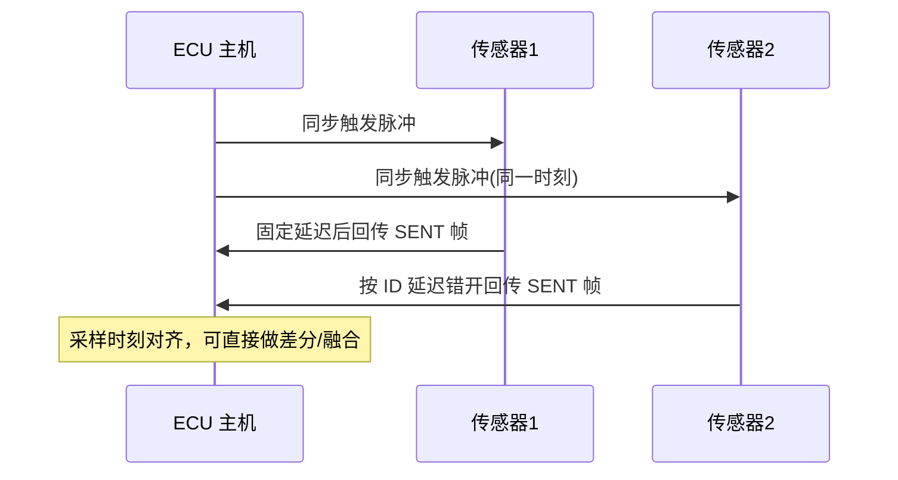

### 6.3 时间戳同步的实现价值

在需要多传感器融合（如电子节气门同时读位置与温度、制动踏板读行程与主缸压力）时，时间戳让接收端知道"这帧数据的采样时刻"。接收端在捕获到校准脉冲下降沿时锁存全局时间基准，再按传感器手册声明的"采样到发送延迟"回推采样时刻，即可实现跨传感器的高精度时间对齐，这是功能安全（如制动冗余）中的重要手段。具体驱动实现见 8.6 节。

---

## 七、芯片模块设计：基于定时器/输入捕获的 SENT 接收 IP 内部架构

本章从数字 IC/SoC 外设设计视角，拆解一个通用 SENT 接收模块（下称 **SENTRX IP**）的内部架构。市面上多款车规 MCU 已集成类似硬件（如 Infineon AURIX 的 SENT 模块、NXP MPC57xx 的 SRX、Renesas RH850 的 RSENT、ST Stellar 的 SENT 外设），没有专用模块的 MCU 则用通用定时器 ICU（输入捕获单元）+ 软件状态机实现。以下框图与寄存器为**通用示意**，体现的是这类 IP 的共性设计逻辑，不对应任何具体厂商的私有资料。

### 7.1 顶层架构框图

SENTRX IP 本质上是一个"带协议后处理的增强型输入捕获定时器"：前端是引脚滤波与边沿检测，中间是高精度 tick 计数与间隔测量，后端是 nibble 解码、CRC 校验、快/慢通道分拣、FIFO 缓冲，最终以中断/DMA 方式交付 CPU。

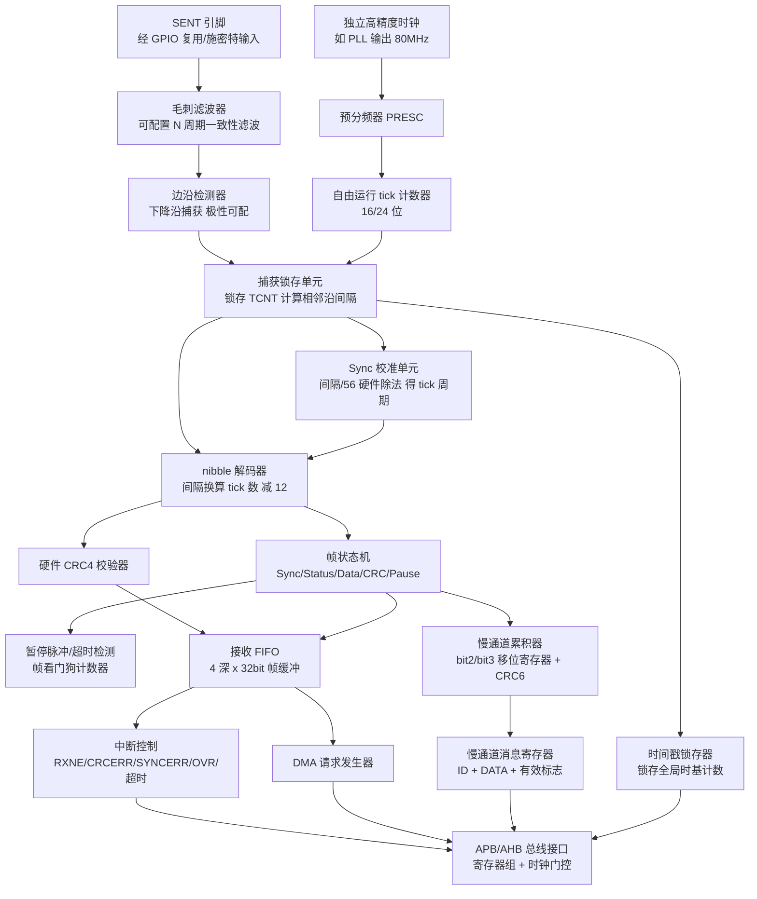

### 7.2 引脚输入滤波与边沿检测

引脚进来第一级是**数字毛刺滤波器**。汽车环境中，点火放电耦合到 SENT 线上的毛刺通常在几十到几百纳秒量级，远短于最小合法低电平（4 tick ≈ 12 µs）。滤波器采用"N 个滤波时钟周期采样一致才翻转"的多数表决/一致性结构：内部对引脚以滤波时钟连续采样，只有连续 N 次（N 可配，如 4/8/16）采到相同电平，滤波输出才更新。N × 滤波时钟周期即为可吸收的最大毛刺宽度，这个值必须远小于 0.5 tick，否则滤波延迟本身会吃掉抖动预算。

边沿检测器对滤波后的信号做极性可配置的边沿捕获（SENT 用下降沿）。检测到有效边沿的当拍，硬件同时完成两件事：**锁存 tick 计数器当前值到捕获寄存器**、**向帧状态机发出"边沿事件"**。

### 7.3 tick 计数器与间隔测量：为什么必须独立高精度时钟

tick 计数器是整个 IP 的"尺子"。设计上有三个关键决策：

1. **时钟源必须独立且高精度**。SENT 解码的分辨率下限 = 计数时钟周期。若挂在会随低功耗模式降频的总线时钟上，一次动态调频就会让所有在途测量作废。因此 SENTRX 的计数时钟通常直接取自 PLL 固定输出或专用外设时钟树，与 CPU 频率解耦。以 tick = 3 µs、希望测量分辨率优于 1% tick 计，计数时钟需 ≥ 33 MHz；工程上常用 48~80 MHz。
2. **位宽要覆盖最长合法间隔**。最长需测量的是 Pause（可达 768 tick ≈ 2.3 ms @3µs）加超时余量；80 MHz 计数下 2.3 ms 需约 18.5 位，故计数器取 24 位（或 16 位 + 溢出扩展逻辑）。
3. **间隔用差值而非清零重启**。捕获采用"自由运行计数器 + 相邻捕获值相减"，而不是每个边沿清零计数器——差值法天然吸收计数器回绕（无符号减法模运算），且不会在清零瞬间丢计数。

**为什么 SENT 对 tick 精度要求比普通 PWM 捕获高一个量级？** 因为 PWM 解码只需分辨占空比的相对值，而 SENT 要把连续时间**量化到整数 tick 栅格**：量化判决边界只有 ±0.5 tick（1.5 µs）宽，测量误差、滤波延迟、中断抖动（软件方案）、发送端抖动要共同挤进这 1.5 µs 的预算里。硬件方案中捕获锁存是零抖动的，这正是专用 IP 相对纯软件方案的核心价值。

### 7.4 Sync 校准与 nibble 硬件解码

帧状态机检测到一个落在"校准候选窗口"（编程为 56 tick ± 容差）的间隔后，**Sync 校准单元**用硬件除法（或移位近似：间隔×(1/56) 的定点乘法）得到"每 tick 的计数值" `cntPerTick`。随后每个间隔除以 `cntPerTick` 并四舍五入，减 12 得 nibble 值。落在 [12,27] 之外的结果由状态机分类：≈56 → 新校准段（强制重同步）；> 编程的 Pause 阈值 → 暂停脉冲；其余 → 帧格式错误，置 `FMERR` 并丢弃当前帧。

### 7.5 暂停脉冲检测与帧看门狗

**帧看门狗计数器**在每个边沿清零、以 tick 计数时钟递增；若超过编程的超时阈值（如 1.5 倍最大帧长）仍无边沿，硬件置 `WDGERR` 中断——这覆盖了"传感器断线/信号线对电源短路导致恒定电平"的故障模式，是功能安全诊断覆盖率的重要贡献项。暂停脉冲检测与看门狗共用计数路径，只是阈值与响应不同。

### 7.6 FIFO、缓冲与中断/DMA 协作

一帧解码完成（CRC 通过）后，硬件把帧打包成一个 32 位字（布局见 SENTRX_DATA 寄存器）压入 **4 深接收 FIFO**。FIFO 的意义在于解耦"帧到达节拍"（数百 µs）与"CPU 响应延迟"：即使 CPU 正在跑更高优先级任务错过 2~3 帧的读取窗口，也不丢数据。中断与 DMA 的分工是：

- **中断路径**：`RXNE`（FIFO 非空）、`SCRDY`（慢通道消息就绪）、错误类（`CRCERR/FMERR/SYNCERR/OVR/WDGERR`）分别可独立使能。低帧率或需要逐帧时间戳处理时用中断。
- **DMA 路径**：`RXNE` 同时可发 DMA 请求，DMA 把 FIFO 内容搬到内存环形缓冲，CPU 每毫秒批处理一次。多路 SENT（如 8 通道压力阵列）时 DMA 几乎是必选，否则中断风暴会吃掉可观的 CPU 负载。

### 7.7 寄存器与位域设计（通用示意）

一个最小可用的 SENTRX 通道寄存器组如下表（偏移与位域为示意，符合常见外设设计惯例）：

| 偏移 | 寄存器 | 关键位域 | 说明 |
|------|--------|----------|------|
| 0x00 | SENTRX_CR（控制） | EN, POL, FILTEN, FILTN[3:0], PRESC[7:0], NIBCNT[2:0], PPEN, SCEN, SCFMT, CRCEN, DMAEN | 模块使能、极性、滤波、分频、帧 nibble 数、暂停/慢通道/CRC/DMA 使能 |
| 0x04 | SENTRX_IER（中断使能） | RXNEIE, SCRDYIE, CRCERRIE, FMERRIE, SYNCERRIE, OVRIE, WDGIE | 各事件中断独立使能 |
| 0x08 | SENTRX_SR（状态） | RXNE, SCRDY, CRCERR, FMERR, SYNCERR, OVR, WDGERR, BUSY, FLVL[2:0] | 写 1 清零（W1C）错误位；FLVL 为 FIFO 水位 |
| 0x0C | SENTRX_CAPT（捕获值） | CAPT[23:0] | 最近一次边沿锁存的 tick 计数值（调试用） |
| 0x10 | SENTRX_CAL（校准） | CNTPERTICK[15:0] 定点 Q8.8 | 硬件测得的当前 tick 对应计数值 |
| 0x14 | SENTRX_DATA（FIFO 读口） | STAT[3:0], D5..D0[23:0], CRCOK | 读出一帧：Status nibble + 最多 6 数据 nibble 紧凑排布 |
| 0x18 | SENTRX_SCMSG（慢通道） | SCID[7:0], SCDATA[15:0], SCCRCOK, SCFMTQ | 拼装完成的慢通道消息 |
| 0x1C | SENTRX_WDG（看门狗） | WDGTH[23:0] | 无边沿超时阈值（计数单位） |
| 0x20 | SENTRX_TS（时间戳） | TS[31:0] | 帧校准脉冲下降沿锁存的全局时基 |

控制寄存器 SENTRX_CR 的 32 位位域布局：

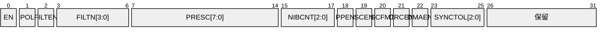

位域语义说明：

- **EN**：通道总使能。清零时状态机复位、FIFO 清空、计数器停走（省功耗）。
- **POL**：捕获极性。SENT 固定用下降沿，但引脚经反相隔离电路时可翻转。
- **FILTEN / FILTN[3:0]**：滤波使能与一致性采样次数 N（滤除 ≤ N 个滤波时钟周期的毛刺）。
- **PRESC[7:0]**：计数时钟预分频。tick 较长（10 µs）时可分频以降低功耗、避免计数器溢出过快。
- **NIBCNT[2:0]**：本通道期望的数据 nibble 数（1~6），状态机据此判定帧完整性。
- **PPEN**：暂停脉冲模式使能（传感器带 Pause 时必须开，否则超长间隔被误判 SYNCERR）。
- **SCEN / SCFMT**：慢通道使能与格式选择（0=短串行 16 帧，1=增强串行 18 帧）。
- **SYNCTOL[2:0]**：校准脉冲容差窗口编码（如 000=±20%，001=±10%……），配合连续帧校准值突变检测。

状态寄存器采用**W1C（写 1 清零）**语义而非读清零——这是多主访问（CPU + 调试器）下避免"读走对方事件"的常见外设设计准则。

### 7.8 时钟域与复位域

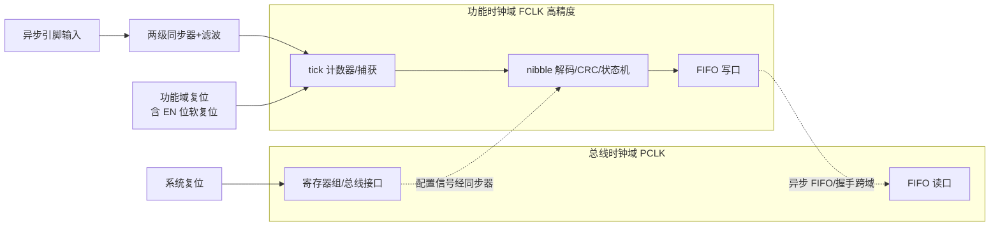

要点有三：其一，引脚是异步信号，进入功能时钟域前必须过**两级触发器同步器**再进滤波器，否则亚稳态会随机产生假边沿；其二，寄存器组跑总线时钟（可随系统降频），测量路径跑独立功能时钟（恒频），两域之间用异步 FIFO 与握手同步器交换数据——这就是 7.3 节"独立高精度时钟"的电路落点；其三，EN 位兼作功能域软复位，保证任何时刻禁能再使能后状态机从干净状态启动。

---

## 八、驱动代码实现：从捕获中断到应用数据

本章给出一套完整可读的 C 语言参考实现，覆盖"无专用 SENT 硬件、用通用定时器 ICU + 软件状态机"这一最普遍的场景（有 SENTRX 硬件时，驱动退化为读 FIFO + 处理中断，结构更简单）。代码风格贴近量产嵌入式工程：静态内存、无浮点热路径（tick 换算用定点）、错误路径完备。

### 8.1 驱动分层结构

```
应用层        sent_get_value() / sent_get_slow_msg() / 故障回调
------------------------------------------------------------
协议层        帧状态机、nibble 拼装、CRC4、慢通道 CRC6、超时管理
------------------------------------------------------------
捕获抽象层    icu_capture_isr() 上报 (通道, 捕获计数, 溢出标志)
------------------------------------------------------------
硬件层        通用定时器：自由运行 + 下降沿捕获 + 数字滤波
```

### 8.2 数据结构与 MCU 捕获驱动（输入捕获中断）

```c
/* ================= sent_rx.h : 类型与配置 ================= */
#include <stdint.h>
#include <stdbool.h>

#define SENT_DATA_NIBBLES   3u          /* 12 位主信号：3 个数据 nibble */
#define SENT_FRAME_NIBBLES  (1u + SENT_DATA_NIBBLES + 1u) /* Status+Data+CRC */
#define SENT_SYNC_TICKS     56u
#define SENT_NIB_MIN        12u
#define SENT_NIB_MAX        27u
#define SENT_TIMER_HZ       48000000u   /* 捕获定时器计数频率 48 MHz */
#define SENT_TICK_NOM_NS    3000u       /* 标称 tick = 3 µs，仅作合法性初判 */

typedef enum {
    SENT_WAIT_SYNC = 0,     /* 等待校准脉冲，尚未同步 */
    SENT_IN_FRAME,          /* 已同步，正在收 nibble */
} sent_state_t;

typedef struct {
    /* --- 捕获与同步 --- */
    uint32_t last_cap;          /* 上一个下降沿的捕获计数值 */
    uint32_t cnt_per_tick_q8;   /* 定点 Q24.8：每 tick 对应的计数值×256 */
    sent_state_t state;
    /* --- 帧缓冲 --- */
    uint8_t  nib[SENT_FRAME_NIBBLES];
    uint8_t  nib_cnt;
    /* --- 慢通道 --- */
    uint16_t sc_shift2;         /* bit2 串行数据移位寄存器 */
    uint16_t sc_shift3;         /* bit3 起始位移位寄存器 */
    uint8_t  sc_frame_cnt;      /* 当前慢通道消息已累积帧数 */
    /* --- 输出与诊断 --- */
    volatile uint16_t value;    /* 最新 12 位主值 */
    volatile uint8_t  status;   /* 最新 Status nibble */
    volatile uint32_t ts_sync;  /* 本帧校准沿的全局时间戳 */
    uint32_t err_crc, err_sync, err_range, err_timeout; /* 错误计数器 */
} sent_ch_t;

/* ================= icu 捕获中断：驱动入口 ================= */
/* 定时器配置要点（初始化代码略）：
 *  - 自由运行 32 位向上计数，时钟 48 MHz，不清零；
 *  - 通道配置为下降沿捕获，使能数字滤波（如 8 个采样周期一致）；
 *  - 使能捕获中断与溢出中断（溢出用于超时检测的时基扩展）。   */
void icu_capture_isr(sent_ch_t *ch, uint32_t cap_now)
{
    uint32_t delta = cap_now - ch->last_cap;  /* 无符号减法天然容忍回绕 */
    ch->last_cap = cap_now;
    sent_on_edge(ch, delta, cap_now);         /* 交给协议层状态机 */
}
```

注释中的三个初始化要点值得展开：**自由运行不清零**是差值法测间隔的前提；**数字滤波**把亚微秒毛刺挡在捕获单元之外；**溢出中断**为 8.7 节的超时检测提供长时基。捕获中断服务程序本体只做"取差值、递交状态机"两件事，全部协议逻辑放在可单元测试的纯函数里——这是让 SENT 驱动可以在 PC 上用录制的边沿序列做回归测试的关键结构决策。

### 8.3 帧状态机：Sync 识别、tick 换算与 12 位数据合成

```c
/* ============ 协议层：边沿事件状态机（在中断上下文运行）============ */

/* 把捕获计数差换算为 tick 数（四舍五入），定点运算避免浮点 */
static inline uint32_t delta_to_ticks(const sent_ch_t *ch, uint32_t delta)
{
    /* ticks = delta * 256 / cnt_per_tick_q8，+一半除数实现四舍五入 */
    return ((delta << 8) + (ch->cnt_per_tick_q8 >> 1)) / ch->cnt_per_tick_q8;
}

/* 判定一个间隔是否为合法校准脉冲（±20% 窗口 + 绝对合理性）*/
static bool is_sync_candidate(uint32_t delta)
{
    /* 以标称 tick 估算：56 tick 的 0.8~1.2 倍 */
    uint32_t nom = (uint32_t)((uint64_t)SENT_TICK_NOM_NS * SENT_TIMER_HZ
                              / 1000000000u);        /* 每 tick 计数值 */
    return (delta > nom * SENT_SYNC_TICKS * 4u / 5u) &&
           (delta < nom * SENT_SYNC_TICKS * 6u / 5u);
}

void sent_on_edge(sent_ch_t *ch, uint32_t delta, uint32_t cap_now)
{
    /* 1. 任何状态下，先看是不是新的校准脉冲（自恢复能力的来源） */
    if (is_sync_candidate(delta)) {
        /* cnt_per_tick(Q24.8) = delta*256/56；每帧重新标定，吸收温漂 */
        ch->cnt_per_tick_q8 = (delta << 8) / SENT_SYNC_TICKS;
        ch->ts_sync  = timestamp_from_capture(cap_now);  /* 见 8.6 */
        ch->nib_cnt  = 0;
        ch->state    = SENT_IN_FRAME;
        return;
    }
    if (ch->state != SENT_IN_FRAME) {
        return;                      /* 未同步期间忽略一切非 Sync 间隔 */
    }

    /* 2. 换算 tick 并分类 */
    uint32_t ticks = delta_to_ticks(ch, delta);
    if (ticks < SENT_NIB_MIN || ticks > SENT_NIB_MAX) {
        if (ticks > SENT_NIB_MAX * 2u) {
            return;                  /* 暂停脉冲：帧间填充，静默忽略 */
        }
        ch->err_range++;             /* 非法间隔：丢帧重新等 Sync */
        ch->state = SENT_WAIT_SYNC;
        return;
    }

    /* 3. 收集 nibble */
    ch->nib[ch->nib_cnt++] = (uint8_t)(ticks - SENT_NIB_MIN);
    if (ch->nib_cnt < SENT_FRAME_NIBBLES) {
        return;
    }

    /* 4. 帧收满：CRC 校验 + 数据合成 */
    ch->state   = SENT_WAIT_SYNC;    /* 无论成败，下一步都等新 Sync */
    ch->nib_cnt = 0;
    uint8_t crc_rx  = ch->nib[SENT_FRAME_NIBBLES - 1u];
    uint8_t crc_cal = sent_crc4(&ch->nib[1], SENT_DATA_NIBBLES);
    if (crc_cal != crc_rx) {
        ch->err_crc++;
        sent_slow_abort(ch);         /* 慢通道消息作废，防止串位 */
        return;
    }
    ch->status = ch->nib[0];
    ch->value  = ((uint16_t)ch->nib[1] << 8) |   /* MSN 先发 */
                 ((uint16_t)ch->nib[2] << 4) |
                  (uint16_t)ch->nib[3];
    sent_slow_feed(ch, ch->status);  /* 把 Status 的 bit2/bit3 喂给慢通道 */
    sent_notify_new_value(ch);       /* 通知上层（置标志/发事件） */
}
```

几个工程细节：**"任何状态先查 Sync"**赋予状态机自恢复能力——无论此前丢了多少边沿、错了多少帧，下一个校准脉冲总能重建同步；**定点 Q24.8** 让 tick 换算在 Cortex-M0 这类无 FPU 内核上也只需一次乘除；**CRC 失败必须同时作废慢通道**（`sent_slow_abort`），否则 16 帧序列串位后会拼出一条 ID 和数据都"看起来合法"的错误慢通道消息——这类静默数据损坏比读不到数据危险得多。

### 8.4 CRC 校验：SAE J2716 CRC4 查表实现

```c
/* ============ SAE J2716 快通道 4 位 CRC ============
 * 多项式: x^4 + x^3 + x^2 + 1 (0b11101)，种子: 0b0101
 * 标准推荐实现等价于以下 16 项查表法（按 nibble 迭代）。
 * 覆盖范围: 全部数据 nibble（经典法不含 Status nibble）。 */
static const uint8_t crc4_tab[16] = {
    0u, 13u, 7u, 10u, 14u, 3u, 9u, 4u,
    1u, 12u, 6u, 11u, 15u, 2u, 8u, 5u
};

uint8_t sent_crc4(const uint8_t *nib, uint8_t len)
{
    uint8_t crc = 0x05u;                     /* 种子 0b0101 */
    for (uint8_t i = 0u; i < len; i++) {
        crc = crc4_tab[crc] ^ (nib[i] & 0x0Fu);
    }
    return crc4_tab[crc];                    /* 末尾再查一次表（等价于
                                                补 4 个零比特后取余） */
}

/* ============ 慢通道增强串行消息 6 位 CRC ============
 * 多项式: x^6 + x^4 + x^3 + 1，种子: 0b010101
 * 按位移位实现，输入为拼装完成的 ID+DATA 比特流。 */
uint8_t sent_crc6(uint32_t bits, uint8_t nbits)
{
    uint8_t crc = 0x15u;                     /* 种子 0b010101 */
    for (int8_t i = (int8_t)nbits - 1; i >= 0; i--) {
        uint8_t in = (uint8_t)((bits >> i) & 1u);
        uint8_t fb = (uint8_t)(((crc >> 5) & 1u) ^ in);
        crc = (uint8_t)((crc << 1) & 0x3Fu);
        if (fb) { crc ^= 0x19u; }            /* x^4+x^3+1 的反馈项 */
    }
    return crc & 0x3Fu;
}
```

两点提醒：其一，CRC4 的"末尾再查一次表"等价于标准描述的"数据后附加 4 个零比特再做多项式除法"，漏掉这一步是移植时最常见的 bug，症状是自算 CRC 与传感器发的永远差一个固定变换；其二，部分器件（尤其带增强格式的）会把 Status nibble 也纳入 CRC 覆盖（所谓 recommended/legacy 两种口径），**务必用示波器抓真实帧反推验证**，切勿凭记忆硬编码。

### 8.5 慢通道串行消息解码（16 帧短串行格式）

```c
/* ============ 慢通道：短串行消息（16 快帧凑一条）============
 * 每个通过 CRC 的快帧调用一次 sent_slow_feed：
 *   status.bit3 = 消息起始位（第 1 帧为 1，其余 15 帧为 0）
 *   status.bit2 = 串行数据位（16 帧串出 ID[4]+DATA[8]+CRC[4]） */
typedef struct {
    uint8_t  id;        /* 4 位消息 ID（如 0x1=温度，依器件手册） */
    uint8_t  data;      /* 8 位数据载荷 */
    bool     valid;
} sent_slow_msg_t;

static sent_slow_msg_t g_slow_msg;

void sent_slow_abort(sent_ch_t *ch)
{
    ch->sc_frame_cnt = 0u;      /* 快帧 CRC 错/丢帧 → 本条消息作废 */
}

void sent_slow_feed(sent_ch_t *ch, uint8_t status)
{
    uint8_t bit2 = (status >> 2) & 1u;
    uint8_t bit3 = (status >> 3) & 1u;

    if (bit3) {                 /* 起始位：无条件开始新消息 */
        ch->sc_frame_cnt = 0u;
        ch->sc_shift2    = 0u;
    } else if (ch->sc_frame_cnt == 0u) {
        return;                 /* 未见起始位，中途比特直接丢弃 */
    }

    ch->sc_shift2 = (uint16_t)((ch->sc_shift2 << 1) | bit2);
    ch->sc_frame_cnt++;

    if (ch->sc_frame_cnt < 16u) {
        return;
    }
    ch->sc_frame_cnt = 0u;      /* 收满 16 位：ID[15:12] DATA[11:4] CRC[3:0] */

    uint8_t id      = (uint8_t)((ch->sc_shift2 >> 12) & 0x0Fu);
    uint8_t data    = (uint8_t)((ch->sc_shift2 >> 4) & 0xFFu);
    uint8_t crc_rx  = (uint8_t)(ch->sc_shift2 & 0x0Fu);
    /* 慢通道 CRC4 覆盖 ID+DATA 共 12 位，按 nibble 组织后查表计算 */
    uint8_t n[3] = { id, (uint8_t)(data >> 4), (uint8_t)(data & 0x0Fu) };
    if (sent_crc4(n, 3u) != crc_rx) {
        return;                 /* 慢通道 CRC 错：静默丢弃本条 */
    }
    g_slow_msg.id    = id;      /* 发布：应用层按 ID 分发（温度/诊断码） */
    g_slow_msg.data  = data;
    g_slow_msg.valid = true;
}
```

慢通道解码的本质是**以"合法快帧"为节拍的第二层串行链路**。它有两个隐蔽的失效模式：一是快帧 CRC 错未作废慢通道导致串位（8.3 已处理）；二是传感器在两条消息之间可能插入若干 bit3=0、bit2=0 的空闲帧，解码器必须容忍"起始位之前的任意长空闲"，即代码中"未见起始位则丢弃"的分支。增强串行消息（18 帧、6 位 CRC）结构类似，仅比特布局与 CRC 不同，此处不再重复展开。

### 8.6 时间戳与多传感器同步

```c
/* ============ 时间戳：把捕获计数映射到全局时间轴 ============
 * 目标：给每帧标注"物理量采样时刻"，供多传感器融合对齐。
 * 全局时基 = 64 位单调时间（如 STM/GPT 全局定时器，1 µs 分辨率）。*/

extern uint64_t global_time_us(void);            /* 全局单调时基 */

/* 捕获计数 → 全局时间：中断里锁存"当前全局时间-捕获时点的滞后" */
uint32_t timestamp_from_capture(uint32_t cap_now)
{
    uint32_t tim_now = timer_read_counter();     /* 捕获定时器当前值 */
    uint32_t lag_cnt = tim_now - cap_now;        /* 从边沿到此刻的计数差 */
    uint32_t lag_us  = lag_cnt / (SENT_TIMER_HZ / 1000000u);
    return (uint32_t)(global_time_us() - lag_us);/* 边沿的全局时刻 */
}

/* 帧时间戳 → 采样时刻：回推传感器内部流水线延迟 */
typedef struct {
    uint32_t t_sample_us;   /* 物理量真实采样时刻 */
    uint16_t value;
} sent_aligned_sample_t;

sent_aligned_sample_t sent_align(const sent_ch_t *ch, uint32_t sensor_lat_us)
{
    sent_aligned_sample_t s;
    /* 器件手册给出"采样→帧发出"的固定延迟 sensor_lat_us
     * （ADC 转换 + 滤波群延迟 + 帧组装），从校准沿时间戳中扣除 */
    s.t_sample_us = ch->ts_sync - sensor_lat_us;
    s.value       = ch->value;
    return s;
}

/* 双踏板冗余：两路 SENT 在统一时间轴上做一致性校验 */
bool pedal_plausibility(const sent_ch_t *chA, const sent_ch_t *chB,
                        uint16_t max_dev, uint32_t max_skew_us)
{
    sent_aligned_sample_t a = sent_align(chA, 150u); /* 各自的流水延迟 */
    sent_aligned_sample_t b = sent_align(chB, 150u);
    uint32_t skew = (a.t_sample_us > b.t_sample_us) ?
                    (a.t_sample_us - b.t_sample_us) :
                    (b.t_sample_us - a.t_sample_us);
    if (skew > max_skew_us) {
        return false;            /* 采样时刻错位过大，不可直接比较 */
    }
    uint16_t dev = (a.value > b.value) ? (a.value - b.value)
                                       : (b.value - a.value);
    return (dev <= max_dev);     /* 幅值一致性判定 */
}
```

时间戳链路的精度瓶颈在 `timestamp_from_capture` 的"锁存滞后补偿"：捕获发生在硬件锁存瞬间（零抖动），但读取发生在中断里（有抖动），用"当前计数 − 捕获计数"把中断延迟精确扣除，是让软件方案获得接近硬件时间戳精度的关键技巧。

### 8.7 错误与超时处理

```c
/* ============ 超时/断线检测与错误管理（周期任务，1 ms 调用）============ */
#define SENT_FRAME_TIMEOUT_US   2000u   /* > 最大帧长（约 1.5 倍余量） */
#define SENT_CRC_ERR_LIMIT      10u     /* 滑动窗口内 CRC 错帧数上限 */

typedef enum { SENT_OK = 0, SENT_FAULT_TIMEOUT, SENT_FAULT_CRC,
               SENT_FAULT_SENSOR } sent_fault_t;

sent_fault_t sent_monitor_1ms(sent_ch_t *ch)
{
    /* 1. 断线/卡电平检测：距上一个有效边沿的时间 */
    uint32_t idle_us = elapsed_us_since_capture(ch->last_cap);
    if (idle_us > SENT_FRAME_TIMEOUT_US) {
        ch->err_timeout++;
        ch->state = SENT_WAIT_SYNC;         /* 复位状态机 */
        return SENT_FAULT_TIMEOUT;          /* 上报 DEM/安全机制 */
    }
    /* 2. CRC 错误率监控：偶发容忍，持续报障 */
    if (crc_err_in_window(ch) > SENT_CRC_ERR_LIMIT) {
        return SENT_FAULT_CRC;              /* EMC 问题或线束劣化 */
    }
    /* 3. 传感器自报故障：Status bit0（依器件定义） */
    if ((ch->status & 0x01u) != 0u) {
        return SENT_FAULT_SENSOR;           /* 器件自检异常 */
    }
    return SENT_OK;
}
```

错误处理的设计哲学：**偶发错误静默丢帧（下一帧自然补上），持续错误升级报障**。SENT 帧率高达 kHz 级，单帧丢失对控制环几乎无影响，真正需要上报诊断事件的是"超时（断线）""CRC 错误率超阈（EMC/线束劣化）""传感器自报故障"三类持续性异常，分别映射到不同的故障码与安全反应。

---

## 九、MCAL 配置说明：AUTOSAR 体系下的 SENT 集成

### 9.1 SENT 在 AUTOSAR 分层中的位置：ICU 支撑 or 厂商 SENT 驱动 or CDD

AUTOSAR Classic 的标准 MCAL 模块清单（SPAL/驱动规范）中**没有独立的"SENT Driver"标准模块**，因此工程上有三条落地路径：

1. **ICU（Input Capture Unit）模块 + CDD 协议层**：用标准 ICU 驱动配置定时器输入捕获（边沿、滤波、分频、时间戳缓冲），协议状态机（第八章代码）封装为 CDD（Complex Device Driver）。适用于无专用 SENT 硬件的 MCU，移植性最好。
2. **厂商扩展 SENT 驱动**：MCU 带专用 SENT 外设时（AURIX SENT、MPC57xx SRX、RH850 RSENT 等），芯片厂商随 MCAL 包提供非标准的 SENT 驱动模块（模块名常见 Sent/Srx），配置界面集成在 EB tresos / DaVinci Configurator 的厂商插件里。CPU 负载最低，量产多通道项目首选。
3. **纯 CDD 直操寄存器**：小项目或原型阶段绕开 MCAL，CDD 直接操作定时器寄存器。灵活但失去 AUTOSAR 配置管理与工具链一致性，不建议量产使用。

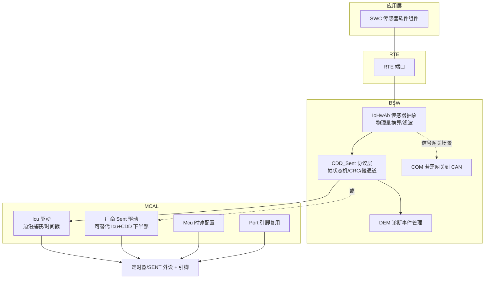

### 9.2 路径一：ICU 模块配置项清单（EB tresos / DaVinci 视角）

用 ICU 支撑 SENT 时，核心是把捕获通道配置成"下降沿 + 时间戳（Timestamp）测量模式"，让 ICU 驱动把每个边沿的计数值连续写入环形缓冲（或逐边沿回调）。关键配置项如下表（参数名遵循 AUTOSAR Icu 规范命名，工具中位于 IcuConfigSet/IcuChannel 容器下）：

| 配置容器/参数 | 推荐取值（SENT 场景） | 说明与理由 |
|---------------|----------------------|------------|
| IcuChannel / IcuChannelId | 每路 SENT 一个通道 | 逻辑通道号，CDD 按此引用 |
| IcuHwChannel（厂商参数） | 映射到 GPT/eMIOS/GTM 等具体捕获单元 | 必须选支持高频计数的定时器实例 |
| IcuDefaultStartEdge | ICU_FALLING_EDGE | SENT 只用下降沿 |
| IcuMeasurementMode | ICU_MODE_TIMESTAMP | 连续记录每个边沿的计数值，CDD 算差值；比 SIGNAL_MEASUREMENT（测单个周期/脉宽）更贴合 SENT 连续间隔流 |
| IcuTimestampMeasurement / BufferType | ICU_CIRCULAR_BUFFER | 环形缓冲连续捕获不停止 |
| IcuTimestampBufferSize | ≥ 2×一帧边沿数（如 16） | 容忍一次通知延迟不丢边沿 |
| IcuTimestampNotification + NotifyInterval | 每 1 个边沿通知（或 DMA 搬运后批量） | 逐边沿驱动协议状态机；高负载系统改用 DMA+周期批处理 |
| 时钟/分频（厂商参数，如 IcuPrescaler / 时钟树在 Mcu 模块） | 使定时器计数 ≥ 33 MHz（如 48/80 MHz） | 保证 <1% tick 的测量分辨率（见 7.3） |
| 数字滤波（厂商参数，如 InputFilter/FilterCounter） | 滤除 < 500 ns 毛刺 | 远小于 0.5 tick，不吃抖动预算 |
| IcuWakeupCapability | 一般关闭 | SENT 传感器不作唤醒源 |
| Port 模块：引脚复用/输入模式 | 复用到捕获功能，施密特输入使能 | 迟滞输入抑制缓边沿多次翻转 |

配置→生成→调用的典型代码路径：

```c
/* ============ MCAL 路径：Icu 配置生成物与 CDD 的衔接 ============ */
/* 由 EB tresos / DaVinci 生成：Icu_Cfg.h / Icu_PBcfg.c
 * 下面是 CDD_Sent 初始化与运行时对 Icu 标准 API 的调用序列 */

#include "Icu.h"
#include "Icu_Cfg.h"      /* 含 IcuConf_IcuChannel_SentCh0 等符号 */

Icu_ValueType sent_ts_buf[16];              /* 时间戳环形缓冲 */

void CddSent_Init(void)
{
    /* Icu_Init 由 EcuM 在启动阶段统一调用，此处仅做通道级启动 */
    Icu_StartTimestamp(IcuConf_IcuChannel_SentCh0,
                       sent_ts_buf,
                       16u,        /* BufferSize：环形缓冲深度   */
                       1u);        /* NotifyInterval：每边沿通知 */
    Icu_EnableNotification(IcuConf_IcuChannel_SentCh0);
}

/* 工具生成的通知回调原型（在 Icu 中断上下文被调用）*/
void CddSent_Ch0_TimestampNotify(void)
{
    /* 读取最新时间戳索引，取出捕获值，喂给第八章的协议状态机 */
    Icu_IndexType idx = Icu_GetTimestampIndex(IcuConf_IcuChannel_SentCh0);
    uint32_t cap = (uint32_t)sent_ts_buf[(idx + 15u) & 15u]; /* 最新一个 */
    icu_capture_isr(&g_sent_ch0, cap);
}
```

### 9.3 路径二：厂商专用 SENT 模块的配置项

若 MCU 带硬件 SENT 外设，厂商 MCAL 插件的配置容器通常覆盖以下条目（不同厂商命名有别，语义高度一致，可对照 7.7 节寄存器理解——每个配置项最终都落到某个寄存器位域）：

| 配置项 | 典型取值 | 对应硬件位域（参照 7.7） |
|--------|----------|--------------------------|
| 通道使能 / 通道号 | 按板级信号表 | SENTRX_CR.EN |
| 预期数据 nibble 数 | 3（12 位）或按器件 | SENTRX_CR.NIBCNT |
| 暂停脉冲支持 | 传感器带 Pause 则开 | SENTRX_CR.PPEN |
| 慢通道格式 | 短串行 / 增强串行 | SENTRX_CR.SCEN/SCFMT |
| CRC 口径 | legacy / recommended（是否含 Status） | SENTRX_CR.CRCEN + 变体位 |
| 输入滤波宽度 | < 0.5 tick | SENTRX_CR.FILTEN/FILTN |
| 参考时钟与分频 | 使 tick 测量分辨率 <1% | SENTRX_CR.PRESC + Mcu 时钟树 |
| 校准脉冲容差 | ±20%（标准）或收紧 | SENTRX_CR.SYNCTOL |
| 超时阈值 | ≥1.5×最大帧长 | SENTRX_WDG.WDGTH |
| 中断/DMA 选择 | 多通道选 DMA | SENTRX_CR.DMAEN + IER |
| 帧就绪/错误回调 | 挂 CDD 处理函数 | IER 各使能位 |

### 9.4 配置→生成→集成的完整工作流

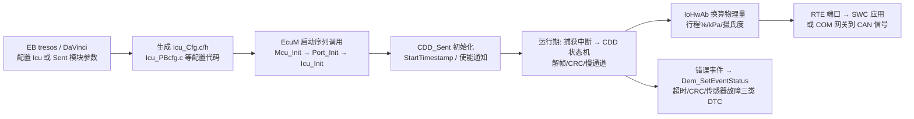

BSW 集成的两条数据流值得强调：**数值流**——CDD 解出的原始 12 位值在 IoHwAb 完成"原始值→物理量"换算（含标定斜率/偏移，来自 NvM 或标定常量），经 RTE 端口供 SWC 消费；若该信号还需上 CAN（如踏板位置广播给 ESP），则由 SWC 写入 COM 信号、按 COM 发送周期打包进 PDU——注意 SENT 帧率（2 kHz）通常远高于 CAN 信号周期（10 ms），中间要有明确的降采样/滤波策略而不是随机取样。**诊断流**——8.7 节的三类持续故障分别注册为独立 DEM 事件（如 `DemConf_DemEventParameter_SENT_CH0_TIMEOUT`），去抖参数（DebounceCounter）与故障成熟阈值在 DEM 配置中统一管理，避免 CDD 里散落魔法数字。

---

## 十、与 PWM / 模拟 / PSI5 的对比与选型

### 10.1 四种接口概览

| 维度 | 模拟电压 | PWM 占空比 | **SENT** | PSI5 |
|------|----------|------------|----------|------|
| 传输介质 | 单线 + 地（电压） | 单线 + 地（占空比） | 单线 + 地（时间） | 双线电流型（电源+数据叠加） |
| 是否需时钟线 | 否 | 否（需稳定测量时钟） | 否（每帧自同步） | 否（主机供电/触发） |
| 抗扰能力 | 弱（怕压降/共模） | 中 | 强（只数时间） | 强（电流型抗共模） |
| 典型分辨率 | ADC 决定（10~12 位） | 中（占空比量化有限） | 高（12 位级，可更高） | 高（10~16 位） |
| 校验能力 | 无 | 无 | 4 位 CRC + 滚码格式 | 有（校验/帧结构） |
| 一帧数据量 | 单量 | 单量 | 4~24 位 + 慢通道 | 多字节 |
| 成本 | 最低 | 低 | 低（接近 PWM） | 中（需电流接口/触发） |
| 双向能力 | 否 | 否 | SPC 触发式有限双向 | 可双向（触发+回传） |
| 适用场景 | 低成本非关键量 | 中速单量 | 高分辨点对点传感 | 高可靠（安全气囊/级联） |

### 10.2 选型建议

- **模拟电压**：最便宜但最脆，怕压降、怕噪声，需 ADC + 滤波 + 屏蔽线，长距离必衰。仅建议用于非安全、短距离、低成本量。
- **PWM 占空比**：抗扰比模拟好，但接收端测占空比需稳定时钟与定时窗口，且一帧只能传一个量，分辨率受限于定时精度。
- **SENT**：单线、定点高精度（12 位级）、强抗扰、可挂 CRC，成本和 PWM 接近却信息量更大，是"模拟升级、又不想上 CAN"的甜点方案，广泛用于踏板、压力、温度。
- **PSI5（Peripheral Sensor Interface 5）**：双线电流型接口，数据以电流调制叠加在供电上，抗扰极强、支持多传感器级联与同步触发，多用于安全气囊加速度传感器等高可靠场景，但成本与复杂度高于 SENT。

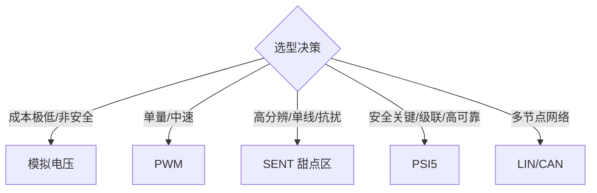

---

## 十一、典型应用场景

### 11.1 加速踏板位置传感器（APS）

电子节气门系统中，加速踏板位置常用双路冗余 SENT 传感器（两路信号呈比例或互补关系）上报踏板行程给发动机 ECU/整车控制器。SENT 的高分辨率让踏板行程细分到毫级，强抗扰保证在发动机舱电磁环境下读数稳定；双路 SENT 配合 H.4 格式的安全计数器与 MSN 取反，可做一致性与完整性双重校验，满足功能安全要求。

### 11.2 制动踏板行程传感器

制动踏板行程是制动能量回收与 ESC 的关键输入。用 SENT 上报行程，配合时间戳（8.6 节）与多传感器同步，可与轮速、主缸压力在时间轴上对齐，提升制动控制精度。冗余设计下，两路 SENT 信号差异超阈值即触发故障诊断。

### 11.3 压力传感器（涡轮增压压力、油压、尿素压力）

涡轮增压进气压、共轨油压、DPF 压差等压力量变化快、精度要求高。SENT 的 12 位分辨率与强抗扰特性非常适合，且可借慢通道顺带上报传感器温度，用于温度补偿与过温保护。

### 11.4 温度传感（慢通道承载）

温度作为慢变量，由 SENT 慢通道串行消息承载，无需额外线。发动机油温、进气温度、电池包温度采样点众多时，SENT 的"快+慢"复用显著节约线束成本。

---

## 十二、SENT 时序预算与 EMC / PCB 布局要点

### 12.1 信号边沿与上升时间

SENT 接收端识别的是**下降沿**，因此真正影响解码的是下降沿的抖动与识别阈值稳定性。但发射端通过上拉电阻把信号拉回高电平，上升时间 `t_r ≈ 2.2 × R_pullup × C_load`。若上拉过大，上升沿过缓，比较器在阈值附近停留时间长，容易受噪声扰动产生多次翻转（毛刺）；若上拉过小，发射端灌电流能力不足，低电平拉不深，也会让边沿识别不稳。

工程经验：按器件手册给出的上升时间上限（常见要求上升时间受控且不产生振铃）反推上拉阻值，并在样机上用示波器实测边沿，确认无振铃、无缓坡。J2716 对发送端下降沿斜率也有约束（限制 EMI 辐射），器件通常内置斜率控制。

### 12.2 时序预算：最大允许抖动与容差窗口

设 tick = 3 µs，则相邻 nibble 判决边界间隔为 3 µs。若某次下降沿因干扰抖动 ±1.5 µs，恰好落在边界附近则可能被归到相邻整数，造成一位错误。因此时序预算要算：

```
单 tick 判决容限 = ±(T_tick / 2) ≈ ±1.5 µs（理论最大无错抖动）
预算分配示例：滤波延迟不确定性 0.2 µs + 发送端抖动 0.5 µs
             + 接收量化 0.05 µs + 裕量 → 总和必须 < 1.5 µs
```

这意味着：**各环节抖动之和必须小于半个 tick**，否则需降低通信速率（增大 tick）或加强滤波。在发动机舱极端工况下，常通过硬件施密特触发输入 + 数字滤波 + 软件容差共同保障。

### 12.3 PCB 与线束布局

- **远离噪声源**：SENT 信号线尽量远离点火线圈、喷油器、电机三相线，避免平行长距离走线；
- **地平面完整**：提供低阻抗回流路径，降低共模噪声；
- **上拉电阻靠近 ECU 端**：缩短上拉到 MCU 输入脚的残段，减少 stub 天线效应；
- **连接器与屏蔽**：对特别恶劣的节点可选用屏蔽线或双绞线（其一端接地），进一步抑制辐射耦合；
- **去耦**：传感器侧与 ECU 侧电源都要有本地去耦电容，稳定比较器供电。

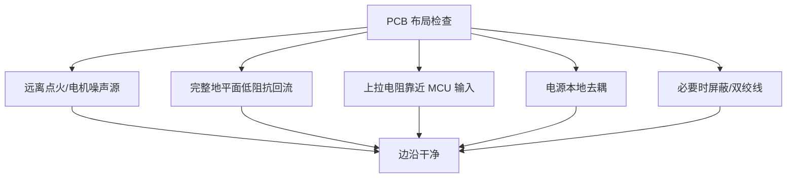

---

## 十三、功能安全视角下的 SENT：诊断覆盖率与冗余设计

### 13.1 单点故障与诊断覆盖率

在 ISO 26262 功能安全语境下，SENT 常用于 QM~ASIL B 级别的传感器（更高 ASIL 通常需冗余）。SENT 自带的诊断能力包括：

- **4 位 CRC**：可检测 nibble 级单位/多位错误，提供传输层诊断；
- **Status 错误标志位**：传感器可上报内部故障（如超出量程、温度超限、自检失败）；
- **H.4 格式滚码 + MSN 取反**：检测丢帧/重复帧/卡值（stuck-at）；
- **校准脉冲连续性检查**：相邻帧 Sync 宽度突变检测时钟类故障；
- **超时看门狗**：断线/卡电平检测（7.5、8.7 节）。

这些机制共同贡献诊断覆盖率（Diagnostic Coverage），使系统能及时发现并隔离故障，满足对应 ASIL 等级的潜伏故障探测要求。

### 13.2 双路冗余 SENT

对制动踏板、转向角等关键量，常采用**双路冗余 SENT 传感器**（两路信号呈比例或互补关系，分别由独立 MCU 定时器捕获，最好挂不同定时器实例与中断优先级以减少共因失效）。ECU 比较两路一致性（8.6 节 `pedal_plausibility`）：差异超阈值即进入安全状态（如跛行模式）。冗余设计把单点 SENT 失效转化为可探测的"两路不一致"，显著提升可用性。

### 13.3 时间戳对功能安全的增益

时间戳与多传感器同步使多路信号可在同一时间基准上对齐，便于 ECU 做跨传感器一致性校验与故障注入检测；慢通道串行消息还能承载传感器自检结果与序列号，支撑全生命周期诊断。

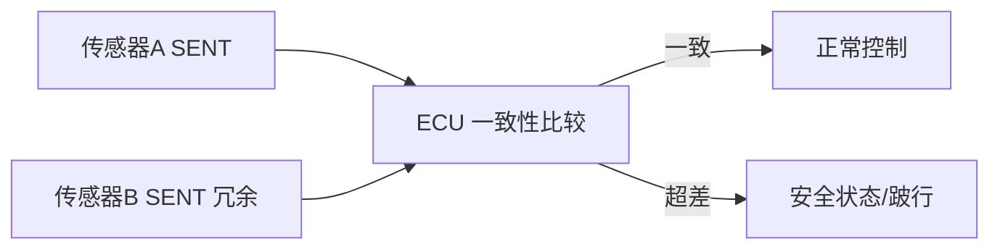

---

## 十四、一个完整的逐帧解码工作示例（数值推演）

下面用一组假设的实测 tick 序列，演示从原始边沿到主数据的完整还原过程。假设 tick 标称 3 µs，采用 3 数据 nibble 帧，捕获计数器频率 48 MHz（每计数 = 20.833 ns）。

**实测相邻下降沿间隔（µs 与换算 tick）：**

| 序号 | 间隔(µs) | 换算 tick（÷3µs） | 判定 |
|------|----------|-------------------|------|
| 1 | 168.0 | 56.0 | Sync 段（反推 tick=3µs，cnt_per_tick=144） |
| 2 | 45.0 | 15.0 | Status nibble = 15−12 = 3（bit0=1? 否：0b0011→bit0/bit1 置位） |
| 3 | 51.0 | 17.0 | Data1 nibble = 17−12 = 5 |
| 4 | 60.0 | 20.0 | Data2 nibble = 20−12 = 8 |
| 5 | 39.0 | 13.0 | Data3 nibble = 13−12 = 1 |
| 6 | 48.0 | 16.0 | CRC nibble = 16−12 = 4 |
| 7 | ≥ 数倍 tick | 长 | Pause（帧结束）或直接下一个 Sync |

**还原过程：**

1. 第 1 间隔 56 tick → 识别为 Sync，本帧 `tick = 168µs / 56 = 3µs`，捕获计数意义上 `cnt_per_tick = 144`；
2. Status = 3（0b0011：bit0、bit1 置位——需按器件手册解读应用状态；bit2=0、bit3=0，本帧对慢通道无贡献）；
3. Data = [5, 8, 1]，CRC 接收值 = 4；按 8.4 节查表算法对 [5,8,1] 计算，若得 4 → 帧有效；
4. 主数据 `Value = 5<<8 | 8<<4 | 1 = 0x581 = 1409`；
5. 若主值映射为 0~4095 对应 0~100%（行程），则 `1409/4095 ≈ 34.4%`。

这个示例说明：只要 tick 测量准确、容差合理，SENT 解码是高度确定且可逐帧验证的过程。调试时把这类"间隔→tick→nibble"表格直接打印出来，是定位异常最快的方法。

---

## 十五、常见坑与调试手段

### 15.1 坑一：tick 基准时钟精度直接决定测量精度

SENT 的分辨率来自"数 tick 数"，若传感器内部时钟本身温漂大，即使解码再准，绝对精度也上不去。选型时确认器件时钟源（内部 trimmed RC 还是外部晶振），并在高低温下实测漂移。接收端同理：捕获定时器必须挂在恒频时钟上（见 7.3/7.8 节），低功耗动态调频会毁掉在途测量。

### 15.2 坑二：下降沿抖动导致 nibble 误判

发动机舱内点火干扰会让边沿抖动几个微秒，正好跨过某个 nibble 边界（如 26→27 tick）就错一位。调试手段：用示波器/逻辑分析仪抓信号线，量每个间隔的 tick 数分布；硬件上开数字滤波与施密特输入，软件上做好四舍五入归整并拒收越界值。

### 15.3 坑三：Sync 检测阈值过严导致丢帧

若把 Sync 判据卡死成"恰好 56 tick"，传感器时钟一漂就再也同步不上。应按标准留 ±20% 窗口，并在失步后强制等待下一个校准候选重新建同步（8.3 节"任何状态先查 Sync"）。

### 15.4 坑四：慢通道机制理解错

最典型的错误是把慢通道理解成"Pause 长度编码温度"，结果永远读不到温度。正确机制是 Status nibble 的 bit2/bit3 跨 16/18 帧串行传输（第四章）。次典型错误是快帧 CRC 失败后不作废慢通道累积，导致串位产生"看似合法"的错误慢消息（8.5 节）。

### 15.5 坑五：CRC 算法口径与器件不匹配

CRC4 的"末尾附加零处理"、覆盖范围是否含 Status nibble（legacy vs recommended 口径），不同器件可能不同。移植时务必抓一帧已知数据，比对 CRC 字段反推算法参数。

### 15.6 坑六：上拉/电平标准不符

SENT 信号通常是开漏/推挽受限驱动加外部上拉（如 5V 上拉），低电平有效。若上拉电阻过大，上升沿变缓，可能误判边沿；若过小，功耗与驱动能力受限。要按器件手册的上升时间要求选上拉阻值。

### 15.7 坑七：中断负载与多通道扩展

纯软件方案下每个下降沿一次中断，2 kHz 帧率 × 每帧约 7 个边沿 ≈ 14 k 中断/秒/通道；8 通道就是 11 万+中断/秒，足以拖垮中等主频 MCU。对策：优先选带硬件 SENT 外设的 MCU；退而求其次用 DMA 搬运时间戳后周期批处理（9.2 节）；再不行就降低通道数或用外置 SENT 转 SPI 桥接芯片。

### 15.8 调试手段总结

- **逻辑分析仪 + SENT 解码插件**：最直观，可直接看到每个 nibble 值、Sync、CRC、慢通道消息；
- **示波器量相邻下降沿间距**：反算 tick，验证时钟是否符合预期；
- **对比数据手册时序图**：逐段核对 Sync 宽度、nibble 范围、Pause 长度；
- **在 MCU 端打印原始 tick 序列**：用串口把每个间隔的 tick 数输出，肉眼/脚本分析分布，快速定位抖动与丢帧；
- **录制边沿序列做离线回归**：把捕获计数流存下来，在 PC 上喂给同一套协议层代码（8.2 节的分层价值），复现现场问题。

### 15.9 SENT 的局限与不适用场景

任何接口都有边界，SENT 亦然，需避免误用：

- **不适合多节点组网**：SENT 是点对点单线接口，一条线通常连一个传感器；多传感器需各自独立线或借 SPC 分时，无法像 CAN/LIN 那样共享总线。节点数多时线束反而膨胀。
- **不适合高 ASIL 单点信号**：经典 SENT 缺乏端到端冗余，单独用于制动/转向等最高安全等级信号不够，需配合双路冗余或升级到 PSI5/DSI3。
- **不适合极高速信号**：受 tick 与帧结构限制，帧率上限约数 kHz，无法承载音频级或高频振动原始波形。
- **对时钟源敏感**：绝对精度受制于传感器时钟，廉价 RC 器件在高温下漂移明显，高精度场合须选晶振基准或做温补。

明确这些边界，才能在"该用 SENT 的地方用对、在不该用的地方及时换方案"。

---

## 十六、SENT 在新能源汽车与电池管理系统中的延伸应用

### 16.1 电池包温度与压力监测

动力电池包内部分布大量温度与压力测点。用 SENT 的"快通道测压力/主值 + 慢通道测温度"模式，可用极少线束把多个测点的数据汇聚到 BMS 从控或主控。慢通道串行消息还能上报传感器序列号与自检状态，支撑产线追溯与故障诊断。

### 16.2 与 BMS 的接口形态

在分布式 BMS 中，从控板（采集板）就近读取电芯电压/温度，并通过 SENT 把汇总后的关键量上报给主控；或在采样芯片与 MCU 之间，SENT 作为片间高分辨接口，避免模拟长线引入的共模误差。对成本敏感的平台，SENT 是 CAN/LIN 之外极具性价比的补充。

### 16.3 充电与热管理中的 SENT

充电接口温度、热管理水路的压力/温度传感器同样适合 SENT：强电磁环境（大功率变换器附近）下，SENT 的时间编码抗扰特性保证读数稳定，且单线布线简化连接器引脚，降低密封与成本压力。

---

## 十七、SENT 协议版本演进与配置参数空间

### 17.1 SAE J2716 历次修订要点

SAE J2716 自 2007 年首次发布以来历经多次修订（2008、2010、2016 等），核心机制（tick、nibble 映射、Sync、CRC、Pause）保持稳定，增强主要体现在：系统化慢通道增强串行消息（8 位 ID / 更大载荷 / 6 位 CRC）、规范附录 H 快通道格式族与消息 ID 分配、细化 CRC 算法描述与容差/连续性检查建议。笔者在选型时强调：**务必以传感器器件手册引用的具体修订版本为准**，因为不同年份器件的慢通道编码细节可能存在差异，跨版本混用会读不到温度或丢帧。

### 17.2 可配置参数空间

一个 SENT 系统落地前，需在传感器与 ECU 两侧约定一致的"配置参数空间"：

- **tick 长度**：典型 3 µs，可在 3~10 µs 区间按器件能力选择；增大 tick 降低对时钟精度要求、提升抗抖动能力，但降低帧率。
- **数据 nibble 数与快通道格式**：1~6 nibble，H.1~H.7 格式族之一；12 位（H.2）最常用，安全场合选 H.4。
- **Pause 模式**：是否启用暂停脉冲/恒定帧周期。
- **慢通道格式与消息 ID 表**：短串行或增强串行；各 ID 的物理含义与换算公式。
- **CRC 口径**：多项式固定，但覆盖范围（是否含 Status）与实现口径必须与器件一致（见 8.4 节）。
- **容差窗口与超时阈值**：Sync ±20% 起步，按系统抖动预算收紧；超时 ≥1.5×最大帧长。

把这些参数固化进 ECU 的 SENT 驱动配置结构体（或 MCAL 配置容器，见第九章），并在产线写入校准值，可保证批量一致性。

### 17.3 与 SPC / DSI3 的边界

SENT 常与另外两类接口被并列讨论，需明确边界：

- **SPC（Short PWM Code）**：SENT 的触发式扩展，主机在信号线上发宽度编码的触发脉冲，传感器应答 SENT 帧，支持多传感器分时共线与同步采样，常用于磁性位置传感器。
- **DSI3（Distributed System Interface 3）**：面向气囊等安全应用的双向电流接口，支持总线型多传感器、严格同步与高诊断覆盖率，复杂度与成本高于 SENT。

笔者的经验法则：**点对点高分辨传感选 SENT；需要主机触发同步的磁传感选 SPC；安全气囊级联高可靠选 DSI3**。三者并非替代关系，而是按 ASIL 与拓扑分工。

### 17.4 工程验收 checklist

落地一个 SENT 接口，建议按以下清单逐项验收：

1. 高低温下实测 tick 漂移，确认绝对精度达标；
2. 示波器抓取真实帧，逐段核对 Sync 宽度、nibble 范围、Pause 长度；
3. 注入电磁干扰（如近场辐射、BCI），确认边沿抖动下无 nibble 跨边界误判；
4. 验证 CRC 算法与器件一致（用已知帧反推，含慢通道 CRC）；
5. 确认慢通道温度能正确解析，且快帧 CRC 错时慢通道不串位；
6. 做丢线/对地对电源短路故障注入，确认超时检测生效并进入安全状态；
7. 冗余双路 SENT 做一致性比较测试，确认超差判定与时间对齐有效；
8. 多通道满负载下实测 CPU 中断负载与最坏响应延迟，确认无丢边沿。

完成上述验收，SENT 接口方可认为达到车载量产的稳健性要求。

---

## 十八、面试高频要点精选（20 道含要点）

以下题目覆盖协议原理、帧结构、芯片实现、驱动与 MCAL，适合技术面试与自测。

1. **SENT 怎么同步？**
   答：固定 56-tick 的校准脉冲，接收方测其宽度算出本帧 tick 周期；每帧重新标定，抗时钟漂移，标准允许约 ±20% 窗口。

2. **为什么用"时间间隔"而不是电压幅值编码？**
   答：时间测量抗电源噪声/共模干扰远强于幅值比较，适合发动机舱等恶劣电磁环境；精度高且布线简单。

3. **一个 nibble 怎么表示 0~15？**
   答：相邻下降沿间隔 = 12 + nibble 值（tick 数），即 12~27 tick 映射到 0~15。

4. **为什么选下降沿而不是上升沿？**
   答：开漏+上拉的驱动结构下，下降沿由晶体管主动拉低、陡峭确定；上升沿靠 RC 充电、缓慢且受负载影响。用最陡的沿做时间基准。

5. **一帧能传多少数据？H.1/H.4 格式是什么？**
   答：1~6 个数据 nibble（4~24 位）。H.1 为双 12 位快通道；H.4 为 12 位数据 + 8 位安全滚码 + MSN 取反，用于功能安全。

6. **4 位 CRC 的多项式和种子？覆盖范围？**
   答：多项式 x⁴+x³+x²+1，种子 0b0101，查表法按 nibble 迭代且末尾补零处理；经典口径覆盖全部数据 nibble（不含 Status），部分器件口径不同需实测确认。

7. **SENT 是差分还是单端？需要时钟线吗？**
   答：单端单线（加电源地，三线制），无需独立时钟线，接收端用校准脉冲自同步。

8. **慢通道数据藏在哪里？**
   答：藏在每个快帧 Status nibble 的 bit2（数据）与 bit3（起始/格式标志）里，短串行消息跨 16 帧凑出 4 位 ID + 8 位数据 + 4 位 CRC；增强串行跨 18 帧，6 位 CRC，载荷更大。不是"Pause 长度编码"。

9. **快帧 CRC 错了，慢通道要不要处理？**
   答：必须作废当前累积的慢通道消息，否则比特串位会拼出看似合法的错误消息——静默数据损坏。

10. **tick 漂移会如何影响精度？**
    答：慢漂移被每帧 Sync 抵消；但单帧内所有 nibble 共享同一偏差，绝对精度受传感器时钟源质量限制。

11. **接收端如何测量 tick？为什么定时器要自由运行？**
    答：输入捕获记录下降沿计数值，相邻捕获差除以计数频率得时长，再用 Sync 反推 tick。自由运行+差值法天然容忍计数器回绕，且不丢计数。

12. **为什么 SENT 捕获需要独立高精度时钟？**
    答：nibble 判决栅格只有 ±0.5 tick 容限，测量分辨率需 <1% tick（tick=3µs 时计数时钟 ≥33 MHz）；且时钟必须恒频，不能随系统调频，否则在途测量作废。

13. **硬件 SENT IP 里 FIFO 的作用？**
    答：解耦帧到达节拍与 CPU 响应延迟，容忍 CPU 短暂忙碌不丢帧；多通道时配合 DMA 把逐帧中断降为批处理。

14. **AUTOSAR 里 SENT 用哪个 MCAL 模块？**
    答：无标准 SENT 模块。通用方案是 ICU（Timestamp 模式、下降沿、环形缓冲）+ CDD 协议层；带硬件 SENT 外设的 MCU 用厂商扩展驱动。信号经 IoHwAb→RTE 给 SWC，故障经 DEM。

15. **ICU 配置成 SIGNAL_MEASUREMENT 还是 TIMESTAMP 模式？**
    答：TIMESTAMP。SENT 是连续间隔流，需要每个边沿的时间戳序列；SIGNAL_MEASUREMENT 只测单个周期/脉宽，不适合。

16. **SENT 与 PWM 占空比传感的本质区别？**
    答：PWM 一帧一量、测占空比依赖稳定测量时钟；SENT 用间隔编码多 nibble、分辨率更高、带 CRC 与慢通道复用。

17. **SENT 与 PSI5/SPC/DSI3 怎么选？**
    答：点对点高分辨低成本选 SENT；主机触发同步的磁传感选 SPC；气囊级联高可靠选 PSI5/DSI3。按 ASIL 与拓扑分工。

18. **CRC 校验失败通常说明什么？**
    答：电磁干扰致 nibble 误判、边沿抖动跨边界、或同步错位；偶发丢帧容忍，持续超阈上报 DEM 并检查布线与容差。

19. **SENT 帧率大概多少？受什么影响？**
    答：典型 1~4 kHz；受 nibble 数、数据内容（间隔随数值变化）、Pause 长度影响。恒定帧周期模式用 Pause 补齐。

20. **软件解码 8 路 SENT，中断负载怎么估？怎么降？**
    答：每帧约 7 边沿 × 2 kHz × 8 路 ≈ 11 万中断/秒。对策：硬件 SENT 外设、DMA 时间戳批处理、或外置桥接芯片。

---

## 十九、小结

SENT（SAE J2716）以"用时间间隔编码数据"的极简哲学，在汽车传感器接口谱系中占据着低成本、高分辨率、强抗扰的甜点位置。它用单根信号线、无需时钟线，借助每帧校准脉冲自同步与多 nibble 级联，实现了 12 位级精度；快通道传主值、慢通道借 Status nibble 的 bit2/bit3 跨帧串行传温度等慢变量，时间复用节约线束；附录 H 格式族与滚码/取反机制支撑功能安全场景。

从工程落地看，本文给出了三层完整视图：**芯片层**——SENT 接收本质是一个"带协议后处理的增强型输入捕获定时器"，独立高精度时钟、两级同步+数字滤波、自由运行计数器差值测量、硬件 CRC 与 FIFO/DMA 是其设计要点，寄存器位域围绕"使能/滤波/分频/帧格式/慢通道/容差/看门狗"组织；**驱动层**——以"任何状态先查 Sync"的自恢复状态机为核心，定点 tick 换算、查表 CRC4、以合法快帧为节拍的慢通道第二状态机、锁存滞后补偿的时间戳，构成一套可离线回归测试的协议实现；**配置层**——AUTOSAR 下用 ICU Timestamp 模式 + CDD 或厂商 SENT 驱动支撑，配置项最终一一落到硬件位域，数值流经 IoHwAb/RTE 交付应用、诊断流经 DEM 统一管理。

在实际工程中，真正的精度上限在传感器时钟源，稳定的解码依赖合理的容差窗口、正确的慢通道节拍处理、完备的超时与错误升级策略，以及贯穿高低温、EMC、故障注入的验收流程。理解 tick 机制、帧结构、CRC、IP 架构、驱动状态机与 MCAL 集成这条完整链路，是每一位汽车电子工程师把 SENT"用对、用稳、用到量产"的必修课。
